# StarshipGo

A first-person exploration game set inside the interior of a starship. **Blender** (headless, via the `bpy` module) procedurally
generates the **1000-model component library**, the stair flights and the hull fittings, plus their textures; a **bill-of-materials driven
layout generator** furnishes every room of a tapered, streamlined three-deck hull; **Godot 4** builds it and lets you walk it:
sliding doors, **stairs between the decks**, ~170 real-time lights, reflections, a planet outside the windows, ambient sound and a deck map.
No people, just the ship.

| | |
|---|---|
|  |  |
|  | 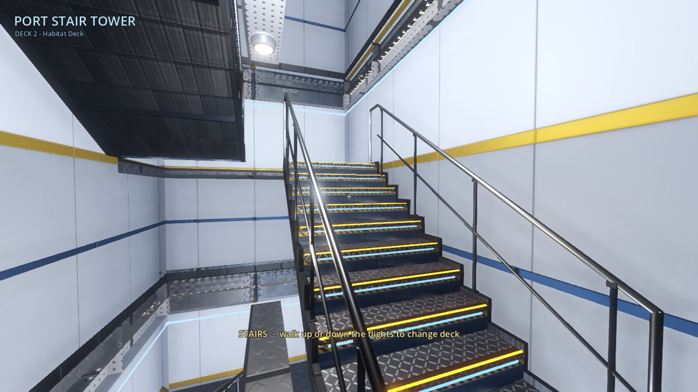 |
|  |  |

## Quick start

```bash
# 1. (optional) regenerate the assets - the latest headless Blender needs Python 3.13:
pip install -r requirements-blender.txt                 # bpy 5.2 + numpy
python blender/build_all.py --out godot                 # 1000 GLBs + textures + data/catalog.json (~25 s on 4 cores)
python blender/build_arch.py --out godot                # stair flights, guard, sign, hull fascia + hull plating textures
python tools/layout/generate_ship.py                    # furnish the ship from its bills of materials: godot/data/ship.json
python tools/layout/bom.py                              # docs/BOM.md + docs/bom/*.csv
python tools/draft/draft.py --out docs/drafts           # 148 plan / section sheets (add --png for raster copies)

# 2. play (Godot 4.7)
godot --path godot --import                             # first run only: import the GLBs
godot --path godot
```

The generated GLBs, textures, `ship.json`, BOM and drawings are committed, so opening `godot/` in the editor is enough.

**Controls** - `WASD` move, `Shift` sprint, mouse look, `F` flashlight, `M` deck map, `H` help, `Esc` release the mouse.
There are no lifts any more: walk into one of the two **stair towers** at mid-ship and climb the flights to change deck.

## What changed in this version

| | before | now |
|---|---|---|
| Hull | rectangular boxes, 102 x 36 m | **tapered, streamlined hull**, 66 x 26 m, terraced decks (bridge overhangs the bow, hangar on a stern platform) |
| Between decks | 6 turbolift cars that teleport | **2 dog-leg stair towers**, 22 risers of 181.8 mm per deck, real colliders, slab holes |
| Furnishing | random "garnish" until a density target was met: 6,679 props | **bill-of-materials driven**: 1,400 props, each in a documented BOM line with a reason |
| Documentation of the design | none | [`docs/BOM.md`](docs/BOM.md) (5,700 lines), [148 drawings](docs/drafts/INDEX.md), [design notes](docs/DESIGN.md) |
| Layout quality gate | 14 weak tests | 29-rule [audit](tools/layout/audit.py): the old layout has **2,657 errors**, the new one **0** |
| Frame cost | ~17,950 draw calls, 16,580 nodes | **~355 draw calls, 3,512 nodes** ([measured](#performance)) |
| Defects | - | **113 audited defects, 112 fixed** ([ledger](docs/BUGS.md)) |

## The ship

Three decks, 43 rooms (30 furnished rooms + corridors, lobbies and stair towers), 26 sliding doors, open arches between rooms,
two stair towers and a hangar with a force-field mouth. Everything is placed on purpose:

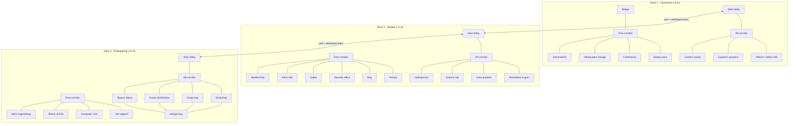

| Deck 1 | Deck 2 | Deck 3 |
|---|---|---|
|  |  |  |


### A tour

| | |
|---|---|
| 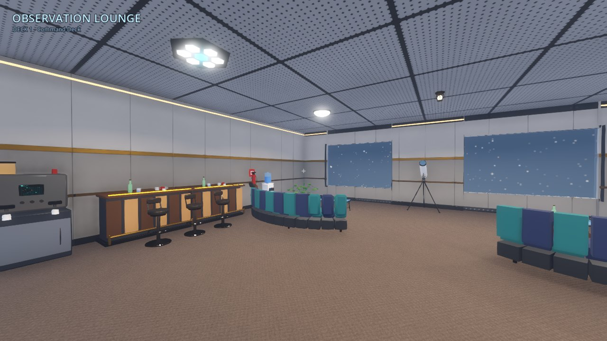 | 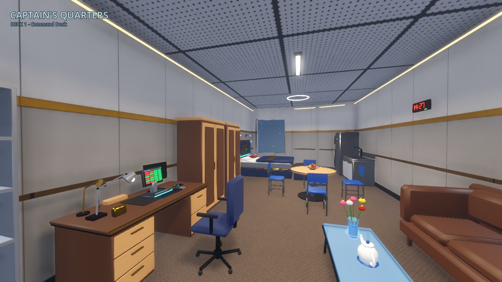 |
| 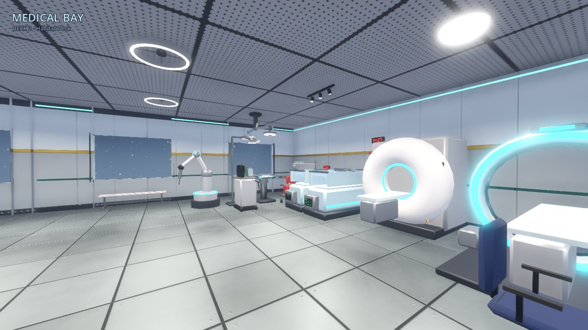 | 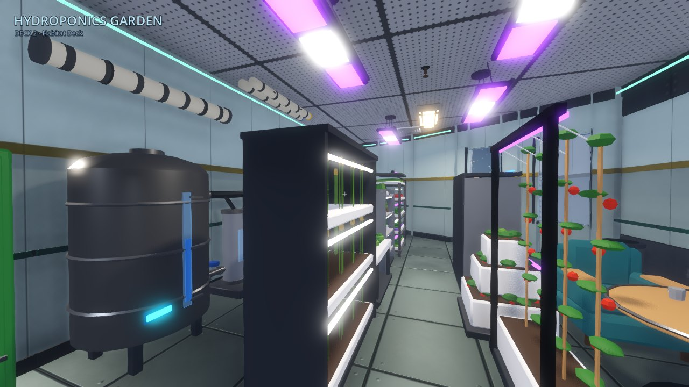 |
|  | 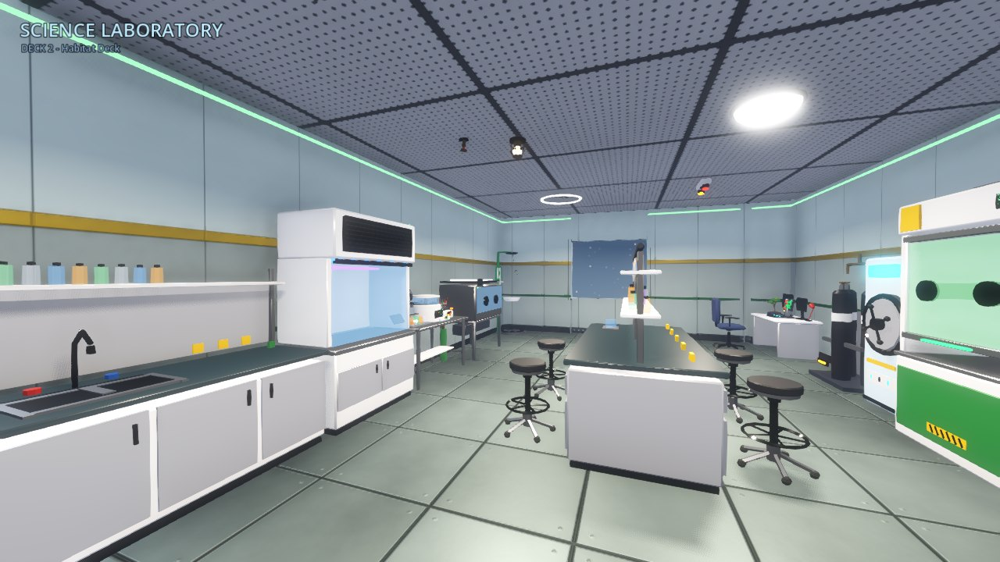 |
| 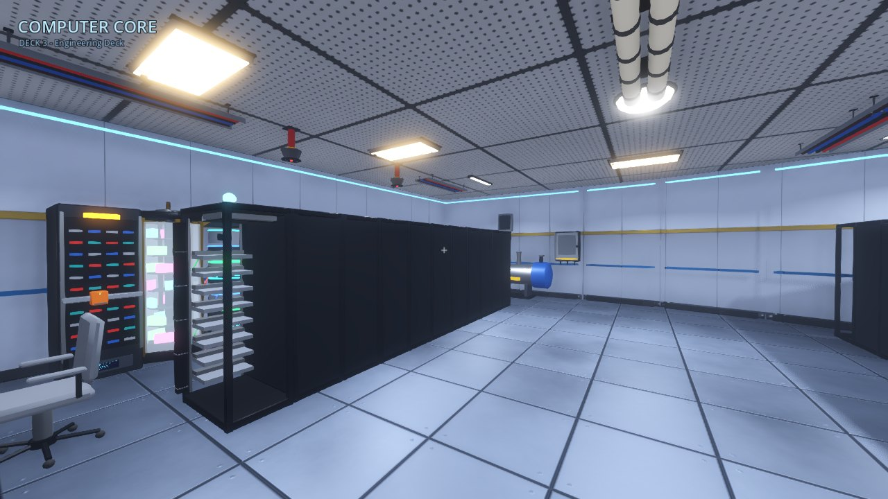 | 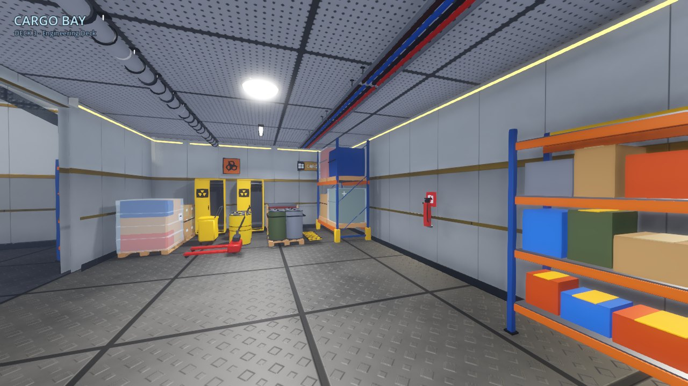 |
| 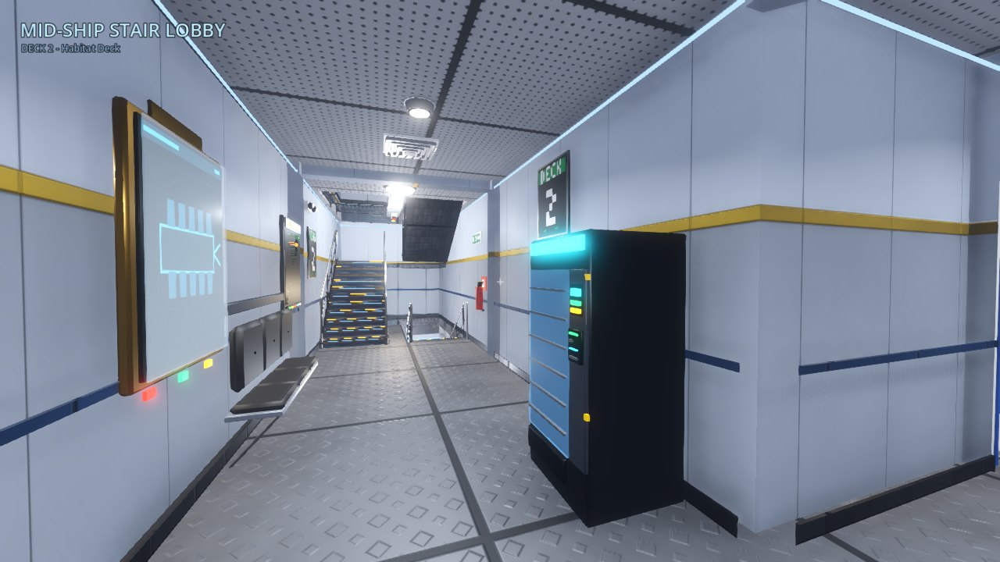 |  |

## Design

The long version is in [`docs/DESIGN.md`](docs/DESIGN.md); the drawings in [`docs/drafts`](docs/drafts/INDEX.md).

* **Hull lines.** One closed convex outline per deck built from a half-breadth curve (`tools/layout/hull.py`): an elliptical-sine bow tangent to a
  26 m parallel mid-body, then a rounded counter to a narrow transom. Rooms are drafted on a rectangular grid and **clipped by the hull**, so
  mid-ship rooms stay rectangular while bow and stern rooms get diagonal walls and hull-facet windows.
* **Stairs.** 4.0 m floor to floor = 22 risers of 181.8 mm with a 280 mm going, two 1.4 m flights and a mid-landing per deck pair, stacked in a port and a
  starboard tower beside the mid-ship lobby. The slabs have matching holes; the flights are Blender models with ramp colliders.
  `godot/tests/stair_test.gd` walks deck 3 -> 1 -> 3 on both towers.
* **Every item has a reason.** A room recipe writes a design brief (`R.describe`) and BOM lines (`R.line(title, why)`); `policy.py` lists the
  equipment families allowed in each room; `audit.py` refuses overlaps, blocked windows and doors, floating or buried items, wall equipment inside
  furniture, wrong-department equipment, unreachable floor, lines without props ...

| | |
|---|---|
| 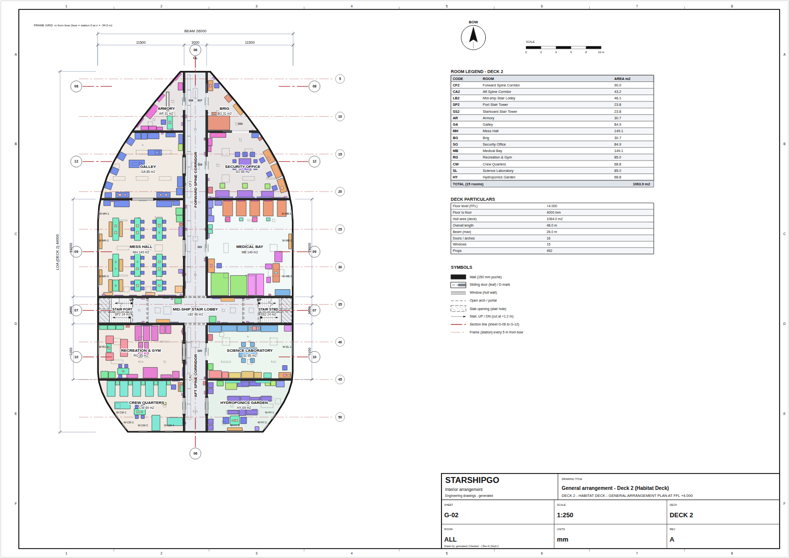 | 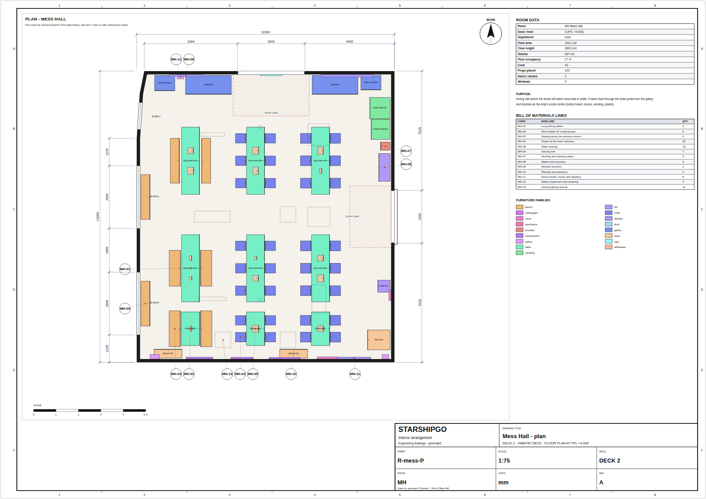 |
| 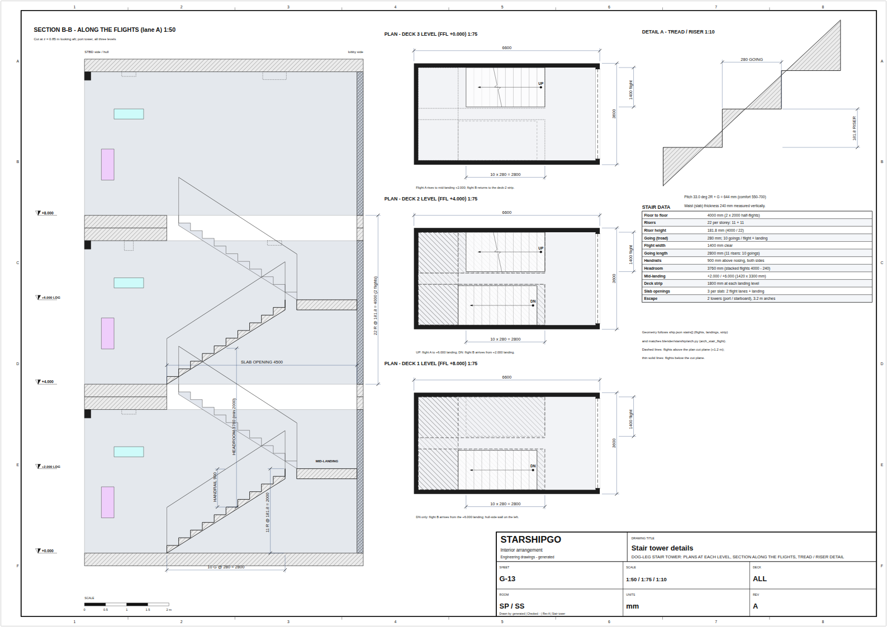 | 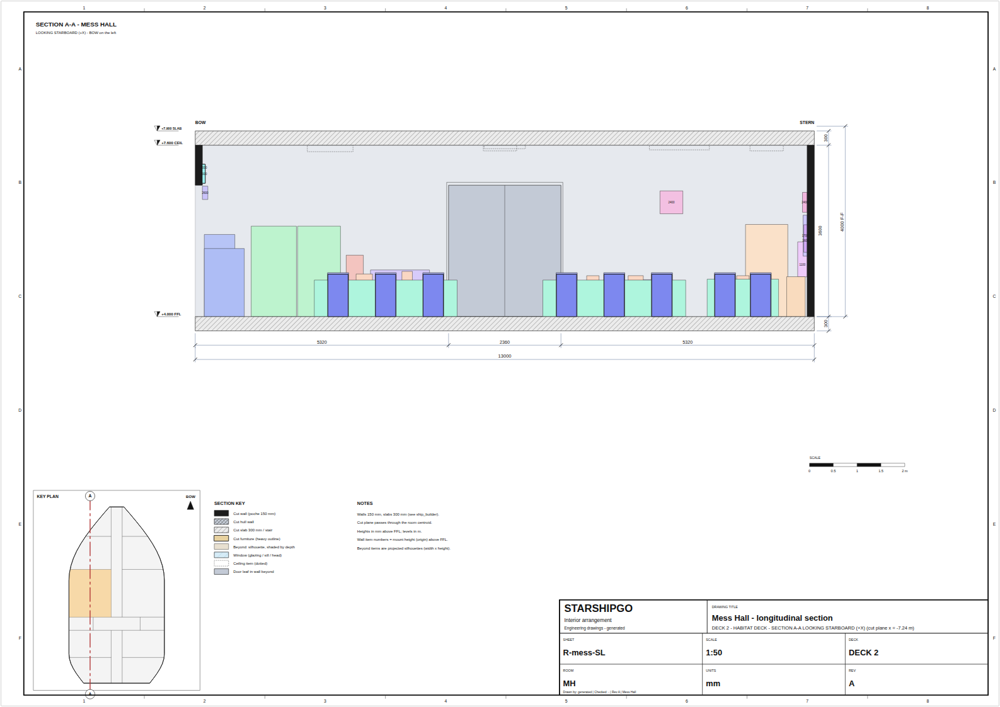 |

## Pipeline

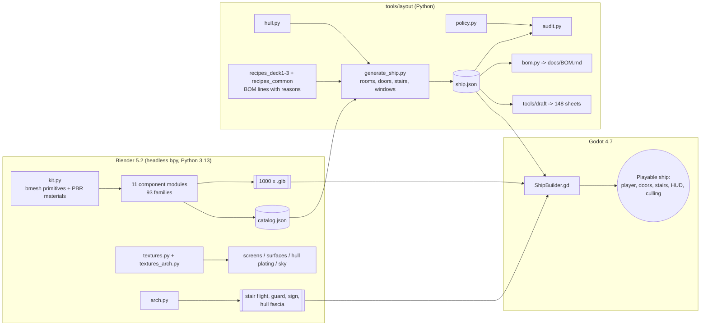

* `blender/starship/kit.py` - modelling kit; `components/*.py` - the 1000 models; `arch.py` - architectural assets (see [`blender/ARCH.md`](blender/ARCH.md)).
* `tools/layout/` - hull, layout engine (`shiplib.py`), recipes, policy, audit, BOM generator. `tools/draft/` - the drawing generator. `tools/docs/` - the bug ledger.
* `godot/scripts/` - `ship_builder.gd` (mitred polygon walls, slab holes, hull plating, stairs, MultiMesh batching, room culling, occluders),
  `player.gd`, `door.gd`, `hud.gd`, `deck_map.gd`, `bench.gd`.

## Performance

The ship is half the size with a quarter of the props, props are batched into one MultiMesh per (room, model mesh), only the current room and its
neighbours draw their contents, walls and slabs act as occluders, at most 2-3 shadow-casting lights per room, no shadows from props under 0.6 m, and
the expensive post effects are behind `--hq`.

Measured with the built-in flythrough benchmark over the 25 interior tour cameras (software Vulkan / llvmpipe at 960 x 540 - a CPU rasteriser, so the
absolute times are slow, but it is the same machine and workload for both columns):

| Mean over the tour | original | now | change |
|---|---|---|---|
| Draw calls per frame | 17,950 | 355 | 51x fewer |
| Objects per frame | 34,955 | 426 | 82x fewer |
| Primitives per frame | 2,387,619 | 43,292 | 55x fewer |
| Frame time (llvmpipe) | 2,542 ms | 245 ms | 10x faster |
| Scene nodes | 16,580 | 3,512 | 5x fewer |
| Static memory | 332 MB | 163 MB | |
| Load time | 4,484 ms | 1,883 ms | |

```bash
godot --path godot --rendering-driver vulkan --resolution 960x540 -- --bench=/tmp/bench.json --no-probes
godot --path godot -- --hq          # volumetric fog, 4x MSAA and full SSAO (the old look, at the old cost)
```

CI runs the benchmark and fails if the mean draw calls or primitives regress past a guard (renderer independent numbers).

## Bill of materials, drawings, bugs

* [`docs/BOM.md`](docs/BOM.md) - one chapter per room: design brief, openings, every BOM line with *why* it is there, every model with family, size and function;
  totals by family, escape distances, index of models. CSV: [`docs/bom/bill_of_materials.csv`](docs/bom/bill_of_materials.csv).
* [`docs/drafts/INDEX.md`](docs/drafts/INDEX.md) - 148 A3 sheets: deck general arrangements, hull lines, profile, centreline and transverse sections, stair details,
  escape diagram, door/window schedule, and plan + 2 sections of every room.
* [`docs/BUGS.md`](docs/BUGS.md) - the 113 audited defects of the original game (file, lines, evidence) and how each was resolved, plus the layout audit of the old ship.

## Testing and CI

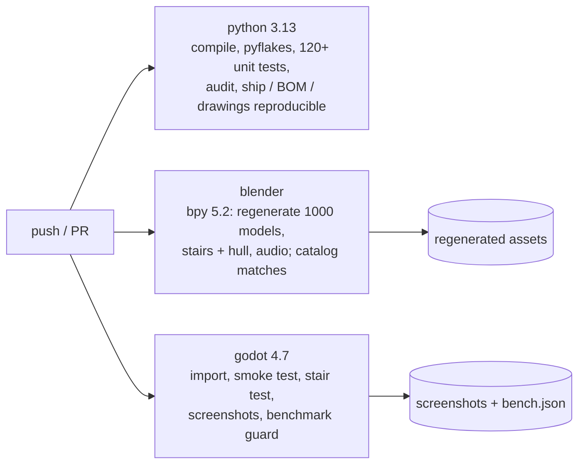

Local checks: `python -m unittest discover -s tests -v`, `python tools/layout/audit.py --summary`,
`godot --headless --path godot -s res://tests/smoke_test.gd`, `godot --headless --path godot -s res://tests/stair_test.gd`.

Screenshots: `godot --path godot -- --tour=/tmp/shots [--only=01_bridge,X1_bow_quarter,maps] [--no-probes] [--hq]`.
Contact sheets of any GLBs: `GODOT=godot tools/preview/run.sh sheet.png godot/models/console/*.glb`.
Room plans while authoring recipes: `python tools/layout/preview_room.py mess --ship godot/data/ship.json -o /tmp/mess.png`.

## Versions

Blender 5.2 (`bpy` on PyPI, Python 3.13) and Godot 4.7 were used to build and verify this project; CI installs the latest `bpy` and the Godot tag in
`.github/workflows/ci.yml` (overridable from *Run workflow*).

## License

See [LICENSE](LICENSE).
