# StarshipGo

A first-person exploration game set inside the interior of a starship.
**Blender** (headless, via the `bpy` module) procedurally generates **1000 unique GLB components** and
their textures; **Godot 4** assembles them into a walkable three-deck ship with sliding doors,
turbolifts, ~275 real-time lights, a deck map and a planet outside the windows. No people, just the ship.

| | |
|---|---|
| 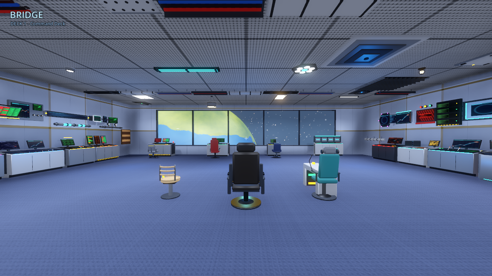 | 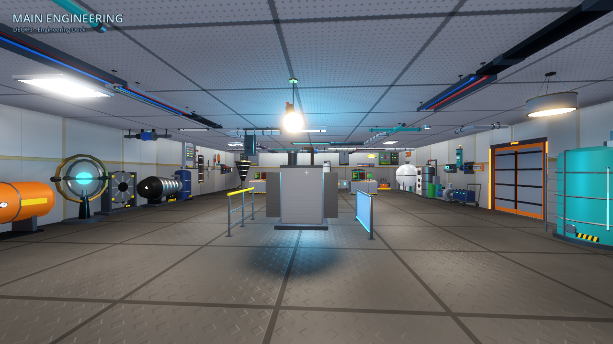 |
| 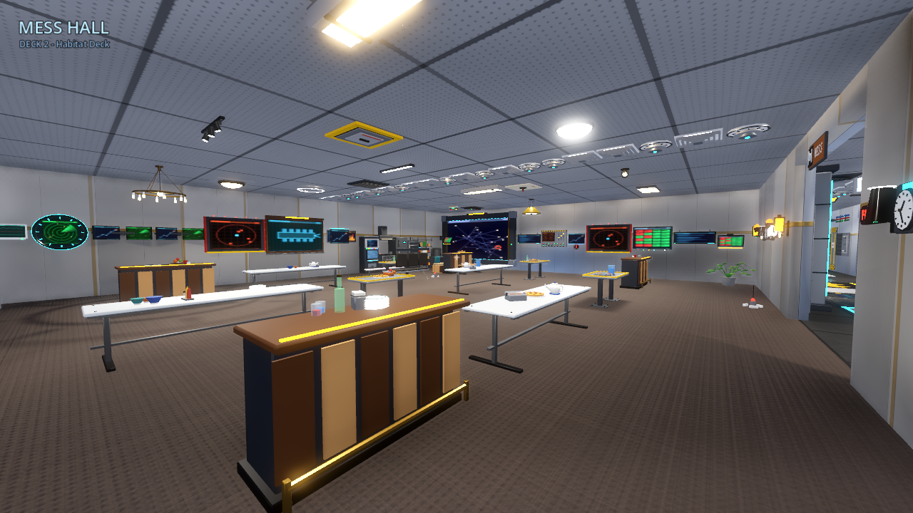 | 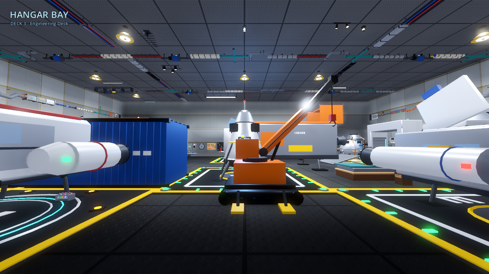 |

## Quick start

```bash
# 1. (optional) regenerate the assets - needs Python 3.11:  pip install bpy numpy
python blender/build_all.py --out godot          # 1000 GLBs + textures + data/catalog.json (~20 s on 4 cores)
python tools/layout/generate_ship.py             # arrange them: godot/data/ship.json

# 2. play (Godot 4.6+)
godot --path godot --import                      # first run only: import the GLBs
godot --path godot
```

The generated GLBs, textures and `ship.json` are committed, so opening `godot/` in the editor is enough.

**Controls** - `WASD` move, `Shift` sprint, mouse look, `F` flashlight, `M` deck map, `H` help,
`Esc` release the mouse. Step into a turbolift (aft end of every deck) and press `1` / `2` / `3` to change deck.

## Pipeline

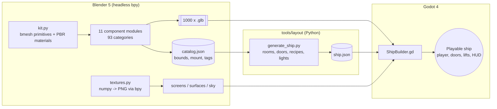

* `blender/starship/kit.py` - modelling kit: boxes, cylinders, tori, prisms, screens, materials, exporter.
  Authoring frame = glTF frame (+Y up, +Z front, metres). See [`blender/CONVENTIONS.md`](blender/CONVENTIONS.md).
* `blender/starship/components/*.py` - the 1000 models, registered with `@family(category, labels, mount, tags)`.
* `tools/layout/` - deterministic arrangement of every model into rooms (`shiplib.py` helpers,
  `recipes_deck{1,2,3}.py` per-room furnishing). Every one of the 1000 models is placed at least once.
* `godot/scripts/` - `ship_builder.gd` (walls/floors/windows/lights/props from JSON), `player.gd`,
  `door.gd`, `lift.gd`, `hud.gd`, `deck_map.gd`.

## The component library (1000 GLBs)

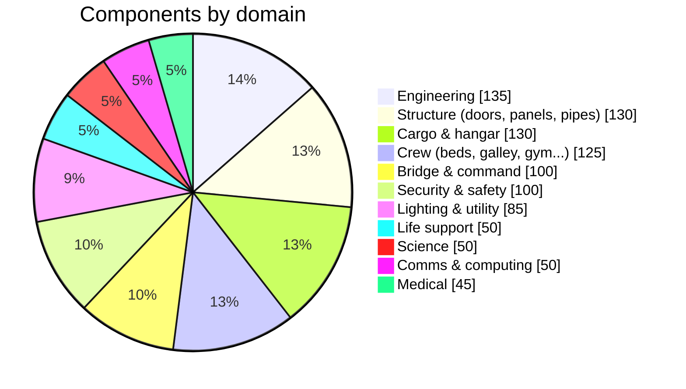

~707k triangles, 36 MB in total; each model is a single mesh (doors have separate `leaf_l` / `leaf_r`
nodes that the game slides open). Emissive screens use generated UI textures (`godot/textures/screens`).

| | |
|---|---|
| 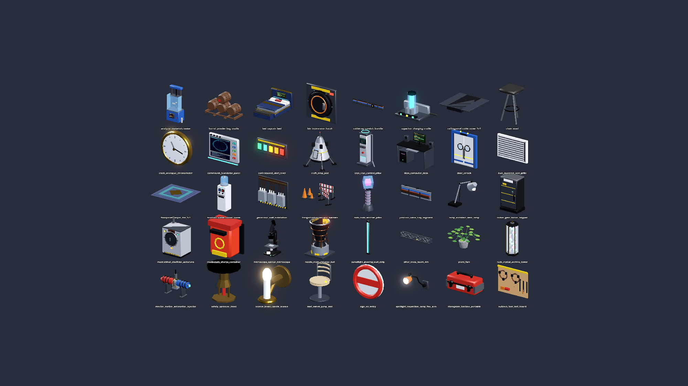 | 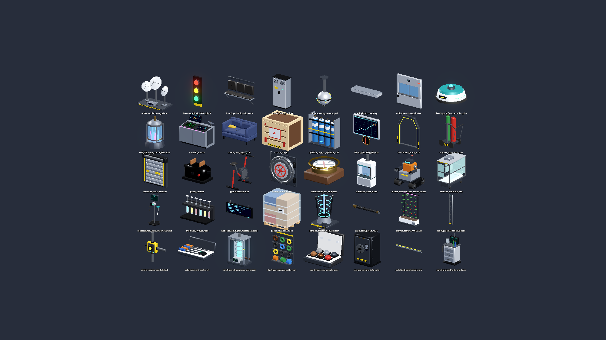 |

## The ship

Three decks, 40 rooms, 31 doors, six turbolift cars (A/B on every deck), a hangar bay with a force-field door.

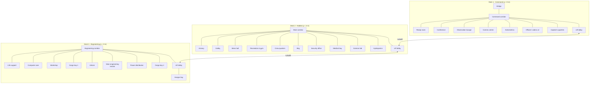

| Deck 1 | Deck 2 | Deck 3 |
|---|---|---|
|  |  |  |

### A tour

| | |
|---|---|
| 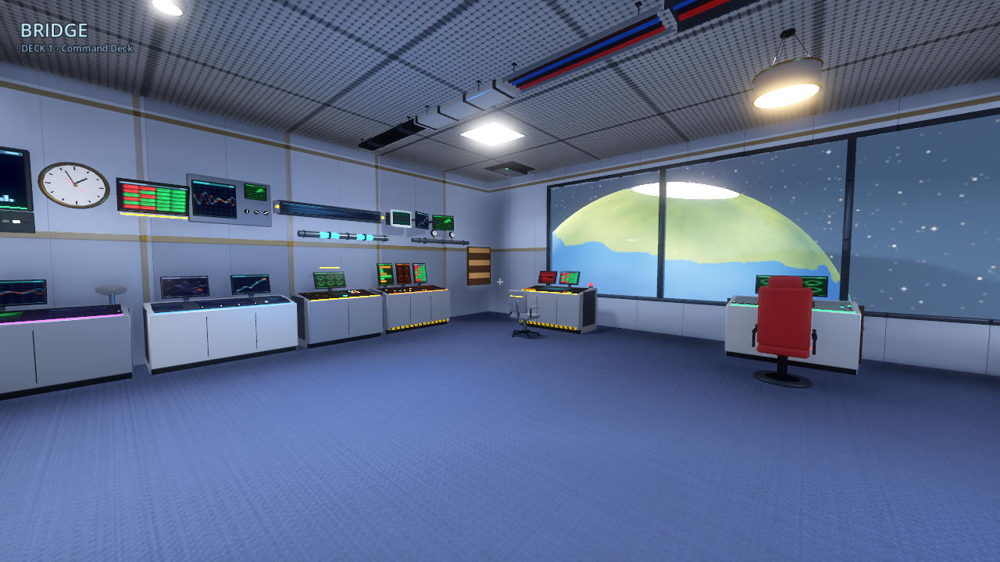 | 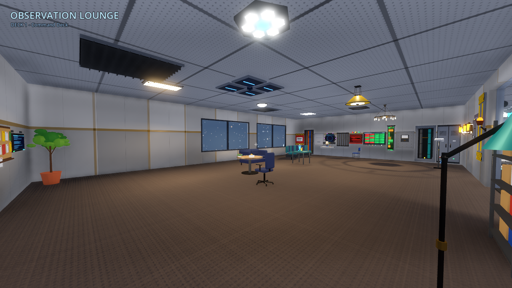 |
| 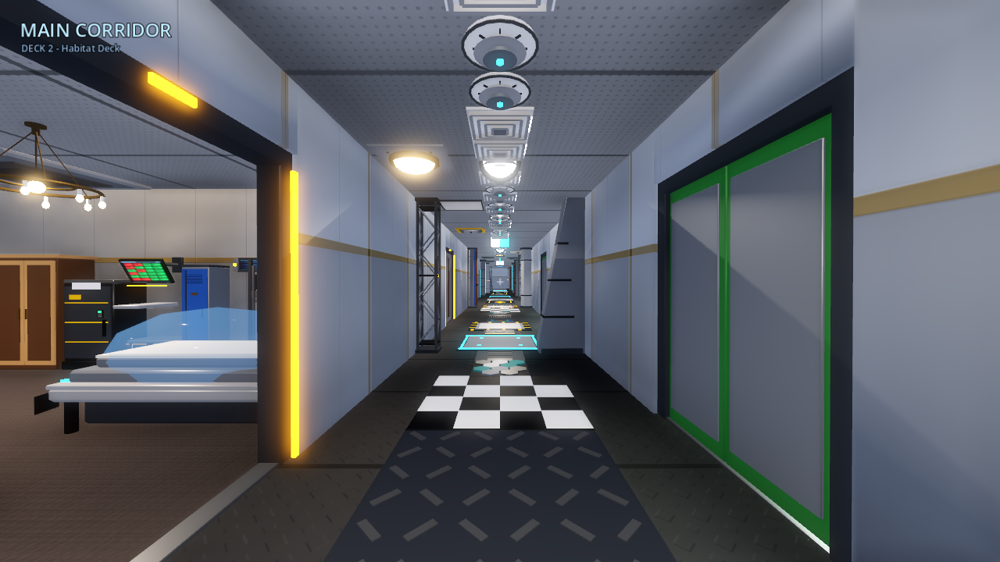 | 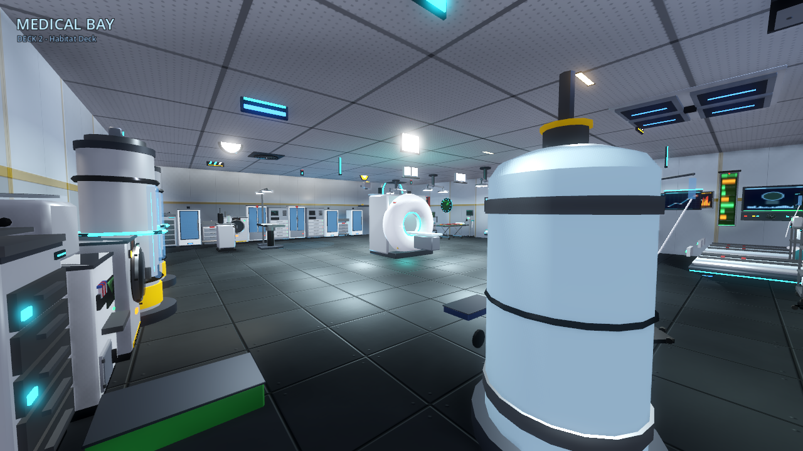 |
| 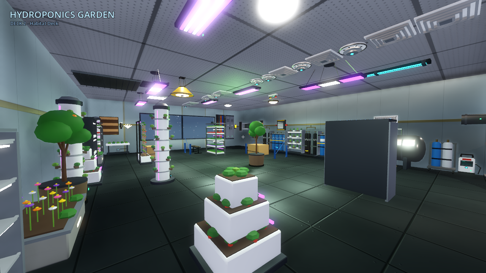 | 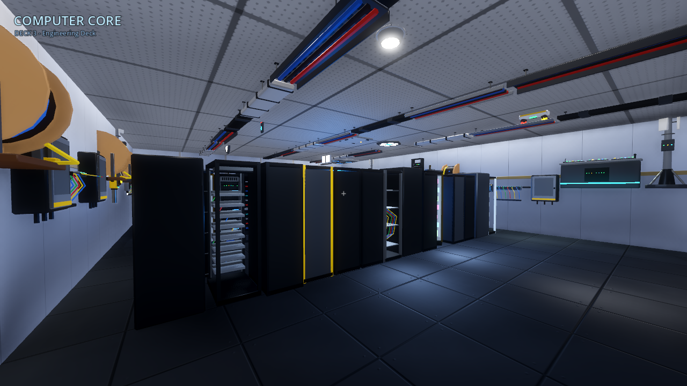 |

## Realism notes

* Real-world metric scale (doors 2.0 x 2.6 m, 3.4 m ceilings, 4 m deck pitch); wall thickness, floor and ceiling slabs.
* PBR materials: Blender-generated albedo / normal / ORM maps (tread plate, grating, carpet, panelled
  bulkheads, perforated ceiling tiles) applied with world-space triplanar mapping, so walls tile seamlessly.
* Ceiling downlights are shadow-casting spot lights placed with the fixture models; console glow, reactor and
  hydroponics lights are coloured omni lights; SSAO, glow and filmic tone mapping.
* Windows (bridge, lounge, astrometrics, hydroponics, captain's quarters) look out on a star panorama and a
  planet lit by a sun that lights only the outside (render layer 2), so nothing bleeds into the interior.
* Props sit on wall / floor / ceiling with footprint collision avoidance and door clearance; small items stand
  on tables and desks using each model's measured top surface (`top_y`); solid props have box colliders.
* Visibility ranges by object size keep the ~3,700 meshes cheap to draw.

## CI

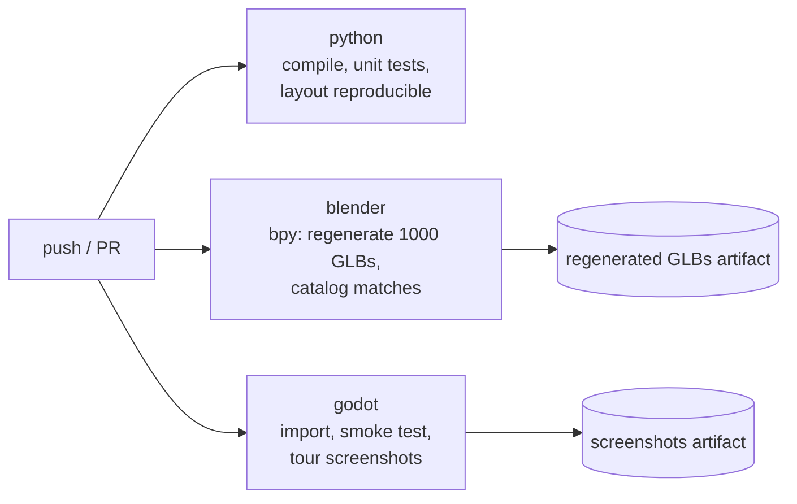

Local checks: `python -m unittest discover -s tests -v` and
`godot --headless --path godot -s res://tests/smoke_test.gd`.

Tour screenshots (also used for this README): `godot --path godot -- --tour=/tmp/shots [--only=01_bridge,...]`.
Contact sheets of any GLBs: `GODOT=godot tools/preview/run.sh sheet.png godot/models/console/*.glb`.

## Versions

Blender 5.0.1 (`bpy` module on PyPI) and Godot 4.6.3 were used to build and verify this project.
CI installs the latest `bpy` from PyPI and the Godot version in `.github/workflows/ci.yml` (`GODOT_VERSION`,
overridable from *Run workflow*).

## License

See [LICENSE](LICENSE).
