# StarshipGo

A first-person exploration game set inside the **ESV *Vesper Lantern*** (MCV-7741), a Wayfinder-class deep-survey cruiser of the Meridian Concord. **Blender**
(headless, via the `bpy` module) procedurally generates the **1198-model component library** (1,000 equipment models, 196 realistic food and drink models,
2 deck signs), **135 new PBR surface textures**, 62 screen textures, the stair flights and the exterior fittings; a **bill-of-materials driven layout generator**
furnishes every room of a **five-deck, 111 m long starship**; **Godot 4** builds it, wraps it in a **smooth, flared, raked outer hull** and lets you walk it:
sliding doors, stairs through all five decks, ~320 real-time lights, a planet outside the windows, ambient sound, a deck map - and **every screen in the ship is
interactive** (look at it, press `E`): a 3D **star map** of 33 systems, navigation, reactor, power, life support, medical, security (locks real doors), alert
status (changes the lighting), a ship's computer, a galley menu and 20 more applications.
No people, just the ship.

| | |
|---|---|
| 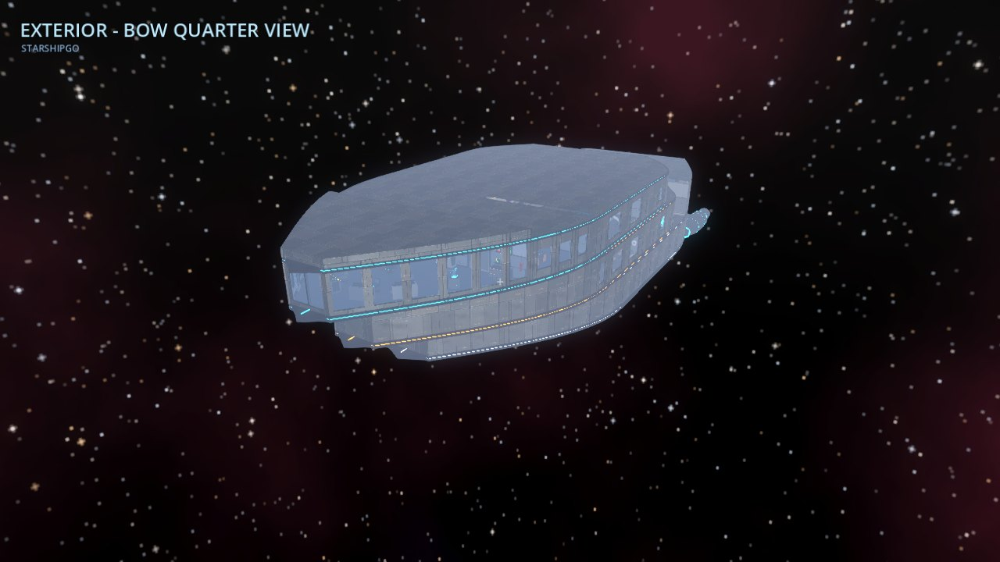 | 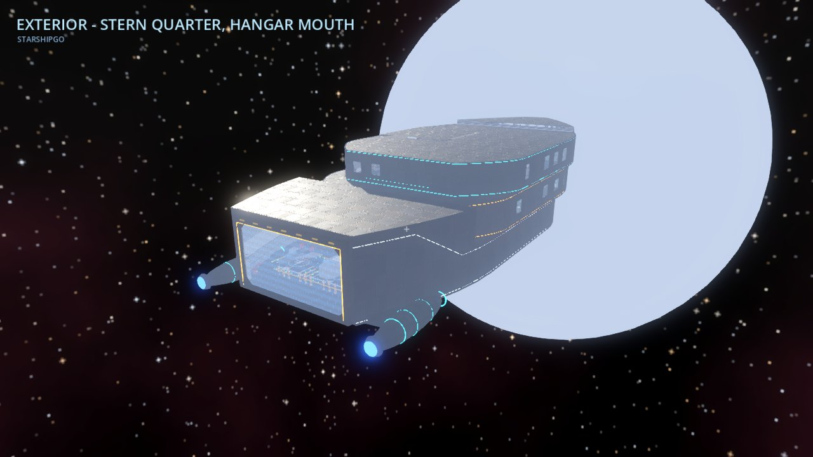 |
| 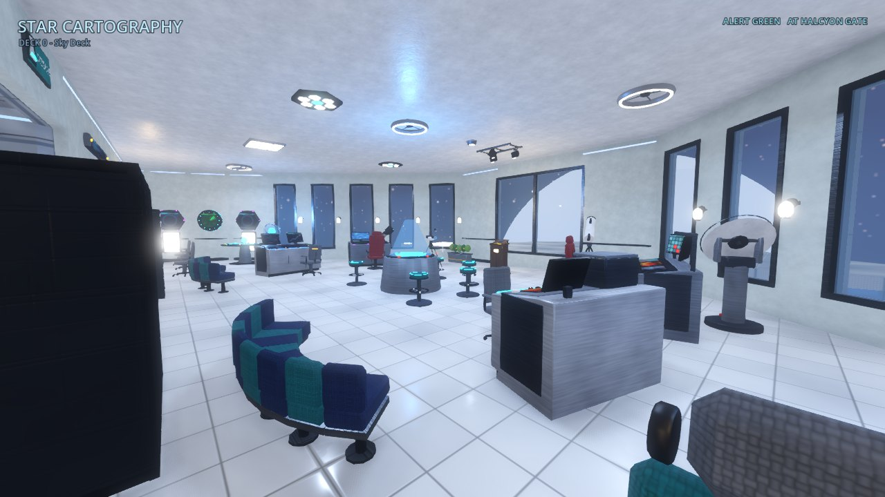 | 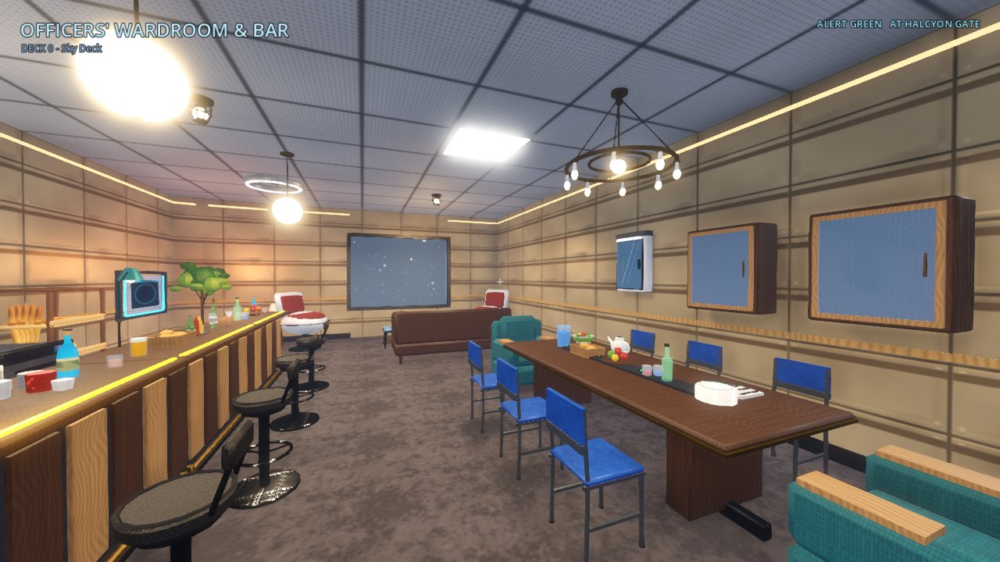 |
| 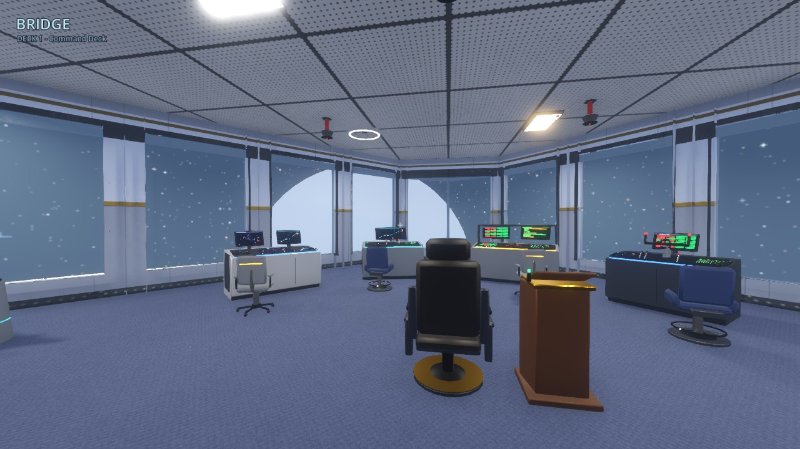 | 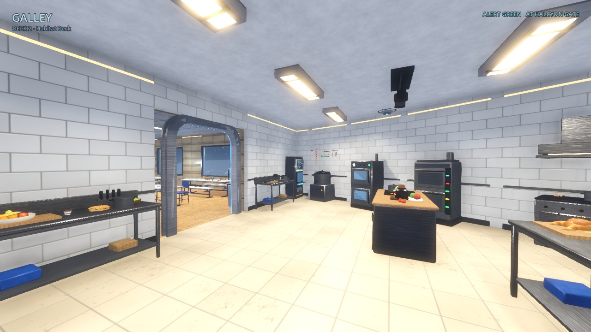 |
| 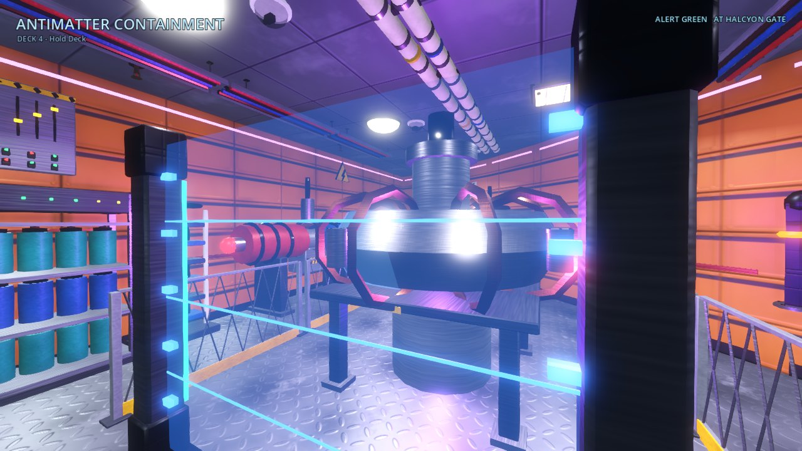 | 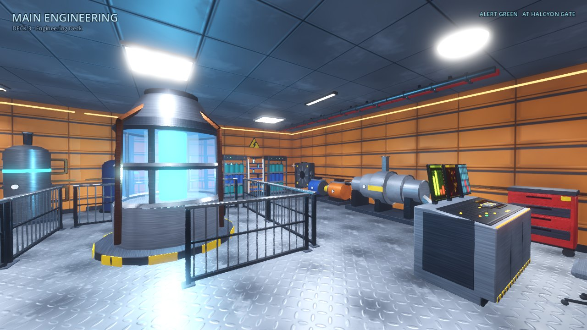 |

## Quick start

```bash
# 1. (optional) regenerate the assets - the latest headless Blender needs Python 3.13:
pip install -r requirements-blender.txt                 # bpy 5.2 + numpy
python blender/build_all.py --out godot                 # 1,198 GLBs + textures + data/catalog.json (~25 s on 4 cores; the first run adds ~4 min of texture generation)
python blender/build_arch.py --out godot                # stair flights, guard, sign, hull fascia, nacelles, deflector, masts, engines, keel fin
tools/regen_derived.sh                                  # specs -> ship.json -> lore -> software spec -> ship spec -> BOM -> 244 drawings -> bug ledger

# 2. play (Godot 4.7)
godot --path godot --import                             # first run only: import the GLBs and textures
godot --path godot
```

Everything generated is committed, so opening `godot/` in the editor is enough.

**Controls** - `WASD` move, `Shift` sprint, mouse look, `F` flashlight, `M` deck map, `H` help, **`E` use the screen / machine you are looking at** (`Esc` or `E` closes it),
`Esc` releases the mouse. There are no lifts: walk into one of the two stair towers at mid-ship and climb the flights.

## What changed in this version

| | before | now |
|---|---|---|
| Hull | stacked rectangular boxes with vertical walls, 66 x 26 m | **smooth streamlined skin** that leans out ~9 degrees with height, raked sensor prow, rolled keel, dome, sloping stern, twin nacelles, deflector dish, masts and stern engines; **111 m long, 60 m over the nacelles, 29 m keel to roof** |
| Size | 3 decks, 43 rooms | **5 decks, 68 rooms** (new Sky Deck and Hold Deck: 16 new rooms with 40-160 props each), 2,589 props |
| Textures | 9 PBR sets; many surfaces flickered | **144 PBR sets**, band-limited and mipmapped; props use textured wood, leather, fabric, brushed metal; **flicker root causes found and fixed** ([notes](#why-the-textures-flickered)) |
| Food | a handful of crude boxes | **196 modelled food and drink items** with procedural textures (pizza, noodles, steak, sushi, pastries, fruit, cocktails, space rations ...) on every dining table, bar, galley counter and in the provisions hold - [menu](docs/FOOD.md) |
| Screens | pictures on props | **316 interactive screens + 240 machine data cards**, 30 applications - [software spec](docs/SOFTWARE_SPEC.md), [UI guide](docs/UI.md) |
| Design documents | BOM and drawings | + [machine datasheets](docs/MACHINE_SPECS.md) (mass, power, price, MTBF of every model), [ship spec](docs/SHIP_SPEC.md) (power / mass / thermal / life-support budgets), [lore and star map](docs/LORE.md), 244 drawings incl. body plan and principal particulars |
| Defects | 113 audited, 112 fixed | **+212 more verified and fixed** (B114-B325) - [ledger](docs/BUGS.md) |

## The ship

*Vesper Lantern*: five decks, 68 rooms, 34 sliding doors and two stair towers; 64 crew, Deep Survey Charter 7 - four years along the Concord frontier to chart the Veil and run down a repeating signal called the Heartbeat.
The story, 33 star systems, 62 lanes, 28 log entries and a glossary are in [`docs/LORE.md`](docs/LORE.md); the same data drives the in-game star map (`godot/data/lore.json`).


```mermaid
flowchart TB
    subgraph D0["Deck 0 - Sky (+12 m): the lens-shaped dome"]
        direction LR
        SC[Star cartography] --- CF0[Fore corridor]
        CF0 --- TH[Briefing theatre] & WR[Wardroom and bar]
        LB0[Stair lobby] --- CA0[Aft corridor] --- LI[Library] & AR[Arboretum] & OB[Observatory] & FL[Flag suite]
    end
    subgraph D1["Deck 1 - Command (+8 m)"]
        direction LR
        BR[Bridge] --- CF1[Fore corridor]
        CF1 --- RR[Ready room] & CR[Conference] & OL[Observation lounge] & AM[Astrometrics]
        LB1[Stair lobby] --- CA1[Aft corridor] --- OA[Officers' cabins] & CQ[Captain's quarters] & CC[Comms centre]
    end
    subgraph D2["Deck 2 - Habitat (+4 m)"]
        direction LR
        CF2[Fore corridor] --- AR2[Armory] & BG[Brig] & SO[Security] & GA[Galley] & MH[Mess hall] & MB[Medical bay]
        LB2[Stair lobby] --- CA2[Aft corridor] --- RG[Recreation] & CW[Crew quarters] & SL[Science lab] & HY[Hydroponics]
    end
    subgraph D3["Deck 3 - Engineering (+0 m)"]
        direction LR
        CF3[Fore corridor] --- LS[Life support] & CO[Computer core] & AL[Airlock] & ME[Main engineering]
        LB3[Stair lobby] --- CA3[Aft corridor] --- WS[Workshop] & CB[Cargo bay] & PD[Power distribution] & SD[Spares] --- HB[Hangar bay]
    end
    subgraph D4["Deck 4 - Hold (-4 m): the keel"]
        direction LR
        CF4[Fore corridor] --- AC[Antimatter containment] & PH[Provisions and cold store] & WP[Water reclamation] & WW[Waste recycling]
        LB4[Stair lobby] --- CA4[Aft corridor] --- FH[Fabrication hall] & AX[Auxiliary control] & MC[Main cargo hold] & DP[Drone bay]
    end
    LB0 <-->|port + starboard stairs| LB1 <--> LB2 <--> LB3 <--> LB4
```

| Deck 0 | Deck 1 | Deck 2 | Deck 3 | Deck 4 |
|---|---|---|---|---|
| 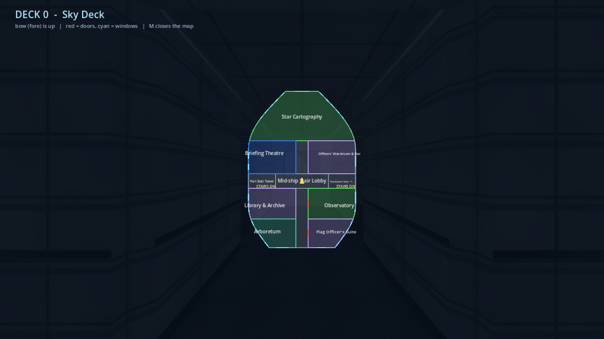 | 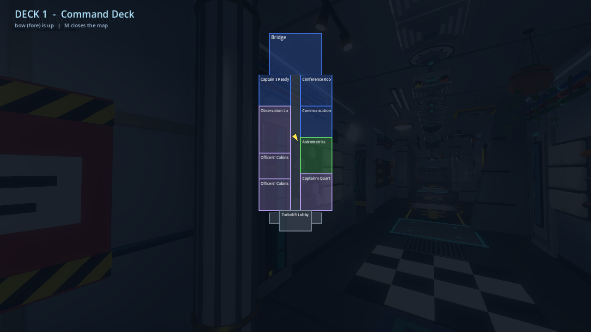 | 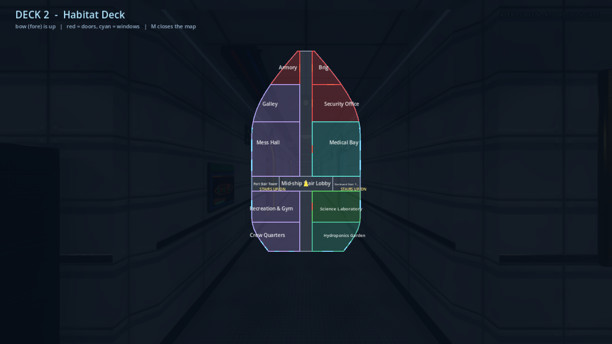 | 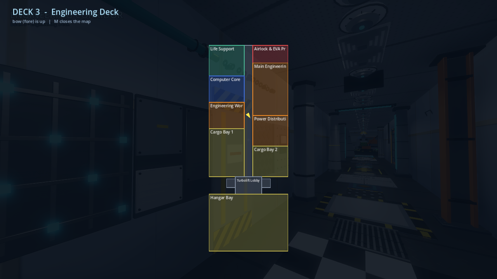 | 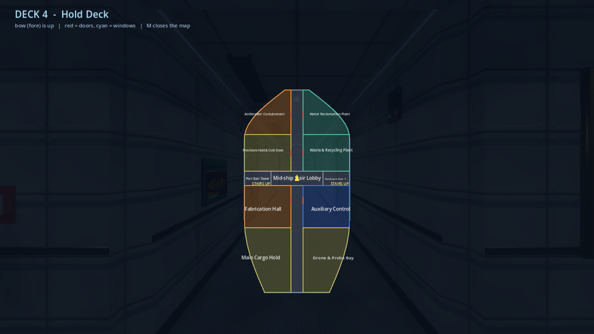 |

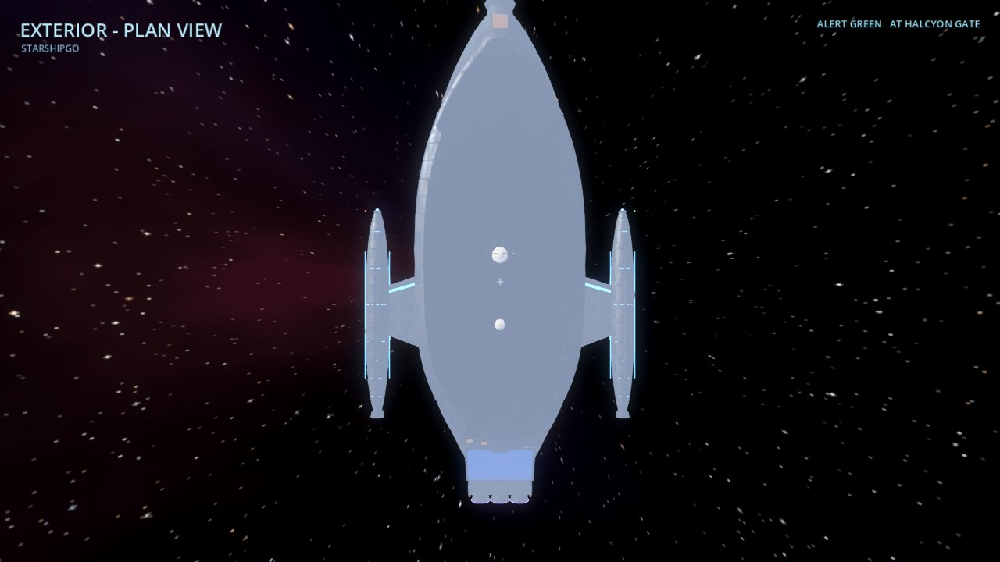
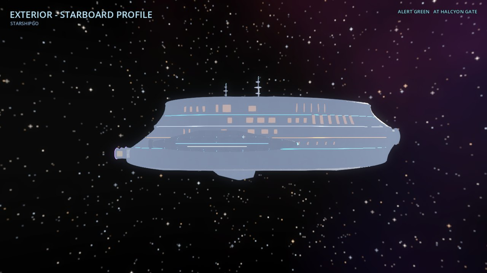

### A tour

| | |
|---|---|
| 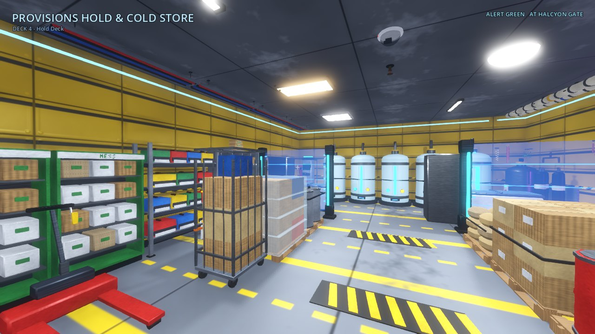 | 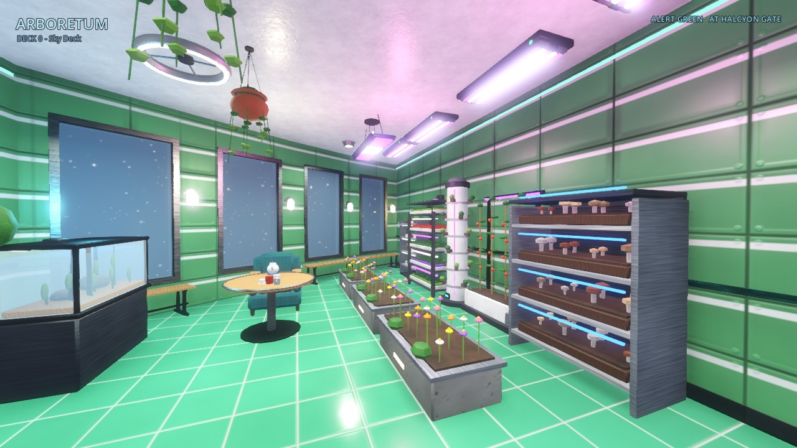 |
| 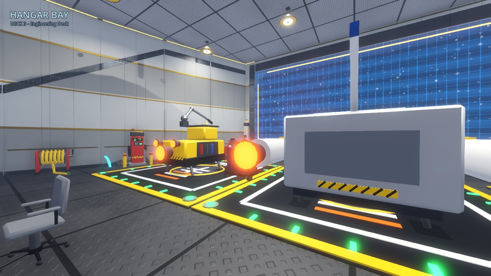 | 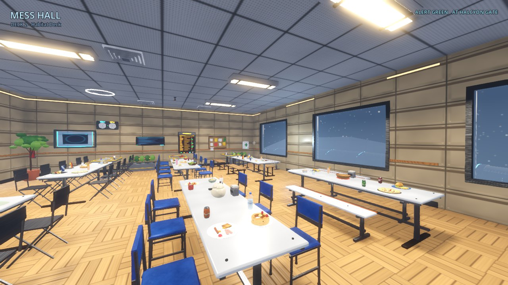 |

## The hull

The old ship was a stack of vertical-walled boxes. The new exterior is a **loft of closed rings** computed from the room volumes (`tools/layout/hull.py: skin()`):

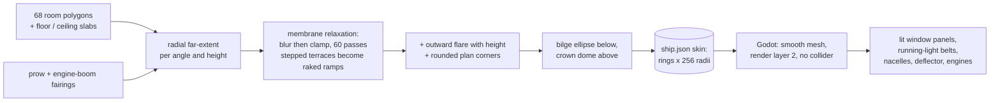
```mermaid
flowchart LR
    R[68 room polygons<br/>+ floor / ceiling slabs] --> V[radial far-extent<br/>per angle and height]
    F[prow + engine-boom fairings] --> V
    V --> M[membrane relaxation:<br/>blur then clamp, 60 passes<br/>stepped terraces become raked ramps]
    M --> L[+ outward flare with height<br/>+ rounded plan corners]
    L --> C[bilge ellipse below,<br/>crown dome above]
    C --> S[(ship.json skin:<br/>rings x 256 radii)]
    S --> G[Godot: smooth mesh,<br/>render layer 2, no collider]
    G --> W[lit window panels,<br/>running-light belts,<br/>nacelles, deflector, engines]
```

The skin always encloses every room by at least 0.2 m (`tests/test_hull.py` checks every room vertex at three heights). Its back faces are culled, so from inside the rooms (and
through the windows) it is invisible. The interior keeps vertical walls so furniture, doors and stairs stay exact. The drawings
([G-04..G-20](docs/drafts/INDEX.md): hull lines, profile, body plan, sections, principal particulars) show the skin cross-section at every station.

## Textures and the flicker

* `blender/starship/textures_*.py` build 135 new tileable PBR sets (brushed and anodised metals, diamond / riveted / perforated plates, tiles, marble, 10 woods, leather, fabric,
  carpets, quilted panels, hull armour clean / weathered / scorched, department panels, grass, soil ...), 41 new screen looks and 14 decals with Blender's image API and numpy; catalogue and
  atlas in [`docs/TEXTURES.md`](docs/TEXTURES.md). `tools/layout/themes.py` gives every room its own wall / floor / ceiling / trim material; `godot/scripts/prop_materials.gd` swaps the flat Blender
  colours of props for textured materials (object-space triplanar, original colour kept as tint).

### Why the textures flickered

1. **No mipmaps** - the importer default was `mipmaps/generate=false`, so every texture (and 251 extracted prop textures) shimmered when minified: fixed in `project.godot` plus a load-time repair.
2. **Coplanar faces inside the models** - 23,128 overlapping, same-facing, different-material face pairs in 570 of the original models (every screen quad sat flush on its bezel): the exporter now lifts the
   smaller face of each pair by 3 mm (`kit.fix_zfight`; `tools/quality/glb_audit.py` measures it) and the pair count drops by ~87%; none is visible in `godot/tests/zfight_test.gd`.
3. **Shell geometry** - inside-out wall prisms, plating sharing planes with fascia belts, door frames and trim: fixed in `ship_builder.gd` (ledger B114 onwards).
4. **High-frequency textures** (perforation, seams, grating) were band-limited, 16x anisotropic filtering and the roughness limiter were enabled and the forcefield shader lines are anti-aliased.

## Interactive screens

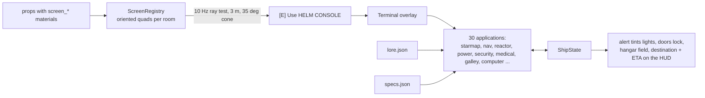
```mermaid
flowchart LR
    GLB[props with screen_* materials] --> REG[ScreenRegistry<br/>oriented quads per room]
    REG -->|10 Hz ray test, 3 m, 35 deg cone| HUD["[E] Use HELM CONSOLE"]
    HUD --> TERM[Terminal overlay]
    TERM --> APPS[30 applications:<br/>starmap, nav, reactor, power, security, medical, galley, computer ...]
    APPS <--> ST[ShipState]
    ST --> FX[alert tints lights, doors lock,<br/>hangar field, destination + ETA on the HUD]
    LORE[lore.json] --> APPS
    SPEC[specs.json] --> APPS
```

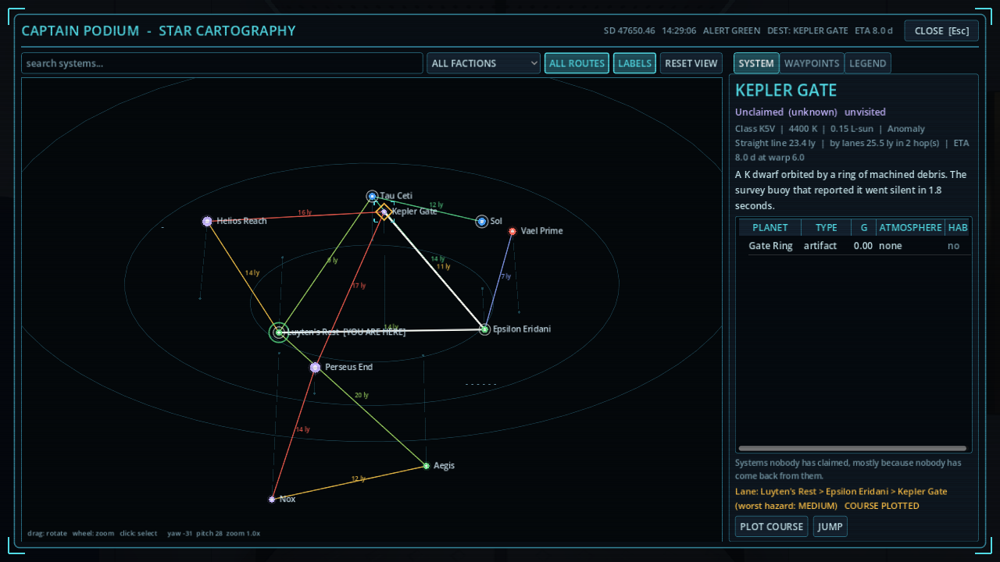

| | |
|---|---|
| 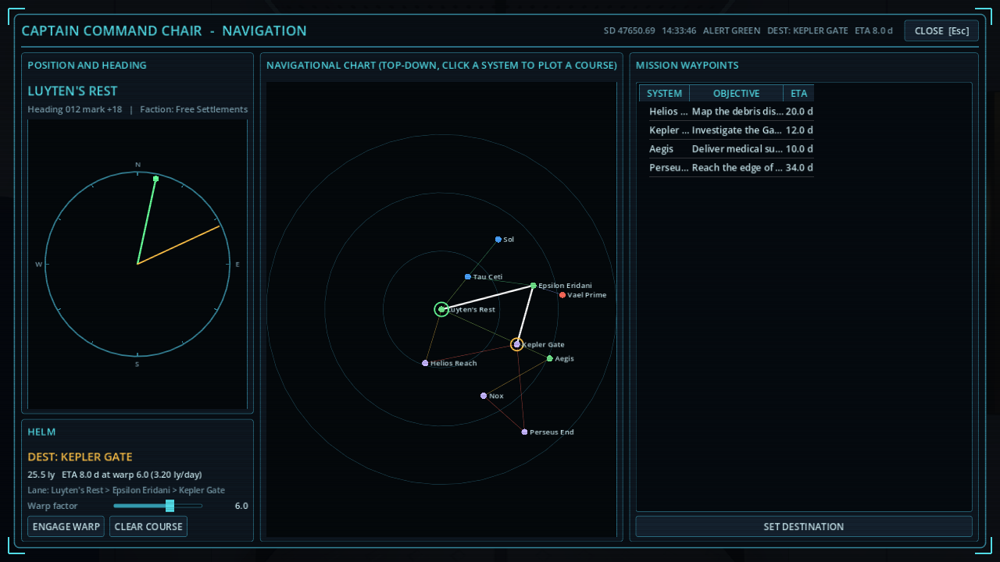 | 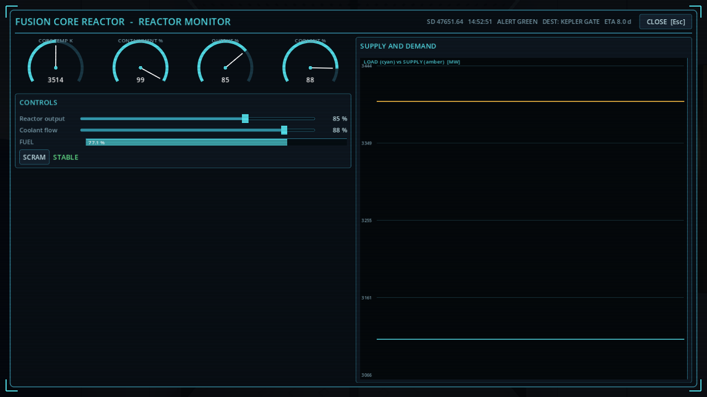 |
| 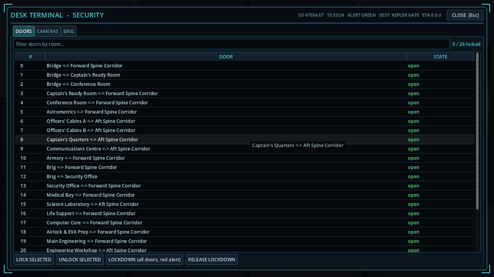 | 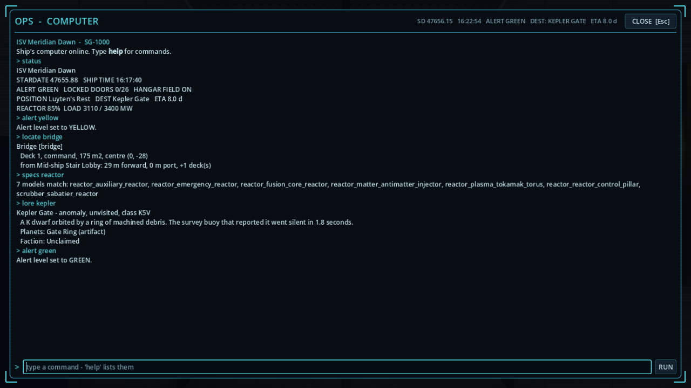 |

The star map rotates and zooms, shows faction colours and lane hazards, plots courses with an ETA at the ship's warp speed and **jumps** (the current system changes). The computer terminal has a working command
line (`help status map locate specs lore log alert lock jump ...`). The specification of every application is in [`docs/SOFTWARE_SPEC.md`](docs/SOFTWARE_SPEC.md); machines without a screen open a **data card**
with their datasheet (manufacturer, mass, power, price, MTBF).

## Design documents

* [`docs/SHIP_SPEC.md`](docs/SHIP_SPEC.md) - dimensions, deck table, mass budget, electrical power budget with a single-line diagram, thermal and life-support budgets, propulsion / FTL / sensors,
  costs, maintenance, compliance findings.
* [`docs/MACHINE_SPECS.md`](docs/MACHINE_SPECS.md) and [`docs/specs/`](docs/specs/) - a datasheet for each of the 1,198 models: dimensions, mass, idle / typical / peak power, supply bus, heat, price, lead time, MTBF, maintenance interval, IP rating, noise, software.
* [`docs/BOM.md`](docs/BOM.md) - one chapter per room: design brief, every BOM line with *why* it is there, every model with function, **mass / power / price columns and per-room, per-deck subtotals** (CSV: [`docs/bom/`](docs/bom/bill_of_materials.csv)).
* [`docs/drafts/INDEX.md`](docs/drafts/INDEX.md) - 244 A3 sheets: five deck arrangements, hull lines, profile, body plan, centreline and transverse sections, stair details, escape diagram, schedules, power single-line diagram, 13 machine datasheet sheets and plan + 2 sections of every room.
* [`docs/FOOD.md`](docs/FOOD.md), [`docs/TEXTURES.md`](docs/TEXTURES.md), [`docs/LORE.md`](docs/LORE.md), [`docs/DESIGN.md`](docs/DESIGN.md), [`docs/UI.md`](docs/UI.md).

## Pipeline

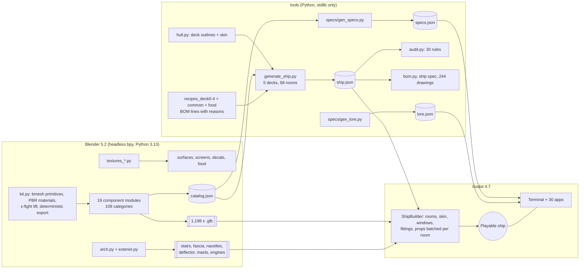
```mermaid
flowchart LR
    subgraph Blender["Blender 5.2 (headless bpy, Python 3.13)"]
        K[kit.py: bmesh primitives, PBR materials,<br/>z-fight lift, deterministic export] --> F[19 component modules<br/>108 categories]
        T[textures_*.py] --> TX[surfaces, screens, decals, food]
        F --> G[[1,198 x .glb]]
        F --> C[(catalog.json)]
        A[arch.py + exterior.py] --> AG[[stairs, fascia, nacelles,<br/>deflector, masts, engines]]
    end
    subgraph Layout["tools (Python, stdlib only)"]
        H[hull.py: deck outlines + skin] --> L
        C --> L[generate_ship.py<br/>5 decks, 68 rooms]
        R[recipes_deck0-4 + common + food<br/>BOM lines with reasons] --> L
        L --> J[(ship.json)]
        C --> SP[specs/gen_specs.py] --> SJ[(specs.json)]
        J --> AU[audit.py: 30 rules]
        J --> BOM[bom.py, ship spec, 244 drawings]
        LO[specs/gen_lore.py] --> LJ[(lore.json)]
    end
    subgraph Godot["Godot 4.7"]
        G --> B[ShipBuilder: rooms, skin, windows,<br/>fittings, props batched per room]
        AG --> B
        J --> B
        B --> W((Playable ship))
        SJ --> UI[Terminal + 30 apps]
        LJ --> UI
        W --- UI
    end
```

## Performance

Measured with the built-in flythrough benchmark over the 40 tour cameras on software Vulkan (llvmpipe, 960 x 540, a CPU rasteriser - so absolute frame times are slow, but draw calls and
primitives are renderer independent):

| Mean over the tour | original game | previous version (3 decks) | now (5 decks, textured, interactive) |
|---|---|---|---|
| Draw calls per frame | 17,950 | 355 | 475 |
| Primitives per frame | 2,387,619 | 43,292 | 102,174 |
| Scene nodes | 16,580 | 3,512 | 5,924 |
| Static memory | 332 MB | 163 MB | 206 MB |

The ship is about 2.5 times the volume of the previous version with 144 PBR texture sets (mipmapped, hence ~600 MB of video memory under llvmpipe) and a 29,000-triangle outer hull, and still
draws ~38x fewer calls than the original. CI guards `mean_draw_calls < 600` and `mean_primitives < 150000`.

```bash
godot --path godot --rendering-driver vulkan --resolution 960x540 -- --bench=/tmp/bench.json --no-probes
godot --path godot -- --hq          # volumetric fog, 4x MSAA and full SSAO
```

## Bugs

[`docs/BUGS.md`](docs/BUGS.md): **325 verified, fixed defects** - 113 from the original audit and 212 more found in this round (Python tools 49, Godot runtime 38, Blender models and CI 15, 110
coplanar-face families), each with file, lines, evidence, impact and the test or check that keeps it fixed. The layout audit (`tools/layout/audit.py`) has 30 rules, a deliberate-violation test for every rule,
and the committed ship has **0 errors**.

## Testing and CI

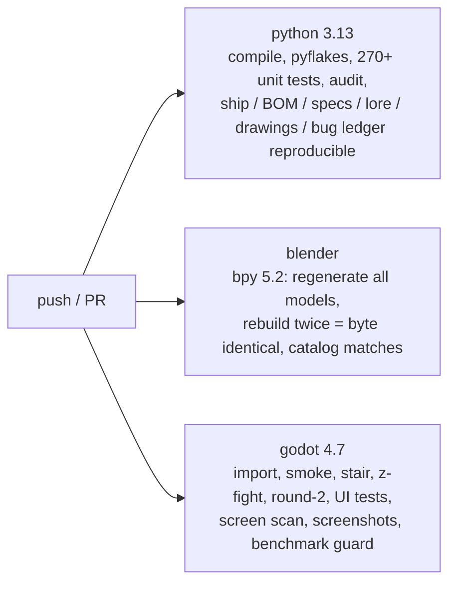
```mermaid
flowchart LR
    PR[push / PR] --> PY[python 3.13<br/>compile, pyflakes, 270+ unit tests, audit,<br/>ship / BOM / specs / lore / drawings / bug ledger reproducible]
    PR --> BL[blender<br/>bpy 5.2: regenerate all models,<br/>rebuild twice = byte identical, catalog matches]
    PR --> GD[godot 4.7<br/>import, smoke, stair, z-fight, round-2, UI tests,<br/>screen scan, screenshots, benchmark guard]
```

Local: `python -m unittest discover -s tests -v`, `python tools/layout/audit.py --summary`, `python tools/quality/glb_audit.py`, and
`godot --headless --path godot -s res://tests/{smoke_test,stair_test,zfight_test,round2_test,ui_test}.gd`.
Screenshots: `godot --path godot -- --tour=/tmp/shots [--only=01_bridge,X1_bow_quarter,maps] [--no-probes] [--hq]`; terminal apps: `-- --ui-shot=starmap,nav --ui-out=/tmp/ui`.

## Versions

Blender 5.2 (`bpy` on PyPI, Python 3.13) and Godot 4.7 were used to build and verify this project; CI installs the latest `bpy` and the Godot tag in `.github/workflows/ci.yml`.
Developers upgrading an old checkout should delete the stale import sidecars once: `find godot -name "*.import" -delete && godot --headless --path godot --import`.

## License

See [LICENSE](LICENSE).
