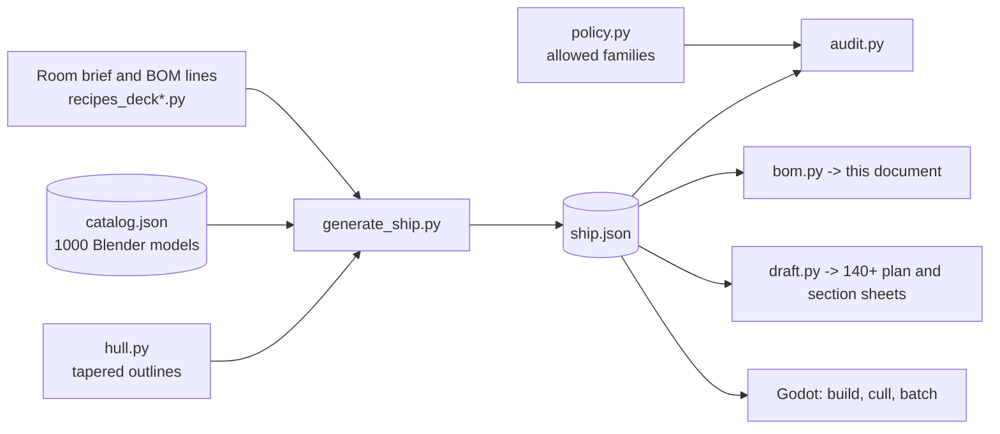

# StarshipGo - Bill of Materials

*Generated by `python tools/layout/bom.py` from `godot/data/ship.json`; do not edit by hand.*

Every room of the ship is furnished from a written bill of materials: each **BOM line** groups the models that serve one function and states **why** they are in the room, how many there are and why they stand where they do. The same data drives the game, the audit (`tools/layout/audit.py`) and the drawings in [`docs/drafts`](drafts/INDEX.md). The placement policy (`tools/layout/policy.py`) says which equipment families may appear in which room; the audit fails the build when a reactor turns up in the mess or a chair stands in a doorway.

## 1. Ship summary

| | |
|---|---|
| Length overall | 66 m |
| Beam | 26 m |
| Decks | 5 (floors at -4.0, +0.0, +4.0, +8.0, +12.0 m) |
| Rooms (incl. circulation) | 68 |
| Doors / arches | 34 sliding doors, 35 open arches and portals |
| Stair towers | 2 (port / starboard), 4 dog-leg flight pairs, 22 risers of 181.8 mm per deck |
| BOM lines | 398 |
| Placed items | 1547 |
| Distinct models used | 427 of 1002 in the catalogue |
| Installed equipment mass | 301.84 t (datasheets: [MACHINE_SPECS](MACHINE_SPECS.md)) |
| Typical / peak electrical load | 5.36 MW / 11.18 MW |
| Installed generation | 23.8 MW |
| Equipment value | 327.58 M cr |

### Decks

| Deck | Name | Hull area | Rooms | Room area | Items | BOM lines | Mass | Typical load | Value cr |
|---|---|---|---|---|---|---|---|---|---|
| 0 | Sky Deck | 859 m2 | 12 | 860 m2 | 60 | 26 | 2.63 t | 729 W | 151.2 k |
| 1 | Command Deck | 1042 m2 | 14 | 1042 m2 | 375 | 96 | 25.32 t | 62.8 kW | 19.49 M |
| 2 | Habitat Deck | 1064 m2 | 15 | 1064 m2 | 493 | 135 | 49.81 t | 353.5 kW | 48.70 M |
| 3 | Engineering Deck | 1244 m2 | 14 | 1245 m2 | 504 | 115 | 220.73 t | 4.95 MW | 259.05 M |
| 4 | Hold Deck | 1146 m2 | 13 | 1146 m2 | 81 | 26 | 3.36 t | 1.3 kW | 179.3 k |

### Design principles

* **Hull lines.** The hull is drafted as one closed, convex outline per deck: an elliptical-sine bow that is tangent to a 26 m parallel mid-body, then a rounded counter that tapers to a narrow transom. The five decks are terraced (Deck 1 overhangs the bow, Deck 3 extends aft to form the hangar platform, Deck 0 is a dome on top, Deck 4 a tapering keel) and wrapped in a smooth, flared and raked outer skin lofted from the room volumes.
* **Room shapes.** Rooms are drafted on a rectangular grid and clipped by the hull: amidships rooms stay rectangular, bow and stern rooms get the diagonal, streamlined walls of the hull. Wedge rooms take equipment along their straight walls.
* **Circulation.** A 3 m spine corridor on the centreline, a mid-ship cross passage and two dog-leg stair towers (port and starboard) stacked on every deck. There are no lifts. Corridors carry only wall and ceiling equipment so the escape route stays clear.
* **Escape.** Every point of every deck is within 35 m of a stair tower and there are always two towers; stair towers are protected spaces with extinguishers, emergency lighting and signage.

## 2. Totals by equipment family

| Family | What it is for | Qty | Distinct models |
|---|---|---|---|
| `ceilinglight` Ceiling light fixture | General lighting sized to the task in the room. | 192 | 12 |
| `cabletray` Cable tray | Carries power and data cables overhead or along walls, protected and accessible. | 112 | 4 |
| `sign` Sign | Wayfinding and hazard marking. | 108 | 23 |
| `safety` Safety equipment | Fire, first-aid, breach and emergency gear required by regulation. | 103 | 12 |
| `chair` Chair | Seating for desks and tables. | 89 | 5 |
| `beacon` Alert beacon / emergency lamp | Gives light and visual or audible warning during alarms and power loss. | 62 | 4 |
| `rack` Equipment rack | Houses servers, storage and network gear with cooling. | 50 | 11 |
| `display` Wall display | Shows status, plans and sensor data to people in the room. | 46 | 16 |
| `tableware` Tableware / table setting | Plates, cups and condiments on tables. | 42 | 13 |
| `pipe` Pipe run | Carries water, coolant or gas. | 41 | 4 |
| `galley` Galley equipment | Food storage, cooking and dish-washing equipment. | 33 | 18 |
| `console` Workstation console | Operator station with displays and controls for one ship function. | 28 | 15 |
| `duct` Ventilation duct / grille | Moves conditioned air to and from the room. | 28 | 3 |
| `seat` Crew station seat | Operator chair for console positions. | 28 | 7 |
| `table` Table | Work, meeting or dining surface. | 27 | 7 |
| `terminal` Terminal / datapad | Data entry and information access. | 27 | 5 |
| `locker` Personal / equipment locker | Secure storage for personal gear and issue equipment. | 26 | 6 |
| `lamp` Lamp | Local task or mood lighting. | 22 | 5 |
| `bench` Bench seating | Fixed seating along walls so the floor stays free for circulation. | 21 | 3 |
| `desk` Desk | Work surface for paperwork and terminals. | 20 | 5 |
| `engtool` Engineering tool / equipment | Tools, carts and test gear for maintenance crews. | 19 | 11 |
| `hangartool` Flight-deck equipment | Servicing, fuelling, launch and safety gear for craft. | 18 | 11 |
| `shelving` Shelving | Open storage for parts, stores and gear. | 18 | 4 |
| `capacitor` Energy storage | Buffers electrical power so systems ride through peaks and brown-outs. | 15 | 5 |
| `couch` Sofa / lounge seating | Soft seating for rest and informal meetings. | 15 | 4 |
| `plant` Decorative plant | Improves wellbeing and air quality. | 15 | 7 |
| `planter` Hydroponic planter | Grows food and oxygen-producing plants. | 15 | 9 |
| `bed` Bunk / bed | Sleeping place for crew off shift. | 14 | 3 |
| `generator` Power generator / transformer | Produces and conditions electrical power for the ship. | 12 | 9 |
| `doorframe` Doorway frame | Open doorway between spaces that need no door. | 11 | 8 |
| `gym` Exercise equipment | Keeps the crew fit during long voyages. | 11 | 7 |
| `labbench` Laboratory furniture | Benches, hoods and stools for safe wet and dry lab work. | 11 | 7 |
| `noticeboard` Notice board | Duty rosters and notices. | 11 | 3 |
| `weaponrack` Weapon rack / armoury fitting | Secure storage of weapons and protective gear. | 11 | 8 |
| `cylinder` Gas cylinder / dewar | Stores compressed or liquefied gases (breathing oxygen, nitrogen) for life support and work. | 10 | 5 |
| `junction` Electrical junction / cabinet | Distributes and protects power and data circuits. | 10 | 8 |
| `camera` Security sensor | Surveillance and access control for the security department. | 9 | 4 |
| `clock` Ship's clock | Shared time reference for watch changes. | 9 | 3 |
| `tank` Process tank / heat exchanger | Stores or conditions fluids for ship systems. | 9 | 6 |
| `coil` Power coil / conduit | Generates or channels plasma and field energy for propulsion. | 8 | 5 |
| `fountain` Drinking fountain | Drinking water for crew. | 8 | 2 |
| `pallet` Pallet | Unit load for forklift handling. | 8 | 5 |
| `watertank` Water treatment | Stores, purifies and recycles water. | 8 | 6 |
| `holo` Holographic projector | Three-dimensional display for briefings and tactical planning. | 7 | 5 |
| `medsupply` Medical supply / IV | Consumables and patient-care accessories. | 7 | 3 |
| `railing` Guard rail | Stops falls near drops and hazards. | 7 | 1 |
| `router` Network hardware | Routes data between ship systems. | 7 | 3 |
| `suitrack` Suit / EVA rack | Stores and dresses pressure suits and breathing kit. | 7 | 6 |
| `analyzer` Laboratory analyser | Measures and characterises samples (composition, structure, biology) for the science staff. | 6 | 5 |
| `medbed` Patient bed / table | Examination, treatment and recovery of patients. | 6 | 3 |
| `vending` Vending machine | Snacks, drinks and small parts for crew. | 6 | 3 |
| `barrel` Drum / cylinder store | Bulk storage of fluids, chemicals and gases, secured upright so leaks stay contained. | 5 | 3 |
| `cabinet` Storage cabinet | Closed storage for supplies the room's staff need daily. | 5 | 2 |
| `commsunit` Communications unit | Radio and intercom equipment for ship and external communications. | 5 | 4 |
| `medcabinet` Medical store | Drugs, sterile instruments and consumables, locked and labelled. | 5 | 5 |
| `scrubber` Air scrubber / processor | Removes CO2 and contaminants from ship air. | 5 | 5 |
| `storagebin` Storage bin / tool chest | Small-parts and tool storage. | 5 | 3 |
| `controlpanel` Wall control panel | Local controls for doors, lights, environment and power. | 4 | 4 |
| `surgical` Surgical equipment | Operating-theatre machines. | 4 | 4 |
| `telescope` Telescope / tracker | Optical observation and star tracking. | 4 | 4 |
| `antenna` Antenna / relay | Sends and receives subspace and radio traffic; mounted where signal paths and cabling are short. | 3 | 3 |
| `bin` Waste / recycling bin | Collects waste for the recycler; a clean ship stays habitable. | 3 | 2 |
| `cell` Holding-cell fitting | Secure detention furniture and control equipment for the brig. | 3 | 3 |
| `craft` Small craft | Shuttles and pods for transport, rescue and repair outside the hull. | 3 | 3 |
| `loader` Cargo handling equipment | Moves pallets and containers without crew strain. | 3 | 2 |
| `storage` Data / secure storage | Archives data and valuables. | 3 | 3 |
| `cryo` Cryo / stasis equipment | Preserves patients and samples at cryogenic temperature. | 2 | 1 |
| `medscanner` Diagnostic scanner | Imaging and analysis for diagnosis. | 2 | 2 |
| `microscope` Microscope | Magnifies samples for analysis. | 2 | 2 |
| `reactor` Reactor / power core | Main and auxiliary power generation. | 2 | 2 |
| `specimen` Specimen container | Holds biological and mineral samples safely. | 2 | 2 |
| `toolbox` Toolbox | Portable hand tools. | 2 | 1 |
| `turbine` Turbine / pump | Rotating machinery for power and fluid movement. | 2 | 2 |
| `warnlight` Warning light | Signals hazards and machine states. | 2 | 2 |
| `forcefield` Force-field barrier | Energy barrier that seals an opening while letting craft or people pass when lowered. | 1 | 1 |
| `hatch` Pressure hatch | Sealable access to ducts, tanks and compartments. | 1 | 1 |
| `medtool` Medical instrument | Hand instruments and kits at the bedside. | 1 | 1 |
| `nozzle` Thruster / nozzle | Propulsion hardware (installed or held as spare). | 1 | 1 |

## 3. Means of escape

Approximate walking distance (door of the room -> spine corridor -> nearest stair tower) for every room; the design limit is 35 m.

| Deck | Room | Walking distance to the nearest stair |
|---|---|---|
| 0 | Forward Spine Corridor (`corF0`) | 11 m |
| 0 | Aft Spine Corridor (`corA0`) | 14 m |
| 0 | Star Cartography (`starcart`) | 20 m |
| 0 | Briefing Theatre (`theatre`) | 19 m |
| 0 | Officers' Wardroom & Bar (`wardroom`) | 19 m |
| 0 | Library & Archive (`library`) | 18 m |
| 0 | Arboretum (`arbor`) | 24 m |
| 0 | Observatory (`observ`) | 18 m |
| 0 | Flag Officer's Suite (`flag`) | 24 m |
| 1 | Forward Spine Corridor (`corF1`) | 17 m |
| 1 | Aft Spine Corridor (`corA1`) | 12 m |
| 1 | Bridge (`bridge`) | 34 m |
| 1 | Captain's Ready Room (`ready`) | 32 m |
| 1 | Observation Lounge (`lounge`) | 21 m |
| 1 | Conference Room (`conf`) | 32 m |
| 1 | Astrometrics (`astro`) | 21 m |
| 1 | Officers' Cabins A (`cabinA`) | 18 m |
| 1 | Officers' Cabins B (`cabinB`) | 21 m |
| 1 | Captain's Quarters (`capt`) | 18 m |
| 1 | Communications Centre (`comms`) | 21 m |
| 2 | Forward Spine Corridor (`corF2`) | 22 m |
| 2 | Aft Spine Corridor (`corA2`) | 14 m |
| 2 | Armory (`armory`) | 35 m |
| 2 | Galley (`galley`) | 31 m |
| 2 | Mess Hall (`mess`) | 22 m |
| 2 | Brig (`brig`) | 35 m |
| 2 | Security Office (`secoff`) | 31 m |
| 2 | Medical Bay (`medbay`) | 22 m |
| 2 | Recreation & Gym (`rec`) | 18 m |
| 2 | Crew Quarters (`dorm`) | 25 m |
| 2 | Science Laboratory (`sci`) | 18 m |
| 2 | Hydroponics Garden (`hydro`) | 25 m |
| 3 | Forward Spine Corridor (`corF3`) | 19 m |
| 3 | Aft Spine Corridor (`corA3`) | 14 m |
| 3 | Life Support (`life`) | 29 m |
| 3 | Computer Core (`core`) | 23 m |
| 3 | Airlock & EVA Prep (`airlock`) | 29 m |
| 3 | Main Engineering (`eng`) | 23 m |
| 3 | Engineering Workshop (`shop`) | 16 m |
| 3 | Cargo Bay (`cargo`) | 26 m |
| 3 | Power Distribution (`aux`) | 16 m |
| 3 | Spares Depot (`depot`) | 26 m |
| 3 | Hangar Bay (`hangar`) | 28 m |
| 4 | Forward Spine Corridor (`corF4`) | 17 m |
| 4 | Aft Spine Corridor (`corA4`) | 20 m |
| 4 | Antimatter Containment (`antimatter`) | 27 m |
| 4 | Provisions Hold & Cold Store (`provisions`) | 19 m |
| 4 | Water Reclamation Plant (`water`) | 27 m |
| 4 | Waste & Recycling Plant (`waste`) | 19 m |
| 4 | Fabrication Hall (`fab`) | 19 m |
| 4 | Auxiliary Control (`auxctl`) | 19 m |
| 4 | Main Cargo Hold (`hold`) | 32 m |
| 4 | Drone & Probe Bay (`drone`) | 32 m |

## 4. Deck 0 - Sky Deck (floor +12.0 m)

The sky deck is a lens-shaped dome on top of the ship, away from the engines and under the widest sky: star cartography in the bow where the great star map is read, a briefing theatre, the wardroom and bar, the library, an arboretum, the observatory and the flag officer's suite.

| Code | Room | Area | Height | Items | BOM lines | Floor occupancy | Mass | Typical load | Value cr |
|---|---|---|---|---|---|---|---|---|---|
| [CF0](#cf0---forward-spine-corridor) | Forward Spine Corridor | 24.0 m2 | 3.4 m | 10 | 6 | 0 % | 68 kg | 30 W | 7.6 k |
| [CA0](#ca0---aft-spine-corridor) | Aft Spine Corridor | 43.2 m2 | 3.4 m | 20 | 7 | 0 % | 128 kg | 145 W | 12.0 k |
| [LB0](#lb0---mid-ship-stair-lobby) | Mid-ship Stair Lobby | 46.1 m2 | 3.4 m | 14 | 7 | 0 % | 221 kg | 275 W | 77.3 k |
| [SP0](#sp0---port-stair-tower) | Port Stair Tower | 23.8 m2 | 3.4 m | 6 | 3 | 0 % | 18 kg | 39 W | 4.6 k |
| [SS0](#ss0---starboard-stair-tower) | Starboard Stair Tower | 23.8 m2 | 3.4 m | 6 | 3 | 0 % | 10 kg | 29 W | 2.8 k |
| [SC](#sc---star-cartography) | Star Cartography | 220.5 m2 | 4.2 m | 0 | 0 | 0 % | 0 kg | 0 W | 0 |
| [BT](#bt---briefing-theatre) | Briefing Theatre | 91.8 m2 | 3.4 m | 1 | 0 | 0 % | 193 kg | 0 W | 3.9 k |
| [WR](#wr---officers-wardroom--bar) | Officers' Wardroom & Bar | 91.8 m2 | 3.4 m | 1 | 0 | 0 % | 238 kg | 0 W | 6.2 k |
| [LI](#li---library--archive) | Library & Archive | 84.5 m2 | 3.4 m | 1 | 0 | 0 % | 523 kg | 0 W | 11.0 k |
| [AB](#ab---arboretum) | Arboretum | 62.8 m2 | 3.6 m | 1 | 0 | 0 % | 410 kg | 0 W | 8.2 k |
| [OB](#ob---observatory) | Observatory | 84.5 m2 | 3.4 m | 0 | 0 | 0 % | 450 kg | 110 W | 9.4 k |
| [FS](#fs---flag-officers-suite) | Flag Officer's Suite | 62.8 m2 | 3.4 m | 0 | 0 | 0 % | 368 kg | 100 W | 8.2 k |

### CF0 - Forward Spine Corridor

> Forward spine corridor: the 3 m wide fore-aft escape route and service way of the deck; every room on this side opens onto it.

| Property | Value |
|---|---|
| Room id | `corF0` |
| Deck / department | 0 / transit |
| Floor area | 24.0 m2 (plan bounding box 3.0 x 8.0 m) |
| Ceiling height / volume | 3.4 m / 82 m3 |
| Walls | 4 (0 diagonal hull facets, 0 on the outer hull) |
| Windows | none |
| Items placed / distinct models | 10 / 10 |
| Installed mass / value | 68 kg / 7.6 k cr |
| Electrical load idle / typical / peak | 2 W / 30 W / 33 W |
| Floor occupancy | 0 % (floor-standing footprints / floor area) |
| Lights | 1 real lights, 1 ceiling fixtures |

**Design basis.** Clear width 3.0 m (two people plus a stretcher); no floor-standing items; all equipment is wall or ceiling mounted at a 6 m station spacing; extinguishers every 12 m; emergency lighting every 6 m.

**Adjacency.** Doors to every room of its deck half; open arch to the mid-ship stair lobby. Connected to: Mid-ship Stair Lobby (open, S wall), Star Cartography (open, N wall), Briefing Theatre (portal, W wall), Officers' Wardroom & Bar (portal, E wall).

**Bill of materials - 6 lines, 10 items**

#### CF0-01 - Ceiling lighting (1 item)

*Why:* Linear troffers at about 5 m pitch give 200 lux along the escape route without glare.

| Qty | Model | Family | Mount | Size mm (W x H x D) | Mass kg | Typ. W | Price cr | Function of the family |
|---|---|---|---|---|---|---|---|---|
| 1 | `ceilinglight_square_panel_1x1` | Ceiling light fixture | ceiling | 1000 x 79 x 1000 | 10.6 | 18 | 3,360 | General lighting sized to the task in the room. |
| | **Line subtotal** | | | | **10.6** | **18** | **3,360** | |

#### CF0-02 - Emergency lighting and public address (2 items)

*Why:* Battery-backed emergency lights and PA speakers at 6 m stations keep the route lit and announce alerts during a power or pressure emergency.

| Qty | Model | Family | Mount | Size mm (W x H x D) | Mass kg | Typ. W | Price cr | Function of the family |
|---|---|---|---|---|---|---|---|---|
| 1 | `beacon_emergency_lighting_unit` | Alert beacon / emergency lamp | wall | 426 x 160 x 171 | 1.4 | 6 | 467 | Gives light and visual or audible warning during alarms and power loss. |
| 1 | `beacon_intercom_speaker` | Alert beacon / emergency lamp | wall | 300 x 420 x 77 | 1.1 | 6 | 543 | Gives light and visual or audible warning during alarms and power loss. |
| | **Line subtotal** | | | | **2.5** | **12** | **1,010** | |

#### CF0-03 - Fire extinguishers (1 item)

*Why:* A fire extinguisher within 12 m of any point of the route is the regulation for an occupied corridor.

| Qty | Model | Family | Mount | Size mm (W x H x D) | Mass kg | Typ. W | Price cr | Function of the family |
|---|---|---|---|---|---|---|---|---|
| 1 | `safety_fire_extinguisher` | Safety equipment | wall | 300 x 735 x 199 | 4.3 | 0 | 869 | Fire, first-aid, breach and emergency gear required by regulation. |
| | **Line subtotal** | | | | **4.3** | **0** | **869** | |

#### CF0-04 - Department wayfinding signs (2 items)

*Why:* A department sign above each door on the corridor side tells crew what lies behind it, so nobody opens the wrong hatch in an emergency.

| Qty | Model | Family | Mount | Size mm (W x H x D) | Mass kg | Typ. W | Price cr | Function of the family |
|---|---|---|---|---|---|---|---|---|
| 1 | `sign_dept_bridge` | Sign | wall | 1000 x 400 x 62 | 1.4 | 0 | 179 | Wayfinding and hazard marking. |
| 1 | `sign_dept_mess` | Sign | wall | 1000 x 400 x 60 | 1.3 | 0 | 134 | Wayfinding and hazard marking. |
| | **Line subtotal** | | | | **2.7** | **0** | **313** | |

#### CF0-05 - Overhead cable tray and ventilation trunk (3 items)

*Why:* Power and data cable trays plus a ventilation trunk run above the corridor so every room on the deck can be fed without floor penetrations.

| Qty | Model | Family | Mount | Size mm (W x H x D) | Mass kg | Typ. W | Price cr | Function of the family |
|---|---|---|---|---|---|---|---|---|
| 1 | `cabletray_covered_led_tray` | Cable tray | ceiling | 2000 x 195 x 460 | 17.8 | 0 | 533 | Carries power and data cables overhead or along walls, protected and accessible. |
| 1 | `cabletray_fibre_glow_tray` | Cable tray | ceiling | 2000 x 150 x 360 | 10.7 | 0 | 335 | Carries power and data cables overhead or along walls, protected and accessible. |
| 1 | `cabletray_ladder_tray` | Cable tray | ceiling | 2000 x 170 x 460 | 15.5 | 0 | 467 | Carries power and data cables overhead or along walls, protected and accessible. |
| | **Line subtotal** | | | | **44.0** | **0** | **1,335** | |

#### CF0-06 - Deck evacuation map (1 item)

*Why:* Crew must be able to find the nearest stair from any corridor; the route map sits next to the stair lobby.

| Qty | Model | Family | Mount | Size mm (W x H x D) | Mass kg | Typ. W | Price cr | Function of the family |
|---|---|---|---|---|---|---|---|---|
| 1 | `safety_evac_route_map` | Safety equipment | wall | 1000 x 700 x 60 | 3.6 | 0 | 696 | Fire, first-aid, breach and emergency gear required by regulation. |
| | **Line subtotal** | | | | **3.6** | **0** | **696** | |

**Room totals by family**: cabletray x3, beacon x2, safety x2, sign x2, ceilinglight x1.

Equipment families permitted in this room by the placement policy (30)

`beacon`, `bin`, `cabletray`, `camera`, `ceilinglight`, `ceilingpanel`, `cleaningbot`, `clock`, `controlpanel`, `door`, `doorframe`, `duct`, `floorpanel`, `fountain`, `hatch`, `instrument`, `junction`, `noticeboard`, `panellight`, `pillar`, `pipe`, `railing`, `safety`, `sconce`, `sign`, `spotlight`, `striplight`, `valve`, `wallpanel`, `warnlight`

Anything else (for example reactors, cargo crates or beds, unless listed above) is rejected by the audit.

### CA0 - Aft Spine Corridor

> Aft spine corridor: the 3 m wide fore-aft escape route and service way of the deck; every room on this side opens onto it.

| Property | Value |
|---|---|
| Room id | `corA0` |
| Deck / department | 0 / transit |
| Floor area | 43.2 m2 (plan bounding box 3.0 x 14.4 m) |
| Ceiling height / volume | 3.4 m / 147 m3 |
| Walls | 4 (0 diagonal hull facets, 1 on the outer hull) |
| Windows | none |
| Items placed / distinct models | 20 / 14 |
| Installed mass / value | 128 kg / 12.0 k cr |
| Electrical load idle / typical / peak | 29 W / 145 W / 194 W |
| Floor occupancy | 0 % (floor-standing footprints / floor area) |
| Lights | 3 real lights, 3 ceiling fixtures |

**Design basis.** Clear width 3.0 m (two people plus a stretcher); no floor-standing items; all equipment is wall or ceiling mounted at a 6 m station spacing; extinguishers every 12 m; emergency lighting every 6 m.

**Adjacency.** Doors to every room of its deck half; open arch to the mid-ship stair lobby. Connected to: Mid-ship Stair Lobby (open, N wall), Library & Archive (portal, W wall), Arboretum (portal, W wall), Observatory (door, E wall), Flag Officer's Suite (door, E wall).

**Openings and architecture**

| Element | Model | Qty | Purpose |
|---|---|---|---|
| Sliding door to `observ` | `door_science` | 1 | Pressure-tight compartment door; slides open when someone approaches. |
| Sliding door to `flag` | `door_officer_wood` | 1 | Pressure-tight compartment door; slides open when someone approaches. |

**Bill of materials - 7 lines, 20 items**

#### CA0-01 - Ceiling lighting (3 items)

*Why:* Linear troffers at about 5 m pitch give 200 lux along the escape route without glare.

| Qty | Model | Family | Mount | Size mm (W x H x D) | Mass kg | Typ. W | Price cr | Function of the family |
|---|---|---|---|---|---|---|---|---|
| 1 | `ceilinglight_cage_light` | Ceiling light fixture | ceiling | 214 x 232 x 220 | 1.5 | 10 | 606 | General lighting sized to the task in the room. |
| 1 | `ceilinglight_linear_fixture_1_2` | Ceiling light fixture | ceiling | 1250 x 62 x 160 | 1.6 | 12 | 487 | General lighting sized to the task in the room. |
| 1 | `ceilinglight_round_downlight` | Ceiling light fixture | ceiling | 338 x 110 x 338 | 1.8 | 12 | 638 | General lighting sized to the task in the room. |
| | **Line subtotal** | | | | **5.0** | **34** | **1,731** | |

#### CA0-02 - Emergency lighting and public address (4 items)

*Why:* Battery-backed emergency lights and PA speakers at 6 m stations keep the route lit and announce alerts during a power or pressure emergency.

| Qty | Model | Family | Mount | Size mm (W x H x D) | Mass kg | Typ. W | Price cr | Function of the family |
|---|---|---|---|---|---|---|---|---|
| 2 | `beacon_emergency_lighting_unit` | Alert beacon / emergency lamp | wall | 426 x 160 x 171 | 2.7 | 12 | 934 | Gives light and visual or audible warning during alarms and power loss. |
| 2 | `beacon_intercom_speaker` | Alert beacon / emergency lamp | wall | 300 x 420 x 77 | 2.2 | 12 | 1,086 | Gives light and visual or audible warning during alarms and power loss. |
| | **Line subtotal** | | | | **4.9** | **24** | **2,020** | |

#### CA0-03 - Fire extinguishers (1 item)

*Why:* A fire extinguisher within 12 m of any point of the route is the regulation for an occupied corridor.

| Qty | Model | Family | Mount | Size mm (W x H x D) | Mass kg | Typ. W | Price cr | Function of the family |
|---|---|---|---|---|---|---|---|---|
| 1 | `safety_fire_extinguisher` | Safety equipment | wall | 300 x 735 x 199 | 4.3 | 0 | 869 | Fire, first-aid, breach and emergency gear required by regulation. |
| | **Line subtotal** | | | | **4.3** | **0** | **869** | |

#### CA0-04 - Department wayfinding signs (4 items)

*Why:* A department sign above each door on the corridor side tells crew what lies behind it, so nobody opens the wrong hatch in an emergency.

| Qty | Model | Family | Mount | Size mm (W x H x D) | Mass kg | Typ. W | Price cr | Function of the family |
|---|---|---|---|---|---|---|---|---|
| 2 | `sign_dept_quarters` | Sign | wall | 1000 x 400 x 52 | 2.3 | 0 | 228 | Wayfinding and hazard marking. |
| 2 | `sign_dept_science` | Sign | wall | 1000 x 400 x 56 | 2.6 | 0 | 190 | Wayfinding and hazard marking. |
| | **Line subtotal** | | | | **4.9** | **0** | **418** | |

#### CA0-05 - Overhead cable tray and ventilation trunk (6 items)

*Why:* Power and data cable trays plus a ventilation trunk run above the corridor so every room on the deck can be fed without floor penetrations.

| Qty | Model | Family | Mount | Size mm (W x H x D) | Mass kg | Typ. W | Price cr | Function of the family |
|---|---|---|---|---|---|---|---|---|
| 1 | `cabletray_covered_led_tray` | Cable tray | ceiling | 2000 x 195 x 460 | 17.8 | 0 | 533 | Carries power and data cables overhead or along walls, protected and accessible. |
| 2 | `cabletray_fibre_glow_tray` | Cable tray | ceiling | 2000 x 150 x 360 | 21.4 | 0 | 670 | Carries power and data cables overhead or along walls, protected and accessible. |
| 1 | `cabletray_ladder_tray` | Cable tray | ceiling | 2000 x 170 x 460 | 15.5 | 0 | 467 | Carries power and data cables overhead or along walls, protected and accessible. |
| 2 | `cabletray_perforated_trough` | Cable tray | ceiling | 2000 x 190 x 500 | 40.6 | 0 | 1,112 | Carries power and data cables overhead or along walls, protected and accessible. |
| | **Line subtotal** | | | | **95.3** | **0** | **2,782** | |

#### CA0-06 - Deck evacuation map (1 item)

*Why:* Crew must be able to find the nearest stair from any corridor; the route map sits next to the stair lobby.

| Qty | Model | Family | Mount | Size mm (W x H x D) | Mass kg | Typ. W | Price cr | Function of the family |
|---|---|---|---|---|---|---|---|---|
| 1 | `safety_evac_route_map` | Safety equipment | wall | 1000 x 700 x 60 | 3.6 | 0 | 696 | Fire, first-aid, breach and emergency gear required by regulation. |
| | **Line subtotal** | | | | **3.6** | **0** | **696** | |

#### CA0-07 - Drinking fountain (1 item)

*Why:* Crew working aft need water without going to the mess; a wall fountain at wheelchair height is fitted on the aft corridor.

| Qty | Model | Family | Mount | Size mm (W x H x D) | Mass kg | Typ. W | Price cr | Function of the family |
|---|---|---|---|---|---|---|---|---|
| 1 | `fountain_drinking_fountain_wall_unit` | Drinking fountain | wall | 500 x 540 x 312 | 10.1 | 87 | 3,510 | Drinking water for crew. |
| | **Line subtotal** | | | | **10.1** | **87** | **3,510** | |

**Room totals by family**: cabletray x6, beacon x4, sign x4, ceilinglight x3, safety x2, fountain x1.

Equipment families permitted in this room by the placement policy (30)

`beacon`, `bin`, `cabletray`, `camera`, `ceilinglight`, `ceilingpanel`, `cleaningbot`, `clock`, `controlpanel`, `door`, `doorframe`, `duct`, `floorpanel`, `fountain`, `hatch`, `instrument`, `junction`, `noticeboard`, `panellight`, `pillar`, `pipe`, `railing`, `safety`, `sconce`, `sign`, `spotlight`, `striplight`, `valve`, `wallpanel`, `warnlight`

Anything else (for example reactors, cargo crates or beds, unless listed above) is rejected by the audit.

### LB0 - Mid-ship Stair Lobby

> Mid-ship cross passage that joins the two stair towers and both halves of the spine corridor; the only place a deck changes.

| Property | Value |
|---|---|
| Room id | `lobby0` |
| Deck / department | 0 / transit |
| Floor area | 46.1 m2 (plan bounding box 12.8 x 3.6 m) |
| Ceiling height / volume | 3.4 m / 157 m3 |
| Walls | 4 (0 diagonal hull facets, 0 on the outer hull) |
| Windows | none |
| Items placed / distinct models | 14 / 9 |
| Installed mass / value | 221 kg / 77.3 k cr |
| Electrical load idle / typical / peak | 68 W / 275 W / 374 W |
| Floor occupancy | 0 % (floor-standing footprints / floor area) |
| Lights | 3 real lights, 3 ceiling fixtures |

**Design basis.** 3.6 m deep, 12.8 m long. Only wall-mounted equipment and low benches against the walls; the centre stays clear for two-way traffic on the stairs.

**Adjacency.** Fore and aft spine corridors, port and starboard stair towers. Connected to: Forward Spine Corridor (open, N wall), Aft Spine Corridor (open, S wall), Port Stair Tower (open, W wall), Starboard Stair Tower (open, E wall).

**Bill of materials - 7 lines, 14 items**

#### LB0-01 - Ceiling lighting (3 items)

*Why:* A row of panel lights bright enough (300 lux) to read the signs and safely see the stair entrance.

| Qty | Model | Family | Mount | Size mm (W x H x D) | Mass kg | Typ. W | Price cr | Function of the family |
|---|---|---|---|---|---|---|---|---|
| 1 | `ceilinglight_flush_dome` | Ceiling light fixture | ceiling | 638 x 176 x 638 | 10.2 | 20 | 2,400 | General lighting sized to the task in the room. |
| 1 | `ceilinglight_recessed_hex_cells` | Ceiling light fixture | ceiling | 994 x 73 x 866 | 9.0 | 16 | 2,560 | General lighting sized to the task in the room. |
| 1 | `ceilinglight_ring_light` | Ceiling light fixture | ceiling | 960 x 136 x 960 | 17.1 | 24 | 4,380 | General lighting sized to the task in the room. |
| | **Line subtotal** | | | | **36.3** | **60** | **9,340** | |

#### LB0-02 - Waiting benches (2 items)

*Why:* Padded benches against the walls give somewhere to wait for the next shift change without blocking the route.

| Qty | Model | Family | Mount | Size mm (W x H x D) | Mass kg | Typ. W | Price cr | Function of the family |
|---|---|---|---|---|---|---|---|---|
| 2 | `bench_padded_wall_bench` | Bench seating | wall | 1800 x 1380 x 460 | 135 | 0 | 4,640 | Fixed seating along walls so the floor stays free for circulation. |
| | **Line subtotal** | | | | **135** | **0** | **4,640** | |

#### LB0-03 - Deck number signs (2 items)

*Why:* Large deck numbers above each arch stop crew from taking the wrong flight of stairs.

| Qty | Model | Family | Mount | Size mm (W x H x D) | Mass kg | Typ. W | Price cr | Function of the family |
|---|---|---|---|---|---|---|---|---|
| 2 | `sign_deck_0` | Sign | wall | 800 x 950 x 45 |  |  |  | Wayfinding and hazard marking. |
| | **Line subtotal** | | | | **0.0** | **0** | **0** | |

#### LB0-04 - Deck plan boards (2 items)

*Why:* A you-are-here plan board at each side of the passage shows the layout of the deck and the two stair locations.

| Qty | Model | Family | Mount | Size mm (W x H x D) | Mass kg | Typ. W | Price cr | Function of the family |
|---|---|---|---|---|---|---|---|---|
| 2 | `display_deck_plan_board` | Wall display | wall | 1100 x 1675 x 104 | 25.4 | 166 | 47,000 | Shows status, plans and sensor data to people in the room. |
| | **Line subtotal** | | | | **25.4** | **166** | **47,000** | |

#### LB0-05 - Fire fighting and first aid (2 items)

*Why:* Extinguisher and first-aid cabinet sit beside the stairs, the most likely meeting point during an emergency.

| Qty | Model | Family | Mount | Size mm (W x H x D) | Mass kg | Typ. W | Price cr | Function of the family |
|---|---|---|---|---|---|---|---|---|
| 2 | `safety_fire_extinguisher` | Safety equipment | wall | 300 x 735 x 199 | 8.5 | 0 | 1,738 | Fire, first-aid, breach and emergency gear required by regulation. |
| | **Line subtotal** | | | | **8.5** | **0** | **1,738** | |

#### LB0-06 - Notice board and duty roster (1 item)

*Why:* Watch bills and notices are posted where everybody passes every day.

| Qty | Model | Family | Mount | Size mm (W x H x D) | Mass kg | Typ. W | Price cr | Function of the family |
|---|---|---|---|---|---|---|---|---|
| 1 | `noticeboard_duty_roster_display` | Notice board | wall | 1000 x 1300 x 78 | 6.3 | 49 | 9,780 | Duty rosters and notices. |
| | **Line subtotal** | | | | **6.3** | **49** | **9,780** | |

#### LB0-07 - Overhead services (2 items)

*Why:* Fire-suppression nozzles and air diffusers in the ceiling of the busiest junction of the deck.

| Qty | Model | Family | Mount | Size mm (W x H x D) | Mass kg | Typ. W | Price cr | Function of the family |
|---|---|---|---|---|---|---|---|---|
| 2 | `duct_ceiling_square_diffuser` | Ventilation duct / grille | ceiling | 700 x 120 x 700 | 9.1 | 0 | 4,780 | Moves conditioned air to and from the room. |
| | **Line subtotal** | | | | **9.1** | **0** | **4,780** | |

**Room totals by family**: ceilinglight x3, bench x2, display x2, duct x2, safety x2, sign x2, noticeboard x1.

Equipment families permitted in this room by the placement policy (34)

`beacon`, `bench`, `bin`, `cabletray`, `camera`, `ceilinglight`, `ceilingpanel`, `cleaningbot`, `clock`, `controlpanel`, `display`, `door`, `doorframe`, `duct`, `floorpanel`, `fountain`, `hatch`, `instrument`, `junction`, `noticeboard`, `panellight`, `pillar`, `pipe`, `plant`, `railing`, `safety`, `sconce`, `sign`, `spotlight`, `striplight`, `valve`, `vending`, `wallpanel`, `warnlight`

Anything else (for example reactors, cargo crates or beds, unless listed above) is rejected by the audit.

### SP0 - Port Stair Tower

> Dog-leg stair tower linking all three decks on the port side; two 1.4 m flights and a mid-landing per deck pair.

| Property | Value |
|---|---|
| Room id | `towerA0` |
| Deck / department | 0 / transit |
| Floor area | 23.8 m2 (plan bounding box 6.6 x 3.6 m) |
| Ceiling height / volume | 3.4 m / 81 m3 |
| Walls | 4 (0 diagonal hull facets, 1 on the outer hull) |
| Windows | none |
| Items placed / distinct models | 6 / 6 |
| Installed mass / value | 18 kg / 4.6 k cr |
| Electrical load idle / typical / peak | 2 W / 39 W / 43 W |
| Floor occupancy | 0 % (floor-standing footprints / floor area) |
| Lights | 2 real lights, 2 ceiling fixtures |

**Design basis.** Rise 181.8 mm, going 280 mm, 11 risers per flight, 4.0 m floor-to-floor; 0.9 m handrails on both sides; second means of escape.

**Adjacency.** Opens to the mid-ship stair lobby through a 3.2 m wide arch. Connected to: Mid-ship Stair Lobby (open, E wall).

**Bill of materials - 3 lines, 6 items**

#### SP0-01 - Stair level signage (2 items)

*Why:* Deck number plate and exit arrow at the landing tell people which level they are on and where the exit is.

| Qty | Model | Family | Mount | Size mm (W x H x D) | Mass kg | Typ. W | Price cr | Function of the family |
|---|---|---|---|---|---|---|---|---|
| 1 | `sign_deck_0` | Sign | wall | 800 x 950 x 45 |  |  |  | Wayfinding and hazard marking. |
| 1 | `sign_exit_arrow` | Sign | wall | 700 x 240 x 42 | 0.4 | 0 | 38 | Wayfinding and hazard marking. |
| | **Line subtotal** | | | | **0.4** | **0** | **38** | |

#### SP0-02 - Fire extinguisher and emergency lighting (2 items)

*Why:* Stair towers are protected escape routes: a hand extinguisher and battery lights are mandatory at every level.

| Qty | Model | Family | Mount | Size mm (W x H x D) | Mass kg | Typ. W | Price cr | Function of the family |
|---|---|---|---|---|---|---|---|---|
| 1 | `beacon_emergency_lighting_unit` | Alert beacon / emergency lamp | wall | 426 x 160 x 171 | 1.4 | 6 | 467 | Gives light and visual or audible warning during alarms and power loss. |
| 1 | `safety_fire_extinguisher` | Safety equipment | wall | 300 x 735 x 199 | 4.3 | 0 | 869 | Fire, first-aid, breach and emergency gear required by regulation. |
| | **Line subtotal** | | | | **5.6** | **6** | **1,336** | |

#### SP0-03 - Stair lighting (2 items)

*Why:* Recessed downlights over the deck-level strip and, where the ceiling is solid, over the landing light every tread; the stairs are the main way between decks.

| Qty | Model | Family | Mount | Size mm (W x H x D) | Mass kg | Typ. W | Price cr | Function of the family |
|---|---|---|---|---|---|---|---|---|
| 1 | `ceilinglight_emergency_fixture` | Ceiling light fixture | ceiling | 560 x 185 x 171 | 2.3 | 13 | 784 | General lighting sized to the task in the room. |
| 1 | `ceilinglight_flush_dome` | Ceiling light fixture | ceiling | 638 x 176 x 638 | 10.2 | 20 | 2,400 | General lighting sized to the task in the room. |
| | **Line subtotal** | | | | **12.5** | **33** | **3,184** | |

**Room totals by family**: ceilinglight x2, sign x2, beacon x1, safety x1.

Equipment families permitted in this room by the placement policy (30)

`beacon`, `bin`, `cabletray`, `camera`, `ceilinglight`, `ceilingpanel`, `cleaningbot`, `clock`, `controlpanel`, `door`, `doorframe`, `duct`, `floorpanel`, `fountain`, `hatch`, `instrument`, `junction`, `noticeboard`, `panellight`, `pillar`, `pipe`, `railing`, `safety`, `sconce`, `sign`, `spotlight`, `striplight`, `valve`, `wallpanel`, `warnlight`

Anything else (for example reactors, cargo crates or beds, unless listed above) is rejected by the audit.

### SS0 - Starboard Stair Tower

> Dog-leg stair tower linking all three decks on the starboard side; two 1.4 m flights and a mid-landing per deck pair.

| Property | Value |
|---|---|
| Room id | `towerB0` |
| Deck / department | 0 / transit |
| Floor area | 23.8 m2 (plan bounding box 6.6 x 3.6 m) |
| Ceiling height / volume | 3.4 m / 81 m3 |
| Walls | 4 (0 diagonal hull facets, 1 on the outer hull) |
| Windows | none |
| Items placed / distinct models | 6 / 6 |
| Installed mass / value | 10 kg / 2.8 k cr |
| Electrical load idle / typical / peak | 1 W / 29 W / 32 W |
| Floor occupancy | 0 % (floor-standing footprints / floor area) |
| Lights | 2 real lights, 2 ceiling fixtures |

**Design basis.** Rise 181.8 mm, going 280 mm, 11 risers per flight, 4.0 m floor-to-floor; 0.9 m handrails on both sides; second means of escape.

**Adjacency.** Opens to the mid-ship stair lobby through a 3.2 m wide arch. Connected to: Mid-ship Stair Lobby (open, W wall).

**Bill of materials - 3 lines, 6 items**

#### SS0-01 - Stair level signage (2 items)

*Why:* Deck number plate and exit arrow at the landing tell people which level they are on and where the exit is.

| Qty | Model | Family | Mount | Size mm (W x H x D) | Mass kg | Typ. W | Price cr | Function of the family |
|---|---|---|---|---|---|---|---|---|
| 1 | `sign_deck_0` | Sign | wall | 800 x 950 x 45 |  |  |  | Wayfinding and hazard marking. |
| 1 | `sign_exit_arrow` | Sign | wall | 700 x 240 x 42 | 0.4 | 0 | 38 | Wayfinding and hazard marking. |
| | **Line subtotal** | | | | **0.4** | **0** | **38** | |

#### SS0-02 - Fire extinguisher and emergency lighting (2 items)

*Why:* Stair towers are protected escape routes: a hand extinguisher and battery lights are mandatory at every level.

| Qty | Model | Family | Mount | Size mm (W x H x D) | Mass kg | Typ. W | Price cr | Function of the family |
|---|---|---|---|---|---|---|---|---|
| 1 | `beacon_emergency_lighting_unit` | Alert beacon / emergency lamp | wall | 426 x 160 x 171 | 1.4 | 6 | 467 | Gives light and visual or audible warning during alarms and power loss. |
| 1 | `safety_fire_extinguisher` | Safety equipment | wall | 300 x 735 x 199 | 4.3 | 0 | 869 | Fire, first-aid, breach and emergency gear required by regulation. |
| | **Line subtotal** | | | | **5.6** | **6** | **1,336** | |

#### SS0-03 - Stair lighting (2 items)

*Why:* Recessed downlights over the deck-level strip and, where the ceiling is solid, over the landing light every tread; the stairs are the main way between decks.

| Qty | Model | Family | Mount | Size mm (W x H x D) | Mass kg | Typ. W | Price cr | Function of the family |
|---|---|---|---|---|---|---|---|---|
| 1 | `ceilinglight_cage_light` | Ceiling light fixture | ceiling | 214 x 232 x 220 | 1.5 | 10 | 606 | General lighting sized to the task in the room. |
| 1 | `ceilinglight_emergency_fixture` | Ceiling light fixture | ceiling | 560 x 185 x 171 | 2.3 | 13 | 784 | General lighting sized to the task in the room. |
| | **Line subtotal** | | | | **3.8** | **23** | **1,390** | |

**Room totals by family**: ceilinglight x2, sign x2, beacon x1, safety x1.

Equipment families permitted in this room by the placement policy (30)

`beacon`, `bin`, `cabletray`, `camera`, `ceilinglight`, `ceilingpanel`, `cleaningbot`, `clock`, `controlpanel`, `door`, `doorframe`, `duct`, `floorpanel`, `fountain`, `hatch`, `instrument`, `junction`, `noticeboard`, `panellight`, `pillar`, `pipe`, `railing`, `safety`, `sconce`, `sign`, `spotlight`, `striplight`, `valve`, `wallpanel`, `warnlight`

Anything else (for example reactors, cargo crates or beds, unless listed above) is rejected by the audit.

### SC - Star Cartography

> -

| Property | Value |
|---|---|
| Room id | `starcart` |
| Deck / department | 0 / science |
| Floor area | 220.5 m2 (plan bounding box 25.5 x 12.0 m) |
| Ceiling height / volume | 4.2 m / 926 m3 |
| Walls | 20 (18 diagonal hull facets, 19 on the outer hull) |
| Windows | 11 (40.6 m2 of glazing) |
| Items placed / distinct models | 0 / 0 |
| Installed mass / value | 0 kg / 0 cr |
| Electrical load idle / typical / peak | 0 W / 0 W / 0 W |
| Floor occupancy | 0 % (floor-standing footprints / floor area) |
| Lights | 0 real lights, 0 ceiling fixtures |

**Adjacency.** Connected to: Forward Spine Corridor (open, S wall).

**Openings and architecture**

| Element | Model | Qty | Purpose |
|---|---|---|---|
| Viewport glazing | (built from hull data) | 11 | Natural view and orientation for the crew; windows are only cut in hull walls. |

**Bill of materials - 0 lines, 0 items**

**Room totals by family**: .

Equipment families permitted in this room by the placement policy (53)

`analyzer`, `antenna`, `beacon`, `bench`, `bin`, `cabinet`, `cabletray`, `camera`, `ceilinglight`, `ceilingpanel`, `chair`, `cleaningbot`, `clock`, `commsunit`, `console`, `controlpanel`, `couch`, `desk`, `display`, `door`, `doorframe`, `duct`, `floorpanel`, `fountain`, `hatch`, `holo`, `instrument`, `junction`, `lamp`, `noticeboard`, `panellight`, `pillar`, `pipe`, `plant`, `rack`, `railing`, `router`, `safety`, `sciinstrument`, `sconce`, `seat`, `shelving`, `sign`, `spotlight`, `storage`, `striplight`, `table`, `tableware`, `telescope`, `terminal`, `valve`, `wallpanel`, `warnlight`

Anything else (for example reactors, cargo crates or beds, unless listed above) is rejected by the audit.

### BT - Briefing Theatre

> -

| Property | Value |
|---|---|
| Room id | `theatre` |
| Deck / department | 0 / command |
| Floor area | 91.8 m2 (plan bounding box 11.5 x 8.0 m) |
| Ceiling height / volume | 3.4 m / 312 m3 |
| Walls | 6 (2 diagonal hull facets, 3 on the outer hull) |
| Windows | 2 (3.9 m2 of glazing) |
| Items placed / distinct models | 1 / 0 |
| Installed mass / value | 193 kg / 3.9 k cr |
| Electrical load idle / typical / peak | 0 W / 0 W / 0 W |
| Floor occupancy | 0 % (floor-standing footprints / floor area) |
| Lights | 0 real lights, 0 ceiling fixtures |

**Adjacency.** Connected to: Forward Spine Corridor (portal, E wall).

**Openings and architecture**

| Element | Model | Qty | Purpose |
|---|---|---|---|
| Doorway frame | `doorframe_light_strip_square` | 1 | Open doorway between spaces that need no door. |
| Viewport glazing | (built from hull data) | 2 | Natural view and orientation for the crew; windows are only cut in hull walls. |

**Bill of materials - 0 lines, 1 items**

**Room totals by family**: doorframe x1.

Equipment families permitted in this room by the placement policy (47)

`beacon`, `bench`, `bin`, `cabinet`, `cabletray`, `camera`, `ceilinglight`, `ceilingpanel`, `chair`, `cleaningbot`, `clock`, `commsunit`, `console`, `controlpanel`, `couch`, `desk`, `display`, `door`, `doorframe`, `duct`, `floorpanel`, `fountain`, `galley`, `hatch`, `holo`, `instrument`, `junction`, `lamp`, `noticeboard`, `panellight`, `pillar`, `pipe`, `plant`, `railing`, `safety`, `sconce`, `seat`, `shelving`, `sign`, `spotlight`, `striplight`, `table`, `tableware`, `terminal`, `valve`, `wallpanel`, `warnlight`

Anything else (for example reactors, cargo crates or beds, unless listed above) is rejected by the audit.

### WR - Officers' Wardroom & Bar

> -

| Property | Value |
|---|---|
| Room id | `wardroom` |
| Deck / department | 0 / crew |
| Floor area | 91.8 m2 (plan bounding box 11.5 x 8.0 m) |
| Ceiling height / volume | 3.4 m / 312 m3 |
| Walls | 6 (2 diagonal hull facets, 3 on the outer hull) |
| Windows | 1 (4.9 m2 of glazing) |
| Items placed / distinct models | 1 / 0 |
| Installed mass / value | 238 kg / 6.2 k cr |
| Electrical load idle / typical / peak | 0 W / 0 W / 0 W |
| Floor occupancy | 0 % (floor-standing footprints / floor area) |
| Lights | 0 real lights, 0 ceiling fixtures |

**Adjacency.** Connected to: Forward Spine Corridor (portal, W wall).

**Openings and architecture**

| Element | Model | Qty | Purpose |
|---|---|---|---|
| Doorway frame | `doorframe_ibeam_portal` | 1 | Open doorway between spaces that need no door. |
| Viewport glazing | (built from hull data) | 1 | Natural view and orientation for the crew; windows are only cut in hull walls. |

**Bill of materials - 0 lines, 1 items**

**Room totals by family**: doorframe x1.

Equipment families permitted in this room by the placement policy (47)

`beacon`, `bench`, `bin`, `cabinet`, `cabletray`, `camera`, `ceilinglight`, `ceilingpanel`, `chair`, `cleaningbot`, `clock`, `controlpanel`, `couch`, `desk`, `display`, `door`, `doorframe`, `duct`, `floorpanel`, `fountain`, `galley`, `hatch`, `holo`, `instrument`, `junction`, `lamp`, `locker`, `noticeboard`, `panellight`, `pillar`, `pipe`, `plant`, `railing`, `safety`, `sconce`, `shelving`, `sign`, `spotlight`, `striplight`, `table`, `tableware`, `telescope`, `terminal`, `valve`, `vending`, `wallpanel`, `warnlight`

Anything else (for example reactors, cargo crates or beds, unless listed above) is rejected by the audit.

### LI - Library & Archive

> -

| Property | Value |
|---|---|
| Room id | `library` |
| Deck / department | 0 / crew |
| Floor area | 84.5 m2 (plan bounding box 11.5 x 7.4 m) |
| Ceiling height / volume | 3.4 m / 287 m3 |
| Walls | 6 (2 diagonal hull facets, 3 on the outer hull) |
| Windows | 2 (4.0 m2 of glazing) |
| Items placed / distinct models | 1 / 0 |
| Installed mass / value | 523 kg / 11.0 k cr |
| Electrical load idle / typical / peak | 0 W / 0 W / 0 W |
| Floor occupancy | 0 % (floor-standing footprints / floor area) |
| Lights | 0 real lights, 0 ceiling fixtures |

**Adjacency.** Connected to: Aft Spine Corridor (portal, E wall).

**Openings and architecture**

| Element | Model | Qty | Purpose |
|---|---|---|---|
| Doorway frame | `doorframe_deep_bulkhead` | 1 | Open doorway between spaces that need no door. |
| Viewport glazing | (built from hull data) | 2 | Natural view and orientation for the crew; windows are only cut in hull walls. |

**Bill of materials - 0 lines, 1 items**

**Room totals by family**: doorframe x1.

Equipment families permitted in this room by the placement policy (47)

`beacon`, `bench`, `bin`, `cabinet`, `cabletray`, `camera`, `ceilinglight`, `ceilingpanel`, `chair`, `cleaningbot`, `clock`, `controlpanel`, `couch`, `desk`, `display`, `door`, `doorframe`, `duct`, `floorpanel`, `fountain`, `hatch`, `holo`, `instrument`, `junction`, `lamp`, `locker`, `noticeboard`, `panellight`, `pillar`, `pipe`, `plant`, `railing`, `safety`, `sconce`, `seat`, `shelving`, `sign`, `spotlight`, `storage`, `striplight`, `table`, `tableware`, `telescope`, `terminal`, `valve`, `wallpanel`, `warnlight`

Anything else (for example reactors, cargo crates or beds, unless listed above) is rejected by the audit.

### AB - Arboretum

> -

| Property | Value |
|---|---|
| Room id | `arbor` |
| Deck / department | 0 / life |
| Floor area | 62.8 m2 (plan bounding box 10.9 x 7.0 m) |
| Ceiling height / volume | 3.6 m / 226 m3 |
| Walls | 8 (5 diagonal hull facets, 6 on the outer hull) |
| Windows | 5 (18.7 m2 of glazing) |
| Items placed / distinct models | 1 / 0 |
| Installed mass / value | 410 kg / 8.2 k cr |
| Electrical load idle / typical / peak | 0 W / 0 W / 0 W |
| Floor occupancy | 0 % (floor-standing footprints / floor area) |
| Lights | 0 real lights, 0 ceiling fixtures |

**Adjacency.** Connected to: Aft Spine Corridor (portal, E wall).

**Openings and architecture**

| Element | Model | Qty | Purpose |
|---|---|---|---|
| Doorway frame | `doorframe_gothic_arch` | 1 | Open doorway between spaces that need no door. |
| Viewport glazing | (built from hull data) | 5 | Natural view and orientation for the crew; windows are only cut in hull walls. |

**Bill of materials - 0 lines, 1 items**

**Room totals by family**: doorframe x1.

Equipment families permitted in this room by the placement policy (52)

`barrel`, `beacon`, `bench`, `bin`, `cabinet`, `cabletray`, `camera`, `ceilinglight`, `ceilingpanel`, `chair`, `cleaningbot`, `clock`, `controlpanel`, `couch`, `display`, `door`, `doorframe`, `duct`, `engtool`, `floorpanel`, `fountain`, `galley`, `hatch`, `instrument`, `junction`, `labbench`, `lamp`, `microscope`, `noticeboard`, `panellight`, `pillar`, `pipe`, `plant`, `planter`, `railing`, `safety`, `sconce`, `scrubber`, `shelving`, `sign`, `specimen`, `spotlight`, `storagebin`, `striplight`, `table`, `tableware`, `tank`, `terminal`, `valve`, `wallpanel`, `warnlight`, `watertank`

Anything else (for example reactors, cargo crates or beds, unless listed above) is rejected by the audit.

### OB - Observatory

> -

| Property | Value |
|---|---|
| Room id | `observ` |
| Deck / department | 0 / science |
| Floor area | 84.5 m2 (plan bounding box 11.5 x 7.4 m) |
| Ceiling height / volume | 3.4 m / 287 m3 |
| Walls | 6 (2 diagonal hull facets, 3 on the outer hull) |
| Windows | 2 (9.6 m2 of glazing) |
| Items placed / distinct models | 0 / 0 |
| Installed mass / value | 450 kg / 9.4 k cr |
| Electrical load idle / typical / peak | 0 W / 110 W / 1.3 kW |
| Floor occupancy | 0 % (floor-standing footprints / floor area) |
| Lights | 0 real lights, 0 ceiling fixtures |

**Adjacency.** Connected to: Aft Spine Corridor (door, W wall).

**Openings and architecture**

| Element | Model | Qty | Purpose |
|---|---|---|---|
| Sliding door to `corA0` | `door_science` | 1 | Pressure-tight compartment door; slides open when someone approaches. |
| Viewport glazing | (built from hull data) | 2 | Natural view and orientation for the crew; windows are only cut in hull walls. |

**Bill of materials - 0 lines, 0 items**

**Room totals by family**: .

Equipment families permitted in this room by the placement policy (53)

`analyzer`, `antenna`, `beacon`, `bench`, `bin`, `cabinet`, `cabletray`, `camera`, `ceilinglight`, `ceilingpanel`, `chair`, `cleaningbot`, `clock`, `commsunit`, `console`, `controlpanel`, `couch`, `desk`, `display`, `door`, `doorframe`, `duct`, `floorpanel`, `fountain`, `hatch`, `holo`, `instrument`, `junction`, `labbench`, `lamp`, `noticeboard`, `panellight`, `pillar`, `pipe`, `plant`, `rack`, `railing`, `router`, `safety`, `sciinstrument`, `sconce`, `seat`, `shelving`, `sign`, `spotlight`, `storage`, `striplight`, `table`, `telescope`, `terminal`, `valve`, `wallpanel`, `warnlight`

Anything else (for example reactors, cargo crates or beds, unless listed above) is rejected by the audit.

### FS - Flag Officer's Suite

> -

| Property | Value |
|---|---|
| Room id | `flag` |
| Deck / department | 0 / crew |
| Floor area | 62.8 m2 (plan bounding box 10.9 x 7.0 m) |
| Ceiling height / volume | 3.4 m / 214 m3 |
| Walls | 8 (5 diagonal hull facets, 6 on the outer hull) |
| Windows | 5 (13.3 m2 of glazing) |
| Items placed / distinct models | 0 / 0 |
| Installed mass / value | 368 kg / 8.2 k cr |
| Electrical load idle / typical / peak | 0 W / 100 W / 1.2 kW |
| Floor occupancy | 0 % (floor-standing footprints / floor area) |
| Lights | 0 real lights, 0 ceiling fixtures |

**Adjacency.** Connected to: Aft Spine Corridor (door, W wall).

**Openings and architecture**

| Element | Model | Qty | Purpose |
|---|---|---|---|
| Sliding door to `corA0` | `door_officer_wood` | 1 | Pressure-tight compartment door; slides open when someone approaches. |
| Viewport glazing | (built from hull data) | 5 | Natural view and orientation for the crew; windows are only cut in hull walls. |

**Bill of materials - 0 lines, 0 items**

**Room totals by family**: .

Equipment families permitted in this room by the placement policy (49)

`beacon`, `bed`, `bench`, `bin`, `cabinet`, `cabletray`, `camera`, `ceilinglight`, `ceilingpanel`, `chair`, `cleaningbot`, `clock`, `controlpanel`, `couch`, `desk`, `display`, `door`, `doorframe`, `duct`, `floorpanel`, `fountain`, `galley`, `hatch`, `holo`, `instrument`, `junction`, `lamp`, `locker`, `noticeboard`, `panellight`, `pillar`, `pipe`, `plant`, `railing`, `safety`, `sconce`, `seat`, `shelving`, `sign`, `spotlight`, `striplight`, `table`, `tableware`, `telescope`, `terminal`, `valve`, `vending`, `wallpanel`, `warnlight`

Anything else (for example reactors, cargo crates or beds, unless listed above) is rejected by the audit.

## 5. Deck 1 - Command Deck (floor +8.0 m)

The command deck sits at the top of the ship and reaches furthest forward: the bridge overhangs the bow so the crew has an unobstructed view ahead over the tapered nose. Everything that steers, decides or communicates is here, with the officers' country aft where it is quietest and furthest from the engines.

| Code | Room | Area | Height | Items | BOM lines | Floor occupancy | Mass | Typical load | Value cr |
|---|---|---|---|---|---|---|---|---|---|
| [CF1](#cf1---forward-spine-corridor) | Forward Spine Corridor | 63.0 m2 | 3.4 m | 25 | 6 | 0 % | 195 kg | 103 W | 17.1 k |
| [CA1](#ca1---aft-spine-corridor) | Aft Spine Corridor | 31.2 m2 | 3.4 m | 15 | 7 | 0 % | 107 kg | 130 W | 12.4 k |
| [LB1](#lb1---mid-ship-stair-lobby) | Mid-ship Stair Lobby | 46.1 m2 | 3.4 m | 14 | 7 | 0 % | 218 kg | 272 W | 75.6 k |
| [SP1](#sp1---port-stair-tower) | Port Stair Tower | 23.8 m2 | 3.4 m | 5 | 3 | 0 % | 10 kg | 16 W | 2.1 k |
| [SS1](#ss1---starboard-stair-tower) | Starboard Stair Tower | 23.8 m2 | 3.4 m | 6 | 3 | 0 % | 20 kg | 38 W | 4.5 k |
| [BR](#br---bridge) | Bridge | 175.2 m2 | 4.2 m | 37 | 9 | 12 % | 4.91 t | 8.0 kW | 5.56 M |
| [RR](#rr---captains-ready-room) | Captain's Ready Room | 85.2 m2 | 3.4 m | 29 | 9 | 13 % | 1.39 t | 2.8 kW | 183.7 k |
| [OL](#ol---observation-lounge) | Observation Lounge | 149.5 m2 | 3.6 m | 43 | 9 | 16 % | 2.67 t | 4.4 kW | 1.72 M |
| [CR](#cr---conference-room) | Conference Room | 85.2 m2 | 3.4 m | 39 | 8 | 22 % | 1.65 t | 3.9 kW | 531.6 k |
| [AM](#am---astrometrics) | Astrometrics | 149.5 m2 | 3.4 m | 43 | 9 | 13 % | 6.40 t | 23.6 kW | 7.42 M |
| [OA](#oa---officers-cabins-a) | Officers' Cabins A | 59.0 m2 | 3.4 m | 36 | 5 | 28 % | 1.42 t | 405 W | 100.8 k |
| [OB](#ob---officers-cabins-b) | Officers' Cabins B | 45.9 m2 | 3.4 m | 23 | 4 | 22 % | 979 kg | 273 W | 52.5 k |
| [CQ](#cq---captains-quarters) | Captain's Quarters | 61.2 m2 | 3.4 m | 33 | 9 | 30 % | 1.86 t | 3.0 kW | 306.1 k |
| [CC](#cc---communications-centre) | Communications Centre | 43.7 m2 | 3.4 m | 27 | 8 | 21 % | 3.49 t | 15.9 kW | 3.51 M |

### CF1 - Forward Spine Corridor

> Forward spine corridor: the 3 m wide fore-aft escape route and service way of the deck; every room on this side opens onto it.

| Property | Value |
|---|---|
| Room id | `corF1` |
| Deck / department | 1 / transit |
| Floor area | 63.0 m2 (plan bounding box 3.0 x 21.0 m) |
| Ceiling height / volume | 3.4 m / 214 m3 |
| Walls | 4 (0 diagonal hull facets, 0 on the outer hull) |
| Windows | none |
| Items placed / distinct models | 25 / 15 |
| Installed mass / value | 195 kg / 17.1 k cr |
| Electrical load idle / typical / peak | 5 W / 103 W / 112 W |
| Floor occupancy | 0 % (floor-standing footprints / floor area) |
| Lights | 4 real lights, 4 ceiling fixtures |

**Design basis.** Clear width 3.0 m (two people plus a stretcher); no floor-standing items; all equipment is wall or ceiling mounted at a 6 m station spacing; extinguishers every 12 m; emergency lighting every 6 m.

**Adjacency.** Doors to every room of its deck half; open arch to the mid-ship stair lobby. Connected to: Mid-ship Stair Lobby (open, S wall), Bridge (door, N wall), Captain's Ready Room (door, W wall), Conference Room (door, E wall), Observation Lounge (portal, W wall), Astrometrics (door, E wall).

**Openings and architecture**

| Element | Model | Qty | Purpose |
|---|---|---|---|
| Sliding door to `bridge` | `door_bulkhead` | 1 | Pressure-tight compartment door; slides open when someone approaches. |
| Sliding door to `ready` | `door_bulkhead` | 1 | Pressure-tight compartment door; slides open when someone approaches. |
| Sliding door to `conf` | `door_officer_wood` | 1 | Pressure-tight compartment door; slides open when someone approaches. |
| Sliding door to `astro` | `door_cleanroom` | 1 | Pressure-tight compartment door; slides open when someone approaches. |

**Bill of materials - 6 lines, 25 items**

#### CF1-01 - Ceiling lighting (4 items)

*Why:* Linear troffers at about 5 m pitch give 200 lux along the escape route without glare.

| Qty | Model | Family | Mount | Size mm (W x H x D) | Mass kg | Typ. W | Price cr | Function of the family |
|---|---|---|---|---|---|---|---|---|
| 1 | `ceilinglight_linear_fixture_1_2` | Ceiling light fixture | ceiling | 1250 x 62 x 160 | 1.6 | 12 | 487 | General lighting sized to the task in the room. |
| 1 | `ceilinglight_panel_troffer_0_6x1_2` | Ceiling light fixture | ceiling | 620 x 98 x 1260 | 10.6 | 21 | 2,470 | General lighting sized to the task in the room. |
| 1 | `ceilinglight_square_panel_1x1` | Ceiling light fixture | ceiling | 1000 x 79 x 1000 | 10.6 | 18 | 3,360 | General lighting sized to the task in the room. |
| 1 | `ceilinglight_triple_spot_rail` | Ceiling light fixture | ceiling | 1100 x 220 x 156 | 5.4 | 15 | 1,350 | General lighting sized to the task in the room. |
| | **Line subtotal** | | | | **28.2** | **66** | **7,667** | |

#### CF1-02 - Emergency lighting and public address (6 items)

*Why:* Battery-backed emergency lights and PA speakers at 6 m stations keep the route lit and announce alerts during a power or pressure emergency.

| Qty | Model | Family | Mount | Size mm (W x H x D) | Mass kg | Typ. W | Price cr | Function of the family |
|---|---|---|---|---|---|---|---|---|
| 3 | `beacon_emergency_lighting_unit` | Alert beacon / emergency lamp | wall | 426 x 160 x 171 | 4.1 | 18 | 1,401 | Gives light and visual or audible warning during alarms and power loss. |
| 3 | `beacon_intercom_speaker` | Alert beacon / emergency lamp | wall | 300 x 420 x 77 | 3.3 | 18 | 1,629 | Gives light and visual or audible warning during alarms and power loss. |
| | **Line subtotal** | | | | **7.4** | **37** | **3,030** | |

#### CF1-03 - Fire extinguishers (1 item)

*Why:* A fire extinguisher within 12 m of any point of the route is the regulation for an occupied corridor.

| Qty | Model | Family | Mount | Size mm (W x H x D) | Mass kg | Typ. W | Price cr | Function of the family |
|---|---|---|---|---|---|---|---|---|
| 1 | `safety_fire_extinguisher` | Safety equipment | wall | 300 x 735 x 199 | 4.3 | 0 | 869 | Fire, first-aid, breach and emergency gear required by regulation. |
| | **Line subtotal** | | | | **4.3** | **0** | **869** | |

#### CF1-04 - Department wayfinding signs (4 items)

*Why:* A department sign above each door on the corridor side tells crew what lies behind it, so nobody opens the wrong hatch in an emergency.

| Qty | Model | Family | Mount | Size mm (W x H x D) | Mass kg | Typ. W | Price cr | Function of the family |
|---|---|---|---|---|---|---|---|---|
| 2 | `sign_dept_bridge` | Sign | wall | 1000 x 400 x 62 | 2.8 | 0 | 358 | Wayfinding and hazard marking. |
| 1 | `sign_dept_quarters` | Sign | wall | 1000 x 400 x 52 | 1.2 | 0 | 114 | Wayfinding and hazard marking. |
| 1 | `sign_dept_science` | Sign | wall | 1000 x 400 x 56 | 1.3 | 0 | 95 | Wayfinding and hazard marking. |
| | **Line subtotal** | | | | **5.2** | **0** | **567** | |

#### CF1-05 - Overhead cable tray and ventilation trunk (9 items)

*Why:* Power and data cable trays plus a ventilation trunk run above the corridor so every room on the deck can be fed without floor penetrations.

| Qty | Model | Family | Mount | Size mm (W x H x D) | Mass kg | Typ. W | Price cr | Function of the family |
|---|---|---|---|---|---|---|---|---|
| 3 | `cabletray_covered_led_tray` | Cable tray | ceiling | 2000 x 195 x 460 | 53.4 | 0 | 1,599 | Carries power and data cables overhead or along walls, protected and accessible. |
| 2 | `cabletray_fibre_glow_tray` | Cable tray | ceiling | 2000 x 150 x 360 | 21.4 | 0 | 670 | Carries power and data cables overhead or along walls, protected and accessible. |
| 2 | `cabletray_ladder_tray` | Cable tray | ceiling | 2000 x 170 x 460 | 31.0 | 0 | 934 | Carries power and data cables overhead or along walls, protected and accessible. |
| 2 | `cabletray_perforated_trough` | Cable tray | ceiling | 2000 x 190 x 500 | 40.6 | 0 | 1,112 | Carries power and data cables overhead or along walls, protected and accessible. |
| | **Line subtotal** | | | | **146** | **0** | **4,315** | |

#### CF1-06 - Deck evacuation map (1 item)

*Why:* Crew must be able to find the nearest stair from any corridor; the route map sits next to the stair lobby.

| Qty | Model | Family | Mount | Size mm (W x H x D) | Mass kg | Typ. W | Price cr | Function of the family |
|---|---|---|---|---|---|---|---|---|
| 1 | `safety_evac_route_map` | Safety equipment | wall | 1000 x 700 x 60 | 3.6 | 0 | 696 | Fire, first-aid, breach and emergency gear required by regulation. |
| | **Line subtotal** | | | | **3.6** | **0** | **696** | |

**Room totals by family**: cabletray x9, beacon x6, ceilinglight x4, sign x4, safety x2.

Equipment families permitted in this room by the placement policy (30)

`beacon`, `bin`, `cabletray`, `camera`, `ceilinglight`, `ceilingpanel`, `cleaningbot`, `clock`, `controlpanel`, `door`, `doorframe`, `duct`, `floorpanel`, `fountain`, `hatch`, `instrument`, `junction`, `noticeboard`, `panellight`, `pillar`, `pipe`, `railing`, `safety`, `sconce`, `sign`, `spotlight`, `striplight`, `valve`, `wallpanel`, `warnlight`

Anything else (for example reactors, cargo crates or beds, unless listed above) is rejected by the audit.

### CA1 - Aft Spine Corridor

> Aft spine corridor: the 3 m wide fore-aft escape route and service way of the deck; every room on this side opens onto it.

| Property | Value |
|---|---|
| Room id | `corA1` |
| Deck / department | 1 / transit |
| Floor area | 31.2 m2 (plan bounding box 3.0 x 10.4 m) |
| Ceiling height / volume | 3.4 m / 106 m3 |
| Walls | 4 (0 diagonal hull facets, 1 on the outer hull) |
| Windows | none |
| Items placed / distinct models | 15 / 12 |
| Installed mass / value | 107 kg / 12.4 k cr |
| Electrical load idle / typical / peak | 28 W / 130 W / 176 W |
| Floor occupancy | 0 % (floor-standing footprints / floor area) |
| Lights | 2 real lights, 2 ceiling fixtures |

**Design basis.** Clear width 3.0 m (two people plus a stretcher); no floor-standing items; all equipment is wall or ceiling mounted at a 6 m station spacing; extinguishers every 12 m; emergency lighting every 6 m.

**Adjacency.** Doors to every room of its deck half; open arch to the mid-ship stair lobby. Connected to: Mid-ship Stair Lobby (open, N wall), Officers' Cabins A (door, W wall), Officers' Cabins B (door, W wall), Captain's Quarters (door, E wall), Communications Centre (door, E wall).

**Openings and architecture**

| Element | Model | Qty | Purpose |
|---|---|---|---|
| Sliding door to `cabinA` | `door_cabin` | 1 | Pressure-tight compartment door; slides open when someone approaches. |
| Sliding door to `cabinB` | `door_cabin` | 1 | Pressure-tight compartment door; slides open when someone approaches. |
| Sliding door to `capt` | `door_cabin` | 1 | Pressure-tight compartment door; slides open when someone approaches. |
| Sliding door to `comms` | `door_bulkhead` | 1 | Pressure-tight compartment door; slides open when someone approaches. |

**Bill of materials - 7 lines, 15 items**

#### CA1-01 - Ceiling lighting (2 items)

*Why:* Linear troffers at about 5 m pitch give 200 lux along the escape route without glare.

| Qty | Model | Family | Mount | Size mm (W x H x D) | Mass kg | Typ. W | Price cr | Function of the family |
|---|---|---|---|---|---|---|---|---|
| 1 | `ceilinglight_recessed_hex_cells` | Ceiling light fixture | ceiling | 994 x 73 x 866 | 9.0 | 16 | 2,560 | General lighting sized to the task in the room. |
| 1 | `ceilinglight_triple_spot_rail` | Ceiling light fixture | ceiling | 1100 x 220 x 156 | 5.4 | 15 | 1,350 | General lighting sized to the task in the room. |
| | **Line subtotal** | | | | **14.4** | **31** | **3,910** | |

#### CA1-02 - Emergency lighting and public address (2 items)

*Why:* Battery-backed emergency lights and PA speakers at 6 m stations keep the route lit and announce alerts during a power or pressure emergency.

| Qty | Model | Family | Mount | Size mm (W x H x D) | Mass kg | Typ. W | Price cr | Function of the family |
|---|---|---|---|---|---|---|---|---|
| 1 | `beacon_emergency_lighting_unit` | Alert beacon / emergency lamp | wall | 426 x 160 x 171 | 1.4 | 6 | 467 | Gives light and visual or audible warning during alarms and power loss. |
| 1 | `beacon_intercom_speaker` | Alert beacon / emergency lamp | wall | 300 x 420 x 77 | 1.1 | 6 | 543 | Gives light and visual or audible warning during alarms and power loss. |
| | **Line subtotal** | | | | **2.5** | **12** | **1,010** | |

#### CA1-03 - Fire extinguishers (1 item)

*Why:* A fire extinguisher within 12 m of any point of the route is the regulation for an occupied corridor.

| Qty | Model | Family | Mount | Size mm (W x H x D) | Mass kg | Typ. W | Price cr | Function of the family |
|---|---|---|---|---|---|---|---|---|
| 1 | `safety_fire_extinguisher` | Safety equipment | wall | 300 x 735 x 199 | 4.3 | 0 | 869 | Fire, first-aid, breach and emergency gear required by regulation. |
| | **Line subtotal** | | | | **4.3** | **0** | **869** | |

#### CA1-04 - Department wayfinding signs (4 items)

*Why:* A department sign above each door on the corridor side tells crew what lies behind it, so nobody opens the wrong hatch in an emergency.

| Qty | Model | Family | Mount | Size mm (W x H x D) | Mass kg | Typ. W | Price cr | Function of the family |
|---|---|---|---|---|---|---|---|---|
| 1 | `sign_dept_bridge` | Sign | wall | 1000 x 400 x 62 | 1.4 | 0 | 179 | Wayfinding and hazard marking. |
| 3 | `sign_dept_quarters` | Sign | wall | 1000 x 400 x 52 | 3.5 | 0 | 342 | Wayfinding and hazard marking. |
| | **Line subtotal** | | | | **4.9** | **0** | **521** | |

#### CA1-05 - Overhead cable tray and ventilation trunk (4 items)

*Why:* Power and data cable trays plus a ventilation trunk run above the corridor so every room on the deck can be fed without floor penetrations.

| Qty | Model | Family | Mount | Size mm (W x H x D) | Mass kg | Typ. W | Price cr | Function of the family |
|---|---|---|---|---|---|---|---|---|
| 1 | `cabletray_fibre_glow_tray` | Cable tray | ceiling | 2000 x 150 x 360 | 10.7 | 0 | 335 | Carries power and data cables overhead or along walls, protected and accessible. |
| 1 | `cabletray_ladder_tray` | Cable tray | ceiling | 2000 x 170 x 460 | 15.5 | 0 | 467 | Carries power and data cables overhead or along walls, protected and accessible. |
| 2 | `cabletray_perforated_trough` | Cable tray | ceiling | 2000 x 190 x 500 | 40.6 | 0 | 1,112 | Carries power and data cables overhead or along walls, protected and accessible. |
| | **Line subtotal** | | | | **66.8** | **0** | **1,914** | |

#### CA1-06 - Deck evacuation map (1 item)

*Why:* Crew must be able to find the nearest stair from any corridor; the route map sits next to the stair lobby.

| Qty | Model | Family | Mount | Size mm (W x H x D) | Mass kg | Typ. W | Price cr | Function of the family |
|---|---|---|---|---|---|---|---|---|
| 1 | `safety_evac_route_map` | Safety equipment | wall | 1000 x 700 x 60 | 3.6 | 0 | 696 | Fire, first-aid, breach and emergency gear required by regulation. |
| | **Line subtotal** | | | | **3.6** | **0** | **696** | |

#### CA1-07 - Drinking fountain (1 item)

*Why:* Crew working aft need water without going to the mess; a wall fountain at wheelchair height is fitted on the aft corridor.

| Qty | Model | Family | Mount | Size mm (W x H x D) | Mass kg | Typ. W | Price cr | Function of the family |
|---|---|---|---|---|---|---|---|---|
| 1 | `fountain_drinking_fountain_wall_unit` | Drinking fountain | wall | 500 x 540 x 312 | 10.1 | 87 | 3,510 | Drinking water for crew. |
| | **Line subtotal** | | | | **10.1** | **87** | **3,510** | |

**Room totals by family**: cabletray x4, sign x4, beacon x2, ceilinglight x2, safety x2, fountain x1.

Equipment families permitted in this room by the placement policy (30)

`beacon`, `bin`, `cabletray`, `camera`, `ceilinglight`, `ceilingpanel`, `cleaningbot`, `clock`, `controlpanel`, `door`, `doorframe`, `duct`, `floorpanel`, `fountain`, `hatch`, `instrument`, `junction`, `noticeboard`, `panellight`, `pillar`, `pipe`, `railing`, `safety`, `sconce`, `sign`, `spotlight`, `striplight`, `valve`, `wallpanel`, `warnlight`

Anything else (for example reactors, cargo crates or beds, unless listed above) is rejected by the audit.

### LB1 - Mid-ship Stair Lobby

> Mid-ship cross passage that joins the two stair towers and both halves of the spine corridor; the only place a deck changes.

| Property | Value |
|---|---|
| Room id | `lobby1` |
| Deck / department | 1 / transit |
| Floor area | 46.1 m2 (plan bounding box 12.8 x 3.6 m) |
| Ceiling height / volume | 3.4 m / 157 m3 |
| Walls | 4 (0 diagonal hull facets, 0 on the outer hull) |
| Windows | none |
| Items placed / distinct models | 14 / 9 |
| Installed mass / value | 218 kg / 75.6 k cr |
| Electrical load idle / typical / peak | 68 W / 272 W / 371 W |
| Floor occupancy | 0 % (floor-standing footprints / floor area) |
| Lights | 3 real lights, 3 ceiling fixtures |

**Design basis.** 3.6 m deep, 12.8 m long. Only wall-mounted equipment and low benches against the walls; the centre stays clear for two-way traffic on the stairs.

**Adjacency.** Fore and aft spine corridors, port and starboard stair towers. Connected to: Forward Spine Corridor (open, N wall), Aft Spine Corridor (open, S wall), Port Stair Tower (open, W wall), Starboard Stair Tower (open, E wall).

**Bill of materials - 7 lines, 14 items**

#### LB1-01 - Ceiling lighting (3 items)

*Why:* A row of panel lights bright enough (300 lux) to read the signs and safely see the stair entrance.

| Qty | Model | Family | Mount | Size mm (W x H x D) | Mass kg | Typ. W | Price cr | Function of the family |
|---|---|---|---|---|---|---|---|---|
| 1 | `ceilinglight_panel_troffer_0_6x1_2` | Ceiling light fixture | ceiling | 620 x 98 x 1260 | 10.6 | 21 | 2,470 | General lighting sized to the task in the room. |
| 1 | `ceilinglight_ring_light` | Ceiling light fixture | ceiling | 960 x 136 x 960 | 17.1 | 24 | 4,380 | General lighting sized to the task in the room. |
| 1 | `ceilinglight_round_downlight` | Ceiling light fixture | ceiling | 338 x 110 x 338 | 1.8 | 12 | 638 | General lighting sized to the task in the room. |
| | **Line subtotal** | | | | **29.5** | **57** | **7,488** | |

#### LB1-02 - Waiting benches (2 items)

*Why:* Padded benches against the walls give somewhere to wait for the next shift change without blocking the route.

| Qty | Model | Family | Mount | Size mm (W x H x D) | Mass kg | Typ. W | Price cr | Function of the family |
|---|---|---|---|---|---|---|---|---|
| 2 | `bench_padded_wall_bench` | Bench seating | wall | 1800 x 1380 x 460 | 135 | 0 | 4,640 | Fixed seating along walls so the floor stays free for circulation. |
| | **Line subtotal** | | | | **135** | **0** | **4,640** | |

#### LB1-03 - Deck number signs (2 items)

*Why:* Large deck numbers above each arch stop crew from taking the wrong flight of stairs.

| Qty | Model | Family | Mount | Size mm (W x H x D) | Mass kg | Typ. W | Price cr | Function of the family |
|---|---|---|---|---|---|---|---|---|
| 2 | `sign_deck_1` | Sign | wall | 800 x 950 x 45 | 4.0 | 0 | 167 | Wayfinding and hazard marking. |
| | **Line subtotal** | | | | **4.0** | **0** | **167** | |

#### LB1-04 - Deck plan boards (2 items)

*Why:* A you-are-here plan board at each side of the passage shows the layout of the deck and the two stair locations.

| Qty | Model | Family | Mount | Size mm (W x H x D) | Mass kg | Typ. W | Price cr | Function of the family |
|---|---|---|---|---|---|---|---|---|
| 2 | `display_deck_plan_board` | Wall display | wall | 1100 x 1675 x 104 | 25.4 | 166 | 47,000 | Shows status, plans and sensor data to people in the room. |
| | **Line subtotal** | | | | **25.4** | **166** | **47,000** | |

#### LB1-05 - Fire fighting and first aid (2 items)

*Why:* Extinguisher and first-aid cabinet sit beside the stairs, the most likely meeting point during an emergency.

| Qty | Model | Family | Mount | Size mm (W x H x D) | Mass kg | Typ. W | Price cr | Function of the family |
|---|---|---|---|---|---|---|---|---|
| 2 | `safety_fire_extinguisher` | Safety equipment | wall | 300 x 735 x 199 | 8.5 | 0 | 1,738 | Fire, first-aid, breach and emergency gear required by regulation. |
| | **Line subtotal** | | | | **8.5** | **0** | **1,738** | |

#### LB1-06 - Notice board and duty roster (1 item)

*Why:* Watch bills and notices are posted where everybody passes every day.

| Qty | Model | Family | Mount | Size mm (W x H x D) | Mass kg | Typ. W | Price cr | Function of the family |
|---|---|---|---|---|---|---|---|---|
| 1 | `noticeboard_duty_roster_display` | Notice board | wall | 1000 x 1300 x 78 | 6.3 | 49 | 9,780 | Duty rosters and notices. |
| | **Line subtotal** | | | | **6.3** | **49** | **9,780** | |

#### LB1-07 - Overhead services (2 items)

*Why:* Fire-suppression nozzles and air diffusers in the ceiling of the busiest junction of the deck.

| Qty | Model | Family | Mount | Size mm (W x H x D) | Mass kg | Typ. W | Price cr | Function of the family |
|---|---|---|---|---|---|---|---|---|
| 2 | `duct_ceiling_square_diffuser` | Ventilation duct / grille | ceiling | 700 x 120 x 700 | 9.1 | 0 | 4,780 | Moves conditioned air to and from the room. |
| | **Line subtotal** | | | | **9.1** | **0** | **4,780** | |

**Room totals by family**: ceilinglight x3, bench x2, display x2, duct x2, safety x2, sign x2, noticeboard x1.

Equipment families permitted in this room by the placement policy (34)

`beacon`, `bench`, `bin`, `cabletray`, `camera`, `ceilinglight`, `ceilingpanel`, `cleaningbot`, `clock`, `controlpanel`, `display`, `door`, `doorframe`, `duct`, `floorpanel`, `fountain`, `hatch`, `instrument`, `junction`, `noticeboard`, `panellight`, `pillar`, `pipe`, `plant`, `railing`, `safety`, `sconce`, `sign`, `spotlight`, `striplight`, `valve`, `vending`, `wallpanel`, `warnlight`

Anything else (for example reactors, cargo crates or beds, unless listed above) is rejected by the audit.

### SP1 - Port Stair Tower

> Dog-leg stair tower linking all three decks on the port side; two 1.4 m flights and a mid-landing per deck pair.

| Property | Value |
|---|---|
| Room id | `towerA1` |
| Deck / department | 1 / transit |
| Floor area | 23.8 m2 (plan bounding box 6.6 x 3.6 m) |
| Ceiling height / volume | 3.4 m / 81 m3 |
| Walls | 4 (0 diagonal hull facets, 1 on the outer hull) |
| Windows | none |
| Items placed / distinct models | 5 / 5 |
| Installed mass / value | 10 kg / 2.1 k cr |
| Electrical load idle / typical / peak | 1 W / 16 W / 18 W |
| Floor occupancy | 0 % (floor-standing footprints / floor area) |
| Lights | 2 real lights, 1 ceiling fixtures |

**Design basis.** Rise 181.8 mm, going 280 mm, 11 risers per flight, 4.0 m floor-to-floor; 0.9 m handrails on both sides; second means of escape.

**Adjacency.** Opens to the mid-ship stair lobby through a 3.2 m wide arch. Connected to: Mid-ship Stair Lobby (open, E wall).

**Bill of materials - 3 lines, 5 items**

#### SP1-01 - Stair level signage (2 items)

*Why:* Deck number plate and exit arrow at the landing tell people which level they are on and where the exit is.

| Qty | Model | Family | Mount | Size mm (W x H x D) | Mass kg | Typ. W | Price cr | Function of the family |
|---|---|---|---|---|---|---|---|---|
| 1 | `sign_deck_1` | Sign | wall | 800 x 950 x 45 | 2.0 | 0 | 84 | Wayfinding and hazard marking. |
| 1 | `sign_exit_arrow` | Sign | wall | 700 x 240 x 42 | 0.4 | 0 | 38 | Wayfinding and hazard marking. |
| | **Line subtotal** | | | | **2.4** | **0** | **122** | |

#### SP1-02 - Fire extinguisher and emergency lighting (2 items)

*Why:* Stair towers are protected escape routes: a hand extinguisher and battery lights are mandatory at every level.

| Qty | Model | Family | Mount | Size mm (W x H x D) | Mass kg | Typ. W | Price cr | Function of the family |
|---|---|---|---|---|---|---|---|---|
| 1 | `beacon_emergency_lighting_unit` | Alert beacon / emergency lamp | wall | 426 x 160 x 171 | 1.4 | 6 | 467 | Gives light and visual or audible warning during alarms and power loss. |
| 1 | `safety_fire_extinguisher` | Safety equipment | wall | 300 x 735 x 199 | 4.3 | 0 | 869 | Fire, first-aid, breach and emergency gear required by regulation. |
| | **Line subtotal** | | | | **5.6** | **6** | **1,336** | |

#### SP1-03 - Stair lighting (1 item)

*Why:* Recessed downlights over the deck-level strip and, where the ceiling is solid, over the landing light every tread; the stairs are the main way between decks.

| Qty | Model | Family | Mount | Size mm (W x H x D) | Mass kg | Typ. W | Price cr | Function of the family |
|---|---|---|---|---|---|---|---|---|
| 1 | `ceilinglight_cage_light` | Ceiling light fixture | ceiling | 214 x 232 x 220 | 1.5 | 10 | 606 | General lighting sized to the task in the room. |
| | **Line subtotal** | | | | **1.5** | **10** | **606** | |

**Room totals by family**: sign x2, beacon x1, ceilinglight x1, safety x1.

Equipment families permitted in this room by the placement policy (30)

`beacon`, `bin`, `cabletray`, `camera`, `ceilinglight`, `ceilingpanel`, `cleaningbot`, `clock`, `controlpanel`, `door`, `doorframe`, `duct`, `floorpanel`, `fountain`, `hatch`, `instrument`, `junction`, `noticeboard`, `panellight`, `pillar`, `pipe`, `railing`, `safety`, `sconce`, `sign`, `spotlight`, `striplight`, `valve`, `wallpanel`, `warnlight`

Anything else (for example reactors, cargo crates or beds, unless listed above) is rejected by the audit.

### SS1 - Starboard Stair Tower

> Dog-leg stair tower linking all three decks on the starboard side; two 1.4 m flights and a mid-landing per deck pair.

| Property | Value |
|---|---|
| Room id | `towerB1` |
| Deck / department | 1 / transit |
| Floor area | 23.8 m2 (plan bounding box 6.6 x 3.6 m) |
| Ceiling height / volume | 3.4 m / 81 m3 |
| Walls | 4 (0 diagonal hull facets, 1 on the outer hull) |
| Windows | none |
| Items placed / distinct models | 6 / 6 |
| Installed mass / value | 20 kg / 4.5 k cr |
| Electrical load idle / typical / peak | 2 W / 38 W / 42 W |
| Floor occupancy | 0 % (floor-standing footprints / floor area) |
| Lights | 2 real lights, 2 ceiling fixtures |

**Design basis.** Rise 181.8 mm, going 280 mm, 11 risers per flight, 4.0 m floor-to-floor; 0.9 m handrails on both sides; second means of escape.

**Adjacency.** Opens to the mid-ship stair lobby through a 3.2 m wide arch. Connected to: Mid-ship Stair Lobby (open, W wall).

**Bill of materials - 3 lines, 6 items**

#### SS1-01 - Stair level signage (2 items)

*Why:* Deck number plate and exit arrow at the landing tell people which level they are on and where the exit is.

| Qty | Model | Family | Mount | Size mm (W x H x D) | Mass kg | Typ. W | Price cr | Function of the family |
|---|---|---|---|---|---|---|---|---|
| 1 | `sign_deck_1` | Sign | wall | 800 x 950 x 45 | 2.0 | 0 | 84 | Wayfinding and hazard marking. |
| 1 | `sign_exit_arrow` | Sign | wall | 700 x 240 x 42 | 0.4 | 0 | 38 | Wayfinding and hazard marking. |
| | **Line subtotal** | | | | **2.4** | **0** | **122** | |

#### SS1-02 - Fire extinguisher and emergency lighting (2 items)

*Why:* Stair towers are protected escape routes: a hand extinguisher and battery lights are mandatory at every level.

| Qty | Model | Family | Mount | Size mm (W x H x D) | Mass kg | Typ. W | Price cr | Function of the family |
|---|---|---|---|---|---|---|---|---|
| 1 | `beacon_emergency_lighting_unit` | Alert beacon / emergency lamp | wall | 426 x 160 x 171 | 1.4 | 6 | 467 | Gives light and visual or audible warning during alarms and power loss. |
| 1 | `safety_fire_extinguisher` | Safety equipment | wall | 300 x 735 x 199 | 4.3 | 0 | 869 | Fire, first-aid, breach and emergency gear required by regulation. |
| | **Line subtotal** | | | | **5.6** | **6** | **1,336** | |

#### SS1-03 - Stair lighting (2 items)

*Why:* Recessed downlights over the deck-level strip and, where the ceiling is solid, over the landing light every tread; the stairs are the main way between decks.

| Qty | Model | Family | Mount | Size mm (W x H x D) | Mass kg | Typ. W | Price cr | Function of the family |
|---|---|---|---|---|---|---|---|---|
| 1 | `ceilinglight_flush_dome` | Ceiling light fixture | ceiling | 638 x 176 x 638 | 10.2 | 20 | 2,400 | General lighting sized to the task in the room. |
| 1 | `ceilinglight_round_downlight` | Ceiling light fixture | ceiling | 338 x 110 x 338 | 1.8 | 12 | 638 | General lighting sized to the task in the room. |
| | **Line subtotal** | | | | **12.0** | **32** | **3,038** | |

**Room totals by family**: ceilinglight x2, sign x2, beacon x1, safety x1.

Equipment families permitted in this room by the placement policy (30)

`beacon`, `bin`, `cabletray`, `camera`, `ceilinglight`, `ceilingpanel`, `cleaningbot`, `clock`, `controlpanel`, `door`, `doorframe`, `duct`, `floorpanel`, `fountain`, `hatch`, `instrument`, `junction`, `noticeboard`, `panellight`, `pillar`, `pipe`, `railing`, `safety`, `sconce`, `sign`, `spotlight`, `striplight`, `valve`, `wallpanel`, `warnlight`

Anything else (for example reactors, cargo crates or beds, unless listed above) is rejected by the audit.

### BR - Bridge

> The ship's command centre: the captain, the forward flight crew (helm, ops, navigation, flight control) and the aft systems stations (tactical, engineering, science, communications) work here.  The panoramic nose windows replace a projected viewscreen.

| Property | Value |
|---|---|
| Room id | `bridge` |
| Deck / department | 1 / command |
| Floor area | 175.2 m2 (plan bounding box 21.6 x 13.0 m) |
| Ceiling height / volume | 4.2 m / 736 m3 |
| Walls | 14 (12 diagonal hull facets, 13 on the outer hull) |
| Windows | 13 (83.7 m2 of glazing) |
| Design occupancy | 10 persons |
| Items placed / distinct models | 37 / 31 |
| Installed mass / value | 4.91 t / 5.56 M cr |
| Electrical load idle / typical / peak | 2.3 kW / 8.0 kW / 14.9 kW |
| Floor occupancy | 12 % (floor-standing footprints / floor area) |
| Lights | 6 real lights, 6 ceiling fixtures |

**Design basis.** 175 m2 and a 4.2 m volume for 9-10 watchstanders (about 17 m2 each). Forward row 1.0 m clear between stations so the captain sees past the helm; 1.2 m main aisle behind the command chair; nothing taller than a console within 1.5 m of the bow glazing; aft wall reserved for the four systems stations and their displays; escape to the corridor, ready room and conference room through three 2 m doors on the aft wall.

**Adjacency.** Corridor door at centre aft; captain's ready room to port and conference room to starboard on the same bulkhead, so the captain can reach both without leaving the command area. Connected to: Forward Spine Corridor (door, S wall), Captain's Ready Room (door, S wall), Conference Room (door, S wall).

**Openings and architecture**

| Element | Model | Qty | Purpose |
|---|---|---|---|
| Sliding door to `corF1` | `door_bulkhead` | 1 | Pressure-tight compartment door; slides open when someone approaches. |
| Sliding door to `ready` | `door_officer_wood` | 1 | Pressure-tight compartment door; slides open when someone approaches. |
| Sliding door to `conf` | `door_officer_wood` | 1 | Pressure-tight compartment door; slides open when someone approaches. |
| Viewport glazing | (built from hull data) | 13 | Natural view and orientation for the crew; windows are only cut in hull walls. |

**Bill of materials - 9 lines, 37 items**

#### BR-01 - Ceiling lighting (6 items)

*Why:* Low-glare recessed fixtures on a 4 m grid give about 250 lux on the stations, deliberately dimmer than other rooms so the displays and the star field stay readable.

| Qty | Model | Family | Mount | Size mm (W x H x D) | Mass kg | Typ. W | Price cr | Function of the family |
|---|---|---|---|---|---|---|---|---|
| 1 | `ceilinglight_emergency_fixture` | Ceiling light fixture | ceiling | 560 x 185 x 171 | 2.3 | 13 | 784 | General lighting sized to the task in the room. |
| 1 | `ceilinglight_linear_fixture_1_2` | Ceiling light fixture | ceiling | 1250 x 62 x 160 | 1.6 | 12 | 487 | General lighting sized to the task in the room. |
| 1 | `ceilinglight_panel_troffer_0_6x1_2` | Ceiling light fixture | ceiling | 620 x 98 x 1260 | 10.6 | 21 | 2,470 | General lighting sized to the task in the room. |
| 1 | `ceilinglight_recessed_hex_cells` | Ceiling light fixture | ceiling | 994 x 73 x 866 | 9.0 | 16 | 2,560 | General lighting sized to the task in the room. |
| 1 | `ceilinglight_ring_light` | Ceiling light fixture | ceiling | 960 x 136 x 960 | 17.1 | 24 | 4,380 | General lighting sized to the task in the room. |
| 1 | `ceilinglight_square_panel_1x1` | Ceiling light fixture | ceiling | 1000 x 79 x 1000 | 10.6 | 18 | 3,360 | General lighting sized to the task in the room. |
| | **Line subtotal** | | | | **51.2** | **104** | **14,041** | |

#### BR-02 - Command chair and podium (2 items)

*Why:* The captain's chair sits on the centreline one third back from the nose, where the whole glazing arc and every station are in view, with the captain's podium console at its right arm for ship-wide orders.  No console stands between the chair and the bow except the two flight stations.

| Qty | Model | Family | Mount | Size mm (W x H x D) | Mass kg | Typ. W | Price cr | Function of the family |
|---|---|---|---|---|---|---|---|---|
| 1 | `console_captain_podium` | Workstation console | floor | 600 x 1178 x 550 | 50.5 | 210 | 87,500 | Operator station with displays and controls for one ship function. |
| 1 | `seat_captain_command_chair` | Crew station seat | floor | 870 x 1462 x 767 | 33.8 | 0 | 1,780 | Operator chair for console positions. |
| | **Line subtotal** | | | | **84.3** | **210** | **89,280** | |

#### BR-03 - Helm and operations (forward row) (4 items)

*Why:* Helm and ops are the two stations that steer and run the ship, so they sit forward on the centreline facing the main glazing.  The 1.0 m gap between them keeps the captain's line of sight to the nose window; each pilot sits behind the console with his back to the captain.

| Qty | Model | Family | Mount | Size mm (W x H x D) | Mass kg | Typ. W | Price cr | Function of the family |
|---|---|---|---|---|---|---|---|---|
| 1 | `console_helm` | Workstation console | floor | 1716 x 1432 x 904 | 287 | 400 | 433,000 | Operator station with displays and controls for one ship function. |
| 1 | `console_ops` | Workstation console | floor | 2116 x 1525 x 864 | 401 | 450 | 589,000 | Operator station with displays and controls for one ship function. |
| 1 | `seat_helm_chair` | Crew station seat | floor | 620 x 1030 x 649 | 13.4 | 0 | 872 | Operator chair for console positions. |
| 1 | `seat_ops_chair` | Crew station seat | floor | 635 x 1025 x 630 | 12.9 | 0 | 808 | Operator chair for console positions. |
| | **Line subtotal** | | | | **715** | **850** | **1,023,680** | |

#### BR-04 - Navigation and flight control (forward wings) (4 items)

*Why:* Navigation plots the course and flight control handles the craft and docking traffic; both are angled 25 degrees toward the captain on the forward wings so every screen can be read from the command chair.

| Qty | Model | Family | Mount | Size mm (W x H x D) | Mass kg | Typ. W | Price cr | Function of the family |
|---|---|---|---|---|---|---|---|---|
| 1 | `console_flight_control` | Workstation console | floor | 1616 x 1395 x 954 | 305 | 430 | 475,000 | Operator station with displays and controls for one ship function. |
| 1 | `console_navigation` | Workstation console | floor | 1916 x 1390 x 904 | 352 | 470 | 598,000 | Operator station with displays and controls for one ship function. |
| 1 | `seat_helm_chair` | Crew station seat | floor | 620 x 1030 x 649 | 13.4 | 0 | 872 | Operator chair for console positions. |
| 1 | `seat_ops_chair` | Crew station seat | floor | 635 x 1025 x 630 | 12.9 | 0 | 808 | Operator chair for console positions. |
| | **Line subtotal** | | | | **684** | **900** | **1,074,680** | |

#### BR-05 - Tactical table (2 items)

*Why:* A holographic tactical table on the starboard side, within two steps of the command chair, lets the captain and the tactical officer review a threat picture together; the plinth on the port side shows the ship's own damage and systems schematic.

| Qty | Model | Family | Mount | Size mm (W x H x D) | Mass kg | Typ. W | Price cr | Function of the family |
|---|---|---|---|---|---|---|---|---|
| 1 | `holo_briefing_table` | Holographic projector | floor | 1594 x 1790 x 1594 | 600 | 2600 | 841,000 | Three-dimensional display for briefings and tactical planning. |
| 1 | `holo_ship_schematic_projector` | Holographic projector | floor | 896 x 1450 x 896 | 148 | 830 | 232,000 | Three-dimensional display for briefings and tactical planning. |
| | **Line subtotal** | | | | **749** | **3430** | **1,073,000** | |

#### BR-06 - Aft systems stations (8 items)

*Why:* Tactical, engineering, science and communications stand against the solid aft bulkhead between the doors, facing forward, so these watchstanders work with the whole bridge in front of them and out of the flight crew's way.  Each has its own chair and a wall display above it carrying that station's repeater.

| Qty | Model | Family | Mount | Size mm (W x H x D) | Mass kg | Typ. W | Price cr | Function of the family |
|---|---|---|---|---|---|---|---|---|
| 1 | `console_communications` | Workstation console | floor | 1485 x 1371 x 804 | 212 | 370 | 422,000 | Operator station with displays and controls for one ship function. |
| 1 | `console_engineering_status` | Workstation console | floor | 1816 x 1596 x 857 | 345 | 490 | 679,000 | Operator station with displays and controls for one ship function. |
| 1 | `console_science` | Workstation console | floor | 1516 x 1351 x 904 | 260 | 370 | 527,000 | Operator station with displays and controls for one ship function. |
| 1 | `console_tactical` | Workstation console | floor | 1816 x 1469 x 954 | 335 | 450 | 460,000 | Operator station with displays and controls for one ship function. |
| 1 | `seat_comms_chair` | Crew station seat | floor | 717 x 1340 x 764 | 24.0 | 0 | 1,190 | Operator chair for console positions. |
| 1 | `seat_ops_chair` | Crew station seat | floor | 635 x 1025 x 630 | 12.9 | 0 | 808 | Operator chair for console positions. |
| 1 | `seat_science_stool` | Crew station seat | floor | 558 x 646 x 558 | 6.2 | 0 | 528 | Operator chair for console positions. |
| 1 | `seat_tactical_chair` | Crew station seat | floor | 670 x 1441 x 683 | 20.5 | 0 | 1,100 | Operator chair for console positions. |
| | **Line subtotal** | | | | **1215** | **1680** | **2,091,626** | |

#### BR-07 - Station repeater displays (4 items)

*Why:* A display above each aft station repeats its data at head height for the captain and for anyone standing behind the operator; the aft wall is solid so no glazing is covered.

| Qty | Model | Family | Mount | Size mm (W x H x D) | Mass kg | Typ. W | Price cr | Function of the family |
|---|---|---|---|---|---|---|---|---|
| 2 | `display_status_board` | Wall display | wall | 1500 x 1055 x 95 | 20.2 | 166 | 36,000 | Shows status, plans and sensor data to people in the room. |
| 1 | `display_tactical_wall_screen` | Wall display | wall | 1990 x 1395 x 180 | 33.2 | 190 | 55,500 | Shows status, plans and sensor data to people in the room. |
| 1 | `display_wing_display` | Wall display | wall | 1572 x 745 x 306 | 24.0 | 150 | 43,500 | Shows status, plans and sensor data to people in the room. |
| | **Line subtotal** | | | | **77.4** | **506** | **135,000** | |

#### BR-08 - Door signs and wall clock (2 items)

*Why:* Each door on the aft wall is labelled on the bridge side; one ship's clock keeps the watch.

| Qty | Model | Family | Mount | Size mm (W x H x D) | Mass kg | Typ. W | Price cr | Function of the family |
|---|---|---|---|---|---|---|---|---|
| 1 | `clock_dual_time_ship_clock` | Ship's clock | wall | 900 x 420 x 98 | 3.4 | 2 | 3,610 | Shared time reference for watch changes. |
| 1 | `sign_emergency_exit` | Sign | wall | 560 x 240 x 84 | 0.6 | 0 | 44 | Wayfinding and hazard marking. |
| | **Line subtotal** | | | | **4.1** | **2** | **3,654** | |

#### BR-09 - Emergency and fire protection (5 items)

*Why:* A damage-control locker beside the centre door and an extinguisher at the west end stand on the aft wall, where crew can reach them from any station within ten paces; suppression nozzles are over the forward stations.

| Qty | Model | Family | Mount | Size mm (W x H x D) | Mass kg | Typ. W | Price cr | Function of the family |
|---|---|---|---|---|---|---|---|---|
| 1 | `safety_damage_control_locker` | Safety equipment | floor | 1000 x 2000 x 625 | 111 | 0 | 23,700 | Fire, first-aid, breach and emergency gear required by regulation. |
| 1 | `safety_fire_extinguisher` | Safety equipment | wall | 300 x 735 x 199 | 4.3 | 0 | 869 | Fire, first-aid, breach and emergency gear required by regulation. |
| 3 | `safety_suppression_nozzle` | Safety equipment | ceiling | 300 x 500 x 300 | 12.0 | 0 | 2,112 | Fire, first-aid, breach and emergency gear required by regulation. |
| | **Line subtotal** | | | | **127** | **0** | **26,681** | |

**Room totals by family**: console x9, seat x9, ceilinglight x6, safety x5, display x4, holo x2, clock x1, sign x1.

Equipment families permitted in this room by the placement policy (39)

`beacon`, `bin`, `cabletray`, `camera`, `ceilinglight`, `ceilingpanel`, `cleaningbot`, `clock`, `commsunit`, `console`, `controlpanel`, `display`, `door`, `doorframe`, `duct`, `floorpanel`, `fountain`, `hatch`, `holo`, `instrument`, `junction`, `lamp`, `locker`, `noticeboard`, `panellight`, `pillar`, `pipe`, `plant`, `railing`, `safety`, `sconce`, `seat`, `sign`, `spotlight`, `striplight`, `terminal`, `valve`, `wallpanel`, `warnlight`

Anything else (for example reactors, cargo crates or beds, unless listed above) is rejected by the audit.

### RR - Captain's Ready Room

> The captain's private office next to the bridge: paperwork, confidential talks with officers, and a quiet place to think between watches.

| Property | Value |
|---|---|
| Room id | `ready` |
| Deck / department | 1 / command |
| Floor area | 85.2 m2 (plan bounding box 11.4 x 8.0 m) |
| Ceiling height / volume | 3.4 m / 290 m3 |
| Walls | 8 (5 diagonal hull facets, 5 on the outer hull) |
| Windows | 3 (7.7 m2 of glazing) |
| Design occupancy | 1 persons |
| Items placed / distinct models | 29 / 26 |
| Installed mass / value | 1.39 t / 183.7 k cr |
| Electrical load idle / typical / peak | 748 W / 2.8 kW / 5.5 kW |
| Floor occupancy | 13 % (floor-standing footprints / floor area) |
| Lights | 4 real lights, 4 ceiling fixtures |

**Design basis.** 85 m2 for one occupant plus two to four visitors.  Desk island in the west half with the captain facing the door; two visitor chairs opposite (1.0 m knee clearance); a separate informal sofa group in the south (coffee table 0.5 m from the sofa front); 1.2 m clear from the corridor door to the desk; shelving and display on the walls.

**Adjacency.** Door to the bridge (north) so the captain reaches the command chair in ten steps; door to the corridor on the east wall for officers who are called in. Connected to: Bridge (door, N wall), Forward Spine Corridor (door, E wall).

**Openings and architecture**

| Element | Model | Qty | Purpose |
|---|---|---|---|
| Sliding door to `bridge` | `door_officer_wood` | 1 | Pressure-tight compartment door; slides open when someone approaches. |
| Sliding door to `corF1` | `door_bulkhead` | 1 | Pressure-tight compartment door; slides open when someone approaches. |
| Viewport glazing | (built from hull data) | 3 | Natural view and orientation for the crew; windows are only cut in hull walls. |

**Bill of materials - 9 lines, 29 items**

#### RR-01 - Ceiling lighting (4 items)

*Why:* Warm, dimmable downlights (about 300 lux) suit desk work and conversation; the fixtures sit over the desk and the sofa group.

| Qty | Model | Family | Mount | Size mm (W x H x D) | Mass kg | Typ. W | Price cr | Function of the family |
|---|---|---|---|---|---|---|---|---|
| 1 | `ceilinglight_panel_troffer_0_6x1_2` | Ceiling light fixture | ceiling | 620 x 98 x 1260 | 10.6 | 21 | 2,470 | General lighting sized to the task in the room. |
| 1 | `ceilinglight_round_downlight` | Ceiling light fixture | ceiling | 338 x 110 x 338 | 1.8 | 12 | 638 | General lighting sized to the task in the room. |
| 1 | `ceilinglight_square_panel_1x1` | Ceiling light fixture | ceiling | 1000 x 79 x 1000 | 10.6 | 18 | 3,360 | General lighting sized to the task in the room. |
| 1 | `ceilinglight_triple_spot_rail` | Ceiling light fixture | ceiling | 1100 x 220 x 156 | 5.4 | 15 | 1,350 | General lighting sized to the task in the room. |
| | **Line subtotal** | | | | **28.4** | **66** | **7,818** | |

#### RR-02 - Captain's desk (5 items)

*Why:* A large officer desk is the centre of the office; the captain sits on its west side with the door in view, the hull at his back, and the visitors' side open to the room.  Desk terminal, lamp and a datapad are on the top.

| Qty | Model | Family | Mount | Size mm (W x H x D) | Mass kg | Typ. W | Price cr | Function of the family |
|---|---|---|---|---|---|---|---|---|
| 1 | `chair_swivel_office_chair` | Chair | floor | 623 x 1125 x 625 | 8.5 | 0 | 459 | Seating for desks and tables. |
| 1 | `desk_officer_desk` | Desk | floor | 1820 x 1213 x 862 | 56.8 | 0 | 2,210 | Work surface for paperwork and terminals. |
| 1 | `lamp_architect_desk_lamp` | Lamp | table | 475 x 439 x 180 | 3.3 | 14 | 760 | Local task or mood lighting. |
| 1 | `terminal_datapad_stack` | Terminal / datapad | table | 225 x 43 x 185 | 0.4 | 4 | 411 | Data entry and information access. |
| 1 | `terminal_desk_terminal` | Terminal / datapad | table | 370 x 403 x 265 | 9.4 | 18 | 12,600 | Data entry and information access. |
| | **Line subtotal** | | | | **78.5** | **36** | **16,440** | |

#### RR-03 - Visitors' chairs (2 items)

*Why:* Two armchairs face the desk across its front edge for briefings; two is the number of officers the captain normally receives at once, and the pair leaves the route from the door to the desk open.

| Qty | Model | Family | Mount | Size mm (W x H x D) | Mass kg | Typ. W | Price cr | Function of the family |
|---|---|---|---|---|---|---|---|---|
| 2 | `chair_armchair` | Chair | floor | 860 x 995 x 800 | 24.0 | 0 | 1,036 | Seating for desks and tables. |
| | **Line subtotal** | | | | **24.0** | **0** | **1,036** | |

#### RR-04 - Sofa group (5 items)

*Why:* A three-seater sofa, coffee table and two lounge chairs form an informal corner where the captain can talk with a guest without the desk between them; it is placed on the south wall away from the traffic line door-to-desk.

| Qty | Model | Family | Mount | Size mm (W x H x D) | Mass kg | Typ. W | Price cr | Function of the family |
|---|---|---|---|---|---|---|---|---|
| 1 | `couch_lounge_armchair` | Sofa / lounge seating | floor | 1020 x 1272 x 1020 | 39.1 | 0 | 1,540 | Soft seating for rest and informal meetings. |
| 1 | `couch_three_seater_sofa` | Sofa / lounge seating | floor | 2300 x 980 x 970 | 67.6 | 0 | 2,840 | Soft seating for rest and informal meetings. |
| 1 | `table_coffee_table` | Table | floor | 1120 x 422 x 620 | 9.4 | 0 | 417 | Work, meeting or dining surface. |
| 1 | `tableware_cups_and_mugs` | Tableware / table setting | table | 318 x 100 x 283 | 2.5 | 0 | 957 | Plates, cups and condiments on tables. |
| 1 | `tableware_teapot` | Tableware / table setting | table | 353 x 209 x 180 | 3.4 | 0 | 1,350 | Plates, cups and condiments on tables. |
| | **Line subtotal** | | | | **122** | **0** | **7,104** | |

#### RR-05 - Coffee point (3 items)

*Why:* A coffee machine and a side table with cups so the captain can offer a drink without calling the galley; beside the bridge door so it is on the way in.

| Qty | Model | Family | Mount | Size mm (W x H x D) | Mass kg | Typ. W | Price cr | Function of the family |
|---|---|---|---|---|---|---|---|---|
| 1 | `galley_coffee_machine` | Galley equipment | floor | 900 x 1725 x 642 | 170 | 2300 | 57,300 | Food storage, cooking and dish-washing equipment. |
| 1 | `table_side_table` | Table | floor | 522 x 554 x 542 | 5.1 | 0 | 320 | Work, meeting or dining surface. |
| 1 | `tableware_cups_and_mugs` | Tableware / table setting | table | 318 x 100 x 283 | 2.5 | 0 | 957 | Plates, cups and condiments on tables. |
| | **Line subtotal** | | | | **177** | **2300** | **58,577** | |

#### RR-06 - Bookshelves and trophy case (3 items)

*Why:* Bookcases on the north and east walls hold the ship's library and logs; a wall display case shows mission mementos.  Wall-standing units leave the middle of the room open.

| Qty | Model | Family | Mount | Size mm (W x H x D) | Mass kg | Typ. W | Price cr | Function of the family |
|---|---|---|---|---|---|---|---|---|
| 1 | `locker_display_cabinet` | Personal / equipment locker | wall | 800 x 900 x 342 | 22.0 | 0 | 908 | Secure storage for personal gear and issue equipment. |
| 2 | `shelving_pigeonhole` | Shelving | floor | 1700 x 2015 x 500 | 263 | 0 | 28,800 | Open storage for parts, stores and gear. |
| | **Line subtotal** | | | | **285** | **0** | **29,708** | |

#### RR-07 - Displays (3 items)

*Why:* A status board on the east wall and a holo frame over the desk show the ship's state and the day's schedule without the captain having to walk to the bridge.

| Qty | Model | Family | Mount | Size mm (W x H x D) | Mass kg | Typ. W | Price cr | Function of the family |
|---|---|---|---|---|---|---|---|---|
| 1 | `display_chronometer_clock` | Wall display | wall | 650 x 650 x 100 | 3.1 | 36 | 6,220 | Shows status, plans and sensor data to people in the room. |
| 1 | `display_holo_frame_panel` | Wall display | wall | 1490 x 860 x 85 | 6.5 | 65 | 10,100 | Shows status, plans and sensor data to people in the room. |
| 1 | `display_status_board` | Wall display | wall | 1500 x 1055 x 95 | 10.1 | 83 | 18,000 | Shows status, plans and sensor data to people in the room. |
| | **Line subtotal** | | | | **19.7** | **184** | **34,320** | |

#### RR-08 - Plants and lamps (2 items)

*Why:* A ficus in the south-west corner and a floor lamp beside the sofa give the room a domestic feel.

| Qty | Model | Family | Mount | Size mm (W x H x D) | Mass kg | Typ. W | Price cr | Function of the family |
|---|---|---|---|---|---|---|---|---|
| 1 | `lamp_floor_lamp` | Lamp | floor | 619 x 1760 x 320 | 31.1 | 63 | 9,810 | Local task or mood lighting. |
| 1 | `plant_ficus_tree` | Decorative plant | floor | 888 x 1936 x 1007 | 154 | 0 | 9,470 | Improves wellbeing and air quality. |
| | **Line subtotal** | | | | **185** | **63** | **19,280** | |

#### RR-09 - Safety and signs (2 items)

*Why:* Extinguisher by the corridor door, exit sign over it.

| Qty | Model | Family | Mount | Size mm (W x H x D) | Mass kg | Typ. W | Price cr | Function of the family |
|---|---|---|---|---|---|---|---|---|
| 1 | `safety_fire_extinguisher` | Safety equipment | wall | 300 x 735 x 199 | 4.3 | 0 | 869 | Fire, first-aid, breach and emergency gear required by regulation. |
| 1 | `sign_emergency_exit` | Sign | wall | 560 x 240 x 84 | 0.6 | 0 | 44 | Wayfinding and hazard marking. |
| | **Line subtotal** | | | | **4.9** | **0** | **913** | |

**Room totals by family**: ceilinglight x4, chair x3, display x3, tableware x3, couch x2, lamp x2, shelving x2, table x2, terminal x2, desk x1, galley x1, locker x1, plant x1, safety x1, sign x1.

Equipment families permitted in this room by the placement policy (46)

`beacon`, `bench`, `bin`, `cabinet`, `cabletray`, `camera`, `ceilinglight`, `ceilingpanel`, `chair`, `cleaningbot`, `clock`, `controlpanel`, `couch`, `desk`, `display`, `door`, `doorframe`, `duct`, `floorpanel`, `fountain`, `galley`, `hatch`, `holo`, `instrument`, `junction`, `lamp`, `locker`, `noticeboard`, `panellight`, `pillar`, `pipe`, `plant`, `railing`, `safety`, `sconce`, `shelving`, `sign`, `spotlight`, `striplight`, `table`, `tableware`, `telescope`, `terminal`, `valve`, `wallpanel`, `warnlight`

Anything else (for example reactors, cargo crates or beds, unless listed above) is rejected by the audit.

### OL - Observation Lounge

> The ship's observation lounge: off-duty officers watch the stars through the port windows, read, talk and have a drink.  It doubles as the venue for receptions and small ceremonies.

| Property | Value |
|---|---|
| Room id | `lounge` |
| Deck / department | 1 / crew |
| Floor area | 149.5 m2 (plan bounding box 11.5 x 13.0 m) |
| Ceiling height / volume | 3.6 m / 538 m3 |
| Walls | 5 (1 diagonal hull facets, 2 on the outer hull) |
| Windows | 2 (13.4 m2 of glazing) |
| Design occupancy | 20 persons |
| Items placed / distinct models | 43 / 30 |
| Installed mass / value | 2.67 t / 1.72 M cr |
| Electrical load idle / typical / peak | 1.3 kW / 4.4 kW / 6.5 kW |
| Floor occupancy | 16 % (floor-standing footprints / floor area) |
| Lights | 6 real lights, 6 ceiling fixtures |

**Design basis.** 149 m2 for up to 20 people (7 m2 each, standing reception 40).  Seating groups turned to the two 3.2 m windows; low furniture only (< 0.6 m) within 2 m of the glazing; 1.2 m aisle from the door to the windows and to the bar; bar counter and kitchen modules along the south wall; library on the north wall.

**Adjacency.** Door to the corridor on the east wall, midway along it; port hull windows give the view; the ready room is next door to the north for receptions hosted by the captain. Connected to: Forward Spine Corridor (portal, E wall).

**Openings and architecture**

| Element | Model | Qty | Purpose |
|---|---|---|---|
| Doorway frame | `doorframe_round_arch` | 1 | Open doorway between spaces that need no door. |
| Viewport glazing | (built from hull data) | 2 | Natural view and orientation for the crew; windows are only cut in hull walls. |

**Bill of materials - 9 lines, 43 items**

#### OL-01 - Ceiling lighting (6 items)

*Why:* Warm, dimmable light (about 150 lux) with the windows unobstructed for star viewing; one fixture over each seating group.

| Qty | Model | Family | Mount | Size mm (W x H x D) | Mass kg | Typ. W | Price cr | Function of the family |
|---|---|---|---|---|---|---|---|---|
| 1 | `ceilinglight_cage_light` | Ceiling light fixture | ceiling | 214 x 232 x 220 | 1.5 | 10 | 606 | General lighting sized to the task in the room. |
| 1 | `ceilinglight_emergency_fixture` | Ceiling light fixture | ceiling | 560 x 185 x 171 | 2.3 | 13 | 784 | General lighting sized to the task in the room. |
| 1 | `ceilinglight_flush_dome` | Ceiling light fixture | ceiling | 638 x 176 x 638 | 10.2 | 20 | 2,400 | General lighting sized to the task in the room. |
| 1 | `ceilinglight_linear_fixture_1_2` | Ceiling light fixture | ceiling | 1250 x 62 x 160 | 1.6 | 12 | 487 | General lighting sized to the task in the room. |
| 1 | `ceilinglight_recessed_hex_cells` | Ceiling light fixture | ceiling | 994 x 73 x 866 | 9.0 | 16 | 2,560 | General lighting sized to the task in the room. |
| 1 | `ceilinglight_ring_light` | Ceiling light fixture | ceiling | 960 x 136 x 960 | 17.1 | 24 | 4,380 | General lighting sized to the task in the room. |
| | **Line subtotal** | | | | **41.8** | **95** | **11,217** | |

#### OL-02 - Window seating groups (6 items)

*Why:* Each 3.2 m window is paired with one group: a long observation sofa faces the glass across a low coffee table. The sofa stays 3 m back so nobody's view is blocked and nothing tall stands in front of the glazing.

| Qty | Model | Family | Mount | Size mm (W x H x D) | Mass kg | Typ. W | Price cr | Function of the family |
|---|---|---|---|---|---|---|---|---|
| 2 | `couch_observation_sofa` | Sofa / lounge seating | floor | 3161 x 1000 x 1271 | 241 | 0 | 10,380 | Soft seating for rest and informal meetings. |
| 1 | `plant_succulent_set` | Decorative plant | table | 387 x 149 x 300 | 1.5 | 0 | 314 | Improves wellbeing and air quality. |
| 2 | `table_coffee_table` | Table | floor | 1120 x 422 x 620 | 18.7 | 0 | 834 | Work, meeting or dining surface. |
| 1 | `tableware_bottle_and_glasses` | Tableware / table setting | table | 260 x 315 x 160 | 3.9 | 0 | 1,380 | Plates, cups and condiments on tables. |
| | **Line subtotal** | | | | **265** | **0** | **12,908** | |

#### OL-03 - Lounge chairs on the window flanks (2 items)

*Why:* One armchair at the north end of the first sofa and one at the south end of the second close the groups into conversation circles and turn toward the windows; the 2.3 m gap between the sofas stays open as the route to the telescope.

| Qty | Model | Family | Mount | Size mm (W x H x D) | Mass kg | Typ. W | Price cr | Function of the family |
|---|---|---|---|---|---|---|---|---|
| 2 | `chair_lounge_chair` | Chair | floor | 634 x 1105 x 871 | 23.4 | 0 | 1,122 | Seating for desks and tables. |
| | **Line subtotal** | | | | **23.4** | **0** | **1,122** | |

#### OL-04 - Telescope and star globe (2 items)

*Why:* A visitor telescope stands on the solid wall piece between the two windows so it can be turned to either; the star-map globe by the north window is where people find the constellation they just saw.

| Qty | Model | Family | Mount | Size mm (W x H x D) | Mass kg | Typ. W | Price cr | Function of the family |
|---|---|---|---|---|---|---|---|---|
| 1 | `holo_star_map_globe` | Holographic projector | floor | 696 x 1741 x 696 | 101 | 630 | 188,000 | Three-dimensional display for briefings and tactical planning. |
| 1 | `telescope_observation_telescope` | Telescope / tracker | floor | 1099 x 1907 x 1180 | 498 | 780 | 1,260,000 | Optical observation and star tracking. |
| | **Line subtotal** | | | | **599** | **1410** | **1,448,000** | |

#### OL-05 - Bar (12 items)

*Why:* A bar counter with stools along the south wall and a refrigerator, coffee machine and water cooler behind it handle drinks for receptions without bringing a steward; it sits at the far end from the door so queues do not block the entrance.

| Qty | Model | Family | Mount | Size mm (W x H x D) | Mass kg | Typ. W | Price cr | Function of the family |
|---|---|---|---|---|---|---|---|---|
| 3 | `couch_bar_stool` | Sofa / lounge seating | floor | 478 x 960 x 478 | 19.6 | 0 | 1,422 | Soft seating for rest and informal meetings. |
| 1 | `galley_coffee_machine` | Galley equipment | floor | 900 x 1725 x 642 | 170 | 2300 | 57,300 | Food storage, cooking and dish-washing equipment. |
| 1 | `galley_refrigerator` | Galley equipment | floor | 800 x 1900 x 840 | 203 | 320 | 78,300 | Food storage, cooking and dish-washing equipment. |
| 1 | `galley_water_cooler` | Galley equipment | floor | 360 x 1445 x 510 | 41.1 | 83 | 11,600 | Food storage, cooking and dish-washing equipment. |
| 2 | `table_bar_counter` | Table | floor | 1800 x 1062 x 715 | 91.8 | 0 | 3,400 | Work, meeting or dining surface. |
| 2 | `tableware_bottle_and_glasses` | Tableware / table setting | table | 260 x 315 x 160 | 7.8 | 0 | 2,760 | Plates, cups and condiments on tables. |
| 2 | `tableware_cups_and_mugs` | Tableware / table setting | table | 318 x 100 x 283 | 5.0 | 0 | 1,914 | Plates, cups and condiments on tables. |
| | **Line subtotal** | | | | **538** | **2703** | **156,696** | |

#### OL-06 - Reading corner and library (6 items)

*Why:* Two bookcases on the north wall form a small library; two armchairs and a side table with a reading lamp under it give a quiet place to read away from the bar.

| Qty | Model | Family | Mount | Size mm (W x H x D) | Mass kg | Typ. W | Price cr | Function of the family |
|---|---|---|---|---|---|---|---|---|
| 2 | `chair_armchair` | Chair | floor | 860 x 995 x 800 | 24.0 | 0 | 1,036 | Seating for desks and tables. |
| 1 | `lamp_table_lamp` | Lamp | table | 250 x 472 x 250 | 2.9 | 14 | 1,050 | Local task or mood lighting. |
| 2 | `shelving_pigeonhole` | Shelving | floor | 1700 x 2015 x 500 | 263 | 0 | 28,800 | Open storage for parts, stores and gear. |
| 1 | `table_side_table` | Table | floor | 522 x 554 x 542 | 5.1 | 0 | 320 | Work, meeting or dining surface. |
| | **Line subtotal** | | | | **295** | **14** | **31,206** | |

#### OL-07 - Plants (2 items)

*Why:* A ficus and a fern soften the room's corners; they are kept against solid wall, never in front of glass.

| Qty | Model | Family | Mount | Size mm (W x H x D) | Mass kg | Typ. W | Price cr | Function of the family |
|---|---|---|---|---|---|---|---|---|
| 1 | `plant_fern` | Decorative plant | floor | 1568 x 876 x 1435 | 168 | 0 | 9,120 | Improves wellbeing and air quality. |
| 1 | `plant_ficus_tree` | Decorative plant | floor | 888 x 1936 x 1007 | 154 | 0 | 9,470 | Improves wellbeing and air quality. |
| | **Line subtotal** | | | | **321** | **0** | **18,590** | |

#### OL-08 - Displays and lamps (3 items)

*Why:* A wall display by the entrance shows the ship's position chart and a wall clock keeps the watch; an uplight by the door gives soft indirect light.

| Qty | Model | Family | Mount | Size mm (W x H x D) | Mass kg | Typ. W | Price cr | Function of the family |
|---|---|---|---|---|---|---|---|---|
| 1 | `display_chronometer_clock` | Wall display | wall | 650 x 650 x 100 | 3.1 | 36 | 6,220 | Shows status, plans and sensor data to people in the room. |
| 1 | `display_hex_display` | Wall display | wall | 1090 x 952 x 105 | 7.2 | 69 | 12,600 | Shows status, plans and sensor data to people in the room. |
| 1 | `lamp_uplight` | Lamp | floor | 360 x 1590 x 360 | 19.0 | 39 | 5,860 | Local task or mood lighting. |
| | **Line subtotal** | | | | **29.2** | **144** | **24,680** | |

#### OL-09 - Safety and signs (3 items)

*Why:* Extinguisher and first-aid signage by the door and at the bar.

| Qty | Model | Family | Mount | Size mm (W x H x D) | Mass kg | Typ. W | Price cr | Function of the family |
|---|---|---|---|---|---|---|---|---|
| 2 | `safety_fire_extinguisher` | Safety equipment | wall | 300 x 735 x 199 | 8.5 | 0 | 1,738 | Fire, first-aid, breach and emergency gear required by regulation. |
| 1 | `sign_dept_quarters` | Sign | wall | 1000 x 400 x 52 | 1.2 | 0 | 114 | Wayfinding and hazard marking. |
| | **Line subtotal** | | | | **9.7** | **0** | **1,852** | |

**Room totals by family**: ceilinglight x6, couch x5, table x5, tableware x5, chair x4, galley x3, plant x3, display x2, lamp x2, safety x2, shelving x2, doorframe x1, holo x1, sign x1, telescope x1.

Equipment families permitted in this room by the placement policy (46)

`beacon`, `bench`, `bin`, `cabinet`, `cabletray`, `camera`, `ceilinglight`, `ceilingpanel`, `chair`, `cleaningbot`, `clock`, `controlpanel`, `couch`, `display`, `door`, `doorframe`, `duct`, `floorpanel`, `fountain`, `galley`, `gym`, `hatch`, `holo`, `instrument`, `junction`, `lamp`, `noticeboard`, `panellight`, `pillar`, `pipe`, `plant`, `railing`, `safety`, `sconce`, `shelving`, `sign`, `spotlight`, `striplight`, `table`, `tableware`, `telescope`, `terminal`, `valve`, `vending`, `wallpanel`, `warnlight`

Anything else (for example reactors, cargo crates or beds, unless listed above) is rejected by the audit.

### CR - Conference Room

> Senior-staff conference room: daily command briefings, planning sessions and video links with other ships.

| Property | Value |
|---|---|
| Room id | `conf` |
| Deck / department | 1 / command |
| Floor area | 85.2 m2 (plan bounding box 11.4 x 8.0 m) |
| Ceiling height / volume | 3.4 m / 290 m3 |
| Walls | 8 (5 diagonal hull facets, 5 on the outer hull) |
| Windows | 3 (7.7 m2 of glazing) |
| Design occupancy | 12 persons |
| Items placed / distinct models | 39 / 23 |
| Installed mass / value | 1.65 t / 531.6 k cr |
| Electrical load idle / typical / peak | 1.1 kW / 3.9 kW / 6.7 kW |
| Floor occupancy | 22 % (floor-standing footprints / floor area) |
| Lights | 2 real lights, 2 ceiling fixtures |

**Design basis.** 85 m2 for 12 seated plus observers.  Table 6.0 x 1.2 m (two 3 m sections) on the long axis; 0.75 m per seat; 1.2 m clear behind chairs on the north side (service route) and 1.4 m on the south (credenza); displays and holo projector at the head of the table (east end is the captain's seat); doors on the west (corridor) and north (bridge) walls.

**Adjacency.** Direct door to the bridge on the north wall, door to the corridor on the west; close to the ready room. Connected to: Bridge (door, N wall), Forward Spine Corridor (door, W wall).

**Openings and architecture**

| Element | Model | Qty | Purpose |
|---|---|---|---|
| Sliding door to `bridge` | `door_officer_wood` | 1 | Pressure-tight compartment door; slides open when someone approaches. |
| Sliding door to `corF1` | `door_officer_wood` | 1 | Pressure-tight compartment door; slides open when someone approaches. |
| Viewport glazing | (built from hull data) | 3 | Natural view and orientation for the crew; windows are only cut in hull walls. |

**Bill of materials - 8 lines, 39 items**

#### CR-01 - Ceiling lighting (2 items)

*Why:* Even 400 lux over the table (two fixtures in line with it), cooler colour temperature to keep the meeting alert.

| Qty | Model | Family | Mount | Size mm (W x H x D) | Mass kg | Typ. W | Price cr | Function of the family |
|---|---|---|---|---|---|---|---|---|
| 1 | `ceilinglight_flush_dome` | Ceiling light fixture | ceiling | 638 x 176 x 638 | 10.2 | 20 | 2,400 | General lighting sized to the task in the room. |
| 1 | `ceilinglight_triple_spot_rail` | Ceiling light fixture | ceiling | 1100 x 220 x 156 | 5.4 | 15 | 1,350 | General lighting sized to the task in the room. |
| | **Line subtotal** | | | | **15.6** | **35** | **3,750** | |

#### CR-02 - Conference table (8 items)

*Why:* Two 3 m conference tables joined end to end make a 6 m boardroom table, long enough for 12 seats and short enough to keep 1.4 m of aisle to the walls.  Datapads and a water pitcher wait on top.

| Qty | Model | Family | Mount | Size mm (W x H x D) | Mass kg | Typ. W | Price cr | Function of the family |
|---|---|---|---|---|---|---|---|---|
| 2 | `table_conference_table` | Table | floor | 3010 x 789 x 1210 | 201 | 0 | 8,820 | Work, meeting or dining surface. |
| 1 | `tableware_bottle_and_glasses` | Tableware / table setting | table | 260 x 315 x 160 | 3.9 | 0 | 1,380 | Plates, cups and condiments on tables. |
| 1 | `tableware_cups_and_mugs` | Tableware / table setting | table | 318 x 100 x 283 | 2.5 | 0 | 957 | Plates, cups and condiments on tables. |
| 1 | `tableware_pitcher` | Tableware / table setting | table | 280 x 255 x 176 | 3.6 | 0 | 1,220 | Plates, cups and condiments on tables. |
| 1 | `terminal_datapad` | Terminal / datapad | table | 200 x 16 x 146 | 0.1 | 3 | 140 | Data entry and information access. |
| 2 | `terminal_datapad_stack` | Terminal / datapad | table | 225 x 43 x 185 | 0.8 | 8 | 822 | Data entry and information access. |
| | **Line subtotal** | | | | **212** | **11** | **13,339** | |

#### CR-03 - Chairs around the table (13 items)

*Why:* Twelve swivel chairs, six on each side at 1.0 m pitch, all facing the table; the head seat at the east end is an armchair for the captain so the chair of the meeting sees the displays and the door.

| Qty | Model | Family | Mount | Size mm (W x H x D) | Mass kg | Typ. W | Price cr | Function of the family |
|---|---|---|---|---|---|---|---|---|
| 1 | `chair_armchair` | Chair | floor | 860 x 995 x 800 | 12.0 | 0 | 518 | Seating for desks and tables. |
| 12 | `chair_swivel_office_chair` | Chair | floor | 623 x 1125 x 625 | 102 | 0 | 5,508 | Seating for desks and tables. |
| | **Line subtotal** | | | | **114** | **0** | **6,026** | |

#### CR-04 - Head-of-table displays and holo projector (3 items)

*Why:* A large tactical screen, a status board and a holo plinth on the north wall east of the bridge door give everyone at the table a shared picture; the wall is solid so no glazing is lost.

| Qty | Model | Family | Mount | Size mm (W x H x D) | Mass kg | Typ. W | Price cr | Function of the family |
|---|---|---|---|---|---|---|---|---|
| 1 | `display_schematics_wall` | Wall display | wall | 2500 x 1635 x 160 | 44.1 | 260 | 78,500 | Shows status, plans and sensor data to people in the room. |
| 1 | `display_tactical_wall_screen` | Wall display | wall | 1990 x 1395 x 180 | 33.2 | 190 | 55,500 | Shows status, plans and sensor data to people in the room. |
| 1 | `holo_tactical_plinth` | Holographic projector | floor | 1000 x 1290 x 1000 | 137 | 920 | 260,000 | Three-dimensional display for briefings and tactical planning. |
| | **Line subtotal** | | | | **214** | **1370** | **394,000** | |

#### CR-05 - Credenza and refreshments (7 items)

*Why:* Drawer consoles along the south wall serve as credenza for documents; a coffee machine and water cooler at the west end serve refreshments without anyone crossing the room during a meeting.

| Qty | Model | Family | Mount | Size mm (W x H x D) | Mass kg | Typ. W | Price cr | Function of the family |
|---|---|---|---|---|---|---|---|---|
| 2 | `desk_drawer_console` | Desk | floor | 1400 x 1046 x 582 | 48.6 | 0 | 2,020 | Work surface for paperwork and terminals. |
| 1 | `galley_coffee_machine` | Galley equipment | floor | 900 x 1725 x 642 | 170 | 2300 | 57,300 | Food storage, cooking and dish-washing equipment. |
| 1 | `galley_water_cooler` | Galley equipment | floor | 360 x 1445 x 510 | 41.1 | 83 | 11,600 | Food storage, cooking and dish-washing equipment. |
| 1 | `tableware_cups_and_mugs` | Tableware / table setting | table | 318 x 100 x 283 | 2.5 | 0 | 957 | Plates, cups and condiments on tables. |
| 1 | `tableware_fruit_bowl` | Tableware / table setting | table | 320 x 180 x 320 | 5.1 | 0 | 1,850 | Plates, cups and condiments on tables. |
| 1 | `tableware_teapot` | Tableware / table setting | table | 353 x 209 x 180 | 3.4 | 0 | 1,350 | Plates, cups and condiments on tables. |
| | **Line subtotal** | | | | **270** | **2383** | **75,077** | |

#### CR-06 - Conference audio and cabinet (2 items)

*Why:* Ceiling-wall speaker grille and microphone serve the video links; a utility cabinet holds spare datapads and cables.

| Qty | Model | Family | Mount | Size mm (W x H x D) | Mass kg | Typ. W | Price cr | Function of the family |
|---|---|---|---|---|---|---|---|---|
| 1 | `cabinet_utility_cabinet` | Storage cabinet | floor | 960 x 1830 x 580 | 133 | 0 | 4,930 | Closed storage for supplies the room's staff need daily. |
| 1 | `commsunit_speaker_grille` | Communications unit | wall | 600 x 300 x 105 | 5.5 | 22 | 5,510 | Radio and intercom equipment for ship and external communications. |
| | **Line subtotal** | | | | **139** | **22** | **10,440** | |

#### CR-07 - Plants (2 items)

*Why:* Two ficus trees against the solid south wall soften the room; none stands near the door or the aisle.

| Qty | Model | Family | Mount | Size mm (W x H x D) | Mass kg | Typ. W | Price cr | Function of the family |
|---|---|---|---|---|---|---|---|---|
| 2 | `plant_ficus_tree` | Decorative plant | floor | 888 x 1936 x 1007 | 308 | 0 | 18,940 | Improves wellbeing and air quality. |
| | **Line subtotal** | | | | **308** | **0** | **18,940** | |

#### CR-08 - Safety and signs (2 items)

*Why:* Extinguisher by the bridge door and a wall clock so meetings keep to time.

| Qty | Model | Family | Mount | Size mm (W x H x D) | Mass kg | Typ. W | Price cr | Function of the family |
|---|---|---|---|---|---|---|---|---|
| 1 | `clock_digital_clock` | Ship's clock | wall | 500 x 200 x 76 | 0.7 | 2 | 983 | Shared time reference for watch changes. |
| 1 | `safety_fire_extinguisher` | Safety equipment | wall | 300 x 735 x 199 | 4.3 | 0 | 869 | Fire, first-aid, breach and emergency gear required by regulation. |
| | **Line subtotal** | | | | **5.0** | **2** | **1,852** | |

**Room totals by family**: chair x13, tableware x6, terminal x3, ceilinglight x2, desk x2, display x2, galley x2, plant x2, table x2, cabinet x1, clock x1, commsunit x1, holo x1, safety x1.

Equipment families permitted in this room by the placement policy (42)

`beacon`, `bin`, `cabinet`, `cabletray`, `camera`, `ceilinglight`, `ceilingpanel`, `chair`, `cleaningbot`, `clock`, `commsunit`, `controlpanel`, `desk`, `display`, `door`, `doorframe`, `duct`, `floorpanel`, `fountain`, `galley`, `hatch`, `holo`, `instrument`, `junction`, `lamp`, `noticeboard`, `panellight`, `pillar`, `pipe`, `plant`, `railing`, `safety`, `sconce`, `sign`, `spotlight`, `striplight`, `table`, `tableware`, `terminal`, `valve`, `wallpanel`, `warnlight`

Anything else (for example reactors, cargo crates or beds, unless listed above) is rejected by the audit.

### AM - Astrometrics

> Stellar cartography and long-range sensor analysis: the science watch builds the ship's star chart, tracks objects and plans routes from sensor data.

| Property | Value |
|---|---|
| Room id | `astro` |
| Deck / department | 1 / science |
| Floor area | 149.5 m2 (plan bounding box 11.5 x 13.0 m) |
| Ceiling height / volume | 3.4 m / 508 m3 |
| Walls | 5 (1 diagonal hull facets, 2 on the outer hull) |
| Windows | 3 (13.0 m2 of glazing) |
| Design occupancy | 6 persons |
| Items placed / distinct models | 43 / 38 |
| Installed mass / value | 6.40 t / 7.42 M cr |
| Electrical load idle / typical / peak | 6.0 kW / 23.6 kW / 38.9 kW |
| Floor occupancy | 13 % (floor-standing footprints / floor area) |
| Lights | 6 real lights, 6 ceiling fixtures |

**Design basis.** 149 m2, 5 operators in a horseshoe of consoles around a 3D star-map globe (operators stand/sit 1.1 m outside the ring facing in, open end to the door so visitors see the globe); 3 m to the starboard windows with only low items there; rack wall for the sensor processors on the north wall, analysis desks on the south wall.

**Adjacency.** Door to the corridor on the west wall; starboard hull windows give the view for the optical instruments; near the bridge for quick data hand-off. Connected to: Forward Spine Corridor (door, W wall).

**Openings and architecture**

| Element | Model | Qty | Purpose |
|---|---|---|---|
| Sliding door to `corF1` | `door_cleanroom` | 1 | Pressure-tight compartment door; slides open when someone approaches. |
| Viewport glazing | (built from hull data) | 3 | Natural view and orientation for the crew; windows are only cut in hull walls. |

**Bill of materials - 9 lines, 43 items**

#### AM-01 - Ceiling lighting (6 items)

*Why:* Cool, dimmable light (about 200 lux) so the holographic chart stays visible; fixtures are on a grid clear of the globe.

| Qty | Model | Family | Mount | Size mm (W x H x D) | Mass kg | Typ. W | Price cr | Function of the family |
|---|---|---|---|---|---|---|---|---|
| 1 | `ceilinglight_cage_light` | Ceiling light fixture | ceiling | 214 x 232 x 220 | 1.5 | 10 | 606 | General lighting sized to the task in the room. |
| 1 | `ceilinglight_linear_fixture_1_2` | Ceiling light fixture | ceiling | 1250 x 62 x 160 | 1.6 | 12 | 487 | General lighting sized to the task in the room. |
| 1 | `ceilinglight_recessed_hex_cells` | Ceiling light fixture | ceiling | 994 x 73 x 866 | 9.0 | 16 | 2,560 | General lighting sized to the task in the room. |
| 1 | `ceilinglight_ring_light` | Ceiling light fixture | ceiling | 960 x 136 x 960 | 17.1 | 24 | 4,380 | General lighting sized to the task in the room. |
| 1 | `ceilinglight_round_downlight` | Ceiling light fixture | ceiling | 338 x 110 x 338 | 1.8 | 12 | 638 | General lighting sized to the task in the room. |
| 1 | `ceilinglight_triple_spot_rail` | Ceiling light fixture | ceiling | 1100 x 220 x 156 | 5.4 | 15 | 1,350 | General lighting sized to the task in the room. |
| | **Line subtotal** | | | | **36.5** | **89** | **10,021** | |

#### AM-02 - Star-map globe (1 item)

*Why:* The holographic star-map globe is the room's purpose; placed in the middle of the room so the operators' ring and the visitors entering from the door all see it from every side.

| Qty | Model | Family | Mount | Size mm (W x H x D) | Mass kg | Typ. W | Price cr | Function of the family |
|---|---|---|---|---|---|---|---|---|
| 1 | `holo_star_map_globe` | Holographic projector | floor | 696 x 1741 x 696 | 101 | 630 | 188,000 | Three-dimensional display for briefings and tactical planning. |
| | **Line subtotal** | | | | **101** | **630** | **188,000** | |

#### AM-03 - Sensor horseshoe (10 items)

*Why:* Five consoles (sensor, science, navigation, environmental, auxiliary) stand on a 2.4 m radius ring open to the west; each faces outward to its operator, who sits 1.1 m outside the ring and sees the globe over the console.

| Qty | Model | Family | Mount | Size mm (W x H x D) | Mass kg | Typ. W | Price cr | Function of the family |
|---|---|---|---|---|---|---|---|---|
| 1 | `console_compact_aux` | Workstation console | floor | 1016 x 1311 x 777 | 145 | 280 | 286,000 | Operator station with displays and controls for one ship function. |
| 1 | `console_environmental` | Workstation console | floor | 1812 x 1390 x 854 | 310 | 370 | 547,000 | Operator station with displays and controls for one ship function. |
| 1 | `console_navigation` | Workstation console | floor | 1916 x 1390 x 904 | 352 | 470 | 598,000 | Operator station with displays and controls for one ship function. |
| 1 | `console_science` | Workstation console | floor | 1516 x 1351 x 904 | 260 | 370 | 527,000 | Operator station with displays and controls for one ship function. |
| 1 | `console_sensor` | Workstation console | floor | 1618 x 1390 x 875 | 263 | 410 | 378,000 | Operator station with displays and controls for one ship function. |
| 2 | `seat_ops_chair` | Crew station seat | floor | 635 x 1025 x 630 | 25.8 | 0 | 1,616 | Operator chair for console positions. |
| 2 | `seat_science_stool` | Crew station seat | floor | 558 x 646 x 558 | 12.3 | 0 | 1,056 | Operator chair for console positions. |
| 1 | `seat_swivel_jump_seat` | Crew station seat | floor | 500 x 860 x 520 | 7.1 | 0 | 650 | Operator chair for console positions. |
| | **Line subtotal** | | | | **1374** | **1900** | **2,339,322** | |

#### AM-04 - Optical and receiver instruments (3 items)

*Why:* A spectrograph tripod and a star tracker stand 1.6 m inside the starboard windows, where they see the sky without blocking the glazing, and the astrometric dish at the north-east corner is the pulsar-navigation receiver feeding the racks.

| Qty | Model | Family | Mount | Size mm (W x H x D) | Mass kg | Typ. W | Price cr | Function of the family |
|---|---|---|---|---|---|---|---|---|
| 1 | `telescope_astrometric_dish` | Telescope / tracker | floor | 918 x 1801 x 698 | 226 | 350 | 656,000 | Optical observation and star tracking. |
| 1 | `telescope_spectrograph_tripod` | Telescope / tracker | floor | 1018 x 1554 x 912 | 266 | 430 | 794,000 | Optical observation and star tracking. |
| 1 | `telescope_star_tracker_scope` | Telescope / tracker | floor | 492 x 1677 x 802 | 128 | 240 | 308,000 | Optical observation and star tracking. |
| | **Line subtotal** | | | | **620** | **1020** | **1,758,000** | |

#### AM-05 - Sensor processing racks (8 items)

*Why:* Four processing racks (network switch, blade server, storage array, photonic fibre), a receiver rack and two archive towers along the north wall turn raw sensor data into the chart and store it; one row keeps cable runs short and gives the technician one aisle.

| Qty | Model | Family | Mount | Size mm (W x H x D) | Mass kg | Typ. W | Price cr | Function of the family |
|---|---|---|---|---|---|---|---|---|
| 1 | `commsunit_radio_rack` | Communications unit | floor | 600 x 2100 x 509 | 194 | 250 | 225,000 | Radio and intercom equipment for ship and external communications. |
| 1 | `rack_blade_server_rack` | Equipment rack | floor | 600 x 2000 x 1000 | 245 | 2900 | 250,000 | Houses servers, storage and network gear with cooling. |
| 1 | `rack_crystal_archive_tower` | Equipment rack | floor | 708 x 2270 x 810 | 234 | 2800 | 302,000 | Houses servers, storage and network gear with cooling. |
| 1 | `rack_network_switch_rack` | Equipment rack | floor | 685 x 2000 x 1015 | 289 | 3200 | 259,000 | Houses servers, storage and network gear with cooling. |
| 1 | `rack_photonic_fiber_rack` | Equipment rack | floor | 600 x 2000 x 1000 | 251 | 2600 | 268,000 | Houses servers, storage and network gear with cooling. |
| 1 | `rack_storage_array` | Equipment rack | floor | 600 x 2000 x 1000 | 252 | 2800 | 227,000 | Houses servers, storage and network gear with cooling. |
| 1 | `rack_tape_archive_tower` | Equipment rack | floor | 700 x 2100 x 990 | 283 | 3200 | 348,000 | Houses servers, storage and network gear with cooling. |
| 1 | `router_patch_panel` | Network hardware | wall | 900 x 555 x 208 | 30.4 | 77 | 37,700 | Routes data between ship systems. |
| | **Line subtotal** | | | | **1778** | **17827** | **1,916,700** | |

#### AM-06 - Analysis desks (7 items)

*Why:* Two workstations on the south wall are where operators review and annotate the charts away from the noise of the horseshoe; each has an instrument on it and its own chair.

| Qty | Model | Family | Mount | Size mm (W x H x D) | Mass kg | Typ. W | Price cr | Function of the family |
|---|---|---|---|---|---|---|---|---|
| 2 | `analyzer_spectrometer` | Laboratory analyser | table | 1015 x 470 x 356 | 120 | 360 | 372,000 | Measures and characterises samples (composition, structure, biology) for the science staff. |
| 2 | `chair_swivel_office_chair` | Chair | floor | 623 x 1125 x 625 | 17.0 | 0 | 918 | Seating for desks and tables. |
| 2 | `desk_workstation` | Desk | floor | 1607 x 1222 x 750 | 82.0 | 0 | 3,120 | Work surface for paperwork and terminals. |
| 1 | `storage_cartridge_library_shelves` | Data / secure storage | floor | 1200 x 1960 x 450 | 585 | 1100 | 706,000 | Archives data and valuables. |
| | **Line subtotal** | | | | **804** | **1460** | **1,082,038** | |

#### AM-07 - Wall displays (4 items)

*Why:* Displays on the west wall repeat the globe picture for people entering; the heading display and scope rack above the racks are the raw sensor feeds.

| Qty | Model | Family | Mount | Size mm (W x H x D) | Mass kg | Typ. W | Price cr | Function of the family |
|---|---|---|---|---|---|---|---|---|
| 1 | `display_circular_display` | Wall display | wall | 1016 x 1016 x 115 | 8.0 | 73 | 14,700 | Shows status, plans and sensor data to people in the room. |
| 1 | `display_heading_display` | Wall display | wall | 900 x 862 x 80 | 4.3 | 43 | 6,530 | Shows status, plans and sensor data to people in the room. |
| 1 | `display_scope_rack` | Wall display | wall | 1200 x 800 x 150 | 8.9 | 69 | 13,500 | Shows status, plans and sensor data to people in the room. |
| 1 | `display_tactical_wall_screen` | Wall display | wall | 1990 x 1395 x 180 | 33.2 | 190 | 55,500 | Shows status, plans and sensor data to people in the room. |
| | **Line subtotal** | | | | **54.4** | **375** | **90,230** | |

#### AM-08 - Plants and lamps (1 item)

*Why:* A ficus brightens the north-west corner; it is away from the windows and the operator ring.

| Qty | Model | Family | Mount | Size mm (W x H x D) | Mass kg | Typ. W | Price cr | Function of the family |
|---|---|---|---|---|---|---|---|---|
| 1 | `plant_ficus_tree` | Decorative plant | floor | 888 x 1936 x 1007 | 154 | 0 | 9,470 | Improves wellbeing and air quality. |
| | **Line subtotal** | | | | **154** | **0** | **9,470** | |

#### AM-09 - Safety and signs (3 items)

*Why:* Extinguisher next to the door and department sign.

| Qty | Model | Family | Mount | Size mm (W x H x D) | Mass kg | Typ. W | Price cr | Function of the family |
|---|---|---|---|---|---|---|---|---|
| 1 | `clock_analogue_chronometer` | Ship's clock | wall | 480 x 480 x 100 | 2.4 | 2 | 3,410 | Shared time reference for watch changes. |
| 1 | `safety_fire_extinguisher` | Safety equipment | wall | 300 x 735 x 199 | 4.3 | 0 | 869 | Fire, first-aid, breach and emergency gear required by regulation. |
| 1 | `sign_dept_science` | Sign | wall | 1000 x 400 x 56 | 1.3 | 0 | 95 | Wayfinding and hazard marking. |
| | **Line subtotal** | | | | **7.9** | **2** | **4,374** | |

**Room totals by family**: ceilinglight x6, rack x6, console x5, seat x5, display x4, telescope x3, analyzer x2, chair x2, desk x2, clock x1, commsunit x1, holo x1, plant x1, router x1, safety x1, sign x1, storage x1.

Equipment families permitted in this room by the placement policy (47)

`analyzer`, `antenna`, `beacon`, `bin`, `cabletray`, `camera`, `ceilinglight`, `ceilingpanel`, `chair`, `cleaningbot`, `clock`, `commsunit`, `console`, `controlpanel`, `desk`, `display`, `door`, `doorframe`, `duct`, `floorpanel`, `fountain`, `hatch`, `holo`, `instrument`, `junction`, `lamp`, `noticeboard`, `panellight`, `pillar`, `pipe`, `plant`, `rack`, `railing`, `router`, `safety`, `sciinstrument`, `sconce`, `seat`, `sign`, `spotlight`, `storage`, `striplight`, `telescope`, `terminal`, `valve`, `wallpanel`, `warnlight`

Anything else (for example reactors, cargo crates or beds, unless listed above) is rejected by the audit.

### OA - Officers' Cabins A

> Three single-occupancy officers' cabins in one block with a shared sitting area: each officer has a berth, a wardrobe and a desk; the sitting area in the south half is for off-duty conversation.

| Property | Value |
|---|---|
| Room id | `cabinA` |
| Deck / department | 1 / crew |
| Floor area | 59.0 m2 (plan bounding box 11.5 x 5.2 m) |
| Ceiling height / volume | 3.4 m / 201 m3 |
| Walls | 7 (3 diagonal hull facets, 4 on the outer hull) |
| Windows | 1 (2.0 m2 of glazing) |
| Design occupancy | 3 persons |
| Items placed / distinct models | 36 / 21 |
| Installed mass / value | 1.42 t / 100.8 k cr |
| Electrical load idle / typical / peak | 37 W / 405 W / 1.8 kW |
| Floor occupancy | 28 % (floor-standing footprints / floor area) |
| Lights | 3 real lights, 3 ceiling fixtures |

**Design basis.** 59 m2 for 3 officers (about 20 m2 each incl. share of the sitting area).  Bed 0.92 x 2.08 with its head to the north wall; wardrobe stubs as 1.7 m privacy dividers between berths (no partitions available); desk 1.2 m wide beside each berth with 0.6 m clear behind; 1.2 m aisle in front of the berths; sofa group 1.0 m from the berth ends.

**Adjacency.** Door to the corridor on the east wall; cabins B next door to the south; the lounge is across the corridor. Connected to: Aft Spine Corridor (door, E wall).

**Openings and architecture**

| Element | Model | Qty | Purpose |
|---|---|---|---|
| Sliding door to `corA1` | `door_cabin` | 1 | Pressure-tight compartment door; slides open when someone approaches. |
| Viewport glazing | (built from hull data) | 1 | Natural view and orientation for the crew; windows are only cut in hull walls. |

**Bill of materials - 5 lines, 36 items**

#### OA-01 - Ceiling lighting (3 items)

*Why:* Warm dimmable light (150 lux) for a residential feel; one fixture over the berths, one over the sitting area.

| Qty | Model | Family | Mount | Size mm (W x H x D) | Mass kg | Typ. W | Price cr | Function of the family |
|---|---|---|---|---|---|---|---|---|
| 1 | `ceilinglight_emergency_fixture` | Ceiling light fixture | ceiling | 560 x 185 x 171 | 2.3 | 13 | 784 | General lighting sized to the task in the room. |
| 1 | `ceilinglight_panel_troffer_0_6x1_2` | Ceiling light fixture | ceiling | 620 x 98 x 1260 | 10.6 | 21 | 2,470 | General lighting sized to the task in the room. |
| 1 | `ceilinglight_square_panel_1x1` | Ceiling light fixture | ceiling | 1000 x 79 x 1000 | 10.6 | 18 | 3,360 | General lighting sized to the task in the room. |
| | **Line subtotal** | | | | **23.5** | **52** | **6,614** | |

#### OA-02 - Berths with wardrobe and desk (23 items)

*Why:* Three units: bed with its head to the north wall and a reading light above, a wardrobe (and tall locker between neighbours) standing out from the wall as a privacy divider, and a writing desk with its own chair.  The first two desks are on the north wall beside the berths; the third is on the south wall so its chair does not crowd the door.  Laptop and desk lamp on each desk.

| Qty | Model | Family | Mount | Size mm (W x H x D) | Mass kg | Typ. W | Price cr | Function of the family |
|---|---|---|---|---|---|---|---|---|
| 3 | `bed_single_bunk` | Bunk / bed | floor | 920 x 800 x 2077 | 40.2 | 0 | 2,079 | Sleeping place for crew off shift. |
| 3 | `chair_swivel_office_chair` | Chair | floor | 623 x 1125 x 625 | 25.4 | 0 | 1,377 | Seating for desks and tables. |
| 3 | `desk_writing_desk` | Desk | floor | 1200 x 953 x 600 | 58.5 | 0 | 2,391 | Work surface for paperwork and terminals. |
| 3 | `lamp_architect_desk_lamp` | Lamp | table | 475 x 439 x 180 | 10.0 | 42 | 2,280 | Local task or mood lighting. |
| 3 | `lamp_reading_light` | Lamp | wall | 100 x 176 x 278 | 1.4 | 28 | 474 | Local task or mood lighting. |
| 2 | `locker_tall_vented_locker` | Personal / equipment locker | floor | 520 x 1885 x 547 | 95.6 | 0 | 4,180 | Secure storage for personal gear and issue equipment. |
| 3 | `locker_wardrobe` | Personal / equipment locker | floor | 1160 x 2060 x 687 | 403 | 0 | 13,620 | Secure storage for personal gear and issue equipment. |
| 3 | `terminal_laptop_console` | Terminal / datapad | table | 340 x 238 x 272 | 13.6 | 33 | 15,450 | Data entry and information access. |
| | **Line subtotal** | | | | **648** | **103** | **41,851** | |

#### OA-03 - Shared sitting area (4 items)

*Why:* A three-seater sofa with a small side table and an armchair on the south wall give the three officers somewhere to meet without entering each other's berths; it is 1.2 m from the berth desks so the aisle stays clear.

| Qty | Model | Family | Mount | Size mm (W x H x D) | Mass kg | Typ. W | Price cr | Function of the family |
|---|---|---|---|---|---|---|---|---|
| 1 | `couch_lounge_armchair` | Sofa / lounge seating | floor | 1020 x 1272 x 1020 | 39.1 | 0 | 1,540 | Soft seating for rest and informal meetings. |
| 1 | `couch_three_seater_sofa` | Sofa / lounge seating | floor | 2300 x 980 x 970 | 67.6 | 0 | 2,840 | Soft seating for rest and informal meetings. |
| 1 | `table_side_table` | Table | floor | 522 x 554 x 542 | 5.1 | 0 | 320 | Work, meeting or dining surface. |
| 1 | `tableware_cups_and_mugs` | Tableware / table setting | table | 318 x 100 x 283 | 2.5 | 0 | 957 | Plates, cups and condiments on tables. |
| | **Line subtotal** | | | | **114** | **0** | **5,657** | |

#### OA-04 - Shelves, display and plant (3 items)

*Why:* A bookcase, a display and a floor lamp on the south wall make the sitting area feel like a room.

| Qty | Model | Family | Mount | Size mm (W x H x D) | Mass kg | Typ. W | Price cr | Function of the family |
|---|---|---|---|---|---|---|---|---|
| 1 | `display_holo_frame_panel` | Wall display | wall | 1490 x 860 x 85 | 6.5 | 65 | 10,100 | Shows status, plans and sensor data to people in the room. |
| 1 | `lamp_floor_lamp` | Lamp | floor | 619 x 1760 x 320 | 31.1 | 63 | 9,810 | Local task or mood lighting. |
| 1 | `shelving_pigeonhole` | Shelving | floor | 1700 x 2015 x 500 | 132 | 0 | 14,400 | Open storage for parts, stores and gear. |
| | **Line subtotal** | | | | **169** | **128** | **34,310** | |

#### OA-05 - Safety and signs (3 items)

*Why:* Extinguisher near the door, cabin-block sign, ship's clock.

| Qty | Model | Family | Mount | Size mm (W x H x D) | Mass kg | Typ. W | Price cr | Function of the family |
|---|---|---|---|---|---|---|---|---|
| 1 | `clock_digital_clock` | Ship's clock | wall | 500 x 200 x 76 | 0.7 | 2 | 983 | Shared time reference for watch changes. |
| 1 | `safety_fire_extinguisher` | Safety equipment | wall | 300 x 735 x 199 | 4.3 | 0 | 869 | Fire, first-aid, breach and emergency gear required by regulation. |
| 1 | `sign_dept_quarters` | Sign | wall | 1000 x 400 x 52 | 1.2 | 0 | 114 | Wayfinding and hazard marking. |
| | **Line subtotal** | | | | **6.1** | **2** | **1,966** | |

**Room totals by family**: lamp x7, locker x5, bed x3, ceilinglight x3, chair x3, desk x3, terminal x3, couch x2, clock x1, display x1, safety x1, shelving x1, sign x1, table x1, tableware x1.

Equipment families permitted in this room by the placement policy (44)

`beacon`, `bed`, `bench`, `bin`, `cabinet`, `cabletray`, `camera`, `ceilinglight`, `ceilingpanel`, `chair`, `cleaningbot`, `clock`, `controlpanel`, `couch`, `desk`, `display`, `door`, `doorframe`, `duct`, `floorpanel`, `fountain`, `hatch`, `instrument`, `junction`, `lamp`, `locker`, `noticeboard`, `panellight`, `pillar`, `pipe`, `plant`, `railing`, `safety`, `sconce`, `shelving`, `sign`, `spotlight`, `striplight`, `table`, `tableware`, `terminal`, `valve`, `wallpanel`, `warnlight`

Anything else (for example reactors, cargo crates or beds, unless listed above) is rejected by the audit.

### OB - Officers' Cabins B

> Two officers' cabins forming the aft half of the officers' block, arranged like block A (berth, wardrobe divider, desk) with a small sitting corner for the pair.

| Property | Value |
|---|---|
| Room id | `cabinB` |
| Deck / department | 1 / crew |
| Floor area | 45.9 m2 (plan bounding box 10.8 x 5.2 m) |
| Ceiling height / volume | 3.4 m / 156 m3 |
| Walls | 7 (4 diagonal hull facets, 5 on the outer hull) |
| Windows | 5 (8.0 m2 of glazing) |
| Design occupancy | 2 persons |
| Items placed / distinct models | 23 / 16 |
| Installed mass / value | 979 kg / 52.5 k cr |
| Electrical load idle / typical / peak | 21 W / 273 W / 1.7 kW |
| Floor occupancy | 22 % (floor-standing footprints / floor area) |
| Lights | 2 real lights, 2 ceiling fixtures |

**Design basis.** 46 m2 for 2 officers (23 m2 each, more than block A because the five hull windows on the taper keep the south and west walls free of tall furniture); beds 0.5 m or more from the glazing; 1.2 m aisle in front of the berths; armchair pair 1.0 m from the berth ends.

**Adjacency.** Door to the corridor on the east wall; cabins A to the north share the dividing bulkhead. Connected to: Aft Spine Corridor (door, E wall).

**Openings and architecture**

| Element | Model | Qty | Purpose |
|---|---|---|---|
| Sliding door to `corA1` | `door_cabin` | 1 | Pressure-tight compartment door; slides open when someone approaches. |
| Viewport glazing | (built from hull data) | 5 | Natural view and orientation for the crew; windows are only cut in hull walls. |

**Bill of materials - 4 lines, 23 items**

#### OB-01 - Ceiling lighting (2 items)

*Why:* Warm dimmable light, one fixture per berth group.

| Qty | Model | Family | Mount | Size mm (W x H x D) | Mass kg | Typ. W | Price cr | Function of the family |
|---|---|---|---|---|---|---|---|---|
| 1 | `ceilinglight_flush_dome` | Ceiling light fixture | ceiling | 638 x 176 x 638 | 10.2 | 20 | 2,400 | General lighting sized to the task in the room. |
| 1 | `ceilinglight_triple_spot_rail` | Ceiling light fixture | ceiling | 1100 x 220 x 156 | 5.4 | 15 | 1,350 | General lighting sized to the task in the room. |
| | **Line subtotal** | | | | **15.6** | **35** | **3,750** | |

#### OB-02 - Berths with wardrobe and desk (north wall) (14 items)

*Why:* Two units identical to block A along the north bulkhead: head to the wall, wardrobe stub divider, desk and chair; the north wall is the only one without windows so the beds stand there.

| Qty | Model | Family | Mount | Size mm (W x H x D) | Mass kg | Typ. W | Price cr | Function of the family |
|---|---|---|---|---|---|---|---|---|
| 2 | `bed_single_bunk` | Bunk / bed | floor | 920 x 800 x 2077 | 26.8 | 0 | 1,386 | Sleeping place for crew off shift. |
| 1 | `chair_swivel_office_chair` | Chair | floor | 623 x 1125 x 625 | 8.5 | 0 | 459 | Seating for desks and tables. |
| 2 | `desk_writing_desk` | Desk | floor | 1200 x 953 x 600 | 39.0 | 0 | 1,594 | Work surface for paperwork and terminals. |
| 2 | `lamp_architect_desk_lamp` | Lamp | table | 475 x 439 x 180 | 6.7 | 28 | 1,520 | Local task or mood lighting. |
| 2 | `lamp_reading_light` | Lamp | wall | 100 x 176 x 278 | 0.9 | 18 | 316 | Local task or mood lighting. |
| 1 | `locker_tall_vented_locker` | Personal / equipment locker | floor | 520 x 1885 x 547 | 47.8 | 0 | 2,090 | Secure storage for personal gear and issue equipment. |
| 2 | `locker_wardrobe` | Personal / equipment locker | floor | 1160 x 2060 x 687 | 269 | 0 | 9,080 | Secure storage for personal gear and issue equipment. |
| 2 | `terminal_laptop_console` | Terminal / datapad | table | 340 x 238 x 272 | 9.1 | 22 | 10,300 | Data entry and information access. |
| | **Line subtotal** | | | | **407** | **68** | **26,745** | |

#### OB-03 - Sitting corner (4 items)

*Why:* Two armchairs facing each other across a side table with a lamp, in the wide middle of the room, give the pair a place to talk; they are kept 0.5 m or more from the windows on the south wall and the taper.

| Qty | Model | Family | Mount | Size mm (W x H x D) | Mass kg | Typ. W | Price cr | Function of the family |
|---|---|---|---|---|---|---|---|---|
| 2 | `couch_lounge_armchair` | Sofa / lounge seating | floor | 1020 x 1272 x 1020 | 78.2 | 0 | 3,080 | Soft seating for rest and informal meetings. |
| 1 | `lamp_table_lamp` | Lamp | table | 250 x 472 x 250 | 2.9 | 14 | 1,050 | Local task or mood lighting. |
| 1 | `table_side_table` | Table | floor | 522 x 554 x 542 | 5.1 | 0 | 320 | Work, meeting or dining surface. |
| | **Line subtotal** | | | | **86.2** | **14** | **4,450** | |

#### OB-04 - Safety and signs (3 items)

*Why:* Extinguisher near the door and quarters sign.

| Qty | Model | Family | Mount | Size mm (W x H x D) | Mass kg | Typ. W | Price cr | Function of the family |
|---|---|---|---|---|---|---|---|---|
| 1 | `display_chronometer_clock` | Wall display | wall | 650 x 650 x 100 | 3.1 | 36 | 6,220 | Shows status, plans and sensor data to people in the room. |
| 1 | `safety_fire_extinguisher` | Safety equipment | wall | 300 x 735 x 199 | 4.3 | 0 | 869 | Fire, first-aid, breach and emergency gear required by regulation. |
| 1 | `sign_dept_quarters` | Sign | wall | 1000 x 400 x 52 | 1.2 | 0 | 114 | Wayfinding and hazard marking. |
| | **Line subtotal** | | | | **8.5** | **36** | **7,203** | |

**Room totals by family**: lamp x5, locker x3, bed x2, ceilinglight x2, couch x2, desk x2, terminal x2, chair x1, display x1, safety x1, sign x1, table x1.

Equipment families permitted in this room by the placement policy (44)

`beacon`, `bed`, `bench`, `bin`, `cabinet`, `cabletray`, `camera`, `ceilinglight`, `ceilingpanel`, `chair`, `cleaningbot`, `clock`, `controlpanel`, `couch`, `desk`, `display`, `door`, `doorframe`, `duct`, `floorpanel`, `fountain`, `hatch`, `instrument`, `junction`, `lamp`, `locker`, `noticeboard`, `panellight`, `pillar`, `pipe`, `plant`, `railing`, `safety`, `sconce`, `shelving`, `sign`, `spotlight`, `striplight`, `table`, `tableware`, `terminal`, `valve`, `wallpanel`, `warnlight`

Anything else (for example reactors, cargo crates or beds, unless listed above) is rejected by the audit.

### CQ - Captain's Quarters

> The captain's private residence: sleeping alcove, dressing, a study corner, a sitting group and a small dining and galley corner so the captain can live and host two or three guests without leaving the suite.

| Property | Value |
|---|---|
| Room id | `capt` |
| Deck / department | 1 / crew |
| Floor area | 61.2 m2 (plan bounding box 11.5 x 5.4 m) |
| Ceiling height / volume | 3.4 m / 208 m3 |
| Walls | 7 (3 diagonal hull facets, 4 on the outer hull) |
| Windows | 1 (3.0 m2 of glazing) |
| Design occupancy | 1 persons |
| Items placed / distinct models | 33 / 28 |
| Installed mass / value | 1.86 t / 306.1 k cr |
| Electrical load idle / typical / peak | 807 W / 3.0 kW / 5.7 kW |
| Floor occupancy | 30 % (floor-standing footprints / floor area) |
| Lights | 3 real lights, 3 ceiling fixtures |

**Design basis.** 61 m2 for one person (generous by command-deck standards).  Night zone (bed, wardrobes) in the north-east, day zone (desk, bookcase, sofa group) in the west, dining and galley in the south-east; 1.2 m circulation between zones; bed 2.05 x 2.9 m with 0.9 m either side; dining table with 0.8 m per seat.

**Adjacency.** Door to the corridor on the west wall; aft of the command deck, close to the lounge and ready room by corridor. Connected to: Aft Spine Corridor (door, W wall).

**Openings and architecture**

| Element | Model | Qty | Purpose |
|---|---|---|---|
| Sliding door to `corA1` | `door_cabin` | 1 | Pressure-tight compartment door; slides open when someone approaches. |
| Viewport glazing | (built from hull data) | 1 | Natural view and orientation for the crew; windows are only cut in hull walls. |

**Bill of materials - 9 lines, 33 items**

#### CQ-01 - Ceiling lighting (3 items)

*Why:* Warm, dimmable light (150-300 lux) with separate fixtures over the bed, study and dining areas.

| Qty | Model | Family | Mount | Size mm (W x H x D) | Mass kg | Typ. W | Price cr | Function of the family |
|---|---|---|---|---|---|---|---|---|
| 1 | `ceilinglight_linear_fixture_1_2` | Ceiling light fixture | ceiling | 1250 x 62 x 160 | 1.6 | 12 | 487 | General lighting sized to the task in the room. |
| 1 | `ceilinglight_recessed_hex_cells` | Ceiling light fixture | ceiling | 994 x 73 x 866 | 9.0 | 16 | 2,560 | General lighting sized to the task in the room. |
| 1 | `ceilinglight_ring_light` | Ceiling light fixture | ceiling | 960 x 136 x 960 | 17.1 | 24 | 4,380 | General lighting sized to the task in the room. |
| | **Line subtotal** | | | | **27.8** | **52** | **7,427** | |

#### CQ-02 - Captain's bed (3 items)

*Why:* The large captain's bed has its head against the north wall in the north-east corner, away from the door and the noise of the corridor; a bedside light sits on either side.

| Qty | Model | Family | Mount | Size mm (W x H x D) | Mass kg | Typ. W | Price cr | Function of the family |
|---|---|---|---|---|---|---|---|---|
| 1 | `bed_captain_bed` | Bunk / bed | floor | 2050 x 1540 x 2895 | 85.4 | 0 | 3,770 | Sleeping place for crew off shift. |
| 2 | `lamp_reading_light` | Lamp | wall | 100 x 176 x 278 | 0.9 | 18 | 316 | Local task or mood lighting. |
| | **Line subtotal** | | | | **86.3** | **18** | **4,086** | |

#### CQ-03 - Wardrobes (3 items)

*Why:* Two wardrobes between the desk and the bed and a footlocker beside the bed hold uniforms and personal gear, all within three steps of the bed.

| Qty | Model | Family | Mount | Size mm (W x H x D) | Mass kg | Typ. W | Price cr | Function of the family |
|---|---|---|---|---|---|---|---|---|
| 1 | `locker_footlocker` | Personal / equipment locker | floor | 980 x 510 x 545 | 23.9 | 0 | 1,050 | Secure storage for personal gear and issue equipment. |
| 2 | `locker_wardrobe` | Personal / equipment locker | floor | 1160 x 2060 x 687 | 269 | 0 | 9,080 | Secure storage for personal gear and issue equipment. |
| | **Line subtotal** | | | | **292** | **0** | **10,130** | |

#### CQ-04 - Study corner (6 items)

*Why:* An officer's desk on the north wall with a swivel chair, desk lamp and terminal is where the captain does private paperwork; a bookcase beside it holds paper books.

| Qty | Model | Family | Mount | Size mm (W x H x D) | Mass kg | Typ. W | Price cr | Function of the family |
|---|---|---|---|---|---|---|---|---|
| 1 | `chair_swivel_office_chair` | Chair | floor | 623 x 1125 x 625 | 8.5 | 0 | 459 | Seating for desks and tables. |
| 1 | `desk_officer_desk` | Desk | floor | 1820 x 1213 x 862 | 56.8 | 0 | 2,210 | Work surface for paperwork and terminals. |
| 1 | `lamp_architect_desk_lamp` | Lamp | table | 475 x 439 x 180 | 3.3 | 14 | 760 | Local task or mood lighting. |
| 1 | `shelving_pigeonhole` | Shelving | floor | 1700 x 2015 x 500 | 132 | 0 | 14,400 | Open storage for parts, stores and gear. |
| 1 | `terminal_datapad` | Terminal / datapad | table | 200 x 16 x 146 | 0.1 | 3 | 140 | Data entry and information access. |
| 1 | `terminal_desk_terminal` | Terminal / datapad | table | 370 x 403 x 265 | 9.4 | 18 | 12,600 | Data entry and information access. |
| | **Line subtotal** | | | | **210** | **35** | **30,569** | |

#### CQ-05 - Sitting group (5 items)

*Why:* A sofa and coffee table form the conversation group in the west half, with the display above the sofa.

| Qty | Model | Family | Mount | Size mm (W x H x D) | Mass kg | Typ. W | Price cr | Function of the family |
|---|---|---|---|---|---|---|---|---|
| 1 | `couch_three_seater_sofa` | Sofa / lounge seating | floor | 2300 x 980 x 970 | 67.6 | 0 | 2,840 | Soft seating for rest and informal meetings. |
| 1 | `display_holo_frame_panel` | Wall display | wall | 1490 x 860 x 85 | 6.5 | 65 | 10,100 | Shows status, plans and sensor data to people in the room. |
| 1 | `plant_flower_vase` | Decorative plant | table | 269 x 498 x 290 | 3.4 | 0 | 357 | Improves wellbeing and air quality. |
| 1 | `table_coffee_table` | Table | floor | 1120 x 422 x 620 | 9.4 | 0 | 417 | Work, meeting or dining surface. |
| 1 | `tableware_teapot` | Tableware / table setting | table | 353 x 209 x 180 | 3.4 | 0 | 1,350 | Plates, cups and condiments on tables. |
| | **Line subtotal** | | | | **90.2** | **65** | **15,064** | |

#### CQ-06 - Dining table for four (6 items)

*Why:* A round table with four chairs lets the captain host a small dinner; it stands between the sitting group and the galley corner so serving is short.

| Qty | Model | Family | Mount | Size mm (W x H x D) | Mass kg | Typ. W | Price cr | Function of the family |
|---|---|---|---|---|---|---|---|---|
| 4 | `chair_mess_chair` | Chair | floor | 420 x 890 x 460 | 13.6 | 0 | 880 | Seating for desks and tables. |
| 1 | `table_round_mess_table` | Table | floor | 1228 x 763 x 1228 | 42.2 | 0 | 1,720 | Work, meeting or dining surface. |
| 1 | `tableware_fruit_bowl` | Tableware / table setting | table | 320 x 180 x 320 | 5.1 | 0 | 1,850 | Plates, cups and condiments on tables. |
| | **Line subtotal** | | | | **60.9** | **0** | **4,450** | |

#### CQ-07 - Galley corner (3 items)

*Why:* A refrigerator and sink unit against the south wall east of the dining table, and a coffee machine by the door, let the captain make coffee and light meals without the galley.

| Qty | Model | Family | Mount | Size mm (W x H x D) | Mass kg | Typ. W | Price cr | Function of the family |
|---|---|---|---|---|---|---|---|---|
| 1 | `galley_coffee_machine` | Galley equipment | floor | 900 x 1725 x 642 | 170 | 2300 | 57,300 | Food storage, cooking and dish-washing equipment. |
| 1 | `galley_refrigerator` | Galley equipment | floor | 800 x 1900 x 840 | 203 | 320 | 78,300 | Food storage, cooking and dish-washing equipment. |
| 1 | `galley_sink_unit` | Galley equipment | floor | 1420 x 1330 x 707 | 225 | 0 | 76,600 | Food storage, cooking and dish-washing equipment. |
| | **Line subtotal** | | | | **597** | **2620** | **212,200** | |

#### CQ-08 - Plants, lamps and display case (1 item)

*Why:* A floor lamp beside the sofa and a display above it give the suite a personal character.

| Qty | Model | Family | Mount | Size mm (W x H x D) | Mass kg | Typ. W | Price cr | Function of the family |
|---|---|---|---|---|---|---|---|---|
| 1 | `lamp_floor_lamp` | Lamp | floor | 619 x 1760 x 320 | 31.1 | 63 | 9,810 | Local task or mood lighting. |
| | **Line subtotal** | | | | **31.1** | **63** | **9,810** | |

#### CQ-09 - Safety and signs (3 items)

*Why:* Extinguisher by the door, quarters sign, ship's clock.

| Qty | Model | Family | Mount | Size mm (W x H x D) | Mass kg | Typ. W | Price cr | Function of the family |
|---|---|---|---|---|---|---|---|---|
| 1 | `clock_digital_clock` | Ship's clock | wall | 500 x 200 x 76 | 0.7 | 2 | 983 | Shared time reference for watch changes. |
| 1 | `safety_fire_extinguisher` | Safety equipment | wall | 300 x 735 x 199 | 4.3 | 0 | 869 | Fire, first-aid, breach and emergency gear required by regulation. |
| 1 | `sign_dept_quarters` | Sign | wall | 1000 x 400 x 52 | 1.2 | 0 | 114 | Wayfinding and hazard marking. |
| | **Line subtotal** | | | | **6.1** | **2** | **1,966** | |

**Room totals by family**: chair x5, lamp x4, ceilinglight x3, galley x3, locker x3, table x2, tableware x2, terminal x2, bed x1, clock x1, couch x1, desk x1, display x1, plant x1, safety x1, shelving x1, sign x1.

Equipment families permitted in this room by the placement policy (48)

`beacon`, `bed`, `bench`, `bin`, `cabinet`, `cabletray`, `camera`, `ceilinglight`, `ceilingpanel`, `chair`, `cleaningbot`, `clock`, `controlpanel`, `couch`, `desk`, `display`, `door`, `doorframe`, `duct`, `floorpanel`, `fountain`, `galley`, `hatch`, `holo`, `instrument`, `junction`, `lamp`, `locker`, `noticeboard`, `panellight`, `pillar`, `pipe`, `plant`, `railing`, `safety`, `sconce`, `seat`, `shelving`, `sign`, `spotlight`, `striplight`, `table`, `tableware`, `telescope`, `terminal`, `valve`, `wallpanel`, `warnlight`

Anything else (for example reactors, cargo crates or beds, unless listed above) is rejected by the audit.

### CC - Communications Centre

> Ship's communications centre: subspace and radio traffic with Starfleet-style command, other ships and planets, encryption and the ship's internal network backbone.

| Property | Value |
|---|---|
| Room id | `comms` |
| Deck / department | 1 / command |
| Floor area | 43.7 m2 (plan bounding box 10.6 x 5.0 m) |
| Ceiling height / volume | 3.4 m / 149 m3 |
| Walls | 7 (4 diagonal hull facets, 5 on the outer hull) |
| Windows | none |
| Design occupancy | 3 persons |
| Items placed / distinct models | 27 / 23 |
| Installed mass / value | 3.49 t / 3.51 M cr |
| Electrical load idle / typical / peak | 4.0 kW / 15.9 kW / 25.1 kW |
| Floor occupancy | 21 % (floor-standing footprints / floor area) |
| Lights | 2 real lights, 2 ceiling fixtures |

**Design basis.** 44 m2, 3 operator stations on the north wall facing a holo bust projector; 6 racks on the south wall in one row with 1.0 m clear maintenance aisle in front; overhead cable trays; indoor antenna panels on the hull facet and a ceiling log-periodic for local links.

**Adjacency.** Door to the corridor on the west wall; below the bridge communications station by cable tray; on the starboard stern hull for clear antenna paths. Connected to: Aft Spine Corridor (door, W wall).

**Openings and architecture**

| Element | Model | Qty | Purpose |
|---|---|---|---|
| Sliding door to `corA1` | `door_bulkhead` | 1 | Pressure-tight compartment door; slides open when someone approaches. |

**Bill of materials - 8 lines, 27 items**

#### CC-01 - Ceiling lighting (2 items)

*Why:* Neutral, flicker-free light (300 lux) over the operator desks and the rack aisle.

| Qty | Model | Family | Mount | Size mm (W x H x D) | Mass kg | Typ. W | Price cr | Function of the family |
|---|---|---|---|---|---|---|---|---|
| 1 | `ceilinglight_emergency_fixture` | Ceiling light fixture | ceiling | 560 x 185 x 171 | 2.3 | 13 | 784 | General lighting sized to the task in the room. |
| 1 | `ceilinglight_round_downlight` | Ceiling light fixture | ceiling | 338 x 110 x 338 | 1.8 | 12 | 638 | General lighting sized to the task in the room. |
| | **Line subtotal** | | | | **4.1** | **25** | **1,422** | |

#### CC-02 - Operator stations (7 items)

*Why:* Three communications consoles along the north wall, each with a communications chair, let three operators work in parallel (voice, data and encrypted traffic); they face the bust projector in the centre, so they see the caller in the room.

| Qty | Model | Family | Mount | Size mm (W x H x D) | Mass kg | Typ. W | Price cr | Function of the family |
|---|---|---|---|---|---|---|---|---|
| 1 | `commsunit_comms_console` | Communications unit | floor | 1660 x 1379 x 660 | 432 | 640 | 392,000 | Radio and intercom equipment for ship and external communications. |
| 1 | `commsunit_handset_cradle` | Communications unit | table | 245 x 182 x 300 | 3.6 | 19 | 3,600 | Radio and intercom equipment for ship and external communications. |
| 2 | `console_communications` | Workstation console | floor | 1485 x 1371 x 804 | 424 | 740 | 844,000 | Operator station with displays and controls for one ship function. |
| 3 | `seat_comms_chair` | Crew station seat | floor | 717 x 1340 x 764 | 72.0 | 0 | 3,570 | Operator chair for console positions. |
| | **Line subtotal** | | | | **932** | **1399** | **1,243,170** | |

#### CC-03 - Holo bust projector (1 item)

*Why:* A holographic bust projector in the centre shows the person on the other end of a call at life size; it is on the operators' line of sight and 1.5 m from every console.

| Qty | Model | Family | Mount | Size mm (W x H x D) | Mass kg | Typ. W | Price cr | Function of the family |
|---|---|---|---|---|---|---|---|---|
| 1 | `holo_comm_bust_projector` | Holographic projector | floor | 554 x 1480 x 554 | 48.9 | 460 | 73,400 | Three-dimensional display for briefings and tactical planning. |
| | **Line subtotal** | | | | **48.9** | **460** | **73,400** | |

#### CC-04 - Radio and encryption racks (5 items)

*Why:* A row of racks along the south wall: radio rack, network switch rack, encryption/KVM rack, photonic fibre rack and an UPS battery rack so traffic survives a power dip.  The 1.0 m aisle in front gives maintenance access.

| Qty | Model | Family | Mount | Size mm (W x H x D) | Mass kg | Typ. W | Price cr | Function of the family |
|---|---|---|---|---|---|---|---|---|
| 1 | `commsunit_radio_rack` | Communications unit | floor | 600 x 2100 x 509 | 194 | 250 | 225,000 | Radio and intercom equipment for ship and external communications. |
| 1 | `rack_kvm_console_rack` | Equipment rack | floor | 600 x 2000 x 1210 | 262 | 3600 | 257,000 | Houses servers, storage and network gear with cooling. |
| 1 | `rack_network_switch_rack` | Equipment rack | floor | 685 x 2000 x 1015 | 289 | 3200 | 259,000 | Houses servers, storage and network gear with cooling. |
| 1 | `rack_photonic_fiber_rack` | Equipment rack | floor | 600 x 2000 x 1000 | 251 | 2600 | 268,000 | Houses servers, storage and network gear with cooling. |
| 1 | `rack_ups_battery_rack` | Equipment rack | floor | 600 x 2000 x 1000 | 241 | 2600 | 231,000 | Houses servers, storage and network gear with cooling. |
| | **Line subtotal** | | | | **1238** | **12250** | **1,240,000** | |

#### CC-05 - Antennas, patch panel and key safe (6 items)

*Why:* A patch panel above the rack row and a secure data safe on the north wall holds the encryption key material; a phased-array panel and a feed-horn panel on the north wall and angled hull wall receive/transmit through the hull skin; a ceiling log-periodic and antenna pod cover short-range links.  Cabinet for patch panels next to the door.

| Qty | Model | Family | Mount | Size mm (W x H x D) | Mass kg | Typ. W | Price cr | Function of the family |
|---|---|---|---|---|---|---|---|---|
| 1 | `antenna_ceiling_antenna_pod` | Antenna / relay | ceiling | 698 x 575 x 698 | 34.5 | 57 | 44,700 | Sends and receives subspace and radio traffic; mounted where signal paths and cabling are short. |
| 1 | `antenna_feed_horn_panel` | Antenna / relay | wall | 1000 x 700 x 360 | 28.9 | 60 | 30,600 | Sends and receives subspace and radio traffic; mounted where signal paths and cabling are short. |
| 1 | `antenna_phased_array_panel` | Antenna / relay | wall | 1300 x 1559 x 120 | 28.5 | 65 | 32,900 | Sends and receives subspace and radio traffic; mounted where signal paths and cabling are short. |
| 1 | `router_patch_panel` | Network hardware | wall | 900 x 555 x 208 | 30.4 | 77 | 37,700 | Routes data between ship systems. |
| 1 | `router_wall_network_cabinet` | Network hardware | wall | 700 x 1010 x 285 | 58.3 | 140 | 72,800 | Routes data between ship systems. |
| 1 | `storage_secure_data_safe` | Data / secure storage | floor | 920 x 1350 x 835 | 568 | 1100 | 686,000 | Archives data and valuables. |
| | **Line subtotal** | | | | **749** | **1499** | **904,700** | |

#### CC-06 - Cabling overhead (2 items)

*Why:* Cable trays run across the ceiling from the rack row to the consoles and out through the door to the bridge, so no cables cross the floor.

| Qty | Model | Family | Mount | Size mm (W x H x D) | Mass kg | Typ. W | Price cr | Function of the family |
|---|---|---|---|---|---|---|---|---|
| 2 | `cabletray_ladder_tray` | Cable tray | ceiling | 2000 x 170 x 460 | 31.0 | 0 | 934 | Carries power and data cables overhead or along walls, protected and accessible. |
| | **Line subtotal** | | | | **31.0** | **0** | **934** | |

#### CC-07 - Displays (2 items)

*Why:* A comms log board and a signal status display above the consoles show traffic and link quality.

| Qty | Model | Family | Mount | Size mm (W x H x D) | Mass kg | Typ. W | Price cr | Function of the family |
|---|---|---|---|---|---|---|---|---|
| 1 | `display_comms_log_board` | Wall display | wall | 1200 x 1090 x 99 | 8.9 | 68 | 15,800 | Shows status, plans and sensor data to people in the room. |
| 1 | `display_status_board` | Wall display | wall | 1500 x 1055 x 95 | 10.1 | 83 | 18,000 | Shows status, plans and sensor data to people in the room. |
| | **Line subtotal** | | | | **19.0** | **151** | **33,800** | |

#### CC-08 - Safety and signs (2 items)

*Why:* Extinguisher beside the door and a department sign.

| Qty | Model | Family | Mount | Size mm (W x H x D) | Mass kg | Typ. W | Price cr | Function of the family |
|---|---|---|---|---|---|---|---|---|
| 1 | `safety_fire_extinguisher` | Safety equipment | wall | 300 x 735 x 199 | 4.3 | 0 | 869 | Fire, first-aid, breach and emergency gear required by regulation. |
| 1 | `sign_dept_bridge` | Sign | wall | 1000 x 400 x 62 | 1.4 | 0 | 179 | Wayfinding and hazard marking. |
| | **Line subtotal** | | | | **5.7** | **0** | **1,048** | |

**Room totals by family**: rack x4, antenna x3, commsunit x3, seat x3, cabletray x2, ceilinglight x2, console x2, display x2, router x2, holo x1, safety x1, sign x1, storage x1.

Equipment families permitted in this room by the placement policy (46)

`antenna`, `beacon`, `bin`, `cabletray`, `camera`, `capacitor`, `ceilinglight`, `ceilingpanel`, `chair`, `cleaningbot`, `clock`, `commsunit`, `console`, `controlpanel`, `desk`, `display`, `door`, `doorframe`, `duct`, `floorpanel`, `fountain`, `hatch`, `holo`, `instrument`, `junction`, `lamp`, `noticeboard`, `panellight`, `pillar`, `pipe`, `plant`, `rack`, `railing`, `router`, `safety`, `sconce`, `seat`, `sign`, `spotlight`, `storage`, `striplight`, `telescope`, `terminal`, `valve`, `wallpanel`, `warnlight`

Anything else (for example reactors, cargo crates or beds, unless listed above) is rejected by the audit.

## 6. Deck 2 - Habitat Deck (floor +4.0 m)

The habitat deck is the widest deck and holds everything that keeps the crew alive, fed, healthy and busy: mess and galley forward-port next to each other, medical and science on the starboard side, security in the bow where the hull narrows (small rooms with lots of wall), and quarters, recreation and the garden aft.

| Code | Room | Area | Height | Items | BOM lines | Floor occupancy | Mass | Typical load | Value cr |
|---|---|---|---|---|---|---|---|---|---|
| [CF2](#cf2---forward-spine-corridor) | Forward Spine Corridor | 90.0 m2 | 3.4 m | 37 | 6 | 0 % | 287 kg | 140 W | 23.6 k |
| [CA2](#ca2---aft-spine-corridor) | Aft Spine Corridor | 43.2 m2 | 3.4 m | 20 | 7 | 0 % | 152 kg | 161 W | 16.3 k |
| [LB2](#lb2---mid-ship-stair-lobby) | Mid-ship Stair Lobby | 46.1 m2 | 3.4 m | 16 | 8 | 3 % | 593 kg | 1.3 kW | 196.0 k |
| [SP2](#sp2---port-stair-tower) | Port Stair Tower | 23.8 m2 | 3.4 m | 6 | 3 | 0 % | 11 kg | 28 W | 2.7 k |
| [SS2](#ss2---starboard-stair-tower) | Starboard Stair Tower | 23.8 m2 | 3.4 m | 6 | 3 | 0 % | 20 kg | 39 W | 4.6 k |
| [AR](#ar---armory) | Armory | 30.7 m2 | 3.4 m | 22 | 9 | 20 % | 2.90 t | 220.6 kW | 1.89 M |
| [GA](#ga---galley) | Galley | 84.9 m2 | 3.4 m | 34 | 10 | 19 % | 4.56 t | 19.5 kW | 1.48 M |
| [MH](#mh---mess-hall) | Mess Hall | 149.1 m2 | 3.6 m | 100 | 13 | 27 % | 3.31 t | 9.1 kW | 741.5 k |
| [BG](#bg---brig) | Brig | 30.7 m2 | 3.4 m | 15 | 8 | 28 % | 2.94 t | 630 W | 1.44 M |
| [SO](#so---security-office) | Security Office | 84.9 m2 | 3.4 m | 44 | 11 | 24 % | 3.37 t | 7.6 kW | 2.86 M |
| [MB](#mb---medical-bay) | Medical Bay | 149.1 m2 | 3.6 m | 46 | 13 | 30 % | 14.96 t | 66.3 kW | 27.35 M |
| [RG](#rg---recreation--gym) | Recreation & Gym | 85.0 m2 | 3.4 m | 40 | 11 | 28 % | 2.82 t | 1.5 kW | 310.3 k |
| [CW](#cw---crew-quarters) | Crew Quarters | 68.8 m2 | 3.4 m | 33 | 9 | 32 % | 878 kg | 192 W | 73.7 k |
| [SL](#sl---science-laboratory) | Science Laboratory | 85.0 m2 | 3.4 m | 35 | 12 | 25 % | 6.63 t | 6.0 kW | 9.27 M |
| [HY](#hy---hydroponics-garden) | Hydroponics Garden | 68.8 m2 | 3.6 m | 39 | 12 | 27 % | 6.38 t | 20.5 kW | 3.05 M |

### CF2 - Forward Spine Corridor

> Forward spine corridor: the 3 m wide fore-aft escape route and service way of the deck; every room on this side opens onto it.

| Property | Value |
|---|---|
| Room id | `corF2` |
| Deck / department | 2 / transit |
| Floor area | 90.0 m2 (plan bounding box 3.0 x 30.0 m) |
| Ceiling height / volume | 3.4 m / 306 m3 |
| Walls | 4 (0 diagonal hull facets, 1 on the outer hull) |
| Windows | none |
| Items placed / distinct models | 37 / 16 |
| Installed mass / value | 287 kg / 23.6 k cr |
| Electrical load idle / typical / peak | 7 W / 140 W / 154 W |
| Floor occupancy | 0 % (floor-standing footprints / floor area) |
| Lights | 6 real lights, 6 ceiling fixtures |

**Design basis.** Clear width 3.0 m (two people plus a stretcher); no floor-standing items; all equipment is wall or ceiling mounted at a 6 m station spacing; extinguishers every 12 m; emergency lighting every 6 m.

**Adjacency.** Doors to every room of its deck half; open arch to the mid-ship stair lobby. Connected to: Mid-ship Stair Lobby (open, S wall), Armory (door, W wall), Galley (portal, W wall), Mess Hall (portal, W wall), Brig (door, E wall), Security Office (door, E wall), Medical Bay (door, E wall).

**Openings and architecture**

| Element | Model | Qty | Purpose |
|---|---|---|---|
| Sliding door to `armory` | `door_security` | 1 | Pressure-tight compartment door; slides open when someone approaches. |
| Sliding door to `brig` | `door_blast` | 1 | Pressure-tight compartment door; slides open when someone approaches. |
| Sliding door to `secoff` | `door_blast` | 1 | Pressure-tight compartment door; slides open when someone approaches. |
| Sliding door to `medbay` | `door_glass_lab` | 1 | Pressure-tight compartment door; slides open when someone approaches. |

**Bill of materials - 6 lines, 37 items**

#### CF2-01 - Ceiling lighting (6 items)

*Why:* Linear troffers at about 5 m pitch give 200 lux along the escape route without glare.

| Qty | Model | Family | Mount | Size mm (W x H x D) | Mass kg | Typ. W | Price cr | Function of the family |
|---|---|---|---|---|---|---|---|---|
| 2 | `ceilinglight_cage_light` | Ceiling light fixture | ceiling | 214 x 232 x 220 | 3.1 | 20 | 1,212 | General lighting sized to the task in the room. |
| 1 | `ceilinglight_flush_dome` | Ceiling light fixture | ceiling | 638 x 176 x 638 | 10.2 | 20 | 2,400 | General lighting sized to the task in the room. |
| 1 | `ceilinglight_linear_fixture_1_2` | Ceiling light fixture | ceiling | 1250 x 62 x 160 | 1.6 | 12 | 487 | General lighting sized to the task in the room. |
| 1 | `ceilinglight_panel_troffer_0_6x1_2` | Ceiling light fixture | ceiling | 620 x 98 x 1260 | 10.6 | 21 | 2,470 | General lighting sized to the task in the room. |
| 1 | `ceilinglight_square_panel_1x1` | Ceiling light fixture | ceiling | 1000 x 79 x 1000 | 10.6 | 18 | 3,360 | General lighting sized to the task in the room. |
| | **Line subtotal** | | | | **36.1** | **91** | **9,929** | |

#### CF2-02 - Emergency lighting and public address (8 items)

*Why:* Battery-backed emergency lights and PA speakers at 6 m stations keep the route lit and announce alerts during a power or pressure emergency.

| Qty | Model | Family | Mount | Size mm (W x H x D) | Mass kg | Typ. W | Price cr | Function of the family |
|---|---|---|---|---|---|---|---|---|
| 4 | `beacon_emergency_lighting_unit` | Alert beacon / emergency lamp | wall | 426 x 160 x 171 | 5.5 | 24 | 1,868 | Gives light and visual or audible warning during alarms and power loss. |
| 4 | `beacon_intercom_speaker` | Alert beacon / emergency lamp | wall | 300 x 420 x 77 | 4.4 | 24 | 2,172 | Gives light and visual or audible warning during alarms and power loss. |
| | **Line subtotal** | | | | **9.9** | **49** | **4,040** | |

#### CF2-03 - Fire extinguishers (2 items)

*Why:* A fire extinguisher within 12 m of any point of the route is the regulation for an occupied corridor.

| Qty | Model | Family | Mount | Size mm (W x H x D) | Mass kg | Typ. W | Price cr | Function of the family |
|---|---|---|---|---|---|---|---|---|
| 2 | `safety_fire_extinguisher` | Safety equipment | wall | 300 x 735 x 199 | 8.5 | 0 | 1,738 | Fire, first-aid, breach and emergency gear required by regulation. |
| | **Line subtotal** | | | | **8.5** | **0** | **1,738** | |

#### CF2-04 - Department wayfinding signs (6 items)

*Why:* A department sign above each door on the corridor side tells crew what lies behind it, so nobody opens the wrong hatch in an emergency.

| Qty | Model | Family | Mount | Size mm (W x H x D) | Mass kg | Typ. W | Price cr | Function of the family |
|---|---|---|---|---|---|---|---|---|
| 1 | `sign_dept_medical` | Sign | wall | 1000 x 400 x 48 | 1.0 | 0 | 88 | Wayfinding and hazard marking. |
| 2 | `sign_dept_mess` | Sign | wall | 1000 x 400 x 60 | 2.7 | 0 | 268 | Wayfinding and hazard marking. |
| 3 | `sign_dept_security` | Sign | wall | 1000 x 400 x 60 | 4.1 | 0 | 312 | Wayfinding and hazard marking. |
| | **Line subtotal** | | | | **7.7** | **0** | **668** | |

#### CF2-05 - Overhead cable tray and ventilation trunk (14 items)

*Why:* Power and data cable trays plus a ventilation trunk run above the corridor so every room on the deck can be fed without floor penetrations.

| Qty | Model | Family | Mount | Size mm (W x H x D) | Mass kg | Typ. W | Price cr | Function of the family |
|---|---|---|---|---|---|---|---|---|
| 4 | `cabletray_covered_led_tray` | Cable tray | ceiling | 2000 x 195 x 460 | 71.2 | 0 | 2,132 | Carries power and data cables overhead or along walls, protected and accessible. |
| 4 | `cabletray_fibre_glow_tray` | Cable tray | ceiling | 2000 x 150 x 360 | 42.8 | 0 | 1,340 | Carries power and data cables overhead or along walls, protected and accessible. |
| 3 | `cabletray_ladder_tray` | Cable tray | ceiling | 2000 x 170 x 460 | 46.5 | 0 | 1,401 | Carries power and data cables overhead or along walls, protected and accessible. |
| 3 | `cabletray_perforated_trough` | Cable tray | ceiling | 2000 x 190 x 500 | 60.9 | 0 | 1,668 | Carries power and data cables overhead or along walls, protected and accessible. |
| | **Line subtotal** | | | | **221** | **0** | **6,541** | |

#### CF2-06 - Deck evacuation map (1 item)

*Why:* Crew must be able to find the nearest stair from any corridor; the route map sits next to the stair lobby.

| Qty | Model | Family | Mount | Size mm (W x H x D) | Mass kg | Typ. W | Price cr | Function of the family |
|---|---|---|---|---|---|---|---|---|
| 1 | `safety_evac_route_map` | Safety equipment | wall | 1000 x 700 x 60 | 3.6 | 0 | 696 | Fire, first-aid, breach and emergency gear required by regulation. |
| | **Line subtotal** | | | | **3.6** | **0** | **696** | |

**Room totals by family**: cabletray x14, beacon x8, ceilinglight x6, sign x6, safety x3.

Equipment families permitted in this room by the placement policy (30)

`beacon`, `bin`, `cabletray`, `camera`, `ceilinglight`, `ceilingpanel`, `cleaningbot`, `clock`, `controlpanel`, `door`, `doorframe`, `duct`, `floorpanel`, `fountain`, `hatch`, `instrument`, `junction`, `noticeboard`, `panellight`, `pillar`, `pipe`, `railing`, `safety`, `sconce`, `sign`, `spotlight`, `striplight`, `valve`, `wallpanel`, `warnlight`

Anything else (for example reactors, cargo crates or beds, unless listed above) is rejected by the audit.

### CA2 - Aft Spine Corridor

> Aft spine corridor: the 3 m wide fore-aft escape route and service way of the deck; every room on this side opens onto it.

| Property | Value |
|---|---|
| Room id | `corA2` |
| Deck / department | 2 / transit |
| Floor area | 43.2 m2 (plan bounding box 3.0 x 14.4 m) |
| Ceiling height / volume | 3.4 m / 147 m3 |
| Walls | 4 (0 diagonal hull facets, 1 on the outer hull) |
| Windows | none |
| Items placed / distinct models | 20 / 14 |
| Installed mass / value | 152 kg / 16.3 k cr |
| Electrical load idle / typical / peak | 30 W / 161 W / 211 W |
| Floor occupancy | 0 % (floor-standing footprints / floor area) |
| Lights | 3 real lights, 3 ceiling fixtures |

**Design basis.** Clear width 3.0 m (two people plus a stretcher); no floor-standing items; all equipment is wall or ceiling mounted at a 6 m station spacing; extinguishers every 12 m; emergency lighting every 6 m.

**Adjacency.** Doors to every room of its deck half; open arch to the mid-ship stair lobby. Connected to: Mid-ship Stair Lobby (open, N wall), Recreation & Gym (portal, W wall), Crew Quarters (portal, W wall), Science Laboratory (door, E wall), Hydroponics Garden (portal, E wall).

**Openings and architecture**

| Element | Model | Qty | Purpose |
|---|---|---|---|
| Sliding door to `sci` | `door_glass_lab` | 1 | Pressure-tight compartment door; slides open when someone approaches. |

**Bill of materials - 7 lines, 20 items**

#### CA2-01 - Ceiling lighting (3 items)

*Why:* Linear troffers at about 5 m pitch give 200 lux along the escape route without glare.

| Qty | Model | Family | Mount | Size mm (W x H x D) | Mass kg | Typ. W | Price cr | Function of the family |
|---|---|---|---|---|---|---|---|---|
| 1 | `ceilinglight_emergency_fixture` | Ceiling light fixture | ceiling | 560 x 185 x 171 | 2.3 | 13 | 784 | General lighting sized to the task in the room. |
| 1 | `ceilinglight_panel_troffer_0_6x1_2` | Ceiling light fixture | ceiling | 620 x 98 x 1260 | 10.6 | 21 | 2,470 | General lighting sized to the task in the room. |
| 1 | `ceilinglight_recessed_hex_cells` | Ceiling light fixture | ceiling | 994 x 73 x 866 | 9.0 | 16 | 2,560 | General lighting sized to the task in the room. |
| | **Line subtotal** | | | | **21.9** | **50** | **5,814** | |

#### CA2-02 - Emergency lighting and public address (4 items)

*Why:* Battery-backed emergency lights and PA speakers at 6 m stations keep the route lit and announce alerts during a power or pressure emergency.

| Qty | Model | Family | Mount | Size mm (W x H x D) | Mass kg | Typ. W | Price cr | Function of the family |
|---|---|---|---|---|---|---|---|---|
| 2 | `beacon_emergency_lighting_unit` | Alert beacon / emergency lamp | wall | 426 x 160 x 171 | 2.7 | 12 | 934 | Gives light and visual or audible warning during alarms and power loss. |
| 2 | `beacon_intercom_speaker` | Alert beacon / emergency lamp | wall | 300 x 420 x 77 | 2.2 | 12 | 1,086 | Gives light and visual or audible warning during alarms and power loss. |
| | **Line subtotal** | | | | **4.9** | **24** | **2,020** | |

#### CA2-03 - Fire extinguishers (1 item)

*Why:* A fire extinguisher within 12 m of any point of the route is the regulation for an occupied corridor.

| Qty | Model | Family | Mount | Size mm (W x H x D) | Mass kg | Typ. W | Price cr | Function of the family |
|---|---|---|---|---|---|---|---|---|
| 1 | `safety_fire_extinguisher` | Safety equipment | wall | 300 x 735 x 199 | 4.3 | 0 | 869 | Fire, first-aid, breach and emergency gear required by regulation. |
| | **Line subtotal** | | | | **4.3** | **0** | **869** | |

#### CA2-04 - Department wayfinding signs (4 items)

*Why:* A department sign above each door on the corridor side tells crew what lies behind it, so nobody opens the wrong hatch in an emergency.

| Qty | Model | Family | Mount | Size mm (W x H x D) | Mass kg | Typ. W | Price cr | Function of the family |
|---|---|---|---|---|---|---|---|---|
| 2 | `sign_dept_quarters` | Sign | wall | 1000 x 400 x 52 | 2.3 | 0 | 228 | Wayfinding and hazard marking. |
| 2 | `sign_dept_science` | Sign | wall | 1000 x 400 x 56 | 2.6 | 0 | 190 | Wayfinding and hazard marking. |
| | **Line subtotal** | | | | **4.9** | **0** | **418** | |

#### CA2-05 - Overhead cable tray and ventilation trunk (6 items)

*Why:* Power and data cable trays plus a ventilation trunk run above the corridor so every room on the deck can be fed without floor penetrations.

| Qty | Model | Family | Mount | Size mm (W x H x D) | Mass kg | Typ. W | Price cr | Function of the family |
|---|---|---|---|---|---|---|---|---|
| 2 | `cabletray_covered_led_tray` | Cable tray | ceiling | 2000 x 195 x 460 | 35.6 | 0 | 1,066 | Carries power and data cables overhead or along walls, protected and accessible. |
| 1 | `cabletray_fibre_glow_tray` | Cable tray | ceiling | 2000 x 150 x 360 | 10.7 | 0 | 335 | Carries power and data cables overhead or along walls, protected and accessible. |
| 1 | `cabletray_ladder_tray` | Cable tray | ceiling | 2000 x 170 x 460 | 15.5 | 0 | 467 | Carries power and data cables overhead or along walls, protected and accessible. |
| 2 | `cabletray_perforated_trough` | Cable tray | ceiling | 2000 x 190 x 500 | 40.6 | 0 | 1,112 | Carries power and data cables overhead or along walls, protected and accessible. |
| | **Line subtotal** | | | | **102** | **0** | **2,980** | |

#### CA2-06 - Deck evacuation map (1 item)

*Why:* Crew must be able to find the nearest stair from any corridor; the route map sits next to the stair lobby.

| Qty | Model | Family | Mount | Size mm (W x H x D) | Mass kg | Typ. W | Price cr | Function of the family |
|---|---|---|---|---|---|---|---|---|
| 1 | `safety_evac_route_map` | Safety equipment | wall | 1000 x 700 x 60 | 3.6 | 0 | 696 | Fire, first-aid, breach and emergency gear required by regulation. |
| | **Line subtotal** | | | | **3.6** | **0** | **696** | |

#### CA2-07 - Drinking fountain (1 item)

*Why:* Crew working aft need water without going to the mess; a wall fountain at wheelchair height is fitted on the aft corridor.

| Qty | Model | Family | Mount | Size mm (W x H x D) | Mass kg | Typ. W | Price cr | Function of the family |
|---|---|---|---|---|---|---|---|---|
| 1 | `fountain_drinking_fountain_wall_unit` | Drinking fountain | wall | 500 x 540 x 312 | 10.1 | 87 | 3,510 | Drinking water for crew. |
| | **Line subtotal** | | | | **10.1** | **87** | **3,510** | |

**Room totals by family**: cabletray x6, beacon x4, sign x4, ceilinglight x3, safety x2, fountain x1.

Equipment families permitted in this room by the placement policy (30)

`beacon`, `bin`, `cabletray`, `camera`, `ceilinglight`, `ceilingpanel`, `cleaningbot`, `clock`, `controlpanel`, `door`, `doorframe`, `duct`, `floorpanel`, `fountain`, `hatch`, `instrument`, `junction`, `noticeboard`, `panellight`, `pillar`, `pipe`, `railing`, `safety`, `sconce`, `sign`, `spotlight`, `striplight`, `valve`, `wallpanel`, `warnlight`

Anything else (for example reactors, cargo crates or beds, unless listed above) is rejected by the audit.

### LB2 - Mid-ship Stair Lobby

> Mid-ship cross passage that joins the two stair towers and both halves of the spine corridor; the only place a deck changes.

| Property | Value |
|---|---|
| Room id | `lobby2` |
| Deck / department | 2 / transit |
| Floor area | 46.1 m2 (plan bounding box 12.8 x 3.6 m) |
| Ceiling height / volume | 3.4 m / 157 m3 |
| Walls | 4 (0 diagonal hull facets, 0 on the outer hull) |
| Windows | none |
| Items placed / distinct models | 16 / 11 |
| Installed mass / value | 593 kg / 196.0 k cr |
| Electrical load idle / typical / peak | 378 W / 1.3 kW / 1.9 kW |
| Floor occupancy | 3 % (floor-standing footprints / floor area) |
| Lights | 3 real lights, 3 ceiling fixtures |

**Design basis.** 3.6 m deep, 12.8 m long. Only wall-mounted equipment and low benches against the walls; the centre stays clear for two-way traffic on the stairs.

**Adjacency.** Fore and aft spine corridors, port and starboard stair towers. Connected to: Forward Spine Corridor (open, N wall), Aft Spine Corridor (open, S wall), Port Stair Tower (open, W wall), Starboard Stair Tower (open, E wall).

**Bill of materials - 8 lines, 16 items**

#### LB2-01 - Ceiling lighting (3 items)

*Why:* A row of panel lights bright enough (300 lux) to read the signs and safely see the stair entrance.

| Qty | Model | Family | Mount | Size mm (W x H x D) | Mass kg | Typ. W | Price cr | Function of the family |
|---|---|---|---|---|---|---|---|---|
| 1 | `ceilinglight_ring_light` | Ceiling light fixture | ceiling | 960 x 136 x 960 | 17.1 | 24 | 4,380 | General lighting sized to the task in the room. |
| 1 | `ceilinglight_round_downlight` | Ceiling light fixture | ceiling | 338 x 110 x 338 | 1.8 | 12 | 638 | General lighting sized to the task in the room. |
| 1 | `ceilinglight_square_panel_1x1` | Ceiling light fixture | ceiling | 1000 x 79 x 1000 | 10.6 | 18 | 3,360 | General lighting sized to the task in the room. |
| | **Line subtotal** | | | | **29.5** | **54** | **8,378** | |

#### LB2-02 - Waiting benches (2 items)

*Why:* Padded benches against the walls give somewhere to wait for the next shift change without blocking the route.

| Qty | Model | Family | Mount | Size mm (W x H x D) | Mass kg | Typ. W | Price cr | Function of the family |
|---|---|---|---|---|---|---|---|---|
| 2 | `bench_padded_wall_bench` | Bench seating | wall | 1800 x 1380 x 460 | 135 | 0 | 4,640 | Fixed seating along walls so the floor stays free for circulation. |
| | **Line subtotal** | | | | **135** | **0** | **4,640** | |

#### LB2-03 - Vending machines (2 items)

*Why:* The habitat deck is the crew's living deck; drink and snack machines at the stair lobby save a walk to the mess hall.

| Qty | Model | Family | Mount | Size mm (W x H x D) | Mass kg | Typ. W | Price cr | Function of the family |
|---|---|---|---|---|---|---|---|---|
| 1 | `vending_snack_machine` | Vending machine | floor | 900 x 1900 x 847 | 208 | 520 | 67,800 | Snacks, drinks and small parts for crew. |
| 1 | `vending_ticket_kiosk` | Vending machine | floor | 900 x 1940 x 710 | 168 | 490 | 51,700 | Snacks, drinks and small parts for crew. |
| | **Line subtotal** | | | | **376** | **1010** | **119,500** | |

#### LB2-04 - Deck number signs (2 items)

*Why:* Large deck numbers above each arch stop crew from taking the wrong flight of stairs.

| Qty | Model | Family | Mount | Size mm (W x H x D) | Mass kg | Typ. W | Price cr | Function of the family |
|---|---|---|---|---|---|---|---|---|
| 2 | `sign_deck_2` | Sign | wall | 800 x 950 x 45 | 3.5 | 0 | 165 | Wayfinding and hazard marking. |
| | **Line subtotal** | | | | **3.5** | **0** | **165** | |

#### LB2-05 - Deck plan boards (2 items)

*Why:* A you-are-here plan board at each side of the passage shows the layout of the deck and the two stair locations.

| Qty | Model | Family | Mount | Size mm (W x H x D) | Mass kg | Typ. W | Price cr | Function of the family |
|---|---|---|---|---|---|---|---|---|
| 2 | `display_deck_plan_board` | Wall display | wall | 1100 x 1675 x 104 | 25.4 | 166 | 47,000 | Shows status, plans and sensor data to people in the room. |
| | **Line subtotal** | | | | **25.4** | **166** | **47,000** | |

#### LB2-06 - Fire fighting and first aid (2 items)

*Why:* Extinguisher and first-aid cabinet sit beside the stairs, the most likely meeting point during an emergency.

| Qty | Model | Family | Mount | Size mm (W x H x D) | Mass kg | Typ. W | Price cr | Function of the family |
|---|---|---|---|---|---|---|---|---|
| 2 | `safety_fire_extinguisher` | Safety equipment | wall | 300 x 735 x 199 | 8.5 | 0 | 1,738 | Fire, first-aid, breach and emergency gear required by regulation. |
| | **Line subtotal** | | | | **8.5** | **0** | **1,738** | |

#### LB2-07 - Notice board and duty roster (1 item)

*Why:* Watch bills and notices are posted where everybody passes every day.

| Qty | Model | Family | Mount | Size mm (W x H x D) | Mass kg | Typ. W | Price cr | Function of the family |
|---|---|---|---|---|---|---|---|---|
| 1 | `noticeboard_duty_roster_display` | Notice board | wall | 1000 x 1300 x 78 | 6.3 | 49 | 9,780 | Duty rosters and notices. |
| | **Line subtotal** | | | | **6.3** | **49** | **9,780** | |

#### LB2-08 - Overhead services (2 items)

*Why:* Fire-suppression nozzles and air diffusers in the ceiling of the busiest junction of the deck.

| Qty | Model | Family | Mount | Size mm (W x H x D) | Mass kg | Typ. W | Price cr | Function of the family |
|---|---|---|---|---|---|---|---|---|
| 2 | `duct_ceiling_square_diffuser` | Ventilation duct / grille | ceiling | 700 x 120 x 700 | 9.1 | 0 | 4,780 | Moves conditioned air to and from the room. |
| | **Line subtotal** | | | | **9.1** | **0** | **4,780** | |

**Room totals by family**: ceilinglight x3, bench x2, display x2, duct x2, safety x2, sign x2, vending x2, noticeboard x1.

Equipment families permitted in this room by the placement policy (34)

`beacon`, `bench`, `bin`, `cabletray`, `camera`, `ceilinglight`, `ceilingpanel`, `cleaningbot`, `clock`, `controlpanel`, `display`, `door`, `doorframe`, `duct`, `floorpanel`, `fountain`, `hatch`, `instrument`, `junction`, `noticeboard`, `panellight`, `pillar`, `pipe`, `plant`, `railing`, `safety`, `sconce`, `sign`, `spotlight`, `striplight`, `valve`, `vending`, `wallpanel`, `warnlight`

Anything else (for example reactors, cargo crates or beds, unless listed above) is rejected by the audit.

### SP2 - Port Stair Tower

> Dog-leg stair tower linking all three decks on the port side; two 1.4 m flights and a mid-landing per deck pair.

| Property | Value |
|---|---|
| Room id | `towerA2` |
| Deck / department | 2 / transit |
| Floor area | 23.8 m2 (plan bounding box 6.6 x 3.6 m) |
| Ceiling height / volume | 3.4 m / 81 m3 |
| Walls | 4 (0 diagonal hull facets, 1 on the outer hull) |
| Windows | none |
| Items placed / distinct models | 6 / 6 |
| Installed mass / value | 11 kg / 2.7 k cr |
| Electrical load idle / typical / peak | 1 W / 28 W / 31 W |
| Floor occupancy | 0 % (floor-standing footprints / floor area) |
| Lights | 2 real lights, 2 ceiling fixtures |

**Design basis.** Rise 181.8 mm, going 280 mm, 11 risers per flight, 4.0 m floor-to-floor; 0.9 m handrails on both sides; second means of escape.

**Adjacency.** Opens to the mid-ship stair lobby through a 3.2 m wide arch. Connected to: Mid-ship Stair Lobby (open, E wall).

**Bill of materials - 3 lines, 6 items**

#### SP2-01 - Stair level signage (2 items)

*Why:* Deck number plate and exit arrow at the landing tell people which level they are on and where the exit is.

| Qty | Model | Family | Mount | Size mm (W x H x D) | Mass kg | Typ. W | Price cr | Function of the family |
|---|---|---|---|---|---|---|---|---|
| 1 | `sign_deck_2` | Sign | wall | 800 x 950 x 45 | 1.7 | 0 | 82 | Wayfinding and hazard marking. |
| 1 | `sign_exit_arrow` | Sign | wall | 700 x 240 x 42 | 0.4 | 0 | 38 | Wayfinding and hazard marking. |
| | **Line subtotal** | | | | **2.1** | **0** | **120** | |

#### SP2-02 - Fire extinguisher and emergency lighting (2 items)

*Why:* Stair towers are protected escape routes: a hand extinguisher and battery lights are mandatory at every level.

| Qty | Model | Family | Mount | Size mm (W x H x D) | Mass kg | Typ. W | Price cr | Function of the family |
|---|---|---|---|---|---|---|---|---|
| 1 | `beacon_emergency_lighting_unit` | Alert beacon / emergency lamp | wall | 426 x 160 x 171 | 1.4 | 6 | 467 | Gives light and visual or audible warning during alarms and power loss. |
| 1 | `safety_fire_extinguisher` | Safety equipment | wall | 300 x 735 x 199 | 4.3 | 0 | 869 | Fire, first-aid, breach and emergency gear required by regulation. |
| | **Line subtotal** | | | | **5.6** | **6** | **1,336** | |

#### SP2-03 - Stair lighting (2 items)

*Why:* Recessed downlights over the deck-level strip and, where the ceiling is solid, over the landing light every tread; the stairs are the main way between decks.

| Qty | Model | Family | Mount | Size mm (W x H x D) | Mass kg | Typ. W | Price cr | Function of the family |
|---|---|---|---|---|---|---|---|---|
| 1 | `ceilinglight_cage_light` | Ceiling light fixture | ceiling | 214 x 232 x 220 | 1.5 | 10 | 606 | General lighting sized to the task in the room. |
| 1 | `ceilinglight_round_downlight` | Ceiling light fixture | ceiling | 338 x 110 x 338 | 1.8 | 12 | 638 | General lighting sized to the task in the room. |
| | **Line subtotal** | | | | **3.4** | **22** | **1,244** | |

**Room totals by family**: ceilinglight x2, sign x2, beacon x1, safety x1.

Equipment families permitted in this room by the placement policy (30)

`beacon`, `bin`, `cabletray`, `camera`, `ceilinglight`, `ceilingpanel`, `cleaningbot`, `clock`, `controlpanel`, `door`, `doorframe`, `duct`, `floorpanel`, `fountain`, `hatch`, `instrument`, `junction`, `noticeboard`, `panellight`, `pillar`, `pipe`, `railing`, `safety`, `sconce`, `sign`, `spotlight`, `striplight`, `valve`, `wallpanel`, `warnlight`

Anything else (for example reactors, cargo crates or beds, unless listed above) is rejected by the audit.

### SS2 - Starboard Stair Tower

> Dog-leg stair tower linking all three decks on the starboard side; two 1.4 m flights and a mid-landing per deck pair.

| Property | Value |
|---|---|
| Room id | `towerB2` |
| Deck / department | 2 / transit |
| Floor area | 23.8 m2 (plan bounding box 6.6 x 3.6 m) |
| Ceiling height / volume | 3.4 m / 81 m3 |
| Walls | 4 (0 diagonal hull facets, 1 on the outer hull) |
| Windows | none |
| Items placed / distinct models | 6 / 6 |
| Installed mass / value | 20 kg / 4.6 k cr |
| Electrical load idle / typical / peak | 2 W / 39 W / 43 W |
| Floor occupancy | 0 % (floor-standing footprints / floor area) |
| Lights | 2 real lights, 2 ceiling fixtures |

**Design basis.** Rise 181.8 mm, going 280 mm, 11 risers per flight, 4.0 m floor-to-floor; 0.9 m handrails on both sides; second means of escape.

**Adjacency.** Opens to the mid-ship stair lobby through a 3.2 m wide arch. Connected to: Mid-ship Stair Lobby (open, W wall).

**Bill of materials - 3 lines, 6 items**

#### SS2-01 - Stair level signage (2 items)

*Why:* Deck number plate and exit arrow at the landing tell people which level they are on and where the exit is.

| Qty | Model | Family | Mount | Size mm (W x H x D) | Mass kg | Typ. W | Price cr | Function of the family |
|---|---|---|---|---|---|---|---|---|
| 1 | `sign_deck_2` | Sign | wall | 800 x 950 x 45 | 1.7 | 0 | 82 | Wayfinding and hazard marking. |
| 1 | `sign_exit_arrow` | Sign | wall | 700 x 240 x 42 | 0.4 | 0 | 38 | Wayfinding and hazard marking. |
| | **Line subtotal** | | | | **2.1** | **0** | **120** | |

#### SS2-02 - Fire extinguisher and emergency lighting (2 items)

*Why:* Stair towers are protected escape routes: a hand extinguisher and battery lights are mandatory at every level.

| Qty | Model | Family | Mount | Size mm (W x H x D) | Mass kg | Typ. W | Price cr | Function of the family |
|---|---|---|---|---|---|---|---|---|
| 1 | `beacon_emergency_lighting_unit` | Alert beacon / emergency lamp | wall | 426 x 160 x 171 | 1.4 | 6 | 467 | Gives light and visual or audible warning during alarms and power loss. |
| 1 | `safety_fire_extinguisher` | Safety equipment | wall | 300 x 735 x 199 | 4.3 | 0 | 869 | Fire, first-aid, breach and emergency gear required by regulation. |
| | **Line subtotal** | | | | **5.6** | **6** | **1,336** | |

#### SS2-03 - Stair lighting (2 items)

*Why:* Recessed downlights over the deck-level strip and, where the ceiling is solid, over the landing light every tread; the stairs are the main way between decks.

| Qty | Model | Family | Mount | Size mm (W x H x D) | Mass kg | Typ. W | Price cr | Function of the family |
|---|---|---|---|---|---|---|---|---|
| 1 | `ceilinglight_emergency_fixture` | Ceiling light fixture | ceiling | 560 x 185 x 171 | 2.3 | 13 | 784 | General lighting sized to the task in the room. |
| 1 | `ceilinglight_flush_dome` | Ceiling light fixture | ceiling | 638 x 176 x 638 | 10.2 | 20 | 2,400 | General lighting sized to the task in the room. |
| | **Line subtotal** | | | | **12.5** | **33** | **3,184** | |

**Room totals by family**: ceilinglight x2, sign x2, beacon x1, safety x1.

Equipment families permitted in this room by the placement policy (30)

`beacon`, `bin`, `cabletray`, `camera`, `ceilinglight`, `ceilingpanel`, `cleaningbot`, `clock`, `controlpanel`, `door`, `doorframe`, `duct`, `floorpanel`, `fountain`, `hatch`, `instrument`, `junction`, `noticeboard`, `panellight`, `pillar`, `pipe`, `railing`, `safety`, `sconce`, `sign`, `spotlight`, `striplight`, `valve`, `wallpanel`, `warnlight`

Anything else (for example reactors, cargo crates or beds, unless listed above) is rejected by the audit.

### AR - Armory

> Secure weapons store of the security department: long arms, sidearms, armour and riot gear are kept locked, charged, inspected and issued to the duty watch here.

| Property | Value |
|---|---|
| Room id | `armory` |
| Deck / department | 2 / security |
| Floor area | 30.7 m2 (plan bounding box 7.0 x 8.0 m) |
| Ceiling height / volume | 3.4 m / 104 m3 |
| Walls | 7 (4 diagonal hull facets, 5 on the outer hull) |
| Windows | none |
| Design occupancy | 2 persons |
| Items placed / distinct models | 22 / 21 |
| Installed mass / value | 2.90 t / 1.89 M cr |
| Electrical load idle / typical / peak | 67.1 kW / 220.6 kW / 362.2 kW |
| Floor occupancy | 20 % (floor-standing footprints / floor area) |
| Lights | 1 real lights, 1 ceiling fixtures |

**Design basis.** Triangular wedge of 31 m2 under the port bow hull.  Lockers stand against the straight south wall, racks use the slanting hull facets, the middle stays free for the inspection bench (1.0 m clear each side); a dead-end issue pocket beside the door lets one person be served while the store stays closed and a force-field shutter seals the store when unattended.  Sized for a watch of about 12.

**Adjacency.** Corridor door on the east wall; the brig and security office lie across the corridor on the starboard side. Connected to: Forward Spine Corridor (door, E wall).

**Openings and architecture**

| Element | Model | Qty | Purpose |
|---|---|---|---|
| Sliding door to `corF2` | `door_security` | 1 | Pressure-tight compartment door; slides open when someone approaches. |

**Bill of materials - 9 lines, 22 items**

#### AR-01 - Rifle and pistol lockers (3 items)

*Why:* Locked upright cabinets hold the long arms and sidearms of the watch; they are bolted to the long south wall, which is the only straight run long enough and is out of the way of the door and the inspection area.

| Qty | Model | Family | Mount | Size mm (W x H x D) | Mass kg | Typ. W | Price cr | Function of the family |
|---|---|---|---|---|---|---|---|---|
| 1 | `weaponrack_pistol_locker` | Weapon rack / armoury fitting | floor | 800 x 1400 x 415 | 103 | 28 | 70,900 | Secure storage of weapons and protective gear. |
| 2 | `weaponrack_rifle_locker` | Weapon rack / armoury fitting | floor | 1000 x 2000 x 545 | 496 | 112 | 410,000 | Secure storage of weapons and protective gear. |
| | **Line subtotal** | | | | **600** | **140** | **480,900** | |

#### AR-02 - Armour locker (1 item)

*Why:* The armour-plate locker holds body armour and helmets for the watch; it stands on the east wall north of the door, where the armorer can see it from the counter.

| Qty | Model | Family | Mount | Size mm (W x H x D) | Mass kg | Typ. W | Price cr | Function of the family |
|---|---|---|---|---|---|---|---|---|
| 1 | `weaponrack_armour_plate_locker` | Weapon rack / armoury fitting | floor | 1000 x 2000 x 610 | 283 | 71 | 174,000 | Secure storage of weapons and protective gear. |
| | **Line subtotal** | | | | **283** | **71** | **174,000** | |

#### AR-03 - Wall racks on the hull facets (3 items)

*Why:* Racks for heavy rifles, pistols, cell packs and riot shields hang on the slanting hull facets - awkward shapes for floor furniture - high on the wall (centre 1.75-1.85 m) above the level of the floor furniture below, each rack within sight of the armorer.

| Qty | Model | Family | Mount | Size mm (W x H x D) | Mass kg | Typ. W | Price cr | Function of the family |
|---|---|---|---|---|---|---|---|---|
| 1 | `weaponrack_heavy_rifle_rack` | Weapon rack / armoury fitting | wall | 1200 x 1330 x 365 | 134 | 35 | 93,800 | Secure storage of weapons and protective gear. |
| 1 | `weaponrack_pistol_rack_wall` | Weapon rack / armoury fitting | wall | 950 x 725 x 85 | 13.8 | 8 | 8,790 | Secure storage of weapons and protective gear. |
| 1 | `weaponrack_riot_shield_rack` | Weapon rack / armoury fitting | wall | 1500 x 1100 x 160 | 56.9 | 19 | 45,400 | Secure storage of weapons and protective gear. |
| | **Line subtotal** | | | | **205** | **62** | **147,990** | |

#### AR-04 - Cell charging and ammunition (1 item)

*Why:* A power-cell charger rack keeps energy weapons topped up; ammunition boxes stay in cans on the bench, never loose.

| Qty | Model | Family | Mount | Size mm (W x H x D) | Mass kg | Typ. W | Price cr | Function of the family |
|---|---|---|---|---|---|---|---|---|
| 1 | `weaponrack_cell_charger_rack` | Weapon rack / armoury fitting | wall | 1200 x 890 x 210 | 48.0 | 17 | 31,000 | Secure storage of weapons and protective gear. |
| | **Line subtotal** | | | | **48.0** | **17** | **31,000** | |

#### AR-05 - Inspection bench (1 item)

*Why:* Weapons are cleared, checked and cleaned on the inspection bench on the second hull facet, with the armorer standing at its open side; the open middle of the store lets a weapon be handled muzzle-down without sweeping anyone.

| Qty | Model | Family | Mount | Size mm (W x H x D) | Mass kg | Typ. W | Price cr | Function of the family |
|---|---|---|---|---|---|---|---|---|
| 1 | `weaponrack_weapons_inspection_bench` | Weapon rack / armoury fitting | floor | 1900 x 1717 x 800 | 612 | 140 | 458,000 | Secure storage of weapons and protective gear. |
| | **Line subtotal** | | | | **612** | **140** | **458,000** | |

#### AR-06 - Issue counter and armorer's terminal (3 items)

*Why:* Weapons are handed out over a counter so nobody enters the store uninvited; the armorer sits behind it and logs every issue and return on the terminal.

| Qty | Model | Family | Mount | Size mm (W x H x D) | Mass kg | Typ. W | Price cr | Function of the family |
|---|---|---|---|---|---|---|---|---|
| 1 | `chair_swivel_office_chair` | Chair | floor | 623 x 1125 x 625 | 8.5 | 0 | 459 | Seating for desks and tables. |
| 1 | `table_bar_counter` | Table | floor | 1800 x 1062 x 715 | 45.9 | 0 | 1,700 | Work, meeting or dining surface. |
| 1 | `terminal_desk_terminal` | Terminal / datapad | table | 370 x 403 x 265 | 9.4 | 18 | 12,600 | Data entry and information access. |
| | **Line subtotal** | | | | **63.8** | **18** | **14,759** | |

#### AR-07 - Force-field shutter and access control (4 items)

*Why:* A force-field shield doorway just inside the door closes the store when the armorer leaves; a retina scanner on the wall beside the door and a dome camera over it record everybody who enters.

| Qty | Model | Family | Mount | Size mm (W x H x D) | Mass kg | Typ. W | Price cr | Function of the family |
|---|---|---|---|---|---|---|---|---|
| 1 | `camera_dome_ceiling` | Security sensor | ceiling | 318 x 150 x 318 | 2.2 | 10 | 1,520 | Surveillance and access control for the security department. |
| 1 | `camera_pan_tilt_ceiling` | Security sensor | ceiling | 260 x 450 x 310 | 4.9 | 13 | 3,580 | Surveillance and access control for the security department. |
| 1 | `camera_retina_scanner` | Security sensor | wall | 240 x 380 x 99 | 1.2 | 9 | 1,010 | Surveillance and access control for the security department. |
| 1 | `forcefield_shield_doorway` | Force-field barrier | floor | 2480 x 2800 x 365 | 626 | 220000 | 559,000 | Energy barrier that seals an opening while letting craft or people pass when lowered. |
| | **Line subtotal** | | | | **635** | **220032** | **565,110** | |

#### AR-08 - Safety and signs (4 items)

*Why:* An extinguisher and a first-aid cabinet by the armorer, a no-entry sign and the security department sign at the door.

| Qty | Model | Family | Mount | Size mm (W x H x D) | Mass kg | Typ. W | Price cr | Function of the family |
|---|---|---|---|---|---|---|---|---|
| 1 | `safety_fire_extinguisher` | Safety equipment | wall | 300 x 735 x 199 | 4.3 | 0 | 869 | Fire, first-aid, breach and emergency gear required by regulation. |
| 1 | `safety_first_aid_cabinet` | Safety equipment | wall | 420 x 520 x 205 | 4.1 | 0 | 666 | Fire, first-aid, breach and emergency gear required by regulation. |
| 1 | `sign_dept_security` | Sign | wall | 1000 x 400 x 60 | 1.4 | 0 | 104 | Wayfinding and hazard marking. |
| 1 | `sign_no_entry` | Sign | wall | 480 x 480 x 61 | 0.8 | 0 | 194 | Wayfinding and hazard marking. |
| | **Line subtotal** | | | | **10.5** | **0** | **1,833** | |

#### AR-09 - Ceiling lighting (2 items)

*Why:* Bright, even light (400 lux) for inspecting weapons, with a cooling vent over the charger racks.

| Qty | Model | Family | Mount | Size mm (W x H x D) | Mass kg | Typ. W | Price cr | Function of the family |
|---|---|---|---|---|---|---|---|---|
| 1 | `ceilinglight_cove_tray` | Ceiling light fixture | ceiling | 1600 x 170 x 500 | 20.2 | 24 | 5,770 | General lighting sized to the task in the room. |
| 1 | `duct_ceiling_round_vent` | Ventilation duct / grille | ceiling | 584 x 160 x 584 | 3.9 | 0 | 2,610 | Moves conditioned air to and from the room. |
| | **Line subtotal** | | | | **24.1** | **24** | **8,380** | |

**Room totals by family**: weaponrack x9, camera x3, safety x2, sign x2, ceilinglight x1, chair x1, duct x1, forcefield x1, table x1, terminal x1.

Equipment families permitted in this room by the placement policy (46)

`barrel`, `beacon`, `bench`, `bin`, `cabinet`, `cabletray`, `camera`, `ceilinglight`, `ceilingpanel`, `cell`, `chair`, `cleaningbot`, `clock`, `controlpanel`, `crate`, `desk`, `display`, `door`, `doorframe`, `duct`, `floorpanel`, `forcefield`, `fountain`, `hatch`, `instrument`, `junction`, `locker`, `noticeboard`, `panellight`, `pillar`, `pipe`, `railing`, `safety`, `sconce`, `shelving`, `sign`, `spotlight`, `storagebin`, `striplight`, `suitrack`, `table`, `terminal`, `valve`, `wallpanel`, `warnlight`, `weaponrack`

Anything else (for example reactors, cargo crates or beds, unless listed above) is rejected by the audit.

### GA - Galley

> Crew kitchen that cooks and plates meals for about 40 people and passes them through the wide portal into the mess hall.

| Property | Value |
|---|---|
| Room id | `galley` |
| Deck / department | 2 / crew |
| Floor area | 84.9 m2 (plan bounding box 11.2 x 9.0 m) |
| Ceiling height / volume | 3.4 m / 289 m3 |
| Walls | 8 (5 diagonal hull facets, 5 on the outer hull) |
| Windows | none |
| Design occupancy | 6 persons |
| Items placed / distinct models | 34 / 24 |
| Installed mass / value | 4.56 t / 1.48 M cr |
| Electrical load idle / typical / peak | 6.0 kW / 19.5 kW / 29.1 kW |
| Floor occupancy | 19 % (floor-standing footprints / floor area) |
| Lights | 5 real lights, 5 ceiling fixtures |

**Design basis.** Linear flow north to south: cold and dry stores on the north wall, prep island in the middle, cooking line on the port hull facets, dish-wash by the corridor door, hot and cold serving line on the mess wall.  Work triangle refrigerator - sink - range kept under 6 m; 1.2 m working aisles; hood over the range; easy-clean floor.

**Adjacency.** Mess hall through the 3 m portal in the south wall; service door to the corridor on the east wall. Connected to: Forward Spine Corridor (portal, E wall), Mess Hall (portal, S wall).

**Openings and architecture**

| Element | Model | Qty | Purpose |
|---|---|---|---|
| Doorway frame | `doorframe_hexagonal` | 1 | Open doorway between spaces that need no door. |
| Doorway frame | `doorframe_twin_ring` | 1 | Open doorway between spaces that need no door. |

**Bill of materials - 10 lines, 34 items**

#### GA-01 - Cold storage (3 items)

*Why:* Two upright refrigerators and a chest freezer on the north wall hold a week of fresh and frozen food for 40; they sit farthest from the heat of the range and next to the goods-in door so deliveries cross the room once.

| Qty | Model | Family | Mount | Size mm (W x H x D) | Mass kg | Typ. W | Price cr | Function of the family |
|---|---|---|---|---|---|---|---|---|
| 1 | `galley_chest_freezer` | Galley equipment | floor | 1520 x 915 x 786 | 170 | 310 | 59,300 | Food storage, cooking and dish-washing equipment. |
| 2 | `galley_refrigerator` | Galley equipment | floor | 800 x 1900 x 840 | 406 | 640 | 156,600 | Food storage, cooking and dish-washing equipment. |
| | **Line subtotal** | | | | **576** | **950** | **215,900** | |

#### GA-02 - Dry stores and shelving (2 items)

*Why:* Floor-to-ceiling storage shelving for tins, flour and dry goods next to the cold line, and a second bay by the door for crockery; both are within one step of the prep island.

| Qty | Model | Family | Mount | Size mm (W x H x D) | Mass kg | Typ. W | Price cr | Function of the family |
|---|---|---|---|---|---|---|---|---|
| 2 | `galley_storage_shelving` | Galley equipment | floor | 1268 x 1900 x 540 | 434 | 0 | 167,200 | Food storage, cooking and dish-washing equipment. |
| | **Line subtotal** | | | | **434** | **0** | **167,200** | |

#### GA-03 - Prep island and counters (4 items)

*Why:* A kitchen island and a prep counter form the central work area: the cook turns from the fridges on the north wall to the island and on to the range in three steps.  Aisles of 1.2 m or more surround them so two cooks can pass.

| Qty | Model | Family | Mount | Size mm (W x H x D) | Mass kg | Typ. W | Price cr | Function of the family |
|---|---|---|---|---|---|---|---|---|
| 1 | `galley_kitchen_island` | Galley equipment | floor | 2060 x 1120 x 1017 | 414 | 0 | 113,000 | Food storage, cooking and dish-washing equipment. |
| 1 | `galley_microwave` | Galley equipment | table | 500 x 300 x 410 | 9.7 | 320 | 3,830 | Food storage, cooking and dish-washing equipment. |
| 1 | `galley_prep_counter` | Galley equipment | floor | 1800 x 1180 x 750 | 251 | 0 | 77,800 | Food storage, cooking and dish-washing equipment. |
| 1 | `galley_toaster` | Galley equipment | table | 415 x 260 x 230 | 4.2 | 94 | 1,470 | Food storage, cooking and dish-washing equipment. |
| | **Line subtotal** | | | | **679** | **414** | **196,100** | |

#### GA-04 - Cooking line (4 items)

*Why:* Range with extraction hood, commercial oven and steamer stand side by side against the port hull facets, so heat, steam and grease are drawn out at one place and away from the serving line.

| Qty | Model | Family | Mount | Size mm (W x H x D) | Mass kg | Typ. W | Price cr | Function of the family |
|---|---|---|---|---|---|---|---|---|
| 1 | `galley_commercial_oven` | Galley equipment | floor | 950 x 1920 x 875 | 284 | 3600 | 107,000 | Food storage, cooking and dish-washing equipment. |
| 1 | `galley_range_with_hood` | Galley equipment | floor | 900 x 2500 x 825 | 330 | 4100 | 118,000 | Food storage, cooking and dish-washing equipment. |
| 1 | `galley_soup_kettle` | Galley equipment | floor | 900 x 1320 x 880 | 173 | 2500 | 47,500 | Food storage, cooking and dish-washing equipment. |
| 1 | `galley_steamer` | Galley equipment | floor | 850 x 1955 x 925 | 270 | 3000 | 103,000 | Food storage, cooking and dish-washing equipment. |
| | **Line subtotal** | | | | **1057** | **13200** | **375,500** | |

#### GA-05 - Sinks and dish-wash (2 items)

*Why:* Sink unit and dishwasher on the east wall between the door and the serving line; dirty dishes arrive from the mess hall by the short path and leave the kitchen without crossing the cook's area.

| Qty | Model | Family | Mount | Size mm (W x H x D) | Mass kg | Typ. W | Price cr | Function of the family |
|---|---|---|---|---|---|---|---|---|
| 1 | `galley_dishwasher` | Galley equipment | floor | 900 x 930 x 840 | 124 | 1700 | 43,100 | Food storage, cooking and dish-washing equipment. |
| 1 | `galley_sink_unit` | Galley equipment | floor | 1420 x 1330 x 707 | 225 | 0 | 76,600 | Food storage, cooking and dish-washing equipment. |
| | **Line subtotal** | | | | **349** | **1700** | **119,700** | |

#### GA-06 - Serving line (7 items)

*Why:* Two counters flank the portal on the mess side: hot food on the port side, salads and cold on the starboard side, so plates move straight through the opening without the cooks entering the hall.

| Qty | Model | Family | Mount | Size mm (W x H x D) | Mass kg | Typ. W | Price cr | Function of the family |
|---|---|---|---|---|---|---|---|---|
| 1 | `galley_food_replicator` | Galley equipment | floor | 900 x 1940 x 680 | 197 | 1100 | 70,200 | Food storage, cooking and dish-washing equipment. |
| 2 | `galley_prep_counter` | Galley equipment | floor | 1800 x 1180 x 750 | 502 | 0 | 155,600 | Food storage, cooking and dish-washing equipment. |
| 1 | `tableware_bowls` | Tableware / table setting | table | 345 x 101 x 275 | 2.8 | 0 | 879 | Plates, cups and condiments on tables. |
| 1 | `tableware_meal_tray` | Tableware / table setting | table | 420 x 95 x 350 | 3.6 | 0 | 1,050 | Plates, cups and condiments on tables. |
| 1 | `tableware_plate_stack` | Tableware / table setting | table | 260 x 99 x 260 | 1.8 | 0 | 816 | Plates, cups and condiments on tables. |
| 1 | `tableware_salad` | Tableware / table setting | table | 280 x 155 x 280 | 3.4 | 0 | 1,230 | Plates, cups and condiments on tables. |
| | **Line subtotal** | | | | **710** | **1100** | **229,775** | |

#### GA-07 - Hanging pots and ceiling rail (1 item)

*Why:* Pans and ladles hang above the island within arm's reach, freeing drawer space and keeping the floor clear.

| Qty | Model | Family | Mount | Size mm (W x H x D) | Mass kg | Typ. W | Price cr | Function of the family |
|---|---|---|---|---|---|---|---|---|
| 1 | `galley_hanging_pots_rack` | Galley equipment | ceiling | 1200 x 510 x 400 | 40.3 | 0 | 14,700 | Food storage, cooking and dish-washing equipment. |
| | **Line subtotal** | | | | **40.3** | **0** | **14,700** | |

#### GA-08 - Water and waste (1 item)

*Why:* A potable-water tank and a filtration unit supply cooking water from a dedicated source so the kitchen does not draw from the drinking loop; a wall trash chute and waste bins keep scraps out of the way.

| Qty | Model | Family | Mount | Size mm (W x H x D) | Mass kg | Typ. W | Price cr | Function of the family |
|---|---|---|---|---|---|---|---|---|
| 1 | `watertank_uv_water_purifier` | Water treatment | floor | 900 x 1730 x 570 | 223 | 2000 | 118,000 | Stores, purifies and recycles water. |
| | **Line subtotal** | | | | **223** | **2000** | **118,000** | |

#### GA-09 - Fire and first aid (1 item)

*Why:* A kitchen fire is the most likely fire on board: extinguisher by the range, fire blanket by the door, first-aid kit for burns.

| Qty | Model | Family | Mount | Size mm (W x H x D) | Mass kg | Typ. W | Price cr | Function of the family |
|---|---|---|---|---|---|---|---|---|
| 1 | `safety_fire_extinguisher` | Safety equipment | wall | 300 x 735 x 199 | 4.3 | 0 | 869 | Fire, first-aid, breach and emergency gear required by regulation. |
| | **Line subtotal** | | | | **4.3** | **0** | **869** | |

#### GA-10 - Ceiling lighting and ventilation (7 items)

*Why:* Sealed light panels over the work areas (300 lux), grilles over the cooking line to feed the hood, and sprinklers for fire suppression.

| Qty | Model | Family | Mount | Size mm (W x H x D) | Mass kg | Typ. W | Price cr | Function of the family |
|---|---|---|---|---|---|---|---|---|
| 5 | `ceilinglight_cove_tray` | Ceiling light fixture | ceiling | 1600 x 170 x 500 | 101 | 120 | 28,850 | General lighting sized to the task in the room. |
| 1 | `duct_ceiling_round_vent` | Ventilation duct / grille | ceiling | 584 x 160 x 584 | 3.9 | 0 | 2,610 | Moves conditioned air to and from the room. |
| 1 | `safety_sprinkler_head` | Safety equipment | ceiling | 140 x 148 x 140 | 0.3 | 0 | 106 | Fire, first-aid, breach and emergency gear required by regulation. |
| | **Line subtotal** | | | | **105** | **120** | **31,566** | |

**Room totals by family**: galley x19, ceilinglight x5, tableware x4, doorframe x2, safety x2, duct x1, watertank x1.

Equipment families permitted in this room by the placement policy (46)

`barrel`, `beacon`, `bin`, `cabinet`, `cabletray`, `camera`, `ceilinglight`, `ceilingpanel`, `chair`, `cleaningbot`, `clock`, `controlpanel`, `crate`, `cylinder`, `display`, `door`, `doorframe`, `duct`, `floorpanel`, `fountain`, `galley`, `hatch`, `instrument`, `junction`, `locker`, `noticeboard`, `panellight`, `pillar`, `pipe`, `railing`, `safety`, `sconce`, `scrubber`, `shelving`, `sign`, `spotlight`, `storagebin`, `striplight`, `table`, `tableware`, `tank`, `terminal`, `valve`, `wallpanel`, `warnlight`, `watertank`

Anything else (for example reactors, cargo crates or beds, unless listed above) is rejected by the audit.

### MH - Mess Hall

> Dining hall where the whole off-watch crew eats in shifts.  It takes food through the wide portal from the galley and doubles as the ship's social centre (notice board, clocks, vending, plants).

| Property | Value |
|---|---|
| Room id | `mess` |
| Deck / department | 2 / crew |
| Floor area | 149.1 m2 (plan bounding box 11.5 x 13.0 m) |
| Ceiling height / volume | 3.6 m / 537 m3 |
| Walls | 6 (2 diagonal hull facets, 3 on the outer hull) |
| Windows | 3 (12.9 m2 of glazing) |
| Design occupancy | 40 persons |
| Items placed / distinct models | 100 / 39 |
| Installed mass / value | 3.31 t / 741.5 k cr |
| Electrical load idle / typical / peak | 2.7 kW / 9.1 kW / 13.2 kW |
| Floor occupancy | 27 % (floor-standing footprints / floor area) |
| Lights | 7 real lights, 6 ceiling fixtures |

**Design basis.** About 40 diners per sitting at 2.0 m2 of hall per seat plus the serving line; three columns of long tables with 1.2 m aisles between columns, a 1.8 m cross aisle in line with the corridor door, 1.4 m kept free along the window wall and the galley portal and door swing zones left clear.  Serving side north against the galley, vending and waste at the door end.

**Adjacency.** Galley directly north (3 m portal in the shared wall); corridor door on the east wall; hull windows on the port side. Connected to: Galley (portal, N wall), Forward Spine Corridor (portal, E wall).

**Openings and architecture**

| Element | Model | Qty | Purpose |
|---|---|---|---|
| Doorway frame | `doorframe_peaked_gable` | 1 | Open doorway between spaces that need no door. |
| Viewport glazing | (built from hull data) | 3 | Natural view and orientation for the crew; windows are only cut in hull walls. |

**Bill of materials - 13 lines, 100 items**

#### MH-01 - Long dining tables (6 items)

*Why:* Six 3.0 m tables (two per column) are the core of the hall: long rows give the regular, easily cleaned layout a mess deck needs and let a watch sit together.  The columns run fore-aft so every seat has a view of the port windows and the serving line.

| Qty | Model | Family | Mount | Size mm (W x H x D) | Mass kg | Typ. W | Price cr | Function of the family |
|---|---|---|---|---|---|---|---|---|
| 6 | `table_long_mess_table` | Table | floor | 3000 x 767 x 800 | 392 | 0 | 13,380 | Work, meeting or dining surface. |
| | **Line subtotal** | | | | **392** | **0** | **13,380** | |

#### MH-02 - Short tables for small groups (3 items)

*Why:* A 1.5 m bolted table at the aft end of each column seats four and lets pairs or small work teams eat apart from a full row.

| Qty | Model | Family | Mount | Size mm (W x H x D) | Mass kg | Typ. W | Price cr | Function of the family |
|---|---|---|---|---|---|---|---|---|
| 3 | `table_bolted_table` | Table | floor | 1500 x 787 x 810 | 92.1 | 0 | 4,380 | Work, meeting or dining surface. |
| | **Line subtotal** | | | | **92.1** | **0** | **4,380** | |

#### MH-03 - Seating along the window column (6 items)

*Why:* The port-most column has mess benches on both sides of each table: benches pack more people per metre, stay low in front of the glass and leave the view open.  One bench of 2.0 m per side gives three seats.

| Qty | Model | Family | Mount | Size mm (W x H x D) | Mass kg | Typ. W | Price cr | Function of the family |
|---|---|---|---|---|---|---|---|---|
| 4 | `bench_locker_room_bench` | Bench seating | floor | 1600 x 465 x 500 | 76.4 | 0 | 3,640 | Fixed seating along walls so the floor stays free for circulation. |
| 2 | `bench_mess_bench` | Bench seating | floor | 2000 x 467 x 400 | 44.2 | 0 | 2,060 | Fixed seating along walls so the floor stays free for circulation. |
| | **Line subtotal** | | | | **121** | **0** | **5,700** | |

#### MH-04 - Chairs at the inner columns (32 items)

*Why:* Chairs on both long sides of the two inner columns (three per side at 1.0 m pitch) suit people who like a back rest; each is tucked against the table edge and faces it.

| Qty | Model | Family | Mount | Size mm (W x H x D) | Mass kg | Typ. W | Price cr | Function of the family |
|---|---|---|---|---|---|---|---|---|
| 16 | `chair_folding_chair` | Chair | floor | 440 x 928 x 462 | 53.4 | 0 | 3,472 | Seating for desks and tables. |
| 16 | `chair_mess_chair` | Chair | floor | 420 x 890 x 460 | 54.6 | 0 | 3,520 | Seating for desks and tables. |
| | **Line subtotal** | | | | **108** | **0** | **6,992** | |

#### MH-05 - Table settings (15 items)

*Why:* Plates, cups, condiments and napkin dispensers on the tables make the hall read as a dining room and save a trip to the counter.

| Qty | Model | Family | Mount | Size mm (W x H x D) | Mass kg | Typ. W | Price cr | Function of the family |
|---|---|---|---|---|---|---|---|---|
| 2 | `tableware_bread_basket` | Tableware / table setting | table | 344 x 135 x 244 | 6.4 | 0 | 2,400 | Plates, cups and condiments on tables. |
| 3 | `tableware_condiments` | Tableware / table setting | table | 220 x 190 x 100 | 3.6 | 0 | 1,119 | Plates, cups and condiments on tables. |
| 4 | `tableware_cups_and_mugs` | Tableware / table setting | table | 318 x 100 x 283 | 10.1 | 0 | 3,828 | Plates, cups and condiments on tables. |
| 2 | `tableware_napkin_dispenser` | Tableware / table setting | table | 140 x 155 x 111 | 1.3 | 0 | 516 | Plates, cups and condiments on tables. |
| 4 | `tableware_plate_stack` | Tableware / table setting | table | 260 x 99 x 260 | 7.4 | 0 | 3,264 | Plates, cups and condiments on tables. |
| | **Line subtotal** | | | | **28.8** | **0** | **11,127** | |

#### MH-06 - Serving line (7 items)

*Why:* Food replicator, salad bar and a coffee machine stand against the galley wall either side of the portal, so trays are filled where the galley passes food out and the queue forms across the free strip in front of them.

| Qty | Model | Family | Mount | Size mm (W x H x D) | Mass kg | Typ. W | Price cr | Function of the family |
|---|---|---|---|---|---|---|---|---|
| 1 | `display_status_board` | Wall display | wall | 1500 x 1055 x 95 | 10.1 | 83 | 18,000 | Shows status, plans and sensor data to people in the room. |
| 1 | `display_ticker_banner` | Wall display | wall | 2340 x 280 x 115 | 5.1 | 46 | 10,300 | Shows status, plans and sensor data to people in the room. |
| 1 | `galley_coffee_machine` | Galley equipment | floor | 900 x 1725 x 642 | 170 | 2300 | 57,300 | Food storage, cooking and dish-washing equipment. |
| 1 | `galley_food_replicator` | Galley equipment | floor | 900 x 1940 x 680 | 197 | 1100 | 70,200 | Food storage, cooking and dish-washing equipment. |
| 2 | `galley_salad_bar` | Galley equipment | floor | 2040 x 1430 x 840 | 837 | 4000 | 266,000 | Food storage, cooking and dish-washing equipment. |
| 1 | `sign_dept_mess` | Sign | wall | 1000 x 400 x 60 | 1.3 | 0 | 134 | Wayfinding and hazard marking. |
| | **Line subtotal** | | | | **1220** | **7529** | **421,934** | |

#### MH-07 - Vending and drinking water (3 items)

*Why:* Drink and snack machines and a water cooler sit at the door end of the east wall where crew pass as they leave, clear of the queue at the serving line.

| Qty | Model | Family | Mount | Size mm (W x H x D) | Mass kg | Typ. W | Price cr | Function of the family |
|---|---|---|---|---|---|---|---|---|
| 1 | `fountain_water_cooler_tower` | Drinking fountain | floor | 360 x 1290 x 425 | 23.1 | 130 | 7,510 | Drinking water for crew. |
| 1 | `vending_drink_machine` | Vending machine | floor | 950 x 1900 x 907 | 251 | 570 | 99,600 | Snacks, drinks and small parts for crew. |
| 1 | `vending_snack_machine` | Vending machine | floor | 900 x 1900 x 847 | 208 | 520 | 67,800 | Snacks, drinks and small parts for crew. |
| | **Line subtotal** | | | | **482** | **1220** | **174,910** | |

#### MH-08 - Waste and recycling (2 items)

*Why:* Tray return and recycling bins by the exit keep diners from carrying rubbish across the hall.

| Qty | Model | Family | Mount | Size mm (W x H x D) | Mass kg | Typ. W | Price cr | Function of the family |
|---|---|---|---|---|---|---|---|---|
| 1 | `bin_recycling_bin_triple` | Waste / recycling bin | floor | 1240 x 965 x 509 | 44.1 | 0 | 2,000 | Collects waste for the recycler; a clean ship stays habitable. |
| 1 | `bin_trash_bin` | Waste / recycling bin | floor | 538 x 775 x 549 | 15.8 | 0 | 750 | Collects waste for the recycler; a clean ship stays habitable. |
| | **Line subtotal** | | | | **59.9** | **0** | **2,750** | |

#### MH-09 - Window benches (2 items)

*Why:* A low bench under each hull window (0.47 m, below the sill) lets people sit with a coffee and look out without blocking the glass.

| Qty | Model | Family | Mount | Size mm (W x H x D) | Mass kg | Typ. W | Price cr | Function of the family |
|---|---|---|---|---|---|---|---|---|
| 2 | `bench_mess_bench` | Bench seating | floor | 2000 x 467 x 400 | 44.2 | 0 | 2,060 | Fixed seating along walls so the floor stays free for circulation. |
| | **Line subtotal** | | | | **44.2** | **0** | **2,060** | |

#### MH-10 - Planting and greenery (3 items)

*Why:* Planter boxes and ficus trees in the corners and along the south wall soften the steel hall and improve the air; the window wall itself is left free.

| Qty | Model | Family | Mount | Size mm (W x H x D) | Mass kg | Typ. W | Price cr | Function of the family |
|---|---|---|---|---|---|---|---|---|
| 1 | `plant_ficus_tree` | Decorative plant | floor | 888 x 1936 x 1007 | 154 | 0 | 9,470 | Improves wellbeing and air quality. |
| 2 | `plant_planter_box` | Decorative plant | floor | 1240 x 838 x 390 | 70.2 | 0 | 4,340 | Improves wellbeing and air quality. |
| | **Line subtotal** | | | | **224** | **0** | **13,810** | |

#### MH-11 - Notice board, clocks and displays (6 items)

*Why:* Cork board, duty roster and message display on the south wall are read while people wait for a seat; two ship's clocks give the watch times everyone eats by.

| Qty | Model | Family | Mount | Size mm (W x H x D) | Mass kg | Typ. W | Price cr | Function of the family |
|---|---|---|---|---|---|---|---|---|
| 1 | `clock_analogue_chronometer` | Ship's clock | wall | 480 x 480 x 100 | 2.4 | 2 | 3,410 | Shared time reference for watch changes. |
| 1 | `clock_dual_time_ship_clock` | Ship's clock | wall | 900 x 420 x 98 | 3.4 | 2 | 3,610 | Shared time reference for watch changes. |
| 1 | `display_holo_frame_panel` | Wall display | wall | 1490 x 860 x 85 | 6.5 | 65 | 10,100 | Shows status, plans and sensor data to people in the room. |
| 1 | `noticeboard_cork_bulletin_board` | Notice board | wall | 1200 x 908 x 80 | 5.4 | 43 | 8,920 | Duty rosters and notices. |
| 1 | `noticeboard_digital_message_board` | Notice board | wall | 1400 x 580 x 71 | 3.9 | 30 | 6,040 | Duty rosters and notices. |
| 1 | `noticeboard_duty_roster_display` | Notice board | wall | 1000 x 1300 x 78 | 6.3 | 49 | 9,780 | Duty rosters and notices. |
| | **Line subtotal** | | | | **27.9** | **191** | **41,860** | |

#### MH-12 - Safety equipment and cleaning (3 items)

*Why:* Extinguishers at the galley wall and the exit, a first-aid cabinet and a cleaning drone that works between meals.

| Qty | Model | Family | Mount | Size mm (W x H x D) | Mass kg | Typ. W | Price cr | Function of the family |
|---|---|---|---|---|---|---|---|---|
| 2 | `safety_fire_extinguisher` | Safety equipment | wall | 300 x 735 x 199 | 8.5 | 0 | 1,738 | Fire, first-aid, breach and emergency gear required by regulation. |
| 1 | `safety_first_aid_cabinet` | Safety equipment | wall | 420 x 520 x 205 | 4.1 | 0 | 666 | Fire, first-aid, breach and emergency gear required by regulation. |
| | **Line subtotal** | | | | **12.6** | **0** | **2,404** | |

#### MH-13 - Ceiling lighting and air (11 items)

*Why:* Panel lights on a 4 m grid for 300 lux over the tables; square diffusers and sprinklers over the aisles.

| Qty | Model | Family | Mount | Size mm (W x H x D) | Mass kg | Typ. W | Price cr | Function of the family |
|---|---|---|---|---|---|---|---|---|
| 2 | `ceilinglight_cove_tray` | Ceiling light fixture | ceiling | 1600 x 170 x 500 | 40.4 | 48 | 11,540 | General lighting sized to the task in the room. |
| 1 | `ceilinglight_panel_troffer_0_6x1_2` | Ceiling light fixture | ceiling | 620 x 98 x 1260 | 10.6 | 21 | 2,470 | General lighting sized to the task in the room. |
| 1 | `ceilinglight_recessed_hex_cells` | Ceiling light fixture | ceiling | 994 x 73 x 866 | 9.0 | 16 | 2,560 | General lighting sized to the task in the room. |
| 1 | `ceilinglight_ring_light` | Ceiling light fixture | ceiling | 960 x 136 x 960 | 17.1 | 24 | 4,380 | General lighting sized to the task in the room. |
| 1 | `ceilinglight_triple_spot_rail` | Ceiling light fixture | ceiling | 1100 x 220 x 156 | 5.4 | 15 | 1,350 | General lighting sized to the task in the room. |
| 3 | `duct_ceiling_square_diffuser` | Ventilation duct / grille | ceiling | 700 x 120 x 700 | 13.6 | 0 | 7,170 | Moves conditioned air to and from the room. |
| 2 | `safety_sprinkler_head` | Safety equipment | ceiling | 140 x 148 x 140 | 0.5 | 0 | 212 | Fire, first-aid, breach and emergency gear required by regulation. |
| | **Line subtotal** | | | | **96.6** | **124** | **29,682** | |

**Room totals by family**: chair x32, tableware x15, table x9, bench x8, ceilinglight x6, safety x5, galley x4, display x3, duct x3, noticeboard x3, plant x3, bin x2, clock x2, vending x2, doorframe x1, fountain x1, sign x1.

Equipment families permitted in this room by the placement policy (42)

`beacon`, `bench`, `bin`, `cabletray`, `camera`, `ceilinglight`, `ceilingpanel`, `chair`, `cleaningbot`, `clock`, `controlpanel`, `couch`, `display`, `door`, `doorframe`, `duct`, `floorpanel`, `fountain`, `galley`, `hatch`, `holo`, `instrument`, `junction`, `lamp`, `noticeboard`, `panellight`, `pillar`, `pipe`, `plant`, `railing`, `safety`, `sconce`, `sign`, `spotlight`, `striplight`, `table`, `tableware`, `terminal`, `valve`, `vending`, `wallpanel`, `warnlight`

Anything else (for example reactors, cargo crates or beds, unless listed above) is rejected by the audit.

### BG - Brig

> Detention block of the ship: a holding cell for offenders awaiting the captain's judgement, a guard post that watches the cell and both doors, and the equipment for searching, restraining and interviewing a detainee.

| Property | Value |
|---|---|
| Room id | `brig` |
| Deck / department | 2 / security |
| Floor area | 30.7 m2 (plan bounding box 7.0 x 8.0 m) |
| Ceiling height / volume | 3.4 m / 104 m3 |
| Walls | 7 (4 diagonal hull facets, 5 on the outer hull) |
| Windows | none |
| Design occupancy | 2 persons |
| Items placed / distinct models | 15 / 14 |
| Installed mass / value | 2.94 t / 1.44 M cr |
| Electrical load idle / typical / peak | 110 W / 630 W / 3.5 kW |
| Floor occupancy | 28 % (floor-standing footprints / floor area) |
| Lights | 1 real lights, 1 ceiling fixtures |

**Design basis.** Triangular starboard-bow wedge of 31 m2.  One full-height cell module (about 6 m2) is the most the wedge takes; the cell front faces the guard post, which sees the cell, the corridor door and the door to the security office from one seat.  Detainees are searched and held on the bench beside the corridor door before they enter the cell.

**Adjacency.** Security office directly south (door at its north wall); corridor door on the west wall; armoury across the corridor. Connected to: Forward Spine Corridor (door, W wall), Security Office (door, S wall).

**Openings and architecture**

| Element | Model | Qty | Purpose |
|---|---|---|---|
| Sliding door to `corF2` | `door_blast` | 1 | Pressure-tight compartment door; slides open when someone approaches. |
| Sliding door to `secoff` | `door_security` | 1 | Pressure-tight compartment door; slides open when someone approaches. |

**Bill of materials - 8 lines, 15 items**

#### BG-01 - Detention cell (1 item)

*Why:* A cell module with wall cot and toilet is the secure room; it stands in the south-west corner with its back to two walls so the only way out is through its front, which faces the guard post.

| Qty | Model | Family | Mount | Size mm (W x H x D) | Mass kg | Typ. W | Price cr | Function of the family |
|---|---|---|---|---|---|---|---|---|
| 1 | `cell_wall_cot_toilet` | Holding-cell fitting | floor | 3000 x 2600 x 1935 | 1612 | 180 | 1,130,000 | Secure detention furniture and control equipment for the brig. |
| | **Line subtotal** | | | | **1612** | **180** | **1,130,000** | |

#### BG-02 - Cell door and observation (1 item)

*Why:* A force-field door closes the cell front; the guard opens it from the desk, and cameras let him watch the cell while seated.

| Qty | Model | Family | Mount | Size mm (W x H x D) | Mass kg | Typ. W | Price cr | Function of the family |
|---|---|---|---|---|---|---|---|---|
| 1 | `cell_door_forcefield` | Holding-cell fitting | floor | 1880 x 2600 x 315 | 176 | 34 | 132,000 | Secure detention furniture and control equipment for the brig. |
| | **Line subtotal** | | | | **176** | **34** | **132,000** | |

#### BG-03 - Guard post (4 items)

*Why:* The guard's desk stands against the west wall beside the corridor door, so every visitor is seen on entry; the terminal and the camera monitor stack above it control the cell field and door locks and show the cell and the security office.

| Qty | Model | Family | Mount | Size mm (W x H x D) | Mass kg | Typ. W | Price cr | Function of the family |
|---|---|---|---|---|---|---|---|---|
| 1 | `chair_swivel_office_chair` | Chair | floor | 623 x 1125 x 625 | 8.5 | 0 | 459 | Seating for desks and tables. |
| 1 | `desk_computer_desk` | Desk | floor | 1380 x 1271 x 650 | 29.6 | 0 | 1,400 | Work surface for paperwork and terminals. |
| 1 | `display_triple_stack` | Wall display | wall | 850 x 1550 x 83 | 7.3 | 61 | 12,300 | Shows status, plans and sensor data to people in the room. |
| 1 | `terminal_desk_terminal` | Terminal / datapad | table | 370 x 403 x 265 | 9.4 | 18 | 12,600 | Data entry and information access. |
| | **Line subtotal** | | | | **54.8** | **79** | **26,759** | |

#### BG-04 - Holding bench and restraint chair (1 item)

*Why:* New detainees wait cuffed to the holding bench on the south-east facet, beside the door to the security office, before they are searched and booked; the restraint chair next to it is for violent or intoxicated persons.

| Qty | Model | Family | Mount | Size mm (W x H x D) | Mass kg | Typ. W | Price cr | Function of the family |
|---|---|---|---|---|---|---|---|---|
| 1 | `bench_locker_room_bench` | Bench seating | floor | 1600 x 465 x 500 | 19.1 | 0 | 910 | Fixed seating along walls so the floor stays free for circulation. |
| | **Line subtotal** | | | | **19.1** | **0** | **910** | |

#### BG-05 - Property and guard lockers (2 items)

*Why:* A detainee's belongings are locked away before he enters the cell, and the guard's sidearm is kept in a pistol locker that detainees cannot reach; all three cabinets stand on the north-east facet within reach of the guard desk.

| Qty | Model | Family | Mount | Size mm (W x H x D) | Mass kg | Typ. W | Price cr | Function of the family |
|---|---|---|---|---|---|---|---|---|
| 1 | `cell_property_locker` | Holding-cell fitting | floor | 920 x 1900 x 665 | 134 | 32 | 120,000 | Secure detention furniture and control equipment for the brig. |
| 1 | `safety_first_aid_cabinet` | Safety equipment | wall | 420 x 520 x 205 | 4.1 | 0 | 666 | Fire, first-aid, breach and emergency gear required by regulation. |
| | **Line subtotal** | | | | **138** | **32** | **120,666** | |

#### BG-06 - Cameras and control (4 items)

*Why:* Ceiling domes cover the cell and the door; a motion sensor at the cell alerts the guard if a detainee approaches the field.

| Qty | Model | Family | Mount | Size mm (W x H x D) | Mass kg | Typ. W | Price cr | Function of the family |
|---|---|---|---|---|---|---|---|---|
| 2 | `camera_card_reader` | Security sensor | wall | 110 x 201 x 58 | 0.4 | 17 | 334 | Surveillance and access control for the security department. |
| 1 | `camera_dome_ceiling` | Security sensor | ceiling | 318 x 150 x 318 | 2.2 | 10 | 1,520 | Surveillance and access control for the security department. |
| 1 | `camera_pan_tilt_ceiling` | Security sensor | ceiling | 260 x 450 x 310 | 4.9 | 13 | 3,580 | Surveillance and access control for the security department. |
| | **Line subtotal** | | | | **7.5** | **40** | **5,434** | |

#### BG-07 - Safety and signs (1 item)

*Why:* Extinguisher by the guard post, security sign at the corridor door, status board with the detention register.

| Qty | Model | Family | Mount | Size mm (W x H x D) | Mass kg | Typ. W | Price cr | Function of the family |
|---|---|---|---|---|---|---|---|---|
| 1 | `sign_dept_security` | Sign | wall | 1000 x 400 x 60 | 1.4 | 0 | 104 | Wayfinding and hazard marking. |
| | **Line subtotal** | | | | **1.4** | **0** | **104** | |

#### BG-08 - Ceiling lighting (1 item)

*Why:* Sealed, vandal-resistant light panels; one directly over the cell front.

| Qty | Model | Family | Mount | Size mm (W x H x D) | Mass kg | Typ. W | Price cr | Function of the family |
|---|---|---|---|---|---|---|---|---|
| 1 | `ceilinglight_triple_spot_rail` | Ceiling light fixture | ceiling | 1100 x 220 x 156 | 5.4 | 15 | 1,350 | General lighting sized to the task in the room. |
| | **Line subtotal** | | | | **5.4** | **15** | **1,350** | |

**Room totals by family**: camera x4, cell x3, bench x1, ceilinglight x1, chair x1, desk x1, display x1, safety x1, sign x1, terminal x1.

Equipment families permitted in this room by the placement policy (44)

`beacon`, `bed`, `bench`, `bin`, `cabinet`, `cabletray`, `camera`, `ceilinglight`, `ceilingpanel`, `cell`, `chair`, `cleaningbot`, `clock`, `controlpanel`, `desk`, `display`, `door`, `doorframe`, `duct`, `floorpanel`, `forcefield`, `fountain`, `hatch`, `instrument`, `junction`, `locker`, `noticeboard`, `panellight`, `pillar`, `pipe`, `railing`, `safety`, `sconce`, `sign`, `spotlight`, `storagebin`, `striplight`, `suitrack`, `table`, `terminal`, `valve`, `wallpanel`, `warnlight`, `weaponrack`

Anything else (for example reactors, cargo crates or beds, unless listed above) is rejected by the audit.

### SO - Security Office

> Headquarters of the ship's security department: duty desks, the monitor wall that shows every camera on the ship, a tactical table for briefing the watch, and the evidence and weapon stores.

| Property | Value |
|---|---|
| Room id | `secoff` |
| Deck / department | 2 / security |
| Floor area | 84.9 m2 (plan bounding box 11.2 x 9.0 m) |
| Ceiling height / volume | 3.4 m / 289 m3 |
| Walls | 8 (5 diagonal hull facets, 5 on the outer hull) |
| Windows | none |
| Design occupancy | 8 persons |
| Items placed / distinct models | 44 / 29 |
| Installed mass / value | 3.37 t / 2.86 M cr |
| Electrical load idle / typical / peak | 2.2 kW / 7.6 kW / 12.2 kW |
| Floor occupancy | 24 % (floor-standing footprints / floor area) |
| Lights | 5 real lights, 5 ceiling fixtures |

**Design basis.** About 85 m2 for a watch of six to eight.  Monitor wall and duty consoles on the long south wall; briefing table with seating in the open middle, 1.2 m clear all round; duty desks on the east hull facets, where the room narrows; stores on the west and north walls next to the brig door so prisoners and evidence move the shortest way.

**Adjacency.** Brig directly north (door in the north wall); corridor door on the west wall; armoury across the corridor. Connected to: Brig (door, N wall), Forward Spine Corridor (door, W wall).

**Openings and architecture**

| Element | Model | Qty | Purpose |
|---|---|---|---|
| Sliding door to `brig` | `door_security` | 1 | Pressure-tight compartment door; slides open when someone approaches. |
| Sliding door to `corF2` | `door_blast` | 1 | Pressure-tight compartment door; slides open when someone approaches. |

**Bill of materials - 11 lines, 44 items**

#### SO-01 - Monitor wall (5 items)

*Why:* Tactical wall screens, a schematics wall and status boards fill the long south wall above the duty consoles, at a 1.9 m centre height so every seat in the room can read them; they show camera feeds, the ship plan and alert status.

| Qty | Model | Family | Mount | Size mm (W x H x D) | Mass kg | Typ. W | Price cr | Function of the family |
|---|---|---|---|---|---|---|---|---|
| 1 | `display_alert_board` | Wall display | wall | 1000 x 1020 x 105 | 6.5 | 66 | 12,200 | Shows status, plans and sensor data to people in the room. |
| 1 | `display_schematics_wall` | Wall display | wall | 2500 x 1635 x 160 | 44.1 | 260 | 78,500 | Shows status, plans and sensor data to people in the room. |
| 1 | `display_status_board` | Wall display | wall | 1500 x 1055 x 95 | 10.1 | 83 | 18,000 | Shows status, plans and sensor data to people in the room. |
| 2 | `display_tactical_wall_screen` | Wall display | wall | 1990 x 1395 x 180 | 66.4 | 380 | 111,000 | Shows status, plans and sensor data to people in the room. |
| | **Line subtotal** | | | | **127** | **789** | **219,700** | |

#### SO-02 - Duty consoles (6 items)

*Why:* Three consoles against the south wall - tactical, sensor and a triple-screen station - are the watch-standers' working positions; each operator sits facing the monitor wall and each console has its chair tucked in front.

| Qty | Model | Family | Mount | Size mm (W x H x D) | Mass kg | Typ. W | Price cr | Function of the family |
|---|---|---|---|---|---|---|---|---|
| 1 | `console_sensor` | Workstation console | floor | 1618 x 1390 x 875 | 263 | 410 | 378,000 | Operator station with displays and controls for one ship function. |
| 1 | `console_sloped_triple_screen` | Workstation console | floor | 2016 x 1623 x 949 | 396 | 560 | 552,000 | Operator station with displays and controls for one ship function. |
| 1 | `console_tactical` | Workstation console | floor | 1816 x 1469 x 954 | 335 | 450 | 460,000 | Operator station with displays and controls for one ship function. |
| 3 | `seat_tactical_chair` | Crew station seat | floor | 670 x 1441 x 683 | 61.5 | 0 | 3,300 | Operator chair for console positions. |
| | **Line subtotal** | | | | **1056** | **1420** | **1,393,300** | |

#### SO-03 - Briefing table and seating (8 items)

*Why:* A holographic briefing table in the middle of the floor lets the watch commander brief six to eight people standing or seated; benches and chairs form an arc on the north side so everyone can see the projection and the monitor wall.

| Qty | Model | Family | Mount | Size mm (W x H x D) | Mass kg | Typ. W | Price cr | Function of the family |
|---|---|---|---|---|---|---|---|---|
| 4 | `chair_folding_chair` | Chair | floor | 440 x 928 x 462 | 13.4 | 0 | 868 | Seating for desks and tables. |
| 3 | `chair_swivel_office_chair` | Chair | floor | 623 x 1125 x 625 | 25.4 | 0 | 1,377 | Seating for desks and tables. |
| 1 | `holo_briefing_table` | Holographic projector | floor | 1594 x 1790 x 1594 | 600 | 2600 | 841,000 | Three-dimensional display for briefings and tactical planning. |
| | **Line subtotal** | | | | **639** | **2600** | **843,245** | |

#### SO-04 - Duty desks on the hull facets (6 items)

*Why:* Three officers' desks with terminals and swivel chairs use the slanted east hull, which leaves awkward corners for other furniture; the desk occupants see the whole room and the door.

| Qty | Model | Family | Mount | Size mm (W x H x D) | Mass kg | Typ. W | Price cr | Function of the family |
|---|---|---|---|---|---|---|---|---|
| 3 | `chair_swivel_office_chair` | Chair | floor | 623 x 1125 x 625 | 25.4 | 0 | 1,377 | Seating for desks and tables. |
| 3 | `desk_officer_desk` | Desk | floor | 1820 x 1213 x 862 | 170 | 0 | 6,630 | Work surface for paperwork and terminals. |
| | **Line subtotal** | | | | **196** | **0** | **8,007** | |

#### SO-05 - Evidence store (2 items)

*Why:* Cage lockers and a drawer cabinet hold evidence and seized items; they stand beside the brig door so prisoners' property and evidence are logged and locked away next to where they enter.

| Qty | Model | Family | Mount | Size mm (W x H x D) | Mass kg | Typ. W | Price cr | Function of the family |
|---|---|---|---|---|---|---|---|---|
| 1 | `shelving_cage_lockers` | Shelving | floor | 2140 x 2125 x 600 | 204 | 0 | 19,000 | Open storage for parts, stores and gear. |
| 1 | `storagebin_drawer_cabinet` | Storage bin / tool chest | floor | 820 x 1500 x 605 | 32.6 | 0 | 2,960 | Small-parts and tool storage. |
| | **Line subtotal** | | | | **237** | **0** | **21,960** | |

#### SO-06 - Weapon locker (2 items)

*Why:* A rifle locker and a pistol locker for the duty shift's sidearms, locked and close to the corridor door.

| Qty | Model | Family | Mount | Size mm (W x H x D) | Mass kg | Typ. W | Price cr | Function of the family |
|---|---|---|---|---|---|---|---|---|
| 1 | `weaponrack_pistol_locker` | Weapon rack / armoury fitting | floor | 800 x 1400 x 415 | 103 | 28 | 70,900 | Secure storage of weapons and protective gear. |
| 1 | `weaponrack_rifle_locker` | Weapon rack / armoury fitting | floor | 1000 x 2000 x 545 | 248 | 56 | 205,000 | Secure storage of weapons and protective gear. |
| | **Line subtotal** | | | | **351** | **84** | **275,900** | |

#### SO-07 - Coffee point (2 items)

*Why:* A coffee machine and water cooler at the north-east corner give the watch a place to stand and talk without leaving the room.

| Qty | Model | Family | Mount | Size mm (W x H x D) | Mass kg | Typ. W | Price cr | Function of the family |
|---|---|---|---|---|---|---|---|---|
| 1 | `fountain_water_cooler_tower` | Drinking fountain | floor | 360 x 1290 x 425 | 23.1 | 130 | 7,510 | Drinking water for crew. |
| 1 | `galley_coffee_machine` | Galley equipment | floor | 900 x 1725 x 642 | 170 | 2300 | 57,300 | Food storage, cooking and dish-washing equipment. |
| | **Line subtotal** | | | | **193** | **2430** | **64,810** | |

#### SO-08 - Cameras and access control (2 items)

*Why:* Dome cameras at the two doors and a card reader beside each door record who enters; the corridor door is the only way in for visitors.

| Qty | Model | Family | Mount | Size mm (W x H x D) | Mass kg | Typ. W | Price cr | Function of the family |
|---|---|---|---|---|---|---|---|---|
| 1 | `camera_dome_ceiling` | Security sensor | ceiling | 318 x 150 x 318 | 2.2 | 10 | 1,520 | Surveillance and access control for the security department. |
| 1 | `camera_pan_tilt_ceiling` | Security sensor | ceiling | 260 x 450 x 310 | 4.9 | 13 | 3,580 | Surveillance and access control for the security department. |
| | **Line subtotal** | | | | **7.1** | **23** | **5,100** | |

#### SO-09 - Greenery and comfort (2 items)

*Why:* A bonsai and a succulent on the duty desks soften a room where people work long watches.

| Qty | Model | Family | Mount | Size mm (W x H x D) | Mass kg | Typ. W | Price cr | Function of the family |
|---|---|---|---|---|---|---|---|---|
| 1 | `plant_bonsai` | Decorative plant | table | 431 x 397 x 200 | 2.9 | 0 | 308 | Improves wellbeing and air quality. |
| 1 | `plant_succulent_set` | Decorative plant | table | 387 x 149 x 300 | 1.5 | 0 | 314 | Improves wellbeing and air quality. |
| | **Line subtotal** | | | | **4.4** | **0** | **622** | |

#### SO-10 - Safety, signs and notices (4 items)

*Why:* Extinguishers and a first-aid cabinet, a wall clock for the log, and the department sign over the corridor door.

| Qty | Model | Family | Mount | Size mm (W x H x D) | Mass kg | Typ. W | Price cr | Function of the family |
|---|---|---|---|---|---|---|---|---|
| 2 | `safety_fire_extinguisher` | Safety equipment | wall | 300 x 735 x 199 | 8.5 | 0 | 1,738 | Fire, first-aid, breach and emergency gear required by regulation. |
| 1 | `safety_first_aid_cabinet` | Safety equipment | wall | 420 x 520 x 205 | 4.1 | 0 | 666 | Fire, first-aid, breach and emergency gear required by regulation. |
| 1 | `sign_dept_security` | Sign | wall | 1000 x 400 x 60 | 1.4 | 0 | 104 | Wayfinding and hazard marking. |
| | **Line subtotal** | | | | **14.0** | **0** | **2,508** | |

#### SO-11 - Ceiling lighting (5 items)

*Why:* Bright lighting (350 lux) on a 3.5 m grid with the brig door and the briefing table lit separately.

| Qty | Model | Family | Mount | Size mm (W x H x D) | Mass kg | Typ. W | Price cr | Function of the family |
|---|---|---|---|---|---|---|---|---|
| 1 | `ceilinglight_cove_tray` | Ceiling light fixture | ceiling | 1600 x 170 x 500 | 20.2 | 24 | 5,770 | General lighting sized to the task in the room. |
| 2 | `ceilinglight_linear_fixture_1_2` | Ceiling light fixture | ceiling | 1250 x 62 x 160 | 3.2 | 24 | 974 | General lighting sized to the task in the room. |
| 1 | `ceilinglight_recessed_hex_cells` | Ceiling light fixture | ceiling | 994 x 73 x 866 | 9.0 | 16 | 2,560 | General lighting sized to the task in the room. |
| 1 | `ceilinglight_square_panel_1x1` | Ceiling light fixture | ceiling | 1000 x 79 x 1000 | 10.6 | 18 | 3,360 | General lighting sized to the task in the room. |
| | **Line subtotal** | | | | **43.1** | **82** | **12,664** | |

**Room totals by family**: chair x10, ceilinglight x5, display x5, console x3, desk x3, safety x3, seat x3, camera x2, plant x2, weaponrack x2, fountain x1, galley x1, holo x1, shelving x1, sign x1, storagebin x1.

Equipment families permitted in this room by the placement policy (51)

`beacon`, `bench`, `bin`, `cabinet`, `cabletray`, `camera`, `ceilinglight`, `ceilingpanel`, `chair`, `cleaningbot`, `clock`, `commsunit`, `console`, `controlpanel`, `couch`, `desk`, `display`, `door`, `doorframe`, `duct`, `floorpanel`, `forcefield`, `fountain`, `galley`, `hatch`, `holo`, `instrument`, `junction`, `lamp`, `locker`, `noticeboard`, `panellight`, `pillar`, `pipe`, `plant`, `railing`, `safety`, `sconce`, `seat`, `shelving`, `sign`, `spotlight`, `storagebin`, `striplight`, `table`, `tableware`, `terminal`, `valve`, `wallpanel`, `warnlight`, `weaponrack`

Anything else (for example reactors, cargo crates or beds, unless listed above) is rejected by the audit.

### MB - Medical Bay

> Sickbay for the whole crew: a ward of treatment beds, a surgical corner, diagnostic scanners, stasis units, an isolation bed and the drug and supply stores, with the doctor's desk by the door.

| Property | Value |
|---|---|
| Room id | `medbay` |
| Deck / department | 2 / medical |
| Floor area | 149.1 m2 (plan bounding box 11.5 x 13.0 m) |
| Ceiling height / volume | 3.6 m / 537 m3 |
| Walls | 6 (2 diagonal hull facets, 3 on the outer hull) |
| Windows | 3 (9.6 m2 of glazing) |
| Design occupancy | 6 persons |
| Items placed / distinct models | 46 / 36 |
| Installed mass / value | 14.96 t / 27.35 M cr |
| Electrical load idle / typical / peak | 19.9 kW / 66.3 kW / 119.4 kW |
| Floor occupancy | 30 % (floor-standing footprints / floor area) |
| Lights | 9 real lights, 8 ceiling fixtures |

**Design basis.** About 150 m2 (3.7 m2 per crew member).  A 1.8 m stretcher aisle runs from the corridor door into the middle of the room and divides the ward (north) from the diagnostic and surgical zone (south); beds at 1.9 m pitch leave 0.58 m for curtains; scrub sink beside the operating table; the starboard windows stay clear.  Ceiling 3.6 m for surgical light and ceiling rails.

**Adjacency.** Corridor door on the west wall; science laboratory lies south across the corridor side; windows on the starboard hull. Connected to: Forward Spine Corridor (door, W wall).

**Openings and architecture**

| Element | Model | Qty | Purpose |
|---|---|---|---|
| Sliding door to `corF2` | `door_glass_lab` | 1 | Pressure-tight compartment door; slides open when someone approaches. |
| Viewport glazing | (built from hull data) | 3 | Natural view and orientation for the crew; windows are only cut in hull walls. |

**Bill of materials - 13 lines, 46 items**

#### MB-01 - Treatment beds (8 items)

*Why:* Four diagnostic biobeds with heads to the north wall give a ward for routine treatment; each has a vitals monitor above it and 0.58 m between beds for a privacy curtain.  The beds are the first thing a stretcher reaches from the door.

| Qty | Model | Family | Mount | Size mm (W x H x D) | Mass kg | Typ. W | Price cr | Function of the family |
|---|---|---|---|---|---|---|---|---|
| 4 | `medbed_diagnostic_biobed` | Patient bed / table | floor | 1320 x 1710 x 2050 | 2300 | 2280 | 3,948,000 | Examination, treatment and recovery of patients. |
| 4 | `medsupply_wall_patient_monitor` | Medical supply / IV | wall | 875 x 765 x 140 | 25.5 | 0 | 50,400 | Consumables and patient-care accessories. |
| | **Line subtotal** | | | | **2326** | **2280** | **3,998,400** | |

#### MB-02 - Isolation bed (1 item)

*Why:* A sealed isolation bed in the north-east corner, far from the door, for contagious patients; its distance from the ward and the window to the hull make it the natural place for quarantine.

| Qty | Model | Family | Mount | Size mm (W x H x D) | Mass kg | Typ. W | Price cr | Function of the family |
|---|---|---|---|---|---|---|---|---|
| 1 | `medbed_isolation_bed` | Patient bed / table | floor | 1200 x 2346 x 2117 | 639 | 720 | 1,380,000 | Examination, treatment and recovery of patients. |
| | **Line subtotal** | | | | **639** | **720** | **1,380,000** | |

#### MB-03 - Bedside equipment (4 items)

*Why:* IV stands stand next to the bed heads so a drip can follow the patient when a bed is moved.

| Qty | Model | Family | Mount | Size mm (W x H x D) | Mass kg | Typ. W | Price cr | Function of the family |
|---|---|---|---|---|---|---|---|---|
| 2 | `cylinder_portable_o2_unit` | Gas cylinder / dewar | floor | 502 x 705 x 430 | 122 | 0 | 55,000 | Stores compressed or liquefied gases (breathing oxygen, nitrogen) for life support and work. |
| 2 | `medsupply_iv_stand` | Medical supply / IV | floor | 644 x 2012 x 678 | 128 | 0 | 300,000 | Consumables and patient-care accessories. |
| | **Line subtotal** | | | | **250** | **0** | **355,000** | |

#### MB-04 - Drug and instrument stores (4 items)

*Why:* Drug dispensing, medicine, sample fridge and instrument cabinets line the north end of the west wall, next to the door and the doctor, locked, cold where needed and within one step of the beds.

| Qty | Model | Family | Mount | Size mm (W x H x D) | Mass kg | Typ. W | Price cr | Function of the family |
|---|---|---|---|---|---|---|---|---|
| 1 | `medcabinet_drug_dispensing_cabinet` | Medical store | floor | 1020 x 1800 x 670 | 174 | 390 | 370,000 | Drugs, sterile instruments and consumables, locked and labelled. |
| 1 | `medcabinet_instrument_tray_cabinet` | Medical store | floor | 940 x 1580 x 640 | 129 | 330 | 253,000 | Drugs, sterile instruments and consumables, locked and labelled. |
| 1 | `medcabinet_medicine_cabinet` | Medical store | floor | 920 x 1920 x 465 | 126 | 310 | 254,000 | Drugs, sterile instruments and consumables, locked and labelled. |
| 1 | `medcabinet_sample_fridge` | Medical store | floor | 820 x 1830 x 780 | 159 | 390 | 289,000 | Drugs, sterile instruments and consumables, locked and labelled. |
| | **Line subtotal** | | | | **587** | **1420** | **1,166,000** | |

#### MB-05 - Doctor's desk (3 items)

*Why:* The doctor's desk with terminal stands against the west wall south of the door: the doctor sees everyone entering, reaches the stores and keeps the records.

| Qty | Model | Family | Mount | Size mm (W x H x D) | Mass kg | Typ. W | Price cr | Function of the family |
|---|---|---|---|---|---|---|---|---|
| 1 | `chair_swivel_office_chair` | Chair | floor | 623 x 1125 x 625 | 8.5 | 0 | 459 | Seating for desks and tables. |
| 1 | `desk_officer_desk` | Desk | floor | 1820 x 1213 x 862 | 56.8 | 0 | 2,210 | Work surface for paperwork and terminals. |
| 1 | `terminal_desk_terminal` | Terminal / datapad | table | 370 x 403 x 265 | 9.4 | 18 | 12,600 | Data entry and information access. |
| | **Line subtotal** | | | | **74.7** | **18** | **15,269** | |

#### MB-06 - Diagnostic scanners (2 items)

*Why:* A whole-body scanner arch and an MRI ring stand side by side on the south wall, each with clear floor in front so a bed can be rolled in from the aisle; the heavy, shielded equipment sits away from the windows and near the power trunks.

| Qty | Model | Family | Mount | Size mm (W x H x D) | Mass kg | Typ. W | Price cr | Function of the family |
|---|---|---|---|---|---|---|---|---|
| 1 | `medscanner_mri_ring_scanner` | Diagnostic scanner | floor | 2200 x 2250 x 2650 | 2928 | 21000 | 5,670,000 | Imaging and analysis for diagnosis. |
| 1 | `medscanner_whole_body_scanner_arch` | Diagnostic scanner | floor | 2335 x 2150 x 3000 | 3373 | 22000 | 6,690,000 | Imaging and analysis for diagnosis. |
| | **Line subtotal** | | | | **6301** | **43000** | **12,360,000** | |

#### MB-07 - Stasis and cryo (2 items)

*Why:* Two stasis pods and a control pillar hold patients in emergency stasis and shield them while a surgeon is found; they stand against the south wall next to the scanners that identify who needs them.

| Qty | Model | Family | Mount | Size mm (W x H x D) | Mass kg | Typ. W | Price cr | Function of the family |
|---|---|---|---|---|---|---|---|---|
| 2 | `cryo_cryo_stasis_pod` | Cryo / stasis equipment | floor | 1000 x 1380 x 2865 | 2066 | 12400 | 3,740,000 | Preserves patients and samples at cryogenic temperature. |
| | **Line subtotal** | | | | **2066** | **12400** | **3,740,000** | |

#### MB-08 - Surgical table and equipment (7 items)

*Why:* The operating table in the south-east corner has an overhead surgical light, an anesthesia machine at the head, a robotic arm beyond the head and a defibrillator cart at the side; it stays 1.0 m from the scrub sink and away from the stretcher aisle.

| Qty | Model | Family | Mount | Size mm (W x H x D) | Mass kg | Typ. W | Price cr | Function of the family |
|---|---|---|---|---|---|---|---|---|
| 1 | `labbench_wet_bench_sink` | Laboratory furniture | floor | 2000 x 1707 x 790 | 248 | 0 | 11,400 | Benches, hoods and stools for safe wet and dry lab work. |
| 1 | `medbed_surgical_table` | Patient bed / table | floor | 900 x 2630 x 2500 | 655 | 640 | 1,540,000 | Examination, treatment and recovery of patients. |
| 1 | `medtool_surgical_instrument_tray` | Medical instrument | table | 372 x 59 x 252 | 1.0 | 0 | 2,510 | Hand instruments and kits at the bedside. |
| 1 | `surgical_anesthesia_machine` | Surgical equipment | floor | 870 x 1737 x 680 | 183 | 910 | 367,000 | Operating-theatre machines. |
| 1 | `surgical_defibrillator_cart` | Surgical equipment | floor | 740 x 1087 x 550 | 75.3 | 470 | 131,000 | Operating-theatre machines. |
| 1 | `surgical_overhead_surgical_light_boom` | Surgical equipment | ceiling | 2100 x 965 x 900 | 313 | 1700 | 781,000 | Operating-theatre machines. |
| 1 | `surgical_surgical_robotic_arm_unit` | Surgical equipment | floor | 1000 x 2039 x 1400 | 521 | 2500 | 1,250,000 | Operating-theatre machines. |
| | **Line subtotal** | | | | **1996** | **6220** | **4,082,910** | |

#### MB-09 - Sharps, biohazard and first aid (2 items)

*Why:* Sharps container and biohazard bin at the scrub sink, a wall first-aid station by the door and a defibrillator station in the ward, so contaminated waste never crosses the clean area.

| Qty | Model | Family | Mount | Size mm (W x H x D) | Mass kg | Typ. W | Price cr | Function of the family |
|---|---|---|---|---|---|---|---|---|
| 1 | `medcabinet_wall_first_aid_station` | Medical store | wall | 600 x 730 x 215 | 14.1 | 66 | 25,000 | Drugs, sterile instruments and consumables, locked and labelled. |
| 1 | `medsupply_sharps_container` | Medical supply / IV | wall | 300 x 335 x 230 | 1.6 | 0 | 3,780 | Consumables and patient-care accessories. |
| | **Line subtotal** | | | | **15.7** | **66** | **28,780** | |

#### MB-10 - Oxygen and gases (2 items)

*Why:* Two emergency air bottles and a portable oxygen unit stand on the west wall by the door, ready to go with a stretcher; they are chained to the wall as required.

| Qty | Model | Family | Mount | Size mm (W x H x D) | Mass kg | Typ. W | Price cr | Function of the family |
|---|---|---|---|---|---|---|---|---|
| 2 | `cylinder_emergency_air_bottle` | Gas cylinder / dewar | floor | 520 x 1260 x 605 | 343 | 0 | 197,400 | Stores compressed or liquefied gases (breathing oxygen, nitrogen) for life support and work. |
| | **Line subtotal** | | | | **343** | **0** | **197,400** | |

#### MB-11 - Window benches (1 item)

*Why:* A low bench (0.47 m, below the sill) under the north starboard window give recovering patients and visitors a place to sit and look out; nothing tall stands in front of the glass.

| Qty | Model | Family | Mount | Size mm (W x H x D) | Mass kg | Typ. W | Price cr | Function of the family |
|---|---|---|---|---|---|---|---|---|
| 1 | `bench_mess_bench` | Bench seating | floor | 2000 x 467 x 400 | 22.1 | 0 | 1,030 | Fixed seating along walls so the floor stays free for circulation. |
| | **Line subtotal** | | | | **22.1** | **0** | **1,030** | |

#### MB-12 - Safety, signs and cleaning (2 items)

*Why:* Extinguisher by the door, department sign over it, and a cleaning drone to keep the floor sterile between shifts.

| Qty | Model | Family | Mount | Size mm (W x H x D) | Mass kg | Typ. W | Price cr | Function of the family |
|---|---|---|---|---|---|---|---|---|
| 1 | `clock_digital_clock` | Ship's clock | wall | 500 x 200 x 76 | 0.7 | 2 | 983 | Shared time reference for watch changes. |
| 1 | `sign_dept_medical` | Sign | wall | 1000 x 400 x 48 | 1.0 | 0 | 88 | Wayfinding and hazard marking. |
| | **Line subtotal** | | | | **1.7** | **2** | **1,071** | |

#### MB-13 - Ceiling lighting (8 items)

*Why:* Shadow-free panels (500 lux) over the ward and surgical corner, dimmer panels over the recovery area.

| Qty | Model | Family | Mount | Size mm (W x H x D) | Mass kg | Typ. W | Price cr | Function of the family |
|---|---|---|---|---|---|---|---|---|
| 1 | `ceilinglight_cage_light` | Ceiling light fixture | ceiling | 214 x 232 x 220 | 1.5 | 10 | 606 | General lighting sized to the task in the room. |
| 1 | `ceilinglight_emergency_fixture` | Ceiling light fixture | ceiling | 560 x 185 x 171 | 2.3 | 13 | 784 | General lighting sized to the task in the room. |
| 1 | `ceilinglight_flush_dome` | Ceiling light fixture | ceiling | 638 x 176 x 638 | 10.2 | 20 | 2,400 | General lighting sized to the task in the room. |
| 1 | `ceilinglight_panel_troffer_0_6x1_2` | Ceiling light fixture | ceiling | 620 x 98 x 1260 | 10.6 | 21 | 2,470 | General lighting sized to the task in the room. |
| 1 | `ceilinglight_ring_light` | Ceiling light fixture | ceiling | 960 x 136 x 960 | 17.1 | 24 | 4,380 | General lighting sized to the task in the room. |
| 1 | `ceilinglight_round_downlight` | Ceiling light fixture | ceiling | 338 x 110 x 338 | 1.8 | 12 | 638 | General lighting sized to the task in the room. |
| 1 | `ceilinglight_square_panel_1x1` | Ceiling light fixture | ceiling | 1000 x 79 x 1000 | 10.6 | 18 | 3,360 | General lighting sized to the task in the room. |
| 1 | `ceilinglight_triple_spot_rail` | Ceiling light fixture | ceiling | 1100 x 220 x 156 | 5.4 | 15 | 1,350 | General lighting sized to the task in the room. |
| | **Line subtotal** | | | | **59.5** | **133** | **15,988** | |

**Room totals by family**: ceilinglight x8, medsupply x7, medbed x6, medcabinet x5, cylinder x4, surgical x4, cryo x2, medscanner x2, bench x1, chair x1, clock x1, desk x1, labbench x1, medtool x1, sign x1, terminal x1.

Equipment families permitted in this room by the placement policy (57)

`analyzer`, `beacon`, `bench`, `bin`, `cabinet`, `cabletray`, `camera`, `ceilinglight`, `ceilingpanel`, `chair`, `cleaningbot`, `clock`, `controlpanel`, `couch`, `cryo`, `cylinder`, `desk`, `display`, `door`, `doorframe`, `duct`, `floorpanel`, `fountain`, `hatch`, `instrument`, `junction`, `labbench`, `lamp`, `locker`, `medbed`, `medcabinet`, `medscanner`, `medsupply`, `medtool`, `microscope`, `noticeboard`, `panellight`, `pillar`, `pipe`, `plant`, `railing`, `safety`, `sconce`, `seat`, `shelving`, `sign`, `specimen`, `spotlight`, `storagebin`, `striplight`, `surgical`, `tableware`, `tank`, `terminal`, `valve`, `wallpanel`, `warnlight`

Anything else (for example reactors, cargo crates or beds, unless listed above) is rejected by the audit.

### RG - Recreation & Gym

> Off-duty space of the crew: a small gym on the starboard half for cardio and strength work, and a lounge around the port hull window with sofas, a games table and vending.

| Property | Value |
|---|---|
| Room id | `rec` |
| Deck / department | 2 / crew |
| Floor area | 85.0 m2 (plan bounding box 11.5 x 7.4 m) |
| Ceiling height / volume | 3.4 m / 289 m3 |
| Walls | 5 (1 diagonal hull facets, 2 on the outer hull) |
| Windows | 1 (3.2 m2 of glazing) |
| Design occupancy | 20 persons |
| Items placed / distinct models | 40 / 30 |
| Installed mass / value | 2.82 t / 310.3 k cr |
| Electrical load idle / typical / peak | 419 W / 1.5 kW / 2.2 kW |
| Floor occupancy | 28 % (floor-standing footprints / floor area) |
| Lights | 6 real lights, 6 ceiling fixtures |

**Design basis.** About 85 m2 for up to 20 people at a time.  Cardio machines stand against the north wall facing the wall display, free weights and the punching bag in the south-east where floor loads are lowest, 1.2 m circulation between them; the lounge seating faces the window and nothing tall stands within 0.5 m of the glass.

**Adjacency.** Corridor door on the east wall; crew quarters directly aft-south; mess hall to the north. Connected to: Aft Spine Corridor (portal, E wall).

**Openings and architecture**

| Element | Model | Qty | Purpose |
|---|---|---|---|
| Doorway frame | `doorframe_deep_bulkhead` | 1 | Open doorway between spaces that need no door. |
| Viewport glazing | (built from hull data) | 1 | Natural view and orientation for the crew; windows are only cut in hull walls. |

**Bill of materials - 11 lines, 40 items**

#### RG-01 - Treadmills and exercise bikes (6 items)

*Why:* Three treadmills and two bikes stand in a row against the north wall, backs to the room and faces toward the wall, so the runner looks at a wall display and the rest of the room stays in view of the gym attendant; the row is far from the lounge to keep noise down.

| Qty | Model | Family | Mount | Size mm (W x H x D) | Mass kg | Typ. W | Price cr | Function of the family |
|---|---|---|---|---|---|---|---|---|
| 1 | `display_status_board` | Wall display | wall | 1500 x 1055 x 95 | 10.1 | 83 | 18,000 | Shows status, plans and sensor data to people in the room. |
| 2 | `gym_exercise_bike` | Exercise equipment | floor | 700 x 1260 x 1080 | 136 | 0 | 4,700 | Keeps the crew fit during long voyages. |
| 3 | `gym_treadmill` | Exercise equipment | floor | 880 x 1245 x 1960 | 452 | 0 | 18,630 | Keeps the crew fit during long voyages. |
| | **Line subtotal** | | | | **598** | **83** | **41,330** | |

#### RG-02 - Rowing machines (2 items)

*Why:* Two rowing machines need 2.1 m of length, so they run north-south beside the bikes, clear of the main route from the door to the lounge.

| Qty | Model | Family | Mount | Size mm (W x H x D) | Mass kg | Typ. W | Price cr | Function of the family |
|---|---|---|---|---|---|---|---|---|
| 2 | `gym_rowing_machine` | Exercise equipment | floor | 530 x 980 x 2060 | 165 | 0 | 6,380 | Keeps the crew fit during long voyages. |
| | **Line subtotal** | | | | **165** | **0** | **6,380** | |

#### RG-03 - Free weights and punching bag (3 items)

*Why:* Weight bench with rack and the dumbbell rack sit on the south wall, the punching bag in the south-east corner where swing space is free; heavy, noisy equipment stays far from the quarters' wall.

| Qty | Model | Family | Mount | Size mm (W x H x D) | Mass kg | Typ. W | Price cr | Function of the family |
|---|---|---|---|---|---|---|---|---|
| 1 | `gym_dumbbell_rack` | Exercise equipment | floor | 1460 x 895 x 505 | 55.6 | 0 | 2,940 | Keeps the crew fit during long voyages. |
| 1 | `gym_punching_bag` | Exercise equipment | floor | 900 x 2160 x 915 | 125 | 0 | 4,380 | Keeps the crew fit during long voyages. |
| 1 | `gym_weight_bench_and_rack` | Exercise equipment | floor | 1900 x 1400 x 1420 | 277 | 0 | 10,800 | Keeps the crew fit during long voyages. |
| | **Line subtotal** | | | | **458** | **0** | **18,120** | |

#### RG-04 - Yoga mats and benches (1 item)

*Why:* A yoga mat rack on the south wall gives a stretching area with clear floor in front of it.

| Qty | Model | Family | Mount | Size mm (W x H x D) | Mass kg | Typ. W | Price cr | Function of the family |
|---|---|---|---|---|---|---|---|---|
| 1 | `gym_yoga_mat_rack` | Exercise equipment | floor | 1410 x 1045 x 450 | 54.1 | 0 | 2,220 | Keeps the crew fit during long voyages. |
| | **Line subtotal** | | | | **54.1** | **0** | **2,220** | |

#### RG-05 - Lounge seating facing the window (5 items)

*Why:* A three-seater sofa faces the port window with a coffee table between, and two armchairs close the conversation group; the view of space is the main attraction of the room.

| Qty | Model | Family | Mount | Size mm (W x H x D) | Mass kg | Typ. W | Price cr | Function of the family |
|---|---|---|---|---|---|---|---|---|
| 2 | `couch_lounge_armchair` | Sofa / lounge seating | floor | 1020 x 1272 x 1020 | 78.2 | 0 | 3,080 | Soft seating for rest and informal meetings. |
| 1 | `couch_three_seater_sofa` | Sofa / lounge seating | floor | 2300 x 980 x 970 | 67.6 | 0 | 2,840 | Soft seating for rest and informal meetings. |
| 1 | `table_coffee_table` | Table | floor | 1120 x 422 x 620 | 9.4 | 0 | 417 | Work, meeting or dining surface. |
| 1 | `tableware_cups_and_mugs` | Tableware / table setting | table | 318 x 100 x 283 | 2.5 | 0 | 957 | Plates, cups and condiments on tables. |
| | **Line subtotal** | | | | **158** | **0** | **7,294** | |

#### RG-06 - Games table (5 items)

*Why:* A bolted table with four chairs in the south-west corner for cards and board games, near the vending machines.

| Qty | Model | Family | Mount | Size mm (W x H x D) | Mass kg | Typ. W | Price cr | Function of the family |
|---|---|---|---|---|---|---|---|---|
| 3 | `chair_folding_chair` | Chair | floor | 440 x 928 x 462 | 10.0 | 0 | 651 | Seating for desks and tables. |
| 1 | `table_bolted_table` | Table | floor | 1500 x 787 x 810 | 30.7 | 0 | 1,460 | Work, meeting or dining surface. |
| 1 | `tableware_bottle_and_glasses` | Tableware / table setting | table | 260 x 315 x 160 | 3.9 | 0 | 1,380 | Plates, cups and condiments on tables. |
| | **Line subtotal** | | | | **44.6** | **0** | **3,491** | |

#### RG-07 - Vending, water and display (4 items)

*Why:* Drink and snack machines and a water fountain on the south wall serve both zones; a wall display over them shows the ship's news and the day's exercise schedule.

| Qty | Model | Family | Mount | Size mm (W x H x D) | Mass kg | Typ. W | Price cr | Function of the family |
|---|---|---|---|---|---|---|---|---|
| 1 | `display_holo_frame_panel` | Wall display | wall | 1490 x 860 x 85 | 6.5 | 65 | 10,100 | Shows status, plans and sensor data to people in the room. |
| 1 | `fountain_drinking_fountain_wall_unit` | Drinking fountain | wall | 500 x 540 x 312 | 10.1 | 87 | 3,510 | Drinking water for crew. |
| 1 | `vending_drink_machine` | Vending machine | floor | 950 x 1900 x 907 | 251 | 570 | 99,600 | Snacks, drinks and small parts for crew. |
| 1 | `vending_snack_machine` | Vending machine | floor | 900 x 1900 x 847 | 208 | 520 | 67,800 | Snacks, drinks and small parts for crew. |
| | **Line subtotal** | | | | **476** | **1242** | **181,010** | |

#### RG-08 - Lockers and bench (3 items)

*Why:* A bank of double lockers with a bench along the north wall west of the gym lets people stow kit before they train; a wall mirror cabinet sits at the end.

| Qty | Model | Family | Mount | Size mm (W x H x D) | Mass kg | Typ. W | Price cr | Function of the family |
|---|---|---|---|---|---|---|---|---|
| 3 | `locker_double_locker_bank` | Personal / equipment locker | floor | 1040 x 1850 x 557 | 274 | 0 | 10,620 | Secure storage for personal gear and issue equipment. |
| | **Line subtotal** | | | | **274** | **0** | **10,620** | |

#### RG-09 - Plants and notices (1 item)

*Why:* A ficus by the lounge and a notice board with the activity roster bring life to the room and tell people what is on.

| Qty | Model | Family | Mount | Size mm (W x H x D) | Mass kg | Typ. W | Price cr | Function of the family |
|---|---|---|---|---|---|---|---|---|
| 1 | `noticeboard_cork_bulletin_board` | Notice board | wall | 1200 x 908 x 80 | 5.4 | 43 | 8,920 | Duty rosters and notices. |
| | **Line subtotal** | | | | **5.4** | **43** | **8,920** | |

#### RG-10 - Safety and signs (3 items)

*Why:* Extinguisher, first-aid cabinet and a sign over the corridor door; a wall clock shows the session time.

| Qty | Model | Family | Mount | Size mm (W x H x D) | Mass kg | Typ. W | Price cr | Function of the family |
|---|---|---|---|---|---|---|---|---|
| 1 | `clock_dual_time_ship_clock` | Ship's clock | wall | 900 x 420 x 98 | 3.4 | 2 | 3,610 | Shared time reference for watch changes. |
| 1 | `safety_fire_extinguisher` | Safety equipment | wall | 300 x 735 x 199 | 4.3 | 0 | 869 | Fire, first-aid, breach and emergency gear required by regulation. |
| 1 | `sign_dept_quarters` | Sign | wall | 1000 x 400 x 52 | 1.2 | 0 | 114 | Wayfinding and hazard marking. |
| | **Line subtotal** | | | | **8.9** | **2** | **4,593** | |

#### RG-11 - Ceiling lighting (6 items)

*Why:* Bright light over the gym (400 lux) and warm light over the lounge.

| Qty | Model | Family | Mount | Size mm (W x H x D) | Mass kg | Typ. W | Price cr | Function of the family |
|---|---|---|---|---|---|---|---|---|
| 1 | `ceilinglight_cage_light` | Ceiling light fixture | ceiling | 214 x 232 x 220 | 1.5 | 10 | 606 | General lighting sized to the task in the room. |
| 1 | `ceilinglight_cove_tray` | Ceiling light fixture | ceiling | 1600 x 170 x 500 | 20.2 | 24 | 5,770 | General lighting sized to the task in the room. |
| 1 | `ceilinglight_emergency_fixture` | Ceiling light fixture | ceiling | 560 x 185 x 171 | 2.3 | 13 | 784 | General lighting sized to the task in the room. |
| 1 | `ceilinglight_panel_troffer_0_6x1_2` | Ceiling light fixture | ceiling | 620 x 98 x 1260 | 10.6 | 21 | 2,470 | General lighting sized to the task in the room. |
| 1 | `ceilinglight_ring_light` | Ceiling light fixture | ceiling | 960 x 136 x 960 | 17.1 | 24 | 4,380 | General lighting sized to the task in the room. |
| 1 | `ceilinglight_triple_spot_rail` | Ceiling light fixture | ceiling | 1100 x 220 x 156 | 5.4 | 15 | 1,350 | General lighting sized to the task in the room. |
| | **Line subtotal** | | | | **57.1** | **107** | **15,360** | |

**Room totals by family**: gym x11, ceilinglight x6, chair x3, couch x3, locker x3, display x2, table x2, tableware x2, vending x2, clock x1, doorframe x1, fountain x1, noticeboard x1, safety x1, sign x1.

Equipment families permitted in this room by the placement policy (47)

`beacon`, `bench`, `bin`, `cabinet`, `cabletray`, `camera`, `ceilinglight`, `ceilingpanel`, `chair`, `cleaningbot`, `clock`, `controlpanel`, `couch`, `desk`, `display`, `door`, `doorframe`, `duct`, `floorpanel`, `fountain`, `galley`, `gym`, `hatch`, `holo`, `instrument`, `junction`, `lamp`, `locker`, `noticeboard`, `panellight`, `pillar`, `pipe`, `plant`, `railing`, `safety`, `sconce`, `shelving`, `sign`, `spotlight`, `striplight`, `table`, `tableware`, `terminal`, `valve`, `vending`, `wallpanel`, `warnlight`

Anything else (for example reactors, cargo crates or beds, unless listed above) is rejected by the audit.

### CW - Crew Quarters

> Shared sleeping quarters for enlisted crew off watch: bunk beds with a personal locker each, a common table for meals and cards, and a desk nook for letters and study.

| Property | Value |
|---|---|
| Room id | `dorm` |
| Deck / department | 2 / crew |
| Floor area | 68.8 m2 (plan bounding box 11.4 x 7.0 m) |
| Ceiling height / volume | 3.4 m / 234 m3 |
| Walls | 9 (6 diagonal hull facets, 7 on the outer hull) |
| Windows | 4 (4.1 m2 of glazing) |
| Design occupancy | 28 persons |
| Items placed / distinct models | 33 / 19 |
| Installed mass / value | 878 kg / 73.7 k cr |
| Electrical load idle / typical / peak | 26 W / 192 W / 232 W |
| Floor occupancy | 32 % (floor-standing footprints / floor area) |
| Lights | 3 real lights, 3 ceiling fixtures |

**Design basis.** About 4.6 m2 per berth for 15 berths (the ship's hot-bunking ratio is 2 crew per berth).  Bunks stand head-to-wall in a row along the north wall with a tall locker between each, leaving a 1.1 m cross aisle to the common table; single bunks use the tapering stern facets; nothing tall within 0.5 m of the small stern portholes; 0.9 m minimum aisles.

**Adjacency.** Corridor door on the east wall; recreation room directly forward (north); hydroponics across the corridor. Connected to: Aft Spine Corridor (portal, E wall).

**Openings and architecture**

| Element | Model | Qty | Purpose |
|---|---|---|---|
| Doorway frame | `doorframe_twin_ring` | 1 | Open doorway between spaces that need no door. |
| Viewport glazing | (built from hull data) | 4 | Natural view and orientation for the crew; windows are only cut in hull walls. |

**Bill of materials - 9 lines, 33 items**

#### CW-01 - Bunk row on the north wall (10 items)

*Why:* Five double bunks stand with their heads to the north wall - the quietest, darkest wall, furthest from the corridor door - giving ten berths.  Each bunk has its own tall vented locker beside it.

| Qty | Model | Family | Mount | Size mm (W x H x D) | Mass kg | Typ. W | Price cr | Function of the family |
|---|---|---|---|---|---|---|---|---|
| 5 | `bed_bunk_bed` | Bunk / bed | floor | 1085 x 1950 x 2060 | 198 | 0 | 9,600 | Sleeping place for crew off shift. |
| 5 | `locker_tall_vented_locker` | Personal / equipment locker | floor | 520 x 1885 x 547 | 239 | 0 | 10,450 | Secure storage for personal gear and issue equipment. |
| | **Line subtotal** | | | | **438** | **0** | **20,050** | |

#### CW-02 - Bunks on the east and south walls (2 items)

*Why:* Two more double bunks - one on the east wall south of the door and one in the gap between the two south portholes - raise the total to fourteen berths before the single.

| Qty | Model | Family | Mount | Size mm (W x H x D) | Mass kg | Typ. W | Price cr | Function of the family |
|---|---|---|---|---|---|---|---|---|
| 2 | `bed_bunk_bed` | Bunk / bed | floor | 1085 x 1950 x 2060 | 79.4 | 0 | 3,840 | Sleeping place for crew off shift. |
| | **Line subtotal** | | | | **79.4** | **0** | **3,840** | |

#### CW-03 - Single bunk on the port side (1 item)

*Why:* The tapering port side is too narrow for a double bunk; a single bunk with its head to the hull uses the space, gives the fifteenth berth and is away from the corridor noise.

| Qty | Model | Family | Mount | Size mm (W x H x D) | Mass kg | Typ. W | Price cr | Function of the family |
|---|---|---|---|---|---|---|---|---|
| 1 | `bed_single_bunk` | Bunk / bed | floor | 920 x 800 x 2077 | 13.4 | 0 | 693 | Sleeping place for crew off shift. |
| | **Line subtotal** | | | | **13.4** | **0** | **693** | |

#### CW-04 - Under-bed drawers and shoe rack (1 item)

*Why:* Under-bed drawers take folded clothing, a shoe rack and wall cabinet keep boots out of the aisle and the bunks tidy.

| Qty | Model | Family | Mount | Size mm (W x H x D) | Mass kg | Typ. W | Price cr | Function of the family |
|---|---|---|---|---|---|---|---|---|
| 1 | `locker_wall_cabinet` | Personal / equipment locker | wall | 900 x 641 x 342 | 15.9 | 0 | 724 | Secure storage for personal gear and issue equipment. |
| | **Line subtotal** | | | | **15.9** | **0** | **724** | |

#### CW-05 - Common table (7 items)

*Why:* A bolted table with four chairs in the middle of the room is where crew eat off-watch snacks, play cards and write; its position leaves more than 1.0 m on all sides.

| Qty | Model | Family | Mount | Size mm (W x H x D) | Mass kg | Typ. W | Price cr | Function of the family |
|---|---|---|---|---|---|---|---|---|
| 4 | `chair_mess_chair` | Chair | floor | 420 x 890 x 460 | 13.6 | 0 | 880 | Seating for desks and tables. |
| 1 | `table_bolted_table` | Table | floor | 1500 x 787 x 810 | 30.7 | 0 | 1,460 | Work, meeting or dining surface. |
| 1 | `tableware_cups_and_mugs` | Tableware / table setting | table | 318 x 100 x 283 | 2.5 | 0 | 957 | Plates, cups and condiments on tables. |
| 1 | `tableware_cutlery_set` | Tableware / table setting | table | 200 x 30 x 240 | 0.4 | 0 | 174 | Plates, cups and condiments on tables. |
| | **Line subtotal** | | | | **47.3** | **0** | **3,471** | |

#### CW-06 - Desk nook (4 items)

*Why:* A writing desk with terminal and chair in the north-east corner by the corridor for letters, study and the duty roster; a table lamp lets the reader work without waking sleepers.

| Qty | Model | Family | Mount | Size mm (W x H x D) | Mass kg | Typ. W | Price cr | Function of the family |
|---|---|---|---|---|---|---|---|---|
| 1 | `chair_swivel_office_chair` | Chair | floor | 623 x 1125 x 625 | 8.5 | 0 | 459 | Seating for desks and tables. |
| 1 | `desk_writing_desk` | Desk | floor | 1200 x 953 x 600 | 19.5 | 0 | 797 | Work surface for paperwork and terminals. |
| 1 | `lamp_table_lamp` | Lamp | table | 250 x 472 x 250 | 2.9 | 14 | 1,050 | Local task or mood lighting. |
| 1 | `terminal_desk_terminal` | Terminal / datapad | table | 370 x 403 x 265 | 9.4 | 18 | 12,600 | Data entry and information access. |
| | **Line subtotal** | | | | **40.3** | **32** | **14,906** | |

#### CW-07 - Lamps and greenery (1 item)

*Why:* A floor lamp and a small ficus by the table make the room feel like home and give a low night light.

| Qty | Model | Family | Mount | Size mm (W x H x D) | Mass kg | Typ. W | Price cr | Function of the family |
|---|---|---|---|---|---|---|---|---|
| 1 | `lamp_floor_lamp` | Lamp | floor | 619 x 1760 x 320 | 31.1 | 63 | 9,810 | Local task or mood lighting. |
| | **Line subtotal** | | | | **31.1** | **63** | **9,810** | |

#### CW-08 - Safety, signs and notices (3 items)

*Why:* Extinguisher and fire blanket near the door, an evacuation map, and the quarters department sign over the corridor door.

| Qty | Model | Family | Mount | Size mm (W x H x D) | Mass kg | Typ. W | Price cr | Function of the family |
|---|---|---|---|---|---|---|---|---|
| 1 | `noticeboard_duty_roster_display` | Notice board | wall | 1000 x 1300 x 78 | 6.3 | 49 | 9,780 | Duty rosters and notices. |
| 1 | `safety_fire_extinguisher` | Safety equipment | wall | 300 x 735 x 199 | 4.3 | 0 | 869 | Fire, first-aid, breach and emergency gear required by regulation. |
| 1 | `sign_dept_quarters` | Sign | wall | 1000 x 400 x 52 | 1.2 | 0 | 114 | Wayfinding and hazard marking. |
| | **Line subtotal** | | | | **11.8** | **49** | **10,763** | |

#### CW-09 - Ceiling lighting (3 items)

*Why:* Dim warm lights (150 lux) on a grid for night watch, with a brighter one over the common table.

| Qty | Model | Family | Mount | Size mm (W x H x D) | Mass kg | Typ. W | Price cr | Function of the family |
|---|---|---|---|---|---|---|---|---|
| 1 | `ceilinglight_flush_dome` | Ceiling light fixture | ceiling | 638 x 176 x 638 | 10.2 | 20 | 2,400 | General lighting sized to the task in the room. |
| 1 | `ceilinglight_recessed_hex_cells` | Ceiling light fixture | ceiling | 994 x 73 x 866 | 9.0 | 16 | 2,560 | General lighting sized to the task in the room. |
| 1 | `ceilinglight_round_downlight` | Ceiling light fixture | ceiling | 338 x 110 x 338 | 1.8 | 12 | 638 | General lighting sized to the task in the room. |
| | **Line subtotal** | | | | **21.0** | **48** | **5,598** | |

**Room totals by family**: bed x8, locker x6, chair x5, ceilinglight x3, lamp x2, tableware x2, desk x1, doorframe x1, noticeboard x1, safety x1, sign x1, table x1, terminal x1.

Equipment families permitted in this room by the placement policy (44)

`beacon`, `bed`, `bench`, `bin`, `cabinet`, `cabletray`, `camera`, `ceilinglight`, `ceilingpanel`, `chair`, `cleaningbot`, `clock`, `controlpanel`, `couch`, `desk`, `display`, `door`, `doorframe`, `duct`, `floorpanel`, `fountain`, `hatch`, `instrument`, `junction`, `lamp`, `locker`, `noticeboard`, `panellight`, `pillar`, `pipe`, `plant`, `railing`, `safety`, `sconce`, `shelving`, `sign`, `spotlight`, `striplight`, `table`, `tableware`, `terminal`, `valve`, `wallpanel`, `warnlight`

Anything else (for example reactors, cargo crates or beds, unless listed above) is rejected by the audit.

### SL - Science Laboratory

> General laboratory for the science department: wet chemistry and biology at the north benches, instruments and specimen storage on the south wall, an island bench for shared work, and data desks in the south-east corner by the starboard window.

| Property | Value |
|---|---|
| Room id | `sci` |
| Deck / department | 2 / science |
| Floor area | 85.0 m2 (plan bounding box 11.5 x 7.4 m) |
| Ceiling height / volume | 3.4 m / 289 m3 |
| Walls | 5 (1 diagonal hull facets, 2 on the outer hull) |
| Windows | 1 (3.2 m2 of glazing) |
| Design occupancy | 6 persons |
| Items placed / distinct models | 35 / 32 |
| Installed mass / value | 6.63 t / 9.27 M cr |
| Electrical load idle / typical / peak | 1.7 kW / 6.0 kW / 11.0 kW |
| Floor occupancy | 25 % (floor-standing footprints / floor area) |
| Lights | 6 real lights, 6 ceiling fixtures |

**Design basis.** About 85 m2 for four to six researchers (14 m2 each incl. equipment).  Fume hood, sink and clean bench sit on one wall so one fixed extract/water service serves them; 1.2 m clear work aisles either side of the island; safety shower and eye wash within 3 m of the hood and never behind a bench; the corridor door end stays clear; window end kept free of tall items.

**Adjacency.** Corridor door on the west wall; medical bay is forward (north) across the same corridor; hydroponics is aft. Connected to: Aft Spine Corridor (door, W wall).

**Openings and architecture**

| Element | Model | Qty | Purpose |
|---|---|---|---|
| Sliding door to `corA2` | `door_glass_lab` | 1 | Pressure-tight compartment door; slides open when someone approaches. |
| Viewport glazing | (built from hull data) | 1 | Natural view and orientation for the crew; windows are only cut in hull walls. |

**Bill of materials - 12 lines, 35 items**

#### SL-01 - Fume hood, wet bench and clean bench (5 items)

*Why:* Fume hood, sink bench, laminar-flow bench and sample-prep table run along the north wall where ducts and water lines come from above; the order follows the workflow - prepare, wash, handle cleanly.

| Qty | Model | Family | Mount | Size mm (W x H x D) | Mass kg | Typ. W | Price cr | Function of the family |
|---|---|---|---|---|---|---|---|---|
| 1 | `labbench_cleanroom_glove_box` | Laboratory furniture | floor | 2242 x 1570 x 850 | 301 | 0 | 13,800 | Benches, hoods and stools for safe wet and dry lab work. |
| 1 | `labbench_fume_hood` | Laboratory furniture | floor | 1640 x 3000 x 911 | 395 | 0 | 17,800 | Benches, hoods and stools for safe wet and dry lab work. |
| 1 | `labbench_laminar_flow_bench` | Laboratory furniture | floor | 1400 x 2307 x 825 | 242 | 0 | 7,580 | Benches, hoods and stools for safe wet and dry lab work. |
| 1 | `labbench_sample_prep_table` | Laboratory furniture | floor | 1635 x 1545 x 800 | 199 | 0 | 8,270 | Benches, hoods and stools for safe wet and dry lab work. |
| 1 | `labbench_wet_bench_sink` | Laboratory furniture | floor | 2000 x 1707 x 790 | 248 | 0 | 11,400 | Benches, hoods and stools for safe wet and dry lab work. |
| | **Line subtotal** | | | | **1385** | **0** | **58,850** | |

#### SL-02 - Benchtop instruments (3 items)

*Why:* A microscope, centrifuge and thermal cycler stand on the sample-prep table, so a sample can be examined and spun down without moving it across the room.

| Qty | Model | Family | Mount | Size mm (W x H x D) | Mass kg | Typ. W | Price cr | Function of the family |
|---|---|---|---|---|---|---|---|---|
| 1 | `analyzer_centrifuge` | Laboratory analyser | table | 516 x 425 x 533 | 42.0 | 140 | 116,000 | Measures and characterises samples (composition, structure, biology) for the science staff. |
| 1 | `analyzer_thermal_cycler` | Laboratory analyser | table | 320 x 250 x 413 | 12.5 | 120 | 26,300 | Measures and characterises samples (composition, structure, biology) for the science staff. |
| 1 | `microscope_optical_microscope` | Microscope | table | 220 x 638 x 285 | 11.8 | 42 | 31,900 | Magnifies samples for analysis. |
| | **Line subtotal** | | | | **66.3** | **302** | **174,200** | |

#### SL-03 - Island reagent bench and stools (5 items)

*Why:* The island bench in the middle of the room is the shared working surface for assembling experiments, with stools on both long sides and 1.2 m of clear floor all round.

| Qty | Model | Family | Mount | Size mm (W x H x D) | Mass kg | Typ. W | Price cr | Function of the family |
|---|---|---|---|---|---|---|---|---|
| 1 | `labbench_island_reagent_bench` | Laboratory furniture | floor | 2400 x 1885 x 1232 | 541 | 0 | 18,600 | Benches, hoods and stools for safe wet and dry lab work. |
| 4 | `labbench_lab_stool` | Laboratory furniture | floor | 531 x 735 x 564 | 85.6 | 0 | 4,840 | Benches, hoods and stools for safe wet and dry lab work. |
| | **Line subtotal** | | | | **626** | **0** | **23,440** | |

#### SL-04 - Analysers and incubator (3 items)

*Why:* Mass spectrometer, CO2 incubator and a materials analyser stand against the south wall, where the cabling can drop from the ceiling trays and heat is exhausted away from the wet benches.

| Qty | Model | Family | Mount | Size mm (W x H x D) | Mass kg | Typ. W | Price cr | Function of the family |
|---|---|---|---|---|---|---|---|---|
| 1 | `analyzer_co2_incubator` | Laboratory analyser | floor | 830 x 1920 x 836 | 508 | 500 | 1,500,000 | Measures and characterises samples (composition, structure, biology) for the science staff. |
| 1 | `analyzer_mass_spectrometer` | Laboratory analyser | floor | 1675 x 1840 x 1000 | 1239 | 970 | 3,140,000 | Measures and characterises samples (composition, structure, biology) for the science staff. |
| 1 | `microscope_electron_microscope` | Microscope | floor | 1570 x 1980 x 733 | 670 | 1200 | 1,820,000 | Magnifies samples for analysis. |
| | **Line subtotal** | | | | **2416** | **2670** | **6,460,000** | |

#### SL-05 - Specimens and biocontainment (2 items)

*Why:* A biocontainment cabinet holds hazardous samples, a seed vault the reference collection, both in the far corner from the door and out of the traffic route, with a hazard sign on the cabinet wall.

| Qty | Model | Family | Mount | Size mm (W x H x D) | Mass kg | Typ. W | Price cr | Function of the family |
|---|---|---|---|---|---|---|---|---|
| 1 | `specimen_biocontainment_cabinet` | Specimen container | floor | 1610 x 2600 x 900 | 591 | 1900 | 1,680,000 | Holds biological and mineral samples safely. |
| 1 | `specimen_seed_vault` | Specimen container | floor | 1000 x 1970 x 769 | 223 | 880 | 534,000 | Holds biological and mineral samples safely. |
| | **Line subtotal** | | | | **814** | **2780** | **2,214,000** | |

#### SL-06 - Instrument cabinets (2 items)

*Why:* Cabinets beside the door keep glassware, probe kits and instruments near where they are used; locked as a rule.

| Qty | Model | Family | Mount | Size mm (W x H x D) | Mass kg | Typ. W | Price cr | Function of the family |
|---|---|---|---|---|---|---|---|---|
| 1 | `cabinet_janitor_closet` | Storage cabinet | floor | 850 x 1955 x 675 | 153 | 0 | 5,250 | Closed storage for supplies the room's staff need daily. |
| 1 | `storagebin_drawer_cabinet` | Storage bin / tool chest | floor | 820 x 1500 x 605 | 32.6 | 0 | 2,960 | Small-parts and tool storage. |
| | **Line subtotal** | | | | **185** | **0** | **8,210** | |

#### SL-07 - Gas cylinder rack (1 item)

*Why:* Nitrogen and breathing-air cylinders in a chained rack between the desks and the incubator supply the analysers; kept together so a leak can be isolated at one valve.

| Qty | Model | Family | Mount | Size mm (W x H x D) | Mass kg | Typ. W | Price cr | Function of the family |
|---|---|---|---|---|---|---|---|---|
| 1 | `cylinder_nitrogen_cylinder_trio` | Gas cylinder / dewar | floor | 1000 x 1950 x 700 | 588 | 0 | 266,000 | Stores compressed or liquefied gases (breathing oxygen, nitrogen) for life support and work. |
| | **Line subtotal** | | | | **588** | **0** | **266,000** | |

#### SL-08 - Emergency shower and eye wash (1 item)

*Why:* A drench shower and eye-wash station stand at the north-east end of the benches, within 3 m of the fume hood and with a clear approach, as regulations require.

| Qty | Model | Family | Mount | Size mm (W x H x D) | Mass kg | Typ. W | Price cr | Function of the family |
|---|---|---|---|---|---|---|---|---|
| 1 | `safety_emergency_shower` | Safety equipment | floor | 934 x 2330 x 800 | 160 | 0 | 28,000 | Fire, first-aid, breach and emergency gear required by regulation. |
| | **Line subtotal** | | | | **160** | **0** | **28,000** | |

#### SL-09 - Data desks (3 items)

*Why:* A workstation with terminal on the south wall by the window lets researchers enter results without leaving the room; it sits away from wet work and keeps the window view.

| Qty | Model | Family | Mount | Size mm (W x H x D) | Mass kg | Typ. W | Price cr | Function of the family |
|---|---|---|---|---|---|---|---|---|
| 1 | `chair_swivel_office_chair` | Chair | floor | 623 x 1125 x 625 | 8.5 | 0 | 459 | Seating for desks and tables. |
| 1 | `desk_workstation` | Desk | floor | 1607 x 1222 x 750 | 41.0 | 0 | 1,560 | Work surface for paperwork and terminals. |
| 1 | `terminal_desk_terminal` | Terminal / datapad | table | 370 x 403 x 265 | 9.4 | 18 | 12,600 | Data entry and information access. |
| | **Line subtotal** | | | | **58.9** | **18** | **14,619** | |

#### SL-10 - Display and plants (1 item)

*Why:* A wall display shows the experiment schedule; a bonsai on the desk keeps the room livable.

| Qty | Model | Family | Mount | Size mm (W x H x D) | Mass kg | Typ. W | Price cr | Function of the family |
|---|---|---|---|---|---|---|---|---|
| 1 | `plant_bonsai` | Decorative plant | table | 431 x 397 x 200 | 2.9 | 0 | 308 | Improves wellbeing and air quality. |
| | **Line subtotal** | | | | **2.9** | **0** | **308** | |

#### SL-11 - Safety, signs and cleaning (1 item)

*Why:* Extinguisher and first-aid cabinet by the door, a department sign over it, and a spill kit near the fume hood.

| Qty | Model | Family | Mount | Size mm (W x H x D) | Mass kg | Typ. W | Price cr | Function of the family |
|---|---|---|---|---|---|---|---|---|
| 1 | `sign_dept_science` | Sign | wall | 1000 x 400 x 56 | 1.3 | 0 | 95 | Wayfinding and hazard marking. |
| | **Line subtotal** | | | | **1.3** | **0** | **95** | |

#### SL-12 - Ceiling lighting and extract (8 items)

*Why:* Daylight-colour panels (500 lux) over benches; an extract diffuser over the fume hood, sprinklers for fire suppression.

| Qty | Model | Family | Mount | Size mm (W x H x D) | Mass kg | Typ. W | Price cr | Function of the family |
|---|---|---|---|---|---|---|---|---|
| 1 | `ceilinglight_cage_light` | Ceiling light fixture | ceiling | 214 x 232 x 220 | 1.5 | 10 | 606 | General lighting sized to the task in the room. |
| 1 | `ceilinglight_emergency_fixture` | Ceiling light fixture | ceiling | 560 x 185 x 171 | 2.3 | 13 | 784 | General lighting sized to the task in the room. |
| 1 | `ceilinglight_flush_dome` | Ceiling light fixture | ceiling | 638 x 176 x 638 | 10.2 | 20 | 2,400 | General lighting sized to the task in the room. |
| 1 | `ceilinglight_linear_fixture_1_2` | Ceiling light fixture | ceiling | 1250 x 62 x 160 | 1.6 | 12 | 487 | General lighting sized to the task in the room. |
| 1 | `ceilinglight_ring_light` | Ceiling light fixture | ceiling | 960 x 136 x 960 | 17.1 | 24 | 4,380 | General lighting sized to the task in the room. |
| 1 | `ceilinglight_square_panel_1x1` | Ceiling light fixture | ceiling | 1000 x 79 x 1000 | 10.6 | 18 | 3,360 | General lighting sized to the task in the room. |
| 1 | `duct_ceiling_round_vent` | Ventilation duct / grille | ceiling | 584 x 160 x 584 | 3.9 | 0 | 2,610 | Moves conditioned air to and from the room. |
| 1 | `safety_sprinkler_head` | Safety equipment | ceiling | 140 x 148 x 140 | 0.3 | 0 | 106 | Fire, first-aid, breach and emergency gear required by regulation. |
| | **Line subtotal** | | | | **47.5** | **97** | **14,733** | |

**Room totals by family**: labbench x10, ceilinglight x6, analyzer x4, microscope x2, safety x2, specimen x2, cabinet x1, chair x1, cylinder x1, desk x1, duct x1, plant x1, sign x1, storagebin x1, terminal x1.

Equipment families permitted in this room by the placement policy (57)

`analyzer`, `barrel`, `beacon`, `bin`, `cabinet`, `cabletray`, `camera`, `ceilinglight`, `ceilingpanel`, `chair`, `cleaningbot`, `clock`, `controlpanel`, `cryo`, `cylinder`, `desk`, `display`, `door`, `doorframe`, `duct`, `engtool`, `floorpanel`, `fountain`, `hatch`, `holo`, `instrument`, `junction`, `labbench`, `lamp`, `locker`, `medtool`, `microscope`, `noticeboard`, `panellight`, `particle`, `pillar`, `pipe`, `plant`, `rack`, `railing`, `safety`, `sciinstrument`, `sconce`, `seat`, `shelving`, `sign`, `specimen`, `spotlight`, `storagebin`, `striplight`, `tableware`, `tank`, `telescope`, `terminal`, `valve`, `wallpanel`, `warnlight`

Anything else (for example reactors, cargo crates or beds, unless listed above) is rejected by the audit.

### HY - Hydroponics Garden

> Hydroponic garden that grows fresh vegetables and herbs for the galley and keeps the air fresh; also the quietest place on the deck to sit, with a small seating nook by the big stern window.

| Property | Value |
|---|---|
| Room id | `hydro` |
| Deck / department | 2 / life |
| Floor area | 68.8 m2 (plan bounding box 11.4 x 7.0 m) |
| Ceiling height / volume | 3.6 m / 248 m3 |
| Walls | 9 (6 diagonal hull facets, 7 on the outer hull) |
| Windows | 3 (8.2 m2 of glazing) |
| Design occupancy | 3 persons |
| Items placed / distinct models | 39 / 29 |
| Installed mass / value | 6.38 t / 3.05 M cr |
| Electrical load idle / typical / peak | 8.2 kW / 20.5 kW / 32.7 kW |
| Floor occupancy | 27 % (floor-standing footprints / floor area) |
| Lights | 2 real lights, 2 ceiling fixtures |

**Design basis.** About 69 m2 with a 3.6 m ceiling for grow lights and hanging arrays.  Two growing rows of trays and racks run east-west with 1.2 m service aisles; vertical towers on the west wall; water, pumps and nutrient dosing along the north wall so pipes stay short and dry and spills run to one drain; seating nook by the window; tall racks kept 0.5 m off all windows.

**Adjacency.** Corridor door on the west wall; science lab forward (north); crew quarters across the corridor; galley gets produce via the corridor. Connected to: Aft Spine Corridor (portal, W wall).

**Openings and architecture**

| Element | Model | Qty | Purpose |
|---|---|---|---|
| Doorway frame | `doorframe_ibeam_portal` | 1 | Open doorway between spaces that need no door. |
| Viewport glazing | (built from hull data) | 3 | Natural view and orientation for the crew; windows are only cut in hull walls. |

**Bill of materials - 12 lines, 39 items**

#### HY-01 - Water tank and pumps (3 items)

*Why:* Potable water tank, filtration unit and circulation pump stand along the north wall in one line; the garden's water loop is kept together so a leak is found quickly and the tank's weight sits on the deck's main frame.

| Qty | Model | Family | Mount | Size mm (W x H x D) | Mass kg | Typ. W | Price cr | Function of the family |
|---|---|---|---|---|---|---|---|---|
| 1 | `tank_circulation_pump` | Process tank / heat exchanger | floor | 1471 x 971 x 680 | 563 | 3200 | 357,000 | Stores or conditions fluids for ship systems. |
| 1 | `tank_filtration_unit` | Process tank / heat exchanger | floor | 1526 x 1631 x 766 | 1201 | 3700 | 675,000 | Stores or conditions fluids for ship systems. |
| 1 | `watertank_potable_water_tank` | Water treatment | floor | 1518 x 2030 x 1143 | 1004 | 0 | 552,000 | Stores, purifies and recycles water. |
| | **Line subtotal** | | | | **2768** | **6900** | **1,584,000** | |

#### HY-02 - Nutrient dosing (2 items)

*Why:* A nutrient tote tank and two dosing drums feed the pumps through metered lines; they stand at the end of the water line so concentrate never travels across the garden.

| Qty | Model | Family | Mount | Size mm (W x H x D) | Mass kg | Typ. W | Price cr | Function of the family |
|---|---|---|---|---|---|---|---|---|
| 2 | `barrel_plastic_drum_lidded` | Drum / cylinder store | floor | 675 x 980 x 640 | 33.8 | 0 | 4,120 | Bulk storage of fluids, chemicals and gases, secured upright so leaks stay contained. |
| | **Line subtotal** | | | | **33.8** | **0** | **4,120** | |

#### HY-03 - Growing row one (4 items)

*Why:* Wheat trays, a lettuce trough, a herb shelf and a microgreen rack in the first row, at 1.2 m from the water line so workers can walk to the tanks; staple crops sit nearest the door.

| Qty | Model | Family | Mount | Size mm (W x H x D) | Mass kg | Typ. W | Price cr | Function of the family |
|---|---|---|---|---|---|---|---|---|
| 1 | `planter_herb_shelf_rack` | Hydroponic planter | floor | 1260 x 1806 x 400 | 128 | 540 | 64,100 | Grows food and oxygen-producing plants. |
| 1 | `planter_lettuce_trough` | Hydroponic planter | floor | 1250 x 865 x 700 | 105 | 420 | 58,600 | Grows food and oxygen-producing plants. |
| 1 | `planter_microgreen_rack` | Hydroponic planter | floor | 1400 x 2175 x 700 | 294 | 1100 | 133,000 | Grows food and oxygen-producing plants. |
| 1 | `planter_wheat_tray_bed` | Hydroponic planter | floor | 1610 x 2045 x 700 | 324 | 1100 | 175,000 | Grows food and oxygen-producing plants. |
| | **Line subtotal** | | | | **851** | **3160** | **430,700** | |

#### HY-04 - Growing row two (3 items)

*Why:* Tomato vine rack, strawberry tiers and a mushroom shelf form the second row, leaving a 1.2 m aisle between rows; row two stays 2 m from the window so nothing tall shades the nook.

| Qty | Model | Family | Mount | Size mm (W x H x D) | Mass kg | Typ. W | Price cr | Function of the family |
|---|---|---|---|---|---|---|---|---|
| 1 | `planter_mushroom_shelf` | Hydroponic planter | floor | 1450 x 1910 x 750 | 304 | 880 | 134,000 | Grows food and oxygen-producing plants. |
| 1 | `planter_strawberry_tiered_planter` | Hydroponic planter | floor | 900 x 1160 x 900 | 143 | 570 | 75,400 | Grows food and oxygen-producing plants. |
| 1 | `planter_tomato_vine_rack` | Hydroponic planter | floor | 1400 x 2050 x 541 | 241 | 830 | 110,000 | Grows food and oxygen-producing plants. |
| | **Line subtotal** | | | | **689** | **2280** | **319,400** | |

#### HY-05 - Vertical grow towers (4 items)

*Why:* Vertical towers along the west wall use height instead of floor for leafy crops, doubling yield per square metre; their pumps are fed from the north-wall water line.

| Qty | Model | Family | Mount | Size mm (W x H x D) | Mass kg | Typ. W | Price cr | Function of the family |
|---|---|---|---|---|---|---|---|---|
| 4 | `planter_vertical_grow_tower` | Hydroponic planter | floor | 700 x 2460 x 700 | 726 | 2560 | 340,800 | Grows food and oxygen-producing plants. |
| | **Line subtotal** | | | | **726** | **2560** | **340,800** | |

#### HY-06 - Grow lights (4 items)

*Why:* Hanging grow-light arrays above the rows give the full spectrum the crops need on a 12 h cycle; fixtures hang over each planter run at 0.6 m above the crop.

| Qty | Model | Family | Mount | Size mm (W x H x D) | Mass kg | Typ. W | Price cr | Function of the family |
|---|---|---|---|---|---|---|---|---|
| 4 | `planter_hanging_grow_light_array` | Hydroponic planter | ceiling | 1800 x 600 x 430 | 223 | 1320 | 117,600 | Grows food and oxygen-producing plants. |
| | **Line subtotal** | | | | **223** | **1320** | **117,600** | |

#### HY-07 - Seating nook by the window (6 items)

*Why:* A low bench under the stern window, a round table and two armchairs form a quiet corner where crew sit among the plants and look out; the bench stays below the sill and nothing tall blocks the glass.

| Qty | Model | Family | Mount | Size mm (W x H x D) | Mass kg | Typ. W | Price cr | Function of the family |
|---|---|---|---|---|---|---|---|---|
| 1 | `bench_mess_bench` | Bench seating | floor | 2000 x 467 x 400 | 22.1 | 0 | 1,030 | Fixed seating along walls so the floor stays free for circulation. |
| 2 | `chair_armchair` | Chair | floor | 860 x 995 x 800 | 24.0 | 0 | 1,036 | Seating for desks and tables. |
| 1 | `table_round_mess_table` | Table | floor | 1228 x 763 x 1228 | 42.2 | 0 | 1,720 | Work, meeting or dining surface. |
| 1 | `tableware_cups_and_mugs` | Tableware / table setting | table | 318 x 100 x 283 | 2.5 | 0 | 957 | Plates, cups and condiments on tables. |
| 1 | `tableware_teapot` | Tableware / table setting | table | 353 x 209 x 180 | 3.4 | 0 | 1,350 | Plates, cups and condiments on tables. |
| | **Line subtotal** | | | | **94.2** | **0** | **6,093** | |

#### HY-08 - Tool storage and cleaning (2 items)

*Why:* Tool cabinets and a cleaning drone by the door keep trimming, pruning and cleaning gear where the work starts; a wet bin for trimmings goes to the recycler.

| Qty | Model | Family | Mount | Size mm (W x H x D) | Mass kg | Typ. W | Price cr | Function of the family |
|---|---|---|---|---|---|---|---|---|
| 1 | `bin_trash_bin` | Waste / recycling bin | floor | 538 x 775 x 549 | 15.8 | 0 | 750 | Collects waste for the recycler; a clean ship stays habitable. |
| 1 | `cabinet_janitor_closet` | Storage cabinet | floor | 850 x 1955 x 675 | 153 | 0 | 5,250 | Closed storage for supplies the room's staff need daily. |
| | **Line subtotal** | | | | **168** | **0** | **6,000** | |

#### HY-09 - Pipes and air (5 items)

*Why:* Insulated water pipes run overhead above the tanks, and the air handler supplies humidity-controlled air to the crops; a humidity unit on the north wall keeps the garden at 70 % RH.

| Qty | Model | Family | Mount | Size mm (W x H x D) | Mass kg | Typ. W | Price cr | Function of the family |
|---|---|---|---|---|---|---|---|---|
| 1 | `duct_ceiling_square_diffuser` | Ventilation duct / grille | ceiling | 700 x 120 x 700 | 4.5 | 0 | 2,390 | Moves conditioned air to and from the room. |
| 1 | `pipe_ceiling_insulated_pair` | Pipe run | ceiling | 2015 x 250 x 400 | 28.0 | 0 | 721 | Carries water, coolant or gas. |
| 2 | `pipe_insulated_wrapped` | Pipe run | wall | 2050 x 258 x 300 | 50.0 | 0 | 1,586 | Carries water, coolant or gas. |
| 1 | `scrubber_humidity_control_unit` | Air scrubber / processor | floor | 1085 x 1500 x 810 | 478 | 4300 | 227,000 | Removes CO2 and contaminants from ship air. |
| | **Line subtotal** | | | | **560** | **4300** | **231,697** | |

#### HY-10 - Plants and notices (1 item)

*Why:* A ficus, a hanging plant and a notice board with the harvest roster make the garden a pleasant place to pass through.

| Qty | Model | Family | Mount | Size mm (W x H x D) | Mass kg | Typ. W | Price cr | Function of the family |
|---|---|---|---|---|---|---|---|---|
| 1 | `plant_hanging_plant` | Decorative plant | ceiling | 468 x 1322 x 478 | 24.5 | 0 | 1,640 | Improves wellbeing and air quality. |
| | **Line subtotal** | | | | **24.5** | **0** | **1,640** | |

#### HY-11 - Safety and signs (2 items)

*Why:* Extinguisher and first-aid cabinet by the door, a department sign over it, and a sprinkler over the rows.

| Qty | Model | Family | Mount | Size mm (W x H x D) | Mass kg | Typ. W | Price cr | Function of the family |
|---|---|---|---|---|---|---|---|---|
| 1 | `safety_sprinkler_head` | Safety equipment | ceiling | 140 x 148 x 140 | 0.3 | 0 | 106 | Fire, first-aid, breach and emergency gear required by regulation. |
| 1 | `sign_dept_science` | Sign | wall | 1000 x 400 x 56 | 1.3 | 0 | 95 | Wayfinding and hazard marking. |
| | **Line subtotal** | | | | **1.6** | **0** | **201** | |

#### HY-12 - Ceiling lighting (2 items)

*Why:* Warm general lights on a wide grid (200 lux) for people; growth is lit by the grow arrays.

| Qty | Model | Family | Mount | Size mm (W x H x D) | Mass kg | Typ. W | Price cr | Function of the family |
|---|---|---|---|---|---|---|---|---|
| 1 | `ceilinglight_linear_fixture_1_2` | Ceiling light fixture | ceiling | 1250 x 62 x 160 | 1.6 | 12 | 487 | General lighting sized to the task in the room. |
| 1 | `ceilinglight_round_downlight` | Ceiling light fixture | ceiling | 338 x 110 x 338 | 1.8 | 12 | 638 | General lighting sized to the task in the room. |
| | **Line subtotal** | | | | **3.4** | **24** | **1,125** | |

**Room totals by family**: planter x15, pipe x3, barrel x2, ceilinglight x2, chair x2, tableware x2, tank x2, bench x1, bin x1, cabinet x1, doorframe x1, duct x1, plant x1, safety x1, scrubber x1, sign x1, table x1, watertank x1.

Equipment families permitted in this room by the placement policy (53)

`barrel`, `beacon`, `bench`, `bin`, `cabinet`, `cabletray`, `camera`, `ceilinglight`, `ceilingpanel`, `chair`, `cleaningbot`, `clock`, `controlpanel`, `couch`, `cylinder`, `display`, `door`, `doorframe`, `duct`, `engtool`, `floorpanel`, `fountain`, `galley`, `hatch`, `instrument`, `junction`, `labbench`, `lamp`, `microscope`, `noticeboard`, `panellight`, `pillar`, `pipe`, `plant`, `planter`, `railing`, `safety`, `sconce`, `scrubber`, `shelving`, `sign`, `specimen`, `spotlight`, `storagebin`, `striplight`, `table`, `tableware`, `tank`, `terminal`, `valve`, `wallpanel`, `warnlight`, `watertank`

Anything else (for example reactors, cargo crates or beds, unless listed above) is rejected by the audit.

## 7. Deck 3 - Engineering Deck (floor +0.0 m)

The engineering deck is the ship's machinery floor: life support and the computer core forward, main engineering and power distribution amidships and aft, cargo and spares next to the hangar so stores never cross the crew areas, and the hangar on the stern platform where craft can launch straight aft.

| Code | Room | Area | Height | Items | BOM lines | Floor occupancy | Mass | Typical load | Value cr |
|---|---|---|---|---|---|---|---|---|---|
| [CF3](#cf3---forward-spine-corridor) | Forward Spine Corridor | 72.0 m2 | 3.4 m | 28 | 6 | 0 % | 230 kg | 119 W | 20.6 k |
| [CA3](#ca3---aft-spine-corridor) | Aft Spine Corridor | 43.2 m2 | 3.4 m | 20 | 7 | 0 % | 664 kg | 286 W | 28.9 k |
| [LB3](#lb3---mid-ship-stair-lobby) | Mid-ship Stair Lobby | 46.1 m2 | 3.4 m | 14 | 7 | 0 % | 216 kg | 268 W | 75.8 k |
| [SP3](#sp3---port-stair-tower) | Port Stair Tower | 23.8 m2 | 3.4 m | 5 | 3 | 0 % | 10 kg | 18 W | 2.1 k |
| [SS3](#ss3---starboard-stair-tower) | Starboard Stair Tower | 23.8 m2 | 3.4 m | 6 | 3 | 0 % | 12 kg | 29 W | 2.8 k |
| [LS](#ls---life-support) | Life Support | 59.9 m2 | 3.4 m | 30 | 11 | 27 % | 10.24 t | 43.7 kW | 5.50 M |
| [CO](#co---computer-core) | Computer Core | 143.4 m2 | 3.4 m | 84 | 9 | 25 % | 20.40 t | 128.6 kW | 17.90 M |
| [AL](#al---airlock--eva-prep) | Airlock & EVA Prep | 59.9 m2 | 3.4 m | 24 | 9 | 14 % | 2.68 t | 1.4 kW | 828.0 k |
| [ME](#me---main-engineering) | Main Engineering | 143.4 m2 | 3.4 m | 65 | 13 | 24 % | 61.33 t | 3.43 MW | 74.43 M |
| [WS](#ws---engineering-workshop) | Engineering Workshop | 85.1 m2 | 3.4 m | 57 | 8 | 23 % | 9.01 t | 268 W | 4.15 M |
| [CB](#cb---cargo-bay) | Cargo Bay | 80.0 m2 | 3.4 m | 36 | 10 | 25 % | 4.33 t | 3.2 kW | 1.10 M |
| [PD](#pd---power-distribution) | Power Distribution | 85.1 m2 | 3.4 m | 55 | 11 | 30 % | 39.93 t | 573.7 kW | 36.33 M |
| [SD](#sd---spares-depot) | Spares Depot | 80.0 m2 | 3.4 m | 35 | 8 | 26 % | 9.03 t | 746.5 kW | 4.59 M |
| [HB](#hb---hangar-bay) | Hangar Bay | 299.0 m2 | 8.0 m | 45 | 10 | 61 % | 62.65 t | 15.5 kW | 114.09 M |

### CF3 - Forward Spine Corridor

> Forward spine corridor: the 3 m wide fore-aft escape route and service way of the deck; every room on this side opens onto it.

| Property | Value |
|---|---|
| Room id | `corF3` |
| Deck / department | 3 / transit |
| Floor area | 72.0 m2 (plan bounding box 3.0 x 24.0 m) |
| Ceiling height / volume | 3.4 m / 245 m3 |
| Walls | 4 (0 diagonal hull facets, 1 on the outer hull) |
| Windows | none |
| Items placed / distinct models | 28 / 15 |
| Installed mass / value | 230 kg / 20.6 k cr |
| Electrical load idle / typical / peak | 6 W / 119 W / 129 W |
| Floor occupancy | 0 % (floor-standing footprints / floor area) |
| Lights | 5 real lights, 5 ceiling fixtures |

**Design basis.** Clear width 3.0 m (two people plus a stretcher); no floor-standing items; all equipment is wall or ceiling mounted at a 6 m station spacing; extinguishers every 12 m; emergency lighting every 6 m.

**Adjacency.** Doors to every room of its deck half; open arch to the mid-ship stair lobby. Connected to: Mid-ship Stair Lobby (open, S wall), Life Support (door, W wall), Computer Core (door, W wall), Airlock & EVA Prep (door, E wall), Main Engineering (door, E wall).

**Openings and architecture**

| Element | Model | Qty | Purpose |
|---|---|---|---|
| Sliding door to `life` | `door_cargo` | 1 | Pressure-tight compartment door; slides open when someone approaches. |
| Sliding door to `core` | `door_officer_wood` | 1 | Pressure-tight compartment door; slides open when someone approaches. |
| Sliding door to `airlock` | `door_security` | 1 | Pressure-tight compartment door; slides open when someone approaches. |
| Sliding door to `eng` | `door_hangar_pressure` | 1 | Pressure-tight compartment door; slides open when someone approaches. |

**Bill of materials - 6 lines, 28 items**

#### CF3-01 - Ceiling lighting (5 items)

*Why:* Linear troffers at about 5 m pitch give 200 lux along the escape route without glare.

| Qty | Model | Family | Mount | Size mm (W x H x D) | Mass kg | Typ. W | Price cr | Function of the family |
|---|---|---|---|---|---|---|---|---|
| 1 | `ceilinglight_linear_fixture_1_2` | Ceiling light fixture | ceiling | 1250 x 62 x 160 | 1.6 | 12 | 487 | General lighting sized to the task in the room. |
| 1 | `ceilinglight_panel_troffer_0_6x1_2` | Ceiling light fixture | ceiling | 620 x 98 x 1260 | 10.6 | 21 | 2,470 | General lighting sized to the task in the room. |
| 1 | `ceilinglight_recessed_hex_cells` | Ceiling light fixture | ceiling | 994 x 73 x 866 | 9.0 | 16 | 2,560 | General lighting sized to the task in the room. |
| 1 | `ceilinglight_square_panel_1x1` | Ceiling light fixture | ceiling | 1000 x 79 x 1000 | 10.6 | 18 | 3,360 | General lighting sized to the task in the room. |
| 1 | `ceilinglight_triple_spot_rail` | Ceiling light fixture | ceiling | 1100 x 220 x 156 | 5.4 | 15 | 1,350 | General lighting sized to the task in the room. |
| | **Line subtotal** | | | | **37.2** | **82** | **10,227** | |

#### CF3-02 - Emergency lighting and public address (6 items)

*Why:* Battery-backed emergency lights and PA speakers at 6 m stations keep the route lit and announce alerts during a power or pressure emergency.

| Qty | Model | Family | Mount | Size mm (W x H x D) | Mass kg | Typ. W | Price cr | Function of the family |
|---|---|---|---|---|---|---|---|---|
| 3 | `beacon_emergency_lighting_unit` | Alert beacon / emergency lamp | wall | 426 x 160 x 171 | 4.1 | 18 | 1,401 | Gives light and visual or audible warning during alarms and power loss. |
| 3 | `beacon_intercom_speaker` | Alert beacon / emergency lamp | wall | 300 x 420 x 77 | 3.3 | 18 | 1,629 | Gives light and visual or audible warning during alarms and power loss. |
| | **Line subtotal** | | | | **7.4** | **37** | **3,030** | |

#### CF3-03 - Fire extinguishers (1 item)

*Why:* A fire extinguisher within 12 m of any point of the route is the regulation for an occupied corridor.

| Qty | Model | Family | Mount | Size mm (W x H x D) | Mass kg | Typ. W | Price cr | Function of the family |
|---|---|---|---|---|---|---|---|---|
| 1 | `safety_fire_extinguisher` | Safety equipment | wall | 300 x 735 x 199 | 4.3 | 0 | 869 | Fire, first-aid, breach and emergency gear required by regulation. |
| | **Line subtotal** | | | | **4.3** | **0** | **869** | |

#### CF3-04 - Department wayfinding signs (4 items)

*Why:* A department sign above each door on the corridor side tells crew what lies behind it, so nobody opens the wrong hatch in an emergency.

| Qty | Model | Family | Mount | Size mm (W x H x D) | Mass kg | Typ. W | Price cr | Function of the family |
|---|---|---|---|---|---|---|---|---|
| 1 | `sign_dept_airlock` | Sign | wall | 1000 x 400 x 66 | 1.5 | 0 | 188 | Wayfinding and hazard marking. |
| 3 | `sign_dept_engineering` | Sign | wall | 1000 x 400 x 52 | 3.6 | 0 | 474 | Wayfinding and hazard marking. |
| | **Line subtotal** | | | | **5.1** | **0** | **662** | |

#### CF3-05 - Overhead cable tray and ventilation trunk (11 items)

*Why:* Power and data cable trays plus a ventilation trunk run above the corridor so every room on the deck can be fed without floor penetrations.

| Qty | Model | Family | Mount | Size mm (W x H x D) | Mass kg | Typ. W | Price cr | Function of the family |
|---|---|---|---|---|---|---|---|---|
| 3 | `cabletray_covered_led_tray` | Cable tray | ceiling | 2000 x 195 x 460 | 53.4 | 0 | 1,599 | Carries power and data cables overhead or along walls, protected and accessible. |
| 3 | `cabletray_fibre_glow_tray` | Cable tray | ceiling | 2000 x 150 x 360 | 32.1 | 0 | 1,005 | Carries power and data cables overhead or along walls, protected and accessible. |
| 3 | `cabletray_ladder_tray` | Cable tray | ceiling | 2000 x 170 x 460 | 46.5 | 0 | 1,401 | Carries power and data cables overhead or along walls, protected and accessible. |
| 2 | `cabletray_perforated_trough` | Cable tray | ceiling | 2000 x 190 x 500 | 40.6 | 0 | 1,112 | Carries power and data cables overhead or along walls, protected and accessible. |
| | **Line subtotal** | | | | **173** | **0** | **5,117** | |

#### CF3-06 - Deck evacuation map (1 item)

*Why:* Crew must be able to find the nearest stair from any corridor; the route map sits next to the stair lobby.

| Qty | Model | Family | Mount | Size mm (W x H x D) | Mass kg | Typ. W | Price cr | Function of the family |
|---|---|---|---|---|---|---|---|---|
| 1 | `safety_evac_route_map` | Safety equipment | wall | 1000 x 700 x 60 | 3.6 | 0 | 696 | Fire, first-aid, breach and emergency gear required by regulation. |
| | **Line subtotal** | | | | **3.6** | **0** | **696** | |

**Room totals by family**: cabletray x11, beacon x6, ceilinglight x5, sign x4, safety x2.

Equipment families permitted in this room by the placement policy (30)

`beacon`, `bin`, `cabletray`, `camera`, `ceilinglight`, `ceilingpanel`, `cleaningbot`, `clock`, `controlpanel`, `door`, `doorframe`, `duct`, `floorpanel`, `fountain`, `hatch`, `instrument`, `junction`, `noticeboard`, `panellight`, `pillar`, `pipe`, `railing`, `safety`, `sconce`, `sign`, `spotlight`, `striplight`, `valve`, `wallpanel`, `warnlight`

Anything else (for example reactors, cargo crates or beds, unless listed above) is rejected by the audit.

### CA3 - Aft Spine Corridor

> Aft spine corridor: the 3 m wide fore-aft escape route and service way of the deck; every room on this side opens onto it.

| Property | Value |
|---|---|
| Room id | `corA3` |
| Deck / department | 3 / transit |
| Floor area | 43.2 m2 (plan bounding box 3.0 x 14.4 m) |
| Ceiling height / volume | 3.4 m / 147 m3 |
| Walls | 4 (0 diagonal hull facets, 0 on the outer hull) |
| Windows | none |
| Items placed / distinct models | 20 / 14 |
| Installed mass / value | 664 kg / 28.9 k cr |
| Electrical load idle / typical / peak | 29 W / 286 W / 1.7 kW |
| Floor occupancy | 0 % (floor-standing footprints / floor area) |
| Lights | 3 real lights, 3 ceiling fixtures |

**Design basis.** Clear width 3.0 m (two people plus a stretcher); no floor-standing items; all equipment is wall or ceiling mounted at a 6 m station spacing; extinguishers every 12 m; emergency lighting every 6 m.

**Adjacency.** Doors to every room of its deck half; open arch to the mid-ship stair lobby. Connected to: Mid-ship Stair Lobby (open, N wall), Engineering Workshop (door, W wall), Cargo Bay (door, W wall), Power Distribution (door, E wall), Spares Depot (door, E wall), Hangar Bay (door, S wall).

**Openings and architecture**

| Element | Model | Qty | Purpose |
|---|---|---|---|
| Sliding door to `shop` | `door_maintenance_hatch` | 1 | Pressure-tight compartment door; slides open when someone approaches. |
| Sliding door to `cargo` | `door_hangar_pressure` | 1 | Pressure-tight compartment door; slides open when someone approaches. |
| Sliding door to `aux` | `door_engineering` | 1 | Pressure-tight compartment door; slides open when someone approaches. |
| Sliding door to `depot` | `door_cargo` | 1 | Pressure-tight compartment door; slides open when someone approaches. |
| Sliding door to `hangar` | `door_hangar_pressure` | 1 | Pressure-tight compartment door; slides open when someone approaches. |

**Bill of materials - 7 lines, 20 items**

#### CA3-01 - Ceiling lighting (3 items)

*Why:* Linear troffers at about 5 m pitch give 200 lux along the escape route without glare.

| Qty | Model | Family | Mount | Size mm (W x H x D) | Mass kg | Typ. W | Price cr | Function of the family |
|---|---|---|---|---|---|---|---|---|
| 1 | `ceilinglight_cage_light` | Ceiling light fixture | ceiling | 214 x 232 x 220 | 1.5 | 10 | 606 | General lighting sized to the task in the room. |
| 1 | `ceilinglight_flush_dome` | Ceiling light fixture | ceiling | 638 x 176 x 638 | 10.2 | 20 | 2,400 | General lighting sized to the task in the room. |
| 1 | `ceilinglight_triple_spot_rail` | Ceiling light fixture | ceiling | 1100 x 220 x 156 | 5.4 | 15 | 1,350 | General lighting sized to the task in the room. |
| | **Line subtotal** | | | | **17.1** | **45** | **4,356** | |

#### CA3-02 - Emergency lighting and public address (4 items)

*Why:* Battery-backed emergency lights and PA speakers at 6 m stations keep the route lit and announce alerts during a power or pressure emergency.

| Qty | Model | Family | Mount | Size mm (W x H x D) | Mass kg | Typ. W | Price cr | Function of the family |
|---|---|---|---|---|---|---|---|---|
| 2 | `beacon_emergency_lighting_unit` | Alert beacon / emergency lamp | wall | 426 x 160 x 171 | 2.7 | 12 | 934 | Gives light and visual or audible warning during alarms and power loss. |
| 2 | `beacon_intercom_speaker` | Alert beacon / emergency lamp | wall | 300 x 420 x 77 | 2.2 | 12 | 1,086 | Gives light and visual or audible warning during alarms and power loss. |
| | **Line subtotal** | | | | **4.9** | **24** | **2,020** | |

#### CA3-03 - Fire extinguishers (1 item)

*Why:* A fire extinguisher within 12 m of any point of the route is the regulation for an occupied corridor.

| Qty | Model | Family | Mount | Size mm (W x H x D) | Mass kg | Typ. W | Price cr | Function of the family |
|---|---|---|---|---|---|---|---|---|
| 1 | `safety_fire_extinguisher` | Safety equipment | wall | 300 x 735 x 199 | 4.3 | 0 | 869 | Fire, first-aid, breach and emergency gear required by regulation. |
| | **Line subtotal** | | | | **4.3** | **0** | **869** | |

#### CA3-04 - Department wayfinding signs (4 items)

*Why:* A department sign above each door on the corridor side tells crew what lies behind it, so nobody opens the wrong hatch in an emergency.

| Qty | Model | Family | Mount | Size mm (W x H x D) | Mass kg | Typ. W | Price cr | Function of the family |
|---|---|---|---|---|---|---|---|---|
| 2 | `sign_dept_cargo` | Sign | wall | 1000 x 400 x 52 | 2.3 | 0 | 180 | Wayfinding and hazard marking. |
| 2 | `sign_dept_engineering` | Sign | wall | 1000 x 400 x 52 | 2.4 | 0 | 316 | Wayfinding and hazard marking. |
| | **Line subtotal** | | | | **4.7** | **0** | **496** | |

#### CA3-05 - Overhead cable tray and ventilation trunk (6 items)

*Why:* Power and data cable trays plus a ventilation trunk run above the corridor so every room on the deck can be fed without floor penetrations.

| Qty | Model | Family | Mount | Size mm (W x H x D) | Mass kg | Typ. W | Price cr | Function of the family |
|---|---|---|---|---|---|---|---|---|
| 2 | `cabletray_covered_led_tray` | Cable tray | ceiling | 2000 x 195 x 460 | 35.6 | 0 | 1,066 | Carries power and data cables overhead or along walls, protected and accessible. |
| 1 | `cabletray_fibre_glow_tray` | Cable tray | ceiling | 2000 x 150 x 360 | 10.7 | 0 | 335 | Carries power and data cables overhead or along walls, protected and accessible. |
| 1 | `cabletray_ladder_tray` | Cable tray | ceiling | 2000 x 170 x 460 | 15.5 | 0 | 467 | Carries power and data cables overhead or along walls, protected and accessible. |
| 2 | `cabletray_perforated_trough` | Cable tray | ceiling | 2000 x 190 x 500 | 40.6 | 0 | 1,112 | Carries power and data cables overhead or along walls, protected and accessible. |
| | **Line subtotal** | | | | **102** | **0** | **2,980** | |

#### CA3-06 - Deck evacuation map (1 item)

*Why:* Crew must be able to find the nearest stair from any corridor; the route map sits next to the stair lobby.

| Qty | Model | Family | Mount | Size mm (W x H x D) | Mass kg | Typ. W | Price cr | Function of the family |
|---|---|---|---|---|---|---|---|---|
| 1 | `safety_evac_route_map` | Safety equipment | wall | 1000 x 700 x 60 | 3.6 | 0 | 696 | Fire, first-aid, breach and emergency gear required by regulation. |
| | **Line subtotal** | | | | **3.6** | **0** | **696** | |

#### CA3-07 - Drinking fountain (1 item)

*Why:* Crew working aft need water without going to the mess; a wall fountain at wheelchair height is fitted on the aft corridor.

| Qty | Model | Family | Mount | Size mm (W x H x D) | Mass kg | Typ. W | Price cr | Function of the family |
|---|---|---|---|---|---|---|---|---|
| 1 | `fountain_drinking_fountain_wall_unit` | Drinking fountain | wall | 500 x 540 x 312 | 10.1 | 87 | 3,510 | Drinking water for crew. |
| | **Line subtotal** | | | | **10.1** | **87** | **3,510** | |

**Room totals by family**: cabletray x6, beacon x4, sign x4, ceilinglight x3, safety x2, fountain x1.

Equipment families permitted in this room by the placement policy (30)

`beacon`, `bin`, `cabletray`, `camera`, `ceilinglight`, `ceilingpanel`, `cleaningbot`, `clock`, `controlpanel`, `door`, `doorframe`, `duct`, `floorpanel`, `fountain`, `hatch`, `instrument`, `junction`, `noticeboard`, `panellight`, `pillar`, `pipe`, `railing`, `safety`, `sconce`, `sign`, `spotlight`, `striplight`, `valve`, `wallpanel`, `warnlight`

Anything else (for example reactors, cargo crates or beds, unless listed above) is rejected by the audit.

### LB3 - Mid-ship Stair Lobby

> Mid-ship cross passage that joins the two stair towers and both halves of the spine corridor; the only place a deck changes.

| Property | Value |
|---|---|
| Room id | `lobby3` |
| Deck / department | 3 / transit |
| Floor area | 46.1 m2 (plan bounding box 12.8 x 3.6 m) |
| Ceiling height / volume | 3.4 m / 157 m3 |
| Walls | 4 (0 diagonal hull facets, 0 on the outer hull) |
| Windows | none |
| Items placed / distinct models | 14 / 9 |
| Installed mass / value | 216 kg / 75.8 k cr |
| Electrical load idle / typical / peak | 68 W / 268 W / 366 W |
| Floor occupancy | 0 % (floor-standing footprints / floor area) |
| Lights | 3 real lights, 3 ceiling fixtures |

**Design basis.** 3.6 m deep, 12.8 m long. Only wall-mounted equipment and low benches against the walls; the centre stays clear for two-way traffic on the stairs.

**Adjacency.** Fore and aft spine corridors, port and starboard stair towers. Connected to: Forward Spine Corridor (open, N wall), Aft Spine Corridor (open, S wall), Port Stair Tower (open, W wall), Starboard Stair Tower (open, E wall).

**Bill of materials - 7 lines, 14 items**

#### LB3-01 - Ceiling lighting (3 items)

*Why:* A row of panel lights bright enough (300 lux) to read the signs and safely see the stair entrance.

| Qty | Model | Family | Mount | Size mm (W x H x D) | Mass kg | Typ. W | Price cr | Function of the family |
|---|---|---|---|---|---|---|---|---|
| 1 | `ceilinglight_emergency_fixture` | Ceiling light fixture | ceiling | 560 x 185 x 171 | 2.3 | 13 | 784 | General lighting sized to the task in the room. |
| 1 | `ceilinglight_recessed_hex_cells` | Ceiling light fixture | ceiling | 994 x 73 x 866 | 9.0 | 16 | 2,560 | General lighting sized to the task in the room. |
| 1 | `ceilinglight_ring_light` | Ceiling light fixture | ceiling | 960 x 136 x 960 | 17.1 | 24 | 4,380 | General lighting sized to the task in the room. |
| | **Line subtotal** | | | | **28.4** | **53** | **7,724** | |

#### LB3-02 - Waiting benches (2 items)

*Why:* Padded benches against the walls give somewhere to wait for the next shift change without blocking the route.

| Qty | Model | Family | Mount | Size mm (W x H x D) | Mass kg | Typ. W | Price cr | Function of the family |
|---|---|---|---|---|---|---|---|---|
| 2 | `bench_padded_wall_bench` | Bench seating | wall | 1800 x 1380 x 460 | 135 | 0 | 4,640 | Fixed seating along walls so the floor stays free for circulation. |
| | **Line subtotal** | | | | **135** | **0** | **4,640** | |

#### LB3-03 - Deck number signs (2 items)

*Why:* Large deck numbers above each arch stop crew from taking the wrong flight of stairs.

| Qty | Model | Family | Mount | Size mm (W x H x D) | Mass kg | Typ. W | Price cr | Function of the family |
|---|---|---|---|---|---|---|---|---|
| 2 | `sign_deck_3` | Sign | wall | 800 x 950 x 45 | 3.7 | 0 | 171 | Wayfinding and hazard marking. |
| | **Line subtotal** | | | | **3.7** | **0** | **171** | |

#### LB3-04 - Deck plan boards (2 items)

*Why:* A you-are-here plan board at each side of the passage shows the layout of the deck and the two stair locations.

| Qty | Model | Family | Mount | Size mm (W x H x D) | Mass kg | Typ. W | Price cr | Function of the family |
|---|---|---|---|---|---|---|---|---|
| 2 | `display_deck_plan_board` | Wall display | wall | 1100 x 1675 x 104 | 25.4 | 166 | 47,000 | Shows status, plans and sensor data to people in the room. |
| | **Line subtotal** | | | | **25.4** | **166** | **47,000** | |

#### LB3-05 - Fire fighting and first aid (2 items)

*Why:* Extinguisher and first-aid cabinet sit beside the stairs, the most likely meeting point during an emergency.

| Qty | Model | Family | Mount | Size mm (W x H x D) | Mass kg | Typ. W | Price cr | Function of the family |
|---|---|---|---|---|---|---|---|---|
| 2 | `safety_fire_extinguisher` | Safety equipment | wall | 300 x 735 x 199 | 8.5 | 0 | 1,738 | Fire, first-aid, breach and emergency gear required by regulation. |
| | **Line subtotal** | | | | **8.5** | **0** | **1,738** | |

#### LB3-06 - Notice board and duty roster (1 item)

*Why:* Watch bills and notices are posted where everybody passes every day.

| Qty | Model | Family | Mount | Size mm (W x H x D) | Mass kg | Typ. W | Price cr | Function of the family |
|---|---|---|---|---|---|---|---|---|
| 1 | `noticeboard_duty_roster_display` | Notice board | wall | 1000 x 1300 x 78 | 6.3 | 49 | 9,780 | Duty rosters and notices. |
| | **Line subtotal** | | | | **6.3** | **49** | **9,780** | |

#### LB3-07 - Overhead services (2 items)

*Why:* Fire-suppression nozzles and air diffusers in the ceiling of the busiest junction of the deck.

| Qty | Model | Family | Mount | Size mm (W x H x D) | Mass kg | Typ. W | Price cr | Function of the family |
|---|---|---|---|---|---|---|---|---|
| 2 | `duct_ceiling_square_diffuser` | Ventilation duct / grille | ceiling | 700 x 120 x 700 | 9.1 | 0 | 4,780 | Moves conditioned air to and from the room. |
| | **Line subtotal** | | | | **9.1** | **0** | **4,780** | |

**Room totals by family**: ceilinglight x3, bench x2, display x2, duct x2, safety x2, sign x2, noticeboard x1.

Equipment families permitted in this room by the placement policy (34)

`beacon`, `bench`, `bin`, `cabletray`, `camera`, `ceilinglight`, `ceilingpanel`, `cleaningbot`, `clock`, `controlpanel`, `display`, `door`, `doorframe`, `duct`, `floorpanel`, `fountain`, `hatch`, `instrument`, `junction`, `noticeboard`, `panellight`, `pillar`, `pipe`, `plant`, `railing`, `safety`, `sconce`, `sign`, `spotlight`, `striplight`, `valve`, `vending`, `wallpanel`, `warnlight`

Anything else (for example reactors, cargo crates or beds, unless listed above) is rejected by the audit.

### SP3 - Port Stair Tower

> Dog-leg stair tower linking all three decks on the port side; two 1.4 m flights and a mid-landing per deck pair.

| Property | Value |
|---|---|
| Room id | `towerA3` |
| Deck / department | 3 / transit |
| Floor area | 23.8 m2 (plan bounding box 6.6 x 3.6 m) |
| Ceiling height / volume | 3.4 m / 81 m3 |
| Walls | 4 (0 diagonal hull facets, 1 on the outer hull) |
| Windows | none |
| Items placed / distinct models | 5 / 5 |
| Installed mass / value | 10 kg / 2.1 k cr |
| Electrical load idle / typical / peak | 1 W / 18 W / 20 W |
| Floor occupancy | 0 % (floor-standing footprints / floor area) |
| Lights | 2 real lights, 1 ceiling fixtures |

**Design basis.** Rise 181.8 mm, going 280 mm, 11 risers per flight, 4.0 m floor-to-floor; 0.9 m handrails on both sides; second means of escape.

**Adjacency.** Opens to the mid-ship stair lobby through a 3.2 m wide arch. Connected to: Mid-ship Stair Lobby (open, E wall).

**Bill of materials - 3 lines, 5 items**

#### SP3-01 - Stair level signage (2 items)

*Why:* Deck number plate and exit arrow at the landing tell people which level they are on and where the exit is.

| Qty | Model | Family | Mount | Size mm (W x H x D) | Mass kg | Typ. W | Price cr | Function of the family |
|---|---|---|---|---|---|---|---|---|
| 1 | `sign_deck_3` | Sign | wall | 800 x 950 x 45 | 1.8 | 0 | 85 | Wayfinding and hazard marking. |
| 1 | `sign_exit_arrow` | Sign | wall | 700 x 240 x 42 | 0.4 | 0 | 38 | Wayfinding and hazard marking. |
| | **Line subtotal** | | | | **2.2** | **0** | **124** | |

#### SP3-02 - Fire extinguisher and emergency lighting (2 items)

*Why:* Stair towers are protected escape routes: a hand extinguisher and battery lights are mandatory at every level.

| Qty | Model | Family | Mount | Size mm (W x H x D) | Mass kg | Typ. W | Price cr | Function of the family |
|---|---|---|---|---|---|---|---|---|
| 1 | `beacon_emergency_lighting_unit` | Alert beacon / emergency lamp | wall | 426 x 160 x 171 | 1.4 | 6 | 467 | Gives light and visual or audible warning during alarms and power loss. |
| 1 | `safety_fire_extinguisher` | Safety equipment | wall | 300 x 735 x 199 | 4.3 | 0 | 869 | Fire, first-aid, breach and emergency gear required by regulation. |
| | **Line subtotal** | | | | **5.6** | **6** | **1,336** | |

#### SP3-03 - Stair lighting (1 item)

*Why:* Recessed downlights over the deck-level strip and, where the ceiling is solid, over the landing light every tread; the stairs are the main way between decks.

| Qty | Model | Family | Mount | Size mm (W x H x D) | Mass kg | Typ. W | Price cr | Function of the family |
|---|---|---|---|---|---|---|---|---|
| 1 | `ceilinglight_round_downlight` | Ceiling light fixture | ceiling | 338 x 110 x 338 | 1.8 | 12 | 638 | General lighting sized to the task in the room. |
| | **Line subtotal** | | | | **1.8** | **12** | **638** | |

**Room totals by family**: sign x2, beacon x1, ceilinglight x1, safety x1.

Equipment families permitted in this room by the placement policy (30)

`beacon`, `bin`, `cabletray`, `camera`, `ceilinglight`, `ceilingpanel`, `cleaningbot`, `clock`, `controlpanel`, `door`, `doorframe`, `duct`, `floorpanel`, `fountain`, `hatch`, `instrument`, `junction`, `noticeboard`, `panellight`, `pillar`, `pipe`, `railing`, `safety`, `sconce`, `sign`, `spotlight`, `striplight`, `valve`, `wallpanel`, `warnlight`

Anything else (for example reactors, cargo crates or beds, unless listed above) is rejected by the audit.

### SS3 - Starboard Stair Tower

> Dog-leg stair tower linking all three decks on the starboard side; two 1.4 m flights and a mid-landing per deck pair.

| Property | Value |
|---|---|
| Room id | `towerB3` |
| Deck / department | 3 / transit |
| Floor area | 23.8 m2 (plan bounding box 6.6 x 3.6 m) |
| Ceiling height / volume | 3.4 m / 81 m3 |
| Walls | 4 (0 diagonal hull facets, 1 on the outer hull) |
| Windows | none |
| Items placed / distinct models | 6 / 6 |
| Installed mass / value | 12 kg / 2.8 k cr |
| Electrical load idle / typical / peak | 1 W / 29 W / 32 W |
| Floor occupancy | 0 % (floor-standing footprints / floor area) |
| Lights | 2 real lights, 2 ceiling fixtures |

**Design basis.** Rise 181.8 mm, going 280 mm, 11 risers per flight, 4.0 m floor-to-floor; 0.9 m handrails on both sides; second means of escape.

**Adjacency.** Opens to the mid-ship stair lobby through a 3.2 m wide arch. Connected to: Mid-ship Stair Lobby (open, W wall).

**Bill of materials - 3 lines, 6 items**

#### SS3-01 - Stair level signage (2 items)

*Why:* Deck number plate and exit arrow at the landing tell people which level they are on and where the exit is.

| Qty | Model | Family | Mount | Size mm (W x H x D) | Mass kg | Typ. W | Price cr | Function of the family |
|---|---|---|---|---|---|---|---|---|
| 1 | `sign_deck_3` | Sign | wall | 800 x 950 x 45 | 1.8 | 0 | 85 | Wayfinding and hazard marking. |
| 1 | `sign_exit_arrow` | Sign | wall | 700 x 240 x 42 | 0.4 | 0 | 38 | Wayfinding and hazard marking. |
| | **Line subtotal** | | | | **2.2** | **0** | **124** | |

#### SS3-02 - Fire extinguisher and emergency lighting (2 items)

*Why:* Stair towers are protected escape routes: a hand extinguisher and battery lights are mandatory at every level.

| Qty | Model | Family | Mount | Size mm (W x H x D) | Mass kg | Typ. W | Price cr | Function of the family |
|---|---|---|---|---|---|---|---|---|
| 1 | `beacon_emergency_lighting_unit` | Alert beacon / emergency lamp | wall | 426 x 160 x 171 | 1.4 | 6 | 467 | Gives light and visual or audible warning during alarms and power loss. |
| 1 | `safety_fire_extinguisher` | Safety equipment | wall | 300 x 735 x 199 | 4.3 | 0 | 869 | Fire, first-aid, breach and emergency gear required by regulation. |
| | **Line subtotal** | | | | **5.6** | **6** | **1,336** | |

#### SS3-03 - Stair lighting (2 items)

*Why:* Recessed downlights over the deck-level strip and, where the ceiling is solid, over the landing light every tread; the stairs are the main way between decks.

| Qty | Model | Family | Mount | Size mm (W x H x D) | Mass kg | Typ. W | Price cr | Function of the family |
|---|---|---|---|---|---|---|---|---|
| 1 | `ceilinglight_cage_light` | Ceiling light fixture | ceiling | 214 x 232 x 220 | 1.5 | 10 | 606 | General lighting sized to the task in the room. |
| 1 | `ceilinglight_emergency_fixture` | Ceiling light fixture | ceiling | 560 x 185 x 171 | 2.3 | 13 | 784 | General lighting sized to the task in the room. |
| | **Line subtotal** | | | | **3.8** | **23** | **1,390** | |

**Room totals by family**: ceilinglight x2, sign x2, beacon x1, safety x1.

Equipment families permitted in this room by the placement policy (30)

`beacon`, `bin`, `cabletray`, `camera`, `ceilinglight`, `ceilingpanel`, `cleaningbot`, `clock`, `controlpanel`, `door`, `doorframe`, `duct`, `floorpanel`, `fountain`, `hatch`, `instrument`, `junction`, `noticeboard`, `panellight`, `pillar`, `pipe`, `railing`, `safety`, `sconce`, `sign`, `spotlight`, `striplight`, `valve`, `wallpanel`, `warnlight`

Anything else (for example reactors, cargo crates or beds, unless listed above) is rejected by the audit.

### LS - Life Support

> Life Support keeps the ship breathable: it strips CO2 and trace contaminants from the cabin air, re-balances oxygen, and reclaims and polishes every litre of waste and condensate water.

| Property | Value |
|---|---|
| Room id | `life` |
| Deck / department | 3 / life |
| Floor area | 59.9 m2 (plan bounding box 9.3 x 11.0 m) |
| Ceiling height / volume | 3.4 m / 204 m3 |
| Walls | 9 (6 diagonal hull facets, 7 on the outer hull) |
| Windows | none |
| Design occupancy | 2 persons |
| Items placed / distinct models | 30 / 25 |
| Installed mass / value | 10.24 t / 5.50 M cr |
| Electrical load idle / typical / peak | 17.1 kW / 43.7 kW / 70.0 kW |
| Floor occupancy | 27 % (floor-standing footprints / floor area) |
| Lights | 2 real lights, 1 ceiling fixtures |

**Design basis.** Processing units stand against the walls in trains that follow the process flow (air: scrubber, filter; water: recycler, osmosis, purifier, storage); 0.9 m service aisles behind the units and a clear working floor in the middle so filter cassettes can be rolled out and swapped; bottled gas is racked on the bow facets away from the door.

**Adjacency.** Forward spine corridor by the east door; shares the south bulkhead with the Computer Core; hydroponics is one deck above. Connected to: Forward Spine Corridor (door, E wall).

**Notes.** Wedge-shaped bow compartment: the hull facets carry gas racks, storage and the monitoring station.

**Openings and architecture**

| Element | Model | Qty | Purpose |
|---|---|---|---|
| Sliding door to `corF3` | `door_cargo` | 1 | Pressure-tight compartment door; slides open when someone approaches. |

**Bill of materials - 11 lines, 30 items**

#### LS-01 - Ceiling lighting (1 item)

*Why:* Flush troffers give the 300 lux needed to read gauges and label plates; they sit over the service aisles, not over the units.

| Qty | Model | Family | Mount | Size mm (W x H x D) | Mass kg | Typ. W | Price cr | Function of the family |
|---|---|---|---|---|---|---|---|---|
| 1 | `ceilinglight_panel_troffer_0_6x1_2` | Ceiling light fixture | ceiling | 620 x 98 x 1260 | 10.6 | 21 | 2,470 | General lighting sized to the task in the room. |
| | **Line subtotal** | | | | **10.6** | **21** | **2,470** | |

#### LS-02 - CO2 scrubbers (east wall, north of the door) (2 items)

*Why:* Cabin air returns down the forward trunk and is scrubbed first, so the amine scrubber and the CO2 tower stand on the east wall next to the corridor trunk. They use the north half of the wall, where the wedge still leaves a 1.4 m aisle in front.

| Qty | Model | Family | Mount | Size mm (W x H x D) | Mass kg | Typ. W | Price cr | Function of the family |
|---|---|---|---|---|---|---|---|---|
| 1 | `scrubber_co2_scrubber_tower` | Air scrubber / processor | floor | 820 x 2500 x 880 | 638 | 6100 | 286,000 | Removes CO2 and contaminants from ship air. |
| 1 | `scrubber_twin_amine_scrubber` | Air scrubber / processor | floor | 1800 x 2445 x 940 | 1760 | 14000 | 895,000 | Removes CO2 and contaminants from ship air. |
| | **Line subtotal** | | | | **2398** | **20100** | **1,181,000** | |

#### LS-03 - Filter bank (east wall, south of the door) (1 item)

*Why:* The particulate filter rack follows the scrubbers in the air path; its 1.9 m front faces the open floor so cassettes roll out straight onto a cart, and the wall beside the door stays free for the extinguisher and the exit sign.

| Qty | Model | Family | Mount | Size mm (W x H x D) | Mass kg | Typ. W | Price cr | Function of the family |
|---|---|---|---|---|---|---|---|---|
| 1 | `scrubber_filter_bank_rack` | Air scrubber / processor | floor | 1920 x 1880 x 725 | 941 | 8000 | 603,000 | Removes CO2 and contaminants from ship air. |
| | **Line subtotal** | | | | **941** | **8000** | **603,000** | |

#### LS-04 - Water reclamation train (south wall) (5 items)

*Why:* Recycler, condensate collector, reverse-osmosis skid, UV purifier and grey-water processor stand in process order along the south wall so piping between them is short and one operator can walk the whole train on a single service aisle.

| Qty | Model | Family | Mount | Size mm (W x H x D) | Mass kg | Typ. W | Price cr | Function of the family |
|---|---|---|---|---|---|---|---|---|
| 1 | `watertank_condensate_collector` | Water treatment | floor | 1095 x 1890 x 850 | 479 | 0 | 291,000 | Stores, purifies and recycles water. |
| 1 | `watertank_greywater_processor` | Water treatment | floor | 1610 x 1530 x 900 | 528 | 0 | 339,000 | Stores, purifies and recycles water. |
| 1 | `watertank_reverse_osmosis_skid` | Water treatment | floor | 1800 x 1530 x 616 | 413 | 0 | 188,000 | Stores, purifies and recycles water. |
| 1 | `watertank_uv_water_purifier` | Water treatment | floor | 900 x 1730 x 570 | 223 | 2000 | 118,000 | Stores, purifies and recycles water. |
| 1 | `watertank_water_recycler` | Water treatment | floor | 1220 x 2340 x 1020 | 789 | 0 | 367,000 | Stores, purifies and recycles water. |
| | **Line subtotal** | | | | **2433** | **2000** | **1,303,000** | |

#### LS-05 - Monitoring station (south-west facet) (3 items)

*Why:* The life-support engineer watches pressure, oxygen and water quality from a console on the south-west facet; from the chair the whole water train and the door are in view, and the console backs onto the hull where nobody needs to walk.

| Qty | Model | Family | Mount | Size mm (W x H x D) | Mass kg | Typ. W | Price cr | Function of the family |
|---|---|---|---|---|---|---|---|---|
| 1 | `console_environmental` | Workstation console | floor | 1812 x 1390 x 854 | 310 | 370 | 547,000 | Operator station with displays and controls for one ship function. |
| 1 | `seat_ops_chair` | Crew station seat | floor | 635 x 1025 x 630 | 12.9 | 0 | 808 | Operator chair for console positions. |
| 1 | `terminal_keyboard` | Terminal / datapad | table | 420 x 28 x 150 | 0.5 | 4 | 1,070 | Data entry and information access. |
| | **Line subtotal** | | | | **323** | **374** | **548,878** | |

#### LS-06 - Potable storage and air processing (west facets) (2 items)

*Why:* The potable tank is a tall heavy vessel, so it sits on a hull facet where the floor load is best; the atmosphere processor (Sabatier / O2 recovery) next to it closes the air loop. Fronts face the centre for a clear service circle.

| Qty | Model | Family | Mount | Size mm (W x H x D) | Mass kg | Typ. W | Price cr | Function of the family |
|---|---|---|---|---|---|---|---|---|
| 1 | `scrubber_atmosphere_processor` | Air scrubber / processor | floor | 1700 x 2200 x 1000 | 1366 | 13000 | 620,000 | Removes CO2 and contaminants from ship air. |
| 1 | `watertank_potable_water_tank` | Water treatment | floor | 1518 x 2030 x 1143 | 1004 | 0 | 552,000 | Stores, purifies and recycles water. |
| | **Line subtotal** | | | | **2370** | **13000** | **1,172,000** | |

#### LS-07 - Oxygen and cryogenic gas store (north facets) (1 item)

*Why:* Oxygen cylinders feed the ship's O2 balance. They are racked together on the bow facets, furthest from the door, so a leak never blocks the escape route; cylinders stand in a rack, never free-standing.

| Qty | Model | Family | Mount | Size mm (W x H x D) | Mass kg | Typ. W | Price cr | Function of the family |
|---|---|---|---|---|---|---|---|---|
| 1 | `cylinder_oxygen_cylinder_rack` | Gas cylinder / dewar | floor | 1550 x 1550 x 531 | 608 | 0 | 274,000 | Stores compressed or liquefied gases (breathing oxygen, nitrogen) for life support and work. |
| | **Line subtotal** | | | | **608** | **0** | **274,000** | |

#### LS-08 - Filter staging cart (2 items)

*Why:* Spent cassettes come out of the banks onto a service cart and go to the recycler; the cart stays in the open floor in front of the filter rack.

| Qty | Model | Family | Mount | Size mm (W x H x D) | Mass kg | Typ. W | Price cr | Function of the family |
|---|---|---|---|---|---|---|---|---|
| 1 | `cylinder_cylinder_hand_cart` | Gas cylinder / dewar | floor | 700 x 1247 x 620 | 239 | 0 | 145,000 | Stores compressed or liquefied gases (breathing oxygen, nitrogen) for life support and work. |
| 1 | `engtool_diagnostic_cart` | Engineering tool / equipment | floor | 700 x 1697 x 572 | 282 | 0 | 194,000 | Tools, carts and test gear for maintenance crews. |
| | **Line subtotal** | | | | **520** | **0** | **339,000** | |

#### LS-09 - Overhead ducts and pipework (8 items)

*Why:* Return-air duct along the south wall and water lines overhead run parallel to the walls, dropping to each unit, so the floor stays free.

| Qty | Model | Family | Mount | Size mm (W x H x D) | Mass kg | Typ. W | Price cr | Function of the family |
|---|---|---|---|---|---|---|---|---|
| 2 | `cabletray_ladder_tray` | Cable tray | ceiling | 2000 x 170 x 460 | 31.0 | 0 | 934 | Carries power and data cables overhead or along walls, protected and accessible. |
| 3 | `duct_rectangular_duct_run` | Ventilation duct / grille | wall | 2030 x 480 x 391 | 88.8 | 0 | 43,800 | Moves conditioned air to and from the room. |
| 3 | `pipe_ceiling_insulated_pair` | Pipe run | ceiling | 2015 x 250 x 400 | 84.0 | 0 | 2,163 | Carries water, coolant or gas. |
| | **Line subtotal** | | | | **204** | **0** | **46,897** | |

#### LS-10 - Wall instrumentation (1 item)

*Why:* A status board on the south-west facet repeats the console readings for anyone at the gas store; the return-air duct above the water train runs the length of the south wall.

| Qty | Model | Family | Mount | Size mm (W x H x D) | Mass kg | Typ. W | Price cr | Function of the family |
|---|---|---|---|---|---|---|---|---|
| 1 | `display_status_board` | Wall display | wall | 1500 x 1055 x 95 | 10.1 | 83 | 18,000 | Shows status, plans and sensor data to people in the room. |
| | **Line subtotal** | | | | **10.1** | **83** | **18,000** | |

#### LS-11 - Safety and signs (4 items)

*Why:* Fire extinguisher at the north end, eye wash by the amine scrubber (amine is corrosive), low-oxygen sign at the gas store and exit sign over the door.

| Qty | Model | Family | Mount | Size mm (W x H x D) | Mass kg | Typ. W | Price cr | Function of the family |
|---|---|---|---|---|---|---|---|---|
| 1 | `safety_eye_wash_station` | Safety equipment | wall | 700 x 700 x 480 | 22.5 | 0 | 4,500 | Fire, first-aid, breach and emergency gear required by regulation. |
| 1 | `safety_fire_extinguisher` | Safety equipment | wall | 300 x 735 x 199 | 4.3 | 0 | 869 | Fire, first-aid, breach and emergency gear required by regulation. |
| 1 | `sign_emergency_exit` | Sign | wall | 560 x 240 x 84 | 0.6 | 0 | 44 | Wayfinding and hazard marking. |
| 1 | `sign_hazard_low_oxygen` | Sign | wall | 630 x 400 x 42 | 0.6 | 0 | 34 | Wayfinding and hazard marking. |
| | **Line subtotal** | | | | **28.0** | **0** | **5,447** | |

**Room totals by family**: watertank x6, scrubber x4, duct x3, pipe x3, cabletray x2, cylinder x2, safety x2, sign x2, ceilinglight x1, console x1, display x1, engtool x1, seat x1, terminal x1.

Equipment families permitted in this room by the placement policy (52)

`barrel`, `beacon`, `bin`, `cabinet`, `cabletray`, `camera`, `capacitor`, `ceilinglight`, `ceilingpanel`, `chair`, `cleaningbot`, `clock`, `coil`, `console`, `controlpanel`, `cylinder`, `desk`, `display`, `door`, `doorframe`, `duct`, `engtool`, `floorpanel`, `fountain`, `generator`, `hatch`, `instrument`, `junction`, `locker`, `noticeboard`, `panellight`, `pillar`, `pipe`, `rack`, `railing`, `safety`, `sconce`, `scrubber`, `seat`, `shelving`, `sign`, `spotlight`, `storagebin`, `striplight`, `tank`, `terminal`, `toolbox`, `turbine`, `valve`, `wallpanel`, `warnlight`, `watertank`

Anything else (for example reactors, cargo crates or beds, unless listed above) is rejected by the audit.

### CO - Computer Core

> The Computer Core hosts the ship's main computer, data archives and network backbone; it is an unmanned machine hall visited by one systems administrator.

| Property | Value |
|---|---|
| Room id | `core` |
| Deck / department | 3 / command |
| Floor area | 143.4 m2 (plan bounding box 11.5 x 13.0 m) |
| Ceiling height / volume | 3.4 m / 488 m3 |
| Walls | 9 (5 diagonal hull facets, 6 on the outer hull) |
| Windows | none |
| Design occupancy | 1 persons |
| Items placed / distinct models | 84 / 33 |
| Installed mass / value | 20.40 t / 17.90 M cr |
| Electrical load idle / typical / peak | 33.5 kW / 128.6 kW / 195.4 kW |
| Generation / storage | 0 kW / 714 kWh |
| Floor occupancy | 25 % (floor-standing footprints / floor area) |
| Lights | 9 real lights, 9 ceiling fixtures |

**Design basis.** Racks are 0.6 m units in straight rows on a hot/cold aisle plan: fronts face each other across 1.3-1.4 m cold aisles, backs face 1.2-1.5 m service aisles; a 2.8 m cross aisle follows the door axis. Liquid cooling, UPS banks and gas fire suppression are sized to the rack count. No ordinary furniture: one admin console and a tool cabinet.

**Adjacency.** Forward spine corridor (east door); Life Support north across the bulkhead; Bridge and comms decks above connect by data trunk through the north-east riser. Connected to: Forward Spine Corridor (door, E wall).

**Notes.** Cold aisles run east-west; the floor is hull panel with cable covers.

**Openings and architecture**

| Element | Model | Qty | Purpose |
|---|---|---|---|
| Sliding door to `corF3` | `door_officer_wood` | 1 | Pressure-tight compartment door; slides open when someone approaches. |

**Bill of materials - 9 lines, 84 items**

#### CO-01 - Ceiling lighting (9 items)

*Why:* Cool-white panels over the aisles give 400 lux at the rack fronts; fixtures sit above the aisles so they never shadow a rack label.

| Qty | Model | Family | Mount | Size mm (W x H x D) | Mass kg | Typ. W | Price cr | Function of the family |
|---|---|---|---|---|---|---|---|---|
| 2 | `ceilinglight_flush_dome` | Ceiling light fixture | ceiling | 638 x 176 x 638 | 20.4 | 40 | 4,800 | General lighting sized to the task in the room. |
| 2 | `ceilinglight_linear_fixture_1_2` | Ceiling light fixture | ceiling | 1250 x 62 x 160 | 3.2 | 24 | 974 | General lighting sized to the task in the room. |
| 2 | `ceilinglight_panel_troffer_0_6x1_2` | Ceiling light fixture | ceiling | 620 x 98 x 1260 | 21.2 | 42 | 4,940 | General lighting sized to the task in the room. |
| 3 | `ceilinglight_square_panel_1x1` | Ceiling light fixture | ceiling | 1000 x 79 x 1000 | 31.8 | 54 | 10,080 | General lighting sized to the task in the room. |
| | **Line subtotal** | | | | **76.6** | **160** | **20,794** | |

#### CO-02 - Compute pod, north rows (blade servers, GPU clusters, quantum racks) (20 items)

*Why:* Two facing rows of 0.6 m racks form the main compute pod: fronts face each other across a 1.35 m cold aisle, backs face the north wall and the hot service aisle. A liquid-cooled cabinet every fifth position takes the densest GPU loads.

| Qty | Model | Family | Mount | Size mm (W x H x D) | Mass kg | Typ. W | Price cr | Function of the family |
|---|---|---|---|---|---|---|---|---|
| 6 | `rack_blade_server_rack` | Equipment rack | floor | 600 x 2000 x 1000 | 1469 | 17400 | 1,500,000 | Houses servers, storage and network gear with cooling. |
| 2 | `rack_cryogenic_quantum_rack` | Equipment rack | floor | 605 x 2000 x 1000 | 417 | 5800 | 462,000 | Houses servers, storage and network gear with cooling. |
| 5 | `rack_gpu_cluster_rack` | Equipment rack | floor | 600 x 2000 x 1000 | 1256 | 14500 | 1,150,000 | Houses servers, storage and network gear with cooling. |
| 3 | `rack_liquid_cooled_cabinet` | Equipment rack | floor | 600 x 2000 x 1018 | 707 | 9000 | 669,000 | Houses servers, storage and network gear with cooling. |
| 4 | `rack_network_switch_rack` | Equipment rack | floor | 685 x 2000 x 1015 | 1158 | 12800 | 1,036,000 | Houses servers, storage and network gear with cooling. |
| | **Line subtotal** | | | | **5008** | **59500** | **4,817,000** | |

#### CO-03 - Storage pod, south rows (arrays and archive towers) (21 items)

*Why:* Bulk storage arrays (row nearest the cross aisle) and the crystal / tape archive towers (against the south wall) face each other across a cold aisle; archive towers are the slowest-changing kit so they sit furthest from the door, where nobody walks past them.

| Qty | Model | Family | Mount | Size mm (W x H x D) | Mass kg | Typ. W | Price cr | Function of the family |
|---|---|---|---|---|---|---|---|---|
| 5 | `rack_crystal_archive_tower` | Equipment rack | floor | 708 x 2270 x 810 | 1168 | 14000 | 1,510,000 | Houses servers, storage and network gear with cooling. |
| 1 | `rack_network_switch_rack` | Equipment rack | floor | 685 x 2000 x 1015 | 289 | 3200 | 259,000 | Houses servers, storage and network gear with cooling. |
| 1 | `rack_photonic_fiber_rack` | Equipment rack | floor | 600 x 2000 x 1000 | 251 | 2600 | 268,000 | Houses servers, storage and network gear with cooling. |
| 9 | `rack_storage_array` | Equipment rack | floor | 600 x 2000 x 1000 | 2264 | 25200 | 2,043,000 | Houses servers, storage and network gear with cooling. |
| 4 | `rack_tape_archive_tower` | Equipment rack | floor | 700 x 2100 x 990 | 1131 | 12800 | 1,392,000 | Houses servers, storage and network gear with cooling. |
| 1 | `storage_memory_core_column` | Data / secure storage | floor | 836 x 2520 x 836 | 975 | 2000 | 904,000 | Archives data and valuables. |
| | **Line subtotal** | | | | **6078** | **59800** | **6,376,000** | |

#### CO-04 - Cooling plant (west wall) (2 items)

*Why:* A shell-and-tube heat exchanger and circulation pump take the heat of the liquid-cooled cabinets to the ship's coolant loop; they stand on the west wall near the loop riser, away from the electronics and with the drain at floor level.

| Qty | Model | Family | Mount | Size mm (W x H x D) | Mass kg | Typ. W | Price cr | Function of the family |
|---|---|---|---|---|---|---|---|---|
| 1 | `tank_circulation_pump` | Process tank / heat exchanger | floor | 1471 x 971 x 680 | 563 | 3200 | 357,000 | Stores or conditions fluids for ship systems. |
| 1 | `tank_shell_and_tube_heat_exchanger` | Process tank / heat exchanger | floor | 3118 x 1441 x 800 | 2380 | 3500 | 1,260,000 | Stores or conditions fluids for ship systems. |
| | **Line subtotal** | | | | **2943** | **6700** | **1,617,000** | |

#### CO-05 - UPS battery banks (east wall, north of the door) (4 items)

*Why:* The core must ride through a power dip, so three battery racks stand on the east wall, near the power riser and out of the cold aisles; their 1.25 m fronts face the cross aisle.

| Qty | Model | Family | Mount | Size mm (W x H x D) | Mass kg | Typ. W | Price cr | Function of the family |
|---|---|---|---|---|---|---|---|---|
| 3 | `capacitor_battery_rack` | Energy storage | floor | 1250 x 1985 x 624 | 3570 | 1440 | 3,420,000 | Buffers electrical power so systems ride through peaks and brown-outs. |
| 1 | `sign_hazard_high_voltage` | Sign | wall | 620 x 587 x 38 | 0.8 | 0 | 36 | Wayfinding and hazard marking. |
| | **Line subtotal** | | | | **3571** | **1440** | **3,420,036** | |

#### CO-06 - Administrator console (south-east corner) (4 items)

*Why:* One engineering-status console and chair give the administrator a place to check load, temperature and alarms. It stands by the door end so the whole cross aisle and both cold aisles are in view.

| Qty | Model | Family | Mount | Size mm (W x H x D) | Mass kg | Typ. W | Price cr | Function of the family |
|---|---|---|---|---|---|---|---|---|
| 1 | `cabinet_utility_cabinet` | Storage cabinet | floor | 960 x 1830 x 580 | 133 | 0 | 4,930 | Closed storage for supplies the room's staff need daily. |
| 1 | `console_engineering_status` | Workstation console | floor | 1816 x 1596 x 857 | 345 | 490 | 679,000 | Operator station with displays and controls for one ship function. |
| 1 | `seat_ops_chair` | Crew station seat | floor | 635 x 1025 x 630 | 12.9 | 0 | 808 | Operator chair for console positions. |
| 1 | `terminal_keyboard` | Terminal / datapad | table | 420 x 28 x 150 | 0.5 | 4 | 1,070 | Data entry and information access. |
| | **Line subtotal** | | | | **491** | **494** | **685,808** | |

#### CO-07 - Gas fire suppression (9 items)

*Why:* Water would destroy the racks, so an inert-gas accumulator tank pair stands on the north wall with nozzles in the ceiling over each aisle; a pre-discharge beacon and abort switch hang by the door.

| Qty | Model | Family | Mount | Size mm (W x H x D) | Mass kg | Typ. W | Price cr | Function of the family |
|---|---|---|---|---|---|---|---|---|
| 1 | `controlpanel_emergency_stop` | Wall control panel | wall | 240 x 280 x 90 | 2.5 | 20 | 3,450 | Local controls for doors, lights, environment and power. |
| 5 | `safety_suppression_nozzle` | Safety equipment | ceiling | 300 x 500 x 300 | 20.0 | 0 | 3,520 | Fire, first-aid, breach and emergency gear required by regulation. |
| 2 | `tank_accumulator_tank` | Process tank / heat exchanger | floor | 901 x 1730 x 800 | 1573 | 0 | 776,000 | Stores or conditions fluids for ship systems. |
| 1 | `warnlight_red_alert_wall_unit` | Warning light | wall | 360 x 370 x 154 | 2.4 | 6 | 756 | Signals hazards and machine states. |
| | **Line subtotal** | | | | **1598** | **26** | **783,726** | |

#### CO-08 - Network backbone and cable trays (12 items)

*Why:* Patch panels over the north rack row and wall network cabinets on the west wall terminate the fibre trunks; ladder trays above every row carry power and data so nothing runs on the floor.

| Qty | Model | Family | Mount | Size mm (W x H x D) | Mass kg | Typ. W | Price cr | Function of the family |
|---|---|---|---|---|---|---|---|---|
| 8 | `cabletray_ladder_tray` | Cable tray | ceiling | 2000 x 170 x 460 | 124 | 0 | 3,736 | Carries power and data cables overhead or along walls, protected and accessible. |
| 1 | `router_fiber_junction_box` | Network hardware | wall | 500 x 740 x 152 | 16.9 | 43 | 16,700 | Routes data between ship systems. |
| 2 | `router_patch_panel` | Network hardware | wall | 900 x 555 x 208 | 60.8 | 154 | 75,400 | Routes data between ship systems. |
| 1 | `router_wall_network_cabinet` | Network hardware | wall | 700 x 1010 x 285 | 58.3 | 140 | 72,800 | Routes data between ship systems. |
| | **Line subtotal** | | | | **260** | **337** | **168,636** | |

#### CO-09 - Safety and signs (3 items)

*Why:* CO2 / halon discharge warning and an extinguisher at the door, exit sign above it, evacuation map beside it.

| Qty | Model | Family | Mount | Size mm (W x H x D) | Mass kg | Typ. W | Price cr | Function of the family |
|---|---|---|---|---|---|---|---|---|
| 1 | `safety_evac_route_map` | Safety equipment | wall | 1000 x 700 x 60 | 3.6 | 0 | 696 | Fire, first-aid, breach and emergency gear required by regulation. |
| 1 | `safety_fire_extinguisher` | Safety equipment | wall | 300 x 735 x 199 | 4.3 | 0 | 869 | Fire, first-aid, breach and emergency gear required by regulation. |
| 1 | `sign_emergency_exit` | Sign | wall | 560 x 240 x 84 | 0.6 | 0 | 44 | Wayfinding and hazard marking. |
| | **Line subtotal** | | | | **8.5** | **0** | **1,609** | |

**Room totals by family**: rack x40, ceilinglight x9, cabletray x8, safety x7, router x4, tank x4, capacitor x3, sign x2, cabinet x1, console x1, controlpanel x1, seat x1, storage x1, terminal x1, warnlight x1.

Equipment families permitted in this room by the placement policy (50)

`beacon`, `bin`, `cabinet`, `cabletray`, `camera`, `capacitor`, `ceilinglight`, `ceilingpanel`, `chair`, `cleaningbot`, `clock`, `commsunit`, `console`, `controlpanel`, `desk`, `display`, `door`, `doorframe`, `duct`, `engtool`, `floorpanel`, `fountain`, `generator`, `hatch`, `holo`, `instrument`, `junction`, `locker`, `noticeboard`, `panellight`, `pillar`, `pipe`, `rack`, `railing`, `router`, `safety`, `sconce`, `seat`, `shelving`, `sign`, `spotlight`, `storage`, `storagebin`, `striplight`, `tank`, `terminal`, `toolbox`, `valve`, `wallpanel`, `warnlight`

Anything else (for example reactors, cargo crates or beds, unless listed above) is rejected by the audit.

### AL - Airlock & EVA Prep

> The airlock is where crew suit up for EVA and cycle through the hull hatch; it holds the suits, oxygen packs and decontamination equipment and the interlock controls for the hatch.

| Property | Value |
|---|---|
| Room id | `airlock` |
| Deck / department | 3 / security |
| Floor area | 59.9 m2 (plan bounding box 9.3 x 11.0 m) |
| Ceiling height / volume | 3.4 m / 204 m3 |
| Walls | 9 (6 diagonal hull facets, 7 on the outer hull) |
| Windows | 5 (5.0 m2 of glazing) |
| Design occupancy | 4 persons |
| Items placed / distinct models | 24 / 20 |
| Installed mass / value | 2.68 t / 828.0 k cr |
| Electrical load idle / typical / peak | 95 W / 1.4 kW / 2.8 kW |
| Floor occupancy | 14 % (floor-standing footprints / floor area) |
| Lights | 4 real lights, 1 ceiling fixtures |

**Design basis.** Flow is one-way: corridor door, suit lockers and bench, decontamination arch, one-person airlock chamber, hull hatch. Lockers stand on the south wall with a 0.9 m dressing aisle; the approach to the chamber is kept clear; a console near the inner door cycles the lock. Suits are stored for four EVA crew.

**Adjacency.** Forward spine corridor (west door); Main Engineering is aft across the bulkhead; the outer hatch is in the bow tip so EVA teams leave clear of the hangar traffic. Connected to: Forward Spine Corridor (door, W wall).

**Notes.** Five viewports on the hull facets are left unobstructed so the supervisor can watch the outside; the airlock chamber is the narrow bow tip, the only part of the hull without a viewport wide enough for a hatch.

**Openings and architecture**

| Element | Model | Qty | Purpose |
|---|---|---|---|
| Sliding door to `corF3` | `door_security` | 1 | Pressure-tight compartment door; slides open when someone approaches. |
| Viewport glazing | (built from hull data) | 5 | Natural view and orientation for the crew; windows are only cut in hull walls. |

**Bill of materials - 9 lines, 24 items**

#### AL-01 - Ceiling lighting (1 item)

*Why:* Bright neutral-white panels (500 lux) for suit checks, where a missed seal is a life-safety problem.

| Qty | Model | Family | Mount | Size mm (W x H x D) | Mass kg | Typ. W | Price cr | Function of the family |
|---|---|---|---|---|---|---|---|---|
| 1 | `ceilinglight_panel_troffer_0_6x1_2` | Ceiling light fixture | ceiling | 620 x 98 x 1260 | 10.6 | 21 | 2,470 | General lighting sized to the task in the room. |
| | **Line subtotal** | | | | **10.6** | **21** | **2,470** | |

#### AL-02 - Outer airlock hatch (bow tip) (4 items)

*Why:* The pressure hatch is cut in the bow tip, the only hull wall of the room without a viewport; the hatch wheel and the red/green state lights either side of it show at a glance whether the outside is safe to open.

| Qty | Model | Family | Mount | Size mm (W x H x D) | Mass kg | Typ. W | Price cr | Function of the family |
|---|---|---|---|---|---|---|---|---|
| 1 | `beacon_airlock_status_light` | Alert beacon / emergency lamp | wall | 160 x 555 x 76 | 0.8 | 6 | 221 | Gives light and visual or audible warning during alarms and power loss. |
| 1 | `beacon_rotating_beacon` | Alert beacon / emergency lamp | wall | 180 x 180 x 200 | 0.7 | 6 | 257 | Gives light and visual or audible warning during alarms and power loss. |
| 1 | `controlpanel_airlock_control` | Wall control panel | wall | 360 x 500 x 69 | 5.8 | 38 | 7,570 | Local controls for doors, lights, environment and power. |
| 1 | `hatch_oval_pressure` | Pressure hatch | wall | 844 x 1236 x 160 | 45.4 | 0 | 1,230 | Sealable access to ducts, tanks and compartments. |
| | **Line subtotal** | | | | **52.6** | **50** | **9,278** | |

#### AL-03 - Decontamination arch (1 item)

*Why:* Every returning EVA crew member walks through the arch to shed dust and radiation contamination before entering the ship; it stands at the mouth of the chamber so it cannot be bypassed; the red/green lights interlock the hatch with the inner door.

| Qty | Model | Family | Mount | Size mm (W x H x D) | Mass kg | Typ. W | Price cr | Function of the family |
|---|---|---|---|---|---|---|---|---|
| 1 | `suitrack_decontamination_arch` | Suit / EVA rack | floor | 1870 x 2000 x 840 | 338 | 960 | 67,300 | Stores and dresses pressure suits and breathing kit. |
| | **Line subtotal** | | | | **338** | **960** | **67,300** | |

#### AL-04 - EVA suit lockers and oxygen packs (south wall) (5 items)

*Why:* Wardrobe lockers hold the hard suits, glove/boot lockers the small items, and the oxygen-pack rack charges four packs. They stand on the south wall in suit-up order so a crew member walks along the row from suit to pack to boots, then north to the arch.

| Qty | Model | Family | Mount | Size mm (W x H x D) | Mass kg | Typ. W | Price cr | Function of the family |
|---|---|---|---|---|---|---|---|---|
| 2 | `locker_wardrobe` | Personal / equipment locker | floor | 1160 x 2060 x 687 | 269 | 0 | 9,080 | Secure storage for personal gear and issue equipment. |
| 2 | `suitrack_glove_boot_locker` | Suit / EVA rack | floor | 1100 x 1900 x 515 | 232 | 0 | 45,200 | Stores and dresses pressure suits and breathing kit. |
| 1 | `suitrack_oxygen_pack_rack` | Suit / EVA rack | floor | 1800 x 1700 x 600 | 205 | 0 | 30,500 | Stores and dresses pressure suits and breathing kit. |
| | **Line subtotal** | | | | **705** | **0** | **84,780** | |

#### AL-05 - Suit-up bench (1 item)

*Why:* A padded bench facing the lockers lets two crew sit to pull on boots and seal suits; A 0.9 m aisle is kept between it and the locker doors.

| Qty | Model | Family | Mount | Size mm (W x H x D) | Mass kg | Typ. W | Price cr | Function of the family |
|---|---|---|---|---|---|---|---|---|
| 1 | `suitrack_suit_up_bench` | Suit / EVA rack | floor | 2200 x 1830 x 545 | 216 | 0 | 35,200 | Stores and dresses pressure suits and breathing kit. |
| | **Line subtotal** | | | | **216** | **0** | **35,200** | |

#### AL-06 - Airlock control console and O2 reserve (west wall, south of the door) (4 items)

*Why:* The cycle console sits beside the inner door so the EVA supervisor can open and close the pressure door and hatch and read the chamber pressure. Next to it the reserve oxygen rack has a helmet shelf above it, so a helmet and its air are together.

| Qty | Model | Family | Mount | Size mm (W x H x D) | Mass kg | Typ. W | Price cr | Function of the family |
|---|---|---|---|---|---|---|---|---|
| 1 | `console_compact_aux` | Workstation console | floor | 1016 x 1311 x 777 | 145 | 280 | 286,000 | Operator station with displays and controls for one ship function. |
| 1 | `cylinder_oxygen_cylinder_rack` | Gas cylinder / dewar | floor | 1550 x 1550 x 531 | 608 | 0 | 274,000 | Stores compressed or liquefied gases (breathing oxygen, nitrogen) for life support and work. |
| 1 | `suitrack_eva_helmet_rack` | Suit / EVA rack | wall | 1500 x 915 x 360 | 53.3 | 0 | 9,100 | Stores and dresses pressure suits and breathing kit. |
| 1 | `warnlight_door_state_light` | Warning light | wall | 340 x 120 x 75 | 0.3 | 6 | 139 | Signals hazards and machine states. |
| | **Line subtotal** | | | | **806** | **286** | **569,239** | |

#### AL-07 - Tool belts (west wall, north of the door) (1 item)

*Why:* Tool belts and tethers hang on the west wall beside the arch, where crew pass them on the way to the chamber.

| Qty | Model | Family | Mount | Size mm (W x H x D) | Mass kg | Typ. W | Price cr | Function of the family |
|---|---|---|---|---|---|---|---|---|
| 1 | `suitrack_tool_belt_board` | Suit / EVA rack | wall | 1200 x 935 x 125 | 14.8 | 0 | 2,990 | Stores and dresses pressure suits and breathing kit. |
| | **Line subtotal** | | | | **14.8** | **0** | **2,990** | |

#### AL-08 - Decontamination shower and first aid (south-east corner) (1 item)

*Why:* An emergency shower at the south-east facet serves both decontamination and chemical splashes; the first-aid cabinet and extinguisher are beside it, in view of the bench.

| Qty | Model | Family | Mount | Size mm (W x H x D) | Mass kg | Typ. W | Price cr | Function of the family |
|---|---|---|---|---|---|---|---|---|
| 1 | `safety_fire_extinguisher` | Safety equipment | wall | 300 x 735 x 199 | 4.3 | 0 | 869 | Fire, first-aid, breach and emergency gear required by regulation. |
| | **Line subtotal** | | | | **4.3** | **0** | **869** | |

#### AL-09 - Overhead services and signs (6 items)

*Why:* Air-return duct and cable tray run overhead; an airlock department sign and an emergency-exit sign mark the door and the hatch.

| Qty | Model | Family | Mount | Size mm (W x H x D) | Mass kg | Typ. W | Price cr | Function of the family |
|---|---|---|---|---|---|---|---|---|
| 1 | `cabletray_ladder_tray` | Cable tray | ceiling | 2000 x 170 x 460 | 15.5 | 0 | 467 | Carries power and data cables overhead or along walls, protected and accessible. |
| 3 | `duct_rectangular_duct_run` | Ventilation duct / grille | wall | 2030 x 480 x 391 | 88.8 | 0 | 43,800 | Moves conditioned air to and from the room. |
| 1 | `sign_dept_airlock` | Sign | wall | 1000 x 400 x 66 | 1.5 | 0 | 188 | Wayfinding and hazard marking. |
| 1 | `sign_hazard_low_oxygen` | Sign | wall | 630 x 400 x 42 | 0.6 | 0 | 34 | Wayfinding and hazard marking. |
| | **Line subtotal** | | | | **106** | **0** | **44,488** | |

**Room totals by family**: suitrack x7, duct x3, beacon x2, locker x2, sign x2, cabletray x1, ceilinglight x1, console x1, controlpanel x1, cylinder x1, hatch x1, safety x1, warnlight x1.

Equipment families permitted in this room by the placement policy (50)

`barrel`, `beacon`, `bench`, `bin`, `cabinet`, `cabletray`, `camera`, `ceilinglight`, `ceilingpanel`, `chair`, `cleaningbot`, `clock`, `console`, `controlpanel`, `crate`, `cylinder`, `desk`, `display`, `door`, `doorframe`, `duct`, `engtool`, `floorpanel`, `forcefield`, `fountain`, `hatch`, `instrument`, `junction`, `locker`, `medtool`, `noticeboard`, `panellight`, `pillar`, `pipe`, `railing`, `safety`, `sconce`, `seat`, `shelving`, `sign`, `spotlight`, `storagebin`, `striplight`, `suitrack`, `tank`, `terminal`, `toolbox`, `valve`, `wallpanel`, `warnlight`

Anything else (for example reactors, cargo crates or beds, unless listed above) is rejected by the audit.

### ME - Main Engineering

> Main Engineering is the ship's power house: the fusion reactor, its magnetic coils and capacitor banks, the turbine and generator sets and the control stations from which the duty engineers run them.

| Property | Value |
|---|---|
| Room id | `eng` |
| Deck / department | 3 / engineering |
| Floor area | 143.4 m2 (plan bounding box 11.5 x 13.0 m) |
| Ceiling height / volume | 3.4 m / 488 m3 |
| Walls | 9 (5 diagonal hull facets, 6 on the outer hull) |
| Windows | none |
| Design occupancy | 3 persons |
| Items placed / distinct models | 65 / 39 |
| Installed mass / value | 61.33 t / 74.43 M cr |
| Electrical load idle / typical / peak | 1.23 MW / 3.43 MW / 7.34 MW |
| Generation / storage | 17818 kW / 74 kWh |
| Floor occupancy | 24 % (floor-standing footprints / floor area) |
| Lights | 10 real lights, 9 ceiling fixtures |

**Design basis.** The reactor stands inside a guard rail with 1.5 m service aisles on all four sides; the control stations face it from the west with the operator's back to the door side; coil and capacitor banks line the forward (north) and outboard (east) walls where the plasma conduits leave the reactor; rotating plant sits along the south wall; 1.2 m aisles behind every bank.

**Adjacency.** Forward spine corridor by the west door; Computer Core to the north-west; Power Distribution is aft across the corridor; the plasma trunk rises through the north-east corner to the deflector and impulse systems. Connected to: Forward Spine Corridor (door, W wall).

**Notes.** The door axis looks straight at the reactor: anyone entering sees the core and the status consoles at once.

**Openings and architecture**

| Element | Model | Qty | Purpose |
|---|---|---|---|
| Sliding door to `corF3` | `door_hangar_pressure` | 1 | Pressure-tight compartment door; slides open when someone approaches. |

**Bill of materials - 13 lines, 65 items**

#### ME-01 - Ceiling lighting (9 items)

*Why:* High-output panels at 3.6 m pitch light the aisles evenly; the blue-white colour matches the reactor glow and keeps status lamps legible.

| Qty | Model | Family | Mount | Size mm (W x H x D) | Mass kg | Typ. W | Price cr | Function of the family |
|---|---|---|---|---|---|---|---|---|
| 2 | `ceilinglight_flush_dome` | Ceiling light fixture | ceiling | 638 x 176 x 638 | 20.4 | 40 | 4,800 | General lighting sized to the task in the room. |
| 3 | `ceilinglight_linear_fixture_1_2` | Ceiling light fixture | ceiling | 1250 x 62 x 160 | 4.9 | 36 | 1,461 | General lighting sized to the task in the room. |
| 1 | `ceilinglight_panel_troffer_0_6x1_2` | Ceiling light fixture | ceiling | 620 x 98 x 1260 | 10.6 | 21 | 2,470 | General lighting sized to the task in the room. |
| 3 | `ceilinglight_square_panel_1x1` | Ceiling light fixture | ceiling | 1000 x 79 x 1000 | 31.8 | 54 | 10,080 | General lighting sized to the task in the room. |
| | **Line subtotal** | | | | **67.7** | **151** | **18,811** | |

#### ME-02 - Fusion reactor core (1 item)

*Why:* The fusion core is the heart of the room and sits at its middle, so its magnetic coils, conduits and shielding are equidistant from every bank and the plant can be serviced from all four sides. It is 3.0 m tall and fits under the 3.4 m ceiling with room for the overhead trays.

| Qty | Model | Family | Mount | Size mm (W x H x D) | Mass kg | Typ. W | Price cr | Function of the family |
|---|---|---|---|---|---|---|---|---|
| 1 | `reactor_fusion_core_reactor` | Reactor / power core | floor | 2524 x 3040 x 2524 | 23818 | 130000 | 45,500,000 | Main and auxiliary power generation. |
| | **Line subtotal** | | | | **23818** | **130000** | **45,500,000** | |

#### ME-03 - Reactor guard rail (7 items)

*Why:* A 4.2 m square railing keeps people 0.85 m away from the shielded vessel and marks the exclusion zone; the only opening is a 2.1 m service gate on the west side, facing the entry approach and the consoles, which stays shut while the plant is live.

| Qty | Model | Family | Mount | Size mm (W x H x D) | Mass kg | Typ. W | Price cr | Function of the family |
|---|---|---|---|---|---|---|---|---|
| 7 | `railing_guard_balusters` | Guard rail | floor | 2100 x 1055 x 160 | 331 | 0 | 8,050 | Stops falls near drops and hazards. |
| | **Line subtotal** | | | | **331** | **0** | **8,050** | |

#### ME-04 - Reactor control pillar (1 item)

*Why:* The reactor's local control pillar (scram, coil current, containment readouts) stands just outside the rail at its south-west corner of the entry approach so an engineer can reach it from the consoles and still see the vessel.

| Qty | Model | Family | Mount | Size mm (W x H x D) | Mass kg | Typ. W | Price cr | Function of the family |
|---|---|---|---|---|---|---|---|---|
| 1 | `reactor_reactor_control_pillar` | Reactor / power core | floor | 952 x 2430 x 1090 | 3131 | 1500 | 2,730,000 | Main and auxiliary power generation. |
| | **Line subtotal** | | | | **3131** | **1500** | **2,730,000** | |

#### ME-05 - Engineering status consoles (8 items)

*Why:* Three consoles in two groups face west with operators' seats behind them, so the crew watch both their screens and the reactor beyond. The groups are split to leave the 3.5 m wide entry approach between them; consoles stand 1.5 m clear of the rail.

| Qty | Model | Family | Mount | Size mm (W x H x D) | Mass kg | Typ. W | Price cr | Function of the family |
|---|---|---|---|---|---|---|---|---|
| 1 | `console_damage_control` | Workstation console | floor | 1716 x 1390 x 907 | 282 | 450 | 421,000 | Operator station with displays and controls for one ship function. |
| 2 | `console_engineering_status` | Workstation console | floor | 1816 x 1596 x 857 | 689 | 980 | 1,358,000 | Operator station with displays and controls for one ship function. |
| 3 | `seat_ops_chair` | Crew station seat | floor | 635 x 1025 x 630 | 38.7 | 0 | 2,424 | Operator chair for console positions. |
| 2 | `terminal_keyboard` | Terminal / datapad | table | 420 x 28 x 150 | 0.9 | 7 | 2,140 | Data entry and information access. |
| | **Line subtotal** | | | | **1011** | **1437** | **1,783,564** | |

#### ME-06 - Plasma and warp coils (forward wall) (5 items)

*Why:* The plasma leaves the reactor on the forward side, so the injector and warp coils stand on the north wall in the order of the plasma path, each with its discharge tower beside it; the row keeps a 1.2 m service aisle.

| Qty | Model | Family | Mount | Size mm (W x H x D) | Mass kg | Typ. W | Price cr | Function of the family |
|---|---|---|---|---|---|---|---|---|
| 2 | `coil_helical_plasma_coil` | Power coil / conduit | floor | 1100 x 2345 x 1094 | 4632 | 1480000 | 2,900,000 | Generates or channels plasma and field energy for propulsion. |
| 1 | `coil_plasma_manifold` | Power coil / conduit | floor | 1700 x 1871 x 700 | 1944 | 320000 | 1,510,000 | Generates or channels plasma and field energy for propulsion. |
| 2 | `coil_warp_coil_stack` | Power coil / conduit | floor | 1000 x 2680 x 1000 | 4962 | 1480000 | 3,460,000 | Generates or channels plasma and field energy for propulsion. |
| | **Line subtotal** | | | | **11538** | **3280000** | **7,870,000** | |

#### ME-07 - Capacitor banks (outboard wall) (3 items)

*Why:* Energy-storage banks stand on the east wall next to the plasma trunk so the discharge cables stay short; three racks give the buffer for one jump pulse and the aisle behind them is the maintenance walk.

| Qty | Model | Family | Mount | Size mm (W x H x D) | Mass kg | Typ. W | Price cr | Function of the family |
|---|---|---|---|---|---|---|---|---|
| 2 | `capacitor_capacitor_bank_rack` | Energy storage | floor | 1100 x 1960 x 616 | 2186 | 54 | 2,100,000 | Buffers electrical power so systems ride through peaks and brown-outs. |
| 1 | `capacitor_marx_bank` | Energy storage | floor | 900 x 1879 x 604 | 751 | 20 | 685,000 | Buffers electrical power so systems ride through peaks and brown-outs. |
| | **Line subtotal** | | | | **2937** | **74** | **2,785,000** | |

#### ME-08 - Coolant and heat rejection (north-east facets) (4 items)

*Why:* Buffer and condenser tanks with the coolant pump take heat off the coils and the turbine loop; they stand on the outboard hull facets, closest to the radiator trunk.

| Qty | Model | Family | Mount | Size mm (W x H x D) | Mass kg | Typ. W | Price cr | Function of the family |
|---|---|---|---|---|---|---|---|---|
| 1 | `generator_inverter_cabinet` | Power generator / transformer | floor | 820 x 1910 x 650 | 1371 | 2400 | 1,220,000 | Produces and conditions electrical power for the ship. |
| 1 | `tank_buffer_tank_with_level_tube` | Process tank / heat exchanger | floor | 1070 x 1900 x 1000 | 1263 | 0 | 561,000 | Stores or conditions fluids for ship systems. |
| 1 | `tank_circulation_pump` | Process tank / heat exchanger | floor | 1471 x 971 x 680 | 563 | 3200 | 357,000 | Stores or conditions fluids for ship systems. |
| 1 | `tank_condenser` | Process tank / heat exchanger | floor | 1388 x 2440 x 1000 | 2028 | 3300 | 912,000 | Stores or conditions fluids for ship systems. |
| | **Line subtotal** | | | | **5225** | **8900** | **3,050,000** | |

#### ME-09 - Turbines and generators (south wall) (3 items)

*Why:* The steam-loop turbine, motor-generator and flywheel convert and smooth the reactor output; rotating plant is kept on the quiet south wall, away from the control stations, with a 1.5 m aisle between it and the rail.

| Qty | Model | Family | Mount | Size mm (W x H x D) | Mass kg | Typ. W | Price cr | Function of the family |
|---|---|---|---|---|---|---|---|---|
| 1 | `generator_motor_generator_set` | Power generator / transformer | floor | 2000 x 970 x 800 | 1993 | 2200 | 1,750,000 | Produces and conditions electrical power for the ship. |
| 1 | `turbine_flywheel` | Turbine / pump | floor | 1500 x 1660 x 640 | 2232 | 94 | 2,090,000 | Rotating machinery for power and fluid movement. |
| 1 | `turbine_steam_turbine` | Turbine / pump | floor | 2959 x 1821 x 1017 | 7794 | 7500 | 6,470,000 | Rotating machinery for power and fluid movement. |
| | **Line subtotal** | | | | **12019** | **9794** | **10,310,000** | |

#### ME-10 - Tool locker and workstation (south-west) (2 items)

*Why:* A tool locker and a rolling toolbox hold the engineers' own kit for quick repairs; they stand by the door end where tools are taken in and out.

| Qty | Model | Family | Mount | Size mm (W x H x D) | Mass kg | Typ. W | Price cr | Function of the family |
|---|---|---|---|---|---|---|---|---|
| 1 | `engtool_rolling_toolbox` | Engineering tool / equipment | floor | 820 x 1130 x 550 | 226 | 0 | 163,000 | Tools, carts and test gear for maintenance crews. |
| 1 | `locker_double_locker_bank` | Personal / equipment locker | floor | 1040 x 1850 x 557 | 91.3 | 0 | 3,540 | Secure storage for personal gear and issue equipment. |
| | **Line subtotal** | | | | **318** | **0** | **166,540** | |

#### ME-11 - Wall junctions, breakers and displays (5 items)

*Why:* Breaker panels and bus-bar risers on the west wall distribute the reactor's auxiliary supply; a schematic board and power board let the watch see load and coil status at a glance from any seat.

| Qty | Model | Family | Mount | Size mm (W x H x D) | Mass kg | Typ. W | Price cr | Function of the family |
|---|---|---|---|---|---|---|---|---|
| 1 | `display_power_board` | Wall display | wall | 1400 x 900 x 116 | 10.3 | 80 | 17,800 | Shows status, plans and sensor data to people in the room. |
| 1 | `display_schematics_wall` | Wall display | wall | 2500 x 1635 x 160 | 44.1 | 260 | 78,500 | Shows status, plans and sensor data to people in the room. |
| 1 | `junction_breaker_panel` | Electrical junction / cabinet | wall | 600 x 900 x 183 | 26.8 | 14 | 24,500 | Distributes and protects power and data circuits. |
| 1 | `junction_bus_bar_riser` | Electrical junction / cabinet | wall | 500 x 2000 x 150 | 36.0 | 20 | 35,600 | Distributes and protects power and data circuits. |
| 1 | `junction_meter_panel` | Electrical junction / cabinet | wall | 900 x 550 x 129 | 17.9 | 11 | 23,800 | Distributes and protects power and data circuits. |
| | **Line subtotal** | | | | **135** | **385** | **180,200** | |

#### ME-12 - Overhead trays, pipes and ducts (10 items)

*Why:* Cable trays leave the reactor head towards the banks, and coolant pipes and a ventilation duct run beside them; all are overhead so the floor is free for the aisles.

| Qty | Model | Family | Mount | Size mm (W x H x D) | Mass kg | Typ. W | Price cr | Function of the family |
|---|---|---|---|---|---|---|---|---|
| 3 | `cabletray_ladder_tray` | Cable tray | ceiling | 2000 x 170 x 460 | 46.5 | 0 | 1,401 | Carries power and data cables overhead or along walls, protected and accessible. |
| 4 | `pipe_ceiling_flanged_twin` | Pipe run | ceiling | 2000 x 238 x 380 | 107 | 0 | 4,080 | Carries water, coolant or gas. |
| 3 | `pipe_ceiling_insulated_pair` | Pipe run | ceiling | 2015 x 250 x 400 | 84.0 | 0 | 2,163 | Carries water, coolant or gas. |
| | **Line subtotal** | | | | **237** | **0** | **7,644** | |

#### ME-13 - Radiation and fire safety (7 items)

*Why:* A radiation shelter panel by the door, eye-wash beside the breaker panels, extinguishers at both ends of the room and radiation / high-voltage signs on the rail and the coil bank - the usual marks of a power plant.

| Qty | Model | Family | Mount | Size mm (W x H x D) | Mass kg | Typ. W | Price cr | Function of the family |
|---|---|---|---|---|---|---|---|---|
| 1 | `safety_eye_wash_station` | Safety equipment | wall | 700 x 700 x 480 | 22.5 | 0 | 4,500 | Fire, first-aid, breach and emergency gear required by regulation. |
| 2 | `safety_fire_extinguisher` | Safety equipment | wall | 300 x 735 x 199 | 8.5 | 0 | 1,738 | Fire, first-aid, breach and emergency gear required by regulation. |
| 1 | `safety_radiation_shelter_panel` | Safety equipment | wall | 1300 x 1000 x 95 | 11.3 | 0 | 1,800 | Fire, first-aid, breach and emergency gear required by regulation. |
| 1 | `sign_emergency_exit` | Sign | wall | 560 x 240 x 84 | 0.6 | 0 | 44 | Wayfinding and hazard marking. |
| 1 | `sign_hazard_high_voltage` | Sign | wall | 620 x 587 x 38 | 0.8 | 0 | 36 | Wayfinding and hazard marking. |
| 1 | `sign_hazard_radiation` | Sign | wall | 638 x 638 x 43 | 1.1 | 0 | 188 | Wayfinding and hazard marking. |
| | **Line subtotal** | | | | **44.8** | **0** | **8,306** | |

**Room totals by family**: ceilinglight x9, pipe x7, railing x7, coil x5, safety x4, cabletray x3, capacitor x3, console x3, junction x3, seat x3, sign x3, tank x3, display x2, generator x2, reactor x2, terminal x2, turbine x2, engtool x1, locker x1.

Equipment families permitted in this room by the placement policy (58)

`barrel`, `beacon`, `bin`, `cabinet`, `cabletray`, `camera`, `capacitor`, `ceilinglight`, `ceilingpanel`, `chair`, `cleaningbot`, `clock`, `coil`, `console`, `controlpanel`, `crate`, `cylinder`, `desk`, `display`, `door`, `doorframe`, `duct`, `engtool`, `floorpanel`, `fountain`, `generator`, `hangartool`, `hatch`, `holo`, `instrument`, `junction`, `locker`, `noticeboard`, `nozzle`, `panellight`, `particle`, `pillar`, `pipe`, `rack`, `railing`, `reactor`, `safety`, `sconce`, `scrubber`, `seat`, `shelving`, `sign`, `spotlight`, `storagebin`, `striplight`, `tank`, `terminal`, `toolbox`, `turbine`, `valve`, `wallpanel`, `warnlight`, `watertank`

Anything else (for example reactors, cargo crates or beds, unless listed above) is rejected by the audit.

### WS - Engineering Workshop

> The workshop is where engineers repair and fabricate parts for every system on the ship: bench work, welding, hoisting and parts storage, with a desk for work orders.

| Property | Value |
|---|---|
| Room id | `shop` |
| Deck / department | 3 / engineering |
| Floor area | 85.1 m2 (plan bounding box 11.5 x 7.4 m) |
| Ceiling height / volume | 3.4 m / 289 m3 |
| Walls | 4 (0 diagonal hull facets, 1 on the outer hull) |
| Windows | none |
| Design occupancy | 4 persons |
| Items placed / distinct models | 57 / 35 |
| Installed mass / value | 9.01 t / 4.15 M cr |
| Electrical load idle / typical / peak | 24 W / 268 W / 1.3 kW |
| Floor occupancy | 23 % (floor-standing footprints / floor area) |
| Lights | 6 real lights, 6 ceiling fixtures |

**Design basis.** Stations are grouped by noise and hazard: benches on the quiet north wall, a welding bay with its gas bottles at the hull end (west), heavy lifting in the open middle, parts storage on the south wall. 1.9 m clear aisles between the rows, a 2 m main route from the door, and gas is always racked, never loose.

**Adjacency.** Aft spine corridor by the east door; Cargo Bay immediately south (parts come through the corridor); Main Engineering across the corridor to the north-east. Connected to: Aft Spine Corridor (door, E wall).

**Notes.** The welding bay is at the hull wall so fumes go straight into the extraction duct overhead.

**Openings and architecture**

| Element | Model | Qty | Purpose |
|---|---|---|---|
| Sliding door to `corA3` | `door_maintenance_hatch` | 1 | Pressure-tight compartment door; slides open when someone approaches. |

**Bill of materials - 8 lines, 57 items**

#### WS-01 - Ceiling lighting (6 items)

*Why:* Warm-white panels at 3.3 m pitch give 500 lux for precision work; extra task light comes from the bench tool boards.

| Qty | Model | Family | Mount | Size mm (W x H x D) | Mass kg | Typ. W | Price cr | Function of the family |
|---|---|---|---|---|---|---|---|---|
| 2 | `ceilinglight_flush_dome` | Ceiling light fixture | ceiling | 638 x 176 x 638 | 20.4 | 40 | 4,800 | General lighting sized to the task in the room. |
| 1 | `ceilinglight_linear_fixture_1_2` | Ceiling light fixture | ceiling | 1250 x 62 x 160 | 1.6 | 12 | 487 | General lighting sized to the task in the room. |
| 2 | `ceilinglight_panel_troffer_0_6x1_2` | Ceiling light fixture | ceiling | 620 x 98 x 1260 | 21.2 | 42 | 4,940 | General lighting sized to the task in the room. |
| 1 | `ceilinglight_square_panel_1x1` | Ceiling light fixture | ceiling | 1000 x 79 x 1000 | 10.6 | 18 | 3,360 | General lighting sized to the task in the room. |
| | **Line subtotal** | | | | **53.8** | **112** | **13,587** | |

#### WS-02 - Work benches with vises (north wall) (10 items)

*Why:* Three fixed benches along the quiet north wall give one station per engineer; each has its own vise and a tool board above so a tool is never further than an arm's length. They stand against the wall so the 1.9 m floor in front is free for the work.

| Qty | Model | Family | Mount | Size mm (W x H x D) | Mass kg | Typ. W | Price cr | Function of the family |
|---|---|---|---|---|---|---|---|---|
| 2 | `engtool_hand_tool_set` | Engineering tool / equipment | table | 520 x 90 x 353 | 12.9 | 0 | 8,280 | Tools, carts and test gear for maintenance crews. |
| 1 | `engtool_tool_rack` | Engineering tool / equipment | wall | 1400 x 1045 x 160 | 113 | 0 | 69,600 | Tools, carts and test gear for maintenance crews. |
| 2 | `engtool_tool_wall_board` | Engineering tool / equipment | wall | 1710 x 1060 x 120 | 182 | 0 | 121,800 | Tools, carts and test gear for maintenance crews. |
| 2 | `engtool_work_bench_with_vise` | Engineering tool / equipment | floor | 1800 x 1180 x 1057 | 1823 | 0 | 1,038,000 | Tools, carts and test gear for maintenance crews. |
| 1 | `hangartool_avionics_bench` | Flight-deck equipment | floor | 2020 x 1850 x 820 | 543 | 0 | 98,600 | Servicing, fuelling, launch and safety gear for craft. |
| 2 | `toolbox_tabletop_toolbox` | Toolbox | table | 480 x 300 x 260 | 22.0 | 0 | 15,220 | Portable hand tools. |
| | **Line subtotal** | | | | **2695** | **0** | **1,351,500** | |

#### WS-03 - Central work island and hoist (5 items)

*Why:* A free-standing bench in the middle takes jobs too big for the wall stations; a chain-hoist gantry beside the south aisle lifts pumps and engine parts on to it. Both sit off the door axis so the 2 m main route stays open.

| Qty | Model | Family | Mount | Size mm (W x H x D) | Mass kg | Typ. W | Price cr | Function of the family |
|---|---|---|---|---|---|---|---|---|
| 1 | `engtool_chain_hoist_gantry` | Engineering tool / equipment | floor | 1800 x 2360 x 900 | 1568 | 0 | 833,000 | Tools, carts and test gear for maintenance crews. |
| 1 | `engtool_creeper_board` | Engineering tool / equipment | floor | 500 x 215 x 1050 | 49.6 | 0 | 25,000 | Tools, carts and test gear for maintenance crews. |
| 2 | `engtool_rolling_toolbox` | Engineering tool / equipment | floor | 820 x 1130 x 550 | 453 | 0 | 326,000 | Tools, carts and test gear for maintenance crews. |
| 1 | `engtool_work_bench_with_vise` | Engineering tool / equipment | floor | 1800 x 1180 x 1057 | 912 | 0 | 519,000 | Tools, carts and test gear for maintenance crews. |
| | **Line subtotal** | | | | **2982** | **0** | **1,703,000** | |

#### WS-04 - Welding bay (west wall) (6 items)

*Why:* Welding and cutting are at the hull end of the room with the extraction duct overhead; the rig, torch cart and gas racks are together so the gas hoses are short, and the racks stand against the wall secured, never loose on the floor.

| Qty | Model | Family | Mount | Size mm (W x H x D) | Mass kg | Typ. W | Price cr | Function of the family |
|---|---|---|---|---|---|---|---|---|
| 1 | `barrel_gas_cylinder_rack` | Drum / cylinder store | floor | 910 x 1350 x 610 | 30.5 | 0 | 3,210 | Bulk storage of fluids, chemicals and gases, secured upright so leaks stay contained. |
| 1 | `cylinder_nitrogen_cylinder_trio` | Gas cylinder / dewar | floor | 1000 x 1950 x 700 | 588 | 0 | 266,000 | Stores compressed or liquefied gases (breathing oxygen, nitrogen) for life support and work. |
| 1 | `engtool_oxy_torch_cart` | Engineering tool / equipment | floor | 902 x 1360 x 607 | 322 | 0 | 231,000 | Tools, carts and test gear for maintenance crews. |
| 1 | `engtool_welding_rig` | Engineering tool / equipment | floor | 1316 x 1440 x 635 | 508 | 0 | 326,000 | Tools, carts and test gear for maintenance crews. |
| 1 | `safety_fire_blanket_box` | Safety equipment | wall | 280 x 390 x 120 | 1.2 | 0 | 235 | Fire, first-aid, breach and emergency gear required by regulation. |
| 1 | `sign_hazard_high_voltage` | Sign | wall | 620 x 587 x 38 | 0.8 | 0 | 36 | Wayfinding and hazard marking. |
| | **Line subtotal** | | | | **1450** | **0** | **826,480** | |

#### WS-05 - Parts shelving (south wall) (5 items)

*Why:* Bins, pigeonholes and heavy-duty racking hold fasteners, seals and small assemblies; they are on the south wall next to the cargo bay, and a PPE locker beside them holds gloves, goggles and aprons.

| Qty | Model | Family | Mount | Size mm (W x H x D) | Mass kg | Typ. W | Price cr | Function of the family |
|---|---|---|---|---|---|---|---|---|
| 1 | `hangartool_air_compressor` | Flight-deck equipment | floor | 1400 x 1493 x 900 | 403 | 0 | 81,500 | Servicing, fuelling, launch and safety gear for craft. |
| 1 | `locker_double_locker_bank` | Personal / equipment locker | floor | 1040 x 1850 x 557 | 91.3 | 0 | 3,540 | Secure storage for personal gear and issue equipment. |
| 1 | `shelving_heavy_boxes` | Shelving | floor | 2240 x 2300 x 690 | 269 | 0 | 27,500 | Open storage for parts, stores and gear. |
| 2 | `shelving_parts_bins_rack` | Shelving | floor | 1640 x 2000 x 540 | 268 | 0 | 23,600 | Open storage for parts, stores and gear. |
| | **Line subtotal** | | | | **1032** | **0** | **136,140** | |

#### WS-06 - Work-order desk (east wall) (5 items)

*Why:* Engineers book jobs and look up procedures at a desk and terminal by the door; the cork board above holds the job cards.

| Qty | Model | Family | Mount | Size mm (W x H x D) | Mass kg | Typ. W | Price cr | Function of the family |
|---|---|---|---|---|---|---|---|---|
| 1 | `chair_swivel_office_chair` | Chair | floor | 623 x 1125 x 625 | 8.5 | 0 | 459 | Seating for desks and tables. |
| 1 | `desk_workstation` | Desk | floor | 1607 x 1222 x 750 | 41.0 | 0 | 1,560 | Work surface for paperwork and terminals. |
| 1 | `noticeboard_cork_bulletin_board` | Notice board | wall | 1200 x 908 x 80 | 5.4 | 43 | 8,920 | Duty rosters and notices. |
| 1 | `terminal_desk_terminal` | Terminal / datapad | table | 370 x 403 x 265 | 9.4 | 18 | 12,600 | Data entry and information access. |
| 1 | `terminal_keyboard` | Terminal / datapad | table | 420 x 28 x 150 | 0.5 | 4 | 1,070 | Data entry and information access. |
| | **Line subtotal** | | | | **64.8** | **65** | **24,609** | |

#### WS-07 - Safety equipment (5 items)

*Why:* Eye wash and extinguishers by the door and at the benches: the two hazards are splashes (degreaser, coolant) and fire (welding).

| Qty | Model | Family | Mount | Size mm (W x H x D) | Mass kg | Typ. W | Price cr | Function of the family |
|---|---|---|---|---|---|---|---|---|
| 1 | `safety_eye_wash_station` | Safety equipment | wall | 700 x 700 x 480 | 22.5 | 0 | 4,500 | Fire, first-aid, breach and emergency gear required by regulation. |
| 2 | `safety_fire_extinguisher` | Safety equipment | wall | 300 x 735 x 199 | 8.5 | 0 | 1,738 | Fire, first-aid, breach and emergency gear required by regulation. |
| 1 | `safety_first_aid_cabinet` | Safety equipment | wall | 420 x 520 x 205 | 4.1 | 0 | 666 | Fire, first-aid, breach and emergency gear required by regulation. |
| 1 | `sign_emergency_exit` | Sign | wall | 560 x 240 x 84 | 0.6 | 0 | 44 | Wayfinding and hazard marking. |
| | **Line subtotal** | | | | **35.8** | **0** | **6,948** | |

#### WS-08 - Overhead extraction, pipes and trays (15 items)

*Why:* A fume extraction duct runs over the welding bay and along the benches; compressed-air pipe and a cable tray follow it so outlets can drop to each station.

| Qty | Model | Family | Mount | Size mm (W x H x D) | Mass kg | Typ. W | Price cr | Function of the family |
|---|---|---|---|---|---|---|---|---|
| 5 | `cabletray_ladder_tray` | Cable tray | ceiling | 2000 x 170 x 460 | 77.5 | 0 | 2,335 | Carries power and data cables overhead or along walls, protected and accessible. |
| 5 | `duct_rectangular_duct_run` | Ventilation duct / grille | wall | 2030 x 480 x 391 | 148 | 0 | 73,000 | Moves conditioned air to and from the room. |
| 5 | `pipe_ceiling_hanger_run` | Pipe run | ceiling | 2000 x 314 x 222 | 110 | 0 | 3,820 | Carries water, coolant or gas. |
| | **Line subtotal** | | | | **336** | **0** | **79,155** | |

**Room totals by family**: engtool x14, ceilinglight x6, cabletray x5, duct x5, pipe x5, safety x5, shelving x3, hangartool x2, sign x2, terminal x2, toolbox x2, barrel x1, chair x1, cylinder x1, desk x1, locker x1, noticeboard x1.

Equipment families permitted in this room by the placement policy (57)

`barrel`, `beacon`, `bench`, `bin`, `cabinet`, `cabletray`, `camera`, `capacitor`, `ceilinglight`, `ceilingpanel`, `chair`, `cleaningbot`, `clock`, `coil`, `console`, `controlpanel`, `crate`, `cylinder`, `desk`, `display`, `door`, `doorframe`, `duct`, `engtool`, `floorpanel`, `fountain`, `generator`, `hangartool`, `hatch`, `instrument`, `junction`, `loader`, `locker`, `noticeboard`, `nozzle`, `pallet`, `panellight`, `pillar`, `pipe`, `rack`, `railing`, `safety`, `sconce`, `seat`, `shelving`, `sign`, `spotlight`, `storagebin`, `striplight`, `table`, `tank`, `terminal`, `toolbox`, `turbine`, `valve`, `wallpanel`, `warnlight`

Anything else (for example reactors, cargo crates or beds, unless listed above) is rejected by the audit.

### CB - Cargo Bay

> The Cargo Bay receives, sorts and stores freight that arrives through the hangar opening and leaves through the aft corridor to the depot and the workshop.

| Property | Value |
|---|---|
| Room id | `cargo` |
| Deck / department | 3 / cargo |
| Floor area | 80.0 m2 (plan bounding box 11.5 x 7.0 m) |
| Ceiling height / volume | 3.4 m / 272 m3 |
| Walls | 6 (2 diagonal hull facets, 3 on the outer hull) |
| Windows | none |
| Design occupancy | 3 persons |
| Items placed / distinct models | 36 / 25 |
| Installed mass / value | 4.33 t / 1.10 M cr |
| Electrical load idle / typical / peak | 927 W / 3.2 kW / 7.0 kW |
| Floor occupancy | 25 % (floor-standing footprints / floor area) |
| Lights | 3 real lights, 3 ceiling fixtures |

**Design basis.** Freight moves on a cross-shaped forklift route: a 4 m wide N-S lane on the hangar-opening axis and a 2.5 m E-W lane from the corridor door, both kept clear. Marked pallet bays and racking stand between the lanes and the walls; hazardous goods are segregated in the hull corner with their own spill kit; bays are 1.25 x 1.05 m to match the pallets.

**Adjacency.** Hangar Bay to the south through a 4 m opening; aft corridor by the east door; Workshop to the north; Spares Depot across the corridor. Connected to: Aft Spine Corridor (door, E wall), Hangar Bay (open, S wall).

**Notes.** Overhead clearance 3.4 m: racks are the 3.2 m low bay type so the lights and sprinkler lines clear them.

**Openings and architecture**

| Element | Model | Qty | Purpose |
|---|---|---|---|
| Sliding door to `corA3` | `door_hangar_pressure` | 1 | Pressure-tight compartment door; slides open when someone approaches. |

**Bill of materials - 10 lines, 36 items**

#### CB-01 - Ceiling lighting (3 items)

*Why:* Bright panels (300 lux) along the lanes so labels and hazard marks can be read at forklift speed.

| Qty | Model | Family | Mount | Size mm (W x H x D) | Mass kg | Typ. W | Price cr | Function of the family |
|---|---|---|---|---|---|---|---|---|
| 1 | `ceilinglight_linear_fixture_1_2` | Ceiling light fixture | ceiling | 1250 x 62 x 160 | 1.6 | 12 | 487 | General lighting sized to the task in the room. |
| 1 | `ceilinglight_panel_troffer_0_6x1_2` | Ceiling light fixture | ceiling | 620 x 98 x 1260 | 10.6 | 21 | 2,470 | General lighting sized to the task in the room. |
| 1 | `ceilinglight_square_panel_1x1` | Ceiling light fixture | ceiling | 1000 x 79 x 1000 | 10.6 | 18 | 3,360 | General lighting sized to the task in the room. |
| | **Line subtotal** | | | | **22.8** | **51** | **6,317** | |

#### CB-02 - Pallet racking (north wall) (2 items)

*Why:* Low-bay racking on the north wall stores pallets three high-ish in the least-used wall space, out of the forklift lanes; the rack near the door holds the fast-moving items, the west rack the slow stock.

| Qty | Model | Family | Mount | Size mm (W x H x D) | Mass kg | Typ. W | Price cr | Function of the family |
|---|---|---|---|---|---|---|---|---|
| 1 | `pallet_rack_bay_low_wire` | Pallet | floor | 2760 x 3200 x 1180 | 386 | 0 | 43,000 | Unit load for forklift handling. |
| 1 | `shelving_heavy_boxes` | Shelving | floor | 2240 x 2300 x 690 | 269 | 0 | 27,500 | Open storage for parts, stores and gear. |
| | **Line subtotal** | | | | **655** | **0** | **70,500** | |

#### CB-03 - Marked pallet bays (west) (4 items)

*Why:* Loaded pallets stand in marked 1.25 x 1.05 m bays north-west of the lane, with 0.9 m walking aisle in front of the racking; each bay has its floor stencil so the forklift driver can see at a glance whether a bay is free.

| Qty | Model | Family | Mount | Size mm (W x H x D) | Mass kg | Typ. W | Price cr | Function of the family |
|---|---|---|---|---|---|---|---|---|
| 1 | `pallet_crates_banded` | Pallet | floor | 1250 x 1105 x 1050 | 50.9 | 0 | 5,730 | Unit load for forklift handling. |
| 1 | `pallet_drums_banded` | Pallet | floor | 1250 x 1029 x 1090 | 49.7 | 0 | 4,700 | Unit load for forklift handling. |
| 1 | `sign_dept_cargo` | Sign | wall | 1000 x 400 x 52 | 1.2 | 0 | 90 | Wayfinding and hazard marking. |
| 1 | `sign_floor_marking` | Sign | floor | 1700 x 16 x 500 | 0.7 | 0 | 46 | Wayfinding and hazard marking. |
| | **Line subtotal** | | | | **102** | **0** | **10,566** | |

#### CB-04 - Pallet bays (south-west) and boxed stock (2 items)

*Why:* A second pair of bays stands against the south wall beside the hangar opening so freight from the hangar is only a few metres from its first bay; the remaining 4 m of opening is the lane.

| Qty | Model | Family | Mount | Size mm (W x H x D) | Mass kg | Typ. W | Price cr | Function of the family |
|---|---|---|---|---|---|---|---|---|
| 1 | `pallet_boxes_layered` | Pallet | floor | 1240 x 1106 x 1030 | 52.0 | 0 | 4,320 | Unit load for forklift handling. |
| 1 | `pallet_wrapped_stack` | Pallet | floor | 1240 x 1364 x 1052 | 64.9 | 0 | 7,360 | Unit load for forklift handling. |
| | **Line subtotal** | | | | **117** | **0** | **11,680** | |

#### CB-05 - Forklift and pallet jack (south-east) (2 items)

*Why:* The platform forklift is parked next to the door so it is ready for the depot run, nose out; the hand jack covers short moves inside the bays. Both park clear of the lanes and the door.

| Qty | Model | Family | Mount | Size mm (W x H x D) | Mass kg | Typ. W | Price cr | Function of the family |
|---|---|---|---|---|---|---|---|---|
| 1 | `loader_hand_pallet_jack` | Cargo handling equipment | floor | 800 x 1141 x 1437 | 206 | 530 | 36,500 | Moves pallets and containers without crew strain. |
| 1 | `loader_platform_forklift` | Cargo handling equipment | floor | 1212 x 2095 x 2808 | 1340 | 2100 | 214,000 | Moves pallets and containers without crew strain. |
| | **Line subtotal** | | | | **1546** | **2630** | **250,500** | |

#### CB-06 - Cargo console and manifest desk (south-east corner) (3 items)

*Why:* The cargo clerk logs every pallet in and out at a console beside the door, where the clerk sees the hangar lane, the door and the bays; a scanner terminal on the top reads pallet tags.

| Qty | Model | Family | Mount | Size mm (W x H x D) | Mass kg | Typ. W | Price cr | Function of the family |
|---|---|---|---|---|---|---|---|---|
| 1 | `console_transporter_control` | Workstation console | floor | 1516 x 1510 x 954 | 278 | 400 | 391,000 | Operator station with displays and controls for one ship function. |
| 1 | `seat_ops_chair` | Crew station seat | floor | 635 x 1025 x 630 | 12.9 | 0 | 808 | Operator chair for console positions. |
| 1 | `terminal_desk_terminal` | Terminal / datapad | table | 370 x 403 x 265 | 9.4 | 18 | 12,600 | Data entry and information access. |
| | **Line subtotal** | | | | **300** | **418** | **404,408** | |

#### CB-07 - Cylinder rack and east-wall shelving (1 item)

*Why:* Gas cylinders are chained in a rack by the door where the forklift and the fire party can reach them quickly; parts and packing materials are on the shelving beside the rack.

| Qty | Model | Family | Mount | Size mm (W x H x D) | Mass kg | Typ. W | Price cr | Function of the family |
|---|---|---|---|---|---|---|---|---|
| 1 | `cylinder_oxygen_cylinder_rack` | Gas cylinder / dewar | floor | 1550 x 1550 x 531 | 608 | 0 | 274,000 | Stores compressed or liquefied gases (breathing oxygen, nitrogen) for life support and work. |
| | **Line subtotal** | | | | **608** | **0** | **274,000** | |

#### CB-08 - Hazardous goods storage (south-west hull) (6 items)

*Why:* Chemicals, fuels and biological samples are segregated in the hull corner furthest from the door: hazmat cabinets on the hull wall, a drum and a spill kit in a taped bay, hazard signs on the walls.

| Qty | Model | Family | Mount | Size mm (W x H x D) | Mass kg | Typ. W | Price cr | Function of the family |
|---|---|---|---|---|---|---|---|---|
| 2 | `barrel_chemical_drum_hazard` | Drum / cylinder store | floor | 604 x 935 x 604 | 27.8 | 0 | 2,920 | Bulk storage of fluids, chemicals and gases, secured upright so leaks stay contained. |
| 2 | `safety_hazmat_cabinet` | Safety equipment | floor | 900 x 2000 x 575 | 192 | 0 | 40,800 | Fire, first-aid, breach and emergency gear required by regulation. |
| 1 | `safety_spill_kit_bin` | Safety equipment | floor | 640 x 1113 x 630 | 42.0 | 0 | 8,030 | Fire, first-aid, breach and emergency gear required by regulation. |
| 1 | `sign_hazard_biohazard` | Sign | wall | 600 x 600 x 61 | 1.2 | 0 | 212 | Wayfinding and hazard marking. |
| | **Line subtotal** | | | | **263** | **0** | **51,962** | |

#### CB-09 - Safety (3 items)

*Why:* Extinguishers at the door and on the north wall, and an eye wash near the hazmat cabinets.

| Qty | Model | Family | Mount | Size mm (W x H x D) | Mass kg | Typ. W | Price cr | Function of the family |
|---|---|---|---|---|---|---|---|---|
| 2 | `safety_fire_extinguisher` | Safety equipment | wall | 300 x 735 x 199 | 8.5 | 0 | 1,738 | Fire, first-aid, breach and emergency gear required by regulation. |
| 1 | `sign_emergency_exit` | Sign | wall | 560 x 240 x 84 | 0.6 | 0 | 44 | Wayfinding and hazard marking. |
| | **Line subtotal** | | | | **9.2** | **0** | **1,782** | |

#### CB-10 - Overhead services (10 items)

*Why:* Sprinkler lines and cable tray run along the lanes overhead.

| Qty | Model | Family | Mount | Size mm (W x H x D) | Mass kg | Typ. W | Price cr | Function of the family |
|---|---|---|---|---|---|---|---|---|
| 5 | `cabletray_ladder_tray` | Cable tray | ceiling | 2000 x 170 x 460 | 77.5 | 0 | 2,335 | Carries power and data cables overhead or along walls, protected and accessible. |
| 5 | `pipe_ceiling_hanger_run` | Pipe run | ceiling | 2000 x 314 x 222 | 110 | 0 | 3,820 | Carries water, coolant or gas. |
| | **Line subtotal** | | | | **188** | **0** | **6,155** | |

**Room totals by family**: cabletray x5, pallet x5, pipe x5, safety x5, sign x4, ceilinglight x3, barrel x2, loader x2, console x1, cylinder x1, seat x1, shelving x1, terminal x1.

Equipment families permitted in this room by the placement policy (51)

`barrel`, `beacon`, `bin`, `cabinet`, `cabletray`, `camera`, `ceilinglight`, `ceilingpanel`, `chair`, `cleaningbot`, `clock`, `console`, `controlpanel`, `crate`, `cylinder`, `desk`, `display`, `door`, `doorframe`, `duct`, `engtool`, `floorpanel`, `forcefield`, `fountain`, `hangartool`, `hatch`, `instrument`, `junction`, `loader`, `locker`, `noticeboard`, `pallet`, `panellight`, `pillar`, `pipe`, `railing`, `safety`, `sconce`, `seat`, `shelving`, `sign`, `spotlight`, `storagebin`, `striplight`, `suitrack`, `tank`, `terminal`, `toolbox`, `valve`, `wallpanel`, `warnlight`

Anything else (for example reactors, cargo crates or beds, unless listed above) is rejected by the audit.

### PD - Power Distribution

> Power Distribution takes the reactor's output, transforms and conditions it, stores the surge in capacitor banks and feeds the ship's buses; one technician monitors it and does the switching.

| Property | Value |
|---|---|
| Room id | `aux` |
| Deck / department | 3 / engineering |
| Floor area | 85.1 m2 (plan bounding box 11.5 x 7.4 m) |
| Ceiling height / volume | 3.4 m / 289 m3 |
| Walls | 4 (0 diagonal hull facets, 1 on the outer hull) |
| Windows | none |
| Design occupancy | 2 persons |
| Items placed / distinct models | 55 / 39 |
| Installed mass / value | 39.93 t / 36.33 M cr |
| Electrical load idle / typical / peak | 207.7 kW / 573.7 kW / 1.21 MW |
| Generation / storage | 5960 kW / 327 kWh |
| Floor occupancy | 30 % (floor-standing footprints / floor area) |
| Lights | 6 real lights, 6 ceiling fixtures |

**Design basis.** Equipment stands in parallel rows along the room's length: transformers on the north wall, back-to-back capacitor and switchgear rows in the middle, rotating generators on the south wall; 1.4 m aisles between rows (1.2 m minimum behind live equipment), a 1.7 m cross aisle by the door, and a 2.5 m main switching aisle in front of the console.

**Adjacency.** Aft spine corridor by the west door; Main Engineering across the corridor feeds it through the north wall trunk; Spares Depot is directly south. Connected to: Aft Spine Corridor (door, W wall).

**Notes.** Every cabinet is fronted by a painted 1 m safety line in practice; here the aisles are the safety zones.

**Openings and architecture**

| Element | Model | Qty | Purpose |
|---|---|---|---|
| Sliding door to `corA3` | `door_engineering` | 1 | Pressure-tight compartment door; slides open when someone approaches. |

**Bill of materials - 11 lines, 55 items**

#### PD-01 - Ceiling lighting (6 items)

*Why:* Panels over the aisles light the cabinet fronts (300 lux) without reflecting in the meter glass.

| Qty | Model | Family | Mount | Size mm (W x H x D) | Mass kg | Typ. W | Price cr | Function of the family |
|---|---|---|---|---|---|---|---|---|
| 2 | `ceilinglight_flush_dome` | Ceiling light fixture | ceiling | 638 x 176 x 638 | 20.4 | 40 | 4,800 | General lighting sized to the task in the room. |
| 1 | `ceilinglight_linear_fixture_1_2` | Ceiling light fixture | ceiling | 1250 x 62 x 160 | 1.6 | 12 | 487 | General lighting sized to the task in the room. |
| 2 | `ceilinglight_panel_troffer_0_6x1_2` | Ceiling light fixture | ceiling | 620 x 98 x 1260 | 21.2 | 42 | 4,940 | General lighting sized to the task in the room. |
| 1 | `ceilinglight_square_panel_1x1` | Ceiling light fixture | ceiling | 1000 x 79 x 1000 | 10.6 | 18 | 3,360 | General lighting sized to the task in the room. |
| | **Line subtotal** | | | | **53.8** | **112** | **13,587** | |

#### PD-02 - Transformers and conditioning (north wall) (7 items)

*Why:* Step-down transformers, rectifier and inverter cabinets stand on the north wall nearest the trunk from Engineering, in the order the power flows: distribution cabinet, two pad transformers, regulator, rectifier, inverter, then the discharge coil that protects the bus against surges. Fronts face the 1.4 m aisle.

| Qty | Model | Family | Mount | Size mm (W x H x D) | Mass kg | Typ. W | Price cr | Function of the family |
|---|---|---|---|---|---|---|---|---|
| 1 | `coil_discharge_coil_tower` | Power coil / conduit | floor | 1099 x 1940 x 1117 | 2355 | 370000 | 1,640,000 | Generates or channels plasma and field energy for propulsion. |
| 1 | `generator_inverter_cabinet` | Power generator / transformer | floor | 820 x 1910 x 650 | 1371 | 2400 | 1,220,000 | Produces and conditions electrical power for the ship. |
| 2 | `generator_pad_transformer` | Power generator / transformer | floor | 1690 x 1390 x 900 | 5550 | 10200 | 4,380,000 | Produces and conditions electrical power for the ship. |
| 1 | `generator_power_distribution_cabinet` | Power generator / transformer | floor | 1120 x 2010 x 570 | 1615 | 3100 | 1,670,000 | Produces and conditions electrical power for the ship. |
| 1 | `generator_rectifier_cabinet` | Power generator / transformer | floor | 920 x 2110 x 705 | 1749 | 3300 | 1,620,000 | Produces and conditions electrical power for the ship. |
| 1 | `generator_regulator_tower` | Power generator / transformer | floor | 840 x 2520 x 840 | 2464 | 4300 | 2,490,000 | Produces and conditions electrical power for the ship. |
| | **Line subtotal** | | | | **15104** | **393300** | **13,020,000** | |

#### PD-03 - Capacitor banks (middle row, north face) (6 items)

*Why:* Capacitor and Marx banks buffer the load swings of the ship's systems; they form the north half of the middle double row so a technician can reach their fronts from the aisle beside the transformers.

| Qty | Model | Family | Mount | Size mm (W x H x D) | Mass kg | Typ. W | Price cr | Function of the family |
|---|---|---|---|---|---|---|---|---|
| 3 | `capacitor_capacitor_bank_rack` | Energy storage | floor | 1100 x 1960 x 616 | 3279 | 81 | 3,150,000 | Buffers electrical power so systems ride through peaks and brown-outs. |
| 2 | `capacitor_marx_bank` | Energy storage | floor | 900 x 1879 x 604 | 1501 | 40 | 1,370,000 | Buffers electrical power so systems ride through peaks and brown-outs. |
| 1 | `capacitor_power_cell_locker` | Energy storage | floor | 920 x 1910 x 555 | 684 | 280 | 733,000 | Buffers electrical power so systems ride through peaks and brown-outs. |
| | **Line subtotal** | | | | **5465** | **401** | **5,253,000** | |

#### PD-04 - Switchgear (middle row, south face) (6 items)

*Why:* Switchgear, marshalling and relay cabinets stand back-to-back with the capacitor banks, sharing their cable trench, and face the main switching aisle where the console is.

| Qty | Model | Family | Mount | Size mm (W x H x D) | Mass kg | Typ. W | Price cr | Function of the family |
|---|---|---|---|---|---|---|---|---|
| 1 | `junction_control_cabinet_with_lights` | Electrical junction / cabinet | floor | 820 x 1810 x 510 | 194 | 83 | 195,000 | Distributes and protects power and data circuits. |
| 1 | `junction_marshalling_cabinet` | Electrical junction / cabinet | floor | 1190 x 1910 x 688 | 428 | 160 | 562,000 | Distributes and protects power and data circuits. |
| 1 | `junction_relay_cabinet` | Electrical junction / cabinet | floor | 720 x 1710 x 450 | 146 | 57 | 190,000 | Distributes and protects power and data circuits. |
| 3 | `junction_switchgear` | Electrical junction / cabinet | floor | 1020 x 2010 x 713 | 1103 | 450 | 996,000 | Distributes and protects power and data circuits. |
| | **Line subtotal** | | | | **1871** | **750** | **1,943,000** | |

#### PD-05 - Generator sets (south wall) (4 items)

*Why:* The gas turbine genset, diesel standby set, motor-generator and micro-fusion unit give independent supply if the reactor is down; they are on the south wall, furthest from the delicate controls, with exhaust and fuel service behind the wall.

| Qty | Model | Family | Mount | Size mm (W x H x D) | Mass kg | Typ. W | Price cr | Function of the family |
|---|---|---|---|---|---|---|---|---|
| 1 | `generator_diesel_genset` | Power generator / transformer | floor | 1950 x 1830 x 909 | 4205 | 4200 | 3,160,000 | Produces and conditions electrical power for the ship. |
| 1 | `generator_gas_turbine_genset` | Power generator / transformer | floor | 2910 x 1700 x 924 | 5764 | 5700 | 6,090,000 | Produces and conditions electrical power for the ship. |
| 1 | `generator_micro_fusion_generator` | Power generator / transformer | floor | 1100 x 1360 x 1170 | 2309 | 36000 | 2,710,000 | Produces and conditions electrical power for the ship. |
| 1 | `generator_motor_generator_set` | Power generator / transformer | floor | 2000 x 970 x 800 | 1993 | 2200 | 1,750,000 | Produces and conditions electrical power for the ship. |
| | **Line subtotal** | | | | **14271** | **48100** | **13,710,000** | |

#### PD-06 - Monitoring console (east wall) (6 items)

*Why:* The technician watches bus voltages and breaker states from a console at the east end of the main switching aisle, facing the length of the room, with a chair so a long watch is bearable.

| Qty | Model | Family | Mount | Size mm (W x H x D) | Mass kg | Typ. W | Price cr | Function of the family |
|---|---|---|---|---|---|---|---|---|
| 1 | `coil_wall_coil_bank` | Power coil / conduit | wall | 1300 x 1600 x 355 | 680 | 130000 | 452,000 | Generates or channels plasma and field energy for propulsion. |
| 1 | `console_engineering_status` | Workstation console | floor | 1816 x 1596 x 857 | 345 | 490 | 679,000 | Operator station with displays and controls for one ship function. |
| 1 | `display_power_board` | Wall display | wall | 1400 x 900 x 116 | 10.3 | 80 | 17,800 | Shows status, plans and sensor data to people in the room. |
| 1 | `junction_distribution_board` | Electrical junction / cabinet | wall | 1200 x 1400 x 235 | 103 | 45 | 123,000 | Distributes and protects power and data circuits. |
| 1 | `seat_ops_chair` | Crew station seat | floor | 635 x 1025 x 630 | 12.9 | 0 | 808 | Operator chair for console positions. |
| 1 | `terminal_keyboard` | Terminal / datapad | table | 420 x 28 x 150 | 0.5 | 4 | 1,070 | Data entry and information access. |
| | **Line subtotal** | | | | **1151** | **130619** | **1,273,678** | |

#### PD-07 - Tool cabinet and spares (west wall, south of the door) (2 items)

*Why:* A utility cabinet and a rolling toolbox hold the insulated tools and fuses needed for switching and repairs, by the door so tools are checked in and out.

| Qty | Model | Family | Mount | Size mm (W x H x D) | Mass kg | Typ. W | Price cr | Function of the family |
|---|---|---|---|---|---|---|---|---|
| 1 | `cabinet_utility_cabinet` | Storage cabinet | floor | 960 x 1830 x 580 | 133 | 0 | 4,930 | Closed storage for supplies the room's staff need daily. |
| 1 | `engtool_rolling_toolbox` | Engineering tool / equipment | floor | 820 x 1130 x 550 | 226 | 0 | 163,000 | Tools, carts and test gear for maintenance crews. |
| | **Line subtotal** | | | | **360** | **0** | **167,930** | |

#### PD-08 - Breaker panels and first aid (west wall, north of the door) (2 items)

*Why:* Breaker banks and a fuse box sit next to the door for the local supply isolation; a first-aid cabinet is next to them, since electric shock is the room's main injury risk.

| Qty | Model | Family | Mount | Size mm (W x H x D) | Mass kg | Typ. W | Price cr | Function of the family |
|---|---|---|---|---|---|---|---|---|
| 1 | `controlpanel_breaker_bank` | Wall control panel | wall | 500 x 900 x 83 | 18.8 | 0 | 20,600 | Local controls for doors, lights, environment and power. |
| 1 | `controlpanel_fuse_box` | Wall control panel | wall | 400 x 558 x 100 | 9.9 | 0 | 9,610 | Local controls for doors, lights, environment and power. |
| | **Line subtotal** | | | | **28.8** | **0** | **30,210** | |

#### PD-09 - Diagnostic cart and spares trolley (main aisle) (2 items)

*Why:* A diagnostic cart and a battery trolley are parked in the main aisle, in front of the console, because every inspection and cell swap starts here; the aisle is 2.5 m so they never block the walk.

| Qty | Model | Family | Mount | Size mm (W x H x D) | Mass kg | Typ. W | Price cr | Function of the family |
|---|---|---|---|---|---|---|---|---|
| 1 | `capacitor_battery_trolley` | Energy storage | floor | 1294 x 1075 x 700 | 712 | 290 | 709,000 | Buffers electrical power so systems ride through peaks and brown-outs. |
| 1 | `engtool_diagnostic_cart` | Engineering tool / equipment | floor | 700 x 1697 x 572 | 282 | 0 | 194,000 | Tools, carts and test gear for maintenance crews. |
| | **Line subtotal** | | | | **993** | **290** | **903,000** | |

#### PD-10 - Overhead cable trays and pipes (7 items)

*Why:* Power and control cable trays run above the aisles to drop into each cabinet; coolant pipes follow the transformers.

| Qty | Model | Family | Mount | Size mm (W x H x D) | Mass kg | Typ. W | Price cr | Function of the family |
|---|---|---|---|---|---|---|---|---|
| 3 | `cabletray_ladder_tray` | Cable tray | ceiling | 2000 x 170 x 460 | 46.5 | 0 | 1,401 | Carries power and data cables overhead or along walls, protected and accessible. |
| 4 | `pipe_ceiling_insulated_pair` | Pipe run | ceiling | 2015 x 250 x 400 | 112 | 0 | 2,884 | Carries water, coolant or gas. |
| | **Line subtotal** | | | | **158** | **0** | **4,285** | |

#### PD-11 - Danger signs and fire protection (7 items)

*Why:* High-voltage signs above the transformer and generator rows, extinguishers at both ends of the main aisle and a first-aid cabinet by the door.

| Qty | Model | Family | Mount | Size mm (W x H x D) | Mass kg | Typ. W | Price cr | Function of the family |
|---|---|---|---|---|---|---|---|---|
| 2 | `safety_fire_extinguisher` | Safety equipment | wall | 300 x 735 x 199 | 8.5 | 0 | 1,738 | Fire, first-aid, breach and emergency gear required by regulation. |
| 1 | `safety_first_aid_cabinet` | Safety equipment | wall | 420 x 520 x 205 | 4.1 | 0 | 666 | Fire, first-aid, breach and emergency gear required by regulation. |
| 1 | `sign_emergency_exit` | Sign | wall | 560 x 240 x 84 | 0.6 | 0 | 44 | Wayfinding and hazard marking. |
| 3 | `sign_hazard_high_voltage` | Sign | wall | 620 x 587 x 38 | 2.3 | 0 | 106 | Wayfinding and hazard marking. |
| | **Line subtotal** | | | | **15.6** | **0** | **2,555** | |

**Room totals by family**: generator x10, capacitor x7, junction x7, ceilinglight x6, pipe x4, sign x4, cabletray x3, safety x3, coil x2, controlpanel x2, engtool x2, cabinet x1, console x1, display x1, seat x1, terminal x1.

Equipment families permitted in this room by the placement policy (51)

`barrel`, `beacon`, `bin`, `cabinet`, `cabletray`, `camera`, `capacitor`, `ceilinglight`, `ceilingpanel`, `chair`, `cleaningbot`, `clock`, `coil`, `console`, `controlpanel`, `cylinder`, `desk`, `display`, `door`, `doorframe`, `duct`, `engtool`, `floorpanel`, `fountain`, `generator`, `hatch`, `instrument`, `junction`, `locker`, `noticeboard`, `panellight`, `pillar`, `pipe`, `rack`, `railing`, `reactor`, `safety`, `sconce`, `seat`, `shelving`, `sign`, `spotlight`, `storagebin`, `striplight`, `tank`, `terminal`, `toolbox`, `turbine`, `valve`, `wallpanel`, `warnlight`

Anything else (for example reactors, cargo crates or beds, unless listed above) is rejected by the audit.

### SD - Spares Depot

> The Spares Depot keeps the ship's replacement parts - thruster nozzles, turbines, coils, capacitor cells and small parts - so any failed unit can be swapped without waiting for a supply run.

| Property | Value |
|---|---|
| Room id | `depot` |
| Deck / department | 3 / cargo |
| Floor area | 80.0 m2 (plan bounding box 11.5 x 7.0 m) |
| Ceiling height / volume | 3.4 m / 272 m3 |
| Walls | 6 (2 diagonal hull facets, 3 on the outer hull) |
| Windows | none |
| Design occupancy | 2 persons |
| Items placed / distinct models | 35 / 26 |
| Installed mass / value | 9.03 t / 4.59 M cr |
| Electrical load idle / typical / peak | 262.3 kW / 746.5 kW / 1.62 MW |
| Generation / storage | 0 kW / 274 kWh |
| Floor occupancy | 26 % (floor-standing footprints / floor area) |
| Lights | 3 real lights, 3 ceiling fixtures |

**Design basis.** Everything is in a fixed place: small parts on shelving bays along the north wall, bulky spares on pallets against the south wall, racking in the middle; 1.2 m aisles between the shelving and the racks, a 1.7 m main aisle from the corridor door to the hangar door, and the two door swings left open. An inventory desk by the door records every issue and return.

**Adjacency.** Aft spine corridor (west door) and Hangar Bay (south door) - spares go straight to the craft; Power Distribution to the north; Cargo Bay across the corridor. Connected to: Aft Spine Corridor (door, W wall), Hangar Bay (door, S wall).

**Notes.** Heavy items (nozzles, coils) stand in marked bays with forklift access from the aisle; small spares are palletised.

**Openings and architecture**

| Element | Model | Qty | Purpose |
|---|---|---|---|
| Sliding door to `corA3` | `door_cargo` | 1 | Pressure-tight compartment door; slides open when someone approaches. |
| Sliding door to `hangar` | `door_blast` | 1 | Pressure-tight compartment door; slides open when someone approaches. |

**Bill of materials - 8 lines, 35 items**

#### SD-01 - Ceiling lighting (3 items)

*Why:* Panels over the aisles at 400 lux so part numbers on the shelf labels can be read.

| Qty | Model | Family | Mount | Size mm (W x H x D) | Mass kg | Typ. W | Price cr | Function of the family |
|---|---|---|---|---|---|---|---|---|
| 1 | `ceilinglight_flush_dome` | Ceiling light fixture | ceiling | 638 x 176 x 638 | 10.2 | 20 | 2,400 | General lighting sized to the task in the room. |
| 1 | `ceilinglight_linear_fixture_1_2` | Ceiling light fixture | ceiling | 1250 x 62 x 160 | 1.6 | 12 | 487 | General lighting sized to the task in the room. |
| 1 | `ceilinglight_square_panel_1x1` | Ceiling light fixture | ceiling | 1000 x 79 x 1000 | 10.6 | 18 | 3,360 | General lighting sized to the task in the room. |
| | **Line subtotal** | | | | **22.4** | **50** | **6,247** | |

#### SD-02 - Inventory desk and terminal (north-west corner) (5 items)

*Why:* Every part issued or returned is logged at the desk beside the door; the terminal holds the stock list and the wall board shows the critical spares and their minimum stock levels.

| Qty | Model | Family | Mount | Size mm (W x H x D) | Mass kg | Typ. W | Price cr | Function of the family |
|---|---|---|---|---|---|---|---|---|
| 1 | `chair_swivel_office_chair` | Chair | floor | 623 x 1125 x 625 | 8.5 | 0 | 459 | Seating for desks and tables. |
| 1 | `desk_workstation` | Desk | floor | 1607 x 1222 x 750 | 41.0 | 0 | 1,560 | Work surface for paperwork and terminals. |
| 1 | `display_status_board` | Wall display | wall | 1500 x 1055 x 95 | 10.1 | 83 | 18,000 | Shows status, plans and sensor data to people in the room. |
| 1 | `terminal_desk_terminal` | Terminal / datapad | table | 370 x 403 x 265 | 9.4 | 18 | 12,600 | Data entry and information access. |
| 1 | `terminal_keyboard` | Terminal / datapad | table | 420 x 28 x 150 | 0.5 | 4 | 1,070 | Data entry and information access. |
| | **Line subtotal** | | | | **69.5** | **105** | **33,689** | |

#### SD-03 - Small-parts shelving bays (north wall) (5 items)

*Why:* Heavy-box shelving for bulky spares, parts-bin racks for fasteners and seals, pigeonholes for sensors and cage lockers for valuable parts: five bays in a row along the north wall, each labelled, so a part is always where the list says.

| Qty | Model | Family | Mount | Size mm (W x H x D) | Mass kg | Typ. W | Price cr | Function of the family |
|---|---|---|---|---|---|---|---|---|
| 1 | `engtool_wall_parts_bins` | Engineering tool / equipment | wall | 1300 x 900 x 210 | 108 | 0 | 67,800 | Tools, carts and test gear for maintenance crews. |
| 1 | `shelving_cage_lockers` | Shelving | floor | 2140 x 2125 x 600 | 204 | 0 | 19,000 | Open storage for parts, stores and gear. |
| 1 | `shelving_heavy_boxes` | Shelving | floor | 2240 x 2300 x 690 | 269 | 0 | 27,500 | Open storage for parts, stores and gear. |
| 1 | `shelving_parts_bins_rack` | Shelving | floor | 1640 x 2000 x 540 | 134 | 0 | 11,800 | Open storage for parts, stores and gear. |
| 1 | `shelving_pigeonhole` | Shelving | floor | 1700 x 2015 x 500 | 132 | 0 | 14,400 | Open storage for parts, stores and gear. |
| | **Line subtotal** | | | | **847** | **0** | **140,500** | |

#### SD-04 - Pallet racking (middle row) (2 items)

*Why:* Two low-bay pallet racks stand in a row 1.2 m from the shelving, holding the mid-size spares that are issued every few weeks; both faces are reachable from the aisles.

| Qty | Model | Family | Mount | Size mm (W x H x D) | Mass kg | Typ. W | Price cr | Function of the family |
|---|---|---|---|---|---|---|---|---|
| 2 | `pallet_rack_bay_low_wire` | Pallet | floor | 2760 x 3200 x 1180 | 772 | 0 | 86,000 | Unit load for forklift handling. |
| | **Line subtotal** | | | | **772** | **0** | **86,000** | |

#### SD-05 - Power-cell and sealed parts lockers (east wall) (3 items)

*Why:* Charged energy cells and sealed electronic parts are kept in ventilated lockers on the east wall, away from the aisle traffic, with the hull behind them as the heat sink.

| Qty | Model | Family | Mount | Size mm (W x H x D) | Mass kg | Typ. W | Price cr | Function of the family |
|---|---|---|---|---|---|---|---|---|
| 2 | `capacitor_power_cell_locker` | Energy storage | floor | 920 x 1910 x 555 | 1369 | 560 | 1,466,000 | Buffers electrical power so systems ride through peaks and brown-outs. |
| 1 | `storagebin_sealed_parts_locker` | Storage bin / tool chest | floor | 1040 x 1980 x 735 | 67.2 | 0 | 5,530 | Small-parts and tool storage. |
| | **Line subtotal** | | | | **1436** | **560** | **1,471,530** | |

#### SD-06 - Spare nozzle, coil and palletised spares (south wall, east of the hangar door) (3 items)

*Why:* Bulky spares for the thrusters and reactor - an ion-drive engine and a plasma coil - stand in marked bays against the south wall next to the hangar door, with a banded pallet of boxed spares beside them, so the loader can take them straight to a craft or down the corridor.

| Qty | Model | Family | Mount | Size mm (W x H x D) | Mass kg | Typ. W | Price cr | Function of the family |
|---|---|---|---|---|---|---|---|---|
| 1 | `coil_helical_plasma_coil` | Power coil / conduit | floor | 1100 x 2345 x 1094 | 2316 | 740000 | 1,450,000 | Generates or channels plasma and field energy for propulsion. |
| 1 | `nozzle_ion_drive_engine` | Thruster / nozzle | floor | 1200 x 1642 x 1200 | 2100 | 5000 | 1,320,000 | Propulsion hardware (installed or held as spare). |
| 1 | `pallet_crates_banded` | Pallet | floor | 1250 x 1105 x 1050 | 50.9 | 0 | 5,730 | Unit load for forklift handling. |
| | **Line subtotal** | | | | **4467** | **745000** | **2,775,730** | |

#### SD-07 - Tool and parts bins, pallet jack (south wall, west of the hangar door) (3 items)

*Why:* A parts-bin rack and a drawer cabinet take the everyday spares (fuses, gaskets, filters); beside them a hand pallet jack is parked for the 4 m move of pallets to the hangar door without starting the forklift.

| Qty | Model | Family | Mount | Size mm (W x H x D) | Mass kg | Typ. W | Price cr | Function of the family |
|---|---|---|---|---|---|---|---|---|
| 1 | `loader_hand_pallet_jack` | Cargo handling equipment | floor | 800 x 1141 x 1437 | 206 | 530 | 36,500 | Moves pallets and containers without crew strain. |
| 1 | `shelving_parts_bins_rack` | Shelving | floor | 1640 x 2000 x 540 | 134 | 0 | 11,800 | Open storage for parts, stores and gear. |
| 1 | `storagebin_drawer_cabinet` | Storage bin / tool chest | floor | 820 x 1500 x 605 | 32.6 | 0 | 2,960 | Small-parts and tool storage. |
| | **Line subtotal** | | | | **372** | **530** | **51,260** | |

#### SD-08 - Safety, signs and services (11 items)

*Why:* An extinguisher by each door, a first-aid cabinet by the desk, exit signs over both doors; cable tray and pipes overhead.

| Qty | Model | Family | Mount | Size mm (W x H x D) | Mass kg | Typ. W | Price cr | Function of the family |
|---|---|---|---|---|---|---|---|---|
| 3 | `cabletray_ladder_tray` | Cable tray | ceiling | 2000 x 170 x 460 | 46.5 | 0 | 1,401 | Carries power and data cables overhead or along walls, protected and accessible. |
| 4 | `pipe_ceiling_hanger_run` | Pipe run | ceiling | 2000 x 314 x 222 | 88.0 | 0 | 3,056 | Carries water, coolant or gas. |
| 1 | `safety_fire_extinguisher` | Safety equipment | wall | 300 x 735 x 199 | 4.3 | 0 | 869 | Fire, first-aid, breach and emergency gear required by regulation. |
| 1 | `safety_first_aid_cabinet` | Safety equipment | wall | 420 x 520 x 205 | 4.1 | 0 | 666 | Fire, first-aid, breach and emergency gear required by regulation. |
| 2 | `sign_emergency_exit` | Sign | wall | 560 x 240 x 84 | 1.3 | 0 | 88 | Wayfinding and hazard marking. |
| | **Line subtotal** | | | | **144** | **0** | **6,080** | |

**Room totals by family**: shelving x5, pipe x4, cabletray x3, ceilinglight x3, pallet x3, capacitor x2, safety x2, sign x2, storagebin x2, terminal x2, chair x1, coil x1, desk x1, display x1, engtool x1, loader x1, nozzle x1.

Equipment families permitted in this room by the placement policy (60)

`barrel`, `beacon`, `bin`, `cabinet`, `cabletray`, `camera`, `capacitor`, `ceilinglight`, `ceilingpanel`, `chair`, `cleaningbot`, `clock`, `coil`, `console`, `controlpanel`, `crate`, `cylinder`, `desk`, `display`, `door`, `doorframe`, `duct`, `engtool`, `floorpanel`, `fountain`, `generator`, `hangartool`, `hatch`, `instrument`, `junction`, `loader`, `locker`, `medcabinet`, `medsupply`, `noticeboard`, `nozzle`, `pallet`, `panellight`, `pillar`, `pipe`, `rack`, `railing`, `safety`, `sconce`, `seat`, `shelving`, `sign`, `spotlight`, `storage`, `storagebin`, `striplight`, `suitrack`, `tank`, `terminal`, `toolbox`, `turbine`, `valve`, `wallpanel`, `warnlight`, `weaponrack`

Anything else (for example reactors, cargo crates or beds, unless listed above) is rejected by the audit.

### HB - Hangar Bay

> The Hangar Bay parks, services and launches the ship's small craft through the force-field opening in the stern.

| Property | Value |
|---|---|
| Room id | `hangar` |
| Deck / department | 3 / cargo |
| Floor area | 299.0 m2 (plan bounding box 25.3 x 14.0 m) |
| Ceiling height / volume | 8.0 m / 2392 m3 |
| Walls | 12 (10 diagonal hull facets, 11 on the outer hull) |
| Windows | none |
| Design occupancy | 4 persons |
| Items placed / distinct models | 45 / 22 |
| Installed mass / value | 62.65 t / 114.09 M cr |
| Electrical load idle / typical / peak | 4.5 kW / 15.5 kW / 30.6 kW |
| Floor occupancy | 61 % (floor-standing footprints / floor area) |
| Lights | 8 real lights, 8 ceiling fixtures |

**Design basis.** Three small craft stand nose-out on 6 m landing pads, 2.4-2.7 m apart and well clear of the walls; a 3 m strip in front of the stern force field and the lanes from the three north doors (corridor, cargo opening, depot) are kept open. Ground power, fuel and tools stand between the craft and along the walls; fire fighting equipment is by the stern opening.

**Adjacency.** Aft corridor (north door, c=0), Cargo Bay (4 m opening at x=-7) and Spares Depot (door at x=7) along the north wall; open space through the 14 m force field to the stern. Connected to: Aft Spine Corridor (door, N wall), Cargo Bay (open, N wall), Spares Depot (door, N wall).

**Notes.** Ceiling is 8 m: high-bay fixtures and service gantries hang from it; the craft are the tall items.

**Openings and architecture**

| Element | Model | Qty | Purpose |
|---|---|---|---|
| Sliding door to `corA3` | `door_hangar_pressure` | 1 | Pressure-tight compartment door; slides open when someone approaches. |
| Sliding door to `depot` | `door_blast` | 1 | Pressure-tight compartment door; slides open when someone approaches. |

**Bill of materials - 10 lines, 45 items**

#### HB-01 - High-bay lighting (8 items)

*Why:* Industrial high-bay lights on a 5.5 m grid give even 300 lux across the pads without shadowing the craft.

| Qty | Model | Family | Mount | Size mm (W x H x D) | Mass kg | Typ. W | Price cr | Function of the family |
|---|---|---|---|---|---|---|---|---|
| 8 | `ceilinglight_industrial_high_bay` | Ceiling light fixture | ceiling | 868 x 705 x 868 | 645 | 584 | 161,600 | General lighting sized to the task in the room. |
| | **Line subtotal** | | | | **645** | **584** | **161,600** | |

#### HB-02 - Landing pads and craft (6 items)

*Why:* Three small craft sit on marked 6 m pads, noses to the stern opening so each can launch straight out without turning; the interceptor is nearest the cargo lane, the shuttle in the middle and the repair pod on the depot side, where its spares are.

| Qty | Model | Family | Mount | Size mm (W x H x D) | Mass kg | Typ. W | Price cr | Function of the family |
|---|---|---|---|---|---|---|---|---|
| 1 | `craft_interceptor` | Small craft | floor | 4800 x 1716 x 5286 | 15818 | 4400 | 30,200,000 | Shuttles and pods for transport, rescue and repair outside the hull. |
| 1 | `craft_repair_pod` | Small craft | floor | 2200 x 3110 x 3692 | 9167 | 3300 | 18,200,000 | Shuttles and pods for transport, rescue and repair outside the hull. |
| 1 | `craft_shuttlecraft` | Small craft | floor | 4380 x 3529 x 5459 | 29919 | 6800 | 63,900,000 | Shuttles and pods for transport, rescue and repair outside the hull. |
| 3 | `hangartool_landing_pad_square` | Flight-deck equipment | floor | 6000 x 125 x 6000 | 2782 | 0 | 561,000 | Servicing, fuelling, launch and safety gear for craft. |
| | **Line subtotal** | | | | **57686** | **14500** | **112,861,000** | |

#### HB-03 - Ground power units (2 items)

*Why:* A ground power unit between each pair of craft keeps systems live without running the engines; each reaches both neighbours on its cable.

| Qty | Model | Family | Mount | Size mm (W x H x D) | Mass kg | Typ. W | Price cr | Function of the family |
|---|---|---|---|---|---|---|---|---|
| 2 | `hangartool_ground_power_unit` | Flight-deck equipment | floor | 1149 x 1550 x 915 | 655 | 0 | 108,400 | Servicing, fuelling, launch and safety gear for craft. |
| | **Line subtotal** | | | | **655** | **0** | **108,400** | |

#### HB-04 - Fuel and servicing (3 items)

*Why:* A refuelling pump and fuel hose reel on the east facets serve all three pads; an engine stand and hoist stand next to them for beside them.

| Qty | Model | Family | Mount | Size mm (W x H x D) | Mass kg | Typ. W | Price cr | Function of the family |
|---|---|---|---|---|---|---|---|---|
| 1 | `hangartool_fuel_hose_reel` | Flight-deck equipment | floor | 1180 x 1030 x 1880 | 438 | 0 | 69,700 | Servicing, fuelling, launch and safety gear for craft. |
| 1 | `hangartool_refuelling_pump` | Flight-deck equipment | floor | 1402 x 2060 x 935 | 489 | 0 | 96,500 | Servicing, fuelling, launch and safety gear for craft. |
| 1 | `hangartool_wheel_chocks` | Flight-deck equipment | floor | 800 x 225 x 555 | 17.7 | 0 | 2,620 | Servicing, fuelling, launch and safety gear for craft. |
| | **Line subtotal** | | | | **945** | **0** | **168,820** | |

#### HB-05 - Tow tug and tool carts (north wall, east of the depot door) (1 item)

*Why:* The tow tug is parked beside the depot door to move craft; a tool chest and cart sit with it so a crew can start a job from one place.

| Qty | Model | Family | Mount | Size mm (W x H x D) | Mass kg | Typ. W | Price cr | Function of the family |
|---|---|---|---|---|---|---|---|---|
| 1 | `storagebin_toolchest_wheels` | Storage bin / tool chest | floor | 860 x 1098 x 560 | 24.3 | 0 | 2,420 | Small-parts and tool storage. |
| | **Line subtotal** | | | | **24.3** | **0** | **2,420** | |

#### HB-06 - Storage racks (north wall, west) (3 items)

*Why:* Shelving and a drawer cabinet hold the hangar's consumables (seals, fluids, fasteners) next to the cargo opening.

| Qty | Model | Family | Mount | Size mm (W x H x D) | Mass kg | Typ. W | Price cr | Function of the family |
|---|---|---|---|---|---|---|---|---|
| 1 | `locker_double_locker_bank` | Personal / equipment locker | floor | 1040 x 1850 x 557 | 91.3 | 0 | 3,540 | Secure storage for personal gear and issue equipment. |
| 1 | `shelving_heavy_boxes` | Shelving | floor | 2240 x 2300 x 690 | 269 | 0 | 27,500 | Open storage for parts, stores and gear. |
| 1 | `shelving_parts_bins_rack` | Shelving | floor | 1640 x 2000 x 540 | 134 | 0 | 11,800 | Open storage for parts, stores and gear. |
| | **Line subtotal** | | | | **495** | **0** | **42,840** | |

#### HB-07 - Hangar control console (2 items)

*Why:* The flight-deck controller works from a console at the forward wall, facing the pads, with the door and force-field controls in reach.

| Qty | Model | Family | Mount | Size mm (W x H x D) | Mass kg | Typ. W | Price cr | Function of the family |
|---|---|---|---|---|---|---|---|---|
| 1 | `console_flight_control` | Workstation console | floor | 1616 x 1395 x 954 | 305 | 430 | 475,000 | Operator station with displays and controls for one ship function. |
| 1 | `seat_ops_chair` | Crew station seat | floor | 635 x 1025 x 630 | 12.9 | 0 | 808 | Operator chair for console positions. |
| | **Line subtotal** | | | | **318** | **430** | **475,808** | |

#### HB-08 - Fire fighting and crash equipment (stern) (4 items)

*Why:* The fire cannon and crash cart stand either side of the stern opening, where a crash landing or launch fire is most likely; the door control pillars stand beside them at the field edges.

| Qty | Model | Family | Mount | Size mm (W x H x D) | Mass kg | Typ. W | Price cr | Function of the family |
|---|---|---|---|---|---|---|---|---|
| 1 | `hangartool_crash_cart` | Flight-deck equipment | floor | 1000 x 1375 x 650 | 165 | 0 | 27,400 | Servicing, fuelling, launch and safety gear for craft. |
| 2 | `hangartool_door_control_pillar` | Flight-deck equipment | floor | 500 x 2985 x 500 | 270 | 0 | 40,800 | Servicing, fuelling, launch and safety gear for craft. |
| 1 | `hangartool_fire_cannon` | Flight-deck equipment | floor | 1090 x 1440 x 1645 | 480 | 0 | 86,200 | Servicing, fuelling, launch and safety gear for craft. |
| | **Line subtotal** | | | | **915** | **0** | **154,400** | |

#### HB-09 - Safety bollards and zone markings (4 items)

*Why:* Bollards mark the edge of the force-field strip and floor stencils show the walking route from the doors to the pads.

| Qty | Model | Family | Mount | Size mm (W x H x D) | Mass kg | Typ. W | Price cr | Function of the family |
|---|---|---|---|---|---|---|---|---|
| 4 | `hangartool_bollard_set` | Flight-deck equipment | floor | 2000 x 1110 x 400 | 686 | 0 | 102,800 | Servicing, fuelling, launch and safety gear for craft. |
| | **Line subtotal** | | | | **686** | **0** | **102,800** | |

#### HB-10 - Overhead services and signs (12 items)

*Why:* Air and fuel lines run along the ceiling gantry; hazard and exit signs mark the doors.

| Qty | Model | Family | Mount | Size mm (W x H x D) | Mass kg | Typ. W | Price cr | Function of the family |
|---|---|---|---|---|---|---|---|---|
| 10 | `pipe_ceiling_insulated_pair` | Pipe run | ceiling | 2015 x 250 x 400 | 280 | 0 | 7,210 | Carries water, coolant or gas. |
| 1 | `safety_fire_extinguisher` | Safety equipment | wall | 300 x 735 x 199 | 4.3 | 0 | 869 | Fire, first-aid, breach and emergency gear required by regulation. |
| 1 | `sign_dept_hangar` | Sign | wall | 1000 x 400 x 48 | 1.1 | 0 | 96 | Wayfinding and hazard marking. |
| | **Line subtotal** | | | | **285** | **0** | **8,176** | |

**Room totals by family**: hangartool x16, pipe x10, ceilinglight x8, craft x3, shelving x2, console x1, locker x1, safety x1, seat x1, sign x1, storagebin x1.

Equipment families permitted in this room by the placement policy (59)

`antenna`, `barrel`, `beacon`, `bin`, `cabinet`, `cabletray`, `camera`, `capacitor`, `ceilinglight`, `ceilingpanel`, `chair`, `cleaningbot`, `clock`, `coil`, `console`, `controlpanel`, `craft`, `crate`, `cylinder`, `desk`, `display`, `door`, `doorframe`, `duct`, `engtool`, `floorpanel`, `forcefield`, `fountain`, `generator`, `hangartool`, `hatch`, `instrument`, `junction`, `loader`, `locker`, `medsupply`, `noticeboard`, `nozzle`, `pallet`, `panellight`, `pillar`, `pipe`, `railing`, `safety`, `sconce`, `seat`, `shelving`, `sign`, `spotlight`, `storagebin`, `striplight`, `suitrack`, `tank`, `terminal`, `toolbox`, `turbine`, `valve`, `wallpanel`, `warnlight`

Anything else (for example reactors, cargo crates or beds, unless listed above) is rejected by the audit.

## 8. Deck 4 - Hold Deck (floor +-4.0 m)

The hold deck is the keel: antimatter containment as low and as far from the crew as the ship allows, the provisions hold and cold store, water reclamation and waste plants, the fabrication hall, auxiliary control and the main cargo hold and drone bay at the stern.

| Code | Room | Area | Height | Items | BOM lines | Floor occupancy | Mass | Typical load | Value cr |
|---|---|---|---|---|---|---|---|---|---|
| [CF4](#cf4---forward-spine-corridor) | Forward Spine Corridor | 60.0 m2 | 3.4 m | 25 | 6 | 0 % | 202 kg | 104 W | 18.4 k |
| [CA4](#ca4---aft-spine-corridor) | Aft Spine Corridor | 79.2 m2 | 3.4 m | 30 | 7 | 0 % | 251 kg | 213 W | 24.5 k |
| [LB4](#lb4---mid-ship-stair-lobby) | Mid-ship Stair Lobby | 46.1 m2 | 3.4 m | 14 | 7 | 0 % | 190 kg | 251 W | 70.1 k |
| [SP4](#sp4---port-stair-tower) | Port Stair Tower | 23.8 m2 | 3.4 m | 6 | 3 | 0 % | 9 kg | 28 W | 2.6 k |
| [SS4](#ss4---starboard-stair-tower) | Starboard Stair Tower | 23.8 m2 | 3.4 m | 6 | 3 | 0 % | 10 kg | 31 W | 2.8 k |
| [AC](#ac---antimatter-containment) | Antimatter Containment | 82.8 m2 | 3.4 m | 0 | 0 | 0 % | 517 kg | 130 W | 14.0 k |
| [PH](#ph---provisions-hold--cold-store) | Provisions Hold & Cold Store | 103.4 m2 | 3.4 m | 0 | 0 | 0 % | 399 kg | 110 W | 8.8 k |
| [WP](#wp---water-reclamation-plant) | Water Reclamation Plant | 82.8 m2 | 3.4 m | 0 | 0 | 0 % | 358 kg | 91 W | 7.4 k |
| [WW](#ww---waste--recycling-plant) | Waste & Recycling Plant | 103.4 m2 | 3.4 m | 0 | 0 | 0 % | 455 kg | 120 W | 11.8 k |
| [FH](#fh---fabrication-hall) | Fabrication Hall | 119.5 m2 | 3.4 m | 0 | 0 | 0 % | 498 kg | 130 W | 10.5 k |
| [AX](#ax---auxiliary-control) | Auxiliary Control | 119.5 m2 | 3.4 m | 0 | 0 | 0 % | 466 kg | 130 W | 8.5 k |
| [MC](#mc---main-cargo-hold) | Main Cargo Hold | 151.1 m2 | 3.4 m | 0 | 0 | 0 % | 0 kg | 0 W | 0 |
| [DP](#dp---drone--probe-bay) | Drone & Probe Bay | 151.1 m2 | 3.4 m | 0 | 0 | 0 % | 0 kg | 0 W | 0 |

### CF4 - Forward Spine Corridor

> Forward spine corridor: the 3 m wide fore-aft escape route and service way of the deck; every room on this side opens onto it.

| Property | Value |
|---|---|
| Room id | `corF4` |
| Deck / department | 4 / transit |
| Floor area | 60.0 m2 (plan bounding box 3.0 x 20.0 m) |
| Ceiling height / volume | 3.4 m / 204 m3 |
| Walls | 4 (0 diagonal hull facets, 1 on the outer hull) |
| Windows | none |
| Items placed / distinct models | 25 / 13 |
| Installed mass / value | 202 kg / 18.4 k cr |
| Electrical load idle / typical / peak | 5 W / 104 W / 112 W |
| Floor occupancy | 0 % (floor-standing footprints / floor area) |
| Lights | 4 real lights, 4 ceiling fixtures |

**Design basis.** Clear width 3.0 m (two people plus a stretcher); no floor-standing items; all equipment is wall or ceiling mounted at a 6 m station spacing; extinguishers every 12 m; emergency lighting every 6 m.

**Adjacency.** Doors to every room of its deck half; open arch to the mid-ship stair lobby. Connected to: Mid-ship Stair Lobby (open, S wall), Antimatter Containment (door, W wall), Provisions Hold & Cold Store (door, W wall), Water Reclamation Plant (door, E wall), Waste & Recycling Plant (door, E wall).

**Openings and architecture**

| Element | Model | Qty | Purpose |
|---|---|---|---|
| Sliding door to `antimatter` | `door_hangar_pressure` | 1 | Pressure-tight compartment door; slides open when someone approaches. |
| Sliding door to `provisions` | `door_cargo` | 1 | Pressure-tight compartment door; slides open when someone approaches. |
| Sliding door to `water` | `door_maintenance_hatch` | 1 | Pressure-tight compartment door; slides open when someone approaches. |
| Sliding door to `waste` | `door_engineering` | 1 | Pressure-tight compartment door; slides open when someone approaches. |

**Bill of materials - 6 lines, 25 items**

#### CF4-01 - Ceiling lighting (4 items)

*Why:* Linear troffers at about 5 m pitch give 200 lux along the escape route without glare.

| Qty | Model | Family | Mount | Size mm (W x H x D) | Mass kg | Typ. W | Price cr | Function of the family |
|---|---|---|---|---|---|---|---|---|
| 1 | `ceilinglight_recessed_hex_cells` | Ceiling light fixture | ceiling | 994 x 73 x 866 | 9.0 | 16 | 2,560 | General lighting sized to the task in the room. |
| 1 | `ceilinglight_ring_light` | Ceiling light fixture | ceiling | 960 x 136 x 960 | 17.1 | 24 | 4,380 | General lighting sized to the task in the room. |
| 1 | `ceilinglight_round_downlight` | Ceiling light fixture | ceiling | 338 x 110 x 338 | 1.8 | 12 | 638 | General lighting sized to the task in the room. |
| 1 | `ceilinglight_triple_spot_rail` | Ceiling light fixture | ceiling | 1100 x 220 x 156 | 5.4 | 15 | 1,350 | General lighting sized to the task in the room. |
| | **Line subtotal** | | | | **33.3** | **67** | **8,928** | |

#### CF4-02 - Emergency lighting and public address (6 items)

*Why:* Battery-backed emergency lights and PA speakers at 6 m stations keep the route lit and announce alerts during a power or pressure emergency.

| Qty | Model | Family | Mount | Size mm (W x H x D) | Mass kg | Typ. W | Price cr | Function of the family |
|---|---|---|---|---|---|---|---|---|
| 3 | `beacon_emergency_lighting_unit` | Alert beacon / emergency lamp | wall | 426 x 160 x 171 | 4.1 | 18 | 1,401 | Gives light and visual or audible warning during alarms and power loss. |
| 3 | `beacon_intercom_speaker` | Alert beacon / emergency lamp | wall | 300 x 420 x 77 | 3.3 | 18 | 1,629 | Gives light and visual or audible warning during alarms and power loss. |
| | **Line subtotal** | | | | **7.4** | **37** | **3,030** | |

#### CF4-03 - Fire extinguishers (1 item)

*Why:* A fire extinguisher within 12 m of any point of the route is the regulation for an occupied corridor.

| Qty | Model | Family | Mount | Size mm (W x H x D) | Mass kg | Typ. W | Price cr | Function of the family |
|---|---|---|---|---|---|---|---|---|
| 1 | `safety_fire_extinguisher` | Safety equipment | wall | 300 x 735 x 199 | 4.3 | 0 | 869 | Fire, first-aid, breach and emergency gear required by regulation. |
| | **Line subtotal** | | | | **4.3** | **0** | **869** | |

#### CF4-04 - Department wayfinding signs (4 items)

*Why:* A department sign above each door on the corridor side tells crew what lies behind it, so nobody opens the wrong hatch in an emergency.

| Qty | Model | Family | Mount | Size mm (W x H x D) | Mass kg | Typ. W | Price cr | Function of the family |
|---|---|---|---|---|---|---|---|---|
| 1 | `sign_dept_cargo` | Sign | wall | 1000 x 400 x 52 | 1.2 | 0 | 90 | Wayfinding and hazard marking. |
| 3 | `sign_dept_engineering` | Sign | wall | 1000 x 400 x 52 | 3.6 | 0 | 474 | Wayfinding and hazard marking. |
| | **Line subtotal** | | | | **4.8** | **0** | **564** | |

#### CF4-05 - Overhead cable tray and ventilation trunk (9 items)

*Why:* Power and data cable trays plus a ventilation trunk run above the corridor so every room on the deck can be fed without floor penetrations.

| Qty | Model | Family | Mount | Size mm (W x H x D) | Mass kg | Typ. W | Price cr | Function of the family |
|---|---|---|---|---|---|---|---|---|
| 2 | `cabletray_covered_led_tray` | Cable tray | ceiling | 2000 x 195 x 460 | 35.6 | 0 | 1,066 | Carries power and data cables overhead or along walls, protected and accessible. |
| 3 | `cabletray_fibre_glow_tray` | Cable tray | ceiling | 2000 x 150 x 360 | 32.1 | 0 | 1,005 | Carries power and data cables overhead or along walls, protected and accessible. |
| 4 | `cabletray_perforated_trough` | Cable tray | ceiling | 2000 x 190 x 500 | 81.2 | 0 | 2,224 | Carries power and data cables overhead or along walls, protected and accessible. |
| | **Line subtotal** | | | | **149** | **0** | **4,295** | |

#### CF4-06 - Deck evacuation map (1 item)

*Why:* Crew must be able to find the nearest stair from any corridor; the route map sits next to the stair lobby.

| Qty | Model | Family | Mount | Size mm (W x H x D) | Mass kg | Typ. W | Price cr | Function of the family |
|---|---|---|---|---|---|---|---|---|
| 1 | `safety_evac_route_map` | Safety equipment | wall | 1000 x 700 x 60 | 3.6 | 0 | 696 | Fire, first-aid, breach and emergency gear required by regulation. |
| | **Line subtotal** | | | | **3.6** | **0** | **696** | |

**Room totals by family**: cabletray x9, beacon x6, ceilinglight x4, sign x4, safety x2.

Equipment families permitted in this room by the placement policy (30)

`beacon`, `bin`, `cabletray`, `camera`, `ceilinglight`, `ceilingpanel`, `cleaningbot`, `clock`, `controlpanel`, `door`, `doorframe`, `duct`, `floorpanel`, `fountain`, `hatch`, `instrument`, `junction`, `noticeboard`, `panellight`, `pillar`, `pipe`, `railing`, `safety`, `sconce`, `sign`, `spotlight`, `striplight`, `valve`, `wallpanel`, `warnlight`

Anything else (for example reactors, cargo crates or beds, unless listed above) is rejected by the audit.

### CA4 - Aft Spine Corridor

> Aft spine corridor: the 3 m wide fore-aft escape route and service way of the deck; every room on this side opens onto it.

| Property | Value |
|---|---|
| Room id | `corA4` |
| Deck / department | 4 / transit |
| Floor area | 79.2 m2 (plan bounding box 3.0 x 26.4 m) |
| Ceiling height / volume | 3.4 m / 269 m3 |
| Walls | 4 (0 diagonal hull facets, 1 on the outer hull) |
| Windows | none |
| Items placed / distinct models | 30 / 15 |
| Installed mass / value | 251 kg / 24.5 k cr |
| Electrical load idle / typical / peak | 32 W / 213 W / 267 W |
| Floor occupancy | 0 % (floor-standing footprints / floor area) |
| Lights | 5 real lights, 5 ceiling fixtures |

**Design basis.** Clear width 3.0 m (two people plus a stretcher); no floor-standing items; all equipment is wall or ceiling mounted at a 6 m station spacing; extinguishers every 12 m; emergency lighting every 6 m.

**Adjacency.** Doors to every room of its deck half; open arch to the mid-ship stair lobby. Connected to: Mid-ship Stair Lobby (open, N wall), Fabrication Hall (door, W wall), Auxiliary Control (door, E wall), Main Cargo Hold (open, W wall), Drone & Probe Bay (open, E wall).

**Openings and architecture**

| Element | Model | Qty | Purpose |
|---|---|---|---|
| Sliding door to `fab` | `door_blast` | 1 | Pressure-tight compartment door; slides open when someone approaches. |
| Sliding door to `auxctl` | `door_bulkhead` | 1 | Pressure-tight compartment door; slides open when someone approaches. |

**Bill of materials - 7 lines, 30 items**

#### CA4-01 - Ceiling lighting (5 items)

*Why:* Linear troffers at about 5 m pitch give 200 lux along the escape route without glare.

| Qty | Model | Family | Mount | Size mm (W x H x D) | Mass kg | Typ. W | Price cr | Function of the family |
|---|---|---|---|---|---|---|---|---|
| 1 | `ceilinglight_cage_light` | Ceiling light fixture | ceiling | 214 x 232 x 220 | 1.5 | 10 | 606 | General lighting sized to the task in the room. |
| 1 | `ceilinglight_recessed_hex_cells` | Ceiling light fixture | ceiling | 994 x 73 x 866 | 9.0 | 16 | 2,560 | General lighting sized to the task in the room. |
| 1 | `ceilinglight_ring_light` | Ceiling light fixture | ceiling | 960 x 136 x 960 | 17.1 | 24 | 4,380 | General lighting sized to the task in the room. |
| 1 | `ceilinglight_round_downlight` | Ceiling light fixture | ceiling | 338 x 110 x 338 | 1.8 | 12 | 638 | General lighting sized to the task in the room. |
| 1 | `ceilinglight_triple_spot_rail` | Ceiling light fixture | ceiling | 1100 x 220 x 156 | 5.4 | 15 | 1,350 | General lighting sized to the task in the room. |
| | **Line subtotal** | | | | **34.9** | **77** | **9,534** | |

#### CA4-02 - Emergency lighting and public address (8 items)

*Why:* Battery-backed emergency lights and PA speakers at 6 m stations keep the route lit and announce alerts during a power or pressure emergency.

| Qty | Model | Family | Mount | Size mm (W x H x D) | Mass kg | Typ. W | Price cr | Function of the family |
|---|---|---|---|---|---|---|---|---|
| 4 | `beacon_emergency_lighting_unit` | Alert beacon / emergency lamp | wall | 426 x 160 x 171 | 5.5 | 24 | 1,868 | Gives light and visual or audible warning during alarms and power loss. |
| 4 | `beacon_intercom_speaker` | Alert beacon / emergency lamp | wall | 300 x 420 x 77 | 4.4 | 24 | 2,172 | Gives light and visual or audible warning during alarms and power loss. |
| | **Line subtotal** | | | | **9.9** | **49** | **4,040** | |

#### CA4-03 - Fire extinguishers (1 item)

*Why:* A fire extinguisher within 12 m of any point of the route is the regulation for an occupied corridor.

| Qty | Model | Family | Mount | Size mm (W x H x D) | Mass kg | Typ. W | Price cr | Function of the family |
|---|---|---|---|---|---|---|---|---|
| 1 | `safety_fire_extinguisher` | Safety equipment | wall | 300 x 735 x 199 | 4.3 | 0 | 869 | Fire, first-aid, breach and emergency gear required by regulation. |
| | **Line subtotal** | | | | **4.3** | **0** | **869** | |

#### CA4-04 - Department wayfinding signs (2 items)

*Why:* A department sign above each door on the corridor side tells crew what lies behind it, so nobody opens the wrong hatch in an emergency.

| Qty | Model | Family | Mount | Size mm (W x H x D) | Mass kg | Typ. W | Price cr | Function of the family |
|---|---|---|---|---|---|---|---|---|
| 1 | `sign_dept_bridge` | Sign | wall | 1000 x 400 x 62 | 1.4 | 0 | 179 | Wayfinding and hazard marking. |
| 1 | `sign_dept_engineering` | Sign | wall | 1000 x 400 x 52 | 1.2 | 0 | 158 | Wayfinding and hazard marking. |
| | **Line subtotal** | | | | **2.6** | **0** | **337** | |

#### CA4-05 - Overhead cable tray and ventilation trunk (12 items)

*Why:* Power and data cable trays plus a ventilation trunk run above the corridor so every room on the deck can be fed without floor penetrations.

| Qty | Model | Family | Mount | Size mm (W x H x D) | Mass kg | Typ. W | Price cr | Function of the family |
|---|---|---|---|---|---|---|---|---|
| 4 | `cabletray_covered_led_tray` | Cable tray | ceiling | 2000 x 195 x 460 | 71.2 | 0 | 2,132 | Carries power and data cables overhead or along walls, protected and accessible. |
| 5 | `cabletray_fibre_glow_tray` | Cable tray | ceiling | 2000 x 150 x 360 | 53.5 | 0 | 1,675 | Carries power and data cables overhead or along walls, protected and accessible. |
| 3 | `cabletray_perforated_trough` | Cable tray | ceiling | 2000 x 190 x 500 | 60.9 | 0 | 1,668 | Carries power and data cables overhead or along walls, protected and accessible. |
| | **Line subtotal** | | | | **186** | **0** | **5,475** | |

#### CA4-06 - Deck evacuation map (1 item)

*Why:* Crew must be able to find the nearest stair from any corridor; the route map sits next to the stair lobby.

| Qty | Model | Family | Mount | Size mm (W x H x D) | Mass kg | Typ. W | Price cr | Function of the family |
|---|---|---|---|---|---|---|---|---|
| 1 | `safety_evac_route_map` | Safety equipment | wall | 1000 x 700 x 60 | 3.6 | 0 | 696 | Fire, first-aid, breach and emergency gear required by regulation. |
| | **Line subtotal** | | | | **3.6** | **0** | **696** | |

#### CA4-07 - Drinking fountain (1 item)

*Why:* Crew working aft need water without going to the mess; a wall fountain at wheelchair height is fitted on the aft corridor.

| Qty | Model | Family | Mount | Size mm (W x H x D) | Mass kg | Typ. W | Price cr | Function of the family |
|---|---|---|---|---|---|---|---|---|
| 1 | `fountain_drinking_fountain_wall_unit` | Drinking fountain | wall | 500 x 540 x 312 | 10.1 | 87 | 3,510 | Drinking water for crew. |
| | **Line subtotal** | | | | **10.1** | **87** | **3,510** | |

**Room totals by family**: cabletray x12, beacon x8, ceilinglight x5, safety x2, sign x2, fountain x1.

Equipment families permitted in this room by the placement policy (30)

`beacon`, `bin`, `cabletray`, `camera`, `ceilinglight`, `ceilingpanel`, `cleaningbot`, `clock`, `controlpanel`, `door`, `doorframe`, `duct`, `floorpanel`, `fountain`, `hatch`, `instrument`, `junction`, `noticeboard`, `panellight`, `pillar`, `pipe`, `railing`, `safety`, `sconce`, `sign`, `spotlight`, `striplight`, `valve`, `wallpanel`, `warnlight`

Anything else (for example reactors, cargo crates or beds, unless listed above) is rejected by the audit.

### LB4 - Mid-ship Stair Lobby

> Mid-ship cross passage that joins the two stair towers and both halves of the spine corridor; the only place a deck changes.

| Property | Value |
|---|---|
| Room id | `lobby4` |
| Deck / department | 4 / transit |
| Floor area | 46.1 m2 (plan bounding box 12.8 x 3.6 m) |
| Ceiling height / volume | 3.4 m / 157 m3 |
| Walls | 4 (0 diagonal hull facets, 0 on the outer hull) |
| Windows | none |
| Items placed / distinct models | 14 / 8 |
| Installed mass / value | 190 kg / 70.1 k cr |
| Electrical load idle / typical / peak | 67 W / 251 W / 348 W |
| Floor occupancy | 0 % (floor-standing footprints / floor area) |
| Lights | 3 real lights, 3 ceiling fixtures |

**Design basis.** 3.6 m deep, 12.8 m long. Only wall-mounted equipment and low benches against the walls; the centre stays clear for two-way traffic on the stairs.

**Adjacency.** Fore and aft spine corridors, port and starboard stair towers. Connected to: Forward Spine Corridor (open, N wall), Aft Spine Corridor (open, S wall), Port Stair Tower (open, W wall), Starboard Stair Tower (open, E wall).

**Bill of materials - 7 lines, 14 items**

#### LB4-01 - Ceiling lighting (3 items)

*Why:* A row of panel lights bright enough (300 lux) to read the signs and safely see the stair entrance.

| Qty | Model | Family | Mount | Size mm (W x H x D) | Mass kg | Typ. W | Price cr | Function of the family |
|---|---|---|---|---|---|---|---|---|
| 1 | `ceilinglight_cage_light` | Ceiling light fixture | ceiling | 214 x 232 x 220 | 1.5 | 10 | 606 | General lighting sized to the task in the room. |
| 2 | `ceilinglight_emergency_fixture` | Ceiling light fixture | ceiling | 560 x 185 x 171 | 4.6 | 26 | 1,568 | General lighting sized to the task in the room. |
| | **Line subtotal** | | | | **6.1** | **36** | **2,174** | |

#### LB4-02 - Waiting benches (2 items)

*Why:* Padded benches against the walls give somewhere to wait for the next shift change without blocking the route.

| Qty | Model | Family | Mount | Size mm (W x H x D) | Mass kg | Typ. W | Price cr | Function of the family |
|---|---|---|---|---|---|---|---|---|
| 2 | `bench_padded_wall_bench` | Bench seating | wall | 1800 x 1380 x 460 | 135 | 0 | 4,640 | Fixed seating along walls so the floor stays free for circulation. |
| | **Line subtotal** | | | | **135** | **0** | **4,640** | |

#### LB4-03 - Deck number signs (2 items)

*Why:* Large deck numbers above each arch stop crew from taking the wrong flight of stairs.

| Qty | Model | Family | Mount | Size mm (W x H x D) | Mass kg | Typ. W | Price cr | Function of the family |
|---|---|---|---|---|---|---|---|---|
| 2 | `sign_deck_4` | Sign | wall | 800 x 950 x 45 |  |  |  | Wayfinding and hazard marking. |
| | **Line subtotal** | | | | **0.0** | **0** | **0** | |

#### LB4-04 - Deck plan boards (2 items)

*Why:* A you-are-here plan board at each side of the passage shows the layout of the deck and the two stair locations.

| Qty | Model | Family | Mount | Size mm (W x H x D) | Mass kg | Typ. W | Price cr | Function of the family |
|---|---|---|---|---|---|---|---|---|
| 2 | `display_deck_plan_board` | Wall display | wall | 1100 x 1675 x 104 | 25.4 | 166 | 47,000 | Shows status, plans and sensor data to people in the room. |
| | **Line subtotal** | | | | **25.4** | **166** | **47,000** | |

#### LB4-05 - Fire fighting and first aid (2 items)

*Why:* Extinguisher and first-aid cabinet sit beside the stairs, the most likely meeting point during an emergency.

| Qty | Model | Family | Mount | Size mm (W x H x D) | Mass kg | Typ. W | Price cr | Function of the family |
|---|---|---|---|---|---|---|---|---|
| 2 | `safety_fire_extinguisher` | Safety equipment | wall | 300 x 735 x 199 | 8.5 | 0 | 1,738 | Fire, first-aid, breach and emergency gear required by regulation. |
| | **Line subtotal** | | | | **8.5** | **0** | **1,738** | |

#### LB4-06 - Notice board and duty roster (1 item)

*Why:* Watch bills and notices are posted where everybody passes every day.

| Qty | Model | Family | Mount | Size mm (W x H x D) | Mass kg | Typ. W | Price cr | Function of the family |
|---|---|---|---|---|---|---|---|---|
| 1 | `noticeboard_duty_roster_display` | Notice board | wall | 1000 x 1300 x 78 | 6.3 | 49 | 9,780 | Duty rosters and notices. |
| | **Line subtotal** | | | | **6.3** | **49** | **9,780** | |

#### LB4-07 - Overhead services (2 items)

*Why:* Fire-suppression nozzles and air diffusers in the ceiling of the busiest junction of the deck.

| Qty | Model | Family | Mount | Size mm (W x H x D) | Mass kg | Typ. W | Price cr | Function of the family |
|---|---|---|---|---|---|---|---|---|
| 2 | `duct_ceiling_square_diffuser` | Ventilation duct / grille | ceiling | 700 x 120 x 700 | 9.1 | 0 | 4,780 | Moves conditioned air to and from the room. |
| | **Line subtotal** | | | | **9.1** | **0** | **4,780** | |

**Room totals by family**: ceilinglight x3, bench x2, display x2, duct x2, safety x2, sign x2, noticeboard x1.

Equipment families permitted in this room by the placement policy (34)

`beacon`, `bench`, `bin`, `cabletray`, `camera`, `ceilinglight`, `ceilingpanel`, `cleaningbot`, `clock`, `controlpanel`, `display`, `door`, `doorframe`, `duct`, `floorpanel`, `fountain`, `hatch`, `instrument`, `junction`, `noticeboard`, `panellight`, `pillar`, `pipe`, `plant`, `railing`, `safety`, `sconce`, `sign`, `spotlight`, `striplight`, `valve`, `vending`, `wallpanel`, `warnlight`

Anything else (for example reactors, cargo crates or beds, unless listed above) is rejected by the audit.

### SP4 - Port Stair Tower

> Dog-leg stair tower linking all three decks on the port side; two 1.4 m flights and a mid-landing per deck pair.

| Property | Value |
|---|---|
| Room id | `towerA4` |
| Deck / department | 4 / transit |
| Floor area | 23.8 m2 (plan bounding box 6.6 x 3.6 m) |
| Ceiling height / volume | 3.4 m / 81 m3 |
| Walls | 4 (0 diagonal hull facets, 1 on the outer hull) |
| Windows | none |
| Items placed / distinct models | 6 / 6 |
| Installed mass / value | 9 kg / 2.6 k cr |
| Electrical load idle / typical / peak | 1 W / 28 W / 31 W |
| Floor occupancy | 0 % (floor-standing footprints / floor area) |
| Lights | 2 real lights, 2 ceiling fixtures |

**Design basis.** Rise 181.8 mm, going 280 mm, 11 risers per flight, 4.0 m floor-to-floor; 0.9 m handrails on both sides; second means of escape.

**Adjacency.** Opens to the mid-ship stair lobby through a 3.2 m wide arch. Connected to: Mid-ship Stair Lobby (open, E wall).

**Bill of materials - 3 lines, 6 items**

#### SP4-01 - Stair level signage (2 items)

*Why:* Deck number plate and exit arrow at the landing tell people which level they are on and where the exit is.

| Qty | Model | Family | Mount | Size mm (W x H x D) | Mass kg | Typ. W | Price cr | Function of the family |
|---|---|---|---|---|---|---|---|---|
| 1 | `sign_deck_4` | Sign | wall | 800 x 950 x 45 |  |  |  | Wayfinding and hazard marking. |
| 1 | `sign_exit_arrow` | Sign | wall | 700 x 240 x 42 | 0.4 | 0 | 38 | Wayfinding and hazard marking. |
| | **Line subtotal** | | | | **0.4** | **0** | **38** | |

#### SP4-02 - Fire extinguisher and emergency lighting (2 items)

*Why:* Stair towers are protected escape routes: a hand extinguisher and battery lights are mandatory at every level.

| Qty | Model | Family | Mount | Size mm (W x H x D) | Mass kg | Typ. W | Price cr | Function of the family |
|---|---|---|---|---|---|---|---|---|
| 1 | `beacon_emergency_lighting_unit` | Alert beacon / emergency lamp | wall | 426 x 160 x 171 | 1.4 | 6 | 467 | Gives light and visual or audible warning during alarms and power loss. |
| 1 | `safety_fire_extinguisher` | Safety equipment | wall | 300 x 735 x 199 | 4.3 | 0 | 869 | Fire, first-aid, breach and emergency gear required by regulation. |
| | **Line subtotal** | | | | **5.6** | **6** | **1,336** | |

#### SP4-03 - Stair lighting (2 items)

*Why:* Recessed downlights over the deck-level strip and, where the ceiling is solid, over the landing light every tread; the stairs are the main way between decks.

| Qty | Model | Family | Mount | Size mm (W x H x D) | Mass kg | Typ. W | Price cr | Function of the family |
|---|---|---|---|---|---|---|---|---|
| 1 | `ceilinglight_cage_light` | Ceiling light fixture | ceiling | 214 x 232 x 220 | 1.5 | 10 | 606 | General lighting sized to the task in the room. |
| 1 | `ceilinglight_round_downlight` | Ceiling light fixture | ceiling | 338 x 110 x 338 | 1.8 | 12 | 638 | General lighting sized to the task in the room. |
| | **Line subtotal** | | | | **3.4** | **22** | **1,244** | |

**Room totals by family**: ceilinglight x2, sign x2, beacon x1, safety x1.

Equipment families permitted in this room by the placement policy (30)

`beacon`, `bin`, `cabletray`, `camera`, `ceilinglight`, `ceilingpanel`, `cleaningbot`, `clock`, `controlpanel`, `door`, `doorframe`, `duct`, `floorpanel`, `fountain`, `hatch`, `instrument`, `junction`, `noticeboard`, `panellight`, `pillar`, `pipe`, `railing`, `safety`, `sconce`, `sign`, `spotlight`, `striplight`, `valve`, `wallpanel`, `warnlight`

Anything else (for example reactors, cargo crates or beds, unless listed above) is rejected by the audit.

### SS4 - Starboard Stair Tower

> Dog-leg stair tower linking all three decks on the starboard side; two 1.4 m flights and a mid-landing per deck pair.

| Property | Value |
|---|---|
| Room id | `towerB4` |
| Deck / department | 4 / transit |
| Floor area | 23.8 m2 (plan bounding box 6.6 x 3.6 m) |
| Ceiling height / volume | 3.4 m / 81 m3 |
| Walls | 4 (0 diagonal hull facets, 1 on the outer hull) |
| Windows | none |
| Items placed / distinct models | 6 / 6 |
| Installed mass / value | 10 kg / 2.8 k cr |
| Electrical load idle / typical / peak | 2 W / 31 W / 34 W |
| Floor occupancy | 0 % (floor-standing footprints / floor area) |
| Lights | 2 real lights, 2 ceiling fixtures |

**Design basis.** Rise 181.8 mm, going 280 mm, 11 risers per flight, 4.0 m floor-to-floor; 0.9 m handrails on both sides; second means of escape.

**Adjacency.** Opens to the mid-ship stair lobby through a 3.2 m wide arch. Connected to: Mid-ship Stair Lobby (open, W wall).

**Bill of materials - 3 lines, 6 items**

#### SS4-01 - Stair level signage (2 items)

*Why:* Deck number plate and exit arrow at the landing tell people which level they are on and where the exit is.

| Qty | Model | Family | Mount | Size mm (W x H x D) | Mass kg | Typ. W | Price cr | Function of the family |
|---|---|---|---|---|---|---|---|---|
| 1 | `sign_deck_4` | Sign | wall | 800 x 950 x 45 |  |  |  | Wayfinding and hazard marking. |
| 1 | `sign_exit_arrow` | Sign | wall | 700 x 240 x 42 | 0.4 | 0 | 38 | Wayfinding and hazard marking. |
| | **Line subtotal** | | | | **0.4** | **0** | **38** | |

#### SS4-02 - Fire extinguisher and emergency lighting (2 items)

*Why:* Stair towers are protected escape routes: a hand extinguisher and battery lights are mandatory at every level.

| Qty | Model | Family | Mount | Size mm (W x H x D) | Mass kg | Typ. W | Price cr | Function of the family |
|---|---|---|---|---|---|---|---|---|
| 1 | `beacon_emergency_lighting_unit` | Alert beacon / emergency lamp | wall | 426 x 160 x 171 | 1.4 | 6 | 467 | Gives light and visual or audible warning during alarms and power loss. |
| 1 | `safety_fire_extinguisher` | Safety equipment | wall | 300 x 735 x 199 | 4.3 | 0 | 869 | Fire, first-aid, breach and emergency gear required by regulation. |
| | **Line subtotal** | | | | **5.6** | **6** | **1,336** | |

#### SS4-03 - Stair lighting (2 items)

*Why:* Recessed downlights over the deck-level strip and, where the ceiling is solid, over the landing light every tread; the stairs are the main way between decks.

| Qty | Model | Family | Mount | Size mm (W x H x D) | Mass kg | Typ. W | Price cr | Function of the family |
|---|---|---|---|---|---|---|---|---|
| 1 | `ceilinglight_emergency_fixture` | Ceiling light fixture | ceiling | 560 x 185 x 171 | 2.3 | 13 | 784 | General lighting sized to the task in the room. |
| 1 | `ceilinglight_round_downlight` | Ceiling light fixture | ceiling | 338 x 110 x 338 | 1.8 | 12 | 638 | General lighting sized to the task in the room. |
| | **Line subtotal** | | | | **4.1** | **25** | **1,422** | |

**Room totals by family**: ceilinglight x2, sign x2, beacon x1, safety x1.

Equipment families permitted in this room by the placement policy (30)

`beacon`, `bin`, `cabletray`, `camera`, `ceilinglight`, `ceilingpanel`, `cleaningbot`, `clock`, `controlpanel`, `door`, `doorframe`, `duct`, `floorpanel`, `fountain`, `hatch`, `instrument`, `junction`, `noticeboard`, `panellight`, `pillar`, `pipe`, `railing`, `safety`, `sconce`, `sign`, `spotlight`, `striplight`, `valve`, `wallpanel`, `warnlight`

Anything else (for example reactors, cargo crates or beds, unless listed above) is rejected by the audit.

### AC - Antimatter Containment

> -

| Property | Value |
|---|---|
| Room id | `antimatter` |
| Deck / department | 4 / engineering |
| Floor area | 82.8 m2 (plan bounding box 11.4 x 11.0 m) |
| Ceiling height / volume | 3.4 m / 282 m3 |
| Walls | 13 (10 diagonal hull facets, 11 on the outer hull) |
| Windows | none |
| Items placed / distinct models | 0 / 0 |
| Installed mass / value | 517 kg / 14.0 k cr |
| Electrical load idle / typical / peak | 0 W / 130 W / 1.5 kW |
| Floor occupancy | 0 % (floor-standing footprints / floor area) |
| Lights | 0 real lights, 0 ceiling fixtures |

**Adjacency.** Connected to: Forward Spine Corridor (door, E wall).

**Openings and architecture**

| Element | Model | Qty | Purpose |
|---|---|---|---|
| Sliding door to `corF4` | `door_hangar_pressure` | 1 | Pressure-tight compartment door; slides open when someone approaches. |

**Bill of materials - 0 lines, 0 items**

**Room totals by family**: .

Equipment families permitted in this room by the placement policy (56)

`barrel`, `beacon`, `bin`, `cabinet`, `cabletray`, `camera`, `capacitor`, `ceilinglight`, `ceilingpanel`, `chair`, `cleaningbot`, `clock`, `coil`, `console`, `controlpanel`, `cryo`, `cylinder`, `desk`, `display`, `door`, `doorframe`, `duct`, `engtool`, `floorpanel`, `forcefield`, `fountain`, `generator`, `hatch`, `instrument`, `junction`, `locker`, `noticeboard`, `nozzle`, `panellight`, `particle`, `pillar`, `pipe`, `rack`, `railing`, `reactor`, `safety`, `sconce`, `seat`, `shelving`, `sign`, `spotlight`, `storagebin`, `striplight`, `suitrack`, `tank`, `terminal`, `toolbox`, `turbine`, `valve`, `wallpanel`, `warnlight`

Anything else (for example reactors, cargo crates or beds, unless listed above) is rejected by the audit.

### PH - Provisions Hold & Cold Store

> -

| Property | Value |
|---|---|
| Room id | `provisions` |
| Deck / department | 4 / cargo |
| Floor area | 103.4 m2 (plan bounding box 11.5 x 9.0 m) |
| Ceiling height / volume | 3.4 m / 352 m3 |
| Walls | 5 (1 diagonal hull facets, 2 on the outer hull) |
| Windows | none |
| Items placed / distinct models | 0 / 0 |
| Installed mass / value | 399 kg / 8.8 k cr |
| Electrical load idle / typical / peak | 0 W / 110 W / 1.4 kW |
| Floor occupancy | 0 % (floor-standing footprints / floor area) |
| Lights | 0 real lights, 0 ceiling fixtures |

**Adjacency.** Connected to: Forward Spine Corridor (door, E wall).

**Openings and architecture**

| Element | Model | Qty | Purpose |
|---|---|---|---|
| Sliding door to `corF4` | `door_cargo` | 1 | Pressure-tight compartment door; slides open when someone approaches. |

**Bill of materials - 0 lines, 0 items**

**Room totals by family**: .

Equipment families permitted in this room by the placement policy (54)

`barrel`, `beacon`, `bin`, `cabinet`, `cabletray`, `camera`, `ceilinglight`, `ceilingpanel`, `chair`, `cleaningbot`, `clock`, `console`, `controlpanel`, `crate`, `cryo`, `cylinder`, `desk`, `display`, `door`, `doorframe`, `duct`, `engtool`, `floorpanel`, `forcefield`, `fountain`, `galley`, `hatch`, `instrument`, `junction`, `loader`, `locker`, `noticeboard`, `pallet`, `panellight`, `pillar`, `pipe`, `planter`, `railing`, `safety`, `sconce`, `seat`, `shelving`, `sign`, `spotlight`, `storagebin`, `striplight`, `tableware`, `tank`, `terminal`, `toolbox`, `valve`, `wallpanel`, `warnlight`, `watertank`

Anything else (for example reactors, cargo crates or beds, unless listed above) is rejected by the audit.

### WP - Water Reclamation Plant

> -

| Property | Value |
|---|---|
| Room id | `water` |
| Deck / department | 4 / life |
| Floor area | 82.8 m2 (plan bounding box 11.4 x 11.0 m) |
| Ceiling height / volume | 3.4 m / 282 m3 |
| Walls | 13 (10 diagonal hull facets, 11 on the outer hull) |
| Windows | none |
| Items placed / distinct models | 0 / 0 |
| Installed mass / value | 358 kg / 7.4 k cr |
| Electrical load idle / typical / peak | 0 W / 91 W / 1.1 kW |
| Floor occupancy | 0 % (floor-standing footprints / floor area) |
| Lights | 0 real lights, 0 ceiling fixtures |

**Adjacency.** Connected to: Forward Spine Corridor (door, W wall).

**Openings and architecture**

| Element | Model | Qty | Purpose |
|---|---|---|---|
| Sliding door to `corF4` | `door_maintenance_hatch` | 1 | Pressure-tight compartment door; slides open when someone approaches. |

**Bill of materials - 0 lines, 0 items**

**Room totals by family**: .

Equipment families permitted in this room by the placement policy (54)

`analyzer`, `barrel`, `beacon`, `bin`, `cabinet`, `cabletray`, `camera`, `capacitor`, `ceilinglight`, `ceilingpanel`, `chair`, `cleaningbot`, `clock`, `coil`, `console`, `controlpanel`, `cylinder`, `desk`, `display`, `door`, `doorframe`, `duct`, `engtool`, `floorpanel`, `fountain`, `generator`, `hatch`, `instrument`, `junction`, `labbench`, `locker`, `noticeboard`, `panellight`, `pillar`, `pipe`, `rack`, `railing`, `safety`, `sconce`, `scrubber`, `seat`, `shelving`, `sign`, `spotlight`, `storagebin`, `striplight`, `tank`, `terminal`, `toolbox`, `turbine`, `valve`, `wallpanel`, `warnlight`, `watertank`

Anything else (for example reactors, cargo crates or beds, unless listed above) is rejected by the audit.

### WW - Waste & Recycling Plant

> -

| Property | Value |
|---|---|
| Room id | `waste` |
| Deck / department | 4 / life |
| Floor area | 103.4 m2 (plan bounding box 11.5 x 9.0 m) |
| Ceiling height / volume | 3.4 m / 352 m3 |
| Walls | 5 (1 diagonal hull facets, 2 on the outer hull) |
| Windows | none |
| Items placed / distinct models | 0 / 0 |
| Installed mass / value | 455 kg / 11.8 k cr |
| Electrical load idle / typical / peak | 0 W / 120 W / 1.5 kW |
| Floor occupancy | 0 % (floor-standing footprints / floor area) |
| Lights | 0 real lights, 0 ceiling fixtures |

**Adjacency.** Connected to: Forward Spine Corridor (door, W wall).

**Openings and architecture**

| Element | Model | Qty | Purpose |
|---|---|---|---|
| Sliding door to `corF4` | `door_engineering` | 1 | Pressure-tight compartment door; slides open when someone approaches. |

**Bill of materials - 0 lines, 0 items**

**Room totals by family**: .

Equipment families permitted in this room by the placement policy (54)

`barrel`, `beacon`, `bin`, `cabinet`, `cabletray`, `camera`, `capacitor`, `ceilinglight`, `ceilingpanel`, `chair`, `cleaningbot`, `clock`, `coil`, `console`, `controlpanel`, `crate`, `cylinder`, `desk`, `display`, `door`, `doorframe`, `duct`, `engtool`, `floorpanel`, `fountain`, `generator`, `hatch`, `instrument`, `junction`, `loader`, `locker`, `noticeboard`, `pallet`, `panellight`, `pillar`, `pipe`, `railing`, `safety`, `sconce`, `scrubber`, `seat`, `shelving`, `sign`, `spotlight`, `storagebin`, `striplight`, `tank`, `terminal`, `toolbox`, `turbine`, `valve`, `wallpanel`, `warnlight`, `watertank`

Anything else (for example reactors, cargo crates or beds, unless listed above) is rejected by the audit.

### FH - Fabrication Hall

> -

| Property | Value |
|---|---|
| Room id | `fab` |
| Deck / department | 4 / engineering |
| Floor area | 119.5 m2 (plan bounding box 11.5 x 10.4 m) |
| Ceiling height / volume | 3.4 m / 406 m3 |
| Walls | 5 (1 diagonal hull facets, 2 on the outer hull) |
| Windows | none |
| Items placed / distinct models | 0 / 0 |
| Installed mass / value | 498 kg / 10.5 k cr |
| Electrical load idle / typical / peak | 0 W / 130 W / 1.5 kW |
| Floor occupancy | 0 % (floor-standing footprints / floor area) |
| Lights | 0 real lights, 0 ceiling fixtures |

**Adjacency.** Connected to: Aft Spine Corridor (door, E wall).

**Openings and architecture**

| Element | Model | Qty | Purpose |
|---|---|---|---|
| Sliding door to `corA4` | `door_blast` | 1 | Pressure-tight compartment door; slides open when someone approaches. |

**Bill of materials - 0 lines, 0 items**

**Room totals by family**: .

Equipment families permitted in this room by the placement policy (61)

`analyzer`, `barrel`, `beacon`, `bench`, `bin`, `cabinet`, `cabletray`, `camera`, `capacitor`, `ceilinglight`, `ceilingpanel`, `chair`, `cleaningbot`, `clock`, `coil`, `console`, `controlpanel`, `crate`, `cylinder`, `desk`, `display`, `door`, `doorframe`, `duct`, `engtool`, `floorpanel`, `fountain`, `generator`, `hangartool`, `hatch`, `holo`, `instrument`, `junction`, `labbench`, `loader`, `locker`, `noticeboard`, `nozzle`, `pallet`, `panellight`, `particle`, `pillar`, `pipe`, `rack`, `railing`, `safety`, `sconce`, `seat`, `shelving`, `sign`, `spotlight`, `storagebin`, `striplight`, `table`, `tank`, `terminal`, `toolbox`, `turbine`, `valve`, `wallpanel`, `warnlight`

Anything else (for example reactors, cargo crates or beds, unless listed above) is rejected by the audit.

### AX - Auxiliary Control

> -

| Property | Value |
|---|---|
| Room id | `auxctl` |
| Deck / department | 4 / command |
| Floor area | 119.5 m2 (plan bounding box 11.5 x 10.4 m) |
| Ceiling height / volume | 3.4 m / 406 m3 |
| Walls | 5 (1 diagonal hull facets, 2 on the outer hull) |
| Windows | none |
| Items placed / distinct models | 0 / 0 |
| Installed mass / value | 466 kg / 8.5 k cr |
| Electrical load idle / typical / peak | 0 W / 130 W / 1.6 kW |
| Floor occupancy | 0 % (floor-standing footprints / floor area) |
| Lights | 0 real lights, 0 ceiling fixtures |

**Adjacency.** Connected to: Aft Spine Corridor (door, W wall).

**Openings and architecture**

| Element | Model | Qty | Purpose |
|---|---|---|---|
| Sliding door to `corA4` | `door_bulkhead` | 1 | Pressure-tight compartment door; slides open when someone approaches. |

**Bill of materials - 0 lines, 0 items**

**Room totals by family**: .

Equipment families permitted in this room by the placement policy (53)

`antenna`, `beacon`, `bin`, `cabinet`, `cabletray`, `camera`, `capacitor`, `ceilinglight`, `ceilingpanel`, `chair`, `cleaningbot`, `clock`, `commsunit`, `console`, `controlpanel`, `desk`, `display`, `door`, `doorframe`, `duct`, `engtool`, `floorpanel`, `fountain`, `galley`, `hatch`, `holo`, `instrument`, `junction`, `lamp`, `locker`, `noticeboard`, `panellight`, `pillar`, `pipe`, `plant`, `rack`, `railing`, `router`, `safety`, `sconce`, `seat`, `sign`, `spotlight`, `storage`, `striplight`, `suitrack`, `table`, `tableware`, `tank`, `terminal`, `valve`, `wallpanel`, `warnlight`

Anything else (for example reactors, cargo crates or beds, unless listed above) is rejected by the audit.

### MC - Main Cargo Hold

> -

| Property | Value |
|---|---|
| Room id | `hold` |
| Deck / department | 4 / cargo |
| Floor area | 151.1 m2 (plan bounding box 11.4 x 16.0 m) |
| Ceiling height / volume | 3.4 m / 514 m3 |
| Walls | 9 (6 diagonal hull facets, 7 on the outer hull) |
| Windows | none |
| Items placed / distinct models | 0 / 0 |
| Installed mass / value | 0 kg / 0 cr |
| Electrical load idle / typical / peak | 0 W / 0 W / 0 W |
| Floor occupancy | 0 % (floor-standing footprints / floor area) |
| Lights | 0 real lights, 0 ceiling fixtures |

**Adjacency.** Connected to: Aft Spine Corridor (open, E wall).

**Bill of materials - 0 lines, 0 items**

**Room totals by family**: .

Equipment families permitted in this room by the placement policy (54)

`barrel`, `beacon`, `bin`, `cabinet`, `cabletray`, `camera`, `capacitor`, `ceilinglight`, `ceilingpanel`, `chair`, `cleaningbot`, `clock`, `console`, `controlpanel`, `crate`, `cylinder`, `desk`, `display`, `door`, `doorframe`, `duct`, `engtool`, `floorpanel`, `forcefield`, `fountain`, `generator`, `hangartool`, `hatch`, `instrument`, `junction`, `loader`, `locker`, `noticeboard`, `pallet`, `panellight`, `pillar`, `pipe`, `railing`, `safety`, `sconce`, `seat`, `shelving`, `sign`, `spotlight`, `storagebin`, `striplight`, `suitrack`, `tank`, `terminal`, `toolbox`, `valve`, `wallpanel`, `warnlight`, `watertank`

Anything else (for example reactors, cargo crates or beds, unless listed above) is rejected by the audit.

### DP - Drone & Probe Bay

> -

| Property | Value |
|---|---|
| Room id | `drone` |
| Deck / department | 4 / cargo |
| Floor area | 151.1 m2 (plan bounding box 11.4 x 16.0 m) |
| Ceiling height / volume | 3.4 m / 514 m3 |
| Walls | 9 (6 diagonal hull facets, 7 on the outer hull) |
| Windows | none |
| Items placed / distinct models | 0 / 0 |
| Installed mass / value | 0 kg / 0 cr |
| Electrical load idle / typical / peak | 0 W / 0 W / 0 W |
| Floor occupancy | 0 % (floor-standing footprints / floor area) |
| Lights | 0 real lights, 0 ceiling fixtures |

**Adjacency.** Connected to: Aft Spine Corridor (open, W wall).

**Bill of materials - 0 lines, 0 items**

**Room totals by family**: .

Equipment families permitted in this room by the placement policy (61)

`antenna`, `barrel`, `beacon`, `bin`, `cabinet`, `cabletray`, `camera`, `capacitor`, `ceilinglight`, `ceilingpanel`, `chair`, `cleaningbot`, `clock`, `coil`, `commsunit`, `console`, `controlpanel`, `craft`, `crate`, `cylinder`, `desk`, `display`, `door`, `doorframe`, `duct`, `engtool`, `floorpanel`, `forcefield`, `fountain`, `generator`, `hangartool`, `hatch`, `instrument`, `junction`, `loader`, `locker`, `noticeboard`, `nozzle`, `pallet`, `panellight`, `pillar`, `pipe`, `rack`, `railing`, `router`, `safety`, `sconce`, `seat`, `shelving`, `sign`, `spotlight`, `storagebin`, `striplight`, `suitrack`, `tank`, `terminal`, `toolbox`, `turbine`, `valve`, `wallpanel`, `warnlight`

Anything else (for example reactors, cargo crates or beds, unless listed above) is rejected by the audit.

## 9. Index of models used

Every distinct model in the ship with its total quantity and the rooms that use it.

| Model | Family | Mount | Size mm (W x H x D) | Unit mass kg | Unit typ. W | Unit price cr | Qty | Rooms |
|---|---|---|---|---|---|---|---|---|
| `analyzer_centrifuge` | analyzer | table | 516 x 425 x 533 | 42.0 | 140 | 116,000 | 1 | SL |
| `analyzer_co2_incubator` | analyzer | floor | 830 x 1920 x 836 | 508 | 500 | 1,500,000 | 1 | SL |
| `analyzer_mass_spectrometer` | analyzer | floor | 1675 x 1840 x 1000 | 1239 | 970 | 3,140,000 | 1 | SL |
| `analyzer_spectrometer` | analyzer | table | 1015 x 470 x 356 | 60.2 | 180 | 186,000 | 2 | AM x2 |
| `analyzer_thermal_cycler` | analyzer | table | 320 x 250 x 413 | 12.5 | 120 | 26,300 | 1 | SL |
| `antenna_ceiling_antenna_pod` | antenna | ceiling | 698 x 575 x 698 | 34.5 | 57 | 44,700 | 1 | CC |
| `antenna_feed_horn_panel` | antenna | wall | 1000 x 700 x 360 | 28.9 | 60 | 30,600 | 1 | CC |
| `antenna_phased_array_panel` | antenna | wall | 1300 x 1559 x 120 | 28.5 | 65 | 32,900 | 1 | CC |
| `barrel_chemical_drum_hazard` | barrel | floor | 604 x 935 x 604 | 13.9 | 0 | 1,460 | 2 | CB x2 |
| `barrel_gas_cylinder_rack` | barrel | floor | 910 x 1350 x 610 | 30.5 | 0 | 3,210 | 1 | WS |
| `barrel_plastic_drum_lidded` | barrel | floor | 675 x 980 x 640 | 16.9 | 0 | 2,060 | 2 | HY x2 |
| `beacon_airlock_status_light` | beacon | wall | 160 x 555 x 76 | 0.8 | 6 | 221 | 1 | AL |
| `beacon_emergency_lighting_unit` | beacon | wall | 426 x 160 x 171 | 1.4 | 6 | 467 | 35 | CA0 x2, CA1, CA2 x2, CA3 x2, CA4 x4, CF0, CF1 x3, CF2 x4, CF3 x3, CF4 x3, SP0, SP1, SP2, SP3, SP4, SS0, SS1, SS2, SS3, SS4 |
| `beacon_intercom_speaker` | beacon | wall | 300 x 420 x 77 | 1.1 | 6 | 543 | 25 | CA0 x2, CA1, CA2 x2, CA3 x2, CA4 x4, CF0, CF1 x3, CF2 x4, CF3 x3, CF4 x3 |
| `beacon_rotating_beacon` | beacon | wall | 180 x 180 x 200 | 0.7 | 6 | 257 | 1 | AL |
| `bed_bunk_bed` | bed | floor | 1085 x 1950 x 2060 | 39.7 | 0 | 1,920 | 7 | CW x7 |
| `bed_captain_bed` | bed | floor | 2050 x 1540 x 2895 | 85.4 | 0 | 3,770 | 1 | CQ |
| `bed_single_bunk` | bed | floor | 920 x 800 x 2077 | 13.4 | 0 | 693 | 6 | CW, OA x3, OB x2 |
| `bench_locker_room_bench` | bench | floor | 1600 x 465 x 500 | 19.1 | 0 | 910 | 5 | BG, MH x4 |
| `bench_mess_bench` | bench | floor | 2000 x 467 x 400 | 22.1 | 0 | 1,030 | 6 | HY, MB, MH x4 |
| `bench_padded_wall_bench` | bench | wall | 1800 x 1380 x 460 | 67.5 | 0 | 2,320 | 10 | LB0 x2, LB1 x2, LB2 x2, LB3 x2, LB4 x2 |
| `bin_recycling_bin_triple` | bin | floor | 1240 x 965 x 509 | 44.1 | 0 | 2,000 | 1 | MH |
| `bin_trash_bin` | bin | floor | 538 x 775 x 549 | 15.8 | 0 | 750 | 2 | HY, MH |
| `cabinet_janitor_closet` | cabinet | floor | 850 x 1955 x 675 | 153 | 0 | 5,250 | 2 | HY, SL |
| `cabinet_utility_cabinet` | cabinet | floor | 960 x 1830 x 580 | 133 | 0 | 4,930 | 3 | CO, CR, PD |
| `cabletray_covered_led_tray` | cabletray | ceiling | 2000 x 195 x 460 | 17.8 | 0 | 533 | 22 | CA0, CA2 x2, CA3 x2, CA4 x4, CF0, CF1 x3, CF2 x4, CF3 x3, CF4 x2 |
| `cabletray_fibre_glow_tray` | cabletray | ceiling | 2000 x 150 x 360 | 10.7 | 0 | 335 | 23 | CA0 x2, CA1, CA2, CA3, CA4 x5, CF0, CF1 x2, CF2 x4, CF3 x3, CF4 x3 |
| `cabletray_ladder_tray` | cabletray | ceiling | 2000 x 170 x 460 | 15.5 | 0 | 467 | 45 | AL, CA0, CA1, CA2, CA3, CB x5, CC x2, CF0, CF1 x2, CF2 x3, CF3 x3, CO x8, LS x2, ME x3, PD x3, SD x3, WS x5 |
| `cabletray_perforated_trough` | cabletray | ceiling | 2000 x 190 x 500 | 20.3 | 0 | 556 | 22 | CA0 x2, CA1 x2, CA2 x2, CA3 x2, CA4 x3, CF1 x2, CF2 x3, CF3 x2, CF4 x4 |
| `camera_card_reader` | camera | wall | 110 x 201 x 58 | 0.2 | 8 | 167 | 2 | BG x2 |
| `camera_dome_ceiling` | camera | ceiling | 318 x 150 x 318 | 2.2 | 10 | 1,520 | 3 | AR, BG, SO |
| `camera_pan_tilt_ceiling` | camera | ceiling | 260 x 450 x 310 | 4.9 | 13 | 3,580 | 3 | AR, BG, SO |
| `camera_retina_scanner` | camera | wall | 240 x 380 x 99 | 1.2 | 9 | 1,010 | 1 | AR |
| `capacitor_battery_rack` | capacitor | floor | 1250 x 1985 x 624 | 1190 | 480 | 1,140,000 | 3 | CO x3 |
| `capacitor_battery_trolley` | capacitor | floor | 1294 x 1075 x 700 | 712 | 290 | 709,000 | 1 | PD |
| `capacitor_capacitor_bank_rack` | capacitor | floor | 1100 x 1960 x 616 | 1093 | 27 | 1,050,000 | 5 | ME x2, PD x3 |
| `capacitor_marx_bank` | capacitor | floor | 900 x 1879 x 604 | 751 | 20 | 685,000 | 3 | ME, PD x2 |
| `capacitor_power_cell_locker` | capacitor | floor | 920 x 1910 x 555 | 684 | 280 | 733,000 | 3 | PD, SD x2 |
| `ceilinglight_cage_light` | ceilinglight | ceiling | 214 x 232 x 220 | 1.5 | 10 | 606 | 16 | AM, CA0, CA3, CA4, CF2 x2, LB4, MB, OL, RG, SL, SP1, SP2, SP4, SS0, SS3 |
| `ceilinglight_cove_tray` | ceilinglight | ceiling | 1600 x 170 x 500 | 20.2 | 24 | 5,770 | 10 | AR, GA x5, MH x2, RG, SO |
| `ceilinglight_emergency_fixture` | ceilinglight | ceiling | 560 x 185 x 171 | 2.3 | 13 | 784 | 16 | BR, CA2, CC, LB3, LB4 x2, MB, OA, OL, RG, SL, SP0, SS0, SS2, SS3, SS4 |
| `ceilinglight_flush_dome` | ceilinglight | ceiling | 638 x 176 x 638 | 10.2 | 20 | 2,400 | 21 | CA3, CF2, CO x2, CR, CW, LB0, MB, ME x2, OB, OL, PD x2, SD, SL, SP0, SS1, SS2, WS x2 |
| `ceilinglight_industrial_high_bay` | ceilinglight | ceiling | 868 x 705 x 868 | 80.6 | 73 | 20,200 | 8 | HB x8 |
| `ceilinglight_linear_fixture_1_2` | ceilinglight | ceiling | 1250 x 62 x 160 | 1.6 | 12 | 487 | 21 | AM, BR, CA0, CB, CF1, CF2, CF3, CO x2, CQ, HY, ME x3, OL, PD, SD, SL, SO x2, WS |
| `ceilinglight_panel_troffer_0_6x1_2` | ceilinglight | ceiling | 620 x 98 x 1260 | 10.6 | 21 | 2,470 | 21 | AL, BR, CA2, CB, CF1, CF2, CF3, CO x2, LB1, LS, MB, ME, MH, OA, PD x2, RG, RR, WS x2 |
| `ceilinglight_recessed_hex_cells` | ceilinglight | ceiling | 994 x 73 x 866 | 9.0 | 16 | 2,560 | 14 | AM, BR, CA1, CA2, CA4, CF3, CF4, CQ, CW, LB0, LB3, MH, OL, SO |
| `ceilinglight_ring_light` | ceilinglight | ceiling | 960 x 136 x 960 | 17.1 | 24 | 4,380 | 14 | AM, BR, CA4, CF4, CQ, LB0, LB1, LB2, LB3, MB, MH, OL, RG, SL |
| `ceilinglight_round_downlight` | ceilinglight | ceiling | 338 x 110 x 338 | 1.8 | 12 | 638 | 16 | AM, CA0, CA4, CC, CF4, CW, HY, LB1, LB2, MB, RR, SP2, SP3, SP4, SS1, SS4 |
| `ceilinglight_square_panel_1x1` | ceilinglight | ceiling | 1000 x 79 x 1000 | 10.6 | 18 | 3,360 | 21 | BR, CB, CF0, CF1, CF2, CF3, CO x3, LB2, MB, ME x3, OA, PD, RR, SD, SL, SO, WS |
| `ceilinglight_triple_spot_rail` | ceilinglight | ceiling | 1100 x 220 x 156 | 5.4 | 15 | 1,350 | 14 | AM, BG, CA1, CA3, CA4, CF1, CF3, CF4, CR, MB, MH, OB, RG, RR |
| `cell_door_forcefield` | cell | floor | 1880 x 2600 x 315 | 176 | 34 | 132,000 | 1 | BG |
| `cell_property_locker` | cell | floor | 920 x 1900 x 665 | 134 | 32 | 120,000 | 1 | BG |
| `cell_wall_cot_toilet` | cell | floor | 3000 x 2600 x 1935 | 1612 | 180 | 1,130,000 | 1 | BG |
| `chair_armchair` | chair | floor | 860 x 995 x 800 | 12.0 | 0 | 518 | 7 | CR, HY x2, OL x2, RR x2 |
| `chair_folding_chair` | chair | floor | 440 x 928 x 462 | 3.3 | 0 | 217 | 23 | MH x16, RG x3, SO x4 |
| `chair_lounge_chair` | chair | floor | 634 x 1105 x 871 | 11.7 | 0 | 561 | 2 | OL x2 |
| `chair_mess_chair` | chair | floor | 420 x 890 x 460 | 3.4 | 0 | 220 | 24 | CQ x4, CW x4, MH x16 |
| `chair_swivel_office_chair` | chair | floor | 623 x 1125 x 625 | 8.5 | 0 | 459 | 33 | AM x2, AR, BG, CQ, CR x12, CW, MB, OA x3, OB, RR, SD, SL, SO x6, WS |
| `clock_analogue_chronometer` | clock | wall | 480 x 480 x 100 | 2.4 | 2 | 3,410 | 2 | AM, MH |
| `clock_digital_clock` | clock | wall | 500 x 200 x 76 | 0.7 | 2 | 983 | 4 | CQ, CR, MB, OA |
| `clock_dual_time_ship_clock` | clock | wall | 900 x 420 x 98 | 3.4 | 2 | 3,610 | 3 | BR, MH, RG |
| `coil_discharge_coil_tower` | coil | floor | 1099 x 1940 x 1117 | 2355 | 370000 | 1,640,000 | 1 | PD |
| `coil_helical_plasma_coil` | coil | floor | 1100 x 2345 x 1094 | 2316 | 740000 | 1,450,000 | 3 | ME x2, SD |
| `coil_plasma_manifold` | coil | floor | 1700 x 1871 x 700 | 1944 | 320000 | 1,510,000 | 1 | ME |
| `coil_wall_coil_bank` | coil | wall | 1300 x 1600 x 355 | 680 | 130000 | 452,000 | 1 | PD |
| `coil_warp_coil_stack` | coil | floor | 1000 x 2680 x 1000 | 2481 | 740000 | 1,730,000 | 2 | ME x2 |
| `commsunit_comms_console` | commsunit | floor | 1660 x 1379 x 660 | 432 | 640 | 392,000 | 1 | CC |
| `commsunit_handset_cradle` | commsunit | table | 245 x 182 x 300 | 3.6 | 19 | 3,600 | 1 | CC |
| `commsunit_radio_rack` | commsunit | floor | 600 x 2100 x 509 | 194 | 250 | 225,000 | 2 | AM, CC |
| `commsunit_speaker_grille` | commsunit | wall | 600 x 300 x 105 | 5.5 | 22 | 5,510 | 1 | CR |
| `console_captain_podium` | console | floor | 600 x 1178 x 550 | 50.5 | 210 | 87,500 | 1 | BR |
| `console_communications` | console | floor | 1485 x 1371 x 804 | 212 | 370 | 422,000 | 3 | BR, CC x2 |
| `console_compact_aux` | console | floor | 1016 x 1311 x 777 | 145 | 280 | 286,000 | 2 | AL, AM |
| `console_damage_control` | console | floor | 1716 x 1390 x 907 | 282 | 450 | 421,000 | 1 | ME |
| `console_engineering_status` | console | floor | 1816 x 1596 x 857 | 345 | 490 | 679,000 | 5 | BR, CO, ME x2, PD |
| `console_environmental` | console | floor | 1812 x 1390 x 854 | 310 | 370 | 547,000 | 2 | AM, LS |
| `console_flight_control` | console | floor | 1616 x 1395 x 954 | 305 | 430 | 475,000 | 2 | BR, HB |
| `console_helm` | console | floor | 1716 x 1432 x 904 | 287 | 400 | 433,000 | 1 | BR |
| `console_navigation` | console | floor | 1916 x 1390 x 904 | 352 | 470 | 598,000 | 2 | AM, BR |
| `console_ops` | console | floor | 2116 x 1525 x 864 | 401 | 450 | 589,000 | 1 | BR |
| `console_science` | console | floor | 1516 x 1351 x 904 | 260 | 370 | 527,000 | 2 | AM, BR |
| `console_sensor` | console | floor | 1618 x 1390 x 875 | 263 | 410 | 378,000 | 2 | AM, SO |
| `console_sloped_triple_screen` | console | floor | 2016 x 1623 x 949 | 396 | 560 | 552,000 | 1 | SO |
| `console_tactical` | console | floor | 1816 x 1469 x 954 | 335 | 450 | 460,000 | 2 | BR, SO |
| `console_transporter_control` | console | floor | 1516 x 1510 x 954 | 278 | 400 | 391,000 | 1 | CB |
| `controlpanel_airlock_control` | controlpanel | wall | 360 x 500 x 69 | 5.8 | 38 | 7,570 | 1 | AL |
| `controlpanel_breaker_bank` | controlpanel | wall | 500 x 900 x 83 | 18.8 | 0 | 20,600 | 1 | PD |
| `controlpanel_emergency_stop` | controlpanel | wall | 240 x 280 x 90 | 2.5 | 20 | 3,450 | 1 | CO |
| `controlpanel_fuse_box` | controlpanel | wall | 400 x 558 x 100 | 9.9 | 0 | 9,610 | 1 | PD |
| `couch_bar_stool` | couch | floor | 478 x 960 x 478 | 6.5 | 0 | 474 | 3 | OL x3 |
| `couch_lounge_armchair` | couch | floor | 1020 x 1272 x 1020 | 39.1 | 0 | 1,540 | 6 | OA, OB x2, RG x2, RR |
| `couch_observation_sofa` | couch | floor | 3161 x 1000 x 1271 | 120 | 0 | 5,190 | 2 | OL x2 |
| `couch_three_seater_sofa` | couch | floor | 2300 x 980 x 970 | 67.6 | 0 | 2,840 | 4 | CQ, OA, RG, RR |
| `craft_interceptor` | craft | floor | 4800 x 1716 x 5286 | 15818 | 4400 | 30,200,000 | 1 | HB |
| `craft_repair_pod` | craft | floor | 2200 x 3110 x 3692 | 9167 | 3300 | 18,200,000 | 1 | HB |
| `craft_shuttlecraft` | craft | floor | 4380 x 3529 x 5459 | 29919 | 6800 | 63,900,000 | 1 | HB |
| `cryo_cryo_stasis_pod` | cryo | floor | 1000 x 1380 x 2865 | 1033 | 6200 | 1,870,000 | 2 | MB x2 |
| `cylinder_cylinder_hand_cart` | cylinder | floor | 700 x 1247 x 620 | 239 | 0 | 145,000 | 1 | LS |
| `cylinder_emergency_air_bottle` | cylinder | floor | 520 x 1260 x 605 | 171 | 0 | 98,700 | 2 | MB x2 |
| `cylinder_nitrogen_cylinder_trio` | cylinder | floor | 1000 x 1950 x 700 | 588 | 0 | 266,000 | 2 | SL, WS |
| `cylinder_oxygen_cylinder_rack` | cylinder | floor | 1550 x 1550 x 531 | 608 | 0 | 274,000 | 3 | AL, CB, LS |
| `cylinder_portable_o2_unit` | cylinder | floor | 502 x 705 x 430 | 61.1 | 0 | 27,500 | 2 | MB x2 |
| `desk_computer_desk` | desk | floor | 1380 x 1271 x 650 | 29.6 | 0 | 1,400 | 1 | BG |
| `desk_drawer_console` | desk | floor | 1400 x 1046 x 582 | 24.3 | 0 | 1,010 | 2 | CR x2 |
| `desk_officer_desk` | desk | floor | 1820 x 1213 x 862 | 56.8 | 0 | 2,210 | 6 | CQ, MB, RR, SO x3 |
| `desk_workstation` | desk | floor | 1607 x 1222 x 750 | 41.0 | 0 | 1,560 | 5 | AM x2, SD, SL, WS |
| `desk_writing_desk` | desk | floor | 1200 x 953 x 600 | 19.5 | 0 | 797 | 6 | CW, OA x3, OB x2 |
| `display_alert_board` | display | wall | 1000 x 1020 x 105 | 6.5 | 66 | 12,200 | 1 | SO |
| `display_chronometer_clock` | display | wall | 650 x 650 x 100 | 3.1 | 36 | 6,220 | 3 | OB, OL, RR |
| `display_circular_display` | display | wall | 1016 x 1016 x 115 | 8.0 | 73 | 14,700 | 1 | AM |
| `display_comms_log_board` | display | wall | 1200 x 1090 x 99 | 8.9 | 68 | 15,800 | 1 | CC |
| `display_deck_plan_board` | display | wall | 1100 x 1675 x 104 | 12.7 | 83 | 23,500 | 10 | LB0 x2, LB1 x2, LB2 x2, LB3 x2, LB4 x2 |
| `display_heading_display` | display | wall | 900 x 862 x 80 | 4.3 | 43 | 6,530 | 1 | AM |
| `display_hex_display` | display | wall | 1090 x 952 x 105 | 7.2 | 69 | 12,600 | 1 | OL |
| `display_holo_frame_panel` | display | wall | 1490 x 860 x 85 | 6.5 | 65 | 10,100 | 5 | CQ, MH, OA, RG, RR |
| `display_power_board` | display | wall | 1400 x 900 x 116 | 10.3 | 80 | 17,800 | 2 | ME, PD |
| `display_schematics_wall` | display | wall | 2500 x 1635 x 160 | 44.1 | 260 | 78,500 | 3 | CR, ME, SO |
| `display_scope_rack` | display | wall | 1200 x 800 x 150 | 8.9 | 69 | 13,500 | 1 | AM |
| `display_status_board` | display | wall | 1500 x 1055 x 95 | 10.1 | 83 | 18,000 | 9 | BR x2, CC, LS, MH, RG, RR, SD, SO |
| `display_tactical_wall_screen` | display | wall | 1990 x 1395 x 180 | 33.2 | 190 | 55,500 | 5 | AM, BR, CR, SO x2 |
| `display_ticker_banner` | display | wall | 2340 x 280 x 115 | 5.1 | 46 | 10,300 | 1 | MH |
| `display_triple_stack` | display | wall | 850 x 1550 x 83 | 7.3 | 61 | 12,300 | 1 | BG |
| `display_wing_display` | display | wall | 1572 x 745 x 306 | 24.0 | 150 | 43,500 | 1 | BR |
| `door_blast` | door | floor | 2600 x 2940 x 295 | 498 | 130 | 10,500 | 4 | BG, FH, SD, SO |
| `door_bulkhead` | door | floor | 2620 x 2860 x 285 | 466 | 130 | 8,510 | 4 | AX, BR, CC, RR |
| `door_cabin` | door | floor | 2620 x 2860 x 285 | 461 | 120 | 10,400 | 3 | CQ, OA, OB |
| `door_cargo` | door | floor | 2360 x 2800 x 285 | 399 | 110 | 8,780 | 3 | LS, PH, SD |
| `door_cleanroom` | door | floor | 2280 x 2740 x 1075 | 1473 | 330 | 26,500 | 1 | AM |
| `door_engineering` | door | floor | 2620 x 2860 x 285 | 455 | 120 | 11,800 | 2 | PD, WW |
| `door_glass_lab` | door | floor | 2200 x 2740 x 245 | 281 | 90 | 6,280 | 2 | MB, SL |
| `door_hangar_pressure` | door | floor | 2700 x 3160 x 295 | 517 | 130 | 14,000 | 4 | AC, CA3, CB, ME |
| `door_maintenance_hatch` | door | floor | 2440 x 2760 x 250 | 358 | 91 | 7,360 | 2 | WP, WS |
| `door_officer_wood` | door | floor | 2400 x 2880 x 250 | 368 | 100 | 8,220 | 5 | BR x2, CO, CR, FS |
| `door_science` | door | floor | 2620 x 2860 x 285 | 450 | 110 | 9,360 | 1 | OB |
| `door_security` | door | floor | 2620 x 2860 x 285 | 424 | 120 | 11,400 | 3 | AL, AR, BG |
| `doorframe_deep_bulkhead` | doorframe | floor | 2900 x 3050 x 600 | 523 | 0 | 11,000 | 2 | LI, RG |
| `doorframe_gothic_arch` | doorframe | floor | 2800 x 3800 x 400 | 410 | 0 | 8,250 | 1 | AB |
| `doorframe_hexagonal` | doorframe | floor | 2520 x 2950 x 245 | 198 | 0 | 5,190 | 1 | GA |
| `doorframe_ibeam_portal` | doorframe | floor | 2600 x 2925 x 300 | 238 | 0 | 6,240 | 2 | HY, WR |
| `doorframe_light_strip_square` | doorframe | floor | 2850 x 2900 x 240 | 193 | 0 | 3,880 | 1 | BT |
| `doorframe_peaked_gable` | doorframe | floor | 2760 x 3669 x 400 | 399 | 0 | 10,500 | 1 | MH |
| `doorframe_round_arch` | doorframe | floor | 3000 x 3241 x 500 | 545 | 0 | 13,900 | 1 | OL |
| `doorframe_twin_ring` | doorframe | floor | 2440 x 2820 x 240 | 180 | 0 | 3,810 | 2 | CW, GA |
| `duct_ceiling_round_vent` | duct | ceiling | 584 x 160 x 584 | 3.9 | 0 | 2,610 | 3 | AR, GA, SL |
| `duct_ceiling_square_diffuser` | duct | ceiling | 700 x 120 x 700 | 4.5 | 0 | 2,390 | 14 | HY, LB0 x2, LB1 x2, LB2 x2, LB3 x2, LB4 x2, MH x3 |
| `duct_rectangular_duct_run` | duct | wall | 2030 x 480 x 391 | 29.6 | 0 | 14,600 | 11 | AL x3, LS x3, WS x5 |
| `engtool_chain_hoist_gantry` | engtool | floor | 1800 x 2360 x 900 | 1568 | 0 | 833,000 | 1 | WS |
| `engtool_creeper_board` | engtool | floor | 500 x 215 x 1050 | 49.6 | 0 | 25,000 | 1 | WS |
| `engtool_diagnostic_cart` | engtool | floor | 700 x 1697 x 572 | 282 | 0 | 194,000 | 2 | LS, PD |
| `engtool_hand_tool_set` | engtool | table | 520 x 90 x 353 | 6.4 | 0 | 4,140 | 2 | WS x2 |
| `engtool_oxy_torch_cart` | engtool | floor | 902 x 1360 x 607 | 322 | 0 | 231,000 | 1 | WS |
| `engtool_rolling_toolbox` | engtool | floor | 820 x 1130 x 550 | 226 | 0 | 163,000 | 4 | ME, PD, WS x2 |
| `engtool_tool_rack` | engtool | wall | 1400 x 1045 x 160 | 113 | 0 | 69,600 | 1 | WS |
| `engtool_tool_wall_board` | engtool | wall | 1710 x 1060 x 120 | 90.8 | 0 | 60,900 | 2 | WS x2 |
| `engtool_wall_parts_bins` | engtool | wall | 1300 x 900 x 210 | 108 | 0 | 67,800 | 1 | SD |
| `engtool_welding_rig` | engtool | floor | 1316 x 1440 x 635 | 508 | 0 | 326,000 | 1 | WS |
| `engtool_work_bench_with_vise` | engtool | floor | 1800 x 1180 x 1057 | 912 | 0 | 519,000 | 3 | WS x3 |
| `forcefield_shield_doorway` | forcefield | floor | 2480 x 2800 x 365 | 626 | 220000 | 559,000 | 1 | AR |
| `fountain_drinking_fountain_wall_unit` | fountain | wall | 500 x 540 x 312 | 10.1 | 87 | 3,510 | 6 | CA0, CA1, CA2, CA3, CA4, RG |
| `fountain_water_cooler_tower` | fountain | floor | 360 x 1290 x 425 | 23.1 | 130 | 7,510 | 2 | MH, SO |
| `galley_chest_freezer` | galley | floor | 1520 x 915 x 786 | 170 | 310 | 59,300 | 1 | GA |
| `galley_coffee_machine` | galley | floor | 900 x 1725 x 642 | 170 | 2300 | 57,300 | 6 | CQ, CR, MH, OL, RR, SO |
| `galley_commercial_oven` | galley | floor | 950 x 1920 x 875 | 284 | 3600 | 107,000 | 1 | GA |
| `galley_dishwasher` | galley | floor | 900 x 930 x 840 | 124 | 1700 | 43,100 | 1 | GA |
| `galley_food_replicator` | galley | floor | 900 x 1940 x 680 | 197 | 1100 | 70,200 | 2 | GA, MH |
| `galley_hanging_pots_rack` | galley | ceiling | 1200 x 510 x 400 | 40.3 | 0 | 14,700 | 1 | GA |
| `galley_kitchen_island` | galley | floor | 2060 x 1120 x 1017 | 414 | 0 | 113,000 | 1 | GA |
| `galley_microwave` | galley | table | 500 x 300 x 410 | 9.7 | 320 | 3,830 | 1 | GA |
| `galley_prep_counter` | galley | floor | 1800 x 1180 x 750 | 251 | 0 | 77,800 | 3 | GA x3 |
| `galley_range_with_hood` | galley | floor | 900 x 2500 x 825 | 330 | 4100 | 118,000 | 1 | GA |
| `galley_refrigerator` | galley | floor | 800 x 1900 x 840 | 203 | 320 | 78,300 | 4 | CQ, GA x2, OL |
| `galley_salad_bar` | galley | floor | 2040 x 1430 x 840 | 419 | 2000 | 133,000 | 2 | MH x2 |
| `galley_sink_unit` | galley | floor | 1420 x 1330 x 707 | 225 | 0 | 76,600 | 2 | CQ, GA |
| `galley_soup_kettle` | galley | floor | 900 x 1320 x 880 | 173 | 2500 | 47,500 | 1 | GA |
| `galley_steamer` | galley | floor | 850 x 1955 x 925 | 270 | 3000 | 103,000 | 1 | GA |
| `galley_storage_shelving` | galley | floor | 1268 x 1900 x 540 | 217 | 0 | 83,600 | 2 | GA x2 |
| `galley_toaster` | galley | table | 415 x 260 x 230 | 4.2 | 94 | 1,470 | 1 | GA |
| `galley_water_cooler` | galley | floor | 360 x 1445 x 510 | 41.1 | 83 | 11,600 | 2 | CR, OL |
| `generator_diesel_genset` | generator | floor | 1950 x 1830 x 909 | 4205 | 4200 | 3,160,000 | 1 | PD |
| `generator_gas_turbine_genset` | generator | floor | 2910 x 1700 x 924 | 5764 | 5700 | 6,090,000 | 1 | PD |
| `generator_inverter_cabinet` | generator | floor | 820 x 1910 x 650 | 1371 | 2400 | 1,220,000 | 2 | ME, PD |
| `generator_micro_fusion_generator` | generator | floor | 1100 x 1360 x 1170 | 2309 | 36000 | 2,710,000 | 1 | PD |
| `generator_motor_generator_set` | generator | floor | 2000 x 970 x 800 | 1993 | 2200 | 1,750,000 | 2 | ME, PD |
| `generator_pad_transformer` | generator | floor | 1690 x 1390 x 900 | 2775 | 5100 | 2,190,000 | 2 | PD x2 |
| `generator_power_distribution_cabinet` | generator | floor | 1120 x 2010 x 570 | 1615 | 3100 | 1,670,000 | 1 | PD |
| `generator_rectifier_cabinet` | generator | floor | 920 x 2110 x 705 | 1749 | 3300 | 1,620,000 | 1 | PD |
| `generator_regulator_tower` | generator | floor | 840 x 2520 x 840 | 2464 | 4300 | 2,490,000 | 1 | PD |
| `gym_dumbbell_rack` | gym | floor | 1460 x 895 x 505 | 55.6 | 0 | 2,940 | 1 | RG |
| `gym_exercise_bike` | gym | floor | 700 x 1260 x 1080 | 67.8 | 0 | 2,350 | 2 | RG x2 |
| `gym_punching_bag` | gym | floor | 900 x 2160 x 915 | 125 | 0 | 4,380 | 1 | RG |
| `gym_rowing_machine` | gym | floor | 530 x 980 x 2060 | 82.3 | 0 | 3,190 | 2 | RG x2 |
| `gym_treadmill` | gym | floor | 880 x 1245 x 1960 | 151 | 0 | 6,210 | 3 | RG x3 |
| `gym_weight_bench_and_rack` | gym | floor | 1900 x 1400 x 1420 | 277 | 0 | 10,800 | 1 | RG |
| `gym_yoga_mat_rack` | gym | floor | 1410 x 1045 x 450 | 54.1 | 0 | 2,220 | 1 | RG |
| `hangartool_air_compressor` | hangartool | floor | 1400 x 1493 x 900 | 403 | 0 | 81,500 | 1 | WS |
| `hangartool_avionics_bench` | hangartool | floor | 2020 x 1850 x 820 | 543 | 0 | 98,600 | 1 | WS |
| `hangartool_bollard_set` | hangartool | floor | 2000 x 1110 x 400 | 172 | 0 | 25,700 | 4 | HB x4 |
| `hangartool_crash_cart` | hangartool | floor | 1000 x 1375 x 650 | 165 | 0 | 27,400 | 1 | HB |
| `hangartool_door_control_pillar` | hangartool | floor | 500 x 2985 x 500 | 135 | 0 | 20,400 | 2 | HB x2 |
| `hangartool_fire_cannon` | hangartool | floor | 1090 x 1440 x 1645 | 480 | 0 | 86,200 | 1 | HB |
| `hangartool_fuel_hose_reel` | hangartool | floor | 1180 x 1030 x 1880 | 438 | 0 | 69,700 | 1 | HB |
| `hangartool_ground_power_unit` | hangartool | floor | 1149 x 1550 x 915 | 327 | 0 | 54,200 | 2 | HB x2 |
| `hangartool_landing_pad_square` | hangartool | floor | 6000 x 125 x 6000 | 927 | 0 | 187,000 | 3 | HB x3 |
| `hangartool_refuelling_pump` | hangartool | floor | 1402 x 2060 x 935 | 489 | 0 | 96,500 | 1 | HB |
| `hangartool_wheel_chocks` | hangartool | floor | 800 x 225 x 555 | 17.7 | 0 | 2,620 | 1 | HB |
| `hatch_oval_pressure` | hatch | wall | 844 x 1236 x 160 | 45.4 | 0 | 1,230 | 1 | AL |
| `holo_briefing_table` | holo | floor | 1594 x 1790 x 1594 | 600 | 2600 | 841,000 | 2 | BR, SO |
| `holo_comm_bust_projector` | holo | floor | 554 x 1480 x 554 | 48.9 | 460 | 73,400 | 1 | CC |
| `holo_ship_schematic_projector` | holo | floor | 896 x 1450 x 896 | 148 | 830 | 232,000 | 1 | BR |
| `holo_star_map_globe` | holo | floor | 696 x 1741 x 696 | 101 | 630 | 188,000 | 2 | AM, OL |
| `holo_tactical_plinth` | holo | floor | 1000 x 1290 x 1000 | 137 | 920 | 260,000 | 1 | CR |
| `junction_breaker_panel` | junction | wall | 600 x 900 x 183 | 26.8 | 14 | 24,500 | 1 | ME |
| `junction_bus_bar_riser` | junction | wall | 500 x 2000 x 150 | 36.0 | 20 | 35,600 | 1 | ME |
| `junction_control_cabinet_with_lights` | junction | floor | 820 x 1810 x 510 | 194 | 83 | 195,000 | 1 | PD |
| `junction_distribution_board` | junction | wall | 1200 x 1400 x 235 | 103 | 45 | 123,000 | 1 | PD |
| `junction_marshalling_cabinet` | junction | floor | 1190 x 1910 x 688 | 428 | 160 | 562,000 | 1 | PD |
| `junction_meter_panel` | junction | wall | 900 x 550 x 129 | 17.9 | 11 | 23,800 | 1 | ME |
| `junction_relay_cabinet` | junction | floor | 720 x 1710 x 450 | 146 | 57 | 190,000 | 1 | PD |
| `junction_switchgear` | junction | floor | 1020 x 2010 x 713 | 368 | 150 | 332,000 | 3 | PD x3 |
| `labbench_cleanroom_glove_box` | labbench | floor | 2242 x 1570 x 850 | 301 | 0 | 13,800 | 1 | SL |
| `labbench_fume_hood` | labbench | floor | 1640 x 3000 x 911 | 395 | 0 | 17,800 | 1 | SL |
| `labbench_island_reagent_bench` | labbench | floor | 2400 x 1885 x 1232 | 541 | 0 | 18,600 | 1 | SL |
| `labbench_lab_stool` | labbench | floor | 531 x 735 x 564 | 21.4 | 0 | 1,210 | 4 | SL x4 |
| `labbench_laminar_flow_bench` | labbench | floor | 1400 x 2307 x 825 | 242 | 0 | 7,580 | 1 | SL |
| `labbench_sample_prep_table` | labbench | floor | 1635 x 1545 x 800 | 199 | 0 | 8,270 | 1 | SL |
| `labbench_wet_bench_sink` | labbench | floor | 2000 x 1707 x 790 | 248 | 0 | 11,400 | 2 | MB, SL |
| `lamp_architect_desk_lamp` | lamp | table | 475 x 439 x 180 | 3.3 | 14 | 760 | 7 | CQ, OA x3, OB x2, RR |
| `lamp_floor_lamp` | lamp | floor | 619 x 1760 x 320 | 31.1 | 63 | 9,810 | 4 | CQ, CW, OA, RR |
| `lamp_reading_light` | lamp | wall | 100 x 176 x 278 | 0.5 | 9 | 158 | 7 | CQ x2, OA x3, OB x2 |
| `lamp_table_lamp` | lamp | table | 250 x 472 x 250 | 2.9 | 14 | 1,050 | 3 | CW, OB, OL |
| `lamp_uplight` | lamp | floor | 360 x 1590 x 360 | 19.0 | 39 | 5,860 | 1 | OL |
| `loader_hand_pallet_jack` | loader | floor | 800 x 1141 x 1437 | 206 | 530 | 36,500 | 2 | CB, SD |
| `loader_platform_forklift` | loader | floor | 1212 x 2095 x 2808 | 1340 | 2100 | 214,000 | 1 | CB |
| `locker_display_cabinet` | locker | wall | 800 x 900 x 342 | 22.0 | 0 | 908 | 1 | RR |
| `locker_double_locker_bank` | locker | floor | 1040 x 1850 x 557 | 91.3 | 0 | 3,540 | 6 | HB, ME, RG x3, WS |
| `locker_footlocker` | locker | floor | 980 x 510 x 545 | 23.9 | 0 | 1,050 | 1 | CQ |
| `locker_tall_vented_locker` | locker | floor | 520 x 1885 x 547 | 47.8 | 0 | 2,090 | 8 | CW x5, OA x2, OB |
| `locker_wall_cabinet` | locker | wall | 900 x 641 x 342 | 15.9 | 0 | 724 | 1 | CW |
| `locker_wardrobe` | locker | floor | 1160 x 2060 x 687 | 134 | 0 | 4,540 | 9 | AL x2, CQ x2, OA x3, OB x2 |
| `medbed_diagnostic_biobed` | medbed | floor | 1320 x 1710 x 2050 | 575 | 570 | 987,000 | 4 | MB x4 |
| `medbed_isolation_bed` | medbed | floor | 1200 x 2346 x 2117 | 639 | 720 | 1,380,000 | 1 | MB |
| `medbed_surgical_table` | medbed | floor | 900 x 2630 x 2500 | 655 | 640 | 1,540,000 | 1 | MB |
| `medcabinet_drug_dispensing_cabinet` | medcabinet | floor | 1020 x 1800 x 670 | 174 | 390 | 370,000 | 1 | MB |
| `medcabinet_instrument_tray_cabinet` | medcabinet | floor | 940 x 1580 x 640 | 129 | 330 | 253,000 | 1 | MB |
| `medcabinet_medicine_cabinet` | medcabinet | floor | 920 x 1920 x 465 | 126 | 310 | 254,000 | 1 | MB |
| `medcabinet_sample_fridge` | medcabinet | floor | 820 x 1830 x 780 | 159 | 390 | 289,000 | 1 | MB |
| `medcabinet_wall_first_aid_station` | medcabinet | wall | 600 x 730 x 215 | 14.1 | 66 | 25,000 | 1 | MB |
| `medscanner_mri_ring_scanner` | medscanner | floor | 2200 x 2250 x 2650 | 2928 | 21000 | 5,670,000 | 1 | MB |
| `medscanner_whole_body_scanner_arch` | medscanner | floor | 2335 x 2150 x 3000 | 3373 | 22000 | 6,690,000 | 1 | MB |
| `medsupply_iv_stand` | medsupply | floor | 644 x 2012 x 678 | 64.0 | 0 | 150,000 | 2 | MB x2 |
| `medsupply_sharps_container` | medsupply | wall | 300 x 335 x 230 | 1.6 | 0 | 3,780 | 1 | MB |
| `medsupply_wall_patient_monitor` | medsupply | wall | 875 x 765 x 140 | 6.4 | 0 | 12,600 | 4 | MB x4 |
| `medtool_surgical_instrument_tray` | medtool | table | 372 x 59 x 252 | 1.0 | 0 | 2,510 | 1 | MB |
| `microscope_electron_microscope` | microscope | floor | 1570 x 1980 x 733 | 670 | 1200 | 1,820,000 | 1 | SL |
| `microscope_optical_microscope` | microscope | table | 220 x 638 x 285 | 11.8 | 42 | 31,900 | 1 | SL |
| `noticeboard_cork_bulletin_board` | noticeboard | wall | 1200 x 908 x 80 | 5.4 | 43 | 8,920 | 3 | MH, RG, WS |
| `noticeboard_digital_message_board` | noticeboard | wall | 1400 x 580 x 71 | 3.9 | 30 | 6,040 | 1 | MH |
| `noticeboard_duty_roster_display` | noticeboard | wall | 1000 x 1300 x 78 | 6.3 | 49 | 9,780 | 7 | CW, LB0, LB1, LB2, LB3, LB4, MH |
| `nozzle_ion_drive_engine` | nozzle | floor | 1200 x 1642 x 1200 | 2100 | 5000 | 1,320,000 | 1 | SD |
| `pallet_boxes_layered` | pallet | floor | 1240 x 1106 x 1030 | 52.0 | 0 | 4,320 | 1 | CB |
| `pallet_crates_banded` | pallet | floor | 1250 x 1105 x 1050 | 50.9 | 0 | 5,730 | 2 | CB, SD |
| `pallet_drums_banded` | pallet | floor | 1250 x 1029 x 1090 | 49.7 | 0 | 4,700 | 1 | CB |
| `pallet_rack_bay_low_wire` | pallet | floor | 2760 x 3200 x 1180 | 386 | 0 | 43,000 | 3 | CB, SD x2 |
| `pallet_wrapped_stack` | pallet | floor | 1240 x 1364 x 1052 | 64.9 | 0 | 7,360 | 1 | CB |
| `pipe_ceiling_flanged_twin` | pipe | ceiling | 2000 x 238 x 380 | 26.7 | 0 | 1,020 | 4 | ME x4 |
| `pipe_ceiling_hanger_run` | pipe | ceiling | 2000 x 314 x 222 | 22.0 | 0 | 764 | 14 | CB x5, SD x4, WS x5 |
| `pipe_ceiling_insulated_pair` | pipe | ceiling | 2015 x 250 x 400 | 28.0 | 0 | 721 | 21 | HB x10, HY, LS x3, ME x3, PD x4 |
| `pipe_insulated_wrapped` | pipe | wall | 2050 x 258 x 300 | 25.0 | 0 | 793 | 2 | HY x2 |
| `plant_bonsai` | plant | table | 431 x 397 x 200 | 2.9 | 0 | 308 | 2 | SL, SO |
| `plant_fern` | plant | floor | 1568 x 876 x 1435 | 168 | 0 | 9,120 | 1 | OL |
| `plant_ficus_tree` | plant | floor | 888 x 1936 x 1007 | 154 | 0 | 9,470 | 6 | AM, CR x2, MH, OL, RR |
| `plant_flower_vase` | plant | table | 269 x 498 x 290 | 3.4 | 0 | 357 | 1 | CQ |
| `plant_hanging_plant` | plant | ceiling | 468 x 1322 x 478 | 24.5 | 0 | 1,640 | 1 | HY |
| `plant_planter_box` | plant | floor | 1240 x 838 x 390 | 35.1 | 0 | 2,170 | 2 | MH x2 |
| `plant_succulent_set` | plant | table | 387 x 149 x 300 | 1.5 | 0 | 314 | 2 | OL, SO |
| `planter_hanging_grow_light_array` | planter | ceiling | 1800 x 600 x 430 | 55.7 | 330 | 29,400 | 4 | HY x4 |
| `planter_herb_shelf_rack` | planter | floor | 1260 x 1806 x 400 | 128 | 540 | 64,100 | 1 | HY |
| `planter_lettuce_trough` | planter | floor | 1250 x 865 x 700 | 105 | 420 | 58,600 | 1 | HY |
| `planter_microgreen_rack` | planter | floor | 1400 x 2175 x 700 | 294 | 1100 | 133,000 | 1 | HY |
| `planter_mushroom_shelf` | planter | floor | 1450 x 1910 x 750 | 304 | 880 | 134,000 | 1 | HY |
| `planter_strawberry_tiered_planter` | planter | floor | 900 x 1160 x 900 | 143 | 570 | 75,400 | 1 | HY |
| `planter_tomato_vine_rack` | planter | floor | 1400 x 2050 x 541 | 241 | 830 | 110,000 | 1 | HY |
| `planter_vertical_grow_tower` | planter | floor | 700 x 2460 x 700 | 182 | 640 | 85,200 | 4 | HY x4 |
| `planter_wheat_tray_bed` | planter | floor | 1610 x 2045 x 700 | 324 | 1100 | 175,000 | 1 | HY |
| `rack_blade_server_rack` | rack | floor | 600 x 2000 x 1000 | 245 | 2900 | 250,000 | 7 | AM, CO x6 |
| `rack_cryogenic_quantum_rack` | rack | floor | 605 x 2000 x 1000 | 209 | 2900 | 231,000 | 2 | CO x2 |
| `rack_crystal_archive_tower` | rack | floor | 708 x 2270 x 810 | 234 | 2800 | 302,000 | 6 | AM, CO x5 |
| `rack_gpu_cluster_rack` | rack | floor | 600 x 2000 x 1000 | 251 | 2900 | 230,000 | 5 | CO x5 |
| `rack_kvm_console_rack` | rack | floor | 600 x 2000 x 1210 | 262 | 3600 | 257,000 | 1 | CC |
| `rack_liquid_cooled_cabinet` | rack | floor | 600 x 2000 x 1018 | 236 | 3000 | 223,000 | 3 | CO x3 |
| `rack_network_switch_rack` | rack | floor | 685 x 2000 x 1015 | 289 | 3200 | 259,000 | 7 | AM, CC, CO x5 |
| `rack_photonic_fiber_rack` | rack | floor | 600 x 2000 x 1000 | 251 | 2600 | 268,000 | 3 | AM, CC, CO |
| `rack_storage_array` | rack | floor | 600 x 2000 x 1000 | 252 | 2800 | 227,000 | 10 | AM, CO x9 |
| `rack_tape_archive_tower` | rack | floor | 700 x 2100 x 990 | 283 | 3200 | 348,000 | 5 | AM, CO x4 |
| `rack_ups_battery_rack` | rack | floor | 600 x 2000 x 1000 | 241 | 2600 | 231,000 | 1 | CC |
| `railing_guard_balusters` | railing | floor | 2100 x 1055 x 160 | 47.3 | 0 | 1,150 | 7 | ME x7 |
| `reactor_fusion_core_reactor` | reactor | floor | 2524 x 3040 x 2524 | 23818 | 130000 | 45,500,000 | 1 | ME |
| `reactor_reactor_control_pillar` | reactor | floor | 952 x 2430 x 1090 | 3131 | 1500 | 2,730,000 | 1 | ME |
| `router_fiber_junction_box` | router | wall | 500 x 740 x 152 | 16.9 | 43 | 16,700 | 1 | CO |
| `router_patch_panel` | router | wall | 900 x 555 x 208 | 30.4 | 77 | 37,700 | 4 | AM, CC, CO x2 |
| `router_wall_network_cabinet` | router | wall | 700 x 1010 x 285 | 58.3 | 140 | 72,800 | 2 | CC, CO |
| `safety_damage_control_locker` | safety | floor | 1000 x 2000 x 625 | 111 | 0 | 23,700 | 1 | BR |
| `safety_emergency_shower` | safety | floor | 934 x 2330 x 800 | 160 | 0 | 28,000 | 1 | SL |
| `safety_evac_route_map` | safety | wall | 1000 x 700 x 60 | 3.6 | 0 | 696 | 11 | CA0, CA1, CA2, CA3, CA4, CF0, CF1, CF2, CF3, CF4, CO |
| `safety_eye_wash_station` | safety | wall | 700 x 700 x 480 | 22.5 | 0 | 4,500 | 3 | LS, ME, WS |
| `safety_fire_blanket_box` | safety | wall | 280 x 390 x 120 | 1.2 | 0 | 235 | 1 | WS |
| `safety_fire_extinguisher` | safety | wall | 300 x 735 x 199 | 4.3 | 0 | 869 | 62 | AL, AM, AR, BR, CA0, CA1, CA2, CA3, CA4, CB x2, CC, CF0, CF1, CF2 x2, CF3, CF4, CO, CQ, CR, CW, GA, HB, LB0 x2, LB1 x2, LB2 x2, LB3 x2, LB4 x2, LS, ME x2, MH x2, OA, OB, OL x2, PD x2, RG, RR, SD, SO x2, SP0, SP1, SP2, SP3, SP4, SS0, SS1, SS2, SS3, SS4, WS x2 |
| `safety_first_aid_cabinet` | safety | wall | 420 x 520 x 205 | 4.1 | 0 | 666 | 7 | AR, BG, MH, PD, SD, SO, WS |
| `safety_hazmat_cabinet` | safety | floor | 900 x 2000 x 575 | 96.1 | 0 | 20,400 | 2 | CB x2 |
| `safety_radiation_shelter_panel` | safety | wall | 1300 x 1000 x 95 | 11.3 | 0 | 1,800 | 1 | ME |
| `safety_spill_kit_bin` | safety | floor | 640 x 1113 x 630 | 42.0 | 0 | 8,030 | 1 | CB |
| `safety_sprinkler_head` | safety | ceiling | 140 x 148 x 140 | 0.3 | 0 | 106 | 5 | GA, HY, MH x2, SL |
| `safety_suppression_nozzle` | safety | ceiling | 300 x 500 x 300 | 4.0 | 0 | 704 | 8 | BR x3, CO x5 |
| `scrubber_atmosphere_processor` | scrubber | floor | 1700 x 2200 x 1000 | 1366 | 13000 | 620,000 | 1 | LS |
| `scrubber_co2_scrubber_tower` | scrubber | floor | 820 x 2500 x 880 | 638 | 6100 | 286,000 | 1 | LS |
| `scrubber_filter_bank_rack` | scrubber | floor | 1920 x 1880 x 725 | 941 | 8000 | 603,000 | 1 | LS |
| `scrubber_humidity_control_unit` | scrubber | floor | 1085 x 1500 x 810 | 478 | 4300 | 227,000 | 1 | HY |
| `scrubber_twin_amine_scrubber` | scrubber | floor | 1800 x 2445 x 940 | 1760 | 14000 | 895,000 | 1 | LS |
| `seat_captain_command_chair` | seat | floor | 870 x 1462 x 767 | 33.8 | 0 | 1,780 | 1 | BR |
| `seat_comms_chair` | seat | floor | 717 x 1340 x 764 | 24.0 | 0 | 1,190 | 4 | BR, CC x3 |
| `seat_helm_chair` | seat | floor | 620 x 1030 x 649 | 13.4 | 0 | 872 | 2 | BR x2 |
| `seat_ops_chair` | seat | floor | 635 x 1025 x 630 | 12.9 | 0 | 808 | 13 | AM x2, BR x3, CB, CO, HB, LS, ME x3, PD |
| `seat_science_stool` | seat | floor | 558 x 646 x 558 | 6.2 | 0 | 528 | 3 | AM x2, BR |
| `seat_swivel_jump_seat` | seat | floor | 500 x 860 x 520 | 7.1 | 0 | 650 | 1 | AM |
| `seat_tactical_chair` | seat | floor | 670 x 1441 x 683 | 20.5 | 0 | 1,100 | 4 | BR, SO x3 |
| `shelving_cage_lockers` | shelving | floor | 2140 x 2125 x 600 | 204 | 0 | 19,000 | 2 | SD, SO |
| `shelving_heavy_boxes` | shelving | floor | 2240 x 2300 x 690 | 269 | 0 | 27,500 | 4 | CB, HB, SD, WS |
| `shelving_parts_bins_rack` | shelving | floor | 1640 x 2000 x 540 | 134 | 0 | 11,800 | 5 | HB, SD x2, WS x2 |
| `shelving_pigeonhole` | shelving | floor | 1700 x 2015 x 500 | 132 | 0 | 14,400 | 7 | CQ, OA, OL x2, RR x2, SD |
| `sign_deck_0` | sign | wall | 800 x 950 x 45 |  |  |  | 4 | LB0 x2, SP0, SS0 |
| `sign_deck_1` | sign | wall | 800 x 950 x 45 | 2.0 | 0 | 84 | 4 | LB1 x2, SP1, SS1 |
| `sign_deck_2` | sign | wall | 800 x 950 x 45 | 1.7 | 0 | 82 | 4 | LB2 x2, SP2, SS2 |
| `sign_deck_3` | sign | wall | 800 x 950 x 45 | 1.8 | 0 | 85 | 4 | LB3 x2, SP3, SS3 |
| `sign_deck_4` | sign | wall | 800 x 950 x 45 |  |  |  | 4 | LB4 x2, SP4, SS4 |
| `sign_dept_airlock` | sign | wall | 1000 x 400 x 66 | 1.5 | 0 | 188 | 2 | AL, CF3 |
| `sign_dept_bridge` | sign | wall | 1000 x 400 x 62 | 1.4 | 0 | 179 | 6 | CA1, CA4, CC, CF0, CF1 x2 |
| `sign_dept_cargo` | sign | wall | 1000 x 400 x 52 | 1.2 | 0 | 90 | 4 | CA3 x2, CB, CF4 |
| `sign_dept_engineering` | sign | wall | 1000 x 400 x 52 | 1.2 | 0 | 158 | 9 | CA3 x2, CA4, CF3 x3, CF4 x3 |
| `sign_dept_hangar` | sign | wall | 1000 x 400 x 48 | 1.1 | 0 | 96 | 1 | HB |
| `sign_dept_medical` | sign | wall | 1000 x 400 x 48 | 1.0 | 0 | 88 | 2 | CF2, MB |
| `sign_dept_mess` | sign | wall | 1000 x 400 x 60 | 1.3 | 0 | 134 | 4 | CF0, CF2 x2, MH |
| `sign_dept_quarters` | sign | wall | 1000 x 400 x 52 | 1.2 | 0 | 114 | 14 | CA0 x2, CA1 x3, CA2 x2, CF1, CQ, CW, OA, OB, OL, RG |
| `sign_dept_science` | sign | wall | 1000 x 400 x 56 | 1.3 | 0 | 95 | 8 | AM, CA0 x2, CA2 x2, CF1, HY, SL |
| `sign_dept_security` | sign | wall | 1000 x 400 x 60 | 1.4 | 0 | 104 | 6 | AR, BG, CF2 x3, SO |
| `sign_emergency_exit` | sign | wall | 560 x 240 x 84 | 0.6 | 0 | 44 | 10 | BR, CB, CO, LS, ME, PD, RR, SD x2, WS |
| `sign_exit_arrow` | sign | wall | 700 x 240 x 42 | 0.4 | 0 | 38 | 10 | SP0, SP1, SP2, SP3, SP4, SS0, SS1, SS2, SS3, SS4 |
| `sign_floor_marking` | sign | floor | 1700 x 16 x 500 | 0.7 | 0 | 46 | 1 | CB |
| `sign_hazard_biohazard` | sign | wall | 600 x 600 x 61 | 1.2 | 0 | 212 | 1 | CB |
| `sign_hazard_high_voltage` | sign | wall | 620 x 587 x 38 | 0.8 | 0 | 36 | 6 | CO, ME, PD x3, WS |
| `sign_hazard_low_oxygen` | sign | wall | 630 x 400 x 42 | 0.6 | 0 | 34 | 2 | AL, LS |
| `sign_hazard_radiation` | sign | wall | 638 x 638 x 43 | 1.1 | 0 | 188 | 1 | ME |
| `sign_no_entry` | sign | wall | 480 x 480 x 61 | 0.8 | 0 | 194 | 1 | AR |
| `specimen_biocontainment_cabinet` | specimen | floor | 1610 x 2600 x 900 | 591 | 1900 | 1,680,000 | 1 | SL |
| `specimen_seed_vault` | specimen | floor | 1000 x 1970 x 769 | 223 | 880 | 534,000 | 1 | SL |
| `storage_cartridge_library_shelves` | storage | floor | 1200 x 1960 x 450 | 585 | 1100 | 706,000 | 1 | AM |
| `storage_memory_core_column` | storage | floor | 836 x 2520 x 836 | 975 | 2000 | 904,000 | 1 | CO |
| `storage_secure_data_safe` | storage | floor | 920 x 1350 x 835 | 568 | 1100 | 686,000 | 1 | CC |
| `storagebin_drawer_cabinet` | storagebin | floor | 820 x 1500 x 605 | 32.6 | 0 | 2,960 | 3 | SD, SL, SO |
| `storagebin_sealed_parts_locker` | storagebin | floor | 1040 x 1980 x 735 | 67.2 | 0 | 5,530 | 1 | SD |
| `storagebin_toolchest_wheels` | storagebin | floor | 860 x 1098 x 560 | 24.3 | 0 | 2,420 | 1 | HB |
| `suitrack_decontamination_arch` | suitrack | floor | 1870 x 2000 x 840 | 338 | 960 | 67,300 | 1 | AL |
| `suitrack_eva_helmet_rack` | suitrack | wall | 1500 x 915 x 360 | 53.3 | 0 | 9,100 | 1 | AL |
| `suitrack_glove_boot_locker` | suitrack | floor | 1100 x 1900 x 515 | 116 | 0 | 22,600 | 2 | AL x2 |
| `suitrack_oxygen_pack_rack` | suitrack | floor | 1800 x 1700 x 600 | 205 | 0 | 30,500 | 1 | AL |
| `suitrack_suit_up_bench` | suitrack | floor | 2200 x 1830 x 545 | 216 | 0 | 35,200 | 1 | AL |
| `suitrack_tool_belt_board` | suitrack | wall | 1200 x 935 x 125 | 14.8 | 0 | 2,990 | 1 | AL |
| `surgical_anesthesia_machine` | surgical | floor | 870 x 1737 x 680 | 183 | 910 | 367,000 | 1 | MB |
| `surgical_defibrillator_cart` | surgical | floor | 740 x 1087 x 550 | 75.3 | 470 | 131,000 | 1 | MB |
| `surgical_overhead_surgical_light_boom` | surgical | ceiling | 2100 x 965 x 900 | 313 | 1700 | 781,000 | 1 | MB |
| `surgical_surgical_robotic_arm_unit` | surgical | floor | 1000 x 2039 x 1400 | 521 | 2500 | 1,250,000 | 1 | MB |
| `table_bar_counter` | table | floor | 1800 x 1062 x 715 | 45.9 | 0 | 1,700 | 3 | AR, OL x2 |
| `table_bolted_table` | table | floor | 1500 x 787 x 810 | 30.7 | 0 | 1,460 | 5 | CW, MH x3, RG |
| `table_coffee_table` | table | floor | 1120 x 422 x 620 | 9.4 | 0 | 417 | 5 | CQ, OL x2, RG, RR |
| `table_conference_table` | table | floor | 3010 x 789 x 1210 | 101 | 0 | 4,410 | 2 | CR x2 |
| `table_long_mess_table` | table | floor | 3000 x 767 x 800 | 65.4 | 0 | 2,230 | 6 | MH x6 |
| `table_round_mess_table` | table | floor | 1228 x 763 x 1228 | 42.2 | 0 | 1,720 | 2 | CQ, HY |
| `table_side_table` | table | floor | 522 x 554 x 542 | 5.1 | 0 | 320 | 4 | OA, OB, OL, RR |
| `tableware_bottle_and_glasses` | tableware | table | 260 x 315 x 160 | 3.9 | 0 | 1,380 | 5 | CR, OL x3, RG |
| `tableware_bowls` | tableware | table | 345 x 101 x 275 | 2.8 | 0 | 879 | 1 | GA |
| `tableware_bread_basket` | tableware | table | 344 x 135 x 244 | 3.2 | 0 | 1,200 | 2 | MH x2 |
| `tableware_condiments` | tableware | table | 220 x 190 x 100 | 1.2 | 0 | 373 | 3 | MH x3 |
| `tableware_cups_and_mugs` | tableware | table | 318 x 100 x 283 | 2.5 | 0 | 957 | 14 | CR x2, CW, HY, MH x4, OA, OL x2, RG, RR x2 |
| `tableware_cutlery_set` | tableware | table | 200 x 30 x 240 | 0.4 | 0 | 174 | 1 | CW |
| `tableware_fruit_bowl` | tableware | table | 320 x 180 x 320 | 5.1 | 0 | 1,850 | 2 | CQ, CR |
| `tableware_meal_tray` | tableware | table | 420 x 95 x 350 | 3.6 | 0 | 1,050 | 1 | GA |
| `tableware_napkin_dispenser` | tableware | table | 140 x 155 x 111 | 0.7 | 0 | 258 | 2 | MH x2 |
| `tableware_pitcher` | tableware | table | 280 x 255 x 176 | 3.6 | 0 | 1,220 | 1 | CR |
| `tableware_plate_stack` | tableware | table | 260 x 99 x 260 | 1.8 | 0 | 816 | 5 | GA, MH x4 |
| `tableware_salad` | tableware | table | 280 x 155 x 280 | 3.4 | 0 | 1,230 | 1 | GA |
| `tableware_teapot` | tableware | table | 353 x 209 x 180 | 3.4 | 0 | 1,350 | 4 | CQ, CR, HY, RR |
| `tank_accumulator_tank` | tank | floor | 901 x 1730 x 800 | 787 | 0 | 388,000 | 2 | CO x2 |
| `tank_buffer_tank_with_level_tube` | tank | floor | 1070 x 1900 x 1000 | 1263 | 0 | 561,000 | 1 | ME |
| `tank_circulation_pump` | tank | floor | 1471 x 971 x 680 | 563 | 3200 | 357,000 | 3 | CO, HY, ME |
| `tank_condenser` | tank | floor | 1388 x 2440 x 1000 | 2028 | 3300 | 912,000 | 1 | ME |
| `tank_filtration_unit` | tank | floor | 1526 x 1631 x 766 | 1201 | 3700 | 675,000 | 1 | HY |
| `tank_shell_and_tube_heat_exchanger` | tank | floor | 3118 x 1441 x 800 | 2380 | 3500 | 1,260,000 | 1 | CO |
| `telescope_astrometric_dish` | telescope | floor | 918 x 1801 x 698 | 226 | 350 | 656,000 | 1 | AM |
| `telescope_observation_telescope` | telescope | floor | 1099 x 1907 x 1180 | 498 | 780 | 1,260,000 | 1 | OL |
| `telescope_spectrograph_tripod` | telescope | floor | 1018 x 1554 x 912 | 266 | 430 | 794,000 | 1 | AM |
| `telescope_star_tracker_scope` | telescope | floor | 492 x 1677 x 802 | 128 | 240 | 308,000 | 1 | AM |
| `terminal_datapad` | terminal | table | 200 x 16 x 146 | 0.1 | 3 | 140 | 2 | CQ, CR |
| `terminal_datapad_stack` | terminal | table | 225 x 43 x 185 | 0.4 | 4 | 411 | 3 | CR x2, RR |
| `terminal_desk_terminal` | terminal | table | 370 x 403 x 265 | 9.4 | 18 | 12,600 | 10 | AR, BG, CB, CQ, CW, MB, RR, SD, SL, WS |
| `terminal_keyboard` | terminal | table | 420 x 28 x 150 | 0.5 | 4 | 1,070 | 7 | CO, LS, ME x2, PD, SD, WS |
| `terminal_laptop_console` | terminal | table | 340 x 238 x 272 | 4.5 | 11 | 5,150 | 5 | OA x3, OB x2 |
| `toolbox_tabletop_toolbox` | toolbox | table | 480 x 300 x 260 | 11.0 | 0 | 7,610 | 2 | WS x2 |
| `turbine_flywheel` | turbine | floor | 1500 x 1660 x 640 | 2232 | 94 | 2,090,000 | 1 | ME |
| `turbine_steam_turbine` | turbine | floor | 2959 x 1821 x 1017 | 7794 | 7500 | 6,470,000 | 1 | ME |
| `vending_drink_machine` | vending | floor | 950 x 1900 x 907 | 251 | 570 | 99,600 | 2 | MH, RG |
| `vending_snack_machine` | vending | floor | 900 x 1900 x 847 | 208 | 520 | 67,800 | 3 | LB2, MH, RG |
| `vending_ticket_kiosk` | vending | floor | 900 x 1940 x 710 | 168 | 490 | 51,700 | 1 | LB2 |
| `warnlight_door_state_light` | warnlight | wall | 340 x 120 x 75 | 0.3 | 6 | 139 | 1 | AL |
| `warnlight_red_alert_wall_unit` | warnlight | wall | 360 x 370 x 154 | 2.4 | 6 | 756 | 1 | CO |
| `watertank_condensate_collector` | watertank | floor | 1095 x 1890 x 850 | 479 | 0 | 291,000 | 1 | LS |
| `watertank_greywater_processor` | watertank | floor | 1610 x 1530 x 900 | 528 | 0 | 339,000 | 1 | LS |
| `watertank_potable_water_tank` | watertank | floor | 1518 x 2030 x 1143 | 1004 | 0 | 552,000 | 2 | HY, LS |
| `watertank_reverse_osmosis_skid` | watertank | floor | 1800 x 1530 x 616 | 413 | 0 | 188,000 | 1 | LS |
| `watertank_uv_water_purifier` | watertank | floor | 900 x 1730 x 570 | 223 | 2000 | 118,000 | 2 | GA, LS |
| `watertank_water_recycler` | watertank | floor | 1220 x 2340 x 1020 | 789 | 0 | 367,000 | 1 | LS |
| `weaponrack_armour_plate_locker` | weaponrack | floor | 1000 x 2000 x 610 | 283 | 71 | 174,000 | 1 | AR |
| `weaponrack_cell_charger_rack` | weaponrack | wall | 1200 x 890 x 210 | 48.0 | 17 | 31,000 | 1 | AR |
| `weaponrack_heavy_rifle_rack` | weaponrack | wall | 1200 x 1330 x 365 | 134 | 35 | 93,800 | 1 | AR |
| `weaponrack_pistol_locker` | weaponrack | floor | 800 x 1400 x 415 | 103 | 28 | 70,900 | 2 | AR, SO |
| `weaponrack_pistol_rack_wall` | weaponrack | wall | 950 x 725 x 85 | 13.8 | 8 | 8,790 | 1 | AR |
| `weaponrack_rifle_locker` | weaponrack | floor | 1000 x 2000 x 545 | 248 | 56 | 205,000 | 3 | AR x2, SO |
| `weaponrack_riot_shield_rack` | weaponrack | wall | 1500 x 1100 x 160 | 56.9 | 19 | 45,400 | 1 | AR |
| `weaponrack_weapons_inspection_bench` | weaponrack | floor | 1900 x 1717 x 800 | 612 | 140 | 458,000 | 1 | AR |

