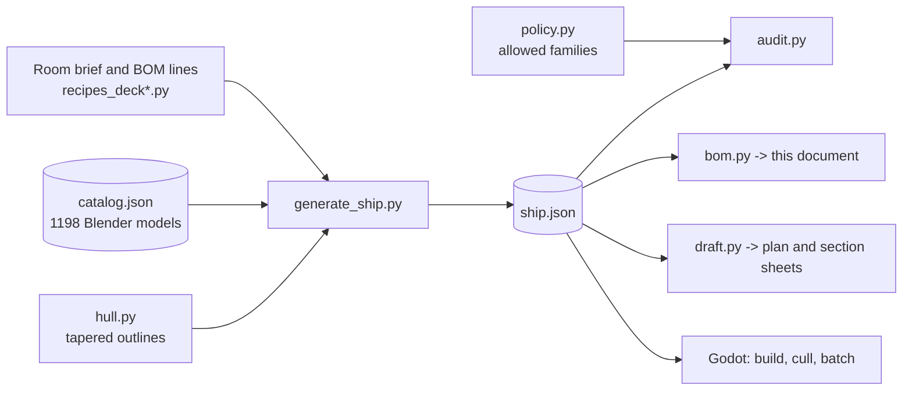

# StarshipGo - Bill of Materials

*Generated by `python tools/layout/bom.py` from `godot/data/ship.json`; do not edit by hand.*

Every room of the ship is furnished from a written bill of materials: each **BOM line** groups the models that serve one function and states **why** they are in the room, how many there are and why they stand where they do. The same data drives the game, the audit (`tools/layout/audit.py`) and the drawings in [`docs/drafts`](drafts/INDEX.md). The placement policy (`tools/layout/policy.py`) says which equipment families may appear in which room; the audit fails the build when a reactor turns up in the mess or a chair stands in a doorway.

## 1. Ship summary

| | |
|---|---|
| Length overall | 66 m |
| Beam | 26 m |
| Decks | 5 (floors at -4.0, +0.0, +4.0, +8.0, +12.0 m) |
| Rooms (incl. circulation) | 68 |
| Doors / arches | 34 sliding doors, 35 open arches and portals |
| Stair towers | 2 (port / starboard), 4 dog-leg flight pairs, 22 risers of 181.8 mm per deck |
| BOM lines | 605 |
| Placed items | 2589 |
| Distinct models used | 638 of 1198 in the catalogue |
| Installed equipment mass | 494.98 t (datasheets: [MACHINE_SPECS](MACHINE_SPECS.md)) |
| Typical / peak electrical load | 8.54 MW / 17.11 MW |
| Installed generation | 42.9 MW |
| Equipment value | 562.61 M cr |

### Decks

| Deck | Name | Hull area | Rooms | Room area | Items | BOM lines | Mass | Typical load | Value cr |
|---|---|---|---|---|---|---|---|---|---|
| 0 | Sky Deck | 859 m2 | 12 | 860 m2 | 462 | 113 | 31.96 t | 77.0 kW | 33.28 M |
| 1 | Command Deck | 1042 m2 | 14 | 1042 m2 | 412 | 104 | 25.55 t | 63.3 kW | 19.56 M |
| 2 | Habitat Deck | 1064 m2 | 15 | 1064 m2 | 596 | 148 | 50.22 t | 353.7 kW | 48.87 M |
| 3 | Engineering Deck | 1244 m2 | 14 | 1245 m2 | 507 | 115 | 220.94 t | 4.95 MW | 259.04 M |
| 4 | Hold Deck | 1146 m2 | 13 | 1146 m2 | 578 | 125 | 166.32 t | 3.10 MW | 201.87 M |

### Design principles

* **Hull lines.** The hull is drafted as one closed, convex outline per deck: an elliptical-sine bow that is tangent to a 26 m parallel mid-body, then a rounded counter that tapers to a narrow transom. The five decks are terraced (Deck 1 overhangs the bow, Deck 3 extends aft to form the hangar platform, Deck 0 is a dome on top, Deck 4 a tapering keel) and wrapped in a smooth, flared and raked outer skin lofted from the room volumes.
* **Room shapes.** Rooms are drafted on a rectangular grid and clipped by the hull: amidships rooms stay rectangular, bow and stern rooms get the diagonal, streamlined walls of the hull. Wedge rooms take equipment along their straight walls.
* **Circulation.** A 3 m spine corridor on the centreline, a mid-ship cross passage and two dog-leg stair towers (port and starboard) stacked on every deck. There are no lifts. Corridors carry only wall and ceiling equipment so the escape route stays clear.
* **Escape.** 2 room(s) are further than the 35 m design limit from a stair tower (longest: Armory, 35.4 m; see section 3). There are always two towers; stair towers are protected spaces with extinguishers, emergency lighting and signage.

## 2. Totals by equipment family

| Family | What it is for | Qty | Distinct models |
|---|---|---|---|
| `ceilinglight` Ceiling light fixture | General lighting sized to the task in the room. | 294 | 14 |
| `safety` Safety equipment | Fire, first-aid, breach and emergency gear required by regulation. | 163 | 15 |
| `sign` Sign | Wayfinding and hazard marking. | 152 | 25 |
| `cabletray` Cable tray | Carries power and data cables overhead or along walls, protected and accessible. | 145 | 4 |
| `chair` Chair | Seating for desks and tables. | 133 | 6 |
| `display` Wall display | Shows status, plans and sensor data to people in the room. | 81 | 19 |
| `pipe` Pipe run | Carries water, coolant or gas. | 78 | 4 |
| `seat` Crew station seat | Operator chair for console positions. | 66 | 7 |
| `beacon` Alert beacon / emergency lamp | Gives light and visual or audible warning during alarms and power loss. | 64 | 4 |
| `rack` Equipment rack | Houses servers, storage and network gear with cooling. | 62 | 13 |
| `console` Workstation console | Operator station with displays and controls for one ship function. | 59 | 16 |
| `tableware` Tableware / table setting | Plates, cups and condiments on tables. | 52 | 11 |
| `terminal` Terminal / datapad | Data entry and information access. | 50 | 8 |
| `galley` Galley equipment | Food storage, cooking and dish-washing equipment. | 45 | 18 |
| `table` Table | Work, meeting or dining surface. | 44 | 8 |
| `duct` Ventilation duct / grille | Moves conditioned air to and from the room. | 35 | 3 |
| `lamp` Lamp | Local task or mood lighting. | 35 | 7 |
| `couch` Sofa / lounge seating | Soft seating for rest and informal meetings. | 34 | 7 |
| `meal` Plated meal | Complete dishes the galley cooks: burgers, pizza, noodles, steak, sushi, salads, curries. | 33 | 25 |
| `drink` Hot and cold drink | Coffee, tea, juices, shakes and smoothies at the table. | 32 | 12 |
| `locker` Personal / equipment locker | Secure storage for personal gear and issue equipment. | 32 | 8 |
| `shelving` Shelving | Open storage for parts, stores and gear. | 31 | 6 |
| `planter` Hydroponic planter | Grows food and oxygen-producing plants. | 30 | 12 |
| `pallet` Pallet | Unit load for forklift handling. | 29 | 9 |
| `plant` Decorative plant | Improves wellbeing and air quality. | 28 | 7 |
| `bench` Bench seating | Fixed seating along walls so the floor stays free for circulation. | 27 | 4 |
| `engtool` Engineering tool / equipment | Tools, carts and test gear for maintenance crews. | 27 | 11 |
| `hangartool` Flight-deck equipment | Servicing, fuelling, launch and safety gear for craft. | 27 | 16 |
| `sconce` Wall sconce | Decorative wall lighting. | 27 | 5 |
| `desk` Desk | Work surface for paperwork and terminals. | 26 | 7 |
| `can` Canned drink | Brand-less soft drinks and cold brew in 150-500 ml aluminium cans; stocked from the vending machines. | 23 | 7 |
| `capacitor` Energy storage | Buffers electrical power so systems ride through peaks and brown-outs. | 23 | 6 |
| `noticeboard` Notice board | Duty rosters and notices. | 18 | 3 |
| `analyzer` Laboratory analyser | Measures and characterises samples (composition, structure, biology) for the science staff. | 17 | 8 |
| `labbench` Laboratory furniture | Benches, hoods and stools for safe wet and dry lab work. | 17 | 7 |
| `bottle` Bottle / flask | Water, wine, spirits, oils and flasks in glass, PET and steel containers. | 16 | 6 |
| `camera` Security sensor | Surveillance and access control for the security department. | 16 | 4 |
| `holo` Holographic projector | Three-dimensional display for briefings and tactical planning. | 16 | 6 |
| `watertank` Water treatment | Stores, purifies and recycles water. | 16 | 7 |
| `bed` Bunk / bed | Sleeping place for crew off shift. | 15 | 3 |
| `floorpanel` Floor panel | Floor finish panel, markings or hatch plate. | 15 | 1 |
| `tank` Process tank / heat exchanger | Stores or conditions fluids for ship systems. | 15 | 10 |
| `cocktail` Glassware and cocktails | Bar glasses and mixed drinks for the wardroom, lounge and the captain's table. | 14 | 6 |
| `generator` Power generator / transformer | Produces and conditions electrical power for the ship. | 13 | 9 |
| `suitrack` Suit / EVA rack | Stores and dresses pressure suits and breathing kit. | 13 | 6 |
| `clock` Ship's clock | Shared time reference for watch changes. | 12 | 3 |
| `coil` Power coil / conduit | Generates or channels plasma and field energy for propulsion. | 12 | 7 |
| `cylinder` Gas cylinder / dewar | Stores compressed or liquefied gases (breathing oxygen, nitrogen) for life support and work. | 12 | 6 |
| `loader` Cargo handling equipment | Moves pallets and containers without crew strain. | 12 | 5 |
| `telescope` Telescope / tracker | Optical observation and star tracking. | 12 | 4 |
| `barrel` Drum / cylinder store | Bulk storage of fluids, chemicals and gases, secured upright so leaks stay contained. | 11 | 4 |
| `doorframe` Doorway frame | Open doorway between spaces that need no door. | 11 | 8 |
| `gym` Exercise equipment | Keeps the crew fit during long voyages. | 11 | 7 |
| `railing` Guard rail | Stops falls near drops and hazards. | 11 | 2 |
| `weaponrack` Weapon rack / armoury fitting | Secure storage of weapons and protective gear. | 11 | 8 |
| `bin` Waste / recycling bin | Collects waste for the recycler; a clean ship stays habitable. | 10 | 4 |
| `commsunit` Communications unit | Radio and intercom equipment for ship and external communications. | 10 | 5 |
| `fountain` Drinking fountain | Drinking water for crew. | 10 | 2 |
| `harvest` Hydroponic harvest crate | Crates of freshly picked crops on their way from the grow beds to the galley. | 10 | 8 |
| `junction` Electrical junction / cabinet | Distributes and protects power and data circuits. | 10 | 8 |
| `storage` Data / secure storage | Archives data and valuables. | 10 | 6 |
| `hanging` Hanging produce | Garlic, chilli, herbs and sausages hung to dry and cure on the galley and store walls. | 9 | 4 |
| `storagebin` Storage bin / tool chest | Small-parts and tool storage. | 9 | 6 |
| `tray` Serving tray / dish | Meal trays, breakfast and drinks trays, hot pans, tureens and bread baskets used to carry and serve food. | 9 | 7 |
| `cabinet` Storage cabinet | Closed storage for supplies the room's staff need daily. | 8 | 3 |
| `cryo` Cryo / stasis equipment | Preserves patients and samples at cryogenic temperature. | 8 | 3 |
| `vending` Vending machine | Snacks, drinks and small parts for crew. | 8 | 4 |
| `crate` Cargo crate / container | Palletised or boxed cargo and supplies, stacked to fit the deck loading. | 7 | 6 |
| `medsupply` Medical supply / IV | Consumables and patient-care accessories. | 7 | 3 |
| `router` Network hardware | Routes data between ship systems. | 7 | 3 |
| `valve` Valve / gauge | Controls and monitors fluid lines. | 7 | 6 |
| `bakery` Bread and baked goods | Fresh bread, pastries and cakes from the galley oven: morale food that fits any table. | 6 | 5 |
| `controlpanel` Wall control panel | Local controls for doors, lights, environment and power. | 6 | 6 |
| `medbed` Patient bed / table | Examination, treatment and recovery of patients. | 6 | 3 |
| `medcabinet` Medical store | Drugs, sterile instruments and consumables, locked and labelled. | 6 | 6 |
| `scrubber` Air scrubber / processor | Removes CO2 and contaminants from ship air. | 6 | 6 |
| `craft` Small craft | Shuttles and pods for transport, rescue and repair outside the hull. | 5 | 4 |
| `forcefield` Force-field barrier | Energy barrier that seals an opening while letting craft or people pass when lowered. | 5 | 3 |
| `instrument` Measuring instrument | Gauges and navigation instruments. | 5 | 4 |
| `warnlight` Warning light | Signals hazards and machine states. | 5 | 2 |
| `antenna` Antenna / relay | Sends and receives subspace and radio traffic; mounted where signal paths and cabling are short. | 4 | 4 |
| `deli` Cheese, charcuterie and dairy | Cheeses, cured meats, eggs and spreads: the cold-store items that fill boards and sandwiches. | 4 | 4 |
| `fruit` Fresh fruit | Fruit from the hydroponics deck and the cold store. | 4 | 3 |
| `microscope` Microscope | Magnifies samples for analysis. | 4 | 3 |
| `reactor` Reactor / power core | Main and auxiliary power generation. | 4 | 4 |
| `specimen` Specimen container | Holds biological and mineral samples safely. | 4 | 4 |
| `surgical` Surgical equipment | Operating-theatre machines. | 4 | 4 |
| `toolbox` Toolbox | Portable hand tools. | 4 | 1 |
| `veg` Vegetables | Fresh vegetables from the grow beds, ready to prepare. | 4 | 3 |
| `buffet` Buffet / display furniture | Hot-pan serving lines, bakery racks and display cases that let a crowd serve itself. | 3 | 2 |
| `cell` Holding-cell fitting | Secure detention furniture and control equipment for the brig. | 3 | 3 |
| `dessert` Dessert | Cakes, ice cream and puddings served after the main meal. | 3 | 3 |
| `ration` Space ration | Foil pouches, tubes, bars and trays: shelf-stable emergency and mission food. | 3 | 3 |
| `sciinstrument` Field / science instrument | Sensors and field labs for science work. | 3 | 3 |
| `medscanner` Diagnostic scanner | Imaging and analysis for diagnosis. | 2 | 2 |
| `nozzle` Thruster / nozzle | Propulsion hardware (installed or held as spare). | 2 | 2 |
| `panellight` Wall light panel | Soft indirect light on walls. | 2 | 1 |
| `turbine` Turbine / pump | Rotating machinery for power and fluid movement. | 2 | 2 |
| `cleaningbot` Cleaning drone | Keeps floors and glass clean without crew time. | 1 | 1 |
| `hatch` Pressure hatch | Sealable access to ducts, tanks and compartments. | 1 | 1 |
| `medtool` Medical instrument | Hand instruments and kits at the bedside. | 1 | 1 |
| `spotlight` Spot / flood light | Bright task lighting for work areas. | 1 | 1 |

## 3. Means of escape

Approximate walking distance (room centre -> spine corridor -> nearest stair tower) for every room; the design limit is 35 m.

| Deck | Room | Walking distance to the nearest stair |
|---|---|---|
| 0 | Forward Spine Corridor (`corF0`) | 10.7 m |
| 0 | Aft Spine Corridor (`corA0`) | 13.9 m |
| 0 | Star Cartography (`starcart`) | 20.5 m |
| 0 | Briefing Theatre (`theatre`) | 19.2 m |
| 0 | Officers' Wardroom & Bar (`wardroom`) | 19.2 m |
| 0 | Library & Archive (`library`) | 18.5 m |
| 0 | Arboretum (`arbor`) | 24.2 m |
| 0 | Observatory (`observ`) | 18.5 m |
| 0 | Flag Officer's Suite (`flag`) | 24.2 m |
| 1 | Forward Spine Corridor (`corF1`) | 17.2 m |
| 1 | Aft Spine Corridor (`corA1`) | 11.9 m |
| 1 | Bridge (`bridge`) | 34.1 m |
| 1 | Captain's Ready Room (`ready`) | 31.8 m |
| 1 | Observation Lounge (`lounge`) | 21.2 m |
| 1 | Conference Room (`conf`) | 31.8 m |
| 1 | Astrometrics (`astro`) | 21.2 m |
| 1 | Officers' Cabins A (`cabinA`) | 17.8 m |
| 1 | Officers' Cabins B (`cabinB`) | 20.8 m |
| 1 | Captain's Quarters (`capt`) | 17.8 m |
| 1 | Communications Centre (`comms`) | 20.8 m |
| 2 | Forward Spine Corridor (`corF2`) | 21.7 m |
| 2 | Aft Spine Corridor (`corA2`) | 13.9 m |
| 2 | Armory (`armory`) | 35.4 m **over the limit** |
| 2 | Galley (`galley`) | 31.1 m |
| 2 | Mess Hall (`mess`) | 22.3 m |
| 2 | Brig (`brig`) | 35.4 m **over the limit** |
| 2 | Security Office (`secoff`) | 31.1 m |
| 2 | Medical Bay (`medbay`) | 22.3 m |
| 2 | Recreation & Gym (`rec`) | 17.8 m |
| 2 | Crew Quarters (`dorm`) | 25.1 m |
| 2 | Science Laboratory (`sci`) | 17.8 m |
| 2 | Hydroponics Garden (`hydro`) | 25.1 m |
| 3 | Forward Spine Corridor (`corF3`) | 18.7 m |
| 3 | Aft Spine Corridor (`corA3`) | 13.9 m |
| 3 | Life Support (`life`) | 29.4 m |
| 3 | Computer Core (`core`) | 22.8 m |
| 3 | Airlock & EVA Prep (`airlock`) | 29.4 m |
| 3 | Main Engineering (`eng`) | 22.8 m |
| 3 | Engineering Workshop (`shop`) | 16.1 m |
| 3 | Cargo Bay (`cargo`) | 25.5 m |
| 3 | Power Distribution (`aux`) | 16.1 m |
| 3 | Spares Depot (`depot`) | 25.5 m |
| 3 | Hangar Bay (`hangar`) | 27.8 m |
| 4 | Forward Spine Corridor (`corF4`) | 16.7 m |
| 4 | Aft Spine Corridor (`corA4`) | 19.9 m |
| 4 | Antimatter Containment (`antimatter`) | 27.4 m |
| 4 | Provisions Hold & Cold Store (`provisions`) | 18.8 m |
| 4 | Water Reclamation Plant (`water`) | 27.4 m |
| 4 | Waste & Recycling Plant (`waste`) | 18.8 m |
| 4 | Fabrication Hall (`fab`) | 19.4 m |
| 4 | Auxiliary Control (`auxctl`) | 19.4 m |
| 4 | Main Cargo Hold (`hold`) | 32.0 m |
| 4 | Drone & Probe Bay (`drone`) | 32.0 m |

## 4. Deck 0 - Sky Deck (floor +12.0 m)

The sky deck is a lens-shaped dome on top of the ship, away from the engines and under the widest sky: star cartography in the bow where the great star map is read, a briefing theatre, the wardroom and bar, the library, an arboretum, the observatory and the flag officer's suite.

| Code | Room | Area | Height | Items | BOM lines | Floor occupancy | Mass | Typical load | Value cr |
|---|---|---|---|---|---|---|---|---|---|
| [CF0](#cf0---forward-spine-corridor) | Forward Spine Corridor | 24.0 m2 | 3.4 m | 10 | 6 | 0 % | 68 kg | 30 W | 7.6 k |
| [CA0](#ca0---aft-spine-corridor) | Aft Spine Corridor | 43.2 m2 | 3.4 m | 20 | 7 | 0 % | 130 kg | 146 W | 12.2 k |
| [LB0](#lb0---mid-ship-stair-lobby) | Mid-ship Stair Lobby | 46.1 m2 | 3.4 m | 15 | 7 | 0 % | 228 kg | 305 W | 83.5 k |
| [SP0](#sp0---port-stair-tower) | Port Stair Tower | 23.8 m2 | 3.4 m | 6 | 3 | 0 % | 20 kg | 39 W | 4.7 k |
| [SS0](#ss0---starboard-stair-tower) | Starboard Stair Tower | 23.8 m2 | 3.4 m | 6 | 3 | 0 % | 12 kg | 29 W | 2.8 k |
| [SC](#sc---star-cartography) | Star Cartography | 220.5 m2 | 4.2 m | 87 | 16 | 20 % | 7.46 t | 28.9 kW | 11.04 M |
| [BT](#bt---briefing-theatre) | Briefing Theatre | 91.8 m2 | 3.4 m | 56 | 11 | 14 % | 1.64 t | 4.7 kW | 1.16 M |
| [WR](#wr---officers-wardroom--bar) | Officers' Wardroom & Bar | 91.8 m2 | 3.4 m | 75 | 16 | 25 % | 2.66 t | 6.0 kW | 584.4 k |
| [LI](#li---library--archive) | Library & Archive | 84.5 m2 | 3.4 m | 59 | 10 | 28 % | 8.73 t | 14.1 kW | 7.33 M |
| [AB](#ab---arboretum) | Arboretum | 62.8 m2 | 3.6 m | 41 | 12 | 26 % | 3.09 t | 9.0 kW | 1.50 M |
| [OB](#ob---observatory) | Observatory | 84.5 m2 | 3.4 m | 43 | 11 | 25 % | 6.01 t | 12.4 kW | 10.15 M |
| [FS](#fs---flag-officers-suite) | Flag Officer's Suite | 62.8 m2 | 3.4 m | 44 | 11 | 27 % | 1.92 t | 1.3 kW | 1.41 M |

### CF0 - Forward Spine Corridor

> Forward spine corridor: the 3 m wide fore-aft escape route and service way of the deck; every room on this side opens onto it.

| Property | Value |
|---|---|
| Room id | `corF0` |
| Deck / department | 0 / transit |
| Floor area | 24.0 m2 (plan bounding box 3.0 x 8.0 m) |
| Ceiling height / volume | 3.4 m / 82 m3 |
| Walls | 4 (0 diagonal hull facets, 0 on the outer hull) |
| Windows | none |
| Items placed / distinct models | 10 / 10 |
| Installed mass / value | 68 kg / 7.6 k cr |
| Electrical load idle / typical / peak | 2 W / 30 W / 33 W |
| Floor occupancy | 0 % (floor-standing footprints / floor area) |
| Lights | 1 real lights, 1 ceiling fixtures |

**Design basis.** Clear width 3.0 m (two people plus a stretcher); no floor-standing items; all equipment is wall or ceiling mounted at a 6 m station spacing; extinguishers every 12 m; emergency lighting every 6 m.

**Adjacency.** Doors to every room of its deck half; open arch to the mid-ship stair lobby. Connected to: Mid-ship Stair Lobby (open, S wall), Star Cartography (open, N wall), Briefing Theatre (portal, W wall), Officers' Wardroom & Bar (portal, E wall).

**Bill of materials - 6 lines, 10 items**

#### CF0-01 - Ceiling lighting (1 item)

*Why:* Linear troffers at about 5 m pitch give 200 lux along the escape route without glare.

| Qty | Model | Family | Mount | Size mm (W x H x D) | Mass kg | Typ. W | Price cr | Function of the family |
|---|---|---|---|---|---|---|---|---|
| 1 | `ceilinglight_square_panel_1x1` | Ceiling light fixture | ceiling | 1000 x 79 x 1000 | 10.6 | 18 | 3,360 | General lighting sized to the task in the room. |
| | **Line subtotal** | | | | **10.6** | **18** | **3,360** | |

#### CF0-02 - Emergency lighting and public address (2 items)

*Why:* Battery-backed emergency lights and PA speakers at 6 m stations keep the route lit and announce alerts during a power or pressure emergency.

| Qty | Model | Family | Mount | Size mm (W x H x D) | Mass kg | Typ. W | Price cr | Function of the family |
|---|---|---|---|---|---|---|---|---|
| 1 | `beacon_emergency_lighting_unit` | Alert beacon / emergency lamp | wall | 426 x 160 x 171 | 1.4 | 6 | 467 | Gives light and visual or audible warning during alarms and power loss. |
| 1 | `beacon_intercom_speaker` | Alert beacon / emergency lamp | wall | 300 x 420 x 77 | 1.1 | 6 | 543 | Gives light and visual or audible warning during alarms and power loss. |
| | **Line subtotal** | | | | **2.5** | **12** | **1,010** | |

#### CF0-03 - Fire extinguishers (1 item)

*Why:* A fire extinguisher within 12 m of any point of the route is the regulation for an occupied corridor.

| Qty | Model | Family | Mount | Size mm (W x H x D) | Mass kg | Typ. W | Price cr | Function of the family |
|---|---|---|---|---|---|---|---|---|
| 1 | `safety_fire_extinguisher` | Safety equipment | wall | 300 x 735 x 199 | 4.3 | 0 | 869 | Fire, first-aid, breach and emergency gear required by regulation. |
| | **Line subtotal** | | | | **4.3** | **0** | **869** | |

#### CF0-04 - Department wayfinding signs (2 items)

*Why:* A department sign above each door on the corridor side tells crew what lies behind it, so nobody opens the wrong hatch in an emergency.

| Qty | Model | Family | Mount | Size mm (W x H x D) | Mass kg | Typ. W | Price cr | Function of the family |
|---|---|---|---|---|---|---|---|---|
| 1 | `sign_dept_bridge` | Sign | wall | 1000 x 400 x 62 | 1.4 | 0 | 179 | Wayfinding and hazard marking. |
| 1 | `sign_dept_mess` | Sign | wall | 1000 x 400 x 60 | 1.3 | 0 | 134 | Wayfinding and hazard marking. |
| | **Line subtotal** | | | | **2.7** | **0** | **313** | |

#### CF0-05 - Overhead cable tray and ventilation trunk (3 items)

*Why:* Power and data cable trays plus a ventilation trunk run above the corridor so every room on the deck can be fed without floor penetrations.

| Qty | Model | Family | Mount | Size mm (W x H x D) | Mass kg | Typ. W | Price cr | Function of the family |
|---|---|---|---|---|---|---|---|---|
| 1 | `cabletray_covered_led_tray` | Cable tray | ceiling | 2000 x 198 x 460 | 18.1 | 0 | 540 | Carries power and data cables overhead or along walls, protected and accessible. |
| 1 | `cabletray_fibre_glow_tray` | Cable tray | ceiling | 2006 x 153 x 360 | 10.9 | 0 | 339 | Carries power and data cables overhead or along walls, protected and accessible. |
| 1 | `cabletray_ladder_tray` | Cable tray | ceiling | 2000 x 173 x 460 | 15.7 | 0 | 472 | Carries power and data cables overhead or along walls, protected and accessible. |
| | **Line subtotal** | | | | **44.7** | **0** | **1,351** | |

#### CF0-06 - Deck evacuation map (1 item)

*Why:* Crew must be able to find the nearest stair from any corridor; the route map sits next to the stair lobby.

| Qty | Model | Family | Mount | Size mm (W x H x D) | Mass kg | Typ. W | Price cr | Function of the family |
|---|---|---|---|---|---|---|---|---|
| 1 | `safety_evac_route_map` | Safety equipment | wall | 1000 x 700 x 60 | 3.6 | 0 | 696 | Fire, first-aid, breach and emergency gear required by regulation. |
| | **Line subtotal** | | | | **3.6** | **0** | **696** | |

**Room totals by family**: cabletray x3, beacon x2, safety x2, sign x2, ceilinglight x1.

Equipment families permitted in this room by the placement policy (30)

`beacon`, `bin`, `cabletray`, `camera`, `ceilinglight`, `ceilingpanel`, `cleaningbot`, `clock`, `controlpanel`, `door`, `doorframe`, `duct`, `floorpanel`, `fountain`, `hatch`, `instrument`, `junction`, `noticeboard`, `panellight`, `pillar`, `pipe`, `railing`, `safety`, `sconce`, `sign`, `spotlight`, `striplight`, `valve`, `wallpanel`, `warnlight`

Anything else (for example reactors, cargo crates or beds, unless listed above) is rejected by the audit.

### CA0 - Aft Spine Corridor

> Aft spine corridor: the 3 m wide fore-aft escape route and service way of the deck; every room on this side opens onto it.

| Property | Value |
|---|---|
| Room id | `corA0` |
| Deck / department | 0 / transit |
| Floor area | 43.2 m2 (plan bounding box 3.0 x 14.4 m) |
| Ceiling height / volume | 3.4 m / 147 m3 |
| Walls | 4 (0 diagonal hull facets, 1 on the outer hull) |
| Windows | none |
| Items placed / distinct models | 20 / 14 |
| Installed mass / value | 130 kg / 12.2 k cr |
| Electrical load idle / typical / peak | 29 W / 146 W / 194 W |
| Floor occupancy | 0 % (floor-standing footprints / floor area) |
| Lights | 3 real lights, 3 ceiling fixtures |

**Design basis.** Clear width 3.0 m (two people plus a stretcher); no floor-standing items; all equipment is wall or ceiling mounted at a 6 m station spacing; extinguishers every 12 m; emergency lighting every 6 m.

**Adjacency.** Doors to every room of its deck half; open arch to the mid-ship stair lobby. Connected to: Mid-ship Stair Lobby (open, N wall), Library & Archive (portal, W wall), Arboretum (portal, W wall), Observatory (door, E wall), Flag Officer's Suite (door, E wall).

**Openings and architecture**

| Element | Model | Qty | Purpose |
|---|---|---|---|
| Sliding door to `observ` | `door_science` | 1 | Pressure-tight compartment door; slides open when someone approaches. |
| Sliding door to `flag` | `door_officer_wood` | 1 | Pressure-tight compartment door; slides open when someone approaches. |

**Bill of materials - 7 lines, 20 items**

#### CA0-01 - Ceiling lighting (3 items)

*Why:* Linear troffers at about 5 m pitch give 200 lux along the escape route without glare.

| Qty | Model | Family | Mount | Size mm (W x H x D) | Mass kg | Typ. W | Price cr | Function of the family |
|---|---|---|---|---|---|---|---|---|
| 1 | `ceilinglight_cage_light` | Ceiling light fixture | ceiling | 214 x 232 x 220 | 1.5 | 10 | 606 | General lighting sized to the task in the room. |
| 1 | `ceilinglight_linear_fixture_1_2` | Ceiling light fixture | ceiling | 1250 x 65 x 160 | 1.7 | 12 | 508 | General lighting sized to the task in the room. |
| 1 | `ceilinglight_round_downlight` | Ceiling light fixture | ceiling | 338 x 110 x 338 | 1.8 | 12 | 638 | General lighting sized to the task in the room. |
| | **Line subtotal** | | | | **5.1** | **34** | **1,752** | |

#### CA0-02 - Emergency lighting and public address (4 items)

*Why:* Battery-backed emergency lights and PA speakers at 6 m stations keep the route lit and announce alerts during a power or pressure emergency.

| Qty | Model | Family | Mount | Size mm (W x H x D) | Mass kg | Typ. W | Price cr | Function of the family |
|---|---|---|---|---|---|---|---|---|
| 2 | `beacon_emergency_lighting_unit` | Alert beacon / emergency lamp | wall | 426 x 160 x 171 | 2.7 | 12 | 934 | Gives light and visual or audible warning during alarms and power loss. |
| 2 | `beacon_intercom_speaker` | Alert beacon / emergency lamp | wall | 300 x 420 x 77 | 2.2 | 12 | 1,086 | Gives light and visual or audible warning during alarms and power loss. |
| | **Line subtotal** | | | | **4.9** | **24** | **2,020** | |

#### CA0-03 - Fire extinguishers (1 item)

*Why:* A fire extinguisher within 12 m of any point of the route is the regulation for an occupied corridor.

| Qty | Model | Family | Mount | Size mm (W x H x D) | Mass kg | Typ. W | Price cr | Function of the family |
|---|---|---|---|---|---|---|---|---|
| 1 | `safety_fire_extinguisher` | Safety equipment | wall | 300 x 735 x 199 | 4.3 | 0 | 869 | Fire, first-aid, breach and emergency gear required by regulation. |
| | **Line subtotal** | | | | **4.3** | **0** | **869** | |

#### CA0-04 - Department wayfinding signs (4 items)

*Why:* A department sign above each door on the corridor side tells crew what lies behind it, so nobody opens the wrong hatch in an emergency.

| Qty | Model | Family | Mount | Size mm (W x H x D) | Mass kg | Typ. W | Price cr | Function of the family |
|---|---|---|---|---|---|---|---|---|
| 2 | `sign_dept_quarters` | Sign | wall | 1000 x 400 x 55 | 2.5 | 0 | 232 | Wayfinding and hazard marking. |
| 2 | `sign_dept_science` | Sign | wall | 1000 x 400 x 56 | 2.6 | 0 | 190 | Wayfinding and hazard marking. |
| | **Line subtotal** | | | | **5.0** | **0** | **422** | |

#### CA0-05 - Overhead cable tray and ventilation trunk (6 items)

*Why:* Power and data cable trays plus a ventilation trunk run above the corridor so every room on the deck can be fed without floor penetrations.

| Qty | Model | Family | Mount | Size mm (W x H x D) | Mass kg | Typ. W | Price cr | Function of the family |
|---|---|---|---|---|---|---|---|---|
| 1 | `cabletray_covered_led_tray` | Cable tray | ceiling | 2000 x 198 x 460 | 18.1 | 0 | 540 | Carries power and data cables overhead or along walls, protected and accessible. |
| 2 | `cabletray_fibre_glow_tray` | Cable tray | ceiling | 2006 x 153 x 360 | 21.8 | 0 | 678 | Carries power and data cables overhead or along walls, protected and accessible. |
| 1 | `cabletray_ladder_tray` | Cable tray | ceiling | 2000 x 173 x 460 | 15.7 | 0 | 472 | Carries power and data cables overhead or along walls, protected and accessible. |
| 2 | `cabletray_perforated_trough` | Cable tray | ceiling | 2000 x 193 x 500 | 41.2 | 0 | 1,126 | Carries power and data cables overhead or along walls, protected and accessible. |
| | **Line subtotal** | | | | **96.8** | **0** | **2,816** | |

#### CA0-06 - Deck evacuation map (1 item)

*Why:* Crew must be able to find the nearest stair from any corridor; the route map sits next to the stair lobby.

| Qty | Model | Family | Mount | Size mm (W x H x D) | Mass kg | Typ. W | Price cr | Function of the family |
|---|---|---|---|---|---|---|---|---|
| 1 | `safety_evac_route_map` | Safety equipment | wall | 1000 x 700 x 60 | 3.6 | 0 | 696 | Fire, first-aid, breach and emergency gear required by regulation. |
| | **Line subtotal** | | | | **3.6** | **0** | **696** | |

#### CA0-07 - Drinking fountain (1 item)

*Why:* Crew working aft need water without going to the mess; a wall fountain at wheelchair height is fitted on the aft corridor.

| Qty | Model | Family | Mount | Size mm (W x H x D) | Mass kg | Typ. W | Price cr | Function of the family |
|---|---|---|---|---|---|---|---|---|
| 1 | `fountain_drinking_fountain_wall_unit` | Drinking fountain | wall | 506 x 540 x 315 | 10.4 | 88 | 3,610 | Drinking water for crew. |
| | **Line subtotal** | | | | **10.4** | **88** | **3,610** | |

**Room totals by family**: cabletray x6, beacon x4, sign x4, ceilinglight x3, safety x2, fountain x1.

Equipment families permitted in this room by the placement policy (30)

`beacon`, `bin`, `cabletray`, `camera`, `ceilinglight`, `ceilingpanel`, `cleaningbot`, `clock`, `controlpanel`, `door`, `doorframe`, `duct`, `floorpanel`, `fountain`, `hatch`, `instrument`, `junction`, `noticeboard`, `panellight`, `pillar`, `pipe`, `railing`, `safety`, `sconce`, `sign`, `spotlight`, `striplight`, `valve`, `wallpanel`, `warnlight`

Anything else (for example reactors, cargo crates or beds, unless listed above) is rejected by the audit.

### LB0 - Mid-ship Stair Lobby

> Mid-ship cross passage that joins the two stair towers and both halves of the spine corridor; the only place a deck changes.

| Property | Value |
|---|---|
| Room id | `lobby0` |
| Deck / department | 0 / transit |
| Floor area | 46.1 m2 (plan bounding box 12.8 x 3.6 m) |
| Ceiling height / volume | 3.4 m / 157 m3 |
| Walls | 4 (0 diagonal hull facets, 0 on the outer hull) |
| Windows | none |
| Items placed / distinct models | 15 / 10 |
| Installed mass / value | 228 kg / 83.5 k cr |
| Electrical load idle / typical / peak | 77 W / 305 W / 417 W |
| Floor occupancy | 0 % (floor-standing footprints / floor area) |
| Lights | 3 real lights, 3 ceiling fixtures |

**Design basis.** 3.6 m deep, 12.8 m long. Only wall-mounted equipment and low benches against the walls; the centre stays clear for two-way traffic on the stairs.

**Adjacency.** Fore and aft spine corridors, port and starboard stair towers. Connected to: Forward Spine Corridor (open, N wall), Aft Spine Corridor (open, S wall), Port Stair Tower (open, W wall), Starboard Stair Tower (open, E wall).

**Bill of materials - 7 lines, 15 items**

#### LB0-01 - Ceiling lighting (3 items)

*Why:* A row of panel lights bright enough (300 lux) to read the signs and safely see the stair entrance.

| Qty | Model | Family | Mount | Size mm (W x H x D) | Mass kg | Typ. W | Price cr | Function of the family |
|---|---|---|---|---|---|---|---|---|
| 1 | `ceilinglight_flush_dome` | Ceiling light fixture | ceiling | 638 x 179 x 638 | 10.4 | 20 | 2,440 | General lighting sized to the task in the room. |
| 1 | `ceilinglight_recessed_hex_cells` | Ceiling light fixture | ceiling | 994 x 73 x 866 | 9.0 | 16 | 2,560 | General lighting sized to the task in the room. |
| 1 | `ceilinglight_ring_light` | Ceiling light fixture | ceiling | 960 x 136 x 960 | 17.1 | 24 | 4,380 | General lighting sized to the task in the room. |
| | **Line subtotal** | | | | **36.5** | **60** | **9,380** | |

#### LB0-02 - Waiting benches (2 items)

*Why:* Padded benches against the walls give somewhere to wait for the next shift change without blocking the route.

| Qty | Model | Family | Mount | Size mm (W x H x D) | Mass kg | Typ. W | Price cr | Function of the family |
|---|---|---|---|---|---|---|---|---|
| 2 | `bench_padded_wall_bench` | Bench seating | wall | 1800 x 1380 x 460 | 135 | 0 | 4,640 | Fixed seating along walls so the floor stays free for circulation. |
| | **Line subtotal** | | | | **135** | **0** | **4,640** | |

#### LB0-03 - Deck number signs (2 items)

*Why:* Large deck numbers above each arch stop crew from taking the wrong flight of stairs.

| Qty | Model | Family | Mount | Size mm (W x H x D) | Mass kg | Typ. W | Price cr | Function of the family |
|---|---|---|---|---|---|---|---|---|
| 2 | `sign_deck_0` | Sign | wall | 800 x 950 x 45 | 3.6 | 0 | 164 | Wayfinding and hazard marking. |
| | **Line subtotal** | | | | **3.6** | **0** | **164** | |

#### LB0-04 - Deck plan boards (2 items)

*Why:* A you-are-here plan board at each side of the passage shows the layout of the deck and the two stair locations.

| Qty | Model | Family | Mount | Size mm (W x H x D) | Mass kg | Typ. W | Price cr | Function of the family |
|---|---|---|---|---|---|---|---|---|
| 2 | `display_deck_plan_board` | Wall display | wall | 1100 x 1675 x 104 | 25.4 | 166 | 47,000 | Shows status, plans and sensor data to people in the room. |
| | **Line subtotal** | | | | **25.4** | **166** | **47,000** | |

#### LB0-05 - Fire fighting and first aid (2 items)

*Why:* Extinguisher and first-aid cabinet sit beside the stairs, the most likely meeting point during an emergency.

| Qty | Model | Family | Mount | Size mm (W x H x D) | Mass kg | Typ. W | Price cr | Function of the family |
|---|---|---|---|---|---|---|---|---|
| 2 | `safety_fire_extinguisher` | Safety equipment | wall | 300 x 735 x 199 | 8.5 | 0 | 1,738 | Fire, first-aid, breach and emergency gear required by regulation. |
| | **Line subtotal** | | | | **8.5** | **0** | **1,738** | |

#### LB0-06 - Notice board and duty roster (2 items)

*Why:* Watch bills and notices are posted where everybody passes every day.

| Qty | Model | Family | Mount | Size mm (W x H x D) | Mass kg | Typ. W | Price cr | Function of the family |
|---|---|---|---|---|---|---|---|---|
| 1 | `noticeboard_digital_message_board` | Notice board | wall | 1400 x 580 x 71 | 3.9 | 30 | 6,040 | Duty rosters and notices. |
| 1 | `noticeboard_duty_roster_display` | Notice board | wall | 1000 x 1300 x 78 | 6.3 | 49 | 9,780 | Duty rosters and notices. |
| | **Line subtotal** | | | | **10.2** | **79** | **15,820** | |

#### LB0-07 - Overhead services (2 items)

*Why:* Fire-suppression nozzles and air diffusers in the ceiling of the busiest junction of the deck.

| Qty | Model | Family | Mount | Size mm (W x H x D) | Mass kg | Typ. W | Price cr | Function of the family |
|---|---|---|---|---|---|---|---|---|
| 2 | `duct_ceiling_square_diffuser` | Ventilation duct / grille | ceiling | 700 x 120 x 703 | 9.1 | 0 | 4,800 | Moves conditioned air to and from the room. |
| | **Line subtotal** | | | | **9.1** | **0** | **4,800** | |

**Room totals by family**: ceilinglight x3, bench x2, display x2, duct x2, noticeboard x2, safety x2, sign x2.

Equipment families permitted in this room by the placement policy (36)

`beacon`, `bench`, `bin`, `bottle`, `cabletray`, `camera`, `can`, `ceilinglight`, `ceilingpanel`, `cleaningbot`, `clock`, `controlpanel`, `display`, `door`, `doorframe`, `duct`, `floorpanel`, `fountain`, `hatch`, `instrument`, `junction`, `noticeboard`, `panellight`, `pillar`, `pipe`, `plant`, `railing`, `safety`, `sconce`, `sign`, `spotlight`, `striplight`, `valve`, `vending`, `wallpanel`, `warnlight`

Anything else (for example reactors, cargo crates or beds, unless listed above) is rejected by the audit.

### SP0 - Port Stair Tower

> Dog-leg stair tower linking all five decks on the port side; two 1.4 m flights and a mid-landing per deck pair.

| Property | Value |
|---|---|
| Room id | `towerA0` |
| Deck / department | 0 / transit |
| Floor area | 23.8 m2 (plan bounding box 6.6 x 3.6 m) |
| Ceiling height / volume | 3.4 m / 81 m3 |
| Walls | 4 (0 diagonal hull facets, 1 on the outer hull) |
| Windows | none |
| Items placed / distinct models | 6 / 6 |
| Installed mass / value | 20 kg / 4.7 k cr |
| Electrical load idle / typical / peak | 2 W / 39 W / 43 W |
| Floor occupancy | 0 % (floor-standing footprints / floor area) |
| Lights | 2 real lights, 2 ceiling fixtures |

**Design basis.** Rise 181.8 mm, going 280 mm, 11 risers per flight, 4.0 m floor-to-floor; 0.9 m handrails on both sides; second means of escape.

**Adjacency.** Opens to the mid-ship stair lobby through a 3.2 m wide arch. Connected to: Mid-ship Stair Lobby (open, E wall).

**Bill of materials - 3 lines, 6 items**

#### SP0-01 - Stair level signage (2 items)

*Why:* Deck number plate and exit arrow at the landing tell people which level they are on and where the exit is.

| Qty | Model | Family | Mount | Size mm (W x H x D) | Mass kg | Typ. W | Price cr | Function of the family |
|---|---|---|---|---|---|---|---|---|
| 1 | `sign_deck_0` | Sign | wall | 800 x 950 x 45 | 1.8 | 0 | 82 | Wayfinding and hazard marking. |
| 1 | `sign_exit_arrow` | Sign | wall | 700 x 240 x 42 | 0.4 | 0 | 38 | Wayfinding and hazard marking. |
| | **Line subtotal** | | | | **2.2** | **0** | **120** | |

#### SP0-02 - Fire extinguisher and emergency lighting (2 items)

*Why:* Stair towers are protected escape routes: a hand extinguisher and battery lights are mandatory at every level.

| Qty | Model | Family | Mount | Size mm (W x H x D) | Mass kg | Typ. W | Price cr | Function of the family |
|---|---|---|---|---|---|---|---|---|
| 1 | `beacon_emergency_lighting_unit` | Alert beacon / emergency lamp | wall | 426 x 160 x 171 | 1.4 | 6 | 467 | Gives light and visual or audible warning during alarms and power loss. |
| 1 | `safety_fire_extinguisher` | Safety equipment | wall | 300 x 735 x 199 | 4.3 | 0 | 869 | Fire, first-aid, breach and emergency gear required by regulation. |
| | **Line subtotal** | | | | **5.6** | **6** | **1,336** | |

#### SP0-03 - Stair lighting (2 items)

*Why:* Recessed downlights over the deck-level strip and, where the ceiling is solid, over the landing light every tread; the stairs are the main way between decks.

| Qty | Model | Family | Mount | Size mm (W x H x D) | Mass kg | Typ. W | Price cr | Function of the family |
|---|---|---|---|---|---|---|---|---|
| 1 | `ceilinglight_emergency_fixture` | Ceiling light fixture | ceiling | 560 x 185 x 171 | 2.3 | 13 | 784 | General lighting sized to the task in the room. |
| 1 | `ceilinglight_flush_dome` | Ceiling light fixture | ceiling | 638 x 179 x 638 | 10.4 | 20 | 2,440 | General lighting sized to the task in the room. |
| | **Line subtotal** | | | | **12.7** | **33** | **3,224** | |

**Room totals by family**: ceilinglight x2, sign x2, beacon x1, safety x1.

Equipment families permitted in this room by the placement policy (30)

`beacon`, `bin`, `cabletray`, `camera`, `ceilinglight`, `ceilingpanel`, `cleaningbot`, `clock`, `controlpanel`, `door`, `doorframe`, `duct`, `floorpanel`, `fountain`, `hatch`, `instrument`, `junction`, `noticeboard`, `panellight`, `pillar`, `pipe`, `railing`, `safety`, `sconce`, `sign`, `spotlight`, `striplight`, `valve`, `wallpanel`, `warnlight`

Anything else (for example reactors, cargo crates or beds, unless listed above) is rejected by the audit.

### SS0 - Starboard Stair Tower

> Dog-leg stair tower linking all five decks on the starboard side; two 1.4 m flights and a mid-landing per deck pair.

| Property | Value |
|---|---|
| Room id | `towerB0` |
| Deck / department | 0 / transit |
| Floor area | 23.8 m2 (plan bounding box 6.6 x 3.6 m) |
| Ceiling height / volume | 3.4 m / 81 m3 |
| Walls | 4 (0 diagonal hull facets, 1 on the outer hull) |
| Windows | none |
| Items placed / distinct models | 6 / 6 |
| Installed mass / value | 12 kg / 2.8 k cr |
| Electrical load idle / typical / peak | 1 W / 29 W / 32 W |
| Floor occupancy | 0 % (floor-standing footprints / floor area) |
| Lights | 2 real lights, 2 ceiling fixtures |

**Design basis.** Rise 181.8 mm, going 280 mm, 11 risers per flight, 4.0 m floor-to-floor; 0.9 m handrails on both sides; second means of escape.

**Adjacency.** Opens to the mid-ship stair lobby through a 3.2 m wide arch. Connected to: Mid-ship Stair Lobby (open, W wall).

**Bill of materials - 3 lines, 6 items**

#### SS0-01 - Stair level signage (2 items)

*Why:* Deck number plate and exit arrow at the landing tell people which level they are on and where the exit is.

| Qty | Model | Family | Mount | Size mm (W x H x D) | Mass kg | Typ. W | Price cr | Function of the family |
|---|---|---|---|---|---|---|---|---|
| 1 | `sign_deck_0` | Sign | wall | 800 x 950 x 45 | 1.8 | 0 | 82 | Wayfinding and hazard marking. |
| 1 | `sign_exit_arrow` | Sign | wall | 700 x 240 x 42 | 0.4 | 0 | 38 | Wayfinding and hazard marking. |
| | **Line subtotal** | | | | **2.2** | **0** | **120** | |

#### SS0-02 - Fire extinguisher and emergency lighting (2 items)

*Why:* Stair towers are protected escape routes: a hand extinguisher and battery lights are mandatory at every level.

| Qty | Model | Family | Mount | Size mm (W x H x D) | Mass kg | Typ. W | Price cr | Function of the family |
|---|---|---|---|---|---|---|---|---|
| 1 | `beacon_emergency_lighting_unit` | Alert beacon / emergency lamp | wall | 426 x 160 x 171 | 1.4 | 6 | 467 | Gives light and visual or audible warning during alarms and power loss. |
| 1 | `safety_fire_extinguisher` | Safety equipment | wall | 300 x 735 x 199 | 4.3 | 0 | 869 | Fire, first-aid, breach and emergency gear required by regulation. |
| | **Line subtotal** | | | | **5.6** | **6** | **1,336** | |

#### SS0-03 - Stair lighting (2 items)

*Why:* Recessed downlights over the deck-level strip and, where the ceiling is solid, over the landing light every tread; the stairs are the main way between decks.

| Qty | Model | Family | Mount | Size mm (W x H x D) | Mass kg | Typ. W | Price cr | Function of the family |
|---|---|---|---|---|---|---|---|---|
| 1 | `ceilinglight_cage_light` | Ceiling light fixture | ceiling | 214 x 232 x 220 | 1.5 | 10 | 606 | General lighting sized to the task in the room. |
| 1 | `ceilinglight_emergency_fixture` | Ceiling light fixture | ceiling | 560 x 185 x 171 | 2.3 | 13 | 784 | General lighting sized to the task in the room. |
| | **Line subtotal** | | | | **3.8** | **23** | **1,390** | |

**Room totals by family**: ceilinglight x2, sign x2, beacon x1, safety x1.

Equipment families permitted in this room by the placement policy (30)

`beacon`, `bin`, `cabletray`, `camera`, `ceilinglight`, `ceilingpanel`, `cleaningbot`, `clock`, `controlpanel`, `door`, `doorframe`, `duct`, `floorpanel`, `fountain`, `hatch`, `instrument`, `junction`, `noticeboard`, `panellight`, `pillar`, `pipe`, `railing`, `safety`, `sconce`, `sign`, `spotlight`, `striplight`, `valve`, `wallpanel`, `warnlight`

Anything else (for example reactors, cargo crates or beds, unless listed above) is rejected by the audit.

### SC - Star Cartography

> The ship's exploration heart: a darkened, domed chart room at the bow where the navigators, astrometrists and the captain build the picture of where the ship is and where it is going.  A holographic star-map table stands in the middle, ringed by operator stations, with the great wall of star charts on the curved bow walls and the bow windows left free for the real stars.

| Property | Value |
|---|---|
| Room id | `starcart` |
| Deck / department | 0 / science |
| Floor area | 220.5 m2 (plan bounding box 25.5 x 12.0 m) |
| Ceiling height / volume | 4.2 m / 926 m3 |
| Walls | 20 (18 diagonal hull facets, 19 on the outer hull) |
| Windows | 11 (40.6 m2 of glazing) |
| Design occupancy | 12 persons |
| Items placed / distinct models | 87 / 52 |
| Installed mass / value | 7.46 t / 11.04 M cr |
| Electrical load idle / typical / peak | 7.7 kW / 28.9 kW / 42.7 kW |
| Floor occupancy | 20 % (floor-standing footprints / floor area) |
| Lights | 14 real lights, 9 ceiling fixtures |

**Design basis.** 26 m x 12 m, 4.2 m high.  The star-map table sits on the ship's centre line 6 m behind the bow glass so everybody looking at it also sees the stars; navigation and sensor stations form two wings (one per side) with their backs to the chart walls; data racks flank the entry; 1.2 m or wider aisles everywhere and a straight 3 m route from the entry to the table.  Light is dim and blue over the table, warmer at the stations so screens stay readable.

**Adjacency.** Forward spine corridor through the 3 m opening in the aft wall; hull windows all round the bow; the bridge is one deck below through the stair towers. Connected to: Forward Spine Corridor (open, S wall).

**Openings and architecture**

| Element | Model | Qty | Purpose |
|---|---|---|---|
| Viewport glazing | (built from hull data) | 11 | Natural view and orientation for the crew; windows are only cut in hull walls. |

**Bill of materials - 16 lines, 87 items**

#### SC-01 - Star-map table (1 item)

*Why:* The briefing table is the room's centre: a holographic star map is projected over it, so the whole crew can plan jumps and survey routes round the same 3-D chart.  It stands on the centre line, in line with the entry and the bow window.

| Qty | Model | Family | Mount | Size mm (W x H x D) | Mass kg | Typ. W | Price cr | Function of the family |
|---|---|---|---|---|---|---|---|---|
| 1 | `holo_briefing_table` | Holographic projector | floor | 1594 x 1790 x 1594 | 600 | 2600 | 841,000 | Three-dimensional display for briefings and tactical planning. |
| | **Line subtotal** | | | | **600** | **2600** | **841,000** | |

#### SC-02 - Table crew stools (6 items)

*Why:* Six science stools ring the table at arm's length so navigators can lean in and reach into the projection; the south side stays open so people walking in from the corridor see the map first.

| Qty | Model | Family | Mount | Size mm (W x H x D) | Mass kg | Typ. W | Price cr | Function of the family |
|---|---|---|---|---|---|---|---|---|
| 6 | `seat_science_stool` | Crew station seat | floor | 558 x 646 x 558 | 37.0 | 0 | 3,168 | Operator chair for console positions. |
| | **Line subtotal** | | | | **37.0** | **0** | **3,168** | |

#### SC-03 - Captain's podium (1 item)

*Why:* The captain briefs the room from a podium at the head of the table with the bow glass behind; it is a low console so the stars stay visible over it.

| Qty | Model | Family | Mount | Size mm (W x H x D) | Mass kg | Typ. W | Price cr | Function of the family |
|---|---|---|---|---|---|---|---|---|
| 1 | `console_captain_podium` | Workstation console | floor | 600 x 1178 x 550 | 50.5 | 210 | 87,500 | Operator station with displays and controls for one ship function. |
| | **Line subtotal** | | | | **50.5** | **210** | **87,500** | |

#### SC-04 - Wing consoles around the table (8 items)

*Why:* Navigation, sensor, science and ops stations stand in a loose arc on each side of the table facing it, so each operator feeds the map while watching it; consoles are 1.2 m or more apart for a seated operator to pass behind.

| Qty | Model | Family | Mount | Size mm (W x H x D) | Mass kg | Typ. W | Price cr | Function of the family |
|---|---|---|---|---|---|---|---|---|
| 1 | `console_navigation` | Workstation console | floor | 1916 x 1390 x 904 | 352 | 470 | 598,000 | Operator station with displays and controls for one ship function. |
| 1 | `console_ops` | Workstation console | floor | 2116 x 1525 x 864 | 401 | 450 | 589,000 | Operator station with displays and controls for one ship function. |
| 1 | `console_science` | Workstation console | floor | 1516 x 1351 x 904 | 260 | 370 | 527,000 | Operator station with displays and controls for one ship function. |
| 1 | `console_sensor` | Workstation console | floor | 1618 x 1390 x 875 | 263 | 410 | 378,000 | Operator station with displays and controls for one ship function. |
| 2 | `seat_ops_chair` | Crew station seat | floor | 635 x 1025 x 630 | 25.8 | 0 | 1,616 | Operator chair for console positions. |
| 2 | `seat_tactical_chair` | Crew station seat | floor | 670 x 1441 x 683 | 41.0 | 0 | 2,200 | Operator chair for console positions. |
| | **Line subtotal** | | | | **1343** | **1700** | **2,095,816** | |

#### SC-05 - Visitors' gallery (2 items)

*Why:* Two curved benches on the entry side let guests, trainees and off-watch officers follow a briefing without standing in the operators' way; they face the table across the open route from the door.

| Qty | Model | Family | Mount | Size mm (W x H x D) | Mass kg | Typ. W | Price cr | Function of the family |
|---|---|---|---|---|---|---|---|---|
| 2 | `bench_curved_lounge_bench` | Bench seating | floor | 2423 x 753 x 883 | 202 | 0 | 7,080 | Fixed seating along walls so the floor stays free for circulation. |
| | **Line subtotal** | | | | **202** | **0** | **7,080** | |

#### SC-06 - Aft wall navigation bays (12 items)

*Why:* Along the aft wall west of the entry three more stations - navigation, ops and communications - serve the crew who work on stellar position fixes and probe telemetry; each operator sits facing the aft wall displays above the console.

| Qty | Model | Family | Mount | Size mm (W x H x D) | Mass kg | Typ. W | Price cr | Function of the family |
|---|---|---|---|---|---|---|---|---|
| 1 | `console_communications` | Workstation console | floor | 1485 x 1371 x 804 | 212 | 370 | 422,000 | Operator station with displays and controls for one ship function. |
| 1 | `console_damage_control` | Workstation console | floor | 1716 x 1390 x 910 | 283 | 450 | 422,000 | Operator station with displays and controls for one ship function. |
| 1 | `console_environmental` | Workstation console | floor | 1812 x 1390 x 854 | 310 | 370 | 547,000 | Operator station with displays and controls for one ship function. |
| 1 | `console_flight_control` | Workstation console | floor | 1616 x 1395 x 954 | 305 | 430 | 475,000 | Operator station with displays and controls for one ship function. |
| 1 | `console_helm` | Workstation console | floor | 1716 x 1432 x 904 | 287 | 400 | 433,000 | Operator station with displays and controls for one ship function. |
| 1 | `console_transporter_control` | Workstation console | floor | 1516 x 1510 x 954 | 278 | 400 | 391,000 | Operator station with displays and controls for one ship function. |
| 1 | `seat_comms_chair` | Crew station seat | floor | 717 x 1340 x 764 | 24.0 | 0 | 1,190 | Operator chair for console positions. |
| 2 | `seat_helm_chair` | Crew station seat | floor | 620 x 1030 x 649 | 26.8 | 0 | 1,744 | Operator chair for console positions. |
| 3 | `seat_ops_chair` | Crew station seat | floor | 635 x 1025 x 630 | 38.7 | 0 | 2,424 | Operator chair for console positions. |
| | **Line subtotal** | | | | **1765** | **2420** | **2,695,358** | |

#### SC-07 - Aft wall display banks (8 items)

*Why:* Screens above the aft consoles repeat what the table shows and carry telemetry from probes and buoys, high enough (centre 2.3 m) to be read from the whole room.

| Qty | Model | Family | Mount | Size mm (W x H x D) | Mass kg | Typ. W | Price cr | Function of the family |
|---|---|---|---|---|---|---|---|---|
| 2 | `display_tactical_wall_screen` | Wall display | wall | 1990 x 1395 x 180 | 66.4 | 380 | 111,000 | Shows status, plans and sensor data to people in the room. |
| 2 | `display_ticker_banner` | Wall display | wall | 2340 x 280 x 118 | 10.4 | 94 | 21,000 | Shows status, plans and sensor data to people in the room. |
| 4 | `display_triple_stack` | Wall display | wall | 850 x 1550 x 83 | 29.2 | 244 | 49,200 | Shows status, plans and sensor data to people in the room. |
| | **Line subtotal** | | | | **106** | **718** | **181,200** | |

#### SC-08 - Data racks (6 items)

*Why:* The star catalogue, sensor logs and the table's rendering cluster live in racks beside the entry, close to the consoles that use them and short cable runs from the cable trays overhead; a different rack type in each slot (crystal archive, GPU, quantum, storage array).

| Qty | Model | Family | Mount | Size mm (W x H x D) | Mass kg | Typ. W | Price cr | Function of the family |
|---|---|---|---|---|---|---|---|---|
| 1 | `rack_blade_server_rack` | Equipment rack | floor | 606 x 2006 x 1006 | 250 | 3000 | 255,000 | Houses servers, storage and network gear with cooling. |
| 1 | `rack_cryogenic_quantum_rack` | Equipment rack | floor | 608 x 2006 x 1006 | 212 | 3000 | 234,000 | Houses servers, storage and network gear with cooling. |
| 1 | `rack_crystal_archive_tower` | Equipment rack | floor | 708 x 2270 x 810 | 234 | 2800 | 302,000 | Houses servers, storage and network gear with cooling. |
| 1 | `rack_gpu_cluster_rack` | Equipment rack | floor | 606 x 2006 x 1006 | 256 | 2900 | 234,000 | Houses servers, storage and network gear with cooling. |
| 1 | `rack_photonic_fiber_rack` | Equipment rack | floor | 606 x 2006 x 1006 | 256 | 2700 | 273,000 | Houses servers, storage and network gear with cooling. |
| 1 | `rack_storage_array` | Equipment rack | floor | 606 x 2006 x 1006 | 256 | 2800 | 231,000 | Houses servers, storage and network gear with cooling. |
| | **Line subtotal** | | | | **1463** | **17200** | **1,529,000** | |

#### SC-09 - The great wall of star charts (8 items)

*Why:* The slanting bow walls carry the ship's chart library as framed holographic panels and circular sector displays: constellations, surveyed systems, nebula and the current route; each panel is lit by its own glow so it reads as a window onto space.

| Qty | Model | Family | Mount | Size mm (W x H x D) | Mass kg | Typ. W | Price cr | Function of the family |
|---|---|---|---|---|---|---|---|---|
| 3 | `display_circular_display` | Wall display | wall | 1016 x 1016 x 115 | 24.0 | 219 | 44,100 | Shows status, plans and sensor data to people in the room. |
| 3 | `display_hex_display` | Wall display | wall | 1090 x 952 x 105 | 21.5 | 207 | 37,800 | Shows status, plans and sensor data to people in the room. |
| 2 | `panellight_backlit_rectangle` | Wall light panel | wall | 660 x 960 x 62 | 8.8 | 18 | 1,992 | Soft indirect light on walls. |
| | **Line subtotal** | | | | **54.4** | **444** | **83,892** | |

#### SC-10 - Wall lights between the bow windows (9 items)

*Why:* Each short pier between two bow windows carries a frosted wall light, so the curve of the bow glass is outlined softly without glare on the screens.

| Qty | Model | Family | Mount | Size mm (W x H x D) | Mass kg | Typ. W | Price cr | Function of the family |
|---|---|---|---|---|---|---|---|---|
| 9 | `sconce_frosted_glass_shell` | Wall sconce | wall | 200 x 349 x 221 | 11.9 | 33 | 4,032 | Decorative wall lighting. |
| | **Line subtotal** | | | | **11.9** | **33** | **4,032** | |

#### SC-11 - Telescopes and star trackers (4 items)

*Why:* A star-tracker scope and an astrometric dish stand near the bow glass so the navigators can calibrate the chart against the real sky; they are kept a metre back from the windows so the glass stays clear.

| Qty | Model | Family | Mount | Size mm (W x H x D) | Mass kg | Typ. W | Price cr | Function of the family |
|---|---|---|---|---|---|---|---|---|
| 1 | `telescope_astrometric_dish` | Telescope / tracker | floor | 918 x 1801 x 698 | 226 | 350 | 656,000 | Optical observation and star tracking. |
| 1 | `telescope_observation_telescope` | Telescope / tracker | floor | 1099 x 1907 x 1180 | 498 | 780 | 1,260,000 | Optical observation and star tracking. |
| 1 | `telescope_spectrograph_tripod` | Telescope / tracker | floor | 1018 x 1554 x 912 | 266 | 430 | 794,000 | Optical observation and star tracking. |
| 1 | `telescope_star_tracker_scope` | Telescope / tracker | floor | 492 x 1677 x 802 | 128 | 240 | 308,000 | Optical observation and star tracking. |
| | **Line subtotal** | | | | **1118** | **1800** | **3,018,000** | |

#### SC-12 - Sector globes and plinths (2 items)

*Why:* Smaller holographic projectors on both wings show a single sector in detail or the ship's own position: the map globe at the west and the ship schematic projector at the east.

| Qty | Model | Family | Mount | Size mm (W x H x D) | Mass kg | Typ. W | Price cr | Function of the family |
|---|---|---|---|---|---|---|---|---|
| 1 | `holo_ship_schematic_projector` | Holographic projector | floor | 896 x 1450 x 896 | 148 | 830 | 232,000 | Three-dimensional display for briefings and tactical planning. |
| 1 | `holo_star_map_globe` | Holographic projector | floor | 696 x 1741 x 696 | 101 | 630 | 188,000 | Three-dimensional display for briefings and tactical planning. |
| | **Line subtotal** | | | | **250** | **1460** | **420,000** | |

#### SC-13 - Paper-style chart tables (6 items)

*Why:* Two chart tables with a clear top, one per wing, carry the navigators' astrolabe, sextant and chronometers - the traditional instruments they use to cross-check the computer; the tops are otherwise left empty for spreading charts.

| Qty | Model | Family | Mount | Size mm (W x H x D) | Mass kg | Typ. W | Price cr | Function of the family |
|---|---|---|---|---|---|---|---|---|
| 1 | `instrument_astrolabe` | Measuring instrument | table | 218 x 266 x 218 | 3.0 | 9 | 4,820 | Gauges and navigation instruments. |
| 1 | `instrument_brass_chronometer` | Measuring instrument | table | 240 x 130 x 180 | 1.1 | 7 | 1,900 | Gauges and navigation instruments. |
| 1 | `instrument_nav_compass` | Measuring instrument | table | 212 x 116 x 212 | 1.1 | 7 | 2,010 | Gauges and navigation instruments. |
| 1 | `instrument_sextant` | Measuring instrument | table | 225 x 70 x 218 | 0.7 | 6 | 1,370 | Gauges and navigation instruments. |
| 2 | `table_briefing_table` | Table | floor | 1662 x 1226 x 1662 | 223 | 0 | 9,480 | Work, meeting or dining surface. |
| | **Line subtotal** | | | | **229** | **28** | **19,580** | |

#### SC-14 - Green corners (2 items)

*Why:* Plants soften the dome: a ficus tree by each chart wall and low planter boxes in front of the bow glass (under the sill, so the view stays free) keep the long hours in the dark room humane.

| Qty | Model | Family | Mount | Size mm (W x H x D) | Mass kg | Typ. W | Price cr | Function of the family |
|---|---|---|---|---|---|---|---|---|
| 2 | `plant_planter_box` | Decorative plant | floor | 1240 x 838 x 390 | 70.2 | 0 | 4,340 | Improves wellbeing and air quality. |
| | **Line subtotal** | | | | **70.2** | **0** | **4,340** | |

#### SC-15 - Ceiling lighting and star-map halo (10 items)

*Why:* Soft cool downlights give only 100 lux so the hologram stays vivid, with a ring light directly above the star-map table; the light over the podium is a warmer stage spot so the speaker is visible.

| Qty | Model | Family | Mount | Size mm (W x H x D) | Mass kg | Typ. W | Price cr | Function of the family |
|---|---|---|---|---|---|---|---|---|
| 1 | `ceilinglight_cage_light` | Ceiling light fixture | ceiling | 214 x 232 x 220 | 1.5 | 10 | 606 | General lighting sized to the task in the room. |
| 1 | `ceilinglight_flush_dome` | Ceiling light fixture | ceiling | 638 x 179 x 638 | 10.4 | 20 | 2,440 | General lighting sized to the task in the room. |
| 2 | `ceilinglight_recessed_hex_cells` | Ceiling light fixture | ceiling | 994 x 73 x 866 | 18.1 | 32 | 5,120 | General lighting sized to the task in the room. |
| 3 | `ceilinglight_ring_light` | Ceiling light fixture | ceiling | 960 x 136 x 960 | 51.3 | 72 | 13,140 | General lighting sized to the task in the room. |
| 1 | `ceilinglight_round_downlight` | Ceiling light fixture | ceiling | 338 x 110 x 338 | 1.8 | 12 | 638 | General lighting sized to the task in the room. |
| 1 | `ceilinglight_square_panel_1x1` | Ceiling light fixture | ceiling | 1000 x 79 x 1000 | 10.6 | 18 | 3,360 | General lighting sized to the task in the room. |
| 1 | `spotlight_stage_truss_lights` | Spot / flood light | ceiling | 1400 x 360 x 846 | 60.4 | 98 | 17,000 | Bright task lighting for work areas. |
| | **Line subtotal** | | | | **154** | **262** | **42,304** | |

#### SC-16 - Safety and signs (2 items)

*Why:* An extinguisher beside each aft wall bay, the science department sign over the entry and the exit sign keep the room compliant even though it is kept dark.

| Qty | Model | Family | Mount | Size mm (W x H x D) | Mass kg | Typ. W | Price cr | Function of the family |
|---|---|---|---|---|---|---|---|---|
| 1 | `clock_dual_time_ship_clock` | Ship's clock | wall | 900 x 420 x 98 | 3.4 | 2 | 3,610 | Shared time reference for watch changes. |
| 1 | `sign_dept_science` | Sign | wall | 1000 x 400 x 56 | 1.3 | 0 | 95 | Wayfinding and hazard marking. |
| | **Line subtotal** | | | | **4.7** | **2** | **3,705** | |

**Room totals by family**: seat x16, display x14, console x11, ceilinglight x9, sconce x9, rack x6, instrument x4, telescope x4, holo x3, bench x2, panellight x2, plant x2, table x2, clock x1, sign x1, spotlight x1.

Equipment families permitted in this room by the placement policy (53)

`analyzer`, `antenna`, `beacon`, `bench`, `bin`, `cabinet`, `cabletray`, `camera`, `ceilinglight`, `ceilingpanel`, `chair`, `cleaningbot`, `clock`, `commsunit`, `console`, `controlpanel`, `couch`, `desk`, `display`, `door`, `doorframe`, `duct`, `floorpanel`, `fountain`, `hatch`, `holo`, `instrument`, `junction`, `lamp`, `noticeboard`, `panellight`, `pillar`, `pipe`, `plant`, `rack`, `railing`, `router`, `safety`, `sciinstrument`, `sconce`, `seat`, `shelving`, `sign`, `spotlight`, `storage`, `striplight`, `table`, `tableware`, `telescope`, `terminal`, `valve`, `wallpanel`, `warnlight`

Anything else (for example reactors, cargo crates or beds, unless listed above) is rejected by the audit.

### BT - Briefing Theatre

> Tiered-seating briefing room for the whole officer corps: mission briefings, science lectures and film nights are given here to up to 24 people facing a wall-size display, with a lectern and a holographic projector for the speaker.

| Property | Value |
|---|---|
| Room id | `theatre` |
| Deck / department | 0 / command |
| Floor area | 91.8 m2 (plan bounding box 11.5 x 8.0 m) |
| Ceiling height / volume | 3.4 m / 312 m3 |
| Walls | 6 (2 diagonal hull facets, 3 on the outer hull) |
| Windows | 2 (3.9 m2 of glazing) |
| Design occupancy | 24 persons |
| Items placed / distinct models | 56 / 25 |
| Installed mass / value | 1.64 t / 1.16 M cr |
| Electrical load idle / typical / peak | 1.4 kW / 4.7 kW / 6.8 kW |
| Floor occupancy | 14 % (floor-standing footprints / floor area) |
| Lights | 8 real lights, 6 ceiling fixtures |

**Design basis.** 11.5 m x 8 m.  The display wall is the north wall; 4 rows of 6 seats at 1.1 m pitch with a 1.0 m centre aisle (seat heights rise from the front row to the back row so every head sees the screen); the speaker's zone in front of the screen is 2.3 m deep; the 2 m door zone and its walkway stay clear; the projection console is at the back.

**Adjacency.** Forward spine corridor through the 2.4 m door in the east wall; hull windows on the west wall are screened by the audience-side wall lights. Connected to: Forward Spine Corridor (portal, E wall).

**Openings and architecture**

| Element | Model | Qty | Purpose |
|---|---|---|---|
| Doorway frame | `doorframe_light_strip_square` | 1 | Open doorway between spaces that need no door. |
| Viewport glazing | (built from hull data) | 2 | Natural view and orientation for the crew; windows are only cut in hull walls. |

**Bill of materials - 11 lines, 56 items**

#### BT-01 - Display wall (2 items)

*Why:* A wall-size viewscreen on the north wall is the point of the room; two tactical screens beside it show the agenda or a second image.  The audience looks along the room's long axis so nobody sits at a bad angle.

| Qty | Model | Family | Mount | Size mm (W x H x D) | Mass kg | Typ. W | Price cr | Function of the family |
|---|---|---|---|---|---|---|---|---|
| 2 | `display_tactical_wall_screen` | Wall display | wall | 1990 x 1395 x 180 | 66.4 | 380 | 111,000 | Shows status, plans and sensor data to people in the room. |
| | **Line subtotal** | | | | **66.4** | **380** | **111,000** | |

#### BT-02 - Lectern and projector (3 items)

*Why:* The speaker stands at the captain's podium beside the screen's centre; a briefing projector next to it throws 3-D plots (courses, formations) into the space in front of the first row.

| Qty | Model | Family | Mount | Size mm (W x H x D) | Mass kg | Typ. W | Price cr | Function of the family |
|---|---|---|---|---|---|---|---|---|
| 1 | `console_captain_podium` | Workstation console | floor | 600 x 1178 x 550 | 50.5 | 210 | 87,500 | Operator station with displays and controls for one ship function. |
| 1 | `holo_briefing_projector` | Holographic projector | floor | 598 x 1330 x 1204 | 112 | 650 | 171,000 | Three-dimensional display for briefings and tactical planning. |
| 1 | `holo_comm_bust_projector` | Holographic projector | floor | 554 x 1480 x 554 | 48.9 | 460 | 73,400 | Three-dimensional display for briefings and tactical planning. |
| | **Line subtotal** | | | | **211** | **1320** | **331,900** | |

#### BT-03 - Speaker's table (2 items)

*Why:* A small table by the lectern holds a water jug and cups for long briefings and the speaker's datapads.

| Qty | Model | Family | Mount | Size mm (W x H x D) | Mass kg | Typ. W | Price cr | Function of the family |
|---|---|---|---|---|---|---|---|---|
| 1 | `table_side_table` | Table | floor | 522 x 554 x 542 | 5.1 | 0 | 320 | Work, meeting or dining surface. |
| 1 | `tableware_pitcher` | Tableware / table setting | table | 280 x 258 x 176 | 3.7 | 0 | 1,240 | Plates, cups and condiments on tables. |
| | **Line subtotal** | | | | **8.8** | **0** | **1,560** | |

#### BT-04 - Audience seating, rows 1 and 2 (12 items)

*Why:* The two front rows use ordinary stackable chairs (mess and folding chairs) that can be removed for a standing briefing; each row is split by a 1.0 m centre aisle that gives access to the seats without climbing over anybody.

| Qty | Model | Family | Mount | Size mm (W x H x D) | Mass kg | Typ. W | Price cr | Function of the family |
|---|---|---|---|---|---|---|---|---|
| 6 | `chair_folding_chair` | Chair | floor | 446 x 928 x 465 | 20.5 | 0 | 1,320 | Seating for desks and tables. |
| 6 | `chair_mess_chair` | Chair | floor | 420 x 890 x 460 | 20.5 | 0 | 1,320 | Seating for desks and tables. |
| | **Line subtotal** | | | | **40.9** | **0** | **2,640** | |

#### BT-05 - Audience seating, rows 3 and 4 (12 items)

*Why:* The back rows use taller seats - swivel chairs and then bar stools - which lifts the heads of the back row above the front rows exactly as a stepped floor would, so the screen stays visible from every seat.

| Qty | Model | Family | Mount | Size mm (W x H x D) | Mass kg | Typ. W | Price cr | Function of the family |
|---|---|---|---|---|---|---|---|---|
| 6 | `chair_swivel_office_chair` | Chair | floor | 623 x 1125 x 625 | 50.9 | 0 | 2,754 | Seating for desks and tables. |
| 6 | `couch_bar_stool` | Sofa / lounge seating | floor | 478 x 960 x 478 | 39.3 | 0 | 2,844 | Soft seating for rest and informal meetings. |
| | **Line subtotal** | | | | **90.2** | **0** | **5,598** | |

#### BT-06 - Projection and sound console (4 items)

*Why:* A control console at the back of the room, facing the screen, runs the display wall, the speakers and the room lights; the operator can see the whole audience.

| Qty | Model | Family | Mount | Size mm (W x H x D) | Mass kg | Typ. W | Price cr | Function of the family |
|---|---|---|---|---|---|---|---|---|
| 2 | `commsunit_speaker_grille` | Communications unit | wall | 600 x 300 x 105 | 11.0 | 44 | 11,020 | Radio and intercom equipment for ship and external communications. |
| 1 | `console_ops` | Workstation console | floor | 2116 x 1525 x 864 | 401 | 450 | 589,000 | Operator station with displays and controls for one ship function. |
| 1 | `seat_ops_chair` | Crew station seat | floor | 635 x 1025 x 630 | 12.9 | 0 | 808 | Operator chair for console positions. |
| | **Line subtotal** | | | | **425** | **494** | **600,828** | |

#### BT-07 - Refreshment point (2 items)

*Why:* Coffee and a water cooler by the door let people take a drink into the theatre without queueing in the corridor.

| Qty | Model | Family | Mount | Size mm (W x H x D) | Mass kg | Typ. W | Price cr | Function of the family |
|---|---|---|---|---|---|---|---|---|
| 1 | `fountain_water_cooler_tower` | Drinking fountain | floor | 360 x 1293 x 425 | 23.1 | 130 | 7,510 | Drinking water for crew. |
| 1 | `galley_coffee_machine` | Galley equipment | floor | 900 x 1725 x 642 | 170 | 2300 | 57,300 | Food storage, cooking and dish-washing equipment. |
| | **Line subtotal** | | | | **193** | **2430** | **64,810** | |

#### BT-08 - Side storage (1 item)

*Why:* A wall cabinet for the projector's spare lamps, remotes and cables hangs at the back of the room, out of the speaker's sight and above the back-row seats.

| Qty | Model | Family | Mount | Size mm (W x H x D) | Mass kg | Typ. W | Price cr | Function of the family |
|---|---|---|---|---|---|---|---|---|
| 1 | `cabinet_wall_storage_lockers` | Storage cabinet | wall | 1200 x 800 x 400 | 54.4 | 0 | 2,250 | Closed storage for supplies the room's staff need daily. |
| | **Line subtotal** | | | | **54.4** | **0** | **2,250** | |

#### BT-09 - Plants and wall lights (9 items)

*Why:* A ficus at the speaker's end and sconces along the walls give the room a warmer, more finished look than a bare bulkhead and keep the aisles lit when the screen is dark.

| Qty | Model | Family | Mount | Size mm (W x H x D) | Mass kg | Typ. W | Price cr | Function of the family |
|---|---|---|---|---|---|---|---|---|
| 2 | `plant_ficus_tree` | Decorative plant | floor | 888 x 1936 x 1007 | 308 | 0 | 18,940 | Improves wellbeing and air quality. |
| 5 | `sconce_art_deco_fan` | Wall sconce | wall | 480 x 300 x 62 | 3.8 | 20 | 1,275 | Decorative wall lighting. |
| 2 | `sconce_lantern_sconce` | Wall sconce | wall | 164 x 475 x 231 | 3.2 | 7 | 854 | Decorative wall lighting. |
| | **Line subtotal** | | | | **315** | **27** | **21,069** | |

#### BT-10 - Stage and house lighting (6 items)

*Why:* A stage truss with spots over the lectern lights the speaker; dimmable downlights over the audience are low so the screen is not washed out; a cool omni glows from the display wall onto the front rows.

| Qty | Model | Family | Mount | Size mm (W x H x D) | Mass kg | Typ. W | Price cr | Function of the family |
|---|---|---|---|---|---|---|---|---|
| 1 | `ceilinglight_emergency_fixture` | Ceiling light fixture | ceiling | 560 x 185 x 171 | 2.3 | 13 | 784 | General lighting sized to the task in the room. |
| 1 | `ceilinglight_recessed_hex_cells` | Ceiling light fixture | ceiling | 994 x 73 x 866 | 9.0 | 16 | 2,560 | General lighting sized to the task in the room. |
| 2 | `ceilinglight_round_downlight` | Ceiling light fixture | ceiling | 338 x 110 x 338 | 3.6 | 24 | 1,276 | General lighting sized to the task in the room. |
| 2 | `ceilinglight_square_panel_1x1` | Ceiling light fixture | ceiling | 1000 x 79 x 1000 | 21.2 | 36 | 6,720 | General lighting sized to the task in the room. |
| | **Line subtotal** | | | | **36.1** | **89** | **11,340** | |

#### BT-11 - Safety and signs (2 items)

*Why:* Extinguisher by the door, an exit sign above it and the bridge-department sign mark the theatre as a command space.

| Qty | Model | Family | Mount | Size mm (W x H x D) | Mass kg | Typ. W | Price cr | Function of the family |
|---|---|---|---|---|---|---|---|---|
| 1 | `sign_dept_bridge` | Sign | wall | 1000 x 400 x 62 | 1.4 | 0 | 179 | Wayfinding and hazard marking. |
| 1 | `sign_exit_arrow` | Sign | wall | 700 x 240 x 42 | 0.4 | 0 | 38 | Wayfinding and hazard marking. |
| | **Line subtotal** | | | | **1.8** | **0** | **217** | |

**Room totals by family**: chair x18, sconce x7, ceilinglight x6, couch x6, commsunit x2, console x2, display x2, holo x2, plant x2, sign x2, cabinet x1, doorframe x1, fountain x1, galley x1, seat x1, table x1, tableware x1.

Equipment families permitted in this room by the placement policy (47)

`beacon`, `bench`, `bin`, `cabinet`, `cabletray`, `camera`, `ceilinglight`, `ceilingpanel`, `chair`, `cleaningbot`, `clock`, `commsunit`, `console`, `controlpanel`, `couch`, `desk`, `display`, `door`, `doorframe`, `duct`, `floorpanel`, `fountain`, `galley`, `hatch`, `holo`, `instrument`, `junction`, `lamp`, `noticeboard`, `panellight`, `pillar`, `pipe`, `plant`, `railing`, `safety`, `sconce`, `seat`, `shelving`, `sign`, `spotlight`, `striplight`, `table`, `tableware`, `terminal`, `valve`, `wallpanel`, `warnlight`

Anything else (for example reactors, cargo crates or beds, unless listed above) is rejected by the audit.

### WR - Officers' Wardroom & Bar

> The officers' club of the ship: a formal dining table for the captain's dinners, a bar with a small galley behind it, and a lounge by the starboard window where off-duty officers talk, read and watch the stars.

| Property | Value |
|---|---|
| Room id | `wardroom` |
| Deck / department | 0 / crew |
| Floor area | 91.8 m2 (plan bounding box 11.5 x 8.0 m) |
| Ceiling height / volume | 3.4 m / 312 m3 |
| Walls | 6 (2 diagonal hull facets, 3 on the outer hull) |
| Windows | 1 (4.9 m2 of glazing) |
| Design occupancy | 20 persons |
| Items placed / distinct models | 75 / 51 |
| Installed mass / value | 2.66 t / 584.4 k cr |
| Electrical load idle / typical / peak | 1.7 kW / 6.0 kW / 8.8 kW |
| Floor occupancy | 25 % (floor-standing footprints / floor area) |
| Lights | 9 real lights, 9 ceiling fixtures |

**Design basis.** 11.5 m x 8 m, 3.4 m high.  Bar and back-bar along the north wall (about 4 m of counter, 1.0 m service gap behind it), dining table for 8 in the open south-west half with 1.3 m chair aisles, lounge group in front of the 2.6 m window, fireplace nook in the north-east corner, drinks and snack machines beside the door.  The door zone and the straight route from the door to the window stay clear.

**Adjacency.** Forward spine corridor through the west door; hull window on the starboard wall; the galley is a deck below, so the bar keeps its own refrigerator, dishwasher and coffee machine. Connected to: Forward Spine Corridor (portal, W wall).

**Openings and architecture**

| Element | Model | Qty | Purpose |
|---|---|---|---|
| Doorway frame | `doorframe_ibeam_portal` | 1 | Open doorway between spaces that need no door. |
| Viewport glazing | (built from hull data) | 1 | Natural view and orientation for the crew; windows are only cut in hull walls. |

**Bill of materials - 16 lines, 75 items**

#### WR-01 - Back bar equipment (4 items)

*Why:* A refrigerator, dishwasher, sink and coffee machine stand against the north wall behind the counter, so the steward never leaves the bar to wash glasses or fetch ice.

| Qty | Model | Family | Mount | Size mm (W x H x D) | Mass kg | Typ. W | Price cr | Function of the family |
|---|---|---|---|---|---|---|---|---|
| 1 | `galley_coffee_machine` | Galley equipment | floor | 900 x 1725 x 642 | 170 | 2300 | 57,300 | Food storage, cooking and dish-washing equipment. |
| 1 | `galley_dishwasher` | Galley equipment | floor | 900 x 930 x 840 | 124 | 1700 | 43,100 | Food storage, cooking and dish-washing equipment. |
| 1 | `galley_refrigerator` | Galley equipment | floor | 800 x 1903 x 840 | 203 | 320 | 78,400 | Food storage, cooking and dish-washing equipment. |
| 1 | `galley_sink_unit` | Galley equipment | floor | 1420 x 1330 x 707 | 225 | 0 | 76,600 | Food storage, cooking and dish-washing equipment. |
| | **Line subtotal** | | | | **721** | **4320** | **255,400** | |

#### WR-02 - Bar counter (9 items)

*Why:* Three counter modules form the bar: customers sit on the south side, the steward works on the north side; the 1.1 m gap between the counter and the back-bar units is a comfortable working aisle.

| Qty | Model | Family | Mount | Size mm (W x H x D) | Mass kg | Typ. W | Price cr | Function of the family |
|---|---|---|---|---|---|---|---|---|
| 3 | `table_bar_counter` | Table | floor | 1800 x 1062 x 715 | 138 | 0 | 5,100 | Work, meeting or dining surface. |
| 2 | `tableware_bottle_and_glasses` | Tableware / table setting | table | 260 x 315 x 160 | 7.8 | 0 | 2,760 | Plates, cups and condiments on tables. |
| 1 | `tableware_bread_basket` | Tableware / table setting | table | 344 x 135 x 244 | 3.2 | 0 | 1,200 | Plates, cups and condiments on tables. |
| 1 | `tableware_condiments` | Tableware / table setting | table | 220 x 190 x 100 | 1.2 | 0 | 373 | Plates, cups and condiments on tables. |
| 1 | `tableware_cups_and_mugs` | Tableware / table setting | table | 318 x 100 x 283 | 2.5 | 0 | 957 | Plates, cups and condiments on tables. |
| 1 | `tableware_fruit_bowl` | Tableware / table setting | table | 320 x 180 x 320 | 5.1 | 0 | 1,850 | Plates, cups and condiments on tables. |
| | **Line subtotal** | | | | **157** | **0** | **12,240** | |

#### WR-03 - Bar stools (4 items)

*Why:* Four stools along the customer side of the bar (one per 1.3 m of counter, so a person can slip between two of them) give a place to perch with a drink.

| Qty | Model | Family | Mount | Size mm (W x H x D) | Mass kg | Typ. W | Price cr | Function of the family |
|---|---|---|---|---|---|---|---|---|
| 4 | `couch_bar_stool` | Sofa / lounge seating | floor | 478 x 960 x 478 | 26.2 | 0 | 1,896 | Soft seating for rest and informal meetings. |
| | **Line subtotal** | | | | **26.2** | **0** | **1,896** | |

#### WR-04 - Drinks and snack machines (3 items)

*Why:* Machines beside the door sell soft drinks and snacks around the clock, when the steward is off duty, and keep the queue out of the bar.

| Qty | Model | Family | Mount | Size mm (W x H x D) | Mass kg | Typ. W | Price cr | Function of the family |
|---|---|---|---|---|---|---|---|---|
| 1 | `fountain_water_cooler_tower` | Drinking fountain | floor | 360 x 1293 x 425 | 23.1 | 130 | 7,510 | Drinking water for crew. |
| 1 | `vending_drink_machine` | Vending machine | floor | 956 x 1903 x 907 | 253 | 570 | 100,000 | Snacks, drinks and small parts for crew. |
| 1 | `vending_snack_machine` | Vending machine | floor | 900 x 1903 x 847 | 209 | 520 | 67,900 | Snacks, drinks and small parts for crew. |
| | **Line subtotal** | | | | **484** | **1220** | **175,410** | |

#### WR-05 - Dining table (1 item)

*Why:* A 3 m table seats eight for the captain's dinner and for working lunches; it stands in the middle of the south-west half so servers and guests can walk all round it.

| Qty | Model | Family | Mount | Size mm (W x H x D) | Mass kg | Typ. W | Price cr | Function of the family |
|---|---|---|---|---|---|---|---|---|
| 1 | `table_conference_table` | Table | floor | 3010 x 789 x 1210 | 101 | 0 | 4,410 | Work, meeting or dining surface. |
| | **Line subtotal** | | | | **101** | **0** | **4,410** | |

#### WR-06 - Dining chairs (8 items)

*Why:* Six mess chairs on the long sides and an armchair at each end (host and guest of honour); every chair faces the table and is tucked in 0.1 m from it.

| Qty | Model | Family | Mount | Size mm (W x H x D) | Mass kg | Typ. W | Price cr | Function of the family |
|---|---|---|---|---|---|---|---|---|
| 2 | `chair_armchair` | Chair | floor | 860 x 995 x 800 | 24.0 | 0 | 1,036 | Seating for desks and tables. |
| 6 | `chair_mess_chair` | Chair | floor | 420 x 890 x 460 | 20.5 | 0 | 1,320 | Seating for desks and tables. |
| | **Line subtotal** | | | | **44.5** | **0** | **2,356** | |

#### WR-07 - Table setting (8 items)

*Why:* The table is laid for dinner: plates, cutlery, glasses, a teapot and a fruit bowl and bread basket in the middle.

| Qty | Model | Family | Mount | Size mm (W x H x D) | Mass kg | Typ. W | Price cr | Function of the family |
|---|---|---|---|---|---|---|---|---|
| 1 | `tableware_bottle_and_glasses` | Tableware / table setting | table | 260 x 315 x 160 | 3.9 | 0 | 1,380 | Plates, cups and condiments on tables. |
| 1 | `tableware_bread_basket` | Tableware / table setting | table | 344 x 135 x 244 | 3.2 | 0 | 1,200 | Plates, cups and condiments on tables. |
| 1 | `tableware_cutlery_set` | Tableware / table setting | table | 200 x 30 x 240 | 0.4 | 0 | 174 | Plates, cups and condiments on tables. |
| 1 | `tableware_fruit_bowl` | Tableware / table setting | table | 320 x 180 x 320 | 5.1 | 0 | 1,850 | Plates, cups and condiments on tables. |
| 1 | `tableware_pitcher` | Tableware / table setting | table | 280 x 258 x 176 | 3.7 | 0 | 1,240 | Plates, cups and condiments on tables. |
| 1 | `tableware_plate_stack` | Tableware / table setting | table | 260 x 99 x 260 | 1.8 | 0 | 816 | Plates, cups and condiments on tables. |
| 1 | `tableware_salad` | Tableware / table setting | table | 280 x 155 x 280 | 3.4 | 0 | 1,230 | Plates, cups and condiments on tables. |
| 1 | `tableware_teapot` | Tableware / table setting | table | 353 x 209 x 180 | 3.4 | 0 | 1,350 | Plates, cups and condiments on tables. |
| | **Line subtotal** | | | | **24.9** | **0** | **9,240** | |

#### WR-08 - Sideboard (3 items)

*Why:* Wall cabinets along the south wall hold the good glassware and the ship's silver and a display case shows the mission trophies; a ficus fills the corner.

| Qty | Model | Family | Mount | Size mm (W x H x D) | Mass kg | Typ. W | Price cr | Function of the family |
|---|---|---|---|---|---|---|---|---|
| 2 | `locker_display_cabinet` | Personal / equipment locker | wall | 800 x 900 x 342 | 44.0 | 0 | 1,816 | Secure storage for personal gear and issue equipment. |
| 1 | `locker_mirror_cabinet` | Personal / equipment locker | wall | 620 x 880 x 195 | 9.0 | 0 | 420 | Secure storage for personal gear and issue equipment. |
| | **Line subtotal** | | | | **53.0** | **0** | **2,236** | |

#### WR-09 - Window lounge (5 items)

*Why:* A three-seater sofa faces the starboard window across a low coffee table; two lounge armchairs make the group conversational.  Seating is kept 1.7 m from the glass so the window stays clear.

| Qty | Model | Family | Mount | Size mm (W x H x D) | Mass kg | Typ. W | Price cr | Function of the family |
|---|---|---|---|---|---|---|---|---|
| 2 | `couch_lounge_armchair` | Sofa / lounge seating | floor | 1020 x 1271 x 1020 | 78.2 | 0 | 3,080 | Soft seating for rest and informal meetings. |
| 1 | `couch_three_seater_sofa` | Sofa / lounge seating | floor | 2300 x 980 x 970 | 67.6 | 0 | 2,840 | Soft seating for rest and informal meetings. |
| 1 | `table_coffee_table` | Table | floor | 1120 x 422 x 620 | 9.4 | 0 | 417 | Work, meeting or dining surface. |
| 1 | `tableware_teapot` | Tableware / table setting | table | 353 x 209 x 180 | 3.4 | 0 | 1,350 | Plates, cups and condiments on tables. |
| | **Line subtotal** | | | | **159** | **0** | **7,687** | |

#### WR-10 - Fireplace nook (4 items)

*Why:* Holographic fire in a wall frame in the north-east corner is the ship's 'hearth': an armchair and a side table face it, with a lamp - warm light and a corner for quiet talk.

| Qty | Model | Family | Mount | Size mm (W x H x D) | Mass kg | Typ. W | Price cr | Function of the family |
|---|---|---|---|---|---|---|---|---|
| 1 | `display_holo_frame_panel` | Wall display | wall | 1490 x 860 x 85 | 6.5 | 65 | 10,100 | Shows status, plans and sensor data to people in the room. |
| 1 | `lamp_table_lamp` | Lamp | table | 250 x 472 x 250 | 2.9 | 14 | 1,050 | Local task or mood lighting. |
| 1 | `plant_ficus_tree` | Decorative plant | floor | 888 x 1936 x 1007 | 154 | 0 | 9,470 | Improves wellbeing and air quality. |
| 1 | `table_side_table` | Table | floor | 522 x 554 x 542 | 5.1 | 0 | 320 | Work, meeting or dining surface. |
| | **Line subtotal** | | | | **168** | **79** | **20,940** | |

#### WR-11 - Plants and decoration (2 items)

*Why:* A ficus tree and a fern soften the corners, a bonsai sits on the bar and a floor lamp marks the corner beside the hearth; a bulletin board and a ship's chronometer hang by the door.

| Qty | Model | Family | Mount | Size mm (W x H x D) | Mass kg | Typ. W | Price cr | Function of the family |
|---|---|---|---|---|---|---|---|---|
| 1 | `clock_analogue_chronometer` | Ship's clock | wall | 480 x 480 x 100 | 2.4 | 2 | 3,410 | Shared time reference for watch changes. |
| 1 | `lamp_floor_lamp` | Lamp | floor | 619 x 1760 x 320 | 31.1 | 63 | 9,810 | Local task or mood lighting. |
| | **Line subtotal** | | | | **33.5** | **65** | **13,220** | |

#### WR-12 - Lighting (9 items)

*Why:* Warm pendant fixtures over the bar and dining table, soft downlights elsewhere, and warm omni lamps over the lounge and the fireplace nook create evening light, brighter at the bar so labels can be read.

| Qty | Model | Family | Mount | Size mm (W x H x D) | Mass kg | Typ. W | Price cr | Function of the family |
|---|---|---|---|---|---|---|---|---|
| 2 | `ceilinglight_cage_light` | Ceiling light fixture | ceiling | 214 x 232 x 220 | 3.1 | 20 | 1,212 | General lighting sized to the task in the room. |
| 1 | `ceilinglight_emergency_fixture` | Ceiling light fixture | ceiling | 560 x 185 x 171 | 2.3 | 13 | 784 | General lighting sized to the task in the room. |
| 1 | `ceilinglight_flush_dome` | Ceiling light fixture | ceiling | 638 x 179 x 638 | 10.4 | 20 | 2,440 | General lighting sized to the task in the room. |
| 1 | `ceilinglight_lounge_chandelier_ring` | Ceiling light fixture | ceiling | 1060 x 899 x 1070 | 153 | 120 | 38,900 | General lighting sized to the task in the room. |
| 2 | `ceilinglight_pendant_globe` | Ceiling light fixture | ceiling | 380 x 1020 x 380 | 39.8 | 56 | 12,080 | General lighting sized to the task in the room. |
| 1 | `ceilinglight_ring_light` | Ceiling light fixture | ceiling | 960 x 136 x 960 | 17.1 | 24 | 4,380 | General lighting sized to the task in the room. |
| 1 | `ceilinglight_square_panel_1x1` | Ceiling light fixture | ceiling | 1000 x 79 x 1000 | 10.6 | 18 | 3,360 | General lighting sized to the task in the room. |
| | **Line subtotal** | | | | **237** | **271** | **63,156** | |

#### WR-13 - Safety and signs (1 item)

*Why:* An extinguisher by the door, the mess department sign and the exit marker; the bar's emergency light uses the beacon.

| Qty | Model | Family | Mount | Size mm (W x H x D) | Mass kg | Typ. W | Price cr | Function of the family |
|---|---|---|---|---|---|---|---|---|
| 1 | `sign_dept_mess` | Sign | wall | 1000 x 400 x 60 | 1.3 | 0 | 134 | Wayfinding and hazard marking. |
| | **Line subtotal** | | | | **1.3** | **0** | **134** | |

#### WR-14 - Bar counter, glassware and spirits (10 items)

*Why:* The bar counters carry the cocktail glasses, spirits, wine and beer in groups by glass type, so the barman reaches each drink without crossing the counter; taps and bottles stand at the back, glasses at the front.

| Qty | Model | Family | Mount | Size mm (W x H x D) | Mass kg | Typ. W | Price cr | Function of the family |
|---|---|---|---|---|---|---|---|---|
| 1 | `bottle_beer_lager_green` | Bottle / flask | table | 66 x 230 x 66 | 0.5 | 0 | 287 | Water, wine, spirits, oils and flasks in glass, PET and steel containers. |
| 2 | `bottle_gin_blue_flask` | Bottle / flask | table | 82 x 285 x 82 | 1.9 | 0 | 610 | Water, wine, spirits, oils and flasks in glass, PET and steel containers. |
| 1 | `bottle_wine_white_hock` | Bottle / flask | table | 78 x 338 x 78 | 1.0 | 0 | 380 | Water, wine, spirits, oils and flasks in glass, PET and steel containers. |
| 1 | `cocktail_beer_mug_foam` | Glassware and cocktails | table | 140 x 143 x 94 | 0.2 | 0 | 385 | Bar glasses and mixed drinks for the wardroom, lounge and the captain's table. |
| 2 | `cocktail_martini_olive` | Glassware and cocktails | table | 98 x 179 x 98 | 0.4 | 0 | 488 | Bar glasses and mixed drinks for the wardroom, lounge and the captain's table. |
| 2 | `cocktail_whisky_rocks_tumbler` | Glassware and cocktails | table | 76 x 85 x 76 | 0.1 | 0 | 350 | Bar glasses and mixed drinks for the wardroom, lounge and the captain's table. |
| 1 | `cocktail_wine_glass_red` | Glassware and cocktails | table | 84 x 195 x 84 | 0.2 | 0 | 308 | Bar glasses and mixed drinks for the wardroom, lounge and the captain's table. |
| | **Line subtotal** | | | | **4.2** | **0** | **2,808** | |

#### WR-15 - Dinner tables (1 item)

*Why:* The wardroom tables are laid for officers' dinner: a full meal and a glass at each place and a centrepiece, with the menu different from table to table.

| Qty | Model | Family | Mount | Size mm (W x H x D) | Mass kg | Typ. W | Price cr | Function of the family |
|---|---|---|---|---|---|---|---|---|
| 1 | `drink_latte_art_cup` | Hot and cold drink | table | 158 x 72 x 156 | 0.9 | 0 | 519 | Coffee, tea, juices, shakes and smoothies at the table. |
| | **Line subtotal** | | | | **0.9** | **0** | **519** | |

#### WR-16 - Display and buffet pieces (2 items)

*Why:* A dessert case and a bakery stand along the wall give the wardroom a self-service end without a kitchen of its own.

| Qty | Model | Family | Mount | Size mm (W x H x D) | Mass kg | Typ. W | Price cr | Function of the family |
|---|---|---|---|---|---|---|---|---|
| 1 | `buffet_bakery_display_stand` | Buffet / display furniture | floor | 940 x 1480 x 540 | 101 | 0 | 3,560 | Hot-pan serving lines, bakery racks and display cases that let a crowd serve itself. |
| 1 | `buffet_dessert_display_case` | Buffet / display furniture | floor | 1200 x 1112 x 600 | 108 | 0 | 3,110 | Hot-pan serving lines, bakery racks and display cases that let a crowd serve itself. |
| | **Line subtotal** | | | | **209** | **0** | **6,670** | |

**Room totals by family**: tableware x15, ceilinglight x9, chair x8, couch x7, cocktail x6, table x6, bottle x4, galley x4, locker x3, buffet x2, lamp x2, vending x2, clock x1, display x1, doorframe x1, drink x1, fountain x1, plant x1, sign x1.

Equipment families permitted in this room by the placement policy (62)

`bakery`, `beacon`, `bench`, `bin`, `bottle`, `buffet`, `cabinet`, `cabletray`, `camera`, `can`, `ceilinglight`, `ceilingpanel`, `chair`, `cleaningbot`, `clock`, `cocktail`, `controlpanel`, `couch`, `deli`, `desk`, `dessert`, `display`, `door`, `doorframe`, `drink`, `duct`, `floorpanel`, `fountain`, `fruit`, `galley`, `gym`, `hatch`, `holo`, `instrument`, `junction`, `lamp`, `locker`, `meal`, `noticeboard`, `panellight`, `pillar`, `pipe`, `plant`, `railing`, `ration`, `safety`, `sconce`, `seat`, `shelving`, `sign`, `spotlight`, `striplight`, `table`, `tableware`, `telescope`, `terminal`, `tray`, `valve`, `veg`, `vending`, `wallpanel`, `warnlight`

Anything else (for example reactors, cargo crates or beds, unless listed above) is rejected by the audit.

### LI - Library & Archive

> The ship's library and data archive: bookshelves and cartridge stacks for the printed and recorded record, reading tables for study, a quiet armchair corner by the port window, and the librarian's issue desk by the door.

| Property | Value |
|---|---|
| Room id | `library` |
| Deck / department | 0 / crew |
| Floor area | 84.5 m2 (plan bounding box 11.5 x 7.4 m) |
| Ceiling height / volume | 3.4 m / 287 m3 |
| Walls | 6 (2 diagonal hull facets, 3 on the outer hull) |
| Windows | 2 (4.0 m2 of glazing) |
| Design occupancy | 14 persons |
| Items placed / distinct models | 59 / 40 |
| Installed mass / value | 8.73 t / 7.33 M cr |
| Electrical load idle / typical / peak | 3.5 kW / 14.1 kW / 20.9 kW |
| Floor occupancy | 28 % (floor-standing footprints / floor area) |
| Lights | 8 real lights, 8 ceiling fixtures |

**Design basis.** 11.5 m x 7.4 m.  Shelving runs along the north and south walls (about 18 m of shelf), two reading tables in the open middle with 1.2 m aisles, the archive machines (robot librarian, data vault, memory core) along the south wall, an armchair nook in the south-west corner with a window seat on the port wall.  Door on the east wall with its 2 m zone clear.

**Adjacency.** Aft spine corridor through the east door; hull windows on the port wall; the observatory and flag suite are across the corridor. Connected to: Aft Spine Corridor (portal, E wall).

**Openings and architecture**

| Element | Model | Qty | Purpose |
|---|---|---|---|
| Doorway frame | `doorframe_deep_bulkhead` | 1 | Open doorway between spaces that need no door. |
| Viewport glazing | (built from hull data) | 2 | Natural view and orientation for the crew; windows are only cut in hull walls. |

**Bill of materials - 10 lines, 59 items**

#### LI-01 - Shelving along the north wall (5 items)

*Why:* Pigeonhole book cases, cartridge shelves and archive boxes take the whole north wall: the ship's reference works and logs stand shoulder to shoulder with the shelf faces turned to the room, within reach of the tables.

| Qty | Model | Family | Mount | Size mm (W x H x D) | Mass kg | Typ. W | Price cr | Function of the family |
|---|---|---|---|---|---|---|---|---|
| 1 | `shelving_heavy_boxes` | Shelving | floor | 2240 x 2303 x 690 | 270 | 0 | 27,500 | Open storage for parts, stores and gear. |
| 3 | `shelving_pigeonhole` | Shelving | floor | 1700 x 2015 x 500 | 394 | 0 | 43,200 | Open storage for parts, stores and gear. |
| 1 | `storage_cartridge_library_shelves` | Data / secure storage | floor | 1206 x 1963 x 453 | 593 | 1100 | 716,000 | Archives data and valuables. |
| | **Line subtotal** | | | | **1257** | **1100** | **786,700** | |

#### LI-02 - Data archive machines (5 items)

*Why:* The ship's recorded knowledge: a robot librarian that fetches cartridges, a data crystal vault, a memory core column, a secure safe for restricted logs and a holographic storage cylinder; all on the south wall where power and data conduits run.

| Qty | Model | Family | Mount | Size mm (W x H x D) | Mass kg | Typ. W | Price cr | Function of the family |
|---|---|---|---|---|---|---|---|---|
| 1 | `storage_archive_robot` | Data / secure storage | floor | 1806 x 2006 x 928 | 1961 | 3800 | 2,200,000 | Archives data and valuables. |
| 1 | `storage_data_crystal_vault` | Data / secure storage | floor | 1192 x 2120 x 1192 | 1678 | 3200 | 1,560,000 | Archives data and valuables. |
| 1 | `storage_holo_storage_cylinder` | Data / secure storage | floor | 900 x 1990 x 912 | 899 | 1800 | 832,000 | Archives data and valuables. |
| 1 | `storage_memory_core_column` | Data / secure storage | floor | 836 x 2520 x 836 | 975 | 2000 | 904,000 | Archives data and valuables. |
| 1 | `storage_secure_data_safe` | Data / secure storage | floor | 920 x 1350 x 835 | 568 | 1100 | 686,000 | Archives data and valuables. |
| | **Line subtotal** | | | | **6081** | **11900** | **6,182,000** | |

#### LI-03 - Notice board (1 item)

*Why:* The notice board above the librarian's issue desk announces new acquisitions, opening hours and the quiet-zone rules.

| Qty | Model | Family | Mount | Size mm (W x H x D) | Mass kg | Typ. W | Price cr | Function of the family |
|---|---|---|---|---|---|---|---|---|
| 1 | `noticeboard_cork_bulletin_board` | Notice board | wall | 1200 x 908 x 80 | 5.4 | 43 | 8,920 | Duty rosters and notices. |
| | **Line subtotal** | | | | **5.4** | **43** | **8,920** | |

#### LI-04 - Reading tables (18 items)

*Why:* Two long tables, standing north-south in the middle of the room so that readers face the stacks and the door stays in view, give the reading room its centre; with lamps and datapads people can study on their own or in a group.

| Qty | Model | Family | Mount | Size mm (W x H x D) | Mass kg | Typ. W | Price cr | Function of the family |
|---|---|---|---|---|---|---|---|---|
| 3 | `chair_folding_chair` | Chair | floor | 446 x 928 x 465 | 10.2 | 0 | 660 | Seating for desks and tables. |
| 6 | `chair_mess_chair` | Chair | floor | 420 x 890 x 460 | 20.5 | 0 | 1,320 | Seating for desks and tables. |
| 1 | `lamp_architect_desk_lamp` | Lamp | table | 475 x 439 x 180 | 3.3 | 14 | 760 | Local task or mood lighting. |
| 1 | `lamp_table_lamp` | Lamp | table | 250 x 472 x 250 | 2.9 | 14 | 1,050 | Local task or mood lighting. |
| 1 | `table_conference_table` | Table | floor | 3010 x 789 x 1210 | 101 | 0 | 4,410 | Work, meeting or dining surface. |
| 1 | `table_long_mess_table` | Table | floor | 3000 x 770 x 800 | 65.6 | 0 | 2,240 | Work, meeting or dining surface. |
| 1 | `tableware_cups_and_mugs` | Tableware / table setting | table | 318 x 100 x 283 | 2.5 | 0 | 957 | Plates, cups and condiments on tables. |
| 1 | `terminal_datapad` | Terminal / datapad | table | 200 x 19 x 146 | 0.1 | 3 | 161 | Data entry and information access. |
| 1 | `terminal_datapad_stack` | Terminal / datapad | table | 225 x 43 x 185 | 0.4 | 4 | 411 | Data entry and information access. |
| 1 | `terminal_laptop_console` | Terminal / datapad | table | 340 x 238 x 272 | 4.5 | 11 | 5,150 | Data entry and information access. |
| 1 | `terminal_portable_reader` | Terminal / datapad | table | 120 x 38 x 225 | 0.2 | 3 | 337 | Data entry and information access. |
| | **Line subtotal** | | | | **211** | **49** | **17,456** | |

#### LI-05 - Librarian's issue desk and catalogue kiosks (3 items)

*Why:* The librarian's tall issue desk stands beside the door so every borrower is seen on entering; catalogue kiosks next to it let readers search the archive without disturbing the librarian.

| Qty | Model | Family | Mount | Size mm (W x H x D) | Mass kg | Typ. W | Price cr | Function of the family |
|---|---|---|---|---|---|---|---|---|
| 1 | `chair_swivel_office_chair` | Chair | floor | 623 x 1125 x 625 | 8.5 | 0 | 459 | Seating for desks and tables. |
| 1 | `desk_secretary_desk` | Desk | floor | 1060 x 1390 x 522 | 20.3 | 0 | 915 | Work surface for paperwork and terminals. |
| 1 | `terminal_info_kiosk` | Terminal / datapad | floor | 500 x 1398 x 400 | 66.0 | 110 | 86,700 | Data entry and information access. |
| | **Line subtotal** | | | | **94.8** | **110** | **88,074** | |

#### LI-06 - Reading nook (6 items)

*Why:* A sofa with an armchair and coffee table in the south-west corner, a metre or more back from the port windows so the glass stays clear, are the quiet place for reading for pleasure; a floor lamp and a wall reading light give a warm light.

| Qty | Model | Family | Mount | Size mm (W x H x D) | Mass kg | Typ. W | Price cr | Function of the family |
|---|---|---|---|---|---|---|---|---|
| 1 | `couch_lounge_armchair` | Sofa / lounge seating | floor | 1020 x 1271 x 1020 | 39.1 | 0 | 1,540 | Soft seating for rest and informal meetings. |
| 1 | `couch_two_seater_sofa` | Sofa / lounge seating | floor | 1600 x 930 x 920 | 37.1 | 0 | 1,570 | Soft seating for rest and informal meetings. |
| 1 | `lamp_floor_lamp` | Lamp | floor | 619 x 1760 x 320 | 31.1 | 63 | 9,810 | Local task or mood lighting. |
| 1 | `lamp_reading_light` | Lamp | wall | 100 x 176 x 278 | 0.5 | 9 | 158 | Local task or mood lighting. |
| 1 | `table_coffee_table` | Table | floor | 1120 x 422 x 620 | 9.4 | 0 | 417 | Work, meeting or dining surface. |
| 1 | `tableware_cups_and_mugs` | Tableware / table setting | table | 318 x 100 x 283 | 2.5 | 0 | 957 | Plates, cups and condiments on tables. |
| | **Line subtotal** | | | | **120** | **72** | **14,452** | |

#### LI-07 - Rug (6 items)

*Why:* A soft carpet-tile rug under the nook's furniture marks it out as the 'quiet corner' and deadens footsteps.

| Qty | Model | Family | Mount | Size mm (W x H x D) | Mass kg | Typ. W | Price cr | Function of the family |
|---|---|---|---|---|---|---|---|---|
| 6 | `floorpanel_carpet_tile_1x1` | Floor panel | floor | 1000 x 41 x 1000 | 46.6 | 0 | 1,068 | Floor finish panel, markings or hatch plate. |
| | **Line subtotal** | | | | **46.6** | **0** | **1,068** | |

#### LI-08 - Plants and globe (4 items)

*Why:* A ficus by the door and hanging plants over the reading tables make the room friendlier; a reading globe of the nearest star systems stands in the corner by the stacks.

| Qty | Model | Family | Mount | Size mm (W x H x D) | Mass kg | Typ. W | Price cr | Function of the family |
|---|---|---|---|---|---|---|---|---|
| 1 | `holo_star_map_globe` | Holographic projector | floor | 696 x 1741 x 696 | 101 | 630 | 188,000 | Three-dimensional display for briefings and tactical planning. |
| 1 | `plant_ficus_tree` | Decorative plant | floor | 888 x 1936 x 1007 | 154 | 0 | 9,470 | Improves wellbeing and air quality. |
| 2 | `plant_hanging_plant` | Decorative plant | ceiling | 468 x 1322 x 478 | 49.0 | 0 | 3,280 | Improves wellbeing and air quality. |
| | **Line subtotal** | | | | **304** | **630** | **200,750** | |

#### LI-09 - Lighting (8 items)

*Why:* Pendant lights hang over each reading table and downlights elsewhere give about 300 lux, with extra warm lights at the nook; screens and shelves have no reflected glare.

| Qty | Model | Family | Mount | Size mm (W x H x D) | Mass kg | Typ. W | Price cr | Function of the family |
|---|---|---|---|---|---|---|---|---|
| 1 | `ceilinglight_cage_light` | Ceiling light fixture | ceiling | 214 x 232 x 220 | 1.5 | 10 | 606 | General lighting sized to the task in the room. |
| 1 | `ceilinglight_emergency_fixture` | Ceiling light fixture | ceiling | 560 x 185 x 171 | 2.3 | 13 | 784 | General lighting sized to the task in the room. |
| 2 | `ceilinglight_flush_dome` | Ceiling light fixture | ceiling | 638 x 179 x 638 | 20.8 | 40 | 4,880 | General lighting sized to the task in the room. |
| 2 | `ceilinglight_pendant_globe` | Ceiling light fixture | ceiling | 380 x 1020 x 380 | 39.8 | 56 | 12,080 | General lighting sized to the task in the room. |
| 1 | `ceilinglight_recessed_hex_cells` | Ceiling light fixture | ceiling | 994 x 73 x 866 | 9.0 | 16 | 2,560 | General lighting sized to the task in the room. |
| 1 | `ceilinglight_round_downlight` | Ceiling light fixture | ceiling | 338 x 110 x 338 | 1.8 | 12 | 638 | General lighting sized to the task in the room. |
| | **Line subtotal** | | | | **75.3** | **147** | **21,548** | |

#### LI-10 - Safety and signs (2 items)

*Why:* An extinguisher by the door and the quarters department sign; a quiet-zone panel on the east wall reminds visitors of the rules.

| Qty | Model | Family | Mount | Size mm (W x H x D) | Mass kg | Typ. W | Price cr | Function of the family |
|---|---|---|---|---|---|---|---|---|
| 1 | `safety_fire_extinguisher` | Safety equipment | wall | 300 x 735 x 199 | 4.3 | 0 | 869 | Fire, first-aid, breach and emergency gear required by regulation. |
| 1 | `sign_dept_quarters` | Sign | wall | 1000 x 400 x 55 | 1.2 | 0 | 116 | Wayfinding and hazard marking. |
| | **Line subtotal** | | | | **5.5** | **0** | **985** | |

**Room totals by family**: chair x10, ceilinglight x8, floorpanel x6, storage x6, terminal x5, lamp x4, shelving x4, plant x3, table x3, couch x2, tableware x2, desk x1, doorframe x1, holo x1, noticeboard x1, safety x1, sign x1.

Equipment families permitted in this room by the placement policy (47)

`beacon`, `bench`, `bin`, `cabinet`, `cabletray`, `camera`, `ceilinglight`, `ceilingpanel`, `chair`, `cleaningbot`, `clock`, `controlpanel`, `couch`, `desk`, `display`, `door`, `doorframe`, `duct`, `floorpanel`, `fountain`, `hatch`, `holo`, `instrument`, `junction`, `lamp`, `locker`, `noticeboard`, `panellight`, `pillar`, `pipe`, `plant`, `railing`, `safety`, `sconce`, `seat`, `shelving`, `sign`, `spotlight`, `storage`, `striplight`, `table`, `tableware`, `telescope`, `terminal`, `valve`, `wallpanel`, `warnlight`

Anything else (for example reactors, cargo crates or beds, unless listed above) is rejected by the audit.

### AB - Arboretum

> The ship's garden under the stern dome: food herbs, ornamental beds and a koi tank in a green, humid room where the crew come to sit and drink tea; botanists tend the beds and examine specimens at a small microscope bench.

| Property | Value |
|---|---|
| Room id | `arbor` |
| Deck / department | 0 / life |
| Floor area | 62.8 m2 (plan bounding box 10.9 x 7.0 m) |
| Ceiling height / volume | 3.6 m / 226 m3 |
| Walls | 8 (5 diagonal hull facets, 6 on the outer hull) |
| Windows | 5 (18.7 m2 of glazing) |
| Design occupancy | 8 persons |
| Items placed / distinct models | 41 / 29 |
| Installed mass / value | 3.09 t / 1.50 M cr |
| Electrical load idle / typical / peak | 3.5 kW / 9.0 kW / 14.4 kW |
| Floor occupancy | 26 % (floor-standing footprints / floor area) |
| Lights | 9 real lights, 4 ceiling fixtures |

**Design basis.** 62 m2, 3.6 m high, curved hull walls with five windows.  Production racks (tomato, herbs, microgreens, grow tower, mushrooms, wheat) along the north wall; three raised flower beds and the garden path in the middle; tea terrace at the west end; koi tank and benches under the windows; UV water purifier and microscope bench against the east wall.  The 1.6 m path from the door to the tea terrace is kept clear; nothing taller than 0.6 m stands within 0.5 m of a window.

**Adjacency.** Aft spine corridor through the east portal; hull windows to the stern and port; the hydroponics bay (sci/hydro) one deck below feeds its water and nutrients. Connected to: Aft Spine Corridor (portal, E wall).

**Openings and architecture**

| Element | Model | Qty | Purpose |
|---|---|---|---|
| Doorway frame | `doorframe_gothic_arch` | 1 | Open doorway between spaces that need no door. |
| Viewport glazing | (built from hull data) | 5 | Natural view and orientation for the crew; windows are only cut in hull walls. |

**Bill of materials - 12 lines, 41 items**

#### AB-01 - Production racks along the north wall (5 items)

*Why:* Herb shelves, a microgreen rack, a vertical grow tower, a tomato vine rack and a mushroom shelf along the north wall feed the galley with fresh produce; the wall carries the water and nutrient lines and lets the racks share them.

| Qty | Model | Family | Mount | Size mm (W x H x D) | Mass kg | Typ. W | Price cr | Function of the family |
|---|---|---|---|---|---|---|---|---|
| 1 | `planter_herb_shelf_rack` | Hydroponic planter | floor | 1263 x 1809 x 406 | 130 | 550 | 65,400 | Grows food and oxygen-producing plants. |
| 1 | `planter_microgreen_rack` | Hydroponic planter | floor | 1400 x 2175 x 700 | 294 | 1100 | 133,000 | Grows food and oxygen-producing plants. |
| 1 | `planter_mushroom_shelf` | Hydroponic planter | floor | 1450 x 1910 x 750 | 304 | 880 | 134,000 | Grows food and oxygen-producing plants. |
| 1 | `planter_tomato_vine_rack` | Hydroponic planter | floor | 1400 x 2050 x 541 | 241 | 830 | 110,000 | Grows food and oxygen-producing plants. |
| 1 | `planter_vertical_grow_tower` | Hydroponic planter | floor | 700 x 2460 x 700 | 182 | 640 | 85,200 | Grows food and oxygen-producing plants. |
| | **Line subtotal** | | | | **1151** | **4000** | **527,600** | |

#### AB-02 - Grow lights over the racks (4 items)

*Why:* Full-spectrum bar panels hang over each rack position: plants need roughly 12 hours a day of 200 umol of light that the dim ship lighting cannot give; each panel also gives the pink glow that characterises the room.

| Qty | Model | Family | Mount | Size mm (W x H x D) | Mass kg | Typ. W | Price cr | Function of the family |
|---|---|---|---|---|---|---|---|---|
| 4 | `planter_grow_light_bar_panel` | Hydroponic planter | ceiling | 1600 x 170 x 526 | 73.6 | 840 | 42,400 | Grows food and oxygen-producing plants. |
| | **Line subtotal** | | | | **73.6** | **840** | **42,400** | |

#### AB-03 - Raised flower beds (4 items)

*Why:* Three flower beds give colour and fragrance and take the sun from the windows; they stand between the racks and the path, 0.9 m clear of both, so a gardener can weed from the path side.

| Qty | Model | Family | Mount | Size mm (W x H x D) | Mass kg | Typ. W | Price cr | Function of the family |
|---|---|---|---|---|---|---|---|---|
| 3 | `planter_flower_bed_planter` | Hydroponic planter | floor | 1550 x 745 x 750 | 368 | 1440 | 173,400 | Grows food and oxygen-producing plants. |
| 1 | `planter_hanging_grow_light_array` | Hydroponic planter | ceiling | 1806 x 600 x 430 | 55.9 | 330 | 29,500 | Grows food and oxygen-producing plants. |
| | **Line subtotal** | | | | **424** | **1770** | **202,900** | |

#### AB-04 - Dwarf trees and ornamentals (2 items)

*Why:* A dwarf tree in a tub and a strawberry planter on the south side of the path form the 'orchard' and give height; they stand away from the hull windows so that the glass stays clear.

| Qty | Model | Family | Mount | Size mm (W x H x D) | Mass kg | Typ. W | Price cr | Function of the family |
|---|---|---|---|---|---|---|---|---|
| 1 | `planter_dwarf_tree_tub` | Hydroponic planter | floor | 1066 x 2039 x 810 | 242 | 810 | 127,000 | Grows food and oxygen-producing plants. |
| 1 | `planter_strawberry_tiered_planter` | Hydroponic planter | floor | 900 x 1160 x 900 | 143 | 570 | 75,400 | Grows food and oxygen-producing plants. |
| | **Line subtotal** | | | | **385** | **1380** | **202,400** | |

#### AB-05 - Koi tank and water purifier (1 item)

*Why:* The water feature: a koi aquarium at the stern end of the path makes the sound and sparkle of water, its fish clean the irrigation water, and the UV water purifier on the east wall sterilises it and returns it to the beds.

| Qty | Model | Family | Mount | Size mm (W x H x D) | Mass kg | Typ. W | Price cr | Function of the family |
|---|---|---|---|---|---|---|---|---|
| 1 | `specimen_aquarium_tank` | Specimen container | floor | 1360 x 1445 x 611 | 181 | 750 | 384,000 | Holds biological and mineral samples safely. |
| | **Line subtotal** | | | | **181** | **750** | **384,000** | |

#### AB-06 - Tea terrace (4 items)

*Why:* A round table with an armchair at the west end of the path is the garden's tea place: the table is set with a teapot and cups and has a bonsai in the middle; the path leads straight to it.

| Qty | Model | Family | Mount | Size mm (W x H x D) | Mass kg | Typ. W | Price cr | Function of the family |
|---|---|---|---|---|---|---|---|---|
| 1 | `chair_armchair` | Chair | floor | 860 x 995 x 800 | 12.0 | 0 | 518 | Seating for desks and tables. |
| 1 | `table_round_mess_table` | Table | floor | 1228 x 763 x 1228 | 42.2 | 0 | 1,720 | Work, meeting or dining surface. |
| 1 | `tableware_cups_and_mugs` | Tableware / table setting | table | 318 x 100 x 283 | 2.5 | 0 | 957 | Plates, cups and condiments on tables. |
| 1 | `tableware_teapot` | Tableware / table setting | table | 353 x 209 x 180 | 3.4 | 0 | 1,350 | Plates, cups and condiments on tables. |
| | **Line subtotal** | | | | **60.1** | **0** | **4,545** | |

#### AB-07 - Benches under the windows (4 items)

*Why:* Low benches (under 0.5 m, so they do not block the glass) sit below the hull windows: the view of the stars and the stern wake is the best thing in the room.

| Qty | Model | Family | Mount | Size mm (W x H x D) | Mass kg | Typ. W | Price cr | Function of the family |
|---|---|---|---|---|---|---|---|---|
| 3 | `bench_locker_room_bench` | Bench seating | floor | 1600 x 465 x 500 | 57.3 | 0 | 2,730 | Fixed seating along walls so the floor stays free for circulation. |
| 1 | `bench_mess_bench` | Bench seating | floor | 2000 x 467 x 400 | 22.1 | 0 | 1,030 | Fixed seating along walls so the floor stays free for circulation. |
| | **Line subtotal** | | | | **79.4** | **0** | **3,760** | |

#### AB-08 - Microscope bench (4 items)

*Why:* Botanists check leaf, root and water samples at a bench against the east wall with a microscope, a stereo scope and sample jars; it is next to the water purifier and the beds so that samples do not travel.

| Qty | Model | Family | Mount | Size mm (W x H x D) | Mass kg | Typ. W | Price cr | Function of the family |
|---|---|---|---|---|---|---|---|---|
| 1 | `labbench_sample_prep_table` | Laboratory furniture | floor | 1635 x 1545 x 800 | 199 | 0 | 8,270 | Benches, hoods and stools for safe wet and dry lab work. |
| 1 | `microscope_optical_microscope` | Microscope | table | 220 x 638 x 285 | 11.8 | 42 | 31,900 | Magnifies samples for analysis. |
| 1 | `microscope_stereo_microscope` | Microscope | table | 256 x 627 x 353 | 17.1 | 49 | 42,100 | Magnifies samples for analysis. |
| 1 | `specimen_specimen_jar_set` | Specimen container | table | 600 x 360 x 260 | 8.6 | 120 | 22,600 | Holds biological and mineral samples safely. |
| | **Line subtotal** | | | | **236** | **211** | **104,870** | |

#### AB-09 - Greenery (2 items)

*Why:* Ficus trees and ferns fill the corners and a moss wall panel above the benches gives a green wall.

| Qty | Model | Family | Mount | Size mm (W x H x D) | Mass kg | Typ. W | Price cr | Function of the family |
|---|---|---|---|---|---|---|---|---|
| 2 | `plant_hanging_plant` | Decorative plant | ceiling | 468 x 1322 x 478 | 49.0 | 0 | 3,280 | Improves wellbeing and air quality. |
| | **Line subtotal** | | | | **49.0** | **0** | **3,280** | |

#### AB-10 - Wall lights between the windows (4 items)

*Why:* Small frosted wall lights on the piers between the windows make the garden glow at night without lighting up the glass.

| Qty | Model | Family | Mount | Size mm (W x H x D) | Mass kg | Typ. W | Price cr | Function of the family |
|---|---|---|---|---|---|---|---|---|
| 4 | `sconce_frosted_glass_shell` | Wall sconce | wall | 200 x 349 x 221 | 5.3 | 15 | 1,792 | Decorative wall lighting. |
| | **Line subtotal** | | | | **5.3** | **15** | **1,792** | |

#### AB-11 - Daylight and grow lighting (4 items)

*Why:* Bright daylight-white downlights give the plants a full spectrum; extra pink grow-light omni lights over the beds and the cool water light above the koi tank give the room its characteristic glow.

| Qty | Model | Family | Mount | Size mm (W x H x D) | Mass kg | Typ. W | Price cr | Function of the family |
|---|---|---|---|---|---|---|---|---|
| 1 | `ceilinglight_emergency_fixture` | Ceiling light fixture | ceiling | 560 x 185 x 171 | 2.3 | 13 | 784 | General lighting sized to the task in the room. |
| 1 | `ceilinglight_recessed_hex_cells` | Ceiling light fixture | ceiling | 994 x 73 x 866 | 9.0 | 16 | 2,560 | General lighting sized to the task in the room. |
| 1 | `ceilinglight_ring_light` | Ceiling light fixture | ceiling | 960 x 136 x 960 | 17.1 | 24 | 4,380 | General lighting sized to the task in the room. |
| 1 | `ceilinglight_round_downlight` | Ceiling light fixture | ceiling | 338 x 110 x 338 | 1.8 | 12 | 638 | General lighting sized to the task in the room. |
| | **Line subtotal** | | | | **30.2** | **65** | **8,362** | |

#### AB-12 - Safety and signs (2 items)

*Why:* Extinguisher by the door, a hose-down panel note and the science sign; a wet-floor stand by the koi tank.

| Qty | Model | Family | Mount | Size mm (W x H x D) | Mass kg | Typ. W | Price cr | Function of the family |
|---|---|---|---|---|---|---|---|---|
| 1 | `safety_fire_extinguisher` | Safety equipment | wall | 300 x 735 x 199 | 4.3 | 0 | 869 | Fire, first-aid, breach and emergency gear required by regulation. |
| 1 | `sign_dept_science` | Sign | wall | 1000 x 400 x 56 | 1.3 | 0 | 95 | Wayfinding and hazard marking. |
| | **Line subtotal** | | | | **5.5** | **0** | **964** | |

**Room totals by family**: planter x15, bench x4, ceilinglight x4, sconce x4, microscope x2, plant x2, specimen x2, tableware x2, chair x1, doorframe x1, labbench x1, safety x1, sign x1, table x1.

Equipment families permitted in this room by the placement policy (52)

`barrel`, `beacon`, `bench`, `bin`, `cabinet`, `cabletray`, `camera`, `ceilinglight`, `ceilingpanel`, `chair`, `cleaningbot`, `clock`, `controlpanel`, `couch`, `display`, `door`, `doorframe`, `duct`, `engtool`, `floorpanel`, `fountain`, `galley`, `hatch`, `instrument`, `junction`, `labbench`, `lamp`, `microscope`, `noticeboard`, `panellight`, `pillar`, `pipe`, `plant`, `planter`, `railing`, `safety`, `sconce`, `scrubber`, `shelving`, `sign`, `specimen`, `spotlight`, `storagebin`, `striplight`, `table`, `tableware`, `tank`, `terminal`, `valve`, `wallpanel`, `warnlight`, `watertank`

Anything else (for example reactors, cargo crates or beds, unless listed above) is rejected by the audit.

### OB - Observatory

> The ship's stargazing and astronomy room on the starboard stern: real telescopes at the big window, a spectrograph and a small instrument lab, a console cluster to run them, and chaises for the crew to watch the stars at night.

| Property | Value |
|---|---|
| Room id | `observ` |
| Deck / department | 0 / science |
| Floor area | 84.5 m2 (plan bounding box 11.5 x 7.4 m) |
| Ceiling height / volume | 3.4 m / 287 m3 |
| Walls | 6 (2 diagonal hull facets, 3 on the outer hull) |
| Windows | 2 (9.6 m2 of glazing) |
| Design occupancy | 8 persons |
| Items placed / distinct models | 43 / 37 |
| Installed mass / value | 6.01 t / 10.15 M cr |
| Electrical load idle / typical / peak | 3.3 kW / 12.4 kW / 20.2 kW |
| Floor occupancy | 25 % (floor-standing footprints / floor area) |
| Lights | 9 real lights, 6 ceiling fixtures |

**Design basis.** 11.5 m x 7.4 m.  The window wall (east) is kept completely free except for the main telescope 1.8 m inside it; consoles in a row on the north wall, instruments on the south wall, two chaises facing the window across the room centre, lights low and red-tinted so eyes stay dark-adapted.  Door zone (2 m deep) and the walkway to the window kept clear.

**Adjacency.** Aft spine corridor through the west door; the library and arboretum are across the corridor; hull window on the starboard wall plus a small port at the stern corner. Connected to: Aft Spine Corridor (door, W wall).

**Openings and architecture**

| Element | Model | Qty | Purpose |
|---|---|---|---|
| Sliding door to `corA0` | `door_science` | 1 | Pressure-tight compartment door; slides open when someone approaches. |
| Viewport glazing | (built from hull data) | 2 | Natural view and orientation for the crew; windows are only cut in hull walls. |

**Bill of materials - 11 lines, 43 items**

#### OB-01 - Main telescope (1 item)

*Why:* The observation telescope on its mount stands on the centre line of the big window, 1.8 m back from the glass so its tube can swing without touching it; the seats look past it at the stars.

| Qty | Model | Family | Mount | Size mm (W x H x D) | Mass kg | Typ. W | Price cr | Function of the family |
|---|---|---|---|---|---|---|---|---|
| 1 | `telescope_observation_telescope` | Telescope / tracker | floor | 1099 x 1907 x 1180 | 498 | 780 | 1,260,000 | Optical observation and star tracking. |
| | **Line subtotal** | | | | **498** | **780** | **1,260,000** | |

#### OB-02 - Star trackers and spectrograph (2 items)

*Why:* A star tracker on its tripod, a spectrograph tripod and an astrometric dish stand round the window and take images, spectra and fixes of the sky at once; they sit at the sides of the window, not in front of it.

| Qty | Model | Family | Mount | Size mm (W x H x D) | Mass kg | Typ. W | Price cr | Function of the family |
|---|---|---|---|---|---|---|---|---|
| 1 | `telescope_astrometric_dish` | Telescope / tracker | floor | 918 x 1801 x 698 | 226 | 350 | 656,000 | Optical observation and star tracking. |
| 1 | `telescope_star_tracker_scope` | Telescope / tracker | floor | 492 x 1677 x 802 | 128 | 240 | 308,000 | Optical observation and star tracking. |
| | **Line subtotal** | | | | **354** | **590** | **964,000** | |

#### OB-03 - Control console row (9 items)

*Why:* Science, sensor and navigation consoles run side by side on the north wall: the observers steer the telescopes, read the detectors and log targets while their seats face the displays above the consoles.

| Qty | Model | Family | Mount | Size mm (W x H x D) | Mass kg | Typ. W | Price cr | Function of the family |
|---|---|---|---|---|---|---|---|---|
| 1 | `console_navigation` | Workstation console | floor | 1916 x 1390 x 904 | 352 | 470 | 598,000 | Operator station with displays and controls for one ship function. |
| 1 | `console_science` | Workstation console | floor | 1516 x 1351 x 904 | 260 | 370 | 527,000 | Operator station with displays and controls for one ship function. |
| 1 | `console_sensor` | Workstation console | floor | 1618 x 1390 x 875 | 263 | 410 | 378,000 | Operator station with displays and controls for one ship function. |
| 2 | `display_triple_stack` | Wall display | wall | 850 x 1550 x 83 | 14.6 | 122 | 24,600 | Shows status, plans and sensor data to people in the room. |
| 1 | `display_wing_display` | Wall display | wall | 1572 x 745 x 307 | 24.0 | 150 | 43,500 | Shows status, plans and sensor data to people in the room. |
| 1 | `seat_ops_chair` | Crew station seat | floor | 635 x 1025 x 630 | 12.9 | 0 | 808 | Operator chair for console positions. |
| 1 | `seat_science_stool` | Crew station seat | floor | 558 x 646 x 558 | 6.2 | 0 | 528 | Operator chair for console positions. |
| 1 | `seat_tactical_chair` | Crew station seat | floor | 670 x 1441 x 683 | 20.5 | 0 | 1,100 | Operator chair for console positions. |
| | **Line subtotal** | | | | **953** | **1522** | **1,573,536** | |

#### OB-04 - Data racks (2 items)

*Why:* Two racks by the door record the nightly sky images and hold the telescopes' observation catalogue, near the console row and the door.

| Qty | Model | Family | Mount | Size mm (W x H x D) | Mass kg | Typ. W | Price cr | Function of the family |
|---|---|---|---|---|---|---|---|---|
| 1 | `rack_photonic_fiber_rack` | Equipment rack | floor | 606 x 2006 x 1006 | 256 | 2700 | 273,000 | Houses servers, storage and network gear with cooling. |
| 1 | `rack_storage_array` | Equipment rack | floor | 606 x 2006 x 1006 | 256 | 2800 | 231,000 | Houses servers, storage and network gear with cooling. |
| | **Line subtotal** | | | | **512** | **5500** | **504,000** | |

#### OB-05 - Instrument bench (7 items)

*Why:* Spectra and samples are measured at a bench on the south wall: a spectrometer, a field lab and a magnetometer on the bench, a mass spectrometer, weather station and a satellite-dish demonstrator next to it.

| Qty | Model | Family | Mount | Size mm (W x H x D) | Mass kg | Typ. W | Price cr | Function of the family |
|---|---|---|---|---|---|---|---|---|
| 1 | `analyzer_mass_spectrometer` | Laboratory analyser | floor | 1675 x 1840 x 1003 | 1242 | 970 | 3,150,000 | Measures and characterises samples (composition, structure, biology) for the science staff. |
| 1 | `antenna_dish_array_demo` | Antenna / relay | floor | 2066 x 1889 x 1216 | 660 | 430 | 680,000 | Sends and receives subspace and radio traffic; mounted where signal paths and cabling are short. |
| 1 | `labbench_lab_stool` | Laboratory furniture | floor | 531 x 735 x 564 | 21.4 | 0 | 1,210 | Benches, hoods and stools for safe wet and dry lab work. |
| 1 | `labbench_sample_prep_table` | Laboratory furniture | floor | 1635 x 1545 x 800 | 199 | 0 | 8,270 | Benches, hoods and stools for safe wet and dry lab work. |
| 1 | `sciinstrument_portable_field_lab` | Field / science instrument | table | 600 x 577 x 475 | 43.2 | 110 | 127,000 | Sensors and field labs for science work. |
| 1 | `sciinstrument_sample_drill_rig` | Field / science instrument | floor | 900 x 1880 x 800 | 427 | 810 | 902,000 | Sensors and field labs for science work. |
| 1 | `sciinstrument_weather_station` | Field / science instrument | floor | 1061 x 2253 x 540 | 349 | 770 | 748,000 | Sensors and field labs for science work. |
| | **Line subtotal** | | | | **2942** | **3090** | **5,616,480** | |

#### OB-06 - Stargazing seating (4 items)

*Why:* Two chaises recline toward the window across the room centre for long meteor and aurora watches; an ottoman and a side table with a lamp complete the group.

| Qty | Model | Family | Mount | Size mm (W x H x D) | Mass kg | Typ. W | Price cr | Function of the family |
|---|---|---|---|---|---|---|---|---|
| 2 | `couch_chaise` | Sofa / lounge seating | floor | 865 x 1030 x 1775 | 87.4 | 0 | 3,000 | Soft seating for rest and informal meetings. |
| 1 | `lamp_table_lamp` | Lamp | table | 250 x 472 x 250 | 2.9 | 14 | 1,050 | Local task or mood lighting. |
| 1 | `table_side_table` | Table | floor | 522 x 554 x 542 | 5.1 | 0 | 320 | Work, meeting or dining surface. |
| | **Line subtotal** | | | | **95.4** | **14** | **4,370** | |

#### OB-07 - Holographic sky globe (1 item)

*Why:* A holographic star-map globe on a pedestal in the corner shows the whole sky with the targets of the night marked, the observers' planning sheet.

| Qty | Model | Family | Mount | Size mm (W x H x D) | Mass kg | Typ. W | Price cr | Function of the family |
|---|---|---|---|---|---|---|---|---|
| 1 | `holo_star_map_globe` | Holographic projector | floor | 696 x 1741 x 696 | 101 | 630 | 188,000 | Three-dimensional display for briefings and tactical planning. |
| | **Line subtotal** | | | | **101** | **630** | **188,000** | |

#### OB-08 - Observer's log desk (4 items)

*Why:* A small desk against the west wall holds the observing log and a lamp; each night's observer writes up targets and weather there, away from the console glare.

| Qty | Model | Family | Mount | Size mm (W x H x D) | Mass kg | Typ. W | Price cr | Function of the family |
|---|---|---|---|---|---|---|---|---|
| 1 | `chair_ergonomic_chair` | Chair | floor | 650 x 1570 x 821 | 17.1 | 0 | 865 | Seating for desks and tables. |
| 1 | `desk_writing_desk` | Desk | floor | 1200 x 953 x 600 | 19.5 | 0 | 797 | Work surface for paperwork and terminals. |
| 1 | `lamp_architect_desk_lamp` | Lamp | table | 475 x 439 x 180 | 3.3 | 14 | 760 | Local task or mood lighting. |
| 1 | `terminal_datapad` | Terminal / datapad | table | 200 x 19 x 146 | 0.1 | 3 | 161 | Data entry and information access. |
| | **Line subtotal** | | | | **40.0** | **17** | **2,583** | |

#### OB-09 - Plants and notices (6 items)

*Why:* A ficus by the door, the night-roster notice board and the observatory chronometer keep the room tidy and on schedule.

| Qty | Model | Family | Mount | Size mm (W x H x D) | Mass kg | Typ. W | Price cr | Function of the family |
|---|---|---|---|---|---|---|---|---|
| 1 | `clock_dual_time_ship_clock` | Ship's clock | wall | 900 x 420 x 98 | 3.4 | 2 | 3,610 | Shared time reference for watch changes. |
| 1 | `noticeboard_duty_roster_display` | Notice board | wall | 1000 x 1300 x 78 | 6.3 | 49 | 9,780 | Duty rosters and notices. |
| 4 | `sconce_chrome_uplight` | Wall sconce | wall | 180 x 417 x 180 | 5.0 | 16 | 1,628 | Decorative wall lighting. |
| | **Line subtotal** | | | | **14.7** | **67** | **15,018** | |

#### OB-10 - Low red lighting (6 items)

*Why:* Dim downlights and red omni lights keep the room around 20 lux so the eye stays dark-adapted; the consoles' own displays and a cool blue accent at the telescope are the main light sources.

| Qty | Model | Family | Mount | Size mm (W x H x D) | Mass kg | Typ. W | Price cr | Function of the family |
|---|---|---|---|---|---|---|---|---|
| 1 | `ceilinglight_cage_light` | Ceiling light fixture | ceiling | 214 x 232 x 220 | 1.5 | 10 | 606 | General lighting sized to the task in the room. |
| 1 | `ceilinglight_recessed_hex_cells` | Ceiling light fixture | ceiling | 994 x 73 x 866 | 9.0 | 16 | 2,560 | General lighting sized to the task in the room. |
| 1 | `ceilinglight_ring_light` | Ceiling light fixture | ceiling | 960 x 136 x 960 | 17.1 | 24 | 4,380 | General lighting sized to the task in the room. |
| 1 | `ceilinglight_round_downlight` | Ceiling light fixture | ceiling | 338 x 110 x 338 | 1.8 | 12 | 638 | General lighting sized to the task in the room. |
| 2 | `ceilinglight_square_panel_1x1` | Ceiling light fixture | ceiling | 1000 x 79 x 1000 | 21.2 | 36 | 6,720 | General lighting sized to the task in the room. |
| | **Line subtotal** | | | | **50.7** | **98** | **14,904** | |

#### OB-11 - Safety and signs (1 item)

*Why:* An extinguisher by the door, the science sign and an exit sign mark the room as a working lab.

| Qty | Model | Family | Mount | Size mm (W x H x D) | Mass kg | Typ. W | Price cr | Function of the family |
|---|---|---|---|---|---|---|---|---|
| 1 | `sign_dept_science` | Sign | wall | 1000 x 400 x 56 | 1.3 | 0 | 95 | Wayfinding and hazard marking. |
| | **Line subtotal** | | | | **1.3** | **0** | **95** | |

**Room totals by family**: ceilinglight x6, sconce x4, console x3, display x3, sciinstrument x3, seat x3, telescope x3, couch x2, labbench x2, lamp x2, rack x2, analyzer x1, antenna x1, chair x1, clock x1, desk x1, holo x1, noticeboard x1, sign x1, table x1, terminal x1.

Equipment families permitted in this room by the placement policy (53)

`analyzer`, `antenna`, `beacon`, `bench`, `bin`, `cabinet`, `cabletray`, `camera`, `ceilinglight`, `ceilingpanel`, `chair`, `cleaningbot`, `clock`, `commsunit`, `console`, `controlpanel`, `couch`, `desk`, `display`, `door`, `doorframe`, `duct`, `floorpanel`, `fountain`, `hatch`, `holo`, `instrument`, `junction`, `labbench`, `lamp`, `noticeboard`, `panellight`, `pillar`, `pipe`, `plant`, `rack`, `railing`, `router`, `safety`, `sciinstrument`, `sconce`, `seat`, `shelving`, `sign`, `spotlight`, `storage`, `striplight`, `table`, `telescope`, `terminal`, `valve`, `wallpanel`, `warnlight`

Anything else (for example reactors, cargo crates or beds, unless listed above) is rejected by the audit.

### FS - Flag Officer's Suite

> The admiral's quarters on the starboard stern: a sleeping alcove, a working corner with desk, display and private holo-comm, a small lounge with a sofa, armchairs and a stargazing telescope at the stern window, and a table for two for private dinners.

| Property | Value |
|---|---|
| Room id | `flag` |
| Deck / department | 0 / crew |
| Floor area | 62.8 m2 (plan bounding box 10.9 x 7.0 m) |
| Ceiling height / volume | 3.4 m / 214 m3 |
| Walls | 8 (5 diagonal hull facets, 6 on the outer hull) |
| Windows | 5 (13.3 m2 of glazing) |
| Design occupancy | 1 persons |
| Items placed / distinct models | 44 / 33 |
| Installed mass / value | 1.92 t / 1.41 M cr |
| Electrical load idle / typical / peak | 292 W / 1.3 kW / 3.1 kW |
| Floor occupancy | 27 % (floor-standing footprints / floor area) |
| Lights | 5 real lights, 3 ceiling fixtures |

**Design basis.** 62 m2, tapering to the stern.  Bed head on the north wall in the widest corner, desk, wardrobe and bookcase along the north and west walls, lounge in the middle, dining table and telescope at the stern window; the 2 m door zone and a 1.2 m route from the door to the lounge are kept clear; nothing taller than 0.6 m stands within 0.5 m of a window.  Richer than the officers' cabins: a captain's bed, a real desk and lounge, art and lamps.

**Adjacency.** Aft spine corridor through the west door; the observatory is across the corridor to the north; hull windows to the stern and starboard. Connected to: Aft Spine Corridor (door, W wall).

**Openings and architecture**

| Element | Model | Qty | Purpose |
|---|---|---|---|
| Sliding door to `corA0` | `door_officer_wood` | 1 | Pressure-tight compartment door; slides open when someone approaches. |
| Viewport glazing | (built from hull data) | 5 | Natural view and orientation for the crew; windows are only cut in hull walls. |

**Bill of materials - 11 lines, 44 items**

#### FS-01 - Admiral's bed (3 items)

*Why:* A captain's bed with a canopy stands head to the north wall in the widest, quietest corner, away from the door and with a hull window beside it; the bedside table carries the reading lamp.

| Qty | Model | Family | Mount | Size mm (W x H x D) | Mass kg | Typ. W | Price cr | Function of the family |
|---|---|---|---|---|---|---|---|---|
| 1 | `bed_captain_bed` | Bunk / bed | floor | 2050 x 1540 x 2895 | 85.4 | 0 | 3,770 | Sleeping place for crew off shift. |
| 1 | `lamp_bedside_light` | Lamp | table | 190 x 330 x 190 | 1.1 | 10 | 316 | Local task or mood lighting. |
| 1 | `table_side_table` | Table | floor | 522 x 554 x 542 | 5.1 | 0 | 320 | Work, meeting or dining surface. |
| | **Line subtotal** | | | | **91.6** | **10** | **4,406** | |

#### FS-02 - Wardrobe and bookcase (2 items)

*Why:* A tall wardrobe for uniforms stands next to the desk and a pigeonhole bookcase against the west wall holds the admiral's own books; both are within reach of the door and out of the lounge.

| Qty | Model | Family | Mount | Size mm (W x H x D) | Mass kg | Typ. W | Price cr | Function of the family |
|---|---|---|---|---|---|---|---|---|
| 1 | `locker_wardrobe` | Personal / equipment locker | floor | 1160 x 2063 x 687 | 134 | 0 | 4,550 | Secure storage for personal gear and issue equipment. |
| 1 | `shelving_pigeonhole` | Shelving | floor | 1700 x 2015 x 500 | 132 | 0 | 14,400 | Open storage for parts, stores and gear. |
| | **Line subtotal** | | | | **266** | **0** | **18,950** | |

#### FS-03 - Admiral's desk (6 items)

*Why:* A large officer's desk on the north wall is the working corner: the admiral sits facing the wall display with the whole room behind; the desk is fitted with a lamp, terminal, chronometer and datapads.

| Qty | Model | Family | Mount | Size mm (W x H x D) | Mass kg | Typ. W | Price cr | Function of the family |
|---|---|---|---|---|---|---|---|---|
| 1 | `chair_ergonomic_chair` | Chair | floor | 650 x 1570 x 821 | 17.1 | 0 | 865 | Seating for desks and tables. |
| 1 | `desk_officer_desk` | Desk | floor | 1820 x 1213 x 862 | 56.8 | 0 | 2,210 | Work surface for paperwork and terminals. |
| 1 | `display_status_board` | Wall display | wall | 1500 x 1055 x 95 | 10.1 | 83 | 18,000 | Shows status, plans and sensor data to people in the room. |
| 1 | `instrument_brass_chronometer` | Measuring instrument | table | 240 x 130 x 180 | 1.1 | 7 | 1,900 | Gauges and navigation instruments. |
| 1 | `lamp_architect_desk_lamp` | Lamp | table | 475 x 439 x 180 | 3.3 | 14 | 760 | Local task or mood lighting. |
| 1 | `terminal_datapad_stack` | Terminal / datapad | table | 225 x 43 x 185 | 0.4 | 4 | 411 | Data entry and information access. |
| | **Line subtotal** | | | | **88.9** | **108** | **24,146** | |

#### FS-04 - Lounge group (10 items)

*Why:* A sofa against the south wall, a coffee table and two ottomans form a conversation group where the admiral receives visitors; the group sits on a soft rug and is laid out round a clear 1.2 m route from the door.

| Qty | Model | Family | Mount | Size mm (W x H x D) | Mass kg | Typ. W | Price cr | Function of the family |
|---|---|---|---|---|---|---|---|---|
| 1 | `couch_ottoman` | Sofa / lounge seating | floor | 800 x 435 x 790 | 8.1 | 0 | 574 | Soft seating for rest and informal meetings. |
| 1 | `couch_two_seater_sofa` | Sofa / lounge seating | floor | 1600 x 930 x 920 | 37.1 | 0 | 1,570 | Soft seating for rest and informal meetings. |
| 6 | `floorpanel_carpet_tile_1x1` | Floor panel | floor | 1000 x 41 x 1000 | 46.6 | 0 | 1,068 | Floor finish panel, markings or hatch plate. |
| 1 | `table_coffee_table` | Table | floor | 1120 x 422 x 620 | 9.4 | 0 | 417 | Work, meeting or dining surface. |
| 1 | `tableware_teapot` | Tableware / table setting | table | 353 x 209 x 180 | 3.4 | 0 | 1,350 | Plates, cups and condiments on tables. |
| | **Line subtotal** | | | | **104** | **0** | **4,979** | |

#### FS-05 - Stargazing telescope (1 item)

*Why:* An observation telescope at the stern window is the admiral's private hobby: it stands a metre back from the glass at the side of the lounge so the view of the stars stays open.

| Qty | Model | Family | Mount | Size mm (W x H x D) | Mass kg | Typ. W | Price cr | Function of the family |
|---|---|---|---|---|---|---|---|---|
| 1 | `telescope_observation_telescope` | Telescope / tracker | floor | 1099 x 1907 x 1180 | 498 | 780 | 1,260,000 | Optical observation and star tracking. |
| | **Line subtotal** | | | | **498** | **780** | **1,260,000** | |

#### FS-06 - Dinner table for two (6 items)

*Why:* A small round table with two chairs by the window for private dinners with a guest; set with plates, glasses and a candle lantern, it is the one formal corner of the suite.

| Qty | Model | Family | Mount | Size mm (W x H x D) | Mass kg | Typ. W | Price cr | Function of the family |
|---|---|---|---|---|---|---|---|---|
| 1 | `chair_folding_chair` | Chair | floor | 446 x 928 x 465 | 3.4 | 0 | 220 | Seating for desks and tables. |
| 1 | `chair_mess_chair` | Chair | floor | 420 x 890 x 460 | 3.4 | 0 | 220 | Seating for desks and tables. |
| 1 | `lamp_decorative_lantern` | Lamp | table | 192 x 310 x 200 | 1.1 | 9 | 389 | Local task or mood lighting. |
| 1 | `table_round_mess_table` | Table | floor | 1228 x 763 x 1228 | 42.2 | 0 | 1,720 | Work, meeting or dining surface. |
| 1 | `tableware_bottle_and_glasses` | Tableware / table setting | table | 260 x 315 x 160 | 3.9 | 0 | 1,380 | Plates, cups and condiments on tables. |
| 1 | `tableware_plate_stack` | Tableware / table setting | table | 260 x 99 x 260 | 1.8 | 0 | 816 | Plates, cups and condiments on tables. |
| | **Line subtotal** | | | | **55.9** | **9** | **4,745** | |

#### FS-07 - Art, plants and display (4 items)

*Why:* A holographic art frame on the west wall, a ficus tree and a fern, a bonsai on the dining table and a floor lamp make the suite feel like a home rather than a cabin.

| Qty | Model | Family | Mount | Size mm (W x H x D) | Mass kg | Typ. W | Price cr | Function of the family |
|---|---|---|---|---|---|---|---|---|
| 1 | `display_holo_frame_panel` | Wall display | wall | 1490 x 860 x 85 | 6.5 | 65 | 10,100 | Shows status, plans and sensor data to people in the room. |
| 1 | `lamp_floor_lamp` | Lamp | floor | 619 x 1760 x 320 | 31.1 | 63 | 9,810 | Local task or mood lighting. |
| 1 | `lamp_uplight` | Lamp | floor | 360 x 1590 x 360 | 19.0 | 39 | 5,860 | Local task or mood lighting. |
| 1 | `plant_ficus_tree` | Decorative plant | floor | 888 x 1936 x 1007 | 154 | 0 | 9,470 | Improves wellbeing and air quality. |
| | **Line subtotal** | | | | **210** | **167** | **35,240** | |

#### FS-08 - Bed rug and chest (5 items)

*Why:* A rug under the bed foot and a sea chest at the bed's foot hold the admiral's winter blankets and make the sleeping alcove feel like a separate part of the room.

| Qty | Model | Family | Mount | Size mm (W x H x D) | Mass kg | Typ. W | Price cr | Function of the family |
|---|---|---|---|---|---|---|---|---|
| 3 | `floorpanel_carpet_tile_1x1` | Floor panel | floor | 1000 x 41 x 1000 | 23.3 | 0 | 534 | Floor finish panel, markings or hatch plate. |
| 2 | `plant_hanging_plant` | Decorative plant | ceiling | 468 x 1322 x 478 | 49.0 | 0 | 3,280 | Improves wellbeing and air quality. |
| | **Line subtotal** | | | | **72.3** | **0** | **3,814** | |

#### FS-09 - Wall lights between the windows (3 items)

*Why:* Small wall lights on the piers between the hull windows are the soft evening light of the suite.

| Qty | Model | Family | Mount | Size mm (W x H x D) | Mass kg | Typ. W | Price cr | Function of the family |
|---|---|---|---|---|---|---|---|---|
| 3 | `sconce_brass_candle_sconce` | Wall sconce | wall | 138 x 215 x 218 | 1.7 | 11 | 960 | Decorative wall lighting. |
| | **Line subtotal** | | | | **1.7** | **11** | **960** | |

#### FS-10 - Warm lighting (3 items)

*Why:* A chandelier over the lounge, downlights elsewhere at 150 lux and warm omni accents by the bed, the desk and the telescope give the suite a warm, residential light.

| Qty | Model | Family | Mount | Size mm (W x H x D) | Mass kg | Typ. W | Price cr | Function of the family |
|---|---|---|---|---|---|---|---|---|
| 1 | `ceilinglight_emergency_fixture` | Ceiling light fixture | ceiling | 560 x 185 x 171 | 2.3 | 13 | 784 | General lighting sized to the task in the room. |
| 1 | `ceilinglight_flush_dome` | Ceiling light fixture | ceiling | 638 x 179 x 638 | 10.4 | 20 | 2,440 | General lighting sized to the task in the room. |
| 1 | `ceilinglight_lounge_chandelier_ring` | Ceiling light fixture | ceiling | 1060 x 899 x 1070 | 153 | 120 | 38,900 | General lighting sized to the task in the room. |
| | **Line subtotal** | | | | **166** | **153** | **42,124** | |

#### FS-11 - Safety and signs (1 item)

*Why:* An extinguisher by the door and the quarters sign; the suite has its own alarm panel next to the bed.

| Qty | Model | Family | Mount | Size mm (W x H x D) | Mass kg | Typ. W | Price cr | Function of the family |
|---|---|---|---|---|---|---|---|---|
| 1 | `sign_dept_quarters` | Sign | wall | 1000 x 400 x 55 | 1.2 | 0 | 116 | Wayfinding and hazard marking. |
| | **Line subtotal** | | | | **1.2** | **0** | **116** | |

**Room totals by family**: floorpanel x9, lamp x5, ceilinglight x3, chair x3, plant x3, sconce x3, table x3, tableware x3, couch x2, display x2, bed x1, desk x1, instrument x1, locker x1, shelving x1, sign x1, telescope x1, terminal x1.

Equipment families permitted in this room by the placement policy (49)

`beacon`, `bed`, `bench`, `bin`, `cabinet`, `cabletray`, `camera`, `ceilinglight`, `ceilingpanel`, `chair`, `cleaningbot`, `clock`, `controlpanel`, `couch`, `desk`, `display`, `door`, `doorframe`, `duct`, `floorpanel`, `fountain`, `galley`, `hatch`, `holo`, `instrument`, `junction`, `lamp`, `locker`, `noticeboard`, `panellight`, `pillar`, `pipe`, `plant`, `railing`, `safety`, `sconce`, `seat`, `shelving`, `sign`, `spotlight`, `striplight`, `table`, `tableware`, `telescope`, `terminal`, `valve`, `vending`, `wallpanel`, `warnlight`

Anything else (for example reactors, cargo crates or beds, unless listed above) is rejected by the audit.

## 5. Deck 1 - Command Deck (floor +8.0 m)

The command deck sits at the top of the ship and reaches furthest forward: the bridge overhangs the bow so the crew has an unobstructed view ahead over the tapered nose. Everything that steers, decides or communicates is here, with the officers' country aft where it is quietest and furthest from the engines.

| Code | Room | Area | Height | Items | BOM lines | Floor occupancy | Mass | Typical load | Value cr |
|---|---|---|---|---|---|---|---|---|---|
| [CF1](#cf1---forward-spine-corridor) | Forward Spine Corridor | 63.0 m2 | 3.4 m | 25 | 6 | 0 % | 197 kg | 100 W | 15.4 k |
| [CA1](#ca1---aft-spine-corridor) | Aft Spine Corridor | 31.2 m2 | 3.4 m | 15 | 7 | 0 % | 111 kg | 142 W | 13.6 k |
| [LB1](#lb1---mid-ship-stair-lobby) | Mid-ship Stair Lobby | 46.1 m2 | 3.4 m | 15 | 7 | 0 % | 210 kg | 293 W | 78.6 k |
| [SP1](#sp1---port-stair-tower) | Port Stair Tower | 23.8 m2 | 3.4 m | 5 | 3 | 0 % | 10 kg | 19 W | 2.2 k |
| [SS1](#ss1---starboard-stair-tower) | Starboard Stair Tower | 23.8 m2 | 3.4 m | 6 | 3 | 0 % | 20 kg | 36 W | 4.5 k |
| [BR](#br---bridge) | Bridge | 175.2 m2 | 4.2 m | 38 | 10 | 12 % | 4.89 t | 8.0 kW | 5.55 M |
| [RR](#rr---captains-ready-room) | Captain's Ready Room | 85.2 m2 | 3.4 m | 31 | 10 | 13 % | 1.38 t | 2.8 kW | 181.8 k |
| [OL](#ol---observation-lounge) | Observation Lounge | 149.5 m2 | 3.6 m | 53 | 11 | 16 % | 2.68 t | 4.4 kW | 1.73 M |
| [CR](#cr---conference-room) | Conference Room | 85.2 m2 | 3.4 m | 51 | 9 | 22 % | 1.67 t | 3.9 kW | 540.0 k |
| [AM](#am---astrometrics) | Astrometrics | 149.5 m2 | 3.4 m | 43 | 9 | 13 % | 6.44 t | 23.9 kW | 7.46 M |
| [OA](#oa---officers-cabins-a) | Officers' Cabins A | 59.0 m2 | 3.4 m | 39 | 6 | 28 % | 1.46 t | 409 W | 100.3 k |
| [OB](#ob---officers-cabins-b) | Officers' Cabins B | 45.9 m2 | 3.4 m | 25 | 5 | 22 % | 1.03 t | 281 W | 55.3 k |
| [CQ](#cq---captains-quarters) | Captain's Quarters | 61.2 m2 | 3.4 m | 39 | 10 | 30 % | 1.92 t | 3.0 kW | 309.9 k |
| [CC](#cc---communications-centre) | Communications Centre | 43.7 m2 | 3.4 m | 27 | 8 | 21 % | 3.52 t | 16.1 kW | 3.53 M |

### CF1 - Forward Spine Corridor

> Forward spine corridor: the 3 m wide fore-aft escape route and service way of the deck; every room on this side opens onto it.

| Property | Value |
|---|---|
| Room id | `corF1` |
| Deck / department | 1 / transit |
| Floor area | 63.0 m2 (plan bounding box 3.0 x 21.0 m) |
| Ceiling height / volume | 3.4 m / 214 m3 |
| Walls | 4 (0 diagonal hull facets, 0 on the outer hull) |
| Windows | none |
| Items placed / distinct models | 25 / 14 |
| Installed mass / value | 197 kg / 15.4 k cr |
| Electrical load idle / typical / peak | 5 W / 100 W / 108 W |
| Floor occupancy | 0 % (floor-standing footprints / floor area) |
| Lights | 4 real lights, 4 ceiling fixtures |

**Design basis.** Clear width 3.0 m (two people plus a stretcher); no floor-standing items; all equipment is wall or ceiling mounted at a 6 m station spacing; extinguishers every 12 m; emergency lighting every 6 m.

**Adjacency.** Doors to every room of its deck half; open arch to the mid-ship stair lobby. Connected to: Mid-ship Stair Lobby (open, S wall), Bridge (door, N wall), Captain's Ready Room (door, W wall), Conference Room (door, E wall), Observation Lounge (portal, W wall), Astrometrics (door, E wall).

**Openings and architecture**

| Element | Model | Qty | Purpose |
|---|---|---|---|
| Sliding door to `bridge` | `door_bulkhead` | 1 | Pressure-tight compartment door; slides open when someone approaches. |
| Sliding door to `ready` | `door_bulkhead` | 1 | Pressure-tight compartment door; slides open when someone approaches. |
| Sliding door to `conf` | `door_officer_wood` | 1 | Pressure-tight compartment door; slides open when someone approaches. |
| Sliding door to `astro` | `door_cleanroom` | 1 | Pressure-tight compartment door; slides open when someone approaches. |

**Bill of materials - 6 lines, 25 items**

#### CF1-01 - Ceiling lighting (4 items)

*Why:* Linear troffers at about 5 m pitch give 200 lux along the escape route without glare.

| Qty | Model | Family | Mount | Size mm (W x H x D) | Mass kg | Typ. W | Price cr | Function of the family |
|---|---|---|---|---|---|---|---|---|
| 1 | `ceilinglight_linear_fixture_1_2` | Ceiling light fixture | ceiling | 1250 x 65 x 160 | 1.7 | 12 | 508 | General lighting sized to the task in the room. |
| 1 | `ceilinglight_panel_troffer_0_6x1_2` | Ceiling light fixture | ceiling | 620 x 101 x 1260 | 10.9 | 21 | 2,540 | General lighting sized to the task in the room. |
| 2 | `ceilinglight_triple_spot_rail` | Ceiling light fixture | ceiling | 1100 x 220 x 156 | 10.7 | 30 | 2,700 | General lighting sized to the task in the room. |
| | **Line subtotal** | | | | **23.3** | **63** | **5,748** | |

#### CF1-02 - Emergency lighting and public address (6 items)

*Why:* Battery-backed emergency lights and PA speakers at 6 m stations keep the route lit and announce alerts during a power or pressure emergency.

| Qty | Model | Family | Mount | Size mm (W x H x D) | Mass kg | Typ. W | Price cr | Function of the family |
|---|---|---|---|---|---|---|---|---|
| 3 | `beacon_emergency_lighting_unit` | Alert beacon / emergency lamp | wall | 426 x 160 x 171 | 4.1 | 18 | 1,401 | Gives light and visual or audible warning during alarms and power loss. |
| 3 | `beacon_intercom_speaker` | Alert beacon / emergency lamp | wall | 300 x 420 x 77 | 3.3 | 18 | 1,629 | Gives light and visual or audible warning during alarms and power loss. |
| | **Line subtotal** | | | | **7.4** | **37** | **3,030** | |

#### CF1-03 - Fire extinguishers (1 item)

*Why:* A fire extinguisher within 12 m of any point of the route is the regulation for an occupied corridor.

| Qty | Model | Family | Mount | Size mm (W x H x D) | Mass kg | Typ. W | Price cr | Function of the family |
|---|---|---|---|---|---|---|---|---|
| 1 | `safety_fire_extinguisher` | Safety equipment | wall | 300 x 735 x 199 | 4.3 | 0 | 869 | Fire, first-aid, breach and emergency gear required by regulation. |
| | **Line subtotal** | | | | **4.3** | **0** | **869** | |

#### CF1-04 - Department wayfinding signs (4 items)

*Why:* A department sign above each door on the corridor side tells crew what lies behind it, so nobody opens the wrong hatch in an emergency.

| Qty | Model | Family | Mount | Size mm (W x H x D) | Mass kg | Typ. W | Price cr | Function of the family |
|---|---|---|---|---|---|---|---|---|
| 2 | `sign_dept_bridge` | Sign | wall | 1000 x 400 x 62 | 2.8 | 0 | 358 | Wayfinding and hazard marking. |
| 1 | `sign_dept_quarters` | Sign | wall | 1000 x 400 x 55 | 1.2 | 0 | 116 | Wayfinding and hazard marking. |
| 1 | `sign_dept_science` | Sign | wall | 1000 x 400 x 56 | 1.3 | 0 | 95 | Wayfinding and hazard marking. |
| | **Line subtotal** | | | | **5.3** | **0** | **569** | |

#### CF1-05 - Overhead cable tray and ventilation trunk (9 items)

*Why:* Power and data cable trays plus a ventilation trunk run above the corridor so every room on the deck can be fed without floor penetrations.

| Qty | Model | Family | Mount | Size mm (W x H x D) | Mass kg | Typ. W | Price cr | Function of the family |
|---|---|---|---|---|---|---|---|---|
| 3 | `cabletray_covered_led_tray` | Cable tray | ceiling | 2000 x 198 x 460 | 54.3 | 0 | 1,620 | Carries power and data cables overhead or along walls, protected and accessible. |
| 1 | `cabletray_fibre_glow_tray` | Cable tray | ceiling | 2006 x 153 x 360 | 10.9 | 0 | 339 | Carries power and data cables overhead or along walls, protected and accessible. |
| 3 | `cabletray_ladder_tray` | Cable tray | ceiling | 2000 x 173 x 460 | 47.1 | 0 | 1,416 | Carries power and data cables overhead or along walls, protected and accessible. |
| 2 | `cabletray_perforated_trough` | Cable tray | ceiling | 2000 x 193 x 500 | 41.2 | 0 | 1,126 | Carries power and data cables overhead or along walls, protected and accessible. |
| | **Line subtotal** | | | | **154** | **0** | **4,501** | |

#### CF1-06 - Deck evacuation map (1 item)

*Why:* Crew must be able to find the nearest stair from any corridor; the route map sits next to the stair lobby.

| Qty | Model | Family | Mount | Size mm (W x H x D) | Mass kg | Typ. W | Price cr | Function of the family |
|---|---|---|---|---|---|---|---|---|
| 1 | `safety_evac_route_map` | Safety equipment | wall | 1000 x 700 x 60 | 3.6 | 0 | 696 | Fire, first-aid, breach and emergency gear required by regulation. |
| | **Line subtotal** | | | | **3.6** | **0** | **696** | |

**Room totals by family**: cabletray x9, beacon x6, ceilinglight x4, sign x4, safety x2.

Equipment families permitted in this room by the placement policy (30)

`beacon`, `bin`, `cabletray`, `camera`, `ceilinglight`, `ceilingpanel`, `cleaningbot`, `clock`, `controlpanel`, `door`, `doorframe`, `duct`, `floorpanel`, `fountain`, `hatch`, `instrument`, `junction`, `noticeboard`, `panellight`, `pillar`, `pipe`, `railing`, `safety`, `sconce`, `sign`, `spotlight`, `striplight`, `valve`, `wallpanel`, `warnlight`

Anything else (for example reactors, cargo crates or beds, unless listed above) is rejected by the audit.

### CA1 - Aft Spine Corridor

> Aft spine corridor: the 3 m wide fore-aft escape route and service way of the deck; every room on this side opens onto it.

| Property | Value |
|---|---|
| Room id | `corA1` |
| Deck / department | 1 / transit |
| Floor area | 31.2 m2 (plan bounding box 3.0 x 10.4 m) |
| Ceiling height / volume | 3.4 m / 106 m3 |
| Walls | 4 (0 diagonal hull facets, 1 on the outer hull) |
| Windows | none |
| Items placed / distinct models | 15 / 10 |
| Installed mass / value | 111 kg / 13.6 k cr |
| Electrical load idle / typical / peak | 29 W / 142 W / 189 W |
| Floor occupancy | 0 % (floor-standing footprints / floor area) |
| Lights | 2 real lights, 2 ceiling fixtures |

**Design basis.** Clear width 3.0 m (two people plus a stretcher); no floor-standing items; all equipment is wall or ceiling mounted at a 6 m station spacing; extinguishers every 12 m; emergency lighting every 6 m.

**Adjacency.** Doors to every room of its deck half; open arch to the mid-ship stair lobby. Connected to: Mid-ship Stair Lobby (open, N wall), Officers' Cabins A (door, W wall), Officers' Cabins B (door, W wall), Captain's Quarters (door, E wall), Communications Centre (door, E wall).

**Openings and architecture**

| Element | Model | Qty | Purpose |
|---|---|---|---|
| Sliding door to `cabinA` | `door_cabin` | 1 | Pressure-tight compartment door; slides open when someone approaches. |
| Sliding door to `cabinB` | `door_cabin` | 1 | Pressure-tight compartment door; slides open when someone approaches. |
| Sliding door to `capt` | `door_cabin` | 1 | Pressure-tight compartment door; slides open when someone approaches. |
| Sliding door to `comms` | `door_bulkhead` | 1 | Pressure-tight compartment door; slides open when someone approaches. |

**Bill of materials - 7 lines, 15 items**

#### CA1-01 - Ceiling lighting (2 items)

*Why:* Linear troffers at about 5 m pitch give 200 lux along the escape route without glare.

| Qty | Model | Family | Mount | Size mm (W x H x D) | Mass kg | Typ. W | Price cr | Function of the family |
|---|---|---|---|---|---|---|---|---|
| 2 | `ceilinglight_panel_troffer_0_6x1_2` | Ceiling light fixture | ceiling | 620 x 101 x 1260 | 21.8 | 42 | 5,080 | General lighting sized to the task in the room. |
| | **Line subtotal** | | | | **21.8** | **42** | **5,080** | |

#### CA1-02 - Emergency lighting and public address (2 items)

*Why:* Battery-backed emergency lights and PA speakers at 6 m stations keep the route lit and announce alerts during a power or pressure emergency.

| Qty | Model | Family | Mount | Size mm (W x H x D) | Mass kg | Typ. W | Price cr | Function of the family |
|---|---|---|---|---|---|---|---|---|
| 1 | `beacon_emergency_lighting_unit` | Alert beacon / emergency lamp | wall | 426 x 160 x 171 | 1.4 | 6 | 467 | Gives light and visual or audible warning during alarms and power loss. |
| 1 | `beacon_intercom_speaker` | Alert beacon / emergency lamp | wall | 300 x 420 x 77 | 1.1 | 6 | 543 | Gives light and visual or audible warning during alarms and power loss. |
| | **Line subtotal** | | | | **2.5** | **12** | **1,010** | |

#### CA1-03 - Fire extinguishers (1 item)

*Why:* A fire extinguisher within 12 m of any point of the route is the regulation for an occupied corridor.

| Qty | Model | Family | Mount | Size mm (W x H x D) | Mass kg | Typ. W | Price cr | Function of the family |
|---|---|---|---|---|---|---|---|---|
| 1 | `safety_fire_extinguisher` | Safety equipment | wall | 300 x 735 x 199 | 4.3 | 0 | 869 | Fire, first-aid, breach and emergency gear required by regulation. |
| | **Line subtotal** | | | | **4.3** | **0** | **869** | |

#### CA1-04 - Department wayfinding signs (4 items)

*Why:* A department sign above each door on the corridor side tells crew what lies behind it, so nobody opens the wrong hatch in an emergency.

| Qty | Model | Family | Mount | Size mm (W x H x D) | Mass kg | Typ. W | Price cr | Function of the family |
|---|---|---|---|---|---|---|---|---|
| 1 | `sign_dept_bridge` | Sign | wall | 1000 x 400 x 62 | 1.4 | 0 | 179 | Wayfinding and hazard marking. |
| 3 | `sign_dept_quarters` | Sign | wall | 1000 x 400 x 55 | 3.7 | 0 | 348 | Wayfinding and hazard marking. |
| | **Line subtotal** | | | | **5.1** | **0** | **527** | |

#### CA1-05 - Overhead cable tray and ventilation trunk (4 items)

*Why:* Power and data cable trays plus a ventilation trunk run above the corridor so every room on the deck can be fed without floor penetrations.

| Qty | Model | Family | Mount | Size mm (W x H x D) | Mass kg | Typ. W | Price cr | Function of the family |
|---|---|---|---|---|---|---|---|---|
| 2 | `cabletray_fibre_glow_tray` | Cable tray | ceiling | 2006 x 153 x 360 | 21.8 | 0 | 678 | Carries power and data cables overhead or along walls, protected and accessible. |
| 2 | `cabletray_perforated_trough` | Cable tray | ceiling | 2000 x 193 x 500 | 41.2 | 0 | 1,126 | Carries power and data cables overhead or along walls, protected and accessible. |
| | **Line subtotal** | | | | **63.0** | **0** | **1,804** | |

#### CA1-06 - Deck evacuation map (1 item)

*Why:* Crew must be able to find the nearest stair from any corridor; the route map sits next to the stair lobby.

| Qty | Model | Family | Mount | Size mm (W x H x D) | Mass kg | Typ. W | Price cr | Function of the family |
|---|---|---|---|---|---|---|---|---|
| 1 | `safety_evac_route_map` | Safety equipment | wall | 1000 x 700 x 60 | 3.6 | 0 | 696 | Fire, first-aid, breach and emergency gear required by regulation. |
| | **Line subtotal** | | | | **3.6** | **0** | **696** | |

#### CA1-07 - Drinking fountain (1 item)

*Why:* Crew working aft need water without going to the mess; a wall fountain at wheelchair height is fitted on the aft corridor.

| Qty | Model | Family | Mount | Size mm (W x H x D) | Mass kg | Typ. W | Price cr | Function of the family |
|---|---|---|---|---|---|---|---|---|
| 1 | `fountain_drinking_fountain_wall_unit` | Drinking fountain | wall | 506 x 540 x 315 | 10.4 | 88 | 3,610 | Drinking water for crew. |
| | **Line subtotal** | | | | **10.4** | **88** | **3,610** | |

**Room totals by family**: cabletray x4, sign x4, beacon x2, ceilinglight x2, safety x2, fountain x1.

Equipment families permitted in this room by the placement policy (30)

`beacon`, `bin`, `cabletray`, `camera`, `ceilinglight`, `ceilingpanel`, `cleaningbot`, `clock`, `controlpanel`, `door`, `doorframe`, `duct`, `floorpanel`, `fountain`, `hatch`, `instrument`, `junction`, `noticeboard`, `panellight`, `pillar`, `pipe`, `railing`, `safety`, `sconce`, `sign`, `spotlight`, `striplight`, `valve`, `wallpanel`, `warnlight`

Anything else (for example reactors, cargo crates or beds, unless listed above) is rejected by the audit.

### LB1 - Mid-ship Stair Lobby

> Mid-ship cross passage that joins the two stair towers and both halves of the spine corridor; the only place a deck changes.

| Property | Value |
|---|---|
| Room id | `lobby1` |
| Deck / department | 1 / transit |
| Floor area | 46.1 m2 (plan bounding box 12.8 x 3.6 m) |
| Ceiling height / volume | 3.4 m / 157 m3 |
| Walls | 4 (0 diagonal hull facets, 0 on the outer hull) |
| Windows | none |
| Items placed / distinct models | 15 / 10 |
| Installed mass / value | 210 kg / 78.6 k cr |
| Electrical load idle / typical / peak | 76 W / 293 W / 404 W |
| Floor occupancy | 0 % (floor-standing footprints / floor area) |
| Lights | 3 real lights, 3 ceiling fixtures |

**Design basis.** 3.6 m deep, 12.8 m long. Only wall-mounted equipment and low benches against the walls; the centre stays clear for two-way traffic on the stairs.

**Adjacency.** Fore and aft spine corridors, port and starboard stair towers. Connected to: Forward Spine Corridor (open, N wall), Aft Spine Corridor (open, S wall), Port Stair Tower (open, W wall), Starboard Stair Tower (open, E wall).

**Bill of materials - 7 lines, 15 items**

#### LB1-01 - Ceiling lighting (3 items)

*Why:* A row of panel lights bright enough (300 lux) to read the signs and safely see the stair entrance.

| Qty | Model | Family | Mount | Size mm (W x H x D) | Mass kg | Typ. W | Price cr | Function of the family |
|---|---|---|---|---|---|---|---|---|
| 1 | `ceilinglight_linear_fixture_1_2` | Ceiling light fixture | ceiling | 1250 x 65 x 160 | 1.7 | 12 | 508 | General lighting sized to the task in the room. |
| 1 | `ceilinglight_panel_troffer_0_6x1_2` | Ceiling light fixture | ceiling | 620 x 101 x 1260 | 10.9 | 21 | 2,540 | General lighting sized to the task in the room. |
| 1 | `ceilinglight_triple_spot_rail` | Ceiling light fixture | ceiling | 1100 x 220 x 156 | 5.4 | 15 | 1,350 | General lighting sized to the task in the room. |
| | **Line subtotal** | | | | **18.0** | **48** | **4,398** | |

#### LB1-02 - Waiting benches (2 items)

*Why:* Padded benches against the walls give somewhere to wait for the next shift change without blocking the route.

| Qty | Model | Family | Mount | Size mm (W x H x D) | Mass kg | Typ. W | Price cr | Function of the family |
|---|---|---|---|---|---|---|---|---|
| 2 | `bench_padded_wall_bench` | Bench seating | wall | 1800 x 1380 x 460 | 135 | 0 | 4,640 | Fixed seating along walls so the floor stays free for circulation. |
| | **Line subtotal** | | | | **135** | **0** | **4,640** | |

#### LB1-03 - Deck number signs (2 items)

*Why:* Large deck numbers above each arch stop crew from taking the wrong flight of stairs.

| Qty | Model | Family | Mount | Size mm (W x H x D) | Mass kg | Typ. W | Price cr | Function of the family |
|---|---|---|---|---|---|---|---|---|
| 2 | `sign_deck_1` | Sign | wall | 800 x 950 x 45 | 4.0 | 0 | 167 | Wayfinding and hazard marking. |
| | **Line subtotal** | | | | **4.0** | **0** | **167** | |

#### LB1-04 - Deck plan boards (2 items)

*Why:* A you-are-here plan board at each side of the passage shows the layout of the deck and the two stair locations.

| Qty | Model | Family | Mount | Size mm (W x H x D) | Mass kg | Typ. W | Price cr | Function of the family |
|---|---|---|---|---|---|---|---|---|
| 2 | `display_deck_plan_board` | Wall display | wall | 1100 x 1675 x 104 | 25.4 | 166 | 47,000 | Shows status, plans and sensor data to people in the room. |
| | **Line subtotal** | | | | **25.4** | **166** | **47,000** | |

#### LB1-05 - Fire fighting and first aid (2 items)

*Why:* Extinguisher and first-aid cabinet sit beside the stairs, the most likely meeting point during an emergency.

| Qty | Model | Family | Mount | Size mm (W x H x D) | Mass kg | Typ. W | Price cr | Function of the family |
|---|---|---|---|---|---|---|---|---|
| 2 | `safety_fire_extinguisher` | Safety equipment | wall | 300 x 735 x 199 | 8.5 | 0 | 1,738 | Fire, first-aid, breach and emergency gear required by regulation. |
| | **Line subtotal** | | | | **8.5** | **0** | **1,738** | |

#### LB1-06 - Notice board and duty roster (2 items)

*Why:* Watch bills and notices are posted where everybody passes every day.

| Qty | Model | Family | Mount | Size mm (W x H x D) | Mass kg | Typ. W | Price cr | Function of the family |
|---|---|---|---|---|---|---|---|---|
| 1 | `noticeboard_digital_message_board` | Notice board | wall | 1400 x 580 x 71 | 3.9 | 30 | 6,040 | Duty rosters and notices. |
| 1 | `noticeboard_duty_roster_display` | Notice board | wall | 1000 x 1300 x 78 | 6.3 | 49 | 9,780 | Duty rosters and notices. |
| | **Line subtotal** | | | | **10.2** | **79** | **15,820** | |

#### LB1-07 - Overhead services (2 items)

*Why:* Fire-suppression nozzles and air diffusers in the ceiling of the busiest junction of the deck.

| Qty | Model | Family | Mount | Size mm (W x H x D) | Mass kg | Typ. W | Price cr | Function of the family |
|---|---|---|---|---|---|---|---|---|
| 2 | `duct_ceiling_square_diffuser` | Ventilation duct / grille | ceiling | 700 x 120 x 703 | 9.1 | 0 | 4,800 | Moves conditioned air to and from the room. |
| | **Line subtotal** | | | | **9.1** | **0** | **4,800** | |

**Room totals by family**: ceilinglight x3, bench x2, display x2, duct x2, noticeboard x2, safety x2, sign x2.

Equipment families permitted in this room by the placement policy (36)

`beacon`, `bench`, `bin`, `bottle`, `cabletray`, `camera`, `can`, `ceilinglight`, `ceilingpanel`, `cleaningbot`, `clock`, `controlpanel`, `display`, `door`, `doorframe`, `duct`, `floorpanel`, `fountain`, `hatch`, `instrument`, `junction`, `noticeboard`, `panellight`, `pillar`, `pipe`, `plant`, `railing`, `safety`, `sconce`, `sign`, `spotlight`, `striplight`, `valve`, `vending`, `wallpanel`, `warnlight`

Anything else (for example reactors, cargo crates or beds, unless listed above) is rejected by the audit.

### SP1 - Port Stair Tower

> Dog-leg stair tower linking all five decks on the port side; two 1.4 m flights and a mid-landing per deck pair.

| Property | Value |
|---|---|
| Room id | `towerA1` |
| Deck / department | 1 / transit |
| Floor area | 23.8 m2 (plan bounding box 6.6 x 3.6 m) |
| Ceiling height / volume | 3.4 m / 81 m3 |
| Walls | 4 (0 diagonal hull facets, 1 on the outer hull) |
| Windows | none |
| Items placed / distinct models | 5 / 5 |
| Installed mass / value | 10 kg / 2.2 k cr |
| Electrical load idle / typical / peak | 1 W / 19 W / 21 W |
| Floor occupancy | 0 % (floor-standing footprints / floor area) |
| Lights | 2 real lights, 1 ceiling fixtures |

**Design basis.** Rise 181.8 mm, going 280 mm, 11 risers per flight, 4.0 m floor-to-floor; 0.9 m handrails on both sides; second means of escape.

**Adjacency.** Opens to the mid-ship stair lobby through a 3.2 m wide arch. Connected to: Mid-ship Stair Lobby (open, E wall).

**Bill of materials - 3 lines, 5 items**

#### SP1-01 - Stair level signage (2 items)

*Why:* Deck number plate and exit arrow at the landing tell people which level they are on and where the exit is.

| Qty | Model | Family | Mount | Size mm (W x H x D) | Mass kg | Typ. W | Price cr | Function of the family |
|---|---|---|---|---|---|---|---|---|
| 1 | `sign_deck_1` | Sign | wall | 800 x 950 x 45 | 2.0 | 0 | 84 | Wayfinding and hazard marking. |
| 1 | `sign_exit_arrow` | Sign | wall | 700 x 240 x 42 | 0.4 | 0 | 38 | Wayfinding and hazard marking. |
| | **Line subtotal** | | | | **2.4** | **0** | **122** | |

#### SP1-02 - Fire extinguisher and emergency lighting (2 items)

*Why:* Stair towers are protected escape routes: a hand extinguisher and battery lights are mandatory at every level.

| Qty | Model | Family | Mount | Size mm (W x H x D) | Mass kg | Typ. W | Price cr | Function of the family |
|---|---|---|---|---|---|---|---|---|
| 1 | `beacon_emergency_lighting_unit` | Alert beacon / emergency lamp | wall | 426 x 160 x 171 | 1.4 | 6 | 467 | Gives light and visual or audible warning during alarms and power loss. |
| 1 | `safety_fire_extinguisher` | Safety equipment | wall | 300 x 735 x 199 | 4.3 | 0 | 869 | Fire, first-aid, breach and emergency gear required by regulation. |
| | **Line subtotal** | | | | **5.6** | **6** | **1,336** | |

#### SP1-03 - Stair lighting (1 item)

*Why:* Recessed downlights over the deck-level strip and, where the ceiling is solid, over the landing light every tread; the stairs are the main way between decks.

| Qty | Model | Family | Mount | Size mm (W x H x D) | Mass kg | Typ. W | Price cr | Function of the family |
|---|---|---|---|---|---|---|---|---|
| 1 | `ceilinglight_emergency_fixture` | Ceiling light fixture | ceiling | 560 x 185 x 171 | 2.3 | 13 | 784 | General lighting sized to the task in the room. |
| | **Line subtotal** | | | | **2.3** | **13** | **784** | |

**Room totals by family**: sign x2, beacon x1, ceilinglight x1, safety x1.

Equipment families permitted in this room by the placement policy (30)

`beacon`, `bin`, `cabletray`, `camera`, `ceilinglight`, `ceilingpanel`, `cleaningbot`, `clock`, `controlpanel`, `door`, `doorframe`, `duct`, `floorpanel`, `fountain`, `hatch`, `instrument`, `junction`, `noticeboard`, `panellight`, `pillar`, `pipe`, `railing`, `safety`, `sconce`, `sign`, `spotlight`, `striplight`, `valve`, `wallpanel`, `warnlight`

Anything else (for example reactors, cargo crates or beds, unless listed above) is rejected by the audit.

### SS1 - Starboard Stair Tower

> Dog-leg stair tower linking all five decks on the starboard side; two 1.4 m flights and a mid-landing per deck pair.

| Property | Value |
|---|---|
| Room id | `towerB1` |
| Deck / department | 1 / transit |
| Floor area | 23.8 m2 (plan bounding box 6.6 x 3.6 m) |
| Ceiling height / volume | 3.4 m / 81 m3 |
| Walls | 4 (0 diagonal hull facets, 1 on the outer hull) |
| Windows | none |
| Items placed / distinct models | 6 / 6 |
| Installed mass / value | 20 kg / 4.5 k cr |
| Electrical load idle / typical / peak | 2 W / 36 W / 40 W |
| Floor occupancy | 0 % (floor-standing footprints / floor area) |
| Lights | 2 real lights, 2 ceiling fixtures |

**Design basis.** Rise 181.8 mm, going 280 mm, 11 risers per flight, 4.0 m floor-to-floor; 0.9 m handrails on both sides; second means of escape.

**Adjacency.** Opens to the mid-ship stair lobby through a 3.2 m wide arch. Connected to: Mid-ship Stair Lobby (open, W wall).

**Bill of materials - 3 lines, 6 items**

#### SS1-01 - Stair level signage (2 items)

*Why:* Deck number plate and exit arrow at the landing tell people which level they are on and where the exit is.

| Qty | Model | Family | Mount | Size mm (W x H x D) | Mass kg | Typ. W | Price cr | Function of the family |
|---|---|---|---|---|---|---|---|---|
| 1 | `sign_deck_1` | Sign | wall | 800 x 950 x 45 | 2.0 | 0 | 84 | Wayfinding and hazard marking. |
| 1 | `sign_exit_arrow` | Sign | wall | 700 x 240 x 42 | 0.4 | 0 | 38 | Wayfinding and hazard marking. |
| | **Line subtotal** | | | | **2.4** | **0** | **122** | |

#### SS1-02 - Fire extinguisher and emergency lighting (2 items)

*Why:* Stair towers are protected escape routes: a hand extinguisher and battery lights are mandatory at every level.

| Qty | Model | Family | Mount | Size mm (W x H x D) | Mass kg | Typ. W | Price cr | Function of the family |
|---|---|---|---|---|---|---|---|---|
| 1 | `beacon_emergency_lighting_unit` | Alert beacon / emergency lamp | wall | 426 x 160 x 171 | 1.4 | 6 | 467 | Gives light and visual or audible warning during alarms and power loss. |
| 1 | `safety_fire_extinguisher` | Safety equipment | wall | 300 x 735 x 199 | 4.3 | 0 | 869 | Fire, first-aid, breach and emergency gear required by regulation. |
| | **Line subtotal** | | | | **5.6** | **6** | **1,336** | |

#### SS1-03 - Stair lighting (2 items)

*Why:* Recessed downlights over the deck-level strip and, where the ceiling is solid, over the landing light every tread; the stairs are the main way between decks.

| Qty | Model | Family | Mount | Size mm (W x H x D) | Mass kg | Typ. W | Price cr | Function of the family |
|---|---|---|---|---|---|---|---|---|
| 1 | `ceilinglight_cage_light` | Ceiling light fixture | ceiling | 214 x 232 x 220 | 1.5 | 10 | 606 | General lighting sized to the task in the room. |
| 1 | `ceilinglight_flush_dome` | Ceiling light fixture | ceiling | 638 x 179 x 638 | 10.4 | 20 | 2,440 | General lighting sized to the task in the room. |
| | **Line subtotal** | | | | **11.9** | **30** | **3,046** | |

**Room totals by family**: ceilinglight x2, sign x2, beacon x1, safety x1.

Equipment families permitted in this room by the placement policy (30)

`beacon`, `bin`, `cabletray`, `camera`, `ceilinglight`, `ceilingpanel`, `cleaningbot`, `clock`, `controlpanel`, `door`, `doorframe`, `duct`, `floorpanel`, `fountain`, `hatch`, `instrument`, `junction`, `noticeboard`, `panellight`, `pillar`, `pipe`, `railing`, `safety`, `sconce`, `sign`, `spotlight`, `striplight`, `valve`, `wallpanel`, `warnlight`

Anything else (for example reactors, cargo crates or beds, unless listed above) is rejected by the audit.

### BR - Bridge

> The ship's command centre: the captain, the forward flight crew (helm, ops, navigation, flight control) and the aft systems stations (tactical, engineering, science, communications) work here.  The panoramic nose windows replace a projected viewscreen.

| Property | Value |
|---|---|
| Room id | `bridge` |
| Deck / department | 1 / command |
| Floor area | 175.2 m2 (plan bounding box 21.6 x 13.0 m) |
| Ceiling height / volume | 4.2 m / 736 m3 |
| Walls | 14 (12 diagonal hull facets, 13 on the outer hull) |
| Windows | 13 (83.7 m2 of glazing) |
| Design occupancy | 10 persons |
| Items placed / distinct models | 38 / 29 |
| Installed mass / value | 4.89 t / 5.55 M cr |
| Electrical load idle / typical / peak | 2.3 kW / 8.0 kW / 14.8 kW |
| Floor occupancy | 12 % (floor-standing footprints / floor area) |
| Lights | 6 real lights, 6 ceiling fixtures |

**Design basis.** 175 m2 and a 4.2 m volume for 9-10 watchstanders (about 17 m2 each). Forward row 1.0 m clear between stations so the captain sees past the helm; 1.2 m main aisle behind the command chair; nothing taller than a console within 1.5 m of the bow glazing; aft wall reserved for the four systems stations and their displays; escape to the corridor, ready room and conference room through three 2 m doors on the aft wall.

**Adjacency.** Corridor door at centre aft; captain's ready room to port and conference room to starboard on the same bulkhead, so the captain can reach both without leaving the command area. Connected to: Forward Spine Corridor (door, S wall), Captain's Ready Room (door, S wall), Conference Room (door, S wall).

**Openings and architecture**

| Element | Model | Qty | Purpose |
|---|---|---|---|
| Sliding door to `corF1` | `door_bulkhead` | 1 | Pressure-tight compartment door; slides open when someone approaches. |
| Sliding door to `ready` | `door_officer_wood` | 1 | Pressure-tight compartment door; slides open when someone approaches. |
| Sliding door to `conf` | `door_officer_wood` | 1 | Pressure-tight compartment door; slides open when someone approaches. |
| Viewport glazing | (built from hull data) | 13 | Natural view and orientation for the crew; windows are only cut in hull walls. |

**Bill of materials - 10 lines, 38 items**

#### BR-01 - Ceiling lighting (6 items)

*Why:* Low-glare recessed fixtures on a 4 m grid give about 250 lux on the stations, deliberately dimmer than other rooms so the displays and the star field stay readable.

| Qty | Model | Family | Mount | Size mm (W x H x D) | Mass kg | Typ. W | Price cr | Function of the family |
|---|---|---|---|---|---|---|---|---|
| 2 | `ceilinglight_linear_fixture_1_2` | Ceiling light fixture | ceiling | 1250 x 65 x 160 | 3.4 | 24 | 1,016 | General lighting sized to the task in the room. |
| 1 | `ceilinglight_panel_troffer_0_6x1_2` | Ceiling light fixture | ceiling | 620 x 101 x 1260 | 10.9 | 21 | 2,540 | General lighting sized to the task in the room. |
| 3 | `ceilinglight_triple_spot_rail` | Ceiling light fixture | ceiling | 1100 x 220 x 156 | 16.1 | 45 | 4,050 | General lighting sized to the task in the room. |
| | **Line subtotal** | | | | **30.4** | **90** | **7,606** | |

#### BR-02 - Command chair and podium (2 items)

*Why:* The captain's chair sits on the centreline one third back from the nose, where the whole glazing arc and every station are in view, with the captain's podium console at its right arm for ship-wide orders.  No console stands between the chair and the bow except the two flight stations.

| Qty | Model | Family | Mount | Size mm (W x H x D) | Mass kg | Typ. W | Price cr | Function of the family |
|---|---|---|---|---|---|---|---|---|
| 1 | `console_captain_podium` | Workstation console | floor | 600 x 1178 x 550 | 50.5 | 210 | 87,500 | Operator station with displays and controls for one ship function. |
| 1 | `seat_captain_command_chair` | Crew station seat | floor | 870 x 1462 x 767 | 33.8 | 0 | 1,780 | Operator chair for console positions. |
| | **Line subtotal** | | | | **84.3** | **210** | **89,280** | |

#### BR-03 - Helm and operations (forward row) (4 items)

*Why:* Helm and ops are the two stations that steer and run the ship, so they sit forward on the centreline facing the main glazing.  The 1.0 m gap between them keeps the captain's line of sight to the nose window; each pilot sits behind the console with his back to the captain.

| Qty | Model | Family | Mount | Size mm (W x H x D) | Mass kg | Typ. W | Price cr | Function of the family |
|---|---|---|---|---|---|---|---|---|
| 1 | `console_helm` | Workstation console | floor | 1716 x 1432 x 904 | 287 | 400 | 433,000 | Operator station with displays and controls for one ship function. |
| 1 | `console_ops` | Workstation console | floor | 2116 x 1525 x 864 | 401 | 450 | 589,000 | Operator station with displays and controls for one ship function. |
| 1 | `seat_helm_chair` | Crew station seat | floor | 620 x 1030 x 649 | 13.4 | 0 | 872 | Operator chair for console positions. |
| 1 | `seat_ops_chair` | Crew station seat | floor | 635 x 1025 x 630 | 12.9 | 0 | 808 | Operator chair for console positions. |
| | **Line subtotal** | | | | **715** | **850** | **1,023,680** | |

#### BR-04 - Navigation and flight control (forward wings) (4 items)

*Why:* Navigation plots the course and flight control handles the craft and docking traffic; both are angled 25 degrees toward the captain on the forward wings so every screen can be read from the command chair.

| Qty | Model | Family | Mount | Size mm (W x H x D) | Mass kg | Typ. W | Price cr | Function of the family |
|---|---|---|---|---|---|---|---|---|
| 1 | `console_flight_control` | Workstation console | floor | 1616 x 1395 x 954 | 305 | 430 | 475,000 | Operator station with displays and controls for one ship function. |
| 1 | `console_navigation` | Workstation console | floor | 1916 x 1390 x 904 | 352 | 470 | 598,000 | Operator station with displays and controls for one ship function. |
| 1 | `seat_helm_chair` | Crew station seat | floor | 620 x 1030 x 649 | 13.4 | 0 | 872 | Operator chair for console positions. |
| 1 | `seat_ops_chair` | Crew station seat | floor | 635 x 1025 x 630 | 12.9 | 0 | 808 | Operator chair for console positions. |
| | **Line subtotal** | | | | **684** | **900** | **1,074,680** | |

#### BR-05 - Tactical table (2 items)

*Why:* A holographic tactical table on the starboard side, within two steps of the command chair, lets the captain and the tactical officer review a threat picture together; the plinth on the port side shows the ship's own damage and systems schematic.

| Qty | Model | Family | Mount | Size mm (W x H x D) | Mass kg | Typ. W | Price cr | Function of the family |
|---|---|---|---|---|---|---|---|---|
| 1 | `holo_briefing_table` | Holographic projector | floor | 1594 x 1790 x 1594 | 600 | 2600 | 841,000 | Three-dimensional display for briefings and tactical planning. |
| 1 | `holo_ship_schematic_projector` | Holographic projector | floor | 896 x 1450 x 896 | 148 | 830 | 232,000 | Three-dimensional display for briefings and tactical planning. |
| | **Line subtotal** | | | | **749** | **3430** | **1,073,000** | |

#### BR-06 - Aft systems stations (8 items)

*Why:* Tactical, engineering, science and communications stand against the solid aft bulkhead between the doors, facing forward, so these watchstanders work with the whole bridge in front of them and out of the flight crew's way.  Each has its own chair and a wall display above it carrying that station's repeater.

| Qty | Model | Family | Mount | Size mm (W x H x D) | Mass kg | Typ. W | Price cr | Function of the family |
|---|---|---|---|---|---|---|---|---|
| 1 | `console_communications` | Workstation console | floor | 1485 x 1371 x 804 | 212 | 370 | 422,000 | Operator station with displays and controls for one ship function. |
| 1 | `console_engineering_status` | Workstation console | floor | 1816 x 1596 x 860 | 346 | 490 | 681,000 | Operator station with displays and controls for one ship function. |
| 1 | `console_science` | Workstation console | floor | 1516 x 1351 x 904 | 260 | 370 | 527,000 | Operator station with displays and controls for one ship function. |
| 1 | `console_tactical` | Workstation console | floor | 1816 x 1469 x 954 | 335 | 450 | 460,000 | Operator station with displays and controls for one ship function. |
| 1 | `seat_comms_chair` | Crew station seat | floor | 717 x 1340 x 764 | 24.0 | 0 | 1,190 | Operator chair for console positions. |
| 1 | `seat_ops_chair` | Crew station seat | floor | 635 x 1025 x 630 | 12.9 | 0 | 808 | Operator chair for console positions. |
| 1 | `seat_science_stool` | Crew station seat | floor | 558 x 646 x 558 | 6.2 | 0 | 528 | Operator chair for console positions. |
| 1 | `seat_tactical_chair` | Crew station seat | floor | 670 x 1441 x 683 | 20.5 | 0 | 1,100 | Operator chair for console positions. |
| | **Line subtotal** | | | | **1216** | **1680** | **2,093,626** | |

#### BR-07 - Station repeater displays (4 items)

*Why:* A display above each aft station repeats its data at head height for the captain and for anyone standing behind the operator; the aft wall is solid so no glazing is covered.

| Qty | Model | Family | Mount | Size mm (W x H x D) | Mass kg | Typ. W | Price cr | Function of the family |
|---|---|---|---|---|---|---|---|---|
| 2 | `display_status_board` | Wall display | wall | 1500 x 1055 x 95 | 20.2 | 166 | 36,000 | Shows status, plans and sensor data to people in the room. |
| 1 | `display_tactical_wall_screen` | Wall display | wall | 1990 x 1395 x 180 | 33.2 | 190 | 55,500 | Shows status, plans and sensor data to people in the room. |
| 1 | `display_wing_display` | Wall display | wall | 1572 x 745 x 307 | 24.0 | 150 | 43,500 | Shows status, plans and sensor data to people in the room. |
| | **Line subtotal** | | | | **77.4** | **506** | **135,000** | |

#### BR-08 - Door signs and wall clock (2 items)

*Why:* Each door on the aft wall is labelled on the bridge side; one ship's clock keeps the watch.

| Qty | Model | Family | Mount | Size mm (W x H x D) | Mass kg | Typ. W | Price cr | Function of the family |
|---|---|---|---|---|---|---|---|---|
| 1 | `clock_dual_time_ship_clock` | Ship's clock | wall | 900 x 420 x 98 | 3.4 | 2 | 3,610 | Shared time reference for watch changes. |
| 1 | `sign_emergency_exit` | Sign | wall | 560 x 240 x 84 | 0.6 | 0 | 44 | Wayfinding and hazard marking. |
| | **Line subtotal** | | | | **4.1** | **2** | **3,654** | |

#### BR-09 - Emergency and fire protection (5 items)

*Why:* A damage-control locker beside the centre door and an extinguisher at the west end stand on the aft wall, where crew can reach them from any station within ten paces; suppression nozzles are over the forward stations.

| Qty | Model | Family | Mount | Size mm (W x H x D) | Mass kg | Typ. W | Price cr | Function of the family |
|---|---|---|---|---|---|---|---|---|
| 1 | `safety_damage_control_locker` | Safety equipment | floor | 1000 x 2000 x 625 | 111 | 0 | 23,700 | Fire, first-aid, breach and emergency gear required by regulation. |
| 1 | `safety_fire_extinguisher` | Safety equipment | wall | 300 x 735 x 199 | 4.3 | 0 | 869 | Fire, first-aid, breach and emergency gear required by regulation. |
| 3 | `safety_suppression_nozzle` | Safety equipment | ceiling | 300 x 503 x 300 | 12.1 | 0 | 2,121 | Fire, first-aid, breach and emergency gear required by regulation. |
| | **Line subtotal** | | | | **127** | **0** | **26,690** | |

#### BR-10 - Coffee on the bridge (1 item)

*Why:* A flask of coffee and mugs by the briefing table keep a long watch alert; cans on the side consoles are kept clear of the controls and screens.

| Qty | Model | Family | Mount | Size mm (W x H x D) | Mass kg | Typ. W | Price cr | Function of the family |
|---|---|---|---|---|---|---|---|---|
| 1 | `drink_coffee_pot_and_mugs` | Hot and cold drink | table | 312 x 205 x 186 | 6.7 | 0 | 946 | Coffee, tea, juices, shakes and smoothies at the table. |
| | **Line subtotal** | | | | **6.7** | **0** | **946** | |

**Room totals by family**: console x9, seat x9, ceilinglight x6, safety x5, display x4, holo x2, clock x1, drink x1, sign x1.

Equipment families permitted in this room by the placement policy (41)

`beacon`, `bin`, `cabletray`, `camera`, `can`, `ceilinglight`, `ceilingpanel`, `cleaningbot`, `clock`, `commsunit`, `console`, `controlpanel`, `display`, `door`, `doorframe`, `drink`, `duct`, `floorpanel`, `fountain`, `hatch`, `holo`, `instrument`, `junction`, `lamp`, `locker`, `noticeboard`, `panellight`, `pillar`, `pipe`, `plant`, `railing`, `safety`, `sconce`, `seat`, `sign`, `spotlight`, `striplight`, `terminal`, `valve`, `wallpanel`, `warnlight`

Anything else (for example reactors, cargo crates or beds, unless listed above) is rejected by the audit.

### RR - Captain's Ready Room

> The captain's private office next to the bridge: paperwork, confidential talks with officers, and a quiet place to think between watches.

| Property | Value |
|---|---|
| Room id | `ready` |
| Deck / department | 1 / command |
| Floor area | 85.2 m2 (plan bounding box 11.4 x 8.0 m) |
| Ceiling height / volume | 3.4 m / 290 m3 |
| Walls | 8 (5 diagonal hull facets, 5 on the outer hull) |
| Windows | 3 (7.7 m2 of glazing) |
| Design occupancy | 1 persons |
| Items placed / distinct models | 31 / 27 |
| Installed mass / value | 1.38 t / 181.8 k cr |
| Electrical load idle / typical / peak | 747 W / 2.8 kW / 5.4 kW |
| Floor occupancy | 13 % (floor-standing footprints / floor area) |
| Lights | 4 real lights, 4 ceiling fixtures |

**Design basis.** 85 m2 for one occupant plus two to four visitors.  Desk island in the west half with the captain facing the door; two visitor chairs opposite (1.0 m knee clearance); a separate informal sofa group in the south (coffee table 0.5 m from the sofa front); 1.2 m clear from the corridor door to the desk; shelving and display on the walls.

**Adjacency.** Door to the bridge (north) so the captain reaches the command chair in ten steps; door to the corridor on the east wall for officers who are called in. Connected to: Bridge (door, N wall), Forward Spine Corridor (door, E wall).

**Openings and architecture**

| Element | Model | Qty | Purpose |
|---|---|---|---|
| Sliding door to `bridge` | `door_officer_wood` | 1 | Pressure-tight compartment door; slides open when someone approaches. |
| Sliding door to `corF1` | `door_bulkhead` | 1 | Pressure-tight compartment door; slides open when someone approaches. |
| Viewport glazing | (built from hull data) | 3 | Natural view and orientation for the crew; windows are only cut in hull walls. |

**Bill of materials - 10 lines, 31 items**

#### RR-01 - Ceiling lighting (4 items)

*Why:* Warm, dimmable downlights (about 300 lux) suit desk work and conversation; the fixtures sit over the desk and the sofa group.

| Qty | Model | Family | Mount | Size mm (W x H x D) | Mass kg | Typ. W | Price cr | Function of the family |
|---|---|---|---|---|---|---|---|---|
| 2 | `ceilinglight_linear_fixture_1_2` | Ceiling light fixture | ceiling | 1250 x 65 x 160 | 3.4 | 24 | 1,016 | General lighting sized to the task in the room. |
| 1 | `ceilinglight_panel_troffer_0_6x1_2` | Ceiling light fixture | ceiling | 620 x 101 x 1260 | 10.9 | 21 | 2,540 | General lighting sized to the task in the room. |
| 1 | `ceilinglight_triple_spot_rail` | Ceiling light fixture | ceiling | 1100 x 220 x 156 | 5.4 | 15 | 1,350 | General lighting sized to the task in the room. |
| | **Line subtotal** | | | | **19.7** | **60** | **4,906** | |

#### RR-02 - Captain's desk (5 items)

*Why:* A large officer desk is the centre of the office; the captain sits on its west side with the door in view, the hull at his back, and the visitors' side open to the room.  Desk terminal, lamp and a datapad are on the top.

| Qty | Model | Family | Mount | Size mm (W x H x D) | Mass kg | Typ. W | Price cr | Function of the family |
|---|---|---|---|---|---|---|---|---|
| 1 | `chair_swivel_office_chair` | Chair | floor | 623 x 1125 x 625 | 8.5 | 0 | 459 | Seating for desks and tables. |
| 1 | `desk_officer_desk` | Desk | floor | 1820 x 1213 x 862 | 56.8 | 0 | 2,210 | Work surface for paperwork and terminals. |
| 1 | `lamp_architect_desk_lamp` | Lamp | table | 475 x 439 x 180 | 3.3 | 14 | 760 | Local task or mood lighting. |
| 1 | `terminal_datapad_stack` | Terminal / datapad | table | 225 x 43 x 185 | 0.4 | 4 | 411 | Data entry and information access. |
| 1 | `terminal_desk_terminal` | Terminal / datapad | table | 370 x 403 x 265 | 9.4 | 18 | 12,600 | Data entry and information access. |
| | **Line subtotal** | | | | **78.5** | **36** | **16,440** | |

#### RR-03 - Visitors' chairs (2 items)

*Why:* Two armchairs face the desk across its front edge for briefings; two is the number of officers the captain normally receives at once, and the pair leaves the route from the door to the desk open.

| Qty | Model | Family | Mount | Size mm (W x H x D) | Mass kg | Typ. W | Price cr | Function of the family |
|---|---|---|---|---|---|---|---|---|
| 2 | `chair_armchair` | Chair | floor | 860 x 995 x 800 | 24.0 | 0 | 1,036 | Seating for desks and tables. |
| | **Line subtotal** | | | | **24.0** | **0** | **1,036** | |

#### RR-04 - Sofa group (5 items)

*Why:* A three-seater sofa, coffee table and two lounge chairs form an informal corner where the captain can talk with a guest without the desk between them; it is placed on the south wall away from the traffic line door-to-desk.

| Qty | Model | Family | Mount | Size mm (W x H x D) | Mass kg | Typ. W | Price cr | Function of the family |
|---|---|---|---|---|---|---|---|---|
| 1 | `couch_lounge_armchair` | Sofa / lounge seating | floor | 1020 x 1271 x 1020 | 39.1 | 0 | 1,540 | Soft seating for rest and informal meetings. |
| 1 | `couch_three_seater_sofa` | Sofa / lounge seating | floor | 2300 x 980 x 970 | 67.6 | 0 | 2,840 | Soft seating for rest and informal meetings. |
| 1 | `table_coffee_table` | Table | floor | 1120 x 422 x 620 | 9.4 | 0 | 417 | Work, meeting or dining surface. |
| 1 | `tableware_cups_and_mugs` | Tableware / table setting | table | 318 x 100 x 283 | 2.5 | 0 | 957 | Plates, cups and condiments on tables. |
| 1 | `tableware_teapot` | Tableware / table setting | table | 353 x 209 x 180 | 3.4 | 0 | 1,350 | Plates, cups and condiments on tables. |
| | **Line subtotal** | | | | **122** | **0** | **7,104** | |

#### RR-05 - Coffee point (3 items)

*Why:* A coffee machine and a side table with cups so the captain can offer a drink without calling the galley; beside the bridge door so it is on the way in.

| Qty | Model | Family | Mount | Size mm (W x H x D) | Mass kg | Typ. W | Price cr | Function of the family |
|---|---|---|---|---|---|---|---|---|
| 1 | `galley_coffee_machine` | Galley equipment | floor | 900 x 1725 x 642 | 170 | 2300 | 57,300 | Food storage, cooking and dish-washing equipment. |
| 1 | `table_side_table` | Table | floor | 522 x 554 x 542 | 5.1 | 0 | 320 | Work, meeting or dining surface. |
| 1 | `tableware_cups_and_mugs` | Tableware / table setting | table | 318 x 100 x 283 | 2.5 | 0 | 957 | Plates, cups and condiments on tables. |
| | **Line subtotal** | | | | **177** | **2300** | **58,577** | |

#### RR-06 - Bookshelves and trophy case (3 items)

*Why:* Bookcases on the north and east walls hold the ship's library and logs; a wall display case shows mission mementos.  Wall-standing units leave the middle of the room open.

| Qty | Model | Family | Mount | Size mm (W x H x D) | Mass kg | Typ. W | Price cr | Function of the family |
|---|---|---|---|---|---|---|---|---|
| 1 | `locker_display_cabinet` | Personal / equipment locker | wall | 800 x 900 x 342 | 22.0 | 0 | 908 | Secure storage for personal gear and issue equipment. |
| 2 | `shelving_pigeonhole` | Shelving | floor | 1700 x 2015 x 500 | 263 | 0 | 28,800 | Open storage for parts, stores and gear. |
| | **Line subtotal** | | | | **285** | **0** | **29,708** | |

#### RR-07 - Displays (3 items)

*Why:* A status board on the east wall and a holo frame over the desk show the ship's state and the day's schedule without the captain having to walk to the bridge.

| Qty | Model | Family | Mount | Size mm (W x H x D) | Mass kg | Typ. W | Price cr | Function of the family |
|---|---|---|---|---|---|---|---|---|
| 1 | `display_chronometer_clock` | Wall display | wall | 650 x 650 x 100 | 3.1 | 36 | 6,220 | Shows status, plans and sensor data to people in the room. |
| 1 | `display_holo_frame_panel` | Wall display | wall | 1490 x 860 x 85 | 6.5 | 65 | 10,100 | Shows status, plans and sensor data to people in the room. |
| 1 | `display_status_board` | Wall display | wall | 1500 x 1055 x 95 | 10.1 | 83 | 18,000 | Shows status, plans and sensor data to people in the room. |
| | **Line subtotal** | | | | **19.7** | **184** | **34,320** | |

#### RR-08 - Plants and lamps (2 items)

*Why:* A ficus in the south-west corner and a floor lamp beside the sofa give the room a domestic feel.

| Qty | Model | Family | Mount | Size mm (W x H x D) | Mass kg | Typ. W | Price cr | Function of the family |
|---|---|---|---|---|---|---|---|---|
| 1 | `lamp_floor_lamp` | Lamp | floor | 619 x 1760 x 320 | 31.1 | 63 | 9,810 | Local task or mood lighting. |
| 1 | `plant_ficus_tree` | Decorative plant | floor | 888 x 1936 x 1007 | 154 | 0 | 9,470 | Improves wellbeing and air quality. |
| | **Line subtotal** | | | | **185** | **63** | **19,280** | |

#### RR-09 - Safety and signs (2 items)

*Why:* Extinguisher by the corridor door, exit sign over it.

| Qty | Model | Family | Mount | Size mm (W x H x D) | Mass kg | Typ. W | Price cr | Function of the family |
|---|---|---|---|---|---|---|---|---|
| 1 | `safety_fire_extinguisher` | Safety equipment | wall | 300 x 735 x 199 | 4.3 | 0 | 869 | Fire, first-aid, breach and emergency gear required by regulation. |
| 1 | `sign_emergency_exit` | Sign | wall | 560 x 240 x 84 | 0.6 | 0 | 44 | Wayfinding and hazard marking. |
| | **Line subtotal** | | | | **4.9** | **0** | **913** | |

#### RR-10 - Coffee and a snack in the ready room (2 items)

*Why:* The captain takes coffee at the desk and a pastry with visitors at the low table; the tray stays within reach of the chair.

| Qty | Model | Family | Mount | Size mm (W x H x D) | Mass kg | Typ. W | Price cr | Function of the family |
|---|---|---|---|---|---|---|---|---|
| 1 | `drink_cappuccino_rosetta` | Hot and cold drink | table | 182 x 76 x 180 | 1.4 | 0 | 555 | Coffee, tea, juices, shakes and smoothies at the table. |
| 1 | `fruit_apple_red_and_slice` | Fresh fruit | table | 120 x 80 x 132 | 0.6 | 0 | 406 | Fruit from the hydroponics deck and the cold store. |
| | **Line subtotal** | | | | **2.0** | **0** | **961** | |

**Room totals by family**: ceilinglight x4, chair x3, display x3, tableware x3, couch x2, lamp x2, shelving x2, table x2, terminal x2, desk x1, drink x1, fruit x1, galley x1, locker x1, plant x1, safety x1, sign x1.

Equipment families permitted in this room by the placement policy (52)

`bakery`, `beacon`, `bench`, `bin`, `bottle`, `cabinet`, `cabletray`, `camera`, `can`, `ceilinglight`, `ceilingpanel`, `chair`, `cleaningbot`, `clock`, `controlpanel`, `couch`, `desk`, `display`, `door`, `doorframe`, `drink`, `duct`, `floorpanel`, `fountain`, `fruit`, `galley`, `hatch`, `holo`, `instrument`, `junction`, `lamp`, `locker`, `noticeboard`, `panellight`, `pillar`, `pipe`, `plant`, `railing`, `safety`, `sconce`, `shelving`, `sign`, `spotlight`, `striplight`, `table`, `tableware`, `telescope`, `terminal`, `tray`, `valve`, `wallpanel`, `warnlight`

Anything else (for example reactors, cargo crates or beds, unless listed above) is rejected by the audit.

### OL - Observation Lounge

> The ship's observation lounge: off-duty officers watch the stars through the port windows, read, talk and have a drink.  It doubles as the venue for receptions and small ceremonies.

| Property | Value |
|---|---|
| Room id | `lounge` |
| Deck / department | 1 / crew |
| Floor area | 149.5 m2 (plan bounding box 11.5 x 13.0 m) |
| Ceiling height / volume | 3.6 m / 538 m3 |
| Walls | 5 (1 diagonal hull facets, 2 on the outer hull) |
| Windows | 2 (13.4 m2 of glazing) |
| Design occupancy | 20 persons |
| Items placed / distinct models | 53 / 39 |
| Installed mass / value | 2.68 t / 1.73 M cr |
| Electrical load idle / typical / peak | 1.3 kW / 4.4 kW / 6.5 kW |
| Floor occupancy | 16 % (floor-standing footprints / floor area) |
| Lights | 6 real lights, 6 ceiling fixtures |

**Design basis.** 149 m2 for up to 20 people (7 m2 each, standing reception 40).  Seating groups turned to the two 3.2 m windows; low furniture only (< 0.6 m) within 2 m of the glazing; 1.2 m aisle from the door to the windows and to the bar; bar counter and kitchen modules along the south wall; library on the north wall.

**Adjacency.** Door to the corridor on the east wall, midway along it; port hull windows give the view; the ready room is next door to the north for receptions hosted by the captain. Connected to: Forward Spine Corridor (portal, E wall).

**Openings and architecture**

| Element | Model | Qty | Purpose |
|---|---|---|---|
| Doorway frame | `doorframe_round_arch` | 1 | Open doorway between spaces that need no door. |
| Viewport glazing | (built from hull data) | 2 | Natural view and orientation for the crew; windows are only cut in hull walls. |

**Bill of materials - 11 lines, 53 items**

#### OL-01 - Ceiling lighting (6 items)

*Why:* Warm, dimmable light (about 150 lux) with the windows unobstructed for star viewing; one fixture over each seating group.

| Qty | Model | Family | Mount | Size mm (W x H x D) | Mass kg | Typ. W | Price cr | Function of the family |
|---|---|---|---|---|---|---|---|---|
| 1 | `ceilinglight_linear_fixture_1_2` | Ceiling light fixture | ceiling | 1250 x 65 x 160 | 1.7 | 12 | 508 | General lighting sized to the task in the room. |
| 2 | `ceilinglight_panel_troffer_0_6x1_2` | Ceiling light fixture | ceiling | 620 x 101 x 1260 | 21.8 | 42 | 5,080 | General lighting sized to the task in the room. |
| 1 | `ceilinglight_recessed_hex_cells` | Ceiling light fixture | ceiling | 994 x 73 x 866 | 9.0 | 16 | 2,560 | General lighting sized to the task in the room. |
| 1 | `ceilinglight_ring_light` | Ceiling light fixture | ceiling | 960 x 136 x 960 | 17.1 | 24 | 4,380 | General lighting sized to the task in the room. |
| 1 | `ceilinglight_round_downlight` | Ceiling light fixture | ceiling | 338 x 110 x 338 | 1.8 | 12 | 638 | General lighting sized to the task in the room. |
| | **Line subtotal** | | | | **51.4** | **106** | **13,166** | |

#### OL-02 - Window seating groups (6 items)

*Why:* Each 3.2 m window is paired with one group: a long observation sofa faces the glass across a low coffee table. The sofa stays 3 m back so nobody's view is blocked and nothing tall stands in front of the glazing.

| Qty | Model | Family | Mount | Size mm (W x H x D) | Mass kg | Typ. W | Price cr | Function of the family |
|---|---|---|---|---|---|---|---|---|
| 2 | `couch_observation_sofa` | Sofa / lounge seating | floor | 3161 x 1000 x 1271 | 241 | 0 | 10,380 | Soft seating for rest and informal meetings. |
| 1 | `plant_succulent_set` | Decorative plant | table | 387 x 153 x 300 | 1.6 | 0 | 316 | Improves wellbeing and air quality. |
| 2 | `table_coffee_table` | Table | floor | 1120 x 422 x 620 | 18.7 | 0 | 834 | Work, meeting or dining surface. |
| 1 | `tableware_bottle_and_glasses` | Tableware / table setting | table | 260 x 315 x 160 | 3.9 | 0 | 1,380 | Plates, cups and condiments on tables. |
| | **Line subtotal** | | | | **265** | **0** | **12,910** | |

#### OL-03 - Lounge chairs on the window flanks (2 items)

*Why:* One armchair at the north end of the first sofa and one at the south end of the second close the groups into conversation circles and turn toward the windows; the 2.3 m gap between the sofas stays open as the route to the telescope.

| Qty | Model | Family | Mount | Size mm (W x H x D) | Mass kg | Typ. W | Price cr | Function of the family |
|---|---|---|---|---|---|---|---|---|
| 2 | `chair_lounge_chair` | Chair | floor | 634 x 1105 x 871 | 23.4 | 0 | 1,122 | Seating for desks and tables. |
| | **Line subtotal** | | | | **23.4** | **0** | **1,122** | |

#### OL-04 - Telescope and star globe (2 items)

*Why:* A visitor telescope stands on the solid wall piece between the two windows so it can be turned to either; the star-map globe by the north window is where people find the constellation they just saw.

| Qty | Model | Family | Mount | Size mm (W x H x D) | Mass kg | Typ. W | Price cr | Function of the family |
|---|---|---|---|---|---|---|---|---|
| 1 | `holo_star_map_globe` | Holographic projector | floor | 696 x 1741 x 696 | 101 | 630 | 188,000 | Three-dimensional display for briefings and tactical planning. |
| 1 | `telescope_observation_telescope` | Telescope / tracker | floor | 1099 x 1907 x 1180 | 498 | 780 | 1,260,000 | Optical observation and star tracking. |
| | **Line subtotal** | | | | **599** | **1410** | **1,448,000** | |

#### OL-05 - Bar (12 items)

*Why:* A bar counter with stools along the south wall and a refrigerator, coffee machine and water cooler behind it handle drinks for receptions without bringing a steward; it sits at the far end from the door so queues do not block the entrance.

| Qty | Model | Family | Mount | Size mm (W x H x D) | Mass kg | Typ. W | Price cr | Function of the family |
|---|---|---|---|---|---|---|---|---|
| 3 | `couch_bar_stool` | Sofa / lounge seating | floor | 478 x 960 x 478 | 19.6 | 0 | 1,422 | Soft seating for rest and informal meetings. |
| 1 | `galley_coffee_machine` | Galley equipment | floor | 900 x 1725 x 642 | 170 | 2300 | 57,300 | Food storage, cooking and dish-washing equipment. |
| 1 | `galley_refrigerator` | Galley equipment | floor | 800 x 1903 x 840 | 203 | 320 | 78,400 | Food storage, cooking and dish-washing equipment. |
| 1 | `galley_water_cooler` | Galley equipment | floor | 366 x 1448 x 513 | 42.1 | 84 | 11,900 | Food storage, cooking and dish-washing equipment. |
| 2 | `table_bar_counter` | Table | floor | 1800 x 1062 x 715 | 91.8 | 0 | 3,400 | Work, meeting or dining surface. |
| 2 | `tableware_bottle_and_glasses` | Tableware / table setting | table | 260 x 315 x 160 | 7.8 | 0 | 2,760 | Plates, cups and condiments on tables. |
| 2 | `tableware_cups_and_mugs` | Tableware / table setting | table | 318 x 100 x 283 | 5.0 | 0 | 1,914 | Plates, cups and condiments on tables. |
| | **Line subtotal** | | | | **539** | **2704** | **157,096** | |

#### OL-06 - Reading corner and library (6 items)

*Why:* Two bookcases on the north wall form a small library; two armchairs and a side table with a reading lamp under it give a quiet place to read away from the bar.

| Qty | Model | Family | Mount | Size mm (W x H x D) | Mass kg | Typ. W | Price cr | Function of the family |
|---|---|---|---|---|---|---|---|---|
| 2 | `chair_armchair` | Chair | floor | 860 x 995 x 800 | 24.0 | 0 | 1,036 | Seating for desks and tables. |
| 1 | `lamp_table_lamp` | Lamp | table | 250 x 472 x 250 | 2.9 | 14 | 1,050 | Local task or mood lighting. |
| 2 | `shelving_pigeonhole` | Shelving | floor | 1700 x 2015 x 500 | 263 | 0 | 28,800 | Open storage for parts, stores and gear. |
| 1 | `table_side_table` | Table | floor | 522 x 554 x 542 | 5.1 | 0 | 320 | Work, meeting or dining surface. |
| | **Line subtotal** | | | | **295** | **14** | **31,206** | |

#### OL-07 - Plants (2 items)

*Why:* A ficus and a fern soften the room's corners; they are kept against solid wall, never in front of glass.

| Qty | Model | Family | Mount | Size mm (W x H x D) | Mass kg | Typ. W | Price cr | Function of the family |
|---|---|---|---|---|---|---|---|---|
| 1 | `plant_fern` | Decorative plant | floor | 1568 x 876 x 1435 | 168 | 0 | 9,120 | Improves wellbeing and air quality. |
| 1 | `plant_ficus_tree` | Decorative plant | floor | 888 x 1936 x 1007 | 154 | 0 | 9,470 | Improves wellbeing and air quality. |
| | **Line subtotal** | | | | **321** | **0** | **18,590** | |

#### OL-08 - Displays and lamps (3 items)

*Why:* A wall display by the entrance shows the ship's position chart and a wall clock keeps the watch; an uplight by the door gives soft indirect light.

| Qty | Model | Family | Mount | Size mm (W x H x D) | Mass kg | Typ. W | Price cr | Function of the family |
|---|---|---|---|---|---|---|---|---|
| 1 | `display_chronometer_clock` | Wall display | wall | 650 x 650 x 100 | 3.1 | 36 | 6,220 | Shows status, plans and sensor data to people in the room. |
| 1 | `display_hex_display` | Wall display | wall | 1090 x 952 x 105 | 7.2 | 69 | 12,600 | Shows status, plans and sensor data to people in the room. |
| 1 | `lamp_uplight` | Lamp | floor | 360 x 1590 x 360 | 19.0 | 39 | 5,860 | Local task or mood lighting. |
| | **Line subtotal** | | | | **29.2** | **144** | **24,680** | |

#### OL-09 - Safety and signs (3 items)

*Why:* Extinguisher and first-aid signage by the door and at the bar.

| Qty | Model | Family | Mount | Size mm (W x H x D) | Mass kg | Typ. W | Price cr | Function of the family |
|---|---|---|---|---|---|---|---|---|
| 2 | `safety_fire_extinguisher` | Safety equipment | wall | 300 x 735 x 199 | 8.5 | 0 | 1,738 | Fire, first-aid, breach and emergency gear required by regulation. |
| 1 | `sign_dept_quarters` | Sign | wall | 1000 x 400 x 55 | 1.2 | 0 | 116 | Wayfinding and hazard marking. |
| | **Line subtotal** | | | | **9.8** | **0** | **1,854** | |

#### OL-10 - Bar counter glassware and bottles (8 items)

*Why:* The observation lounge has a small bar: cocktail glasses, a decanter and wine on one counter, beer mugs and bottles on the other, each family of glassware grouped so the bartender reaches everything without turning.

| Qty | Model | Family | Mount | Size mm (W x H x D) | Mass kg | Typ. W | Price cr | Function of the family |
|---|---|---|---|---|---|---|---|---|
| 1 | `bottle_beer_lager_green` | Bottle / flask | table | 66 x 230 x 66 | 0.5 | 0 | 287 | Water, wine, spirits, oils and flasks in glass, PET and steel containers. |
| 1 | `bottle_whisky_decanter_square` | Bottle / flask | table | 94 x 230 x 103 | 1.0 | 0 | 125 | Water, wine, spirits, oils and flasks in glass, PET and steel containers. |
| 1 | `bottle_wine_red_bordeaux` | Bottle / flask | table | 82 x 325 x 82 | 1.1 | 0 | 384 | Water, wine, spirits, oils and flasks in glass, PET and steel containers. |
| 1 | `cocktail_beer_mug_foam` | Glassware and cocktails | table | 140 x 143 x 94 | 0.2 | 0 | 385 | Bar glasses and mixed drinks for the wardroom, lounge and the captain's table. |
| 1 | `cocktail_champagne_flute` | Glassware and cocktails | table | 66 x 200 x 66 | 0.1 | 0 | 326 | Bar glasses and mixed drinks for the wardroom, lounge and the captain's table. |
| 1 | `cocktail_martini_olive` | Glassware and cocktails | table | 98 x 179 x 98 | 0.2 | 0 | 244 | Bar glasses and mixed drinks for the wardroom, lounge and the captain's table. |
| 1 | `cocktail_mojito_mint_highball` | Glassware and cocktails | table | 76 x 215 x 76 | 0.1 | 0 | 427 | Bar glasses and mixed drinks for the wardroom, lounge and the captain's table. |
| 1 | `cocktail_wine_glass_red` | Glassware and cocktails | table | 84 x 195 x 84 | 0.2 | 0 | 308 | Bar glasses and mixed drinks for the wardroom, lounge and the captain's table. |
| | **Line subtotal** | | | | **3.4** | **0** | **2,486** | |

#### OL-11 - Snacks on the low tables (2 items)

*Why:* Cake, coffee and a fruit plate on the low tables turn the lounge into somewhere to linger over the view.

| Qty | Model | Family | Mount | Size mm (W x H x D) | Mass kg | Typ. W | Price cr | Function of the family |
|---|---|---|---|---|---|---|---|---|
| 1 | `dessert_cheesecake_slice` | Dessert | table | 200 x 80 x 200 | 1.6 | 0 | 363 | Cakes, ice cream and puddings served after the main meal. |
| 1 | `drink_cappuccino_rosetta` | Hot and cold drink | table | 182 x 76 x 180 | 1.4 | 0 | 555 | Coffee, tea, juices, shakes and smoothies at the table. |
| | **Line subtotal** | | | | **3.0** | **0** | **918** | |

**Room totals by family**: ceilinglight x6, cocktail x5, couch x5, table x5, tableware x5, chair x4, bottle x3, galley x3, plant x3, display x2, lamp x2, safety x2, shelving x2, dessert x1, doorframe x1, drink x1, holo x1, sign x1, telescope x1.

Equipment families permitted in this room by the placement policy (56)

`bakery`, `beacon`, `bench`, `bin`, `bottle`, `cabinet`, `cabletray`, `camera`, `can`, `ceilinglight`, `ceilingpanel`, `chair`, `cleaningbot`, `clock`, `cocktail`, `controlpanel`, `couch`, `deli`, `dessert`, `display`, `door`, `doorframe`, `drink`, `duct`, `floorpanel`, `fountain`, `fruit`, `galley`, `gym`, `hatch`, `holo`, `instrument`, `junction`, `lamp`, `meal`, `noticeboard`, `panellight`, `pillar`, `pipe`, `plant`, `railing`, `safety`, `sconce`, `shelving`, `sign`, `spotlight`, `striplight`, `table`, `tableware`, `telescope`, `terminal`, `tray`, `valve`, `vending`, `wallpanel`, `warnlight`

Anything else (for example reactors, cargo crates or beds, unless listed above) is rejected by the audit.

### CR - Conference Room

> Senior-staff conference room: daily command briefings, planning sessions and video links with other ships.

| Property | Value |
|---|---|
| Room id | `conf` |
| Deck / department | 1 / command |
| Floor area | 85.2 m2 (plan bounding box 11.4 x 8.0 m) |
| Ceiling height / volume | 3.4 m / 290 m3 |
| Walls | 8 (5 diagonal hull facets, 5 on the outer hull) |
| Windows | 3 (7.7 m2 of glazing) |
| Design occupancy | 12 persons |
| Items placed / distinct models | 51 / 28 |
| Installed mass / value | 1.67 t / 540.0 k cr |
| Electrical load idle / typical / peak | 1.1 kW / 3.9 kW / 6.7 kW |
| Floor occupancy | 22 % (floor-standing footprints / floor area) |
| Lights | 2 real lights, 2 ceiling fixtures |

**Design basis.** 85 m2 for 12 seated plus observers.  Table 6.0 x 1.2 m (two 3 m sections) on the long axis; 0.75 m per seat; 1.2 m clear behind chairs on the north side (service route) and 1.4 m on the south (credenza); displays and holo projector at the head of the table (east end is the captain's seat); doors on the west (corridor) and north (bridge) walls.

**Adjacency.** Direct door to the bridge on the north wall, door to the corridor on the west; close to the ready room. Connected to: Bridge (door, N wall), Forward Spine Corridor (door, W wall).

**Openings and architecture**

| Element | Model | Qty | Purpose |
|---|---|---|---|
| Sliding door to `bridge` | `door_officer_wood` | 1 | Pressure-tight compartment door; slides open when someone approaches. |
| Sliding door to `corF1` | `door_officer_wood` | 1 | Pressure-tight compartment door; slides open when someone approaches. |
| Viewport glazing | (built from hull data) | 3 | Natural view and orientation for the crew; windows are only cut in hull walls. |

**Bill of materials - 9 lines, 51 items**

#### CR-01 - Ceiling lighting (2 items)

*Why:* Even 400 lux over the table (two fixtures in line with it), cooler colour temperature to keep the meeting alert.

| Qty | Model | Family | Mount | Size mm (W x H x D) | Mass kg | Typ. W | Price cr | Function of the family |
|---|---|---|---|---|---|---|---|---|
| 1 | `ceilinglight_square_panel_1x1` | Ceiling light fixture | ceiling | 1000 x 79 x 1000 | 10.6 | 18 | 3,360 | General lighting sized to the task in the room. |
| 1 | `ceilinglight_triple_spot_rail` | Ceiling light fixture | ceiling | 1100 x 220 x 156 | 5.4 | 15 | 1,350 | General lighting sized to the task in the room. |
| | **Line subtotal** | | | | **16.0** | **33** | **4,710** | |

#### CR-02 - Conference table (8 items)

*Why:* Two 3 m conference tables joined end to end make a 6 m boardroom table, long enough for 12 seats and short enough to keep 1.4 m of aisle to the walls.  Datapads and a water pitcher wait on top.

| Qty | Model | Family | Mount | Size mm (W x H x D) | Mass kg | Typ. W | Price cr | Function of the family |
|---|---|---|---|---|---|---|---|---|
| 2 | `table_conference_table` | Table | floor | 3010 x 789 x 1210 | 201 | 0 | 8,820 | Work, meeting or dining surface. |
| 1 | `tableware_bottle_and_glasses` | Tableware / table setting | table | 260 x 315 x 160 | 3.9 | 0 | 1,380 | Plates, cups and condiments on tables. |
| 1 | `tableware_cups_and_mugs` | Tableware / table setting | table | 318 x 100 x 283 | 2.5 | 0 | 957 | Plates, cups and condiments on tables. |
| 1 | `tableware_pitcher` | Tableware / table setting | table | 280 x 258 x 176 | 3.7 | 0 | 1,240 | Plates, cups and condiments on tables. |
| 1 | `terminal_datapad` | Terminal / datapad | table | 200 x 19 x 146 | 0.1 | 3 | 161 | Data entry and information access. |
| 2 | `terminal_datapad_stack` | Terminal / datapad | table | 225 x 43 x 185 | 0.8 | 8 | 822 | Data entry and information access. |
| | **Line subtotal** | | | | **212** | **11** | **13,380** | |

#### CR-03 - Chairs around the table (13 items)

*Why:* Twelve swivel chairs, six on each side at 1.0 m pitch, all facing the table; the head seat at the east end is an armchair for the captain so the chair of the meeting sees the displays and the door.

| Qty | Model | Family | Mount | Size mm (W x H x D) | Mass kg | Typ. W | Price cr | Function of the family |
|---|---|---|---|---|---|---|---|---|
| 1 | `chair_armchair` | Chair | floor | 860 x 995 x 800 | 12.0 | 0 | 518 | Seating for desks and tables. |
| 12 | `chair_swivel_office_chair` | Chair | floor | 623 x 1125 x 625 | 102 | 0 | 5,508 | Seating for desks and tables. |
| | **Line subtotal** | | | | **114** | **0** | **6,026** | |

#### CR-04 - Head-of-table displays and holo projector (3 items)

*Why:* A large tactical screen, a status board and a holo plinth on the north wall east of the bridge door give everyone at the table a shared picture; the wall is solid so no glazing is lost.

| Qty | Model | Family | Mount | Size mm (W x H x D) | Mass kg | Typ. W | Price cr | Function of the family |
|---|---|---|---|---|---|---|---|---|
| 1 | `display_schematics_wall` | Wall display | wall | 2500 x 1635 x 160 | 44.1 | 260 | 78,500 | Shows status, plans and sensor data to people in the room. |
| 1 | `display_tactical_wall_screen` | Wall display | wall | 1990 x 1395 x 180 | 33.2 | 190 | 55,500 | Shows status, plans and sensor data to people in the room. |
| 1 | `holo_tactical_plinth` | Holographic projector | floor | 1000 x 1290 x 1000 | 137 | 920 | 260,000 | Three-dimensional display for briefings and tactical planning. |
| | **Line subtotal** | | | | **214** | **1370** | **394,000** | |

#### CR-05 - Credenza and refreshments (7 items)

*Why:* Drawer consoles along the south wall serve as credenza for documents; a coffee machine and water cooler at the west end serve refreshments without anyone crossing the room during a meeting.

| Qty | Model | Family | Mount | Size mm (W x H x D) | Mass kg | Typ. W | Price cr | Function of the family |
|---|---|---|---|---|---|---|---|---|
| 2 | `desk_drawer_console` | Desk | floor | 1400 x 1046 x 582 | 48.6 | 0 | 2,020 | Work surface for paperwork and terminals. |
| 1 | `galley_coffee_machine` | Galley equipment | floor | 900 x 1725 x 642 | 170 | 2300 | 57,300 | Food storage, cooking and dish-washing equipment. |
| 1 | `galley_water_cooler` | Galley equipment | floor | 366 x 1448 x 513 | 42.1 | 84 | 11,900 | Food storage, cooking and dish-washing equipment. |
| 1 | `tableware_cups_and_mugs` | Tableware / table setting | table | 318 x 100 x 283 | 2.5 | 0 | 957 | Plates, cups and condiments on tables. |
| 1 | `tableware_fruit_bowl` | Tableware / table setting | table | 320 x 180 x 320 | 5.1 | 0 | 1,850 | Plates, cups and condiments on tables. |
| 1 | `tableware_teapot` | Tableware / table setting | table | 353 x 209 x 180 | 3.4 | 0 | 1,350 | Plates, cups and condiments on tables. |
| | **Line subtotal** | | | | **271** | **2384** | **75,377** | |

#### CR-06 - Conference audio and cabinet (2 items)

*Why:* Ceiling-wall speaker grille and microphone serve the video links; a utility cabinet holds spare datapads and cables.

| Qty | Model | Family | Mount | Size mm (W x H x D) | Mass kg | Typ. W | Price cr | Function of the family |
|---|---|---|---|---|---|---|---|---|
| 1 | `cabinet_utility_cabinet` | Storage cabinet | floor | 960 x 1833 x 580 | 134 | 0 | 4,940 | Closed storage for supplies the room's staff need daily. |
| 1 | `commsunit_speaker_grille` | Communications unit | wall | 600 x 300 x 105 | 5.5 | 22 | 5,510 | Radio and intercom equipment for ship and external communications. |
| | **Line subtotal** | | | | **139** | **22** | **10,450** | |

#### CR-07 - Plants (2 items)

*Why:* Two ficus trees against the solid south wall soften the room; none stands near the door or the aisle.

| Qty | Model | Family | Mount | Size mm (W x H x D) | Mass kg | Typ. W | Price cr | Function of the family |
|---|---|---|---|---|---|---|---|---|
| 2 | `plant_ficus_tree` | Decorative plant | floor | 888 x 1936 x 1007 | 308 | 0 | 18,940 | Improves wellbeing and air quality. |
| | **Line subtotal** | | | | **308** | **0** | **18,940** | |

#### CR-08 - Safety and signs (2 items)

*Why:* Extinguisher by the bridge door and a wall clock so meetings keep to time.

| Qty | Model | Family | Mount | Size mm (W x H x D) | Mass kg | Typ. W | Price cr | Function of the family |
|---|---|---|---|---|---|---|---|---|
| 1 | `clock_digital_clock` | Ship's clock | wall | 500 x 200 x 76 | 0.7 | 2 | 982 | Shared time reference for watch changes. |
| 1 | `safety_fire_extinguisher` | Safety equipment | wall | 300 x 735 x 199 | 4.3 | 0 | 869 | Fire, first-aid, breach and emergency gear required by regulation. |
| | **Line subtotal** | | | | **5.0** | **2** | **1,851** | |

#### CR-09 - Refreshments for meetings (12 items)

*Why:* Long meetings need coffee, water and something to eat: a coffee pot and mugs, a pastry basket and a water bottle for each place on both tables, within reach of the people who sit in the middle.

| Qty | Model | Family | Mount | Size mm (W x H x D) | Mass kg | Typ. W | Price cr | Function of the family |
|---|---|---|---|---|---|---|---|---|
| 4 | `bottle_water_bottle_500ml` | Bottle / flask | table | 70 x 211 x 70 | 2.0 | 0 | 1,960 | Water, wine, spirits, oils and flasks in glass, PET and steel containers. |
| 4 | `can_cola` | Canned drink | table | 66 x 123 x 66 | 0.2 | 0 | 1,308 | Brand-less soft drinks and cold brew in 150-500 ml aluminium cans; stocked from the vending machines. |
| 2 | `drink_coffee_pot_and_mugs` | Hot and cold drink | table | 312 x 205 x 186 | 13.3 | 0 | 1,892 | Coffee, tea, juices, shakes and smoothies at the table. |
| 1 | `tray_bread_basket_wicker` | Serving tray / dish | table | 306 x 89 x 306 | 1.1 | 0 | 740 | Meal trays, breakfast and drinks trays, hot pans, tureens and bread baskets used to carry and serve food. |
| 1 | `tray_cake_stand_afternoon_tea` | Serving tray / dish | table | 308 x 425 x 306 | 5.4 | 0 | 1,100 | Meal trays, breakfast and drinks trays, hot pans, tureens and bread baskets used to carry and serve food. |
| | **Line subtotal** | | | | **22.1** | **0** | **7,000** | |

**Room totals by family**: chair x13, tableware x6, bottle x4, can x4, terminal x3, ceilinglight x2, desk x2, display x2, drink x2, galley x2, plant x2, table x2, tray x2, cabinet x1, clock x1, commsunit x1, holo x1, safety x1.

Equipment families permitted in this room by the placement policy (49)

`bakery`, `beacon`, `bin`, `bottle`, `cabinet`, `cabletray`, `camera`, `can`, `ceilinglight`, `ceilingpanel`, `chair`, `cleaningbot`, `clock`, `commsunit`, `controlpanel`, `desk`, `dessert`, `display`, `door`, `doorframe`, `drink`, `duct`, `floorpanel`, `fountain`, `fruit`, `galley`, `hatch`, `holo`, `instrument`, `junction`, `lamp`, `noticeboard`, `panellight`, `pillar`, `pipe`, `plant`, `railing`, `safety`, `sconce`, `sign`, `spotlight`, `striplight`, `table`, `tableware`, `terminal`, `tray`, `valve`, `wallpanel`, `warnlight`

Anything else (for example reactors, cargo crates or beds, unless listed above) is rejected by the audit.

### AM - Astrometrics

> Stellar cartography and long-range sensor analysis: the science watch builds the ship's star chart, tracks objects and plans routes from sensor data.

| Property | Value |
|---|---|
| Room id | `astro` |
| Deck / department | 1 / science |
| Floor area | 149.5 m2 (plan bounding box 11.5 x 13.0 m) |
| Ceiling height / volume | 3.4 m / 508 m3 |
| Walls | 5 (1 diagonal hull facets, 2 on the outer hull) |
| Windows | 3 (13.0 m2 of glazing) |
| Design occupancy | 6 persons |
| Items placed / distinct models | 43 / 38 |
| Installed mass / value | 6.44 t / 7.46 M cr |
| Electrical load idle / typical / peak | 6.1 kW / 23.9 kW / 39.1 kW |
| Floor occupancy | 13 % (floor-standing footprints / floor area) |
| Lights | 6 real lights, 6 ceiling fixtures |

**Design basis.** 149 m2, 5 operators in a horseshoe of consoles around a 3D star-map globe (operators stand/sit 1.1 m outside the ring facing in, open end to the door so visitors see the globe); 3 m to the starboard windows with only low items there; rack wall for the sensor processors on the north wall, analysis desks on the south wall.

**Adjacency.** Door to the corridor on the west wall; starboard hull windows give the view for the optical instruments; near the bridge for quick data hand-off. Connected to: Forward Spine Corridor (door, W wall).

**Openings and architecture**

| Element | Model | Qty | Purpose |
|---|---|---|---|
| Sliding door to `corF1` | `door_cleanroom` | 1 | Pressure-tight compartment door; slides open when someone approaches. |
| Viewport glazing | (built from hull data) | 3 | Natural view and orientation for the crew; windows are only cut in hull walls. |

**Bill of materials - 9 lines, 43 items**

#### AM-01 - Ceiling lighting (6 items)

*Why:* Cool, dimmable light (about 200 lux) so the holographic chart stays visible; fixtures are on a grid clear of the globe.

| Qty | Model | Family | Mount | Size mm (W x H x D) | Mass kg | Typ. W | Price cr | Function of the family |
|---|---|---|---|---|---|---|---|---|
| 1 | `ceilinglight_cage_light` | Ceiling light fixture | ceiling | 214 x 232 x 220 | 1.5 | 10 | 606 | General lighting sized to the task in the room. |
| 1 | `ceilinglight_flush_dome` | Ceiling light fixture | ceiling | 638 x 179 x 638 | 10.4 | 20 | 2,440 | General lighting sized to the task in the room. |
| 1 | `ceilinglight_recessed_hex_cells` | Ceiling light fixture | ceiling | 994 x 73 x 866 | 9.0 | 16 | 2,560 | General lighting sized to the task in the room. |
| 1 | `ceilinglight_ring_light` | Ceiling light fixture | ceiling | 960 x 136 x 960 | 17.1 | 24 | 4,380 | General lighting sized to the task in the room. |
| 1 | `ceilinglight_round_downlight` | Ceiling light fixture | ceiling | 338 x 110 x 338 | 1.8 | 12 | 638 | General lighting sized to the task in the room. |
| 1 | `ceilinglight_triple_spot_rail` | Ceiling light fixture | ceiling | 1100 x 220 x 156 | 5.4 | 15 | 1,350 | General lighting sized to the task in the room. |
| | **Line subtotal** | | | | **45.2** | **97** | **11,974** | |

#### AM-02 - Star-map globe (1 item)

*Why:* The holographic star-map globe is the room's purpose; placed in the middle of the room so the operators' ring and the visitors entering from the door all see it from every side.

| Qty | Model | Family | Mount | Size mm (W x H x D) | Mass kg | Typ. W | Price cr | Function of the family |
|---|---|---|---|---|---|---|---|---|
| 1 | `holo_star_map_globe` | Holographic projector | floor | 696 x 1741 x 696 | 101 | 630 | 188,000 | Three-dimensional display for briefings and tactical planning. |
| | **Line subtotal** | | | | **101** | **630** | **188,000** | |

#### AM-03 - Sensor horseshoe (10 items)

*Why:* Five consoles (sensor, science, navigation, environmental, auxiliary) stand on a 2.4 m radius ring open to the west; each faces outward to its operator, who sits 1.1 m outside the ring and sees the globe over the console.

| Qty | Model | Family | Mount | Size mm (W x H x D) | Mass kg | Typ. W | Price cr | Function of the family |
|---|---|---|---|---|---|---|---|---|
| 1 | `console_compact_aux` | Workstation console | floor | 1016 x 1311 x 777 | 145 | 280 | 286,000 | Operator station with displays and controls for one ship function. |
| 1 | `console_environmental` | Workstation console | floor | 1812 x 1390 x 854 | 310 | 370 | 547,000 | Operator station with displays and controls for one ship function. |
| 1 | `console_navigation` | Workstation console | floor | 1916 x 1390 x 904 | 352 | 470 | 598,000 | Operator station with displays and controls for one ship function. |
| 1 | `console_science` | Workstation console | floor | 1516 x 1351 x 904 | 260 | 370 | 527,000 | Operator station with displays and controls for one ship function. |
| 1 | `console_sensor` | Workstation console | floor | 1618 x 1390 x 875 | 263 | 410 | 378,000 | Operator station with displays and controls for one ship function. |
| 2 | `seat_ops_chair` | Crew station seat | floor | 635 x 1025 x 630 | 25.8 | 0 | 1,616 | Operator chair for console positions. |
| 2 | `seat_science_stool` | Crew station seat | floor | 558 x 646 x 558 | 12.3 | 0 | 1,056 | Operator chair for console positions. |
| 1 | `seat_swivel_jump_seat` | Crew station seat | floor | 500 x 860 x 520 | 7.1 | 0 | 650 | Operator chair for console positions. |
| | **Line subtotal** | | | | **1374** | **1900** | **2,339,322** | |

#### AM-04 - Optical and receiver instruments (3 items)

*Why:* A spectrograph tripod and a star tracker stand 1.6 m inside the starboard windows, where they see the sky without blocking the glazing, and the astrometric dish at the north-east corner is the pulsar-navigation receiver feeding the racks.

| Qty | Model | Family | Mount | Size mm (W x H x D) | Mass kg | Typ. W | Price cr | Function of the family |
|---|---|---|---|---|---|---|---|---|
| 1 | `telescope_astrometric_dish` | Telescope / tracker | floor | 918 x 1801 x 698 | 226 | 350 | 656,000 | Optical observation and star tracking. |
| 1 | `telescope_spectrograph_tripod` | Telescope / tracker | floor | 1018 x 1554 x 912 | 266 | 430 | 794,000 | Optical observation and star tracking. |
| 1 | `telescope_star_tracker_scope` | Telescope / tracker | floor | 492 x 1677 x 802 | 128 | 240 | 308,000 | Optical observation and star tracking. |
| | **Line subtotal** | | | | **620** | **1020** | **1,758,000** | |

#### AM-05 - Sensor processing racks (8 items)

*Why:* Four processing racks (network switch, blade server, storage array, photonic fibre), a receiver rack and two archive towers along the north wall turn raw sensor data into the chart and store it; one row keeps cable runs short and gives the technician one aisle.

| Qty | Model | Family | Mount | Size mm (W x H x D) | Mass kg | Typ. W | Price cr | Function of the family |
|---|---|---|---|---|---|---|---|---|
| 1 | `commsunit_radio_rack` | Communications unit | floor | 603 x 2103 x 512 | 196 | 260 | 228,000 | Radio and intercom equipment for ship and external communications. |
| 1 | `rack_blade_server_rack` | Equipment rack | floor | 606 x 2006 x 1006 | 250 | 3000 | 255,000 | Houses servers, storage and network gear with cooling. |
| 1 | `rack_crystal_archive_tower` | Equipment rack | floor | 708 x 2270 x 810 | 234 | 2800 | 302,000 | Houses servers, storage and network gear with cooling. |
| 1 | `rack_network_switch_rack` | Equipment rack | floor | 688 x 2006 x 1018 | 292 | 3200 | 261,000 | Houses servers, storage and network gear with cooling. |
| 1 | `rack_photonic_fiber_rack` | Equipment rack | floor | 606 x 2006 x 1006 | 256 | 2700 | 273,000 | Houses servers, storage and network gear with cooling. |
| 1 | `rack_storage_array` | Equipment rack | floor | 606 x 2006 x 1006 | 256 | 2800 | 231,000 | Houses servers, storage and network gear with cooling. |
| 1 | `rack_tape_archive_tower` | Equipment rack | floor | 700 x 2100 x 990 | 283 | 3200 | 348,000 | Houses servers, storage and network gear with cooling. |
| 1 | `router_patch_panel` | Network hardware | wall | 900 x 555 x 208 | 30.4 | 77 | 37,700 | Routes data between ship systems. |
| | **Line subtotal** | | | | **1797** | **18037** | **1,935,700** | |

#### AM-06 - Analysis desks (7 items)

*Why:* Two workstations on the south wall are where operators review and annotate the charts away from the noise of the horseshoe; each has an instrument on it and its own chair.

| Qty | Model | Family | Mount | Size mm (W x H x D) | Mass kg | Typ. W | Price cr | Function of the family |
|---|---|---|---|---|---|---|---|---|
| 2 | `analyzer_spectrometer` | Laboratory analyser | table | 1015 x 470 x 357 | 121 | 360 | 372,000 | Measures and characterises samples (composition, structure, biology) for the science staff. |
| 2 | `chair_swivel_office_chair` | Chair | floor | 623 x 1125 x 625 | 17.0 | 0 | 918 | Seating for desks and tables. |
| 2 | `desk_workstation` | Desk | floor | 1607 x 1222 x 750 | 82.0 | 0 | 3,120 | Work surface for paperwork and terminals. |
| 1 | `storage_cartridge_library_shelves` | Data / secure storage | floor | 1206 x 1963 x 453 | 593 | 1100 | 716,000 | Archives data and valuables. |
| | **Line subtotal** | | | | **812** | **1460** | **1,092,038** | |

#### AM-07 - Wall displays (4 items)

*Why:* Displays on the west wall repeat the globe picture for people entering; the heading display and scope rack above the racks are the raw sensor feeds.

| Qty | Model | Family | Mount | Size mm (W x H x D) | Mass kg | Typ. W | Price cr | Function of the family |
|---|---|---|---|---|---|---|---|---|
| 1 | `display_circular_display` | Wall display | wall | 1016 x 1016 x 115 | 8.0 | 73 | 14,700 | Shows status, plans and sensor data to people in the room. |
| 1 | `display_heading_display` | Wall display | wall | 900 x 862 x 81 | 4.4 | 44 | 6,600 | Shows status, plans and sensor data to people in the room. |
| 1 | `display_scope_rack` | Wall display | wall | 1200 x 800 x 150 | 8.9 | 69 | 13,500 | Shows status, plans and sensor data to people in the room. |
| 1 | `display_tactical_wall_screen` | Wall display | wall | 1990 x 1395 x 180 | 33.2 | 190 | 55,500 | Shows status, plans and sensor data to people in the room. |
| | **Line subtotal** | | | | **54.5** | **376** | **90,300** | |

#### AM-08 - Plants and lamps (1 item)

*Why:* A ficus brightens the north-west corner; it is away from the windows and the operator ring.

| Qty | Model | Family | Mount | Size mm (W x H x D) | Mass kg | Typ. W | Price cr | Function of the family |
|---|---|---|---|---|---|---|---|---|
| 1 | `plant_ficus_tree` | Decorative plant | floor | 888 x 1936 x 1007 | 154 | 0 | 9,470 | Improves wellbeing and air quality. |
| | **Line subtotal** | | | | **154** | **0** | **9,470** | |

#### AM-09 - Safety and signs (3 items)

*Why:* Extinguisher next to the door and department sign.

| Qty | Model | Family | Mount | Size mm (W x H x D) | Mass kg | Typ. W | Price cr | Function of the family |
|---|---|---|---|---|---|---|---|---|
| 1 | `clock_analogue_chronometer` | Ship's clock | wall | 480 x 480 x 100 | 2.4 | 2 | 3,410 | Shared time reference for watch changes. |
| 1 | `safety_fire_extinguisher` | Safety equipment | wall | 300 x 735 x 199 | 4.3 | 0 | 869 | Fire, first-aid, breach and emergency gear required by regulation. |
| 1 | `sign_dept_science` | Sign | wall | 1000 x 400 x 56 | 1.3 | 0 | 95 | Wayfinding and hazard marking. |
| | **Line subtotal** | | | | **7.9** | **2** | **4,374** | |

**Room totals by family**: ceilinglight x6, rack x6, console x5, seat x5, display x4, telescope x3, analyzer x2, chair x2, desk x2, clock x1, commsunit x1, holo x1, plant x1, router x1, safety x1, sign x1, storage x1.

Equipment families permitted in this room by the placement policy (50)

`analyzer`, `antenna`, `beacon`, `bin`, `cabletray`, `camera`, `can`, `ceilinglight`, `ceilingpanel`, `chair`, `cleaningbot`, `clock`, `commsunit`, `console`, `controlpanel`, `desk`, `display`, `door`, `doorframe`, `drink`, `duct`, `floorpanel`, `fountain`, `hatch`, `holo`, `instrument`, `junction`, `lamp`, `noticeboard`, `panellight`, `pillar`, `pipe`, `plant`, `rack`, `railing`, `ration`, `router`, `safety`, `sciinstrument`, `sconce`, `seat`, `sign`, `spotlight`, `storage`, `striplight`, `telescope`, `terminal`, `valve`, `wallpanel`, `warnlight`

Anything else (for example reactors, cargo crates or beds, unless listed above) is rejected by the audit.

### OA - Officers' Cabins A

> Three single-occupancy officers' cabins in one block with a shared sitting area: each officer has a berth, a wardrobe and a desk; the sitting area in the south half is for off-duty conversation.

| Property | Value |
|---|---|
| Room id | `cabinA` |
| Deck / department | 1 / crew |
| Floor area | 59.0 m2 (plan bounding box 11.5 x 5.2 m) |
| Ceiling height / volume | 3.4 m / 201 m3 |
| Walls | 7 (3 diagonal hull facets, 4 on the outer hull) |
| Windows | 1 (2.0 m2 of glazing) |
| Design occupancy | 3 persons |
| Items placed / distinct models | 39 / 24 |
| Installed mass / value | 1.46 t / 100.3 k cr |
| Electrical load idle / typical / peak | 37 W / 409 W / 1.9 kW |
| Floor occupancy | 28 % (floor-standing footprints / floor area) |
| Lights | 3 real lights, 3 ceiling fixtures |

**Design basis.** 59 m2 for 3 officers (about 20 m2 each incl. share of the sitting area).  Bed 0.92 x 2.08 with its head to the north wall; wardrobe stubs as 1.7 m privacy dividers between berths (no partitions available); desk 1.2 m wide beside each berth with 0.6 m clear behind; 1.2 m aisle in front of the berths; sofa group 1.0 m from the berth ends.

**Adjacency.** Door to the corridor on the east wall; cabins B next door to the south; the lounge is across the corridor. Connected to: Aft Spine Corridor (door, E wall).

**Openings and architecture**

| Element | Model | Qty | Purpose |
|---|---|---|---|
| Sliding door to `corA1` | `door_cabin` | 1 | Pressure-tight compartment door; slides open when someone approaches. |
| Viewport glazing | (built from hull data) | 1 | Natural view and orientation for the crew; windows are only cut in hull walls. |

**Bill of materials - 6 lines, 39 items**

#### OA-01 - Ceiling lighting (3 items)

*Why:* Warm dimmable light (150 lux) for a residential feel; one fixture over the berths, one over the sitting area.

| Qty | Model | Family | Mount | Size mm (W x H x D) | Mass kg | Typ. W | Price cr | Function of the family |
|---|---|---|---|---|---|---|---|---|
| 1 | `ceilinglight_emergency_fixture` | Ceiling light fixture | ceiling | 560 x 185 x 171 | 2.3 | 13 | 784 | General lighting sized to the task in the room. |
| 1 | `ceilinglight_linear_fixture_1_2` | Ceiling light fixture | ceiling | 1250 x 65 x 160 | 1.7 | 12 | 508 | General lighting sized to the task in the room. |
| 1 | `ceilinglight_panel_troffer_0_6x1_2` | Ceiling light fixture | ceiling | 620 x 101 x 1260 | 10.9 | 21 | 2,540 | General lighting sized to the task in the room. |
| | **Line subtotal** | | | | **14.9** | **46** | **3,832** | |

#### OA-02 - Berths with wardrobe and desk (23 items)

*Why:* Three units: bed with its head to the north wall and a reading light above, a wardrobe (and tall locker between neighbours) standing out from the wall as a privacy divider, and a writing desk with its own chair.  The first two desks are on the north wall beside the berths; the third is on the south wall so its chair does not crowd the door.  Laptop and desk lamp on each desk.

| Qty | Model | Family | Mount | Size mm (W x H x D) | Mass kg | Typ. W | Price cr | Function of the family |
|---|---|---|---|---|---|---|---|---|
| 3 | `bed_single_bunk` | Bunk / bed | floor | 926 x 800 x 2077 | 40.5 | 0 | 2,091 | Sleeping place for crew off shift. |
| 3 | `chair_swivel_office_chair` | Chair | floor | 623 x 1125 x 625 | 25.4 | 0 | 1,377 | Seating for desks and tables. |
| 3 | `desk_writing_desk` | Desk | floor | 1200 x 953 x 600 | 58.5 | 0 | 2,391 | Work surface for paperwork and terminals. |
| 3 | `lamp_architect_desk_lamp` | Lamp | table | 475 x 439 x 180 | 10.0 | 42 | 2,280 | Local task or mood lighting. |
| 3 | `lamp_reading_light` | Lamp | wall | 100 x 176 x 278 | 1.4 | 28 | 474 | Local task or mood lighting. |
| 2 | `locker_tall_vented_locker` | Personal / equipment locker | floor | 520 x 1888 x 547 | 95.8 | 0 | 4,180 | Secure storage for personal gear and issue equipment. |
| 3 | `locker_wardrobe` | Personal / equipment locker | floor | 1160 x 2063 x 687 | 404 | 0 | 13,650 | Secure storage for personal gear and issue equipment. |
| 3 | `terminal_laptop_console` | Terminal / datapad | table | 340 x 238 x 272 | 13.6 | 33 | 15,450 | Data entry and information access. |
| | **Line subtotal** | | | | **649** | **103** | **41,893** | |

#### OA-03 - Shared sitting area (4 items)

*Why:* A three-seater sofa with a small side table and an armchair on the south wall give the three officers somewhere to meet without entering each other's berths; it is 1.2 m from the berth desks so the aisle stays clear.

| Qty | Model | Family | Mount | Size mm (W x H x D) | Mass kg | Typ. W | Price cr | Function of the family |
|---|---|---|---|---|---|---|---|---|
| 1 | `couch_lounge_armchair` | Sofa / lounge seating | floor | 1020 x 1271 x 1020 | 39.1 | 0 | 1,540 | Soft seating for rest and informal meetings. |
| 1 | `couch_three_seater_sofa` | Sofa / lounge seating | floor | 2300 x 980 x 970 | 67.6 | 0 | 2,840 | Soft seating for rest and informal meetings. |
| 1 | `table_side_table` | Table | floor | 522 x 554 x 542 | 5.1 | 0 | 320 | Work, meeting or dining surface. |
| 1 | `tableware_cups_and_mugs` | Tableware / table setting | table | 318 x 100 x 283 | 2.5 | 0 | 957 | Plates, cups and condiments on tables. |
| | **Line subtotal** | | | | **114** | **0** | **5,657** | |

#### OA-04 - Shelves, display and plant (3 items)

*Why:* A bookcase, a display and a floor lamp on the south wall make the sitting area feel like a room.

| Qty | Model | Family | Mount | Size mm (W x H x D) | Mass kg | Typ. W | Price cr | Function of the family |
|---|---|---|---|---|---|---|---|---|
| 1 | `display_holo_frame_panel` | Wall display | wall | 1490 x 860 x 85 | 6.5 | 65 | 10,100 | Shows status, plans and sensor data to people in the room. |
| 1 | `lamp_floor_lamp` | Lamp | floor | 619 x 1760 x 320 | 31.1 | 63 | 9,810 | Local task or mood lighting. |
| 1 | `shelving_pigeonhole` | Shelving | floor | 1700 x 2015 x 500 | 132 | 0 | 14,400 | Open storage for parts, stores and gear. |
| | **Line subtotal** | | | | **169** | **128** | **34,310** | |

#### OA-05 - Safety and signs (3 items)

*Why:* Extinguisher near the door, cabin-block sign, ship's clock.

| Qty | Model | Family | Mount | Size mm (W x H x D) | Mass kg | Typ. W | Price cr | Function of the family |
|---|---|---|---|---|---|---|---|---|
| 1 | `clock_digital_clock` | Ship's clock | wall | 500 x 200 x 76 | 0.7 | 2 | 982 | Shared time reference for watch changes. |
| 1 | `safety_fire_extinguisher` | Safety equipment | wall | 300 x 735 x 199 | 4.3 | 0 | 869 | Fire, first-aid, breach and emergency gear required by regulation. |
| 1 | `sign_dept_quarters` | Sign | wall | 1000 x 400 x 55 | 1.2 | 0 | 116 | Wayfinding and hazard marking. |
| | **Line subtotal** | | | | **6.2** | **2** | **1,967** | |

#### OA-06 - Drink and fruit at the desk (3 items)

*Why:* Officers keep a drink and a piece of fruit at the desk for late work and keep the cabin supplied from the wardroom.

| Qty | Model | Family | Mount | Size mm (W x H x D) | Mass kg | Typ. W | Price cr | Function of the family |
|---|---|---|---|---|---|---|---|---|
| 1 | `can_cold_brew` | Canned drink | table | 64 x 96 x 64 | 0.1 | 0 | 327 | Brand-less soft drinks and cold brew in 150-500 ml aluminium cans; stocked from the vending machines. |
| 1 | `drink_hot_cocoa_mug` | Hot and cold drink | table | 134 x 95 x 94 | 0.6 | 0 | 456 | Coffee, tea, juices, shakes and smoothies at the table. |
| 1 | `drink_tea_cup_with_bag` | Hot and cold drink | table | 144 x 76 x 144 | 0.8 | 0 | 445 | Coffee, tea, juices, shakes and smoothies at the table. |
| | **Line subtotal** | | | | **1.5** | **0** | **1,228** | |

**Room totals by family**: lamp x7, locker x5, bed x3, ceilinglight x3, chair x3, desk x3, terminal x3, couch x2, drink x2, can x1, clock x1, display x1, safety x1, shelving x1, sign x1, table x1, tableware x1.

Equipment families permitted in this room by the placement policy (51)

`bakery`, `beacon`, `bed`, `bench`, `bin`, `bottle`, `cabinet`, `cabletray`, `camera`, `can`, `ceilinglight`, `ceilingpanel`, `chair`, `cleaningbot`, `clock`, `controlpanel`, `couch`, `desk`, `dessert`, `display`, `door`, `doorframe`, `drink`, `duct`, `floorpanel`, `fountain`, `fruit`, `hatch`, `instrument`, `junction`, `lamp`, `locker`, `noticeboard`, `panellight`, `pillar`, `pipe`, `plant`, `railing`, `ration`, `safety`, `sconce`, `shelving`, `sign`, `spotlight`, `striplight`, `table`, `tableware`, `terminal`, `valve`, `wallpanel`, `warnlight`

Anything else (for example reactors, cargo crates or beds, unless listed above) is rejected by the audit.

### OB - Officers' Cabins B

> Two officers' cabins forming the aft half of the officers' block, arranged like block A (berth, wardrobe divider, desk) with a small sitting corner for the pair.

| Property | Value |
|---|---|
| Room id | `cabinB` |
| Deck / department | 1 / crew |
| Floor area | 45.9 m2 (plan bounding box 10.8 x 5.2 m) |
| Ceiling height / volume | 3.4 m / 156 m3 |
| Walls | 7 (4 diagonal hull facets, 5 on the outer hull) |
| Windows | 5 (8.0 m2 of glazing) |
| Design occupancy | 2 persons |
| Items placed / distinct models | 25 / 18 |
| Installed mass / value | 1.03 t / 55.3 k cr |
| Electrical load idle / typical / peak | 21 W / 281 W / 1.8 kW |
| Floor occupancy | 22 % (floor-standing footprints / floor area) |
| Lights | 2 real lights, 2 ceiling fixtures |

**Design basis.** 46 m2 for 2 officers (23 m2 each, more than block A because the five hull windows on the taper keep the south and west walls free of tall furniture); beds 0.5 m or more from the glazing; 1.2 m aisle in front of the berths; armchair pair 1.0 m from the berth ends.

**Adjacency.** Door to the corridor on the east wall; cabins A to the north share the dividing bulkhead. Connected to: Aft Spine Corridor (door, E wall).

**Openings and architecture**

| Element | Model | Qty | Purpose |
|---|---|---|---|
| Sliding door to `corA1` | `door_cabin` | 1 | Pressure-tight compartment door; slides open when someone approaches. |
| Viewport glazing | (built from hull data) | 5 | Natural view and orientation for the crew; windows are only cut in hull walls. |

**Bill of materials - 5 lines, 25 items**

#### OB-01 - Ceiling lighting (2 items)

*Why:* Warm dimmable light, one fixture per berth group.

| Qty | Model | Family | Mount | Size mm (W x H x D) | Mass kg | Typ. W | Price cr | Function of the family |
|---|---|---|---|---|---|---|---|---|
| 1 | `ceilinglight_square_panel_1x1` | Ceiling light fixture | ceiling | 1000 x 79 x 1000 | 10.6 | 18 | 3,360 | General lighting sized to the task in the room. |
| 1 | `ceilinglight_triple_spot_rail` | Ceiling light fixture | ceiling | 1100 x 220 x 156 | 5.4 | 15 | 1,350 | General lighting sized to the task in the room. |
| | **Line subtotal** | | | | **16.0** | **33** | **4,710** | |

#### OB-02 - Berths with wardrobe and desk (north wall) (14 items)

*Why:* Two units identical to block A along the north bulkhead: head to the wall, wardrobe stub divider, desk and chair; the north wall is the only one without windows so the beds stand there.

| Qty | Model | Family | Mount | Size mm (W x H x D) | Mass kg | Typ. W | Price cr | Function of the family |
|---|---|---|---|---|---|---|---|---|
| 2 | `bed_single_bunk` | Bunk / bed | floor | 926 x 800 x 2077 | 27.0 | 0 | 1,394 | Sleeping place for crew off shift. |
| 1 | `chair_swivel_office_chair` | Chair | floor | 623 x 1125 x 625 | 8.5 | 0 | 459 | Seating for desks and tables. |
| 2 | `desk_writing_desk` | Desk | floor | 1200 x 953 x 600 | 39.0 | 0 | 1,594 | Work surface for paperwork and terminals. |
| 2 | `lamp_architect_desk_lamp` | Lamp | table | 475 x 439 x 180 | 6.7 | 28 | 1,520 | Local task or mood lighting. |
| 2 | `lamp_reading_light` | Lamp | wall | 100 x 176 x 278 | 0.9 | 18 | 316 | Local task or mood lighting. |
| 1 | `locker_tall_vented_locker` | Personal / equipment locker | floor | 520 x 1888 x 547 | 47.9 | 0 | 2,090 | Secure storage for personal gear and issue equipment. |
| 2 | `locker_wardrobe` | Personal / equipment locker | floor | 1160 x 2063 x 687 | 269 | 0 | 9,100 | Secure storage for personal gear and issue equipment. |
| 2 | `terminal_laptop_console` | Terminal / datapad | table | 340 x 238 x 272 | 9.1 | 22 | 10,300 | Data entry and information access. |
| | **Line subtotal** | | | | **408** | **68** | **26,773** | |

#### OB-03 - Sitting corner (4 items)

*Why:* Two armchairs facing each other across a side table with a lamp, in the wide middle of the room, give the pair a place to talk; they are kept 0.5 m or more from the windows on the south wall and the taper.

| Qty | Model | Family | Mount | Size mm (W x H x D) | Mass kg | Typ. W | Price cr | Function of the family |
|---|---|---|---|---|---|---|---|---|
| 2 | `couch_lounge_armchair` | Sofa / lounge seating | floor | 1020 x 1271 x 1020 | 78.2 | 0 | 3,080 | Soft seating for rest and informal meetings. |
| 1 | `lamp_table_lamp` | Lamp | table | 250 x 472 x 250 | 2.9 | 14 | 1,050 | Local task or mood lighting. |
| 1 | `table_side_table` | Table | floor | 522 x 554 x 542 | 5.1 | 0 | 320 | Work, meeting or dining surface. |
| | **Line subtotal** | | | | **86.2** | **14** | **4,450** | |

#### OB-04 - Safety and signs (3 items)

*Why:* Extinguisher near the door and quarters sign.

| Qty | Model | Family | Mount | Size mm (W x H x D) | Mass kg | Typ. W | Price cr | Function of the family |
|---|---|---|---|---|---|---|---|---|
| 1 | `display_chronometer_clock` | Wall display | wall | 650 x 650 x 100 | 3.1 | 36 | 6,220 | Shows status, plans and sensor data to people in the room. |
| 1 | `safety_fire_extinguisher` | Safety equipment | wall | 300 x 735 x 199 | 4.3 | 0 | 869 | Fire, first-aid, breach and emergency gear required by regulation. |
| 1 | `sign_dept_quarters` | Sign | wall | 1000 x 400 x 55 | 1.2 | 0 | 116 | Wayfinding and hazard marking. |
| | **Line subtotal** | | | | **8.6** | **36** | **7,205** | |

#### OB-05 - Drink and fruit at the desk (2 items)

*Why:* Officers keep a drink and a piece of fruit at the desk for late work and keep the cabin supplied from the wardroom.

| Qty | Model | Family | Mount | Size mm (W x H x D) | Mass kg | Typ. W | Price cr | Function of the family |
|---|---|---|---|---|---|---|---|---|
| 1 | `can_cold_brew` | Canned drink | table | 64 x 96 x 64 | 0.1 | 0 | 327 | Brand-less soft drinks and cold brew in 150-500 ml aluminium cans; stocked from the vending machines. |
| 1 | `drink_hot_cocoa_mug` | Hot and cold drink | table | 134 x 95 x 94 | 0.6 | 0 | 456 | Coffee, tea, juices, shakes and smoothies at the table. |
| | **Line subtotal** | | | | **0.7** | **0** | **783** | |

**Room totals by family**: lamp x5, locker x3, bed x2, ceilinglight x2, couch x2, desk x2, terminal x2, can x1, chair x1, display x1, drink x1, safety x1, sign x1, table x1.

Equipment families permitted in this room by the placement policy (51)

`bakery`, `beacon`, `bed`, `bench`, `bin`, `bottle`, `cabinet`, `cabletray`, `camera`, `can`, `ceilinglight`, `ceilingpanel`, `chair`, `cleaningbot`, `clock`, `controlpanel`, `couch`, `desk`, `dessert`, `display`, `door`, `doorframe`, `drink`, `duct`, `floorpanel`, `fountain`, `fruit`, `hatch`, `instrument`, `junction`, `lamp`, `locker`, `noticeboard`, `panellight`, `pillar`, `pipe`, `plant`, `railing`, `ration`, `safety`, `sconce`, `shelving`, `sign`, `spotlight`, `striplight`, `table`, `tableware`, `terminal`, `valve`, `wallpanel`, `warnlight`

Anything else (for example reactors, cargo crates or beds, unless listed above) is rejected by the audit.

### CQ - Captain's Quarters

> The captain's private residence: sleeping alcove, dressing, a study corner, a sitting group and a small dining and galley corner so the captain can live and host two or three guests without leaving the suite.

| Property | Value |
|---|---|
| Room id | `capt` |
| Deck / department | 1 / crew |
| Floor area | 61.2 m2 (plan bounding box 11.5 x 5.4 m) |
| Ceiling height / volume | 3.4 m / 208 m3 |
| Walls | 7 (3 diagonal hull facets, 4 on the outer hull) |
| Windows | 1 (3.0 m2 of glazing) |
| Design occupancy | 1 persons |
| Items placed / distinct models | 39 / 34 |
| Installed mass / value | 1.92 t / 309.9 k cr |
| Electrical load idle / typical / peak | 807 W / 3.0 kW / 5.8 kW |
| Floor occupancy | 30 % (floor-standing footprints / floor area) |
| Lights | 3 real lights, 3 ceiling fixtures |

**Design basis.** 61 m2 for one person (generous by command-deck standards).  Night zone (bed, wardrobes) in the north-east, day zone (desk, bookcase, sofa group) in the west, dining and galley in the south-east; 1.2 m circulation between zones; bed 2.05 x 2.9 m with 0.9 m either side; dining table with 0.8 m per seat.

**Adjacency.** Door to the corridor on the west wall; aft of the command deck, close to the lounge and ready room by corridor. Connected to: Aft Spine Corridor (door, W wall).

**Openings and architecture**

| Element | Model | Qty | Purpose |
|---|---|---|---|
| Sliding door to `corA1` | `door_cabin` | 1 | Pressure-tight compartment door; slides open when someone approaches. |
| Viewport glazing | (built from hull data) | 1 | Natural view and orientation for the crew; windows are only cut in hull walls. |

**Bill of materials - 10 lines, 39 items**

#### CQ-01 - Ceiling lighting (3 items)

*Why:* Warm, dimmable light (150-300 lux) with separate fixtures over the bed, study and dining areas.

| Qty | Model | Family | Mount | Size mm (W x H x D) | Mass kg | Typ. W | Price cr | Function of the family |
|---|---|---|---|---|---|---|---|---|
| 1 | `ceilinglight_linear_fixture_1_2` | Ceiling light fixture | ceiling | 1250 x 65 x 160 | 1.7 | 12 | 508 | General lighting sized to the task in the room. |
| 1 | `ceilinglight_recessed_hex_cells` | Ceiling light fixture | ceiling | 994 x 73 x 866 | 9.0 | 16 | 2,560 | General lighting sized to the task in the room. |
| 1 | `ceilinglight_ring_light` | Ceiling light fixture | ceiling | 960 x 136 x 960 | 17.1 | 24 | 4,380 | General lighting sized to the task in the room. |
| | **Line subtotal** | | | | **27.8** | **52** | **7,448** | |

#### CQ-02 - Captain's bed (3 items)

*Why:* The large captain's bed has its head against the north wall in the north-east corner, away from the door and the noise of the corridor; a bedside light sits on either side.

| Qty | Model | Family | Mount | Size mm (W x H x D) | Mass kg | Typ. W | Price cr | Function of the family |
|---|---|---|---|---|---|---|---|---|
| 1 | `bed_captain_bed` | Bunk / bed | floor | 2050 x 1540 x 2895 | 85.4 | 0 | 3,770 | Sleeping place for crew off shift. |
| 2 | `lamp_reading_light` | Lamp | wall | 100 x 176 x 278 | 0.9 | 18 | 316 | Local task or mood lighting. |
| | **Line subtotal** | | | | **86.3** | **18** | **4,086** | |

#### CQ-03 - Wardrobes (3 items)

*Why:* Two wardrobes between the desk and the bed and a footlocker beside the bed hold uniforms and personal gear, all within three steps of the bed.

| Qty | Model | Family | Mount | Size mm (W x H x D) | Mass kg | Typ. W | Price cr | Function of the family |
|---|---|---|---|---|---|---|---|---|
| 1 | `locker_footlocker` | Personal / equipment locker | floor | 980 x 510 x 545 | 23.9 | 0 | 1,050 | Secure storage for personal gear and issue equipment. |
| 2 | `locker_wardrobe` | Personal / equipment locker | floor | 1160 x 2063 x 687 | 269 | 0 | 9,100 | Secure storage for personal gear and issue equipment. |
| | **Line subtotal** | | | | **293** | **0** | **10,150** | |

#### CQ-04 - Study corner (6 items)

*Why:* An officer's desk on the north wall with a swivel chair, desk lamp and terminal is where the captain does private paperwork; a bookcase beside it holds paper books.

| Qty | Model | Family | Mount | Size mm (W x H x D) | Mass kg | Typ. W | Price cr | Function of the family |
|---|---|---|---|---|---|---|---|---|
| 1 | `chair_swivel_office_chair` | Chair | floor | 623 x 1125 x 625 | 8.5 | 0 | 459 | Seating for desks and tables. |
| 1 | `desk_officer_desk` | Desk | floor | 1820 x 1213 x 862 | 56.8 | 0 | 2,210 | Work surface for paperwork and terminals. |
| 1 | `lamp_architect_desk_lamp` | Lamp | table | 475 x 439 x 180 | 3.3 | 14 | 760 | Local task or mood lighting. |
| 1 | `shelving_pigeonhole` | Shelving | floor | 1700 x 2015 x 500 | 132 | 0 | 14,400 | Open storage for parts, stores and gear. |
| 1 | `terminal_datapad` | Terminal / datapad | table | 200 x 19 x 146 | 0.1 | 3 | 161 | Data entry and information access. |
| 1 | `terminal_desk_terminal` | Terminal / datapad | table | 370 x 403 x 265 | 9.4 | 18 | 12,600 | Data entry and information access. |
| | **Line subtotal** | | | | **210** | **35** | **30,590** | |

#### CQ-05 - Sitting group (5 items)

*Why:* A sofa and coffee table form the conversation group in the west half, with the display above the sofa.

| Qty | Model | Family | Mount | Size mm (W x H x D) | Mass kg | Typ. W | Price cr | Function of the family |
|---|---|---|---|---|---|---|---|---|
| 1 | `couch_three_seater_sofa` | Sofa / lounge seating | floor | 2300 x 980 x 970 | 67.6 | 0 | 2,840 | Soft seating for rest and informal meetings. |
| 1 | `display_holo_frame_panel` | Wall display | wall | 1490 x 860 x 85 | 6.5 | 65 | 10,100 | Shows status, plans and sensor data to people in the room. |
| 1 | `plant_flower_vase` | Decorative plant | table | 269 x 498 x 290 | 3.4 | 0 | 350 | Improves wellbeing and air quality. |
| 1 | `table_coffee_table` | Table | floor | 1120 x 422 x 620 | 9.4 | 0 | 417 | Work, meeting or dining surface. |
| 1 | `tableware_teapot` | Tableware / table setting | table | 353 x 209 x 180 | 3.4 | 0 | 1,350 | Plates, cups and condiments on tables. |
| | **Line subtotal** | | | | **90.2** | **65** | **15,057** | |

#### CQ-06 - Dining table for four (6 items)

*Why:* A round table with four chairs lets the captain host a small dinner; it stands between the sitting group and the galley corner so serving is short.

| Qty | Model | Family | Mount | Size mm (W x H x D) | Mass kg | Typ. W | Price cr | Function of the family |
|---|---|---|---|---|---|---|---|---|
| 4 | `chair_mess_chair` | Chair | floor | 420 x 890 x 460 | 13.6 | 0 | 880 | Seating for desks and tables. |
| 1 | `table_round_mess_table` | Table | floor | 1228 x 763 x 1228 | 42.2 | 0 | 1,720 | Work, meeting or dining surface. |
| 1 | `tableware_fruit_bowl` | Tableware / table setting | table | 320 x 180 x 320 | 5.1 | 0 | 1,850 | Plates, cups and condiments on tables. |
| | **Line subtotal** | | | | **60.9** | **0** | **4,450** | |

#### CQ-07 - Galley corner (3 items)

*Why:* A refrigerator and sink unit against the south wall east of the dining table, and a coffee machine by the door, let the captain make coffee and light meals without the galley.

| Qty | Model | Family | Mount | Size mm (W x H x D) | Mass kg | Typ. W | Price cr | Function of the family |
|---|---|---|---|---|---|---|---|---|
| 1 | `galley_coffee_machine` | Galley equipment | floor | 900 x 1725 x 642 | 170 | 2300 | 57,300 | Food storage, cooking and dish-washing equipment. |
| 1 | `galley_refrigerator` | Galley equipment | floor | 800 x 1903 x 840 | 203 | 320 | 78,400 | Food storage, cooking and dish-washing equipment. |
| 1 | `galley_sink_unit` | Galley equipment | floor | 1420 x 1330 x 707 | 225 | 0 | 76,600 | Food storage, cooking and dish-washing equipment. |
| | **Line subtotal** | | | | **598** | **2620** | **212,300** | |

#### CQ-08 - Plants, lamps and display case (1 item)

*Why:* A floor lamp beside the sofa and a display above it give the suite a personal character.

| Qty | Model | Family | Mount | Size mm (W x H x D) | Mass kg | Typ. W | Price cr | Function of the family |
|---|---|---|---|---|---|---|---|---|
| 1 | `lamp_floor_lamp` | Lamp | floor | 619 x 1760 x 320 | 31.1 | 63 | 9,810 | Local task or mood lighting. |
| | **Line subtotal** | | | | **31.1** | **63** | **9,810** | |

#### CQ-09 - Safety and signs (3 items)

*Why:* Extinguisher by the door, quarters sign, ship's clock.

| Qty | Model | Family | Mount | Size mm (W x H x D) | Mass kg | Typ. W | Price cr | Function of the family |
|---|---|---|---|---|---|---|---|---|
| 1 | `clock_digital_clock` | Ship's clock | wall | 500 x 200 x 76 | 0.7 | 2 | 982 | Shared time reference for watch changes. |
| 1 | `safety_fire_extinguisher` | Safety equipment | wall | 300 x 735 x 199 | 4.3 | 0 | 869 | Fire, first-aid, breach and emergency gear required by regulation. |
| 1 | `sign_dept_quarters` | Sign | wall | 1000 x 400 x 55 | 1.2 | 0 | 116 | Wayfinding and hazard marking. |
| | **Line subtotal** | | | | **6.2** | **2** | **1,967** | |

#### CQ-10 - The captain's table (6 items)

*Why:* The captain dines alone or with a guest at the round table: a steak dinner with wine, a fruit bowl at the centre, and a coffee and whisky on the desk and the low table for late work.

| Qty | Model | Family | Mount | Size mm (W x H x D) | Mass kg | Typ. W | Price cr | Function of the family |
|---|---|---|---|---|---|---|---|---|
| 1 | `cocktail_champagne_flute` | Glassware and cocktails | table | 66 x 200 x 66 | 0.1 | 0 | 326 | Bar glasses and mixed drinks for the wardroom, lounge and the captain's table. |
| 1 | `cocktail_whisky_rocks_tumbler` | Glassware and cocktails | table | 76 x 85 x 76 | 0.1 | 0 | 175 | Bar glasses and mixed drinks for the wardroom, lounge and the captain's table. |
| 1 | `cocktail_wine_glass_red` | Glassware and cocktails | table | 84 x 195 x 84 | 0.2 | 0 | 308 | Bar glasses and mixed drinks for the wardroom, lounge and the captain's table. |
| 1 | `drink_espresso_cup_sugar` | Hot and cold drink | table | 116 x 54 x 116 | 0.4 | 0 | 451 | Coffee, tea, juices, shakes and smoothies at the table. |
| 1 | `meal_steak_dinner` | Plated meal | table | 300 x 56 x 300 | 2.5 | 0 | 784 | Complete dishes the galley cooks: burgers, pizza, noodles, steak, sushi, salads, curries. |
| 1 | `meal_sushi_nigiri_set` | Plated meal | table | 300 x 52 x 130 | 1.1 | 0 | 635 | Complete dishes the galley cooks: burgers, pizza, noodles, steak, sushi, salads, curries. |
| | **Line subtotal** | | | | **4.3** | **0** | **2,679** | |

**Room totals by family**: chair x5, lamp x4, ceilinglight x3, cocktail x3, galley x3, locker x3, meal x2, table x2, tableware x2, terminal x2, bed x1, clock x1, couch x1, desk x1, display x1, drink x1, plant x1, safety x1, shelving x1, sign x1.

Equipment families permitted in this room by the placement policy (58)

`bakery`, `beacon`, `bed`, `bench`, `bin`, `bottle`, `cabinet`, `cabletray`, `camera`, `can`, `ceilinglight`, `ceilingpanel`, `chair`, `cleaningbot`, `clock`, `cocktail`, `controlpanel`, `couch`, `deli`, `desk`, `dessert`, `display`, `door`, `doorframe`, `drink`, `duct`, `floorpanel`, `fountain`, `fruit`, `galley`, `hatch`, `holo`, `instrument`, `junction`, `lamp`, `locker`, `meal`, `noticeboard`, `panellight`, `pillar`, `pipe`, `plant`, `railing`, `safety`, `sconce`, `seat`, `shelving`, `sign`, `spotlight`, `striplight`, `table`, `tableware`, `telescope`, `terminal`, `tray`, `valve`, `wallpanel`, `warnlight`

Anything else (for example reactors, cargo crates or beds, unless listed above) is rejected by the audit.

### CC - Communications Centre

> Ship's communications centre: subspace and radio traffic with Starfleet-style command, other ships and planets, encryption and the ship's internal network backbone.

| Property | Value |
|---|---|
| Room id | `comms` |
| Deck / department | 1 / command |
| Floor area | 43.7 m2 (plan bounding box 10.6 x 5.0 m) |
| Ceiling height / volume | 3.4 m / 149 m3 |
| Walls | 7 (4 diagonal hull facets, 5 on the outer hull) |
| Windows | none |
| Design occupancy | 3 persons |
| Items placed / distinct models | 27 / 23 |
| Installed mass / value | 3.52 t / 3.53 M cr |
| Electrical load idle / typical / peak | 4.0 kW / 16.1 kW / 25.4 kW |
| Floor occupancy | 21 % (floor-standing footprints / floor area) |
| Lights | 2 real lights, 2 ceiling fixtures |

**Design basis.** 44 m2, 3 operator stations on the north wall facing a holo bust projector; 6 racks on the south wall in one row with 1.0 m clear maintenance aisle in front; overhead cable trays; indoor antenna panels on the hull facet and a ceiling log-periodic for local links.

**Adjacency.** Door to the corridor on the west wall; below the bridge communications station by cable tray; on the starboard stern hull for clear antenna paths. Connected to: Aft Spine Corridor (door, W wall).

**Openings and architecture**

| Element | Model | Qty | Purpose |
|---|---|---|---|
| Sliding door to `corA1` | `door_bulkhead` | 1 | Pressure-tight compartment door; slides open when someone approaches. |

**Bill of materials - 8 lines, 27 items**

#### CC-01 - Ceiling lighting (2 items)

*Why:* Neutral, flicker-free light (300 lux) over the operator desks and the rack aisle.

| Qty | Model | Family | Mount | Size mm (W x H x D) | Mass kg | Typ. W | Price cr | Function of the family |
|---|---|---|---|---|---|---|---|---|
| 1 | `ceilinglight_flush_dome` | Ceiling light fixture | ceiling | 638 x 179 x 638 | 10.4 | 20 | 2,440 | General lighting sized to the task in the room. |
| 1 | `ceilinglight_round_downlight` | Ceiling light fixture | ceiling | 338 x 110 x 338 | 1.8 | 12 | 638 | General lighting sized to the task in the room. |
| | **Line subtotal** | | | | **12.2** | **32** | **3,078** | |

#### CC-02 - Operator stations (7 items)

*Why:* Three communications consoles along the north wall, each with a communications chair, let three operators work in parallel (voice, data and encrypted traffic); they face the bust projector in the centre, so they see the caller in the room.

| Qty | Model | Family | Mount | Size mm (W x H x D) | Mass kg | Typ. W | Price cr | Function of the family |
|---|---|---|---|---|---|---|---|---|
| 1 | `commsunit_comms_console` | Communications unit | floor | 1660 x 1379 x 660 | 432 | 640 | 392,000 | Radio and intercom equipment for ship and external communications. |
| 1 | `commsunit_handset_cradle` | Communications unit | table | 245 x 182 x 303 | 3.7 | 19 | 3,640 | Radio and intercom equipment for ship and external communications. |
| 2 | `console_communications` | Workstation console | floor | 1485 x 1371 x 804 | 424 | 740 | 844,000 | Operator station with displays and controls for one ship function. |
| 3 | `seat_comms_chair` | Crew station seat | floor | 717 x 1340 x 764 | 72.0 | 0 | 3,570 | Operator chair for console positions. |
| | **Line subtotal** | | | | **932** | **1399** | **1,243,210** | |

#### CC-03 - Holo bust projector (1 item)

*Why:* A holographic bust projector in the centre shows the person on the other end of a call at life size; it is on the operators' line of sight and 1.5 m from every console.

| Qty | Model | Family | Mount | Size mm (W x H x D) | Mass kg | Typ. W | Price cr | Function of the family |
|---|---|---|---|---|---|---|---|---|
| 1 | `holo_comm_bust_projector` | Holographic projector | floor | 554 x 1480 x 554 | 48.9 | 460 | 73,400 | Three-dimensional display for briefings and tactical planning. |
| | **Line subtotal** | | | | **48.9** | **460** | **73,400** | |

#### CC-04 - Radio and encryption racks (5 items)

*Why:* A row of racks along the south wall: radio rack, network switch rack, encryption/KVM rack, photonic fibre rack and an UPS battery rack so traffic survives a power dip.  The 1.0 m aisle in front gives maintenance access.

| Qty | Model | Family | Mount | Size mm (W x H x D) | Mass kg | Typ. W | Price cr | Function of the family |
|---|---|---|---|---|---|---|---|---|
| 1 | `commsunit_radio_rack` | Communications unit | floor | 603 x 2103 x 512 | 196 | 260 | 228,000 | Radio and intercom equipment for ship and external communications. |
| 1 | `rack_kvm_console_rack` | Equipment rack | floor | 606 x 2006 x 1213 | 266 | 3700 | 261,000 | Houses servers, storage and network gear with cooling. |
| 1 | `rack_network_switch_rack` | Equipment rack | floor | 688 x 2006 x 1018 | 292 | 3200 | 261,000 | Houses servers, storage and network gear with cooling. |
| 1 | `rack_photonic_fiber_rack` | Equipment rack | floor | 606 x 2006 x 1006 | 256 | 2700 | 273,000 | Houses servers, storage and network gear with cooling. |
| 1 | `rack_ups_battery_rack` | Equipment rack | floor | 606 x 2006 x 1006 | 246 | 2600 | 236,000 | Houses servers, storage and network gear with cooling. |
| | **Line subtotal** | | | | **1257** | **12460** | **1,259,000** | |

#### CC-05 - Antennas, patch panel and key safe (6 items)

*Why:* A patch panel above the rack row and a secure data safe on the north wall holds the encryption key material; a phased-array panel and a feed-horn panel on the north wall and angled hull wall receive/transmit through the hull skin; a ceiling log-periodic and antenna pod cover short-range links.  Cabinet for patch panels next to the door.

| Qty | Model | Family | Mount | Size mm (W x H x D) | Mass kg | Typ. W | Price cr | Function of the family |
|---|---|---|---|---|---|---|---|---|
| 1 | `antenna_ceiling_antenna_pod` | Antenna / relay | ceiling | 698 x 575 x 698 | 34.5 | 57 | 44,700 | Sends and receives subspace and radio traffic; mounted where signal paths and cabling are short. |
| 1 | `antenna_feed_horn_panel` | Antenna / relay | wall | 1000 x 700 x 360 | 28.9 | 60 | 30,600 | Sends and receives subspace and radio traffic; mounted where signal paths and cabling are short. |
| 1 | `antenna_phased_array_panel` | Antenna / relay | wall | 1300 x 1559 x 120 | 28.5 | 65 | 32,900 | Sends and receives subspace and radio traffic; mounted where signal paths and cabling are short. |
| 1 | `router_patch_panel` | Network hardware | wall | 900 x 555 x 208 | 30.4 | 77 | 37,700 | Routes data between ship systems. |
| 1 | `router_wall_network_cabinet` | Network hardware | wall | 700 x 1010 x 285 | 58.3 | 140 | 72,800 | Routes data between ship systems. |
| 1 | `storage_secure_data_safe` | Data / secure storage | floor | 920 x 1350 x 835 | 568 | 1100 | 686,000 | Archives data and valuables. |
| | **Line subtotal** | | | | **749** | **1499** | **904,700** | |

#### CC-06 - Cabling overhead (2 items)

*Why:* Cable trays run across the ceiling from the rack row to the consoles and out through the door to the bridge, so no cables cross the floor.

| Qty | Model | Family | Mount | Size mm (W x H x D) | Mass kg | Typ. W | Price cr | Function of the family |
|---|---|---|---|---|---|---|---|---|
| 2 | `cabletray_ladder_tray` | Cable tray | ceiling | 2000 x 173 x 460 | 31.4 | 0 | 944 | Carries power and data cables overhead or along walls, protected and accessible. |
| | **Line subtotal** | | | | **31.4** | **0** | **944** | |

#### CC-07 - Displays (2 items)

*Why:* A comms log board and a signal status display above the consoles show traffic and link quality.

| Qty | Model | Family | Mount | Size mm (W x H x D) | Mass kg | Typ. W | Price cr | Function of the family |
|---|---|---|---|---|---|---|---|---|
| 1 | `display_comms_log_board` | Wall display | wall | 1200 x 1090 x 101 | 9.1 | 69 | 16,100 | Shows status, plans and sensor data to people in the room. |
| 1 | `display_status_board` | Wall display | wall | 1500 x 1055 x 95 | 10.1 | 83 | 18,000 | Shows status, plans and sensor data to people in the room. |
| | **Line subtotal** | | | | **19.2** | **152** | **34,100** | |

#### CC-08 - Safety and signs (2 items)

*Why:* Extinguisher beside the door and a department sign.

| Qty | Model | Family | Mount | Size mm (W x H x D) | Mass kg | Typ. W | Price cr | Function of the family |
|---|---|---|---|---|---|---|---|---|
| 1 | `safety_fire_extinguisher` | Safety equipment | wall | 300 x 735 x 199 | 4.3 | 0 | 869 | Fire, first-aid, breach and emergency gear required by regulation. |
| 1 | `sign_dept_bridge` | Sign | wall | 1000 x 400 x 62 | 1.4 | 0 | 179 | Wayfinding and hazard marking. |
| | **Line subtotal** | | | | **5.7** | **0** | **1,048** | |

**Room totals by family**: rack x4, antenna x3, commsunit x3, seat x3, cabletray x2, ceilinglight x2, console x2, display x2, router x2, holo x1, safety x1, sign x1, storage x1.

Equipment families permitted in this room by the placement policy (48)

`antenna`, `beacon`, `bin`, `cabletray`, `camera`, `can`, `capacitor`, `ceilinglight`, `ceilingpanel`, `chair`, `cleaningbot`, `clock`, `commsunit`, `console`, `controlpanel`, `desk`, `display`, `door`, `doorframe`, `drink`, `duct`, `floorpanel`, `fountain`, `hatch`, `holo`, `instrument`, `junction`, `lamp`, `noticeboard`, `panellight`, `pillar`, `pipe`, `plant`, `rack`, `railing`, `router`, `safety`, `sconce`, `seat`, `sign`, `spotlight`, `storage`, `striplight`, `telescope`, `terminal`, `valve`, `wallpanel`, `warnlight`

Anything else (for example reactors, cargo crates or beds, unless listed above) is rejected by the audit.

## 6. Deck 2 - Habitat Deck (floor +4.0 m)

The habitat deck is the widest deck and holds everything that keeps the crew alive, fed, healthy and busy: mess and galley forward-port next to each other, medical and science on the starboard side, security in the bow where the hull narrows (small rooms with lots of wall), and quarters, recreation and the garden aft.

| Code | Room | Area | Height | Items | BOM lines | Floor occupancy | Mass | Typical load | Value cr |
|---|---|---|---|---|---|---|---|---|---|
| [CF2](#cf2---forward-spine-corridor) | Forward Spine Corridor | 90.0 m2 | 3.4 m | 37 | 6 | 0 % | 297 kg | 141 W | 24.2 k |
| [CA2](#ca2---aft-spine-corridor) | Aft Spine Corridor | 43.2 m2 | 3.4 m | 20 | 7 | 0 % | 149 kg | 161 W | 16.2 k |
| [LB2](#lb2---mid-ship-stair-lobby) | Mid-ship Stair Lobby | 46.1 m2 | 3.4 m | 17 | 8 | 3 % | 597 kg | 1.3 kW | 200.4 k |
| [SP2](#sp2---port-stair-tower) | Port Stair Tower | 23.8 m2 | 3.4 m | 5 | 3 | 0 % | 10 kg | 18 W | 2.1 k |
| [SS2](#ss2---starboard-stair-tower) | Starboard Stair Tower | 23.8 m2 | 3.4 m | 6 | 3 | 0 % | 12 kg | 29 W | 2.8 k |
| [AR](#ar---armory) | Armory | 30.7 m2 | 3.4 m | 22 | 9 | 20 % | 2.92 t | 220.6 kW | 1.90 M |
| [GA](#ga---galley) | Galley | 84.9 m2 | 3.4 m | 48 | 15 | 19 % | 4.60 t | 19.5 kW | 1.50 M |
| [MH](#mh---mess-hall) | Mess Hall | 149.1 m2 | 3.6 m | 158 | 14 | 27 % | 3.53 t | 9.1 kW | 789.9 k |
| [BG](#bg---brig) | Brig | 30.7 m2 | 3.4 m | 17 | 9 | 29 % | 2.94 t | 630 W | 1.44 M |
| [SO](#so---security-office) | Security Office | 84.9 m2 | 3.4 m | 48 | 12 | 24 % | 3.39 t | 7.6 kW | 2.87 M |
| [MB](#mb---medical-bay) | Medical Bay | 149.1 m2 | 3.6 m | 52 | 14 | 30 % | 14.99 t | 66.4 kW | 27.39 M |
| [RG](#rg---recreation--gym) | Recreation & Gym | 85.0 m2 | 3.4 m | 48 | 12 | 28 % | 2.83 t | 1.5 kW | 316.5 k |
| [CW](#cw---crew-quarters) | Crew Quarters | 68.8 m2 | 3.4 m | 37 | 10 | 32 % | 884 kg | 190 W | 75.4 k |
| [SL](#sl---science-laboratory) | Science Laboratory | 85.0 m2 | 3.4 m | 34 | 12 | 25 % | 6.64 t | 6.0 kW | 9.28 M |
| [HY](#hy---hydroponics-garden) | Hydroponics Garden | 68.8 m2 | 3.6 m | 47 | 14 | 28 % | 6.43 t | 20.6 kW | 3.07 M |

### CF2 - Forward Spine Corridor

> Forward spine corridor: the 3 m wide fore-aft escape route and service way of the deck; every room on this side opens onto it.

| Property | Value |
|---|---|
| Room id | `corF2` |
| Deck / department | 2 / transit |
| Floor area | 90.0 m2 (plan bounding box 3.0 x 30.0 m) |
| Ceiling height / volume | 3.4 m / 306 m3 |
| Walls | 4 (0 diagonal hull facets, 1 on the outer hull) |
| Windows | none |
| Items placed / distinct models | 37 / 16 |
| Installed mass / value | 297 kg / 24.2 k cr |
| Electrical load idle / typical / peak | 7 W / 141 W / 155 W |
| Floor occupancy | 0 % (floor-standing footprints / floor area) |
| Lights | 6 real lights, 6 ceiling fixtures |

**Design basis.** Clear width 3.0 m (two people plus a stretcher); no floor-standing items; all equipment is wall or ceiling mounted at a 6 m station spacing; extinguishers every 12 m; emergency lighting every 6 m.

**Adjacency.** Doors to every room of its deck half; open arch to the mid-ship stair lobby. Connected to: Mid-ship Stair Lobby (open, S wall), Armory (door, W wall), Galley (portal, W wall), Mess Hall (portal, W wall), Brig (door, E wall), Security Office (door, E wall), Medical Bay (door, E wall).

**Openings and architecture**

| Element | Model | Qty | Purpose |
|---|---|---|---|
| Sliding door to `armory` | `door_security` | 1 | Pressure-tight compartment door; slides open when someone approaches. |
| Sliding door to `brig` | `door_blast` | 1 | Pressure-tight compartment door; slides open when someone approaches. |
| Sliding door to `secoff` | `door_blast` | 1 | Pressure-tight compartment door; slides open when someone approaches. |
| Sliding door to `medbay` | `door_glass_lab` | 1 | Pressure-tight compartment door; slides open when someone approaches. |

**Bill of materials - 6 lines, 37 items**

#### CF2-01 - Ceiling lighting (6 items)

*Why:* Linear troffers at about 5 m pitch give 200 lux along the escape route without glare.

| Qty | Model | Family | Mount | Size mm (W x H x D) | Mass kg | Typ. W | Price cr | Function of the family |
|---|---|---|---|---|---|---|---|---|
| 2 | `ceilinglight_cage_light` | Ceiling light fixture | ceiling | 214 x 232 x 220 | 3.1 | 20 | 1,212 | General lighting sized to the task in the room. |
| 1 | `ceilinglight_emergency_fixture` | Ceiling light fixture | ceiling | 560 x 185 x 171 | 2.3 | 13 | 784 | General lighting sized to the task in the room. |
| 1 | `ceilinglight_flush_dome` | Ceiling light fixture | ceiling | 638 x 179 x 638 | 10.4 | 20 | 2,440 | General lighting sized to the task in the room. |
| 1 | `ceilinglight_panel_troffer_0_6x1_2` | Ceiling light fixture | ceiling | 620 x 101 x 1260 | 10.9 | 21 | 2,540 | General lighting sized to the task in the room. |
| 1 | `ceilinglight_square_panel_1x1` | Ceiling light fixture | ceiling | 1000 x 79 x 1000 | 10.6 | 18 | 3,360 | General lighting sized to the task in the room. |
| | **Line subtotal** | | | | **37.3** | **92** | **10,336** | |

#### CF2-02 - Emergency lighting and public address (8 items)

*Why:* Battery-backed emergency lights and PA speakers at 6 m stations keep the route lit and announce alerts during a power or pressure emergency.

| Qty | Model | Family | Mount | Size mm (W x H x D) | Mass kg | Typ. W | Price cr | Function of the family |
|---|---|---|---|---|---|---|---|---|
| 4 | `beacon_emergency_lighting_unit` | Alert beacon / emergency lamp | wall | 426 x 160 x 171 | 5.5 | 24 | 1,868 | Gives light and visual or audible warning during alarms and power loss. |
| 4 | `beacon_intercom_speaker` | Alert beacon / emergency lamp | wall | 300 x 420 x 77 | 4.4 | 24 | 2,172 | Gives light and visual or audible warning during alarms and power loss. |
| | **Line subtotal** | | | | **9.9** | **49** | **4,040** | |

#### CF2-03 - Fire extinguishers (2 items)

*Why:* A fire extinguisher within 12 m of any point of the route is the regulation for an occupied corridor.

| Qty | Model | Family | Mount | Size mm (W x H x D) | Mass kg | Typ. W | Price cr | Function of the family |
|---|---|---|---|---|---|---|---|---|
| 2 | `safety_fire_extinguisher` | Safety equipment | wall | 300 x 735 x 199 | 8.5 | 0 | 1,738 | Fire, first-aid, breach and emergency gear required by regulation. |
| | **Line subtotal** | | | | **8.5** | **0** | **1,738** | |

#### CF2-04 - Department wayfinding signs (6 items)

*Why:* A department sign above each door on the corridor side tells crew what lies behind it, so nobody opens the wrong hatch in an emergency.

| Qty | Model | Family | Mount | Size mm (W x H x D) | Mass kg | Typ. W | Price cr | Function of the family |
|---|---|---|---|---|---|---|---|---|
| 1 | `sign_dept_medical` | Sign | wall | 1000 x 400 x 48 | 1.0 | 0 | 88 | Wayfinding and hazard marking. |
| 2 | `sign_dept_mess` | Sign | wall | 1000 x 400 x 60 | 2.7 | 0 | 268 | Wayfinding and hazard marking. |
| 3 | `sign_dept_security` | Sign | wall | 1000 x 400 x 60 | 4.1 | 0 | 312 | Wayfinding and hazard marking. |
| | **Line subtotal** | | | | **7.7** | **0** | **668** | |

#### CF2-05 - Overhead cable tray and ventilation trunk (14 items)

*Why:* Power and data cable trays plus a ventilation trunk run above the corridor so every room on the deck can be fed without floor penetrations.

| Qty | Model | Family | Mount | Size mm (W x H x D) | Mass kg | Typ. W | Price cr | Function of the family |
|---|---|---|---|---|---|---|---|---|
| 4 | `cabletray_covered_led_tray` | Cable tray | ceiling | 2000 x 198 x 460 | 72.4 | 0 | 2,160 | Carries power and data cables overhead or along walls, protected and accessible. |
| 4 | `cabletray_fibre_glow_tray` | Cable tray | ceiling | 2006 x 153 x 360 | 43.6 | 0 | 1,356 | Carries power and data cables overhead or along walls, protected and accessible. |
| 2 | `cabletray_ladder_tray` | Cable tray | ceiling | 2000 x 173 x 460 | 31.4 | 0 | 944 | Carries power and data cables overhead or along walls, protected and accessible. |
| 4 | `cabletray_perforated_trough` | Cable tray | ceiling | 2000 x 193 x 500 | 82.4 | 0 | 2,252 | Carries power and data cables overhead or along walls, protected and accessible. |
| | **Line subtotal** | | | | **230** | **0** | **6,712** | |

#### CF2-06 - Deck evacuation map (1 item)

*Why:* Crew must be able to find the nearest stair from any corridor; the route map sits next to the stair lobby.

| Qty | Model | Family | Mount | Size mm (W x H x D) | Mass kg | Typ. W | Price cr | Function of the family |
|---|---|---|---|---|---|---|---|---|
| 1 | `safety_evac_route_map` | Safety equipment | wall | 1000 x 700 x 60 | 3.6 | 0 | 696 | Fire, first-aid, breach and emergency gear required by regulation. |
| | **Line subtotal** | | | | **3.6** | **0** | **696** | |

**Room totals by family**: cabletray x14, beacon x8, ceilinglight x6, sign x6, safety x3.

Equipment families permitted in this room by the placement policy (30)

`beacon`, `bin`, `cabletray`, `camera`, `ceilinglight`, `ceilingpanel`, `cleaningbot`, `clock`, `controlpanel`, `door`, `doorframe`, `duct`, `floorpanel`, `fountain`, `hatch`, `instrument`, `junction`, `noticeboard`, `panellight`, `pillar`, `pipe`, `railing`, `safety`, `sconce`, `sign`, `spotlight`, `striplight`, `valve`, `wallpanel`, `warnlight`

Anything else (for example reactors, cargo crates or beds, unless listed above) is rejected by the audit.

### CA2 - Aft Spine Corridor

> Aft spine corridor: the 3 m wide fore-aft escape route and service way of the deck; every room on this side opens onto it.

| Property | Value |
|---|---|
| Room id | `corA2` |
| Deck / department | 2 / transit |
| Floor area | 43.2 m2 (plan bounding box 3.0 x 14.4 m) |
| Ceiling height / volume | 3.4 m / 147 m3 |
| Walls | 4 (0 diagonal hull facets, 1 on the outer hull) |
| Windows | none |
| Items placed / distinct models | 20 / 14 |
| Installed mass / value | 149 kg / 16.2 k cr |
| Electrical load idle / typical / peak | 30 W / 161 W / 210 W |
| Floor occupancy | 0 % (floor-standing footprints / floor area) |
| Lights | 3 real lights, 3 ceiling fixtures |

**Design basis.** Clear width 3.0 m (two people plus a stretcher); no floor-standing items; all equipment is wall or ceiling mounted at a 6 m station spacing; extinguishers every 12 m; emergency lighting every 6 m.

**Adjacency.** Doors to every room of its deck half; open arch to the mid-ship stair lobby. Connected to: Mid-ship Stair Lobby (open, N wall), Recreation & Gym (portal, W wall), Crew Quarters (portal, W wall), Science Laboratory (door, E wall), Hydroponics Garden (portal, E wall).

**Openings and architecture**

| Element | Model | Qty | Purpose |
|---|---|---|---|
| Sliding door to `sci` | `door_glass_lab` | 1 | Pressure-tight compartment door; slides open when someone approaches. |

**Bill of materials - 7 lines, 20 items**

#### CA2-01 - Ceiling lighting (3 items)

*Why:* Linear troffers at about 5 m pitch give 200 lux along the escape route without glare.

| Qty | Model | Family | Mount | Size mm (W x H x D) | Mass kg | Typ. W | Price cr | Function of the family |
|---|---|---|---|---|---|---|---|---|
| 1 | `ceilinglight_linear_fixture_1_2` | Ceiling light fixture | ceiling | 1250 x 65 x 160 | 1.7 | 12 | 508 | General lighting sized to the task in the room. |
| 1 | `ceilinglight_panel_troffer_0_6x1_2` | Ceiling light fixture | ceiling | 620 x 101 x 1260 | 10.9 | 21 | 2,540 | General lighting sized to the task in the room. |
| 1 | `ceilinglight_recessed_hex_cells` | Ceiling light fixture | ceiling | 994 x 73 x 866 | 9.0 | 16 | 2,560 | General lighting sized to the task in the room. |
| | **Line subtotal** | | | | **21.6** | **49** | **5,608** | |

#### CA2-02 - Emergency lighting and public address (4 items)

*Why:* Battery-backed emergency lights and PA speakers at 6 m stations keep the route lit and announce alerts during a power or pressure emergency.

| Qty | Model | Family | Mount | Size mm (W x H x D) | Mass kg | Typ. W | Price cr | Function of the family |
|---|---|---|---|---|---|---|---|---|
| 2 | `beacon_emergency_lighting_unit` | Alert beacon / emergency lamp | wall | 426 x 160 x 171 | 2.7 | 12 | 934 | Gives light and visual or audible warning during alarms and power loss. |
| 2 | `beacon_intercom_speaker` | Alert beacon / emergency lamp | wall | 300 x 420 x 77 | 2.2 | 12 | 1,086 | Gives light and visual or audible warning during alarms and power loss. |
| | **Line subtotal** | | | | **4.9** | **24** | **2,020** | |

#### CA2-03 - Fire extinguishers (1 item)

*Why:* A fire extinguisher within 12 m of any point of the route is the regulation for an occupied corridor.

| Qty | Model | Family | Mount | Size mm (W x H x D) | Mass kg | Typ. W | Price cr | Function of the family |
|---|---|---|---|---|---|---|---|---|
| 1 | `safety_fire_extinguisher` | Safety equipment | wall | 300 x 735 x 199 | 4.3 | 0 | 869 | Fire, first-aid, breach and emergency gear required by regulation. |
| | **Line subtotal** | | | | **4.3** | **0** | **869** | |

#### CA2-04 - Department wayfinding signs (4 items)

*Why:* A department sign above each door on the corridor side tells crew what lies behind it, so nobody opens the wrong hatch in an emergency.

| Qty | Model | Family | Mount | Size mm (W x H x D) | Mass kg | Typ. W | Price cr | Function of the family |
|---|---|---|---|---|---|---|---|---|
| 2 | `sign_dept_quarters` | Sign | wall | 1000 x 400 x 55 | 2.5 | 0 | 232 | Wayfinding and hazard marking. |
| 2 | `sign_dept_science` | Sign | wall | 1000 x 400 x 56 | 2.6 | 0 | 190 | Wayfinding and hazard marking. |
| | **Line subtotal** | | | | **5.0** | **0** | **422** | |

#### CA2-05 - Overhead cable tray and ventilation trunk (6 items)

*Why:* Power and data cable trays plus a ventilation trunk run above the corridor so every room on the deck can be fed without floor penetrations.

| Qty | Model | Family | Mount | Size mm (W x H x D) | Mass kg | Typ. W | Price cr | Function of the family |
|---|---|---|---|---|---|---|---|---|
| 2 | `cabletray_covered_led_tray` | Cable tray | ceiling | 2000 x 198 x 460 | 36.2 | 0 | 1,080 | Carries power and data cables overhead or along walls, protected and accessible. |
| 1 | `cabletray_fibre_glow_tray` | Cable tray | ceiling | 2006 x 153 x 360 | 10.9 | 0 | 339 | Carries power and data cables overhead or along walls, protected and accessible. |
| 2 | `cabletray_ladder_tray` | Cable tray | ceiling | 2000 x 173 x 460 | 31.4 | 0 | 944 | Carries power and data cables overhead or along walls, protected and accessible. |
| 1 | `cabletray_perforated_trough` | Cable tray | ceiling | 2000 x 193 x 500 | 20.6 | 0 | 563 | Carries power and data cables overhead or along walls, protected and accessible. |
| | **Line subtotal** | | | | **99.1** | **0** | **2,926** | |

#### CA2-06 - Deck evacuation map (1 item)

*Why:* Crew must be able to find the nearest stair from any corridor; the route map sits next to the stair lobby.

| Qty | Model | Family | Mount | Size mm (W x H x D) | Mass kg | Typ. W | Price cr | Function of the family |
|---|---|---|---|---|---|---|---|---|
| 1 | `safety_evac_route_map` | Safety equipment | wall | 1000 x 700 x 60 | 3.6 | 0 | 696 | Fire, first-aid, breach and emergency gear required by regulation. |
| | **Line subtotal** | | | | **3.6** | **0** | **696** | |

#### CA2-07 - Drinking fountain (1 item)

*Why:* Crew working aft need water without going to the mess; a wall fountain at wheelchair height is fitted on the aft corridor.

| Qty | Model | Family | Mount | Size mm (W x H x D) | Mass kg | Typ. W | Price cr | Function of the family |
|---|---|---|---|---|---|---|---|---|
| 1 | `fountain_drinking_fountain_wall_unit` | Drinking fountain | wall | 506 x 540 x 315 | 10.4 | 88 | 3,610 | Drinking water for crew. |
| | **Line subtotal** | | | | **10.4** | **88** | **3,610** | |

**Room totals by family**: cabletray x6, beacon x4, sign x4, ceilinglight x3, safety x2, fountain x1.

Equipment families permitted in this room by the placement policy (30)

`beacon`, `bin`, `cabletray`, `camera`, `ceilinglight`, `ceilingpanel`, `cleaningbot`, `clock`, `controlpanel`, `door`, `doorframe`, `duct`, `floorpanel`, `fountain`, `hatch`, `instrument`, `junction`, `noticeboard`, `panellight`, `pillar`, `pipe`, `railing`, `safety`, `sconce`, `sign`, `spotlight`, `striplight`, `valve`, `wallpanel`, `warnlight`

Anything else (for example reactors, cargo crates or beds, unless listed above) is rejected by the audit.

### LB2 - Mid-ship Stair Lobby

> Mid-ship cross passage that joins the two stair towers and both halves of the spine corridor; the only place a deck changes.

| Property | Value |
|---|---|
| Room id | `lobby2` |
| Deck / department | 2 / transit |
| Floor area | 46.1 m2 (plan bounding box 12.8 x 3.6 m) |
| Ceiling height / volume | 3.4 m / 157 m3 |
| Walls | 4 (0 diagonal hull facets, 0 on the outer hull) |
| Windows | none |
| Items placed / distinct models | 17 / 12 |
| Installed mass / value | 597 kg / 200.4 k cr |
| Electrical load idle / typical / peak | 386 W / 1.3 kW / 1.9 kW |
| Floor occupancy | 3 % (floor-standing footprints / floor area) |
| Lights | 3 real lights, 3 ceiling fixtures |

**Design basis.** 3.6 m deep, 12.8 m long. Only wall-mounted equipment and low benches against the walls; the centre stays clear for two-way traffic on the stairs.

**Adjacency.** Fore and aft spine corridors, port and starboard stair towers. Connected to: Forward Spine Corridor (open, N wall), Aft Spine Corridor (open, S wall), Port Stair Tower (open, W wall), Starboard Stair Tower (open, E wall).

**Bill of materials - 8 lines, 17 items**

#### LB2-01 - Ceiling lighting (3 items)

*Why:* A row of panel lights bright enough (300 lux) to read the signs and safely see the stair entrance.

| Qty | Model | Family | Mount | Size mm (W x H x D) | Mass kg | Typ. W | Price cr | Function of the family |
|---|---|---|---|---|---|---|---|---|
| 1 | `ceilinglight_emergency_fixture` | Ceiling light fixture | ceiling | 560 x 185 x 171 | 2.3 | 13 | 784 | General lighting sized to the task in the room. |
| 1 | `ceilinglight_round_downlight` | Ceiling light fixture | ceiling | 338 x 110 x 338 | 1.8 | 12 | 638 | General lighting sized to the task in the room. |
| 1 | `ceilinglight_square_panel_1x1` | Ceiling light fixture | ceiling | 1000 x 79 x 1000 | 10.6 | 18 | 3,360 | General lighting sized to the task in the room. |
| | **Line subtotal** | | | | **14.7** | **43** | **4,782** | |

#### LB2-02 - Waiting benches (2 items)

*Why:* Padded benches against the walls give somewhere to wait for the next shift change without blocking the route.

| Qty | Model | Family | Mount | Size mm (W x H x D) | Mass kg | Typ. W | Price cr | Function of the family |
|---|---|---|---|---|---|---|---|---|
| 2 | `bench_padded_wall_bench` | Bench seating | wall | 1800 x 1380 x 460 | 135 | 0 | 4,640 | Fixed seating along walls so the floor stays free for circulation. |
| | **Line subtotal** | | | | **135** | **0** | **4,640** | |

#### LB2-03 - Vending machines (2 items)

*Why:* The habitat deck is the crew's living deck; drink and snack machines at the stair lobby save a walk to the mess hall.

| Qty | Model | Family | Mount | Size mm (W x H x D) | Mass kg | Typ. W | Price cr | Function of the family |
|---|---|---|---|---|---|---|---|---|
| 1 | `vending_tech_parts_machine` | Vending machine | floor | 910 x 1903 x 847 | 222 | 530 | 69,700 | Snacks, drinks and small parts for crew. |
| 1 | `vending_ticket_kiosk` | Vending machine | floor | 900 x 1943 x 710 | 168 | 490 | 51,800 | Snacks, drinks and small parts for crew. |
| | **Line subtotal** | | | | **390** | **1020** | **121,500** | |

#### LB2-04 - Deck number signs (2 items)

*Why:* Large deck numbers above each arch stop crew from taking the wrong flight of stairs.

| Qty | Model | Family | Mount | Size mm (W x H x D) | Mass kg | Typ. W | Price cr | Function of the family |
|---|---|---|---|---|---|---|---|---|
| 2 | `sign_deck_2` | Sign | wall | 800 x 950 x 45 | 3.5 | 0 | 165 | Wayfinding and hazard marking. |
| | **Line subtotal** | | | | **3.5** | **0** | **165** | |

#### LB2-05 - Deck plan boards (2 items)

*Why:* A you-are-here plan board at each side of the passage shows the layout of the deck and the two stair locations.

| Qty | Model | Family | Mount | Size mm (W x H x D) | Mass kg | Typ. W | Price cr | Function of the family |
|---|---|---|---|---|---|---|---|---|
| 2 | `display_deck_plan_board` | Wall display | wall | 1100 x 1675 x 104 | 25.4 | 166 | 47,000 | Shows status, plans and sensor data to people in the room. |
| | **Line subtotal** | | | | **25.4** | **166** | **47,000** | |

#### LB2-06 - Fire fighting and first aid (2 items)

*Why:* Extinguisher and first-aid cabinet sit beside the stairs, the most likely meeting point during an emergency.

| Qty | Model | Family | Mount | Size mm (W x H x D) | Mass kg | Typ. W | Price cr | Function of the family |
|---|---|---|---|---|---|---|---|---|
| 2 | `safety_fire_extinguisher` | Safety equipment | wall | 300 x 735 x 199 | 8.5 | 0 | 1,738 | Fire, first-aid, breach and emergency gear required by regulation. |
| | **Line subtotal** | | | | **8.5** | **0** | **1,738** | |

#### LB2-07 - Notice board and duty roster (2 items)

*Why:* Watch bills and notices are posted where everybody passes every day.

| Qty | Model | Family | Mount | Size mm (W x H x D) | Mass kg | Typ. W | Price cr | Function of the family |
|---|---|---|---|---|---|---|---|---|
| 1 | `noticeboard_digital_message_board` | Notice board | wall | 1400 x 580 x 71 | 3.9 | 30 | 6,040 | Duty rosters and notices. |
| 1 | `noticeboard_duty_roster_display` | Notice board | wall | 1000 x 1300 x 78 | 6.3 | 49 | 9,780 | Duty rosters and notices. |
| | **Line subtotal** | | | | **10.2** | **79** | **15,820** | |

#### LB2-08 - Overhead services (2 items)

*Why:* Fire-suppression nozzles and air diffusers in the ceiling of the busiest junction of the deck.

| Qty | Model | Family | Mount | Size mm (W x H x D) | Mass kg | Typ. W | Price cr | Function of the family |
|---|---|---|---|---|---|---|---|---|
| 2 | `duct_ceiling_square_diffuser` | Ventilation duct / grille | ceiling | 700 x 120 x 703 | 9.1 | 0 | 4,800 | Moves conditioned air to and from the room. |
| | **Line subtotal** | | | | **9.1** | **0** | **4,800** | |

**Room totals by family**: ceilinglight x3, bench x2, display x2, duct x2, noticeboard x2, safety x2, sign x2, vending x2.

Equipment families permitted in this room by the placement policy (36)

`beacon`, `bench`, `bin`, `bottle`, `cabletray`, `camera`, `can`, `ceilinglight`, `ceilingpanel`, `cleaningbot`, `clock`, `controlpanel`, `display`, `door`, `doorframe`, `duct`, `floorpanel`, `fountain`, `hatch`, `instrument`, `junction`, `noticeboard`, `panellight`, `pillar`, `pipe`, `plant`, `railing`, `safety`, `sconce`, `sign`, `spotlight`, `striplight`, `valve`, `vending`, `wallpanel`, `warnlight`

Anything else (for example reactors, cargo crates or beds, unless listed above) is rejected by the audit.

### SP2 - Port Stair Tower

> Dog-leg stair tower linking all five decks on the port side; two 1.4 m flights and a mid-landing per deck pair.

| Property | Value |
|---|---|
| Room id | `towerA2` |
| Deck / department | 2 / transit |
| Floor area | 23.8 m2 (plan bounding box 6.6 x 3.6 m) |
| Ceiling height / volume | 3.4 m / 81 m3 |
| Walls | 4 (0 diagonal hull facets, 1 on the outer hull) |
| Windows | none |
| Items placed / distinct models | 5 / 5 |
| Installed mass / value | 10 kg / 2.1 k cr |
| Electrical load idle / typical / peak | 1 W / 18 W / 20 W |
| Floor occupancy | 0 % (floor-standing footprints / floor area) |
| Lights | 2 real lights, 1 ceiling fixtures |

**Design basis.** Rise 181.8 mm, going 280 mm, 11 risers per flight, 4.0 m floor-to-floor; 0.9 m handrails on both sides; second means of escape.

**Adjacency.** Opens to the mid-ship stair lobby through a 3.2 m wide arch. Connected to: Mid-ship Stair Lobby (open, E wall).

**Bill of materials - 3 lines, 5 items**

#### SP2-01 - Stair level signage (2 items)

*Why:* Deck number plate and exit arrow at the landing tell people which level they are on and where the exit is.

| Qty | Model | Family | Mount | Size mm (W x H x D) | Mass kg | Typ. W | Price cr | Function of the family |
|---|---|---|---|---|---|---|---|---|
| 1 | `sign_deck_2` | Sign | wall | 800 x 950 x 45 | 1.7 | 0 | 82 | Wayfinding and hazard marking. |
| 1 | `sign_exit_arrow` | Sign | wall | 700 x 240 x 42 | 0.4 | 0 | 38 | Wayfinding and hazard marking. |
| | **Line subtotal** | | | | **2.1** | **0** | **120** | |

#### SP2-02 - Fire extinguisher and emergency lighting (2 items)

*Why:* Stair towers are protected escape routes: a hand extinguisher and battery lights are mandatory at every level.

| Qty | Model | Family | Mount | Size mm (W x H x D) | Mass kg | Typ. W | Price cr | Function of the family |
|---|---|---|---|---|---|---|---|---|
| 1 | `beacon_emergency_lighting_unit` | Alert beacon / emergency lamp | wall | 426 x 160 x 171 | 1.4 | 6 | 467 | Gives light and visual or audible warning during alarms and power loss. |
| 1 | `safety_fire_extinguisher` | Safety equipment | wall | 300 x 735 x 199 | 4.3 | 0 | 869 | Fire, first-aid, breach and emergency gear required by regulation. |
| | **Line subtotal** | | | | **5.6** | **6** | **1,336** | |

#### SP2-03 - Stair lighting (1 item)

*Why:* Recessed downlights over the deck-level strip and, where the ceiling is solid, over the landing light every tread; the stairs are the main way between decks.

| Qty | Model | Family | Mount | Size mm (W x H x D) | Mass kg | Typ. W | Price cr | Function of the family |
|---|---|---|---|---|---|---|---|---|
| 1 | `ceilinglight_round_downlight` | Ceiling light fixture | ceiling | 338 x 110 x 338 | 1.8 | 12 | 638 | General lighting sized to the task in the room. |
| | **Line subtotal** | | | | **1.8** | **12** | **638** | |

**Room totals by family**: sign x2, beacon x1, ceilinglight x1, safety x1.

Equipment families permitted in this room by the placement policy (30)

`beacon`, `bin`, `cabletray`, `camera`, `ceilinglight`, `ceilingpanel`, `cleaningbot`, `clock`, `controlpanel`, `door`, `doorframe`, `duct`, `floorpanel`, `fountain`, `hatch`, `instrument`, `junction`, `noticeboard`, `panellight`, `pillar`, `pipe`, `railing`, `safety`, `sconce`, `sign`, `spotlight`, `striplight`, `valve`, `wallpanel`, `warnlight`

Anything else (for example reactors, cargo crates or beds, unless listed above) is rejected by the audit.

### SS2 - Starboard Stair Tower

> Dog-leg stair tower linking all five decks on the starboard side; two 1.4 m flights and a mid-landing per deck pair.

| Property | Value |
|---|---|
| Room id | `towerB2` |
| Deck / department | 2 / transit |
| Floor area | 23.8 m2 (plan bounding box 6.6 x 3.6 m) |
| Ceiling height / volume | 3.4 m / 81 m3 |
| Walls | 4 (0 diagonal hull facets, 1 on the outer hull) |
| Windows | none |
| Items placed / distinct models | 6 / 6 |
| Installed mass / value | 12 kg / 2.8 k cr |
| Electrical load idle / typical / peak | 1 W / 29 W / 32 W |
| Floor occupancy | 0 % (floor-standing footprints / floor area) |
| Lights | 2 real lights, 2 ceiling fixtures |

**Design basis.** Rise 181.8 mm, going 280 mm, 11 risers per flight, 4.0 m floor-to-floor; 0.9 m handrails on both sides; second means of escape.

**Adjacency.** Opens to the mid-ship stair lobby through a 3.2 m wide arch. Connected to: Mid-ship Stair Lobby (open, W wall).

**Bill of materials - 3 lines, 6 items**

#### SS2-01 - Stair level signage (2 items)

*Why:* Deck number plate and exit arrow at the landing tell people which level they are on and where the exit is.

| Qty | Model | Family | Mount | Size mm (W x H x D) | Mass kg | Typ. W | Price cr | Function of the family |
|---|---|---|---|---|---|---|---|---|
| 1 | `sign_deck_2` | Sign | wall | 800 x 950 x 45 | 1.7 | 0 | 82 | Wayfinding and hazard marking. |
| 1 | `sign_exit_arrow` | Sign | wall | 700 x 240 x 42 | 0.4 | 0 | 38 | Wayfinding and hazard marking. |
| | **Line subtotal** | | | | **2.1** | **0** | **120** | |

#### SS2-02 - Fire extinguisher and emergency lighting (2 items)

*Why:* Stair towers are protected escape routes: a hand extinguisher and battery lights are mandatory at every level.

| Qty | Model | Family | Mount | Size mm (W x H x D) | Mass kg | Typ. W | Price cr | Function of the family |
|---|---|---|---|---|---|---|---|---|
| 1 | `beacon_emergency_lighting_unit` | Alert beacon / emergency lamp | wall | 426 x 160 x 171 | 1.4 | 6 | 467 | Gives light and visual or audible warning during alarms and power loss. |
| 1 | `safety_fire_extinguisher` | Safety equipment | wall | 300 x 735 x 199 | 4.3 | 0 | 869 | Fire, first-aid, breach and emergency gear required by regulation. |
| | **Line subtotal** | | | | **5.6** | **6** | **1,336** | |

#### SS2-03 - Stair lighting (2 items)

*Why:* Recessed downlights over the deck-level strip and, where the ceiling is solid, over the landing light every tread; the stairs are the main way between decks.

| Qty | Model | Family | Mount | Size mm (W x H x D) | Mass kg | Typ. W | Price cr | Function of the family |
|---|---|---|---|---|---|---|---|---|
| 1 | `ceilinglight_cage_light` | Ceiling light fixture | ceiling | 214 x 232 x 220 | 1.5 | 10 | 606 | General lighting sized to the task in the room. |
| 1 | `ceilinglight_emergency_fixture` | Ceiling light fixture | ceiling | 560 x 185 x 171 | 2.3 | 13 | 784 | General lighting sized to the task in the room. |
| | **Line subtotal** | | | | **3.8** | **23** | **1,390** | |

**Room totals by family**: ceilinglight x2, sign x2, beacon x1, safety x1.

Equipment families permitted in this room by the placement policy (30)

`beacon`, `bin`, `cabletray`, `camera`, `ceilinglight`, `ceilingpanel`, `cleaningbot`, `clock`, `controlpanel`, `door`, `doorframe`, `duct`, `floorpanel`, `fountain`, `hatch`, `instrument`, `junction`, `noticeboard`, `panellight`, `pillar`, `pipe`, `railing`, `safety`, `sconce`, `sign`, `spotlight`, `striplight`, `valve`, `wallpanel`, `warnlight`

Anything else (for example reactors, cargo crates or beds, unless listed above) is rejected by the audit.

### AR - Armory

> Secure weapons store of the security department: long arms, sidearms, armour and riot gear are kept locked, charged, inspected and issued to the duty watch here.

| Property | Value |
|---|---|
| Room id | `armory` |
| Deck / department | 2 / security |
| Floor area | 30.7 m2 (plan bounding box 7.0 x 8.0 m) |
| Ceiling height / volume | 3.4 m / 104 m3 |
| Walls | 7 (4 diagonal hull facets, 5 on the outer hull) |
| Windows | none |
| Design occupancy | 2 persons |
| Items placed / distinct models | 22 / 21 |
| Installed mass / value | 2.92 t / 1.90 M cr |
| Electrical load idle / typical / peak | 67.1 kW / 220.6 kW / 362.2 kW |
| Floor occupancy | 20 % (floor-standing footprints / floor area) |
| Lights | 1 real lights, 1 ceiling fixtures |

**Design basis.** Triangular wedge of 31 m2 under the port bow hull.  Lockers stand against the straight south wall, racks use the slanting hull facets, the middle stays free for the inspection bench (1.0 m clear each side); a dead-end issue pocket beside the door lets one person be served while the store stays closed and a force-field shutter seals the store when unattended.  Sized for a watch of about 12.

**Adjacency.** Corridor door on the east wall; the brig and security office lie across the corridor on the starboard side. Connected to: Forward Spine Corridor (door, E wall).

**Openings and architecture**

| Element | Model | Qty | Purpose |
|---|---|---|---|
| Sliding door to `corF2` | `door_security` | 1 | Pressure-tight compartment door; slides open when someone approaches. |

**Bill of materials - 9 lines, 22 items**

#### AR-01 - Rifle and pistol lockers (3 items)

*Why:* Locked upright cabinets hold the long arms and sidearms of the watch; they are bolted to the long south wall, which is the only straight run long enough and is out of the way of the door and the inspection area.

| Qty | Model | Family | Mount | Size mm (W x H x D) | Mass kg | Typ. W | Price cr | Function of the family |
|---|---|---|---|---|---|---|---|---|
| 1 | `weaponrack_pistol_locker` | Weapon rack / armoury fitting | floor | 806 x 1403 x 418 | 105 | 28 | 72,100 | Secure storage of weapons and protective gear. |
| 2 | `weaponrack_rifle_locker` | Weapon rack / armoury fitting | floor | 1006 x 2003 x 548 | 503 | 114 | 416,000 | Secure storage of weapons and protective gear. |
| | **Line subtotal** | | | | **608** | **142** | **488,100** | |

#### AR-02 - Armour locker (1 item)

*Why:* The armour-plate locker holds body armour and helmets for the watch; it stands on the east wall north of the door, where the armorer can see it from the counter.

| Qty | Model | Family | Mount | Size mm (W x H x D) | Mass kg | Typ. W | Price cr | Function of the family |
|---|---|---|---|---|---|---|---|---|
| 1 | `weaponrack_armour_plate_locker` | Weapon rack / armoury fitting | floor | 1006 x 2003 x 613 | 287 | 72 | 176,000 | Secure storage of weapons and protective gear. |
| | **Line subtotal** | | | | **287** | **72** | **176,000** | |

#### AR-03 - Wall racks on the hull facets (3 items)

*Why:* Racks for heavy rifles, pistols, cell packs and riot shields hang on the slanting hull facets - awkward shapes for floor furniture - high on the wall (centre 1.75-1.85 m) above the level of the floor furniture below, each rack within sight of the armorer.

| Qty | Model | Family | Mount | Size mm (W x H x D) | Mass kg | Typ. W | Price cr | Function of the family |
|---|---|---|---|---|---|---|---|---|
| 1 | `weaponrack_heavy_rifle_rack` | Weapon rack / armoury fitting | wall | 1200 x 1330 x 365 | 134 | 35 | 93,800 | Secure storage of weapons and protective gear. |
| 1 | `weaponrack_pistol_rack_wall` | Weapon rack / armoury fitting | wall | 956 x 725 x 85 | 13.9 | 8 | 8,850 | Secure storage of weapons and protective gear. |
| 1 | `weaponrack_riot_shield_rack` | Weapon rack / armoury fitting | wall | 1500 x 1100 x 160 | 56.9 | 19 | 45,400 | Secure storage of weapons and protective gear. |
| | **Line subtotal** | | | | **205** | **62** | **148,050** | |

#### AR-04 - Cell charging and ammunition (1 item)

*Why:* A power-cell charger rack keeps energy weapons topped up; ammunition boxes stay in cans on the bench, never loose.

| Qty | Model | Family | Mount | Size mm (W x H x D) | Mass kg | Typ. W | Price cr | Function of the family |
|---|---|---|---|---|---|---|---|---|
| 1 | `weaponrack_cell_charger_rack` | Weapon rack / armoury fitting | wall | 1200 x 890 x 210 | 48.0 | 17 | 31,000 | Secure storage of weapons and protective gear. |
| | **Line subtotal** | | | | **48.0** | **17** | **31,000** | |

#### AR-05 - Inspection bench (1 item)

*Why:* Weapons are cleared, checked and cleaned on the inspection bench on the second hull facet, with the armorer standing at its open side; the open middle of the store lets a weapon be handled muzzle-down without sweeping anyone.

| Qty | Model | Family | Mount | Size mm (W x H x D) | Mass kg | Typ. W | Price cr | Function of the family |
|---|---|---|---|---|---|---|---|---|
| 1 | `weaponrack_weapons_inspection_bench` | Weapon rack / armoury fitting | floor | 1903 x 1717 x 800 | 613 | 140 | 459,000 | Secure storage of weapons and protective gear. |
| | **Line subtotal** | | | | **613** | **140** | **459,000** | |

#### AR-06 - Issue counter and armorer's terminal (3 items)

*Why:* Weapons are handed out over a counter so nobody enters the store uninvited; the armorer sits behind it and logs every issue and return on the terminal.

| Qty | Model | Family | Mount | Size mm (W x H x D) | Mass kg | Typ. W | Price cr | Function of the family |
|---|---|---|---|---|---|---|---|---|
| 1 | `chair_swivel_office_chair` | Chair | floor | 623 x 1125 x 625 | 8.5 | 0 | 459 | Seating for desks and tables. |
| 1 | `table_bar_counter` | Table | floor | 1800 x 1062 x 715 | 45.9 | 0 | 1,700 | Work, meeting or dining surface. |
| 1 | `terminal_desk_terminal` | Terminal / datapad | table | 370 x 403 x 265 | 9.4 | 18 | 12,600 | Data entry and information access. |
| | **Line subtotal** | | | | **63.8** | **18** | **14,759** | |

#### AR-07 - Force-field shutter and access control (4 items)

*Why:* A force-field shield doorway just inside the door closes the store when the armorer leaves; a retina scanner on the wall beside the door and a dome camera over it record everybody who enters.

| Qty | Model | Family | Mount | Size mm (W x H x D) | Mass kg | Typ. W | Price cr | Function of the family |
|---|---|---|---|---|---|---|---|---|
| 1 | `camera_dome_ceiling` | Security sensor | ceiling | 318 x 150 x 318 | 2.2 | 10 | 1,520 | Surveillance and access control for the security department. |
| 1 | `camera_pan_tilt_ceiling` | Security sensor | ceiling | 260 x 450 x 310 | 4.9 | 13 | 3,580 | Surveillance and access control for the security department. |
| 1 | `camera_retina_scanner` | Security sensor | wall | 240 x 380 x 99 | 1.2 | 9 | 1,010 | Surveillance and access control for the security department. |
| 1 | `forcefield_shield_doorway` | Force-field barrier | floor | 2480 x 2800 x 365 | 626 | 220000 | 559,000 | Energy barrier that seals an opening while letting craft or people pass when lowered. |
| | **Line subtotal** | | | | **635** | **220032** | **565,110** | |

#### AR-08 - Safety and signs (4 items)

*Why:* An extinguisher and a first-aid cabinet by the armorer, a no-entry sign and the security department sign at the door.

| Qty | Model | Family | Mount | Size mm (W x H x D) | Mass kg | Typ. W | Price cr | Function of the family |
|---|---|---|---|---|---|---|---|---|
| 1 | `safety_fire_extinguisher` | Safety equipment | wall | 300 x 735 x 199 | 4.3 | 0 | 869 | Fire, first-aid, breach and emergency gear required by regulation. |
| 1 | `safety_first_aid_cabinet` | Safety equipment | wall | 420 x 520 x 205 | 4.1 | 0 | 666 | Fire, first-aid, breach and emergency gear required by regulation. |
| 1 | `sign_dept_security` | Sign | wall | 1000 x 400 x 60 | 1.4 | 0 | 104 | Wayfinding and hazard marking. |
| 1 | `sign_no_entry` | Sign | wall | 480 x 480 x 61 | 0.8 | 0 | 194 | Wayfinding and hazard marking. |
| | **Line subtotal** | | | | **10.5** | **0** | **1,833** | |

#### AR-09 - Ceiling lighting (2 items)

*Why:* Bright, even light (400 lux) for inspecting weapons, with a cooling vent over the charger racks.

| Qty | Model | Family | Mount | Size mm (W x H x D) | Mass kg | Typ. W | Price cr | Function of the family |
|---|---|---|---|---|---|---|---|---|
| 1 | `ceilinglight_cove_tray` | Ceiling light fixture | ceiling | 1600 x 170 x 500 | 20.2 | 24 | 5,770 | General lighting sized to the task in the room. |
| 1 | `duct_ceiling_round_vent` | Ventilation duct / grille | ceiling | 584 x 160 x 584 | 3.9 | 0 | 2,610 | Moves conditioned air to and from the room. |
| | **Line subtotal** | | | | **24.1** | **24** | **8,380** | |

**Room totals by family**: weaponrack x9, camera x3, safety x2, sign x2, ceilinglight x1, chair x1, duct x1, forcefield x1, table x1, terminal x1.

Equipment families permitted in this room by the placement policy (48)

`barrel`, `beacon`, `bench`, `bin`, `cabinet`, `cabletray`, `camera`, `can`, `ceilinglight`, `ceilingpanel`, `cell`, `chair`, `cleaningbot`, `clock`, `controlpanel`, `crate`, `desk`, `display`, `door`, `doorframe`, `drink`, `duct`, `floorpanel`, `forcefield`, `fountain`, `hatch`, `instrument`, `junction`, `locker`, `noticeboard`, `panellight`, `pillar`, `pipe`, `railing`, `safety`, `sconce`, `shelving`, `sign`, `spotlight`, `storagebin`, `striplight`, `suitrack`, `table`, `terminal`, `valve`, `wallpanel`, `warnlight`, `weaponrack`

Anything else (for example reactors, cargo crates or beds, unless listed above) is rejected by the audit.

### GA - Galley

> Crew kitchen that cooks and plates meals for about 40 people and passes them through the wide portal into the mess hall.

| Property | Value |
|---|---|
| Room id | `galley` |
| Deck / department | 2 / crew |
| Floor area | 84.9 m2 (plan bounding box 11.2 x 9.0 m) |
| Ceiling height / volume | 3.4 m / 289 m3 |
| Walls | 8 (5 diagonal hull facets, 5 on the outer hull) |
| Windows | none |
| Design occupancy | 6 persons |
| Items placed / distinct models | 48 / 38 |
| Installed mass / value | 4.60 t / 1.50 M cr |
| Electrical load idle / typical / peak | 6.0 kW / 19.5 kW / 29.2 kW |
| Floor occupancy | 19 % (floor-standing footprints / floor area) |
| Lights | 5 real lights, 5 ceiling fixtures |

**Design basis.** Linear flow north to south: cold and dry stores on the north wall, prep island in the middle, cooking line on the port hull facets, dish-wash by the corridor door, hot and cold serving line on the mess wall.  Work triangle refrigerator - sink - range kept under 6 m; 1.2 m working aisles; hood over the range; easy-clean floor.

**Adjacency.** Mess hall through the 3 m portal in the south wall; service door to the corridor on the east wall. Connected to: Forward Spine Corridor (portal, E wall), Mess Hall (portal, S wall).

**Openings and architecture**

| Element | Model | Qty | Purpose |
|---|---|---|---|
| Doorway frame | `doorframe_hexagonal` | 1 | Open doorway between spaces that need no door. |
| Doorway frame | `doorframe_twin_ring` | 1 | Open doorway between spaces that need no door. |

**Bill of materials - 15 lines, 48 items**

#### GA-01 - Cold storage (3 items)

*Why:* Two upright refrigerators and a chest freezer on the north wall hold a week of fresh and frozen food for 40; they sit farthest from the heat of the range and next to the goods-in door so deliveries cross the room once.

| Qty | Model | Family | Mount | Size mm (W x H x D) | Mass kg | Typ. W | Price cr | Function of the family |
|---|---|---|---|---|---|---|---|---|
| 1 | `galley_chest_freezer` | Galley equipment | floor | 1520 x 915 x 786 | 170 | 310 | 59,300 | Food storage, cooking and dish-washing equipment. |
| 2 | `galley_refrigerator` | Galley equipment | floor | 800 x 1903 x 840 | 406 | 640 | 156,800 | Food storage, cooking and dish-washing equipment. |
| | **Line subtotal** | | | | **576** | **950** | **216,100** | |

#### GA-02 - Dry stores and shelving (2 items)

*Why:* Floor-to-ceiling storage shelving for tins, flour and dry goods next to the cold line, and a second bay by the door for crockery; both are within one step of the prep island.

| Qty | Model | Family | Mount | Size mm (W x H x D) | Mass kg | Typ. W | Price cr | Function of the family |
|---|---|---|---|---|---|---|---|---|
| 2 | `galley_storage_shelving` | Galley equipment | floor | 1271 x 1900 x 546 | 440 | 0 | 169,600 | Food storage, cooking and dish-washing equipment. |
| | **Line subtotal** | | | | **440** | **0** | **169,600** | |

#### GA-03 - Prep island and counters (4 items)

*Why:* A kitchen island and a prep counter form the central work area: the cook turns from the fridges on the north wall to the island and on to the range in three steps.  Aisles of 1.2 m or more surround them so two cooks can pass.

| Qty | Model | Family | Mount | Size mm (W x H x D) | Mass kg | Typ. W | Price cr | Function of the family |
|---|---|---|---|---|---|---|---|---|
| 1 | `galley_kitchen_island` | Galley equipment | floor | 2060 x 1120 x 1017 | 414 | 0 | 113,000 | Food storage, cooking and dish-washing equipment. |
| 1 | `galley_microwave` | Galley equipment | table | 500 x 300 x 410 | 9.7 | 320 | 3,820 | Food storage, cooking and dish-washing equipment. |
| 1 | `galley_prep_counter` | Galley equipment | floor | 1800 x 1180 x 750 | 251 | 0 | 77,800 | Food storage, cooking and dish-washing equipment. |
| 1 | `galley_toaster` | Galley equipment | table | 415 x 260 x 230 | 4.2 | 94 | 1,470 | Food storage, cooking and dish-washing equipment. |
| | **Line subtotal** | | | | **679** | **414** | **196,090** | |

#### GA-04 - Cooking line (4 items)

*Why:* Range with extraction hood, commercial oven and steamer stand side by side against the port hull facets, so heat, steam and grease are drawn out at one place and away from the serving line.

| Qty | Model | Family | Mount | Size mm (W x H x D) | Mass kg | Typ. W | Price cr | Function of the family |
|---|---|---|---|---|---|---|---|---|
| 1 | `galley_commercial_oven` | Galley equipment | floor | 950 x 1920 x 875 | 284 | 3600 | 107,000 | Food storage, cooking and dish-washing equipment. |
| 1 | `galley_range_with_hood` | Galley equipment | floor | 900 x 2500 x 825 | 330 | 4100 | 118,000 | Food storage, cooking and dish-washing equipment. |
| 1 | `galley_soup_kettle` | Galley equipment | floor | 900 x 1320 x 880 | 173 | 2500 | 47,500 | Food storage, cooking and dish-washing equipment. |
| 1 | `galley_steamer` | Galley equipment | floor | 856 x 1958 x 928 | 273 | 3000 | 104,000 | Food storage, cooking and dish-washing equipment. |
| | **Line subtotal** | | | | **1060** | **13200** | **376,500** | |

#### GA-05 - Sinks and dish-wash (2 items)

*Why:* Sink unit and dishwasher on the east wall between the door and the serving line; dirty dishes arrive from the mess hall by the short path and leave the kitchen without crossing the cook's area.

| Qty | Model | Family | Mount | Size mm (W x H x D) | Mass kg | Typ. W | Price cr | Function of the family |
|---|---|---|---|---|---|---|---|---|
| 1 | `galley_dishwasher` | Galley equipment | floor | 900 x 930 x 840 | 124 | 1700 | 43,100 | Food storage, cooking and dish-washing equipment. |
| 1 | `galley_sink_unit` | Galley equipment | floor | 1420 x 1330 x 707 | 225 | 0 | 76,600 | Food storage, cooking and dish-washing equipment. |
| | **Line subtotal** | | | | **349** | **1700** | **119,700** | |

#### GA-06 - Serving line (3 items)

*Why:* Two counters flank the portal on the mess side: hot food on the port side, salads and cold on the starboard side, so plates move straight through the opening without the cooks entering the hall.

| Qty | Model | Family | Mount | Size mm (W x H x D) | Mass kg | Typ. W | Price cr | Function of the family |
|---|---|---|---|---|---|---|---|---|
| 1 | `galley_food_replicator` | Galley equipment | floor | 900 x 1940 x 680 | 197 | 1100 | 70,200 | Food storage, cooking and dish-washing equipment. |
| 2 | `galley_prep_counter` | Galley equipment | floor | 1800 x 1180 x 750 | 502 | 0 | 155,600 | Food storage, cooking and dish-washing equipment. |
| | **Line subtotal** | | | | **699** | **1100** | **225,800** | |

#### GA-07 - Hanging pots and ceiling rail (1 item)

*Why:* Pans and ladles hang above the island within arm's reach, freeing drawer space and keeping the floor clear.

| Qty | Model | Family | Mount | Size mm (W x H x D) | Mass kg | Typ. W | Price cr | Function of the family |
|---|---|---|---|---|---|---|---|---|
| 1 | `galley_hanging_pots_rack` | Galley equipment | ceiling | 1200 x 510 x 400 | 40.3 | 0 | 14,700 | Food storage, cooking and dish-washing equipment. |
| | **Line subtotal** | | | | **40.3** | **0** | **14,700** | |

#### GA-08 - Water and waste (1 item)

*Why:* A potable-water tank and a filtration unit supply cooking water from a dedicated source so the kitchen does not draw from the drinking loop; a wall trash chute and waste bins keep scraps out of the way.

| Qty | Model | Family | Mount | Size mm (W x H x D) | Mass kg | Typ. W | Price cr | Function of the family |
|---|---|---|---|---|---|---|---|---|
| 1 | `watertank_uv_water_purifier` | Water treatment | floor | 900 x 1730 x 570 | 223 | 2000 | 118,000 | Stores, purifies and recycles water. |
| | **Line subtotal** | | | | **223** | **2000** | **118,000** | |

#### GA-09 - Fire and first aid (1 item)

*Why:* A kitchen fire is the most likely fire on board: extinguisher by the range, fire blanket by the door, first-aid kit for burns.

| Qty | Model | Family | Mount | Size mm (W x H x D) | Mass kg | Typ. W | Price cr | Function of the family |
|---|---|---|---|---|---|---|---|---|
| 1 | `safety_fire_extinguisher` | Safety equipment | wall | 300 x 735 x 199 | 4.3 | 0 | 869 | Fire, first-aid, breach and emergency gear required by regulation. |
| | **Line subtotal** | | | | **4.3** | **0** | **869** | |

#### GA-10 - Ceiling lighting and ventilation (7 items)

*Why:* Sealed light panels over the work areas (300 lux), grilles over the cooking line to feed the hood, and sprinklers for fire suppression.

| Qty | Model | Family | Mount | Size mm (W x H x D) | Mass kg | Typ. W | Price cr | Function of the family |
|---|---|---|---|---|---|---|---|---|
| 5 | `ceilinglight_cove_tray` | Ceiling light fixture | ceiling | 1600 x 170 x 500 | 101 | 120 | 28,850 | General lighting sized to the task in the room. |
| 1 | `duct_ceiling_round_vent` | Ventilation duct / grille | ceiling | 584 x 160 x 584 | 3.9 | 0 | 2,610 | Moves conditioned air to and from the room. |
| 1 | `safety_sprinkler_head` | Safety equipment | ceiling | 140 x 148 x 140 | 0.3 | 0 | 104 | Fire, first-aid, breach and emergency gear required by regulation. |
| | **Line subtotal** | | | | **105** | **120** | **31,564** | |

#### GA-11 - Raw ingredients on the prep island (4 items)

*Why:* Vegetables, eggs and a cabbage are laid out on the island for the cook to prepare, one cooking step from the fridges; ingredients stay on the island, not on the serving counters, so raw and cooked food are kept apart.

| Qty | Model | Family | Mount | Size mm (W x H x D) | Mass kg | Typ. W | Price cr | Function of the family |
|---|---|---|---|---|---|---|---|---|
| 1 | `deli_egg_carton_dozen` | Cheese, charcuterie and dairy | table | 310 x 152 x 212 | 1.4 | 0 | 1,110 | Cheeses, cured meats, eggs and spreads: the cold-store items that fill boards and sandwiches. |
| 1 | `veg_cabbage_green` | Vegetables | table | 258 x 162 x 264 | 1.4 | 0 | 449 | Fresh vegetables from the grow beds, ready to prepare. |
| 1 | `veg_carrots_bunch` | Vegetables | table | 308 x 39 x 222 | 0.3 | 0 | 904 | Fresh vegetables from the grow beds, ready to prepare. |
| 1 | `veg_tomatoes_on_vine` | Vegetables | table | 236 x 62 x 126 | 0.2 | 0 | 1,450 | Fresh vegetables from the grow beds, ready to prepare. |
| | **Line subtotal** | | | | **3.3** | **0** | **3,913** | |

#### GA-12 - Finished dishes on the prep counters (2 items)

*Why:* Roast chicken, a loaf, butter and a pie stand on the prep counter nearest the range, ready to be carved and sliced; dishes go from range to counter to serving line without crossing the raw-food area.

| Qty | Model | Family | Mount | Size mm (W x H x D) | Mass kg | Typ. W | Price cr | Function of the family |
|---|---|---|---|---|---|---|---|---|
| 1 | `deli_butter_dish_and_knife` | Cheese, charcuterie and dairy | table | 170 x 46 x 142 | 0.1 | 0 | 39 | Cheeses, cured meats, eggs and spreads: the cold-store items that fill boards and sandwiches. |
| 1 | `meal_roast_chicken` | Plated meal | table | 400 x 138 x 328 | 10.4 | 0 | 1,710 | Complete dishes the galley cooks: burgers, pizza, noodles, steak, sushi, salads, curries. |
| | **Line subtotal** | | | | **10.5** | **0** | **1,749** | |

#### GA-13 - Hot and cold serving counters (7 items)

*Why:* The hot counter holds steam pans of mash, roast vegetables and a stew; the cold counter has salad, pie, cake and fruit; each dish sits where the queue passes it in the order people build a plate.

| Qty | Model | Family | Mount | Size mm (W x H x D) | Mass kg | Typ. W | Price cr | Function of the family |
|---|---|---|---|---|---|---|---|---|
| 1 | `bakery_pie_apple_lattice` | Bread and baked goods | table | 242 x 54 x 242 | 0.4 | 0 | 416 | Fresh bread, pastries and cakes from the galley oven: morale food that fits any table. |
| 1 | `dessert_tiramisu_cup` | Dessert | table | 102 x 106 x 80 | 0.4 | 0 | 245 | Cakes, ice cream and puddings served after the main meal. |
| 1 | `meal_beef_stew_pot` | Plated meal | table | 290 x 150 x 242 | 6.2 | 0 | 1,060 | Complete dishes the galley cooks: burgers, pizza, noodles, steak, sushi, salads, curries. |
| 1 | `meal_salad_bowl_wood` | Plated meal | table | 300 x 129 x 300 | 5.9 | 0 | 1,500 | Complete dishes the galley cooks: burgers, pizza, noodles, steak, sushi, salads, curries. |
| 1 | `tray_fruit_bowl_mixed` | Serving tray / dish | table | 340 x 150 x 338 | 2.2 | 0 | 1,030 | Meal trays, breakfast and drinks trays, hot pans, tureens and bread baskets used to carry and serve food. |
| 1 | `tray_hotel_pan_mash_gravy` | Serving tray / dish | table | 564 x 77 x 366 | 1.8 | 0 | 427 | Meal trays, breakfast and drinks trays, hot pans, tureens and bread baskets used to carry and serve food. |
| 1 | `tray_hotel_pan_roast_veg` | Serving tray / dish | table | 564 x 93 x 386 | 2.6 | 0 | 933 | Meal trays, breakfast and drinks trays, hot pans, tureens and bread baskets used to carry and serve food. |
| | **Line subtotal** | | | | **19.5** | **0** | **5,611** | |

#### GA-14 - Hanging produce and drying rack (4 items)

*Why:* Garlic, chilli, herb bundles and cured sausages hang on the wall above the dry stores, in the dry airflow that keeps them for weeks and within a step of the prep island.

| Qty | Model | Family | Mount | Size mm (W x H x D) | Mass kg | Typ. W | Price cr | Function of the family |
|---|---|---|---|---|---|---|---|---|
| 1 | `hanging_chili_ristra` | Hanging produce | wall | 100 x 686 x 43 | 0.4 | 0 | 939 | Garlic, chilli, herbs and sausages hung to dry and cure on the galley and store walls. |
| 1 | `hanging_garlic_braid` | Hanging produce | wall | 120 x 486 x 70 | 0.5 | 0 | 1,880 | Garlic, chilli, herbs and sausages hung to dry and cure on the galley and store walls. |
| 1 | `hanging_herb_bundles` | Hanging produce | wall | 500 x 316 x 93 | 1.8 | 0 | 956 | Garlic, chilli, herbs and sausages hung to dry and cure on the galley and store walls. |
| 1 | `hanging_sausage_links_hanging` | Hanging produce | wall | 300 x 380 x 47 | 0.7 | 0 | 776 | Garlic, chilli, herbs and sausages hung to dry and cure on the galley and store walls. |
| | **Line subtotal** | | | | **3.3** | **0** | **4,551** | |

#### GA-15 - Fresh harvest delivery (1 item)

*Why:* Crates of tomatoes and potatoes from the hydroponics deck wait at the wall by the door, in the order the cook will use them, so deliveries never cross the cooking area.

| Qty | Model | Family | Mount | Size mm (W x H x D) | Mass kg | Typ. W | Price cr | Function of the family |
|---|---|---|---|---|---|---|---|---|
| 1 | `harvest_crate_tomatoes` | Hydroponic harvest crate | floor | 600 x 221 x 400 | 6.7 | 0 | 1,640 | Crates of freshly picked crops on their way from the grow beds to the galley. |
| | **Line subtotal** | | | | **6.7** | **0** | **1,640** | |

**Room totals by family**: galley x19, ceilinglight x5, hanging x4, meal x3, tray x3, veg x3, deli x2, doorframe x2, safety x2, bakery x1, dessert x1, duct x1, harvest x1, watertank x1.

Equipment families permitted in this room by the placement policy (60)

`bakery`, `barrel`, `beacon`, `bin`, `bottle`, `buffet`, `cabinet`, `cabletray`, `camera`, `can`, `ceilinglight`, `ceilingpanel`, `chair`, `cleaningbot`, `clock`, `controlpanel`, `crate`, `cylinder`, `deli`, `dessert`, `display`, `door`, `doorframe`, `drink`, `duct`, `floorpanel`, `fountain`, `fruit`, `galley`, `hanging`, `harvest`, `hatch`, `instrument`, `junction`, `locker`, `meal`, `noticeboard`, `panellight`, `pillar`, `pipe`, `railing`, `ration`, `safety`, `sconce`, `scrubber`, `shelving`, `sign`, `spotlight`, `storagebin`, `striplight`, `table`, `tableware`, `tank`, `terminal`, `tray`, `valve`, `veg`, `wallpanel`, `warnlight`, `watertank`

Anything else (for example reactors, cargo crates or beds, unless listed above) is rejected by the audit.

### MH - Mess Hall

> Dining hall where the whole off-watch crew eats in shifts.  It takes food through the wide portal from the galley and doubles as the ship's social centre (notice board, clocks, vending, plants).

| Property | Value |
|---|---|
| Room id | `mess` |
| Deck / department | 2 / crew |
| Floor area | 149.1 m2 (plan bounding box 11.5 x 13.0 m) |
| Ceiling height / volume | 3.6 m / 537 m3 |
| Walls | 6 (2 diagonal hull facets, 3 on the outer hull) |
| Windows | 3 (12.9 m2 of glazing) |
| Design occupancy | 40 persons |
| Items placed / distinct models | 158 / 76 |
| Installed mass / value | 3.53 t / 789.9 k cr |
| Electrical load idle / typical / peak | 2.7 kW / 9.1 kW / 13.3 kW |
| Floor occupancy | 27 % (floor-standing footprints / floor area) |
| Lights | 7 real lights, 6 ceiling fixtures |

**Design basis.** About 40 diners per sitting at 2.0 m2 of hall per seat plus the serving line; three columns of long tables with 1.2 m aisles between columns, a 1.8 m cross aisle in line with the corridor door, 1.4 m kept free along the window wall and the galley portal and door swing zones left clear.  Serving side north against the galley, vending and waste at the door end.

**Adjacency.** Galley directly north (3 m portal in the shared wall); corridor door on the east wall; hull windows on the port side. Connected to: Galley (portal, N wall), Forward Spine Corridor (portal, E wall).

**Openings and architecture**

| Element | Model | Qty | Purpose |
|---|---|---|---|
| Doorway frame | `doorframe_peaked_gable` | 1 | Open doorway between spaces that need no door. |
| Viewport glazing | (built from hull data) | 3 | Natural view and orientation for the crew; windows are only cut in hull walls. |

**Bill of materials - 14 lines, 158 items**

#### MH-01 - Long dining tables (6 items)

*Why:* Six 3.0 m tables (two per column) are the core of the hall: long rows give the regular, easily cleaned layout a mess deck needs and let a watch sit together.  The columns run fore-aft so every seat has a view of the port windows and the serving line.

| Qty | Model | Family | Mount | Size mm (W x H x D) | Mass kg | Typ. W | Price cr | Function of the family |
|---|---|---|---|---|---|---|---|---|
| 6 | `table_long_mess_table` | Table | floor | 3000 x 770 x 800 | 394 | 0 | 13,440 | Work, meeting or dining surface. |
| | **Line subtotal** | | | | **394** | **0** | **13,440** | |

#### MH-02 - Short tables for small groups (3 items)

*Why:* A 1.5 m bolted table at the aft end of each column seats four and lets pairs or small work teams eat apart from a full row.

| Qty | Model | Family | Mount | Size mm (W x H x D) | Mass kg | Typ. W | Price cr | Function of the family |
|---|---|---|---|---|---|---|---|---|
| 3 | `table_bolted_table` | Table | floor | 1500 x 790 x 810 | 92.4 | 0 | 4,380 | Work, meeting or dining surface. |
| | **Line subtotal** | | | | **92.4** | **0** | **4,380** | |

#### MH-03 - Seating along the window column (6 items)

*Why:* The port-most column has mess benches on both sides of each table: benches pack more people per metre, stay low in front of the glass and leave the view open.  One bench of 2.0 m per side gives three seats.

| Qty | Model | Family | Mount | Size mm (W x H x D) | Mass kg | Typ. W | Price cr | Function of the family |
|---|---|---|---|---|---|---|---|---|
| 4 | `bench_locker_room_bench` | Bench seating | floor | 1600 x 465 x 500 | 76.4 | 0 | 3,640 | Fixed seating along walls so the floor stays free for circulation. |
| 2 | `bench_mess_bench` | Bench seating | floor | 2000 x 467 x 400 | 44.2 | 0 | 2,060 | Fixed seating along walls so the floor stays free for circulation. |
| | **Line subtotal** | | | | **121** | **0** | **5,700** | |

#### MH-04 - Chairs at the inner columns (32 items)

*Why:* Chairs on both long sides of the two inner columns (three per side at 1.0 m pitch) suit people who like a back rest; each is tucked against the table edge and faces it.

| Qty | Model | Family | Mount | Size mm (W x H x D) | Mass kg | Typ. W | Price cr | Function of the family |
|---|---|---|---|---|---|---|---|---|
| 16 | `chair_folding_chair` | Chair | floor | 446 x 928 x 465 | 54.6 | 0 | 3,520 | Seating for desks and tables. |
| 16 | `chair_mess_chair` | Chair | floor | 420 x 890 x 460 | 54.6 | 0 | 3,520 | Seating for desks and tables. |
| | **Line subtotal** | | | | **109** | **0** | **7,040** | |

#### MH-05 - Table settings and the day's menu (72 items)

*Why:* Each table is laid for its diners with a different full meal at the seats, a drink beside each plate and a shared centrepiece (bread, fruit, soup, cheese) on the centre line within everybody's reach; the menu is varied from table to table so the hall reads as a working dining room.

| Qty | Model | Family | Mount | Size mm (W x H x D) | Mass kg | Typ. W | Price cr | Function of the family |
|---|---|---|---|---|---|---|---|---|
| 1 | `bakery_pancake_stack` | Bread and baked goods | table | 260 x 102 x 260 | 1.0 | 0 | 765 | Fresh bread, pastries and cakes from the galley oven: morale food that fits any table. |
| 1 | `bakery_pie_apple_lattice` | Bread and baked goods | table | 242 x 54 x 242 | 0.4 | 0 | 416 | Fresh bread, pastries and cakes from the galley oven: morale food that fits any table. |
| 1 | `bakery_waffle_berries` | Bread and baked goods | table | 280 x 51 x 280 | 0.5 | 0 | 638 | Fresh bread, pastries and cakes from the galley oven: morale food that fits any table. |
| 4 | `bottle_water_bottle_500ml` | Bottle / flask | table | 70 x 211 x 70 | 2.0 | 0 | 1,960 | Water, wine, spirits, oils and flasks in glass, PET and steel containers. |
| 3 | `can_blue_cooler_tall` | Canned drink | table | 66 x 169 x 66 | 0.3 | 0 | 984 | Brand-less soft drinks and cold brew in 150-500 ml aluminium cans; stocked from the vending machines. |
| 3 | `can_cola` | Canned drink | table | 66 x 123 x 66 | 0.2 | 0 | 981 | Brand-less soft drinks and cold brew in 150-500 ml aluminium cans; stocked from the vending machines. |
| 2 | `can_grape_pop_mini` | Canned drink | table | 52 x 91 x 52 | 0.1 | 0 | 654 | Brand-less soft drinks and cold brew in 150-500 ml aluminium cans; stocked from the vending machines. |
| 2 | `can_lime_fizz` | Canned drink | table | 66 x 123 x 66 | 0.1 | 0 | 654 | Brand-less soft drinks and cold brew in 150-500 ml aluminium cans; stocked from the vending machines. |
| 2 | `can_orange_soda` | Canned drink | table | 70 x 116 x 70 | 0.1 | 0 | 656 | Brand-less soft drinks and cold brew in 150-500 ml aluminium cans; stocked from the vending machines. |
| 1 | `deli_cheese_board` | Cheese, charcuterie and dairy | table | 400 x 60 x 260 | 0.7 | 0 | 427 | Cheeses, cured meats, eggs and spreads: the cold-store items that fill boards and sandwiches. |
| 2 | `drink_hot_cocoa_mug` | Hot and cold drink | table | 134 x 95 x 94 | 1.2 | 0 | 912 | Coffee, tea, juices, shakes and smoothies at the table. |
| 3 | `drink_iced_coffee_glass` | Hot and cold drink | table | 80 x 215 x 80 | 2.1 | 0 | 861 | Coffee, tea, juices, shakes and smoothies at the table. |
| 1 | `drink_lemonade_pitcher_set` | Hot and cold drink | table | 258 x 232 x 172 | 5.9 | 0 | 809 | Coffee, tea, juices, shakes and smoothies at the table. |
| 2 | `drink_milk_glass_cookies` | Hot and cold drink | table | 196 x 110 x 100 | 2.1 | 0 | 776 | Coffee, tea, juices, shakes and smoothies at the table. |
| 4 | `drink_orange_juice_glass` | Hot and cold drink | table | 74 x 185 x 72 | 1.9 | 0 | 940 | Coffee, tea, juices, shakes and smoothies at the table. |
| 1 | `drink_smoothie_strawberry_tall` | Hot and cold drink | table | 88 x 235 x 80 | 0.8 | 0 | 321 | Coffee, tea, juices, shakes and smoothies at the table. |
| 2 | `drink_water_glass_ice_lemon` | Hot and cold drink | table | 78 x 109 x 72 | 0.6 | 0 | 438 | Coffee, tea, juices, shakes and smoothies at the table. |
| 1 | `meal_burger_with_fries` | Plated meal | table | 280 x 99 x 280 | 4.0 | 0 | 930 | Complete dishes the galley cooks: burgers, pizza, noodles, steak, sushi, salads, curries. |
| 1 | `meal_burrito_plate` | Plated meal | table | 300 x 70 x 300 | 3.4 | 0 | 567 | Complete dishes the galley cooks: burgers, pizza, noodles, steak, sushi, salads, curries. |
| 1 | `meal_caesar_salad` | Plated meal | table | 290 x 52 x 290 | 2.4 | 0 | 716 | Complete dishes the galley cooks: burgers, pizza, noodles, steak, sushi, salads, curries. |
| 1 | `meal_club_sandwich` | Plated meal | table | 280 x 98 x 280 | 3.9 | 0 | 432 | Complete dishes the galley cooks: burgers, pizza, noodles, steak, sushi, salads, curries. |
| 1 | `meal_curry_and_rice` | Plated meal | table | 320 x 76 x 320 | 4.5 | 0 | 861 | Complete dishes the galley cooks: burgers, pizza, noodles, steak, sushi, salads, curries. |
| 3 | `meal_dumplings_steamer` | Plated meal | table | 298 x 50 x 308 | 7.9 | 0 | 2,484 | Complete dishes the galley cooks: burgers, pizza, noodles, steak, sushi, salads, curries. |
| 1 | `meal_fish_and_chips` | Plated meal | table | 320 x 64 x 320 | 3.8 | 0 | 863 | Complete dishes the galley cooks: burgers, pizza, noodles, steak, sushi, salads, curries. |
| 1 | `meal_fried_egg_breakfast` | Plated meal | table | 300 x 30 x 300 | 1.4 | 0 | 538 | Complete dishes the galley cooks: burgers, pizza, noodles, steak, sushi, salads, curries. |
| 1 | `meal_fried_rice_bowl` | Plated meal | table | 210 x 105 x 176 | 2.2 | 0 | 978 | Complete dishes the galley cooks: burgers, pizza, noodles, steak, sushi, salads, curries. |
| 1 | `meal_lasagna_slice` | Plated meal | table | 280 x 69 x 280 | 2.7 | 0 | 395 | Complete dishes the galley cooks: burgers, pizza, noodles, steak, sushi, salads, curries. |
| 3 | `meal_mac_and_cheese` | Plated meal | table | 190 x 59 x 188 | 3.4 | 0 | 3,840 | Complete dishes the galley cooks: burgers, pizza, noodles, steak, sushi, salads, curries. |
| 1 | `meal_omelette_plate` | Plated meal | table | 300 x 45 x 300 | 2.3 | 0 | 733 | Complete dishes the galley cooks: burgers, pizza, noodles, steak, sushi, salads, curries. |
| 1 | `meal_pho_bowl` | Plated meal | table | 256 x 112 x 230 | 3.4 | 0 | 1,560 | Complete dishes the galley cooks: burgers, pizza, noodles, steak, sushi, salads, curries. |
| 1 | `meal_pizza_margherita` | Plated meal | table | 336 x 27 x 336 | 1.7 | 0 | 807 | Complete dishes the galley cooks: burgers, pizza, noodles, steak, sushi, salads, curries. |
| 1 | `meal_pizza_pepperoni` | Plated meal | table | 330 x 21 x 330 | 1.3 | 0 | 1,140 | Complete dishes the galley cooks: burgers, pizza, noodles, steak, sushi, salads, curries. |
| 1 | `meal_porridge_bowl` | Plated meal | table | 190 x 80 x 170 | 1.4 | 0 | 951 | Complete dishes the galley cooks: burgers, pizza, noodles, steak, sushi, salads, curries. |
| 1 | `meal_ramen_bowl` | Plated meal | table | 238 x 145 x 210 | 3.7 | 0 | 2,120 | Complete dishes the galley cooks: burgers, pizza, noodles, steak, sushi, salads, curries. |
| 2 | `meal_salad_bowl_wood` | Plated meal | table | 300 x 129 x 300 | 11.8 | 0 | 3,000 | Complete dishes the galley cooks: burgers, pizza, noodles, steak, sushi, salads, curries. |
| 1 | `meal_spaghetti_bolognese` | Plated meal | table | 290 x 63 x 290 | 3.0 | 0 | 1,260 | Complete dishes the galley cooks: burgers, pizza, noodles, steak, sushi, salads, curries. |
| 1 | `meal_steak_dinner` | Plated meal | table | 300 x 56 x 300 | 2.5 | 0 | 784 | Complete dishes the galley cooks: burgers, pizza, noodles, steak, sushi, salads, curries. |
| 1 | `meal_tacos_trio` | Plated meal | table | 324 x 85 x 130 | 1.8 | 0 | 352 | Complete dishes the galley cooks: burgers, pizza, noodles, steak, sushi, salads, curries. |
| 2 | `meal_tomato_soup_bowl` | Plated meal | table | 210 x 70 x 208 | 3.3 | 0 | 1,360 | Complete dishes the galley cooks: burgers, pizza, noodles, steak, sushi, salads, curries. |
| 3 | `tableware_condiments` | Tableware / table setting | table | 220 x 190 x 100 | 3.6 | 0 | 1,119 | Plates, cups and condiments on tables. |
| 3 | `tableware_napkin_dispenser` | Tableware / table setting | table | 140 x 155 x 111 | 2.0 | 0 | 774 | Plates, cups and condiments on tables. |
| 1 | `tray_bread_basket_wicker` | Serving tray / dish | table | 306 x 89 x 306 | 1.1 | 0 | 740 | Meal trays, breakfast and drinks trays, hot pans, tureens and bread baskets used to carry and serve food. |
| 1 | `tray_fruit_bowl_mixed` | Serving tray / dish | table | 340 x 150 x 338 | 2.2 | 0 | 1,030 | Meal trays, breakfast and drinks trays, hot pans, tureens and bread baskets used to carry and serve food. |
| 1 | `tray_soup_tureen_ladle` | Serving tray / dish | table | 454 x 214 x 320 | 4.0 | 0 | 674 | Meal trays, breakfast and drinks trays, hot pans, tureens and bread baskets used to carry and serve food. |
| | **Line subtotal** | | | | **109** | **0** | **44,200** | |

#### MH-06 - Serving line (7 items)

*Why:* Food replicator, salad bar and a coffee machine stand against the galley wall either side of the portal, so trays are filled where the galley passes food out and the queue forms across the free strip in front of them.

| Qty | Model | Family | Mount | Size mm (W x H x D) | Mass kg | Typ. W | Price cr | Function of the family |
|---|---|---|---|---|---|---|---|---|
| 1 | `display_status_board` | Wall display | wall | 1500 x 1055 x 95 | 10.1 | 83 | 18,000 | Shows status, plans and sensor data to people in the room. |
| 1 | `display_ticker_banner` | Wall display | wall | 2340 x 280 x 118 | 5.2 | 47 | 10,500 | Shows status, plans and sensor data to people in the room. |
| 1 | `galley_coffee_machine` | Galley equipment | floor | 900 x 1725 x 642 | 170 | 2300 | 57,300 | Food storage, cooking and dish-washing equipment. |
| 1 | `galley_food_replicator` | Galley equipment | floor | 900 x 1940 x 680 | 197 | 1100 | 70,200 | Food storage, cooking and dish-washing equipment. |
| 2 | `galley_salad_bar` | Galley equipment | floor | 2040 x 1430 x 840 | 837 | 4000 | 266,000 | Food storage, cooking and dish-washing equipment. |
| 1 | `sign_dept_mess` | Sign | wall | 1000 x 400 x 60 | 1.3 | 0 | 134 | Wayfinding and hazard marking. |
| | **Line subtotal** | | | | **1220** | **7530** | **422,134** | |

#### MH-07 - Vending and drinking water (3 items)

*Why:* Drink and snack machines and a water cooler sit at the door end of the east wall where crew pass as they leave, clear of the queue at the serving line.

| Qty | Model | Family | Mount | Size mm (W x H x D) | Mass kg | Typ. W | Price cr | Function of the family |
|---|---|---|---|---|---|---|---|---|
| 1 | `fountain_water_cooler_tower` | Drinking fountain | floor | 360 x 1293 x 425 | 23.1 | 130 | 7,510 | Drinking water for crew. |
| 1 | `vending_drink_machine` | Vending machine | floor | 956 x 1903 x 907 | 253 | 570 | 100,000 | Snacks, drinks and small parts for crew. |
| 1 | `vending_snack_machine` | Vending machine | floor | 900 x 1903 x 847 | 209 | 520 | 67,900 | Snacks, drinks and small parts for crew. |
| | **Line subtotal** | | | | **484** | **1220** | **175,410** | |

#### MH-08 - Waste and recycling (2 items)

*Why:* Tray return and recycling bins by the exit keep diners from carrying rubbish across the hall.

| Qty | Model | Family | Mount | Size mm (W x H x D) | Mass kg | Typ. W | Price cr | Function of the family |
|---|---|---|---|---|---|---|---|---|
| 1 | `bin_recycling_bin_triple` | Waste / recycling bin | floor | 1240 x 965 x 509 | 44.1 | 0 | 2,000 | Collects waste for the recycler; a clean ship stays habitable. |
| 1 | `bin_trash_bin` | Waste / recycling bin | floor | 538 x 778 x 549 | 15.8 | 0 | 750 | Collects waste for the recycler; a clean ship stays habitable. |
| | **Line subtotal** | | | | **59.9** | **0** | **2,750** | |

#### MH-09 - Window benches (2 items)

*Why:* A low bench under each hull window (0.47 m, below the sill) lets people sit with a coffee and look out without blocking the glass.

| Qty | Model | Family | Mount | Size mm (W x H x D) | Mass kg | Typ. W | Price cr | Function of the family |
|---|---|---|---|---|---|---|---|---|
| 2 | `bench_mess_bench` | Bench seating | floor | 2000 x 467 x 400 | 44.2 | 0 | 2,060 | Fixed seating along walls so the floor stays free for circulation. |
| | **Line subtotal** | | | | **44.2** | **0** | **2,060** | |

#### MH-10 - Planting and greenery (3 items)

*Why:* Planter boxes and ficus trees in the corners and along the south wall soften the steel hall and improve the air; the window wall itself is left free.

| Qty | Model | Family | Mount | Size mm (W x H x D) | Mass kg | Typ. W | Price cr | Function of the family |
|---|---|---|---|---|---|---|---|---|
| 1 | `plant_ficus_tree` | Decorative plant | floor | 888 x 1936 x 1007 | 154 | 0 | 9,470 | Improves wellbeing and air quality. |
| 2 | `plant_planter_box` | Decorative plant | floor | 1240 x 838 x 390 | 70.2 | 0 | 4,340 | Improves wellbeing and air quality. |
| | **Line subtotal** | | | | **224** | **0** | **13,810** | |

#### MH-11 - Notice board, clocks and displays (6 items)

*Why:* Cork board, duty roster and message display on the south wall are read while people wait for a seat; two ship's clocks give the watch times everyone eats by.

| Qty | Model | Family | Mount | Size mm (W x H x D) | Mass kg | Typ. W | Price cr | Function of the family |
|---|---|---|---|---|---|---|---|---|
| 1 | `clock_analogue_chronometer` | Ship's clock | wall | 480 x 480 x 100 | 2.4 | 2 | 3,410 | Shared time reference for watch changes. |
| 1 | `clock_dual_time_ship_clock` | Ship's clock | wall | 900 x 420 x 98 | 3.4 | 2 | 3,610 | Shared time reference for watch changes. |
| 1 | `display_holo_frame_panel` | Wall display | wall | 1490 x 860 x 85 | 6.5 | 65 | 10,100 | Shows status, plans and sensor data to people in the room. |
| 1 | `noticeboard_cork_bulletin_board` | Notice board | wall | 1200 x 908 x 80 | 5.4 | 43 | 8,920 | Duty rosters and notices. |
| 1 | `noticeboard_digital_message_board` | Notice board | wall | 1400 x 580 x 71 | 3.9 | 30 | 6,040 | Duty rosters and notices. |
| 1 | `noticeboard_duty_roster_display` | Notice board | wall | 1000 x 1300 x 78 | 6.3 | 49 | 9,780 | Duty rosters and notices. |
| | **Line subtotal** | | | | **27.9** | **191** | **41,860** | |

#### MH-12 - Safety equipment and cleaning (3 items)

*Why:* Extinguishers at the galley wall and the exit, a first-aid cabinet and a cleaning drone that works between meals.

| Qty | Model | Family | Mount | Size mm (W x H x D) | Mass kg | Typ. W | Price cr | Function of the family |
|---|---|---|---|---|---|---|---|---|
| 2 | `safety_fire_extinguisher` | Safety equipment | wall | 300 x 735 x 199 | 8.5 | 0 | 1,738 | Fire, first-aid, breach and emergency gear required by regulation. |
| 1 | `safety_first_aid_cabinet` | Safety equipment | wall | 420 x 520 x 205 | 4.1 | 0 | 666 | Fire, first-aid, breach and emergency gear required by regulation. |
| | **Line subtotal** | | | | **12.6** | **0** | **2,404** | |

#### MH-13 - Ceiling lighting and air (11 items)

*Why:* Panel lights on a 4 m grid for 300 lux over the tables; square diffusers and sprinklers over the aisles.

| Qty | Model | Family | Mount | Size mm (W x H x D) | Mass kg | Typ. W | Price cr | Function of the family |
|---|---|---|---|---|---|---|---|---|
| 5 | `ceilinglight_cove_tray` | Ceiling light fixture | ceiling | 1600 x 170 x 500 | 101 | 120 | 28,850 | General lighting sized to the task in the room. |
| 1 | `ceilinglight_ring_light` | Ceiling light fixture | ceiling | 960 x 136 x 960 | 17.1 | 24 | 4,380 | General lighting sized to the task in the room. |
| 3 | `duct_ceiling_square_diffuser` | Ventilation duct / grille | ceiling | 700 x 120 x 703 | 13.6 | 0 | 7,200 | Moves conditioned air to and from the room. |
| 2 | `safety_sprinkler_head` | Safety equipment | ceiling | 140 x 148 x 140 | 0.5 | 0 | 208 | Fire, first-aid, breach and emergency gear required by regulation. |
| | **Line subtotal** | | | | **132** | **144** | **40,638** | |

#### MH-14 - Buffet and bakery stand (1 item)

*Why:* A hot-pan buffet counter and a bakery display stand let a second queue help itself at busy sittings while the galley passes only the main course; both stand with their backs to a wall, clear of the tables and the 1.2 m aisles.

| Qty | Model | Family | Mount | Size mm (W x H x D) | Mass kg | Typ. W | Price cr | Function of the family |
|---|---|---|---|---|---|---|---|---|
| 1 | `buffet_bakery_display_stand` | Buffet / display furniture | floor | 940 x 1480 x 540 | 101 | 0 | 3,560 | Hot-pan serving lines, bakery racks and display cases that let a crowd serve itself. |
| | **Line subtotal** | | | | **101** | **0** | **3,560** | |

**Room totals by family**: chair x32, meal x28, drink x15, can x12, table x9, bench x8, ceilinglight x6, tableware x6, safety x5, bottle x4, galley x4, bakery x3, display x3, duct x3, noticeboard x3, plant x3, tray x3, bin x2, clock x2, vending x2, buffet x1, deli x1, doorframe x1, fountain x1, sign x1.

Equipment families permitted in this room by the placement policy (54)

`bakery`, `beacon`, `bench`, `bin`, `bottle`, `buffet`, `cabletray`, `camera`, `can`, `ceilinglight`, `ceilingpanel`, `chair`, `cleaningbot`, `clock`, `controlpanel`, `couch`, `deli`, `dessert`, `display`, `door`, `doorframe`, `drink`, `duct`, `floorpanel`, `fountain`, `fruit`, `galley`, `hatch`, `holo`, `instrument`, `junction`, `lamp`, `meal`, `noticeboard`, `panellight`, `pillar`, `pipe`, `plant`, `railing`, `ration`, `safety`, `sconce`, `sign`, `spotlight`, `striplight`, `table`, `tableware`, `terminal`, `tray`, `valve`, `veg`, `vending`, `wallpanel`, `warnlight`

Anything else (for example reactors, cargo crates or beds, unless listed above) is rejected by the audit.

### BG - Brig

> Detention block of the ship: a holding cell for offenders awaiting the captain's judgement, a guard post that watches the cell and both doors, and the equipment for searching, restraining and interviewing a detainee.

| Property | Value |
|---|---|
| Room id | `brig` |
| Deck / department | 2 / security |
| Floor area | 30.7 m2 (plan bounding box 7.0 x 8.0 m) |
| Ceiling height / volume | 3.4 m / 104 m3 |
| Walls | 7 (4 diagonal hull facets, 5 on the outer hull) |
| Windows | none |
| Design occupancy | 2 persons |
| Items placed / distinct models | 17 / 16 |
| Installed mass / value | 2.94 t / 1.44 M cr |
| Electrical load idle / typical / peak | 110 W / 630 W / 3.5 kW |
| Floor occupancy | 29 % (floor-standing footprints / floor area) |
| Lights | 1 real lights, 1 ceiling fixtures |

**Design basis.** Triangular starboard-bow wedge of 31 m2.  One full-height cell module (about 6 m2) is the most the wedge takes; the cell front faces the guard post, which sees the cell, the corridor door and the door to the security office from one seat.  Detainees are searched and held on the bench beside the corridor door before they enter the cell.

**Adjacency.** Security office directly south (door at its north wall); corridor door on the west wall; armoury across the corridor. Connected to: Forward Spine Corridor (door, W wall), Security Office (door, S wall).

**Openings and architecture**

| Element | Model | Qty | Purpose |
|---|---|---|---|
| Sliding door to `corF2` | `door_blast` | 1 | Pressure-tight compartment door; slides open when someone approaches. |
| Sliding door to `secoff` | `door_security` | 1 | Pressure-tight compartment door; slides open when someone approaches. |

**Bill of materials - 9 lines, 17 items**

#### BG-01 - Detention cell (1 item)

*Why:* A cell module with wall cot and toilet is the secure room; it stands in the south-west corner with its back to two walls so the only way out is through its front, which faces the guard post.

| Qty | Model | Family | Mount | Size mm (W x H x D) | Mass kg | Typ. W | Price cr | Function of the family |
|---|---|---|---|---|---|---|---|---|
| 1 | `cell_wall_cot_toilet` | Holding-cell fitting | floor | 3006 x 2603 x 1935 | 1617 | 180 | 1,130,000 | Secure detention furniture and control equipment for the brig. |
| | **Line subtotal** | | | | **1617** | **180** | **1,130,000** | |

#### BG-02 - Cell door and observation (1 item)

*Why:* A force-field door closes the cell front; the guard opens it from the desk, and cameras let him watch the cell while seated.

| Qty | Model | Family | Mount | Size mm (W x H x D) | Mass kg | Typ. W | Price cr | Function of the family |
|---|---|---|---|---|---|---|---|---|
| 1 | `cell_door_forcefield` | Holding-cell fitting | floor | 1880 x 2600 x 315 | 176 | 34 | 132,000 | Secure detention furniture and control equipment for the brig. |
| | **Line subtotal** | | | | **176** | **34** | **132,000** | |

#### BG-03 - Guard post (4 items)

*Why:* The guard's desk stands against the west wall beside the corridor door, so every visitor is seen on entry; the terminal and the camera monitor stack above it control the cell field and door locks and show the cell and the security office.

| Qty | Model | Family | Mount | Size mm (W x H x D) | Mass kg | Typ. W | Price cr | Function of the family |
|---|---|---|---|---|---|---|---|---|
| 1 | `chair_swivel_office_chair` | Chair | floor | 623 x 1125 x 625 | 8.5 | 0 | 459 | Seating for desks and tables. |
| 1 | `desk_computer_desk` | Desk | floor | 1380 x 1271 x 650 | 29.6 | 0 | 1,400 | Work surface for paperwork and terminals. |
| 1 | `display_triple_stack` | Wall display | wall | 850 x 1550 x 83 | 7.3 | 61 | 12,300 | Shows status, plans and sensor data to people in the room. |
| 1 | `terminal_desk_terminal` | Terminal / datapad | table | 370 x 403 x 265 | 9.4 | 18 | 12,600 | Data entry and information access. |
| | **Line subtotal** | | | | **54.8** | **79** | **26,759** | |

#### BG-04 - Holding bench and restraint chair (1 item)

*Why:* New detainees wait cuffed to the holding bench on the south-east facet, beside the door to the security office, before they are searched and booked; the restraint chair next to it is for violent or intoxicated persons.

| Qty | Model | Family | Mount | Size mm (W x H x D) | Mass kg | Typ. W | Price cr | Function of the family |
|---|---|---|---|---|---|---|---|---|
| 1 | `bench_locker_room_bench` | Bench seating | floor | 1600 x 465 x 500 | 19.1 | 0 | 910 | Fixed seating along walls so the floor stays free for circulation. |
| | **Line subtotal** | | | | **19.1** | **0** | **910** | |

#### BG-05 - Property and guard lockers (2 items)

*Why:* A detainee's belongings are locked away before he enters the cell, and the guard's sidearm is kept in a pistol locker that detainees cannot reach; all three cabinets stand on the north-east facet within reach of the guard desk.

| Qty | Model | Family | Mount | Size mm (W x H x D) | Mass kg | Typ. W | Price cr | Function of the family |
|---|---|---|---|---|---|---|---|---|
| 1 | `cell_property_locker` | Holding-cell fitting | floor | 920 x 1903 x 665 | 134 | 32 | 120,000 | Secure detention furniture and control equipment for the brig. |
| 1 | `safety_first_aid_cabinet` | Safety equipment | wall | 420 x 520 x 205 | 4.1 | 0 | 666 | Fire, first-aid, breach and emergency gear required by regulation. |
| | **Line subtotal** | | | | **139** | **32** | **120,666** | |

#### BG-06 - Cameras and control (4 items)

*Why:* Ceiling domes cover the cell and the door; a motion sensor at the cell alerts the guard if a detainee approaches the field.

| Qty | Model | Family | Mount | Size mm (W x H x D) | Mass kg | Typ. W | Price cr | Function of the family |
|---|---|---|---|---|---|---|---|---|
| 2 | `camera_card_reader` | Security sensor | wall | 110 x 201 x 58 | 0.4 | 17 | 334 | Surveillance and access control for the security department. |
| 1 | `camera_dome_ceiling` | Security sensor | ceiling | 318 x 150 x 318 | 2.2 | 10 | 1,520 | Surveillance and access control for the security department. |
| 1 | `camera_pan_tilt_ceiling` | Security sensor | ceiling | 260 x 450 x 310 | 4.9 | 13 | 3,580 | Surveillance and access control for the security department. |
| | **Line subtotal** | | | | **7.5** | **40** | **5,434** | |

#### BG-07 - Safety and signs (1 item)

*Why:* Extinguisher by the guard post, security sign at the corridor door, status board with the detention register.

| Qty | Model | Family | Mount | Size mm (W x H x D) | Mass kg | Typ. W | Price cr | Function of the family |
|---|---|---|---|---|---|---|---|---|
| 1 | `sign_dept_security` | Sign | wall | 1000 x 400 x 60 | 1.4 | 0 | 104 | Wayfinding and hazard marking. |
| | **Line subtotal** | | | | **1.4** | **0** | **104** | |

#### BG-08 - Ceiling lighting (1 item)

*Why:* Sealed, vandal-resistant light panels; one directly over the cell front.

| Qty | Model | Family | Mount | Size mm (W x H x D) | Mass kg | Typ. W | Price cr | Function of the family |
|---|---|---|---|---|---|---|---|---|
| 1 | `ceilinglight_triple_spot_rail` | Ceiling light fixture | ceiling | 1100 x 220 x 156 | 5.4 | 15 | 1,350 | General lighting sized to the task in the room. |
| | **Line subtotal** | | | | **5.4** | **15** | **1,350** | |

#### BG-09 - Guard coffee and detainee meal (2 items)

*Why:* The guard keeps coffee and a doughnut on the desk for the long watch; the detainee's meal arrives on a one-piece moulded tray with a plastic spork, left on the desk until the cell is opened.

| Qty | Model | Family | Mount | Size mm (W x H x D) | Mass kg | Typ. W | Price cr | Function of the family |
|---|---|---|---|---|---|---|---|---|
| 1 | `bakery_donut_pink_sprinkles` | Bread and baked goods | table | 100 x 37 x 100 | 0.1 | 0 | 500 | Fresh bread, pastries and cakes from the galley oven: morale food that fits any table. |
| 1 | `drink_espresso_cup_sugar` | Hot and cold drink | table | 116 x 54 x 116 | 0.4 | 0 | 451 | Coffee, tea, juices, shakes and smoothies at the table. |
| | **Line subtotal** | | | | **0.4** | **0** | **951** | |

**Room totals by family**: camera x4, cell x3, bakery x1, bench x1, ceilinglight x1, chair x1, desk x1, display x1, drink x1, safety x1, sign x1, terminal x1.

Equipment families permitted in this room by the placement policy (49)

`bakery`, `beacon`, `bed`, `bench`, `bin`, `cabinet`, `cabletray`, `camera`, `ceilinglight`, `ceilingpanel`, `cell`, `chair`, `cleaningbot`, `clock`, `controlpanel`, `desk`, `display`, `door`, `doorframe`, `drink`, `duct`, `floorpanel`, `forcefield`, `fountain`, `fruit`, `hatch`, `instrument`, `junction`, `locker`, `noticeboard`, `panellight`, `pillar`, `pipe`, `railing`, `ration`, `safety`, `sconce`, `sign`, `spotlight`, `storagebin`, `striplight`, `suitrack`, `table`, `terminal`, `tray`, `valve`, `wallpanel`, `warnlight`, `weaponrack`

Anything else (for example reactors, cargo crates or beds, unless listed above) is rejected by the audit.

### SO - Security Office

> Headquarters of the ship's security department: duty desks, the monitor wall that shows every camera on the ship, a tactical table for briefing the watch, and the evidence and weapon stores.

| Property | Value |
|---|---|
| Room id | `secoff` |
| Deck / department | 2 / security |
| Floor area | 84.9 m2 (plan bounding box 11.2 x 9.0 m) |
| Ceiling height / volume | 3.4 m / 289 m3 |
| Walls | 8 (5 diagonal hull facets, 5 on the outer hull) |
| Windows | none |
| Design occupancy | 8 persons |
| Items placed / distinct models | 48 / 34 |
| Installed mass / value | 3.39 t / 2.87 M cr |
| Electrical load idle / typical / peak | 2.2 kW / 7.6 kW / 12.2 kW |
| Floor occupancy | 24 % (floor-standing footprints / floor area) |
| Lights | 5 real lights, 5 ceiling fixtures |

**Design basis.** About 85 m2 for a watch of six to eight.  Monitor wall and duty consoles on the long south wall; briefing table with seating in the open middle, 1.2 m clear all round; duty desks on the east hull facets, where the room narrows; stores on the west and north walls next to the brig door so prisoners and evidence move the shortest way.

**Adjacency.** Brig directly north (door in the north wall); corridor door on the west wall; armoury across the corridor. Connected to: Brig (door, N wall), Forward Spine Corridor (door, W wall).

**Openings and architecture**

| Element | Model | Qty | Purpose |
|---|---|---|---|
| Sliding door to `brig` | `door_security` | 1 | Pressure-tight compartment door; slides open when someone approaches. |
| Sliding door to `corF2` | `door_blast` | 1 | Pressure-tight compartment door; slides open when someone approaches. |

**Bill of materials - 12 lines, 48 items**

#### SO-01 - Monitor wall (5 items)

*Why:* Tactical wall screens, a schematics wall and status boards fill the long south wall above the duty consoles, at a 1.9 m centre height so every seat in the room can read them; they show camera feeds, the ship plan and alert status.

| Qty | Model | Family | Mount | Size mm (W x H x D) | Mass kg | Typ. W | Price cr | Function of the family |
|---|---|---|---|---|---|---|---|---|
| 1 | `display_alert_board` | Wall display | wall | 1000 x 1020 x 105 | 6.5 | 66 | 12,200 | Shows status, plans and sensor data to people in the room. |
| 1 | `display_schematics_wall` | Wall display | wall | 2500 x 1635 x 160 | 44.1 | 260 | 78,500 | Shows status, plans and sensor data to people in the room. |
| 1 | `display_status_board` | Wall display | wall | 1500 x 1055 x 95 | 10.1 | 83 | 18,000 | Shows status, plans and sensor data to people in the room. |
| 2 | `display_tactical_wall_screen` | Wall display | wall | 1990 x 1395 x 180 | 66.4 | 380 | 111,000 | Shows status, plans and sensor data to people in the room. |
| | **Line subtotal** | | | | **127** | **789** | **219,700** | |

#### SO-02 - Duty consoles (6 items)

*Why:* Three consoles against the south wall - tactical, sensor and a triple-screen station - are the watch-standers' working positions; each operator sits facing the monitor wall and each console has its chair tucked in front.

| Qty | Model | Family | Mount | Size mm (W x H x D) | Mass kg | Typ. W | Price cr | Function of the family |
|---|---|---|---|---|---|---|---|---|
| 1 | `console_sensor` | Workstation console | floor | 1618 x 1390 x 875 | 263 | 410 | 378,000 | Operator station with displays and controls for one ship function. |
| 1 | `console_sloped_triple_screen` | Workstation console | floor | 2016 x 1623 x 949 | 396 | 560 | 552,000 | Operator station with displays and controls for one ship function. |
| 1 | `console_tactical` | Workstation console | floor | 1816 x 1469 x 954 | 335 | 450 | 460,000 | Operator station with displays and controls for one ship function. |
| 3 | `seat_tactical_chair` | Crew station seat | floor | 670 x 1441 x 683 | 61.5 | 0 | 3,300 | Operator chair for console positions. |
| | **Line subtotal** | | | | **1056** | **1420** | **1,393,300** | |

#### SO-03 - Briefing table and seating (8 items)

*Why:* A holographic briefing table in the middle of the floor lets the watch commander brief six to eight people standing or seated; benches and chairs form an arc on the north side so everyone can see the projection and the monitor wall.

| Qty | Model | Family | Mount | Size mm (W x H x D) | Mass kg | Typ. W | Price cr | Function of the family |
|---|---|---|---|---|---|---|---|---|
| 4 | `chair_folding_chair` | Chair | floor | 446 x 928 x 465 | 13.6 | 0 | 880 | Seating for desks and tables. |
| 3 | `chair_swivel_office_chair` | Chair | floor | 623 x 1125 x 625 | 25.4 | 0 | 1,377 | Seating for desks and tables. |
| 1 | `holo_briefing_table` | Holographic projector | floor | 1594 x 1790 x 1594 | 600 | 2600 | 841,000 | Three-dimensional display for briefings and tactical planning. |
| | **Line subtotal** | | | | **639** | **2600** | **843,257** | |

#### SO-04 - Duty desks on the hull facets (6 items)

*Why:* Three officers' desks with terminals and swivel chairs use the slanted east hull, which leaves awkward corners for other furniture; the desk occupants see the whole room and the door.

| Qty | Model | Family | Mount | Size mm (W x H x D) | Mass kg | Typ. W | Price cr | Function of the family |
|---|---|---|---|---|---|---|---|---|
| 3 | `chair_swivel_office_chair` | Chair | floor | 623 x 1125 x 625 | 25.4 | 0 | 1,377 | Seating for desks and tables. |
| 3 | `desk_officer_desk` | Desk | floor | 1820 x 1213 x 862 | 170 | 0 | 6,630 | Work surface for paperwork and terminals. |
| | **Line subtotal** | | | | **196** | **0** | **8,007** | |

#### SO-05 - Evidence store (2 items)

*Why:* Cage lockers and a drawer cabinet hold evidence and seized items; they stand beside the brig door so prisoners' property and evidence are logged and locked away next to where they enter.

| Qty | Model | Family | Mount | Size mm (W x H x D) | Mass kg | Typ. W | Price cr | Function of the family |
|---|---|---|---|---|---|---|---|---|
| 1 | `shelving_cage_lockers` | Shelving | floor | 2140 x 2125 x 600 | 204 | 0 | 19,000 | Open storage for parts, stores and gear. |
| 1 | `storagebin_drawer_cabinet` | Storage bin / tool chest | floor | 820 x 1500 x 605 | 32.6 | 0 | 2,960 | Small-parts and tool storage. |
| | **Line subtotal** | | | | **237** | **0** | **21,960** | |

#### SO-06 - Weapon locker (2 items)

*Why:* A rifle locker and a pistol locker for the duty shift's sidearms, locked and close to the corridor door.

| Qty | Model | Family | Mount | Size mm (W x H x D) | Mass kg | Typ. W | Price cr | Function of the family |
|---|---|---|---|---|---|---|---|---|
| 1 | `weaponrack_pistol_locker` | Weapon rack / armoury fitting | floor | 806 x 1403 x 418 | 105 | 28 | 72,100 | Secure storage of weapons and protective gear. |
| 1 | `weaponrack_rifle_locker` | Weapon rack / armoury fitting | floor | 1006 x 2003 x 548 | 251 | 57 | 208,000 | Secure storage of weapons and protective gear. |
| | **Line subtotal** | | | | **356** | **85** | **280,100** | |

#### SO-07 - Coffee point (2 items)

*Why:* A coffee machine and water cooler at the north-east corner give the watch a place to stand and talk without leaving the room.

| Qty | Model | Family | Mount | Size mm (W x H x D) | Mass kg | Typ. W | Price cr | Function of the family |
|---|---|---|---|---|---|---|---|---|
| 1 | `fountain_water_cooler_tower` | Drinking fountain | floor | 360 x 1293 x 425 | 23.1 | 130 | 7,510 | Drinking water for crew. |
| 1 | `galley_coffee_machine` | Galley equipment | floor | 900 x 1725 x 642 | 170 | 2300 | 57,300 | Food storage, cooking and dish-washing equipment. |
| | **Line subtotal** | | | | **193** | **2430** | **64,810** | |

#### SO-08 - Cameras and access control (2 items)

*Why:* Dome cameras at the two doors and a card reader beside each door record who enters; the corridor door is the only way in for visitors.

| Qty | Model | Family | Mount | Size mm (W x H x D) | Mass kg | Typ. W | Price cr | Function of the family |
|---|---|---|---|---|---|---|---|---|
| 1 | `camera_dome_ceiling` | Security sensor | ceiling | 318 x 150 x 318 | 2.2 | 10 | 1,520 | Surveillance and access control for the security department. |
| 1 | `camera_pan_tilt_ceiling` | Security sensor | ceiling | 260 x 450 x 310 | 4.9 | 13 | 3,580 | Surveillance and access control for the security department. |
| | **Line subtotal** | | | | **7.1** | **23** | **5,100** | |

#### SO-09 - Greenery and comfort (2 items)

*Why:* A bonsai and a succulent on the duty desks soften a room where people work long watches.

| Qty | Model | Family | Mount | Size mm (W x H x D) | Mass kg | Typ. W | Price cr | Function of the family |
|---|---|---|---|---|---|---|---|---|
| 1 | `plant_bonsai` | Decorative plant | table | 431 x 397 x 200 | 2.9 | 0 | 308 | Improves wellbeing and air quality. |
| 1 | `plant_succulent_set` | Decorative plant | table | 387 x 153 x 300 | 1.6 | 0 | 316 | Improves wellbeing and air quality. |
| | **Line subtotal** | | | | **4.5** | **0** | **624** | |

#### SO-10 - Safety, signs and notices (4 items)

*Why:* Extinguishers and a first-aid cabinet, a wall clock for the log, and the department sign over the corridor door.

| Qty | Model | Family | Mount | Size mm (W x H x D) | Mass kg | Typ. W | Price cr | Function of the family |
|---|---|---|---|---|---|---|---|---|
| 2 | `safety_fire_extinguisher` | Safety equipment | wall | 300 x 735 x 199 | 8.5 | 0 | 1,738 | Fire, first-aid, breach and emergency gear required by regulation. |
| 1 | `safety_first_aid_cabinet` | Safety equipment | wall | 420 x 520 x 205 | 4.1 | 0 | 666 | Fire, first-aid, breach and emergency gear required by regulation. |
| 1 | `sign_dept_security` | Sign | wall | 1000 x 400 x 60 | 1.4 | 0 | 104 | Wayfinding and hazard marking. |
| | **Line subtotal** | | | | **14.0** | **0** | **2,508** | |

#### SO-11 - Ceiling lighting (5 items)

*Why:* Bright lighting (350 lux) on a 3.5 m grid with the brig door and the briefing table lit separately.

| Qty | Model | Family | Mount | Size mm (W x H x D) | Mass kg | Typ. W | Price cr | Function of the family |
|---|---|---|---|---|---|---|---|---|
| 1 | `ceilinglight_cove_tray` | Ceiling light fixture | ceiling | 1600 x 170 x 500 | 20.2 | 24 | 5,770 | General lighting sized to the task in the room. |
| 1 | `ceilinglight_flush_dome` | Ceiling light fixture | ceiling | 638 x 179 x 638 | 10.4 | 20 | 2,440 | General lighting sized to the task in the room. |
| 1 | `ceilinglight_linear_fixture_1_2` | Ceiling light fixture | ceiling | 1250 x 65 x 160 | 1.7 | 12 | 508 | General lighting sized to the task in the room. |
| 1 | `ceilinglight_recessed_hex_cells` | Ceiling light fixture | ceiling | 994 x 73 x 866 | 9.0 | 16 | 2,560 | General lighting sized to the task in the room. |
| 1 | `ceilinglight_square_panel_1x1` | Ceiling light fixture | ceiling | 1000 x 79 x 1000 | 10.6 | 18 | 3,360 | General lighting sized to the task in the room. |
| | **Line subtotal** | | | | **51.9** | **90** | **14,638** | |

#### SO-12 - Watch coffee and snacks (4 items)

*Why:* The watch runs on coffee: a pot and mugs at the briefing table, mugs and a snack on each duty desk, so officers on a long shift never leave the monitor wall for food.

| Qty | Model | Family | Mount | Size mm (W x H x D) | Mass kg | Typ. W | Price cr | Function of the family |
|---|---|---|---|---|---|---|---|---|
| 1 | `can_energy_slim` | Canned drink | table | 58 x 136 x 58 | 0.1 | 0 | 327 | Brand-less soft drinks and cold brew in 150-500 ml aluminium cans; stocked from the vending machines. |
| 1 | `drink_coffee_pot_and_mugs` | Hot and cold drink | table | 312 x 205 x 186 | 6.7 | 0 | 946 | Coffee, tea, juices, shakes and smoothies at the table. |
| 1 | `drink_espresso_cup_sugar` | Hot and cold drink | table | 116 x 54 x 116 | 0.4 | 0 | 451 | Coffee, tea, juices, shakes and smoothies at the table. |
| 1 | `drink_hot_cocoa_mug` | Hot and cold drink | table | 134 x 95 x 94 | 0.6 | 0 | 456 | Coffee, tea, juices, shakes and smoothies at the table. |
| | **Line subtotal** | | | | **7.7** | **0** | **2,180** | |

**Room totals by family**: chair x10, ceilinglight x5, display x5, console x3, desk x3, drink x3, safety x3, seat x3, camera x2, plant x2, weaponrack x2, can x1, fountain x1, galley x1, holo x1, shelving x1, sign x1, storagebin x1.

Equipment families permitted in this room by the placement policy (57)

`bakery`, `beacon`, `bench`, `bin`, `bottle`, `cabinet`, `cabletray`, `camera`, `can`, `ceilinglight`, `ceilingpanel`, `chair`, `cleaningbot`, `clock`, `commsunit`, `console`, `controlpanel`, `couch`, `desk`, `display`, `door`, `doorframe`, `drink`, `duct`, `floorpanel`, `forcefield`, `fountain`, `galley`, `hatch`, `holo`, `instrument`, `junction`, `lamp`, `locker`, `meal`, `noticeboard`, `panellight`, `pillar`, `pipe`, `plant`, `railing`, `safety`, `sconce`, `seat`, `shelving`, `sign`, `spotlight`, `storagebin`, `striplight`, `table`, `tableware`, `terminal`, `tray`, `valve`, `wallpanel`, `warnlight`, `weaponrack`

Anything else (for example reactors, cargo crates or beds, unless listed above) is rejected by the audit.

### MB - Medical Bay

> Sickbay for the whole crew: a ward of treatment beds, a surgical corner, diagnostic scanners, stasis units, an isolation bed and the drug and supply stores, with the doctor's desk by the door.

| Property | Value |
|---|---|
| Room id | `medbay` |
| Deck / department | 2 / medical |
| Floor area | 149.1 m2 (plan bounding box 11.5 x 13.0 m) |
| Ceiling height / volume | 3.6 m / 537 m3 |
| Walls | 6 (2 diagonal hull facets, 3 on the outer hull) |
| Windows | 3 (9.6 m2 of glazing) |
| Design occupancy | 6 persons |
| Items placed / distinct models | 52 / 41 |
| Installed mass / value | 14.99 t / 27.39 M cr |
| Electrical load idle / typical / peak | 19.9 kW / 66.4 kW / 119.5 kW |
| Floor occupancy | 30 % (floor-standing footprints / floor area) |
| Lights | 9 real lights, 8 ceiling fixtures |

**Design basis.** About 150 m2 (3.7 m2 per crew member).  A 1.8 m stretcher aisle runs from the corridor door into the middle of the room and divides the ward (north) from the diagnostic and surgical zone (south); beds at 1.9 m pitch leave 0.58 m for curtains; scrub sink beside the operating table; the starboard windows stay clear.  Ceiling 3.6 m for surgical light and ceiling rails.

**Adjacency.** Corridor door on the west wall; science laboratory lies south across the corridor side; windows on the starboard hull. Connected to: Forward Spine Corridor (door, W wall).

**Openings and architecture**

| Element | Model | Qty | Purpose |
|---|---|---|---|
| Sliding door to `corF2` | `door_glass_lab` | 1 | Pressure-tight compartment door; slides open when someone approaches. |
| Viewport glazing | (built from hull data) | 3 | Natural view and orientation for the crew; windows are only cut in hull walls. |

**Bill of materials - 14 lines, 52 items**

#### MB-01 - Treatment beds (8 items)

*Why:* Four diagnostic biobeds with heads to the north wall give a ward for routine treatment; each has a vitals monitor above it and 0.58 m between beds for a privacy curtain.  The beds are the first thing a stretcher reaches from the door.

| Qty | Model | Family | Mount | Size mm (W x H x D) | Mass kg | Typ. W | Price cr | Function of the family |
|---|---|---|---|---|---|---|---|---|
| 4 | `medbed_diagnostic_biobed` | Patient bed / table | floor | 1320 x 1710 x 2050 | 2300 | 2280 | 3,948,000 | Examination, treatment and recovery of patients. |
| 4 | `medsupply_wall_patient_monitor` | Medical supply / IV | wall | 875 x 765 x 140 | 25.5 | 0 | 50,400 | Consumables and patient-care accessories. |
| | **Line subtotal** | | | | **2326** | **2280** | **3,998,400** | |

#### MB-02 - Isolation bed (1 item)

*Why:* A sealed isolation bed in the north-east corner, far from the door, for contagious patients; its distance from the ward and the window to the hull make it the natural place for quarantine.

| Qty | Model | Family | Mount | Size mm (W x H x D) | Mass kg | Typ. W | Price cr | Function of the family |
|---|---|---|---|---|---|---|---|---|
| 1 | `medbed_isolation_bed` | Patient bed / table | floor | 1200 x 2346 x 2120 | 640 | 720 | 1,380,000 | Examination, treatment and recovery of patients. |
| | **Line subtotal** | | | | **640** | **720** | **1,380,000** | |

#### MB-03 - Bedside equipment (4 items)

*Why:* IV stands stand next to the bed heads so a drip can follow the patient when a bed is moved.

| Qty | Model | Family | Mount | Size mm (W x H x D) | Mass kg | Typ. W | Price cr | Function of the family |
|---|---|---|---|---|---|---|---|---|
| 2 | `cylinder_portable_o2_unit` | Gas cylinder / dewar | floor | 502 x 705 x 430 | 122 | 0 | 55,000 | Stores compressed or liquefied gases (breathing oxygen, nitrogen) for life support and work. |
| 2 | `medsupply_iv_stand` | Medical supply / IV | floor | 644 x 2012 x 678 | 128 | 0 | 300,000 | Consumables and patient-care accessories. |
| | **Line subtotal** | | | | **250** | **0** | **355,000** | |

#### MB-04 - Drug and instrument stores (4 items)

*Why:* Drug dispensing, medicine, sample fridge and instrument cabinets line the north end of the west wall, next to the door and the doctor, locked, cold where needed and within one step of the beds.

| Qty | Model | Family | Mount | Size mm (W x H x D) | Mass kg | Typ. W | Price cr | Function of the family |
|---|---|---|---|---|---|---|---|---|
| 1 | `medcabinet_drug_dispensing_cabinet` | Medical store | floor | 1020 x 1803 x 670 | 174 | 390 | 370,000 | Drugs, sterile instruments and consumables, locked and labelled. |
| 1 | `medcabinet_instrument_tray_cabinet` | Medical store | floor | 940 x 1580 x 640 | 129 | 330 | 253,000 | Drugs, sterile instruments and consumables, locked and labelled. |
| 1 | `medcabinet_medicine_cabinet` | Medical store | floor | 920 x 1920 x 465 | 126 | 310 | 254,000 | Drugs, sterile instruments and consumables, locked and labelled. |
| 1 | `medcabinet_sample_fridge` | Medical store | floor | 820 x 1830 x 780 | 159 | 390 | 289,000 | Drugs, sterile instruments and consumables, locked and labelled. |
| | **Line subtotal** | | | | **587** | **1420** | **1,166,000** | |

#### MB-05 - Doctor's desk (3 items)

*Why:* The doctor's desk with terminal stands against the west wall south of the door: the doctor sees everyone entering, reaches the stores and keeps the records.

| Qty | Model | Family | Mount | Size mm (W x H x D) | Mass kg | Typ. W | Price cr | Function of the family |
|---|---|---|---|---|---|---|---|---|
| 1 | `chair_swivel_office_chair` | Chair | floor | 623 x 1125 x 625 | 8.5 | 0 | 459 | Seating for desks and tables. |
| 1 | `desk_officer_desk` | Desk | floor | 1820 x 1213 x 862 | 56.8 | 0 | 2,210 | Work surface for paperwork and terminals. |
| 1 | `terminal_desk_terminal` | Terminal / datapad | table | 370 x 403 x 265 | 9.4 | 18 | 12,600 | Data entry and information access. |
| | **Line subtotal** | | | | **74.7** | **18** | **15,269** | |

#### MB-06 - Diagnostic scanners (2 items)

*Why:* A whole-body scanner arch and an MRI ring stand side by side on the south wall, each with clear floor in front so a bed can be rolled in from the aisle; the heavy, shielded equipment sits away from the windows and near the power trunks.

| Qty | Model | Family | Mount | Size mm (W x H x D) | Mass kg | Typ. W | Price cr | Function of the family |
|---|---|---|---|---|---|---|---|---|
| 1 | `medscanner_mri_ring_scanner` | Diagnostic scanner | floor | 2200 x 2250 x 2653 | 2931 | 21000 | 5,680,000 | Imaging and analysis for diagnosis. |
| 1 | `medscanner_whole_body_scanner_arch` | Diagnostic scanner | floor | 2335 x 2150 x 3000 | 3373 | 22000 | 6,690,000 | Imaging and analysis for diagnosis. |
| | **Line subtotal** | | | | **6304** | **43000** | **12,370,000** | |

#### MB-07 - Stasis and cryo (2 items)

*Why:* Two stasis pods and a control pillar hold patients in emergency stasis and shield them while a surgeon is found; they stand against the south wall next to the scanners that identify who needs them.

| Qty | Model | Family | Mount | Size mm (W x H x D) | Mass kg | Typ. W | Price cr | Function of the family |
|---|---|---|---|---|---|---|---|---|
| 2 | `cryo_cryo_stasis_pod` | Cryo / stasis equipment | floor | 1000 x 1380 x 2868 | 2068 | 12400 | 3,740,000 | Preserves patients and samples at cryogenic temperature. |
| | **Line subtotal** | | | | **2068** | **12400** | **3,740,000** | |

#### MB-08 - Surgical table and equipment (7 items)

*Why:* The operating table in the south-east corner has an overhead surgical light, an anesthesia machine at the head, a robotic arm beyond the head and a defibrillator cart at the side; it stays 1.0 m from the scrub sink and away from the stretcher aisle.

| Qty | Model | Family | Mount | Size mm (W x H x D) | Mass kg | Typ. W | Price cr | Function of the family |
|---|---|---|---|---|---|---|---|---|
| 1 | `labbench_wet_bench_sink` | Laboratory furniture | floor | 2000 x 1707 x 790 | 248 | 0 | 11,400 | Benches, hoods and stools for safe wet and dry lab work. |
| 1 | `medbed_surgical_table` | Patient bed / table | floor | 900 x 2633 x 2500 | 656 | 640 | 1,550,000 | Examination, treatment and recovery of patients. |
| 1 | `medtool_surgical_instrument_tray` | Medical instrument | table | 372 x 60 x 252 | 1.0 | 0 | 2,530 | Hand instruments and kits at the bedside. |
| 1 | `surgical_anesthesia_machine` | Surgical equipment | floor | 870 x 1737 x 680 | 183 | 910 | 367,000 | Operating-theatre machines. |
| 1 | `surgical_defibrillator_cart` | Surgical equipment | floor | 740 x 1087 x 550 | 75.3 | 470 | 131,000 | Operating-theatre machines. |
| 1 | `surgical_overhead_surgical_light_boom` | Surgical equipment | ceiling | 2100 x 965 x 900 | 313 | 1700 | 781,000 | Operating-theatre machines. |
| 1 | `surgical_surgical_robotic_arm_unit` | Surgical equipment | floor | 1000 x 2039 x 1400 | 521 | 2500 | 1,250,000 | Operating-theatre machines. |
| | **Line subtotal** | | | | **1997** | **6220** | **4,092,930** | |

#### MB-09 - Sharps, biohazard and first aid (3 items)

*Why:* Sharps container and biohazard bin at the scrub sink, a wall first-aid station by the door and a defibrillator station in the ward, so contaminated waste never crosses the clean area.

| Qty | Model | Family | Mount | Size mm (W x H x D) | Mass kg | Typ. W | Price cr | Function of the family |
|---|---|---|---|---|---|---|---|---|
| 1 | `medcabinet_glove_and_mask_dispenser` | Medical store | wall | 500 x 490 x 180 | 5.9 | 56 | 14,800 | Drugs, sterile instruments and consumables, locked and labelled. |
| 1 | `medcabinet_wall_first_aid_station` | Medical store | wall | 600 x 730 x 215 | 14.1 | 66 | 25,000 | Drugs, sterile instruments and consumables, locked and labelled. |
| 1 | `medsupply_sharps_container` | Medical supply / IV | wall | 300 x 335 x 230 | 1.6 | 0 | 3,780 | Consumables and patient-care accessories. |
| | **Line subtotal** | | | | **21.6** | **122** | **43,580** | |

#### MB-10 - Oxygen and gases (2 items)

*Why:* Two emergency air bottles and a portable oxygen unit stand on the west wall by the door, ready to go with a stretcher; they are chained to the wall as required.

| Qty | Model | Family | Mount | Size mm (W x H x D) | Mass kg | Typ. W | Price cr | Function of the family |
|---|---|---|---|---|---|---|---|---|
| 2 | `cylinder_emergency_air_bottle` | Gas cylinder / dewar | floor | 520 x 1260 x 605 | 343 | 0 | 197,400 | Stores compressed or liquefied gases (breathing oxygen, nitrogen) for life support and work. |
| | **Line subtotal** | | | | **343** | **0** | **197,400** | |

#### MB-11 - Window benches (1 item)

*Why:* A low bench (0.47 m, below the sill) under the north starboard window give recovering patients and visitors a place to sit and look out; nothing tall stands in front of the glass.

| Qty | Model | Family | Mount | Size mm (W x H x D) | Mass kg | Typ. W | Price cr | Function of the family |
|---|---|---|---|---|---|---|---|---|
| 1 | `bench_mess_bench` | Bench seating | floor | 2000 x 467 x 400 | 22.1 | 0 | 1,030 | Fixed seating along walls so the floor stays free for circulation. |
| | **Line subtotal** | | | | **22.1** | **0** | **1,030** | |

#### MB-12 - Safety, signs and cleaning (2 items)

*Why:* Extinguisher by the door, department sign over it, and a cleaning drone to keep the floor sterile between shifts.

| Qty | Model | Family | Mount | Size mm (W x H x D) | Mass kg | Typ. W | Price cr | Function of the family |
|---|---|---|---|---|---|---|---|---|
| 1 | `clock_digital_clock` | Ship's clock | wall | 500 x 200 x 76 | 0.7 | 2 | 982 | Shared time reference for watch changes. |
| 1 | `sign_dept_medical` | Sign | wall | 1000 x 400 x 48 | 1.0 | 0 | 88 | Wayfinding and hazard marking. |
| | **Line subtotal** | | | | **1.7** | **2** | **1,070** | |

#### MB-13 - Ceiling lighting (8 items)

*Why:* Shadow-free panels (500 lux) over the ward and surgical corner, dimmer panels over the recovery area.

| Qty | Model | Family | Mount | Size mm (W x H x D) | Mass kg | Typ. W | Price cr | Function of the family |
|---|---|---|---|---|---|---|---|---|
| 1 | `ceilinglight_cage_light` | Ceiling light fixture | ceiling | 214 x 232 x 220 | 1.5 | 10 | 606 | General lighting sized to the task in the room. |
| 1 | `ceilinglight_emergency_fixture` | Ceiling light fixture | ceiling | 560 x 185 x 171 | 2.3 | 13 | 784 | General lighting sized to the task in the room. |
| 1 | `ceilinglight_flush_dome` | Ceiling light fixture | ceiling | 638 x 179 x 638 | 10.4 | 20 | 2,440 | General lighting sized to the task in the room. |
| 1 | `ceilinglight_panel_troffer_0_6x1_2` | Ceiling light fixture | ceiling | 620 x 101 x 1260 | 10.9 | 21 | 2,540 | General lighting sized to the task in the room. |
| 2 | `ceilinglight_ring_light` | Ceiling light fixture | ceiling | 960 x 136 x 960 | 34.2 | 48 | 8,760 | General lighting sized to the task in the room. |
| 1 | `ceilinglight_round_downlight` | Ceiling light fixture | ceiling | 338 x 110 x 338 | 1.8 | 12 | 638 | General lighting sized to the task in the room. |
| 1 | `ceilinglight_triple_spot_rail` | Ceiling light fixture | ceiling | 1100 x 220 x 156 | 5.4 | 15 | 1,350 | General lighting sized to the task in the room. |
| | **Line subtotal** | | | | **66.5** | **139** | **17,118** | |

#### MB-14 - Patient meals and nutrition (5 items)

*Why:* Patients on a bed get a meal tray, juice and fruit puree at the bedside, and the nurse's desk has fruit and water: nutrition is part of treatment and a tray at the bed avoids trips to the mess.

| Qty | Model | Family | Mount | Size mm (W x H x D) | Mass kg | Typ. W | Price cr | Function of the family |
|---|---|---|---|---|---|---|---|---|
| 1 | `drink_orange_juice_glass` | Hot and cold drink | table | 74 x 185 x 72 | 0.5 | 0 | 235 | Coffee, tea, juices, shakes and smoothies at the table. |
| 1 | `drink_water_glass_ice_lemon` | Hot and cold drink | table | 78 x 109 x 72 | 0.3 | 0 | 219 | Coffee, tea, juices, shakes and smoothies at the table. |
| 1 | `fruit_apple_red_and_slice` | Fresh fruit | table | 120 x 80 x 132 | 0.6 | 0 | 406 | Fruit from the hydroponics deck and the cold store. |
| 1 | `ration_pouch_fruit_puree_spout` | Space ration | table | 192 x 165 x 50 | 0.2 | 0 | 79 | Foil pouches, tubes, bars and trays: shelf-stable emergency and mission food. |
| 1 | `tray_meal_tray_steel` | Serving tray / dish | table | 464 x 110 x 306 | 1.9 | 0 | 655 | Meal trays, breakfast and drinks trays, hot pans, tureens and bread baskets used to carry and serve food. |
| | **Line subtotal** | | | | **3.4** | **0** | **1,594** | |

**Room totals by family**: ceilinglight x8, medsupply x7, medbed x6, medcabinet x6, cylinder x4, surgical x4, cryo x2, drink x2, medscanner x2, bench x1, chair x1, clock x1, desk x1, fruit x1, labbench x1, medtool x1, ration x1, sign x1, terminal x1, tray x1.

Equipment families permitted in this room by the placement policy (63)

`analyzer`, `beacon`, `bench`, `bin`, `bottle`, `cabinet`, `cabletray`, `camera`, `ceilinglight`, `ceilingpanel`, `chair`, `cleaningbot`, `clock`, `controlpanel`, `couch`, `cryo`, `cylinder`, `desk`, `display`, `door`, `doorframe`, `drink`, `duct`, `floorpanel`, `fountain`, `fruit`, `hatch`, `instrument`, `junction`, `labbench`, `lamp`, `locker`, `meal`, `medbed`, `medcabinet`, `medscanner`, `medsupply`, `medtool`, `microscope`, `noticeboard`, `panellight`, `pillar`, `pipe`, `plant`, `railing`, `ration`, `safety`, `sconce`, `seat`, `shelving`, `sign`, `specimen`, `spotlight`, `storagebin`, `striplight`, `surgical`, `tableware`, `tank`, `terminal`, `tray`, `valve`, `wallpanel`, `warnlight`

Anything else (for example reactors, cargo crates or beds, unless listed above) is rejected by the audit.

### RG - Recreation & Gym

> Off-duty space of the crew: a small gym on the starboard half for cardio and strength work, and a lounge around the port hull window with sofas, a games table and vending.

| Property | Value |
|---|---|
| Room id | `rec` |
| Deck / department | 2 / crew |
| Floor area | 85.0 m2 (plan bounding box 11.5 x 7.4 m) |
| Ceiling height / volume | 3.4 m / 289 m3 |
| Walls | 5 (1 diagonal hull facets, 2 on the outer hull) |
| Windows | 1 (3.2 m2 of glazing) |
| Design occupancy | 20 persons |
| Items placed / distinct models | 48 / 37 |
| Installed mass / value | 2.83 t / 316.5 k cr |
| Electrical load idle / typical / peak | 419 W / 1.5 kW / 2.2 kW |
| Floor occupancy | 28 % (floor-standing footprints / floor area) |
| Lights | 6 real lights, 6 ceiling fixtures |

**Design basis.** About 85 m2 for up to 20 people at a time.  Cardio machines stand against the north wall facing the wall display, free weights and the punching bag in the south-east where floor loads are lowest, 1.2 m circulation between them; the lounge seating faces the window and nothing tall stands within 0.5 m of the glass.

**Adjacency.** Corridor door on the east wall; crew quarters directly aft-south; mess hall to the north. Connected to: Aft Spine Corridor (portal, E wall).

**Openings and architecture**

| Element | Model | Qty | Purpose |
|---|---|---|---|
| Doorway frame | `doorframe_deep_bulkhead` | 1 | Open doorway between spaces that need no door. |
| Viewport glazing | (built from hull data) | 1 | Natural view and orientation for the crew; windows are only cut in hull walls. |

**Bill of materials - 12 lines, 48 items**

#### RG-01 - Treadmills and exercise bikes (6 items)

*Why:* Three treadmills and two bikes stand in a row against the north wall, backs to the room and faces toward the wall, so the runner looks at a wall display and the rest of the room stays in view of the gym attendant; the row is far from the lounge to keep noise down.

| Qty | Model | Family | Mount | Size mm (W x H x D) | Mass kg | Typ. W | Price cr | Function of the family |
|---|---|---|---|---|---|---|---|---|
| 1 | `display_status_board` | Wall display | wall | 1500 x 1055 x 95 | 10.1 | 83 | 18,000 | Shows status, plans and sensor data to people in the room. |
| 2 | `gym_exercise_bike` | Exercise equipment | floor | 700 x 1260 x 1080 | 136 | 0 | 4,700 | Keeps the crew fit during long voyages. |
| 3 | `gym_treadmill` | Exercise equipment | floor | 880 x 1245 x 1960 | 452 | 0 | 18,630 | Keeps the crew fit during long voyages. |
| | **Line subtotal** | | | | **598** | **83** | **41,330** | |

#### RG-02 - Rowing machines (2 items)

*Why:* Two rowing machines need 2.1 m of length, so they run north-south beside the bikes, clear of the main route from the door to the lounge.

| Qty | Model | Family | Mount | Size mm (W x H x D) | Mass kg | Typ. W | Price cr | Function of the family |
|---|---|---|---|---|---|---|---|---|
| 2 | `gym_rowing_machine` | Exercise equipment | floor | 530 x 980 x 2060 | 165 | 0 | 6,380 | Keeps the crew fit during long voyages. |
| | **Line subtotal** | | | | **165** | **0** | **6,380** | |

#### RG-03 - Free weights and punching bag (3 items)

*Why:* Weight bench with rack and the dumbbell rack sit on the south wall, the punching bag in the south-east corner where swing space is free; heavy, noisy equipment stays far from the quarters' wall.

| Qty | Model | Family | Mount | Size mm (W x H x D) | Mass kg | Typ. W | Price cr | Function of the family |
|---|---|---|---|---|---|---|---|---|
| 1 | `gym_dumbbell_rack` | Exercise equipment | floor | 1460 x 895 x 508 | 55.9 | 0 | 2,960 | Keeps the crew fit during long voyages. |
| 1 | `gym_punching_bag` | Exercise equipment | floor | 900 x 2163 x 915 | 126 | 0 | 4,380 | Keeps the crew fit during long voyages. |
| 1 | `gym_weight_bench_and_rack` | Exercise equipment | floor | 1900 x 1400 x 1420 | 277 | 0 | 10,800 | Keeps the crew fit during long voyages. |
| | **Line subtotal** | | | | **459** | **0** | **18,140** | |

#### RG-04 - Yoga mats and benches (1 item)

*Why:* A yoga mat rack on the south wall gives a stretching area with clear floor in front of it.

| Qty | Model | Family | Mount | Size mm (W x H x D) | Mass kg | Typ. W | Price cr | Function of the family |
|---|---|---|---|---|---|---|---|---|
| 1 | `gym_yoga_mat_rack` | Exercise equipment | floor | 1410 x 1048 x 450 | 54.3 | 0 | 2,230 | Keeps the crew fit during long voyages. |
| | **Line subtotal** | | | | **54.3** | **0** | **2,230** | |

#### RG-05 - Lounge seating facing the window (5 items)

*Why:* A three-seater sofa faces the port window with a coffee table between, and two armchairs close the conversation group; the view of space is the main attraction of the room.

| Qty | Model | Family | Mount | Size mm (W x H x D) | Mass kg | Typ. W | Price cr | Function of the family |
|---|---|---|---|---|---|---|---|---|
| 2 | `couch_lounge_armchair` | Sofa / lounge seating | floor | 1020 x 1271 x 1020 | 78.2 | 0 | 3,080 | Soft seating for rest and informal meetings. |
| 1 | `couch_three_seater_sofa` | Sofa / lounge seating | floor | 2300 x 980 x 970 | 67.6 | 0 | 2,840 | Soft seating for rest and informal meetings. |
| 1 | `table_coffee_table` | Table | floor | 1120 x 422 x 620 | 9.4 | 0 | 417 | Work, meeting or dining surface. |
| 1 | `tableware_cups_and_mugs` | Tableware / table setting | table | 318 x 100 x 283 | 2.5 | 0 | 957 | Plates, cups and condiments on tables. |
| | **Line subtotal** | | | | **158** | **0** | **7,294** | |

#### RG-06 - Games table (6 items)

*Why:* A bolted table with four chairs in the south-west corner for cards and board games, near the vending machines.

| Qty | Model | Family | Mount | Size mm (W x H x D) | Mass kg | Typ. W | Price cr | Function of the family |
|---|---|---|---|---|---|---|---|---|
| 4 | `chair_folding_chair` | Chair | floor | 446 x 928 x 465 | 13.6 | 0 | 880 | Seating for desks and tables. |
| 1 | `table_bolted_table` | Table | floor | 1500 x 790 x 810 | 30.8 | 0 | 1,460 | Work, meeting or dining surface. |
| 1 | `tableware_bottle_and_glasses` | Tableware / table setting | table | 260 x 315 x 160 | 3.9 | 0 | 1,380 | Plates, cups and condiments on tables. |
| | **Line subtotal** | | | | **48.3** | **0** | **3,720** | |

#### RG-07 - Vending, water and display (4 items)

*Why:* Drink and snack machines and a water fountain on the south wall serve both zones; a wall display over them shows the ship's news and the day's exercise schedule.

| Qty | Model | Family | Mount | Size mm (W x H x D) | Mass kg | Typ. W | Price cr | Function of the family |
|---|---|---|---|---|---|---|---|---|
| 1 | `display_holo_frame_panel` | Wall display | wall | 1490 x 860 x 85 | 6.5 | 65 | 10,100 | Shows status, plans and sensor data to people in the room. |
| 1 | `fountain_drinking_fountain_wall_unit` | Drinking fountain | wall | 506 x 540 x 315 | 10.4 | 88 | 3,610 | Drinking water for crew. |
| 1 | `vending_drink_machine` | Vending machine | floor | 956 x 1903 x 907 | 253 | 570 | 100,000 | Snacks, drinks and small parts for crew. |
| 1 | `vending_snack_machine` | Vending machine | floor | 900 x 1903 x 847 | 209 | 520 | 67,900 | Snacks, drinks and small parts for crew. |
| | **Line subtotal** | | | | **478** | **1243** | **181,610** | |

#### RG-08 - Lockers and bench (3 items)

*Why:* A bank of double lockers with a bench along the north wall west of the gym lets people stow kit before they train; a wall mirror cabinet sits at the end.

| Qty | Model | Family | Mount | Size mm (W x H x D) | Mass kg | Typ. W | Price cr | Function of the family |
|---|---|---|---|---|---|---|---|---|
| 3 | `locker_double_locker_bank` | Personal / equipment locker | floor | 1040 x 1853 x 557 | 274 | 0 | 10,650 | Secure storage for personal gear and issue equipment. |
| | **Line subtotal** | | | | **274** | **0** | **10,650** | |

#### RG-09 - Plants and notices (1 item)

*Why:* A ficus by the lounge and a notice board with the activity roster bring life to the room and tell people what is on.

| Qty | Model | Family | Mount | Size mm (W x H x D) | Mass kg | Typ. W | Price cr | Function of the family |
|---|---|---|---|---|---|---|---|---|
| 1 | `noticeboard_cork_bulletin_board` | Notice board | wall | 1200 x 908 x 80 | 5.4 | 43 | 8,920 | Duty rosters and notices. |
| | **Line subtotal** | | | | **5.4** | **43** | **8,920** | |

#### RG-10 - Safety and signs (3 items)

*Why:* Extinguisher, first-aid cabinet and a sign over the corridor door; a wall clock shows the session time.

| Qty | Model | Family | Mount | Size mm (W x H x D) | Mass kg | Typ. W | Price cr | Function of the family |
|---|---|---|---|---|---|---|---|---|
| 1 | `clock_dual_time_ship_clock` | Ship's clock | wall | 900 x 420 x 98 | 3.4 | 2 | 3,610 | Shared time reference for watch changes. |
| 1 | `safety_fire_extinguisher` | Safety equipment | wall | 300 x 735 x 199 | 4.3 | 0 | 869 | Fire, first-aid, breach and emergency gear required by regulation. |
| 1 | `sign_dept_quarters` | Sign | wall | 1000 x 400 x 55 | 1.2 | 0 | 116 | Wayfinding and hazard marking. |
| | **Line subtotal** | | | | **8.9** | **2** | **4,595** | |

#### RG-11 - Ceiling lighting (6 items)

*Why:* Bright light over the gym (400 lux) and warm light over the lounge.

| Qty | Model | Family | Mount | Size mm (W x H x D) | Mass kg | Typ. W | Price cr | Function of the family |
|---|---|---|---|---|---|---|---|---|
| 1 | `ceilinglight_cove_tray` | Ceiling light fixture | ceiling | 1600 x 170 x 500 | 20.2 | 24 | 5,770 | General lighting sized to the task in the room. |
| 1 | `ceilinglight_linear_fixture_1_2` | Ceiling light fixture | ceiling | 1250 x 65 x 160 | 1.7 | 12 | 508 | General lighting sized to the task in the room. |
| 1 | `ceilinglight_panel_troffer_0_6x1_2` | Ceiling light fixture | ceiling | 620 x 101 x 1260 | 10.9 | 21 | 2,540 | General lighting sized to the task in the room. |
| 1 | `ceilinglight_recessed_hex_cells` | Ceiling light fixture | ceiling | 994 x 73 x 866 | 9.0 | 16 | 2,560 | General lighting sized to the task in the room. |
| 1 | `ceilinglight_square_panel_1x1` | Ceiling light fixture | ceiling | 1000 x 79 x 1000 | 10.6 | 18 | 3,360 | General lighting sized to the task in the room. |
| 1 | `ceilinglight_triple_spot_rail` | Ceiling light fixture | ceiling | 1100 x 220 x 156 | 5.4 | 15 | 1,350 | General lighting sized to the task in the room. |
| | **Line subtotal** | | | | **57.8** | **106** | **16,088** | |

#### RG-12 - Snacks and drinks in the lounge corner (7 items)

*Why:* Off-duty crew gather round the low table and the bolted table: a snack board, pretzels and drinks make it a place to stay, and are one step from the vending machines.

| Qty | Model | Family | Mount | Size mm (W x H x D) | Mass kg | Typ. W | Price cr | Function of the family |
|---|---|---|---|---|---|---|---|---|
| 1 | `bakery_pretzel_salted` | Bread and baked goods | table | 176 x 34 x 176 | 0.1 | 0 | 1,030 | Fresh bread, pastries and cakes from the galley oven: morale food that fits any table. |
| 1 | `bottle_beer_lager_green` | Bottle / flask | table | 66 x 230 x 66 | 0.5 | 0 | 287 | Water, wine, spirits, oils and flasks in glass, PET and steel containers. |
| 1 | `can_cola` | Canned drink | table | 66 x 123 x 66 | 0.1 | 0 | 327 | Brand-less soft drinks and cold brew in 150-500 ml aluminium cans; stocked from the vending machines. |
| 1 | `can_energy_slim` | Canned drink | table | 58 x 136 x 58 | 0.1 | 0 | 327 | Brand-less soft drinks and cold brew in 150-500 ml aluminium cans; stocked from the vending machines. |
| 1 | `can_lime_fizz` | Canned drink | table | 66 x 123 x 66 | 0.1 | 0 | 327 | Brand-less soft drinks and cold brew in 150-500 ml aluminium cans; stocked from the vending machines. |
| 1 | `deli_charcuterie_board` | Cheese, charcuterie and dairy | table | 420 x 48 x 280 | 0.7 | 0 | 1,290 | Cheeses, cured meats, eggs and spreads: the cold-store items that fill boards and sandwiches. |
| 1 | `dessert_macarons_plate` | Dessert | table | 200 x 23 x 200 | 0.5 | 0 | 882 | Cakes, ice cream and puddings served after the main meal. |
| | **Line subtotal** | | | | **2.0** | **0** | **4,470** | |

**Room totals by family**: gym x11, ceilinglight x6, chair x4, can x3, couch x3, locker x3, display x2, table x2, tableware x2, vending x2, bakery x1, bottle x1, clock x1, deli x1, dessert x1, doorframe x1, fountain x1, noticeboard x1, safety x1, sign x1.

Equipment families permitted in this room by the placement policy (56)

`bakery`, `beacon`, `bench`, `bin`, `bottle`, `cabinet`, `cabletray`, `camera`, `can`, `ceilinglight`, `ceilingpanel`, `chair`, `cleaningbot`, `clock`, `controlpanel`, `couch`, `deli`, `desk`, `dessert`, `display`, `door`, `doorframe`, `drink`, `duct`, `floorpanel`, `fountain`, `fruit`, `galley`, `gym`, `hatch`, `holo`, `instrument`, `junction`, `lamp`, `locker`, `meal`, `noticeboard`, `panellight`, `pillar`, `pipe`, `plant`, `railing`, `safety`, `sconce`, `shelving`, `sign`, `spotlight`, `striplight`, `table`, `tableware`, `terminal`, `tray`, `valve`, `vending`, `wallpanel`, `warnlight`

Anything else (for example reactors, cargo crates or beds, unless listed above) is rejected by the audit.

### CW - Crew Quarters

> Shared sleeping quarters for enlisted crew off watch: bunk beds with a personal locker each, a common table for meals and cards, and a desk nook for letters and study.

| Property | Value |
|---|---|
| Room id | `dorm` |
| Deck / department | 2 / crew |
| Floor area | 68.8 m2 (plan bounding box 11.4 x 7.0 m) |
| Ceiling height / volume | 3.4 m / 234 m3 |
| Walls | 9 (6 diagonal hull facets, 7 on the outer hull) |
| Windows | 4 (4.1 m2 of glazing) |
| Design occupancy | 28 persons |
| Items placed / distinct models | 37 / 23 |
| Installed mass / value | 884 kg / 75.4 k cr |
| Electrical load idle / typical / peak | 26 W / 190 W / 230 W |
| Floor occupancy | 32 % (floor-standing footprints / floor area) |
| Lights | 3 real lights, 3 ceiling fixtures |

**Design basis.** About 4.6 m2 per berth for 15 berths (the ship's hot-bunking ratio is 2 crew per berth).  Bunks stand head-to-wall in a row along the north wall with a tall locker between each, leaving a 1.1 m cross aisle to the common table; single bunks use the tapering stern facets; nothing tall within 0.5 m of the small stern portholes; 0.9 m minimum aisles.

**Adjacency.** Corridor door on the east wall; recreation room directly forward (north); hydroponics across the corridor. Connected to: Aft Spine Corridor (portal, E wall).

**Openings and architecture**

| Element | Model | Qty | Purpose |
|---|---|---|---|
| Doorway frame | `doorframe_twin_ring` | 1 | Open doorway between spaces that need no door. |
| Viewport glazing | (built from hull data) | 4 | Natural view and orientation for the crew; windows are only cut in hull walls. |

**Bill of materials - 10 lines, 37 items**

#### CW-01 - Bunk row on the north wall (10 items)

*Why:* Five double bunks stand with their heads to the north wall - the quietest, darkest wall, furthest from the corridor door - giving ten berths.  Each bunk has its own tall vented locker beside it.

| Qty | Model | Family | Mount | Size mm (W x H x D) | Mass kg | Typ. W | Price cr | Function of the family |
|---|---|---|---|---|---|---|---|---|
| 5 | `bed_bunk_bed` | Bunk / bed | floor | 1088 x 1950 x 2060 | 199 | 0 | 9,600 | Sleeping place for crew off shift. |
| 5 | `locker_tall_vented_locker` | Personal / equipment locker | floor | 520 x 1888 x 547 | 240 | 0 | 10,450 | Secure storage for personal gear and issue equipment. |
| | **Line subtotal** | | | | **438** | **0** | **20,050** | |

#### CW-02 - Bunks on the east and south walls (2 items)

*Why:* Two more double bunks - one on the east wall south of the door and one in the gap between the two south portholes - raise the total to fourteen berths before the single.

| Qty | Model | Family | Mount | Size mm (W x H x D) | Mass kg | Typ. W | Price cr | Function of the family |
|---|---|---|---|---|---|---|---|---|
| 2 | `bed_bunk_bed` | Bunk / bed | floor | 1088 x 1950 x 2060 | 79.6 | 0 | 3,840 | Sleeping place for crew off shift. |
| | **Line subtotal** | | | | **79.6** | **0** | **3,840** | |

#### CW-03 - Single bunk on the port side (1 item)

*Why:* The tapering port side is too narrow for a double bunk; a single bunk with its head to the hull uses the space, gives the fifteenth berth and is away from the corridor noise.

| Qty | Model | Family | Mount | Size mm (W x H x D) | Mass kg | Typ. W | Price cr | Function of the family |
|---|---|---|---|---|---|---|---|---|
| 1 | `bed_single_bunk` | Bunk / bed | floor | 926 x 800 x 2077 | 13.5 | 0 | 697 | Sleeping place for crew off shift. |
| | **Line subtotal** | | | | **13.5** | **0** | **697** | |

#### CW-04 - Under-bed drawers and shoe rack (1 item)

*Why:* Under-bed drawers take folded clothing, a shoe rack and wall cabinet keep boots out of the aisle and the bunks tidy.

| Qty | Model | Family | Mount | Size mm (W x H x D) | Mass kg | Typ. W | Price cr | Function of the family |
|---|---|---|---|---|---|---|---|---|
| 1 | `locker_wall_cabinet` | Personal / equipment locker | wall | 900 x 641 x 342 | 15.9 | 0 | 724 | Secure storage for personal gear and issue equipment. |
| | **Line subtotal** | | | | **15.9** | **0** | **724** | |

#### CW-05 - Common table (7 items)

*Why:* A bolted table with four chairs in the middle of the room is where crew eat off-watch snacks, play cards and write; its position leaves more than 1.0 m on all sides.

| Qty | Model | Family | Mount | Size mm (W x H x D) | Mass kg | Typ. W | Price cr | Function of the family |
|---|---|---|---|---|---|---|---|---|
| 4 | `chair_mess_chair` | Chair | floor | 420 x 890 x 460 | 13.6 | 0 | 880 | Seating for desks and tables. |
| 1 | `table_bolted_table` | Table | floor | 1500 x 790 x 810 | 30.8 | 0 | 1,460 | Work, meeting or dining surface. |
| 1 | `tableware_cups_and_mugs` | Tableware / table setting | table | 318 x 100 x 283 | 2.5 | 0 | 957 | Plates, cups and condiments on tables. |
| 1 | `tableware_cutlery_set` | Tableware / table setting | table | 200 x 30 x 240 | 0.4 | 0 | 174 | Plates, cups and condiments on tables. |
| | **Line subtotal** | | | | **47.4** | **0** | **3,471** | |

#### CW-06 - Desk nook (4 items)

*Why:* A writing desk with terminal and chair in the north-east corner by the corridor for letters, study and the duty roster; a table lamp lets the reader work without waking sleepers.

| Qty | Model | Family | Mount | Size mm (W x H x D) | Mass kg | Typ. W | Price cr | Function of the family |
|---|---|---|---|---|---|---|---|---|
| 1 | `chair_swivel_office_chair` | Chair | floor | 623 x 1125 x 625 | 8.5 | 0 | 459 | Seating for desks and tables. |
| 1 | `desk_writing_desk` | Desk | floor | 1200 x 953 x 600 | 19.5 | 0 | 797 | Work surface for paperwork and terminals. |
| 1 | `lamp_table_lamp` | Lamp | table | 250 x 472 x 250 | 2.9 | 14 | 1,050 | Local task or mood lighting. |
| 1 | `terminal_desk_terminal` | Terminal / datapad | table | 370 x 403 x 265 | 9.4 | 18 | 12,600 | Data entry and information access. |
| | **Line subtotal** | | | | **40.3** | **32** | **14,906** | |

#### CW-07 - Lamps and greenery (1 item)

*Why:* A floor lamp and a small ficus by the table make the room feel like home and give a low night light.

| Qty | Model | Family | Mount | Size mm (W x H x D) | Mass kg | Typ. W | Price cr | Function of the family |
|---|---|---|---|---|---|---|---|---|
| 1 | `lamp_floor_lamp` | Lamp | floor | 619 x 1760 x 320 | 31.1 | 63 | 9,810 | Local task or mood lighting. |
| | **Line subtotal** | | | | **31.1** | **63** | **9,810** | |

#### CW-08 - Safety, signs and notices (3 items)

*Why:* Extinguisher and fire blanket near the door, an evacuation map, and the quarters department sign over the corridor door.

| Qty | Model | Family | Mount | Size mm (W x H x D) | Mass kg | Typ. W | Price cr | Function of the family |
|---|---|---|---|---|---|---|---|---|
| 1 | `noticeboard_duty_roster_display` | Notice board | wall | 1000 x 1300 x 78 | 6.3 | 49 | 9,780 | Duty rosters and notices. |
| 1 | `safety_fire_extinguisher` | Safety equipment | wall | 300 x 735 x 199 | 4.3 | 0 | 869 | Fire, first-aid, breach and emergency gear required by regulation. |
| 1 | `sign_dept_quarters` | Sign | wall | 1000 x 400 x 55 | 1.2 | 0 | 116 | Wayfinding and hazard marking. |
| | **Line subtotal** | | | | **11.8** | **49** | **10,765** | |

#### CW-09 - Ceiling lighting (3 items)

*Why:* Dim warm lights (150 lux) on a grid for night watch, with a brighter one over the common table.

| Qty | Model | Family | Mount | Size mm (W x H x D) | Mass kg | Typ. W | Price cr | Function of the family |
|---|---|---|---|---|---|---|---|---|
| 1 | `ceilinglight_cage_light` | Ceiling light fixture | ceiling | 214 x 232 x 220 | 1.5 | 10 | 606 | General lighting sized to the task in the room. |
| 1 | `ceilinglight_flush_dome` | Ceiling light fixture | ceiling | 638 x 179 x 638 | 10.4 | 20 | 2,440 | General lighting sized to the task in the room. |
| 1 | `ceilinglight_recessed_hex_cells` | Ceiling light fixture | ceiling | 994 x 73 x 866 | 9.0 | 16 | 2,560 | General lighting sized to the task in the room. |
| | **Line subtotal** | | | | **21.0** | **46** | **5,606** | |

#### CW-10 - Snacks and drinks at the crew table (4 items)

*Why:* A hot drink, a fruit and a ration cup are on the crew table for off-watch snacks; crew eat in the mess but keep a little food in the quarters for the night watch.

| Qty | Model | Family | Mount | Size mm (W x H x D) | Mass kg | Typ. W | Price cr | Function of the family |
|---|---|---|---|---|---|---|---|---|
| 1 | `can_cold_brew` | Canned drink | table | 64 x 96 x 64 | 0.1 | 0 | 327 | Brand-less soft drinks and cold brew in 150-500 ml aluminium cans; stocked from the vending machines. |
| 1 | `drink_hot_cocoa_mug` | Hot and cold drink | table | 134 x 95 x 94 | 0.6 | 0 | 456 | Coffee, tea, juices, shakes and smoothies at the table. |
| 1 | `fruit_apple_green_pair` | Fresh fruit | table | 158 x 91 x 116 | 0.8 | 0 | 668 | Fruit from the hydroponics deck and the cold store. |
| 1 | `ration_cup_noodle_instant` | Space ration | table | 144 x 108 x 92 | 0.2 | 0 | 173 | Foil pouches, tubes, bars and trays: shelf-stable emergency and mission food. |
| | **Line subtotal** | | | | **1.6** | **0** | **1,624** | |

**Room totals by family**: bed x8, locker x6, chair x5, ceilinglight x3, lamp x2, tableware x2, can x1, desk x1, doorframe x1, drink x1, fruit x1, noticeboard x1, ration x1, safety x1, sign x1, table x1, terminal x1.

Equipment families permitted in this room by the placement policy (50)

`bakery`, `beacon`, `bed`, `bench`, `bin`, `bottle`, `cabinet`, `cabletray`, `camera`, `can`, `ceilinglight`, `ceilingpanel`, `chair`, `cleaningbot`, `clock`, `controlpanel`, `couch`, `desk`, `display`, `door`, `doorframe`, `drink`, `duct`, `floorpanel`, `fountain`, `fruit`, `hatch`, `instrument`, `junction`, `lamp`, `locker`, `noticeboard`, `panellight`, `pillar`, `pipe`, `plant`, `railing`, `ration`, `safety`, `sconce`, `shelving`, `sign`, `spotlight`, `striplight`, `table`, `tableware`, `terminal`, `valve`, `wallpanel`, `warnlight`

Anything else (for example reactors, cargo crates or beds, unless listed above) is rejected by the audit.

### SL - Science Laboratory

> General laboratory for the science department: wet chemistry and biology at the north benches, instruments and specimen storage on the south wall, an island bench for shared work, and data desks in the south-east corner by the starboard window.

| Property | Value |
|---|---|
| Room id | `sci` |
| Deck / department | 2 / science |
| Floor area | 85.0 m2 (plan bounding box 11.5 x 7.4 m) |
| Ceiling height / volume | 3.4 m / 289 m3 |
| Walls | 5 (1 diagonal hull facets, 2 on the outer hull) |
| Windows | 1 (3.2 m2 of glazing) |
| Design occupancy | 6 persons |
| Items placed / distinct models | 34 / 31 |
| Installed mass / value | 6.64 t / 9.28 M cr |
| Electrical load idle / typical / peak | 1.7 kW / 6.0 kW / 11.0 kW |
| Floor occupancy | 25 % (floor-standing footprints / floor area) |
| Lights | 6 real lights, 6 ceiling fixtures |

**Design basis.** About 85 m2 for four to six researchers (14 m2 each incl. equipment).  Fume hood, sink and clean bench sit on one wall so one fixed extract/water service serves them; 1.2 m clear work aisles either side of the island; safety shower and eye wash within 3 m of the hood and never behind a bench; the corridor door end stays clear; window end kept free of tall items.

**Adjacency.** Corridor door on the west wall; medical bay is forward (north) across the same corridor; hydroponics is aft. Connected to: Aft Spine Corridor (door, W wall).

**Openings and architecture**

| Element | Model | Qty | Purpose |
|---|---|---|---|
| Sliding door to `corA2` | `door_glass_lab` | 1 | Pressure-tight compartment door; slides open when someone approaches. |
| Viewport glazing | (built from hull data) | 1 | Natural view and orientation for the crew; windows are only cut in hull walls. |

**Bill of materials - 12 lines, 34 items**

#### SL-01 - Fume hood, wet bench and clean bench (5 items)

*Why:* Fume hood, sink bench, laminar-flow bench and sample-prep table run along the north wall where ducts and water lines come from above; the order follows the workflow - prepare, wash, handle cleanly.

| Qty | Model | Family | Mount | Size mm (W x H x D) | Mass kg | Typ. W | Price cr | Function of the family |
|---|---|---|---|---|---|---|---|---|
| 1 | `labbench_cleanroom_glove_box` | Laboratory furniture | floor | 2242 x 1570 x 850 | 301 | 0 | 13,800 | Benches, hoods and stools for safe wet and dry lab work. |
| 1 | `labbench_fume_hood` | Laboratory furniture | floor | 1640 x 3000 x 911 | 395 | 0 | 17,800 | Benches, hoods and stools for safe wet and dry lab work. |
| 1 | `labbench_laminar_flow_bench` | Laboratory furniture | floor | 1400 x 2307 x 825 | 242 | 0 | 7,580 | Benches, hoods and stools for safe wet and dry lab work. |
| 1 | `labbench_sample_prep_table` | Laboratory furniture | floor | 1635 x 1545 x 800 | 199 | 0 | 8,270 | Benches, hoods and stools for safe wet and dry lab work. |
| 1 | `labbench_wet_bench_sink` | Laboratory furniture | floor | 2000 x 1707 x 790 | 248 | 0 | 11,400 | Benches, hoods and stools for safe wet and dry lab work. |
| | **Line subtotal** | | | | **1385** | **0** | **58,850** | |

#### SL-02 - Benchtop instruments (3 items)

*Why:* A microscope, centrifuge and thermal cycler stand on the sample-prep table, so a sample can be examined and spun down without moving it across the room.

| Qty | Model | Family | Mount | Size mm (W x H x D) | Mass kg | Typ. W | Price cr | Function of the family |
|---|---|---|---|---|---|---|---|---|
| 1 | `analyzer_centrifuge` | Laboratory analyser | table | 516 x 428 x 536 | 42.5 | 140 | 118,000 | Measures and characterises samples (composition, structure, biology) for the science staff. |
| 1 | `analyzer_thermal_cycler` | Laboratory analyser | table | 320 x 250 x 413 | 12.5 | 120 | 26,300 | Measures and characterises samples (composition, structure, biology) for the science staff. |
| 1 | `microscope_optical_microscope` | Microscope | table | 220 x 638 x 285 | 11.8 | 42 | 31,900 | Magnifies samples for analysis. |
| | **Line subtotal** | | | | **66.8** | **302** | **176,200** | |

#### SL-03 - Island reagent bench and stools (5 items)

*Why:* The island bench in the middle of the room is the shared working surface for assembling experiments, with stools on both long sides and 1.2 m of clear floor all round.

| Qty | Model | Family | Mount | Size mm (W x H x D) | Mass kg | Typ. W | Price cr | Function of the family |
|---|---|---|---|---|---|---|---|---|
| 1 | `labbench_island_reagent_bench` | Laboratory furniture | floor | 2400 x 1885 x 1232 | 541 | 0 | 18,600 | Benches, hoods and stools for safe wet and dry lab work. |
| 4 | `labbench_lab_stool` | Laboratory furniture | floor | 531 x 735 x 564 | 85.6 | 0 | 4,840 | Benches, hoods and stools for safe wet and dry lab work. |
| | **Line subtotal** | | | | **626** | **0** | **23,440** | |

#### SL-04 - Analysers and incubator (3 items)

*Why:* Mass spectrometer, CO2 incubator and a materials analyser stand against the south wall, where the cabling can drop from the ceiling trays and heat is exhausted away from the wet benches.

| Qty | Model | Family | Mount | Size mm (W x H x D) | Mass kg | Typ. W | Price cr | Function of the family |
|---|---|---|---|---|---|---|---|---|
| 1 | `analyzer_co2_incubator` | Laboratory analyser | floor | 830 x 1920 x 836 | 508 | 500 | 1,500,000 | Measures and characterises samples (composition, structure, biology) for the science staff. |
| 1 | `analyzer_mass_spectrometer` | Laboratory analyser | floor | 1675 x 1840 x 1003 | 1242 | 970 | 3,150,000 | Measures and characterises samples (composition, structure, biology) for the science staff. |
| 1 | `microscope_electron_microscope` | Microscope | floor | 1570 x 1980 x 733 | 670 | 1200 | 1,820,000 | Magnifies samples for analysis. |
| | **Line subtotal** | | | | **2419** | **2670** | **6,470,000** | |

#### SL-05 - Specimens and biocontainment (2 items)

*Why:* A biocontainment cabinet holds hazardous samples, a seed vault the reference collection, both in the far corner from the door and out of the traffic route, with a hazard sign on the cabinet wall.

| Qty | Model | Family | Mount | Size mm (W x H x D) | Mass kg | Typ. W | Price cr | Function of the family |
|---|---|---|---|---|---|---|---|---|
| 1 | `specimen_biocontainment_cabinet` | Specimen container | floor | 1610 x 2600 x 900 | 591 | 1900 | 1,680,000 | Holds biological and mineral samples safely. |
| 1 | `specimen_seed_vault` | Specimen container | floor | 1000 x 1970 x 769 | 223 | 880 | 534,000 | Holds biological and mineral samples safely. |
| | **Line subtotal** | | | | **813** | **2780** | **2,214,000** | |

#### SL-06 - Instrument cabinets (2 items)

*Why:* Cabinets beside the door keep glassware, probe kits and instruments near where they are used; locked as a rule.

| Qty | Model | Family | Mount | Size mm (W x H x D) | Mass kg | Typ. W | Price cr | Function of the family |
|---|---|---|---|---|---|---|---|---|
| 1 | `cabinet_janitor_closet` | Storage cabinet | floor | 850 x 1958 x 675 | 153 | 0 | 5,250 | Closed storage for supplies the room's staff need daily. |
| 1 | `storagebin_drawer_cabinet` | Storage bin / tool chest | floor | 820 x 1500 x 605 | 32.6 | 0 | 2,960 | Small-parts and tool storage. |
| | **Line subtotal** | | | | **186** | **0** | **8,210** | |

#### SL-07 - Gas cylinder rack (1 item)

*Why:* Nitrogen and breathing-air cylinders in a chained rack between the desks and the incubator supply the analysers; kept together so a leak can be isolated at one valve.

| Qty | Model | Family | Mount | Size mm (W x H x D) | Mass kg | Typ. W | Price cr | Function of the family |
|---|---|---|---|---|---|---|---|---|
| 1 | `cylinder_nitrogen_cylinder_trio` | Gas cylinder / dewar | floor | 1000 x 1953 x 700 | 589 | 0 | 266,000 | Stores compressed or liquefied gases (breathing oxygen, nitrogen) for life support and work. |
| | **Line subtotal** | | | | **589** | **0** | **266,000** | |

#### SL-08 - Emergency shower and eye wash (1 item)

*Why:* A drench shower and eye-wash station stand at the north-east end of the benches, within 3 m of the fume hood and with a clear approach, as regulations require.

| Qty | Model | Family | Mount | Size mm (W x H x D) | Mass kg | Typ. W | Price cr | Function of the family |
|---|---|---|---|---|---|---|---|---|
| 1 | `safety_emergency_shower` | Safety equipment | floor | 934 x 2333 x 800 | 160 | 0 | 28,100 | Fire, first-aid, breach and emergency gear required by regulation. |
| | **Line subtotal** | | | | **160** | **0** | **28,100** | |

#### SL-09 - Data desks (3 items)

*Why:* A workstation with terminal on the south wall by the window lets researchers enter results without leaving the room; it sits away from wet work and keeps the window view.

| Qty | Model | Family | Mount | Size mm (W x H x D) | Mass kg | Typ. W | Price cr | Function of the family |
|---|---|---|---|---|---|---|---|---|
| 1 | `chair_swivel_office_chair` | Chair | floor | 623 x 1125 x 625 | 8.5 | 0 | 459 | Seating for desks and tables. |
| 1 | `desk_workstation` | Desk | floor | 1607 x 1222 x 750 | 41.0 | 0 | 1,560 | Work surface for paperwork and terminals. |
| 1 | `terminal_desk_terminal` | Terminal / datapad | table | 370 x 403 x 265 | 9.4 | 18 | 12,600 | Data entry and information access. |
| | **Line subtotal** | | | | **58.9** | **18** | **14,619** | |

#### SL-10 - Display and plants (1 item)

*Why:* A wall display shows the experiment schedule; a bonsai on the desk keeps the room livable.

| Qty | Model | Family | Mount | Size mm (W x H x D) | Mass kg | Typ. W | Price cr | Function of the family |
|---|---|---|---|---|---|---|---|---|
| 1 | `plant_bonsai` | Decorative plant | table | 431 x 397 x 200 | 2.9 | 0 | 308 | Improves wellbeing and air quality. |
| | **Line subtotal** | | | | **2.9** | **0** | **308** | |

#### SL-11 - Safety, signs and cleaning (1 item)

*Why:* Extinguisher and first-aid cabinet by the door, a department sign over it, and a spill kit near the fume hood.

| Qty | Model | Family | Mount | Size mm (W x H x D) | Mass kg | Typ. W | Price cr | Function of the family |
|---|---|---|---|---|---|---|---|---|
| 1 | `sign_dept_science` | Sign | wall | 1000 x 400 x 56 | 1.3 | 0 | 95 | Wayfinding and hazard marking. |
| | **Line subtotal** | | | | **1.3** | **0** | **95** | |

#### SL-12 - Ceiling lighting and extract (7 items)

*Why:* Daylight-colour panels (500 lux) over benches; an extract diffuser over the fume hood, sprinklers for fire suppression.

| Qty | Model | Family | Mount | Size mm (W x H x D) | Mass kg | Typ. W | Price cr | Function of the family |
|---|---|---|---|---|---|---|---|---|
| 1 | `ceilinglight_emergency_fixture` | Ceiling light fixture | ceiling | 560 x 185 x 171 | 2.3 | 13 | 784 | General lighting sized to the task in the room. |
| 1 | `ceilinglight_linear_fixture_1_2` | Ceiling light fixture | ceiling | 1250 x 65 x 160 | 1.7 | 12 | 508 | General lighting sized to the task in the room. |
| 1 | `ceilinglight_panel_troffer_0_6x1_2` | Ceiling light fixture | ceiling | 620 x 101 x 1260 | 10.9 | 21 | 2,540 | General lighting sized to the task in the room. |
| 1 | `ceilinglight_ring_light` | Ceiling light fixture | ceiling | 960 x 136 x 960 | 17.1 | 24 | 4,380 | General lighting sized to the task in the room. |
| 1 | `ceilinglight_round_downlight` | Ceiling light fixture | ceiling | 338 x 110 x 338 | 1.8 | 12 | 638 | General lighting sized to the task in the room. |
| 1 | `ceilinglight_square_panel_1x1` | Ceiling light fixture | ceiling | 1000 x 79 x 1000 | 10.6 | 18 | 3,360 | General lighting sized to the task in the room. |
| 1 | `duct_ceiling_round_vent` | Ventilation duct / grille | ceiling | 584 x 160 x 584 | 3.9 | 0 | 2,610 | Moves conditioned air to and from the room. |
| | **Line subtotal** | | | | **48.3** | **100** | **14,820** | |

**Room totals by family**: labbench x10, ceilinglight x6, analyzer x4, microscope x2, specimen x2, cabinet x1, chair x1, cylinder x1, desk x1, duct x1, plant x1, safety x1, sign x1, storagebin x1, terminal x1.

Equipment families permitted in this room by the placement policy (61)

`analyzer`, `barrel`, `beacon`, `bin`, `cabinet`, `cabletray`, `camera`, `can`, `ceilinglight`, `ceilingpanel`, `chair`, `cleaningbot`, `clock`, `controlpanel`, `cryo`, `cylinder`, `desk`, `display`, `door`, `doorframe`, `drink`, `duct`, `engtool`, `floorpanel`, `fountain`, `fruit`, `hatch`, `holo`, `instrument`, `junction`, `labbench`, `lamp`, `locker`, `medtool`, `microscope`, `noticeboard`, `panellight`, `particle`, `pillar`, `pipe`, `plant`, `rack`, `railing`, `ration`, `safety`, `sciinstrument`, `sconce`, `seat`, `shelving`, `sign`, `specimen`, `spotlight`, `storagebin`, `striplight`, `tableware`, `tank`, `telescope`, `terminal`, `valve`, `wallpanel`, `warnlight`

Anything else (for example reactors, cargo crates or beds, unless listed above) is rejected by the audit.

### HY - Hydroponics Garden

> Hydroponic garden that grows fresh vegetables and herbs for the galley and keeps the air fresh; also the quietest place on the deck to sit, with a small seating nook by the big stern window.

| Property | Value |
|---|---|
| Room id | `hydro` |
| Deck / department | 2 / life |
| Floor area | 68.8 m2 (plan bounding box 11.4 x 7.0 m) |
| Ceiling height / volume | 3.6 m / 248 m3 |
| Walls | 9 (6 diagonal hull facets, 7 on the outer hull) |
| Windows | 3 (8.2 m2 of glazing) |
| Design occupancy | 3 persons |
| Items placed / distinct models | 47 / 37 |
| Installed mass / value | 6.43 t / 3.07 M cr |
| Electrical load idle / typical / peak | 8.2 kW / 20.6 kW / 32.8 kW |
| Floor occupancy | 28 % (floor-standing footprints / floor area) |
| Lights | 2 real lights, 2 ceiling fixtures |

**Design basis.** About 69 m2 with a 3.6 m ceiling for grow lights and hanging arrays.  Two growing rows of trays and racks run east-west with 1.2 m service aisles; vertical towers on the west wall; water, pumps and nutrient dosing along the north wall so pipes stay short and dry and spills run to one drain; seating nook by the window; tall racks kept 0.5 m off all windows.

**Adjacency.** Corridor door on the west wall; science lab forward (north); crew quarters across the corridor; galley gets produce via the corridor. Connected to: Aft Spine Corridor (portal, W wall).

**Openings and architecture**

| Element | Model | Qty | Purpose |
|---|---|---|---|
| Doorway frame | `doorframe_ibeam_portal` | 1 | Open doorway between spaces that need no door. |
| Viewport glazing | (built from hull data) | 3 | Natural view and orientation for the crew; windows are only cut in hull walls. |

**Bill of materials - 14 lines, 47 items**

#### HY-01 - Water tank and pumps (3 items)

*Why:* Potable water tank, filtration unit and circulation pump stand along the north wall in one line; the garden's water loop is kept together so a leak is found quickly and the tank's weight sits on the deck's main frame.

| Qty | Model | Family | Mount | Size mm (W x H x D) | Mass kg | Typ. W | Price cr | Function of the family |
|---|---|---|---|---|---|---|---|---|
| 1 | `tank_circulation_pump` | Process tank / heat exchanger | floor | 1471 x 971 x 680 | 563 | 3200 | 357,000 | Stores or conditions fluids for ship systems. |
| 1 | `tank_filtration_unit` | Process tank / heat exchanger | floor | 1526 x 1631 x 766 | 1201 | 3700 | 675,000 | Stores or conditions fluids for ship systems. |
| 1 | `watertank_potable_water_tank` | Water treatment | floor | 1518 x 2030 x 1143 | 1004 | 0 | 552,000 | Stores, purifies and recycles water. |
| | **Line subtotal** | | | | **2768** | **6900** | **1,584,000** | |

#### HY-02 - Nutrient dosing (2 items)

*Why:* A nutrient tote tank and two dosing drums feed the pumps through metered lines; they stand at the end of the water line so concentrate never travels across the garden.

| Qty | Model | Family | Mount | Size mm (W x H x D) | Mass kg | Typ. W | Price cr | Function of the family |
|---|---|---|---|---|---|---|---|---|
| 2 | `barrel_plastic_drum_lidded` | Drum / cylinder store | floor | 675 x 980 x 640 | 33.8 | 0 | 4,120 | Bulk storage of fluids, chemicals and gases, secured upright so leaks stay contained. |
| | **Line subtotal** | | | | **33.8** | **0** | **4,120** | |

#### HY-03 - Growing row one (4 items)

*Why:* Wheat trays, a lettuce trough, a herb shelf and a microgreen rack in the first row, at 1.2 m from the water line so workers can walk to the tanks; staple crops sit nearest the door.

| Qty | Model | Family | Mount | Size mm (W x H x D) | Mass kg | Typ. W | Price cr | Function of the family |
|---|---|---|---|---|---|---|---|---|
| 1 | `planter_herb_shelf_rack` | Hydroponic planter | floor | 1263 x 1809 x 406 | 130 | 550 | 65,400 | Grows food and oxygen-producing plants. |
| 1 | `planter_lettuce_trough` | Hydroponic planter | floor | 1250 x 865 x 700 | 105 | 420 | 58,600 | Grows food and oxygen-producing plants. |
| 1 | `planter_microgreen_rack` | Hydroponic planter | floor | 1400 x 2175 x 700 | 294 | 1100 | 133,000 | Grows food and oxygen-producing plants. |
| 1 | `planter_wheat_tray_bed` | Hydroponic planter | floor | 1610 x 2045 x 700 | 324 | 1100 | 175,000 | Grows food and oxygen-producing plants. |
| | **Line subtotal** | | | | **853** | **3170** | **432,000** | |

#### HY-04 - Growing row two (3 items)

*Why:* Tomato vine rack, strawberry tiers and a mushroom shelf form the second row, leaving a 1.2 m aisle between rows; row two stays 2 m from the window so nothing tall shades the nook.

| Qty | Model | Family | Mount | Size mm (W x H x D) | Mass kg | Typ. W | Price cr | Function of the family |
|---|---|---|---|---|---|---|---|---|
| 1 | `planter_mushroom_shelf` | Hydroponic planter | floor | 1450 x 1910 x 750 | 304 | 880 | 134,000 | Grows food and oxygen-producing plants. |
| 1 | `planter_strawberry_tiered_planter` | Hydroponic planter | floor | 900 x 1160 x 900 | 143 | 570 | 75,400 | Grows food and oxygen-producing plants. |
| 1 | `planter_tomato_vine_rack` | Hydroponic planter | floor | 1400 x 2050 x 541 | 241 | 830 | 110,000 | Grows food and oxygen-producing plants. |
| | **Line subtotal** | | | | **689** | **2280** | **319,400** | |

#### HY-05 - Vertical grow towers (4 items)

*Why:* Vertical towers along the west wall use height instead of floor for leafy crops, doubling yield per square metre; their pumps are fed from the north-wall water line.

| Qty | Model | Family | Mount | Size mm (W x H x D) | Mass kg | Typ. W | Price cr | Function of the family |
|---|---|---|---|---|---|---|---|---|
| 4 | `planter_vertical_grow_tower` | Hydroponic planter | floor | 700 x 2460 x 700 | 726 | 2560 | 340,800 | Grows food and oxygen-producing plants. |
| | **Line subtotal** | | | | **726** | **2560** | **340,800** | |

#### HY-06 - Grow lights (4 items)

*Why:* Hanging grow-light arrays above the rows give the full spectrum the crops need on a 12 h cycle; fixtures hang over each planter run at 0.6 m above the crop.

| Qty | Model | Family | Mount | Size mm (W x H x D) | Mass kg | Typ. W | Price cr | Function of the family |
|---|---|---|---|---|---|---|---|---|
| 4 | `planter_hanging_grow_light_array` | Hydroponic planter | ceiling | 1806 x 600 x 430 | 224 | 1320 | 118,000 | Grows food and oxygen-producing plants. |
| | **Line subtotal** | | | | **224** | **1320** | **118,000** | |

#### HY-07 - Seating nook by the window (6 items)

*Why:* A low bench under the stern window, a round table and two armchairs form a quiet corner where crew sit among the plants and look out; the bench stays below the sill and nothing tall blocks the glass.

| Qty | Model | Family | Mount | Size mm (W x H x D) | Mass kg | Typ. W | Price cr | Function of the family |
|---|---|---|---|---|---|---|---|---|
| 1 | `bench_mess_bench` | Bench seating | floor | 2000 x 467 x 400 | 22.1 | 0 | 1,030 | Fixed seating along walls so the floor stays free for circulation. |
| 2 | `chair_armchair` | Chair | floor | 860 x 995 x 800 | 24.0 | 0 | 1,036 | Seating for desks and tables. |
| 1 | `table_round_mess_table` | Table | floor | 1228 x 763 x 1228 | 42.2 | 0 | 1,720 | Work, meeting or dining surface. |
| 1 | `tableware_cups_and_mugs` | Tableware / table setting | table | 318 x 100 x 283 | 2.5 | 0 | 957 | Plates, cups and condiments on tables. |
| 1 | `tableware_teapot` | Tableware / table setting | table | 353 x 209 x 180 | 3.4 | 0 | 1,350 | Plates, cups and condiments on tables. |
| | **Line subtotal** | | | | **94.2** | **0** | **6,093** | |

#### HY-08 - Tool storage and cleaning (2 items)

*Why:* Tool cabinets and a cleaning drone by the door keep trimming, pruning and cleaning gear where the work starts; a wet bin for trimmings goes to the recycler.

| Qty | Model | Family | Mount | Size mm (W x H x D) | Mass kg | Typ. W | Price cr | Function of the family |
|---|---|---|---|---|---|---|---|---|
| 1 | `bin_trash_bin` | Waste / recycling bin | floor | 538 x 778 x 549 | 15.8 | 0 | 750 | Collects waste for the recycler; a clean ship stays habitable. |
| 1 | `cabinet_janitor_closet` | Storage cabinet | floor | 850 x 1958 x 675 | 153 | 0 | 5,250 | Closed storage for supplies the room's staff need daily. |
| | **Line subtotal** | | | | **169** | **0** | **6,000** | |

#### HY-09 - Pipes and air (5 items)

*Why:* Insulated water pipes run overhead above the tanks, and the air handler supplies humidity-controlled air to the crops; a humidity unit on the north wall keeps the garden at 70 % RH.

| Qty | Model | Family | Mount | Size mm (W x H x D) | Mass kg | Typ. W | Price cr | Function of the family |
|---|---|---|---|---|---|---|---|---|
| 1 | `duct_ceiling_square_diffuser` | Ventilation duct / grille | ceiling | 700 x 120 x 703 | 4.5 | 0 | 2,400 | Moves conditioned air to and from the room. |
| 1 | `pipe_ceiling_insulated_pair` | Pipe run | ceiling | 2015 x 250 x 400 | 28.0 | 0 | 721 | Carries water, coolant or gas. |
| 2 | `pipe_insulated_wrapped` | Pipe run | wall | 2050 x 258 x 300 | 50.0 | 0 | 1,586 | Carries water, coolant or gas. |
| 1 | `scrubber_humidity_control_unit` | Air scrubber / processor | floor | 1085 x 1503 x 810 | 479 | 4300 | 228,000 | Removes CO2 and contaminants from ship air. |
| | **Line subtotal** | | | | **561** | **4300** | **232,707** | |

#### HY-10 - Plants and notices (1 item)

*Why:* A ficus, a hanging plant and a notice board with the harvest roster make the garden a pleasant place to pass through.

| Qty | Model | Family | Mount | Size mm (W x H x D) | Mass kg | Typ. W | Price cr | Function of the family |
|---|---|---|---|---|---|---|---|---|
| 1 | `plant_hanging_plant` | Decorative plant | ceiling | 468 x 1322 x 478 | 24.5 | 0 | 1,640 | Improves wellbeing and air quality. |
| | **Line subtotal** | | | | **24.5** | **0** | **1,640** | |

#### HY-11 - Safety and signs (2 items)

*Why:* Extinguisher and first-aid cabinet by the door, a department sign over it, and a sprinkler over the rows.

| Qty | Model | Family | Mount | Size mm (W x H x D) | Mass kg | Typ. W | Price cr | Function of the family |
|---|---|---|---|---|---|---|---|---|
| 1 | `safety_sprinkler_head` | Safety equipment | ceiling | 140 x 148 x 140 | 0.3 | 0 | 104 | Fire, first-aid, breach and emergency gear required by regulation. |
| 1 | `sign_dept_science` | Sign | wall | 1000 x 400 x 56 | 1.3 | 0 | 95 | Wayfinding and hazard marking. |
| | **Line subtotal** | | | | **1.6** | **0** | **199** | |

#### HY-12 - Ceiling lighting (2 items)

*Why:* Warm general lights on a wide grid (200 lux) for people; growth is lit by the grow arrays.

| Qty | Model | Family | Mount | Size mm (W x H x D) | Mass kg | Typ. W | Price cr | Function of the family |
|---|---|---|---|---|---|---|---|---|
| 1 | `ceilinglight_cove_tray` | Ceiling light fixture | ceiling | 1600 x 170 x 500 | 20.2 | 24 | 5,770 | General lighting sized to the task in the room. |
| 1 | `ceilinglight_triple_spot_rail` | Ceiling light fixture | ceiling | 1100 x 220 x 156 | 5.4 | 15 | 1,350 | General lighting sized to the task in the room. |
| | **Line subtotal** | | | | **25.6** | **39** | **7,120** | |

#### HY-13 - Harvest crates (5 items)

*Why:* Freshly picked crops are packed in crates beside the beds they came from and carried to the galley the same day; each crate is one crop so the galley can count what it receives.

| Qty | Model | Family | Mount | Size mm (W x H x D) | Mass kg | Typ. W | Price cr | Function of the family |
|---|---|---|---|---|---|---|---|---|
| 1 | `harvest_crate_herbs` | Hydroponic harvest crate | floor | 600 x 160 x 400 | 4.8 | 0 | 1,030 | Crates of freshly picked crops on their way from the grow beds to the galley. |
| 1 | `harvest_crate_lettuce` | Hydroponic harvest crate | floor | 622 x 221 x 498 | 8.8 | 0 | 1,180 | Crates of freshly picked crops on their way from the grow beds to the galley. |
| 1 | `harvest_crate_peppers` | Hydroponic harvest crate | floor | 600 x 244 x 400 | 8.0 | 0 | 803 | Crates of freshly picked crops on their way from the grow beds to the galley. |
| 1 | `harvest_crate_strawberries` | Hydroponic harvest crate | floor | 600 x 160 x 400 | 4.7 | 0 | 1,830 | Crates of freshly picked crops on their way from the grow beds to the galley. |
| 1 | `harvest_tray_mushrooms` | Hydroponic harvest crate | floor | 600 x 111 x 400 | 3.3 | 0 | 1,350 | Crates of freshly picked crops on their way from the grow beds to the galley. |
| | **Line subtotal** | | | | **29.6** | **0** | **6,193** | |

#### HY-14 - Tasting table and drying herbs (3 items)

*Why:* Gardeners taste what they grow: fruit and a salad on the table by the entrance, and herb bundles hung to dry on the wall.

| Qty | Model | Family | Mount | Size mm (W x H x D) | Mass kg | Typ. W | Price cr | Function of the family |
|---|---|---|---|---|---|---|---|---|
| 1 | `fruit_strawberries_bowl` | Fresh fruit | table | 140 x 90 x 138 | 0.9 | 0 | 2,440 | Fruit from the hydroponics deck and the cold store. |
| 1 | `hanging_herb_bundles` | Hanging produce | wall | 500 x 316 x 93 | 1.8 | 0 | 956 | Garlic, chilli, herbs and sausages hung to dry and cure on the galley and store walls. |
| 1 | `veg_tomatoes_on_vine` | Vegetables | table | 236 x 62 x 126 | 0.2 | 0 | 1,450 | Fresh vegetables from the grow beds, ready to prepare. |
| | **Line subtotal** | | | | **3.0** | **0** | **4,846** | |

**Room totals by family**: planter x15, harvest x5, pipe x3, barrel x2, ceilinglight x2, chair x2, tableware x2, tank x2, bench x1, bin x1, cabinet x1, doorframe x1, duct x1, fruit x1, hanging x1, plant x1, safety x1, scrubber x1, sign x1, table x1, veg x1, watertank x1.

Equipment families permitted in this room by the placement policy (62)

`bakery`, `barrel`, `beacon`, `bench`, `bin`, `cabinet`, `cabletray`, `camera`, `can`, `ceilinglight`, `ceilingpanel`, `chair`, `cleaningbot`, `clock`, `controlpanel`, `couch`, `cylinder`, `display`, `door`, `doorframe`, `drink`, `duct`, `engtool`, `floorpanel`, `fountain`, `fruit`, `galley`, `hanging`, `harvest`, `hatch`, `instrument`, `junction`, `labbench`, `lamp`, `meal`, `microscope`, `noticeboard`, `panellight`, `pillar`, `pipe`, `plant`, `planter`, `railing`, `safety`, `sconce`, `scrubber`, `shelving`, `sign`, `specimen`, `spotlight`, `storagebin`, `striplight`, `table`, `tableware`, `tank`, `terminal`, `tray`, `valve`, `veg`, `wallpanel`, `warnlight`, `watertank`

Anything else (for example reactors, cargo crates or beds, unless listed above) is rejected by the audit.

## 7. Deck 3 - Engineering Deck (floor +0.0 m)

The engineering deck is the ship's machinery floor: life support and the computer core forward, main engineering and power distribution amidships and aft, cargo and spares next to the hangar so stores never cross the crew areas, and the hangar on the stern platform where craft can launch straight aft.

| Code | Room | Area | Height | Items | BOM lines | Floor occupancy | Mass | Typical load | Value cr |
|---|---|---|---|---|---|---|---|---|---|
| [CF3](#cf3---forward-spine-corridor) | Forward Spine Corridor | 72.0 m2 | 3.4 m | 27 | 6 | 0 % | 211 kg | 116 W | 18.6 k |
| [CA3](#ca3---aft-spine-corridor) | Aft Spine Corridor | 43.2 m2 | 3.4 m | 20 | 7 | 0 % | 667 kg | 290 W | 29.3 k |
| [LB3](#lb3---mid-ship-stair-lobby) | Mid-ship Stair Lobby | 46.1 m2 | 3.4 m | 15 | 7 | 0 % | 222 kg | 299 W | 82.5 k |
| [SP3](#sp3---port-stair-tower) | Port Stair Tower | 23.8 m2 | 3.4 m | 6 | 3 | 0 % | 11 kg | 28 W | 2.7 k |
| [SS3](#ss3---starboard-stair-tower) | Starboard Stair Tower | 23.8 m2 | 3.4 m | 6 | 3 | 0 % | 12 kg | 31 W | 2.9 k |
| [LS](#ls---life-support) | Life Support | 59.9 m2 | 3.4 m | 30 | 11 | 27 % | 10.25 t | 43.7 kW | 5.50 M |
| [CO](#co---computer-core) | Computer Core | 143.4 m2 | 3.4 m | 85 | 9 | 25 % | 20.58 t | 129.4 kW | 18.05 M |
| [AL](#al---airlock--eva-prep) | Airlock & EVA Prep | 59.9 m2 | 3.4 m | 25 | 9 | 14 % | 2.70 t | 1.5 kW | 833.4 k |
| [ME](#me---main-engineering) | Main Engineering | 143.4 m2 | 3.4 m | 65 | 13 | 24 % | 61.36 t | 3.43 MW | 74.46 M |
| [WS](#ws---engineering-workshop) | Engineering Workshop | 85.1 m2 | 3.4 m | 57 | 8 | 23 % | 9.01 t | 268 W | 4.15 M |
| [CB](#cb---cargo-bay) | Cargo Bay | 80.0 m2 | 3.4 m | 36 | 10 | 24 % | 4.34 t | 3.2 kW | 1.10 M |
| [PD](#pd---power-distribution) | Power Distribution | 85.1 m2 | 3.4 m | 55 | 11 | 30 % | 39.95 t | 573.7 kW | 36.34 M |
| [SD](#sd---spares-depot) | Spares Depot | 80.0 m2 | 3.4 m | 35 | 8 | 26 % | 9.03 t | 746.5 kW | 4.58 M |
| [HB](#hb---hangar-bay) | Hangar Bay | 299.0 m2 | 8.0 m | 45 | 10 | 25 % | 62.59 t | 15.5 kW | 113.89 M |

### CF3 - Forward Spine Corridor

> Forward spine corridor: the 3 m wide fore-aft escape route and service way of the deck; every room on this side opens onto it.

| Property | Value |
|---|---|
| Room id | `corF3` |
| Deck / department | 3 / transit |
| Floor area | 72.0 m2 (plan bounding box 3.0 x 24.0 m) |
| Ceiling height / volume | 3.4 m / 245 m3 |
| Walls | 4 (0 diagonal hull facets, 1 on the outer hull) |
| Windows | none |
| Items placed / distinct models | 27 / 15 |
| Installed mass / value | 211 kg / 18.6 k cr |
| Electrical load idle / typical / peak | 6 W / 116 W / 126 W |
| Floor occupancy | 0 % (floor-standing footprints / floor area) |
| Lights | 5 real lights, 5 ceiling fixtures |

**Design basis.** Clear width 3.0 m (two people plus a stretcher); no floor-standing items; all equipment is wall or ceiling mounted at a 6 m station spacing; extinguishers every 12 m; emergency lighting every 6 m.

**Adjacency.** Doors to every room of its deck half; open arch to the mid-ship stair lobby. Connected to: Mid-ship Stair Lobby (open, S wall), Life Support (door, W wall), Computer Core (door, W wall), Airlock & EVA Prep (door, E wall), Main Engineering (door, E wall).

**Openings and architecture**

| Element | Model | Qty | Purpose |
|---|---|---|---|
| Sliding door to `life` | `door_cargo` | 1 | Pressure-tight compartment door; slides open when someone approaches. |
| Sliding door to `core` | `door_officer_wood` | 1 | Pressure-tight compartment door; slides open when someone approaches. |
| Sliding door to `airlock` | `door_security` | 1 | Pressure-tight compartment door; slides open when someone approaches. |
| Sliding door to `eng` | `door_hangar_pressure` | 1 | Pressure-tight compartment door; slides open when someone approaches. |

**Bill of materials - 6 lines, 27 items**

#### CF3-01 - Ceiling lighting (5 items)

*Why:* Linear troffers at about 5 m pitch give 200 lux along the escape route without glare.

| Qty | Model | Family | Mount | Size mm (W x H x D) | Mass kg | Typ. W | Price cr | Function of the family |
|---|---|---|---|---|---|---|---|---|
| 1 | `ceilinglight_cage_light` | Ceiling light fixture | ceiling | 214 x 232 x 220 | 1.5 | 10 | 606 | General lighting sized to the task in the room. |
| 1 | `ceilinglight_linear_fixture_1_2` | Ceiling light fixture | ceiling | 1250 x 65 x 160 | 1.7 | 12 | 508 | General lighting sized to the task in the room. |
| 1 | `ceilinglight_panel_troffer_0_6x1_2` | Ceiling light fixture | ceiling | 620 x 101 x 1260 | 10.9 | 21 | 2,540 | General lighting sized to the task in the room. |
| 1 | `ceilinglight_ring_light` | Ceiling light fixture | ceiling | 960 x 136 x 960 | 17.1 | 24 | 4,380 | General lighting sized to the task in the room. |
| 1 | `ceilinglight_round_downlight` | Ceiling light fixture | ceiling | 338 x 110 x 338 | 1.8 | 12 | 638 | General lighting sized to the task in the room. |
| | **Line subtotal** | | | | **33.1** | **79** | **8,672** | |

#### CF3-02 - Emergency lighting and public address (6 items)

*Why:* Battery-backed emergency lights and PA speakers at 6 m stations keep the route lit and announce alerts during a power or pressure emergency.

| Qty | Model | Family | Mount | Size mm (W x H x D) | Mass kg | Typ. W | Price cr | Function of the family |
|---|---|---|---|---|---|---|---|---|
| 3 | `beacon_emergency_lighting_unit` | Alert beacon / emergency lamp | wall | 426 x 160 x 171 | 4.1 | 18 | 1,401 | Gives light and visual or audible warning during alarms and power loss. |
| 3 | `beacon_intercom_speaker` | Alert beacon / emergency lamp | wall | 300 x 420 x 77 | 3.3 | 18 | 1,629 | Gives light and visual or audible warning during alarms and power loss. |
| | **Line subtotal** | | | | **7.4** | **37** | **3,030** | |

#### CF3-03 - Fire extinguishers (1 item)

*Why:* A fire extinguisher within 12 m of any point of the route is the regulation for an occupied corridor.

| Qty | Model | Family | Mount | Size mm (W x H x D) | Mass kg | Typ. W | Price cr | Function of the family |
|---|---|---|---|---|---|---|---|---|
| 1 | `safety_fire_extinguisher` | Safety equipment | wall | 300 x 735 x 199 | 4.3 | 0 | 869 | Fire, first-aid, breach and emergency gear required by regulation. |
| | **Line subtotal** | | | | **4.3** | **0** | **869** | |

#### CF3-04 - Department wayfinding signs (4 items)

*Why:* A department sign above each door on the corridor side tells crew what lies behind it, so nobody opens the wrong hatch in an emergency.

| Qty | Model | Family | Mount | Size mm (W x H x D) | Mass kg | Typ. W | Price cr | Function of the family |
|---|---|---|---|---|---|---|---|---|
| 1 | `sign_dept_airlock` | Sign | wall | 1000 x 400 x 66 | 1.5 | 0 | 188 | Wayfinding and hazard marking. |
| 3 | `sign_dept_engineering` | Sign | wall | 1000 x 400 x 52 | 3.6 | 0 | 474 | Wayfinding and hazard marking. |
| | **Line subtotal** | | | | **5.1** | **0** | **662** | |

#### CF3-05 - Overhead cable tray and ventilation trunk (10 items)

*Why:* Power and data cable trays plus a ventilation trunk run above the corridor so every room on the deck can be fed without floor penetrations.

| Qty | Model | Family | Mount | Size mm (W x H x D) | Mass kg | Typ. W | Price cr | Function of the family |
|---|---|---|---|---|---|---|---|---|
| 2 | `cabletray_covered_led_tray` | Cable tray | ceiling | 2000 x 198 x 460 | 36.2 | 0 | 1,080 | Carries power and data cables overhead or along walls, protected and accessible. |
| 3 | `cabletray_fibre_glow_tray` | Cable tray | ceiling | 2006 x 153 x 360 | 32.7 | 0 | 1,017 | Carries power and data cables overhead or along walls, protected and accessible. |
| 3 | `cabletray_ladder_tray` | Cable tray | ceiling | 2000 x 173 x 460 | 47.1 | 0 | 1,416 | Carries power and data cables overhead or along walls, protected and accessible. |
| 2 | `cabletray_perforated_trough` | Cable tray | ceiling | 2000 x 193 x 500 | 41.2 | 0 | 1,126 | Carries power and data cables overhead or along walls, protected and accessible. |
| | **Line subtotal** | | | | **157** | **0** | **4,639** | |

#### CF3-06 - Deck evacuation map (1 item)

*Why:* Crew must be able to find the nearest stair from any corridor; the route map sits next to the stair lobby.

| Qty | Model | Family | Mount | Size mm (W x H x D) | Mass kg | Typ. W | Price cr | Function of the family |
|---|---|---|---|---|---|---|---|---|
| 1 | `safety_evac_route_map` | Safety equipment | wall | 1000 x 700 x 60 | 3.6 | 0 | 696 | Fire, first-aid, breach and emergency gear required by regulation. |
| | **Line subtotal** | | | | **3.6** | **0** | **696** | |

**Room totals by family**: cabletray x10, beacon x6, ceilinglight x5, sign x4, safety x2.

Equipment families permitted in this room by the placement policy (30)

`beacon`, `bin`, `cabletray`, `camera`, `ceilinglight`, `ceilingpanel`, `cleaningbot`, `clock`, `controlpanel`, `door`, `doorframe`, `duct`, `floorpanel`, `fountain`, `hatch`, `instrument`, `junction`, `noticeboard`, `panellight`, `pillar`, `pipe`, `railing`, `safety`, `sconce`, `sign`, `spotlight`, `striplight`, `valve`, `wallpanel`, `warnlight`

Anything else (for example reactors, cargo crates or beds, unless listed above) is rejected by the audit.

### CA3 - Aft Spine Corridor

> Aft spine corridor: the 3 m wide fore-aft escape route and service way of the deck; every room on this side opens onto it.

| Property | Value |
|---|---|
| Room id | `corA3` |
| Deck / department | 3 / transit |
| Floor area | 43.2 m2 (plan bounding box 3.0 x 14.4 m) |
| Ceiling height / volume | 3.4 m / 147 m3 |
| Walls | 4 (0 diagonal hull facets, 0 on the outer hull) |
| Windows | none |
| Items placed / distinct models | 20 / 14 |
| Installed mass / value | 667 kg / 29.3 k cr |
| Electrical load idle / typical / peak | 30 W / 290 W / 1.7 kW |
| Floor occupancy | 0 % (floor-standing footprints / floor area) |
| Lights | 3 real lights, 3 ceiling fixtures |

**Design basis.** Clear width 3.0 m (two people plus a stretcher); no floor-standing items; all equipment is wall or ceiling mounted at a 6 m station spacing; extinguishers every 12 m; emergency lighting every 6 m.

**Adjacency.** Doors to every room of its deck half; open arch to the mid-ship stair lobby. Connected to: Mid-ship Stair Lobby (open, N wall), Engineering Workshop (door, W wall), Cargo Bay (door, W wall), Power Distribution (door, E wall), Spares Depot (door, E wall), Hangar Bay (door, S wall).

**Openings and architecture**

| Element | Model | Qty | Purpose |
|---|---|---|---|
| Sliding door to `shop` | `door_maintenance_hatch` | 1 | Pressure-tight compartment door; slides open when someone approaches. |
| Sliding door to `cargo` | `door_hangar_pressure` | 1 | Pressure-tight compartment door; slides open when someone approaches. |
| Sliding door to `aux` | `door_engineering` | 1 | Pressure-tight compartment door; slides open when someone approaches. |
| Sliding door to `depot` | `door_cargo` | 1 | Pressure-tight compartment door; slides open when someone approaches. |
| Sliding door to `hangar` | `door_hangar_pressure` | 1 | Pressure-tight compartment door; slides open when someone approaches. |

**Bill of materials - 7 lines, 20 items**

#### CA3-01 - Ceiling lighting (3 items)

*Why:* Linear troffers at about 5 m pitch give 200 lux along the escape route without glare.

| Qty | Model | Family | Mount | Size mm (W x H x D) | Mass kg | Typ. W | Price cr | Function of the family |
|---|---|---|---|---|---|---|---|---|
| 1 | `ceilinglight_emergency_fixture` | Ceiling light fixture | ceiling | 560 x 185 x 171 | 2.3 | 13 | 784 | General lighting sized to the task in the room. |
| 1 | `ceilinglight_flush_dome` | Ceiling light fixture | ceiling | 638 x 179 x 638 | 10.4 | 20 | 2,440 | General lighting sized to the task in the room. |
| 1 | `ceilinglight_triple_spot_rail` | Ceiling light fixture | ceiling | 1100 x 220 x 156 | 5.4 | 15 | 1,350 | General lighting sized to the task in the room. |
| | **Line subtotal** | | | | **18.1** | **48** | **4,574** | |

#### CA3-02 - Emergency lighting and public address (4 items)

*Why:* Battery-backed emergency lights and PA speakers at 6 m stations keep the route lit and announce alerts during a power or pressure emergency.

| Qty | Model | Family | Mount | Size mm (W x H x D) | Mass kg | Typ. W | Price cr | Function of the family |
|---|---|---|---|---|---|---|---|---|
| 2 | `beacon_emergency_lighting_unit` | Alert beacon / emergency lamp | wall | 426 x 160 x 171 | 2.7 | 12 | 934 | Gives light and visual or audible warning during alarms and power loss. |
| 2 | `beacon_intercom_speaker` | Alert beacon / emergency lamp | wall | 300 x 420 x 77 | 2.2 | 12 | 1,086 | Gives light and visual or audible warning during alarms and power loss. |
| | **Line subtotal** | | | | **4.9** | **24** | **2,020** | |

#### CA3-03 - Fire extinguishers (1 item)

*Why:* A fire extinguisher within 12 m of any point of the route is the regulation for an occupied corridor.

| Qty | Model | Family | Mount | Size mm (W x H x D) | Mass kg | Typ. W | Price cr | Function of the family |
|---|---|---|---|---|---|---|---|---|
| 1 | `safety_fire_extinguisher` | Safety equipment | wall | 300 x 735 x 199 | 4.3 | 0 | 869 | Fire, first-aid, breach and emergency gear required by regulation. |
| | **Line subtotal** | | | | **4.3** | **0** | **869** | |

#### CA3-04 - Department wayfinding signs (4 items)

*Why:* A department sign above each door on the corridor side tells crew what lies behind it, so nobody opens the wrong hatch in an emergency.

| Qty | Model | Family | Mount | Size mm (W x H x D) | Mass kg | Typ. W | Price cr | Function of the family |
|---|---|---|---|---|---|---|---|---|
| 2 | `sign_dept_cargo` | Sign | wall | 1000 x 400 x 52 | 2.3 | 0 | 180 | Wayfinding and hazard marking. |
| 2 | `sign_dept_engineering` | Sign | wall | 1000 x 400 x 52 | 2.4 | 0 | 316 | Wayfinding and hazard marking. |
| | **Line subtotal** | | | | **4.7** | **0** | **496** | |

#### CA3-05 - Overhead cable tray and ventilation trunk (6 items)

*Why:* Power and data cable trays plus a ventilation trunk run above the corridor so every room on the deck can be fed without floor penetrations.

| Qty | Model | Family | Mount | Size mm (W x H x D) | Mass kg | Typ. W | Price cr | Function of the family |
|---|---|---|---|---|---|---|---|---|
| 2 | `cabletray_covered_led_tray` | Cable tray | ceiling | 2000 x 198 x 460 | 36.2 | 0 | 1,080 | Carries power and data cables overhead or along walls, protected and accessible. |
| 1 | `cabletray_fibre_glow_tray` | Cable tray | ceiling | 2006 x 153 x 360 | 10.9 | 0 | 339 | Carries power and data cables overhead or along walls, protected and accessible. |
| 1 | `cabletray_ladder_tray` | Cable tray | ceiling | 2000 x 173 x 460 | 15.7 | 0 | 472 | Carries power and data cables overhead or along walls, protected and accessible. |
| 2 | `cabletray_perforated_trough` | Cable tray | ceiling | 2000 x 193 x 500 | 41.2 | 0 | 1,126 | Carries power and data cables overhead or along walls, protected and accessible. |
| | **Line subtotal** | | | | **104** | **0** | **3,017** | |

#### CA3-06 - Deck evacuation map (1 item)

*Why:* Crew must be able to find the nearest stair from any corridor; the route map sits next to the stair lobby.

| Qty | Model | Family | Mount | Size mm (W x H x D) | Mass kg | Typ. W | Price cr | Function of the family |
|---|---|---|---|---|---|---|---|---|
| 1 | `safety_evac_route_map` | Safety equipment | wall | 1000 x 700 x 60 | 3.6 | 0 | 696 | Fire, first-aid, breach and emergency gear required by regulation. |
| | **Line subtotal** | | | | **3.6** | **0** | **696** | |

#### CA3-07 - Drinking fountain (1 item)

*Why:* Crew working aft need water without going to the mess; a wall fountain at wheelchair height is fitted on the aft corridor.

| Qty | Model | Family | Mount | Size mm (W x H x D) | Mass kg | Typ. W | Price cr | Function of the family |
|---|---|---|---|---|---|---|---|---|
| 1 | `fountain_drinking_fountain_wall_unit` | Drinking fountain | wall | 506 x 540 x 315 | 10.4 | 88 | 3,610 | Drinking water for crew. |
| | **Line subtotal** | | | | **10.4** | **88** | **3,610** | |

**Room totals by family**: cabletray x6, beacon x4, sign x4, ceilinglight x3, safety x2, fountain x1.

Equipment families permitted in this room by the placement policy (30)

`beacon`, `bin`, `cabletray`, `camera`, `ceilinglight`, `ceilingpanel`, `cleaningbot`, `clock`, `controlpanel`, `door`, `doorframe`, `duct`, `floorpanel`, `fountain`, `hatch`, `instrument`, `junction`, `noticeboard`, `panellight`, `pillar`, `pipe`, `railing`, `safety`, `sconce`, `sign`, `spotlight`, `striplight`, `valve`, `wallpanel`, `warnlight`

Anything else (for example reactors, cargo crates or beds, unless listed above) is rejected by the audit.

### LB3 - Mid-ship Stair Lobby

> Mid-ship cross passage that joins the two stair towers and both halves of the spine corridor; the only place a deck changes.

| Property | Value |
|---|---|
| Room id | `lobby3` |
| Deck / department | 3 / transit |
| Floor area | 46.1 m2 (plan bounding box 12.8 x 3.6 m) |
| Ceiling height / volume | 3.4 m / 157 m3 |
| Walls | 4 (0 diagonal hull facets, 0 on the outer hull) |
| Windows | none |
| Items placed / distinct models | 15 / 10 |
| Installed mass / value | 222 kg / 82.5 k cr |
| Electrical load idle / typical / peak | 77 W / 299 W / 411 W |
| Floor occupancy | 0 % (floor-standing footprints / floor area) |
| Lights | 3 real lights, 3 ceiling fixtures |

**Design basis.** 3.6 m deep, 12.8 m long. Only wall-mounted equipment and low benches against the walls; the centre stays clear for two-way traffic on the stairs.

**Adjacency.** Fore and aft spine corridors, port and starboard stair towers. Connected to: Forward Spine Corridor (open, N wall), Aft Spine Corridor (open, S wall), Port Stair Tower (open, W wall), Starboard Stair Tower (open, E wall).

**Bill of materials - 7 lines, 15 items**

#### LB3-01 - Ceiling lighting (3 items)

*Why:* A row of panel lights bright enough (300 lux) to read the signs and safely see the stair entrance.

| Qty | Model | Family | Mount | Size mm (W x H x D) | Mass kg | Typ. W | Price cr | Function of the family |
|---|---|---|---|---|---|---|---|---|
| 1 | `ceilinglight_flush_dome` | Ceiling light fixture | ceiling | 638 x 179 x 638 | 10.4 | 20 | 2,440 | General lighting sized to the task in the room. |
| 1 | `ceilinglight_recessed_hex_cells` | Ceiling light fixture | ceiling | 994 x 73 x 866 | 9.0 | 16 | 2,560 | General lighting sized to the task in the room. |
| 1 | `ceilinglight_square_panel_1x1` | Ceiling light fixture | ceiling | 1000 x 79 x 1000 | 10.6 | 18 | 3,360 | General lighting sized to the task in the room. |
| | **Line subtotal** | | | | **30.0** | **54** | **8,360** | |

#### LB3-02 - Waiting benches (2 items)

*Why:* Padded benches against the walls give somewhere to wait for the next shift change without blocking the route.

| Qty | Model | Family | Mount | Size mm (W x H x D) | Mass kg | Typ. W | Price cr | Function of the family |
|---|---|---|---|---|---|---|---|---|
| 2 | `bench_padded_wall_bench` | Bench seating | wall | 1800 x 1380 x 460 | 135 | 0 | 4,640 | Fixed seating along walls so the floor stays free for circulation. |
| | **Line subtotal** | | | | **135** | **0** | **4,640** | |

#### LB3-03 - Deck number signs (2 items)

*Why:* Large deck numbers above each arch stop crew from taking the wrong flight of stairs.

| Qty | Model | Family | Mount | Size mm (W x H x D) | Mass kg | Typ. W | Price cr | Function of the family |
|---|---|---|---|---|---|---|---|---|
| 2 | `sign_deck_3` | Sign | wall | 800 x 950 x 45 | 3.7 | 0 | 171 | Wayfinding and hazard marking. |
| | **Line subtotal** | | | | **3.7** | **0** | **171** | |

#### LB3-04 - Deck plan boards (2 items)

*Why:* A you-are-here plan board at each side of the passage shows the layout of the deck and the two stair locations.

| Qty | Model | Family | Mount | Size mm (W x H x D) | Mass kg | Typ. W | Price cr | Function of the family |
|---|---|---|---|---|---|---|---|---|
| 2 | `display_deck_plan_board` | Wall display | wall | 1100 x 1675 x 104 | 25.4 | 166 | 47,000 | Shows status, plans and sensor data to people in the room. |
| | **Line subtotal** | | | | **25.4** | **166** | **47,000** | |

#### LB3-05 - Fire fighting and first aid (2 items)

*Why:* Extinguisher and first-aid cabinet sit beside the stairs, the most likely meeting point during an emergency.

| Qty | Model | Family | Mount | Size mm (W x H x D) | Mass kg | Typ. W | Price cr | Function of the family |
|---|---|---|---|---|---|---|---|---|
| 2 | `safety_fire_extinguisher` | Safety equipment | wall | 300 x 735 x 199 | 8.5 | 0 | 1,738 | Fire, first-aid, breach and emergency gear required by regulation. |
| | **Line subtotal** | | | | **8.5** | **0** | **1,738** | |

#### LB3-06 - Notice board and duty roster (2 items)

*Why:* Watch bills and notices are posted where everybody passes every day.

| Qty | Model | Family | Mount | Size mm (W x H x D) | Mass kg | Typ. W | Price cr | Function of the family |
|---|---|---|---|---|---|---|---|---|
| 1 | `noticeboard_digital_message_board` | Notice board | wall | 1400 x 580 x 71 | 3.9 | 30 | 6,040 | Duty rosters and notices. |
| 1 | `noticeboard_duty_roster_display` | Notice board | wall | 1000 x 1300 x 78 | 6.3 | 49 | 9,780 | Duty rosters and notices. |
| | **Line subtotal** | | | | **10.2** | **79** | **15,820** | |

#### LB3-07 - Overhead services (2 items)

*Why:* Fire-suppression nozzles and air diffusers in the ceiling of the busiest junction of the deck.

| Qty | Model | Family | Mount | Size mm (W x H x D) | Mass kg | Typ. W | Price cr | Function of the family |
|---|---|---|---|---|---|---|---|---|
| 2 | `duct_ceiling_square_diffuser` | Ventilation duct / grille | ceiling | 700 x 120 x 703 | 9.1 | 0 | 4,800 | Moves conditioned air to and from the room. |
| | **Line subtotal** | | | | **9.1** | **0** | **4,800** | |

**Room totals by family**: ceilinglight x3, bench x2, display x2, duct x2, noticeboard x2, safety x2, sign x2.

Equipment families permitted in this room by the placement policy (36)

`beacon`, `bench`, `bin`, `bottle`, `cabletray`, `camera`, `can`, `ceilinglight`, `ceilingpanel`, `cleaningbot`, `clock`, `controlpanel`, `display`, `door`, `doorframe`, `duct`, `floorpanel`, `fountain`, `hatch`, `instrument`, `junction`, `noticeboard`, `panellight`, `pillar`, `pipe`, `plant`, `railing`, `safety`, `sconce`, `sign`, `spotlight`, `striplight`, `valve`, `vending`, `wallpanel`, `warnlight`

Anything else (for example reactors, cargo crates or beds, unless listed above) is rejected by the audit.

### SP3 - Port Stair Tower

> Dog-leg stair tower linking all five decks on the port side; two 1.4 m flights and a mid-landing per deck pair.

| Property | Value |
|---|---|
| Room id | `towerA3` |
| Deck / department | 3 / transit |
| Floor area | 23.8 m2 (plan bounding box 6.6 x 3.6 m) |
| Ceiling height / volume | 3.4 m / 81 m3 |
| Walls | 4 (0 diagonal hull facets, 1 on the outer hull) |
| Windows | none |
| Items placed / distinct models | 6 / 6 |
| Installed mass / value | 11 kg / 2.7 k cr |
| Electrical load idle / typical / peak | 1 W / 28 W / 31 W |
| Floor occupancy | 0 % (floor-standing footprints / floor area) |
| Lights | 2 real lights, 2 ceiling fixtures |

**Design basis.** Rise 181.8 mm, going 280 mm, 11 risers per flight, 4.0 m floor-to-floor; 0.9 m handrails on both sides; second means of escape.

**Adjacency.** Opens to the mid-ship stair lobby through a 3.2 m wide arch. Connected to: Mid-ship Stair Lobby (open, E wall).

**Bill of materials - 3 lines, 6 items**

#### SP3-01 - Stair level signage (2 items)

*Why:* Deck number plate and exit arrow at the landing tell people which level they are on and where the exit is.

| Qty | Model | Family | Mount | Size mm (W x H x D) | Mass kg | Typ. W | Price cr | Function of the family |
|---|---|---|---|---|---|---|---|---|
| 1 | `sign_deck_3` | Sign | wall | 800 x 950 x 45 | 1.8 | 0 | 85 | Wayfinding and hazard marking. |
| 1 | `sign_exit_arrow` | Sign | wall | 700 x 240 x 42 | 0.4 | 0 | 38 | Wayfinding and hazard marking. |
| | **Line subtotal** | | | | **2.2** | **0** | **124** | |

#### SP3-02 - Fire extinguisher and emergency lighting (2 items)

*Why:* Stair towers are protected escape routes: a hand extinguisher and battery lights are mandatory at every level.

| Qty | Model | Family | Mount | Size mm (W x H x D) | Mass kg | Typ. W | Price cr | Function of the family |
|---|---|---|---|---|---|---|---|---|
| 1 | `beacon_emergency_lighting_unit` | Alert beacon / emergency lamp | wall | 426 x 160 x 171 | 1.4 | 6 | 467 | Gives light and visual or audible warning during alarms and power loss. |
| 1 | `safety_fire_extinguisher` | Safety equipment | wall | 300 x 735 x 199 | 4.3 | 0 | 869 | Fire, first-aid, breach and emergency gear required by regulation. |
| | **Line subtotal** | | | | **5.6** | **6** | **1,336** | |

#### SP3-03 - Stair lighting (2 items)

*Why:* Recessed downlights over the deck-level strip and, where the ceiling is solid, over the landing light every tread; the stairs are the main way between decks.

| Qty | Model | Family | Mount | Size mm (W x H x D) | Mass kg | Typ. W | Price cr | Function of the family |
|---|---|---|---|---|---|---|---|---|
| 1 | `ceilinglight_cage_light` | Ceiling light fixture | ceiling | 214 x 232 x 220 | 1.5 | 10 | 606 | General lighting sized to the task in the room. |
| 1 | `ceilinglight_round_downlight` | Ceiling light fixture | ceiling | 338 x 110 x 338 | 1.8 | 12 | 638 | General lighting sized to the task in the room. |
| | **Line subtotal** | | | | **3.4** | **22** | **1,244** | |

**Room totals by family**: ceilinglight x2, sign x2, beacon x1, safety x1.

Equipment families permitted in this room by the placement policy (30)

`beacon`, `bin`, `cabletray`, `camera`, `ceilinglight`, `ceilingpanel`, `cleaningbot`, `clock`, `controlpanel`, `door`, `doorframe`, `duct`, `floorpanel`, `fountain`, `hatch`, `instrument`, `junction`, `noticeboard`, `panellight`, `pillar`, `pipe`, `railing`, `safety`, `sconce`, `sign`, `spotlight`, `striplight`, `valve`, `wallpanel`, `warnlight`

Anything else (for example reactors, cargo crates or beds, unless listed above) is rejected by the audit.

### SS3 - Starboard Stair Tower

> Dog-leg stair tower linking all five decks on the starboard side; two 1.4 m flights and a mid-landing per deck pair.

| Property | Value |
|---|---|
| Room id | `towerB3` |
| Deck / department | 3 / transit |
| Floor area | 23.8 m2 (plan bounding box 6.6 x 3.6 m) |
| Ceiling height / volume | 3.4 m / 81 m3 |
| Walls | 4 (0 diagonal hull facets, 1 on the outer hull) |
| Windows | none |
| Items placed / distinct models | 6 / 6 |
| Installed mass / value | 12 kg / 2.9 k cr |
| Electrical load idle / typical / peak | 2 W / 31 W / 34 W |
| Floor occupancy | 0 % (floor-standing footprints / floor area) |
| Lights | 2 real lights, 2 ceiling fixtures |

**Design basis.** Rise 181.8 mm, going 280 mm, 11 risers per flight, 4.0 m floor-to-floor; 0.9 m handrails on both sides; second means of escape.

**Adjacency.** Opens to the mid-ship stair lobby through a 3.2 m wide arch. Connected to: Mid-ship Stair Lobby (open, W wall).

**Bill of materials - 3 lines, 6 items**

#### SS3-01 - Stair level signage (2 items)

*Why:* Deck number plate and exit arrow at the landing tell people which level they are on and where the exit is.

| Qty | Model | Family | Mount | Size mm (W x H x D) | Mass kg | Typ. W | Price cr | Function of the family |
|---|---|---|---|---|---|---|---|---|
| 1 | `sign_deck_3` | Sign | wall | 800 x 950 x 45 | 1.8 | 0 | 85 | Wayfinding and hazard marking. |
| 1 | `sign_exit_arrow` | Sign | wall | 700 x 240 x 42 | 0.4 | 0 | 38 | Wayfinding and hazard marking. |
| | **Line subtotal** | | | | **2.2** | **0** | **124** | |

#### SS3-02 - Fire extinguisher and emergency lighting (2 items)

*Why:* Stair towers are protected escape routes: a hand extinguisher and battery lights are mandatory at every level.

| Qty | Model | Family | Mount | Size mm (W x H x D) | Mass kg | Typ. W | Price cr | Function of the family |
|---|---|---|---|---|---|---|---|---|
| 1 | `beacon_emergency_lighting_unit` | Alert beacon / emergency lamp | wall | 426 x 160 x 171 | 1.4 | 6 | 467 | Gives light and visual or audible warning during alarms and power loss. |
| 1 | `safety_fire_extinguisher` | Safety equipment | wall | 300 x 735 x 199 | 4.3 | 0 | 869 | Fire, first-aid, breach and emergency gear required by regulation. |
| | **Line subtotal** | | | | **5.6** | **6** | **1,336** | |

#### SS3-03 - Stair lighting (2 items)

*Why:* Recessed downlights over the deck-level strip and, where the ceiling is solid, over the landing light every tread; the stairs are the main way between decks.

| Qty | Model | Family | Mount | Size mm (W x H x D) | Mass kg | Typ. W | Price cr | Function of the family |
|---|---|---|---|---|---|---|---|---|
| 1 | `ceilinglight_emergency_fixture` | Ceiling light fixture | ceiling | 560 x 185 x 171 | 2.3 | 13 | 784 | General lighting sized to the task in the room. |
| 1 | `ceilinglight_round_downlight` | Ceiling light fixture | ceiling | 338 x 110 x 338 | 1.8 | 12 | 638 | General lighting sized to the task in the room. |
| | **Line subtotal** | | | | **4.1** | **25** | **1,422** | |

**Room totals by family**: ceilinglight x2, sign x2, beacon x1, safety x1.

Equipment families permitted in this room by the placement policy (30)

`beacon`, `bin`, `cabletray`, `camera`, `ceilinglight`, `ceilingpanel`, `cleaningbot`, `clock`, `controlpanel`, `door`, `doorframe`, `duct`, `floorpanel`, `fountain`, `hatch`, `instrument`, `junction`, `noticeboard`, `panellight`, `pillar`, `pipe`, `railing`, `safety`, `sconce`, `sign`, `spotlight`, `striplight`, `valve`, `wallpanel`, `warnlight`

Anything else (for example reactors, cargo crates or beds, unless listed above) is rejected by the audit.

### LS - Life Support

> Life Support keeps the ship breathable: it strips CO2 and trace contaminants from the cabin air, re-balances oxygen, and reclaims and polishes every litre of waste and condensate water.

| Property | Value |
|---|---|
| Room id | `life` |
| Deck / department | 3 / life |
| Floor area | 59.9 m2 (plan bounding box 9.3 x 11.0 m) |
| Ceiling height / volume | 3.4 m / 204 m3 |
| Walls | 9 (6 diagonal hull facets, 7 on the outer hull) |
| Windows | none |
| Design occupancy | 2 persons |
| Items placed / distinct models | 30 / 25 |
| Installed mass / value | 10.25 t / 5.50 M cr |
| Electrical load idle / typical / peak | 17.1 kW / 43.7 kW / 70.0 kW |
| Floor occupancy | 27 % (floor-standing footprints / floor area) |
| Lights | 2 real lights, 1 ceiling fixtures |

**Design basis.** Processing units stand against the walls in trains that follow the process flow (air: scrubber, filter; water: recycler, osmosis, purifier, storage); 0.9 m service aisles behind the units and a clear working floor in the middle so filter cassettes can be rolled out and swapped; bottled gas is racked on the bow facets away from the door.

**Adjacency.** Forward spine corridor by the east door; shares the south bulkhead with the Computer Core; hydroponics is one deck above. Connected to: Forward Spine Corridor (door, E wall).

**Notes.** Wedge-shaped bow compartment: the hull facets carry gas racks, storage and the monitoring station.

**Openings and architecture**

| Element | Model | Qty | Purpose |
|---|---|---|---|
| Sliding door to `corF3` | `door_cargo` | 1 | Pressure-tight compartment door; slides open when someone approaches. |

**Bill of materials - 11 lines, 30 items**

#### LS-01 - Ceiling lighting (1 item)

*Why:* Flush troffers give the 300 lux needed to read gauges and label plates; they sit over the service aisles, not over the units.

| Qty | Model | Family | Mount | Size mm (W x H x D) | Mass kg | Typ. W | Price cr | Function of the family |
|---|---|---|---|---|---|---|---|---|
| 1 | `ceilinglight_panel_troffer_0_6x1_2` | Ceiling light fixture | ceiling | 620 x 101 x 1260 | 10.9 | 21 | 2,540 | General lighting sized to the task in the room. |
| | **Line subtotal** | | | | **10.9** | **21** | **2,540** | |

#### LS-02 - CO2 scrubbers (east wall, north of the door) (2 items)

*Why:* Cabin air returns down the forward trunk and is scrubbed first, so the amine scrubber and the CO2 tower stand on the east wall next to the corridor trunk. They use the north half of the wall, where the wedge still leaves a 1.4 m aisle in front.

| Qty | Model | Family | Mount | Size mm (W x H x D) | Mass kg | Typ. W | Price cr | Function of the family |
|---|---|---|---|---|---|---|---|---|
| 1 | `scrubber_co2_scrubber_tower` | Air scrubber / processor | floor | 820 x 2500 x 880 | 638 | 6100 | 286,000 | Removes CO2 and contaminants from ship air. |
| 1 | `scrubber_twin_amine_scrubber` | Air scrubber / processor | floor | 1800 x 2445 x 940 | 1760 | 14000 | 895,000 | Removes CO2 and contaminants from ship air. |
| | **Line subtotal** | | | | **2398** | **20100** | **1,181,000** | |

#### LS-03 - Filter bank (east wall, south of the door) (1 item)

*Why:* The particulate filter rack follows the scrubbers in the air path; its 1.9 m front faces the open floor so cassettes roll out straight onto a cart, and the wall beside the door stays free for the extinguisher and the exit sign.

| Qty | Model | Family | Mount | Size mm (W x H x D) | Mass kg | Typ. W | Price cr | Function of the family |
|---|---|---|---|---|---|---|---|---|
| 1 | `scrubber_filter_bank_rack` | Air scrubber / processor | floor | 1920 x 1880 x 725 | 941 | 8000 | 603,000 | Removes CO2 and contaminants from ship air. |
| | **Line subtotal** | | | | **941** | **8000** | **603,000** | |

#### LS-04 - Water reclamation train (south wall) (5 items)

*Why:* Recycler, condensate collector, reverse-osmosis skid, UV purifier and grey-water processor stand in process order along the south wall so piping between them is short and one operator can walk the whole train on a single service aisle.

| Qty | Model | Family | Mount | Size mm (W x H x D) | Mass kg | Typ. W | Price cr | Function of the family |
|---|---|---|---|---|---|---|---|---|
| 1 | `watertank_condensate_collector` | Water treatment | floor | 1095 x 1890 x 850 | 479 | 0 | 291,000 | Stores, purifies and recycles water. |
| 1 | `watertank_greywater_processor` | Water treatment | floor | 1610 x 1530 x 900 | 528 | 0 | 339,000 | Stores, purifies and recycles water. |
| 1 | `watertank_reverse_osmosis_skid` | Water treatment | floor | 1800 x 1530 x 616 | 413 | 0 | 188,000 | Stores, purifies and recycles water. |
| 1 | `watertank_uv_water_purifier` | Water treatment | floor | 900 x 1730 x 570 | 223 | 2000 | 118,000 | Stores, purifies and recycles water. |
| 1 | `watertank_water_recycler` | Water treatment | floor | 1220 x 2340 x 1020 | 789 | 0 | 367,000 | Stores, purifies and recycles water. |
| | **Line subtotal** | | | | **2433** | **2000** | **1,303,000** | |

#### LS-05 - Monitoring station (south-west facet) (3 items)

*Why:* The life-support engineer watches pressure, oxygen and water quality from a console on the south-west facet; from the chair the whole water train and the door are in view, and the console backs onto the hull where nobody needs to walk.

| Qty | Model | Family | Mount | Size mm (W x H x D) | Mass kg | Typ. W | Price cr | Function of the family |
|---|---|---|---|---|---|---|---|---|
| 1 | `console_environmental` | Workstation console | floor | 1812 x 1390 x 854 | 310 | 370 | 547,000 | Operator station with displays and controls for one ship function. |
| 1 | `seat_ops_chair` | Crew station seat | floor | 635 x 1025 x 630 | 12.9 | 0 | 808 | Operator chair for console positions. |
| 1 | `terminal_keyboard` | Terminal / datapad | table | 420 x 28 x 150 | 0.5 | 4 | 1,070 | Data entry and information access. |
| | **Line subtotal** | | | | **323** | **374** | **548,878** | |

#### LS-06 - Potable storage and air processing (west facets) (2 items)

*Why:* The potable tank is a tall heavy vessel, so it sits on a hull facet where the floor load is best; the atmosphere processor (Sabatier / O2 recovery) next to it closes the air loop. Fronts face the centre for a clear service circle.

| Qty | Model | Family | Mount | Size mm (W x H x D) | Mass kg | Typ. W | Price cr | Function of the family |
|---|---|---|---|---|---|---|---|---|
| 1 | `scrubber_atmosphere_processor` | Air scrubber / processor | floor | 1700 x 2200 x 1000 | 1366 | 13000 | 620,000 | Removes CO2 and contaminants from ship air. |
| 1 | `watertank_potable_water_tank` | Water treatment | floor | 1518 x 2030 x 1143 | 1004 | 0 | 552,000 | Stores, purifies and recycles water. |
| | **Line subtotal** | | | | **2370** | **13000** | **1,172,000** | |

#### LS-07 - Oxygen and cryogenic gas store (north facets) (1 item)

*Why:* Oxygen cylinders feed the ship's O2 balance. They are racked together on the bow facets, furthest from the door, so a leak never blocks the escape route; cylinders stand in a rack, never free-standing.

| Qty | Model | Family | Mount | Size mm (W x H x D) | Mass kg | Typ. W | Price cr | Function of the family |
|---|---|---|---|---|---|---|---|---|
| 1 | `cylinder_oxygen_cylinder_rack` | Gas cylinder / dewar | floor | 1550 x 1553 x 534 | 612 | 0 | 276,000 | Stores compressed or liquefied gases (breathing oxygen, nitrogen) for life support and work. |
| | **Line subtotal** | | | | **612** | **0** | **276,000** | |

#### LS-08 - Filter staging cart (2 items)

*Why:* Spent cassettes come out of the banks onto a service cart and go to the recycler; the cart stays in the open floor in front of the filter rack.

| Qty | Model | Family | Mount | Size mm (W x H x D) | Mass kg | Typ. W | Price cr | Function of the family |
|---|---|---|---|---|---|---|---|---|
| 1 | `cylinder_cylinder_hand_cart` | Gas cylinder / dewar | floor | 700 x 1247 x 620 | 239 | 0 | 145,000 | Stores compressed or liquefied gases (breathing oxygen, nitrogen) for life support and work. |
| 1 | `engtool_diagnostic_cart` | Engineering tool / equipment | floor | 700 x 1697 x 572 | 282 | 0 | 194,000 | Tools, carts and test gear for maintenance crews. |
| | **Line subtotal** | | | | **520** | **0** | **339,000** | |

#### LS-09 - Overhead ducts and pipework (8 items)

*Why:* Return-air duct along the south wall and water lines overhead run parallel to the walls, dropping to each unit, so the floor stays free.

| Qty | Model | Family | Mount | Size mm (W x H x D) | Mass kg | Typ. W | Price cr | Function of the family |
|---|---|---|---|---|---|---|---|---|
| 2 | `cabletray_ladder_tray` | Cable tray | ceiling | 2000 x 173 x 460 | 31.4 | 0 | 944 | Carries power and data cables overhead or along walls, protected and accessible. |
| 3 | `duct_rectangular_duct_run` | Ventilation duct / grille | wall | 2030 x 480 x 391 | 88.8 | 0 | 43,800 | Moves conditioned air to and from the room. |
| 3 | `pipe_ceiling_insulated_pair` | Pipe run | ceiling | 2015 x 250 x 400 | 84.0 | 0 | 2,163 | Carries water, coolant or gas. |
| | **Line subtotal** | | | | **204** | **0** | **46,907** | |

#### LS-10 - Wall instrumentation (1 item)

*Why:* A status board on the south-west facet repeats the console readings for anyone at the gas store; the return-air duct above the water train runs the length of the south wall.

| Qty | Model | Family | Mount | Size mm (W x H x D) | Mass kg | Typ. W | Price cr | Function of the family |
|---|---|---|---|---|---|---|---|---|
| 1 | `display_status_board` | Wall display | wall | 1500 x 1055 x 95 | 10.1 | 83 | 18,000 | Shows status, plans and sensor data to people in the room. |
| | **Line subtotal** | | | | **10.1** | **83** | **18,000** | |

#### LS-11 - Safety and signs (4 items)

*Why:* Fire extinguisher at the north end, eye wash by the amine scrubber (amine is corrosive), low-oxygen sign at the gas store and exit sign over the door.

| Qty | Model | Family | Mount | Size mm (W x H x D) | Mass kg | Typ. W | Price cr | Function of the family |
|---|---|---|---|---|---|---|---|---|
| 1 | `safety_eye_wash_station` | Safety equipment | wall | 700 x 700 x 480 | 22.5 | 0 | 4,500 | Fire, first-aid, breach and emergency gear required by regulation. |
| 1 | `safety_fire_extinguisher` | Safety equipment | wall | 300 x 735 x 199 | 4.3 | 0 | 869 | Fire, first-aid, breach and emergency gear required by regulation. |
| 1 | `sign_emergency_exit` | Sign | wall | 560 x 240 x 84 | 0.6 | 0 | 44 | Wayfinding and hazard marking. |
| 1 | `sign_hazard_low_oxygen` | Sign | wall | 630 x 400 x 42 | 0.6 | 0 | 34 | Wayfinding and hazard marking. |
| | **Line subtotal** | | | | **28.0** | **0** | **5,447** | |

**Room totals by family**: watertank x6, scrubber x4, duct x3, pipe x3, cabletray x2, cylinder x2, safety x2, sign x2, ceilinglight x1, console x1, display x1, engtool x1, seat x1, terminal x1.

Equipment families permitted in this room by the placement policy (55)

`barrel`, `beacon`, `bin`, `cabinet`, `cabletray`, `camera`, `can`, `capacitor`, `ceilinglight`, `ceilingpanel`, `chair`, `cleaningbot`, `clock`, `coil`, `console`, `controlpanel`, `cylinder`, `desk`, `display`, `door`, `doorframe`, `drink`, `duct`, `engtool`, `floorpanel`, `fountain`, `generator`, `hatch`, `instrument`, `junction`, `locker`, `noticeboard`, `panellight`, `pillar`, `pipe`, `rack`, `railing`, `ration`, `safety`, `sconce`, `scrubber`, `seat`, `shelving`, `sign`, `spotlight`, `storagebin`, `striplight`, `tank`, `terminal`, `toolbox`, `turbine`, `valve`, `wallpanel`, `warnlight`, `watertank`

Anything else (for example reactors, cargo crates or beds, unless listed above) is rejected by the audit.

### CO - Computer Core

> The Computer Core hosts the ship's main computer, data archives and network backbone; it is an unmanned machine hall visited by one systems administrator.

| Property | Value |
|---|---|
| Room id | `core` |
| Deck / department | 3 / command |
| Floor area | 143.4 m2 (plan bounding box 11.5 x 13.0 m) |
| Ceiling height / volume | 3.4 m / 488 m3 |
| Walls | 9 (5 diagonal hull facets, 6 on the outer hull) |
| Windows | none |
| Design occupancy | 1 persons |
| Items placed / distinct models | 85 / 34 |
| Installed mass / value | 20.58 t / 18.05 M cr |
| Electrical load idle / typical / peak | 33.8 kW / 129.4 kW / 197.1 kW |
| Generation / storage | 0 kW / 717 kWh |
| Floor occupancy | 25 % (floor-standing footprints / floor area) |
| Lights | 9 real lights, 9 ceiling fixtures |

**Design basis.** Racks are 0.6 m units in straight rows on a hot/cold aisle plan: fronts face each other across 1.3-1.4 m cold aisles, backs face 1.2-1.5 m service aisles; a 2.8 m cross aisle follows the door axis. Liquid cooling, UPS banks and gas fire suppression are sized to the rack count. No ordinary furniture: one admin console and a tool cabinet.

**Adjacency.** Forward spine corridor (east door); Life Support north across the bulkhead; Bridge and comms decks above connect by data trunk through the north-east riser. Connected to: Forward Spine Corridor (door, E wall).

**Notes.** Cold aisles run east-west; the floor is hull panel with cable covers.

**Openings and architecture**

| Element | Model | Qty | Purpose |
|---|---|---|---|
| Sliding door to `corF3` | `door_officer_wood` | 1 | Pressure-tight compartment door; slides open when someone approaches. |

**Bill of materials - 9 lines, 85 items**

#### CO-01 - Ceiling lighting (9 items)

*Why:* Cool-white panels over the aisles give 400 lux at the rack fronts; fixtures sit above the aisles so they never shadow a rack label.

| Qty | Model | Family | Mount | Size mm (W x H x D) | Mass kg | Typ. W | Price cr | Function of the family |
|---|---|---|---|---|---|---|---|---|
| 1 | `ceilinglight_flush_dome` | Ceiling light fixture | ceiling | 638 x 179 x 638 | 10.4 | 20 | 2,440 | General lighting sized to the task in the room. |
| 3 | `ceilinglight_linear_fixture_1_2` | Ceiling light fixture | ceiling | 1250 x 65 x 160 | 5.1 | 36 | 1,524 | General lighting sized to the task in the room. |
| 2 | `ceilinglight_panel_troffer_0_6x1_2` | Ceiling light fixture | ceiling | 620 x 101 x 1260 | 21.8 | 42 | 5,080 | General lighting sized to the task in the room. |
| 3 | `ceilinglight_square_panel_1x1` | Ceiling light fixture | ceiling | 1000 x 79 x 1000 | 31.8 | 54 | 10,080 | General lighting sized to the task in the room. |
| | **Line subtotal** | | | | **69.1** | **152** | **19,124** | |

#### CO-02 - Compute pod, north rows (blade servers, GPU clusters, quantum racks) (20 items)

*Why:* Two facing rows of 0.6 m racks form the main compute pod: fronts face each other across a 1.35 m cold aisle, backs face the north wall and the hot service aisle. A liquid-cooled cabinet every fifth position takes the densest GPU loads.

| Qty | Model | Family | Mount | Size mm (W x H x D) | Mass kg | Typ. W | Price cr | Function of the family |
|---|---|---|---|---|---|---|---|---|
| 6 | `rack_blade_server_rack` | Equipment rack | floor | 606 x 2006 x 1006 | 1498 | 18000 | 1,530,000 | Houses servers, storage and network gear with cooling. |
| 2 | `rack_cryogenic_quantum_rack` | Equipment rack | floor | 608 x 2006 x 1006 | 423 | 6000 | 468,000 | Houses servers, storage and network gear with cooling. |
| 5 | `rack_gpu_cluster_rack` | Equipment rack | floor | 606 x 2006 x 1006 | 1280 | 14500 | 1,170,000 | Houses servers, storage and network gear with cooling. |
| 3 | `rack_liquid_cooled_cabinet` | Equipment rack | floor | 606 x 2006 x 1021 | 718 | 9000 | 681,000 | Houses servers, storage and network gear with cooling. |
| 4 | `rack_network_switch_rack` | Equipment rack | floor | 688 x 2006 x 1018 | 1170 | 12800 | 1,044,000 | Houses servers, storage and network gear with cooling. |
| | **Line subtotal** | | | | **5089** | **60300** | **4,893,000** | |

#### CO-03 - Storage pod, south rows (arrays and archive towers) (21 items)

*Why:* Bulk storage arrays (row nearest the cross aisle) and the crystal / tape archive towers (against the south wall) face each other across a cold aisle; archive towers are the slowest-changing kit so they sit furthest from the door, where nobody walks past them.

| Qty | Model | Family | Mount | Size mm (W x H x D) | Mass kg | Typ. W | Price cr | Function of the family |
|---|---|---|---|---|---|---|---|---|
| 5 | `rack_crystal_archive_tower` | Equipment rack | floor | 708 x 2270 x 810 | 1168 | 14000 | 1,510,000 | Houses servers, storage and network gear with cooling. |
| 1 | `rack_network_switch_rack` | Equipment rack | floor | 688 x 2006 x 1018 | 292 | 3200 | 261,000 | Houses servers, storage and network gear with cooling. |
| 1 | `rack_photonic_fiber_rack` | Equipment rack | floor | 606 x 2006 x 1006 | 256 | 2700 | 273,000 | Houses servers, storage and network gear with cooling. |
| 9 | `rack_storage_array` | Equipment rack | floor | 606 x 2006 x 1006 | 2307 | 25200 | 2,079,000 | Houses servers, storage and network gear with cooling. |
| 4 | `rack_tape_archive_tower` | Equipment rack | floor | 700 x 2100 x 990 | 1131 | 12800 | 1,392,000 | Houses servers, storage and network gear with cooling. |
| 1 | `storage_memory_core_column` | Data / secure storage | floor | 836 x 2520 x 836 | 975 | 2000 | 904,000 | Archives data and valuables. |
| | **Line subtotal** | | | | **6129** | **59900** | **6,419,000** | |

#### CO-04 - Cooling plant (west wall) (2 items)

*Why:* A shell-and-tube heat exchanger and circulation pump take the heat of the liquid-cooled cabinets to the ship's coolant loop; they stand on the west wall near the loop riser, away from the electronics and with the drain at floor level.

| Qty | Model | Family | Mount | Size mm (W x H x D) | Mass kg | Typ. W | Price cr | Function of the family |
|---|---|---|---|---|---|---|---|---|
| 1 | `tank_circulation_pump` | Process tank / heat exchanger | floor | 1471 x 971 x 680 | 563 | 3200 | 357,000 | Stores or conditions fluids for ship systems. |
| 1 | `tank_shell_and_tube_heat_exchanger` | Process tank / heat exchanger | floor | 3118 x 1444 x 800 | 2385 | 3500 | 1,260,000 | Stores or conditions fluids for ship systems. |
| | **Line subtotal** | | | | **2948** | **6700** | **1,617,000** | |

#### CO-05 - UPS battery banks (east wall, north of the door) (4 items)

*Why:* The core must ride through a power dip, so three battery racks stand on the east wall, near the power riser and out of the cold aisles; their 1.25 m fronts face the cross aisle.

| Qty | Model | Family | Mount | Size mm (W x H x D) | Mass kg | Typ. W | Price cr | Function of the family |
|---|---|---|---|---|---|---|---|---|
| 3 | `capacitor_battery_rack` | Energy storage | floor | 1250 x 1985 x 627 | 3588 | 1440 | 3,450,000 | Buffers electrical power so systems ride through peaks and brown-outs. |
| 1 | `sign_hazard_high_voltage` | Sign | wall | 620 x 587 x 38 | 0.8 | 0 | 36 | Wayfinding and hazard marking. |
| | **Line subtotal** | | | | **3589** | **1440** | **3,450,036** | |

#### CO-06 - Administrator console (south-east corner) (4 items)

*Why:* One engineering-status console and chair give the administrator a place to check load, temperature and alarms. It stands by the door end so the whole cross aisle and both cold aisles are in view.

| Qty | Model | Family | Mount | Size mm (W x H x D) | Mass kg | Typ. W | Price cr | Function of the family |
|---|---|---|---|---|---|---|---|---|
| 1 | `cabinet_utility_cabinet` | Storage cabinet | floor | 960 x 1833 x 580 | 134 | 0 | 4,940 | Closed storage for supplies the room's staff need daily. |
| 1 | `console_engineering_status` | Workstation console | floor | 1816 x 1596 x 860 | 346 | 490 | 681,000 | Operator station with displays and controls for one ship function. |
| 1 | `seat_ops_chair` | Crew station seat | floor | 635 x 1025 x 630 | 12.9 | 0 | 808 | Operator chair for console positions. |
| 1 | `terminal_keyboard` | Terminal / datapad | table | 420 x 28 x 150 | 0.5 | 4 | 1,070 | Data entry and information access. |
| | **Line subtotal** | | | | **493** | **494** | **687,818** | |

#### CO-07 - Gas fire suppression (9 items)

*Why:* Water would destroy the racks, so an inert-gas accumulator tank pair stands on the north wall with nozzles in the ceiling over each aisle; a pre-discharge beacon and abort switch hang by the door.

| Qty | Model | Family | Mount | Size mm (W x H x D) | Mass kg | Typ. W | Price cr | Function of the family |
|---|---|---|---|---|---|---|---|---|
| 1 | `controlpanel_emergency_stop` | Wall control panel | wall | 240 x 280 x 90 | 2.5 | 20 | 3,450 | Local controls for doors, lights, environment and power. |
| 5 | `safety_suppression_nozzle` | Safety equipment | ceiling | 300 x 503 x 300 | 20.2 | 0 | 3,535 | Fire, first-aid, breach and emergency gear required by regulation. |
| 2 | `tank_accumulator_tank` | Process tank / heat exchanger | floor | 901 x 1730 x 800 | 1573 | 0 | 776,000 | Stores or conditions fluids for ship systems. |
| 1 | `warnlight_red_alert_wall_unit` | Warning light | wall | 360 x 370 x 154 | 2.4 | 6 | 756 | Signals hazards and machine states. |
| | **Line subtotal** | | | | **1598** | **26** | **783,741** | |

#### CO-08 - Network backbone and cable trays (13 items)

*Why:* Patch panels over the north rack row and wall network cabinets on the west wall terminate the fibre trunks; ladder trays above every row carry power and data so nothing runs on the floor.

| Qty | Model | Family | Mount | Size mm (W x H x D) | Mass kg | Typ. W | Price cr | Function of the family |
|---|---|---|---|---|---|---|---|---|
| 8 | `cabletray_ladder_tray` | Cable tray | ceiling | 2000 x 173 x 460 | 126 | 0 | 3,776 | Carries power and data cables overhead or along walls, protected and accessible. |
| 1 | `pipe_ceiling_insulated_pair` | Pipe run | ceiling | 2015 x 250 x 400 | 28.0 | 0 | 721 | Carries water, coolant or gas. |
| 1 | `router_fiber_junction_box` | Network hardware | wall | 500 x 740 x 152 | 16.9 | 43 | 16,700 | Routes data between ship systems. |
| 2 | `router_patch_panel` | Network hardware | wall | 900 x 555 x 208 | 60.8 | 154 | 75,400 | Routes data between ship systems. |
| 1 | `router_wall_network_cabinet` | Network hardware | wall | 700 x 1010 x 285 | 58.3 | 140 | 72,800 | Routes data between ship systems. |
| | **Line subtotal** | | | | **290** | **337** | **169,397** | |

#### CO-09 - Safety and signs (3 items)

*Why:* CO2 / halon discharge warning and an extinguisher at the door, exit sign above it, evacuation map beside it.

| Qty | Model | Family | Mount | Size mm (W x H x D) | Mass kg | Typ. W | Price cr | Function of the family |
|---|---|---|---|---|---|---|---|---|
| 1 | `safety_evac_route_map` | Safety equipment | wall | 1000 x 700 x 60 | 3.6 | 0 | 696 | Fire, first-aid, breach and emergency gear required by regulation. |
| 1 | `safety_fire_extinguisher` | Safety equipment | wall | 300 x 735 x 199 | 4.3 | 0 | 869 | Fire, first-aid, breach and emergency gear required by regulation. |
| 1 | `sign_emergency_exit` | Sign | wall | 560 x 240 x 84 | 0.6 | 0 | 44 | Wayfinding and hazard marking. |
| | **Line subtotal** | | | | **8.5** | **0** | **1,609** | |

**Room totals by family**: rack x40, ceilinglight x9, cabletray x8, safety x7, router x4, tank x4, capacitor x3, sign x2, cabinet x1, console x1, controlpanel x1, pipe x1, seat x1, storage x1, terminal x1, warnlight x1.

Equipment families permitted in this room by the placement policy (52)

`beacon`, `bin`, `cabinet`, `cabletray`, `camera`, `can`, `capacitor`, `ceilinglight`, `ceilingpanel`, `chair`, `cleaningbot`, `clock`, `commsunit`, `console`, `controlpanel`, `desk`, `display`, `door`, `doorframe`, `drink`, `duct`, `engtool`, `floorpanel`, `fountain`, `generator`, `hatch`, `holo`, `instrument`, `junction`, `locker`, `noticeboard`, `panellight`, `pillar`, `pipe`, `rack`, `railing`, `router`, `safety`, `sconce`, `seat`, `shelving`, `sign`, `spotlight`, `storage`, `storagebin`, `striplight`, `tank`, `terminal`, `toolbox`, `valve`, `wallpanel`, `warnlight`

Anything else (for example reactors, cargo crates or beds, unless listed above) is rejected by the audit.

### AL - Airlock & EVA Prep

> The airlock is where crew suit up for EVA and cycle through the hull hatch; it holds the suits, oxygen packs and decontamination equipment and the interlock controls for the hatch.

| Property | Value |
|---|---|
| Room id | `airlock` |
| Deck / department | 3 / security |
| Floor area | 59.9 m2 (plan bounding box 9.3 x 11.0 m) |
| Ceiling height / volume | 3.4 m / 204 m3 |
| Walls | 9 (6 diagonal hull facets, 7 on the outer hull) |
| Windows | 5 (5.0 m2 of glazing) |
| Design occupancy | 4 persons |
| Items placed / distinct models | 25 / 21 |
| Installed mass / value | 2.70 t / 833.4 k cr |
| Electrical load idle / typical / peak | 96 W / 1.5 kW / 2.9 kW |
| Floor occupancy | 14 % (floor-standing footprints / floor area) |
| Lights | 4 real lights, 2 ceiling fixtures |

**Design basis.** Flow is one-way: corridor door, suit lockers and bench, decontamination arch, one-person airlock chamber, hull hatch. Lockers stand on the south wall with a 0.9 m dressing aisle; the approach to the chamber is kept clear; a console near the inner door cycles the lock. Suits are stored for four EVA crew.

**Adjacency.** Forward spine corridor (west door); Main Engineering is aft across the bulkhead; the outer hatch is in the bow tip so EVA teams leave clear of the hangar traffic. Connected to: Forward Spine Corridor (door, W wall).

**Notes.** Five viewports on the hull facets are left unobstructed so the supervisor can watch the outside; the airlock chamber is the narrow bow tip, the only part of the hull without a viewport wide enough for a hatch.

**Openings and architecture**

| Element | Model | Qty | Purpose |
|---|---|---|---|
| Sliding door to `corF3` | `door_security` | 1 | Pressure-tight compartment door; slides open when someone approaches. |
| Viewport glazing | (built from hull data) | 5 | Natural view and orientation for the crew; windows are only cut in hull walls. |

**Bill of materials - 9 lines, 25 items**

#### AL-01 - Ceiling lighting (2 items)

*Why:* Bright neutral-white panels (500 lux) for suit checks, where a missed seal is a life-safety problem.

| Qty | Model | Family | Mount | Size mm (W x H x D) | Mass kg | Typ. W | Price cr | Function of the family |
|---|---|---|---|---|---|---|---|---|
| 1 | `ceilinglight_flush_dome` | Ceiling light fixture | ceiling | 638 x 179 x 638 | 10.4 | 20 | 2,440 | General lighting sized to the task in the room. |
| 1 | `ceilinglight_panel_troffer_0_6x1_2` | Ceiling light fixture | ceiling | 620 x 101 x 1260 | 10.9 | 21 | 2,540 | General lighting sized to the task in the room. |
| | **Line subtotal** | | | | **21.3** | **41** | **4,980** | |

#### AL-02 - Outer airlock hatch (bow tip) (4 items)

*Why:* The pressure hatch is cut in the bow tip, the only hull wall of the room without a viewport; the hatch wheel and the red/green state lights either side of it show at a glance whether the outside is safe to open.

| Qty | Model | Family | Mount | Size mm (W x H x D) | Mass kg | Typ. W | Price cr | Function of the family |
|---|---|---|---|---|---|---|---|---|
| 1 | `beacon_airlock_status_light` | Alert beacon / emergency lamp | wall | 160 x 555 x 76 | 0.8 | 6 | 221 | Gives light and visual or audible warning during alarms and power loss. |
| 1 | `beacon_rotating_beacon` | Alert beacon / emergency lamp | wall | 180 x 180 x 200 | 0.7 | 6 | 257 | Gives light and visual or audible warning during alarms and power loss. |
| 1 | `controlpanel_airlock_control` | Wall control panel | wall | 360 x 500 x 69 | 5.8 | 38 | 7,570 | Local controls for doors, lights, environment and power. |
| 1 | `hatch_oval_pressure` | Pressure hatch | wall | 844 x 1236 x 163 | 46.3 | 0 | 1,240 | Sealable access to ducts, tanks and compartments. |
| | **Line subtotal** | | | | **53.5** | **50** | **9,288** | |

#### AL-03 - Decontamination arch (1 item)

*Why:* Every returning EVA crew member walks through the arch to shed dust and radiation contamination before entering the ship; it stands at the mouth of the chamber so it cannot be bypassed; the red/green lights interlock the hatch with the inner door.

| Qty | Model | Family | Mount | Size mm (W x H x D) | Mass kg | Typ. W | Price cr | Function of the family |
|---|---|---|---|---|---|---|---|---|
| 1 | `suitrack_decontamination_arch` | Suit / EVA rack | floor | 1870 x 2003 x 840 | 338 | 960 | 67,400 | Stores and dresses pressure suits and breathing kit. |
| | **Line subtotal** | | | | **338** | **960** | **67,400** | |

#### AL-04 - EVA suit lockers and oxygen packs (south wall) (5 items)

*Why:* Wardrobe lockers hold the hard suits, glove/boot lockers the small items, and the oxygen-pack rack charges four packs. They stand on the south wall in suit-up order so a crew member walks along the row from suit to pack to boots, then north to the arch.

| Qty | Model | Family | Mount | Size mm (W x H x D) | Mass kg | Typ. W | Price cr | Function of the family |
|---|---|---|---|---|---|---|---|---|
| 2 | `locker_wardrobe` | Personal / equipment locker | floor | 1160 x 2063 x 687 | 269 | 0 | 9,100 | Secure storage for personal gear and issue equipment. |
| 2 | `suitrack_glove_boot_locker` | Suit / EVA rack | floor | 1106 x 1903 x 518 | 235 | 0 | 45,800 | Stores and dresses pressure suits and breathing kit. |
| 1 | `suitrack_oxygen_pack_rack` | Suit / EVA rack | floor | 1800 x 1703 x 600 | 205 | 0 | 30,500 | Stores and dresses pressure suits and breathing kit. |
| | **Line subtotal** | | | | **709** | **0** | **85,400** | |

#### AL-05 - Suit-up bench (1 item)

*Why:* A padded bench facing the lockers lets two crew sit to pull on boots and seal suits; A 0.9 m aisle is kept between it and the locker doors.

| Qty | Model | Family | Mount | Size mm (W x H x D) | Mass kg | Typ. W | Price cr | Function of the family |
|---|---|---|---|---|---|---|---|---|
| 1 | `suitrack_suit_up_bench` | Suit / EVA rack | floor | 2206 x 1830 x 545 | 216 | 0 | 35,300 | Stores and dresses pressure suits and breathing kit. |
| | **Line subtotal** | | | | **216** | **0** | **35,300** | |

#### AL-06 - Airlock control console and O2 reserve (west wall, south of the door) (4 items)

*Why:* The cycle console sits beside the inner door so the EVA supervisor can open and close the pressure door and hatch and read the chamber pressure. Next to it the reserve oxygen rack has a helmet shelf above it, so a helmet and its air are together.

| Qty | Model | Family | Mount | Size mm (W x H x D) | Mass kg | Typ. W | Price cr | Function of the family |
|---|---|---|---|---|---|---|---|---|
| 1 | `console_compact_aux` | Workstation console | floor | 1016 x 1311 x 777 | 145 | 280 | 286,000 | Operator station with displays and controls for one ship function. |
| 1 | `cylinder_oxygen_cylinder_rack` | Gas cylinder / dewar | floor | 1550 x 1553 x 534 | 612 | 0 | 276,000 | Stores compressed or liquefied gases (breathing oxygen, nitrogen) for life support and work. |
| 1 | `suitrack_eva_helmet_rack` | Suit / EVA rack | wall | 1506 x 915 x 360 | 53.5 | 0 | 9,130 | Stores and dresses pressure suits and breathing kit. |
| 1 | `warnlight_door_state_light` | Warning light | wall | 340 x 120 x 75 | 0.3 | 6 | 139 | Signals hazards and machine states. |
| | **Line subtotal** | | | | **811** | **286** | **571,269** | |

#### AL-07 - Tool belts (west wall, north of the door) (1 item)

*Why:* Tool belts and tethers hang on the west wall beside the arch, where crew pass them on the way to the chamber.

| Qty | Model | Family | Mount | Size mm (W x H x D) | Mass kg | Typ. W | Price cr | Function of the family |
|---|---|---|---|---|---|---|---|---|
| 1 | `suitrack_tool_belt_board` | Suit / EVA rack | wall | 1206 x 935 x 125 | 14.9 | 0 | 3,010 | Stores and dresses pressure suits and breathing kit. |
| | **Line subtotal** | | | | **14.9** | **0** | **3,010** | |

#### AL-08 - Decontamination shower and first aid (south-east corner) (1 item)

*Why:* An emergency shower at the south-east facet serves both decontamination and chemical splashes; the first-aid cabinet and extinguisher are beside it, in view of the bench.

| Qty | Model | Family | Mount | Size mm (W x H x D) | Mass kg | Typ. W | Price cr | Function of the family |
|---|---|---|---|---|---|---|---|---|
| 1 | `safety_fire_extinguisher` | Safety equipment | wall | 300 x 735 x 199 | 4.3 | 0 | 869 | Fire, first-aid, breach and emergency gear required by regulation. |
| | **Line subtotal** | | | | **4.3** | **0** | **869** | |

#### AL-09 - Overhead services and signs (6 items)

*Why:* Air-return duct and cable tray run overhead; an airlock department sign and an emergency-exit sign mark the door and the hatch.

| Qty | Model | Family | Mount | Size mm (W x H x D) | Mass kg | Typ. W | Price cr | Function of the family |
|---|---|---|---|---|---|---|---|---|
| 1 | `cabletray_ladder_tray` | Cable tray | ceiling | 2000 x 173 x 460 | 15.7 | 0 | 472 | Carries power and data cables overhead or along walls, protected and accessible. |
| 3 | `duct_rectangular_duct_run` | Ventilation duct / grille | wall | 2030 x 480 x 391 | 88.8 | 0 | 43,800 | Moves conditioned air to and from the room. |
| 1 | `sign_dept_airlock` | Sign | wall | 1000 x 400 x 66 | 1.5 | 0 | 188 | Wayfinding and hazard marking. |
| 1 | `sign_hazard_low_oxygen` | Sign | wall | 630 x 400 x 42 | 0.6 | 0 | 34 | Wayfinding and hazard marking. |
| | **Line subtotal** | | | | **107** | **0** | **44,494** | |

**Room totals by family**: suitrack x7, duct x3, beacon x2, ceilinglight x2, locker x2, sign x2, cabletray x1, console x1, controlpanel x1, cylinder x1, hatch x1, safety x1, warnlight x1.

Equipment families permitted in this room by the placement policy (52)

`barrel`, `beacon`, `bench`, `bin`, `bottle`, `cabinet`, `cabletray`, `camera`, `ceilinglight`, `ceilingpanel`, `chair`, `cleaningbot`, `clock`, `console`, `controlpanel`, `crate`, `cylinder`, `desk`, `display`, `door`, `doorframe`, `duct`, `engtool`, `floorpanel`, `forcefield`, `fountain`, `hatch`, `instrument`, `junction`, `locker`, `medtool`, `noticeboard`, `panellight`, `pillar`, `pipe`, `railing`, `ration`, `safety`, `sconce`, `seat`, `shelving`, `sign`, `spotlight`, `storagebin`, `striplight`, `suitrack`, `tank`, `terminal`, `toolbox`, `valve`, `wallpanel`, `warnlight`

Anything else (for example reactors, cargo crates or beds, unless listed above) is rejected by the audit.

### ME - Main Engineering

> Main Engineering is the ship's power house: the fusion reactor, its magnetic coils and capacitor banks, the turbine and generator sets and the control stations from which the duty engineers run them.

| Property | Value |
|---|---|
| Room id | `eng` |
| Deck / department | 3 / engineering |
| Floor area | 143.4 m2 (plan bounding box 11.5 x 13.0 m) |
| Ceiling height / volume | 3.4 m / 488 m3 |
| Walls | 9 (5 diagonal hull facets, 6 on the outer hull) |
| Windows | none |
| Design occupancy | 3 persons |
| Items placed / distinct models | 65 / 39 |
| Installed mass / value | 61.36 t / 74.46 M cr |
| Electrical load idle / typical / peak | 1.23 MW / 3.43 MW / 7.34 MW |
| Generation / storage | 17819 kW / 74 kWh |
| Floor occupancy | 24 % (floor-standing footprints / floor area) |
| Lights | 10 real lights, 9 ceiling fixtures |

**Design basis.** The reactor stands inside a guard rail with 1.5 m service aisles on all four sides; the control stations face it from the west with the operator's back to the door side; coil and capacitor banks line the forward (north) and outboard (east) walls where the plasma conduits leave the reactor; rotating plant sits along the south wall; 1.2 m aisles behind every bank.

**Adjacency.** Forward spine corridor by the west door; Computer Core to the north-west; Power Distribution is aft across the corridor; the plasma trunk rises through the north-east corner to the deflector and impulse systems. Connected to: Forward Spine Corridor (door, W wall).

**Notes.** The door axis looks straight at the reactor: anyone entering sees the core and the status consoles at once.

**Openings and architecture**

| Element | Model | Qty | Purpose |
|---|---|---|---|
| Sliding door to `corF3` | `door_hangar_pressure` | 1 | Pressure-tight compartment door; slides open when someone approaches. |

**Bill of materials - 13 lines, 65 items**

#### ME-01 - Ceiling lighting (9 items)

*Why:* High-output panels at 3.6 m pitch light the aisles evenly; the blue-white colour matches the reactor glow and keeps status lamps legible.

| Qty | Model | Family | Mount | Size mm (W x H x D) | Mass kg | Typ. W | Price cr | Function of the family |
|---|---|---|---|---|---|---|---|---|
| 2 | `ceilinglight_flush_dome` | Ceiling light fixture | ceiling | 638 x 179 x 638 | 20.8 | 40 | 4,880 | General lighting sized to the task in the room. |
| 3 | `ceilinglight_linear_fixture_1_2` | Ceiling light fixture | ceiling | 1250 x 65 x 160 | 5.1 | 36 | 1,524 | General lighting sized to the task in the room. |
| 1 | `ceilinglight_panel_troffer_0_6x1_2` | Ceiling light fixture | ceiling | 620 x 101 x 1260 | 10.9 | 21 | 2,540 | General lighting sized to the task in the room. |
| 3 | `ceilinglight_square_panel_1x1` | Ceiling light fixture | ceiling | 1000 x 79 x 1000 | 31.8 | 54 | 10,080 | General lighting sized to the task in the room. |
| | **Line subtotal** | | | | **68.6** | **151** | **19,024** | |

#### ME-02 - Fusion reactor core (1 item)

*Why:* The fusion core is the heart of the room and sits at its middle, so its magnetic coils, conduits and shielding are equidistant from every bank and the plant can be serviced from all four sides. It is 3.0 m tall and fits under the 3.4 m ceiling with room for the overhead trays.

| Qty | Model | Family | Mount | Size mm (W x H x D) | Mass kg | Typ. W | Price cr | Function of the family |
|---|---|---|---|---|---|---|---|---|
| 1 | `reactor_fusion_core_reactor` | Reactor / power core | floor | 2524 x 3043 x 2524 | 23815 | 130000 | 45,500,000 | Main and auxiliary power generation. |
| | **Line subtotal** | | | | **23815** | **130000** | **45,500,000** | |

#### ME-03 - Reactor guard rail (7 items)

*Why:* A 4.2 m square railing keeps people 0.85 m away from the shielded vessel and marks the exclusion zone; the only opening is a 2.1 m service gate on the west side, facing the entry approach and the consoles, which stays shut while the plant is live.

| Qty | Model | Family | Mount | Size mm (W x H x D) | Mass kg | Typ. W | Price cr | Function of the family |
|---|---|---|---|---|---|---|---|---|
| 7 | `railing_guard_balusters` | Guard rail | floor | 2100 x 1058 x 160 | 332 | 0 | 8,050 | Stops falls near drops and hazards. |
| | **Line subtotal** | | | | **332** | **0** | **8,050** | |

#### ME-04 - Reactor control pillar (1 item)

*Why:* The reactor's local control pillar (scram, coil current, containment readouts) stands just outside the rail at its south-west corner of the entry approach so an engineer can reach it from the consoles and still see the vessel.

| Qty | Model | Family | Mount | Size mm (W x H x D) | Mass kg | Typ. W | Price cr | Function of the family |
|---|---|---|---|---|---|---|---|---|
| 1 | `reactor_reactor_control_pillar` | Reactor / power core | floor | 952 x 2430 x 1090 | 3131 | 1500 | 2,730,000 | Main and auxiliary power generation. |
| | **Line subtotal** | | | | **3131** | **1500** | **2,730,000** | |

#### ME-05 - Engineering status consoles (8 items)

*Why:* Three consoles in two groups face west with operators' seats behind them, so the crew watch both their screens and the reactor beyond. The groups are split to leave the 3.5 m wide entry approach between them; consoles stand 1.5 m clear of the rail.

| Qty | Model | Family | Mount | Size mm (W x H x D) | Mass kg | Typ. W | Price cr | Function of the family |
|---|---|---|---|---|---|---|---|---|
| 1 | `console_damage_control` | Workstation console | floor | 1716 x 1390 x 910 | 283 | 450 | 422,000 | Operator station with displays and controls for one ship function. |
| 2 | `console_engineering_status` | Workstation console | floor | 1816 x 1596 x 860 | 692 | 980 | 1,362,000 | Operator station with displays and controls for one ship function. |
| 3 | `seat_ops_chair` | Crew station seat | floor | 635 x 1025 x 630 | 38.7 | 0 | 2,424 | Operator chair for console positions. |
| 2 | `terminal_keyboard` | Terminal / datapad | table | 420 x 28 x 150 | 0.9 | 7 | 2,140 | Data entry and information access. |
| | **Line subtotal** | | | | **1014** | **1437** | **1,788,564** | |

#### ME-06 - Plasma and warp coils (forward wall) (5 items)

*Why:* The plasma leaves the reactor on the forward side, so the injector and warp coils stand on the north wall in the order of the plasma path, each with its discharge tower beside it; the row keeps a 1.2 m service aisle.

| Qty | Model | Family | Mount | Size mm (W x H x D) | Mass kg | Typ. W | Price cr | Function of the family |
|---|---|---|---|---|---|---|---|---|
| 2 | `coil_helical_plasma_coil` | Power coil / conduit | floor | 1100 x 2345 x 1094 | 4632 | 1480000 | 2,900,000 | Generates or channels plasma and field energy for propulsion. |
| 1 | `coil_plasma_manifold` | Power coil / conduit | floor | 1700 x 1871 x 700 | 1944 | 320000 | 1,510,000 | Generates or channels plasma and field energy for propulsion. |
| 2 | `coil_warp_coil_stack` | Power coil / conduit | floor | 1000 x 2680 x 1000 | 4962 | 1480000 | 3,460,000 | Generates or channels plasma and field energy for propulsion. |
| | **Line subtotal** | | | | **11538** | **3280000** | **7,870,000** | |

#### ME-07 - Capacitor banks (outboard wall) (3 items)

*Why:* Energy-storage banks stand on the east wall next to the plasma trunk so the discharge cables stay short; three racks give the buffer for one jump pulse and the aisle behind them is the maintenance walk.

| Qty | Model | Family | Mount | Size mm (W x H x D) | Mass kg | Typ. W | Price cr | Function of the family |
|---|---|---|---|---|---|---|---|---|
| 2 | `capacitor_capacitor_bank_rack` | Energy storage | floor | 1106 x 1960 x 619 | 2208 | 54 | 2,120,000 | Buffers electrical power so systems ride through peaks and brown-outs. |
| 1 | `capacitor_marx_bank` | Energy storage | floor | 900 x 1879 x 604 | 751 | 20 | 685,000 | Buffers electrical power so systems ride through peaks and brown-outs. |
| | **Line subtotal** | | | | **2959** | **74** | **2,805,000** | |

#### ME-08 - Coolant and heat rejection (north-east facets) (4 items)

*Why:* Buffer and condenser tanks with the coolant pump take heat off the coils and the turbine loop; they stand on the outboard hull facets, closest to the radiator trunk.

| Qty | Model | Family | Mount | Size mm (W x H x D) | Mass kg | Typ. W | Price cr | Function of the family |
|---|---|---|---|---|---|---|---|---|
| 1 | `generator_inverter_cabinet` | Power generator / transformer | floor | 820 x 1910 x 650 | 1371 | 2400 | 1,220,000 | Produces and conditions electrical power for the ship. |
| 1 | `tank_buffer_tank_with_level_tube` | Process tank / heat exchanger | floor | 1070 x 1900 x 1000 | 1263 | 0 | 561,000 | Stores or conditions fluids for ship systems. |
| 1 | `tank_circulation_pump` | Process tank / heat exchanger | floor | 1471 x 971 x 680 | 563 | 3200 | 357,000 | Stores or conditions fluids for ship systems. |
| 1 | `tank_condenser` | Process tank / heat exchanger | floor | 1388 x 2440 x 1000 | 2028 | 3300 | 912,000 | Stores or conditions fluids for ship systems. |
| | **Line subtotal** | | | | **5225** | **8900** | **3,050,000** | |

#### ME-09 - Turbines and generators (south wall) (3 items)

*Why:* The steam-loop turbine, motor-generator and flywheel convert and smooth the reactor output; rotating plant is kept on the quiet south wall, away from the control stations, with a 1.5 m aisle between it and the rail.

| Qty | Model | Family | Mount | Size mm (W x H x D) | Mass kg | Typ. W | Price cr | Function of the family |
|---|---|---|---|---|---|---|---|---|
| 1 | `generator_motor_generator_set` | Power generator / transformer | floor | 2006 x 970 x 800 | 1999 | 2200 | 1,750,000 | Produces and conditions electrical power for the ship. |
| 1 | `turbine_flywheel` | Turbine / pump | floor | 1500 x 1660 x 640 | 2232 | 94 | 2,090,000 | Rotating machinery for power and fluid movement. |
| 1 | `turbine_steam_turbine` | Turbine / pump | floor | 2959 x 1821 x 1017 | 7794 | 7500 | 6,470,000 | Rotating machinery for power and fluid movement. |
| | **Line subtotal** | | | | **12025** | **9794** | **10,310,000** | |

#### ME-10 - Tool locker and workstation (south-west) (2 items)

*Why:* A tool locker and a rolling toolbox hold the engineers' own kit for quick repairs; they stand by the door end where tools are taken in and out.

| Qty | Model | Family | Mount | Size mm (W x H x D) | Mass kg | Typ. W | Price cr | Function of the family |
|---|---|---|---|---|---|---|---|---|
| 1 | `engtool_rolling_toolbox` | Engineering tool / equipment | floor | 820 x 1130 x 550 | 226 | 0 | 163,000 | Tools, carts and test gear for maintenance crews. |
| 1 | `locker_double_locker_bank` | Personal / equipment locker | floor | 1040 x 1853 x 557 | 91.4 | 0 | 3,550 | Secure storage for personal gear and issue equipment. |
| | **Line subtotal** | | | | **318** | **0** | **166,550** | |

#### ME-11 - Wall junctions, breakers and displays (5 items)

*Why:* Breaker panels and bus-bar risers on the west wall distribute the reactor's auxiliary supply; a schematic board and power board let the watch see load and coil status at a glance from any seat.

| Qty | Model | Family | Mount | Size mm (W x H x D) | Mass kg | Typ. W | Price cr | Function of the family |
|---|---|---|---|---|---|---|---|---|
| 1 | `display_power_board` | Wall display | wall | 1400 x 900 x 116 | 10.3 | 80 | 17,800 | Shows status, plans and sensor data to people in the room. |
| 1 | `display_schematics_wall` | Wall display | wall | 2500 x 1635 x 160 | 44.1 | 260 | 78,500 | Shows status, plans and sensor data to people in the room. |
| 1 | `junction_breaker_panel` | Electrical junction / cabinet | wall | 600 x 900 x 183 | 26.8 | 14 | 24,500 | Distributes and protects power and data circuits. |
| 1 | `junction_bus_bar_riser` | Electrical junction / cabinet | wall | 500 x 2003 x 153 | 36.8 | 20 | 36,400 | Distributes and protects power and data circuits. |
| 1 | `junction_meter_panel` | Electrical junction / cabinet | wall | 900 x 550 x 129 | 17.9 | 11 | 23,800 | Distributes and protects power and data circuits. |
| | **Line subtotal** | | | | **136** | **385** | **181,000** | |

#### ME-12 - Overhead trays, pipes and ducts (10 items)

*Why:* Cable trays leave the reactor head towards the banks, and coolant pipes and a ventilation duct run beside them; all are overhead so the floor is free for the aisles.

| Qty | Model | Family | Mount | Size mm (W x H x D) | Mass kg | Typ. W | Price cr | Function of the family |
|---|---|---|---|---|---|---|---|---|
| 3 | `cabletray_ladder_tray` | Cable tray | ceiling | 2000 x 173 x 460 | 47.1 | 0 | 1,416 | Carries power and data cables overhead or along walls, protected and accessible. |
| 4 | `pipe_ceiling_flanged_twin` | Pipe run | ceiling | 2000 x 238 x 380 | 107 | 0 | 4,080 | Carries water, coolant or gas. |
| 3 | `pipe_ceiling_insulated_pair` | Pipe run | ceiling | 2015 x 250 x 400 | 84.0 | 0 | 2,163 | Carries water, coolant or gas. |
| | **Line subtotal** | | | | **238** | **0** | **7,659** | |

#### ME-13 - Radiation and fire safety (7 items)

*Why:* A radiation shelter panel by the door, eye-wash beside the breaker panels, extinguishers at both ends of the room and radiation / high-voltage signs on the rail and the coil bank - the usual marks of a power plant.

| Qty | Model | Family | Mount | Size mm (W x H x D) | Mass kg | Typ. W | Price cr | Function of the family |
|---|---|---|---|---|---|---|---|---|
| 1 | `safety_eye_wash_station` | Safety equipment | wall | 700 x 700 x 480 | 22.5 | 0 | 4,500 | Fire, first-aid, breach and emergency gear required by regulation. |
| 2 | `safety_fire_extinguisher` | Safety equipment | wall | 300 x 735 x 199 | 8.5 | 0 | 1,738 | Fire, first-aid, breach and emergency gear required by regulation. |
| 1 | `safety_radiation_shelter_panel` | Safety equipment | wall | 1300 x 1000 x 98 | 11.6 | 0 | 1,840 | Fire, first-aid, breach and emergency gear required by regulation. |
| 1 | `sign_emergency_exit` | Sign | wall | 560 x 240 x 84 | 0.6 | 0 | 44 | Wayfinding and hazard marking. |
| 1 | `sign_hazard_high_voltage` | Sign | wall | 620 x 587 x 38 | 0.8 | 0 | 36 | Wayfinding and hazard marking. |
| 1 | `sign_hazard_radiation` | Sign | wall | 638 x 638 x 43 | 1.1 | 0 | 188 | Wayfinding and hazard marking. |
| | **Line subtotal** | | | | **45.1** | **0** | **8,346** | |

**Room totals by family**: ceilinglight x9, pipe x7, railing x7, coil x5, safety x4, cabletray x3, capacitor x3, console x3, junction x3, seat x3, sign x3, tank x3, display x2, generator x2, reactor x2, terminal x2, turbine x2, engtool x1, locker x1.

Equipment families permitted in this room by the placement policy (61)

`barrel`, `beacon`, `bin`, `cabinet`, `cabletray`, `camera`, `can`, `capacitor`, `ceilinglight`, `ceilingpanel`, `chair`, `cleaningbot`, `clock`, `coil`, `console`, `controlpanel`, `crate`, `cylinder`, `desk`, `display`, `door`, `doorframe`, `drink`, `duct`, `engtool`, `floorpanel`, `fountain`, `generator`, `hangartool`, `hatch`, `holo`, `instrument`, `junction`, `locker`, `noticeboard`, `nozzle`, `panellight`, `particle`, `pillar`, `pipe`, `rack`, `railing`, `ration`, `reactor`, `safety`, `sconce`, `scrubber`, `seat`, `shelving`, `sign`, `spotlight`, `storagebin`, `striplight`, `tank`, `terminal`, `toolbox`, `turbine`, `valve`, `wallpanel`, `warnlight`, `watertank`

Anything else (for example reactors, cargo crates or beds, unless listed above) is rejected by the audit.

### WS - Engineering Workshop

> The workshop is where engineers repair and fabricate parts for every system on the ship: bench work, welding, hoisting and parts storage, with a desk for work orders.

| Property | Value |
|---|---|
| Room id | `shop` |
| Deck / department | 3 / engineering |
| Floor area | 85.1 m2 (plan bounding box 11.5 x 7.4 m) |
| Ceiling height / volume | 3.4 m / 289 m3 |
| Walls | 4 (0 diagonal hull facets, 1 on the outer hull) |
| Windows | none |
| Design occupancy | 4 persons |
| Items placed / distinct models | 57 / 35 |
| Installed mass / value | 9.01 t / 4.15 M cr |
| Electrical load idle / typical / peak | 24 W / 268 W / 1.3 kW |
| Floor occupancy | 23 % (floor-standing footprints / floor area) |
| Lights | 6 real lights, 6 ceiling fixtures |

**Design basis.** Stations are grouped by noise and hazard: benches on the quiet north wall, a welding bay with its gas bottles at the hull end (west), heavy lifting in the open middle, parts storage on the south wall. 1.9 m clear aisles between the rows, a 2 m main route from the door, and gas is always racked, never loose.

**Adjacency.** Aft spine corridor by the east door; Cargo Bay immediately south (parts come through the corridor); Main Engineering across the corridor to the north-east. Connected to: Aft Spine Corridor (door, E wall).

**Notes.** The welding bay is at the hull wall so fumes go straight into the extraction duct overhead.

**Openings and architecture**

| Element | Model | Qty | Purpose |
|---|---|---|---|
| Sliding door to `corA3` | `door_maintenance_hatch` | 1 | Pressure-tight compartment door; slides open when someone approaches. |

**Bill of materials - 8 lines, 57 items**

#### WS-01 - Ceiling lighting (6 items)

*Why:* Warm-white panels at 3.3 m pitch give 500 lux for precision work; extra task light comes from the bench tool boards.

| Qty | Model | Family | Mount | Size mm (W x H x D) | Mass kg | Typ. W | Price cr | Function of the family |
|---|---|---|---|---|---|---|---|---|
| 2 | `ceilinglight_flush_dome` | Ceiling light fixture | ceiling | 638 x 179 x 638 | 20.8 | 40 | 4,880 | General lighting sized to the task in the room. |
| 1 | `ceilinglight_linear_fixture_1_2` | Ceiling light fixture | ceiling | 1250 x 65 x 160 | 1.7 | 12 | 508 | General lighting sized to the task in the room. |
| 2 | `ceilinglight_panel_troffer_0_6x1_2` | Ceiling light fixture | ceiling | 620 x 101 x 1260 | 21.8 | 42 | 5,080 | General lighting sized to the task in the room. |
| 1 | `ceilinglight_square_panel_1x1` | Ceiling light fixture | ceiling | 1000 x 79 x 1000 | 10.6 | 18 | 3,360 | General lighting sized to the task in the room. |
| | **Line subtotal** | | | | **54.9** | **112** | **13,828** | |

#### WS-02 - Work benches with vises (north wall) (10 items)

*Why:* Three fixed benches along the quiet north wall give one station per engineer; each has its own vise and a tool board above so a tool is never further than an arm's length. They stand against the wall so the 1.9 m floor in front is free for the work.

| Qty | Model | Family | Mount | Size mm (W x H x D) | Mass kg | Typ. W | Price cr | Function of the family |
|---|---|---|---|---|---|---|---|---|
| 2 | `engtool_hand_tool_set` | Engineering tool / equipment | table | 520 x 90 x 353 | 12.9 | 0 | 8,280 | Tools, carts and test gear for maintenance crews. |
| 1 | `engtool_tool_rack` | Engineering tool / equipment | wall | 1400 x 1045 x 160 | 113 | 0 | 69,600 | Tools, carts and test gear for maintenance crews. |
| 2 | `engtool_tool_wall_board` | Engineering tool / equipment | wall | 1710 x 1060 x 120 | 182 | 0 | 121,800 | Tools, carts and test gear for maintenance crews. |
| 2 | `engtool_work_bench_with_vise` | Engineering tool / equipment | floor | 1800 x 1180 x 1057 | 1823 | 0 | 1,038,000 | Tools, carts and test gear for maintenance crews. |
| 1 | `hangartool_avionics_bench` | Flight-deck equipment | floor | 2020 x 1850 x 820 | 543 | 0 | 98,600 | Servicing, fuelling, launch and safety gear for craft. |
| 2 | `toolbox_tabletop_toolbox` | Toolbox | table | 480 x 300 x 260 | 22.0 | 0 | 15,220 | Portable hand tools. |
| | **Line subtotal** | | | | **2695** | **0** | **1,351,500** | |

#### WS-03 - Central work island and hoist (5 items)

*Why:* A free-standing bench in the middle takes jobs too big for the wall stations; a chain-hoist gantry beside the south aisle lifts pumps and engine parts on to it. Both sit off the door axis so the 2 m main route stays open.

| Qty | Model | Family | Mount | Size mm (W x H x D) | Mass kg | Typ. W | Price cr | Function of the family |
|---|---|---|---|---|---|---|---|---|
| 1 | `engtool_chain_hoist_gantry` | Engineering tool / equipment | floor | 1800 x 2360 x 900 | 1568 | 0 | 833,000 | Tools, carts and test gear for maintenance crews. |
| 1 | `engtool_creeper_board` | Engineering tool / equipment | floor | 500 x 215 x 1050 | 49.6 | 0 | 25,000 | Tools, carts and test gear for maintenance crews. |
| 2 | `engtool_rolling_toolbox` | Engineering tool / equipment | floor | 820 x 1130 x 550 | 453 | 0 | 326,000 | Tools, carts and test gear for maintenance crews. |
| 1 | `engtool_work_bench_with_vise` | Engineering tool / equipment | floor | 1800 x 1180 x 1057 | 912 | 0 | 519,000 | Tools, carts and test gear for maintenance crews. |
| | **Line subtotal** | | | | **2982** | **0** | **1,703,000** | |

#### WS-04 - Welding bay (west wall) (6 items)

*Why:* Welding and cutting are at the hull end of the room with the extraction duct overhead; the rig, torch cart and gas racks are together so the gas hoses are short, and the racks stand against the wall secured, never loose on the floor.

| Qty | Model | Family | Mount | Size mm (W x H x D) | Mass kg | Typ. W | Price cr | Function of the family |
|---|---|---|---|---|---|---|---|---|
| 1 | `barrel_gas_cylinder_rack` | Drum / cylinder store | floor | 910 x 1353 x 610 | 30.6 | 0 | 3,220 | Bulk storage of fluids, chemicals and gases, secured upright so leaks stay contained. |
| 1 | `cylinder_nitrogen_cylinder_trio` | Gas cylinder / dewar | floor | 1000 x 1953 x 700 | 589 | 0 | 266,000 | Stores compressed or liquefied gases (breathing oxygen, nitrogen) for life support and work. |
| 1 | `engtool_oxy_torch_cart` | Engineering tool / equipment | floor | 902 x 1360 x 607 | 322 | 0 | 231,000 | Tools, carts and test gear for maintenance crews. |
| 1 | `engtool_welding_rig` | Engineering tool / equipment | floor | 1316 x 1440 x 635 | 508 | 0 | 326,000 | Tools, carts and test gear for maintenance crews. |
| 1 | `safety_fire_blanket_box` | Safety equipment | wall | 280 x 390 x 120 | 1.2 | 0 | 235 | Fire, first-aid, breach and emergency gear required by regulation. |
| 1 | `sign_hazard_high_voltage` | Sign | wall | 620 x 587 x 38 | 0.8 | 0 | 36 | Wayfinding and hazard marking. |
| | **Line subtotal** | | | | **1451** | **0** | **826,490** | |

#### WS-05 - Parts shelving (south wall) (5 items)

*Why:* Bins, pigeonholes and heavy-duty racking hold fasteners, seals and small assemblies; they are on the south wall next to the cargo bay, and a PPE locker beside them holds gloves, goggles and aprons.

| Qty | Model | Family | Mount | Size mm (W x H x D) | Mass kg | Typ. W | Price cr | Function of the family |
|---|---|---|---|---|---|---|---|---|
| 1 | `hangartool_air_compressor` | Flight-deck equipment | floor | 1400 x 1493 x 900 | 403 | 0 | 81,500 | Servicing, fuelling, launch and safety gear for craft. |
| 1 | `locker_double_locker_bank` | Personal / equipment locker | floor | 1040 x 1853 x 557 | 91.4 | 0 | 3,550 | Secure storage for personal gear and issue equipment. |
| 1 | `shelving_heavy_boxes` | Shelving | floor | 2240 x 2303 x 690 | 270 | 0 | 27,500 | Open storage for parts, stores and gear. |
| 2 | `shelving_parts_bins_rack` | Shelving | floor | 1640 x 2003 x 540 | 269 | 0 | 23,600 | Open storage for parts, stores and gear. |
| | **Line subtotal** | | | | **1033** | **0** | **136,150** | |

#### WS-06 - Work-order desk (east wall) (5 items)

*Why:* Engineers book jobs and look up procedures at a desk and terminal by the door; the cork board above holds the job cards.

| Qty | Model | Family | Mount | Size mm (W x H x D) | Mass kg | Typ. W | Price cr | Function of the family |
|---|---|---|---|---|---|---|---|---|
| 1 | `chair_swivel_office_chair` | Chair | floor | 623 x 1125 x 625 | 8.5 | 0 | 459 | Seating for desks and tables. |
| 1 | `desk_workstation` | Desk | floor | 1607 x 1222 x 750 | 41.0 | 0 | 1,560 | Work surface for paperwork and terminals. |
| 1 | `noticeboard_cork_bulletin_board` | Notice board | wall | 1200 x 908 x 80 | 5.4 | 43 | 8,920 | Duty rosters and notices. |
| 1 | `terminal_desk_terminal` | Terminal / datapad | table | 370 x 403 x 265 | 9.4 | 18 | 12,600 | Data entry and information access. |
| 1 | `terminal_keyboard` | Terminal / datapad | table | 420 x 28 x 150 | 0.5 | 4 | 1,070 | Data entry and information access. |
| | **Line subtotal** | | | | **64.8** | **65** | **24,609** | |

#### WS-07 - Safety equipment (5 items)

*Why:* Eye wash and extinguishers by the door and at the benches: the two hazards are splashes (degreaser, coolant) and fire (welding).

| Qty | Model | Family | Mount | Size mm (W x H x D) | Mass kg | Typ. W | Price cr | Function of the family |
|---|---|---|---|---|---|---|---|---|
| 1 | `safety_eye_wash_station` | Safety equipment | wall | 700 x 700 x 480 | 22.5 | 0 | 4,500 | Fire, first-aid, breach and emergency gear required by regulation. |
| 2 | `safety_fire_extinguisher` | Safety equipment | wall | 300 x 735 x 199 | 8.5 | 0 | 1,738 | Fire, first-aid, breach and emergency gear required by regulation. |
| 1 | `safety_first_aid_cabinet` | Safety equipment | wall | 420 x 520 x 205 | 4.1 | 0 | 666 | Fire, first-aid, breach and emergency gear required by regulation. |
| 1 | `sign_emergency_exit` | Sign | wall | 560 x 240 x 84 | 0.6 | 0 | 44 | Wayfinding and hazard marking. |
| | **Line subtotal** | | | | **35.8** | **0** | **6,948** | |

#### WS-08 - Overhead extraction, pipes and trays (15 items)

*Why:* A fume extraction duct runs over the welding bay and along the benches; compressed-air pipe and a cable tray follow it so outlets can drop to each station.

| Qty | Model | Family | Mount | Size mm (W x H x D) | Mass kg | Typ. W | Price cr | Function of the family |
|---|---|---|---|---|---|---|---|---|
| 5 | `cabletray_ladder_tray` | Cable tray | ceiling | 2000 x 173 x 460 | 78.5 | 0 | 2,360 | Carries power and data cables overhead or along walls, protected and accessible. |
| 5 | `duct_rectangular_duct_run` | Ventilation duct / grille | wall | 2030 x 480 x 391 | 148 | 0 | 73,000 | Moves conditioned air to and from the room. |
| 5 | `pipe_ceiling_hanger_run` | Pipe run | ceiling | 2000 x 317 x 222 | 111 | 0 | 3,845 | Carries water, coolant or gas. |
| | **Line subtotal** | | | | **338** | **0** | **79,205** | |

**Room totals by family**: engtool x14, ceilinglight x6, cabletray x5, duct x5, pipe x5, safety x5, shelving x3, hangartool x2, sign x2, terminal x2, toolbox x2, barrel x1, chair x1, cylinder x1, desk x1, locker x1, noticeboard x1.

Equipment families permitted in this room by the placement policy (60)

`barrel`, `beacon`, `bench`, `bin`, `cabinet`, `cabletray`, `camera`, `can`, `capacitor`, `ceilinglight`, `ceilingpanel`, `chair`, `cleaningbot`, `clock`, `coil`, `console`, `controlpanel`, `crate`, `cylinder`, `desk`, `display`, `door`, `doorframe`, `drink`, `duct`, `engtool`, `floorpanel`, `fountain`, `generator`, `hangartool`, `hatch`, `instrument`, `junction`, `loader`, `locker`, `noticeboard`, `nozzle`, `pallet`, `panellight`, `pillar`, `pipe`, `rack`, `railing`, `ration`, `safety`, `sconce`, `seat`, `shelving`, `sign`, `spotlight`, `storagebin`, `striplight`, `table`, `tank`, `terminal`, `toolbox`, `turbine`, `valve`, `wallpanel`, `warnlight`

Anything else (for example reactors, cargo crates or beds, unless listed above) is rejected by the audit.

### CB - Cargo Bay

> The Cargo Bay receives, sorts and stores freight that arrives through the hangar opening and leaves through the aft corridor to the depot and the workshop.

| Property | Value |
|---|---|
| Room id | `cargo` |
| Deck / department | 3 / cargo |
| Floor area | 80.0 m2 (plan bounding box 11.5 x 7.0 m) |
| Ceiling height / volume | 3.4 m / 272 m3 |
| Walls | 6 (2 diagonal hull facets, 3 on the outer hull) |
| Windows | none |
| Design occupancy | 3 persons |
| Items placed / distinct models | 36 / 25 |
| Installed mass / value | 4.34 t / 1.10 M cr |
| Electrical load idle / typical / peak | 927 W / 3.2 kW / 7.0 kW |
| Floor occupancy | 24 % (floor-standing footprints / floor area) |
| Lights | 3 real lights, 3 ceiling fixtures |

**Design basis.** Freight moves on a cross-shaped forklift route: a 4 m wide N-S lane on the hangar-opening axis and a 2.5 m E-W lane from the corridor door, both kept clear. Marked pallet bays and racking stand between the lanes and the walls; hazardous goods are segregated in the hull corner with their own spill kit; bays are 1.25 x 1.05 m to match the pallets.

**Adjacency.** Hangar Bay to the south through a 4 m opening; aft corridor by the east door; Workshop to the north; Spares Depot across the corridor. Connected to: Aft Spine Corridor (door, E wall), Hangar Bay (open, S wall).

**Notes.** Overhead clearance 3.4 m: racks are the 3.2 m low bay type so the lights and sprinkler lines clear them.

**Openings and architecture**

| Element | Model | Qty | Purpose |
|---|---|---|---|
| Sliding door to `corA3` | `door_hangar_pressure` | 1 | Pressure-tight compartment door; slides open when someone approaches. |

**Bill of materials - 10 lines, 36 items**

#### CB-01 - Ceiling lighting (3 items)

*Why:* Bright panels (300 lux) along the lanes so labels and hazard marks can be read at forklift speed.

| Qty | Model | Family | Mount | Size mm (W x H x D) | Mass kg | Typ. W | Price cr | Function of the family |
|---|---|---|---|---|---|---|---|---|
| 1 | `ceilinglight_linear_fixture_1_2` | Ceiling light fixture | ceiling | 1250 x 65 x 160 | 1.7 | 12 | 508 | General lighting sized to the task in the room. |
| 1 | `ceilinglight_panel_troffer_0_6x1_2` | Ceiling light fixture | ceiling | 620 x 101 x 1260 | 10.9 | 21 | 2,540 | General lighting sized to the task in the room. |
| 1 | `ceilinglight_square_panel_1x1` | Ceiling light fixture | ceiling | 1000 x 79 x 1000 | 10.6 | 18 | 3,360 | General lighting sized to the task in the room. |
| | **Line subtotal** | | | | **23.2** | **51** | **6,408** | |

#### CB-02 - Pallet racking (north wall) (2 items)

*Why:* Low-bay racking on the north wall stores pallets three high-ish in the least-used wall space, out of the forklift lanes; the rack near the door holds the fast-moving items, the west rack the slow stock.

| Qty | Model | Family | Mount | Size mm (W x H x D) | Mass kg | Typ. W | Price cr | Function of the family |
|---|---|---|---|---|---|---|---|---|
| 1 | `pallet_rack_bay_low_wire` | Pallet | floor | 2760 x 3203 x 1180 | 386 | 0 | 43,000 | Unit load for forklift handling. |
| 1 | `shelving_heavy_boxes` | Shelving | floor | 2240 x 2303 x 690 | 270 | 0 | 27,500 | Open storage for parts, stores and gear. |
| | **Line subtotal** | | | | **656** | **0** | **70,500** | |

#### CB-03 - Marked pallet bays (west) (4 items)

*Why:* Loaded pallets stand in marked 1.25 x 1.05 m bays north-west of the lane, with 0.9 m walking aisle in front of the racking; each bay has its floor stencil so the forklift driver can see at a glance whether a bay is free.

| Qty | Model | Family | Mount | Size mm (W x H x D) | Mass kg | Typ. W | Price cr | Function of the family |
|---|---|---|---|---|---|---|---|---|
| 1 | `pallet_crates_banded` | Pallet | floor | 1250 x 1105 x 1050 | 50.9 | 0 | 5,730 | Unit load for forklift handling. |
| 1 | `pallet_drums_banded` | Pallet | floor | 1250 x 1029 x 1090 | 49.7 | 0 | 4,700 | Unit load for forklift handling. |
| 1 | `sign_dept_cargo` | Sign | wall | 1000 x 400 x 52 | 1.2 | 0 | 90 | Wayfinding and hazard marking. |
| 1 | `sign_floor_marking` | Sign | floor | 1700 x 16 x 500 | 0.7 | 0 | 46 | Wayfinding and hazard marking. |
| | **Line subtotal** | | | | **102** | **0** | **10,566** | |

#### CB-04 - Pallet bays (south-west) and boxed stock (2 items)

*Why:* A second pair of bays stands against the south wall beside the hangar opening so freight from the hangar is only a few metres from its first bay; the remaining 4 m of opening is the lane.

| Qty | Model | Family | Mount | Size mm (W x H x D) | Mass kg | Typ. W | Price cr | Function of the family |
|---|---|---|---|---|---|---|---|---|
| 1 | `pallet_boxes_layered` | Pallet | floor | 1240 x 1106 x 1030 | 51.9 | 0 | 4,310 | Unit load for forklift handling. |
| 1 | `pallet_wrapped_stack` | Pallet | floor | 1240 x 1364 x 1052 | 64.9 | 0 | 7,360 | Unit load for forklift handling. |
| | **Line subtotal** | | | | **117** | **0** | **11,670** | |

#### CB-05 - Forklift and pallet jack (south-east) (2 items)

*Why:* The platform forklift is parked next to the door so it is ready for the depot run, nose out; the hand jack covers short moves inside the bays. Both park clear of the lanes and the door.

| Qty | Model | Family | Mount | Size mm (W x H x D) | Mass kg | Typ. W | Price cr | Function of the family |
|---|---|---|---|---|---|---|---|---|
| 1 | `loader_hand_pallet_jack` | Cargo handling equipment | floor | 800 x 1141 x 1437 | 206 | 530 | 36,500 | Moves pallets and containers without crew strain. |
| 1 | `loader_platform_forklift` | Cargo handling equipment | floor | 1212 x 2095 x 2808 | 1340 | 2100 | 214,000 | Moves pallets and containers without crew strain. |
| | **Line subtotal** | | | | **1546** | **2630** | **250,500** | |

#### CB-06 - Cargo console and manifest desk (south-east corner) (3 items)

*Why:* The cargo clerk logs every pallet in and out at a console beside the door, where the clerk sees the hangar lane, the door and the bays; a scanner terminal on the top reads pallet tags.

| Qty | Model | Family | Mount | Size mm (W x H x D) | Mass kg | Typ. W | Price cr | Function of the family |
|---|---|---|---|---|---|---|---|---|
| 1 | `console_transporter_control` | Workstation console | floor | 1516 x 1510 x 954 | 278 | 400 | 391,000 | Operator station with displays and controls for one ship function. |
| 1 | `seat_ops_chair` | Crew station seat | floor | 635 x 1025 x 630 | 12.9 | 0 | 808 | Operator chair for console positions. |
| 1 | `terminal_desk_terminal` | Terminal / datapad | table | 370 x 403 x 265 | 9.4 | 18 | 12,600 | Data entry and information access. |
| | **Line subtotal** | | | | **300** | **418** | **404,408** | |

#### CB-07 - Cylinder rack and east-wall shelving (1 item)

*Why:* Gas cylinders are chained in a rack by the door where the forklift and the fire party can reach them quickly; parts and packing materials are on the shelving beside the rack.

| Qty | Model | Family | Mount | Size mm (W x H x D) | Mass kg | Typ. W | Price cr | Function of the family |
|---|---|---|---|---|---|---|---|---|
| 1 | `cylinder_oxygen_cylinder_rack` | Gas cylinder / dewar | floor | 1550 x 1553 x 534 | 612 | 0 | 276,000 | Stores compressed or liquefied gases (breathing oxygen, nitrogen) for life support and work. |
| | **Line subtotal** | | | | **612** | **0** | **276,000** | |

#### CB-08 - Hazardous goods storage (south-west hull) (6 items)

*Why:* Chemicals, fuels and biological samples are segregated in the hull corner furthest from the door: hazmat cabinets on the hull wall, a drum and a spill kit in a taped bay, hazard signs on the walls.

| Qty | Model | Family | Mount | Size mm (W x H x D) | Mass kg | Typ. W | Price cr | Function of the family |
|---|---|---|---|---|---|---|---|---|
| 2 | `barrel_chemical_drum_hazard` | Drum / cylinder store | floor | 604 x 938 x 604 | 27.8 | 0 | 2,920 | Bulk storage of fluids, chemicals and gases, secured upright so leaks stay contained. |
| 2 | `safety_hazmat_cabinet` | Safety equipment | floor | 906 x 2003 x 578 | 195 | 0 | 41,400 | Fire, first-aid, breach and emergency gear required by regulation. |
| 1 | `safety_spill_kit_bin` | Safety equipment | floor | 640 x 1113 x 630 | 42.0 | 0 | 8,030 | Fire, first-aid, breach and emergency gear required by regulation. |
| 1 | `sign_hazard_biohazard` | Sign | wall | 600 x 600 x 61 | 1.2 | 0 | 212 | Wayfinding and hazard marking. |
| | **Line subtotal** | | | | **266** | **0** | **52,562** | |

#### CB-09 - Safety (3 items)

*Why:* Extinguishers at the door and on the north wall, and an eye wash near the hazmat cabinets.

| Qty | Model | Family | Mount | Size mm (W x H x D) | Mass kg | Typ. W | Price cr | Function of the family |
|---|---|---|---|---|---|---|---|---|
| 2 | `safety_fire_extinguisher` | Safety equipment | wall | 300 x 735 x 199 | 8.5 | 0 | 1,738 | Fire, first-aid, breach and emergency gear required by regulation. |
| 1 | `sign_emergency_exit` | Sign | wall | 560 x 240 x 84 | 0.6 | 0 | 44 | Wayfinding and hazard marking. |
| | **Line subtotal** | | | | **9.2** | **0** | **1,782** | |

#### CB-10 - Overhead services (10 items)

*Why:* Sprinkler lines and cable tray run along the lanes overhead.

| Qty | Model | Family | Mount | Size mm (W x H x D) | Mass kg | Typ. W | Price cr | Function of the family |
|---|---|---|---|---|---|---|---|---|
| 5 | `cabletray_ladder_tray` | Cable tray | ceiling | 2000 x 173 x 460 | 78.5 | 0 | 2,360 | Carries power and data cables overhead or along walls, protected and accessible. |
| 5 | `pipe_ceiling_hanger_run` | Pipe run | ceiling | 2000 x 317 x 222 | 111 | 0 | 3,845 | Carries water, coolant or gas. |
| | **Line subtotal** | | | | **190** | **0** | **6,205** | |

**Room totals by family**: cabletray x5, pallet x5, pipe x5, safety x5, sign x4, ceilinglight x3, barrel x2, loader x2, console x1, cylinder x1, seat x1, shelving x1, terminal x1.

Equipment families permitted in this room by the placement policy (54)

`barrel`, `beacon`, `bin`, `cabinet`, `cabletray`, `camera`, `can`, `ceilinglight`, `ceilingpanel`, `chair`, `cleaningbot`, `clock`, `console`, `controlpanel`, `crate`, `cylinder`, `desk`, `display`, `door`, `doorframe`, `drink`, `duct`, `engtool`, `floorpanel`, `forcefield`, `fountain`, `hangartool`, `hatch`, `instrument`, `junction`, `loader`, `locker`, `noticeboard`, `pallet`, `panellight`, `pillar`, `pipe`, `railing`, `ration`, `safety`, `sconce`, `seat`, `shelving`, `sign`, `spotlight`, `storagebin`, `striplight`, `suitrack`, `tank`, `terminal`, `toolbox`, `valve`, `wallpanel`, `warnlight`

Anything else (for example reactors, cargo crates or beds, unless listed above) is rejected by the audit.

### PD - Power Distribution

> Power Distribution takes the reactor's output, transforms and conditions it, stores the surge in capacitor banks and feeds the ship's buses; one technician monitors it and does the switching.

| Property | Value |
|---|---|
| Room id | `aux` |
| Deck / department | 3 / engineering |
| Floor area | 85.1 m2 (plan bounding box 11.5 x 7.4 m) |
| Ceiling height / volume | 3.4 m / 289 m3 |
| Walls | 4 (0 diagonal hull facets, 1 on the outer hull) |
| Windows | none |
| Design occupancy | 2 persons |
| Items placed / distinct models | 55 / 39 |
| Installed mass / value | 39.95 t / 36.34 M cr |
| Electrical load idle / typical / peak | 207.7 kW / 573.7 kW / 1.21 MW |
| Generation / storage | 5961 kW / 327 kWh |
| Floor occupancy | 30 % (floor-standing footprints / floor area) |
| Lights | 6 real lights, 6 ceiling fixtures |

**Design basis.** Equipment stands in parallel rows along the room's length: transformers on the north wall, back-to-back capacitor and switchgear rows in the middle, rotating generators on the south wall; 1.4 m aisles between rows (1.2 m minimum behind live equipment), a 1.7 m cross aisle by the door, and a 2.5 m main switching aisle in front of the console.

**Adjacency.** Aft spine corridor by the west door; Main Engineering across the corridor feeds it through the north wall trunk; Spares Depot is directly south. Connected to: Aft Spine Corridor (door, W wall).

**Notes.** Every cabinet is fronted by a painted 1 m safety line in practice; here the aisles are the safety zones.

**Openings and architecture**

| Element | Model | Qty | Purpose |
|---|---|---|---|
| Sliding door to `corA3` | `door_engineering` | 1 | Pressure-tight compartment door; slides open when someone approaches. |

**Bill of materials - 11 lines, 55 items**

#### PD-01 - Ceiling lighting (6 items)

*Why:* Panels over the aisles light the cabinet fronts (300 lux) without reflecting in the meter glass.

| Qty | Model | Family | Mount | Size mm (W x H x D) | Mass kg | Typ. W | Price cr | Function of the family |
|---|---|---|---|---|---|---|---|---|
| 2 | `ceilinglight_flush_dome` | Ceiling light fixture | ceiling | 638 x 179 x 638 | 20.8 | 40 | 4,880 | General lighting sized to the task in the room. |
| 1 | `ceilinglight_linear_fixture_1_2` | Ceiling light fixture | ceiling | 1250 x 65 x 160 | 1.7 | 12 | 508 | General lighting sized to the task in the room. |
| 2 | `ceilinglight_panel_troffer_0_6x1_2` | Ceiling light fixture | ceiling | 620 x 101 x 1260 | 21.8 | 42 | 5,080 | General lighting sized to the task in the room. |
| 1 | `ceilinglight_square_panel_1x1` | Ceiling light fixture | ceiling | 1000 x 79 x 1000 | 10.6 | 18 | 3,360 | General lighting sized to the task in the room. |
| | **Line subtotal** | | | | **54.9** | **112** | **13,828** | |

#### PD-02 - Transformers and conditioning (north wall) (7 items)

*Why:* Step-down transformers, rectifier and inverter cabinets stand on the north wall nearest the trunk from Engineering, in the order the power flows: distribution cabinet, two pad transformers, regulator, rectifier, inverter, then the discharge coil that protects the bus against surges. Fronts face the 1.4 m aisle.

| Qty | Model | Family | Mount | Size mm (W x H x D) | Mass kg | Typ. W | Price cr | Function of the family |
|---|---|---|---|---|---|---|---|---|
| 1 | `coil_discharge_coil_tower` | Power coil / conduit | floor | 1099 x 1940 x 1117 | 2355 | 370000 | 1,640,000 | Generates or channels plasma and field energy for propulsion. |
| 1 | `generator_inverter_cabinet` | Power generator / transformer | floor | 820 x 1910 x 650 | 1371 | 2400 | 1,220,000 | Produces and conditions electrical power for the ship. |
| 2 | `generator_pad_transformer` | Power generator / transformer | floor | 1690 x 1390 x 900 | 5538 | 10200 | 4,360,000 | Produces and conditions electrical power for the ship. |
| 1 | `generator_power_distribution_cabinet` | Power generator / transformer | floor | 1120 x 2010 x 570 | 1615 | 3100 | 1,670,000 | Produces and conditions electrical power for the ship. |
| 1 | `generator_rectifier_cabinet` | Power generator / transformer | floor | 920 x 2110 x 705 | 1749 | 3300 | 1,620,000 | Produces and conditions electrical power for the ship. |
| 1 | `generator_regulator_tower` | Power generator / transformer | floor | 840 x 2520 x 840 | 2464 | 4300 | 2,490,000 | Produces and conditions electrical power for the ship. |
| | **Line subtotal** | | | | **15092** | **393300** | **13,000,000** | |

#### PD-03 - Capacitor banks (middle row, north face) (6 items)

*Why:* Capacitor and Marx banks buffer the load swings of the ship's systems; they form the north half of the middle double row so a technician can reach their fronts from the aisle beside the transformers.

| Qty | Model | Family | Mount | Size mm (W x H x D) | Mass kg | Typ. W | Price cr | Function of the family |
|---|---|---|---|---|---|---|---|---|
| 3 | `capacitor_capacitor_bank_rack` | Energy storage | floor | 1106 x 1960 x 619 | 3312 | 81 | 3,180,000 | Buffers electrical power so systems ride through peaks and brown-outs. |
| 2 | `capacitor_marx_bank` | Energy storage | floor | 900 x 1879 x 604 | 1501 | 40 | 1,370,000 | Buffers electrical power so systems ride through peaks and brown-outs. |
| 1 | `capacitor_power_cell_locker` | Energy storage | floor | 920 x 1910 x 555 | 684 | 280 | 733,000 | Buffers electrical power so systems ride through peaks and brown-outs. |
| | **Line subtotal** | | | | **5498** | **401** | **5,283,000** | |

#### PD-04 - Switchgear (middle row, south face) (6 items)

*Why:* Switchgear, marshalling and relay cabinets stand back-to-back with the capacitor banks, sharing their cable trench, and face the main switching aisle where the console is.

| Qty | Model | Family | Mount | Size mm (W x H x D) | Mass kg | Typ. W | Price cr | Function of the family |
|---|---|---|---|---|---|---|---|---|
| 1 | `junction_control_cabinet_with_lights` | Electrical junction / cabinet | floor | 820 x 1810 x 513 | 195 | 84 | 196,000 | Distributes and protects power and data circuits. |
| 1 | `junction_marshalling_cabinet` | Electrical junction / cabinet | floor | 1190 x 1910 x 688 | 428 | 160 | 562,000 | Distributes and protects power and data circuits. |
| 1 | `junction_relay_cabinet` | Electrical junction / cabinet | floor | 720 x 1710 x 450 | 146 | 57 | 190,000 | Distributes and protects power and data circuits. |
| 3 | `junction_switchgear` | Electrical junction / cabinet | floor | 1020 x 2010 x 713 | 1103 | 450 | 996,000 | Distributes and protects power and data circuits. |
| | **Line subtotal** | | | | **1872** | **751** | **1,944,000** | |

#### PD-05 - Generator sets (south wall) (4 items)

*Why:* The gas turbine genset, diesel standby set, motor-generator and micro-fusion unit give independent supply if the reactor is down; they are on the south wall, furthest from the delicate controls, with exhaust and fuel service behind the wall.

| Qty | Model | Family | Mount | Size mm (W x H x D) | Mass kg | Typ. W | Price cr | Function of the family |
|---|---|---|---|---|---|---|---|---|
| 1 | `generator_diesel_genset` | Power generator / transformer | floor | 1950 x 1830 x 909 | 4205 | 4200 | 3,160,000 | Produces and conditions electrical power for the ship. |
| 1 | `generator_gas_turbine_genset` | Power generator / transformer | floor | 2910 x 1700 x 924 | 5760 | 5700 | 6,080,000 | Produces and conditions electrical power for the ship. |
| 1 | `generator_micro_fusion_generator` | Power generator / transformer | floor | 1100 x 1360 x 1170 | 2309 | 36000 | 2,710,000 | Produces and conditions electrical power for the ship. |
| 1 | `generator_motor_generator_set` | Power generator / transformer | floor | 2006 x 970 x 800 | 1999 | 2200 | 1,750,000 | Produces and conditions electrical power for the ship. |
| | **Line subtotal** | | | | **14273** | **48100** | **13,700,000** | |

#### PD-06 - Monitoring console (east wall) (6 items)

*Why:* The technician watches bus voltages and breaker states from a console at the east end of the main switching aisle, facing the length of the room, with a chair so a long watch is bearable.

| Qty | Model | Family | Mount | Size mm (W x H x D) | Mass kg | Typ. W | Price cr | Function of the family |
|---|---|---|---|---|---|---|---|---|
| 1 | `coil_wall_coil_bank` | Power coil / conduit | wall | 1300 x 1600 x 355 | 680 | 130000 | 452,000 | Generates or channels plasma and field energy for propulsion. |
| 1 | `console_engineering_status` | Workstation console | floor | 1816 x 1596 x 860 | 346 | 490 | 681,000 | Operator station with displays and controls for one ship function. |
| 1 | `display_power_board` | Wall display | wall | 1400 x 900 x 116 | 10.3 | 80 | 17,800 | Shows status, plans and sensor data to people in the room. |
| 1 | `junction_distribution_board` | Electrical junction / cabinet | wall | 1200 x 1400 x 235 | 103 | 45 | 123,000 | Distributes and protects power and data circuits. |
| 1 | `seat_ops_chair` | Crew station seat | floor | 635 x 1025 x 630 | 12.9 | 0 | 808 | Operator chair for console positions. |
| 1 | `terminal_keyboard` | Terminal / datapad | table | 420 x 28 x 150 | 0.5 | 4 | 1,070 | Data entry and information access. |
| | **Line subtotal** | | | | **1152** | **130619** | **1,275,678** | |

#### PD-07 - Tool cabinet and spares (west wall, south of the door) (2 items)

*Why:* A utility cabinet and a rolling toolbox hold the insulated tools and fuses needed for switching and repairs, by the door so tools are checked in and out.

| Qty | Model | Family | Mount | Size mm (W x H x D) | Mass kg | Typ. W | Price cr | Function of the family |
|---|---|---|---|---|---|---|---|---|
| 1 | `cabinet_utility_cabinet` | Storage cabinet | floor | 960 x 1833 x 580 | 134 | 0 | 4,940 | Closed storage for supplies the room's staff need daily. |
| 1 | `engtool_rolling_toolbox` | Engineering tool / equipment | floor | 820 x 1130 x 550 | 226 | 0 | 163,000 | Tools, carts and test gear for maintenance crews. |
| | **Line subtotal** | | | | **360** | **0** | **167,940** | |

#### PD-08 - Breaker panels and first aid (west wall, north of the door) (2 items)

*Why:* Breaker banks and a fuse box sit next to the door for the local supply isolation; a first-aid cabinet is next to them, since electric shock is the room's main injury risk.

| Qty | Model | Family | Mount | Size mm (W x H x D) | Mass kg | Typ. W | Price cr | Function of the family |
|---|---|---|---|---|---|---|---|---|
| 1 | `controlpanel_breaker_bank` | Wall control panel | wall | 500 x 900 x 83 | 18.8 | 0 | 20,600 | Local controls for doors, lights, environment and power. |
| 1 | `controlpanel_fuse_box` | Wall control panel | wall | 400 x 558 x 100 | 9.9 | 0 | 9,610 | Local controls for doors, lights, environment and power. |
| | **Line subtotal** | | | | **28.8** | **0** | **30,210** | |

#### PD-09 - Diagnostic cart and spares trolley (main aisle) (2 items)

*Why:* A diagnostic cart and a battery trolley are parked in the main aisle, in front of the console, because every inspection and cell swap starts here; the aisle is 2.5 m so they never block the walk.

| Qty | Model | Family | Mount | Size mm (W x H x D) | Mass kg | Typ. W | Price cr | Function of the family |
|---|---|---|---|---|---|---|---|---|
| 1 | `capacitor_battery_trolley` | Energy storage | floor | 1294 x 1075 x 700 | 711 | 290 | 708,000 | Buffers electrical power so systems ride through peaks and brown-outs. |
| 1 | `engtool_diagnostic_cart` | Engineering tool / equipment | floor | 700 x 1697 x 572 | 282 | 0 | 194,000 | Tools, carts and test gear for maintenance crews. |
| | **Line subtotal** | | | | **993** | **290** | **902,000** | |

#### PD-10 - Overhead cable trays and pipes (7 items)

*Why:* Power and control cable trays run above the aisles to drop into each cabinet; coolant pipes follow the transformers.

| Qty | Model | Family | Mount | Size mm (W x H x D) | Mass kg | Typ. W | Price cr | Function of the family |
|---|---|---|---|---|---|---|---|---|
| 3 | `cabletray_ladder_tray` | Cable tray | ceiling | 2000 x 173 x 460 | 47.1 | 0 | 1,416 | Carries power and data cables overhead or along walls, protected and accessible. |
| 4 | `pipe_ceiling_insulated_pair` | Pipe run | ceiling | 2015 x 250 x 400 | 112 | 0 | 2,884 | Carries water, coolant or gas. |
| | **Line subtotal** | | | | **159** | **0** | **4,300** | |

#### PD-11 - Danger signs and fire protection (7 items)

*Why:* High-voltage signs above the transformer and generator rows, extinguishers at both ends of the main aisle and a first-aid cabinet by the door.

| Qty | Model | Family | Mount | Size mm (W x H x D) | Mass kg | Typ. W | Price cr | Function of the family |
|---|---|---|---|---|---|---|---|---|
| 2 | `safety_fire_extinguisher` | Safety equipment | wall | 300 x 735 x 199 | 8.5 | 0 | 1,738 | Fire, first-aid, breach and emergency gear required by regulation. |
| 1 | `safety_first_aid_cabinet` | Safety equipment | wall | 420 x 520 x 205 | 4.1 | 0 | 666 | Fire, first-aid, breach and emergency gear required by regulation. |
| 1 | `sign_emergency_exit` | Sign | wall | 560 x 240 x 84 | 0.6 | 0 | 44 | Wayfinding and hazard marking. |
| 3 | `sign_hazard_high_voltage` | Sign | wall | 620 x 587 x 38 | 2.3 | 0 | 106 | Wayfinding and hazard marking. |
| | **Line subtotal** | | | | **15.6** | **0** | **2,555** | |

**Room totals by family**: generator x10, capacitor x7, junction x7, ceilinglight x6, pipe x4, sign x4, cabletray x3, safety x3, coil x2, controlpanel x2, engtool x2, cabinet x1, console x1, display x1, seat x1, terminal x1.

Equipment families permitted in this room by the placement policy (53)

`barrel`, `beacon`, `bin`, `cabinet`, `cabletray`, `camera`, `can`, `capacitor`, `ceilinglight`, `ceilingpanel`, `chair`, `cleaningbot`, `clock`, `coil`, `console`, `controlpanel`, `cylinder`, `desk`, `display`, `door`, `doorframe`, `drink`, `duct`, `engtool`, `floorpanel`, `fountain`, `generator`, `hatch`, `instrument`, `junction`, `locker`, `noticeboard`, `panellight`, `pillar`, `pipe`, `rack`, `railing`, `reactor`, `safety`, `sconce`, `seat`, `shelving`, `sign`, `spotlight`, `storagebin`, `striplight`, `tank`, `terminal`, `toolbox`, `turbine`, `valve`, `wallpanel`, `warnlight`

Anything else (for example reactors, cargo crates or beds, unless listed above) is rejected by the audit.

### SD - Spares Depot

> The Spares Depot keeps the ship's replacement parts - thruster nozzles, turbines, coils, capacitor cells and small parts - so any failed unit can be swapped without waiting for a supply run.

| Property | Value |
|---|---|
| Room id | `depot` |
| Deck / department | 3 / cargo |
| Floor area | 80.0 m2 (plan bounding box 11.5 x 7.0 m) |
| Ceiling height / volume | 3.4 m / 272 m3 |
| Walls | 6 (2 diagonal hull facets, 3 on the outer hull) |
| Windows | none |
| Design occupancy | 2 persons |
| Items placed / distinct models | 35 / 26 |
| Installed mass / value | 9.03 t / 4.58 M cr |
| Electrical load idle / typical / peak | 262.3 kW / 746.5 kW / 1.62 MW |
| Generation / storage | 0 kW / 274 kWh |
| Floor occupancy | 26 % (floor-standing footprints / floor area) |
| Lights | 3 real lights, 3 ceiling fixtures |

**Design basis.** Everything is in a fixed place: small parts on shelving bays along the north wall, bulky spares on pallets against the south wall, racking in the middle; 1.2 m aisles between the shelving and the racks, a 1.7 m main aisle from the corridor door to the hangar door, and the two door swings left open. An inventory desk by the door records every issue and return.

**Adjacency.** Aft spine corridor (west door) and Hangar Bay (south door) - spares go straight to the craft; Power Distribution to the north; Cargo Bay across the corridor. Connected to: Aft Spine Corridor (door, W wall), Hangar Bay (door, S wall).

**Notes.** Heavy items (nozzles, coils) stand in marked bays with forklift access from the aisle; small spares are palletised.

**Openings and architecture**

| Element | Model | Qty | Purpose |
|---|---|---|---|
| Sliding door to `corA3` | `door_cargo` | 1 | Pressure-tight compartment door; slides open when someone approaches. |
| Sliding door to `hangar` | `door_blast` | 1 | Pressure-tight compartment door; slides open when someone approaches. |

**Bill of materials - 8 lines, 35 items**

#### SD-01 - Ceiling lighting (3 items)

*Why:* Panels over the aisles at 400 lux so part numbers on the shelf labels can be read.

| Qty | Model | Family | Mount | Size mm (W x H x D) | Mass kg | Typ. W | Price cr | Function of the family |
|---|---|---|---|---|---|---|---|---|
| 1 | `ceilinglight_flush_dome` | Ceiling light fixture | ceiling | 638 x 179 x 638 | 10.4 | 20 | 2,440 | General lighting sized to the task in the room. |
| 1 | `ceilinglight_linear_fixture_1_2` | Ceiling light fixture | ceiling | 1250 x 65 x 160 | 1.7 | 12 | 508 | General lighting sized to the task in the room. |
| 1 | `ceilinglight_square_panel_1x1` | Ceiling light fixture | ceiling | 1000 x 79 x 1000 | 10.6 | 18 | 3,360 | General lighting sized to the task in the room. |
| | **Line subtotal** | | | | **22.7** | **50** | **6,308** | |

#### SD-02 - Inventory desk and terminal (north-west corner) (5 items)

*Why:* Every part issued or returned is logged at the desk beside the door; the terminal holds the stock list and the wall board shows the critical spares and their minimum stock levels.

| Qty | Model | Family | Mount | Size mm (W x H x D) | Mass kg | Typ. W | Price cr | Function of the family |
|---|---|---|---|---|---|---|---|---|
| 1 | `chair_swivel_office_chair` | Chair | floor | 623 x 1125 x 625 | 8.5 | 0 | 459 | Seating for desks and tables. |
| 1 | `desk_workstation` | Desk | floor | 1607 x 1222 x 750 | 41.0 | 0 | 1,560 | Work surface for paperwork and terminals. |
| 1 | `display_status_board` | Wall display | wall | 1500 x 1055 x 95 | 10.1 | 83 | 18,000 | Shows status, plans and sensor data to people in the room. |
| 1 | `terminal_desk_terminal` | Terminal / datapad | table | 370 x 403 x 265 | 9.4 | 18 | 12,600 | Data entry and information access. |
| 1 | `terminal_keyboard` | Terminal / datapad | table | 420 x 28 x 150 | 0.5 | 4 | 1,070 | Data entry and information access. |
| | **Line subtotal** | | | | **69.5** | **105** | **33,689** | |

#### SD-03 - Small-parts shelving bays (north wall) (5 items)

*Why:* Heavy-box shelving for bulky spares, parts-bin racks for fasteners and seals, pigeonholes for sensors and cage lockers for valuable parts: five bays in a row along the north wall, each labelled, so a part is always where the list says.

| Qty | Model | Family | Mount | Size mm (W x H x D) | Mass kg | Typ. W | Price cr | Function of the family |
|---|---|---|---|---|---|---|---|---|
| 1 | `engtool_wall_parts_bins` | Engineering tool / equipment | wall | 1306 x 900 x 210 | 108 | 0 | 68,100 | Tools, carts and test gear for maintenance crews. |
| 1 | `shelving_cage_lockers` | Shelving | floor | 2140 x 2125 x 600 | 204 | 0 | 19,000 | Open storage for parts, stores and gear. |
| 1 | `shelving_heavy_boxes` | Shelving | floor | 2240 x 2303 x 690 | 270 | 0 | 27,500 | Open storage for parts, stores and gear. |
| 1 | `shelving_parts_bins_rack` | Shelving | floor | 1640 x 2003 x 540 | 134 | 0 | 11,800 | Open storage for parts, stores and gear. |
| 1 | `shelving_pigeonhole` | Shelving | floor | 1700 x 2015 x 500 | 132 | 0 | 14,400 | Open storage for parts, stores and gear. |
| | **Line subtotal** | | | | **848** | **0** | **140,800** | |

#### SD-04 - Pallet racking (middle row) (2 items)

*Why:* Two low-bay pallet racks stand in a row 1.2 m from the shelving, holding the mid-size spares that are issued every few weeks; both faces are reachable from the aisles.

| Qty | Model | Family | Mount | Size mm (W x H x D) | Mass kg | Typ. W | Price cr | Function of the family |
|---|---|---|---|---|---|---|---|---|
| 2 | `pallet_rack_bay_low_wire` | Pallet | floor | 2760 x 3203 x 1180 | 772 | 0 | 86,000 | Unit load for forklift handling. |
| | **Line subtotal** | | | | **772** | **0** | **86,000** | |

#### SD-05 - Power-cell and sealed parts lockers (east wall) (3 items)

*Why:* Charged energy cells and sealed electronic parts are kept in ventilated lockers on the east wall, away from the aisle traffic, with the hull behind them as the heat sink.

| Qty | Model | Family | Mount | Size mm (W x H x D) | Mass kg | Typ. W | Price cr | Function of the family |
|---|---|---|---|---|---|---|---|---|
| 2 | `capacitor_power_cell_locker` | Energy storage | floor | 920 x 1910 x 555 | 1369 | 560 | 1,466,000 | Buffers electrical power so systems ride through peaks and brown-outs. |
| 1 | `storagebin_sealed_parts_locker` | Storage bin / tool chest | floor | 1040 x 1980 x 735 | 67.2 | 0 | 5,530 | Small-parts and tool storage. |
| | **Line subtotal** | | | | **1436** | **560** | **1,471,530** | |

#### SD-06 - Spare nozzle, coil and palletised spares (south wall, east of the hangar door) (3 items)

*Why:* Bulky spares for the thrusters and reactor - an ion-drive engine and a plasma coil - stand in marked bays against the south wall next to the hangar door, with a banded pallet of boxed spares beside them, so the loader can take them straight to a craft or down the corridor.

| Qty | Model | Family | Mount | Size mm (W x H x D) | Mass kg | Typ. W | Price cr | Function of the family |
|---|---|---|---|---|---|---|---|---|
| 1 | `coil_helical_plasma_coil` | Power coil / conduit | floor | 1100 x 2345 x 1094 | 2316 | 740000 | 1,450,000 | Generates or channels plasma and field energy for propulsion. |
| 1 | `nozzle_ion_drive_engine` | Thruster / nozzle | floor | 1200 x 1642 x 1200 | 2099 | 5000 | 1,310,000 | Propulsion hardware (installed or held as spare). |
| 1 | `pallet_crates_banded` | Pallet | floor | 1250 x 1105 x 1050 | 50.9 | 0 | 5,730 | Unit load for forklift handling. |
| | **Line subtotal** | | | | **4466** | **745000** | **2,765,730** | |

#### SD-07 - Tool and parts bins, pallet jack (south wall, west of the hangar door) (3 items)

*Why:* A parts-bin rack and a drawer cabinet take the everyday spares (fuses, gaskets, filters); beside them a hand pallet jack is parked for the 4 m move of pallets to the hangar door without starting the forklift.

| Qty | Model | Family | Mount | Size mm (W x H x D) | Mass kg | Typ. W | Price cr | Function of the family |
|---|---|---|---|---|---|---|---|---|
| 1 | `loader_hand_pallet_jack` | Cargo handling equipment | floor | 800 x 1141 x 1437 | 206 | 530 | 36,500 | Moves pallets and containers without crew strain. |
| 1 | `shelving_parts_bins_rack` | Shelving | floor | 1640 x 2003 x 540 | 134 | 0 | 11,800 | Open storage for parts, stores and gear. |
| 1 | `storagebin_drawer_cabinet` | Storage bin / tool chest | floor | 820 x 1500 x 605 | 32.6 | 0 | 2,960 | Small-parts and tool storage. |
| | **Line subtotal** | | | | **373** | **530** | **51,260** | |

#### SD-08 - Safety, signs and services (11 items)

*Why:* An extinguisher by each door, a first-aid cabinet by the desk, exit signs over both doors; cable tray and pipes overhead.

| Qty | Model | Family | Mount | Size mm (W x H x D) | Mass kg | Typ. W | Price cr | Function of the family |
|---|---|---|---|---|---|---|---|---|
| 3 | `cabletray_ladder_tray` | Cable tray | ceiling | 2000 x 173 x 460 | 47.1 | 0 | 1,416 | Carries power and data cables overhead or along walls, protected and accessible. |
| 4 | `pipe_ceiling_hanger_run` | Pipe run | ceiling | 2000 x 317 x 222 | 88.8 | 0 | 3,076 | Carries water, coolant or gas. |
| 1 | `safety_fire_extinguisher` | Safety equipment | wall | 300 x 735 x 199 | 4.3 | 0 | 869 | Fire, first-aid, breach and emergency gear required by regulation. |
| 1 | `safety_first_aid_cabinet` | Safety equipment | wall | 420 x 520 x 205 | 4.1 | 0 | 666 | Fire, first-aid, breach and emergency gear required by regulation. |
| 2 | `sign_emergency_exit` | Sign | wall | 560 x 240 x 84 | 1.3 | 0 | 88 | Wayfinding and hazard marking. |
| | **Line subtotal** | | | | **146** | **0** | **6,115** | |

**Room totals by family**: shelving x5, pipe x4, cabletray x3, ceilinglight x3, pallet x3, capacitor x2, safety x2, sign x2, storagebin x2, terminal x2, chair x1, coil x1, desk x1, display x1, engtool x1, loader x1, nozzle x1.

Equipment families permitted in this room by the placement policy (68)

`barrel`, `beacon`, `bin`, `bottle`, `cabinet`, `cabletray`, `camera`, `can`, `capacitor`, `ceilinglight`, `ceilingpanel`, `chair`, `cleaningbot`, `clock`, `coil`, `console`, `controlpanel`, `crate`, `cylinder`, `deli`, `desk`, `display`, `door`, `doorframe`, `duct`, `engtool`, `floorpanel`, `fountain`, `fruit`, `generator`, `hangartool`, `hanging`, `harvest`, `hatch`, `instrument`, `junction`, `loader`, `locker`, `medcabinet`, `medsupply`, `noticeboard`, `nozzle`, `pallet`, `panellight`, `pillar`, `pipe`, `rack`, `railing`, `ration`, `safety`, `sconce`, `seat`, `shelving`, `sign`, `spotlight`, `storage`, `storagebin`, `striplight`, `suitrack`, `tank`, `terminal`, `toolbox`, `turbine`, `valve`, `veg`, `wallpanel`, `warnlight`, `weaponrack`

Anything else (for example reactors, cargo crates or beds, unless listed above) is rejected by the audit.

### HB - Hangar Bay

> The Hangar Bay parks, services and launches the ship's small craft through the force-field opening in the stern.

| Property | Value |
|---|---|
| Room id | `hangar` |
| Deck / department | 3 / cargo |
| Floor area | 299.0 m2 (plan bounding box 25.3 x 14.0 m) |
| Ceiling height / volume | 8.0 m / 2392 m3 |
| Walls | 12 (10 diagonal hull facets, 11 on the outer hull) |
| Windows | none |
| Design occupancy | 4 persons |
| Items placed / distinct models | 45 / 22 |
| Installed mass / value | 62.59 t / 113.89 M cr |
| Electrical load idle / typical / peak | 4.5 kW / 15.5 kW / 30.6 kW |
| Floor occupancy | 25 % (floor-standing footprints / floor area) |
| Lights | 8 real lights, 8 ceiling fixtures |

**Design basis.** Three small craft stand nose-out on 6 m landing pads, 2.4-2.7 m apart and well clear of the walls; a 3 m strip in front of the stern force field and the lanes from the three north doors (corridor, cargo opening, depot) are kept open. Ground power, fuel and tools stand between the craft and along the walls; fire fighting equipment is by the stern opening.

**Adjacency.** Aft corridor (north door, c=0), Cargo Bay (4 m opening at x=-7) and Spares Depot (door at x=7) along the north wall; open space through the 14 m force field to the stern. Connected to: Aft Spine Corridor (door, N wall), Cargo Bay (open, N wall), Spares Depot (door, N wall).

**Notes.** Ceiling is 8 m: high-bay fixtures and service gantries hang from it; the craft are the tall items.

**Openings and architecture**

| Element | Model | Qty | Purpose |
|---|---|---|---|
| Sliding door to `corA3` | `door_hangar_pressure` | 1 | Pressure-tight compartment door; slides open when someone approaches. |
| Sliding door to `depot` | `door_blast` | 1 | Pressure-tight compartment door; slides open when someone approaches. |

**Bill of materials - 10 lines, 45 items**

#### HB-01 - High-bay lighting (8 items)

*Why:* Industrial high-bay lights on a 5.5 m grid give even 300 lux across the pads without shadowing the craft.

| Qty | Model | Family | Mount | Size mm (W x H x D) | Mass kg | Typ. W | Price cr | Function of the family |
|---|---|---|---|---|---|---|---|---|
| 8 | `ceilinglight_industrial_high_bay` | Ceiling light fixture | ceiling | 868 x 705 x 868 | 645 | 584 | 161,600 | General lighting sized to the task in the room. |
| | **Line subtotal** | | | | **645** | **584** | **161,600** | |

#### HB-02 - Landing pads and craft (6 items)

*Why:* Three small craft sit on marked 6 m pads, noses to the stern opening so each can launch straight out without turning; the interceptor is nearest the cargo lane, the shuttle in the middle and the repair pod on the depot side, where its spares are.

| Qty | Model | Family | Mount | Size mm (W x H x D) | Mass kg | Typ. W | Price cr | Function of the family |
|---|---|---|---|---|---|---|---|---|
| 1 | `craft_interceptor` | Small craft | floor | 4800 x 1716 x 5286 | 15818 | 4400 | 30,200,000 | Shuttles and pods for transport, rescue and repair outside the hull. |
| 1 | `craft_repair_pod` | Small craft | floor | 2200 x 3110 x 3692 | 9167 | 3300 | 18,200,000 | Shuttles and pods for transport, rescue and repair outside the hull. |
| 1 | `craft_shuttlecraft` | Small craft | floor | 4380 x 3529 x 5459 | 29855 | 6800 | 63,700,000 | Shuttles and pods for transport, rescue and repair outside the hull. |
| 3 | `hangartool_landing_pad_square` | Flight-deck equipment | floor | 6000 x 125 x 6000 | 2782 | 0 | 561,000 | Servicing, fuelling, launch and safety gear for craft. |
| | **Line subtotal** | | | | **57622** | **14500** | **112,661,000** | |

#### HB-03 - Ground power units (2 items)

*Why:* A ground power unit between each pair of craft keeps systems live without running the engines; each reaches both neighbours on its cable.

| Qty | Model | Family | Mount | Size mm (W x H x D) | Mass kg | Typ. W | Price cr | Function of the family |
|---|---|---|---|---|---|---|---|---|
| 2 | `hangartool_ground_power_unit` | Flight-deck equipment | floor | 1149 x 1550 x 915 | 655 | 0 | 108,400 | Servicing, fuelling, launch and safety gear for craft. |
| | **Line subtotal** | | | | **655** | **0** | **108,400** | |

#### HB-04 - Fuel and servicing (3 items)

*Why:* A refuelling pump and fuel hose reel on the east facets serve all three pads; an engine stand and hoist stand next to them for beside them.

| Qty | Model | Family | Mount | Size mm (W x H x D) | Mass kg | Typ. W | Price cr | Function of the family |
|---|---|---|---|---|---|---|---|---|
| 1 | `hangartool_fuel_hose_reel` | Flight-deck equipment | floor | 1180 x 1030 x 1880 | 438 | 0 | 69,700 | Servicing, fuelling, launch and safety gear for craft. |
| 1 | `hangartool_refuelling_pump` | Flight-deck equipment | floor | 1402 x 2060 x 935 | 489 | 0 | 96,500 | Servicing, fuelling, launch and safety gear for craft. |
| 1 | `hangartool_wheel_chocks` | Flight-deck equipment | floor | 806 x 228 x 555 | 18.1 | 0 | 2,670 | Servicing, fuelling, launch and safety gear for craft. |
| | **Line subtotal** | | | | **945** | **0** | **168,870** | |

#### HB-05 - Tow tug and tool carts (north wall, east of the depot door) (1 item)

*Why:* The tow tug is parked beside the depot door to move craft; a tool chest and cart sit with it so a crew can start a job from one place.

| Qty | Model | Family | Mount | Size mm (W x H x D) | Mass kg | Typ. W | Price cr | Function of the family |
|---|---|---|---|---|---|---|---|---|
| 1 | `storagebin_toolchest_wheels` | Storage bin / tool chest | floor | 860 x 1098 x 560 | 24.3 | 0 | 2,420 | Small-parts and tool storage. |
| | **Line subtotal** | | | | **24.3** | **0** | **2,420** | |

#### HB-06 - Storage racks (north wall, west) (3 items)

*Why:* Shelving and a drawer cabinet hold the hangar's consumables (seals, fluids, fasteners) next to the cargo opening.

| Qty | Model | Family | Mount | Size mm (W x H x D) | Mass kg | Typ. W | Price cr | Function of the family |
|---|---|---|---|---|---|---|---|---|
| 1 | `locker_double_locker_bank` | Personal / equipment locker | floor | 1040 x 1853 x 557 | 91.4 | 0 | 3,550 | Secure storage for personal gear and issue equipment. |
| 1 | `shelving_heavy_boxes` | Shelving | floor | 2240 x 2303 x 690 | 270 | 0 | 27,500 | Open storage for parts, stores and gear. |
| 1 | `shelving_parts_bins_rack` | Shelving | floor | 1640 x 2003 x 540 | 134 | 0 | 11,800 | Open storage for parts, stores and gear. |
| | **Line subtotal** | | | | **495** | **0** | **42,850** | |

#### HB-07 - Hangar control console (2 items)

*Why:* The flight-deck controller works from a console at the forward wall, facing the pads, with the door and force-field controls in reach.

| Qty | Model | Family | Mount | Size mm (W x H x D) | Mass kg | Typ. W | Price cr | Function of the family |
|---|---|---|---|---|---|---|---|---|
| 1 | `console_flight_control` | Workstation console | floor | 1616 x 1395 x 954 | 305 | 430 | 475,000 | Operator station with displays and controls for one ship function. |
| 1 | `seat_ops_chair` | Crew station seat | floor | 635 x 1025 x 630 | 12.9 | 0 | 808 | Operator chair for console positions. |
| | **Line subtotal** | | | | **318** | **430** | **475,808** | |

#### HB-08 - Fire fighting and crash equipment (stern) (4 items)

*Why:* The fire cannon and crash cart stand either side of the stern opening, where a crash landing or launch fire is most likely; the door control pillars stand beside them at the field edges.

| Qty | Model | Family | Mount | Size mm (W x H x D) | Mass kg | Typ. W | Price cr | Function of the family |
|---|---|---|---|---|---|---|---|---|
| 1 | `hangartool_crash_cart` | Flight-deck equipment | floor | 1000 x 1375 x 650 | 165 | 0 | 27,400 | Servicing, fuelling, launch and safety gear for craft. |
| 2 | `hangartool_door_control_pillar` | Flight-deck equipment | floor | 500 x 2985 x 500 | 270 | 0 | 40,800 | Servicing, fuelling, launch and safety gear for craft. |
| 1 | `hangartool_fire_cannon` | Flight-deck equipment | floor | 1090 x 1440 x 1645 | 480 | 0 | 86,200 | Servicing, fuelling, launch and safety gear for craft. |
| | **Line subtotal** | | | | **915** | **0** | **154,400** | |

#### HB-09 - Safety bollards and zone markings (4 items)

*Why:* Bollards mark the edge of the force-field strip and floor stencils show the walking route from the doors to the pads.

| Qty | Model | Family | Mount | Size mm (W x H x D) | Mass kg | Typ. W | Price cr | Function of the family |
|---|---|---|---|---|---|---|---|---|
| 4 | `hangartool_bollard_set` | Flight-deck equipment | floor | 2000 x 1110 x 400 | 686 | 0 | 102,800 | Servicing, fuelling, launch and safety gear for craft. |
| | **Line subtotal** | | | | **686** | **0** | **102,800** | |

#### HB-10 - Overhead services and signs (12 items)

*Why:* Air and fuel lines run along the ceiling gantry; hazard and exit signs mark the doors.

| Qty | Model | Family | Mount | Size mm (W x H x D) | Mass kg | Typ. W | Price cr | Function of the family |
|---|---|---|---|---|---|---|---|---|
| 10 | `pipe_ceiling_insulated_pair` | Pipe run | ceiling | 2015 x 250 x 400 | 280 | 0 | 7,210 | Carries water, coolant or gas. |
| 1 | `safety_fire_extinguisher` | Safety equipment | wall | 300 x 735 x 199 | 4.3 | 0 | 869 | Fire, first-aid, breach and emergency gear required by regulation. |
| 1 | `sign_dept_hangar` | Sign | wall | 1000 x 400 x 48 | 1.1 | 0 | 96 | Wayfinding and hazard marking. |
| | **Line subtotal** | | | | **285** | **0** | **8,176** | |

**Room totals by family**: hangartool x16, pipe x10, ceilinglight x8, craft x3, shelving x2, console x1, locker x1, safety x1, seat x1, sign x1, storagebin x1.

Equipment families permitted in this room by the placement policy (62)

`antenna`, `barrel`, `beacon`, `bin`, `cabinet`, `cabletray`, `camera`, `can`, `capacitor`, `ceilinglight`, `ceilingpanel`, `chair`, `cleaningbot`, `clock`, `coil`, `console`, `controlpanel`, `craft`, `crate`, `cylinder`, `desk`, `display`, `door`, `doorframe`, `drink`, `duct`, `engtool`, `floorpanel`, `forcefield`, `fountain`, `generator`, `hangartool`, `hatch`, `instrument`, `junction`, `loader`, `locker`, `medsupply`, `noticeboard`, `nozzle`, `pallet`, `panellight`, `pillar`, `pipe`, `railing`, `ration`, `safety`, `sconce`, `seat`, `shelving`, `sign`, `spotlight`, `storagebin`, `striplight`, `suitrack`, `tank`, `terminal`, `toolbox`, `turbine`, `valve`, `wallpanel`, `warnlight`

Anything else (for example reactors, cargo crates or beds, unless listed above) is rejected by the audit.

## 8. Deck 4 - Hold Deck (floor +-4.0 m)

The hold deck is the keel: antimatter containment as low and as far from the crew as the ship allows, the provisions hold and cold store, water reclamation and waste plants, the fabrication hall, auxiliary control and the main cargo hold and drone bay at the stern.

| Code | Room | Area | Height | Items | BOM lines | Floor occupancy | Mass | Typical load | Value cr |
|---|---|---|---|---|---|---|---|---|---|
| [CF4](#cf4---forward-spine-corridor) | Forward Spine Corridor | 60.0 m2 | 3.4 m | 25 | 6 | 0 % | 202 kg | 102 W | 18.4 k |
| [CA4](#ca4---aft-spine-corridor) | Aft Spine Corridor | 79.2 m2 | 3.4 m | 30 | 7 | 0 % | 272 kg | 221 W | 27.0 k |
| [LB4](#lb4---mid-ship-stair-lobby) | Mid-ship Stair Lobby | 46.1 m2 | 3.4 m | 15 | 7 | 0 % | 213 kg | 292 W | 79.9 k |
| [SP4](#sp4---port-stair-tower) | Port Stair Tower | 23.8 m2 | 3.4 m | 6 | 3 | 0 % | 12 kg | 30 W | 2.7 k |
| [SS4](#ss4---starboard-stair-tower) | Starboard Stair Tower | 23.8 m2 | 3.4 m | 6 | 3 | 0 % | 12 kg | 29 W | 2.8 k |
| [AC](#ac---antimatter-containment) | Antimatter Containment | 82.8 m2 | 3.4 m | 52 | 13 | 30 % | 57.04 t | 2.27 MW | 77.65 M |
| [PH](#ph---provisions-hold--cold-store) | Provisions Hold & Cold Store | 103.4 m2 | 3.4 m | 69 | 17 | 36 % | 12.96 t | 356.8 kW | 12.08 M |
| [WP](#wp---water-reclamation-plant) | Water Reclamation Plant | 82.8 m2 | 3.4 m | 61 | 12 | 26 % | 10.79 t | 14.3 kW | 8.45 M |
| [WW](#ww---waste--recycling-plant) | Waste & Recycling Plant | 103.4 m2 | 3.4 m | 53 | 12 | 27 % | 8.93 t | 8.7 kW | 3.51 M |
| [FH](#fh---fabrication-hall) | Fabrication Hall | 119.5 m2 | 3.4 m | 76 | 10 | 28 % | 12.43 t | 5.4 kW | 12.84 M |
| [AX](#ax---auxiliary-control) | Auxiliary Control | 119.5 m2 | 3.4 m | 76 | 11 | 25 % | 9.60 t | 24.1 kW | 9.98 M |
| [MC](#mc---main-cargo-hold) | Main Cargo Hold | 151.1 m2 | 3.4 m | 60 | 13 | 37 % | 7.91 t | 4.7 kW | 1.24 M |
| [DP](#dp---drone--probe-bay) | Drone & Probe Bay | 151.1 m2 | 3.4 m | 49 | 11 | 41 % | 45.96 t | 409.6 kW | 75.99 M |

### CF4 - Forward Spine Corridor

> Forward spine corridor: the 3 m wide fore-aft escape route and service way of the deck; every room on this side opens onto it.

| Property | Value |
|---|---|
| Room id | `corF4` |
| Deck / department | 4 / transit |
| Floor area | 60.0 m2 (plan bounding box 3.0 x 20.0 m) |
| Ceiling height / volume | 3.4 m / 204 m3 |
| Walls | 4 (0 diagonal hull facets, 1 on the outer hull) |
| Windows | none |
| Items placed / distinct models | 25 / 13 |
| Installed mass / value | 202 kg / 18.4 k cr |
| Electrical load idle / typical / peak | 5 W / 102 W / 110 W |
| Floor occupancy | 0 % (floor-standing footprints / floor area) |
| Lights | 4 real lights, 4 ceiling fixtures |

**Design basis.** Clear width 3.0 m (two people plus a stretcher); no floor-standing items; all equipment is wall or ceiling mounted at a 6 m station spacing; extinguishers every 12 m; emergency lighting every 6 m.

**Adjacency.** Doors to every room of its deck half; open arch to the mid-ship stair lobby. Connected to: Mid-ship Stair Lobby (open, S wall), Antimatter Containment (door, W wall), Provisions Hold & Cold Store (door, W wall), Water Reclamation Plant (door, E wall), Waste & Recycling Plant (door, E wall).

**Openings and architecture**

| Element | Model | Qty | Purpose |
|---|---|---|---|
| Sliding door to `antimatter` | `door_hangar_pressure` | 1 | Pressure-tight compartment door; slides open when someone approaches. |
| Sliding door to `provisions` | `door_cargo` | 1 | Pressure-tight compartment door; slides open when someone approaches. |
| Sliding door to `water` | `door_maintenance_hatch` | 1 | Pressure-tight compartment door; slides open when someone approaches. |
| Sliding door to `waste` | `door_engineering` | 1 | Pressure-tight compartment door; slides open when someone approaches. |

**Bill of materials - 6 lines, 25 items**

#### CF4-01 - Ceiling lighting (4 items)

*Why:* Linear troffers at about 5 m pitch give 200 lux along the escape route without glare.

| Qty | Model | Family | Mount | Size mm (W x H x D) | Mass kg | Typ. W | Price cr | Function of the family |
|---|---|---|---|---|---|---|---|---|
| 1 | `ceilinglight_cage_light` | Ceiling light fixture | ceiling | 214 x 232 x 220 | 1.5 | 10 | 606 | General lighting sized to the task in the room. |
| 1 | `ceilinglight_recessed_hex_cells` | Ceiling light fixture | ceiling | 994 x 73 x 866 | 9.0 | 16 | 2,560 | General lighting sized to the task in the room. |
| 1 | `ceilinglight_ring_light` | Ceiling light fixture | ceiling | 960 x 136 x 960 | 17.1 | 24 | 4,380 | General lighting sized to the task in the room. |
| 1 | `ceilinglight_triple_spot_rail` | Ceiling light fixture | ceiling | 1100 x 220 x 156 | 5.4 | 15 | 1,350 | General lighting sized to the task in the room. |
| | **Line subtotal** | | | | **33.0** | **65** | **8,896** | |

#### CF4-02 - Emergency lighting and public address (6 items)

*Why:* Battery-backed emergency lights and PA speakers at 6 m stations keep the route lit and announce alerts during a power or pressure emergency.

| Qty | Model | Family | Mount | Size mm (W x H x D) | Mass kg | Typ. W | Price cr | Function of the family |
|---|---|---|---|---|---|---|---|---|
| 3 | `beacon_emergency_lighting_unit` | Alert beacon / emergency lamp | wall | 426 x 160 x 171 | 4.1 | 18 | 1,401 | Gives light and visual or audible warning during alarms and power loss. |
| 3 | `beacon_intercom_speaker` | Alert beacon / emergency lamp | wall | 300 x 420 x 77 | 3.3 | 18 | 1,629 | Gives light and visual or audible warning during alarms and power loss. |
| | **Line subtotal** | | | | **7.4** | **37** | **3,030** | |

#### CF4-03 - Fire extinguishers (1 item)

*Why:* A fire extinguisher within 12 m of any point of the route is the regulation for an occupied corridor.

| Qty | Model | Family | Mount | Size mm (W x H x D) | Mass kg | Typ. W | Price cr | Function of the family |
|---|---|---|---|---|---|---|---|---|
| 1 | `safety_fire_extinguisher` | Safety equipment | wall | 300 x 735 x 199 | 4.3 | 0 | 869 | Fire, first-aid, breach and emergency gear required by regulation. |
| | **Line subtotal** | | | | **4.3** | **0** | **869** | |

#### CF4-04 - Department wayfinding signs (4 items)

*Why:* A department sign above each door on the corridor side tells crew what lies behind it, so nobody opens the wrong hatch in an emergency.

| Qty | Model | Family | Mount | Size mm (W x H x D) | Mass kg | Typ. W | Price cr | Function of the family |
|---|---|---|---|---|---|---|---|---|
| 1 | `sign_dept_cargo` | Sign | wall | 1000 x 400 x 52 | 1.2 | 0 | 90 | Wayfinding and hazard marking. |
| 3 | `sign_dept_engineering` | Sign | wall | 1000 x 400 x 52 | 3.6 | 0 | 474 | Wayfinding and hazard marking. |
| | **Line subtotal** | | | | **4.8** | **0** | **564** | |

#### CF4-05 - Overhead cable tray and ventilation trunk (9 items)

*Why:* Power and data cable trays plus a ventilation trunk run above the corridor so every room on the deck can be fed without floor penetrations.

| Qty | Model | Family | Mount | Size mm (W x H x D) | Mass kg | Typ. W | Price cr | Function of the family |
|---|---|---|---|---|---|---|---|---|
| 3 | `cabletray_covered_led_tray` | Cable tray | ceiling | 2000 x 198 x 460 | 54.3 | 0 | 1,620 | Carries power and data cables overhead or along walls, protected and accessible. |
| 3 | `cabletray_fibre_glow_tray` | Cable tray | ceiling | 2006 x 153 x 360 | 32.7 | 0 | 1,017 | Carries power and data cables overhead or along walls, protected and accessible. |
| 3 | `cabletray_perforated_trough` | Cable tray | ceiling | 2000 x 193 x 500 | 61.8 | 0 | 1,689 | Carries power and data cables overhead or along walls, protected and accessible. |
| | **Line subtotal** | | | | **149** | **0** | **4,326** | |

#### CF4-06 - Deck evacuation map (1 item)

*Why:* Crew must be able to find the nearest stair from any corridor; the route map sits next to the stair lobby.

| Qty | Model | Family | Mount | Size mm (W x H x D) | Mass kg | Typ. W | Price cr | Function of the family |
|---|---|---|---|---|---|---|---|---|
| 1 | `safety_evac_route_map` | Safety equipment | wall | 1000 x 700 x 60 | 3.6 | 0 | 696 | Fire, first-aid, breach and emergency gear required by regulation. |
| | **Line subtotal** | | | | **3.6** | **0** | **696** | |

**Room totals by family**: cabletray x9, beacon x6, ceilinglight x4, sign x4, safety x2.

Equipment families permitted in this room by the placement policy (30)

`beacon`, `bin`, `cabletray`, `camera`, `ceilinglight`, `ceilingpanel`, `cleaningbot`, `clock`, `controlpanel`, `door`, `doorframe`, `duct`, `floorpanel`, `fountain`, `hatch`, `instrument`, `junction`, `noticeboard`, `panellight`, `pillar`, `pipe`, `railing`, `safety`, `sconce`, `sign`, `spotlight`, `striplight`, `valve`, `wallpanel`, `warnlight`

Anything else (for example reactors, cargo crates or beds, unless listed above) is rejected by the audit.

### CA4 - Aft Spine Corridor

> Aft spine corridor: the 3 m wide fore-aft escape route and service way of the deck; every room on this side opens onto it.

| Property | Value |
|---|---|
| Room id | `corA4` |
| Deck / department | 4 / transit |
| Floor area | 79.2 m2 (plan bounding box 3.0 x 26.4 m) |
| Ceiling height / volume | 3.4 m / 269 m3 |
| Walls | 4 (0 diagonal hull facets, 1 on the outer hull) |
| Windows | none |
| Items placed / distinct models | 30 / 14 |
| Installed mass / value | 272 kg / 27.0 k cr |
| Electrical load idle / typical / peak | 33 W / 221 W / 274 W |
| Floor occupancy | 0 % (floor-standing footprints / floor area) |
| Lights | 5 real lights, 5 ceiling fixtures |

**Design basis.** Clear width 3.0 m (two people plus a stretcher); no floor-standing items; all equipment is wall or ceiling mounted at a 6 m station spacing; extinguishers every 12 m; emergency lighting every 6 m.

**Adjacency.** Doors to every room of its deck half; open arch to the mid-ship stair lobby. Connected to: Mid-ship Stair Lobby (open, N wall), Fabrication Hall (door, W wall), Auxiliary Control (door, E wall), Main Cargo Hold (open, W wall), Drone & Probe Bay (open, E wall).

**Openings and architecture**

| Element | Model | Qty | Purpose |
|---|---|---|---|
| Sliding door to `fab` | `door_blast` | 1 | Pressure-tight compartment door; slides open when someone approaches. |
| Sliding door to `auxctl` | `door_bulkhead` | 1 | Pressure-tight compartment door; slides open when someone approaches. |

**Bill of materials - 7 lines, 30 items**

#### CA4-01 - Ceiling lighting (5 items)

*Why:* Linear troffers at about 5 m pitch give 200 lux along the escape route without glare.

| Qty | Model | Family | Mount | Size mm (W x H x D) | Mass kg | Typ. W | Price cr | Function of the family |
|---|---|---|---|---|---|---|---|---|
| 1 | `ceilinglight_emergency_fixture` | Ceiling light fixture | ceiling | 560 x 185 x 171 | 2.3 | 13 | 784 | General lighting sized to the task in the room. |
| 2 | `ceilinglight_recessed_hex_cells` | Ceiling light fixture | ceiling | 994 x 73 x 866 | 18.1 | 32 | 5,120 | General lighting sized to the task in the room. |
| 1 | `ceilinglight_ring_light` | Ceiling light fixture | ceiling | 960 x 136 x 960 | 17.1 | 24 | 4,380 | General lighting sized to the task in the room. |
| 1 | `ceilinglight_triple_spot_rail` | Ceiling light fixture | ceiling | 1100 x 220 x 156 | 5.4 | 15 | 1,350 | General lighting sized to the task in the room. |
| | **Line subtotal** | | | | **42.8** | **84** | **11,634** | |

#### CA4-02 - Emergency lighting and public address (8 items)

*Why:* Battery-backed emergency lights and PA speakers at 6 m stations keep the route lit and announce alerts during a power or pressure emergency.

| Qty | Model | Family | Mount | Size mm (W x H x D) | Mass kg | Typ. W | Price cr | Function of the family |
|---|---|---|---|---|---|---|---|---|
| 4 | `beacon_emergency_lighting_unit` | Alert beacon / emergency lamp | wall | 426 x 160 x 171 | 5.5 | 24 | 1,868 | Gives light and visual or audible warning during alarms and power loss. |
| 4 | `beacon_intercom_speaker` | Alert beacon / emergency lamp | wall | 300 x 420 x 77 | 4.4 | 24 | 2,172 | Gives light and visual or audible warning during alarms and power loss. |
| | **Line subtotal** | | | | **9.9** | **49** | **4,040** | |

#### CA4-03 - Fire extinguishers (1 item)

*Why:* A fire extinguisher within 12 m of any point of the route is the regulation for an occupied corridor.

| Qty | Model | Family | Mount | Size mm (W x H x D) | Mass kg | Typ. W | Price cr | Function of the family |
|---|---|---|---|---|---|---|---|---|
| 1 | `safety_fire_extinguisher` | Safety equipment | wall | 300 x 735 x 199 | 4.3 | 0 | 869 | Fire, first-aid, breach and emergency gear required by regulation. |
| | **Line subtotal** | | | | **4.3** | **0** | **869** | |

#### CA4-04 - Department wayfinding signs (2 items)

*Why:* A department sign above each door on the corridor side tells crew what lies behind it, so nobody opens the wrong hatch in an emergency.

| Qty | Model | Family | Mount | Size mm (W x H x D) | Mass kg | Typ. W | Price cr | Function of the family |
|---|---|---|---|---|---|---|---|---|
| 1 | `sign_dept_bridge` | Sign | wall | 1000 x 400 x 62 | 1.4 | 0 | 179 | Wayfinding and hazard marking. |
| 1 | `sign_dept_engineering` | Sign | wall | 1000 x 400 x 52 | 1.2 | 0 | 158 | Wayfinding and hazard marking. |
| | **Line subtotal** | | | | **2.6** | **0** | **337** | |

#### CA4-05 - Overhead cable tray and ventilation trunk (12 items)

*Why:* Power and data cable trays plus a ventilation trunk run above the corridor so every room on the deck can be fed without floor penetrations.

| Qty | Model | Family | Mount | Size mm (W x H x D) | Mass kg | Typ. W | Price cr | Function of the family |
|---|---|---|---|---|---|---|---|---|
| 4 | `cabletray_covered_led_tray` | Cable tray | ceiling | 2000 x 198 x 460 | 72.4 | 0 | 2,160 | Carries power and data cables overhead or along walls, protected and accessible. |
| 4 | `cabletray_fibre_glow_tray` | Cable tray | ceiling | 2006 x 153 x 360 | 43.6 | 0 | 1,356 | Carries power and data cables overhead or along walls, protected and accessible. |
| 4 | `cabletray_perforated_trough` | Cable tray | ceiling | 2000 x 193 x 500 | 82.4 | 0 | 2,252 | Carries power and data cables overhead or along walls, protected and accessible. |
| | **Line subtotal** | | | | **198** | **0** | **5,768** | |

#### CA4-06 - Deck evacuation map (1 item)

*Why:* Crew must be able to find the nearest stair from any corridor; the route map sits next to the stair lobby.

| Qty | Model | Family | Mount | Size mm (W x H x D) | Mass kg | Typ. W | Price cr | Function of the family |
|---|---|---|---|---|---|---|---|---|
| 1 | `safety_evac_route_map` | Safety equipment | wall | 1000 x 700 x 60 | 3.6 | 0 | 696 | Fire, first-aid, breach and emergency gear required by regulation. |
| | **Line subtotal** | | | | **3.6** | **0** | **696** | |

#### CA4-07 - Drinking fountain (1 item)

*Why:* Crew working aft need water without going to the mess; a wall fountain at wheelchair height is fitted on the aft corridor.

| Qty | Model | Family | Mount | Size mm (W x H x D) | Mass kg | Typ. W | Price cr | Function of the family |
|---|---|---|---|---|---|---|---|---|
| 1 | `fountain_drinking_fountain_wall_unit` | Drinking fountain | wall | 506 x 540 x 315 | 10.4 | 88 | 3,610 | Drinking water for crew. |
| | **Line subtotal** | | | | **10.4** | **88** | **3,610** | |

**Room totals by family**: cabletray x12, beacon x8, ceilinglight x5, safety x2, sign x2, fountain x1.

Equipment families permitted in this room by the placement policy (30)

`beacon`, `bin`, `cabletray`, `camera`, `ceilinglight`, `ceilingpanel`, `cleaningbot`, `clock`, `controlpanel`, `door`, `doorframe`, `duct`, `floorpanel`, `fountain`, `hatch`, `instrument`, `junction`, `noticeboard`, `panellight`, `pillar`, `pipe`, `railing`, `safety`, `sconce`, `sign`, `spotlight`, `striplight`, `valve`, `wallpanel`, `warnlight`

Anything else (for example reactors, cargo crates or beds, unless listed above) is rejected by the audit.

### LB4 - Mid-ship Stair Lobby

> Mid-ship cross passage that joins the two stair towers and both halves of the spine corridor; the only place a deck changes.

| Property | Value |
|---|---|
| Room id | `lobby4` |
| Deck / department | 4 / transit |
| Floor area | 46.1 m2 (plan bounding box 12.8 x 3.6 m) |
| Ceiling height / volume | 3.4 m / 157 m3 |
| Walls | 4 (0 diagonal hull facets, 0 on the outer hull) |
| Windows | none |
| Items placed / distinct models | 15 / 10 |
| Installed mass / value | 213 kg / 79.9 k cr |
| Electrical load idle / typical / peak | 76 W / 292 W / 403 W |
| Floor occupancy | 0 % (floor-standing footprints / floor area) |
| Lights | 3 real lights, 3 ceiling fixtures |

**Design basis.** 3.6 m deep, 12.8 m long. Only wall-mounted equipment and low benches against the walls; the centre stays clear for two-way traffic on the stairs.

**Adjacency.** Fore and aft spine corridors, port and starboard stair towers. Connected to: Forward Spine Corridor (open, N wall), Aft Spine Corridor (open, S wall), Port Stair Tower (open, W wall), Starboard Stair Tower (open, E wall).

**Bill of materials - 7 lines, 15 items**

#### LB4-01 - Ceiling lighting (3 items)

*Why:* A row of panel lights bright enough (300 lux) to read the signs and safely see the stair entrance.

| Qty | Model | Family | Mount | Size mm (W x H x D) | Mass kg | Typ. W | Price cr | Function of the family |
|---|---|---|---|---|---|---|---|---|
| 1 | `ceilinglight_cage_light` | Ceiling light fixture | ceiling | 214 x 232 x 220 | 1.5 | 10 | 606 | General lighting sized to the task in the room. |
| 1 | `ceilinglight_emergency_fixture` | Ceiling light fixture | ceiling | 560 x 185 x 171 | 2.3 | 13 | 784 | General lighting sized to the task in the room. |
| 1 | `ceilinglight_ring_light` | Ceiling light fixture | ceiling | 960 x 136 x 960 | 17.1 | 24 | 4,380 | General lighting sized to the task in the room. |
| | **Line subtotal** | | | | **20.9** | **47** | **5,770** | |

#### LB4-02 - Waiting benches (2 items)

*Why:* Padded benches against the walls give somewhere to wait for the next shift change without blocking the route.

| Qty | Model | Family | Mount | Size mm (W x H x D) | Mass kg | Typ. W | Price cr | Function of the family |
|---|---|---|---|---|---|---|---|---|
| 2 | `bench_padded_wall_bench` | Bench seating | wall | 1800 x 1380 x 460 | 135 | 0 | 4,640 | Fixed seating along walls so the floor stays free for circulation. |
| | **Line subtotal** | | | | **135** | **0** | **4,640** | |

#### LB4-03 - Deck number signs (2 items)

*Why:* Large deck numbers above each arch stop crew from taking the wrong flight of stairs.

| Qty | Model | Family | Mount | Size mm (W x H x D) | Mass kg | Typ. W | Price cr | Function of the family |
|---|---|---|---|---|---|---|---|---|
| 2 | `sign_deck_4` | Sign | wall | 800 x 950 x 45 | 4.0 | 0 | 161 | Wayfinding and hazard marking. |
| | **Line subtotal** | | | | **4.0** | **0** | **161** | |

#### LB4-04 - Deck plan boards (2 items)

*Why:* A you-are-here plan board at each side of the passage shows the layout of the deck and the two stair locations.

| Qty | Model | Family | Mount | Size mm (W x H x D) | Mass kg | Typ. W | Price cr | Function of the family |
|---|---|---|---|---|---|---|---|---|
| 2 | `display_deck_plan_board` | Wall display | wall | 1100 x 1675 x 104 | 25.4 | 166 | 47,000 | Shows status, plans and sensor data to people in the room. |
| | **Line subtotal** | | | | **25.4** | **166** | **47,000** | |

#### LB4-05 - Fire fighting and first aid (2 items)

*Why:* Extinguisher and first-aid cabinet sit beside the stairs, the most likely meeting point during an emergency.

| Qty | Model | Family | Mount | Size mm (W x H x D) | Mass kg | Typ. W | Price cr | Function of the family |
|---|---|---|---|---|---|---|---|---|
| 2 | `safety_fire_extinguisher` | Safety equipment | wall | 300 x 735 x 199 | 8.5 | 0 | 1,738 | Fire, first-aid, breach and emergency gear required by regulation. |
| | **Line subtotal** | | | | **8.5** | **0** | **1,738** | |

#### LB4-06 - Notice board and duty roster (2 items)

*Why:* Watch bills and notices are posted where everybody passes every day.

| Qty | Model | Family | Mount | Size mm (W x H x D) | Mass kg | Typ. W | Price cr | Function of the family |
|---|---|---|---|---|---|---|---|---|
| 1 | `noticeboard_digital_message_board` | Notice board | wall | 1400 x 580 x 71 | 3.9 | 30 | 6,040 | Duty rosters and notices. |
| 1 | `noticeboard_duty_roster_display` | Notice board | wall | 1000 x 1300 x 78 | 6.3 | 49 | 9,780 | Duty rosters and notices. |
| | **Line subtotal** | | | | **10.2** | **79** | **15,820** | |

#### LB4-07 - Overhead services (2 items)

*Why:* Fire-suppression nozzles and air diffusers in the ceiling of the busiest junction of the deck.

| Qty | Model | Family | Mount | Size mm (W x H x D) | Mass kg | Typ. W | Price cr | Function of the family |
|---|---|---|---|---|---|---|---|---|
| 2 | `duct_ceiling_square_diffuser` | Ventilation duct / grille | ceiling | 700 x 120 x 703 | 9.1 | 0 | 4,800 | Moves conditioned air to and from the room. |
| | **Line subtotal** | | | | **9.1** | **0** | **4,800** | |

**Room totals by family**: ceilinglight x3, bench x2, display x2, duct x2, noticeboard x2, safety x2, sign x2.

Equipment families permitted in this room by the placement policy (36)

`beacon`, `bench`, `bin`, `bottle`, `cabletray`, `camera`, `can`, `ceilinglight`, `ceilingpanel`, `cleaningbot`, `clock`, `controlpanel`, `display`, `door`, `doorframe`, `duct`, `floorpanel`, `fountain`, `hatch`, `instrument`, `junction`, `noticeboard`, `panellight`, `pillar`, `pipe`, `plant`, `railing`, `safety`, `sconce`, `sign`, `spotlight`, `striplight`, `valve`, `vending`, `wallpanel`, `warnlight`

Anything else (for example reactors, cargo crates or beds, unless listed above) is rejected by the audit.

### SP4 - Port Stair Tower

> Dog-leg stair tower linking all five decks on the port side; two 1.4 m flights and a mid-landing per deck pair.

| Property | Value |
|---|---|
| Room id | `towerA4` |
| Deck / department | 4 / transit |
| Floor area | 23.8 m2 (plan bounding box 6.6 x 3.6 m) |
| Ceiling height / volume | 3.4 m / 81 m3 |
| Walls | 4 (0 diagonal hull facets, 1 on the outer hull) |
| Windows | none |
| Items placed / distinct models | 6 / 5 |
| Installed mass / value | 12 kg / 2.7 k cr |
| Electrical load idle / typical / peak | 1 W / 30 W / 33 W |
| Floor occupancy | 0 % (floor-standing footprints / floor area) |
| Lights | 2 real lights, 2 ceiling fixtures |

**Design basis.** Rise 181.8 mm, going 280 mm, 11 risers per flight, 4.0 m floor-to-floor; 0.9 m handrails on both sides; second means of escape.

**Adjacency.** Opens to the mid-ship stair lobby through a 3.2 m wide arch. Connected to: Mid-ship Stair Lobby (open, E wall).

**Bill of materials - 3 lines, 6 items**

#### SP4-01 - Stair level signage (2 items)

*Why:* Deck number plate and exit arrow at the landing tell people which level they are on and where the exit is.

| Qty | Model | Family | Mount | Size mm (W x H x D) | Mass kg | Typ. W | Price cr | Function of the family |
|---|---|---|---|---|---|---|---|---|
| 1 | `sign_deck_4` | Sign | wall | 800 x 950 x 45 | 2.0 | 0 | 80 | Wayfinding and hazard marking. |
| 1 | `sign_exit_arrow` | Sign | wall | 700 x 240 x 42 | 0.4 | 0 | 38 | Wayfinding and hazard marking. |
| | **Line subtotal** | | | | **2.4** | **0** | **118** | |

#### SP4-02 - Fire extinguisher and emergency lighting (2 items)

*Why:* Stair towers are protected escape routes: a hand extinguisher and battery lights are mandatory at every level.

| Qty | Model | Family | Mount | Size mm (W x H x D) | Mass kg | Typ. W | Price cr | Function of the family |
|---|---|---|---|---|---|---|---|---|
| 1 | `beacon_emergency_lighting_unit` | Alert beacon / emergency lamp | wall | 426 x 160 x 171 | 1.4 | 6 | 467 | Gives light and visual or audible warning during alarms and power loss. |
| 1 | `safety_fire_extinguisher` | Safety equipment | wall | 300 x 735 x 199 | 4.3 | 0 | 869 | Fire, first-aid, breach and emergency gear required by regulation. |
| | **Line subtotal** | | | | **5.6** | **6** | **1,336** | |

#### SP4-03 - Stair lighting (2 items)

*Why:* Recessed downlights over the deck-level strip and, where the ceiling is solid, over the landing light every tread; the stairs are the main way between decks.

| Qty | Model | Family | Mount | Size mm (W x H x D) | Mass kg | Typ. W | Price cr | Function of the family |
|---|---|---|---|---|---|---|---|---|
| 2 | `ceilinglight_round_downlight` | Ceiling light fixture | ceiling | 338 x 110 x 338 | 3.6 | 24 | 1,276 | General lighting sized to the task in the room. |
| | **Line subtotal** | | | | **3.6** | **24** | **1,276** | |

**Room totals by family**: ceilinglight x2, sign x2, beacon x1, safety x1.

Equipment families permitted in this room by the placement policy (30)

`beacon`, `bin`, `cabletray`, `camera`, `ceilinglight`, `ceilingpanel`, `cleaningbot`, `clock`, `controlpanel`, `door`, `doorframe`, `duct`, `floorpanel`, `fountain`, `hatch`, `instrument`, `junction`, `noticeboard`, `panellight`, `pillar`, `pipe`, `railing`, `safety`, `sconce`, `sign`, `spotlight`, `striplight`, `valve`, `wallpanel`, `warnlight`

Anything else (for example reactors, cargo crates or beds, unless listed above) is rejected by the audit.

### SS4 - Starboard Stair Tower

> Dog-leg stair tower linking all five decks on the starboard side; two 1.4 m flights and a mid-landing per deck pair.

| Property | Value |
|---|---|
| Room id | `towerB4` |
| Deck / department | 4 / transit |
| Floor area | 23.8 m2 (plan bounding box 6.6 x 3.6 m) |
| Ceiling height / volume | 3.4 m / 81 m3 |
| Walls | 4 (0 diagonal hull facets, 1 on the outer hull) |
| Windows | none |
| Items placed / distinct models | 6 / 6 |
| Installed mass / value | 12 kg / 2.8 k cr |
| Electrical load idle / typical / peak | 1 W / 29 W / 32 W |
| Floor occupancy | 0 % (floor-standing footprints / floor area) |
| Lights | 2 real lights, 2 ceiling fixtures |

**Design basis.** Rise 181.8 mm, going 280 mm, 11 risers per flight, 4.0 m floor-to-floor; 0.9 m handrails on both sides; second means of escape.

**Adjacency.** Opens to the mid-ship stair lobby through a 3.2 m wide arch. Connected to: Mid-ship Stair Lobby (open, W wall).

**Bill of materials - 3 lines, 6 items**

#### SS4-01 - Stair level signage (2 items)

*Why:* Deck number plate and exit arrow at the landing tell people which level they are on and where the exit is.

| Qty | Model | Family | Mount | Size mm (W x H x D) | Mass kg | Typ. W | Price cr | Function of the family |
|---|---|---|---|---|---|---|---|---|
| 1 | `sign_deck_4` | Sign | wall | 800 x 950 x 45 | 2.0 | 0 | 80 | Wayfinding and hazard marking. |
| 1 | `sign_exit_arrow` | Sign | wall | 700 x 240 x 42 | 0.4 | 0 | 38 | Wayfinding and hazard marking. |
| | **Line subtotal** | | | | **2.4** | **0** | **118** | |

#### SS4-02 - Fire extinguisher and emergency lighting (2 items)

*Why:* Stair towers are protected escape routes: a hand extinguisher and battery lights are mandatory at every level.

| Qty | Model | Family | Mount | Size mm (W x H x D) | Mass kg | Typ. W | Price cr | Function of the family |
|---|---|---|---|---|---|---|---|---|
| 1 | `beacon_emergency_lighting_unit` | Alert beacon / emergency lamp | wall | 426 x 160 x 171 | 1.4 | 6 | 467 | Gives light and visual or audible warning during alarms and power loss. |
| 1 | `safety_fire_extinguisher` | Safety equipment | wall | 300 x 735 x 199 | 4.3 | 0 | 869 | Fire, first-aid, breach and emergency gear required by regulation. |
| | **Line subtotal** | | | | **5.6** | **6** | **1,336** | |

#### SS4-03 - Stair lighting (2 items)

*Why:* Recessed downlights over the deck-level strip and, where the ceiling is solid, over the landing light every tread; the stairs are the main way between decks.

| Qty | Model | Family | Mount | Size mm (W x H x D) | Mass kg | Typ. W | Price cr | Function of the family |
|---|---|---|---|---|---|---|---|---|
| 1 | `ceilinglight_cage_light` | Ceiling light fixture | ceiling | 214 x 232 x 220 | 1.5 | 10 | 606 | General lighting sized to the task in the room. |
| 1 | `ceilinglight_emergency_fixture` | Ceiling light fixture | ceiling | 560 x 185 x 171 | 2.3 | 13 | 784 | General lighting sized to the task in the room. |
| | **Line subtotal** | | | | **3.8** | **23** | **1,390** | |

**Room totals by family**: ceilinglight x2, sign x2, beacon x1, safety x1.

Equipment families permitted in this room by the placement policy (30)

`beacon`, `bin`, `cabletray`, `camera`, `ceilinglight`, `ceilingpanel`, `cleaningbot`, `clock`, `controlpanel`, `door`, `doorframe`, `duct`, `floorpanel`, `fountain`, `hatch`, `instrument`, `junction`, `noticeboard`, `panellight`, `pillar`, `pipe`, `railing`, `safety`, `sconce`, `sign`, `spotlight`, `striplight`, `valve`, `wallpanel`, `warnlight`

Anything else (for example reactors, cargo crates or beds, unless listed above) is rejected by the audit.

### AC - Antimatter Containment

> Antimatter Containment holds the ship's reserve of antihydrogen in magnetic bottles and feeds it, a few milligrams at a time, to the matter / antimatter injector that powers the warp core; it is the most dangerous room aboard and is staffed by a two-person containment watch.

| Property | Value |
|---|---|
| Room id | `antimatter` |
| Deck / department | 4 / engineering |
| Floor area | 82.8 m2 (plan bounding box 11.4 x 11.0 m) |
| Ceiling height / volume | 3.4 m / 282 m3 |
| Walls | 13 (10 diagonal hull facets, 11 on the outer hull) |
| Windows | none |
| Design occupancy | 2 persons |
| Items placed / distinct models | 52 / 36 |
| Installed mass / value | 57.04 t / 77.65 M cr |
| Electrical load idle / typical / peak | 750.3 kW / 2.27 MW / 4.48 MW |
| Generation / storage | 19100 kW / 19 kWh |
| Floor occupancy | 30 % (floor-standing footprints / floor area) |
| Lights | 8 real lights, 6 ceiling fixtures |

**Design basis.** The trap (a plasma torus) stands alone inside a 4.2 m guard rail with a force-field gate facing the door; the bottle store, capacitor banks and field coils ring it on the hull facets so every cable is short; 1.4 m aisles all round, the 2 m door approach is kept clear. Reserve: 2 magnetic bottles x 0.75 mg antihydrogen = 1.5 mg, enough for about 90 days at 0.017 mg/day cruise load. Emergency coolant: a 4 m3 vertical tank (about 8 minutes of full boil-off cooling). Operators sit 5 m from the trap behind the rail; a radiation shelter panel and a decontamination station are by the door.

**Adjacency.** Forward spine corridor (east door); Provisions Hold is directly south across the bulkhead; Water Reclamation is across the corridor; the injector feeds the warp-core plasma trunk that rises to Main Engineering. Connected to: Forward Spine Corridor (door, E wall).

**Notes.** Tapered bow compartment: bottles and capacitors sit on the hull facets, the trap in the widest part of the room.

**Openings and architecture**

| Element | Model | Qty | Purpose |
|---|---|---|---|
| Sliding door to `corF4` | `door_hangar_pressure` | 1 | Pressure-tight compartment door; slides open when someone approaches. |

**Bill of materials - 13 lines, 52 items**

#### AC-01 - Ceiling lighting (6 items)

*Why:* Violet-tinted high-output panels at 3.5 m pitch give 400 lux at the consoles and make the field-coil glow readable; they hang over the aisles, never over the trap.

| Qty | Model | Family | Mount | Size mm (W x H x D) | Mass kg | Typ. W | Price cr | Function of the family |
|---|---|---|---|---|---|---|---|---|
| 2 | `ceilinglight_flush_dome` | Ceiling light fixture | ceiling | 638 x 179 x 638 | 20.8 | 40 | 4,880 | General lighting sized to the task in the room. |
| 1 | `ceilinglight_linear_fixture_1_2` | Ceiling light fixture | ceiling | 1250 x 65 x 160 | 1.7 | 12 | 508 | General lighting sized to the task in the room. |
| 2 | `ceilinglight_panel_troffer_0_6x1_2` | Ceiling light fixture | ceiling | 620 x 101 x 1260 | 21.8 | 42 | 5,080 | General lighting sized to the task in the room. |
| 1 | `ceilinglight_square_panel_1x1` | Ceiling light fixture | ceiling | 1000 x 79 x 1000 | 10.6 | 18 | 3,360 | General lighting sized to the task in the room. |
| | **Line subtotal** | | | | **54.9** | **112** | **13,828** | |

#### AC-02 - Antimatter trap (plasma torus) (1 item)

*Why:* The Penning-style trap that actually holds the antihydrogen is a plasma torus; it stands alone in the middle of the widest part of the room so the coils, bottles and injector are all about the same distance away and the hull is not in the radiation line of the crew corridor. It is 2.8 m tall and fits under the 3.4 m ceiling with the overhead trays.

| Qty | Model | Family | Mount | Size mm (W x H x D) | Mass kg | Typ. W | Price cr | Function of the family |
|---|---|---|---|---|---|---|---|---|
| 1 | `reactor_plasma_tokamak_torus` | Reactor / power core | floor | 2692 x 2803 x 2692 | 29247 | 150000 | 57,100,000 | Main and auxiliary power generation. |
| | **Line subtotal** | | | | **29247** | **150000** | **57,100,000** | |

#### AC-03 - Guard rail and force-field gate (5 items)

*Why:* A 4.2 m rail on the north and south keeps people 0.7 m from the trap's shielding; the west side is closed by the bottle store and the east side is a force-field gate that drops only for the maintenance party, so a visitor entering through the door is stopped by a visible barrier instead of a latch.

| Qty | Model | Family | Mount | Size mm (W x H x D) | Mass kg | Typ. W | Price cr | Function of the family |
|---|---|---|---|---|---|---|---|---|
| 1 | `forcefield_emitter_pair` | Force-field barrier | floor | 2740 x 2200 x 340 | 451 | 160000 | 370,000 | Energy barrier that seals an opening while letting craft or people pass when lowered. |
| 4 | `railing_guard_mesh` | Guard rail | floor | 2100 x 1068 x 160 | 190 | 0 | 4,800 | Stops falls near drops and hazards. |
| | **Line subtotal** | | | | **641** | **160000** | **374,800** | |

#### AC-04 - Magnetic bottle store (west hull facets) (2 items)

*Why:* The two reserve bottles stand on the hull facets; each bottle is a separate 0.75 mg pocket, so a failure of one can only release one pocket and the hull behind them is the best shielded wall of the room. Fronts face the trap so a technician sees all dials.

| Qty | Model | Family | Mount | Size mm (W x H x D) | Mass kg | Typ. W | Price cr | Function of the family |
|---|---|---|---|---|---|---|---|---|
| 2 | `coil_magnetic_bottle` | Power coil / conduit | floor | 1220 x 2500 x 1190 | 6490 | 1120000 | 3,900,000 | Generates or channels plasma and field energy for propulsion. |
| | **Line subtotal** | | | | **6490** | **1120000** | **3,900,000** | |

#### AC-05 - Field coils (north hull facets) (2 items)

*Why:* A discharge coil tower and a plasma conduit elbow that regulate the containment field and the injector pulse stand at the narrow bow end, in the order of the plasma path; their long cable runs go overhead to the trap.

| Qty | Model | Family | Mount | Size mm (W x H x D) | Mass kg | Typ. W | Price cr | Function of the family |
|---|---|---|---|---|---|---|---|---|
| 1 | `coil_discharge_coil_tower` | Power coil / conduit | floor | 1099 x 1940 x 1117 | 2355 | 370000 | 1,640,000 | Generates or channels plasma and field energy for propulsion. |
| 1 | `coil_plasma_conduit_elbow` | Power coil / conduit | wall | 1610 x 1210 x 489 | 853 | 0 | 432,000 | Generates or channels plasma and field energy for propulsion. |
| | **Line subtotal** | | | | **3208** | **370000** | **2,072,000** | |

#### AC-06 - Matter / antimatter injector (south wall) (3 items)

*Why:* The injector is the 3.5 m throat between the trap and the warp-core plasma trunk, so it stands against the south wall that is shared with the trunk riser; it points to the trap with a 0.9 m aisle in front.

| Qty | Model | Family | Mount | Size mm (W x H x D) | Mass kg | Typ. W | Price cr | Function of the family |
|---|---|---|---|---|---|---|---|---|
| 1 | `controlpanel_valve_control` | Wall control panel | wall | 400 x 400 x 110 | 7.6 | 50 | 7,770 | Local controls for doors, lights, environment and power. |
| 1 | `display_power_board` | Wall display | wall | 1400 x 900 x 116 | 10.3 | 80 | 17,800 | Shows status, plans and sensor data to people in the room. |
| 1 | `reactor_matter_antimatter_injector` | Reactor / power core | floor | 3522 x 2553 x 900 | 9960 | 470000 | 9,180,000 | Main and auxiliary power generation. |
| | **Line subtotal** | | | | **9978** | **470130** | **9,205,570** | |

#### AC-07 - Capacitor banks (south wall, east of the injector) (2 items)

*Why:* Capacitor and Marx banks store the energy for the injection pulse and for a fast field re-seal; they stand next to the injector so the discharge cable is short and shielded.

| Qty | Model | Family | Mount | Size mm (W x H x D) | Mass kg | Typ. W | Price cr | Function of the family |
|---|---|---|---|---|---|---|---|---|
| 1 | `capacitor_capacitor_bank_rack` | Energy storage | floor | 1106 x 1960 x 619 | 1104 | 27 | 1,060,000 | Buffers electrical power so systems ride through peaks and brown-outs. |
| 1 | `capacitor_marx_bank` | Energy storage | floor | 900 x 1879 x 604 | 751 | 20 | 685,000 | Buffers electrical power so systems ride through peaks and brown-outs. |
| | **Line subtotal** | | | | **1855** | **47** | **1,745,000** | |

#### AC-08 - Emergency cooling (north-east corner) (1 item)

*Why:* If the field fails the antihydrogen annihilates and heats the vessel; a vertical coolant tank floods the trap jacket within seconds (4 m3 of coolant). They stand in the north-east corner of the corridor wall, valved from the console, and are the first thing a duty engineer reaches in an emergency.

| Qty | Model | Family | Mount | Size mm (W x H x D) | Mass kg | Typ. W | Price cr | Function of the family |
|---|---|---|---|---|---|---|---|---|
| 1 | `tank_vertical_coolant_tank` | Process tank / heat exchanger | floor | 1600 x 2500 x 1600 | 4093 | 0 | 2,430,000 | Stores or conditions fluids for ship systems. |
| | **Line subtotal** | | | | **4093** | **0** | **2,430,000** | |

#### AC-09 - Operator console and seat (east wall, north of the door) (4 items)

*Why:* The containment watch works from a console on the east wall about 4 m from the trap: from the chair the force-field gate, the trap and the bottle dials are in view at once, with the watch's back to the corridor wall and the door at their shoulder.

| Qty | Model | Family | Mount | Size mm (W x H x D) | Mass kg | Typ. W | Price cr | Function of the family |
|---|---|---|---|---|---|---|---|---|
| 1 | `console_engineering_status` | Workstation console | floor | 1816 x 1596 x 860 | 346 | 490 | 681,000 | Operator station with displays and controls for one ship function. |
| 1 | `display_status_board` | Wall display | wall | 1500 x 1055 x 95 | 10.1 | 83 | 18,000 | Shows status, plans and sensor data to people in the room. |
| 1 | `seat_ops_chair` | Crew station seat | floor | 635 x 1025 x 630 | 12.9 | 0 | 808 | Operator chair for console positions. |
| 1 | `terminal_keyboard` | Terminal / datapad | table | 420 x 28 x 150 | 0.5 | 4 | 1,070 | Data entry and information access. |
| | **Line subtotal** | | | | **369** | **577** | **700,878** | |

#### AC-10 - Radiation and decontamination station (east wall, south of the door) (5 items)

*Why:* Anyone leaving the room passes the glove / boot locker, an emergency shower and the hazmat cabinet before reaching the corridor; the radiation shelter panel and an eye wash are beside them, and the south wall holds the dose-monitoring display.

| Qty | Model | Family | Mount | Size mm (W x H x D) | Mass kg | Typ. W | Price cr | Function of the family |
|---|---|---|---|---|---|---|---|---|
| 1 | `safety_emergency_shower` | Safety equipment | floor | 934 x 2333 x 800 | 160 | 0 | 28,100 | Fire, first-aid, breach and emergency gear required by regulation. |
| 1 | `safety_eye_wash_station` | Safety equipment | wall | 700 x 700 x 480 | 22.5 | 0 | 4,500 | Fire, first-aid, breach and emergency gear required by regulation. |
| 1 | `safety_hazmat_cabinet` | Safety equipment | floor | 906 x 2003 x 578 | 97.4 | 0 | 20,700 | Fire, first-aid, breach and emergency gear required by regulation. |
| 1 | `safety_radiation_shelter_panel` | Safety equipment | wall | 1300 x 1000 x 98 | 11.6 | 0 | 1,840 | Fire, first-aid, breach and emergency gear required by regulation. |
| 1 | `suitrack_glove_boot_locker` | Suit / EVA rack | floor | 1106 x 1903 x 518 | 118 | 0 | 22,900 | Stores and dresses pressure suits and breathing kit. |
| | **Line subtotal** | | | | **409** | **0** | **78,040** | |

#### AC-11 - Overhead trays, pipes and ducts (8 items)

*Why:* Cable trays carry the coil currents and sensor fibre from the banks to the trap; insulated coolant pipes follow them, and a duct removes any gas from the room. All overhead so the floor stays free of trip hazards.

| Qty | Model | Family | Mount | Size mm (W x H x D) | Mass kg | Typ. W | Price cr | Function of the family |
|---|---|---|---|---|---|---|---|---|
| 5 | `cabletray_ladder_tray` | Cable tray | ceiling | 2000 x 173 x 460 | 78.5 | 0 | 2,360 | Carries power and data cables overhead or along walls, protected and accessible. |
| 3 | `pipe_ceiling_insulated_pair` | Pipe run | ceiling | 2015 x 250 x 400 | 84.0 | 0 | 2,163 | Carries water, coolant or gas. |
| | **Line subtotal** | | | | **162** | **0** | **4,523** | |

#### AC-12 - Ceiling sensors, sprinklers and alert bars (6 items)

*Why:* Dome cameras over the trap and the bottle store give the control room a view with no operator in the line of fire; sprinkler heads protect the capacitors, and a red alert bar over the gate flashes when the field drops below nominal.

| Qty | Model | Family | Mount | Size mm (W x H x D) | Mass kg | Typ. W | Price cr | Function of the family |
|---|---|---|---|---|---|---|---|---|
| 3 | `camera_dome_ceiling` | Security sensor | ceiling | 318 x 150 x 318 | 6.6 | 30 | 4,560 | Surveillance and access control for the security department. |
| 3 | `safety_sprinkler_head` | Safety equipment | ceiling | 140 x 148 x 140 | 0.8 | 0 | 312 | Fire, first-aid, breach and emergency gear required by regulation. |
| | **Line subtotal** | | | | **7.4** | **30** | **4,872** | |

#### AC-13 - Hazard warnings, beacons and fire safety (7 items)

*Why:* Radiation, high-voltage and low-oxygen signs on the rail approach and the bottle store; a rotating beacon warns when the field is below nominal, the red-alert unit repeats the ship alert, and extinguishers stand by the door and the capacitors.

| Qty | Model | Family | Mount | Size mm (W x H x D) | Mass kg | Typ. W | Price cr | Function of the family |
|---|---|---|---|---|---|---|---|---|
| 1 | `beacon_rotating_beacon` | Alert beacon / emergency lamp | wall | 180 x 180 x 200 | 0.7 | 6 | 257 | Gives light and visual or audible warning during alarms and power loss. |
| 1 | `safety_fire_extinguisher` | Safety equipment | wall | 300 x 735 x 199 | 4.3 | 0 | 869 | Fire, first-aid, breach and emergency gear required by regulation. |
| 1 | `sign_emergency_exit` | Sign | wall | 560 x 240 x 84 | 0.6 | 0 | 44 | Wayfinding and hazard marking. |
| 1 | `sign_hazard_high_voltage` | Sign | wall | 620 x 587 x 38 | 0.8 | 0 | 36 | Wayfinding and hazard marking. |
| 1 | `sign_hazard_low_oxygen` | Sign | wall | 630 x 400 x 42 | 0.6 | 0 | 34 | Wayfinding and hazard marking. |
| 1 | `sign_hazard_radiation` | Sign | wall | 638 x 638 x 43 | 1.1 | 0 | 188 | Wayfinding and hazard marking. |
| 1 | `warnlight_red_alert_wall_unit` | Warning light | wall | 360 x 370 x 154 | 2.4 | 6 | 756 | Signals hazards and machine states. |
| | **Line subtotal** | | | | **10.5** | **12** | **2,183** | |

**Room totals by family**: safety x8, ceilinglight x6, cabletray x5, coil x4, railing x4, sign x4, camera x3, pipe x3, capacitor x2, display x2, reactor x2, beacon x1, console x1, controlpanel x1, forcefield x1, seat x1, suitrack x1, tank x1, terminal x1, warnlight x1.

Equipment families permitted in this room by the placement policy (56)

`barrel`, `beacon`, `bin`, `cabinet`, `cabletray`, `camera`, `capacitor`, `ceilinglight`, `ceilingpanel`, `chair`, `cleaningbot`, `clock`, `coil`, `console`, `controlpanel`, `cryo`, `cylinder`, `desk`, `display`, `door`, `doorframe`, `duct`, `engtool`, `floorpanel`, `forcefield`, `fountain`, `generator`, `hatch`, `instrument`, `junction`, `locker`, `noticeboard`, `nozzle`, `panellight`, `particle`, `pillar`, `pipe`, `rack`, `railing`, `reactor`, `safety`, `sconce`, `seat`, `shelving`, `sign`, `spotlight`, `storagebin`, `striplight`, `suitrack`, `tank`, `terminal`, `toolbox`, `turbine`, `valve`, `wallpanel`, `warnlight`

Anything else (for example reactors, cargo crates or beds, unless listed above) is rejected by the audit.

### PH - Provisions Hold & Cold Store

> The Provisions Hold is the ship's larder: frozen and chilled food in a cold store on the hull side, dry goods, oils and staples on pallets and shelving, and an inventory desk that tells the galley what is left.

| Property | Value |
|---|---|
| Room id | `provisions` |
| Deck / department | 4 / cargo |
| Floor area | 103.4 m2 (plan bounding box 11.5 x 9.0 m) |
| Ceiling height / volume | 3.4 m / 352 m3 |
| Walls | 5 (1 diagonal hull facets, 2 on the outer hull) |
| Windows | none |
| Design occupancy | 2 persons |
| Items placed / distinct models | 69 / 48 |
| Installed mass / value | 12.96 t / 12.08 M cr |
| Electrical load idle / typical / peak | 109.1 kW / 356.8 kW / 589.0 kW |
| Floor occupancy | 36 % (floor-standing footprints / floor area) |
| Lights | 6 real lights, 6 ceiling fixtures |

**Design basis.** Planned for 120 crew on a 180-day voyage: 120 x 0.65 kg/day of food = 78 kg/day = 14 t, of which about 40 % is frozen or chilled. 5 cryo storage tanks (about 1 t each) and 5 freezer / refrigerator units hold the cold share; about 15 pallets of staples (sacks, boxed rations, drums of oil) stand in two rows either side of a 2.8 m forklift lane from the door; hydroponics on Deck 2 supplies fresh produce, so the hold carries 150 days of fully balanced rations plus 30 days of emergency ration packs in sealed lockers. Aisles are 1.2 m at the shelving and 2.8 m on the forklift lane.

**Adjacency.** Forward spine corridor (east door); Antimatter Containment is directly north (the north wall is a radiation bulkhead), Waste & Recycling across the corridor; the galley two decks up is served by the stair towers. Connected to: Forward Spine Corridor (door, E wall).

**Notes.** Food added later (produce, packaged meals, drink crates) goes to the pallet rows and the cold-store bays.

**Openings and architecture**

| Element | Model | Qty | Purpose |
|---|---|---|---|
| Sliding door to `corF4` | `door_cargo` | 1 | Pressure-tight compartment door; slides open when someone approaches. |

**Bill of materials - 17 lines, 69 items**

#### PH-01 - Ceiling lighting (6 items)

*Why:* Cool white panels (300 lux) light the aisles and read the pallet labels; the cold store gets the same lights, which stay on while the door field is open.

| Qty | Model | Family | Mount | Size mm (W x H x D) | Mass kg | Typ. W | Price cr | Function of the family |
|---|---|---|---|---|---|---|---|---|
| 1 | `ceilinglight_flush_dome` | Ceiling light fixture | ceiling | 638 x 179 x 638 | 10.4 | 20 | 2,440 | General lighting sized to the task in the room. |
| 2 | `ceilinglight_linear_fixture_1_2` | Ceiling light fixture | ceiling | 1250 x 65 x 160 | 3.4 | 24 | 1,016 | General lighting sized to the task in the room. |
| 1 | `ceilinglight_panel_troffer_0_6x1_2` | Ceiling light fixture | ceiling | 620 x 101 x 1260 | 10.9 | 21 | 2,540 | General lighting sized to the task in the room. |
| 2 | `ceilinglight_square_panel_1x1` | Ceiling light fixture | ceiling | 1000 x 79 x 1000 | 21.2 | 36 | 6,720 | General lighting sized to the task in the room. |
| | **Line subtotal** | | | | **45.9** | **101** | **12,716** | |

#### PH-02 - Cold store: cryo storage tanks (west hull wall) (6 items)

*Why:* Frozen meat, fish and bread dough are held in liquid-nitrogen cooled storage tanks on the hull wall, the coldest and best insulated wall of the room; the control pillar at the end shows temperature and nitrogen level of every tank.

| Qty | Model | Family | Mount | Size mm (W x H x D) | Mass kg | Typ. W | Price cr | Function of the family |
|---|---|---|---|---|---|---|---|---|
| 1 | `cryo_cryo_control_pillar` | Cryo / stasis equipment | floor | 1071 x 2020 x 700 | 461 | 3100 | 791,000 | Preserves patients and samples at cryogenic temperature. |
| 5 | `cryo_cryo_storage_tank` | Cryo / stasis equipment | floor | 1200 x 2550 x 1200 | 5135 | 29500 | 8,750,000 | Preserves patients and samples at cryogenic temperature. |
| | **Line subtotal** | | | | **5596** | **32600** | **9,541,000** | |

#### PH-03 - Cold store: freezers and refrigerators (inner row) (4 items)

*Why:* Chest freezers hold the daily-use frozen stock, upright refrigerators the dairy, eggs and fresh produce; the units stand with their backs to the cold-zone boundary so their compressors vent to the warm side, and open to the cold-store aisle.

| Qty | Model | Family | Mount | Size mm (W x H x D) | Mass kg | Typ. W | Price cr | Function of the family |
|---|---|---|---|---|---|---|---|---|
| 2 | `galley_chest_freezer` | Galley equipment | floor | 1520 x 915 x 786 | 339 | 620 | 118,600 | Food storage, cooking and dish-washing equipment. |
| 2 | `galley_refrigerator` | Galley equipment | floor | 800 x 1903 x 840 | 406 | 640 | 156,800 | Food storage, cooking and dish-washing equipment. |
| | **Line subtotal** | | | | **746** | **1260** | **275,400** | |

#### PH-04 - Cold store boundary (force-field curtain) (3 items)

*Why:* The cold-store door is a force-field curtain, not a hinged door: pallets and people pass the 3 m opening without losing the cold (the field holds the air in), and the field projectors flank the opening on the lane axis.

| Qty | Model | Family | Mount | Size mm (W x H x D) | Mass kg | Typ. W | Price cr | Function of the family |
|---|---|---|---|---|---|---|---|---|
| 2 | `forcefield_emitter_pair` | Force-field barrier | floor | 2740 x 2200 x 340 | 901 | 320000 | 740,000 | Energy barrier that seals an opening while letting craft or people pass when lowered. |
| 1 | `sign_hazard_low_oxygen` | Sign | wall | 630 x 400 x 42 | 0.6 | 0 | 34 | Wayfinding and hazard marking. |
| | **Line subtotal** | | | | **902** | **320000** | **740,034** | |

#### PH-05 - Nitrogen supply and liquid-nitrogen dewars (north-west corner) (2 items)

*Why:* The cryo tanks are topped up from liquid-nitrogen dewars and an inert-gas trio stands beside them; nitrogen is heavier than air in the cold store, so the low-oxygen sign is at the entrance and the dewars are on the wall, never free-standing.

| Qty | Model | Family | Mount | Size mm (W x H x D) | Mass kg | Typ. W | Price cr | Function of the family |
|---|---|---|---|---|---|---|---|---|
| 1 | `cylinder_cryo_dewar` | Gas cylinder / dewar | floor | 870 x 1805 x 800 | 559 | 0 | 242,000 | Stores compressed or liquefied gases (breathing oxygen, nitrogen) for life support and work. |
| 1 | `cylinder_nitrogen_cylinder_trio` | Gas cylinder / dewar | floor | 1000 x 1953 x 700 | 589 | 0 | 266,000 | Stores compressed or liquefied gases (breathing oxygen, nitrogen) for life support and work. |
| | **Line subtotal** | | | | **1149** | **0** | **508,000** | |

#### PH-06 - Dry goods shelving and water buffer (north wall) (3 items)

*Why:* Packaged rations, spices, tea and coffee, tinned goods and baking supplies stand on heavy-duty shelves along the north wall, grouped by use so the cook finds them; the galley's own potable water tank ends the row, so a failure of the reclamation plant does not stop the kitchen in its first days.

| Qty | Model | Family | Mount | Size mm (W x H x D) | Mass kg | Typ. W | Price cr | Function of the family |
|---|---|---|---|---|---|---|---|---|
| 2 | `shelving_heavy_boxes` | Shelving | floor | 2240 x 2303 x 690 | 539 | 0 | 55,000 | Open storage for parts, stores and gear. |
| 1 | `watertank_potable_water_tank` | Water treatment | floor | 1518 x 2030 x 1143 | 1004 | 0 | 552,000 | Stores, purifies and recycles water. |
| | **Line subtotal** | | | | **1543** | **0** | **607,000** | |

#### PH-07 - Staple pallets (north row) (3 items)

*Why:* Rice and flour sacks, boxed rations and a mixed pallet of pasta and cereal stand in a row 1.2 m from the shelving, labelled on the lane side; a pallet is 1.2 x 1.0 m so the forklift lifts it straight out into the lane.

| Qty | Model | Family | Mount | Size mm (W x H x D) | Mass kg | Typ. W | Price cr | Function of the family |
|---|---|---|---|---|---|---|---|---|
| 1 | `pallet_boxes_layered` | Pallet | floor | 1240 x 1106 x 1030 | 51.9 | 0 | 4,310 | Unit load for forklift handling. |
| 1 | `pallet_mixed_goods` | Pallet | floor | 1200 x 879 x 1000 | 37.6 | 0 | 4,060 | Unit load for forklift handling. |
| 1 | `pallet_sacks_stacked` | Pallet | floor | 1240 x 780 x 1080 | 41.1 | 0 | 3,970 | Unit load for forklift handling. |
| | **Line subtotal** | | | | **131** | **0** | **12,340** | |

#### PH-08 - Oils, drinks and tinned stock (south pallet row) (3 items)

*Why:* Drums of cooking oil and vinegar, a wrapped pallet of bottled drinks and a roll cage of fast-moving items stand in the south row, nearest the galley dispatch; the bung of each drum is turned towards the lane.

| Qty | Model | Family | Mount | Size mm (W x H x D) | Mass kg | Typ. W | Price cr | Function of the family |
|---|---|---|---|---|---|---|---|---|
| 1 | `pallet_drums_banded` | Pallet | floor | 1250 x 1029 x 1090 | 49.7 | 0 | 4,700 | Unit load for forklift handling. |
| 1 | `pallet_roll_cage_loaded` | Pallet | floor | 806 x 1845 x 703 | 36.0 | 0 | 3,160 | Unit load for forklift handling. |
| 1 | `pallet_wrapped_stack` | Pallet | floor | 1240 x 1364 x 1052 | 64.9 | 0 | 7,360 | Unit load for forklift handling. |
| | **Line subtotal** | | | | **151** | **0** | **15,220** | |

#### PH-09 - South wall: small stores and ration lockers (4 items)

*Why:* Emergency ration lockers (30 days of sealed packs, ready to grab in an evacuation) and shelves for small items stand on the south wall; ration lockers are locked and sealed so the emergency stock cannot be eaten by accident.

| Qty | Model | Family | Mount | Size mm (W x H x D) | Mass kg | Typ. W | Price cr | Function of the family |
|---|---|---|---|---|---|---|---|---|
| 2 | `safety_ration_locker` | Safety equipment | floor | 1006 x 1803 x 535 | 190 | 0 | 33,600 | Fire, first-aid, breach and emergency gear required by regulation. |
| 1 | `shelving_parts_bins_rack` | Shelving | floor | 1640 x 2003 x 540 | 134 | 0 | 11,800 | Open storage for parts, stores and gear. |
| 1 | `shelving_pigeonhole` | Shelving | floor | 1700 x 2015 x 500 | 132 | 0 | 14,400 | Open storage for parts, stores and gear. |
| | **Line subtotal** | | | | **456** | **0** | **59,800** | |

#### PH-10 - Forklift and pallet jack (east wall, south of the door) (2 items)

*Why:* The platform forklift is parked against the east wall south of the door, nose to the lane, and the hand pallet jack beside it handles the daily galley pick; 2.8 m of lane is kept between the vehicles and the north pallet row.

| Qty | Model | Family | Mount | Size mm (W x H x D) | Mass kg | Typ. W | Price cr | Function of the family |
|---|---|---|---|---|---|---|---|---|
| 1 | `loader_hand_pallet_jack` | Cargo handling equipment | floor | 800 x 1141 x 1437 | 206 | 530 | 36,500 | Moves pallets and containers without crew strain. |
| 1 | `loader_platform_forklift` | Cargo handling equipment | floor | 1212 x 2095 x 2808 | 1340 | 2100 | 214,000 | Moves pallets and containers without crew strain. |
| | **Line subtotal** | | | | **1546** | **2630** | **250,500** | |

#### PH-11 - Inventory desk and terminal (east wall, north of the door) (5 items)

*Why:* The storekeeper counts every pallet in and out at a desk beside the door; the terminal keeps the stock list and shows days of supply left per item to the galley and the quartermaster.

| Qty | Model | Family | Mount | Size mm (W x H x D) | Mass kg | Typ. W | Price cr | Function of the family |
|---|---|---|---|---|---|---|---|---|
| 1 | `chair_swivel_office_chair` | Chair | floor | 623 x 1125 x 625 | 8.5 | 0 | 459 | Seating for desks and tables. |
| 1 | `desk_workstation` | Desk | floor | 1607 x 1222 x 750 | 41.0 | 0 | 1,560 | Work surface for paperwork and terminals. |
| 1 | `display_status_board` | Wall display | wall | 1500 x 1055 x 95 | 10.1 | 83 | 18,000 | Shows status, plans and sensor data to people in the room. |
| 1 | `terminal_desk_terminal` | Terminal / datapad | table | 370 x 403 x 265 | 9.4 | 18 | 12,600 | Data entry and information access. |
| 1 | `terminal_keyboard` | Terminal / datapad | table | 420 x 28 x 150 | 0.5 | 4 | 1,070 | Data entry and information access. |
| | **Line subtotal** | | | | **69.5** | **105** | **33,689** | |

#### PH-12 - Safety and signs (5 items)

*Why:* Extinguishers at the door and the cold store, exit sign, first-aid cabinet by the desk and a fire blanket, as for any store of food packaging and oil.

| Qty | Model | Family | Mount | Size mm (W x H x D) | Mass kg | Typ. W | Price cr | Function of the family |
|---|---|---|---|---|---|---|---|---|
| 2 | `safety_fire_extinguisher` | Safety equipment | wall | 300 x 735 x 199 | 8.5 | 0 | 1,738 | Fire, first-aid, breach and emergency gear required by regulation. |
| 1 | `safety_first_aid_cabinet` | Safety equipment | wall | 420 x 520 x 205 | 4.1 | 0 | 666 | Fire, first-aid, breach and emergency gear required by regulation. |
| 1 | `sign_dept_cargo` | Sign | wall | 1000 x 400 x 52 | 1.2 | 0 | 90 | Wayfinding and hazard marking. |
| 1 | `sign_emergency_exit` | Sign | wall | 560 x 240 x 84 | 0.6 | 0 | 44 | Wayfinding and hazard marking. |
| | **Line subtotal** | | | | **14.4** | **0** | **2,538** | |

#### PH-13 - Overhead pipes and trays (8 items)

*Why:* Refrigerant lines run overhead from the cold store compressors to the tanks, with cable trays beside them; all overhead.

| Qty | Model | Family | Mount | Size mm (W x H x D) | Mass kg | Typ. W | Price cr | Function of the family |
|---|---|---|---|---|---|---|---|---|
| 4 | `cabletray_ladder_tray` | Cable tray | ceiling | 2000 x 173 x 460 | 62.8 | 0 | 1,888 | Carries power and data cables overhead or along walls, protected and accessible. |
| 4 | `pipe_ceiling_insulated_pair` | Pipe run | ceiling | 2015 x 250 x 400 | 112 | 0 | 2,884 | Carries water, coolant or gas. |
| | **Line subtotal** | | | | **175** | **0** | **4,772** | |

#### PH-14 - Lane markings, sprinklers and cameras (6 items)

*Why:* Floor stencils mark the 2.8 m forklift lane so pallets are never left in it; sprinkler heads protect the oil drums and packaging, and a camera covers the door and the cold-store curtain for the inventory audit.

| Qty | Model | Family | Mount | Size mm (W x H x D) | Mass kg | Typ. W | Price cr | Function of the family |
|---|---|---|---|---|---|---|---|---|
| 1 | `camera_dome_ceiling` | Security sensor | ceiling | 318 x 150 x 318 | 2.2 | 10 | 1,520 | Surveillance and access control for the security department. |
| 2 | `safety_sprinkler_head` | Safety equipment | ceiling | 140 x 148 x 140 | 0.5 | 0 | 208 | Fire, first-aid, breach and emergency gear required by regulation. |
| 3 | `sign_floor_marking` | Sign | floor | 1700 x 16 x 500 | 2.2 | 0 | 137 | Wayfinding and hazard marking. |
| | **Line subtotal** | | | | **5.0** | **10** | **1,865** | |

#### PH-15 - Crates of fresh produce (4 items)

*Why:* Fresh produce is stored in the crates it was picked in, one crop per crate, at the wall nearest the galley lift so the oldest crate can be taken first.

| Qty | Model | Family | Mount | Size mm (W x H x D) | Mass kg | Typ. W | Price cr | Function of the family |
|---|---|---|---|---|---|---|---|---|
| 1 | `harvest_crate_cabbages` | Hydroponic harvest crate | floor | 604 x 230 x 416 | 7.8 | 0 | 1,130 | Crates of freshly picked crops on their way from the grow beds to the galley. |
| 1 | `harvest_crate_peppers` | Hydroponic harvest crate | floor | 600 x 244 x 400 | 8.0 | 0 | 803 | Crates of freshly picked crops on their way from the grow beds to the galley. |
| 1 | `harvest_crate_potatoes` | Hydroponic harvest crate | floor | 600 x 266 x 400 | 9.0 | 0 | 1,160 | Crates of freshly picked crops on their way from the grow beds to the galley. |
| 1 | `harvest_crate_tomatoes` | Hydroponic harvest crate | floor | 600 x 221 x 400 | 6.7 | 0 | 1,640 | Crates of freshly picked crops on their way from the grow beds to the galley. |
| | **Line subtotal** | | | | **31.4** | **0** | **4,733** | |

#### PH-16 - Hanging store (4 items)

*Why:* Garlic, chilli, herbs and cured sausages hang from the wall rail where cool dry air keeps them for months.

| Qty | Model | Family | Mount | Size mm (W x H x D) | Mass kg | Typ. W | Price cr | Function of the family |
|---|---|---|---|---|---|---|---|---|
| 1 | `hanging_chili_ristra` | Hanging produce | wall | 100 x 686 x 43 | 0.4 | 0 | 939 | Garlic, chilli, herbs and sausages hung to dry and cure on the galley and store walls. |
| 1 | `hanging_garlic_braid` | Hanging produce | wall | 120 x 486 x 70 | 0.5 | 0 | 1,880 | Garlic, chilli, herbs and sausages hung to dry and cure on the galley and store walls. |
| 1 | `hanging_herb_bundles` | Hanging produce | wall | 500 x 316 x 93 | 1.8 | 0 | 956 | Garlic, chilli, herbs and sausages hung to dry and cure on the galley and store walls. |
| 1 | `hanging_sausage_links_hanging` | Hanging produce | wall | 300 x 380 x 47 | 0.7 | 0 | 776 | Garlic, chilli, herbs and sausages hung to dry and cure on the galley and store walls. |
| | **Line subtotal** | | | | **3.3** | **0** | **4,551** | |

#### PH-17 - Rations and dry goods on the shelving (1 item)

*Why:* Sealed ration boxes, water pouches and canned goods sit on top of the shelving units in their original cartons, labelled for the stock rotation; the lower shelves carry the bulk stores.

| Qty | Model | Family | Mount | Size mm (W x H x D) | Mass kg | Typ. W | Price cr | Function of the family |
|---|---|---|---|---|---|---|---|---|
| 1 | `ration_ration_boxes_stacked` | Space ration | table | 352 x 304 x 240 | 3.1 | 0 | 157 | Foil pouches, tubes, bars and trays: shelf-stable emergency and mission food. |
| | **Line subtotal** | | | | **3.1** | **0** | **157** | |

**Room totals by family**: safety x7, ceilinglight x6, cryo x6, pallet x6, sign x6, cabletray x4, galley x4, hanging x4, harvest x4, pipe x4, shelving x4, cylinder x2, forcefield x2, loader x2, terminal x2, camera x1, chair x1, desk x1, display x1, ration x1, watertank x1.

Equipment families permitted in this room by the placement policy (64)

`barrel`, `beacon`, `bin`, `bottle`, `cabinet`, `cabletray`, `camera`, `can`, `ceilinglight`, `ceilingpanel`, `chair`, `cleaningbot`, `clock`, `console`, `controlpanel`, `crate`, `cryo`, `cylinder`, `deli`, `desk`, `display`, `door`, `doorframe`, `drink`, `duct`, `engtool`, `floorpanel`, `forcefield`, `fountain`, `fruit`, `galley`, `hanging`, `harvest`, `hatch`, `instrument`, `junction`, `loader`, `locker`, `medcabinet`, `noticeboard`, `pallet`, `panellight`, `pillar`, `pipe`, `rack`, `railing`, `ration`, `safety`, `sconce`, `scrubber`, `seat`, `shelving`, `sign`, `spotlight`, `storagebin`, `striplight`, `tank`, `terminal`, `toolbox`, `valve`, `veg`, `wallpanel`, `warnlight`, `watertank`

Anything else (for example reactors, cargo crates or beds, unless listed above) is rejected by the audit.

### WP - Water Reclamation Plant

> The Water Reclamation Plant recovers drinking-quality water from every source on the ship (showers, sinks, galley, laundry, humidity condensate and the waste plant's liquor): grey water goes in at the sump, passes the filters and membranes, is sterilised, tested and ends in the potable tank that feeds the ship's mains.

| Property | Value |
|---|---|
| Room id | `water` |
| Deck / department | 4 / life |
| Floor area | 82.8 m2 (plan bounding box 11.4 x 11.0 m) |
| Ceiling height / volume | 3.4 m / 282 m3 |
| Walls | 13 (10 diagonal hull facets, 11 on the outer hull) |
| Windows | none |
| Design occupancy | 2 persons |
| Items placed / distinct models | 61 / 48 |
| Installed mass / value | 10.79 t / 8.45 M cr |
| Electrical load idle / typical / peak | 5.5 kW / 14.3 kW / 23.8 kW |
| Floor occupancy | 26 % (floor-standing footprints / floor area) |
| Lights | 6 real lights, 6 ceiling fixtures |

**Design basis.** Sized for 120 crew at 100 l/person/day = 12 m3/day of grey water at a 96 % recovery (11.5 m3/day returned), so the RO skid is rated 0.5 m3/h (24 h a day). The potable tank holds 24 h of supply (12 m3 incl. the Deck-3 buffer). Process order along the south wall follows the flow: sump, grey-water processor, filtration, reverse osmosis, distillation / UV sterilising, potable storage; 1.2 m aisle in front of the train, the entry lane from the door is kept 2.6 m wide, pumps stand on their own row so noisy machines are on the other side of the aisle from the control desk.

**Adjacency.** Forward spine corridor (west door); Antimatter Containment across the corridor; Waste & Recycling is directly south; Life Support (Deck 3) above feeds the grey-water riser and takes the potable return. Connected to: Forward Spine Corridor (door, W wall).

**Notes.** Tapered bow compartment: the bulky vessels sit on the hull facets, the process train on the straight south wall.

**Openings and architecture**

| Element | Model | Qty | Purpose |
|---|---|---|---|
| Sliding door to `corF4` | `door_maintenance_hatch` | 1 | Pressure-tight compartment door; slides open when someone approaches. |

**Bill of materials - 12 lines, 61 items**

#### WP-01 - Ceiling lighting (6 items)

*Why:* Cool-white panels at 3.5 m pitch (350 lux) over the aisles, with the lamps on the process train at gauge level.

| Qty | Model | Family | Mount | Size mm (W x H x D) | Mass kg | Typ. W | Price cr | Function of the family |
|---|---|---|---|---|---|---|---|---|
| 2 | `ceilinglight_flush_dome` | Ceiling light fixture | ceiling | 638 x 179 x 638 | 20.8 | 40 | 4,880 | General lighting sized to the task in the room. |
| 1 | `ceilinglight_linear_fixture_1_2` | Ceiling light fixture | ceiling | 1250 x 65 x 160 | 1.7 | 12 | 508 | General lighting sized to the task in the room. |
| 2 | `ceilinglight_panel_troffer_0_6x1_2` | Ceiling light fixture | ceiling | 620 x 101 x 1260 | 21.8 | 42 | 5,080 | General lighting sized to the task in the room. |
| 1 | `ceilinglight_square_panel_1x1` | Ceiling light fixture | ceiling | 1000 x 79 x 1000 | 10.6 | 18 | 3,360 | General lighting sized to the task in the room. |
| | **Line subtotal** | | | | **54.9** | **112** | **13,828** | |

#### WP-02 - Grey-water sump and pump row (3 items)

*Why:* Grey water arrives in a sump and is lifted by a piston pump and a circulation pump (duty / standby) into the process train; the pump row stands in front of the entry lane, back to the north, fronts facing the train so a technician sees the gauges and the sight glasses.

| Qty | Model | Family | Mount | Size mm (W x H x D) | Mass kg | Typ. W | Price cr | Function of the family |
|---|---|---|---|---|---|---|---|---|
| 1 | `tank_circulation_pump` | Process tank / heat exchanger | floor | 1471 x 971 x 680 | 563 | 3200 | 357,000 | Stores or conditions fluids for ship systems. |
| 1 | `tank_piston_pump_skid` | Process tank / heat exchanger | floor | 1307 x 1050 x 600 | 459 | 3400 | 291,000 | Stores or conditions fluids for ship systems. |
| 1 | `tank_sump_tank` | Process tank / heat exchanger | floor | 1661 x 895 x 825 | 726 | 0 | 431,000 | Stores or conditions fluids for ship systems. |
| | **Line subtotal** | | | | **1748** | **6600** | **1,079,000** | |

#### WP-03 - Process train (south wall) (5 items)

*Why:* Left to right along the wall in flow order: grey-water processor (settles solids), filtration unit (sand and carbon), reverse-osmosis skid (removes salts, 96 % recovery), distillation column (polishing), UV purifier (final sterilising), and the 12 m3 potable tank. Putting them in a row keeps each pipe joint short and lets one operator walk the whole process.

| Qty | Model | Family | Mount | Size mm (W x H x D) | Mass kg | Typ. W | Price cr | Function of the family |
|---|---|---|---|---|---|---|---|---|
| 1 | `tank_filtration_unit` | Process tank / heat exchanger | floor | 1526 x 1631 x 766 | 1201 | 3700 | 675,000 | Stores or conditions fluids for ship systems. |
| 1 | `watertank_greywater_processor` | Water treatment | floor | 1610 x 1530 x 900 | 528 | 0 | 339,000 | Stores, purifies and recycles water. |
| 1 | `watertank_potable_water_tank` | Water treatment | floor | 1518 x 2030 x 1143 | 1004 | 0 | 552,000 | Stores, purifies and recycles water. |
| 1 | `watertank_reverse_osmosis_skid` | Water treatment | floor | 1800 x 1530 x 616 | 413 | 0 | 188,000 | Stores, purifies and recycles water. |
| 1 | `watertank_uv_water_purifier` | Water treatment | floor | 900 x 1730 x 570 | 223 | 2000 | 118,000 | Stores, purifies and recycles water. |
| | **Line subtotal** | | | | **3370** | **5700** | **1,872,000** | |

#### WP-04 - Process pipework, valves and gauges (south wall, above the train) (10 items)

*Why:* Pipes carrying the water between stages run along the wall above the vessels, with a flow meter, pressure gauges and isolating valves at gauge height so every stage can be isolated and read without climbing.

| Qty | Model | Family | Mount | Size mm (W x H x D) | Mass kg | Typ. W | Price cr | Function of the family |
|---|---|---|---|---|---|---|---|---|
| 4 | `pipe_insulated_wrapped` | Pipe run | wall | 2050 x 258 x 300 | 100 | 0 | 3,172 | Carries water, coolant or gas. |
| 1 | `valve_dial_gauge` | Valve / gauge | wall | 480 x 565 x 131 | 12.4 | 0 | 428 | Controls and monitors fluid lines. |
| 1 | `valve_flow_meter` | Valve / gauge | wall | 900 x 500 x 236 | 39.6 | 0 | 935 | Controls and monitors fluid lines. |
| 1 | `valve_gate_valve_wheel` | Valve / gauge | wall | 800 x 700 x 428 | 81.9 | 0 | 1,710 | Controls and monitors fluid lines. |
| 1 | `valve_gauge_cluster` | Valve / gauge | wall | 800 x 355 x 69 | 7.7 | 0 | 303 | Controls and monitors fluid lines. |
| 1 | `valve_pressure_regulator` | Valve / gauge | wall | 600 x 625 x 299 | 41.0 | 0 | 1,180 | Controls and monitors fluid lines. |
| 1 | `valve_sight_glass` | Valve / gauge | wall | 500 x 500 x 215 | 21.1 | 0 | 607 | Controls and monitors fluid lines. |
| | **Line subtotal** | | | | **304** | **0** | **8,335** | |

#### WP-05 - Hull-facet vessels (north-east facets) (3 items)

*Why:* The tall vessels - distillation of the condensate stream, the condensate collector and the water recycler - stand on the hull facets, one per facet so the pipes reach them from the north wall trunk and the floor load is carried by the hull frames; fronts face the entry lane.

| Qty | Model | Family | Mount | Size mm (W x H x D) | Mass kg | Typ. W | Price cr | Function of the family |
|---|---|---|---|---|---|---|---|---|
| 1 | `watertank_condensate_collector` | Water treatment | floor | 1095 x 1890 x 850 | 479 | 0 | 291,000 | Stores, purifies and recycles water. |
| 1 | `watertank_distillation_column` | Water treatment | floor | 1140 x 2645 x 1000 | 906 | 0 | 446,000 | Stores, purifies and recycles water. |
| 1 | `watertank_water_recycler` | Water treatment | floor | 1220 x 2340 x 1020 | 789 | 0 | 367,000 | Stores, purifies and recycles water. |
| | **Line subtotal** | | | | **2174** | **0** | **1,104,000** | |

#### WP-06 - Water quality laboratory bench (west wall, north of the door) (6 items)

*Why:* A wet bench with a sink and a mass spectrometer test every batch before it enters the potable tank (conductivity, pH, TOC, bacteria); the lab corner is next to the door so the technician can reach the sample port without crossing the plant.

| Qty | Model | Family | Mount | Size mm (W x H x D) | Mass kg | Typ. W | Price cr | Function of the family |
|---|---|---|---|---|---|---|---|---|
| 1 | `analyzer_centrifuge` | Laboratory analyser | table | 516 x 428 x 536 | 42.5 | 140 | 118,000 | Measures and characterises samples (composition, structure, biology) for the science staff. |
| 1 | `analyzer_gas_chromatograph` | Laboratory analyser | table | 620 x 745 x 523 | 93.0 | 180 | 285,000 | Measures and characterises samples (composition, structure, biology) for the science staff. |
| 1 | `analyzer_mass_spectrometer` | Laboratory analyser | floor | 1675 x 1840 x 1003 | 1242 | 970 | 3,150,000 | Measures and characterises samples (composition, structure, biology) for the science staff. |
| 1 | `display_vitals_monitor` | Wall display | wall | 560 x 410 x 380 | 5.3 | 53 | 8,320 | Shows status, plans and sensor data to people in the room. |
| 1 | `labbench_lab_stool` | Laboratory furniture | floor | 531 x 735 x 564 | 21.4 | 0 | 1,210 | Benches, hoods and stools for safe wet and dry lab work. |
| 1 | `labbench_wet_bench_sink` | Laboratory furniture | floor | 2000 x 1707 x 790 | 248 | 0 | 11,400 | Benches, hoods and stools for safe wet and dry lab work. |
| | **Line subtotal** | | | | **1652** | **1343** | **3,573,930** | |

#### WP-07 - Plant control console and seat (west wall, south of the door) (5 items)

*Why:* The operator monitors flow, pressure and water quality from a console near the door, with the whole process train and the pump row in view and an alarm display above; a keyboard terminal on the desk lets the operator set the duty pump and the dosing.

| Qty | Model | Family | Mount | Size mm (W x H x D) | Mass kg | Typ. W | Price cr | Function of the family |
|---|---|---|---|---|---|---|---|---|
| 1 | `cabinet_utility_cabinet` | Storage cabinet | floor | 960 x 1833 x 580 | 134 | 0 | 4,940 | Closed storage for supplies the room's staff need daily. |
| 1 | `console_environmental` | Workstation console | floor | 1812 x 1390 x 854 | 310 | 370 | 547,000 | Operator station with displays and controls for one ship function. |
| 1 | `display_power_board` | Wall display | wall | 1400 x 900 x 116 | 10.3 | 80 | 17,800 | Shows status, plans and sensor data to people in the room. |
| 1 | `seat_ops_chair` | Crew station seat | floor | 635 x 1025 x 630 | 12.9 | 0 | 808 | Operator chair for console positions. |
| 1 | `terminal_keyboard` | Terminal / datapad | table | 420 x 28 x 150 | 0.5 | 4 | 1,070 | Data entry and information access. |
| | **Line subtotal** | | | | **467** | **454** | **571,618** | |

#### WP-08 - Dosing chemicals and spill containment (north-east) (3 items)

*Why:* Chlorine-free polishing still needs anti-scalant and cleaning chemicals: two drums stand on a spill sump in the north corner, away from the lab and the door, with an eye wash and a spill kit so a leak is contained and treated at once.

| Qty | Model | Family | Mount | Size mm (W x H x D) | Mass kg | Typ. W | Price cr | Function of the family |
|---|---|---|---|---|---|---|---|---|
| 1 | `barrel_chemical_drum_hazard` | Drum / cylinder store | floor | 604 x 938 x 604 | 13.9 | 0 | 1,460 | Bulk storage of fluids, chemicals and gases, secured upright so leaks stay contained. |
| 1 | `barrel_plastic_drum_lidded` | Drum / cylinder store | floor | 675 x 980 x 640 | 16.9 | 0 | 2,060 | Bulk storage of fluids, chemicals and gases, secured upright so leaks stay contained. |
| 1 | `safety_spill_kit_bin` | Safety equipment | floor | 640 x 1113 x 630 | 42.0 | 0 | 8,030 | Fire, first-aid, breach and emergency gear required by regulation. |
| | **Line subtotal** | | | | **72.8** | **0** | **11,550** | |

#### WP-09 - Spare membranes and filter cartridges (1 item)

*Why:* RO membranes and carbon cartridges last about six months; spares for one change stand in a parts-bin stand by the lab so the technician can change a stage without fetching them from the depot.

| Qty | Model | Family | Mount | Size mm (W x H x D) | Mass kg | Typ. W | Price cr | Function of the family |
|---|---|---|---|---|---|---|---|---|
| 1 | `storagebin_parts_bins_stand` | Storage bin / tool chest | floor | 1206 x 1548 x 750 | 61.0 | 0 | 6,100 | Small-parts and tool storage. |
| | **Line subtotal** | | | | **61.0** | **0** | **6,100** | |

#### WP-10 - Service cart (1 item)

*Why:* A diagnostic cart is kept by the lab for the weekly inspection; it stands in the north-west corner clear of the entry lane.

| Qty | Model | Family | Mount | Size mm (W x H x D) | Mass kg | Typ. W | Price cr | Function of the family |
|---|---|---|---|---|---|---|---|---|
| 1 | `engtool_diagnostic_cart` | Engineering tool / equipment | floor | 700 x 1697 x 572 | 282 | 0 | 194,000 | Tools, carts and test gear for maintenance crews. |
| | **Line subtotal** | | | | **282** | **0** | **194,000** | |

#### WP-11 - Overhead pipes and trays (9 items)

*Why:* Insulated feed and return lines and cable trays run overhead from the grey-water riser by the door to the process train and out to the potable mains; the floor stays clear.

| Qty | Model | Family | Mount | Size mm (W x H x D) | Mass kg | Typ. W | Price cr | Function of the family |
|---|---|---|---|---|---|---|---|---|
| 2 | `cabletray_ladder_tray` | Cable tray | ceiling | 2000 x 173 x 460 | 31.4 | 0 | 944 | Carries power and data cables overhead or along walls, protected and accessible. |
| 3 | `pipe_ceiling_flanged_twin` | Pipe run | ceiling | 2000 x 238 x 380 | 80.1 | 0 | 3,060 | Carries water, coolant or gas. |
| 4 | `pipe_ceiling_insulated_pair` | Pipe run | ceiling | 2015 x 250 x 400 | 112 | 0 | 2,884 | Carries water, coolant or gas. |
| | **Line subtotal** | | | | **224** | **0** | **6,888** | |

#### WP-12 - Safety and signs (9 items)

*Why:* Biohazard sign (grey water carries pathogens), wet-floor stands on the aisle, exit sign above the door, extinguishers at both ends of the train and sprinkler / dome camera in the ceiling.

| Qty | Model | Family | Mount | Size mm (W x H x D) | Mass kg | Typ. W | Price cr | Function of the family |
|---|---|---|---|---|---|---|---|---|
| 2 | `safety_fire_extinguisher` | Safety equipment | wall | 300 x 735 x 199 | 8.5 | 0 | 1,738 | Fire, first-aid, breach and emergency gear required by regulation. |
| 2 | `safety_sprinkler_head` | Safety equipment | ceiling | 140 x 148 x 140 | 0.5 | 0 | 208 | Fire, first-aid, breach and emergency gear required by regulation. |
| 1 | `sign_dept_engineering` | Sign | wall | 1000 x 400 x 52 | 1.2 | 0 | 158 | Wayfinding and hazard marking. |
| 1 | `sign_emergency_exit` | Sign | wall | 560 x 240 x 84 | 0.6 | 0 | 44 | Wayfinding and hazard marking. |
| 1 | `sign_hazard_biohazard` | Sign | wall | 600 x 600 x 61 | 1.2 | 0 | 212 | Wayfinding and hazard marking. |
| 1 | `sign_wet_floor_stand` | Sign | floor | 360 x 645 x 422 | 5.5 | 0 | 134 | Wayfinding and hazard marking. |
| 1 | `warnlight_red_alert_wall_unit` | Warning light | wall | 360 x 370 x 154 | 2.4 | 6 | 756 | Signals hazards and machine states. |
| | **Line subtotal** | | | | **20.1** | **6** | **3,250** | |

**Room totals by family**: pipe x11, watertank x7, ceilinglight x6, valve x6, safety x5, sign x4, tank x4, analyzer x3, barrel x2, cabletray x2, display x2, labbench x2, cabinet x1, console x1, engtool x1, seat x1, storagebin x1, terminal x1, warnlight x1.

Equipment families permitted in this room by the placement policy (54)

`analyzer`, `barrel`, `beacon`, `bin`, `cabinet`, `cabletray`, `camera`, `capacitor`, `ceilinglight`, `ceilingpanel`, `chair`, `cleaningbot`, `clock`, `coil`, `console`, `controlpanel`, `cylinder`, `desk`, `display`, `door`, `doorframe`, `duct`, `engtool`, `floorpanel`, `fountain`, `generator`, `hatch`, `instrument`, `junction`, `labbench`, `locker`, `noticeboard`, `panellight`, `pillar`, `pipe`, `rack`, `railing`, `safety`, `sconce`, `scrubber`, `seat`, `shelving`, `sign`, `spotlight`, `storagebin`, `striplight`, `tank`, `terminal`, `toolbox`, `turbine`, `valve`, `wallpanel`, `warnlight`, `watertank`

Anything else (for example reactors, cargo crates or beds, unless listed above) is rejected by the audit.

### WW - Waste & Recycling Plant

> The Waste & Recycling Plant takes everything the crew throw away - paper, plastics, metal, food scraps, medical and chemical waste - sorts it, shreds and bales what can be re-made in the Fabrication Hall, digests the wet waste into compost and gas, and burns only the residue.

| Property | Value |
|---|---|
| Room id | `waste` |
| Deck / department | 4 / life |
| Floor area | 103.4 m2 (plan bounding box 11.5 x 9.0 m) |
| Ceiling height / volume | 3.4 m / 352 m3 |
| Walls | 5 (1 diagonal hull facets, 2 on the outer hull) |
| Windows | none |
| Design occupancy | 2 persons |
| Items placed / distinct models | 53 / 37 |
| Installed mass / value | 8.93 t / 3.51 M cr |
| Electrical load idle / typical / peak | 2.9 kW / 8.7 kW / 15.7 kW |
| Floor occupancy | 27 % (floor-standing footprints / floor area) |
| Lights | 6 real lights, 6 ceiling fixtures |

**Design basis.** Sized for 120 crew at 0.8 kg of solid waste per person per day = 96 kg/day (about 17 t over a 180-day voyage before recycling; 85 % is recovered). Material flow runs west to east along the north wall: intake hopper and chutes, two sorting conveyors, a shredder / compactor; baled output goes onto pallets on the south wall for the forklift (2.8 m lane from the door); wet waste goes to the digester in the south-east corner and the exhaust is scrubbed before it rejoins the ship's air. The grating floor lets spills drain to the sump.

**Adjacency.** Forward spine corridor (west door); Water Reclamation directly north (liquor from the digester goes there), Provisions Hold across the corridor; the Fabrication Hall aft receives the baled metal and plastic. Connected to: Forward Spine Corridor (door, W wall).

**Notes.** Negative air pressure: the room draws air towards its own scrubbers so odour never reaches the corridor.

**Openings and architecture**

| Element | Model | Qty | Purpose |
|---|---|---|---|
| Sliding door to `corF4` | `door_engineering` | 1 | Pressure-tight compartment door; slides open when someone approaches. |

**Bill of materials - 12 lines, 53 items**

#### WW-01 - Ceiling lighting (6 items)

*Why:* Sealed industrial panels (350 lux) over the line and the lane; washable, with the lamps clear of the conveyors.

| Qty | Model | Family | Mount | Size mm (W x H x D) | Mass kg | Typ. W | Price cr | Function of the family |
|---|---|---|---|---|---|---|---|---|
| 1 | `ceilinglight_flush_dome` | Ceiling light fixture | ceiling | 638 x 179 x 638 | 10.4 | 20 | 2,440 | General lighting sized to the task in the room. |
| 2 | `ceilinglight_linear_fixture_1_2` | Ceiling light fixture | ceiling | 1250 x 65 x 160 | 3.4 | 24 | 1,016 | General lighting sized to the task in the room. |
| 1 | `ceilinglight_panel_troffer_0_6x1_2` | Ceiling light fixture | ceiling | 620 x 101 x 1260 | 10.9 | 21 | 2,540 | General lighting sized to the task in the room. |
| 2 | `ceilinglight_square_panel_1x1` | Ceiling light fixture | ceiling | 1000 x 79 x 1000 | 21.2 | 36 | 6,720 | General lighting sized to the task in the room. |
| | **Line subtotal** | | | | **45.9** | **101** | **12,716** | |

#### WW-02 - Operator station (west wall, north of the door) (4 items)

*Why:* One operator runs the whole line from a console at the intake end: the seat faces east along the conveyors, so the operator sees the hopper, the belts and the compactor at once and is close to the door for a quick exit.

| Qty | Model | Family | Mount | Size mm (W x H x D) | Mass kg | Typ. W | Price cr | Function of the family |
|---|---|---|---|---|---|---|---|---|
| 1 | `console_ops` | Workstation console | floor | 2116 x 1525 x 864 | 401 | 450 | 589,000 | Operator station with displays and controls for one ship function. |
| 1 | `display_status_board` | Wall display | wall | 1500 x 1055 x 95 | 10.1 | 83 | 18,000 | Shows status, plans and sensor data to people in the room. |
| 1 | `seat_ops_chair` | Crew station seat | floor | 635 x 1025 x 630 | 12.9 | 0 | 808 | Operator chair for console positions. |
| 1 | `terminal_keyboard` | Terminal / datapad | table | 420 x 28 x 150 | 0.5 | 4 | 1,070 | Data entry and information access. |
| | **Line subtotal** | | | | **425** | **537** | **608,878** | |

#### WW-03 - Intake hopper, chutes and sorting conveyors (north wall) (7 items)

*Why:* Waste from the ship's chutes falls onto the first belt; the bulk hopper takes large items and crates; the two 3 m belts give 6 m of sorting length so two people can pick glass, metal and plastics before the shredder. Chute doors are over the belt so nothing drops on the floor.

| Qty | Model | Family | Mount | Size mm (W x H x D) | Mass kg | Typ. W | Price cr | Function of the family |
|---|---|---|---|---|---|---|---|---|
| 1 | `bin_incinerator_hatch` | Waste / recycling bin | wall | 800 x 800 x 185 | 8.6 | 0 | 632 | Collects waste for the recycler; a clean ship stays habitable. |
| 2 | `bin_waste_chute_door` | Waste / recycling bin | wall | 600 x 700 x 110 | 6.5 | 0 | 436 | Collects waste for the recycler; a clean ship stays habitable. |
| 2 | `loader_conveyor_segment_3m` | Cargo handling equipment | floor | 1490 x 903 x 3006 | 1490 | 2800 | 204,000 | Moves pallets and containers without crew strain. |
| 1 | `storagebin_bulk_hopper` | Storage bin / tool chest | floor | 1400 x 2350 x 1400 | 223 | 0 | 21,200 | Small-parts and tool storage. |
| 1 | `storagebin_trash_compactor` | Storage bin / tool chest | floor | 940 x 2330 x 940 | 96.8 | 0 | 9,890 | Small-parts and tool storage. |
| | **Line subtotal** | | | | **1825** | **2800** | **236,158** | |

#### WW-04 - Shredder / blower and off-gas scrubbing (east wall, north) (2 items)

*Why:* The shredder housing and blower reduce the sorted waste to flake for baling; its exhaust runs through a HEPA unit and a catalytic converter that remove dust and odour before the air returns to the ship, so they stand together on the east wall.

| Qty | Model | Family | Mount | Size mm (W x H x D) | Mass kg | Typ. W | Price cr | Function of the family |
|---|---|---|---|---|---|---|---|---|
| 1 | `controlpanel_power_isolator` | Wall control panel | wall | 300 x 420 x 206 | 11.6 | 0 | 14,100 | Local controls for doors, lights, environment and power. |
| 1 | `scrubber_hepa_particulate_unit` | Air scrubber / processor | floor | 1500 x 1078 x 760 | 440 | 4400 | 227,000 | Removes CO2 and contaminants from ship air. |
| | **Line subtotal** | | | | **452** | **4400** | **241,100** | |

#### WW-05 - Digester and sump (east wall, south of the lane) (2 items)

*Why:* Food scraps and sewage solids go into a closed pressure vessel (anaerobic digester, 4 m3, about 3 weeks retention) which makes compost and biogas; the sump tank takes the liquor to the water plant. They stand in the south-east corner away from the door and the operator.

| Qty | Model | Family | Mount | Size mm (W x H x D) | Mass kg | Typ. W | Price cr | Function of the family |
|---|---|---|---|---|---|---|---|---|
| 1 | `tank_spherical_pressure_vessel` | Process tank / heat exchanger | floor | 1760 x 2371 x 1753 | 4515 | 0 | 2,190,000 | Stores or conditions fluids for ship systems. |
| 1 | `valve_dial_gauge` | Valve / gauge | wall | 480 x 565 x 131 | 12.4 | 0 | 428 | Controls and monitors fluid lines. |
| | **Line subtotal** | | | | **4527** | **0** | **2,190,428** | |

#### WW-06 - Sorting bins and hazardous waste (south wall, west) (7 items)

*Why:* Crew drop sorted waste into triple recycling bins; medical and chemical waste have their own sealed hazmat cabinets and a drum bay with a spill kit beside the bins, so hazardous waste is never mixed into the general stream.

| Qty | Model | Family | Mount | Size mm (W x H x D) | Mass kg | Typ. W | Price cr | Function of the family |
|---|---|---|---|---|---|---|---|---|
| 1 | `barrel_chemical_drum_hazard` | Drum / cylinder store | floor | 604 x 938 x 604 | 13.9 | 0 | 1,460 | Bulk storage of fluids, chemicals and gases, secured upright so leaks stay contained. |
| 2 | `bin_recycling_bin_triple` | Waste / recycling bin | floor | 1240 x 965 x 509 | 88.2 | 0 | 4,000 | Collects waste for the recycler; a clean ship stays habitable. |
| 2 | `bin_trash_bin` | Waste / recycling bin | floor | 538 x 778 x 549 | 31.6 | 0 | 1,500 | Collects waste for the recycler; a clean ship stays habitable. |
| 2 | `safety_hazmat_cabinet` | Safety equipment | floor | 906 x 2003 x 578 | 195 | 0 | 41,400 | Fire, first-aid, breach and emergency gear required by regulation. |
| | **Line subtotal** | | | | **328** | **0** | **48,360** | |

#### WW-07 - Baled output pallets (south wall, east) (2 items)

*Why:* Baled metal, plastic flake, cartons and finished compost are stacked on pallets on the south wall, nearest the digester and the lane; the forklift takes them to the Fabrication Hall and the hold.

| Qty | Model | Family | Mount | Size mm (W x H x D) | Mass kg | Typ. W | Price cr | Function of the family |
|---|---|---|---|---|---|---|---|---|
| 1 | `pallet_sacks_stacked` | Pallet | floor | 1240 x 780 x 1080 | 41.1 | 0 | 3,970 | Unit load for forklift handling. |
| 1 | `pallet_wrapped_stack` | Pallet | floor | 1240 x 1364 x 1052 | 64.9 | 0 | 7,360 | Unit load for forklift handling. |
| | **Line subtotal** | | | | **106** | **0** | **11,330** | |

#### WW-08 - Forklift, pallet jack and crates (2 items)

*Why:* A sealed biohazard crate waits by the digester for the next feed. The hand pallet jack for the baled pallets is parked on the south side of the lane near the door, so the operator can fetch a pallet without leaving the line; the forklift comes from the depot for the heavy loads.

| Qty | Model | Family | Mount | Size mm (W x H x D) | Mass kg | Typ. W | Price cr | Function of the family |
|---|---|---|---|---|---|---|---|---|
| 1 | `crate_biohazard` | Cargo crate / container | floor | 812 x 826 x 738 | 29.2 | 0 | 2,900 | Palletised or boxed cargo and supplies, stacked to fit the deck loading. |
| 1 | `loader_hand_pallet_jack` | Cargo handling equipment | floor | 800 x 1141 x 1437 | 206 | 530 | 36,500 | Moves pallets and containers without crew strain. |
| | **Line subtotal** | | | | **235** | **530** | **39,400** | |

#### WW-09 - Decontamination and PPE (west wall, south of the door) (2 items)

*Why:* Anyone handling waste dresses at the glove / boot locker beside the door and washes in the emergency shower on the way out; the corridor is never entered in work clothes.

| Qty | Model | Family | Mount | Size mm (W x H x D) | Mass kg | Typ. W | Price cr | Function of the family |
|---|---|---|---|---|---|---|---|---|
| 1 | `safety_emergency_shower` | Safety equipment | floor | 934 x 2333 x 800 | 160 | 0 | 28,100 | Fire, first-aid, breach and emergency gear required by regulation. |
| 1 | `suitrack_glove_boot_locker` | Suit / EVA rack | floor | 1106 x 1903 x 518 | 118 | 0 | 22,900 | Stores and dresses pressure suits and breathing kit. |
| | **Line subtotal** | | | | **278** | **0** | **51,000** | |

#### WW-10 - Cleaning drone (1 item)

*Why:* A floor-scrubbing drone cleans the grating between the line and the lane overnight and returns to its dock.

| Qty | Model | Family | Mount | Size mm (W x H x D) | Mass kg | Typ. W | Price cr | Function of the family |
|---|---|---|---|---|---|---|---|---|
| 1 | `cleaningbot_floor_scrubber_disc` | Cleaning drone | floor | 720 x 375 x 720 | 47.8 | 230 | 43,000 | Keeps floors and glass clean without crew time. |
| | **Line subtotal** | | | | **47.8** | **230** | **43,000** | |

#### WW-11 - Overhead ducts, trays and ventilation (11 items)

*Why:* Exhaust vents in the ceiling draw air towards the scrubbers (negative pressure) and cable trays carry the conveyor and compactor power; all overhead.

| Qty | Model | Family | Mount | Size mm (W x H x D) | Mass kg | Typ. W | Price cr | Function of the family |
|---|---|---|---|---|---|---|---|---|
| 4 | `cabletray_ladder_tray` | Cable tray | ceiling | 2000 x 173 x 460 | 62.8 | 0 | 1,888 | Carries power and data cables overhead or along walls, protected and accessible. |
| 3 | `duct_ceiling_round_vent` | Ventilation duct / grille | ceiling | 584 x 160 x 584 | 11.8 | 0 | 7,830 | Moves conditioned air to and from the room. |
| 4 | `pipe_ceiling_insulated_pair` | Pipe run | ceiling | 2015 x 250 x 400 | 112 | 0 | 2,884 | Carries water, coolant or gas. |
| | **Line subtotal** | | | | **187** | **0** | **12,602** | |

#### WW-12 - Safety and signs (7 items)

*Why:* Biohazard and no-entry signs, extinguishers at the door and by the digester (biogas) and an exit sign over the door; the emergency shower by the door doubles as the eye wash.

| Qty | Model | Family | Mount | Size mm (W x H x D) | Mass kg | Typ. W | Price cr | Function of the family |
|---|---|---|---|---|---|---|---|---|
| 1 | `camera_dome_ceiling` | Security sensor | ceiling | 318 x 150 x 318 | 2.2 | 10 | 1,520 | Surveillance and access control for the security department. |
| 2 | `safety_fire_extinguisher` | Safety equipment | wall | 300 x 735 x 199 | 8.5 | 0 | 1,738 | Fire, first-aid, breach and emergency gear required by regulation. |
| 1 | `safety_sprinkler_head` | Safety equipment | ceiling | 140 x 148 x 140 | 0.3 | 0 | 104 | Fire, first-aid, breach and emergency gear required by regulation. |
| 1 | `sign_dept_engineering` | Sign | wall | 1000 x 400 x 52 | 1.2 | 0 | 158 | Wayfinding and hazard marking. |
| 1 | `sign_emergency_exit` | Sign | wall | 560 x 240 x 84 | 0.6 | 0 | 44 | Wayfinding and hazard marking. |
| 1 | `sign_hazard_biohazard` | Sign | wall | 600 x 600 x 61 | 1.2 | 0 | 212 | Wayfinding and hazard marking. |
| | **Line subtotal** | | | | **14.0** | **10** | **3,776** | |

**Room totals by family**: bin x7, ceilinglight x6, safety x6, cabletray x4, pipe x4, duct x3, loader x3, sign x3, pallet x2, storagebin x2, barrel x1, camera x1, cleaningbot x1, console x1, controlpanel x1, crate x1, display x1, scrubber x1, seat x1, suitrack x1, tank x1, terminal x1, valve x1.

Equipment families permitted in this room by the placement policy (55)

`barrel`, `beacon`, `bin`, `cabinet`, `cabletray`, `camera`, `capacitor`, `ceilinglight`, `ceilingpanel`, `chair`, `cleaningbot`, `clock`, `coil`, `console`, `controlpanel`, `crate`, `cylinder`, `desk`, `display`, `door`, `doorframe`, `duct`, `engtool`, `floorpanel`, `fountain`, `generator`, `hatch`, `instrument`, `junction`, `loader`, `locker`, `noticeboard`, `pallet`, `panellight`, `pillar`, `pipe`, `railing`, `safety`, `sconce`, `scrubber`, `seat`, `shelving`, `sign`, `spotlight`, `storagebin`, `striplight`, `suitrack`, `tank`, `terminal`, `toolbox`, `turbine`, `valve`, `wallpanel`, `warnlight`, `watertank`

Anything else (for example reactors, cargo crates or beds, unless listed above) is rejected by the audit.

### FH - Fabrication Hall

> The Fabrication Hall is the ship's own factory: it makes spare parts, tools and fittings from stock material and from the baled metal and plastic of the recycling plant, so a failed part can be replaced in hours instead of weeks.

| Property | Value |
|---|---|
| Room id | `fab` |
| Deck / department | 4 / engineering |
| Floor area | 119.5 m2 (plan bounding box 11.5 x 10.4 m) |
| Ceiling height / volume | 3.4 m / 406 m3 |
| Walls | 5 (1 diagonal hull facets, 2 on the outer hull) |
| Windows | none |
| Design occupancy | 4 persons |
| Items placed / distinct models | 76 / 48 |
| Installed mass / value | 12.43 t / 12.84 M cr |
| Electrical load idle / typical / peak | 1.6 kW / 5.4 kW / 10.3 kW |
| Floor occupancy | 28 % (floor-standing footprints / floor area) |
| Lights | 6 real lights, 6 ceiling fixtures |

**Design basis.** Work flows from raw stock (pallet racking on the north wall) to machine (3D fabricators and the materials tester on the hull wall), to finishing and assembly (two bench islands in the middle), to dirty trades (washing, welding, painting on the south wall) and out to the depot through the corridor door; designs are drawn at the design corner by the door. A 1.5 m aisle runs along the racks (hand pallet jack route), 1.8 m between hull-wall machines and the islands, 2.6 m clear in front of the door. Crew of 4 on a normal shift (2 machinists, 1 welder / finisher, 1 designer); 4 fabricators can print about 40 kg of parts per day.

**Adjacency.** Aft spine corridor (east door); Auxiliary Control is across the corridor; Main Cargo Hold is directly south and Workshop and Spares Depot are on Deck 3 above, reached by the stair towers. Connected to: Aft Spine Corridor (door, E wall).

**Notes.** Welding, painting and washing are all on the south wall with the ducted extraction above, away from the clean printers.

**Openings and architecture**

| Element | Model | Qty | Purpose |
|---|---|---|---|
| Sliding door to `corA4` | `door_blast` | 1 | Pressure-tight compartment door; slides open when someone approaches. |

**Bill of materials - 10 lines, 76 items**

#### FH-01 - Ceiling lighting (6 items)

*Why:* Bright neutral-white panels (500 lux) for precision work; on top of that every bench has a task lamp on the tool board above.

| Qty | Model | Family | Mount | Size mm (W x H x D) | Mass kg | Typ. W | Price cr | Function of the family |
|---|---|---|---|---|---|---|---|---|
| 2 | `ceilinglight_flush_dome` | Ceiling light fixture | ceiling | 638 x 179 x 638 | 20.8 | 40 | 4,880 | General lighting sized to the task in the room. |
| 1 | `ceilinglight_linear_fixture_1_2` | Ceiling light fixture | ceiling | 1250 x 65 x 160 | 1.7 | 12 | 508 | General lighting sized to the task in the room. |
| 2 | `ceilinglight_panel_troffer_0_6x1_2` | Ceiling light fixture | ceiling | 620 x 101 x 1260 | 21.8 | 42 | 5,080 | General lighting sized to the task in the room. |
| 1 | `ceilinglight_square_panel_1x1` | Ceiling light fixture | ceiling | 1000 x 79 x 1000 | 10.6 | 18 | 3,360 | General lighting sized to the task in the room. |
| | **Line subtotal** | | | | **54.9** | **112** | **13,828** | |

#### FH-02 - Stock material racking (north wall) (4 items)

*Why:* Aluminium and steel bar, plate, plastic feedstock and spools of filament are stored on low-bay pallet racking along the north wall, furthest from the door, with heavy boxes of fasteners beside it; the forklift or pallet jack serves them from the 1.5 m aisle in front.

| Qty | Model | Family | Mount | Size mm (W x H x D) | Mass kg | Typ. W | Price cr | Function of the family |
|---|---|---|---|---|---|---|---|---|
| 1 | `locker_double_locker_bank` | Personal / equipment locker | floor | 1040 x 1853 x 557 | 91.4 | 0 | 3,550 | Secure storage for personal gear and issue equipment. |
| 2 | `pallet_rack_bay_low_wire` | Pallet | floor | 2760 x 3203 x 1180 | 772 | 0 | 86,000 | Unit load for forklift handling. |
| 1 | `shelving_heavy_boxes` | Shelving | floor | 2240 x 2303 x 690 | 270 | 0 | 27,500 | Open storage for parts, stores and gear. |
| | **Line subtotal** | | | | **1133** | **0** | **117,050** | |

#### FH-03 - 3D fabricator line (west hull wall) (8 items)

*Why:* Four metal / polymer 3D fabricators and the materials tester stand in a row on the hull wall so power and the cooling lines run on one trunk, and every printed part goes straight to the tester beside it; fronts face the middle of the room for loading and part removal.

| Qty | Model | Family | Mount | Size mm (W x H x D) | Mass kg | Typ. W | Price cr | Function of the family |
|---|---|---|---|---|---|---|---|---|
| 4 | `analyzer_3d_fabricator` | Laboratory analyser | floor | 1000 x 1755 x 925 | 2558 | 2520 | 7,840,000 | Measures and characterises samples (composition, structure, biology) for the science staff. |
| 1 | `analyzer_materials_tester` | Laboratory analyser | floor | 1048 x 2150 x 721 | 570 | 560 | 1,250,000 | Measures and characterises samples (composition, structure, biology) for the science staff. |
| 1 | `console_compact_aux` | Workstation console | floor | 1016 x 1311 x 777 | 145 | 280 | 286,000 | Operator station with displays and controls for one ship function. |
| 1 | `display_status_board` | Wall display | wall | 1500 x 1055 x 95 | 10.1 | 83 | 18,000 | Shows status, plans and sensor data to people in the room. |
| 1 | `seat_ops_chair` | Crew station seat | floor | 635 x 1025 x 630 | 12.9 | 0 | 808 | Operator chair for console positions. |
| | **Line subtotal** | | | | **3296** | **3443** | **9,394,808** | |

#### FH-04 - Assembly and inspection islands (middle) (12 items)

*Why:* Two bench islands take the finished parts: one with vises for fitting and filing, one reagent-style bench with a spectrometer for surface and composition checks. Island benches stand back to back so one power pedestal feeds both; 1.8 m aisles all round.

| Qty | Model | Family | Mount | Size mm (W x H x D) | Mass kg | Typ. W | Price cr | Function of the family |
|---|---|---|---|---|---|---|---|---|
| 1 | `analyzer_centrifuge` | Laboratory analyser | table | 516 x 428 x 536 | 42.5 | 140 | 118,000 | Measures and characterises samples (composition, structure, biology) for the science staff. |
| 1 | `analyzer_spectrometer` | Laboratory analyser | table | 1015 x 470 x 357 | 60.3 | 180 | 186,000 | Measures and characterises samples (composition, structure, biology) for the science staff. |
| 1 | `engtool_chain_hoist_gantry` | Engineering tool / equipment | floor | 1800 x 2360 x 900 | 1568 | 0 | 833,000 | Tools, carts and test gear for maintenance crews. |
| 2 | `engtool_hand_tool_set` | Engineering tool / equipment | table | 520 x 90 x 353 | 12.9 | 0 | 8,280 | Tools, carts and test gear for maintenance crews. |
| 2 | `engtool_work_bench_with_vise` | Engineering tool / equipment | floor | 1800 x 1180 x 1057 | 1823 | 0 | 1,038,000 | Tools, carts and test gear for maintenance crews. |
| 1 | `labbench_island_reagent_bench` | Laboratory furniture | floor | 2400 x 1885 x 1232 | 541 | 0 | 18,600 | Benches, hoods and stools for safe wet and dry lab work. |
| 2 | `seat_science_stool` | Crew station seat | floor | 558 x 646 x 558 | 12.3 | 0 | 1,056 | Operator chair for console positions. |
| 2 | `toolbox_tabletop_toolbox` | Toolbox | table | 480 x 300 x 260 | 22.0 | 0 | 15,220 | Portable hand tools. |
| | **Line subtotal** | | | | **4082** | **320** | **2,218,156** | |

#### FH-05 - Dirty trades (south wall) (9 items)

*Why:* Parts washer, welding rig with its gas rack and the paint-booth screen are on the south wall together, under one extraction duct, so fumes, solvent and sparks are away from the 3D printers and the paper-and-screen design corner.

| Qty | Model | Family | Mount | Size mm (W x H x D) | Mass kg | Typ. W | Price cr | Function of the family |
|---|---|---|---|---|---|---|---|---|
| 1 | `barrel_gas_cylinder_rack` | Drum / cylinder store | floor | 910 x 1353 x 610 | 30.6 | 0 | 3,220 | Bulk storage of fluids, chemicals and gases, secured upright so leaks stay contained. |
| 4 | `duct_rectangular_duct_run` | Ventilation duct / grille | wall | 2030 x 480 x 391 | 118 | 0 | 58,400 | Moves conditioned air to and from the room. |
| 1 | `engtool_welding_rig` | Engineering tool / equipment | floor | 1316 x 1440 x 635 | 508 | 0 | 326,000 | Tools, carts and test gear for maintenance crews. |
| 1 | `hangartool_paint_booth_screen` | Flight-deck equipment | floor | 2880 x 2550 x 500 | 758 | 0 | 153,000 | Servicing, fuelling, launch and safety gear for craft. |
| 1 | `hangartool_parts_washer` | Flight-deck equipment | floor | 1853 x 2011 x 1257 | 858 | 0 | 141,000 | Servicing, fuelling, launch and safety gear for craft. |
| 1 | `safety_fire_blanket_box` | Safety equipment | wall | 280 x 390 x 120 | 1.2 | 0 | 235 | Fire, first-aid, breach and emergency gear required by regulation. |
| | **Line subtotal** | | | | **2274** | **0** | **681,855** | |

#### FH-06 - Design corner (east wall, south of the door) (7 items)

*Why:* The designer works at a computer desk and a drafting table in the south-east corner, with a holographic projector to review a part in 3D before it is printed and a schematics wall to pin the drawings; it is beside the door so engineers from other decks can drop in.

| Qty | Model | Family | Mount | Size mm (W x H x D) | Mass kg | Typ. W | Price cr | Function of the family |
|---|---|---|---|---|---|---|---|---|
| 1 | `chair_swivel_office_chair` | Chair | floor | 623 x 1125 x 625 | 8.5 | 0 | 459 | Seating for desks and tables. |
| 1 | `desk_computer_desk` | Desk | floor | 1380 x 1271 x 650 | 29.6 | 0 | 1,400 | Work surface for paperwork and terminals. |
| 1 | `desk_drafting_table` | Desk | floor | 1200 x 1180 x 828 | 32.0 | 0 | 1,090 | Work surface for paperwork and terminals. |
| 1 | `holo_ship_schematic_projector` | Holographic projector | floor | 896 x 1450 x 896 | 148 | 830 | 232,000 | Three-dimensional display for briefings and tactical planning. |
| 1 | `seat_science_stool` | Crew station seat | floor | 558 x 646 x 558 | 6.2 | 0 | 528 | Operator chair for console positions. |
| 1 | `terminal_desk_terminal` | Terminal / datapad | table | 370 x 403 x 265 | 9.4 | 18 | 12,600 | Data entry and information access. |
| 1 | `terminal_keyboard` | Terminal / datapad | table | 420 x 28 x 150 | 0.5 | 4 | 1,070 | Data entry and information access. |
| | **Line subtotal** | | | | **234** | **852** | **249,147** | |

#### FH-07 - Tool chests and parts wall (east wall, north of the door) (3 items)

*Why:* Roll-around tool chests hold the hand tools; the parts wall above them holds the small parts and fixings that are used every day, so a machinist does not walk to the depot for a screw.

| Qty | Model | Family | Mount | Size mm (W x H x D) | Mass kg | Typ. W | Price cr | Function of the family |
|---|---|---|---|---|---|---|---|---|
| 1 | `engtool_tool_rack` | Engineering tool / equipment | wall | 1400 x 1045 x 160 | 113 | 0 | 69,600 | Tools, carts and test gear for maintenance crews. |
| 1 | `shelving_parts_bin_wall` | Shelving | wall | 1800 x 1500 x 268 | 57.8 | 0 | 6,060 | Open storage for parts, stores and gear. |
| 1 | `storagebin_toolchest_wheels` | Storage bin / tool chest | floor | 860 x 1098 x 560 | 24.3 | 0 | 2,420 | Small-parts and tool storage. |
| | **Line subtotal** | | | | **195** | **0** | **78,080** | |

#### FH-08 - Pallet jack and tool cart (2 items)

*Why:* The hand pallet jack stands at the end of the rack aisle and a tool cart by the islands, so a machinist reaches tools and stock without crossing the hall.

| Qty | Model | Family | Mount | Size mm (W x H x D) | Mass kg | Typ. W | Price cr | Function of the family |
|---|---|---|---|---|---|---|---|---|
| 1 | `hangartool_tool_cart` | Flight-deck equipment | floor | 940 x 1416 x 615 | 156 | 0 | 21,700 | Servicing, fuelling, launch and safety gear for craft. |
| 1 | `loader_hand_pallet_jack` | Cargo handling equipment | floor | 800 x 1141 x 1437 | 206 | 530 | 36,500 | Moves pallets and containers without crew strain. |
| | **Line subtotal** | | | | **362** | **530** | **58,200** | |

#### FH-09 - Overhead extraction, services and trays (12 items)

*Why:* Cable trays and compressed-air pipes run overhead from the south-wall trunk to each machine; the extraction duct above the dirty trades leaves through the hull riser.

| Qty | Model | Family | Mount | Size mm (W x H x D) | Mass kg | Typ. W | Price cr | Function of the family |
|---|---|---|---|---|---|---|---|---|
| 4 | `cabletray_ladder_tray` | Cable tray | ceiling | 2000 x 173 x 460 | 62.8 | 0 | 1,888 | Carries power and data cables overhead or along walls, protected and accessible. |
| 4 | `pipe_ceiling_hanger_run` | Pipe run | ceiling | 2000 x 317 x 222 | 88.8 | 0 | 3,076 | Carries water, coolant or gas. |
| 4 | `pipe_ceiling_insulated_pair` | Pipe run | ceiling | 2015 x 250 x 400 | 112 | 0 | 2,884 | Carries water, coolant or gas. |
| | **Line subtotal** | | | | **264** | **0** | **7,848** | |

#### FH-10 - Safety and signs (13 items)

*Why:* Eye wash by the dirty trades, extinguishers by the door and the welder, a first-aid cabinet, floor stencils for the aisles and an exit sign over the door.

| Qty | Model | Family | Mount | Size mm (W x H x D) | Mass kg | Typ. W | Price cr | Function of the family |
|---|---|---|---|---|---|---|---|---|
| 1 | `camera_dome_ceiling` | Security sensor | ceiling | 318 x 150 x 318 | 2.2 | 10 | 1,520 | Surveillance and access control for the security department. |
| 1 | `safety_eye_wash_station` | Safety equipment | wall | 700 x 700 x 480 | 22.5 | 0 | 4,500 | Fire, first-aid, breach and emergency gear required by regulation. |
| 2 | `safety_fire_extinguisher` | Safety equipment | wall | 300 x 735 x 199 | 8.5 | 0 | 1,738 | Fire, first-aid, breach and emergency gear required by regulation. |
| 1 | `safety_first_aid_cabinet` | Safety equipment | wall | 420 x 520 x 205 | 4.1 | 0 | 666 | Fire, first-aid, breach and emergency gear required by regulation. |
| 4 | `safety_sprinkler_head` | Safety equipment | ceiling | 140 x 148 x 140 | 1.1 | 0 | 416 | Fire, first-aid, breach and emergency gear required by regulation. |
| 1 | `sign_dept_engineering` | Sign | wall | 1000 x 400 x 52 | 1.2 | 0 | 158 | Wayfinding and hazard marking. |
| 1 | `sign_emergency_exit` | Sign | wall | 560 x 240 x 84 | 0.6 | 0 | 44 | Wayfinding and hazard marking. |
| 2 | `sign_floor_marking` | Sign | floor | 1700 x 16 x 500 | 1.5 | 0 | 91 | Wayfinding and hazard marking. |
| | **Line subtotal** | | | | **41.8** | **10** | **9,133** | |

**Room totals by family**: safety x9, pipe x8, analyzer x7, engtool x7, ceilinglight x6, cabletray x4, duct x4, seat x4, sign x4, hangartool x3, desk x2, pallet x2, shelving x2, terminal x2, toolbox x2, barrel x1, camera x1, chair x1, console x1, display x1, holo x1, labbench x1, loader x1, locker x1, storagebin x1.

Equipment families permitted in this room by the placement policy (61)

`analyzer`, `barrel`, `beacon`, `bench`, `bin`, `cabinet`, `cabletray`, `camera`, `capacitor`, `ceilinglight`, `ceilingpanel`, `chair`, `cleaningbot`, `clock`, `coil`, `console`, `controlpanel`, `crate`, `cylinder`, `desk`, `display`, `door`, `doorframe`, `duct`, `engtool`, `floorpanel`, `fountain`, `generator`, `hangartool`, `hatch`, `holo`, `instrument`, `junction`, `labbench`, `loader`, `locker`, `noticeboard`, `nozzle`, `pallet`, `panellight`, `particle`, `pillar`, `pipe`, `rack`, `railing`, `safety`, `sconce`, `seat`, `shelving`, `sign`, `spotlight`, `storagebin`, `striplight`, `table`, `tank`, `terminal`, `toolbox`, `turbine`, `valve`, `wallpanel`, `warnlight`

Anything else (for example reactors, cargo crates or beds, unless listed above) is rejected by the audit.

### AX - Auxiliary Control

> Auxiliary Control is the backup bridge and damage-control centre: if the main bridge is lost, the ship can be flown, fought and repaired from here, and in any damage emergency the damage-control officer coordinates repair parties from this room.

| Property | Value |
|---|---|
| Room id | `auxctl` |
| Deck / department | 4 / command |
| Floor area | 119.5 m2 (plan bounding box 11.5 x 10.4 m) |
| Ceiling height / volume | 3.4 m / 406 m3 |
| Walls | 5 (1 diagonal hull facets, 2 on the outer hull) |
| Windows | none |
| Design occupancy | 8 persons |
| Items placed / distinct models | 76 / 53 |
| Installed mass / value | 9.60 t / 9.98 M cr |
| Electrical load idle / typical / peak | 6.8 kW / 24.1 kW / 37.2 kW |
| Generation / storage | 0 kW / 478 kWh |
| Floor occupancy | 25 % (floor-standing footprints / floor area) |
| Lights | 7 real lights, 6 ceiling fixtures |

**Design basis.** Eight stations in two staggered rows face a 5.6 m status display wall on the hull side (viewing distance 3 to 6 m, which is the comfortable range for a 5.6 m display): helm, operations, tactical and damage control in the front row, sensors, communications, shields and engineering in the back row; 0.9 m between the rows, the duty officer's chair and podium behind them on the door axis, a holographic table for damage-control planning, and a 2.4 m clear approach from the door. The room runs 4 hours on its own battery racks; the lockers hold breach kits and emergency suits for 8 people (the full watch).

**Adjacency.** Aft spine corridor (west door); Fabrication Hall across the corridor; Drone & Probe Bay directly south; the bridge is three decks above, joined by the stair towers and a hardened data trunk. Connected to: Aft Spine Corridor (door, W wall).

**Notes.** Sparse and military: no decoration, everything the watch needs within reach of the chairs, red-alert lighting on a separate circuit.

**Openings and architecture**

| Element | Model | Qty | Purpose |
|---|---|---|---|
| Sliding door to `corA4` | `door_bulkhead` | 1 | Pressure-tight compartment door; slides open when someone approaches. |

**Bill of materials - 11 lines, 76 items**

#### AX-01 - Ceiling lighting (6 items)

*Why:* Dimmable cool-white panels at 3.4 m pitch (200 lux, so the screens stay readable); a separate red-alert circuit overrides them.

| Qty | Model | Family | Mount | Size mm (W x H x D) | Mass kg | Typ. W | Price cr | Function of the family |
|---|---|---|---|---|---|---|---|---|
| 1 | `ceilinglight_flush_dome` | Ceiling light fixture | ceiling | 638 x 179 x 638 | 10.4 | 20 | 2,440 | General lighting sized to the task in the room. |
| 2 | `ceilinglight_linear_fixture_1_2` | Ceiling light fixture | ceiling | 1250 x 65 x 160 | 3.4 | 24 | 1,016 | General lighting sized to the task in the room. |
| 1 | `ceilinglight_panel_troffer_0_6x1_2` | Ceiling light fixture | ceiling | 620 x 101 x 1260 | 10.9 | 21 | 2,540 | General lighting sized to the task in the room. |
| 2 | `ceilinglight_square_panel_1x1` | Ceiling light fixture | ceiling | 1000 x 79 x 1000 | 21.2 | 36 | 6,720 | General lighting sized to the task in the room. |
| | **Line subtotal** | | | | **45.9** | **101** | **12,716** | |

#### AX-02 - Status display wall (east hull wall) (3 items)

*Why:* A 5.6 m main viewscreen shows the ship's status, tactical picture and damage plan; flanking screens carry the power board and the engineering summary. They are on the hull wall so every station faces them and no console has its back to the screen.

| Qty | Model | Family | Mount | Size mm (W x H x D) | Mass kg | Typ. W | Price cr | Function of the family |
|---|---|---|---|---|---|---|---|---|
| 1 | `display_main_viewscreen` | Wall display | wall | 5600 x 3240 x 343 | 413 | 2300 | 778,000 | Shows status, plans and sensor data to people in the room. |
| 1 | `display_status_board` | Wall display | wall | 1500 x 1055 x 95 | 10.1 | 83 | 18,000 | Shows status, plans and sensor data to people in the room. |
| 1 | `display_tall_readout` | Wall display | wall | 500 x 1860 x 105 | 6.0 | 64 | 9,010 | Shows status, plans and sensor data to people in the room. |
| | **Line subtotal** | | | | **429** | **2447** | **805,010** | |

#### AX-03 - Front row stations: helm, operations, tactical, damage control (12 items)

*Why:* The front row is the 'flying and fighting' row: helm and operations steer and run the ship, tactical handles defence, and damage control tracks every breach and fire. They sit 3.5 m from the screen wall; consoles face west so operators sit with the screen ahead of them.

| Qty | Model | Family | Mount | Size mm (W x H x D) | Mass kg | Typ. W | Price cr | Function of the family |
|---|---|---|---|---|---|---|---|---|
| 1 | `console_damage_control` | Workstation console | floor | 1716 x 1390 x 910 | 283 | 450 | 422,000 | Operator station with displays and controls for one ship function. |
| 1 | `console_helm` | Workstation console | floor | 1716 x 1432 x 904 | 287 | 400 | 433,000 | Operator station with displays and controls for one ship function. |
| 1 | `console_ops` | Workstation console | floor | 2116 x 1525 x 864 | 401 | 450 | 589,000 | Operator station with displays and controls for one ship function. |
| 1 | `console_tactical` | Workstation console | floor | 1816 x 1469 x 954 | 335 | 450 | 460,000 | Operator station with displays and controls for one ship function. |
| 3 | `seat_ops_chair` | Crew station seat | floor | 635 x 1025 x 630 | 38.7 | 0 | 2,424 | Operator chair for console positions. |
| 1 | `seat_tactical_chair` | Crew station seat | floor | 670 x 1441 x 683 | 20.5 | 0 | 1,100 | Operator chair for console positions. |
| 1 | `terminal_desk_terminal` | Terminal / datapad | table | 370 x 403 x 265 | 9.4 | 18 | 12,600 | Data entry and information access. |
| 1 | `terminal_headset_dock` | Terminal / datapad | table | 204 x 270 x 162 | 2.1 | 6 | 2,400 | Data entry and information access. |
| 1 | `terminal_keyboard` | Terminal / datapad | table | 420 x 28 x 150 | 0.5 | 4 | 1,070 | Data entry and information access. |
| 1 | `terminal_laptop_console` | Terminal / datapad | table | 340 x 238 x 272 | 4.5 | 11 | 5,150 | Data entry and information access. |
| | **Line subtotal** | | | | **1383** | **1789** | **1,928,744** | |

#### AX-04 - Back row stations: sensors, communications, shields, engineering (12 items)

*Why:* The back row supports the front row: sensors build the picture, communications keeps the link to the fleet and the main bridge, shield control balances the defences and engineering shows the power state; each seat sees the screen over the front row.

| Qty | Model | Family | Mount | Size mm (W x H x D) | Mass kg | Typ. W | Price cr | Function of the family |
|---|---|---|---|---|---|---|---|---|
| 1 | `console_communications` | Workstation console | floor | 1485 x 1371 x 804 | 212 | 370 | 422,000 | Operator station with displays and controls for one ship function. |
| 1 | `console_engineering_status` | Workstation console | floor | 1816 x 1596 x 860 | 346 | 490 | 681,000 | Operator station with displays and controls for one ship function. |
| 1 | `console_sensor` | Workstation console | floor | 1618 x 1390 x 875 | 263 | 410 | 378,000 | Operator station with displays and controls for one ship function. |
| 1 | `console_shield_control` | Workstation console | floor | 1716 x 1390 x 904 | 298 | 430 | 430,000 | Operator station with displays and controls for one ship function. |
| 1 | `seat_comms_chair` | Crew station seat | floor | 717 x 1340 x 764 | 24.0 | 0 | 1,190 | Operator chair for console positions. |
| 3 | `seat_ops_chair` | Crew station seat | floor | 635 x 1025 x 630 | 38.7 | 0 | 2,424 | Operator chair for console positions. |
| 1 | `terminal_desk_terminal` | Terminal / datapad | table | 370 x 403 x 265 | 9.4 | 18 | 12,600 | Data entry and information access. |
| 1 | `terminal_headset_dock` | Terminal / datapad | table | 204 x 270 x 162 | 2.1 | 6 | 2,400 | Data entry and information access. |
| 1 | `terminal_keyboard` | Terminal / datapad | table | 420 x 28 x 150 | 0.5 | 4 | 1,070 | Data entry and information access. |
| 1 | `terminal_laptop_console` | Terminal / datapad | table | 340 x 238 x 272 | 4.5 | 11 | 5,150 | Data entry and information access. |
| | **Line subtotal** | | | | **1198** | **1739** | **1,935,834** | |

#### AX-05 - Duty officer's chair and podium (door axis) (2 items)

*Why:* The duty officer sits on the door axis, behind the back row and one step higher in view: from the command chair every station and the screen wall are in sight, and the podium in front holds the command authentication key and the ship-wide intercom.

| Qty | Model | Family | Mount | Size mm (W x H x D) | Mass kg | Typ. W | Price cr | Function of the family |
|---|---|---|---|---|---|---|---|---|
| 1 | `console_captain_podium` | Workstation console | floor | 600 x 1178 x 550 | 50.5 | 210 | 87,500 | Operator station with displays and controls for one ship function. |
| 1 | `seat_captain_command_chair` | Crew station seat | floor | 870 x 1462 x 767 | 33.8 | 0 | 1,780 | Operator chair for console positions. |
| | **Line subtotal** | | | | **84.3** | **210** | **89,280** | |

#### AX-06 - Damage-control holographic table (1 item)

*Why:* A holographic table shows the ship's decks in 3D with every breach, fire and repair team marked; the damage-control officer and the duty officer plan repairs around it standing, as on a military command post.

| Qty | Model | Family | Mount | Size mm (W x H x D) | Mass kg | Typ. W | Price cr | Function of the family |
|---|---|---|---|---|---|---|---|---|
| 1 | `holo_briefing_table` | Holographic projector | floor | 1594 x 1790 x 1594 | 600 | 2600 | 841,000 | Three-dimensional display for briefings and tactical planning. |
| | **Line subtotal** | | | | **600** | **2600** | **841,000** | |

#### AX-07 - Emergency gear lockers (north wall) (9 items)

*Why:* Damage-control lockers hold breach-repair kits, patches and torches; gear lockers and suit racks hold emergency suits, oxygen packs and gloves for the whole watch of 8, so in a decompression everyone can suit up without leaving their post.

| Qty | Model | Family | Mount | Size mm (W x H x D) | Mass kg | Typ. W | Price cr | Function of the family |
|---|---|---|---|---|---|---|---|---|
| 1 | `display_deck_plan_board` | Wall display | wall | 1100 x 1675 x 104 | 12.7 | 83 | 23,500 | Shows status, plans and sensor data to people in the room. |
| 1 | `locker_gear_locker_keypad` | Personal / equipment locker | floor | 940 x 1610 x 665 | 90.1 | 0 | 3,860 | Secure storage for personal gear and issue equipment. |
| 1 | `safety_breach_repair_kit` | Safety equipment | wall | 600 x 395 x 220 | 4.8 | 0 | 997 | Fire, first-aid, breach and emergency gear required by regulation. |
| 2 | `safety_damage_control_locker` | Safety equipment | floor | 1000 x 2000 x 625 | 221 | 0 | 47,400 | Fire, first-aid, breach and emergency gear required by regulation. |
| 1 | `safety_defibrillator_station` | Safety equipment | wall | 406 x 463 x 225 | 4.1 | 0 | 914 | Fire, first-aid, breach and emergency gear required by regulation. |
| 1 | `suitrack_eva_helmet_rack` | Suit / EVA rack | wall | 1506 x 915 x 360 | 53.5 | 0 | 9,130 | Stores and dresses pressure suits and breathing kit. |
| 1 | `suitrack_glove_boot_locker` | Suit / EVA rack | floor | 1106 x 1903 x 518 | 118 | 0 | 22,900 | Stores and dresses pressure suits and breathing kit. |
| 1 | `suitrack_oxygen_pack_rack` | Suit / EVA rack | floor | 1800 x 1703 x 600 | 205 | 0 | 30,500 | Stores and dresses pressure suits and breathing kit. |
| | **Line subtotal** | | | | **709** | **83** | **139,201** | |

#### AX-08 - Communications and data cabinets (west wall, south of the door) (5 items)

*Why:* Radio, network and armoured data racks give the room its own link to the fleet and a copy of the ship's critical data, independent of the main bridge and the computer core; they stand together on the west wall so one cable trunk serves them.

| Qty | Model | Family | Mount | Size mm (W x H x D) | Mass kg | Typ. W | Price cr | Function of the family |
|---|---|---|---|---|---|---|---|---|
| 1 | `commsunit_intercom_panel` | Communications unit | wall | 220 x 340 x 60 | 1.3 | 16 | 1,470 | Radio and intercom equipment for ship and external communications. |
| 1 | `commsunit_radio_rack` | Communications unit | floor | 603 x 2103 x 512 | 196 | 260 | 228,000 | Radio and intercom equipment for ship and external communications. |
| 1 | `rack_armored_data_rack` | Equipment rack | floor | 710 x 2045 x 1160 | 289 | 4100 | 346,000 | Houses servers, storage and network gear with cooling. |
| 1 | `rack_network_switch_rack` | Equipment rack | floor | 688 x 2006 x 1018 | 292 | 3200 | 261,000 | Houses servers, storage and network gear with cooling. |
| 1 | `rack_ups_battery_rack` | Equipment rack | floor | 606 x 2006 x 1006 | 246 | 2600 | 236,000 | Houses servers, storage and network gear with cooling. |
| | **Line subtotal** | | | | **1025** | **10176** | **1,072,470** | |

#### AX-09 - Backup power and command safe (south wall) (4 items)

*Why:* Two battery racks keep the room alive for 4 hours without ship power; the secure data safe holds the command authentication keys and the ship's log of record, opened only by two officers.

| Qty | Model | Family | Mount | Size mm (W x H x D) | Mass kg | Typ. W | Price cr | Function of the family |
|---|---|---|---|---|---|---|---|---|
| 1 | `cabinet_utility_cabinet` | Storage cabinet | floor | 960 x 1833 x 580 | 134 | 0 | 4,940 | Closed storage for supplies the room's staff need daily. |
| 2 | `capacitor_battery_rack` | Energy storage | floor | 1250 x 1985 x 627 | 2392 | 960 | 2,300,000 | Buffers electrical power so systems ride through peaks and brown-outs. |
| 1 | `storage_secure_data_safe` | Data / secure storage | floor | 920 x 1350 x 835 | 568 | 1100 | 686,000 | Archives data and valuables. |
| | **Line subtotal** | | | | **3094** | **2060** | **2,990,940** | |

#### AX-10 - Watch refreshment (south wall, west) (3 items)

*Why:* A water cooler and coffee machine are for the long watches: crew who must stay alert for 8 hours need water and coffee at hand, so nobody leaves their post; a refrigerator holds rations.

| Qty | Model | Family | Mount | Size mm (W x H x D) | Mass kg | Typ. W | Price cr | Function of the family |
|---|---|---|---|---|---|---|---|---|
| 1 | `galley_coffee_machine` | Galley equipment | floor | 900 x 1725 x 642 | 170 | 2300 | 57,300 | Food storage, cooking and dish-washing equipment. |
| 1 | `galley_refrigerator` | Galley equipment | floor | 800 x 1903 x 840 | 203 | 320 | 78,400 | Food storage, cooking and dish-washing equipment. |
| 1 | `galley_water_cooler` | Galley equipment | floor | 366 x 1448 x 513 | 42.1 | 84 | 11,900 | Food storage, cooking and dish-washing equipment. |
| | **Line subtotal** | | | | **415** | **2704** | **147,600** | |

#### AX-11 - Alert lights, signs and overhead services (19 items)

*Why:* A rotating beacon and the red-alert unit change the room to red alert, signs mark the exits and the lockers, and cable trays carry the console data from the floor trunk to the racks.

| Qty | Model | Family | Mount | Size mm (W x H x D) | Mass kg | Typ. W | Price cr | Function of the family |
|---|---|---|---|---|---|---|---|---|
| 1 | `beacon_rotating_beacon` | Alert beacon / emergency lamp | wall | 180 x 180 x 200 | 0.7 | 6 | 257 | Gives light and visual or audible warning during alarms and power loss. |
| 8 | `cabletray_ladder_tray` | Cable tray | ceiling | 2000 x 173 x 460 | 126 | 0 | 3,776 | Carries power and data cables overhead or along walls, protected and accessible. |
| 1 | `camera_dome_ceiling` | Security sensor | ceiling | 318 x 150 x 318 | 2.2 | 10 | 1,520 | Surveillance and access control for the security department. |
| 2 | `safety_fire_extinguisher` | Safety equipment | wall | 300 x 735 x 199 | 8.5 | 0 | 1,738 | Fire, first-aid, breach and emergency gear required by regulation. |
| 1 | `safety_first_aid_cabinet` | Safety equipment | wall | 420 x 520 x 205 | 4.1 | 0 | 666 | Fire, first-aid, breach and emergency gear required by regulation. |
| 3 | `safety_sprinkler_head` | Safety equipment | ceiling | 140 x 148 x 140 | 0.8 | 0 | 312 | Fire, first-aid, breach and emergency gear required by regulation. |
| 1 | `sign_dept_bridge` | Sign | wall | 1000 x 400 x 62 | 1.4 | 0 | 179 | Wayfinding and hazard marking. |
| 1 | `sign_emergency_exit` | Sign | wall | 560 x 240 x 84 | 0.6 | 0 | 44 | Wayfinding and hazard marking. |
| 1 | `warnlight_red_alert_wall_unit` | Warning light | wall | 360 x 370 x 154 | 2.4 | 6 | 756 | Signals hazards and machine states. |
| | **Line subtotal** | | | | **146** | **22** | **9,248** | |

**Room totals by family**: safety x10, console x9, seat x9, cabletray x8, terminal x8, ceilinglight x6, display x4, galley x3, rack x3, suitrack x3, capacitor x2, commsunit x2, sign x2, beacon x1, cabinet x1, camera x1, holo x1, locker x1, storage x1, warnlight x1.

Equipment families permitted in this room by the placement policy (53)

`antenna`, `beacon`, `bin`, `cabinet`, `cabletray`, `camera`, `capacitor`, `ceilinglight`, `ceilingpanel`, `chair`, `cleaningbot`, `clock`, `commsunit`, `console`, `controlpanel`, `desk`, `display`, `door`, `doorframe`, `duct`, `engtool`, `floorpanel`, `fountain`, `galley`, `hatch`, `holo`, `instrument`, `junction`, `lamp`, `locker`, `noticeboard`, `panellight`, `pillar`, `pipe`, `plant`, `rack`, `railing`, `router`, `safety`, `sconce`, `seat`, `sign`, `spotlight`, `storage`, `striplight`, `suitrack`, `table`, `tableware`, `tank`, `terminal`, `valve`, `wallpanel`, `warnlight`

Anything else (for example reactors, cargo crates or beds, unless listed above) is rejected by the audit.

### MC - Main Cargo Hold

> The Main Cargo Hold is the keel-deck freight space: pallets, crates and containers of everything the ship carries that is not food (provisions have their own hold), spare equipment, trade goods and mission cargo, stored in marked bays and moved by forklift and cargo loader between the corridor opening and the bays.

| Property | Value |
|---|---|
| Room id | `hold` |
| Deck / department | 4 / cargo |
| Floor area | 151.1 m2 (plan bounding box 11.4 x 16.0 m) |
| Ceiling height / volume | 3.4 m / 514 m3 |
| Walls | 9 (6 diagonal hull facets, 7 on the outer hull) |
| Windows | none |
| Design occupancy | 3 persons |
| Items placed / distinct models | 60 / 41 |
| Installed mass / value | 7.91 t / 1.24 M cr |
| Electrical load idle / typical / peak | 1.4 kW / 4.7 kW / 8.3 kW |
| Floor occupancy | 37 % (floor-standing footprints / floor area) |
| Lights | 10 real lights, 10 ceiling fixtures |

**Design basis.** One 3.2 m wide main lane runs from the corridor opening along the axis of the hold; two storage zones lie either side of it. North zone: low-bay pallet racking on the north wall, a 1.5 m forklift aisle, then a double row of pallets (1.2 x 1.0 m bays); south zone: a row of crates, a 1.5 m aisle and a hazardous-goods bay on the hull side, and a 20 ft container on the starboard wall. Capacity: about 25 pallet positions plus the racking and a 20 ft container (about 25 t), roughly one year of consumables for the deck crew. The loading console sits at the opening so the cargo clerk sees every movement.

**Adjacency.** Aft spine corridor through a 3.2 m opening (east side, forklift width); Fabrication Hall directly north; the stern is the keel hull - there is no hull opening on this deck, freight goes up by the stair towers' freight lift trunk. Connected to: Aft Spine Corridor (open, E wall).

**Notes.** Ceiling 3.4 m: racking is the 3.2 m low-bay type; the tallest pallet stands 2.1 m, so lights and sprinklers clear every load.

**Bill of materials - 13 lines, 60 items**

#### MC-01 - Ceiling lighting (10 items)

*Why:* Bright panels (300 lux) on a 3.6 m grid light the lanes and bay labels; fixtures sit over the lanes so no load shadows a label.

| Qty | Model | Family | Mount | Size mm (W x H x D) | Mass kg | Typ. W | Price cr | Function of the family |
|---|---|---|---|---|---|---|---|---|
| 3 | `ceilinglight_flush_dome` | Ceiling light fixture | ceiling | 638 x 179 x 638 | 31.2 | 60 | 7,320 | General lighting sized to the task in the room. |
| 3 | `ceilinglight_linear_fixture_1_2` | Ceiling light fixture | ceiling | 1250 x 65 x 160 | 5.1 | 36 | 1,524 | General lighting sized to the task in the room. |
| 2 | `ceilinglight_panel_troffer_0_6x1_2` | Ceiling light fixture | ceiling | 620 x 101 x 1260 | 21.8 | 42 | 5,080 | General lighting sized to the task in the room. |
| 2 | `ceilinglight_square_panel_1x1` | Ceiling light fixture | ceiling | 1000 x 79 x 1000 | 21.2 | 36 | 6,720 | General lighting sized to the task in the room. |
| | **Line subtotal** | | | | **79.3** | **174** | **20,644** | |

#### MC-02 - Low-bay pallet racking (north wall) (3 items)

*Why:* The slow-moving stock stands on three low-bay racks on the north wall, out of the traffic lanes and furthest from the door; the fast-moving stock is on the floor bays nearer the lane. The racks are 1.2 m deep with a 1.5 m forklift aisle in front.

| Qty | Model | Family | Mount | Size mm (W x H x D) | Mass kg | Typ. W | Price cr | Function of the family |
|---|---|---|---|---|---|---|---|---|
| 3 | `pallet_rack_bay_low_wire` | Pallet | floor | 2760 x 3203 x 1180 | 1159 | 0 | 129,000 | Unit load for forklift handling. |
| | **Line subtotal** | | | | **1159** | **0** | **129,000** | |

#### MC-03 - Pallet bays: row A (north zone) (5 items)

*Why:* Five different unit loads stand in marked 1.3 m bays: boxes, banded crates, drums, mixed goods and sacks; each pallet is turned so its label faces the 1.5 m forklift aisle on the racking side.

| Qty | Model | Family | Mount | Size mm (W x H x D) | Mass kg | Typ. W | Price cr | Function of the family |
|---|---|---|---|---|---|---|---|---|
| 1 | `pallet_boxes_layered` | Pallet | floor | 1240 x 1106 x 1030 | 51.9 | 0 | 4,310 | Unit load for forklift handling. |
| 1 | `pallet_crates_banded` | Pallet | floor | 1250 x 1105 x 1050 | 50.9 | 0 | 5,730 | Unit load for forklift handling. |
| 1 | `pallet_drums_banded` | Pallet | floor | 1250 x 1029 x 1090 | 49.7 | 0 | 4,700 | Unit load for forklift handling. |
| 1 | `pallet_mixed_goods` | Pallet | floor | 1200 x 879 x 1000 | 37.6 | 0 | 4,060 | Unit load for forklift handling. |
| 1 | `pallet_sacks_stacked` | Pallet | floor | 1240 x 780 x 1080 | 41.1 | 0 | 3,970 | Unit load for forklift handling. |
| | **Line subtotal** | | | | **231** | **0** | **22,770** | |

#### MC-04 - Pallet bays: row B (north zone, lane side) (5 items)

*Why:* A second row of tall wrapped loads, a roll cage, a caged crate and a wooden crate is next to the main lane, for the loads that are moved most often; it touches row A (they are handled as one double row from the lane side).

| Qty | Model | Family | Mount | Size mm (W x H x D) | Mass kg | Typ. W | Price cr | Function of the family |
|---|---|---|---|---|---|---|---|---|
| 1 | `crate_cage_large` | Cargo crate / container | floor | 1614 x 1432 x 1065 | 147 | 0 | 14,900 | Palletised or boxed cargo and supplies, stacked to fit the deck loading. |
| 1 | `crate_wood_slat_12` | Cargo crate / container | floor | 1240 x 1150 x 1312 | 104 | 0 | 8,860 | Palletised or boxed cargo and supplies, stacked to fit the deck loading. |
| 1 | `pallet_roll_cage_loaded` | Pallet | floor | 806 x 1845 x 703 | 36.0 | 0 | 3,160 | Unit load for forklift handling. |
| 1 | `pallet_wrapped_stack` | Pallet | floor | 1240 x 1364 x 1052 | 64.9 | 0 | 7,360 | Unit load for forklift handling. |
| 1 | `pallet_wrapped_tall_mixed` | Pallet | floor | 1260 x 2115 x 1055 | 99.0 | 0 | 8,950 | Unit load for forklift handling. |
| | **Line subtotal** | | | | **451** | **0** | **43,230** | |

#### MC-05 - Hazardous goods bay (south zone, hull side) (9 items)

*Why:* Flammable, toxic and biohazard crates and drums stand together in a row on the hull side of the lane, furthest from the door and the console, behind a safety barrier, with a spill kit and signs so a leak is contained and nobody enters by mistake.

| Qty | Model | Family | Mount | Size mm (W x H x D) | Mass kg | Typ. W | Price cr | Function of the family |
|---|---|---|---|---|---|---|---|---|
| 1 | `barrel_chemical_drum_hazard` | Drum / cylinder store | floor | 604 x 938 x 604 | 13.9 | 0 | 1,460 | Bulk storage of fluids, chemicals and gases, secured upright so leaks stay contained. |
| 1 | `barrel_toxic_drums_sump` | Drum / cylinder store | floor | 1024 x 1005 x 900 | 35.4 | 0 | 3,580 | Bulk storage of fluids, chemicals and gases, secured upright so leaks stay contained. |
| 1 | `crate_biohazard` | Cargo crate / container | floor | 812 x 826 x 738 | 29.2 | 0 | 2,900 | Palletised or boxed cargo and supplies, stacked to fit the deck loading. |
| 1 | `crate_flammable_red` | Cargo crate / container | floor | 812 x 912 x 741 | 30.0 | 0 | 3,270 | Palletised or boxed cargo and supplies, stacked to fit the deck loading. |
| 1 | `crate_hazard_yellow` | Cargo crate / container | floor | 986 x 812 x 968 | 47.8 | 0 | 4,800 | Palletised or boxed cargo and supplies, stacked to fit the deck loading. |
| 1 | `hangartool_safety_barrier` | Flight-deck equipment | floor | 3000 x 1145 x 600 | 410 | 0 | 81,600 | Servicing, fuelling, launch and safety gear for craft. |
| 1 | `safety_spill_kit_bin` | Safety equipment | floor | 640 x 1113 x 630 | 42.0 | 0 | 8,030 | Fire, first-aid, breach and emergency gear required by regulation. |
| 1 | `sign_hazard_biohazard` | Sign | wall | 600 x 600 x 61 | 1.2 | 0 | 212 | Wayfinding and hazard marking. |
| 1 | `sign_no_entry` | Sign | wall | 480 x 480 x 61 | 0.8 | 0 | 194 | Wayfinding and hazard marking. |
| | **Line subtotal** | | | | **610** | **0** | **106,046** | |

#### MC-06 - 20 ft container (stern wall) (1 item)

*Why:* A standard blue 20 ft container is parked along the stern wall as a bulk store for mixed ship's stores; it is the last-in, first-out space and its doors face the aisle so it can be unloaded by the forklift.

| Qty | Model | Family | Mount | Size mm (W x H x D) | Mass kg | Typ. W | Price cr | Function of the family |
|---|---|---|---|---|---|---|---|---|
| 1 | `crate_iso_container_blue` | Cargo crate / container | floor | 2468 x 2625 x 6105 | 2165 | 0 | 168,000 | Palletised or boxed cargo and supplies, stacked to fit the deck loading. |
| | **Line subtotal** | | | | **2165** | **0** | **168,000** | |

#### MC-07 - Shelving cage and fuel shelf (2 items)

*Why:* Caged lockers hold the valuable and pilferable items (electronics, medicine stock, tools), the gas and fuel shelf holds small gas and fuel containers away from the floor; the cage stands on the hull side of the pallet rows and the shelf on the starboard wall, both out of the lane.

| Qty | Model | Family | Mount | Size mm (W x H x D) | Mass kg | Typ. W | Price cr | Function of the family |
|---|---|---|---|---|---|---|---|---|
| 1 | `shelving_cage_lockers` | Shelving | floor | 2140 x 2125 x 600 | 204 | 0 | 19,000 | Open storage for parts, stores and gear. |
| 1 | `shelving_gas_and_fuel_shelf` | Shelving | floor | 2040 x 2033 x 740 | 271 | 0 | 30,100 | Open storage for parts, stores and gear. |
| | **Line subtotal** | | | | **475** | **0** | **49,100** | |

#### MC-08 - Loaders: forklift and pallet jacks (east wall, north of the opening) (2 items)

*Why:* The platform forklift and a hover pallet jack park nose-out along the east wall north of the opening, where they can turn straight into the lane; they stand clear of the 3.2 m opening.

| Qty | Model | Family | Mount | Size mm (W x H x D) | Mass kg | Typ. W | Price cr | Function of the family |
|---|---|---|---|---|---|---|---|---|
| 1 | `loader_hover_pallet_jack` | Cargo handling equipment | floor | 832 x 1093 x 1670 | 254 | 580 | 44,600 | Moves pallets and containers without crew strain. |
| 1 | `loader_platform_forklift` | Cargo handling equipment | floor | 1212 x 2095 x 2808 | 1340 | 2100 | 214,000 | Moves pallets and containers without crew strain. |
| | **Line subtotal** | | | | **1594** | **2680** | **258,600** | |

#### MC-09 - Cargo tug (west end of the lane) (1 item)

*Why:* A cargo tug docks at the west end of the lane: it shuttles loads between the bays and the lift trunk, so the forklift is free for the heavy pallets.

| Qty | Model | Family | Mount | Size mm (W x H x D) | Mass kg | Typ. W | Price cr | Function of the family |
|---|---|---|---|---|---|---|---|---|
| 1 | `loader_cargo_tug` | Cargo handling equipment | floor | 1472 x 1495 x 2250 | 844 | 1500 | 127,000 | Moves pallets and containers without crew strain. |
| | **Line subtotal** | | | | **844** | **1500** | **127,000** | |

#### MC-10 - Loading console and manifest desk (east wall, north) (3 items)

*Why:* The cargo clerk logs every load and assigns bays at a console beside the opening: from the seat the lane, the pallet rows and the corridor are in view; the display above the console shows the bay plan with free positions.

| Qty | Model | Family | Mount | Size mm (W x H x D) | Mass kg | Typ. W | Price cr | Function of the family |
|---|---|---|---|---|---|---|---|---|
| 1 | `console_compact_aux` | Workstation console | floor | 1016 x 1311 x 777 | 145 | 280 | 286,000 | Operator station with displays and controls for one ship function. |
| 1 | `display_status_board` | Wall display | wall | 1500 x 1055 x 95 | 10.1 | 83 | 18,000 | Shows status, plans and sensor data to people in the room. |
| 1 | `seat_ops_chair` | Crew station seat | floor | 635 x 1025 x 630 | 12.9 | 0 | 808 | Operator chair for console positions. |
| | **Line subtotal** | | | | **168** | **363** | **304,808** | |

#### MC-11 - Lane markings and barriers (3 items)

*Why:* Floor stencils mark the main lane and a barrier marks the pedestrian crossing to the console: the rule is that no cargo stands in the lane, ever.

| Qty | Model | Family | Mount | Size mm (W x H x D) | Mass kg | Typ. W | Price cr | Function of the family |
|---|---|---|---|---|---|---|---|---|
| 3 | `sign_floor_marking` | Sign | floor | 1700 x 16 x 500 | 2.2 | 0 | 137 | Wayfinding and hazard marking. |
| | **Line subtotal** | | | | **2.2** | **0** | **137** | |

#### MC-12 - Cable trays, pipes and ceiling sprinklers (11 items)

*Why:* Sprinkler lines and cable trays run along the lanes overhead; sprinkler heads protect each bay.

| Qty | Model | Family | Mount | Size mm (W x H x D) | Mass kg | Typ. W | Price cr | Function of the family |
|---|---|---|---|---|---|---|---|---|
| 3 | `cabletray_ladder_tray` | Cable tray | ceiling | 2000 x 173 x 460 | 47.1 | 0 | 1,416 | Carries power and data cables overhead or along walls, protected and accessible. |
| 3 | `pipe_ceiling_hanger_run` | Pipe run | ceiling | 2000 x 317 x 222 | 66.6 | 0 | 2,307 | Carries water, coolant or gas. |
| 5 | `safety_sprinkler_head` | Safety equipment | ceiling | 140 x 148 x 140 | 1.4 | 0 | 520 | Fire, first-aid, breach and emergency gear required by regulation. |
| | **Line subtotal** | | | | **115** | **0** | **4,243** | |

#### MC-13 - Safety and signs (5 items)

*Why:* Extinguishers at the opening and the racks, a first-aid cabinet by the console, exit sign beside the opening and the department sign: the usual marks of a freight space.

| Qty | Model | Family | Mount | Size mm (W x H x D) | Mass kg | Typ. W | Price cr | Function of the family |
|---|---|---|---|---|---|---|---|---|
| 2 | `safety_fire_extinguisher` | Safety equipment | wall | 300 x 735 x 199 | 8.5 | 0 | 1,738 | Fire, first-aid, breach and emergency gear required by regulation. |
| 1 | `safety_first_aid_cabinet` | Safety equipment | wall | 420 x 520 x 205 | 4.1 | 0 | 666 | Fire, first-aid, breach and emergency gear required by regulation. |
| 1 | `sign_dept_cargo` | Sign | wall | 1000 x 400 x 52 | 1.2 | 0 | 90 | Wayfinding and hazard marking. |
| 1 | `sign_emergency_exit` | Sign | wall | 560 x 240 x 84 | 0.6 | 0 | 44 | Wayfinding and hazard marking. |
| | **Line subtotal** | | | | **14.4** | **0** | **2,538** | |

**Room totals by family**: pallet x11, ceilinglight x10, safety x9, sign x7, crate x6, cabletray x3, loader x3, pipe x3, barrel x2, shelving x2, console x1, display x1, hangartool x1, seat x1.

Equipment families permitted in this room by the placement policy (54)

`barrel`, `beacon`, `bin`, `cabinet`, `cabletray`, `camera`, `capacitor`, `ceilinglight`, `ceilingpanel`, `chair`, `cleaningbot`, `clock`, `console`, `controlpanel`, `crate`, `cylinder`, `desk`, `display`, `door`, `doorframe`, `duct`, `engtool`, `floorpanel`, `forcefield`, `fountain`, `generator`, `hangartool`, `hatch`, `instrument`, `junction`, `loader`, `locker`, `noticeboard`, `pallet`, `panellight`, `pillar`, `pipe`, `railing`, `safety`, `sconce`, `seat`, `shelving`, `sign`, `spotlight`, `storagebin`, `striplight`, `suitrack`, `tank`, `terminal`, `toolbox`, `valve`, `wallpanel`, `warnlight`, `watertank`

Anything else (for example reactors, cargo crates or beds, unless listed above) is rejected by the audit.

### DP - Drone & Probe Bay

> The Drone & Probe Bay stores, services and prepares the ship's robotic fleet - survey probes, repair and maintenance drones, a repair pod - and launches probes down a keel launch tube; crewed craft are lifted to the Hangar Bay above, so this bay never opens to space.

| Property | Value |
|---|---|
| Room id | `drone` |
| Deck / department | 4 / cargo |
| Floor area | 151.1 m2 (plan bounding box 11.4 x 16.0 m) |
| Ceiling height / volume | 3.4 m / 514 m3 |
| Walls | 9 (6 diagonal hull facets, 7 on the outer hull) |
| Windows | none |
| Design occupancy | 3 persons |
| Items placed / distinct models | 49 / 32 |
| Installed mass / value | 45.96 t / 75.99 M cr |
| Electrical load idle / typical / peak | 126.1 kW / 409.6 kW / 657.0 kW |
| Generation / storage | 0 kW / 615 kWh |
| Floor occupancy | 41 % (floor-standing footprints / floor area) |
| Lights | 10 real lights, 10 ceiling fixtures |

**Design basis.** One survey scout (the probe carrier) stands on a marked 6 m pad in the north-east corner and a repair pod on the south side; a 2.9 m wide transfer lane from the corridor opening runs between the two zones and is kept clear for tugs and pallet jacks. Stores: 12 survey probes and 6 repair drones on charging racks (each rack holds 4 units), 2 spare thrusters on stands, propellant fed by line from the Deck 3 bunker (refuelling pump). A launch-prep console, a probe launch rail with a blast-shutter force field at the keel tube and tools complete the bay. Crew of 3: a flight-deck controller, a drone technician and a pod mechanic.

**Adjacency.** Aft spine corridor through a 3.2 m opening on the west; Auxiliary Control directly north; Hangar Bay is on Deck 3 above, reached by the stair towers; the keel launch tube is in the south wall. Connected to: Aft Spine Corridor (open, W wall).

**Notes.** Ceiling 3.4 m: craft are chosen to fit under it (scout 2.1 m, repair pod 3.1 m).

**Bill of materials - 11 lines, 49 items**

#### DP-01 - Ceiling lighting (10 items)

*Why:* Bright neutral-white panels (400 lux) on a 3.6 m grid over the lane and the craft; a flood light on the pad edge shows the markings.

| Qty | Model | Family | Mount | Size mm (W x H x D) | Mass kg | Typ. W | Price cr | Function of the family |
|---|---|---|---|---|---|---|---|---|
| 2 | `ceilinglight_flush_dome` | Ceiling light fixture | ceiling | 638 x 179 x 638 | 20.8 | 40 | 4,880 | General lighting sized to the task in the room. |
| 2 | `ceilinglight_linear_fixture_1_2` | Ceiling light fixture | ceiling | 1250 x 65 x 160 | 3.4 | 24 | 1,016 | General lighting sized to the task in the room. |
| 3 | `ceilinglight_panel_troffer_0_6x1_2` | Ceiling light fixture | ceiling | 620 x 101 x 1260 | 32.7 | 63 | 7,620 | General lighting sized to the task in the room. |
| 3 | `ceilinglight_square_panel_1x1` | Ceiling light fixture | ceiling | 1000 x 79 x 1000 | 31.8 | 54 | 10,080 | General lighting sized to the task in the room. |
| | **Line subtotal** | | | | **88.7** | **181** | **23,596** | |

#### DP-02 - Survey scout on the landing pad (north-east) (2 items)

*Why:* The survey scout, the probe carrier, stands nose to the hull on a marked 6 m pad: it is loaded with probes from the lane side and its battery is topped up from the floor power points around the pad.

| Qty | Model | Family | Mount | Size mm (W x H x D) | Mass kg | Typ. W | Price cr | Function of the family |
|---|---|---|---|---|---|---|---|---|
| 1 | `craft_scout` | Small craft | floor | 5540 x 2080 x 6386 | 24881 | 5100 | 50,100,000 | Shuttles and pods for transport, rescue and repair outside the hull. |
| 1 | `hangartool_landing_pad_square` | Flight-deck equipment | floor | 6000 x 125 x 6000 | 927 | 0 | 187,000 | Servicing, fuelling, launch and safety gear for craft. |
| | **Line subtotal** | | | | **25808** | **5100** | **50,287,000** | |

#### DP-03 - Repair pod (south zone) (1 item)

*Why:* The repair pod stands on the south side of the lane, nose to the launch end of the bay, with its clamps beside it so the mechanic can charge and service it without moving it; it is the only crewed craft that works from this bay.

| Qty | Model | Family | Mount | Size mm (W x H x D) | Mass kg | Typ. W | Price cr | Function of the family |
|---|---|---|---|---|---|---|---|---|
| 1 | `craft_repair_pod` | Small craft | floor | 2200 x 3110 x 3692 | 9167 | 3300 | 18,200,000 | Shuttles and pods for transport, rescue and repair outside the hull. |
| | **Line subtotal** | | | | **9167** | **3300** | **18,200,000** | |

#### DP-04 - Probe launch rail and keel launch port (south wall) (3 items)

*Why:* Probes are put on the launch rail, which points at a blast-shutter force field in the south wall; when the shutter field drops, the rail fires the probe down the keel tube. The rail is on the south side so no crew ever stands in the line of fire.

| Qty | Model | Family | Mount | Size mm (W x H x D) | Mass kg | Typ. W | Price cr | Function of the family |
|---|---|---|---|---|---|---|---|---|
| 1 | `forcefield_blast_shutter` | Force-field barrier | floor | 2806 x 3100 x 615 | 1347 | 390000 | 896,000 | Energy barrier that seals an opening while letting craft or people pass when lowered. |
| 1 | `hangartool_launch_rail_segment` | Flight-deck equipment | floor | 1430 x 1209 x 4208 | 1447 | 0 | 224,000 | Servicing, fuelling, launch and safety gear for craft. |
| 1 | `sign_hazard_laser` | Sign | wall | 708 x 708 x 44 | 1.1 | 0 | 72 | Wayfinding and hazard marking. |
| | **Line subtotal** | | | | **2795** | **390000** | **1,120,072** | |

#### DP-05 - Launch-prep console and seat (west wall, north of the opening) (4 items)

*Why:* The flight-deck controller sets up each launch from a console on the west wall, with the pad, the lane and the launch port in view; the status board above shows pad, rail and shutter states and the countdown.

| Qty | Model | Family | Mount | Size mm (W x H x D) | Mass kg | Typ. W | Price cr | Function of the family |
|---|---|---|---|---|---|---|---|---|
| 1 | `console_flight_control` | Workstation console | floor | 1616 x 1395 x 954 | 305 | 430 | 475,000 | Operator station with displays and controls for one ship function. |
| 1 | `display_status_board` | Wall display | wall | 1500 x 1055 x 95 | 10.1 | 83 | 18,000 | Shows status, plans and sensor data to people in the room. |
| 1 | `seat_ops_chair` | Crew station seat | floor | 635 x 1025 x 630 | 12.9 | 0 | 808 | Operator chair for console positions. |
| 1 | `terminal_keyboard` | Terminal / datapad | table | 420 x 28 x 150 | 0.5 | 4 | 1,070 | Data entry and information access. |
| | **Line subtotal** | | | | **329** | **517** | **494,878** | |

#### DP-06 - Communications and telemetry racks (west wall) (2 items)

*Why:* A radio rack and a telemetry data rack track each probe in flight and receive its data; they stand by the console so the controller can see them, and by the west wall where the data trunk to Auxiliary Control enters.

| Qty | Model | Family | Mount | Size mm (W x H x D) | Mass kg | Typ. W | Price cr | Function of the family |
|---|---|---|---|---|---|---|---|---|
| 1 | `commsunit_radio_rack` | Communications unit | floor | 603 x 2103 x 512 | 196 | 260 | 228,000 | Radio and intercom equipment for ship and external communications. |
| 1 | `rack_open_frame_rack` | Equipment rack | floor | 573 x 2006 x 1006 | 236 | 2700 | 284,000 | Houses servers, storage and network gear with cooling. |
| | **Line subtotal** | | | | **432** | **2960** | **512,000** | |

#### DP-07 - Charging racks for probes and drones (west wall, south of the opening) (5 items)

*Why:* Survey probes and repair drones sleep in charging racks, four to a rack, so every unit leaves with a full battery; the power cell locker holds spare cells, and an inverter cabinet feeds the whole row.

| Qty | Model | Family | Mount | Size mm (W x H x D) | Mass kg | Typ. W | Price cr | Function of the family |
|---|---|---|---|---|---|---|---|---|
| 2 | `capacitor_battery_rack` | Energy storage | floor | 1250 x 1985 x 627 | 2392 | 960 | 2,300,000 | Buffers electrical power so systems ride through peaks and brown-outs. |
| 1 | `capacitor_cell_charging_dock` | Energy storage | wall | 1000 x 700 x 240 | 127 | 570 | 121,000 | Buffers electrical power so systems ride through peaks and brown-outs. |
| 1 | `capacitor_power_cell_locker` | Energy storage | floor | 920 x 1910 x 555 | 684 | 280 | 733,000 | Buffers electrical power so systems ride through peaks and brown-outs. |
| 1 | `generator_inverter_cabinet` | Power generator / transformer | floor | 820 x 1910 x 650 | 1371 | 2400 | 1,220,000 | Produces and conditions electrical power for the ship. |
| | **Line subtotal** | | | | **4574** | **4210** | **4,374,000** | |

#### DP-08 - Drone service area (east hull facets) (2 items)

*Why:* An avionics bench and a tool cart stand on the hull facets so the technician can open a probe or a drone, test its electronics away from the pad.

| Qty | Model | Family | Mount | Size mm (W x H x D) | Mass kg | Typ. W | Price cr | Function of the family |
|---|---|---|---|---|---|---|---|---|
| 1 | `hangartool_avionics_bench` | Flight-deck equipment | floor | 2020 x 1850 x 820 | 543 | 0 | 98,600 | Servicing, fuelling, launch and safety gear for craft. |
| 1 | `hangartool_tool_cart` | Flight-deck equipment | floor | 940 x 1416 x 615 | 156 | 0 | 21,700 | Servicing, fuelling, launch and safety gear for craft. |
| | **Line subtotal** | | | | **699** | **0** | **120,300** | |

#### DP-09 - Propellant pump and hose reel (south-east facets) (1 item)

*Why:* Cold-gas propellant for the probes and the pod comes from the bunker on Deck 3 by line to a refuelling pump on the south-east facets, furthest from the crew station, with the hull behind them.

| Qty | Model | Family | Mount | Size mm (W x H x D) | Mass kg | Typ. W | Price cr | Function of the family |
|---|---|---|---|---|---|---|---|---|
| 1 | `hangartool_refuelling_pump` | Flight-deck equipment | floor | 1402 x 2060 x 935 | 489 | 0 | 96,500 | Servicing, fuelling, launch and safety gear for craft. |
| | **Line subtotal** | | | | **489** | **0** | **96,500** | |

#### DP-10 - Spare thruster and suit gear (south wall) (2 items)

*Why:* A spare thruster block stands on the south wall beside the launch port, and a glove / boot locker for the pad crew is at the west end, so crew dress right by the launch rail.

| Qty | Model | Family | Mount | Size mm (W x H x D) | Mass kg | Typ. W | Price cr | Function of the family |
|---|---|---|---|---|---|---|---|---|
| 1 | `nozzle_quad_rcs_block` | Thruster / nozzle | floor | 1170 x 1070 x 1180 | 1299 | 3300 | 731,000 | Propulsion hardware (installed or held as spare). |
| 1 | `suitrack_glove_boot_locker` | Suit / EVA rack | floor | 1106 x 1903 x 518 | 118 | 0 | 22,900 | Stores and dresses pressure suits and breathing kit. |
| | **Line subtotal** | | | | **1416** | **3300** | **753,900** | |

#### DP-11 - Overhead services and signs (17 items)

*Why:* Overhead cable trays carry the telemetry and charging power, coolant lines run to the launch rail, sprinklers protect the charging row, an exit sign marks the opening and floor stencils mark the lane and pad.

| Qty | Model | Family | Mount | Size mm (W x H x D) | Mass kg | Typ. W | Price cr | Function of the family |
|---|---|---|---|---|---|---|---|---|
| 4 | `cabletray_ladder_tray` | Cable tray | ceiling | 2000 x 173 x 460 | 62.8 | 0 | 1,888 | Carries power and data cables overhead or along walls, protected and accessible. |
| 3 | `pipe_ceiling_insulated_pair` | Pipe run | ceiling | 2015 x 250 x 400 | 84.0 | 0 | 2,163 | Carries water, coolant or gas. |
| 1 | `safety_fire_extinguisher` | Safety equipment | wall | 300 x 735 x 199 | 4.3 | 0 | 869 | Fire, first-aid, breach and emergency gear required by regulation. |
| 4 | `safety_sprinkler_head` | Safety equipment | ceiling | 140 x 148 x 140 | 1.1 | 0 | 416 | Fire, first-aid, breach and emergency gear required by regulation. |
| 1 | `sign_dept_hangar` | Sign | wall | 1000 x 400 x 48 | 1.1 | 0 | 96 | Wayfinding and hazard marking. |
| 1 | `sign_emergency_exit` | Sign | wall | 560 x 240 x 84 | 0.6 | 0 | 44 | Wayfinding and hazard marking. |
| 3 | `sign_floor_marking` | Sign | floor | 1700 x 16 x 500 | 2.2 | 0 | 137 | Wayfinding and hazard marking. |
| | **Line subtotal** | | | | **156** | **0** | **5,614** | |

**Room totals by family**: ceilinglight x10, sign x6, hangartool x5, safety x5, cabletray x4, capacitor x4, pipe x3, craft x2, commsunit x1, console x1, display x1, forcefield x1, generator x1, nozzle x1, rack x1, seat x1, suitrack x1, terminal x1.

Equipment families permitted in this room by the placement policy (61)

`antenna`, `barrel`, `beacon`, `bin`, `cabinet`, `cabletray`, `camera`, `capacitor`, `ceilinglight`, `ceilingpanel`, `chair`, `cleaningbot`, `clock`, `coil`, `commsunit`, `console`, `controlpanel`, `craft`, `crate`, `cylinder`, `desk`, `display`, `door`, `doorframe`, `duct`, `engtool`, `floorpanel`, `forcefield`, `fountain`, `generator`, `hangartool`, `hatch`, `instrument`, `junction`, `loader`, `locker`, `noticeboard`, `nozzle`, `pallet`, `panellight`, `pillar`, `pipe`, `rack`, `railing`, `router`, `safety`, `sconce`, `seat`, `shelving`, `sign`, `spotlight`, `storagebin`, `striplight`, `suitrack`, `tank`, `terminal`, `toolbox`, `turbine`, `valve`, `wallpanel`, `warnlight`

Anything else (for example reactors, cargo crates or beds, unless listed above) is rejected by the audit.

## 9. Index of models used

Every distinct model in the ship with its total quantity and the rooms that use it.

| Model | Family | Mount | Size mm (W x H x D) | Unit mass kg | Unit typ. W | Unit price cr | Qty | Rooms |
|---|---|---|---|---|---|---|---|---|
| `analyzer_3d_fabricator` | analyzer | floor | 1000 x 1755 x 925 | 639 | 630 | 1,960,000 | 4 | FH x4 |
| `analyzer_centrifuge` | analyzer | table | 516 x 428 x 536 | 42.5 | 140 | 118,000 | 3 | FH, SL, WP |
| `analyzer_co2_incubator` | analyzer | floor | 830 x 1920 x 836 | 508 | 500 | 1,500,000 | 1 | SL |
| `analyzer_gas_chromatograph` | analyzer | table | 620 x 745 x 523 | 93.0 | 180 | 285,000 | 1 | WP |
| `analyzer_mass_spectrometer` | analyzer | floor | 1675 x 1840 x 1003 | 1242 | 970 | 3,150,000 | 3 | OB, SL, WP |
| `analyzer_materials_tester` | analyzer | floor | 1048 x 2150 x 721 | 570 | 560 | 1,250,000 | 1 | FH |
| `analyzer_spectrometer` | analyzer | table | 1015 x 470 x 357 | 60.3 | 180 | 186,000 | 3 | AM x2, FH |
| `analyzer_thermal_cycler` | analyzer | table | 320 x 250 x 413 | 12.5 | 120 | 26,300 | 1 | SL |
| `antenna_ceiling_antenna_pod` | antenna | ceiling | 698 x 575 x 698 | 34.5 | 57 | 44,700 | 1 | CC |
| `antenna_dish_array_demo` | antenna | floor | 2066 x 1889 x 1216 | 660 | 430 | 680,000 | 1 | OB |
| `antenna_feed_horn_panel` | antenna | wall | 1000 x 700 x 360 | 28.9 | 60 | 30,600 | 1 | CC |
| `antenna_phased_array_panel` | antenna | wall | 1300 x 1559 x 120 | 28.5 | 65 | 32,900 | 1 | CC |
| `bakery_donut_pink_sprinkles` | bakery | table | 100 x 37 x 100 | 0.1 | 0 | 500 | 1 | BG |
| `bakery_pancake_stack` | bakery | table | 260 x 102 x 260 | 1.0 | 0 | 765 | 1 | MH |
| `bakery_pie_apple_lattice` | bakery | table | 242 x 54 x 242 | 0.4 | 0 | 416 | 2 | GA, MH |
| `bakery_pretzel_salted` | bakery | table | 176 x 34 x 176 | 0.1 | 0 | 1,030 | 1 | RG |
| `bakery_waffle_berries` | bakery | table | 280 x 51 x 280 | 0.5 | 0 | 638 | 1 | MH |
| `barrel_chemical_drum_hazard` | barrel | floor | 604 x 938 x 604 | 13.9 | 0 | 1,460 | 5 | CB x2, MC, WP, WW |
| `barrel_gas_cylinder_rack` | barrel | floor | 910 x 1353 x 610 | 30.6 | 0 | 3,220 | 2 | FH, WS |
| `barrel_plastic_drum_lidded` | barrel | floor | 675 x 980 x 640 | 16.9 | 0 | 2,060 | 3 | HY x2, WP |
| `barrel_toxic_drums_sump` | barrel | floor | 1024 x 1005 x 900 | 35.4 | 0 | 3,580 | 1 | MC |
| `beacon_airlock_status_light` | beacon | wall | 160 x 555 x 76 | 0.8 | 6 | 221 | 1 | AL |
| `beacon_emergency_lighting_unit` | beacon | wall | 426 x 160 x 171 | 1.4 | 6 | 467 | 35 | CA0 x2, CA1, CA2 x2, CA3 x2, CA4 x4, CF0, CF1 x3, CF2 x4, CF3 x3, CF4 x3, SP0, SP1, SP2, SP3, SP4, SS0, SS1, SS2, SS3, SS4 |
| `beacon_intercom_speaker` | beacon | wall | 300 x 420 x 77 | 1.1 | 6 | 543 | 25 | CA0 x2, CA1, CA2 x2, CA3 x2, CA4 x4, CF0, CF1 x3, CF2 x4, CF3 x3, CF4 x3 |
| `beacon_rotating_beacon` | beacon | wall | 180 x 180 x 200 | 0.7 | 6 | 257 | 3 | AC, AL, AX |
| `bed_bunk_bed` | bed | floor | 1088 x 1950 x 2060 | 39.8 | 0 | 1,920 | 7 | CW x7 |
| `bed_captain_bed` | bed | floor | 2050 x 1540 x 2895 | 85.4 | 0 | 3,770 | 2 | CQ, FS |
| `bed_single_bunk` | bed | floor | 926 x 800 x 2077 | 13.5 | 0 | 697 | 6 | CW, OA x3, OB x2 |
| `bench_curved_lounge_bench` | bench | floor | 2423 x 753 x 883 | 101 | 0 | 3,540 | 2 | SC x2 |
| `bench_locker_room_bench` | bench | floor | 1600 x 465 x 500 | 19.1 | 0 | 910 | 8 | AB x3, BG, MH x4 |
| `bench_mess_bench` | bench | floor | 2000 x 467 x 400 | 22.1 | 0 | 1,030 | 7 | AB, HY, MB, MH x4 |
| `bench_padded_wall_bench` | bench | wall | 1800 x 1380 x 460 | 67.5 | 0 | 2,320 | 10 | LB0 x2, LB1 x2, LB2 x2, LB3 x2, LB4 x2 |
| `bin_incinerator_hatch` | bin | wall | 800 x 800 x 185 | 8.6 | 0 | 632 | 1 | WW |
| `bin_recycling_bin_triple` | bin | floor | 1240 x 965 x 509 | 44.1 | 0 | 2,000 | 3 | MH, WW x2 |
| `bin_trash_bin` | bin | floor | 538 x 778 x 549 | 15.8 | 0 | 750 | 4 | HY, MH, WW x2 |
| `bin_waste_chute_door` | bin | wall | 600 x 700 x 110 | 3.2 | 0 | 218 | 2 | WW x2 |
| `bottle_beer_lager_green` | bottle | table | 66 x 230 x 66 | 0.5 | 0 | 287 | 3 | OL, RG, WR |
| `bottle_gin_blue_flask` | bottle | table | 82 x 285 x 82 | 0.9 | 0 | 305 | 2 | WR x2 |
| `bottle_water_bottle_500ml` | bottle | table | 70 x 211 x 70 | 0.5 | 0 | 490 | 8 | CR x4, MH x4 |
| `bottle_whisky_decanter_square` | bottle | table | 94 x 230 x 103 | 1.0 | 0 | 125 | 1 | OL |
| `bottle_wine_red_bordeaux` | bottle | table | 82 x 325 x 82 | 1.1 | 0 | 384 | 1 | OL |
| `bottle_wine_white_hock` | bottle | table | 78 x 338 x 78 | 1.0 | 0 | 380 | 1 | WR |
| `buffet_bakery_display_stand` | buffet | floor | 940 x 1480 x 540 | 101 | 0 | 3,560 | 2 | MH, WR |
| `buffet_dessert_display_case` | buffet | floor | 1200 x 1112 x 600 | 108 | 0 | 3,110 | 1 | WR |
| `cabinet_janitor_closet` | cabinet | floor | 850 x 1958 x 675 | 153 | 0 | 5,250 | 2 | HY, SL |
| `cabinet_utility_cabinet` | cabinet | floor | 960 x 1833 x 580 | 134 | 0 | 4,940 | 5 | AX, CO, CR, PD, WP |
| `cabinet_wall_storage_lockers` | cabinet | wall | 1200 x 800 x 400 | 54.4 | 0 | 2,250 | 1 | BT |
| `cabletray_covered_led_tray` | cabletray | ceiling | 2000 x 198 x 460 | 18.1 | 0 | 540 | 22 | CA0, CA2 x2, CA3 x2, CA4 x4, CF0, CF1 x3, CF2 x4, CF3 x2, CF4 x3 |
| `cabletray_fibre_glow_tray` | cabletray | ceiling | 2006 x 153 x 360 | 10.9 | 0 | 339 | 22 | CA0 x2, CA1 x2, CA2, CA3, CA4 x4, CF0, CF1, CF2 x4, CF3 x3, CF4 x3 |
| `cabletray_ladder_tray` | cabletray | ceiling | 2000 x 173 x 460 | 15.7 | 0 | 472 | 79 | AC x5, AL, AX x8, CA0, CA2 x2, CA3, CB x5, CC x2, CF0, CF1 x3, CF2 x2, CF3 x3, CO x8, DP x4, FH x4, LS x2, MC x3, ME x3, PD x3, PH x4, SD x3, WP x2, WS x5, WW x4 |
| `cabletray_perforated_trough` | cabletray | ceiling | 2000 x 193 x 500 | 20.6 | 0 | 563 | 22 | CA0 x2, CA1 x2, CA2, CA3 x2, CA4 x4, CF1 x2, CF2 x4, CF3 x2, CF4 x3 |
| `camera_card_reader` | camera | wall | 110 x 201 x 58 | 0.2 | 8 | 167 | 2 | BG x2 |
| `camera_dome_ceiling` | camera | ceiling | 318 x 150 x 318 | 2.2 | 10 | 1,520 | 10 | AC x3, AR, AX, BG, FH, PH, SO, WW |
| `camera_pan_tilt_ceiling` | camera | ceiling | 260 x 450 x 310 | 4.9 | 13 | 3,580 | 3 | AR, BG, SO |
| `camera_retina_scanner` | camera | wall | 240 x 380 x 99 | 1.2 | 9 | 1,010 | 1 | AR |
| `can_blue_cooler_tall` | can | table | 66 x 169 x 66 | 0.1 | 0 | 328 | 3 | MH x3 |
| `can_cola` | can | table | 66 x 123 x 66 | 0.1 | 0 | 327 | 8 | CR x4, MH x3, RG |
| `can_cold_brew` | can | table | 64 x 96 x 64 | 0.1 | 0 | 327 | 3 | CW, OA, OB |
| `can_energy_slim` | can | table | 58 x 136 x 58 | 0.1 | 0 | 327 | 2 | RG, SO |
| `can_grape_pop_mini` | can | table | 52 x 91 x 52 | 0.1 | 0 | 327 | 2 | MH x2 |
| `can_lime_fizz` | can | table | 66 x 123 x 66 | 0.1 | 0 | 327 | 3 | MH x2, RG |
| `can_orange_soda` | can | table | 70 x 116 x 70 | 0.1 | 0 | 328 | 2 | MH x2 |
| `capacitor_battery_rack` | capacitor | floor | 1250 x 1985 x 627 | 1196 | 480 | 1,150,000 | 7 | AX x2, CO x3, DP x2 |
| `capacitor_battery_trolley` | capacitor | floor | 1294 x 1075 x 700 | 711 | 290 | 708,000 | 1 | PD |
| `capacitor_capacitor_bank_rack` | capacitor | floor | 1106 x 1960 x 619 | 1104 | 27 | 1,060,000 | 6 | AC, ME x2, PD x3 |
| `capacitor_cell_charging_dock` | capacitor | wall | 1000 x 700 x 240 | 127 | 570 | 121,000 | 1 | DP |
| `capacitor_marx_bank` | capacitor | floor | 900 x 1879 x 604 | 751 | 20 | 685,000 | 4 | AC, ME, PD x2 |
| `capacitor_power_cell_locker` | capacitor | floor | 920 x 1910 x 555 | 684 | 280 | 733,000 | 4 | DP, PD, SD x2 |
| `ceilinglight_cage_light` | ceilinglight | ceiling | 214 x 232 x 220 | 1.5 | 10 | 606 | 19 | AM, CA0, CF2 x2, CF3, CF4, CW, LB4, LI, MB, OB, SC, SP3, SS0, SS1, SS2, SS4, WR x2 |
| `ceilinglight_cove_tray` | ceilinglight | ceiling | 1600 x 170 x 500 | 20.2 | 24 | 5,770 | 14 | AR, GA x5, HY, MH x5, RG, SO |
| `ceilinglight_emergency_fixture` | ceilinglight | ceiling | 560 x 185 x 171 | 2.3 | 13 | 784 | 19 | AB, BT, CA3, CA4, CF2, FS, LB2, LB4, LI, MB, OA, SL, SP0, SP1, SS0, SS2, SS3, SS4, WR |
| `ceilinglight_flush_dome` | ceilinglight | ceiling | 638 x 179 x 638 | 10.4 | 20 | 2,440 | 39 | AC x2, AL, AM, AX, CA3, CC, CF2, CO, CW, DP x2, FH x2, FS, LB0, LB3, LI x2, MB, MC x3, ME x2, PD x2, PH, SC, SD, SO, SP0, SS1, WP x2, WR, WS x2, WW |
| `ceilinglight_industrial_high_bay` | ceilinglight | ceiling | 868 x 705 x 868 | 80.6 | 73 | 20,200 | 8 | HB x8 |
| `ceilinglight_linear_fixture_1_2` | ceilinglight | ceiling | 1250 x 65 x 160 | 1.7 | 12 | 508 | 39 | AC, AX x2, BR x2, CA0, CA2, CB, CF1, CF3, CO x3, CQ, DP x2, FH, LB1, MC x3, ME x3, OA, OL, PD, PH x2, RG, RR x2, SD, SL, SO, WP, WS, WW x2 |
| `ceilinglight_lounge_chandelier_ring` | ceilinglight | ceiling | 1060 x 899 x 1070 | 153 | 120 | 38,900 | 2 | FS, WR |
| `ceilinglight_panel_troffer_0_6x1_2` | ceilinglight | ceiling | 620 x 101 x 1260 | 10.9 | 21 | 2,540 | 39 | AC x2, AL, AX, BR, CA1 x2, CA2, CB, CF1, CF2, CF3, CO x2, DP x3, FH x2, LB1, LS, MB, MC x2, ME, OA, OL x2, PD x2, PH, RG, RR, SL, WP x2, WS x2, WW |
| `ceilinglight_pendant_globe` | ceilinglight | ceiling | 380 x 1020 x 380 | 19.9 | 28 | 6,040 | 4 | LI x2, WR x2 |
| `ceilinglight_recessed_hex_cells` | ceilinglight | ceiling | 994 x 73 x 866 | 9.0 | 16 | 2,560 | 18 | AB, AM, BT, CA2, CA4 x2, CF4, CQ, CW, LB0, LB3, LI, OB, OL, RG, SC x2, SO |
| `ceilinglight_ring_light` | ceilinglight | ceiling | 960 x 136 x 960 | 17.1 | 24 | 4,380 | 18 | AB, AM, CA4, CF3, CF4, CQ, LB0, LB4, MB x2, MH, OB, OL, SC x3, SL, WR |
| `ceilinglight_round_downlight` | ceilinglight | ceiling | 338 x 110 x 338 | 1.8 | 12 | 638 | 19 | AB, AM, BT x2, CA0, CC, CF3, LB2, LI, MB, OB, OL, SC, SL, SP2, SP3, SP4 x2, SS3 |
| `ceilinglight_square_panel_1x1` | ceilinglight | ceiling | 1000 x 79 x 1000 | 10.6 | 18 | 3,360 | 39 | AC, AX x2, BT x2, CB, CF0, CF2, CO x3, CR, DP x3, FH, LB2, LB3, MC x2, ME x3, OB x3, PD, PH x2, RG, SC, SD, SL, SO, WP, WR, WS, WW x2 |
| `ceilinglight_triple_spot_rail` | ceilinglight | ceiling | 1100 x 220 x 156 | 5.4 | 15 | 1,350 | 17 | AM, BG, BR x3, CA3, CA4, CF1 x2, CF4, CR, HY, LB1, MB, OB, RG, RR |
| `cell_door_forcefield` | cell | floor | 1880 x 2600 x 315 | 176 | 34 | 132,000 | 1 | BG |
| `cell_property_locker` | cell | floor | 920 x 1903 x 665 | 134 | 32 | 120,000 | 1 | BG |
| `cell_wall_cot_toilet` | cell | floor | 3006 x 2603 x 1935 | 1617 | 180 | 1,130,000 | 1 | BG |
| `chair_armchair` | chair | floor | 860 x 995 x 800 | 12.0 | 0 | 518 | 10 | AB, CR, HY x2, OL x2, RR x2, WR x2 |
| `chair_ergonomic_chair` | chair | floor | 650 x 1570 x 821 | 17.1 | 0 | 865 | 2 | FS, OB |
| `chair_folding_chair` | chair | floor | 446 x 928 x 465 | 3.4 | 0 | 220 | 34 | BT x6, FS, LI x3, MH x16, RG x4, SO x4 |
| `chair_lounge_chair` | chair | floor | 634 x 1105 x 871 | 11.7 | 0 | 561 | 2 | OL x2 |
| `chair_mess_chair` | chair | floor | 420 x 890 x 460 | 3.4 | 0 | 220 | 43 | BT x6, CQ x4, CW x4, FS, LI x6, MH x16, WR x6 |
| `chair_swivel_office_chair` | chair | floor | 623 x 1125 x 625 | 8.5 | 0 | 459 | 42 | AM x2, AR, BG, BT x6, CQ, CR x12, CW, FH, LI, MB, OA x3, OB, PH, RR, SD, SL, SO x6, WS |
| `cleaningbot_floor_scrubber_disc` | cleaningbot | floor | 720 x 375 x 720 | 47.8 | 230 | 43,000 | 1 | WW |
| `clock_analogue_chronometer` | clock | wall | 480 x 480 x 100 | 2.4 | 2 | 3,410 | 3 | AM, MH, WR |
| `clock_digital_clock` | clock | wall | 500 x 200 x 76 | 0.7 | 2 | 982 | 4 | CQ, CR, MB, OA |
| `clock_dual_time_ship_clock` | clock | wall | 900 x 420 x 98 | 3.4 | 2 | 3,610 | 5 | BR, MH, OB, RG, SC |
| `cocktail_beer_mug_foam` | cocktail | table | 140 x 143 x 94 | 0.2 | 0 | 385 | 2 | OL, WR |
| `cocktail_champagne_flute` | cocktail | table | 66 x 200 x 66 | 0.1 | 0 | 326 | 2 | CQ, OL |
| `cocktail_martini_olive` | cocktail | table | 98 x 179 x 98 | 0.2 | 0 | 244 | 3 | OL, WR x2 |
| `cocktail_mojito_mint_highball` | cocktail | table | 76 x 215 x 76 | 0.1 | 0 | 427 | 1 | OL |
| `cocktail_whisky_rocks_tumbler` | cocktail | table | 76 x 85 x 76 | 0.1 | 0 | 175 | 3 | CQ, WR x2 |
| `cocktail_wine_glass_red` | cocktail | table | 84 x 195 x 84 | 0.2 | 0 | 308 | 3 | CQ, OL, WR |
| `coil_discharge_coil_tower` | coil | floor | 1099 x 1940 x 1117 | 2355 | 370000 | 1,640,000 | 2 | AC, PD |
| `coil_helical_plasma_coil` | coil | floor | 1100 x 2345 x 1094 | 2316 | 740000 | 1,450,000 | 3 | ME x2, SD |
| `coil_magnetic_bottle` | coil | floor | 1220 x 2500 x 1190 | 3245 | 560000 | 1,950,000 | 2 | AC x2 |
| `coil_plasma_conduit_elbow` | coil | wall | 1610 x 1210 x 489 | 853 | 0 | 432,000 | 1 | AC |
| `coil_plasma_manifold` | coil | floor | 1700 x 1871 x 700 | 1944 | 320000 | 1,510,000 | 1 | ME |
| `coil_wall_coil_bank` | coil | wall | 1300 x 1600 x 355 | 680 | 130000 | 452,000 | 1 | PD |
| `coil_warp_coil_stack` | coil | floor | 1000 x 2680 x 1000 | 2481 | 740000 | 1,730,000 | 2 | ME x2 |
| `commsunit_comms_console` | commsunit | floor | 1660 x 1379 x 660 | 432 | 640 | 392,000 | 1 | CC |
| `commsunit_handset_cradle` | commsunit | table | 245 x 182 x 303 | 3.7 | 19 | 3,640 | 1 | CC |
| `commsunit_intercom_panel` | commsunit | wall | 220 x 340 x 60 | 1.3 | 16 | 1,470 | 1 | AX |
| `commsunit_radio_rack` | commsunit | floor | 603 x 2103 x 512 | 196 | 260 | 228,000 | 4 | AM, AX, CC, DP |
| `commsunit_speaker_grille` | commsunit | wall | 600 x 300 x 105 | 5.5 | 22 | 5,510 | 3 | BT x2, CR |
| `console_captain_podium` | console | floor | 600 x 1178 x 550 | 50.5 | 210 | 87,500 | 4 | AX, BR, BT, SC |
| `console_communications` | console | floor | 1485 x 1371 x 804 | 212 | 370 | 422,000 | 5 | AX, BR, CC x2, SC |
| `console_compact_aux` | console | floor | 1016 x 1311 x 777 | 145 | 280 | 286,000 | 4 | AL, AM, FH, MC |
| `console_damage_control` | console | floor | 1716 x 1390 x 910 | 283 | 450 | 422,000 | 3 | AX, ME, SC |
| `console_engineering_status` | console | floor | 1816 x 1596 x 860 | 346 | 490 | 681,000 | 7 | AC, AX, BR, CO, ME x2, PD |
| `console_environmental` | console | floor | 1812 x 1390 x 854 | 310 | 370 | 547,000 | 4 | AM, LS, SC, WP |
| `console_flight_control` | console | floor | 1616 x 1395 x 954 | 305 | 430 | 475,000 | 4 | BR, DP, HB, SC |
| `console_helm` | console | floor | 1716 x 1432 x 904 | 287 | 400 | 433,000 | 3 | AX, BR, SC |
| `console_navigation` | console | floor | 1916 x 1390 x 904 | 352 | 470 | 598,000 | 4 | AM, BR, OB, SC |
| `console_ops` | console | floor | 2116 x 1525 x 864 | 401 | 450 | 589,000 | 5 | AX, BR, BT, SC, WW |
| `console_science` | console | floor | 1516 x 1351 x 904 | 260 | 370 | 527,000 | 4 | AM, BR, OB, SC |
| `console_sensor` | console | floor | 1618 x 1390 x 875 | 263 | 410 | 378,000 | 5 | AM, AX, OB, SC, SO |
| `console_shield_control` | console | floor | 1716 x 1390 x 904 | 298 | 430 | 430,000 | 1 | AX |
| `console_sloped_triple_screen` | console | floor | 2016 x 1623 x 949 | 396 | 560 | 552,000 | 1 | SO |
| `console_tactical` | console | floor | 1816 x 1469 x 954 | 335 | 450 | 460,000 | 3 | AX, BR, SO |
| `console_transporter_control` | console | floor | 1516 x 1510 x 954 | 278 | 400 | 391,000 | 2 | CB, SC |
| `controlpanel_airlock_control` | controlpanel | wall | 360 x 500 x 69 | 5.8 | 38 | 7,570 | 1 | AL |
| `controlpanel_breaker_bank` | controlpanel | wall | 500 x 900 x 83 | 18.8 | 0 | 20,600 | 1 | PD |
| `controlpanel_emergency_stop` | controlpanel | wall | 240 x 280 x 90 | 2.5 | 20 | 3,450 | 1 | CO |
| `controlpanel_fuse_box` | controlpanel | wall | 400 x 558 x 100 | 9.9 | 0 | 9,610 | 1 | PD |
| `controlpanel_power_isolator` | controlpanel | wall | 300 x 420 x 206 | 11.6 | 0 | 14,100 | 1 | WW |
| `controlpanel_valve_control` | controlpanel | wall | 400 x 400 x 110 | 7.6 | 50 | 7,770 | 1 | AC |
| `couch_bar_stool` | couch | floor | 478 x 960 x 478 | 6.5 | 0 | 474 | 13 | BT x6, OL x3, WR x4 |
| `couch_chaise` | couch | floor | 865 x 1030 x 1775 | 43.7 | 0 | 1,500 | 2 | OB x2 |
| `couch_lounge_armchair` | couch | floor | 1020 x 1271 x 1020 | 39.1 | 0 | 1,540 | 9 | LI, OA, OB x2, RG x2, RR, WR x2 |
| `couch_observation_sofa` | couch | floor | 3161 x 1000 x 1271 | 120 | 0 | 5,190 | 2 | OL x2 |
| `couch_ottoman` | couch | floor | 800 x 435 x 790 | 8.1 | 0 | 574 | 1 | FS |
| `couch_three_seater_sofa` | couch | floor | 2300 x 980 x 970 | 67.6 | 0 | 2,840 | 5 | CQ, OA, RG, RR, WR |
| `couch_two_seater_sofa` | couch | floor | 1600 x 930 x 920 | 37.1 | 0 | 1,570 | 2 | FS, LI |
| `craft_interceptor` | craft | floor | 4800 x 1716 x 5286 | 15818 | 4400 | 30,200,000 | 1 | HB |
| `craft_repair_pod` | craft | floor | 2200 x 3110 x 3692 | 9167 | 3300 | 18,200,000 | 2 | DP, HB |
| `craft_scout` | craft | floor | 5540 x 2080 x 6386 | 24881 | 5100 | 50,100,000 | 1 | DP |
| `craft_shuttlecraft` | craft | floor | 4380 x 3529 x 5459 | 29855 | 6800 | 63,700,000 | 1 | HB |
| `crate_biohazard` | crate | floor | 812 x 826 x 738 | 29.2 | 0 | 2,900 | 2 | MC, WW |
| `crate_cage_large` | crate | floor | 1614 x 1432 x 1065 | 147 | 0 | 14,900 | 1 | MC |
| `crate_flammable_red` | crate | floor | 812 x 912 x 741 | 30.0 | 0 | 3,270 | 1 | MC |
| `crate_hazard_yellow` | crate | floor | 986 x 812 x 968 | 47.8 | 0 | 4,800 | 1 | MC |
| `crate_iso_container_blue` | crate | floor | 2468 x 2625 x 6105 | 2165 | 0 | 168,000 | 1 | MC |
| `crate_wood_slat_12` | crate | floor | 1240 x 1150 x 1312 | 104 | 0 | 8,860 | 1 | MC |
| `cryo_cryo_control_pillar` | cryo | floor | 1071 x 2020 x 700 | 461 | 3100 | 791,000 | 1 | PH |
| `cryo_cryo_stasis_pod` | cryo | floor | 1000 x 1380 x 2868 | 1034 | 6200 | 1,870,000 | 2 | MB x2 |
| `cryo_cryo_storage_tank` | cryo | floor | 1200 x 2550 x 1200 | 1027 | 5900 | 1,750,000 | 5 | PH x5 |
| `cylinder_cryo_dewar` | cylinder | floor | 870 x 1805 x 800 | 559 | 0 | 242,000 | 1 | PH |
| `cylinder_cylinder_hand_cart` | cylinder | floor | 700 x 1247 x 620 | 239 | 0 | 145,000 | 1 | LS |
| `cylinder_emergency_air_bottle` | cylinder | floor | 520 x 1260 x 605 | 171 | 0 | 98,700 | 2 | MB x2 |
| `cylinder_nitrogen_cylinder_trio` | cylinder | floor | 1000 x 1953 x 700 | 589 | 0 | 266,000 | 3 | PH, SL, WS |
| `cylinder_oxygen_cylinder_rack` | cylinder | floor | 1550 x 1553 x 534 | 612 | 0 | 276,000 | 3 | AL, CB, LS |
| `cylinder_portable_o2_unit` | cylinder | floor | 502 x 705 x 430 | 61.1 | 0 | 27,500 | 2 | MB x2 |
| `deli_butter_dish_and_knife` | deli | table | 170 x 46 x 142 | 0.1 | 0 | 39 | 1 | GA |
| `deli_charcuterie_board` | deli | table | 420 x 48 x 280 | 0.7 | 0 | 1,290 | 1 | RG |
| `deli_cheese_board` | deli | table | 400 x 60 x 260 | 0.7 | 0 | 427 | 1 | MH |
| `deli_egg_carton_dozen` | deli | table | 310 x 152 x 212 | 1.4 | 0 | 1,110 | 1 | GA |
| `desk_computer_desk` | desk | floor | 1380 x 1271 x 650 | 29.6 | 0 | 1,400 | 2 | BG, FH |
| `desk_drafting_table` | desk | floor | 1200 x 1180 x 828 | 32.0 | 0 | 1,090 | 1 | FH |
| `desk_drawer_console` | desk | floor | 1400 x 1046 x 582 | 24.3 | 0 | 1,010 | 2 | CR x2 |
| `desk_officer_desk` | desk | floor | 1820 x 1213 x 862 | 56.8 | 0 | 2,210 | 7 | CQ, FS, MB, RR, SO x3 |
| `desk_secretary_desk` | desk | floor | 1060 x 1390 x 522 | 20.3 | 0 | 915 | 1 | LI |
| `desk_workstation` | desk | floor | 1607 x 1222 x 750 | 41.0 | 0 | 1,560 | 6 | AM x2, PH, SD, SL, WS |
| `desk_writing_desk` | desk | floor | 1200 x 953 x 600 | 19.5 | 0 | 797 | 7 | CW, OA x3, OB x3 |
| `dessert_cheesecake_slice` | dessert | table | 200 x 80 x 200 | 1.6 | 0 | 363 | 1 | OL |
| `dessert_macarons_plate` | dessert | table | 200 x 23 x 200 | 0.5 | 0 | 882 | 1 | RG |
| `dessert_tiramisu_cup` | dessert | table | 102 x 106 x 80 | 0.4 | 0 | 245 | 1 | GA |
| `display_alert_board` | display | wall | 1000 x 1020 x 105 | 6.5 | 66 | 12,200 | 1 | SO |
| `display_chronometer_clock` | display | wall | 650 x 650 x 100 | 3.1 | 36 | 6,220 | 3 | OB, OL, RR |
| `display_circular_display` | display | wall | 1016 x 1016 x 115 | 8.0 | 73 | 14,700 | 4 | AM, SC x3 |
| `display_comms_log_board` | display | wall | 1200 x 1090 x 101 | 9.1 | 69 | 16,100 | 1 | CC |
| `display_deck_plan_board` | display | wall | 1100 x 1675 x 104 | 12.7 | 83 | 23,500 | 11 | AX, LB0 x2, LB1 x2, LB2 x2, LB3 x2, LB4 x2 |
| `display_heading_display` | display | wall | 900 x 862 x 81 | 4.4 | 44 | 6,600 | 1 | AM |
| `display_hex_display` | display | wall | 1090 x 952 x 105 | 7.2 | 69 | 12,600 | 4 | OL, SC x3 |
| `display_holo_frame_panel` | display | wall | 1490 x 860 x 85 | 6.5 | 65 | 10,100 | 7 | CQ, FS, MH, OA, RG, RR, WR |
| `display_main_viewscreen` | display | wall | 5600 x 3240 x 343 | 413 | 2300 | 778,000 | 1 | AX |
| `display_power_board` | display | wall | 1400 x 900 x 116 | 10.3 | 80 | 17,800 | 4 | AC, ME, PD, WP |
| `display_schematics_wall` | display | wall | 2500 x 1635 x 160 | 44.1 | 260 | 78,500 | 3 | CR, ME, SO |
| `display_scope_rack` | display | wall | 1200 x 800 x 150 | 8.9 | 69 | 13,500 | 1 | AM |
| `display_status_board` | display | wall | 1500 x 1055 x 95 | 10.1 | 83 | 18,000 | 17 | AC, AX, BR x2, CC, DP, FH, FS, LS, MC, MH, PH, RG, RR, SD, SO, WW |
| `display_tactical_wall_screen` | display | wall | 1990 x 1395 x 180 | 33.2 | 190 | 55,500 | 9 | AM, BR, BT x2, CR, SC x2, SO x2 |
| `display_tall_readout` | display | wall | 500 x 1860 x 105 | 6.0 | 64 | 9,010 | 1 | AX |
| `display_ticker_banner` | display | wall | 2340 x 280 x 118 | 5.2 | 47 | 10,500 | 3 | MH, SC x2 |
| `display_triple_stack` | display | wall | 850 x 1550 x 83 | 7.3 | 61 | 12,300 | 7 | BG, OB x2, SC x4 |
| `display_vitals_monitor` | display | wall | 560 x 410 x 380 | 5.3 | 53 | 8,320 | 1 | WP |
| `display_wing_display` | display | wall | 1572 x 745 x 307 | 24.0 | 150 | 43,500 | 2 | BR, OB |
| `door_blast` | door | floor | 2600 x 2940 x 295 | 498 | 130 | 10,500 | 4 | BG, FH, SD, SO |
| `door_bulkhead` | door | floor | 2620 x 2860 x 285 | 466 | 130 | 8,510 | 4 | AX, BR, CC, RR |
| `door_cabin` | door | floor | 2870 x 2860 x 285 | 509 | 130 | 11,400 | 3 | CQ, OA, OB |
| `door_cargo` | door | floor | 2360 x 2803 x 285 | 399 | 110 | 8,780 | 3 | LS, PH, SD |
| `door_cleanroom` | door | floor | 2280 x 2740 x 1075 | 1472 | 330 | 26,500 | 1 | AM |
| `door_engineering` | door | floor | 2620 x 2860 x 285 | 455 | 120 | 11,800 | 2 | PD, WW |
| `door_glass_lab` | door | floor | 2200 x 2740 x 245 | 281 | 90 | 6,280 | 2 | MB, SL |
| `door_hangar_pressure` | door | floor | 2700 x 3160 x 295 | 517 | 130 | 14,000 | 4 | AC, CA3, CB, ME |
| `door_maintenance_hatch` | door | floor | 2440 x 2760 x 250 | 358 | 91 | 7,360 | 2 | WP, WS |
| `door_officer_wood` | door | floor | 2400 x 2880 x 250 | 368 | 100 | 8,220 | 5 | BR x2, CO, CR, FS |
| `door_science` | door | floor | 2620 x 2860 x 285 | 450 | 110 | 9,360 | 1 | OB |
| `door_security` | door | floor | 2620 x 2860 x 285 | 424 | 120 | 11,400 | 3 | AL, AR, BG |
| `doorframe_deep_bulkhead` | doorframe | floor | 2904 x 3055 x 600 | 525 | 0 | 11,100 | 2 | LI, RG |
| `doorframe_gothic_arch` | doorframe | floor | 2800 x 3803 x 400 | 408 | 0 | 8,220 | 1 | AB |
| `doorframe_hexagonal` | doorframe | floor | 2520 x 2953 x 248 | 200 | 0 | 5,250 | 1 | GA |
| `doorframe_ibeam_portal` | doorframe | floor | 2600 x 2928 x 290 | 231 | 0 | 6,040 | 2 | HY, WR |
| `doorframe_light_strip_square` | doorframe | floor | 2850 x 2903 x 240 | 193 | 0 | 3,890 | 1 | BT |
| `doorframe_peaked_gable` | doorframe | floor | 2760 x 3672 x 400 | 398 | 0 | 10,500 | 1 | MH |
| `doorframe_round_arch` | doorframe | floor | 3000 x 3247 x 500 | 545 | 0 | 13,900 | 1 | OL |
| `doorframe_twin_ring` | doorframe | floor | 2440 x 2823 x 243 | 184 | 0 | 3,890 | 2 | CW, GA |
| `drink_cappuccino_rosetta` | drink | table | 182 x 76 x 180 | 1.4 | 0 | 555 | 2 | OL, RR |
| `drink_coffee_pot_and_mugs` | drink | table | 312 x 205 x 186 | 6.7 | 0 | 946 | 4 | BR, CR x2, SO |
| `drink_espresso_cup_sugar` | drink | table | 116 x 54 x 116 | 0.4 | 0 | 451 | 3 | BG, CQ, SO |
| `drink_hot_cocoa_mug` | drink | table | 134 x 95 x 94 | 0.6 | 0 | 456 | 6 | CW, MH x2, OA, OB, SO |
| `drink_iced_coffee_glass` | drink | table | 80 x 215 x 80 | 0.7 | 0 | 287 | 3 | MH x3 |
| `drink_latte_art_cup` | drink | table | 158 x 72 x 156 | 0.9 | 0 | 519 | 1 | WR |
| `drink_lemonade_pitcher_set` | drink | table | 258 x 232 x 172 | 5.9 | 0 | 809 | 1 | MH |
| `drink_milk_glass_cookies` | drink | table | 196 x 110 x 100 | 1.1 | 0 | 388 | 2 | MH x2 |
| `drink_orange_juice_glass` | drink | table | 74 x 185 x 72 | 0.5 | 0 | 235 | 5 | MB, MH x4 |
| `drink_smoothie_strawberry_tall` | drink | table | 88 x 235 x 80 | 0.8 | 0 | 321 | 1 | MH |
| `drink_tea_cup_with_bag` | drink | table | 144 x 76 x 144 | 0.8 | 0 | 445 | 1 | OA |
| `drink_water_glass_ice_lemon` | drink | table | 78 x 109 x 72 | 0.3 | 0 | 219 | 3 | MB, MH x2 |
| `duct_ceiling_round_vent` | duct | ceiling | 584 x 160 x 584 | 3.9 | 0 | 2,610 | 6 | AR, GA, SL, WW x3 |
| `duct_ceiling_square_diffuser` | duct | ceiling | 700 x 120 x 703 | 4.5 | 0 | 2,400 | 14 | HY, LB0 x2, LB1 x2, LB2 x2, LB3 x2, LB4 x2, MH x3 |
| `duct_rectangular_duct_run` | duct | wall | 2030 x 480 x 391 | 29.6 | 0 | 14,600 | 15 | AL x3, FH x4, LS x3, WS x5 |
| `engtool_chain_hoist_gantry` | engtool | floor | 1800 x 2360 x 900 | 1568 | 0 | 833,000 | 2 | FH, WS |
| `engtool_creeper_board` | engtool | floor | 500 x 215 x 1050 | 49.6 | 0 | 25,000 | 1 | WS |
| `engtool_diagnostic_cart` | engtool | floor | 700 x 1697 x 572 | 282 | 0 | 194,000 | 3 | LS, PD, WP |
| `engtool_hand_tool_set` | engtool | table | 520 x 90 x 353 | 6.4 | 0 | 4,140 | 4 | FH x2, WS x2 |
| `engtool_oxy_torch_cart` | engtool | floor | 902 x 1360 x 607 | 322 | 0 | 231,000 | 1 | WS |
| `engtool_rolling_toolbox` | engtool | floor | 820 x 1130 x 550 | 226 | 0 | 163,000 | 4 | ME, PD, WS x2 |
| `engtool_tool_rack` | engtool | wall | 1400 x 1045 x 160 | 113 | 0 | 69,600 | 2 | FH, WS |
| `engtool_tool_wall_board` | engtool | wall | 1710 x 1060 x 120 | 90.8 | 0 | 60,900 | 2 | WS x2 |
| `engtool_wall_parts_bins` | engtool | wall | 1306 x 900 x 210 | 108 | 0 | 68,100 | 1 | SD |
| `engtool_welding_rig` | engtool | floor | 1316 x 1440 x 635 | 508 | 0 | 326,000 | 2 | FH, WS |
| `engtool_work_bench_with_vise` | engtool | floor | 1800 x 1180 x 1057 | 912 | 0 | 519,000 | 5 | FH x2, WS x3 |
| `floorpanel_carpet_tile_1x1` | floorpanel | floor | 1000 x 41 x 1000 | 7.8 | 0 | 178 | 15 | FS x9, LI x6 |
| `forcefield_blast_shutter` | forcefield | floor | 2806 x 3100 x 615 | 1347 | 390000 | 896,000 | 1 | DP |
| `forcefield_emitter_pair` | forcefield | floor | 2740 x 2200 x 340 | 451 | 160000 | 370,000 | 3 | AC, PH x2 |
| `forcefield_shield_doorway` | forcefield | floor | 2480 x 2800 x 365 | 626 | 220000 | 559,000 | 1 | AR |
| `fountain_drinking_fountain_wall_unit` | fountain | wall | 506 x 540 x 315 | 10.4 | 88 | 3,610 | 6 | CA0, CA1, CA2, CA3, CA4, RG |
| `fountain_water_cooler_tower` | fountain | floor | 360 x 1293 x 425 | 23.1 | 130 | 7,510 | 4 | BT, MH, SO, WR |
| `fruit_apple_green_pair` | fruit | table | 158 x 91 x 116 | 0.8 | 0 | 668 | 1 | CW |
| `fruit_apple_red_and_slice` | fruit | table | 120 x 80 x 132 | 0.6 | 0 | 406 | 2 | MB, RR |
| `fruit_strawberries_bowl` | fruit | table | 140 x 90 x 138 | 0.9 | 0 | 2,440 | 1 | HY |
| `galley_chest_freezer` | galley | floor | 1520 x 915 x 786 | 170 | 310 | 59,300 | 3 | GA, PH x2 |
| `galley_coffee_machine` | galley | floor | 900 x 1725 x 642 | 170 | 2300 | 57,300 | 9 | AX, BT, CQ, CR, MH, OL, RR, SO, WR |
| `galley_commercial_oven` | galley | floor | 950 x 1920 x 875 | 284 | 3600 | 107,000 | 1 | GA |
| `galley_dishwasher` | galley | floor | 900 x 930 x 840 | 124 | 1700 | 43,100 | 2 | GA, WR |
| `galley_food_replicator` | galley | floor | 900 x 1940 x 680 | 197 | 1100 | 70,200 | 2 | GA, MH |
| `galley_hanging_pots_rack` | galley | ceiling | 1200 x 510 x 400 | 40.3 | 0 | 14,700 | 1 | GA |
| `galley_kitchen_island` | galley | floor | 2060 x 1120 x 1017 | 414 | 0 | 113,000 | 1 | GA |
| `galley_microwave` | galley | table | 500 x 300 x 410 | 9.7 | 320 | 3,820 | 1 | GA |
| `galley_prep_counter` | galley | floor | 1800 x 1180 x 750 | 251 | 0 | 77,800 | 3 | GA x3 |
| `galley_range_with_hood` | galley | floor | 900 x 2500 x 825 | 330 | 4100 | 118,000 | 1 | GA |
| `galley_refrigerator` | galley | floor | 800 x 1903 x 840 | 203 | 320 | 78,400 | 8 | AX, CQ, GA x2, OL, PH x2, WR |
| `galley_salad_bar` | galley | floor | 2040 x 1430 x 840 | 419 | 2000 | 133,000 | 2 | MH x2 |
| `galley_sink_unit` | galley | floor | 1420 x 1330 x 707 | 225 | 0 | 76,600 | 3 | CQ, GA, WR |
| `galley_soup_kettle` | galley | floor | 900 x 1320 x 880 | 173 | 2500 | 47,500 | 1 | GA |
| `galley_steamer` | galley | floor | 856 x 1958 x 928 | 273 | 3000 | 104,000 | 1 | GA |
| `galley_storage_shelving` | galley | floor | 1271 x 1900 x 546 | 220 | 0 | 84,800 | 2 | GA x2 |
| `galley_toaster` | galley | table | 415 x 260 x 230 | 4.2 | 94 | 1,470 | 1 | GA |
| `galley_water_cooler` | galley | floor | 366 x 1448 x 513 | 42.1 | 84 | 11,900 | 3 | AX, CR, OL |
| `generator_diesel_genset` | generator | floor | 1950 x 1830 x 909 | 4205 | 4200 | 3,160,000 | 1 | PD |
| `generator_gas_turbine_genset` | generator | floor | 2910 x 1700 x 924 | 5760 | 5700 | 6,080,000 | 1 | PD |
| `generator_inverter_cabinet` | generator | floor | 820 x 1910 x 650 | 1371 | 2400 | 1,220,000 | 3 | DP, ME, PD |
| `generator_micro_fusion_generator` | generator | floor | 1100 x 1360 x 1170 | 2309 | 36000 | 2,710,000 | 1 | PD |
| `generator_motor_generator_set` | generator | floor | 2006 x 970 x 800 | 1999 | 2200 | 1,750,000 | 2 | ME, PD |
| `generator_pad_transformer` | generator | floor | 1690 x 1390 x 900 | 2769 | 5100 | 2,180,000 | 2 | PD x2 |
| `generator_power_distribution_cabinet` | generator | floor | 1120 x 2010 x 570 | 1615 | 3100 | 1,670,000 | 1 | PD |
| `generator_rectifier_cabinet` | generator | floor | 920 x 2110 x 705 | 1749 | 3300 | 1,620,000 | 1 | PD |
| `generator_regulator_tower` | generator | floor | 840 x 2520 x 840 | 2464 | 4300 | 2,490,000 | 1 | PD |
| `gym_dumbbell_rack` | gym | floor | 1460 x 895 x 508 | 55.9 | 0 | 2,960 | 1 | RG |
| `gym_exercise_bike` | gym | floor | 700 x 1260 x 1080 | 67.8 | 0 | 2,350 | 2 | RG x2 |
| `gym_punching_bag` | gym | floor | 900 x 2163 x 915 | 126 | 0 | 4,380 | 1 | RG |
| `gym_rowing_machine` | gym | floor | 530 x 980 x 2060 | 82.3 | 0 | 3,190 | 2 | RG x2 |
| `gym_treadmill` | gym | floor | 880 x 1245 x 1960 | 151 | 0 | 6,210 | 3 | RG x3 |
| `gym_weight_bench_and_rack` | gym | floor | 1900 x 1400 x 1420 | 277 | 0 | 10,800 | 1 | RG |
| `gym_yoga_mat_rack` | gym | floor | 1410 x 1048 x 450 | 54.3 | 0 | 2,230 | 1 | RG |
| `hangartool_air_compressor` | hangartool | floor | 1400 x 1493 x 900 | 403 | 0 | 81,500 | 1 | WS |
| `hangartool_avionics_bench` | hangartool | floor | 2020 x 1850 x 820 | 543 | 0 | 98,600 | 2 | DP, WS |
| `hangartool_bollard_set` | hangartool | floor | 2000 x 1110 x 400 | 172 | 0 | 25,700 | 4 | HB x4 |
| `hangartool_crash_cart` | hangartool | floor | 1000 x 1375 x 650 | 165 | 0 | 27,400 | 1 | HB |
| `hangartool_door_control_pillar` | hangartool | floor | 500 x 2985 x 500 | 135 | 0 | 20,400 | 2 | HB x2 |
| `hangartool_fire_cannon` | hangartool | floor | 1090 x 1440 x 1645 | 480 | 0 | 86,200 | 1 | HB |
| `hangartool_fuel_hose_reel` | hangartool | floor | 1180 x 1030 x 1880 | 438 | 0 | 69,700 | 1 | HB |
| `hangartool_ground_power_unit` | hangartool | floor | 1149 x 1550 x 915 | 327 | 0 | 54,200 | 2 | HB x2 |
| `hangartool_landing_pad_square` | hangartool | floor | 6000 x 125 x 6000 | 927 | 0 | 187,000 | 4 | DP, HB x3 |
| `hangartool_launch_rail_segment` | hangartool | floor | 1430 x 1209 x 4208 | 1447 | 0 | 224,000 | 1 | DP |
| `hangartool_paint_booth_screen` | hangartool | floor | 2880 x 2550 x 500 | 758 | 0 | 153,000 | 1 | FH |
| `hangartool_parts_washer` | hangartool | floor | 1853 x 2011 x 1257 | 858 | 0 | 141,000 | 1 | FH |
| `hangartool_refuelling_pump` | hangartool | floor | 1402 x 2060 x 935 | 489 | 0 | 96,500 | 2 | DP, HB |
| `hangartool_safety_barrier` | hangartool | floor | 3000 x 1145 x 600 | 410 | 0 | 81,600 | 1 | MC |
| `hangartool_tool_cart` | hangartool | floor | 940 x 1416 x 615 | 156 | 0 | 21,700 | 2 | DP, FH |
| `hangartool_wheel_chocks` | hangartool | floor | 806 x 228 x 555 | 18.1 | 0 | 2,670 | 1 | HB |
| `hanging_chili_ristra` | hanging | wall | 100 x 686 x 43 | 0.4 | 0 | 939 | 2 | GA, PH |
| `hanging_garlic_braid` | hanging | wall | 120 x 486 x 70 | 0.5 | 0 | 1,880 | 2 | GA, PH |
| `hanging_herb_bundles` | hanging | wall | 500 x 316 x 93 | 1.8 | 0 | 956 | 3 | GA, HY, PH |
| `hanging_sausage_links_hanging` | hanging | wall | 300 x 380 x 47 | 0.7 | 0 | 776 | 2 | GA, PH |
| `harvest_crate_cabbages` | harvest | floor | 604 x 230 x 416 | 7.8 | 0 | 1,130 | 1 | PH |
| `harvest_crate_herbs` | harvest | floor | 600 x 160 x 400 | 4.8 | 0 | 1,030 | 1 | HY |
| `harvest_crate_lettuce` | harvest | floor | 622 x 221 x 498 | 8.8 | 0 | 1,180 | 1 | HY |
| `harvest_crate_peppers` | harvest | floor | 600 x 244 x 400 | 8.0 | 0 | 803 | 2 | HY, PH |
| `harvest_crate_potatoes` | harvest | floor | 600 x 266 x 400 | 9.0 | 0 | 1,160 | 1 | PH |
| `harvest_crate_strawberries` | harvest | floor | 600 x 160 x 400 | 4.7 | 0 | 1,830 | 1 | HY |
| `harvest_crate_tomatoes` | harvest | floor | 600 x 221 x 400 | 6.7 | 0 | 1,640 | 2 | GA, PH |
| `harvest_tray_mushrooms` | harvest | floor | 600 x 111 x 400 | 3.3 | 0 | 1,350 | 1 | HY |
| `hatch_oval_pressure` | hatch | wall | 844 x 1236 x 163 | 46.3 | 0 | 1,240 | 1 | AL |
| `holo_briefing_projector` | holo | floor | 598 x 1330 x 1204 | 112 | 650 | 171,000 | 1 | BT |
| `holo_briefing_table` | holo | floor | 1594 x 1790 x 1594 | 600 | 2600 | 841,000 | 4 | AX, BR, SC, SO |
| `holo_comm_bust_projector` | holo | floor | 554 x 1480 x 554 | 48.9 | 460 | 73,400 | 2 | BT, CC |
| `holo_ship_schematic_projector` | holo | floor | 896 x 1450 x 896 | 148 | 830 | 232,000 | 3 | BR, FH, SC |
| `holo_star_map_globe` | holo | floor | 696 x 1741 x 696 | 101 | 630 | 188,000 | 5 | AM, LI, OB, OL, SC |
| `holo_tactical_plinth` | holo | floor | 1000 x 1290 x 1000 | 137 | 920 | 260,000 | 1 | CR |
| `instrument_astrolabe` | instrument | table | 218 x 266 x 218 | 3.0 | 9 | 4,820 | 1 | SC |
| `instrument_brass_chronometer` | instrument | table | 240 x 130 x 180 | 1.1 | 7 | 1,900 | 2 | FS, SC |
| `instrument_nav_compass` | instrument | table | 212 x 116 x 212 | 1.1 | 7 | 2,010 | 1 | SC |
| `instrument_sextant` | instrument | table | 225 x 70 x 218 | 0.7 | 6 | 1,370 | 1 | SC |
| `junction_breaker_panel` | junction | wall | 600 x 900 x 183 | 26.8 | 14 | 24,500 | 1 | ME |
| `junction_bus_bar_riser` | junction | wall | 500 x 2003 x 153 | 36.8 | 20 | 36,400 | 1 | ME |
| `junction_control_cabinet_with_lights` | junction | floor | 820 x 1810 x 513 | 195 | 84 | 196,000 | 1 | PD |
| `junction_distribution_board` | junction | wall | 1200 x 1400 x 235 | 103 | 45 | 123,000 | 1 | PD |
| `junction_marshalling_cabinet` | junction | floor | 1190 x 1910 x 688 | 428 | 160 | 562,000 | 1 | PD |
| `junction_meter_panel` | junction | wall | 900 x 550 x 129 | 17.9 | 11 | 23,800 | 1 | ME |
| `junction_relay_cabinet` | junction | floor | 720 x 1710 x 450 | 146 | 57 | 190,000 | 1 | PD |
| `junction_switchgear` | junction | floor | 1020 x 2010 x 713 | 368 | 150 | 332,000 | 3 | PD x3 |
| `labbench_cleanroom_glove_box` | labbench | floor | 2242 x 1570 x 850 | 301 | 0 | 13,800 | 1 | SL |
| `labbench_fume_hood` | labbench | floor | 1640 x 3000 x 911 | 395 | 0 | 17,800 | 1 | SL |
| `labbench_island_reagent_bench` | labbench | floor | 2400 x 1885 x 1232 | 541 | 0 | 18,600 | 2 | FH, SL |
| `labbench_lab_stool` | labbench | floor | 531 x 735 x 564 | 21.4 | 0 | 1,210 | 6 | OB, SL x4, WP |
| `labbench_laminar_flow_bench` | labbench | floor | 1400 x 2307 x 825 | 242 | 0 | 7,580 | 1 | SL |
| `labbench_sample_prep_table` | labbench | floor | 1635 x 1545 x 800 | 199 | 0 | 8,270 | 3 | AB, OB, SL |
| `labbench_wet_bench_sink` | labbench | floor | 2000 x 1707 x 790 | 248 | 0 | 11,400 | 3 | MB, SL, WP |
| `lamp_architect_desk_lamp` | lamp | table | 475 x 439 x 180 | 3.3 | 14 | 760 | 10 | CQ, FS, LI, OA x3, OB x3, RR |
| `lamp_bedside_light` | lamp | table | 190 x 330 x 190 | 1.1 | 10 | 316 | 1 | FS |
| `lamp_decorative_lantern` | lamp | table | 192 x 310 x 200 | 1.1 | 9 | 389 | 1 | FS |
| `lamp_floor_lamp` | lamp | floor | 619 x 1760 x 320 | 31.1 | 63 | 9,810 | 7 | CQ, CW, FS, LI, OA, RR, WR |
| `lamp_reading_light` | lamp | wall | 100 x 176 x 278 | 0.5 | 9 | 158 | 8 | CQ x2, LI, OA x3, OB x2 |
| `lamp_table_lamp` | lamp | table | 250 x 472 x 250 | 2.9 | 14 | 1,050 | 6 | CW, LI, OB x2, OL, WR |
| `lamp_uplight` | lamp | floor | 360 x 1590 x 360 | 19.0 | 39 | 5,860 | 2 | FS, OL |
| `loader_cargo_tug` | loader | floor | 1472 x 1495 x 2250 | 844 | 1500 | 127,000 | 1 | MC |
| `loader_conveyor_segment_3m` | loader | floor | 1490 x 903 x 3006 | 745 | 1400 | 102,000 | 2 | WW x2 |
| `loader_hand_pallet_jack` | loader | floor | 800 x 1141 x 1437 | 206 | 530 | 36,500 | 5 | CB, FH, PH, SD, WW |
| `loader_hover_pallet_jack` | loader | floor | 832 x 1093 x 1670 | 254 | 580 | 44,600 | 1 | MC |
| `loader_platform_forklift` | loader | floor | 1212 x 2095 x 2808 | 1340 | 2100 | 214,000 | 3 | CB, MC, PH |
| `locker_display_cabinet` | locker | wall | 800 x 900 x 342 | 22.0 | 0 | 908 | 3 | RR, WR x2 |
| `locker_double_locker_bank` | locker | floor | 1040 x 1853 x 557 | 91.4 | 0 | 3,550 | 7 | FH, HB, ME, RG x3, WS |
| `locker_footlocker` | locker | floor | 980 x 510 x 545 | 23.9 | 0 | 1,050 | 1 | CQ |
| `locker_gear_locker_keypad` | locker | floor | 940 x 1610 x 665 | 90.1 | 0 | 3,860 | 1 | AX |
| `locker_mirror_cabinet` | locker | wall | 620 x 880 x 195 | 9.0 | 0 | 420 | 1 | WR |
| `locker_tall_vented_locker` | locker | floor | 520 x 1888 x 547 | 47.9 | 0 | 2,090 | 8 | CW x5, OA x2, OB |
| `locker_wall_cabinet` | locker | wall | 900 x 641 x 342 | 15.9 | 0 | 724 | 1 | CW |
| `locker_wardrobe` | locker | floor | 1160 x 2063 x 687 | 134 | 0 | 4,550 | 10 | AL x2, CQ x2, FS, OA x3, OB x2 |
| `meal_beef_stew_pot` | meal | table | 290 x 150 x 242 | 6.2 | 0 | 1,060 | 1 | GA |
| `meal_burger_with_fries` | meal | table | 280 x 99 x 280 | 4.0 | 0 | 930 | 1 | MH |
| `meal_burrito_plate` | meal | table | 300 x 70 x 300 | 3.4 | 0 | 567 | 1 | MH |
| `meal_caesar_salad` | meal | table | 290 x 52 x 290 | 2.4 | 0 | 716 | 1 | MH |
| `meal_club_sandwich` | meal | table | 280 x 98 x 280 | 3.9 | 0 | 432 | 1 | MH |
| `meal_curry_and_rice` | meal | table | 320 x 76 x 320 | 4.5 | 0 | 861 | 1 | MH |
| `meal_dumplings_steamer` | meal | table | 298 x 50 x 308 | 2.6 | 0 | 828 | 3 | MH x3 |
| `meal_fish_and_chips` | meal | table | 320 x 64 x 320 | 3.8 | 0 | 863 | 1 | MH |
| `meal_fried_egg_breakfast` | meal | table | 300 x 30 x 300 | 1.4 | 0 | 538 | 1 | MH |
| `meal_fried_rice_bowl` | meal | table | 210 x 105 x 176 | 2.2 | 0 | 978 | 1 | MH |
| `meal_lasagna_slice` | meal | table | 280 x 69 x 280 | 2.7 | 0 | 395 | 1 | MH |
| `meal_mac_and_cheese` | meal | table | 190 x 59 x 188 | 1.1 | 0 | 1,280 | 3 | MH x3 |
| `meal_omelette_plate` | meal | table | 300 x 45 x 300 | 2.3 | 0 | 733 | 1 | MH |
| `meal_pho_bowl` | meal | table | 256 x 112 x 230 | 3.4 | 0 | 1,560 | 1 | MH |
| `meal_pizza_margherita` | meal | table | 336 x 27 x 336 | 1.7 | 0 | 807 | 1 | MH |
| `meal_pizza_pepperoni` | meal | table | 330 x 21 x 330 | 1.3 | 0 | 1,140 | 1 | MH |
| `meal_porridge_bowl` | meal | table | 190 x 80 x 170 | 1.4 | 0 | 951 | 1 | MH |
| `meal_ramen_bowl` | meal | table | 238 x 145 x 210 | 3.7 | 0 | 2,120 | 1 | MH |
| `meal_roast_chicken` | meal | table | 400 x 138 x 328 | 10.4 | 0 | 1,710 | 1 | GA |
| `meal_salad_bowl_wood` | meal | table | 300 x 129 x 300 | 5.9 | 0 | 1,500 | 3 | GA, MH x2 |
| `meal_spaghetti_bolognese` | meal | table | 290 x 63 x 290 | 3.0 | 0 | 1,260 | 1 | MH |
| `meal_steak_dinner` | meal | table | 300 x 56 x 300 | 2.5 | 0 | 784 | 2 | CQ, MH |
| `meal_sushi_nigiri_set` | meal | table | 300 x 52 x 130 | 1.1 | 0 | 635 | 1 | CQ |
| `meal_tacos_trio` | meal | table | 324 x 85 x 130 | 1.8 | 0 | 352 | 1 | MH |
| `meal_tomato_soup_bowl` | meal | table | 210 x 70 x 208 | 1.6 | 0 | 680 | 2 | MH x2 |
| `medbed_diagnostic_biobed` | medbed | floor | 1320 x 1710 x 2050 | 575 | 570 | 987,000 | 4 | MB x4 |
| `medbed_isolation_bed` | medbed | floor | 1200 x 2346 x 2120 | 640 | 720 | 1,380,000 | 1 | MB |
| `medbed_surgical_table` | medbed | floor | 900 x 2633 x 2500 | 656 | 640 | 1,550,000 | 1 | MB |
| `medcabinet_drug_dispensing_cabinet` | medcabinet | floor | 1020 x 1803 x 670 | 174 | 390 | 370,000 | 1 | MB |
| `medcabinet_glove_and_mask_dispenser` | medcabinet | wall | 500 x 490 x 180 | 5.9 | 56 | 14,800 | 1 | MB |
| `medcabinet_instrument_tray_cabinet` | medcabinet | floor | 940 x 1580 x 640 | 129 | 330 | 253,000 | 1 | MB |
| `medcabinet_medicine_cabinet` | medcabinet | floor | 920 x 1920 x 465 | 126 | 310 | 254,000 | 1 | MB |
| `medcabinet_sample_fridge` | medcabinet | floor | 820 x 1830 x 780 | 159 | 390 | 289,000 | 1 | MB |
| `medcabinet_wall_first_aid_station` | medcabinet | wall | 600 x 730 x 215 | 14.1 | 66 | 25,000 | 1 | MB |
| `medscanner_mri_ring_scanner` | medscanner | floor | 2200 x 2250 x 2653 | 2931 | 21000 | 5,680,000 | 1 | MB |
| `medscanner_whole_body_scanner_arch` | medscanner | floor | 2335 x 2150 x 3000 | 3373 | 22000 | 6,690,000 | 1 | MB |
| `medsupply_iv_stand` | medsupply | floor | 644 x 2012 x 678 | 64.0 | 0 | 150,000 | 2 | MB x2 |
| `medsupply_sharps_container` | medsupply | wall | 300 x 335 x 230 | 1.6 | 0 | 3,780 | 1 | MB |
| `medsupply_wall_patient_monitor` | medsupply | wall | 875 x 765 x 140 | 6.4 | 0 | 12,600 | 4 | MB x4 |
| `medtool_surgical_instrument_tray` | medtool | table | 372 x 60 x 252 | 1.0 | 0 | 2,530 | 1 | MB |
| `microscope_electron_microscope` | microscope | floor | 1570 x 1980 x 733 | 670 | 1200 | 1,820,000 | 1 | SL |
| `microscope_optical_microscope` | microscope | table | 220 x 638 x 285 | 11.8 | 42 | 31,900 | 2 | AB, SL |
| `microscope_stereo_microscope` | microscope | table | 256 x 627 x 353 | 17.1 | 49 | 42,100 | 1 | AB |
| `noticeboard_cork_bulletin_board` | noticeboard | wall | 1200 x 908 x 80 | 5.4 | 43 | 8,920 | 4 | LI, MH, RG, WS |
| `noticeboard_digital_message_board` | noticeboard | wall | 1400 x 580 x 71 | 3.9 | 30 | 6,040 | 6 | LB0, LB1, LB2, LB3, LB4, MH |
| `noticeboard_duty_roster_display` | noticeboard | wall | 1000 x 1300 x 78 | 6.3 | 49 | 9,780 | 8 | CW, LB0, LB1, LB2, LB3, LB4, MH, OB |
| `nozzle_ion_drive_engine` | nozzle | floor | 1200 x 1642 x 1200 | 2099 | 5000 | 1,310,000 | 1 | SD |
| `nozzle_quad_rcs_block` | nozzle | floor | 1170 x 1070 x 1180 | 1299 | 3300 | 731,000 | 1 | DP |
| `pallet_boxes_layered` | pallet | floor | 1240 x 1106 x 1030 | 51.9 | 0 | 4,310 | 3 | CB, MC, PH |
| `pallet_crates_banded` | pallet | floor | 1250 x 1105 x 1050 | 50.9 | 0 | 5,730 | 3 | CB, MC, SD |
| `pallet_drums_banded` | pallet | floor | 1250 x 1029 x 1090 | 49.7 | 0 | 4,700 | 3 | CB, MC, PH |
| `pallet_mixed_goods` | pallet | floor | 1200 x 879 x 1000 | 37.6 | 0 | 4,060 | 2 | MC, PH |
| `pallet_rack_bay_low_wire` | pallet | floor | 2760 x 3203 x 1180 | 386 | 0 | 43,000 | 8 | CB, FH x2, MC x3, SD x2 |
| `pallet_roll_cage_loaded` | pallet | floor | 806 x 1845 x 703 | 36.0 | 0 | 3,160 | 2 | MC, PH |
| `pallet_sacks_stacked` | pallet | floor | 1240 x 780 x 1080 | 41.1 | 0 | 3,970 | 3 | MC, PH, WW |
| `pallet_wrapped_stack` | pallet | floor | 1240 x 1364 x 1052 | 64.9 | 0 | 7,360 | 4 | CB, MC, PH, WW |
| `pallet_wrapped_tall_mixed` | pallet | floor | 1260 x 2115 x 1055 | 99.0 | 0 | 8,950 | 1 | MC |
| `panellight_backlit_rectangle` | panellight | wall | 660 x 960 x 62 | 4.4 | 9 | 996 | 2 | SC x2 |
| `pipe_ceiling_flanged_twin` | pipe | ceiling | 2000 x 238 x 380 | 26.7 | 0 | 1,020 | 7 | ME x4, WP x3 |
| `pipe_ceiling_hanger_run` | pipe | ceiling | 2000 x 317 x 222 | 22.2 | 0 | 769 | 21 | CB x5, FH x4, MC x3, SD x4, WS x5 |
| `pipe_ceiling_insulated_pair` | pipe | ceiling | 2015 x 250 x 400 | 28.0 | 0 | 721 | 44 | AC x3, CO, DP x3, FH x4, HB x10, HY, LS x3, ME x3, PD x4, PH x4, WP x4, WW x4 |
| `pipe_insulated_wrapped` | pipe | wall | 2050 x 258 x 300 | 25.0 | 0 | 793 | 6 | HY x2, WP x4 |
| `plant_bonsai` | plant | table | 431 x 397 x 200 | 2.9 | 0 | 308 | 2 | SL, SO |
| `plant_fern` | plant | floor | 1568 x 876 x 1435 | 168 | 0 | 9,120 | 1 | OL |
| `plant_ficus_tree` | plant | floor | 888 x 1936 x 1007 | 154 | 0 | 9,470 | 11 | AM, BT x2, CR x2, FS, LI, MH, OL, RR, WR |
| `plant_flower_vase` | plant | table | 269 x 498 x 290 | 3.4 | 0 | 350 | 1 | CQ |
| `plant_hanging_plant` | plant | ceiling | 468 x 1322 x 478 | 24.5 | 0 | 1,640 | 7 | AB x2, FS x2, HY, LI x2 |
| `plant_planter_box` | plant | floor | 1240 x 838 x 390 | 35.1 | 0 | 2,170 | 4 | MH x2, SC x2 |
| `plant_succulent_set` | plant | table | 387 x 153 x 300 | 1.6 | 0 | 316 | 2 | OL, SO |
| `planter_dwarf_tree_tub` | planter | floor | 1066 x 2039 x 810 | 242 | 810 | 127,000 | 1 | AB |
| `planter_flower_bed_planter` | planter | floor | 1550 x 745 x 750 | 123 | 480 | 57,800 | 3 | AB x3 |
| `planter_grow_light_bar_panel` | planter | ceiling | 1600 x 170 x 526 | 18.4 | 210 | 10,600 | 4 | AB x4 |
| `planter_hanging_grow_light_array` | planter | ceiling | 1806 x 600 x 430 | 55.9 | 330 | 29,500 | 5 | AB, HY x4 |
| `planter_herb_shelf_rack` | planter | floor | 1263 x 1809 x 406 | 130 | 550 | 65,400 | 2 | AB, HY |
| `planter_lettuce_trough` | planter | floor | 1250 x 865 x 700 | 105 | 420 | 58,600 | 1 | HY |
| `planter_microgreen_rack` | planter | floor | 1400 x 2175 x 700 | 294 | 1100 | 133,000 | 2 | AB, HY |
| `planter_mushroom_shelf` | planter | floor | 1450 x 1910 x 750 | 304 | 880 | 134,000 | 2 | AB, HY |
| `planter_strawberry_tiered_planter` | planter | floor | 900 x 1160 x 900 | 143 | 570 | 75,400 | 2 | AB, HY |
| `planter_tomato_vine_rack` | planter | floor | 1400 x 2050 x 541 | 241 | 830 | 110,000 | 2 | AB, HY |
| `planter_vertical_grow_tower` | planter | floor | 700 x 2460 x 700 | 182 | 640 | 85,200 | 5 | AB, HY x4 |
| `planter_wheat_tray_bed` | planter | floor | 1610 x 2045 x 700 | 324 | 1100 | 175,000 | 1 | HY |
| `rack_armored_data_rack` | rack | floor | 710 x 2045 x 1160 | 289 | 4100 | 346,000 | 1 | AX |
| `rack_blade_server_rack` | rack | floor | 606 x 2006 x 1006 | 250 | 3000 | 255,000 | 8 | AM, CO x6, SC |
| `rack_cryogenic_quantum_rack` | rack | floor | 608 x 2006 x 1006 | 212 | 3000 | 234,000 | 3 | CO x2, SC |
| `rack_crystal_archive_tower` | rack | floor | 708 x 2270 x 810 | 234 | 2800 | 302,000 | 7 | AM, CO x5, SC |
| `rack_gpu_cluster_rack` | rack | floor | 606 x 2006 x 1006 | 256 | 2900 | 234,000 | 6 | CO x5, SC |
| `rack_kvm_console_rack` | rack | floor | 606 x 2006 x 1213 | 266 | 3700 | 261,000 | 1 | CC |
| `rack_liquid_cooled_cabinet` | rack | floor | 606 x 2006 x 1021 | 240 | 3000 | 227,000 | 3 | CO x3 |
| `rack_network_switch_rack` | rack | floor | 688 x 2006 x 1018 | 292 | 3200 | 261,000 | 8 | AM, AX, CC, CO x5 |
| `rack_open_frame_rack` | rack | floor | 573 x 2006 x 1006 | 236 | 2700 | 284,000 | 1 | DP |
| `rack_photonic_fiber_rack` | rack | floor | 606 x 2006 x 1006 | 256 | 2700 | 273,000 | 5 | AM, CC, CO, OB, SC |
| `rack_storage_array` | rack | floor | 606 x 2006 x 1006 | 256 | 2800 | 231,000 | 12 | AM, CO x9, OB, SC |
| `rack_tape_archive_tower` | rack | floor | 700 x 2100 x 990 | 283 | 3200 | 348,000 | 5 | AM, CO x4 |
| `rack_ups_battery_rack` | rack | floor | 606 x 2006 x 1006 | 246 | 2600 | 236,000 | 2 | AX, CC |
| `railing_guard_balusters` | railing | floor | 2100 x 1058 x 160 | 47.4 | 0 | 1,150 | 7 | ME x7 |
| `railing_guard_mesh` | railing | floor | 2100 x 1068 x 160 | 47.5 | 0 | 1,200 | 4 | AC x4 |
| `ration_cup_noodle_instant` | ration | table | 144 x 108 x 92 | 0.2 | 0 | 173 | 1 | CW |
| `ration_pouch_fruit_puree_spout` | ration | table | 192 x 165 x 50 | 0.2 | 0 | 79 | 1 | MB |
| `ration_ration_boxes_stacked` | ration | table | 352 x 304 x 240 | 3.1 | 0 | 157 | 1 | PH |
| `reactor_fusion_core_reactor` | reactor | floor | 2524 x 3043 x 2524 | 23815 | 130000 | 45,500,000 | 1 | ME |
| `reactor_matter_antimatter_injector` | reactor | floor | 3522 x 2553 x 900 | 9960 | 470000 | 9,180,000 | 1 | AC |
| `reactor_plasma_tokamak_torus` | reactor | floor | 2692 x 2803 x 2692 | 29247 | 150000 | 57,100,000 | 1 | AC |
| `reactor_reactor_control_pillar` | reactor | floor | 952 x 2430 x 1090 | 3131 | 1500 | 2,730,000 | 1 | ME |
| `router_fiber_junction_box` | router | wall | 500 x 740 x 152 | 16.9 | 43 | 16,700 | 1 | CO |
| `router_patch_panel` | router | wall | 900 x 555 x 208 | 30.4 | 77 | 37,700 | 4 | AM, CC, CO x2 |
| `router_wall_network_cabinet` | router | wall | 700 x 1010 x 285 | 58.3 | 140 | 72,800 | 2 | CC, CO |
| `safety_breach_repair_kit` | safety | wall | 600 x 395 x 220 | 4.8 | 0 | 997 | 1 | AX |
| `safety_damage_control_locker` | safety | floor | 1000 x 2000 x 625 | 111 | 0 | 23,700 | 3 | AX x2, BR |
| `safety_defibrillator_station` | safety | wall | 406 x 463 x 225 | 4.1 | 0 | 914 | 1 | AX |
| `safety_emergency_shower` | safety | floor | 934 x 2333 x 800 | 160 | 0 | 28,100 | 3 | AC, SL, WW |
| `safety_evac_route_map` | safety | wall | 1000 x 700 x 60 | 3.6 | 0 | 696 | 11 | CA0, CA1, CA2, CA3, CA4, CF0, CF1, CF2, CF3, CF4, CO |
| `safety_eye_wash_station` | safety | wall | 700 x 700 x 480 | 22.5 | 0 | 4,500 | 5 | AC, FH, LS, ME, WS |
| `safety_fire_blanket_box` | safety | wall | 280 x 390 x 120 | 1.2 | 0 | 235 | 2 | FH, WS |
| `safety_fire_extinguisher` | safety | wall | 300 x 735 x 199 | 4.3 | 0 | 869 | 78 | AB, AC, AL, AM, AR, AX x2, BR, CA0, CA1, CA2, CA3, CA4, CB x2, CC, CF0, CF1, CF2 x2, CF3, CF4, CO, CQ, CR, CW, DP, FH x2, GA, HB, LB0 x2, LB1 x2, LB2 x2, LB3 x2, LB4 x2, LI, LS, MC x2, ME x2, MH x2, OA, OB, OL x2, PD x2, PH x2, RG, RR, SD, SO x2, SP0, SP1, SP2, SP3, SP4, SS0, SS1, SS2, SS3, SS4, WP x2, WS x2, WW x2 |
| `safety_first_aid_cabinet` | safety | wall | 420 x 520 x 205 | 4.1 | 0 | 666 | 11 | AR, AX, BG, FH, MC, MH, PD, PH, SD, SO, WS |
| `safety_hazmat_cabinet` | safety | floor | 906 x 2003 x 578 | 97.4 | 0 | 20,700 | 5 | AC, CB x2, WW x2 |
| `safety_radiation_shelter_panel` | safety | wall | 1300 x 1000 x 98 | 11.6 | 0 | 1,840 | 2 | AC, ME |
| `safety_ration_locker` | safety | floor | 1006 x 1803 x 535 | 95.0 | 0 | 16,800 | 2 | PH x2 |
| `safety_spill_kit_bin` | safety | floor | 640 x 1113 x 630 | 42.0 | 0 | 8,030 | 3 | CB, MC, WP |
| `safety_sprinkler_head` | safety | ceiling | 140 x 148 x 140 | 0.3 | 0 | 104 | 28 | AC x3, AX x3, DP x4, FH x4, GA, HY, MC x5, MH x2, PH x2, WP x2, WW |
| `safety_suppression_nozzle` | safety | ceiling | 300 x 503 x 300 | 4.0 | 0 | 707 | 8 | BR x3, CO x5 |
| `sciinstrument_portable_field_lab` | sciinstrument | table | 600 x 577 x 475 | 43.2 | 110 | 127,000 | 1 | OB |
| `sciinstrument_sample_drill_rig` | sciinstrument | floor | 900 x 1880 x 800 | 427 | 810 | 902,000 | 1 | OB |
| `sciinstrument_weather_station` | sciinstrument | floor | 1061 x 2253 x 540 | 349 | 770 | 748,000 | 1 | OB |
| `sconce_art_deco_fan` | sconce | wall | 480 x 300 x 62 | 0.8 | 4 | 255 | 5 | BT x5 |
| `sconce_brass_candle_sconce` | sconce | wall | 138 x 215 x 218 | 0.6 | 4 | 320 | 3 | FS x3 |
| `sconce_chrome_uplight` | sconce | wall | 180 x 417 x 180 | 1.2 | 4 | 407 | 4 | OB x4 |
| `sconce_frosted_glass_shell` | sconce | wall | 200 x 349 x 221 | 1.3 | 4 | 448 | 13 | AB x4, SC x9 |
| `sconce_lantern_sconce` | sconce | wall | 164 x 475 x 231 | 1.6 | 4 | 427 | 2 | BT x2 |
| `scrubber_atmosphere_processor` | scrubber | floor | 1700 x 2200 x 1000 | 1366 | 13000 | 620,000 | 1 | LS |
| `scrubber_co2_scrubber_tower` | scrubber | floor | 820 x 2500 x 880 | 638 | 6100 | 286,000 | 1 | LS |
| `scrubber_filter_bank_rack` | scrubber | floor | 1920 x 1880 x 725 | 941 | 8000 | 603,000 | 1 | LS |
| `scrubber_hepa_particulate_unit` | scrubber | floor | 1500 x 1078 x 760 | 440 | 4400 | 227,000 | 1 | WW |
| `scrubber_humidity_control_unit` | scrubber | floor | 1085 x 1503 x 810 | 479 | 4300 | 228,000 | 1 | HY |
| `scrubber_twin_amine_scrubber` | scrubber | floor | 1800 x 2445 x 940 | 1760 | 14000 | 895,000 | 1 | LS |
| `seat_captain_command_chair` | seat | floor | 870 x 1462 x 767 | 33.8 | 0 | 1,780 | 2 | AX, BR |
| `seat_comms_chair` | seat | floor | 717 x 1340 x 764 | 24.0 | 0 | 1,190 | 6 | AX, BR, CC x3, SC |
| `seat_helm_chair` | seat | floor | 620 x 1030 x 649 | 13.4 | 0 | 872 | 4 | BR x2, SC x2 |
| `seat_ops_chair` | seat | floor | 635 x 1025 x 630 | 12.9 | 0 | 808 | 32 | AC, AM x2, AX x6, BR x3, BT, CB, CO, DP, FH, HB, LS, MC, ME x3, OB, PD, SC x5, WP, WW |
| `seat_science_stool` | seat | floor | 558 x 646 x 558 | 6.2 | 0 | 528 | 13 | AM x2, BR, FH x3, OB, SC x6 |
| `seat_swivel_jump_seat` | seat | floor | 500 x 860 x 520 | 7.1 | 0 | 650 | 1 | AM |
| `seat_tactical_chair` | seat | floor | 670 x 1441 x 683 | 20.5 | 0 | 1,100 | 8 | AX, BR, OB, SC x2, SO x3 |
| `shelving_cage_lockers` | shelving | floor | 2140 x 2125 x 600 | 204 | 0 | 19,000 | 3 | MC, SD, SO |
| `shelving_gas_and_fuel_shelf` | shelving | floor | 2040 x 2033 x 740 | 271 | 0 | 30,100 | 1 | MC |
| `shelving_heavy_boxes` | shelving | floor | 2240 x 2303 x 690 | 270 | 0 | 27,500 | 8 | CB, FH, HB, LI, PH x2, SD, WS |
| `shelving_parts_bin_wall` | shelving | wall | 1800 x 1500 x 268 | 57.8 | 0 | 6,060 | 1 | FH |
| `shelving_parts_bins_rack` | shelving | floor | 1640 x 2003 x 540 | 134 | 0 | 11,800 | 6 | HB, PH, SD x2, WS x2 |
| `shelving_pigeonhole` | shelving | floor | 1700 x 2015 x 500 | 132 | 0 | 14,400 | 12 | CQ, FS, LI x3, OA, OL x2, PH, RR x2, SD |
| `sign_deck_0` | sign | wall | 800 x 950 x 45 | 1.8 | 0 | 82 | 4 | LB0 x2, SP0, SS0 |
| `sign_deck_1` | sign | wall | 800 x 950 x 45 | 2.0 | 0 | 84 | 4 | LB1 x2, SP1, SS1 |
| `sign_deck_2` | sign | wall | 800 x 950 x 45 | 1.7 | 0 | 82 | 4 | LB2 x2, SP2, SS2 |
| `sign_deck_3` | sign | wall | 800 x 950 x 45 | 1.8 | 0 | 85 | 4 | LB3 x2, SP3, SS3 |
| `sign_deck_4` | sign | wall | 800 x 950 x 45 | 2.0 | 0 | 80 | 4 | LB4 x2, SP4, SS4 |
| `sign_dept_airlock` | sign | wall | 1000 x 400 x 66 | 1.5 | 0 | 188 | 2 | AL, CF3 |
| `sign_dept_bridge` | sign | wall | 1000 x 400 x 62 | 1.4 | 0 | 179 | 8 | AX, BT, CA1, CA4, CC, CF0, CF1 x2 |
| `sign_dept_cargo` | sign | wall | 1000 x 400 x 52 | 1.2 | 0 | 90 | 6 | CA3 x2, CB, CF4, MC, PH |
| `sign_dept_engineering` | sign | wall | 1000 x 400 x 52 | 1.2 | 0 | 158 | 12 | CA3 x2, CA4, CF3 x3, CF4 x3, FH, WP, WW |
| `sign_dept_hangar` | sign | wall | 1000 x 400 x 48 | 1.1 | 0 | 96 | 2 | DP, HB |
| `sign_dept_medical` | sign | wall | 1000 x 400 x 48 | 1.0 | 0 | 88 | 2 | CF2, MB |
| `sign_dept_mess` | sign | wall | 1000 x 400 x 60 | 1.3 | 0 | 134 | 5 | CF0, CF2 x2, MH, WR |
| `sign_dept_quarters` | sign | wall | 1000 x 400 x 55 | 1.2 | 0 | 116 | 16 | CA0 x2, CA1 x3, CA2 x2, CF1, CQ, CW, FS, LI, OA, OB, OL, RG |
| `sign_dept_science` | sign | wall | 1000 x 400 x 56 | 1.3 | 0 | 95 | 11 | AB, AM, CA0 x2, CA2 x2, CF1, HY, OB, SC, SL |
| `sign_dept_security` | sign | wall | 1000 x 400 x 60 | 1.4 | 0 | 104 | 6 | AR, BG, CF2 x3, SO |
| `sign_emergency_exit` | sign | wall | 560 x 240 x 84 | 0.6 | 0 | 44 | 18 | AC, AX, BR, CB, CO, DP, FH, LS, MC, ME, PD, PH, RR, SD x2, WP, WS, WW |
| `sign_exit_arrow` | sign | wall | 700 x 240 x 42 | 0.4 | 0 | 38 | 11 | BT, SP0, SP1, SP2, SP3, SP4, SS0, SS1, SS2, SS3, SS4 |
| `sign_floor_marking` | sign | floor | 1700 x 16 x 500 | 0.7 | 0 | 46 | 12 | CB, DP x3, FH x2, MC x3, PH x3 |
| `sign_hazard_biohazard` | sign | wall | 600 x 600 x 61 | 1.2 | 0 | 212 | 4 | CB, MC, WP, WW |
| `sign_hazard_high_voltage` | sign | wall | 620 x 587 x 38 | 0.8 | 0 | 36 | 7 | AC, CO, ME, PD x3, WS |
| `sign_hazard_laser` | sign | wall | 708 x 708 x 44 | 1.1 | 0 | 72 | 1 | DP |
| `sign_hazard_low_oxygen` | sign | wall | 630 x 400 x 42 | 0.6 | 0 | 34 | 4 | AC, AL, LS, PH |
| `sign_hazard_radiation` | sign | wall | 638 x 638 x 43 | 1.1 | 0 | 188 | 2 | AC, ME |
| `sign_no_entry` | sign | wall | 480 x 480 x 61 | 0.8 | 0 | 194 | 2 | AR, MC |
| `sign_wet_floor_stand` | sign | floor | 360 x 645 x 422 | 5.5 | 0 | 134 | 1 | WP |
| `specimen_aquarium_tank` | specimen | floor | 1360 x 1445 x 611 | 181 | 750 | 384,000 | 1 | AB |
| `specimen_biocontainment_cabinet` | specimen | floor | 1610 x 2600 x 900 | 591 | 1900 | 1,680,000 | 1 | SL |
| `specimen_seed_vault` | specimen | floor | 1000 x 1970 x 769 | 223 | 880 | 534,000 | 1 | SL |
| `specimen_specimen_jar_set` | specimen | table | 600 x 360 x 260 | 8.6 | 120 | 22,600 | 1 | AB |
| `spotlight_stage_truss_lights` | spotlight | ceiling | 1400 x 360 x 846 | 60.4 | 98 | 17,000 | 1 | SC |
| `storage_archive_robot` | storage | floor | 1806 x 2006 x 928 | 1961 | 3800 | 2,200,000 | 1 | LI |
| `storage_cartridge_library_shelves` | storage | floor | 1206 x 1963 x 453 | 593 | 1100 | 716,000 | 2 | AM, LI |
| `storage_data_crystal_vault` | storage | floor | 1192 x 2120 x 1192 | 1678 | 3200 | 1,560,000 | 1 | LI |
| `storage_holo_storage_cylinder` | storage | floor | 900 x 1990 x 912 | 899 | 1800 | 832,000 | 1 | LI |
| `storage_memory_core_column` | storage | floor | 836 x 2520 x 836 | 975 | 2000 | 904,000 | 2 | CO, LI |
| `storage_secure_data_safe` | storage | floor | 920 x 1350 x 835 | 568 | 1100 | 686,000 | 3 | AX, CC, LI |
| `storagebin_bulk_hopper` | storagebin | floor | 1400 x 2350 x 1400 | 223 | 0 | 21,200 | 1 | WW |
| `storagebin_drawer_cabinet` | storagebin | floor | 820 x 1500 x 605 | 32.6 | 0 | 2,960 | 3 | SD, SL, SO |
| `storagebin_parts_bins_stand` | storagebin | floor | 1206 x 1548 x 750 | 61.0 | 0 | 6,100 | 1 | WP |
| `storagebin_sealed_parts_locker` | storagebin | floor | 1040 x 1980 x 735 | 67.2 | 0 | 5,530 | 1 | SD |
| `storagebin_toolchest_wheels` | storagebin | floor | 860 x 1098 x 560 | 24.3 | 0 | 2,420 | 2 | FH, HB |
| `storagebin_trash_compactor` | storagebin | floor | 940 x 2330 x 940 | 96.8 | 0 | 9,890 | 1 | WW |
| `suitrack_decontamination_arch` | suitrack | floor | 1870 x 2003 x 840 | 338 | 960 | 67,400 | 1 | AL |
| `suitrack_eva_helmet_rack` | suitrack | wall | 1506 x 915 x 360 | 53.5 | 0 | 9,130 | 2 | AL, AX |
| `suitrack_glove_boot_locker` | suitrack | floor | 1106 x 1903 x 518 | 118 | 0 | 22,900 | 6 | AC, AL x2, AX, DP, WW |
| `suitrack_oxygen_pack_rack` | suitrack | floor | 1800 x 1703 x 600 | 205 | 0 | 30,500 | 2 | AL, AX |
| `suitrack_suit_up_bench` | suitrack | floor | 2206 x 1830 x 545 | 216 | 0 | 35,300 | 1 | AL |
| `suitrack_tool_belt_board` | suitrack | wall | 1206 x 935 x 125 | 14.9 | 0 | 3,010 | 1 | AL |
| `surgical_anesthesia_machine` | surgical | floor | 870 x 1737 x 680 | 183 | 910 | 367,000 | 1 | MB |
| `surgical_defibrillator_cart` | surgical | floor | 740 x 1087 x 550 | 75.3 | 470 | 131,000 | 1 | MB |
| `surgical_overhead_surgical_light_boom` | surgical | ceiling | 2100 x 965 x 900 | 313 | 1700 | 781,000 | 1 | MB |
| `surgical_surgical_robotic_arm_unit` | surgical | floor | 1000 x 2039 x 1400 | 521 | 2500 | 1,250,000 | 1 | MB |
| `table_bar_counter` | table | floor | 1800 x 1062 x 715 | 45.9 | 0 | 1,700 | 6 | AR, OL x2, WR x3 |
| `table_bolted_table` | table | floor | 1500 x 790 x 810 | 30.8 | 0 | 1,460 | 5 | CW, MH x3, RG |
| `table_briefing_table` | table | floor | 1662 x 1226 x 1662 | 112 | 0 | 4,740 | 2 | SC x2 |
| `table_coffee_table` | table | floor | 1120 x 422 x 620 | 9.4 | 0 | 417 | 8 | CQ, FS, LI, OL x2, RG, RR, WR |
| `table_conference_table` | table | floor | 3010 x 789 x 1210 | 101 | 0 | 4,410 | 4 | CR x2, LI, WR |
| `table_long_mess_table` | table | floor | 3000 x 770 x 800 | 65.6 | 0 | 2,240 | 7 | LI, MH x6 |
| `table_round_mess_table` | table | floor | 1228 x 763 x 1228 | 42.2 | 0 | 1,720 | 4 | AB, CQ, FS, HY |
| `table_side_table` | table | floor | 522 x 554 x 542 | 5.1 | 0 | 320 | 8 | BT, FS, OA, OB x2, OL, RR, WR |
| `tableware_bottle_and_glasses` | tableware | table | 260 x 315 x 160 | 3.9 | 0 | 1,380 | 9 | CR, FS, OL x3, RG, WR x3 |
| `tableware_bread_basket` | tableware | table | 344 x 135 x 244 | 3.2 | 0 | 1,200 | 2 | WR x2 |
| `tableware_condiments` | tableware | table | 220 x 190 x 100 | 1.2 | 0 | 373 | 4 | MH x3, WR |
| `tableware_cups_and_mugs` | tableware | table | 318 x 100 x 283 | 2.5 | 0 | 957 | 14 | AB, CR x2, CW, HY, LI x2, OA, OL x2, RG, RR x2, WR |
| `tableware_cutlery_set` | tableware | table | 200 x 30 x 240 | 0.4 | 0 | 174 | 2 | CW, WR |
| `tableware_fruit_bowl` | tableware | table | 320 x 180 x 320 | 5.1 | 0 | 1,850 | 4 | CQ, CR, WR x2 |
| `tableware_napkin_dispenser` | tableware | table | 140 x 155 x 111 | 0.7 | 0 | 258 | 3 | MH x3 |
| `tableware_pitcher` | tableware | table | 280 x 258 x 176 | 3.7 | 0 | 1,240 | 3 | BT, CR, WR |
| `tableware_plate_stack` | tableware | table | 260 x 99 x 260 | 1.8 | 0 | 816 | 2 | FS, WR |
| `tableware_salad` | tableware | table | 280 x 155 x 280 | 3.4 | 0 | 1,230 | 1 | WR |
| `tableware_teapot` | tableware | table | 353 x 209 x 180 | 3.4 | 0 | 1,350 | 8 | AB, CQ, CR, FS, HY, RR, WR x2 |
| `tank_accumulator_tank` | tank | floor | 901 x 1730 x 800 | 787 | 0 | 388,000 | 2 | CO x2 |
| `tank_buffer_tank_with_level_tube` | tank | floor | 1070 x 1900 x 1000 | 1263 | 0 | 561,000 | 1 | ME |
| `tank_circulation_pump` | tank | floor | 1471 x 971 x 680 | 563 | 3200 | 357,000 | 4 | CO, HY, ME, WP |
| `tank_condenser` | tank | floor | 1388 x 2440 x 1000 | 2028 | 3300 | 912,000 | 1 | ME |
| `tank_filtration_unit` | tank | floor | 1526 x 1631 x 766 | 1201 | 3700 | 675,000 | 2 | HY, WP |
| `tank_piston_pump_skid` | tank | floor | 1307 x 1050 x 600 | 459 | 3400 | 291,000 | 1 | WP |
| `tank_shell_and_tube_heat_exchanger` | tank | floor | 3118 x 1444 x 800 | 2385 | 3500 | 1,260,000 | 1 | CO |
| `tank_spherical_pressure_vessel` | tank | floor | 1760 x 2371 x 1753 | 4515 | 0 | 2,190,000 | 1 | WW |
| `tank_sump_tank` | tank | floor | 1661 x 895 x 825 | 726 | 0 | 431,000 | 1 | WP |
| `tank_vertical_coolant_tank` | tank | floor | 1600 x 2500 x 1600 | 4093 | 0 | 2,430,000 | 1 | AC |
| `telescope_astrometric_dish` | telescope | floor | 918 x 1801 x 698 | 226 | 350 | 656,000 | 3 | AM, OB, SC |
| `telescope_observation_telescope` | telescope | floor | 1099 x 1907 x 1180 | 498 | 780 | 1,260,000 | 4 | FS, OB, OL, SC |
| `telescope_spectrograph_tripod` | telescope | floor | 1018 x 1554 x 912 | 266 | 430 | 794,000 | 2 | AM, SC |
| `telescope_star_tracker_scope` | telescope | floor | 492 x 1677 x 802 | 128 | 240 | 308,000 | 3 | AM, OB, SC |
| `terminal_datapad` | terminal | table | 200 x 19 x 146 | 0.1 | 3 | 161 | 4 | CQ, CR, LI, OB |
| `terminal_datapad_stack` | terminal | table | 225 x 43 x 185 | 0.4 | 4 | 411 | 5 | CR x2, FS, LI, RR |
| `terminal_desk_terminal` | terminal | table | 370 x 403 x 265 | 9.4 | 18 | 12,600 | 14 | AR, AX x2, BG, CB, CQ, CW, FH, MB, PH, RR, SD, SL, WS |
| `terminal_headset_dock` | terminal | table | 204 x 270 x 162 | 2.1 | 6 | 2,400 | 2 | AX x2 |
| `terminal_info_kiosk` | terminal | floor | 500 x 1398 x 400 | 66.0 | 110 | 86,700 | 1 | LI |
| `terminal_keyboard` | terminal | table | 420 x 28 x 150 | 0.5 | 4 | 1,070 | 15 | AC, AX x2, CO, DP, FH, LS, ME x2, PD, PH, SD, WP, WS, WW |
| `terminal_laptop_console` | terminal | table | 340 x 238 x 272 | 4.5 | 11 | 5,150 | 8 | AX x2, LI, OA x3, OB x2 |
| `terminal_portable_reader` | terminal | table | 120 x 38 x 225 | 0.2 | 3 | 337 | 1 | LI |
| `toolbox_tabletop_toolbox` | toolbox | table | 480 x 300 x 260 | 11.0 | 0 | 7,610 | 4 | FH x2, WS x2 |
| `tray_bread_basket_wicker` | tray | table | 306 x 89 x 306 | 1.1 | 0 | 740 | 2 | CR, MH |
| `tray_cake_stand_afternoon_tea` | tray | table | 308 x 425 x 306 | 5.4 | 0 | 1,100 | 1 | CR |
| `tray_fruit_bowl_mixed` | tray | table | 340 x 150 x 338 | 2.2 | 0 | 1,030 | 2 | GA, MH |
| `tray_hotel_pan_mash_gravy` | tray | table | 564 x 77 x 366 | 1.8 | 0 | 427 | 1 | GA |
| `tray_hotel_pan_roast_veg` | tray | table | 564 x 93 x 386 | 2.6 | 0 | 933 | 1 | GA |
| `tray_meal_tray_steel` | tray | table | 464 x 110 x 306 | 1.9 | 0 | 655 | 1 | MB |
| `tray_soup_tureen_ladle` | tray | table | 454 x 214 x 320 | 4.0 | 0 | 674 | 1 | MH |
| `turbine_flywheel` | turbine | floor | 1500 x 1660 x 640 | 2232 | 94 | 2,090,000 | 1 | ME |
| `turbine_steam_turbine` | turbine | floor | 2959 x 1821 x 1017 | 7794 | 7500 | 6,470,000 | 1 | ME |
| `valve_dial_gauge` | valve | wall | 480 x 565 x 131 | 12.4 | 0 | 428 | 2 | WP, WW |
| `valve_flow_meter` | valve | wall | 900 x 500 x 236 | 39.6 | 0 | 935 | 1 | WP |
| `valve_gate_valve_wheel` | valve | wall | 800 x 700 x 428 | 81.9 | 0 | 1,710 | 1 | WP |
| `valve_gauge_cluster` | valve | wall | 800 x 355 x 69 | 7.7 | 0 | 303 | 1 | WP |
| `valve_pressure_regulator` | valve | wall | 600 x 625 x 299 | 41.0 | 0 | 1,180 | 1 | WP |
| `valve_sight_glass` | valve | wall | 500 x 500 x 215 | 21.1 | 0 | 607 | 1 | WP |
| `veg_cabbage_green` | veg | table | 258 x 162 x 264 | 1.4 | 0 | 449 | 1 | GA |
| `veg_carrots_bunch` | veg | table | 308 x 39 x 222 | 0.3 | 0 | 904 | 1 | GA |
| `veg_tomatoes_on_vine` | veg | table | 236 x 62 x 126 | 0.2 | 0 | 1,450 | 2 | GA, HY |
| `vending_drink_machine` | vending | floor | 956 x 1903 x 907 | 253 | 570 | 100,000 | 3 | MH, RG, WR |
| `vending_snack_machine` | vending | floor | 900 x 1903 x 847 | 209 | 520 | 67,900 | 3 | MH, RG, WR |
| `vending_tech_parts_machine` | vending | floor | 910 x 1903 x 847 | 222 | 530 | 69,700 | 1 | LB2 |
| `vending_ticket_kiosk` | vending | floor | 900 x 1943 x 710 | 168 | 490 | 51,800 | 1 | LB2 |
| `warnlight_door_state_light` | warnlight | wall | 340 x 120 x 75 | 0.3 | 6 | 139 | 1 | AL |
| `warnlight_red_alert_wall_unit` | warnlight | wall | 360 x 370 x 154 | 2.4 | 6 | 756 | 4 | AC, AX, CO, WP |
| `watertank_condensate_collector` | watertank | floor | 1095 x 1890 x 850 | 479 | 0 | 291,000 | 2 | LS, WP |
| `watertank_distillation_column` | watertank | floor | 1140 x 2645 x 1000 | 906 | 0 | 446,000 | 1 | WP |
| `watertank_greywater_processor` | watertank | floor | 1610 x 1530 x 900 | 528 | 0 | 339,000 | 2 | LS, WP |
| `watertank_potable_water_tank` | watertank | floor | 1518 x 2030 x 1143 | 1004 | 0 | 552,000 | 4 | HY, LS, PH, WP |
| `watertank_reverse_osmosis_skid` | watertank | floor | 1800 x 1530 x 616 | 413 | 0 | 188,000 | 2 | LS, WP |
| `watertank_uv_water_purifier` | watertank | floor | 900 x 1730 x 570 | 223 | 2000 | 118,000 | 3 | GA, LS, WP |
| `watertank_water_recycler` | watertank | floor | 1220 x 2340 x 1020 | 789 | 0 | 367,000 | 2 | LS, WP |
| `weaponrack_armour_plate_locker` | weaponrack | floor | 1006 x 2003 x 613 | 287 | 72 | 176,000 | 1 | AR |
| `weaponrack_cell_charger_rack` | weaponrack | wall | 1200 x 890 x 210 | 48.0 | 17 | 31,000 | 1 | AR |
| `weaponrack_heavy_rifle_rack` | weaponrack | wall | 1200 x 1330 x 365 | 134 | 35 | 93,800 | 1 | AR |
| `weaponrack_pistol_locker` | weaponrack | floor | 806 x 1403 x 418 | 105 | 28 | 72,100 | 2 | AR, SO |
| `weaponrack_pistol_rack_wall` | weaponrack | wall | 956 x 725 x 85 | 13.9 | 8 | 8,850 | 1 | AR |
| `weaponrack_rifle_locker` | weaponrack | floor | 1006 x 2003 x 548 | 251 | 57 | 208,000 | 3 | AR x2, SO |
| `weaponrack_riot_shield_rack` | weaponrack | wall | 1500 x 1100 x 160 | 56.9 | 19 | 45,400 | 1 | AR |
| `weaponrack_weapons_inspection_bench` | weaponrack | floor | 1903 x 1717 x 800 | 613 | 140 | 459,000 | 1 | AR |

