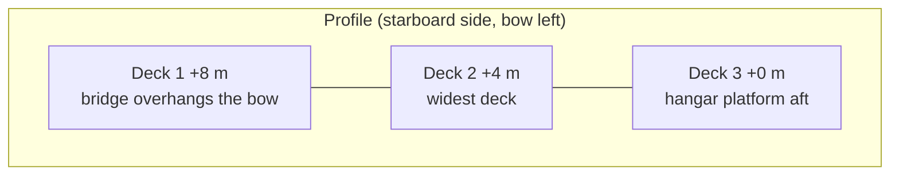
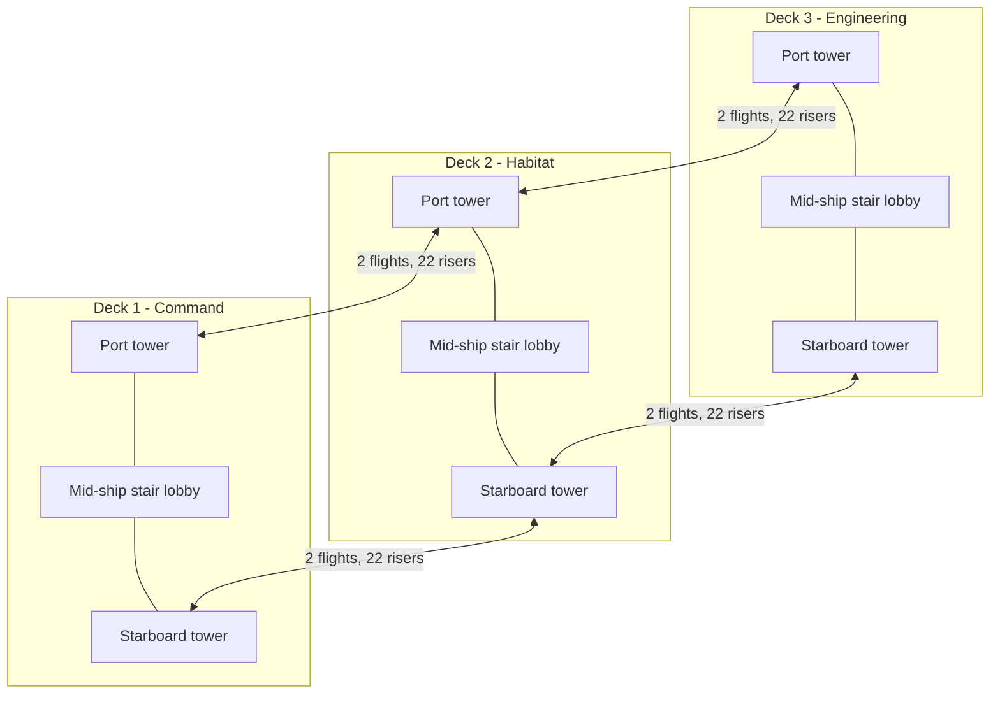
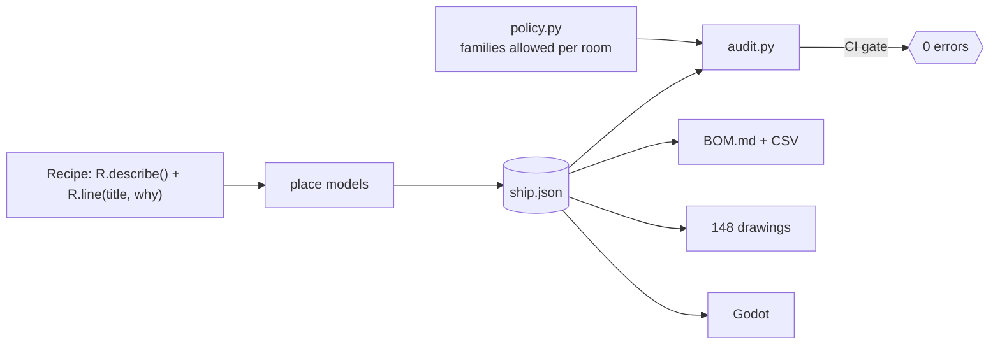

# Design notes

How the ship is drafted, why it looks the way it does, and how the pipeline keeps it honest.
Drawings: [`docs/drafts/INDEX.md`](drafts/INDEX.md) - bill of materials: [`docs/BOM.md`](BOM.md) - defect ledger: [`docs/BUGS.md`](BUGS.md).

## 1. Hull lines

The hull is drafted the way a naval architect does it: a **half-breadth curve** per deck, mirrored about the centreline
(`tools/layout/hull.py`). Each deck outline is one closed, *convex* polygon:

| Part | Shape |
|---|---|
| Bow | elliptical-sine ogive `b(z) = b_nose + (B - b_nose) * sin(pi/2 * t)`: pointed at the nose, tangent to the mid-body |
| Mid-body | parallel, 26 m beam, identical on all decks so the stair towers stack |
| Stern | rounded counter `b = b_stern + (B - b_stern) * cos(pi/2 * t)` that narrows to a transom |

The decks are **terraced like a cruise ship**: Deck 1 reaches furthest forward (the bridge overhangs the nose), Deck 3
reaches furthest aft and its stern carries the hangar as a platform.

| Deck | Floor | Bow (z) | Stern (z) | Hull area |
|---|---|---|---|---|
| 1 Command | +8.0 m | -34 | +14 | 1,042 m2 |
| 2 Habitat | +4.0 m | -30 | +18 | 1,064 m2 |
| 3 Engineering | +0.0 m | -24 | +32 | 1,244 m2 |

The hull outlines of the original three decks are **66 m long and 26 m wide** (the five-deck ship with its skin and fittings is 111 m long) (the original was ~102 x 36 m with 3,500 m2 per deck, now ~1,050 m2).

### Rooms are clipped rectangles

Rooms are laid out on a rectangular drafting grid and **clipped by the hull outline** (Sutherland-Hodgman). Mid-ship rooms stay
rectangular; every room that touches the bow or stern picks up diagonal, streamlined walls. The code treats a room as a convex
polygon whose walls are *edges* (`N/S/E/W` or diagonal `D0`, `D1` ...): furniture footprints are oriented rectangles tested against
the polygon, wall items hang on any edge, windows can be cut in the hull facets (the bridge wraps around the nose with 13 windows).
The Godot builder mitres the wall corners, cuts the slabs to the polygon and plates the hull walls on the outside.

### The outer skin (five decks)

The ship now has five decks (Deck 0 sky dome at +12 m ... Deck 4 hold at -4 m). The rooms keep vertical walls; what the outside world sees is a separate **skin**: a loft of closed rings
(`hull.skin()`, exported in `ship.json`) that encloses every room by >= 0.2 m, leans out ~9 degrees with height, turns the terraced bow and stern into raked ramps, rolls into a keel under
the hold and a dome over the sky deck. Godot draws it on render layer 2 with back-face culling (invisible from inside), puts lit window panels on it where the rooms have windows, running-light
belts at the deck boundaries and the exterior fittings (nacelles, deflector, masts, engines, keel fin - `blender/starship/exterior.py`). See the README for the construction diagram and
`docs/drafts` (G-04 .. G-20) for the lines plan, profile, body plan and sections.

## 2. Circulation: stairs instead of lifts

* A **3 m spine corridor** runs along the centreline; a **cross passage** (the lobby) sits amidships with a **dog-leg stair tower at each end**.
  Two towers give two means of escape; every room is within 35 m of one (see the escape table in the BOM).
* Geometry of one deck pair (same numbers in Blender, the layout generator and the game):
  4.0 m floor to floor = 22 risers of **181.8 mm**, **280 mm** going, two 11-riser flights of **1.4 m** width with a mid-landing.
  The flights leave a deck-level strip beside the lobby, climb to the landing at the hull side and return along the other lane.
* The floor and ceiling slabs get matching **holes** (`floor_holes` / `ceiling_holes`) so the flights pass through the decks; the
  Godot builder subtracts them from the slabs. Flights are Blender models (`arch_stair_flight`) with a half-riser-offset **ramp
  collider** (feet never float more than 9 cm) so the capsule walks smoothly. `godot/tests/stair_test.gd` walks Deck 3 -> 1 -> 3 on both towers.

## 3. Every item has a reason

The old generator scattered props until a density target was met. The new one is **bill-of-materials driven**:

* `policy.py` says which of the 93 equipment families may appear in which room; the audit fails on a reactor in the mess.
* `audit.py` (29 rules): footprint overlaps, props in walls, floating/buried table items, wall equipment inside furniture, blocked
  windows and doors, ceiling clashes, wrong mounting, density, duplicates, lights, BOM completeness, walkability with the real 0.32 m capsule.
  Measured on the original layout it found **2,657 errors**; the new layout has **0** (`docs/BUGS.md`).
* The BOM, the drawings and the game all read the same `ship.json`, so they cannot disagree.

## 4. Performance

| | original | now |
|---|---|---|
| Props | 6,679 | 1,401 (nothing is placed without a reason) |
| Scene nodes | 16,580 | ~3,500 |
| Draw calls / frame (mean over the tour) | ~17,950 | ~355 |

What changed, in order of effect: the ship is half the size and furnished for its function (fewer things to draw), props are batched into one
MultiMesh per (room, model mesh), only the room you are in and its neighbours draw their contents, walls and slabs are occluders
(`OccluderInstance3D` + project occlusion culling), at most 2-3 shadow-casting lights per room and no shadows from props under 0.6 m,
trim has no colliders, volumetric fog / 4x MSAA / full SSAO moved behind `--hq`. See the README for how to reproduce the measurement.

## 5. Bill of materials and drawings

* [`BOM.md`](BOM.md): one chapter per room with design brief, openings, every BOM line with its reason and every model (family, mount, size, function);
  totals per family, escape distances, and an index of all models used. Machine-readable copy: [`bom/bill_of_materials.csv`](bom/bill_of_materials.csv).
* [`drafts/INDEX.md`](drafts/INDEX.md): 148 A3 sheets - deck general arrangements, hull lines, profile, centreline and transverse sections, stair tower
  details, circulation, door/window schedule, and **plan + longitudinal section + transverse section of every room** with BOM balloons,
  dimension chains, clearance zones and a room data box. Generated by `python tools/draft/draft.py`.
