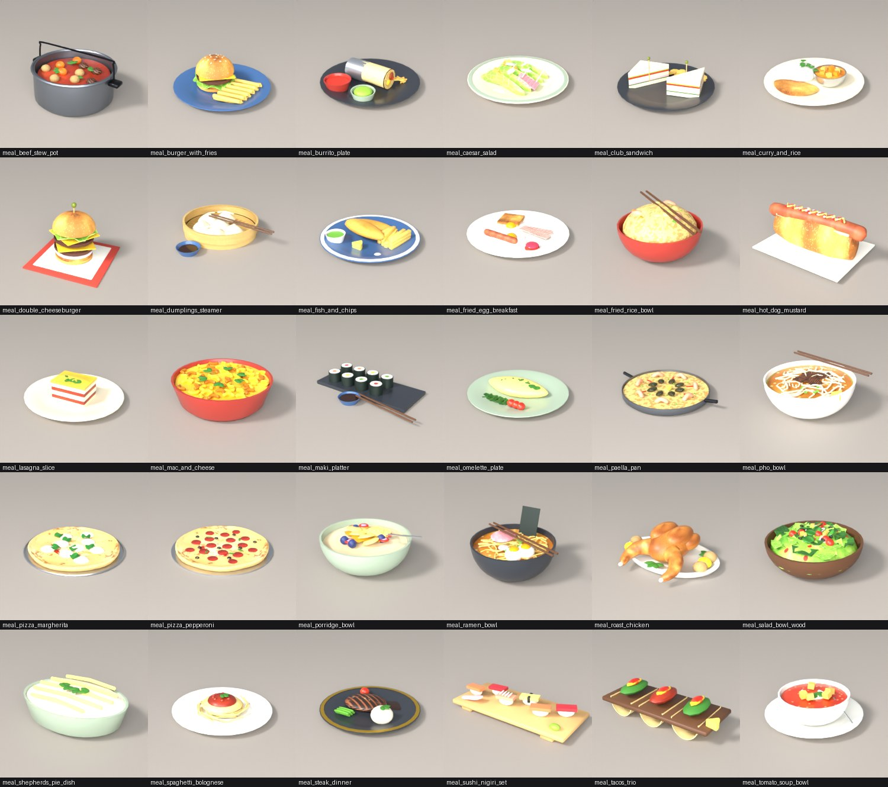
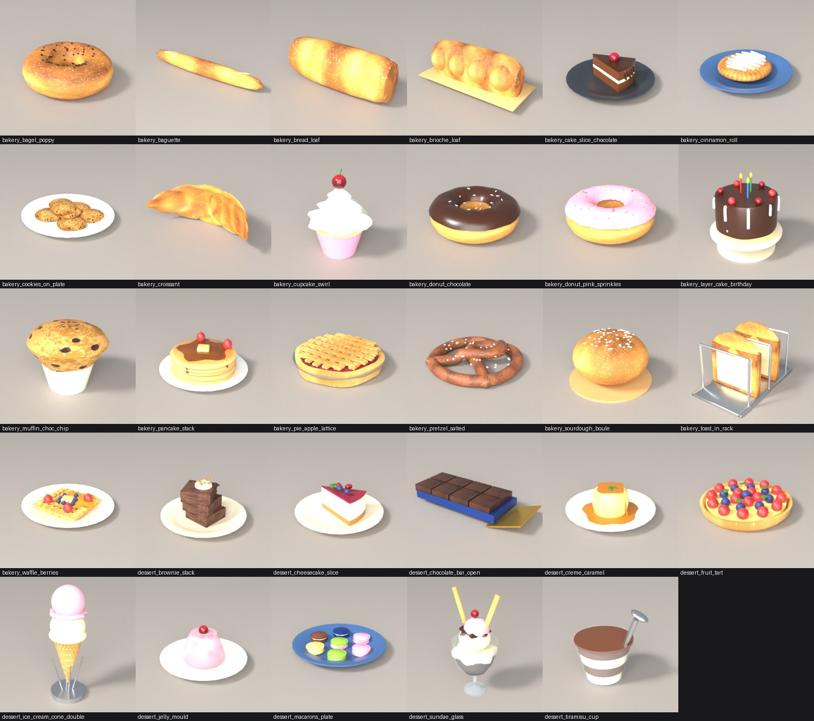
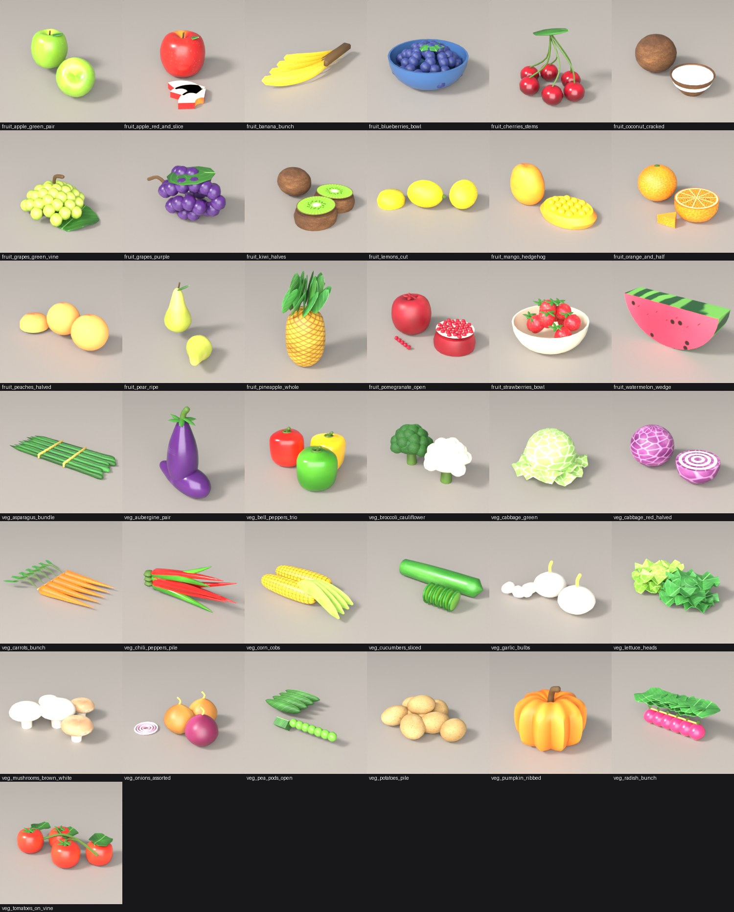
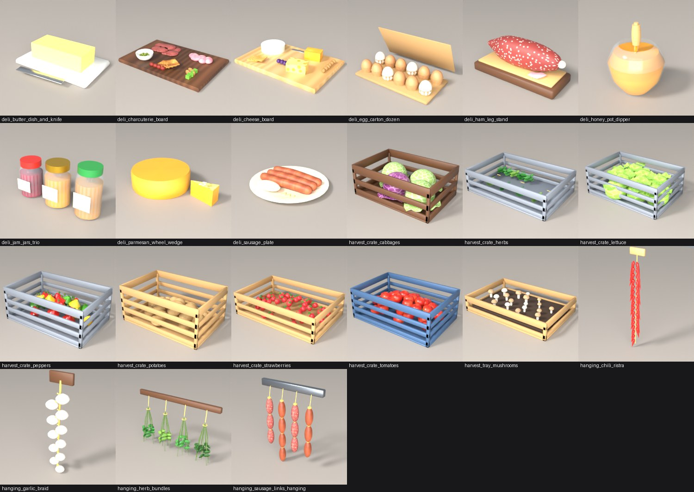
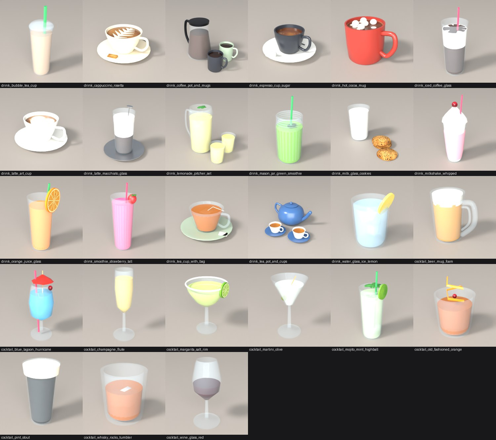
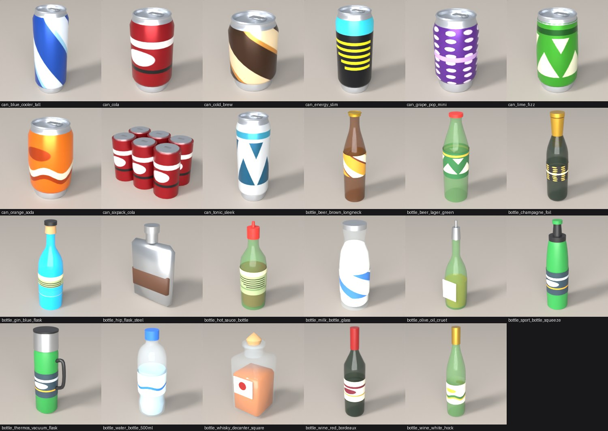
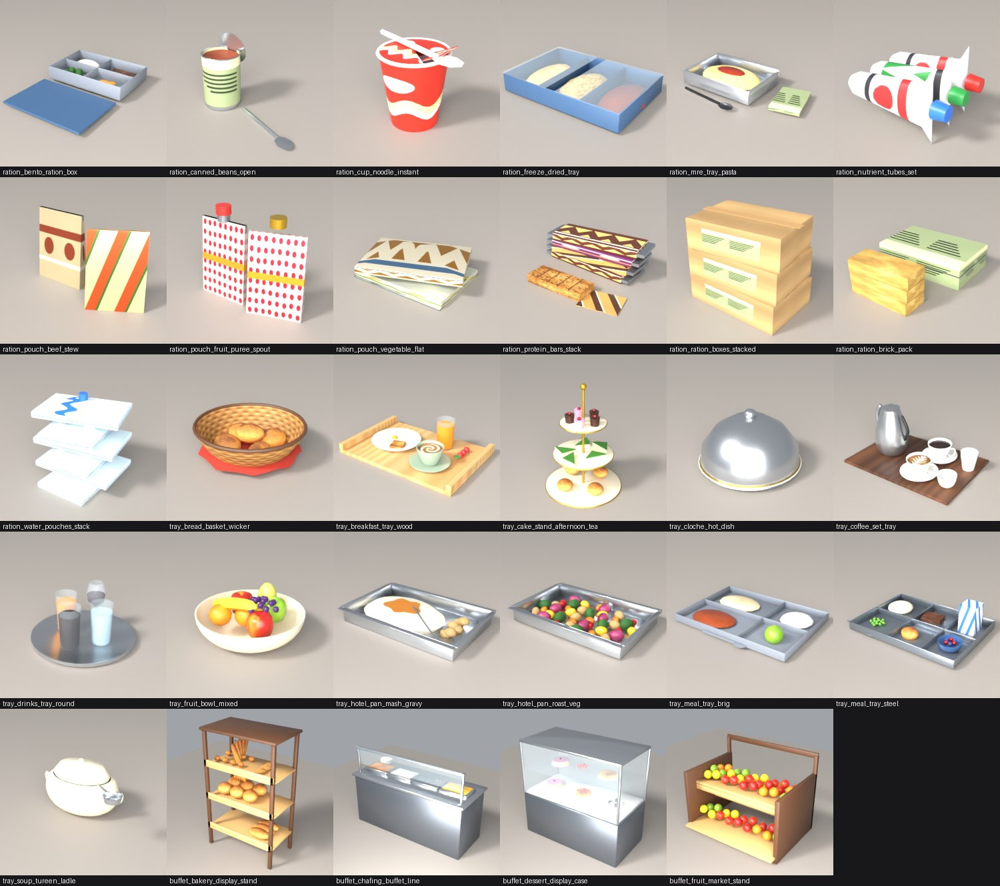

# Food and drink menu

196 food and drink models in 15 categories (`blender/starship/components/food*.py`), all generated headless in Blender (bpy). Sizes are real-world (metres in the game, shown here in centimetres as width x depth x height); every dish stands on a table, every crate on the floor, every hanging bunch on a wall (origins as in `blender/CONVENTIONS.md`).

## Contents

* [Meals](#meals)
* [Bakery and desserts](#bakery-and-desserts)
* [Fruit and vegetables](#fruit-and-vegetables)
* [Deli, harvest and hanging produce](#deli-harvest-and-hanging-produce)
* [Drinks and cocktails](#drinks-and-cocktails)
* [Cans and bottles](#cans-and-bottles)
* [Rations, trays and buffet](#rations-trays-and-buffet)
* [How the food is modelled](#how-the-food-is-modelled)
* [Where the food appears](#where-the-food-appears)

## Meals



### Meals (`meal`, 30)

Plated dishes and bowls, each a complete serving on its own crockery. Mount: `table`.

| Model | Size w x d x h (cm) | On the model | Tris | KB |
|---|---|---|---|---|
| `meal_beef_stew_pot` | 29 x 24 x 15 | cast pot of beef, potato and carrot stew with herbs and a bail handle | 3276 | 165 |
| `meal_burger_with_fries` | 28 x 28 x 10 | seeded bun, patty, cheese, tomato, lettuce, plus a pile of fries, blue plate | 2856 | 135 |
| `meal_burrito_plate` | 30 x 30 x 7 | foil-wrapped burrito cut open (rice, beans, cheese), salsa, guacamole, tortilla chips | 1740 | 100 |
| `meal_caesar_salad` | 29 x 29 x 5 | romaine leaves, croutons, parmesan shavings, grilled chicken, dressing drizzle | 2244 | 97 |
| `meal_club_sandwich` | 28 x 28 x 10 | two triple-decker toast triangles (turkey, bacon, tomato, lettuce) on cocktail sticks, crisps | 1210 | 39 |
| `meal_curry_and_rice` | 32 x 32 x 8 | rice mound, steel bowl of vegetable curry, naan, coriander | 2588 | 140 |
| `meal_double_cheeseburger` | 24 x 24 x 16 | two patties, cheese, onion, pickles, tomato, lettuce, skewered olive, on paper | 1904 | 109 |
| `meal_dumplings_steamer` | 30 x 31 x 5 | bamboo steamer of six pleated dumplings, soy dip, chopsticks | 2612 | 98 |
| `meal_fish_and_chips` | 32 x 32 x 6 | battered cod fillets, chips, mushy peas, lemon, tartare sauce, blue plate | 2674 | 93 |
| `meal_fried_egg_breakfast` | 30 x 30 x 3 | two fried eggs, bacon, sausage, toast, tomato and mushrooms | 1716 | 101 |
| `meal_fried_rice_bowl` | 21 x 18 x 10 | egg fried rice with peas, carrot, prawns, spring onion and chopsticks | 3130 | 129 |
| `meal_hot_dog_mustard` | 23 x 15 x 9 | bun, sausage, mustard and ketchup zig-zags, onion, paper | 1214 | 91 |
| `meal_lasagna_slice` | 28 x 28 x 7 | seven layers (pasta, ragu, bechamel), browned cheese top, basil, plate | 1196 | 57 |
| `meal_mac_and_cheese` | 19 x 19 x 6 | baked macaroni with a crisped cheddar top and parsley in a red dish | 4212 | 144 |
| `meal_maki_platter` | 40 x 21 x 5 | eight maki rolls (nori, rice, tuna / salmon / cucumber / egg), soy dish, chopsticks, slate | 2192 | 116 |
| `meal_omelette_plate` | 30 x 30 x 4 | folded herb omelette, cherry tomatoes, spinach leaves, plate | 2312 | 86 |
| `meal_paella_pan` | 46 x 36 x 5 | wide pan of saffron rice, prawns, mussels, peas, peppers and lemon | 3420 | 125 |
| `meal_pho_bowl` | 26 x 23 x 11 | bowl of broth with rice noodles, rare beef, spring onion, bean sprouts, lime, chopsticks | 5030 | 208 |
| `meal_pizza_margherita` | 34 x 34 x 3 | 0.30 m pizza on a steel pan - puffy charred crust, tomato, mozzarella and basil | 2612 | 134 |
| `meal_pizza_pepperoni` | 33 x 33 x 2 | 0.30 m pizza with pepperoni, black olives, melted cheese, herbs | 3756 | 176 |
| `meal_porridge_bowl` | 19 x 17 x 8 | oat porridge with butter pats, berries, honey and a spoon | 3104 | 99 |
| `meal_ramen_bowl` | 24 x 21 x 14 | broth, noodles, chashu pork, soft-boiled egg halves, nori, narutomaki, spring onion, chopsticks | 6860 | 259 |
| `meal_roast_chicken` | 40 x 33 x 14 | whole roast chicken with crossed drumsticks, potatoes, rosemary, lemon halves, oval platter | 5060 | 192 |
| `meal_salad_bowl_wood` | 30 x 30 x 13 | wooden bowl of lettuce, cherry tomatoes, cucumber, red onion rings, croutons, olives | 4712 | 220 |
| `meal_shepherds_pie_dish` | 20 x 15 x 7 | oval dish of mince topped with piped mashed potato and herbs | 1128 | 30 |
| `meal_spaghetti_bolognese` | 29 x 29 x 6 | nest of spaghetti, bolognese sauce, grated parmesan, basil | 4032 | 160 |
| `meal_steak_dinner` | 30 x 30 x 6 | seared steak with grill marks, mashed potato, green beans, roast tomato, jus, plate | 2492 | 102 |
| `meal_sushi_nigiri_set` | 30 x 13 x 5 | six nigiri (salmon, tuna, prawn, egg), wasabi, pickled ginger on a wooden geta | 2060 | 97 |
| `meal_tacos_trio` | 32 x 13 x 8 | three tortilla shells in a rack with mince, lettuce, tomato, cheese, lime | 1064 | 58 |
| `meal_tomato_soup_bowl` | 21 x 21 x 7 | bowl of tomato soup with cream swirl, croutons, basil, spoon, saucer | 2184 | 74 |

## Bakery and desserts



### Bakery (`bakery`, 19)

Breads, pastries and cakes from the galley oven. Mount: `table`.

| Model | Size w x d x h (cm) | On the model | Tris | KB |
|---|---|---|---|---|
| `bakery_bagel_poppy` | 10 x 10 x 4 | boiled-and-baked bagel (torus) with poppy and sesame seeds | 2072 | 114 |
| `bakery_baguette` | 52 x 6 x 7 | 0.52 m French baguette with five diagonal scoring cuts in lighter crumb | 912 | 59 |
| `bakery_bread_loaf` | 30 x 10 x 12 | tin loaf with domed, scored top and four slashes | 516 | 51 |
| `bakery_brioche_loaf` | 30 x 13 x 12 | golden brioche loaf with four risen domes, on a bread board | 1332 | 57 |
| `bakery_cake_slice_chocolate` | 20 x 20 x 8 | layered chocolate sponge, cream filling, chocolate icing with drips and a cherry, on a dark plate | 958 | 37 |
| `bakery_cinnamon_roll` | 18 x 18 x 4 | dough spiral with cinnamon filling and a zig-zag of white icing, on a blue plate | 2900 | 101 |
| `bakery_cookies_on_plate` | 24 x 24 x 4 | five chocolate-chip cookies plus two stacked on them, on a plate | 1632 | 79 |
| `bakery_croissant` | 16 x 6 x 6 | crescent croissant with six layered ridges (bent surface of revolution, laminated-pastry texture) | 1260 | 49 |
| `bakery_cupcake_swirl` | 8 x 9 x 12 | pink paper case, sponge, twisting piped vanilla frosting and a cherry with stalk | 1974 | 72 |
| `bakery_donut_chocolate` | 10 x 10 x 4 | ring donut, dark chocolate glaze with white icing stripes | 2184 | 85 |
| `bakery_donut_pink_sprinkles` | 10 x 10 x 4 | ring donut, pink icing with rainbow sprinkles | 1664 | 71 |
| `bakery_layer_cake_birthday` | 24 x 24 x 25 | three sponge layers with pink icing between, chocolate coating with white drips, strawberries, cherries and three lit candles, on a stand | 3008 | 144 |
| `bakery_muffin_choc_chip` | 11 x 11 x 9 | chocolate-chip muffin overflowing a paper case | 624 | 55 |
| `bakery_pancake_stack` | 26 x 26 x 10 | five pancakes, butter pat, maple syrup running down the side, two strawberries, plate | 2484 | 105 |
| `bakery_pie_apple_lattice` | 24 x 24 x 5 | lattice-topped apple pie with crimped crust and fruit filling in a steel dish | 1360 | 78 |
| `bakery_pretzel_salted` | 18 x 18 x 3 | soft pretzel knot with coarse salt | 3420 | 144 |
| `bakery_sourdough_boule` | 26 x 26 x 16 | round sourdough loaf dusted with flour, three scoring cuts, on a board | 2268 | 133 |
| `bakery_toast_in_rack` | 10 x 17 x 10 | wire rack holding two slices of golden toast | 840 | 67 |
| `bakery_waffle_berries` | 28 x 28 x 5 | Belgian waffle (raised grid), butter, strawberries, blueberries, honey, plate | 2094 | 112 |

### Desserts (`dessert`, 10)

Puddings, ice cream and sweets. Mount: `table`.

| Model | Size w x d x h (cm) | On the model | Tris | KB |
|---|---|---|---|---|
| `dessert_brownie_stack` | 20 x 20 x 10 | three fudge brownies, chocolate sauce, a scoop of vanilla and nuts, plate | 1060 | 63 |
| `dessert_cheesecake_slice` | 20 x 20 x 8 | biscuit base, cream cheese, berry glaze, blueberries and mint, plate | 1128 | 93 |
| `dessert_chocolate_bar_open` | 21 x 7 x 3 | milk chocolate bar of eight squares on its blue wrapper with gold foil | 320 | 21 |
| `dessert_creme_caramel` | 18 x 18 x 6 | baked custard with caramel pool and a mint sprig, plate | 1006 | 25 |
| `dessert_fruit_tart` | 21 x 21 x 5 | pastry case, custard, rings of strawberries and blueberries, mint | 2928 | 131 |
| `dessert_ice_cream_cone_double` | 8 x 8 x 26 | waffle cone with vanilla and strawberry scoops, sprinkles, in a steel holder | 2004 | 76 |
| `dessert_jelly_mould` | 20 x 20 x 9 | translucent strawberry jelly with fruit pieces and a cherry, plate | 1196 | 59 |
| `dessert_macarons_plate` | 20 x 20 x 2 | six pastel macarons (two shells and cream each), blue plate | 2912 | 73 |
| `dessert_sundae_glass` | 13 x 12 x 28 | footed glass with chocolate and vanilla ice cream, sauce, strawberry scoop, cherry, two wafers | 2236 | 89 |
| `dessert_tiramisu_cup` | 10 x 8 x 11 | glass cup of layered mascarpone and sponge, cocoa top, spoon | 792 | 26 |

## Fruit and vegetables



### Fruit (`fruit`, 18)

Whole, cut and bowled fruit. Mount: `table`.

| Model | Size w x d x h (cm) | On the model | Tris | KB |
|---|---|---|---|---|
| `fruit_apple_green_pair` | 16 x 12 x 9 | two Granny Smith apples with stalk and leaf | 2178 | 78 |
| `fruit_apple_red_and_slice` | 12 x 13 x 8 | red apple with stalk and leaf, three crescent wedges | 1322 | 66 |
| `fruit_banana_bunch` | 13 x 29 x 4 | hand of four bananas on a crown (five-sided skins, browned tips) | 724 | 41 |
| `fruit_blueberries_bowl` | 12 x 12 x 6 | bowl of 50 blueberries with a mint sprig | 3888 | 140 |
| `fruit_cherries_stems` | 8 x 6 x 7 | six cherries on stalks with a leaf | 1744 | 71 |
| `fruit_coconut_cracked` | 24 x 14 x 10 | whole coconut and a cracked half-shell with white flesh | 836 | 46 |
| `fruit_grapes_green_vine` | 13 x 11 x 8 | green grape bunch on its stem with a vine leaf | 3204 | 116 |
| `fruit_grapes_purple` | 13 x 7 x 8 | purple grape bunch with stem and leaf | 2668 | 102 |
| `fruit_kiwi_halves` | 14 x 12 x 5 | kiwi with fuzzy skin and two halves showing seeds around a white core | 1044 | 68 |
| `fruit_lemons_cut` | 17 x 14 x 5 | two whole lemons and a halved lemon with segments | 984 | 47 |
| `fruit_mango_hedgehog` | 23 x 10 x 10 | mango and a scored 'hedgehog' cheek with cubes | 2244 | 63 |
| `fruit_orange_and_half` | 16 x 10 x 7 | orange with dimpled peel, half orange with segments, a wedge | 874 | 73 |
| `fruit_peaches_halved` | 22 x 9 x 8 | two peaches and a halved peach with stone | 1340 | 42 |
| `fruit_pear_ripe` | 15 x 14 x 15 | two pears, one standing with stalk and leaf | 2338 | 85 |
| `fruit_pineapple_whole` | 13 x 10 x 25 | pineapple with diamond-patterned skin and a crown of 23 leaves | 2128 | 116 |
| `fruit_pomegranate_open` | 18 x 10 x 8 | whole pomegranate with crown and a cut half full of ruby seeds | 2828 | 91 |
| `fruit_strawberries_bowl` | 14 x 14 x 9 | bowl of eleven strawberries with calyxes | 8092 | 233 |
| `fruit_watermelon_wedge` | 22 x 5 x 9 | striped rind, red flesh, black seeds | 212 | 29 |

### Vegetables (`veg`, 19)

Fresh produce from the grow beds and cold store. Mount: `table`.

| Model | Size w x d x h (cm) | On the model | Tris | KB |
|---|---|---|---|---|
| `veg_asparagus_bundle` | 26 x 10 x 1 | nine spears tied with raffia | 1222 | 60 |
| `veg_aubergine_pair` | 18 x 9 x 26 | two glossy aubergines with calyx and stalk | 2120 | 60 |
| `veg_bell_peppers_trio` | 23 x 19 x 12 | red, yellow and green peppers with stalks | 3450 | 88 |
| `veg_broccoli_cauliflower` | 22 x 12 x 11 | broccoli crown and cauliflower on stalks | 4432 | 135 |
| `veg_cabbage_green` | 26 x 26 x 16 | green cabbage with six wrapper leaves | 1404 | 59 |
| `veg_cabbage_red_halved` | 36 x 17 x 16 | red cabbage and a half head showing its layered cross-section | 1656 | 69 |
| `veg_carrots_bunch` | 31 x 22 x 4 | five carrots with leafy tops tied with string | 2986 | 123 |
| `veg_chili_peppers_pile` | 11 x 3 x 5 | nine red and green chillies | 1053 | 42 |
| `veg_corn_cobs` | 29 x 14 x 8 | corn cob with kernels and one half-husked cob | 2120 | 98 |
| `veg_cucumbers_sliced` | 22 x 11 x 4 | whole cucumber and six slices with seed centres | 1900 | 63 |
| `veg_garlic_bulbs` | 19 x 9 x 8 | two bulbs with papery skin and four cloves | 2956 | 81 |
| `veg_lettuce_heads` | 36 x 24 x 9 | butterhead and green leaf lettuce heads with 20 frilly outer leaves | 2088 | 127 |
| `veg_mushrooms_brown_white` | 16 x 15 x 5 | five button and chestnut mushrooms (cap and stem) | 3360 | 107 |
| `veg_onions_assorted` | 23 x 18 x 10 | brown and red onions, stalks, onion rings | 3474 | 107 |
| `veg_pea_pods_open` | 17 x 11 x 3 | four pods and an opened pod with peas | 1280 | 49 |
| `veg_potatoes_pile` | 30 x 25 x 11 | seven lumpy potatoes with eyes and speckles | 2304 | 81 |
| `veg_pumpkin_ribbed` | 29 x 27 x 24 | 0.29 m ribbed pumpkin with a curved stalk | 1840 | 55 |
| `veg_radish_bunch` | 18 x 7 x 7 | six radishes with leaves | 4284 | 137 |
| `veg_tomatoes_on_vine` | 24 x 13 x 6 | four tomatoes on a vine with calyxes and leaves | 4820 | 154 |

## Deli, harvest and hanging produce



### Deli and dairy (`deli`, 9)

Cheese, cured meat, eggs, spreads and boards. Mount: `table`.

| Model | Size w x d x h (cm) | On the model | Tris | KB |
|---|---|---|---|---|
| `deli_butter_dish_and_knife` | 17 x 14 x 5 | butter block on a porcelain dish with a knife | 120 | 6 |
| `deli_charcuterie_board` | 42 x 28 x 5 | walnut board with salami slices, ham, olives, bread, nuts and gherkins | 4260 | 179 |
| `deli_cheese_board` | 40 x 26 x 6 | maple board with brie, cheddar, swiss with holes, grapes, crackers, walnuts and a knife | 1368 | 85 |
| `deli_egg_carton_dozen` | 31 x 21 x 15 | pulp carton with twelve brown and white eggs and an open lid | 3592 | 114 |
| `deli_ham_leg_stand` | 50 x 20 x 21 | cured ham leg on a wooden stand with sliced ham | 1460 | 66 |
| `deli_honey_pot_dipper` | 11 x 11 x 14 | glass pot of honey with a wooden dipper | 1106 | 44 |
| `deli_jam_jars_trio` | 23 x 7 x 12 | three glass jars (jam, honey, peanut butter) with labels and screw lids | 1656 | 68 |
| `deli_parmesan_wheel_wedge` | 57 x 37 x 12 | 0.36 m parmesan wheel and a cut wedge | 528 | 38 |
| `deli_sausage_plate` | 30 x 30 x 4 | three bratwursts, mashed potato, mustard, plate | 1746 | 53 |

### Hydroponic harvest (`harvest`, 8)

Floor-standing crates of freshly picked crops (hydroponics, galley, cold store). Mount: `floor`.

| Model | Size w x d x h (cm) | On the model | Tris | KB |
|---|---|---|---|---|
| `harvest_crate_cabbages` | 60 x 42 x 23 | slatted wooden crate of green and red cabbages | 3224 | 134 |
| `harvest_crate_herbs` | 60 x 40 x 16 | grey crate of basil, mint and dill bundles | 3084 | 190 |
| `harvest_crate_lettuce` | 62 x 50 x 22 | grey crate of nine lettuces | 3296 | 126 |
| `harvest_crate_peppers` | 60 x 40 x 24 | grey crate of red, yellow and green peppers | 2152 | 110 |
| `harvest_crate_potatoes` | 60 x 40 x 27 | cardboard-coloured crate of potatoes | 3320 | 111 |
| `harvest_crate_strawberries` | 60 x 40 x 16 | crate heaped with 42 strawberries | 5784 | 210 |
| `harvest_crate_tomatoes` | 60 x 40 x 22 | blue crate of tomatoes with calyxes | 4952 | 158 |
| `harvest_tray_mushrooms` | 60 x 40 x 11 | soil tray of 18 mushrooms | 4284 | 146 |

### Hanging produce (`hanging`, 4)

Wall-mounted drying produce, origin at the centre of the back plane. Mount: `wall`.

| Model | Size w x d x h (cm) | On the model | Tris | KB |
|---|---|---|---|---|
| `hanging_chili_ristra` | 10 x 4 x 69 | string of 29 red chillies on a wooden hook board | 3105 | 93 |
| `hanging_garlic_braid` | 12 x 7 x 49 | braid of eleven garlic bulbs | 6224 | 163 |
| `hanging_herb_bundles` | 50 x 9 x 32 | four bundles of basil, dill, mint and spinach drying on a rail | 3036 | 172 |
| `hanging_sausage_links_hanging` | 30 x 5 x 38 | four strings of salami and sausages on a steel rail | 2536 | 115 |

## Drinks and cocktails



### Coffee, tea and cold drinks (`drink`, 17)

Cups, mugs, glasses and pitchers with liquids. Mount: `table`.

| Model | Size w x d x h (cm) | On the model | Tris | KB |
|---|---|---|---|---|
| `drink_bubble_tea_cup` | 9 x 9 x 26 | clear plastic cup, milk tea, 34 tapioca pearls, domed lid, fat straw | 2892 | 97 |
| `drink_cappuccino_rosetta` | 18 x 18 x 8 | cup and saucer, rosetta latte art, biscuit | 1774 | 93 |
| `drink_coffee_pot_and_mugs` | 31 x 19 x 20 | glass carafe with a black collar, two mugs of black coffee | 2764 | 82 |
| `drink_espresso_cup_sugar` | 12 x 12 x 5 | dark espresso cup with crema, two sugar cubes, spoon | 1486 | 52 |
| `drink_hot_cocoa_mug` | 13 x 9 x 10 | red mug of cocoa with marshmallows | 1482 | 51 |
| `drink_iced_coffee_glass` | 8 x 8 x 22 | glass with coffee, milk layer, ice cubes, straw | 900 | 26 |
| `drink_latte_art_cup` | 16 x 16 x 7 | white cup, saucer, heart-shaped latte art, spoon | 1690 | 55 |
| `drink_latte_macchiato_glass` | 15 x 15 x 18 | layered coffee, milk and froth in a glass on a steel saucer, spoon | 1268 | 49 |
| `drink_lemonade_pitcher_set` | 26 x 17 x 23 | glass pitcher with lemon slices and ice, two glasses, mint | 2344 | 88 |
| `drink_mason_jar_green_smoothie` | 8 x 8 x 19 | mason jar of green smoothie with straw and spinach | 1596 | 75 |
| `drink_milk_glass_cookies` | 20 x 10 x 11 | glass of milk with froth and three cookies | 1232 | 76 |
| `drink_milkshake_whipped` | 9 x 10 x 27 | milkshake with whipped cream, cherry and straw | 1288 | 47 |
| `drink_orange_juice_glass` | 7 x 7 x 18 | glass of orange juice with an orange slice and straw | 760 | 54 |
| `drink_smoothie_strawberry_tall` | 9 x 8 x 24 | tall strawberry smoothie, strawberry on the rim, straw | 1028 | 59 |
| `drink_tea_cup_with_bag` | 14 x 14 x 8 | glass cup of tea with tea bag and saucer | 1438 | 35 |
| `drink_tea_pot_and_cups` | 36 x 32 x 15 | blue teapot with two cups of tea on saucers | 4650 | 123 |
| `drink_water_glass_ice_lemon` | 8 x 7 x 11 | tumbler of water with ice cubes and a lemon slice | 712 | 21 |

### Glassware and cocktails (`cocktail`, 10)

Bar glasses with their drinks and garnishes. Mount: `table`.

| Model | Size w x d x h (cm) | On the model | Tris | KB |
|---|---|---|---|---|
| `cocktail_beer_mug_foam` | 14 x 9 x 14 | glass mug of beer with a foam head and a thick handle | 1264 | 52 |
| `cocktail_blue_lagoon_hurricane` | 8 x 8 x 22 | hurricane glass of blue lagoon, ice, cherry, paper umbrella, straw | 1256 | 46 |
| `cocktail_champagne_flute` | 7 x 7 x 20 | flute of champagne with rising bubbles | 1080 | 31 |
| `cocktail_margarita_salt_rim` | 12 x 12 x 16 | margarita glass with salted rim and a lime wheel | 1376 | 90 |
| `cocktail_martini_olive` | 10 x 10 x 18 | martini glass with an olive on a pick | 800 | 25 |
| `cocktail_mojito_mint_highball` | 8 x 8 x 22 | highball with ice, mint sprigs, lime wheel and straw | 1412 | 81 |
| `cocktail_old_fashioned_orange` | 8 x 8 x 11 | tumbler with whisky, large ice cube, orange peel twist and cherry | 706 | 32 |
| `cocktail_pint_stout` | 9 x 9 x 16 | pint glass of stout with creamy head | 708 | 20 |
| `cocktail_whisky_rocks_tumbler` | 8 x 8 x 8 | heavy tumbler with whisky and two ice cubes | 580 | 17 |
| `cocktail_wine_glass_red` | 8 x 8 x 20 | stemmed glass of red wine | 1016 | 24 |

## Cans and bottles



### Cans (`can`, 9)

Brand-less aluminium cans in six sizes and shapes, printed with generic stripes and pictograms. Mount: `table`.

| Model | Size w x d x h (cm) | On the model | Tris | KB |
|---|---|---|---|---|
| `can_blue_cooler_tall` | 7 x 7 x 17 | 0.066 x 0.169 m 500 ml aluminium can with diagonal blue print | 1086 | 49 |
| `can_cola` | 7 x 7 x 12 | standard 0.066 x 0.122 m can, red print with white discs, stay tab | 1086 | 45 |
| `can_cold_brew` | 6 x 6 x 10 | stubby coffee can with diagonal brown print | 1086 | 49 |
| `can_energy_slim` | 6 x 6 x 14 | slim 58 mm can with black print and yellow bars | 1086 | 45 |
| `can_grape_pop_mini` | 5 x 5 x 9 | mini 150 ml can with purple spots | 1086 | 64 |
| `can_lime_fizz` | 7 x 7 x 12 | standard can with bottle-shaped shoulder, green zig-zag print | 1086 | 50 |
| `can_orange_soda` | 7 x 7 x 12 | orange can with a wave print and a slight belly | 1086 | 48 |
| `can_sixpack_cola` | 20 x 13 x 12 | six cola cans held by a clear ring carrier | 1200 | 61 |
| `can_tonic_sleek` | 5 x 5 x 15 | tall sleek can with white print and blue chevrons | 1086 | 50 |

### Bottles and flasks (`bottle`, 14)

Glass, PET and steel containers with printed labels. Mount: `table`.

| Model | Size w x d x h (cm) | On the model | Tris | KB |
|---|---|---|---|---|
| `bottle_beer_brown_longneck` | 6 x 6 x 26 | brown glass bottle with label and gold crown cap | 1094 | 45 |
| `bottle_beer_lager_green` | 7 x 7 x 23 | green glass bottle with zig-zag label and red cap | 934 | 39 |
| `bottle_champagne_foil` | 8 x 8 x 32 | dark bottle with gold foil neck, label with dots | 1108 | 59 |
| `bottle_gin_blue_flask` | 8 x 8 x 28 | blue glass bottle with cork stopper | 970 | 35 |
| `bottle_hip_flask_steel` | 11 x 3 x 18 | steel hip flask with leather panel and screw cap | 200 | 7 |
| `bottle_hot_sauce_bottle` | 5 x 5 x 18 | green glass bottle of red sauce with shaker cap | 750 | 30 |
| `bottle_milk_bottle_glass` | 7 x 7 x 19 | glass milk bottle with foil cap and printed label | 1174 | 45 |
| `bottle_olive_oil_cruet` | 7 x 7 x 28 | green glass cruet of oil with a steel pourer | 970 | 24 |
| `bottle_sport_bottle_squeeze` | 6 x 6 x 25 | squeeze bottle with a push-pull cap | 780 | 31 |
| `bottle_thermos_vacuum_flask` | 12 x 8 x 30 | steel vacuum flask with cup lid and handle | 712 | 32 |
| `bottle_water_bottle_500ml` | 7 x 7 x 21 | clear PET bottle, water, printed label, blue cap | 1608 | 55 |
| `bottle_whisky_decanter_square` | 9 x 10 x 23 | square decanter of whisky with cork stopper and label | 352 | 14 |
| `bottle_wine_red_bordeaux` | 8 x 8 x 32 | dark Bordeaux bottle with label and wax seal | 1224 | 41 |
| `bottle_wine_white_hock` | 7 x 7 x 34 | green hock bottle with label and gold foil | 1224 | 43 |

## Rations, trays and buffet



### Space rations (`ration`, 13)

Shelf-stable mission food: pouches, tubes, bars, trays and tins. Mount: `table`.

| Model | Size w x d x h (cm) | On the model | Tris | KB |
|---|---|---|---|---|
| `ration_bento_ration_box` | 24 x 37 x 5 | four-compartment ration box (rice, broccoli, steak, orange segments), lid and spork | 1292 | 109 |
| `ration_canned_beans_open` | 23 x 11 x 14 | tin of baked beans with the lid bent back, label and spoon | 684 | 40 |
| `ration_cup_noodle_instant` | 14 x 9 x 11 | printed cup noodle with a peeled lid and a fork | 564 | 34 |
| `ration_freeze_dried_tray` | 24 x 16 x 4 | compartment tray of freeze-dried pasta, rice and beans under peeling film | 724 | 66 |
| `ration_mre_tray_pasta` | 31 x 23 x 5 | foil tray of pasta bolognese, sauce pouch, spork | 824 | 49 |
| `ration_nutrient_tubes_set` | 16 x 12 x 11 | three crimped nutrient-paste tubes with caps and printed labels | 684 | 49 |
| `ration_pouch_beef_stew` | 30 x 9 x 18 | two stand-up retort pouches (stew and pasta) with tear-seal tops | 96 | 24 |
| `ration_pouch_fruit_puree_spout` | 19 x 5 x 16 | two spouted fruit-puree pouches with caps | 252 | 42 |
| `ration_pouch_vegetable_flat` | 24 x 20 x 7 | two flat vegetable and oats ration pouches with sealed edges | 128 | 30 |
| `ration_protein_bars_stack` | 20 x 15 x 6 | four wrapped protein bars, an unwrapped bar and a wrapper | 576 | 92 |
| `ration_ration_boxes_stacked` | 35 x 24 x 30 | three printed cardboard ration cartons | 288 | 24 |
| `ration_ration_brick_pack` | 15 x 19 x 6 | sleeve of compressed ration bricks with a tear strip | 192 | 24 |
| `ration_water_pouches_stack` | 19 x 19 x 19 | six emergency water pouches stacked crosswise | 228 | 22 |

### Serving trays and dishes (`tray`, 12)

Meal, breakfast and drinks trays, hot pans, baskets, tureens and stands. Mount: `table`.

| Model | Size w x d x h (cm) | On the model | Tris | KB |
|---|---|---|---|---|
| `tray_bread_basket_wicker` | 31 x 31 x 9 | wicker basket with a napkin and six rolls | 2384 | 101 |
| `tray_breakfast_tray_wood` | 50 x 34 x 14 | wooden tray with eggs, toast, orange juice, a latte and strawberries | 2632 | 157 |
| `tray_cake_stand_afternoon_tea` | 31 x 31 x 42 | three-tier stand with scones, sandwiches and cakes | 3307 | 137 |
| `tray_cloche_hot_dish` | 30 x 30 x 18 | plate with a polished steel cloche | 2466 | 95 |
| `tray_coffee_set_tray` | 46 x 32 x 22 | walnut tray with a steel coffee pot, milk jug, two cups and a sugar bowl | 4538 | 141 |
| `tray_drinks_tray_round` | 33 x 33 x 17 | steel round tray with water, juice, cola and red wine | 2626 | 65 |
| `tray_fruit_bowl_mixed` | 34 x 34 x 15 | porcelain bowl of apples, oranges, bananas, grapes and a pear | 3270 | 176 |
| `tray_hotel_pan_mash_gravy` | 56 x 37 x 8 | steel hotel pan of mashed potato with gravy and roast potatoes, serving spoon | 1280 | 61 |
| `tray_hotel_pan_roast_veg` | 56 x 39 x 9 | steel hotel pan of roasted vegetables with tongs | 2942 | 152 |
| `tray_meal_tray_brig` | 38 x 29 x 5 | moulded brig tray (porridge, beans, rice, apple) with a plastic spork | 1016 | 83 |
| `tray_meal_tray_steel` | 46 x 31 x 11 | steel five-compartment tray (mash, peas, steak, roll, berries, milk carton, spork) | 2016 | 125 |
| `tray_soup_tureen_ladle` | 45 x 32 x 21 | porcelain tureen with soup, two handles, a ladle | 1920 | 55 |

### Buffet and display furniture (`buffet`, 4)

Floor-standing serving and display units that carry food. Mount: `floor`.

| Model | Size w x d x h (cm) | On the model | Tris | KB |
|---|---|---|---|---|
| `buffet_bakery_display_stand` | 94 x 54 x 148 | 1.45 m wooden stand with baguettes, loaves, rolls and croissants on three shelves | 5424 | 194 |
| `buffet_chafing_buffet_line` | 196 x 76 x 131 | 1.9 m steel buffet counter with four hot pans (curry, rice, tomato soup, cheese sauce), sneeze guard and plates | 1000 | 92 |
| `buffet_dessert_display_case` | 120 x 60 x 111 | glass dessert counter with cakes, pies and cupcakes on two levels | 3040 | 162 |
| `buffet_fruit_market_stand` | 120 x 94 x 93 | tiered market stand with tilted shelves of apples, oranges, lemons and tomatoes | 6920 | 276 |

## How the food is modelled

* **Surfaces of revolution and bmesh organics.** Plates, bowls, glasses, bottles, cans, fruit and cakes are lathe surfaces (`foodkit.lathe`):
  an outline of (radius, height) points swept around the Y axis, with optional **fractal noise displacement** (`mathutils.noise`), a **warp
  function** (bends a lathe into a croissant or banana, twists a frosting swirl, pinches a pouch) and smooth shading with a 52 degree crease
  angle. `foodkit.blob` makes displaced ellipsoids, `tube3` sweeps a smooth tube along a Catmull-Rom spline (noodles, sausages, vines,
  stalks), `extrude` makes wedges and slices with separate cap and side materials, `slab` rounded blocks, `crate` slatted harvest crates.
* **Several parts, several materials.** A burger is bun, lettuce frill, tomato slices, patty, cheese, sesame seeds; a ramen bowl is bowl,
  broth, 22 noodle strands, egg halves, pork, nori, scallions and chopsticks.
* **Procedural textures** (`blender/starship/textures_food.py`): 156 tileable 256 x 256 albedo maps generated with numpy (fractal noise,
  Voronoi cells, ramps, stripes, polar patterns) and stored as JPEG in `godot/textures/food/`: crusts, crumb, pizza top, steak with grill marks,
  salami, bacon, tomato / apple / citrus / banana / strawberry / watermelon / pineapple skins, leaf veins, cabbage, cheese with holes,
  pasta, rice, curry, broth, wood grain, wicker, latte art (heart, rosetta, swirl), beer foam and the printed can, pouch and bottle labels
  (brand-less stripes and pictograms - no text). The kit material prefix `tex:<name>` loads a map; models project UVs (cylindrical, spherical,
  planar or box) so every textured part has UVs, and the GLB embeds the JPEG.
* **Glass and liquids** use alpha-blended materials (`f_glass`, `f_water`, `f_juice_orange`, `f_wine_red`, `f_beer` ...): a glass is a thin
  closed shell, its liquid a slightly smaller lathe, with an opaque textured surface disc where the top matters (coffee art, cocoa, foam).
* **Budget.** Models are 500 - 6000 triangles; GLBs are mostly 60 - 150 KB (the embedded textures included); the hard limit in
  `tests/test_project.py` is 400 KB.

Rebuild just the food: `python blender/build_all.py --out godot --only '^(bakery|dessert|meal|fruit|veg|deli|harvest|hanging|drink|can|bottle|cocktail|ration|tray|buffet)_'`
(missing textures are generated first). Render a contact sheet with Blender Cycles (needs bpy and Pillow):

```bash
python blender/food_sheet.py docs/screenshots/food_sheet_meals.jpg --cols 7 --size 260 --samples 16 godot/models/meal/*.glb
python blender/food_menu.py        # regenerate this document
```

## Where the food appears

`tools/layout/policy.py` lists which food families may stand in which room (`FOOD_*` sets; alcohol only in the wardroom, lounge, captain's
quarters and the galley stores) and registers the two new rooms `wardroom` and `provisions`. `tools/layout/recipes_food.py` dresses the rooms:

* **Mess hall** - six long tables and three short tables, each laid with a *different* set of full meals, a drink at each place and a
  centrepiece (bread basket, fruit bowl, soup tureen, cheese board, lemonade, pie); a hot-pan buffet counter and a bakery stand.
* **Galley** - raw ingredients on the prep island, finished dishes on the counters, hot pans and cold dishes on the serving counters,
  garlic / chilli / herbs / sausages hung on the wall, harvest crates by the door.
* **Hydroponics** - harvest crates beside the beds, tasting table, drying herbs.
* **Lounge, captain's quarters, conference room, ready room, bridge, cabins, rec room, crew quarters, medical bay, brig, security office** -
  bar glassware, a captain's dinner, refreshments for meetings, coffee for the watch, patient meal trays, the detainee's tray ...
* **Wardroom and provisions hold** - `food_wardroom(R, B)` and `food_provisions(R, B)` in `recipes_food.py` are ready for the recipes of the
  two new rooms (bar counters and dinner tables; crates, hanging store and rations on the shelving).

