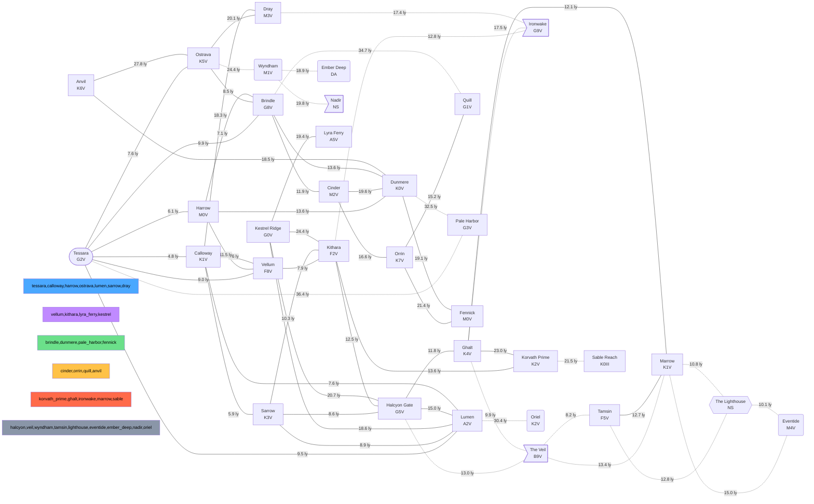

# StarshipGo - Lore: the voyage of the Vesper Lantern

*Generated by `python tools/specs/gen_lore.py` from `tools/specs/lore_data.py`; do not edit by hand. The game reads [`godot/data/lore.json`](../godot/data/lore.json) (star map, logs, datapads).*

## 1. The ship

Vesper Lantern is a three-deck deep survey cruiser of the Meridian Concord's Survey Service, built to stay out for years: a fusion core and warp coils amidships, a hangar for two survey shuttles on the stern platform, a hydroponics garden that feeds most of the crew and a bridge that overhangs the bow like the lantern on an old river boat. Her Deep Survey Charter 7 sends her four years out along the Concord frontier to chart the Veil region and to settle where a faint repeating signal comes from.

| | |
|---|---|
| Name | Vesper Lantern |
| Registry | MCV-7741 |
| Class | Wayfinder-class deep survey cruiser |
| Builder | Calder-Okonkwo Orbital Yards, Tessara Ring Dock 4 |
| Commissioned | 2291 |
| Motto | Ad lucem ultra |
| Crew complement | 64 |
| Cruise speed (warp factor) | 5.0 |
| Top speed (warp factor) | 8.0 |
| Distance per day at cruise (ly) | 1.1 |
| Charter | Deep Survey Charter 7 (four years, CY 2294-2298): chart the frontier lanes, survey every system of the plan, keep the peace with neighbours and run down the Heartbeat signal. |

## 2. Powers of the volume

| Faction | Colour | Stance | Systems | About |
|---|---|---|---|---|
| Meridian Concord | `#4aa8ff` | allied | 7 | A union of eleven home systems around Tessara governed by a rotating Assembly. Funds the Survey Service, values open lanes and shared charts. |
| Orrery Collegium | `#c08aff` | allied | 4 | An academic league of observatories and archive worlds. Trades star charts and data for passage; neutral in every dispute. |
| Thessaly Commons | `#6be08a` | neutral | 4 | Agrarian settlements who farm terraformed worlds and sell grain and seed stock; friendly but insular. |
| Ashfall Free Ports | `#ffc247` | neutral | 4 | A web of independent trade stations and salvage guilds that keep no flag but their ledgers; the cheapest repairs in the volume. |
| Korvath Reach Compact | `#ff6a4a` | rival | 5 | Mining houses and fleet families who claim the lanes beyond Ghalt and bristle at survey ships near their veins. |
| Unclaimed and Uncharted | `#8a96a8` | unknown | 9 | Systems nobody holds: dark stars, ruins, hazards and the unknown. |

## 3. Star map

33 systems within about 52 light-years of Tessara, joined by 58 lanes (distance in light-years). Coordinates are light-years from Tessara.

Dotted lanes have hazard 3 or more. The **current position** is Halcyon Gate; the mission plan runs through the systems below.

### 3.1 Systems

| System | Faction | Kind | Star | Position (ly) | Planets | Visited |
|---|---|---|---|---|---|---|
| Tessara | Meridian Concord | home | G2V, 5780 K, 1 L | 0.0, 0.0, 0.0 | 3 | yes |
| Calloway | Meridian Concord | waypoint | K1V, 5100 K, 0.45 L | 4.2, 1.1, -2.0 | 2 | yes |
| Harrow | Meridian Concord | waypoint | M0V, 3900 K, 0.12 L | -3.1, 2.8, 4.5 | 2 | yes |
| Ostrava | Meridian Concord | outpost | K5V, 4400 K, 0.2 L | -6.0, -1.5, -4.4 | 1 | no |
| Vellum | Orrery Collegium | outpost | F8V, 6150 K, 1.8 L | 6.8, -3.0, 5.1 | 2 | no |
| Lumen | Meridian Concord | waypoint | A2V, 9000 K, 22 L | 2.0, 7.5, -5.5 | 2 | no |
| Brindle | Thessaly Commons | outpost | G8V, 5400 K, 0.7 L | -8.5, 5.0, 0.5 | 2 | no |
| Sarrow | Meridian Concord | outpost | K3V, 4800 K, 0.32 L | 9.5, 3.5, -3.0 | 2 | yes |
| Kithara | Orrery Collegium | waypoint | F2V, 6900 K, 3.6 L | 12.0, -6.0, 0.0 | 2 | yes |
| Halcyon Gate | Unclaimed and Uncharted | waypoint | G5V, 5600 K, 0.85 L | 15.5, 2.0, -9.0 | 3 | yes |
| Dunmere | Thessaly Commons | outpost | K0V, 5250 K, 0.5 L | -14.0, -4.0, 9.0 | 2 | no |
| Cinder | Ashfall Free Ports | outpost | M2V, 3500 K, 0.04 L | -18.0, 8.0, -6.0 | 1 | no |
| Korvath Prime | Korvath Reach Compact | outpost | K2V, 5000 K, 0.4 L | 22.0, -12.0, 7.0 | 2 | no |
| Ghalt | Korvath Reach Compact | outpost | K4V, 4600 K, 0.25 L | 25.0, -3.0, -14.0 | 2 | no |
| Ironwake | Korvath Reach Compact | hazard | G9V, 5300 K, 0.6 L | 19.0, -16.0, -4.0 | 1 | no |
| The Veil | Unclaimed and Uncharted | hazard | B9V, 11000 K, 60 L | 24.0, 6.0, -18.0 | 2 | no |
| Orrin | Ashfall Free Ports | outpost | K7V, 4100 K, 0.1 L | -26.0, 12.0, 8.0 | 2 | no |
| Wyndham | Unclaimed and Uncharted | uncharted | M1V, 3700 K, 0.06 L | -22.0, -14.0, -18.0 | 1 | no |
| Tamsin | Unclaimed and Uncharted | waypoint | F5V, 6500 K, 2.5 L | 30.0, 10.0, -22.0 | 2 | no |
| Marrow | Korvath Reach Compact | outpost | K1V, 5100 K, 0.45 L | 34.0, -2.0, -22.0 | 1 | no |
| The Lighthouse | Unclaimed and Uncharted | anomaly | NS, 600000 K, 0.002 L | 38.0, 4.0, -30.0 | 2 | no |
| Eventide | Unclaimed and Uncharted | uncharted | M4V, 3200 K, 0.02 L | 45.0, 8.0, -24.0 | 1 | no |
| Sable Reach | Korvath Reach Compact | outpost | K0III, 4700 K, 60 L | 42.0, -18.0, 12.0 | 2 | no |
| Ember Deep | Unclaimed and Uncharted | uncharted | DA, 12000 K, 0.003 L | -40.0, -10.0, -22.0 | 1 | no |
| Quill | Ashfall Free Ports | outpost | G1V, 5900 K, 1.15 L | -35.0, 22.0, 15.0 | 2 | no |
| Nadir | Unclaimed and Uncharted | hazard | NS, 700000 K, 0.003 L | -12.0, -30.0, -24.0 | 1 | no |
| Lyra Ferry | Orrery Collegium | outpost | A5V, 8100 K, 11 L | 20.0, 30.0, 18.0 | 2 | no |
| Pale Harbor | Thessaly Commons | outpost | G3V, 5700 K, 0.95 L | 5.0, -20.0, 30.0 | 2 | no |
| Oriel | Unclaimed and Uncharted | uncharted | K2V, 5000 K, 0.4 L | -2.0, 25.0, -30.0 | 1 | no |
| Fennick | Thessaly Commons | outpost | M0V, 3900 K, 0.11 L | -28.0, -4.0, 22.0 | 1 | no |
| Kestrel Ridge | Orrery Collegium | outpost | G0V, 6000 K, 1.3 L | 14.0, 18.0, 4.0 | 1 | no |
| Anvil | Ashfall Free Ports | waypoint | K6V, 4200 K, 0.15 L | -18.0, -22.0, 10.0 | 1 | no |
| Dray | Meridian Concord | outpost | M3V, 3400 K, 0.03 L | 8.0, -10.0, -16.0 | 1 | no |

### 3.2 Planets and notes

**Tessara** - Home system of the Concord and the yard that built Vesper Lantern; the origin of every chart.

| Planet | Type | Gravity | Atmosphere | Habitable | Moons | Notes |
|---|---|---|---|---|---|---|
| Anchorage | ocean-continental | 0.98 g | N2-O2, 21% O2 | yes | 1 | Capital world, nine billion people, the Assembly sits at Lantern Hill. |
| Tessara II | hot rock | 0.71 g | thin CO2 | no | 0 | Solar mirrors and ore smelters. |
| Gyre | gas giant | 2.40 g | H2-He | no | 14 | Fuel skimmers and the Ring Docks hang above it. |

**Calloway** - First jump of the voyage; an orange dwarf with a busy survey relay.

| Planet | Type | Gravity | Atmosphere | Habitable | Moons | Notes |
|---|---|---|---|---|---|---|
| Calloway Prime | cold desert | 0.82 g | thin N2-CO2 | no | 2 | Mining camps, relay station Bellwether in orbit. |
| Dorn | ice dwarf | 0.12 g | none | no | 0 | Water ice quarry used for reaction mass. |

**Harrow** - Dim red dwarf with a quiet Concord customs station.

| Planet | Type | Gravity | Atmosphere | Habitable | Moons | Notes |
|---|---|---|---|---|---|---|
| Harrow Station | orbital | 0.00 g | habitat air | yes | 0 | Customs and fuel depot. |
| Harrow b | tidally locked rock | 1.10 g | thin N2 | no | 0 | Terminator ridge colony proposals. |

**Ostrava** - Concord mining outpost on a cold, dark world.

| Planet | Type | Gravity | Atmosphere | Habitable | Moons | Notes |
|---|---|---|---|---|---|---|
| Ostrava III | barren rock | 0.64 g | none | no | 1 | Cobalt and titanium mining. |

**Vellum** - Collegium archive world: the planet itself is a library.

| Planet | Type | Gravity | Atmosphere | Habitable | Moons | Notes |
|---|---|---|---|---|---|---|
| Vellum Stacks | temperate rock | 1.02 g | N2-O2, 19% O2 | yes | 2 | Stacks of data vaults under glass domes. |
| Vellum b | ice giant | 1.30 g | H2-He-CH4 | no | 9 | Cold storage for deep archives. |

**Lumen** - Bright white star with a thin debris ring used as a calibration source by astronomers.

| Planet | Type | Gravity | Atmosphere | Habitable | Moons | Notes |
|---|---|---|---|---|---|---|
| Lumen Ring | debris belt | 0.00 g | none | no | 0 | Dust sheet that scatters starlight perfectly for instrument tests. |
| Lumen b | scorched rock | 0.90 g | none | no | 0 | Too hot for anything. |

**Brindle** - Thessaly farm world with wheat seas, and the seed vault our hydroponics stock came from.

| Planet | Type | Gravity | Atmosphere | Habitable | Moons | Notes |
|---|---|---|---|---|---|---|
| Brindle | temperate rock | 0.93 g | N2-O2, 20% O2 | yes | 1 | Wheat plains, terraced vineyards. |
| Bramble | cold rock | 0.60 g | thin N2 | no | 0 | Seed vault in a lava tube. |

**Sarrow** - Concord frontier outpost where the ship took on coolant and spares.

| Planet | Type | Gravity | Atmosphere | Habitable | Moons | Notes |
|---|---|---|---|---|---|---|
| Sarrow Reach | cold desert | 0.70 g | thin CO2 | no | 2 | Outpost dome, fuel tanks and a landing field. |
| Sarrow b | ice world | 0.40 g | none | no | 0 | Source of the reaction ice. |

**Kithara** - Collegium observatory system; its astronomers triangulated the Heartbeat.

| Planet | Type | Gravity | Atmosphere | Habitable | Moons | Notes |
|---|---|---|---|---|---|---|
| Kithara Observatory | orbital | 0.00 g | habitat air | yes | 0 | Twelve radio dishes on a ring. |
| Kithara II | ocean world | 1.15 g | N2-O2, 17% O2 | yes | 3 | Floating research rafts. |

**Halcyon Gate** - A quiet yellow star with an old lane relay buoy at its gate; the ship's present anchorage.

| Planet | Type | Gravity | Atmosphere | Habitable | Moons | Notes |
|---|---|---|---|---|---|---|
| Halcyon I | cold rock | 0.55 g | none | no | 0 | Survey shuttle landing site; relay buoy in orbit. |
| Halcyon II | ocean-ice | 0.88 g | thin N2-O2 | no | 4 | Frozen sea with warm vents. |
| Halcyon III | gas giant | 1.90 g | H2-He | no | 11 | Shuttle fuel skimming. |

**Dunmere** - Quiet agricultural system on the Commons side of the volume.

| Planet | Type | Gravity | Atmosphere | Habitable | Moons | Notes |
|---|---|---|---|---|---|---|
| Dunmere | temperate rock | 1.00 g | N2-O2, 21% O2 | yes | 2 | Orchards and pasture. |
| Dunmere b | hot rock | 0.80 g | CO2 | no | 0 | Greenhouse trials. |

**Cinder** - Free port built inside a hollowed-out comet nucleus: cheap repairs, no questions.

| Planet | Type | Gravity | Atmosphere | Habitable | Moons | Notes |
|---|---|---|---|---|---|---|
| Cinder Hollow | comet habitat | 0.20 g | habitat air | yes | 0 | Docks, markets and a hundred salvage guilds. |

**Korvath Prime** - Seat of the Compact's fleet families; heavily patrolled.

| Planet | Type | Gravity | Atmosphere | Habitable | Moons | Notes |
|---|---|---|---|---|---|---|
| Korvath | hot desert | 1.20 g | dense CO2-N2 | no | 1 | Domed foundry cities. |
| Korvath b | rock | 0.90 g | none | no | 0 | Shipyards. |

**Ghalt** - Compact mining outpost that sells fuel and passage permits to survey ships.

| Planet | Type | Gravity | Atmosphere | Habitable | Moons | Notes |
|---|---|---|---|---|---|---|
| Ghalt Hollow | cold rock | 0.70 g | none | no | 0 | Ice and iron. |
| Ghalt b | ice giant | 1.40 g | H2-He-CH4 | no | 6 | Gas mining rigs. |

**Ironwake** - Iron-rich debris field of a shattered world; mining houses fight over it.

| Planet | Type | Gravity | Atmosphere | Habitable | Moons | Notes |
|---|---|---|---|---|---|---|
| Ironwake Belt | debris belt | 0.00 g | none | no | 0 | Dense, fast-moving rubble; lane hazard. |

**The Veil** - A young blue star wrapped in a dust nebula that scrambles sensors and warp fields.

| Planet | Type | Gravity | Atmosphere | Habitable | Moons | Notes |
|---|---|---|---|---|---|---|
| Veil Anvil | molten rock | 1.40 g | none | no | 0 | Forming under the dust. |
| Veil b | gas dwarf | 1.10 g | H2-He | no | 3 | Ice-dust moons forming. |

**Orrin** - Salvage guild system around a dim orange star.

| Planet | Type | Gravity | Atmosphere | Habitable | Moons | Notes |
|---|---|---|---|---|---|---|
| Orrin Yard | orbital | 0.00 g | habitat air | yes | 0 | Wreck breakers. |
| Orrin c | ice dwarf | 0.20 g | none | no | 0 | Cold storage. |

**Wyndham** - Never surveyed: a red dwarf seen only from a distance.

| Planet | Type | Gravity | Atmosphere | Habitable | Moons | Notes |
|---|---|---|---|---|---|---|
| Wyndham a | unknown | 0.00 g | unknown | no | 0 | Unsurveyed. |

**Tamsin** - A yellow-white star at the edge of the Veil dust; the last quiet anchorage before the Lighthouse.

| Planet | Type | Gravity | Atmosphere | Habitable | Moons | Notes |
|---|---|---|---|---|---|---|
| Tamsin I | barren rock | 0.45 g | none | no | 1 | Planned survey camp. |
| Tamsin II | ice giant | 1.20 g | H2-He-CH4 | no | 7 | Fuel source. |

**Marrow** - Compact listening post on a bare moon, watching the Veil.

| Planet | Type | Gravity | Atmosphere | Habitable | Moons | Notes |
|---|---|---|---|---|---|---|
| Marrow Post | airless moon | 0.15 g | none | no | 0 | Dish arrays and barracks. |

**The Lighthouse** - A neutron star with a ring of ancient machinery that sends the Heartbeat: a pulse every few minutes on a line no natural star would use.

| Planet | Type | Gravity | Atmosphere | Habitable | Moons | Notes |
|---|---|---|---|---|---|---|
| Lamp | artificial ring | 0.00 g | none | no | 0 | A ring of alloy 4 km across, spun by the star; the source of the signal. |
| Lighthouse b | dead rock | 0.30 g | none | no | 0 | Cinders swept up by the pulsar wind. |

**Eventide** - A dim red dwarf past the Lighthouse; nobody has charted it.

| Planet | Type | Gravity | Atmosphere | Habitable | Moons | Notes |
|---|---|---|---|---|---|---|
| Eventide a | unknown | 0.00 g | unknown | no | 0 | Seen only as a dot. |

**Sable Reach** - Compact frontier giant-star system and a fleet muster point.

| Planet | Type | Gravity | Atmosphere | Habitable | Moons | Notes |
|---|---|---|---|---|---|---|
| Sable a | hot rock | 1.10 g | none | no | 0 | Forts. |
| Sable b | gas giant | 2.20 g | H2-He | no | 13 | Fuel. |

**Ember Deep** - A white dwarf with a belt of ash; an unvisited graveyard system.

| Planet | Type | Gravity | Atmosphere | Habitable | Moons | Notes |
|---|---|---|---|---|---|---|
| Ember b | dead rock | 0.20 g | none | no | 0 | Scorched. |

**Quill** - Free port ring around a gold-yellow star; a long-haul crossroads.

| Planet | Type | Gravity | Atmosphere | Habitable | Moons | Notes |
|---|---|---|---|---|---|---|
| Quill Station | orbital | 0.00 g | habitat air | yes | 0 | Markets, docks and a notary. |
| Quill b | ocean-ice | 0.80 g | thin N2-O2 | no | 2 | Water source. |

**Nadir** - A pulsar with hard radiation; lanes avoid it by 5 light-years.

| Planet | Type | Gravity | Atmosphere | Habitable | Moons | Notes |
|---|---|---|---|---|---|---|
| Nadir a | scorched rock | 0.50 g | none | no | 0 | Lit by the pulsar beam twice a second. |

**Lyra Ferry** - Collegium relay hub high above the plane; its signal towers keep the subspace network alive.

| Planet | Type | Gravity | Atmosphere | Habitable | Moons | Notes |
|---|---|---|---|---|---|---|
| Ferry Station | orbital | 0.00 g | habitat air | yes | 0 | Relay hub. |
| Lyra b | ice world | 0.50 g | none | no | 0 | Cold, quiet. |

**Pale Harbor** - Thessaly settlement system on a pale-sanded world.

| Planet | Type | Gravity | Atmosphere | Habitable | Moons | Notes |
|---|---|---|---|---|---|---|
| Pale Harbor | temperate rock | 0.97 g | N2-O2, 20% O2 | yes | 1 | Salt flats, fisheries. |
| Pale b | gas giant | 1.70 g | H2-He | no | 5 | Skimming. |

**Oriel** - An orange star north of the Lighthouse axis; a single survey flyby, no landing.

| Planet | Type | Gravity | Atmosphere | Habitable | Moons | Notes |
|---|---|---|---|---|---|---|
| Oriel a | unknown | 0.00 g | unknown | no | 0 | One probe photograph. |

**Fennick** - Small Commons cooperative around a dim star.

| Planet | Type | Gravity | Atmosphere | Habitable | Moons | Notes |
|---|---|---|---|---|---|---|
| Fennick | cold rock | 0.80 g | N2-CO2 | no | 1 | Greenhouse domes. |

**Kestrel Ridge** - Collegium field station on a high-albedo rocky world.

| Planet | Type | Gravity | Atmosphere | Habitable | Moons | Notes |
|---|---|---|---|---|---|---|
| Kestrel Ridge | cold desert | 0.85 g | thin CO2 | no | 0 | Geology school. |

**Anvil** - Salvage lane junction with a shipbreaker's yard.

| Planet | Type | Gravity | Atmosphere | Habitable | Moons | Notes |
|---|---|---|---|---|---|---|
| Anvil Yard | orbital | 0.00 g | habitat air | yes | 0 | Breaker's yard. |

**Dray** - Concord listening post on a tiny dim star.

| Planet | Type | Gravity | Atmosphere | Habitable | Moons | Notes |
|---|---|---|---|---|---|---|
| Dray Post | airless moon | 0.10 g | none | no | 0 | Radio telescopes. |

### 3.3 Lanes

| From | To | Distance (ly) | Hazard (0-5) | Days at cruise |
|---|---|---|---|---|
| Anvil | Dunmere | 18.47 | 2 | 16.8 |
| Anvil | Ostrava | 27.78 | 2 | 25.3 |
| Brindle | Cinder | 11.90 | 1 | 10.8 |
| Brindle | Dunmere | 13.55 | 0 | 12.3 |
| Brindle | Quill | 34.66 | 3 | 31.5 |
| Calloway | Dray | 18.27 | 2 | 16.6 |
| Calloway | Lumen | 7.62 | 1 | 6.9 |
| Calloway | Sarrow | 5.90 | 1 | 5.4 |
| Calloway | Vellum | 8.60 | 1 | 7.8 |
| Cinder | Dunmere | 19.62 | 2 | 17.8 |
| Cinder | Orrin | 16.61 | 2 | 15.1 |
| Dray | Ironwake | 17.35 | 3 | 15.8 |
| Dunmere | Fennick | 19.10 | 1 | 17.4 |
| Dunmere | Pale Harbor | 32.53 | 3 | 29.6 |
| Eventide | Marrow | 15.00 | 3 | 13.6 |
| Ghalt | Ironwake | 17.46 | 3 | 15.9 |
| Ghalt | Korvath Prime | 23.04 | 2 | 20.9 |
| Ghalt | Marrow | 12.08 | 2 | 11.0 |
| Ghalt | The Veil | 9.90 | 3 | 9.0 |
| Halcyon Gate | Ghalt | 11.84 | 2 | 10.8 |
| Halcyon Gate | Lumen | 14.99 | 2 | 13.6 |
| Halcyon Gate | The Veil | 13.01 | 3 | 11.8 |
| Harrow | Brindle | 7.07 | 0 | 6.4 |
| Harrow | Dunmere | 13.61 | 1 | 12.4 |
| Harrow | Vellum | 11.49 | 1 | 10.4 |
| Kestrel Ridge | Halcyon Gate | 20.67 | 2 | 18.8 |
| Kestrel Ridge | Kithara | 24.41 | 2 | 22.2 |
| Kestrel Ridge | Lumen | 18.56 | 1 | 16.9 |
| Kestrel Ridge | Lyra Ferry | 19.39 | 2 | 17.6 |
| Kithara | Halcyon Gate | 12.54 | 1 | 11.4 |
| Kithara | Ironwake | 12.85 | 3 | 11.7 |
| Kithara | Korvath Prime | 13.60 | 2 | 12.4 |
| Korvath Prime | Sable Reach | 21.47 | 3 | 19.5 |
| The Lighthouse | Eventide | 10.05 | 3 | 9.1 |
| Lumen | Oriel | 30.37 | 3 | 27.6 |
| Marrow | The Lighthouse | 10.77 | 3 | 9.8 |
| Orrin | Fennick | 21.35 | 2 | 19.4 |
| Orrin | Quill | 15.17 | 2 | 13.8 |
| Ostrava | Brindle | 8.52 | 1 | 7.7 |
| Ostrava | Dray | 20.07 | 2 | 18.2 |
| Ostrava | Wyndham | 24.44 | 3 | 22.2 |
| Sarrow | Halcyon Gate | 8.62 | 1 | 7.8 |
| Sarrow | Kithara | 10.27 | 1 | 9.3 |
| Sarrow | Lumen | 8.86 | 2 | 8.1 |
| Tamsin | The Lighthouse | 12.81 | 3 | 11.6 |
| Tamsin | Marrow | 12.65 | 2 | 11.5 |
| Tessara | Brindle | 9.87 | 0 | 9.0 |
| Tessara | Calloway | 4.78 | 0 | 4.3 |
| Tessara | Harrow | 6.14 | 0 | 5.6 |
| Tessara | Lumen | 9.51 | 1 | 8.6 |
| Tessara | Ostrava | 7.59 | 1 | 6.9 |
| Tessara | Pale Harbor | 36.40 | 3 | 33.1 |
| Tessara | Vellum | 9.01 | 0 | 8.2 |
| The Veil | Marrow | 13.42 | 3 | 12.2 |
| The Veil | Tamsin | 8.25 | 4 | 7.5 |
| Vellum | Kithara | 7.88 | 1 | 7.2 |
| Wyndham | Ember Deep | 18.87 | 3 | 17.2 |
| Wyndham | Nadir | 19.80 | 4 | 18.0 |

## 4. Mission plan

Travel time is the shortest lane path between consecutive waypoints divided by the cruise speed (1.10 ly per day, warp 5). Survey time is spent in the system.

| # | Waypoint | Status | Leg (ly) | Travel (days) | Survey (days) | Objective |
|---|---|---|---|---|---|---|
| 1 | Tessara | done | 0.00 | 0.00 | 3 | Depart Ring Dock 4 and begin Charter 7. |
| 2 | Calloway | done | 4.78 | 4.35 | 6 | Shake-down jump; calibrate warp coils against relay Bellwether. |
| 3 | Sarrow | done | 5.90 | 5.36 | 9 | Take on coolant and spares; survey the reaction-ice moon. |
| 4 | Kithara | done | 10.27 | 9.34 | 21 | Collegium observatory: exchange star charts and receive the Heartbeat bearing. |
| 5 | Halcyon Gate | active | 12.54 | 11.40 | 14 | Deploy shuttles to the old lane relay buoy; hold position for signal analysis. |
| 6 | Ghalt | planned | 11.84 | 10.76 | 5 | Buy fuel and a passage permit from the Compact; decide whether to enter the Veil. |
| 7 | The Veil | planned | 9.90 | 9.00 | 4 | Navigate the dust: sensors and warp fields degrade, a hazard lane. |
| 8 | Tamsin | planned | 8.25 | 7.50 | 18 | Set up a survey camp and listen to the Heartbeat from 12 light-years. |
| 9 | The Lighthouse | planned | 12.81 | 11.65 | 30 | Approach the Lamp and identify the source of the signal. |
| 10 | Eventide | planned | 10.05 | 9.14 | 10 | Chart the uncharted red dwarf past the Lighthouse. |
| 11 | Marrow | planned | 15.00 | 13.64 | 5 | Report to the Compact listening post and trade survey data. |
| 12 | Sarrow | planned | 32.54 | 29.58 | 10 | Homeward leg: restock and refit at the frontier outpost. |

Total travel 121.7 days, survey 135 days; the rest of the four-year charter is reserve for the Lighthouse.

**Current position:** Halcyon Gate - In orbit at Halcyon I, shuttles deployed to the relay buoy, listening to the Heartbeat.

## 5. Timeline

| Year (CY) | Event | |
|---|---|---|
| 2105 | **The first jump** | A Tessara test craft makes the first faster-than-light hop to Calloway; the lane is named the First Road. |
| 2142 | **Founding of the Meridian Concord** | Four home systems sign the Meridian Accord: open lanes, shared charts and a common Survey Service. |
| 2171 | **The Quiet Years begin** | Subspace relays fail along the northern lanes for eleven years; expeditions turn back and the frontier freezes. |
| 2183 | **Orrery Collegium chartered** | Observatory worlds federate and begin the Great Atlas, a star chart open to every flag. |
| 2203 | **Ashfall Free Ports unite** | Salvage guilds sign the Free Port Articles, agreeing on neutral docking rights. |
| 2218 | **The Ironwake Dispute** | Two mining houses destroy a freighter fleet over a shattered world; the Korvath Compact forms to end the fighting. |
| 2240 | **Thessaly Commons joins the lanes** | Agrarian colonies open their worlds to trade and begin shipping seed stock. |
| 2261 | **The Heartbeat is first logged** | The Kithara observatory records a periodic radio pulse from the far north-east; it is catalogued and forgotten. |
| 2283 | **Wayfinder class approved** | The Assembly funds six deep survey cruisers designed to stay out for years. |
| 2291 | **Vesper Lantern commissioned** | The fourth Wayfinder cruiser leaves the yard at Ring Dock 4 and is handed to the Survey Service. |
| 2294 | **Charter 7 begins** | Vesper Lantern departs Tessara for the frontier with 64 crew and two shuttles. |
| 2295 | **Heartbeat noticed in flight** | Astrometrics picks the pulse out of the noise at Sarrow and links it to the Kithara records. |
| 2296 | **The Veil decision** | Command orders the ship to approach the Lighthouse through the dust; the Compact objects. |

## 6. Ship's log - the story so far

28 entries, from departure (stardate 41000.0) to the present. Rooms refer to the ship's room ids (see [SHIP_SPEC](SHIP_SPEC.md)).

### 41000.0 - Departure

*Capt. Imara Teague (captain), at `bridge`*

Cast off from Ring Dock 4 at the turn of the shift. Sixty-four crew aboard, hold full, shuttles checked. Charter 7 gives us four years and a short list: chart the lanes, keep the peace, and see what the old Kithara pulse really is. The bridge looks fine at night; the observation lounge is full of faces at the windows. Let us be good guests out there.

### 41001.4 - Core first light

*Ch. Eng. Dov Ashkenazi (chief engineer), at `eng`*

Fusion core reached 72 per cent output on the first try and held. Coolant loops A and B are balanced to within one kelvin. Main engineering is loud and warm as it should be. The warp coils want a long break-in; I have scheduled the first jump at cruise, not a rush.

### 41012.0 - Manifest

*Qm. Lio Marchetti (quartermaster), at `cargo`*

Cargo bay at 62 per cent, spares depot at 80. Dry rations 400 units, coolant canisters 12, fabricator feedstock 71 per cent. I counted the crates twice and then a third time because the captain asked for a fourth. The depot is organised by function, not by size; this will matter.

### 41031.2 - Calloway jump

*Lt. Ngozi Adebayo (helm), at `bridge`*

First jump to Calloway, 4.8 light-years, in 4.4 days at cruise. No drift, the coil temperatures stayed under 420 kelvin. Relay Bellwether answered the hail on the first try. The ship feels light in the hand; I like her.

### 41040.7 - First harvest

*Spec. Wren Takahashi (hydroponics), at `hydro`*

The wheat bed is at day 41 of 90 and the lettuce is ready. Pump B is humming a little flat but flow is fine. I have asked the galley to put tomato on every Friday, the crew deserve something red.

### 41048.3 - Routine physicals

*Dr. Amara Lindqvist (medical officer), at `medbay`*

Sixty-four physicals done. Everyone is healthy; two sprains from the gym and one case of vending-machine heartburn. Bio-bed 2 needed a reboot but the vitals trace is clean again. I will start a sleep survey next month because spaceflight always brings sleep trouble.

### 41061.0 - A pulse in the noise

*Lt. Cdr. Anselm Okoro (science officer), at `astro`*

Astrometrics found a periodic radio pulse hiding under the pulsar chatter: a sharp burst every 11 minutes 40 seconds from a bearing near the far north-east. It is too regular for a star and too slow for a pulsar. The Kithara records have the same pulse. I am calling it the Heartbeat, and the name is already on the whiteboard.

### 41066.5 - Not a natural signal

*Lt. Jun Park (communications), at `comms`*

I ran the pulse through every filter we have. It carries a faint second layer: a repeated string of twelve prime numbers. The Concord archive and the Collegium both say they have never seen it before. I did not tell the mess hall; I told the captain.

### 41079.9 - Armory and brig

*Cmdr. Tomas Reyes (security chief), at `secoff`*

Armory inventoried and locked. The brig has been empty since departure and the cells hold spare mattresses. Doors to both are on the red alert list. I would like the crew to hold a drill in the first month at the stair towers so that nobody learns the way during an emergency.

### 41090.2 - Secondary objective

*Capt. Imara Teague (captain), at `mess`*

Command signs off: the Heartbeat is added to the charter as a secondary objective. We keep to the survey plan, but every jump will bend a little toward the north-east. I told the crew in the mess over breakfast; they asked more questions than the Assembly did.

### 41104.0 - Sarrow coolant swap

*Ch. Eng. Dov Ashkenazi (chief engineer), at `aux`*

At Sarrow we swapped the coolant and took twenty tonnes of reaction ice. Coil C runs two kelvin warmer than the rest and I do not know why. The power distribution room is quiet; the battery bank passed its endurance test at 12.4 megawatt-hours.

### 41117.3 - Pump B and the lettuce

*Spec. Wren Takahashi (hydroponics), at `hydro`*

Pump B failed overnight and the lettuce bolted. The garden is at 14 kilograms a day without it. Shop made a replacement impeller from spares, fabricator time two hours; the new part is whiter than the old one and looks smug about it.

### 41125.8 - Sleep survey

*Dr. Amara Lindqvist (medical officer), at `medbay`*

Eleven crew report the same restless sleep and a shared dream of a long dock with no ship in it. All eleven also work the astrometrics watch. Nothing is wrong with them. I am not saying the pulse can reach into a dream; I am saying I have the list.

### 41139.6 - Kithara

*Lt. Ngozi Adebayo (helm), at `bridge`*

Kithara is beautiful from orbit: twelve dishes on a ring and an ocean world below. The Collegium astronomers shared eleven years of the Heartbeat and a triangulation: the source lies 48 light-years out at the edge of the Veil. We copied everything into the ship's computer.

### 41150.0 - The pulse reacts

*Lt. Cdr. Anselm Okoro (science officer), at `sci`*

The pulse changes shape when we change course. Not much, but it is real. At Kithara the burst was a clean square; at Halcyon the edges are rounded. It behaves like a lighthouse that is learning where the ship is. The spectrograph in the science lab agrees with astrometrics.

### 41158.2 - A shadow at the gate

*Cmdr. Tomas Reyes (security chief), at `secoff`*

Cameras and sensors both show a dark ship holding a long way off while the shuttles worked the relay buoy. No hail, no transponder. The Compact flies no-transponder scouts; I would put money on them. The hangar force field is up and I want the second shuttle on standby.

### 41170.4 - Rations

*Qm. Lio Marchetti (quartermaster), at `galley`*

We have 41 days of oxygen reserve and 120 days of fresh stores because the garden is pulling its weight. I have asked the galley to make soup on the cold days. Nobody has complained about the vending machines yet, which means they are not using them.

### 41181.9 - Wardroom

*Capt. Imara Teague (captain), at `conf`*

Held the officers' conference in the wardroom. Opinions: the engineers want to go home, the scientists want to go faster, the security chief wants the armory open. Nobody wants to be first through the Veil. I said we will decide at Halcyon, with the data.

### 41190.3 - The core breathes

*Ch. Eng. Dov Ashkenazi (chief engineer), at `core`*

Core load oscillates with a period of 11 minutes 40 seconds. I checked it three times, then asked the computer core to check it. The fusion reactor is pulling the Heartbeat through its power electronics, a few parts per million, but it is there. Warp harmonics lock to it too.

### 41198.7 - Relay buoy

*Chief Petty Officer Mara Ilves (flight deck chief), at `hangar`*

Shuttle One reached the old relay buoy at Halcyon. It is dead, a century old, but its housing carries an engraved sequence of dots: the same twelve primes as the pulse. Somebody engraved it before the Concord existed. Both shuttles are back in the hangar, field on, bay door cycled.

### 41207.1 - A schedule

*Lt. Jun Park (communications), at `comms`*

The prime string is not a message, it is a timetable: the pulse is a ferry schedule, with a column of sector coordinates under it. The coordinates all lie on one line through the Veil. A ferry for what, I do not know. The Kithara observatory sent confirmation and a lot of excitement.

### 41213.5 - The countdown

*Lt. Cdr. Anselm Okoro (science officer), at `astro`*

The period is getting shorter: 11:40, then 11:12, then 10:31. Extrapolated, the burst rate reaches continuous in about 280 days. I do not know if a continuous signal is a call, a warning or a door. Please do not tell anyone I said door.

### 41221.0 - The dream stops

*Dr. Amara Lindqvist (medical officer), at `medbay`*

The eleven sleepers dream no more after the captain had the astrometrics watch change over; their sleep is normal and nobody is afraid. The dock in the dream was empty because the dock was waiting for us. That is a ridiculous sentence and I am leaving it in.

### 41226.8 - The Compact objects

*Capt. Imara Teague (captain), at `ready`*

A formal message from the Korvath Compact asks us to stay out of the Veil. Concord Survey Command replies that the charter stands. I read both to the bridge crew and then asked for the course to Ghalt, where we can buy a permit and a few more days of thought.

### 41230.0 - Plotting the Veil

*Lt. Ngozi Adebayo (helm), at `bridge`*

Plotted three routes through the dust. The Veil lane is hazard 3 on the charts; sensors lose range, warp coils run hot and the lane is thin and short on room. I prefer the Ghalt route even though it is longer. I would like the second shuttle to scout ahead.

### 41232.2 - Spirals

*Spec. Wren Takahashi (hydroponics), at `hydro`*

The new seed batch from Kithara grows in spirals instead of rows. The same pump, the same light. I measured it: the spiral turns once every 11 minutes 40 seconds in the time-lapse. The lettuce is also delicious, which is the only normal thing here.

### 41233.6 - Lockdown drill

*Cmdr. Tomas Reyes (security chief), at `secoff`*

Ran a lockdown drill in all decks, the armory and brig sealed, stair towers open as designed. Doors responded in 2.1 seconds. The crew moved well; the dark ship has not been seen since Halcyon, which worries me more than seeing it.

### 41234.5 - Six minutes

*Lt. Cdr. Anselm Okoro (science officer), at `astro`*

The Heartbeat now repeats every six minutes, down from eleven. It has also started to carry something new under the primes: a short phrase, again and again, that the computer says is a direction and a name. The name is ours. It says Vesper Lantern. I have asked the captain to come to astrometrics.

## 7. Datapads

### The Founding of the Concord

In CY 2142 four home systems, tired of competing lane tolls, signed the Meridian Accord: open lanes, a shared chart office and a Survey Service whose ships answer to the Assembly and nobody else. The first Assembly met in a repurposed freight hangar at Lantern Hill and wrote the Accord on paper, so that nobody could say it had been overwritten.

### Lane Courtesy

Lane law is short. Keep right. Hail at the gate. Do not sit in the lane's throat. Give way to anything that is slower or on fire. A ship that breaks lane courtesy at Ghalt pays the toll twice and apologises in public. The Free Ports add a fifth rule: tip the tugs.

### Lighthouse Rumours

Crew rumours about the Lighthouse, in order of popularity: it is a navigation beacon; it is a trap; it is a tomb; it is a lighthouse. A cynical midshipman wrote that the real rumour is that nobody has ever gone there and come back with an opinion.

### The Wayfinder Class

Six Wayfinder cruisers were built between 2288 and 2297 at Ring Dock 4. They have a 64-person crew, three decks, a stern hangar for two shuttles and an unusually large hydroponics garden. The bridge overhangs the bow so that the helm can see the lane ahead; engineers still say the view is wasted.

### Korvath Reach Customs

The Compact trades in iron, fuel and favours. A permit from Ghalt costs forty credits and a signed promise not to survey the veins. A visitor who asks about the veins anyway is invited to a long dinner. Eat the soup; it is excellent.

### Notes from the Garden

Hydroponics runs on a 16-hour light cycle with a red-heavy spectrum for fruit and a blue-heavy one for leaf. Every bed has a name chosen by the last person to harvest it. Bed 3 is called Gerald. Nobody knows why.

### The Quiet Years

For eleven years after CY 2171 the northern subspace relays went silent one by one. Expeditions turned back, the frontier froze, and the Collegium began to keep its own copy of every chart. The cause was never found; the relays woke up in 2182 with no explanation.

### A Short Guide to Stardates

Ship stardates count one unit per ship day; the digits after the point are tenths of a day. Mission day equals stardate minus 41000. The chart office keeps its own calendar in Concord years; do not confuse them in a log or you will be asked, politely, to explain.

### Shipboard Etiquette

Eat in the mess. Sleep in your cabin. Ask before you open a hatch that is not yours. When a door is locked it is locked for a reason, and it will open again when someone with the right to open it says so. Nothing in the galley is secret, but the soup is.

### The Orrery Charts

The Collegium's Great Atlas has 41,000 pages and a single rule: no page is final. Every chart carries an uncertainty in light-years and the name of the person who last corrected it. Kithara's chart of the Heartbeat has seven names on it.

### The Ferrymen Fragment

A dealer at Cinder once sold a metal tag engraved with twelve dots and a line of text nobody could read. The tag, he said, came from a ship that traded along a line of stars before the Concord existed. He called the ship's owners the Ferrymen, and when he was asked what they ferried, he said: the lost.

## 8. Glossary

| Term | Meaning |
|---|---|
| Meridian Concord | The union of eleven systems around Tessara that fields the Survey Service. |
| Survey Service | The Concord's exploration branch: charts lanes, makes first contact, keeps the peace on the frontier. |
| Charter | A ship's mission order. Charter 7 covers four years of the Veil frontier. |
| Stardate | Ship day count, one unit per day; mission day is stardate minus 41000. |
| Warp factor | Dimensionless FTL speed setting; cruise is warp 5, top is warp 8. |
| ly | Light-year, about 9.46 trillion kilometres. |
| Lane | A charted jump route between two systems with a distance and a hazard rating. |
| Hazard rating | 0 (open road) to 5 (do not enter): dust, radiation, patrols and bad charts all count. |
| Heartbeat | The repeating radio pulse that comes from the Lighthouse, first logged at Kithara in 2261. |
| The Lamp | The ring of ancient machinery around the Lighthouse neutron star. |
| Ring Dock | An orbital shipyard of Tessara; Dock 4 built Vesper Lantern. |
| Wayfinder class | Concord deep survey cruiser class: 64 crew, three decks, stern hangar. |
| Orrery Collegium | The academic league of observatory worlds that keeps the Great Atlas. |
| Free Ports | Neutral trade stations of the Ashfall guilds. |
| Compact | Short for the Korvath Reach Compact. |
| Veil | The dust nebula around a young blue star; sensor and warp-field hazard. |
| Bio-bed | Medical bed with built-in vitals monitoring and scanner. |
| Astrometrics | The ship's astronomical measurement room on Deck 1. |
| Credits (cr) | Concord money; one credit buys a cup of tea on Anchorage. |

