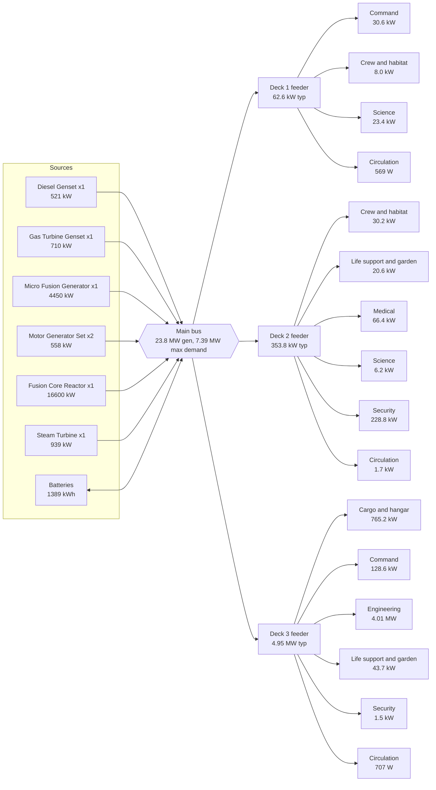

# StarshipGo - Ship Design Specification: Vesper Lantern

*Generated by `python tools/specs/gen_ship_spec.py` from `godot/data/ship.json`, `godot/data/specs.json` and the lore; do not edit by hand. Machine datasheets: [MACHINE_SPECS.md](MACHINE_SPECS.md). Bill of materials with mass, power and price per line: [BOM.md](BOM.md).*

**Vesper Lantern** (MCV-7741), Wayfinder-class deep survey cruiser, built by Calder-Okonkwo Orbital Yards, Tessara Ring Dock 4, commissioned 2291. Motto *Ad lucem ultra*. Crew complement 64.

## 1. Summary

| Parameter | Value |
|---|---|
| Length overall | 66.0 m |
| Beam | 26.0 m |
| Height (keel to top of the highest deck) | 12.2 m |
| Decks | 3 |
| Rooms (incl. circulation) | 43 |
| Doors / stair flights | 26 / 8 |
| Pressurised volume | 13,012 m3 |
| Installed equipment (items / distinct models) | 1401 / 425 |
| Equipment mass | 296.08 t |
| Lightship displacement (structure + equipment) | 1737.56 t |
| Full-load displacement | 2069.62 t |
| Installed generation | 23.8 MW |
| Typical electrical load | 5.36 MW |
| Maximum demand | 7.39 MW |
| Battery storage | 1389 kWh |
| Equipment value | 327.26 M cr |
| Estimated build cost | 652.65 M cr |
| Cruise / top speed | warp 5 / warp 8 (1.10 / 5.3 ly per day) |

## 2. Dimensions and decks

Hull outlines are one closed convex polygon per deck (`ship.json` `hull`). The ship is 66.0 m long and 26.0 m wide at the widest deck.

| Deck | Name | Floor | Hull area | Rooms | Room area | Volume | Items | Equip. mass | Typ. load | Value cr |
|---|---|---|---|---|---|---|---|---|---|---|
| 1 | Command Deck | +8.0 m | 1042 m2 | 14 | 1042 m2 | 3714 m3 | 386 | 24.15 t | 62.6 kW | 19.47 M |
| 2 | Habitat Deck | +4.0 m | 1064 m2 | 15 | 1064 m2 | 3691 m3 | 498 | 51.17 t | 353.8 kW | 48.73 M |
| 3 | Engineering Deck | +0.0 m | 1244 m2 | 14 | 1245 m2 | 5607 m3 | 517 | 220.76 t | 4.95 MW | 259.06 M |

### Rooms

| Deck | Room | Department | m2 | H m | Items | Mass | Idle | Typical | Peak | Value cr |
|---|---|---|---|---|---|---|---|---|---|---|
| 1 | Forward Spine Corridor (`CF1`) | Circulation | 63 | 3.4 | 25 | 192 kg | 5 W | 100 W | 109 W | 16.5 k |
| 1 | Aft Spine Corridor (`CA1`) | Circulation | 31 | 3.4 | 15 | 102 kg | 28 W | 130 W | 176 W | 12.3 k |
| 1 | Mid-ship Stair Lobby (`LB1`) | Circulation | 46 | 3.4 | 14 | 218 kg | 68 W | 270 W | 369 W | 75.6 k |
| 1 | Port Stair Tower (`SP1`) | Circulation | 24 | 3.4 | 6 | 12 kg | 2 W | 31 W | 34 W | 2.9 k |
| 1 | Starboard Stair Tower (`SS1`) | Circulation | 24 | 3.4 | 6 | 20 kg | 2 W | 38 W | 42 W | 4.5 k |
| 1 | Bridge (`BR`) | Command | 175 | 4.2 | 40 | 5.00 t | 2.3 kW | 8.0 kW | 15.3 kW | 5.56 M |
| 1 | Captain's Ready Room (`RR`) | Command | 85 | 3.4 | 30 | 1.29 t | 748 W | 2.7 kW | 5.1 kW | 183.4 k |
| 1 | Observation Lounge (`OL`) | Crew and habitat | 150 | 3.6 | 43 | 2.53 t | 1.3 kW | 4.4 kW | 6.5 kW | 1.71 M |
| 1 | Conference Room (`CR`) | Command | 85 | 3.4 | 40 | 1.65 t | 1.1 kW | 3.9 kW | 6.7 kW | 531.6 k |
| 1 | Astrometrics (`AM`) | Science | 150 | 3.4 | 44 | 5.38 t | 6.0 kW | 23.4 kW | 36.2 kW | 7.41 M |
| 1 | Officers' Cabins A (`OA`) | Crew and habitat | 59 | 3.4 | 37 | 1.42 t | 37 W | 405 W | 1.8 kW | 100.8 k |
| 1 | Officers' Cabins B (`OB`) | Crew and habitat | 46 | 3.4 | 24 | 979 kg | 21 W | 273 W | 1.7 kW | 52.5 k |
| 1 | Captain's Quarters (`CQ`) | Crew and habitat | 61 | 3.4 | 34 | 1.86 t | 807 W | 3.0 kW | 5.7 kW | 306.1 k |
| 1 | Communications Centre (`CC`) | Command | 44 | 3.4 | 28 | 3.49 t | 4.0 kW | 15.9 kW | 25.1 kW | 3.51 M |
| 2 | Forward Spine Corridor (`CF2`) | Circulation | 90 | 3.4 | 36 | 277 kg | 7 W | 140 W | 154 W | 23.2 k |
| 2 | Aft Spine Corridor (`CA2`) | Circulation | 43 | 3.4 | 20 | 150 kg | 30 W | 161 W | 211 W | 16.2 k |
| 2 | Mid-ship Stair Lobby (`LB2`) | Circulation | 46 | 3.4 | 16 | 607 kg | 378 W | 1.3 kW | 1.9 kW | 197.8 k |
| 2 | Port Stair Tower (`SP2`) | Circulation | 24 | 3.4 | 6 | 11 kg | 1 W | 28 W | 31 W | 2.7 k |
| 2 | Starboard Stair Tower (`SS2`) | Circulation | 24 | 3.4 | 6 | 20 kg | 2 W | 39 W | 43 W | 4.6 k |
| 2 | Armory (`AR`) | Security | 31 | 3.4 | 23 | 2.90 t | 67.1 kW | 220.6 kW | 362.2 kW | 1.89 M |
| 2 | Galley (`GA`) | Crew and habitat | 85 | 3.4 | 34 | 4.77 t | 6.0 kW | 19.5 kW | 29.1 kW | 1.48 M |
| 2 | Mess Hall (`MH`) | Crew and habitat | 149 | 3.6 | 100 | 3.07 t | 2.7 kW | 9.1 kW | 13.2 kW | 729.5 k |
| 2 | Brig (`BG`) | Security | 31 | 3.4 | 17 | 3.01 t | 110 W | 640 W | 3.6 kW | 1.44 M |
| 2 | Security Office (`SO`) | Security | 85 | 3.4 | 45 | 3.30 t | 2.2 kW | 7.6 kW | 12.1 kW | 2.86 M |
| 2 | Medical Bay (`MB`) | Medical | 149 | 3.6 | 47 | 15.10 t | 19.9 kW | 66.4 kW | 119.7 kW | 27.35 M |
| 2 | Recreation & Gym (`RG`) | Crew and habitat | 85 | 3.4 | 40 | 2.83 t | 418 W | 1.5 kW | 2.1 kW | 311.4 k |
| 2 | Crew Quarters (`CW`) | Crew and habitat | 69 | 3.4 | 33 | 888 kg | 26 W | 188 W | 228 W | 73.0 k |
| 2 | Science Laboratory (`SL`) | Science | 85 | 3.4 | 36 | 7.83 t | 1.7 kW | 6.2 kW | 13.9 kW | 9.29 M |
| 2 | Hydroponics Garden (`HY`) | Life support and garden | 69 | 3.6 | 39 | 6.40 t | 8.2 kW | 20.6 kW | 32.7 kW | 3.05 M |
| 3 | Forward Spine Corridor (`CF3`) | Circulation | 72 | 3.4 | 28 | 230 kg | 6 W | 119 W | 129 W | 20.6 k |
| 3 | Aft Spine Corridor (`CA3`) | Circulation | 43 | 3.4 | 21 | 541 kg | 29 W | 266 W | 1.6 kW | 23.6 k |
| 3 | Mid-ship Stair Lobby (`LB3`) | Circulation | 46 | 3.4 | 14 | 216 kg | 68 W | 268 W | 366 W | 75.8 k |
| 3 | Port Stair Tower (`SP3`) | Circulation | 24 | 3.4 | 5 | 10 kg | 1 W | 18 W | 20 W | 2.1 k |
| 3 | Starboard Stair Tower (`SS3`) | Circulation | 24 | 3.4 | 6 | 20 kg | 2 W | 36 W | 40 W | 4.5 k |
| 3 | Life Support (`LS`) | Life support and garden | 60 | 3.4 | 31 | 10.24 t | 17.1 kW | 43.7 kW | 70.0 kW | 5.50 M |
| 3 | Computer Core (`CO`) | Command | 143 | 3.4 | 86 | 20.43 t | 33.5 kW | 128.6 kW | 195.4 kW | 17.90 M |
| 3 | Airlock & EVA Prep (`AL`) | Security | 60 | 3.4 | 26 | 2.76 t | 96 W | 1.5 kW | 3.0 kW | 830.4 k |
| 3 | Main Engineering (`ME`) | Engineering | 143 | 3.4 | 67 | 61.28 t | 1.23 MW | 3.43 MW | 7.34 MW | 74.43 M |
| 3 | Engineering Workshop (`WS`) | Engineering | 85 | 3.4 | 58 | 9.17 t | 24 W | 305 W | 1.7 kW | 4.16 M |
| 3 | Cargo Bay (`CB`) | Cargo and hangar | 80 | 3.4 | 37 | 4.33 t | 927 W | 3.2 kW | 7.0 kW | 1.10 M |
| 3 | Power Distribution (`PD`) | Engineering | 85 | 3.4 | 56 | 39.82 t | 207.7 kW | 573.7 kW | 1.21 MW | 36.33 M |
| 3 | Spares Depot (`SD`) | Cargo and hangar | 80 | 3.4 | 37 | 9.05 t | 262.3 kW | 746.5 kW | 1.62 MW | 4.60 M |
| 3 | Hangar Bay (`HB`) | Cargo and hangar | 299 | 8.0 | 45 | 62.65 t | 4.5 kW | 15.5 kW | 30.6 kW | 114.09 M |

## 3. Crew complement

| Item | Value |
|---|---|
| Crew complement (lore) | 64 |
| Sum of room design occupancies | 204 |
| Berths installed (bed models) | 14 |
| Berth coverage | 22 % |
| Metabolic heat (120 W each) | 7.7 kW |

Departments: Cargo and hangar 3 rooms, Command 5 rooms, Crew and habitat 8 rooms, Engineering 3 rooms, Life support and garden 2 rooms, Medical 1 rooms, Science 2 rooms, Security 4 rooms, Circulation 15 rooms.

## 4. Mass budget

| Group | Mass | Share |
|---|---|---|
| Pressure hull skin and ablative layer | 502.13 t | 24.3 % |
| Deck slabs and roof | 614.99 t | 29.7 % |
| Internal bulkheads | 130.73 t | 6.3 % |
| Secondary structure | 149.74 t | 7.2 % |
| Stair flights | 8.80 t | 0.4 % |
| Radiators (external) | 35.09 t | 1.7 % |
| Installed equipment (1401 items) | 296.08 t | 14.3 % |
| **Lightship** | 1737.56 t | 84.0 % |
| Tank, cylinder and water-tank contents | 13.21 t | 0.6 % |
| Food stores (180 days) | 20.74 t | 1.0 % |
| Potable water buffer | 9.60 t | 0.5 % |
| Oxygen reserve (30 days) | 1.61 t | 0.1 % |
| Atmosphere inventory | 15.61 t | 0.8 % |
| Cargo payload at departure | 271.29 t | 13.1 % |
| **Full-load displacement** | 2069.62 t | 100.0 % |

### Installed equipment mass by department

| Department | Items | Mass | Share of equipment |
|---|---|---|---|
| Cargo and hangar | 119 | 76.04 t | 25.7 % |
| Command | 224 | 31.87 t | 10.8 % |
| Crew and habitat | 345 | 18.36 t | 6.2 % |
| Engineering | 181 | 110.27 t | 37.2 % |
| Life support and garden | 70 | 16.64 t | 5.6 % |
| Medical | 47 | 15.10 t | 5.1 % |
| Science | 80 | 13.21 t | 4.5 % |
| Security | 111 | 11.98 t | 4.0 % |
| Circulation | 224 | 2.62 t | 0.9 % |

### Heaviest equipment families

| Family | Mass | Share |
|---|---|---|
| craft | 54.90 t | 18.5 % |
| generator | 30.38 t | 10.3 % |
| reactor | 26.95 t | 9.1 % |
| coil | 16.89 t | 5.7 % |
| capacitor | 14.05 t | 4.7 % |
| rack | 12.71 t | 4.3 % |
| door | 12.49 t | 4.2 % |
| tank | 10.13 t | 3.4 % |
| turbine | 10.03 t | 3.4 % |
| console | 7.99 t | 2.7 % |

## 5. Electrical power budget

Loads are the *typical* figures of the machine datasheets; connected peak is the sum of the peak figures. Assumptions: Power diversity (maximum demand = typical + 35 % of the gap to the connected peak); Essential load (typical load of command, medical and life-support rooms plus 10 % of everything else); Battery (90 % usable).

| Quantity | Value |
|---|---|
| Installed generation | 23.78 MW |
| Largest single unit | 16.60 MW |
| Generation with the largest unit lost (N-1) | 7.18 MW |
| Hotel (idle) load | 1.88 MW |
| Typical load | 5.36 MW |
| Connected peak | 11.17 MW |
| Maximum demand | 7.39 MW |
| Margin (generation - maximum demand) | 69 % |
| Essential load (emergency) | 797 kW |
| Battery capacity | 1389 kWh |
| Battery discharge rating | 8.5 MW |
| Emergency endurance on batteries | 1.6 h |

### Producers

| Model | Designation | Room | Qty | Output each | Output total | Bus |
|---|---|---|---|---|---|---|
| `generator_diesel_genset` | Power generation / conversion - Diesel Genset | aux | 1 | 521 kW | 521 kW | 400 VAC 3ph |
| `generator_gas_turbine_genset` | Power generation / conversion - Gas Turbine Genset | aux | 1 | 710 kW | 710 kW | 400 VAC 3ph |
| `generator_micro_fusion_generator` | Power generation / conversion - Micro Fusion Generator | aux | 1 | 4450 kW | 4450 kW | 6.6 kVAC 3ph |
| `generator_motor_generator_set` | Power generation / conversion - Motor Generator Set | aux | 1 | 279 kW | 279 kW | 400 VAC 3ph |
| `generator_motor_generator_set` | Power generation / conversion - Motor Generator Set | eng | 1 | 279 kW | 279 kW | 400 VAC 3ph |
| `reactor_fusion_core_reactor` | Reactor - Fusion Core Reactor | eng | 1 | 16600 kW | 16600 kW | 6.6 kVAC 3ph |
| `turbine_steam_turbine` | Turbomachinery - Steam Turbine | eng | 1 | 939 kW | 939 kW | 400 VAC 3ph |

### Energy storage

| Model | Room | Qty | Capacity | Discharge |
|---|---|---|---|---|
| `capacitor_battery_rack` | core | 3 | 714.0 kWh | 1428 kW |
| `capacitor_battery_trolley` | aux | 1 | 142.0 kWh | 285 kW |
| `capacitor_capacitor_bank_rack` | aux | 3 | 32.7 kWh | 1968 kW |
| `capacitor_capacitor_bank_rack` | eng | 2 | 21.8 kWh | 1312 kW |
| `capacitor_marx_bank` | aux | 2 | 15.0 kWh | 900 kW |
| `capacitor_marx_bank` | eng | 1 | 7.5 kWh | 450 kW |
| `capacitor_power_cell_locker` | aux | 1 | 137.0 kWh | 274 kW |
| `capacitor_power_cell_locker` | depot | 2 | 274.0 kWh | 548 kW |
| `turbine_flywheel` | eng | 1 | 44.6 kWh | 1340 kW |

### Single-line diagram

### Load by deck and department

| Deck | Idle | Typical | Connected peak | Share of typical |
|---|---|---|---|---|
| 1 | 16.4 kW | 62.6 kW | 104.7 kW | 1.2 % |
| 2 | 108.9 kW | 353.8 kW | 591.2 kW | 6.6 % |
| 3 | 1.75 MW | 4.95 MW | 10.47 MW | 92.2 % |

| Department | Idle | Typical | Connected peak | Share of typical |
|---|---|---|---|---|
| Cargo and hangar | 267.7 kW | 765.2 kW | 1.65 MW | 14.3 % |
| Command | 41.6 kW | 159.2 kW | 247.5 kW | 3.0 % |
| Crew and habitat | 11.2 kW | 38.2 kW | 60.4 kW | 0.7 % |
| Engineering | 1.43 MW | 4.01 MW | 8.55 MW | 74.7 % |
| Life support and garden | 25.4 kW | 64.2 kW | 102.7 kW | 1.2 % |
| Medical | 19.9 kW | 66.4 kW | 119.7 kW | 1.2 % |
| Science | 7.7 kW | 29.6 kW | 50.1 kW | 0.6 % |
| Security | 69.6 kW | 230.3 kW | 380.8 kW | 4.3 % |
| Circulation | 627 W | 2.9 kW | 5.2 kW | 0.1 % |

### Biggest electrical consumers by family

| Family | Typical load | Share |
|---|---|---|
| coil | 4.52 MW | 84.3 % |
| forcefield | 220.0 kW | 4.1 % |
| rack | 146.8 kW | 2.7 % |
| scrubber | 45.4 kW | 0.8 % |
| medscanner | 43.0 kW | 0.8 % |
| galley | 37.1 kW | 0.7 % |
| tank | 20.1 kW | 0.4 % |
| craft | 14.5 kW | 0.3 % |
| cryo | 12.4 kW | 0.2 % |
| console | 11.6 kW | 0.2 % |

## 6. Thermal budget

| Quantity | Value |
|---|---|
| Equipment heat (datasheets, typical) | 10.20 MW |
| Crew metabolic heat | 7.7 kW |
| Total heat to reject | 10.21 MW |
| Radiator area (4 kW/m2, +25 % margin) | 3190 m2 |
| Radiator mass | 35.09 t |
| Coolant flow (water-glycol, 35 K rise) | 81 kg/s |

| Deck | Equipment heat |
|---|---|
| 1 | 57.3 kW |
| 2 | 322.2 kW |
| 3 | 9.82 MW |

## 7. Life-support budget

| Flow (per person-day) | Per person | Crew of 64 |
|---|---|---|
| Oxygen consumed | 0.84 kg | 54 kg |
| CO2 produced | 1.04 kg | 67 kg |
| Potable water and food water | 3.5 L | 224 L |
| Hygiene and lab water | 26.5 L | 1696 L |
| Food as served | 1.8 kg | 115 kg |
| Water recycled (96 %) | 28.8 L | 1843 L |
| Water makeup | 1.2 L | 77 L |

| Installed capability | Value |
|---|---|
| CO2 scrubbing (5 units, 30 kg/day per m3) | 408 kg/day (6.1x the crew) |
| Pressurised volume / air inventory | 13,012 m3 / 15.61 t |
| Oxygen autonomy (reserve + air) | 91 days |
| Water-tank storage (50 % fill) | 8702 L (4.5 days of crew use) |
| Hydroponics planter volume / yield (0.30 kg/m3/day) | 17.4 m3 / 5.2 kg/day |
| Fresh produce need (0.55 kg per person-day) | 35.2 kg/day (15 % covered) |
| Food stores (180 days) | 20.74 t |

## 8. Propulsion, FTL, sensors, defence

| System | Families | Units | Mass | Typical | Peak | Value cr |
|---|---|---|---|---|---|---|
| Warp field and plasma | coil | 8 | 16.89 t | 4.52 MW | 9.79 MW | 11.41 M |
| Power generation and conversion | reactor, generator, turbine | 16 | 67.36 t | 215.1 kW | 334.4 kW | 84.85 M |
| Impulse and manoeuvring | nozzle | 1 | 2.10 t | 5.0 kW | 11.0 kW | 1.32 M |
| Sensors and astronomy | instrument, telescope, antenna, sciinstrument | 7 | 1.21 t | 2.0 kW | 3.3 kW | 3.13 M |
| Defence and security | forcefield, weaponrack, camera, cell | 24 | 4.67 t | 220.9 kW | 361.4 kW | 3.53 M |
| Computing and communications | rack, storage, router, commsunit | 65 | 15.92 t | 152.8 kW | 229.4 kW | 16.42 M |
| Craft | craft | 3 | 54.90 t | 14.5 kW | 29.4 kW | 112.30 M |
| Life support machinery | scrubber, tank, watertank, cylinder | 32 | 23.69 t | 69.5 kW | 110.0 kW | 12.16 M |

Craft carried: craft_interceptor x1 (15.82 t), craft_repair_pod x1 (9.17 t), craft_shuttlecraft x1 (29.92 t).

The ship's main power is its fusion core(s) (16.6 MW); fusion fuel burn at typical load is about 1.4 g of deuterium per day (3.4e14 J/kg), so the endurance limit is the garden, the filters and the crew, not fuel. The warp coils draw 4.52 MW typically.

### Warp performance

| Warp factor | ly per day | ly per 30 days | Days to The Lighthouse (30.8 ly straight) |
|---|---|---|---|
| 1.0 | 0.005 | 0.2 | 5993.1 d |
| 2.0 | 0.052 | 1.6 | 594.6 d |
| 3.0 | 0.200 | 6.0 | 153.9 d |
| 4.0 | 0.523 | 15.7 | 59.0 d |
| 5.0 | 1.100 | 33.0 | 28.0 d |
| 6.0 | 2.020 | 60.6 | 15.3 d |
| 7.0 | 3.377 | 101.3 | 9.1 d |
| 8.0 | 5.270 | 158.1 | 5.9 d |

Speed model: `ly/day = 1.10 x (warp / 5)^(10/3)`. Cruise is warp 5, top speed warp 8; above cruise the coils run hot and the maximum duration is limited by coil temperature.

## 9. Costs

### Equipment value by department and deck

| Department | Items | Value cr | Share |
|---|---|---|---|
| Cargo and hangar | 119 | 119.78 M | 36.6 % |
| Command | 224 | 27.68 M | 8.5 % |
| Crew and habitat | 345 | 4.77 M | 1.5 % |
| Engineering | 181 | 114.91 M | 35.1 % |
| Life support and garden | 70 | 8.56 M | 2.6 % |
| Medical | 47 | 27.35 M | 8.4 % |
| Science | 80 | 16.70 M | 5.1 % |
| Security | 111 | 7.02 M | 2.1 % |
| Circulation | 224 | 483.0 k | 0.1 % |

| Deck | Items | Value cr | Share |
|---|---|---|---|
| 1 | 386 | 19.47 M | 6.0 % |
| 2 | 498 | 48.73 M | 14.9 % |
| 3 | 517 | 259.06 M | 79.2 % |

### Most valuable rooms

| Room | Deck | Value cr | Mass |
|---|---|---|---|
| Hangar Bay | 3 | 114.09 M | 62.65 t |
| Main Engineering | 3 | 74.43 M | 61.28 t |
| Power Distribution | 3 | 36.33 M | 39.82 t |
| Medical Bay | 2 | 27.35 M | 15.10 t |
| Computer Core | 3 | 17.90 M | 20.43 t |
| Science Laboratory | 2 | 9.29 M | 7.83 t |
| Astrometrics | 1 | 7.41 M | 5.38 t |
| Bridge | 1 | 5.56 M | 5.00 t |
| Life Support | 3 | 5.50 M | 10.24 t |
| Spares Depot | 3 | 4.60 M | 9.05 t |

### Build cost estimate

| Item | Cost cr |
|---|---|
| Installed equipment | 327.26 M |
| Hull and structure (1441.48 t) | 122.53 M |
| Integration (22 %) | 72.00 M |
| Yard overhead and margin (18 %) | 93.92 M |
| Design and trials (6 %) | 36.94 M |
| **Total** | 652.65 M |

### Running cost per month

| Item | Cost cr |
|---|---|
| Crew pay (64 x 4,200 cr) | 268.8 k |
| Provisions (64 people, 30 days) | 38.0 k |
| Maintenance (0.25 % of equipment) | 818.2 k |
| Spares (0.1 % of equipment) | 327.3 k |
| Fuel and reaction mass (3915 MWh) | 47.0 k |
| **Total per month** | 1.50 M |
| **Per year** | 17.99 M |

## 10. Maintenance schedule

| Interval | Hours | Units | Crew-hours per year |
|---|---|---|---|
| weekly | 168 | 15 | 557 |
| every 1,000 h | 1,000 | 3 | 102 |
| every 2,000 h | 2,000 | 30 | 172 |
| quarterly | 2,190 | 87 | 237 |
| every 3,000 h | 3,000 | 71 | 209 |
| every 4,000 h | 4,000 | 31 | 131 |
| six-monthly | 4,380 | 180 | 268 |
| yearly | 8,760 | 506 | 357 |
| two-yearly | 17,520 | 478 | 129 |

Total scheduled maintenance: 2163 crew-hours per year (180 per month) - about 1.2 full-time technicians (1,800 h each).

| Family | Crew-hours per year |
|---|---|
| plant | 557 |
| galley | 129 |
| craft | 102 |
| engtool | 90 |
| safety | 82 |
| tableware | 70 |
| coil | 69 |
| generator | 54 |
| rack | 54 |
| capacitor | 51 |
| tank | 42 |
| chair | 42 |

## 11. Cargo capacity

| Cargo room | Volume m3 | Net m3 | Payload capacity |
|---|---|---|---|
| Cargo Bay | 272 | 150 | 41.89 t |
| Spares Depot | 272 | 150 | 41.89 t |
| Hangar Bay | 2392 | 1316 | 368.37 t |

Total net cargo volume 1615 m3, payload capacity 452.14 t (departure load 271.29 t). Craft: 1 x craft_interceptor, 1 x craft_repair_pod, 1 x craft_shuttlecraft.

## 12. Performance

| Figure | Value |
|---|---|
| Cruise speed | warp 5 = 1.10 ly/day |
| Top speed | warp 8 = 5.3 ly/day |
| Autonomy (limited by oxygen and food stores) | 91 days |
| Range at cruise without resupply | 100 ly |
| Charter length | four years with resupply at frontier outposts |
| Reactor fuel burn | about 1.4 g/day |

## 13. Compliance

Invented Concord Standards Agency (CSA) codes claimed by the installed machine datasheets:

| Standard | Scope | Installed units claiming it |
|---|---|---|
| CSA-B7 | Bridge systems | 86 |
| CSA-BIO1 | Biosafety | 15 |
| CSA-C1 | Cargo handling | 36 |
| CSA-E24 | Electrical safety | 667 |
| CSA-EMC4 | Electromagnetic compatibility | 204 |
| CSA-F1 | Fire and smoke | 360 |
| CSA-F2 | Food contact | 87 |
| CSA-F9 | Flight certificate | 3 |
| CSA-H2 | Flight deck | 21 |
| CSA-L3 | Photobiological safety | 229 |
| CSA-LAB2 | Laboratory equipment | 14 |
| CSA-LS1 | Life support equipment | 71 |
| CSA-M5 | Machinery safety | 61 |
| CSA-MD5 | Medical device class 5 | 27 |
| CSA-P4 | Pressure equipment | 74 |
| CSA-R3 | Radiation protection (fusion) | 3 |
| CSA-S2 | Structural | 249 |
| CSA-S3 | Safety equipment | 94 |
| CSA-SEC2 | Security systems | 24 |

### Ship-level checks

| Check | Result | Value |
|---|---|---|
| Generation margin over maximum demand >= 20 % | PASS | 69 % |
| N-1: generation without the largest unit covers the typical (cruise) load | PASS | 7.18 MW vs 5.36 MW |
| Battery endurance on essential load >= 1 h | PASS | 1.6 h |
| CO2 scrubbing >= 1.25 x crew production | PASS | 408 vs 67 kg/day |
| At least two stair towers (two means of escape) | PASS | 2 |
| Berths cover crew (or hot-bunking <= 2:1) | REVIEW | 14 berths for 64 crew |
| All models have datasheets | PASS | 0 missing |
| Cargo payload >= 20 t | PASS | 452.14 t |

## 14. Assumptions

| Item | Assumption |
|---|---|
| Pressure hull skin incl. ablative layer | 300 kg/m2 of wetted skin (perimeter x deck height) |
| Deck slabs and roof | 140 kg/m2 of hull area per deck plus one roof |
| Internal bulkheads | 45 kg/m2 on half the room perimeters (walls are shared) |
| Secondary structure and frames | 12 % of skin, slabs and bulkheads |
| Stair flights | 1.1 t per flight (two flights per run) |
| Radiators | 4.0 kW/m2 rejection, 11 kg/m2, design margin 25 % |
| Tank and cylinder contents | 35 % of installed tank / cylinder / water-tank bounding volume at 900 kg/m3 |
| Stores | 180 days of food (1.8 kg per person-day as served), 5 days of potable water buffer (30 L per person-day), 30 days of oxygen |
| Cargo | net cargo volume = 55 % of the cargo room volume; payload 280 kg/m3; loaded to 60 % at departure |
| Power diversity | maximum demand = typical + 35 % of the gap to the connected peak |
| Essential load | typical load of command, medical and life-support rooms plus 10 % of everything else |
| Battery | 90 % usable |
| Build cost | equipment + 85,000 cr per tonne of structure; integration 22 %; yard overhead and margin 18 %; design and trials 6 % |
| Running cost | crew 4,200 cr/month each, provisions 11 cr/kg, maintenance 0.25 % and spares 0.1 % of equipment value per month, fuel 0.012 cr/kWh |

