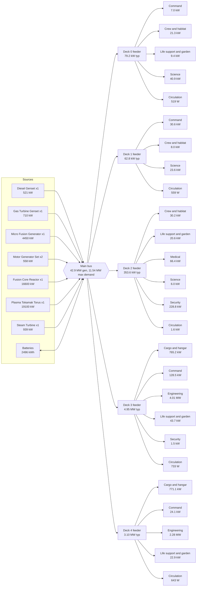

# StarshipGo - Ship Design Specification: Vesper Lantern

*Generated by `python tools/specs/gen_ship_spec.py` from `godot/data/ship.json`, `godot/data/specs.json` and the lore; do not edit by hand. Machine datasheets: [MACHINE_SPECS.md](MACHINE_SPECS.md). Bill of materials with mass, power and price per line: [BOM.md](BOM.md).*

**Vesper Lantern** (MCV-7741), Wayfinder-class deep survey cruiser, built by Calder-Okonkwo Orbital Yards, Tessara Ring Dock 4, commissioned 2291. Motto *Ad lucem ultra*. Crew complement 64.

## 1. Summary

| Parameter | Value |
|---|---|
| Length overall | 66.0 m |
| Beam | 26.0 m |
| Height (keel to top of the highest deck) | 16.2 m |
| Decks | 5 |
| Rooms (incl. circulation) | 68 |
| Doors / stair flights | 34 / 16 |
| Pressurised volume | 20,022 m3 |
| Installed equipment (items / distinct models) | 2427 / 541 |
| Equipment mass | 494.22 t |
| Lightship displacement (structure + equipment) | 2660.66 t |
| Full-load displacement | 3141.40 t |
| Installed generation | 42.9 MW |
| Typical electrical load | 8.54 MW |
| Maximum demand | 11.54 MW |
| Battery storage | 2496 kWh |
| Equipment value | 562.95 M cr |
| Estimated build cost | 1089.38 M cr |
| Cruise / top speed | warp 5 / warp 8 (1.10 / 5.3 ly per day) |

## 2. Dimensions and decks

Hull outlines are one closed convex polygon per deck (`ship.json` `hull`). The ship is 66.0 m long and 26.0 m wide at the widest deck.

| Deck | Name | Floor | Hull area | Rooms | Room area | Volume | Items | Equip. mass | Typ. load | Value cr |
|---|---|---|---|---|---|---|---|---|---|---|
| 0 | Sky Deck | +12.0 m | 859 m2 | 12 | 860 m2 | 3112 m3 | 453 | 32.14 t | 79.2 kW | 33.99 M |
| 1 | Command Deck | +8.0 m | 1042 m2 | 14 | 1042 m2 | 3714 m3 | 385 | 25.30 t | 62.8 kW | 19.49 M |
| 2 | Habitat Deck | +4.0 m | 1064 m2 | 15 | 1064 m2 | 3691 m3 | 497 | 49.87 t | 353.6 kW | 48.72 M |
| 3 | Engineering Deck | +0.0 m | 1244 m2 | 14 | 1245 m2 | 5607 m3 | 516 | 220.74 t | 4.95 MW | 259.05 M |
| 4 | Hold Deck | -4.0 m | 1146 m2 | 13 | 1146 m2 | 3898 m3 | 576 | 166.18 t | 3.10 MW | 201.71 M |

### Rooms

| Deck | Room | Department | m2 | H m | Items | Mass | Idle | Typical | Peak | Value cr |
|---|---|---|---|---|---|---|---|---|---|---|
| 0 | Forward Spine Corridor (`CF0`) | Circulation | 24 | 3.4 | 10 | 68 kg | 2 W | 30 W | 33 W | 7.6 k |
| 0 | Aft Spine Corridor (`CA0`) | Circulation | 43 | 3.4 | 20 | 128 kg | 29 W | 145 W | 194 W | 12.0 k |
| 0 | Mid-ship Stair Lobby (`LB0`) | Circulation | 46 | 3.4 | 14 | 224 kg | 68 W | 275 W | 374 W | 77.4 k |
| 0 | Port Stair Tower (`SP0`) | Circulation | 24 | 3.4 | 6 | 20 kg | 2 W | 39 W | 43 W | 4.6 k |
| 0 | Starboard Stair Tower (`SS0`) | Circulation | 24 | 3.4 | 6 | 12 kg | 1 W | 29 W | 32 W | 2.8 k |
| 0 | Star Cartography (`SC`) | Science | 220 | 4.2 | 87 | 7.43 t | 7.7 kW | 28.6 kW | 42.3 kW | 11.01 M |
| 0 | Briefing Theatre (`BT`) | Command | 92 | 3.4 | 58 | 2.04 t | 2.1 kW | 7.0 kW | 10.0 kW | 1.93 M |
| 0 | Officers' Wardroom & Bar (`WR`) | Crew and habitat | 92 | 3.4 | 62 | 2.45 t | 1.7 kW | 6.0 kW | 8.8 kW | 573.9 k |
| 0 | Library & Archive (`LI`) | Crew and habitat | 84 | 3.4 | 59 | 8.70 t | 3.5 kW | 14.1 kW | 20.8 kW | 7.30 M |
| 0 | Arboretum (`AB`) | Life support and garden | 63 | 3.6 | 42 | 3.14 t | 3.6 kW | 9.4 kW | 14.9 kW | 1.52 M |
| 0 | Observatory (`OB`) | Science | 84 | 3.4 | 44 | 6.00 t | 3.3 kW | 12.3 kW | 20.1 kW | 10.13 M |
| 0 | Flag Officer's Suite (`FS`) | Crew and habitat | 63 | 3.4 | 45 | 1.92 t | 292 W | 1.3 kW | 3.1 kW | 1.41 M |
| 1 | Forward Spine Corridor (`CF1`) | Circulation | 63 | 3.4 | 25 | 195 kg | 5 W | 100 W | 108 W | 15.3 k |
| 1 | Aft Spine Corridor (`CA1`) | Circulation | 31 | 3.4 | 15 | 109 kg | 29 W | 141 W | 189 W | 13.3 k |
| 1 | Mid-ship Stair Lobby (`LB1`) | Circulation | 46 | 3.4 | 14 | 206 kg | 67 W | 263 W | 361 W | 72.4 k |
| 1 | Port Stair Tower (`SP1`) | Circulation | 24 | 3.4 | 5 | 10 kg | 1 W | 19 W | 21 W | 2.2 k |
| 1 | Starboard Stair Tower (`SS1`) | Circulation | 24 | 3.4 | 6 | 20 kg | 2 W | 36 W | 40 W | 4.5 k |
| 1 | Bridge (`BR`) | Command | 175 | 4.2 | 40 | 4.89 t | 2.3 kW | 8.0 kW | 14.8 kW | 5.55 M |
| 1 | Captain's Ready Room (`RR`) | Command | 85 | 3.4 | 30 | 1.38 t | 747 W | 2.8 kW | 5.4 kW | 180.7 k |
| 1 | Observation Lounge (`OL`) | Crew and habitat | 150 | 3.6 | 43 | 2.68 t | 1.3 kW | 4.4 kW | 6.5 kW | 1.72 M |
| 1 | Conference Room (`CR`) | Command | 85 | 3.4 | 40 | 1.65 t | 1.1 kW | 3.9 kW | 6.7 kW | 532.6 k |
| 1 | Astrometrics (`AM`) | Science | 150 | 3.4 | 44 | 6.41 t | 6.0 kW | 23.6 kW | 38.9 kW | 7.43 M |
| 1 | Officers' Cabins A (`OA`) | Crew and habitat | 59 | 3.4 | 37 | 1.41 t | 37 W | 399 W | 1.8 kW | 97.9 k |
| 1 | Officers' Cabins B (`OB`) | Crew and habitat | 46 | 3.4 | 24 | 979 kg | 21 W | 271 W | 1.7 kW | 53.5 k |
| 1 | Captain's Quarters (`CQ`) | Crew and habitat | 61 | 3.4 | 34 | 1.86 t | 807 W | 3.0 kW | 5.7 kW | 306.1 k |
| 1 | Communications Centre (`CC`) | Command | 44 | 3.4 | 28 | 3.50 t | 4.0 kW | 15.9 kW | 25.1 kW | 3.51 M |
| 2 | Forward Spine Corridor (`CF2`) | Circulation | 90 | 3.4 | 37 | 293 kg | 7 W | 141 W | 155 W | 24.0 k |
| 2 | Aft Spine Corridor (`CA2`) | Circulation | 43 | 3.4 | 20 | 147 kg | 30 W | 160 W | 210 W | 15.9 k |
| 2 | Mid-ship Stair Lobby (`LB2`) | Circulation | 46 | 3.4 | 16 | 592 kg | 377 W | 1.3 kW | 1.9 kW | 194.2 k |
| 2 | Port Stair Tower (`SP2`) | Circulation | 24 | 3.4 | 5 | 10 kg | 1 W | 18 W | 20 W | 2.1 k |
| 2 | Starboard Stair Tower (`SS2`) | Circulation | 24 | 3.4 | 6 | 12 kg | 1 W | 29 W | 32 W | 2.8 k |
| 2 | Armory (`AR`) | Security | 31 | 3.4 | 23 | 2.90 t | 67.1 kW | 220.6 kW | 362.2 kW | 1.89 M |
| 2 | Galley (`GA`) | Crew and habitat | 85 | 3.4 | 34 | 4.56 t | 6.0 kW | 19.5 kW | 29.1 kW | 1.48 M |
| 2 | Mess Hall (`MH`) | Crew and habitat | 149 | 3.6 | 100 | 3.34 t | 2.7 kW | 9.1 kW | 13.2 kW | 752.4 k |
| 2 | Brig (`BG`) | Security | 31 | 3.4 | 17 | 2.94 t | 110 W | 630 W | 3.5 kW | 1.44 M |
| 2 | Security Office (`SO`) | Security | 85 | 3.4 | 45 | 3.37 t | 2.2 kW | 7.6 kW | 12.2 kW | 2.86 M |
| 2 | Medical Bay (`MB`) | Medical | 149 | 3.6 | 47 | 14.97 t | 19.9 kW | 66.4 kW | 119.4 kW | 27.35 M |
| 2 | Recreation & Gym (`RG`) | Crew and habitat | 85 | 3.4 | 40 | 2.82 t | 419 W | 1.5 kW | 2.1 kW | 311.0 k |
| 2 | Crew Quarters (`CW`) | Crew and habitat | 69 | 3.4 | 33 | 878 kg | 26 W | 190 W | 230 W | 73.6 k |
| 2 | Science Laboratory (`SL`) | Science | 85 | 3.4 | 35 | 6.63 t | 1.7 kW | 6.0 kW | 11.0 kW | 9.27 M |
| 2 | Hydroponics Garden (`HY`) | Life support and garden | 69 | 3.6 | 39 | 6.40 t | 8.2 kW | 20.6 kW | 32.7 kW | 3.06 M |
| 3 | Forward Spine Corridor (`CF3`) | Circulation | 72 | 3.4 | 27 | 208 kg | 6 W | 116 W | 126 W | 18.4 k |
| 3 | Aft Spine Corridor (`CA3`) | Circulation | 43 | 3.4 | 21 | 665 kg | 30 W | 289 W | 1.7 kW | 29.1 k |
| 3 | Mid-ship Stair Lobby (`LB3`) | Circulation | 46 | 3.4 | 14 | 218 kg | 68 W | 269 W | 368 W | 76.4 k |
| 3 | Port Stair Tower (`SP3`) | Circulation | 24 | 3.4 | 6 | 11 kg | 1 W | 28 W | 31 W | 2.7 k |
| 3 | Starboard Stair Tower (`SS3`) | Circulation | 24 | 3.4 | 6 | 12 kg | 2 W | 31 W | 34 W | 2.9 k |
| 3 | Life Support (`LS`) | Life support and garden | 60 | 3.4 | 31 | 10.24 t | 17.1 kW | 43.7 kW | 70.0 kW | 5.50 M |
| 3 | Computer Core (`CO`) | Command | 143 | 3.4 | 86 | 20.42 t | 33.5 kW | 128.5 kW | 195.4 kW | 17.90 M |
| 3 | Airlock & EVA Prep (`AL`) | Security | 60 | 3.4 | 26 | 2.69 t | 96 W | 1.5 kW | 2.9 kW | 830.4 k |
| 3 | Main Engineering (`ME`) | Engineering | 143 | 3.4 | 66 | 61.33 t | 1.23 MW | 3.43 MW | 7.34 MW | 74.43 M |
| 3 | Engineering Workshop (`WS`) | Engineering | 85 | 3.4 | 58 | 9.01 t | 24 W | 268 W | 1.3 kW | 4.15 M |
| 3 | Cargo Bay (`CB`) | Cargo and hangar | 80 | 3.4 | 37 | 4.33 t | 927 W | 3.2 kW | 7.0 kW | 1.10 M |
| 3 | Power Distribution (`PD`) | Engineering | 85 | 3.4 | 56 | 39.93 t | 207.7 kW | 573.7 kW | 1.21 MW | 36.33 M |
| 3 | Spares Depot (`SD`) | Cargo and hangar | 80 | 3.4 | 37 | 9.03 t | 262.3 kW | 746.5 kW | 1.62 MW | 4.59 M |
| 3 | Hangar Bay (`HB`) | Cargo and hangar | 299 | 8.0 | 45 | 62.65 t | 4.5 kW | 15.5 kW | 30.6 kW | 114.09 M |
| 4 | Forward Spine Corridor (`CF4`) | Circulation | 60 | 3.4 | 25 | 200 kg | 5 W | 102 W | 110 W | 18.3 k |
| 4 | Aft Spine Corridor (`CA4`) | Circulation | 79 | 3.4 | 30 | 269 kg | 33 W | 220 W | 274 W | 26.8 k |
| 4 | Mid-ship Stair Lobby (`LB4`) | Circulation | 46 | 3.4 | 14 | 209 kg | 67 W | 262 W | 360 W | 73.9 k |
| 4 | Port Stair Tower (`SP4`) | Circulation | 24 | 3.4 | 6 | 12 kg | 1 W | 30 W | 33 W | 2.7 k |
| 4 | Starboard Stair Tower (`SS4`) | Circulation | 24 | 3.4 | 6 | 12 kg | 1 W | 29 W | 32 W | 2.8 k |
| 4 | Antimatter Containment (`AC`) | Engineering | 83 | 3.4 | 53 | 56.98 t | 749.3 kW | 2.27 MW | 4.48 MW | 77.52 M |
| 4 | Provisions Hold & Cold Store (`PH`) | Cargo and hangar | 103 | 3.4 | 61 | 12.92 t | 109.1 kW | 356.8 kW | 589.0 kW | 12.07 M |
| 4 | Water Reclamation Plant (`WP`) | Life support and garden | 83 | 3.4 | 63 | 10.80 t | 5.5 kW | 14.3 kW | 23.8 kW | 8.44 M |
| 4 | Waste & Recycling Plant (`WW`) | Life support and garden | 103 | 3.4 | 54 | 8.91 t | 2.9 kW | 8.6 kW | 15.7 kW | 3.51 M |
| 4 | Fabrication Hall (`FH`) | Engineering | 120 | 3.4 | 78 | 12.47 t | 1.6 kW | 5.6 kW | 10.6 kW | 12.90 M |
| 4 | Auxiliary Control (`AX`) | Command | 120 | 3.4 | 77 | 9.56 t | 6.7 kW | 24.1 kW | 37.1 kW | 9.94 M |
| 4 | Main Cargo Hold (`MC`) | Cargo and hangar | 151 | 3.4 | 60 | 7.90 t | 1.4 kW | 4.7 kW | 8.3 kW | 1.24 M |
| 4 | Drone & Probe Bay (`DP`) | Cargo and hangar | 151 | 3.4 | 49 | 45.93 t | 126.0 kW | 409.6 kW | 656.8 kW | 75.96 M |

## 3. Crew complement

| Item | Value |
|---|---|
| Crew complement (lore) | 64 |
| Sum of room design occupancies | 317 |
| Berths installed (bed models) | 15 |
| Berth coverage | 23 % |
| Metabolic heat (120 W each) | 7.7 kW |

Departments: Cargo and hangar 6 rooms, Command 7 rooms, Crew and habitat 11 rooms, Engineering 5 rooms, Life support and garden 5 rooms, Medical 1 rooms, Science 4 rooms, Security 4 rooms, Circulation 25 rooms.

## 4. Mass budget

| Group | Mass | Share |
|---|---|---|
| Pressure hull skin and ablative layer | 787.12 t | 25.1 % |
| Deck slabs and roof | 870.22 t | 27.7 % |
| Internal bulkheads | 203.83 t | 6.5 % |
| Secondary structure | 223.34 t | 7.1 % |
| Stair flights | 17.60 t | 0.6 % |
| Radiators (external) | 64.32 t | 2.0 % |
| Installed equipment (2427 items) | 494.22 t | 15.7 % |
| **Lightship** | 2660.66 t | 84.7 % |
| Tank, cylinder and water-tank contents | 26.06 t | 0.8 % |
| Food stores (180 days) | 20.74 t | 0.7 % |
| Potable water buffer | 9.60 t | 0.3 % |
| Oxygen reserve (30 days) | 1.61 t | 0.1 % |
| Atmosphere inventory | 24.03 t | 0.8 % |
| Cargo payload at departure | 398.71 t | 12.7 % |
| **Full-load displacement** | 3141.40 t | 100.0 % |

### Installed equipment mass by department

| Department | Items | Mass | Share of equipment |
|---|---|---|---|
| Cargo and hangar | 289 | 142.76 t | 28.9 % |
| Command | 359 | 43.44 t | 8.8 % |
| Crew and habitat | 511 | 31.59 t | 6.4 % |
| Engineering | 311 | 179.72 t | 36.4 % |
| Life support and garden | 229 | 39.50 t | 8.0 % |
| Medical | 47 | 14.97 t | 3.0 % |
| Science | 210 | 26.48 t | 5.4 % |
| Security | 111 | 11.90 t | 2.4 % |
| Circulation | 360 | 3.86 t | 0.8 % |

### Heaviest equipment families

| Family | Mass | Share |
|---|---|---|
| craft | 88.95 t | 18.0 % |
| reactor | 66.11 t | 13.4 % |
| generator | 31.75 t | 6.4 % |
| coil | 26.59 t | 5.4 % |
| tank | 21.69 t | 4.4 % |
| capacitor | 21.47 t | 4.3 % |
| console | 16.45 t | 3.3 % |
| door | 15.72 t | 3.2 % |
| rack | 15.70 t | 3.2 % |
| hangartool | 12.67 t | 2.6 % |

## 5. Electrical power budget

Loads are the *typical* figures of the machine datasheets; connected peak is the sum of the peak figures. Assumptions: Power diversity (maximum demand = typical + 35 % of the gap to the connected peak); Essential load (typical load of command, medical and life-support rooms plus 10 % of everything else); Battery (90 % usable).

| Quantity | Value |
|---|---|
| Installed generation | 42.88 MW |
| Largest single unit | 19.10 MW |
| Generation with the largest unit lost (N-1) | 23.78 MW |
| Hotel (idle) load | 2.90 MW |
| Typical load | 8.54 MW |
| Connected peak | 17.11 MW |
| Maximum demand | 11.54 MW |
| Margin (generation - maximum demand) | 73 % |
| Essential load (emergency) | 1172 kW |
| Battery capacity | 2496 kWh |
| Battery discharge rating | 11.8 MW |
| Emergency endurance on batteries | 1.9 h |

### Producers

| Model | Designation | Room | Qty | Output each | Output total | Bus |
|---|---|---|---|---|---|---|
| `generator_diesel_genset` | Power generation / conversion - Diesel Genset | aux | 1 | 521 kW | 521 kW | 400 VAC 3ph |
| `generator_gas_turbine_genset` | Power generation / conversion - Gas Turbine Genset | aux | 1 | 710 kW | 710 kW | 400 VAC 3ph |
| `generator_micro_fusion_generator` | Power generation / conversion - Micro Fusion Generator | aux | 1 | 4450 kW | 4450 kW | 6.6 kVAC 3ph |
| `generator_motor_generator_set` | Power generation / conversion - Motor Generator Set | aux | 1 | 279 kW | 279 kW | 400 VAC 3ph |
| `generator_motor_generator_set` | Power generation / conversion - Motor Generator Set | eng | 1 | 279 kW | 279 kW | 400 VAC 3ph |
| `reactor_fusion_core_reactor` | Reactor - Fusion Core Reactor | eng | 1 | 16600 kW | 16600 kW | 6.6 kVAC 3ph |
| `reactor_plasma_tokamak_torus` | Reactor - Plasma Tokamak Torus | antimatter | 1 | 19100 kW | 19100 kW | 6.6 kVAC 3ph |
| `turbine_steam_turbine` | Turbomachinery - Steam Turbine | eng | 1 | 939 kW | 939 kW | 400 VAC 3ph |

### Energy storage

| Model | Room | Qty | Capacity | Discharge |
|---|---|---|---|---|
| `capacitor_battery_rack` | auxctl | 2 | 476.0 kWh | 952 kW |
| `capacitor_battery_rack` | core | 3 | 714.0 kWh | 1428 kW |
| `capacitor_battery_rack` | drone | 2 | 476.0 kWh | 952 kW |
| `capacitor_battery_trolley` | aux | 1 | 142.0 kWh | 285 kW |
| `capacitor_capacitor_bank_rack` | antimatter | 1 | 10.9 kWh | 656 kW |
| `capacitor_capacitor_bank_rack` | aux | 3 | 32.7 kWh | 1968 kW |
| `capacitor_capacitor_bank_rack` | eng | 2 | 21.8 kWh | 1312 kW |
| `capacitor_marx_bank` | antimatter | 1 | 7.5 kWh | 450 kW |
| `capacitor_marx_bank` | aux | 2 | 15.0 kWh | 900 kW |
| `capacitor_marx_bank` | eng | 1 | 7.5 kWh | 450 kW |
| `capacitor_power_cell_locker` | aux | 1 | 137.0 kWh | 274 kW |
| `capacitor_power_cell_locker` | depot | 2 | 274.0 kWh | 548 kW |
| `capacitor_power_cell_locker` | drone | 1 | 137.0 kWh | 274 kW |
| `turbine_flywheel` | eng | 1 | 44.6 kWh | 1340 kW |

### Single-line diagram

### Load by deck and department

| Deck | Idle | Typical | Connected peak | Share of typical |
|---|---|---|---|---|
| 0 | 22.2 kW | 79.2 kW | 120.6 kW | 0.9 % |
| 1 | 16.4 kW | 62.8 kW | 107.4 kW | 0.7 % |
| 2 | 108.9 kW | 353.6 kW | 588.0 kW | 4.1 % |
| 3 | 1.75 MW | 4.95 MW | 10.47 MW | 57.9 % |
| 4 | 1.00 MW | 3.10 MW | 5.82 MW | 36.3 % |

| Department | Idle | Typical | Connected peak | Share of typical |
|---|---|---|---|---|
| Cargo and hangar | 504.3 kW | 1.54 MW | 2.91 MW | 18.0 % |
| Command | 50.4 kW | 190.3 kW | 294.6 kW | 2.2 % |
| Crew and habitat | 16.7 kW | 59.6 kW | 93.1 kW | 0.7 % |
| Engineering | 2.18 MW | 6.28 MW | 13.04 MW | 73.6 % |
| Life support and garden | 37.4 kW | 96.5 kW | 157.1 kW | 1.1 % |
| Medical | 19.9 kW | 66.4 kW | 119.4 kW | 0.8 % |
| Science | 18.7 kW | 70.5 kW | 112.3 kW | 0.8 % |
| Security | 69.6 kW | 230.3 kW | 380.7 kW | 2.7 % |
| Circulation | 835 W | 4.1 kW | 6.8 kW | 0.0 % |

### Biggest electrical consumers by family

| Family | Typical load | Share |
|---|---|---|
| coil | 6.01 MW | 70.4 % |
| forcefield | 1.09 MW | 12.8 % |
| reactor | 471.5 kW | 5.5 % |
| rack | 181.7 kW | 2.1 % |
| scrubber | 49.7 kW | 0.6 % |
| galley | 47.7 kW | 0.6 % |
| cryo | 45.0 kW | 0.5 % |
| medscanner | 43.0 kW | 0.5 % |
| tank | 30.4 kW | 0.4 % |
| console | 23.8 kW | 0.3 % |

## 6. Thermal budget

| Quantity | Value |
|---|---|
| Equipment heat (datasheets, typical) | 18.70 MW |
| Crew metabolic heat | 7.7 kW |
| Total heat to reject | 18.71 MW |
| Radiator area (4 kW/m2, +25 % margin) | 5848 m2 |
| Radiator mass | 64.32 t |
| Coolant flow (water-glycol, 35 K rise) | 149 kg/s |

| Deck | Equipment heat |
|---|---|
| 0 | 72.7 kW |
| 1 | 57.5 kW |
| 2 | 322.0 kW |
| 3 | 9.82 MW |
| 4 | 8.43 MW |

## 7. Life-support budget

| Flow (per person-day) | Per person | Crew of 64 |
|---|---|---|
| Oxygen consumed | 0.84 kg | 54 kg |
| CO2 produced | 1.04 kg | 67 kg |
| Potable water and food water | 3.5 L | 224 L |
| Hygiene and lab water | 26.5 L | 1696 L |
| Food as served | 1.8 kg | 115 kg |
| Water recycled (96 %) | 28.8 L | 1843 L |
| Water makeup | 1.2 L | 77 L |

| Installed capability | Value |
|---|---|
| CO2 scrubbing (6 units, 30 kg/day per m3) | 445 kg/day (6.7x the crew) |
| Pressurised volume / air inventory | 20,022 m3 / 24.03 t |
| Oxygen autonomy (reserve + air) | 124 days |
| Water-tank storage (50 % fill) | 18468 L (9.6 days of crew use) |
| Hydroponics planter volume / yield (0.30 kg/m3/day) | 32.0 m3 / 9.6 kg/day |
| Fresh produce need (0.55 kg per person-day) | 35.2 kg/day (27 % covered) |
| Food stores (180 days) | 20.74 t |

## 8. Propulsion, FTL, sensors, defence

| System | Families | Units | Mass | Typical | Peak | Value cr |
|---|---|---|---|---|---|---|
| Warp field and plasma | coil | 12 | 26.59 t | 6.01 MW | 12.99 MW | 17.38 M |
| Power generation and conversion | reactor, generator, turbine | 19 | 107.89 t | 837.5 kW | 1.36 MW | 152.24 M |
| Impulse and manoeuvring | nozzle | 2 | 3.40 t | 8.3 kW | 18.3 kW | 2.05 M |
| Sensors and astronomy | instrument, telescope, antenna, sciinstrument | 24 | 5.16 t | 8.1 kW | 13.5 kW | 12.10 M |
| Defence and security | forcefield, weaponrack, camera, cell | 35 | 7.38 t | 1.09 MW | 1.76 MW | 5.54 M |
| Computing and communications | rack, storage, router, commsunit | 89 | 26.53 t | 202.4 kW | 303.7 kW | 27.55 M |
| Craft | craft | 5 | 88.95 t | 22.9 kW | 46.0 kW | 180.60 M |
| Life support machinery | scrubber, tank, watertank, cylinder | 49 | 42.17 t | 86.1 kW | 136.7 kW | 22.12 M |

Craft carried: craft_interceptor x1 (15.82 t), craft_repair_pod x2 (9.17 t), craft_scout x1 (24.88 t), craft_shuttlecraft x1 (29.92 t).

The ship's main power is its fusion core(s) (35.7 MW); fusion fuel burn at typical load is about 2.2 g of deuterium per day (3.4e14 J/kg), so the endurance limit is the garden, the filters and the crew, not fuel. The warp coils draw 6.01 MW typically.

### Warp performance

| Warp factor | ly per day | ly per 30 days | Days to The Lighthouse (30.8 ly straight) |
|---|---|---|---|
| 1.0 | 0.005 | 0.2 | 5993.1 d |
| 2.0 | 0.052 | 1.6 | 594.6 d |
| 3.0 | 0.200 | 6.0 | 153.9 d |
| 4.0 | 0.523 | 15.7 | 59.0 d |
| 5.0 | 1.100 | 33.0 | 28.0 d |
| 6.0 | 2.020 | 60.6 | 15.3 d |
| 7.0 | 3.377 | 101.3 | 9.1 d |
| 8.0 | 5.270 | 158.1 | 5.9 d |

Speed model: `ly/day = 1.10 x (warp / 5)^(10/3)`. Cruise is warp 5, top speed warp 8; above cruise the coils run hot and the maximum duration is limited by coil temperature.

## 9. Costs

### Equipment value by department and deck

| Department | Items | Value cr | Share |
|---|---|---|---|
| Cargo and hangar | 289 | 209.05 M | 37.1 % |
| Command | 359 | 39.54 M | 7.0 % |
| Crew and habitat | 511 | 14.08 M | 2.5 % |
| Engineering | 311 | 205.34 M | 36.5 % |
| Life support and garden | 229 | 22.03 M | 3.9 % |
| Medical | 47 | 27.35 M | 4.9 % |
| Science | 210 | 37.84 M | 6.7 % |
| Security | 111 | 7.02 M | 1.2 % |
| Circulation | 360 | 705.4 k | 0.1 % |

| Deck | Items | Value cr | Share |
|---|---|---|---|
| 0 | 453 | 33.99 M | 6.0 % |
| 1 | 385 | 19.49 M | 3.5 % |
| 2 | 497 | 48.72 M | 8.7 % |
| 3 | 516 | 259.05 M | 46.0 % |
| 4 | 576 | 201.71 M | 35.8 % |

### Most valuable rooms

| Room | Deck | Value cr | Mass |
|---|---|---|---|
| Hangar Bay | 3 | 114.09 M | 62.65 t |
| Antimatter Containment | 4 | 77.52 M | 56.98 t |
| Drone & Probe Bay | 4 | 75.96 M | 45.93 t |
| Main Engineering | 3 | 74.43 M | 61.33 t |
| Power Distribution | 3 | 36.33 M | 39.93 t |
| Medical Bay | 2 | 27.35 M | 14.97 t |
| Computer Core | 3 | 17.90 M | 20.42 t |
| Fabrication Hall | 4 | 12.90 M | 12.47 t |
| Provisions Hold & Cold Store | 4 | 12.07 M | 12.92 t |
| Star Cartography | 0 | 11.01 M | 7.43 t |

### Build cost estimate

| Item | Cost cr |
|---|---|
| Installed equipment | 562.95 M |
| Hull and structure (2166.43 t) | 184.15 M |
| Integration (22 %) | 123.85 M |
| Yard overhead and margin (18 %) | 156.77 M |
| Design and trials (6 %) | 61.66 M |
| **Total** | 1089.38 M |

### Running cost per month

| Item | Cost cr |
|---|---|
| Crew pay (64 x 4,200 cr) | 268.8 k |
| Provisions (64 people, 30 days) | 38.0 k |
| Maintenance (0.25 % of equipment) | 1.41 M |
| Spares (0.1 % of equipment) | 563.0 k |
| Fuel and reaction mass (6232 MWh) | 74.8 k |
| **Total per month** | 2.35 M |
| **Per year** | 28.22 M |

## 10. Maintenance schedule

| Interval | Hours | Units | Crew-hours per year |
|---|---|---|---|
| weekly | 168 | 28 | 1067 |
| every 1,000 h | 1,000 | 5 | 168 |
| every 2,000 h | 2,000 | 45 | 260 |
| quarterly | 2,190 | 128 | 340 |
| every 3,000 h | 3,000 | 115 | 341 |
| every 4,000 h | 4,000 | 42 | 179 |
| six-monthly | 4,380 | 324 | 491 |
| yearly | 8,760 | 857 | 602 |
| two-yearly | 17,520 | 883 | 232 |

Total scheduled maintenance: 3681 crew-hours per year (307 per month) - about 2.0 full-time technicians (1,800 h each).

| Family | Crew-hours per year |
|---|---|
| plant | 1067 |
| galley | 176 |
| craft | 168 |
| safety | 155 |
| engtool | 130 |
| tableware | 109 |
| coil | 105 |
| planter | 81 |
| capacitor | 78 |
| tank | 74 |
| ceilinglight | 73 |
| rack | 67 |

## 11. Cargo capacity

| Cargo room | Volume m3 | Net m3 | Payload capacity |
|---|---|---|---|
| Cargo Bay | 272 | 150 | 41.89 t |
| Spares Depot | 272 | 150 | 41.89 t |
| Hangar Bay | 2392 | 1316 | 368.37 t |
| Provisions Hold & Cold Store | 352 | 193 | 54.14 t |
| Main Cargo Hold | 514 | 283 | 79.12 t |
| Drone & Probe Bay | 514 | 283 | 79.12 t |

Total net cargo volume 2373 m3, payload capacity 664.52 t (departure load 398.71 t). Craft: 1 x craft_interceptor, 2 x craft_repair_pod, 1 x craft_scout, 1 x craft_shuttlecraft.

## 12. Performance

| Figure | Value |
|---|---|
| Cruise speed | warp 5 = 1.10 ly/day |
| Top speed | warp 8 = 5.3 ly/day |
| Autonomy (limited by oxygen and food stores) | 124 days |
| Range at cruise without resupply | 136 ly |
| Charter length | four years with resupply at frontier outposts |
| Reactor fuel burn | about 2.2 g/day |

## 13. Compliance

Invented Concord Standards Agency (CSA) codes claimed by the installed machine datasheets:

| Standard | Scope | Installed units claiming it |
|---|---|---|
| CSA-B7 | Bridge systems | 176 |
| CSA-BIO1 | Biosafety | 28 |
| CSA-C1 | Cargo handling | 87 |
| CSA-E24 | Electrical safety | 1139 |
| CSA-EMC4 | Electromagnetic compatibility | 348 |
| CSA-F1 | Fire and smoke | 599 |
| CSA-F2 | Food contact | 128 |
| CSA-F9 | Flight certificate | 5 |
| CSA-H2 | Flight deck | 39 |
| CSA-L3 | Photobiological safety | 429 |
| CSA-LAB2 | Laboratory equipment | 40 |
| CSA-LS1 | Life support equipment | 115 |
| CSA-M5 | Machinery safety | 87 |
| CSA-MD5 | Medical device class 5 | 33 |
| CSA-P4 | Pressure equipment | 120 |
| CSA-R3 | Radiation protection (fusion) | 5 |
| CSA-S2 | Structural | 454 |
| CSA-S3 | Safety equipment | 177 |
| CSA-SEC2 | Security systems | 35 |

### Ship-level checks

| Check | Result | Value |
|---|---|---|
| Generation margin over maximum demand >= 20 % | PASS | 73 % |
| N-1: generation without the largest unit covers the typical (cruise) load | PASS | 23.78 MW vs 8.54 MW |
| Battery endurance on essential load >= 1 h | PASS | 1.9 h |
| CO2 scrubbing >= 1.25 x crew production | PASS | 445 vs 67 kg/day |
| At least two stair towers (two means of escape) | PASS | 2 |
| Berths cover crew (or hot-bunking <= 2:1) | REVIEW | 15 berths for 64 crew |
| All models have datasheets | PASS | 0 missing |
| Cargo payload >= 20 t | PASS | 664.52 t |

## 14. Assumptions

| Item | Assumption |
|---|---|
| Pressure hull skin incl. ablative layer | 300 kg/m2 of wetted skin (perimeter x deck height) |
| Deck slabs and roof | 140 kg/m2 of hull area per deck plus one roof |
| Internal bulkheads | 45 kg/m2 on half the room perimeters (walls are shared) |
| Secondary structure and frames | 12 % of skin, slabs and bulkheads |
| Stair flights | 1.1 t per flight (two flights per run) |
| Radiators | 4.0 kW/m2 rejection, 11 kg/m2, design margin 25 % |
| Tank and cylinder contents | 35 % of installed tank / cylinder / water-tank bounding volume at 900 kg/m3 |
| Stores | 180 days of food (1.8 kg per person-day as served), 5 days of potable water buffer (30 L per person-day), 30 days of oxygen |
| Cargo | net cargo volume = 55 % of the cargo room volume; payload 280 kg/m3; loaded to 60 % at departure |
| Power diversity | maximum demand = typical + 35 % of the gap to the connected peak |
| Essential load | typical load of command, medical and life-support rooms plus 10 % of everything else |
| Battery | 90 % usable |
| Build cost | equipment + 85,000 cr per tonne of structure; integration 22 %; yard overhead and margin 18 %; design and trials 6 % |
| Running cost | crew 4,200 cr/month each, provisions 11 cr/kg, maintenance 0.25 % and spares 0.1 % of equipment value per month, fuel 0.012 cr/kWh |

