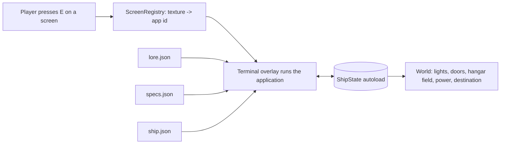

# StarshipGo - Software Specification

*Generated by `python tools/specs/gen_software.py` from `tools/specs/software_data.py`; do not edit by hand. Machine-readable form: [`godot/data/software.json`](../godot/data/software.json).*

Every screen on the ship is interactive. Walk up to any screen, press **E**, and a full-screen terminal opens running one of the 29 **applications** below. This document is the specification the Godot implementation follows: what each application shows, which data it reads, what it changes in the world and how it is tested. The star map and the logs read [`lore.json`](../godot/data/lore.json) ([lore](LORE.md)), the machine cards read [`specs.json`](../godot/data/specs.json) ([datasheets](MACHINE_SPECS.md)), the deck plan reads `ship.json` ([ship spec](SHIP_SPEC.md)).

## Contents

1. Overview and application catalogue
2. Cross-cutting: visual language, input model, shared state, persistence, schemas, errors, versioning, performance
3. Mapping screens to applications (textures, prefixes, categories)
4. The applications
5. QA matrix and glossary

## 1. Application catalogue

| Id | Title | Category | Opens from textures | Typical rooms | Update rate |
|---|---|---|---|---|---|
| `starmap` | Star Cartography | navigation | starmap | bridge, astro, ready, conf | Chart redraws on input only |
| `nav` | Helm and Navigation | navigation | nav | bridge, hangar | 1 Hz (ETA, distance) |
| `sensors` | Long-Range Sensors | operations | radar | bridge, astro, comms | Sweep 30 Hz |
| `tactical` | Tactical and Shields | operations | tactical | bridge, secoff, armory | 10 Hz |
| `warp` | Warp Field Control | engineering | warp | eng, bridge | 5 Hz |
| `reactor` | Fusion Core Control | engineering | - | eng, aux | 10 Hz |
| `power` | Power Distribution | engineering | power | aux, eng, bridge | 2 Hz |
| `engineering` | Damage Control and Systems Status | engineering | systems | eng, bridge, shop | 1 Hz |
| `lifesupport` | Life Support | life | hazard | life, eng | 1 Hz |
| `hydroponics` | Hydroponics Control | life | - | hydro | 1 Hz |
| `medical` | Medical Diagnostics | life | medical, vitals, lifesigns | medbay, cabinA, capt | ECG 30 Hz, vitals 1 Hz |
| `science` | Science Analysis | science | waveform, periodic | sci, astro | Graph 30 Hz while a sample is loaded |
| `comms` | Communications | operations | comm | comms, bridge, ready | 1 Hz |
| `security` | Security and Access | systems | - | secoff, brig, bridge, armory | 1 Hz list |
| `cargo` | Cargo and Inventory Manifest | services | - | cargo, depot, hangar | On change |
| `fabricator` | Fabricator Queue | services | - | shop, sci, cargo | 1 Hz |
| `galley` | Galley Replicator and Menu | services | - | galley, mess | On change |
| `vending` | Vending Terminal | services | - | mess, rec, lounge, dorm | On change |
| `alert` | Alert Status Panel | operations | alert | bridge, secoff, eng, corF1 | On change |
| `computer` | Ship's Computer | systems | text | bridge, core, conf, ready | On input |
| `deckplan` | Deck Plan and Locator | navigation | schematic | corF1, lobby1, lobby2, lobby3 | Marker 10 Hz |
| `logbook` | Captain's and Crew Logs | science | - | ready, capt, bridge, lounge | On change |
| `roster` | Duty Roster and Notice Board | services | - | mess, corF2, dorm, lounge | On change |
| `clock` | Ship's Chronometer | systems | - | bridge, mess, corF2, ready | 1 Hz |
| `atmosphere` | Environmental Monitor | life | graph | life, hydro, bridge, corF3 | 1 Hz |
| `docking` | Hangar and Docking Control | operations | - | hangar, airlock | 2 Hz |
| `diagnostics` | System Diagnostics | systems | diagnostic, bars | eng, core, shop | On run |
| `datapad` | Library and Datapad Reader | science | - | lounge, conf, ready, rec | On change |
| `holo` | Holo-Projection Viewer | navigation | globe | conf, bridge, eng, astro | 30 Hz while open |



## 2. Cross-cutting specification

### 2.1 Visual language

An original, calm instrument look: dark blue-black glass, thin cyan linework, generous spacing, rounded 6 px panels and no franchise iconography.

| Token | Colour | Use |
|---|---|---|
| `bg` | `#070b12` | terminal background |
| `panel` | `#0d1522` | panel fill |
| `panel_hi` | `#14213a` | focused / hovered panel |
| `line` | `#2a4266` | borders, grid lines |
| `text` | `#d6e4f5` | primary text |
| `dim` | `#7d93b2` | secondary text, disabled |
| `accent` | `#42c8ff` | titles, selection, links |
| `accent2` | `#7affc6` | highlights, lore signal |
| `ok` | `#4be08a` | nominal state |
| `warn` | `#ffc247` | caution state |
| `crit` | `#ff4d5e` | fault state |
| `info` | `#6aa8ff` | notices |
| `alert_green` | `#2fd37a` | alert level green |
| `alert_yellow` | `#ffc247` | alert level yellow |
| `alert_red` | `#ff3b4a` | alert level red |

* **Fonts.** One monospace font for numbers and terminals (bundled, SIL OFL licence, e.g. a DejaVu Sans Mono or JetBrains Mono class font; fallback: Godot's default) and one sans for labels. Sizes: title 28 px, body 20 px, small 16 px (never smaller) at the 1280x720 logical resolution.
* **Spacing.** 8 px grid; panel padding 12 px; widget gap 8 px; 2 px focus ring in `accent`.
* **Frame.** Every app has a 40 px title bar (app title, ship stardate, alert chip) and a 28 px key hint footer.
* **Motion.** Fades 120 ms, sweeps and traces 30 Hz at most; no flashing faster than 3 Hz.
* **Sound.** Click, confirm, error and alarm cues; each is optional and has a text twin.

### 2.2 Input model

* **E** (or the use action) while looking at a screen within 2.5 m opens the terminal; the player is frozen and the mouse is released. A prompt "E - use <app title>" appears when a screen is in reach.
* **Esc** closes the terminal and restores the mouse capture; `Tab`/`Shift+Tab` move focus; arrow keys move selection; `Enter` activates; `Space` toggles; `PageUp`/`PageDown` scroll; mouse click, wheel and drag are always supported; gamepad is out of scope.
* Only one terminal can be open. Opening is blocked while a fade or a stair transition is running. All shortcuts are listed in the footer of each app.
* Text entry fields capture all keys except `Esc` and `Tab`.

### 2.3 Shared state (`ShipState` autoload)

One autoload holds every value that applications read or write; signals notify the world. Applications never reach into the scene tree.

| Field | Type | Default | Written by | Effect |
|---|---|---|---|---|
| `alert` | int 0/1/2 (green/yellow/red) | 0 | alert, tactical, computer | room lights tint; red locks brig and armory |
| `door_locks` | Dictionary door_index -> bool | armory and brig locked | security, computer | locked doors do not open; red status light |
| `deck_power` | Array bool per deck | all true | power | deck lights off when false |
| `power` | supply_mw, load_mw, battery_mwh, shed bool | from SHIP_SPEC | power, reactor, warp | lighting 50 % when shed |
| `reactor` | running, output_pct, fuel, containment | running 72 % | reactor | supply; SCRAM -> battery |
| `warp` | online, engaged, factor, field | online false | warp, nav, starmap | enables jump, speed |
| `throttle` | float 0..top_warp | 0 | nav | speed and ETA |
| `destination` | system id or empty | next waypoint | starmap, nav, computer | course and ETA |
| `route` | Array of system ids | [] | starmap | multi-hop plan |
| `position_system` | system id | lore.current.system | game (arrival) | chart marker |
| `shields` | on, quadrants[4] | off | tactical | none visual |
| `hangar` | field_on, door_state | field on, closed | docking | force-field node visible |
| `atmosphere` | per deck o2, co2, temp, kpa | nominal | lifesupport | alarms |
| `systems` | name -> health 0..100; faults[] | 2-4 minor faults | engineering, diagnostics | alarms |
| `log / messages` | arrays | from lore.json | science, comms | logbook, comms |
| `clock` | stardate, ship seconds | lore.current + 0 | game loop | chronometer |
| `credits` | int | 120 | vending, galley | purchases |
| `cargo` | stores dictionary | from SHIP_SPEC | cargo, fabricator, galley, hydroponics | manifest |
| `read_pads` | set of datapad ids | empty | datapad | none |
| `settings` | reduce_motion, volume, clock_24h | false, 1.0, true | all | accessibility |

### 2.4 Persistence

* Saved to `user://shipstate.json` when a terminal closes and on quit (atomic write: temp file then rename). Keys: the fields above plus `schema` (int) and `saved_at` (OS clock; the only non-deterministic field and never written to the repo).
* Missing or corrupt save: defaults are used and a one-line warning is logged. Unknown keys are kept and re-saved (forward compatibility).
* Persistence of `settings` is separate (`user://settings.cfg`).

### 2.5 Data schemas and versioning

* `lore.json`, `specs.json`, `software.json` each carry `"version": 1`. Applications check the major version and show `DATA VERSION MISMATCH` (crit) if higher than supported; extra keys are ignored.
* Application semantic versions (`software.json` `apps[].version`) are shown in the footer; changes to a ShipState field name bump the minor version of every app that touches it.
* Compact keys of `specs.json` are documented in [MACHINE_SPECS.md](MACHINE_SPECS.md). A model missing from `specs.json` renders `-` placeholders, never an error.

### 2.6 Error handling

* Missing data file: the app opens with an in-world error screen ("DATA LINK DOWN") listing the file name; the game never crashes.
* Unknown screen texture: the `computer` app opens.
* Any script error inside an app closes it to the world with a toast; the error is logged with the app id.
* Every numeric widget clamps its input; every list handles zero rows with an empty-state message.

### 2.7 Performance budget (all apps)

* The terminal is a `CanvasLayer` with Control nodes; at most one `SubViewport` per app (starmap, holo, camera tiles).
* Script time per frame < 1 ms; zero allocations in `_process` hot paths; the world stays rendering behind a 90 % opaque panel so the game is never paused.
* Opening an app takes < 150 ms; cold data loads (lore, specs) are parsed once at startup and cached.
* No network access. Time sources are the game clock, so everything is deterministic for tests (`--seed`).

### 2.8 Warp speed model

`speed_ly_per_day(warp) = ship.ly_per_day_at_cruise * (warp / ship.cruise_warp) ^ (10/3)`; ETA days = distance in light-years / speed. At cruise the ETAs equal the `eta_days` of `lore.json` waypoints. Throttle is clamped to `ship.top_warp`, and to a cap proportional to reactor output below 40 %.

## 3. Mapping screens to applications

### 3.1 Existing screen textures

| Texture (`godot/textures/screens/<name>.png`) | Application |
|---|---|
| `alert` | `alert` |
| `bars` | `diagnostics` |
| `comm` | `comms` |
| `diagnostic` | `diagnostics` |
| `globe` | `holo` |
| `graph` | `atmosphere` |
| `hazard` | `lifesupport` |
| `lifesigns` | `medical` |
| `medical` | `medical` |
| `nav` | `nav` |
| `periodic` | `science` |
| `power` | `power` |
| `radar` | `sensors` |
| `schematic` | `deckplan` |
| `starmap` | `starmap` |
| `systems` | `engineering` |
| `tactical` | `tactical` |
| `text` | `computer` |
| `vitals` | `medical` |
| `warp` | `warp` |
| `waveform` | `science` |

### 3.2 Resolution order and conventions for new textures

A model screen has a material named `screen_<texture>`. The registry resolves the application in this order, first hit wins:

1. exact name in `texture_map` (`radar`, `warp`, ...);
2. the longest matching key of `texture_prefix_map`; the name is compared with and without a leading `scr_`, so `scr_reactor_core_2` and `reactor_core_2` both open `reactor`;
3. the **category** of the host model in `category_map` (for example any `vending` model opens `vending`);
4. the fallback `computer`.

Convention: new textures are named `scr_<app-key>[_<variant>]`; the `<app-key>` should be one of the prefixes below. Additional prefixes are added to `tools/specs/software_data.py`, never in game code.

| Prefix | Application |
|---|---|
| `scr_alert` | `alert` |
| `scr_atmo` | `atmosphere` |
| `scr_bars` | `diagnostics` |
| `scr_bay` | `docking` |
| `scr_bio` | `medical` |
| `scr_book` | `datapad` |
| `scr_breaker` | `power` |
| `scr_cam` | `security` |
| `scr_cargo` | `cargo` |
| `scr_cctv` | `security` |
| `scr_chart` | `starmap` |
| `scr_clock` | `clock` |
| `scr_comm` | `comms` |
| `scr_console` | `computer` |
| `scr_core` | `reactor` |
| `scr_crop` | `hydroponics` |
| `scr_damage` | `engineering` |
| `scr_datapad` | `datapad` |
| `scr_deck` | `deckplan` |
| `scr_diag` | `diagnostics` |
| `scr_dock` | `docking` |
| `scr_door` | `security` |
| `scr_drink` | `galley` |
| `scr_duty` | `roster` |
| `scr_eng` | `engineering` |
| `scr_env` | `atmosphere` |
| `scr_fab` | `fabricator` |
| `scr_food` | `galley` |
| `scr_ftl` | `warp` |
| `scr_fusion` | `reactor` |
| `scr_galley` | `galley` |
| `scr_globe` | `holo` |
| `scr_grid` | `power` |
| `scr_hangar` | `docking` |
| `scr_helm` | `nav` |
| `scr_holo` | `holo` |
| `scr_hologram` | `holo` |
| `scr_hydro` | `hydroponics` |
| `scr_inventory` | `cargo` |
| `scr_journal` | `logbook` |
| `scr_lab` | `science` |
| `scr_library` | `datapad` |
| `scr_life` | `lifesupport` |
| `scr_locator` | `deckplan` |
| `scr_log` | `logbook` |
| `scr_manifest` | `cargo` |
| `scr_map` | `starmap` |
| `scr_med` | `medical` |
| `scr_menu` | `galley` |
| `scr_nav` | `nav` |
| `scr_notice` | `roster` |
| `scr_o2` | `lifesupport` |
| `scr_periodic` | `science` |
| `scr_plan` | `deckplan` |
| `scr_plant` | `hydroponics` |
| `scr_power` | `power` |
| `scr_print` | `fabricator` |
| `scr_radar` | `sensors` |
| `scr_radio` | `comms` |
| `scr_reactor` | `reactor` |
| `scr_replicator` | `galley` |
| `scr_roster` | `roster` |
| `scr_scan` | `sensors` |
| `scr_sci` | `science` |
| `scr_scrub` | `lifesupport` |
| `scr_sec` | `security` |
| `scr_sensor` | `sensors` |
| `scr_shield` | `tactical` |
| `scr_shop` | `vending` |
| `scr_spectro` | `science` |
| `scr_starmap` | `starmap` |
| `scr_systems` | `engineering` |
| `scr_tactical` | `tactical` |
| `scr_term` | `computer` |
| `scr_text` | `computer` |
| `scr_time` | `clock` |
| `scr_vend` | `vending` |
| `scr_vital` | `medical` |
| `scr_warp` | `warp` |
| `scr_weapon` | `tactical` |

### 3.3 Machine categories without a texture rule

| Category | Application |
|---|---|
| `analyzer` | `science` |
| `antenna` | `comms` |
| `camera` | `security` |
| `capacitor` | `power` |
| `cell` | `power` |
| `cleaningbot` | `diagnostics` |
| `clock` | `clock` |
| `coil` | `warp` |
| `commsunit` | `comms` |
| `console` | `nav` |
| `controlpanel` | `engineering` |
| `craft` | `docking` |
| `crate` | `cargo` |
| `cryo` | `medical` |
| `display` | `diagnostics` |
| `forcefield` | `docking` |
| `galley` | `galley` |
| `generator` | `power` |
| `gym` | `roster` |
| `holo` | `holo` |
| `instrument` | `sensors` |
| `junction` | `power` |
| `loader` | `cargo` |
| `medbed` | `medical` |
| `medscanner` | `medical` |
| `microscope` | `science` |
| `noticeboard` | `roster` |
| `pallet` | `cargo` |
| `particle` | `science` |
| `planter` | `hydroponics` |
| `reactor` | `reactor` |
| `router` | `comms` |
| `sciinstrument` | `science` |
| `scrubber` | `lifesupport` |
| `sign` | `deckplan` |
| `specimen` | `science` |
| `surgical` | `medical` |
| `tank` | `lifesupport` |
| `telescope` | `starmap` |
| `terminal` | `computer` |
| `turbine` | `engineering` |
| `vending` | `vending` |
| `watertank` | `lifesupport` |
| `weaponrack` | `tactical` |

## 4. The applications

### 4.1 `starmap` - Star Cartography

**Category** navigation | **Version** 1.0 | **Update rate** Chart redraws on input only; ship marker and clock 1 Hz; lore data loaded once.

**Purpose.** A rotatable 3D chart of every system in lore.json: faction colours, jump lanes, the ship's position and the mission plan. The crew can inspect a system, plot a route along lanes and commit a destination to the helm.

**Who uses it.** Navigator, helm, captain, science officer, anyone curious.

**Hosted by.** Rooms (hints, the ids may change with the layout): `bridge`, `astro`, `ready`, `conf`, `lounge`. Machine categories: `console`, `display`, `holo`, `telescope`, `terminal`. Screen textures that open it: `starmap`.

**Layout (1280x720 logical, wireframe)**

```text
+--------------------------------------------------------------+
| STAR CARTOGRAPHY      stardate 41234.5      [ALERT: GREEN]   |
+------------------------------------+-------------------------+
|                                    | SYSTEM  Kestrel's Rest  |
|        .  *   .                    | class G2V  5772 K  1.0 L|
|    *     [ship]---*                 | faction: Concord        |
|        .      \    *   .            | planets (3) ...         |
|   *    .       *  <hover label>     | [ PLOT ROUTE ] [ JUMP ] |
|                                    | route: 3 hops 21.4 ly   |
+------------------------------------+ ETA 18.6 d  hazard 2    |
| [Filter: faction v] [Labels] [Lanes] [Reset view] [Search __] |
+--------------------------------------------------------------+
```

**Widgets**

* 3D chart viewport (SubViewport, orbit camera, one sprite per system sized by luminosity, coloured by faction, ring per kind)
* Jump lanes drawn as lines, colour by hazard 0-5
* Ship marker with heading arrow (current.heading)
* Detail panel (star data, planet list with gravity / atmosphere / habitable flags, discovery notes)
* Route planner: shortest hazard-weighted path along routes, total ly, ETA days, maximum hazard
* Filter bar: faction, kind, visited only; search box
* Mission plan strip: waypoints with done/active/planned status

**Data sources**

* lore.json: systems, routes, factions, waypoints, current, ship.ly_per_day_at_cruise
* ShipState.destination, ShipState.position_system
* ShipState.warp (to disable JUMP while already in transit)

**Interactions and keys** (plus the common keys of section 2)

* Left drag orbit; wheel zoom; middle drag pan; click a star selects; double click centres
* Arrow keys orbit, +/- zoom, Space recentre on ship
* P plot route to the selected system, Enter / J commit the jump (opens a confirm dialog), L toggle labels, F cycle faction filter
* Hover shows a tooltip with name and distance from the ship

**Alarms and error states**

* System unreachable (no lane path): PLOT shows 'NO LANE' in warn colour
* Hazard >= 4 on a leg: route text turns crit and the commit dialog requires a second confirmation
* Warp field offline (ShipState.warp.online false): JUMP disabled with the reason on the button

**Effects on the game world** (through the shared `ShipState`)

* Setting a destination writes ShipState.destination (system id) and ShipState.route (list of system ids); the nav app shows the new course
* Committing the jump starts the in-world transit simulation (ShipState.warp.engaged = true)

**Performance budget.** <= 128 sprites + 150 lines; one SubViewport; no per-frame allocation. Update rate: Chart redraws on input only; ship marker and clock 1 Hz; lore data loaded once. Only the open app runs; the screen texture of the machine stays static while an app is open elsewhere.

**Accessibility.** Every colour state also has a text or shape cue (OK / WARN / CRIT chips with icons); all actions are reachable with the keyboard; text is at least 18 px at 1280x720; `Settings.reduce_motion` stops sweeps and blinking; sounds have on-screen text equivalents.

**Acceptance tests**

1. Opening the app with the default lore shows >= 28 stars and the ship marker at current.system
2. Selecting any system shows its planets; PLOT to a connected system gives ly equal to the summed lane distances (1%)
3. COMMIT sets ShipState.destination and nav shows it

### 4.2 `nav` - Helm and Navigation

**Category** navigation | **Version** 1.0 | **Update rate** 1 Hz (ETA, distance); gauges animate at 30 Hz from interpolated values.

**Purpose.** The pilot's view: current course, speed, heading, the ETA to the next waypoint and the destination selector. It is the control surface for ShipState.destination and for the throttle (impulse / cruise / top warp).

**Who uses it.** Helm officer, captain.

**Hosted by.** Rooms (hints, the ids may change with the layout): `bridge`, `hangar`. Machine categories: `console`, `display`, `controlpanel`. Screen textures that open it: `nav`.

**Layout (1280x720 logical, wireframe)**

```text
+--------------------------------------------------------------+
| HELM & NAVIGATION                                  IN ORBIT   |
+----------------------+---------------------+-----------------+
|   HEADING            |   SPEED             |  NEXT WAYPOINT  |
|     ( N ^ )  127.4   |   [=====>   ] 6.0  |  Halcyon Gate   |
|   compass rose       |   warp 6.0 / 9.2    |  dist 7.3 ly    |
|                      |   0.82 ly/day       |  ETA 8.9 days   |
+----------------------+---------------------+-----------------+
| DESTINATION [Halcyon Gate v]  [SET COURSE] [ALL STOP] [ORBIT] |
| plan: 1 Kestrel > 2 Halcyon > 3 Veil   throttle [-][+]        |
+--------------------------------------------------------------+
```

**Widgets**

* Compass rose with heading numerals (from current.heading)
* Speed gauge with warp factor and ly/day
* Next waypoint card (system, distance, ETA)
* Destination dropdown (systems with a lane path), SET COURSE / ALL STOP / ORBIT buttons
* Throttle slider 0..top_warp
* Mission plan list with status chips

**Data sources**

* lore.json: ship.cruise_warp, top_warp, ly_per_day_at_cruise, waypoints, routes
* ShipState.destination, ShipState.warp.factor, ShipState.alert

**Interactions and keys** (plus the common keys of section 2)

* Dropdown + Enter selects destination; Space toggles ALL STOP; Up/Down or W/S change throttle in 0.5 steps; Tab cycles widgets

**Alarms and error states**

* Throttle above top_warp: clamped with a beep
* Reactor output below 40 %: warp is capped (see reactor)
* No destination: ETA shows '--'

**Effects on the game world** (through the shared `ShipState`)

* Writes ShipState.destination and ShipState.throttle; ETA uses the warp speed model of the cross-cutting section

**Performance budget.** < 0.5 ms per frame. Update rate: 1 Hz (ETA, distance); gauges animate at 30 Hz from interpolated values. Only the open app runs; the screen texture of the machine stays static while an app is open elsewhere.

**Accessibility.** Every colour state also has a text or shape cue (OK / WARN / CRIT chips with icons); all actions are reachable with the keyboard; text is at least 18 px at 1280x720; `Settings.reduce_motion` stops sweeps and blinking; sounds have on-screen text equivalents.

**Acceptance tests**

1. ETA equals the lore ETA when the throttle is at cruise
2. ALL STOP sets the throttle to 0 and the ETA shows '--'
3. A destination chosen in starmap is preselected

### 4.3 `sensors` - Long-Range Sensors

**Category** operations | **Version** 1.0 | **Update rate** Sweep 30 Hz; contact positions 2 Hz.

**Purpose.** A radar-style sweep of the neighbourhood: contacts (ships, anomalies, debris) with bearing, range and classification; the crew can lock a contact and request a deep scan.

**Who uses it.** Science officer, tactical officer, helm.

**Hosted by.** Rooms (hints, the ids may change with the layout): `bridge`, `astro`, `comms`. Machine categories: `console`, `display`, `instrument`, `antenna`. Screen textures that open it: `radar`.

**Layout (1280x720 logical, wireframe)**

```text
+--------------------------------------------------------------+
| LONG-RANGE SENSORS   range [ 10 ly v ]   mode [PASSIVE|ACTIVE]|
+----------------------------+---------------------------------+
|          N                 | CONTACTS                        |
|      .-""-.    o C-04      | id    class     brg   rng  stat |
|     /   +   \   [ship]     | C-01  anomaly   041   3.1  ?    |
|    | o C-01   |            | C-02  freighter 212   0.4  FRND |
|     \    .   /  sweep ->   | C-04  unknown   300   5.9  ??   |
|      '-....-'              | [LOCK] [DEEP SCAN] [HAIL]       |
+----------------------------+---------------------------------+
```

**Widgets**

* Radar scope: rotating sweep line (1 revolution per 4 s), fading blips
* Range selector (1, 10, 50 ly)
* Contact table sorted by range
* Contact detail with classification confidence bar
* LOCK / DEEP SCAN / HAIL buttons

**Data sources**

* Contacts generated deterministically from lore.json systems within the range of the current system plus a seeded set of local contacts
* ShipState.power (sensors share; reduces range when under-powered)

**Interactions and keys** (plus the common keys of section 2)

* Mouse click a blip or table row; Tab cycles contacts; R changes range; L lock; D deep scan (5 s progress bar); H hail (opens comms with the contact)

**Alarms and error states**

* Sensors unpowered: static noise and 'SENSORS OFFLINE'
* Hostile contact with shields down: row turns crit

**Effects on the game world** (through the shared `ShipState`)

* LOCK sets ShipState.target; DEEP SCAN may reveal text appended to the contact (lore anomaly notes); HAIL pre-selects the contact in comms

**Performance budget.** <= 64 blips; drawn with canvas items, no textures. Update rate: Sweep 30 Hz; contact positions 2 Hz. Only the open app runs; the screen texture of the machine stays static while an app is open elsewhere.

**Accessibility.** Every colour state also has a text or shape cue (OK / WARN / CRIT chips with icons); all actions are reachable with the keyboard; text is at least 18 px at 1280x720; `Settings.reduce_motion` stops sweeps and blinking; sounds have on-screen text equivalents.

**Acceptance tests**

1. Range change rescales blips
2. Unpowered sensors show the offline state
3. Deep scan completes in 5 s and updates the classification

### 4.4 `tactical` - Tactical and Shields

**Category** operations | **Version** 1.0 | **Update rate** 10 Hz.

**Purpose.** Shield and weapon management with a ship silhouette showing four shield quadrants and hull integrity. Under the exploration charter the ship is lightly armed; the app is used for debris shielding and defence drills.

**Who uses it.** Tactical officer, security chief, captain.

**Hosted by.** Rooms (hints, the ids may change with the layout): `bridge`, `secoff`, `armory`. Machine categories: `console`, `display`, `weaponrack`, `controlpanel`. Screen textures that open it: `tactical`.

**Layout (1280x720 logical, wireframe)**

```text
+--------------------------------------------------------------+
| TACTICAL & SHIELDS                      ALERT [ YELLOW ]      |
+-----------------------------+--------------------------------+
|      FWD 82%                | SHIELDS  [ON]  power 40%       |
|    .-------.                | quadrant  fwd  port stbd aft   |
| P  | ship  |  S             | strength  82   64   71   90    |
| 64 | top   | 71             | [REDISTRIBUTE] [RAISE][LOWER]  |
|    '-------'                | POINT DEFENCE  2/2 ready       |
|      AFT 90%                | HULL 100%   [RED ALERT]        |
+-----------------------------+--------------------------------+
```

**Widgets**

* Ship silhouette with four shield arcs
* Shield toggle and power slider
* Quadrant strength bars
* Point defence status
* Hull integrity bar
* Alert button (raises alert)

**Data sources**

* ShipState.shields, ShipState.hull, ShipState.alert
* specs.json of installed weaponrack / forcefield models for numbers

**Interactions and keys** (plus the common keys of section 2)

* S toggles shields; 1-4 select quadrant; +/- move power into quadrant; R redistributes evenly; A cycles alert level (red needs a confirm)

**Alarms and error states**

* Shields below 25 %: bar crit and the console beeps once
* No power: all bars grey

**Effects on the game world** (through the shared `ShipState`)

* Raising shields draws power (see power); alert red changes the ship lighting

**Performance budget.** < 0.5 ms per frame. Update rate: 10 Hz. Only the open app runs; the screen texture of the machine stays static while an app is open elsewhere.

**Accessibility.** Every colour state also has a text or shape cue (OK / WARN / CRIT chips with icons); all actions are reachable with the keyboard; text is at least 18 px at 1280x720; `Settings.reduce_motion` stops sweeps and blinking; sounds have on-screen text equivalents.

**Acceptance tests**

1. Toggling shields flips ShipState.shields.on and the bar colours
2. Selecting alert red sets ShipState.alert = red

### 4.5 `warp` - Warp Field Control

**Category** engineering | **Version** 1.0 | **Update rate** 5 Hz.

**Purpose.** Controls the warp field generator (the coil, particle and turbine machines): field strength, nacelle alignment, coil temperatures and the pre-jump checklist.

**Who uses it.** Chief engineer, helm.

**Hosted by.** Rooms (hints, the ids may change with the layout): `eng`, `bridge`. Machine categories: `coil`, `particle`, `console`, `display`, `turbine`. Screen textures that open it: `warp`.

**Layout (1280x720 logical, wireframe)**

```text
+--------------------------------------------------------------+
| WARP FIELD CONTROL                          FIELD: STANDBY    |
+----------------------+---------------------------------------+
| COIL TEMPS           | FIELD STRENGTH  [==========    ] 62 % |
| A 412K  B 409K       | ALIGNMENT       +0.012 mrad  OK        |
| C 418K  D 420K       | PLASMA FLOW     [=======       ]      |
|                      | CHECKLIST  [x]core [x]coils [ ]nav     |
| [ENGAGE] [STANDBY]   | warp factor target 6.0  [-] [+]        |
+----------------------+---------------------------------------+
```

**Widgets**

* 4 coil temperature gauges
* Field strength bar and warp factor target
* Alignment readout
* Plasma flow bar
* Pre-jump checklist with live pass/fail
* ENGAGE / STANDBY buttons

**Data sources**

* ShipState.warp (online, factor, field), ShipState.reactor.output_pct, ShipState.power.warp
* specs.json warp coil power figures

**Interactions and keys** (plus the common keys of section 2)

* Enter or the ENGAGE button when the checklist is green; +/- warp factor; S standby; Tab through widgets

**Alarms and error states**

* A red checklist item blocks ENGAGE and shows the cause
* Coil temperature > 480 K: warn; > 520 K: crit and automatic standby

**Effects on the game world** (through the shared `ShipState`)

* ENGAGE needs reactor output >= 40 %; sets ShipState.warp.online and enables the starmap JUMP; draws warp power from the power bus

**Performance budget.** < 0.3 ms per frame. Update rate: 5 Hz. Only the open app runs; the screen texture of the machine stays static while an app is open elsewhere.

**Accessibility.** Every colour state also has a text or shape cue (OK / WARN / CRIT chips with icons); all actions are reachable with the keyboard; text is at least 18 px at 1280x720; `Settings.reduce_motion` stops sweeps and blinking; sounds have on-screen text equivalents.

**Acceptance tests**

1. ENGAGE fails with the reactor offline and states why
2. STANDBY returns the field to 0

### 4.6 `reactor` - Fusion Core Control

**Category** engineering | **Version** 1.0 | **Update rate** 10 Hz.

**Purpose.** Operates the main fusion core: output, fuel (deuterium / helium-3), containment, coolant loops and SCRAM.

**Who uses it.** Chief engineer, engineering technicians.

**Hosted by.** Rooms (hints, the ids may change with the layout): `eng`, `aux`. Machine categories: `reactor`, `generator`, `capacitor`, `console`, `controlpanel`. Screen textures that open it: none of its own (opened by category / prefix rules, see 3.2).

**Layout (1280x720 logical, wireframe)**

```text
+--------------------------------------------------------------+
| FUSION CORE CONTROL       CORE STATE: RUNNING   ONLINE 41d   |
+--------------------+-----------------------------------------+
| OUTPUT 72 %        | CONTAINMENT  99.97 %   plasma 1.4e8 K   |
|  ( arc gauge )     | FUEL D2 81 %  He3 76 %                  |
|  96 MW / 134 MW    | COOLANT A 311K  B 309K  flow ok         |
| [THROTTLE -][+]    | [SCRAM]  [RESTART]  [BYPASS SAFETIES]   |
+--------------------+-----------------------------------------+
```

**Widgets**

* Arc output gauge in % and MW
* Containment, plasma temperature, fuel and coolant readouts
* Throttle buttons
* SCRAM (guarded button: click twice)
* Event log of the last 20 core events

**Data sources**

* ShipState.reactor (running, output_pct, fuel, containment)
* specs.json: output of the reactor models installed in ship.json (sum = rated MW)

**Interactions and keys** (plus the common keys of section 2)

* Up/Down arrows throttle in 5 % steps; X (twice within 2 s) SCRAM; R restart (10 s spool-up bar)

**Alarms and error states**

* Containment < 98 %: warn; < 95 %: crit and automatic SCRAM
* SCRAM: lights flicker to emergency power; the battery endurance countdown shows on the power app

**Effects on the game world** (through the shared `ShipState`)

* Output sets the generation figure in ShipState.power.supply; SCRAM sets reactor.running false, which drops ship power to batteries (emergency lights)

**Performance budget.** < 0.5 ms per frame. Update rate: 10 Hz. Only the open app runs; the screen texture of the machine stays static while an app is open elsewhere.

**Accessibility.** Every colour state also has a text or shape cue (OK / WARN / CRIT chips with icons); all actions are reachable with the keyboard; text is at least 18 px at 1280x720; `Settings.reduce_motion` stops sweeps and blinking; sounds have on-screen text equivalents.

**Acceptance tests**

1. Throttle changes the generation visible in the power app
2. SCRAM puts the ship on battery

### 4.7 `power` - Power Distribution

**Category** engineering | **Version** 1.0 | **Update rate** 2 Hz.

**Purpose.** Single-line view of the ship's electrical network: generation, buses, per-deck and per-department breakers, loads and battery state, from the machine datasheets.

**Who uses it.** Chief engineer, damage control teams.

**Hosted by.** Rooms (hints, the ids may change with the layout): `aux`, `eng`, `bridge`. Machine categories: `junction`, `capacitor`, `cell`, `controlpanel`, `console`, `display`. Screen textures that open it: `power`.

**Layout (1280x720 logical, wireframe)**

```text
+--------------------------------------------------------------+
| POWER DISTRIBUTION      supply 96.0 MW  load 61.2 MW  +35 MW  |
+-----------------------+--------------------------------------+
| [CORE]--[MAIN BUS A]  | DECK 1 command   [x] 6.2 MW  ----    |
|         |-[D1] [D2]   | DECK 2 habitat   [x] 14.8 MW ======  |
|         |-[D3] [HAN]  | DECK 3 engineer. [x] 22.5 MW ======= |
| [BATT 12.4 MWh 92%]   | warp coils       [ ] off              |
+-----------------------+  [SHED NON-ESSENTIAL] [RESET ALL]    |
+--------------------------------------------------------------+
```

**Widgets**

* Single-line diagram (core, buses, breakers)
* Per-deck and per-department load bars with typical and peak markers
* Breaker toggles
* Battery gauge with endurance time
* Shed non-essential button

**Data sources**

* specs.json (power per model) aggregated per room by ship.json
* docs/SHIP_SPEC.md budget numbers (same aggregation)
* ShipState.power

**Interactions and keys** (plus the common keys of section 2)

* Click or Enter toggles a breaker; S sheds non-essential loads (lighting 50 %, galley, recreation, vending off); R resets

**Alarms and error states**

* Load > supply: bus bars red and a brown-out timer starts; load > 90 % of supply: warn
* Opening the life support breaker: confirm dialog

**Effects on the game world** (through the shared `ShipState`)

* A tripped deck breaker turns off that deck's real lights (ShipState.deck_power[deck] = false); shed mode dims lights to 50 %

**Performance budget.** < 0.5 ms per frame. Update rate: 2 Hz. Only the open app runs; the screen texture of the machine stays static while an app is open elsewhere.

**Accessibility.** Every colour state also has a text or shape cue (OK / WARN / CRIT chips with icons); all actions are reachable with the keyboard; text is at least 18 px at 1280x720; `Settings.reduce_motion` stops sweeps and blinking; sounds have on-screen text equivalents.

**Acceptance tests**

1. Opening the deck 2 breaker darkens deck 2
2. Totals equal the SHIP_SPEC power budget (1%)

### 4.8 `engineering` - Damage Control and Systems Status

**Category** engineering | **Version** 1.0 | **Update rate** 1 Hz.

**Purpose.** Status board of every ship system with health bars, active faults and repair tasking; shows which rooms are affected.

**Who uses it.** Chief engineer, damage control, captain.

**Hosted by.** Rooms (hints, the ids may change with the layout): `eng`, `bridge`, `shop`. Machine categories: `console`, `display`, `controlpanel`, `terminal`. Screen textures that open it: `systems`.

**Layout (1280x720 logical, wireframe)**

```text
+--------------------------------------------------------------+
| SYSTEMS STATUS                            3 FAULTS  0 CRIT    |
+---------------------------+----------------------------------+
| Propulsion   [========] 98| FAULTS                           |
| Power        [=======-] 91| F-12 Hydroponics pump B  WARN    |
| Life support [========]100| F-14 Cargo door slow     INFO    |
| Sensors      [======--] 78| [ASSIGN TEAM] [REPAIR] [IGNORE]  |
| Comms        [========] 99| rooms affected: hydro            |
+---------------------------+----------------------------------+
```

**Widgets**

* System health list with bars
* Fault list with severity chips
* Repair tasking buttons
* Affected rooms summary

**Data sources**

* ShipState.systems (health 0..100), faults generated deterministically from the ship seed and the ship.json room list
* lore.json logs for flavour

**Interactions and keys** (plus the common keys of section 2)

* Up/Down selects, Enter opens fault details, R starts a repair (10 s progress bar)

**Alarms and error states**

* Health < 60 warn, < 30 crit
* Crit faults raise alert yellow automatically

**Effects on the game world** (through the shared `ShipState`)

* Repair completion raises the system health and may clear the fault of the affected room

**Performance budget.** < 0.3 ms per frame. Update rate: 1 Hz. Only the open app runs; the screen texture of the machine stays static while an app is open elsewhere.

**Accessibility.** Every colour state also has a text or shape cue (OK / WARN / CRIT chips with icons); all actions are reachable with the keyboard; text is at least 18 px at 1280x720; `Settings.reduce_motion` stops sweeps and blinking; sounds have on-screen text equivalents.

**Acceptance tests**

1. The fault list is never empty at start (2-4 minor faults)
2. A repair completes and the health bar rises

### 4.9 `lifesupport` - Life Support

**Category** life | **Version** 1.0 | **Update rate** 1 Hz.

**Purpose.** Per-deck atmosphere (O2, CO2, temperature, pressure), scrubber and water-recycler status and the consumables budget.

**Who uses it.** Chief engineer, environmental technician.

**Hosted by.** Rooms (hints, the ids may change with the layout): `life`, `eng`. Machine categories: `scrubber`, `watertank`, `tank`, `console`, `display`, `controlpanel`. Screen textures that open it: `hazard`.

**Layout (1280x720 logical, wireframe)**

```text
+--------------------------------------------------------------+
| LIFE SUPPORT                              O2 reserve 41 d     |
+-------------+-------------+-------------+--------------------+
| DECK 1      | DECK 2      | DECK 3      | SCRUBBERS 9/10 ok   |
| O2 20.9%    | O2 20.8%    | O2 20.7%    | water recycle 96%   |
| CO2 0.04%   | CO2 0.06%   | CO2 0.05%   | [BOOST][FLUSH]      |
| 21.5C 101kPa| 22.0C 101kPa| 23.1C 101kPa| humidity 48%        |
+-------------+-------------+-------------+--------------------+
```

**Widgets**

* Per-deck tile (iterate decks[] of ship.json) with four readouts and trend arrows
* Scrubber list with status
* Water recycler gauge
* Reserves countdown (O2, water, food days)
* BOOST / FLUSH buttons

**Data sources**

* docs/SHIP_SPEC.md life support budget; specs.json scrubber / tank models
* ShipState.atmosphere[deck]
* ShipState.crew_count

**Interactions and keys** (plus the common keys of section 2)

* Tab between tiles, B boosts scrubbers (+30 % power), F flushes a deck (vents for 10 s)

**Alarms and error states**

* CO2 > 0.5 %: warn; > 1 %: crit and alert yellow
* Pressure < 90 kPa: crit; hatch seal advice

**Effects on the game world** (through the shared `ShipState`)

* Boost draws power; atmosphere values feed the atmosphere app; crit values raise the alert level

**Performance budget.** < 0.3 ms per frame. Update rate: 1 Hz. Only the open app runs; the screen texture of the machine stays static while an app is open elsewhere.

**Accessibility.** Every colour state also has a text or shape cue (OK / WARN / CRIT chips with icons); all actions are reachable with the keyboard; text is at least 18 px at 1280x720; `Settings.reduce_motion` stops sweeps and blinking; sounds have on-screen text equivalents.

**Acceptance tests**

1. Boost lowers CO2 over time
2. Every deck of ship.json is shown

### 4.10 `hydroponics` - Hydroponics Control

**Category** life | **Version** 1.0 | **Update rate** 1 Hz.

**Purpose.** Garden control: crop beds, light spectrum and schedule, water, nutrients and harvest forecast; the food source for the galley.

**Who uses it.** Hydroponics specialist, galley crew.

**Hosted by.** Rooms (hints, the ids may change with the layout): `hydro`. Machine categories: `planter`, `plant`, `terminal`, `controlpanel`, `display`. Screen textures that open it: none of its own (opened by category / prefix rules, see 3.2).

**Layout (1280x720 logical, wireframe)**

```text
+--------------------------------------------------------------+
| HYDROPONICS GARDEN                    yield today 14.2 kg     |
+---------------------+----------------------------------------+
| BEDS                | BED 3  Wheat  day 41/90                |
| 1 Lettuce  [====  ] | light 16h  spectrum [R:B 3:1]          |
| 2 Tomato   [======] | water 4.2 L/h  pH 6.1  EC 1.8          |
| 3 Wheat    [===   ] | nutrient [A][B][C]  [HARVEST]          |
| 4 Potato   [=     ] | [LIGHTS +][LIGHTS -] [SCHEDULE]        |
+---------------------+----------------------------------------+
```

**Widgets**

* Bed list with growth progress
* Detail panel with sliders for light hours and spectrum
* Water / pH / EC readouts
* Nutrient dosing buttons
* Harvest button and forecast chart

**Data sources**

* ShipState.crops (from the docs/FOOD.md crop list when present, else a built-in set)
* ShipState.power

**Interactions and keys** (plus the common keys of section 2)

* Up/Down bed select, Left/Right adjust the selected slider, H harvest when ripe

**Alarms and error states**

* pH outside 5.5-6.5: warn
* Pump fault: bed row turns warn and engineering shows the fault

**Effects on the game world** (through the shared `ShipState`)

* Harvest adds produce to the cargo manifest (fresh food) and to galley availability

**Performance budget.** < 0.3 ms per frame. Update rate: 1 Hz. Only the open app runs; the screen texture of the machine stays static while an app is open elsewhere.

**Accessibility.** Every colour state also has a text or shape cue (OK / WARN / CRIT chips with icons); all actions are reachable with the keyboard; text is at least 18 px at 1280x720; `Settings.reduce_motion` stops sweeps and blinking; sounds have on-screen text equivalents.

**Acceptance tests**

1. Harvesting a ripe bed increments cargo fresh food
2. The light slider changes the growth rate

### 4.11 `medical` - Medical Diagnostics

**Category** life | **Version** 1.0 | **Update rate** ECG 30 Hz, vitals 1 Hz.

**Purpose.** Bio-bed vitals, scanner results and a patient list. Bio-bed models host the vitals trace; the medical scanner hosts the body scan.

**Who uses it.** Medical officer, nurse.

**Hosted by.** Rooms (hints, the ids may change with the layout): `medbay`, `cabinA`, `capt`. Machine categories: `medbed`, `medscanner`, `cryo`, `surgical`, `display`, `console`. Screen textures that open it: `medical`, `vitals`, `lifesigns`.

**Layout (1280x720 logical, wireframe)**

```text
+--------------------------------------------------------------+
| MEDICAL DIAGNOSTICS       patients 2  beds free 4             |
+------------------------+-------------------------------------+
| BED 2  J. Okafor       |  ECG ~~/\~~~/\~~~   HR 72  SpO2 98   |
| status STABLE          |  BP 118/76  temp 36.8  resp 14      |
| [SCAN] [SEDATE] [DISCH]|  body scan: [HEAD][CHEST][LIMBS]    |
| BED 4  (empty)         |  note: mild fatigue, sleep rec.     |
+------------------------+-------------------------------------+
```

**Widgets**

* Patient list tied to bio-beds
* Animated ECG / respiration trace
* Vitals grid
* Body scan selector
* Treatment buttons

**Data sources**

* ShipState.patients (seeded from the roster names, 0-3 patients)
* specs.json medbed / medscanner power

**Interactions and keys** (plus the common keys of section 2)

* Up/Down patient; S scan (3 s); D discharge; Tab to buttons

**Alarms and error states**

* HR outside 50-110 or SpO2 < 92: row turns crit and a beep sounds

**Effects on the game world** (through the shared `ShipState`)

* Discharging a patient frees the bed; medical events appear on the roster and logbook

**Performance budget.** < 0.5 ms per frame (the ECG is a polyline of 256 points). Update rate: ECG 30 Hz, vitals 1 Hz. Only the open app runs; the screen texture of the machine stays static while an app is open elsewhere.

**Accessibility.** Every colour state also has a text or shape cue (OK / WARN / CRIT chips with icons); all actions are reachable with the keyboard; text is at least 18 px at 1280x720; `Settings.reduce_motion` stops sweeps and blinking; sounds have on-screen text equivalents.

**Acceptance tests**

1. The ECG animates
2. A scan shows a result text after 3 s

### 4.12 `science` - Science Analysis

**Category** science | **Version** 1.0 | **Update rate** Graph 30 Hz while a sample is loaded.

**Purpose.** Spectrograph, periodic table lookup and sample catalogue for the lab analysers and the astrometrics instruments.

**Who uses it.** Science officer, lab technicians.

**Hosted by.** Rooms (hints, the ids may change with the layout): `sci`, `astro`. Machine categories: `analyzer`, `sciinstrument`, `microscope`, `particle`, `specimen`, `console`, `display`. Screen textures that open it: `waveform`, `periodic`.

**Layout (1280x720 logical, wireframe)**

```text
+--------------------------------------------------------------+
| SCIENCE ANALYSIS      [SPECTRUM] [ELEMENTS] [SAMPLES]         |
+--------------------------------------------------------------+
|  intensity ^   /\      /\                                    |
|            |  /  \ /\ /  \    peaks: H 656nm  Fe 438nm      |
|            | /    v  v    \___  match: G2V star (92%)         |
|            +----------------------> wavelength nm            |
| [LOAD SAMPLE] [COMPARE TO CATALOGUE] [EXPORT TO LOG]          |
+--------------------------------------------------------------+
```

**Widgets**

* Spectrograph graph with labelled peaks
* Periodic table grid (118 cells, click for properties)
* Sample list (from lore planets / anomaly notes)
* Match result

**Data sources**

* lore.json star class, temp_k and planets atmosphere
* built-in element table (118 entries)

**Interactions and keys** (plus the common keys of section 2)

* Tab switches views; click an element; Enter loads a sample; E exports a log line into ShipState.log

**Alarms and error states**

* Unknown spectrum: 'NO CATALOGUE MATCH' in warn
* Sample contaminated: crit

**Effects on the game world** (through the shared `ShipState`)

* Exported entries appear in the logbook as the science officer

**Performance budget.** < 0.5 ms; the periodic table is a static layout. Update rate: Graph 30 Hz while a sample is loaded. Only the open app runs; the screen texture of the machine stays static while an app is open elsewhere.

**Accessibility.** Every colour state also has a text or shape cue (OK / WARN / CRIT chips with icons); all actions are reachable with the keyboard; text is at least 18 px at 1280x720; `Settings.reduce_motion` stops sweeps and blinking; sounds have on-screen text equivalents.

**Acceptance tests**

1. The periodic table has 118 cells
2. Loading a lore star class shows a plausible spectrum

### 4.13 `comms` - Communications

**Category** operations | **Version** 1.0 | **Update rate** 1 Hz.

**Purpose.** Channels (ship-wide, department, external subspace), message inbox and hailing.

**Who uses it.** Comms officer, captain, anyone sending a ship-wide message.

**Hosted by.** Rooms (hints, the ids may change with the layout): `comms`, `bridge`, `ready`. Machine categories: `commsunit`, `router`, `antenna`, `console`, `display`, `terminal`. Screen textures that open it: `comm`.

**Layout (1280x720 logical, wireframe)**

```text
+--------------------------------------------------------------+
| COMMUNICATIONS    subspace link: STRONG  lag 3.4 s            |
+--------------------+-----------------------------------------+
| CHANNELS           | #ship-wide                              |
| > ship-wide        | 41234.1 Helm: Waypoint in 3 h           |
|   command          | 41234.3 Eng: Scheduled coolant swap     |
|   security         | [type a message____________] [SEND]     |
|   subspace (rx 2)  | [HAIL CONTACT] [OPEN CHANNEL] [MUTE]    |
+--------------------+-----------------------------------------+
```

**Widgets**

* Channel list with unread counts
* Message list and composer
* Link status with lag from the distance to the nearest friendly system
* Hail / mute buttons

**Data sources**

* lore.json factions and logs (as incoming subspace traffic)
* ShipState.messages

**Interactions and keys** (plus the common keys of section 2)

* Up/Down channel; type then Enter sends; H hails the locked contact (sensors)

**Alarms and error states**

* Link lost beyond 40 ly of any allied system: 'DELAYED' mode, messages queue
* Anomaly signal (lore): inbound message with garbled text

**Effects on the game world** (through the shared `ShipState`)

* Sent messages are appended to ShipState.messages and may be read on any comms screen

**Performance budget.** < 0.3 ms. Update rate: 1 Hz. Only the open app runs; the screen texture of the machine stays static while an app is open elsewhere.

**Accessibility.** Every colour state also has a text or shape cue (OK / WARN / CRIT chips with icons); all actions are reachable with the keyboard; text is at least 18 px at 1280x720; `Settings.reduce_motion` stops sweeps and blinking; sounds have on-screen text equivalents.

**Acceptance tests**

1. A sent message appears in the list
2. The link status text changes with the ship position

### 4.14 `security` - Security and Access

**Category** systems | **Version** 1.0 | **Update rate** 1 Hz list; camera tiles 5 Hz.

**Purpose.** Door lock management that really locks and unlocks doors in the game, a camera grid and intruder alerts.

**Who uses it.** Security chief, bridge, captain.

**Hosted by.** Rooms (hints, the ids may change with the layout): `secoff`, `brig`, `bridge`, `armory`. Machine categories: `camera`, `console`, `display`, `controlpanel`, `terminal`. Screen textures that open it: none of its own (opened by category / prefix rules, see 3.2).

**Layout (1280x720 logical, wireframe)**

```text
+--------------------------------------------------------------+
| SECURITY & ACCESS     doors 26  locked 3   cams 14  alert G   |
+-------------------------+------------------------------------+
| DOORS            [lock] | CAMERAS                            |
| bridge-corF1      [ ]   | [cam01][cam02][cam03]              |
| armory-corF2      [x]   | [cam04][cam05][cam06]  (live tiles) |
| brig-corF2        [x]   | selected: cam02 Bridge             |
| [LOCK ALL] [UNLOCK ALL] | [FULL SCREEN]                      |
+-------------------------+------------------------------------+
```

**Widgets**

* Door list with lock toggles (all doors from ship.json doors[])
* Camera grid of static views per room (pre-rendered or 160x90 SubViewports, max 4 live)
* Lockdown buttons
* Access log

**Data sources**

* ship.json doors and rooms
* ShipState.door_locks {door_index: bool}

**Interactions and keys** (plus the common keys of section 2)

* Up/Down selects a door, Space toggles the lock; L lock all (except stair towers), U unlock all; Tab to cameras, Enter enlarges

**Alarms and error states**

* Lockdown while crew stand in the doorway: the door stays open for 3 s
* Red alert auto-locks the armory and brig

**Effects on the game world** (through the shared `ShipState`)

* Locked doors do not open when the player approaches and show a red light; the starting set locks the armory and the brig

**Performance budget.** <= 4 live camera viewports at 160x90. Update rate: 1 Hz list; camera tiles 5 Hz. Only the open app runs; the screen texture of the machine stays static while an app is open elsewhere.

**Accessibility.** Every colour state also has a text or shape cue (OK / WARN / CRIT chips with icons); all actions are reachable with the keyboard; text is at least 18 px at 1280x720; `Settings.reduce_motion` stops sweeps and blinking; sounds have on-screen text equivalents.

**Acceptance tests**

1. Locking the bridge door makes it refuse to open
2. Stair tower doors can never be locked (escape)

### 4.15 `cargo` - Cargo and Inventory Manifest

**Category** services | **Version** 1.0 | **Update rate** On change.

**Purpose.** Inventory of the cargo bay and spares depot: containers, mass, volume and a tally of the ship's stores.

**Who uses it.** Quartermaster, cargo handlers.

**Hosted by.** Rooms (hints, the ids may change with the layout): `cargo`, `depot`, `hangar`. Machine categories: `terminal`, `console`, `loader`, `pallet`, `crate`, `display`. Screen textures that open it: none of its own (opened by category / prefix rules, see 3.2).

**Layout (1280x720 logical, wireframe)**

```text
+--------------------------------------------------------------+
| CARGO MANIFEST       hold 62 % full   mass 18.4 t of 30 t     |
+----------------------+---------------------------------------+
| CATEGORY   QTY  MASS | search [______]                       |
| Fresh food  120  0.9t| item            qty  location   mass  |
| Dry stores   84  2.1t| Rations, dry    400  CB-02      0.8 t |
| Spares      212  3.3t| Coolant canister 12  SD-04      0.3 t |
| Fabric. feed 40  1.2t| [TRANSFER] [AUDIT] [EXPORT CSV]       |
+----------------------+---------------------------------------+
```

**Widgets**

* Category summary
* Item table with search
* Fill gauge
* Transfer and audit buttons

**Data sources**

* docs/SHIP_SPEC.md cargo capacity (volume of cargo rooms times a packing factor)
* specs.json mass of the cargo crates in ship.json
* ShipState.cargo

**Interactions and keys** (plus the common keys of section 2)

* Type to search, Up/Down select, T transfer to the fabricator or galley, A audit

**Alarms and error states**

* Mass over capacity: crit; item below minimum stock: warn chip

**Effects on the game world** (through the shared `ShipState`)

* Transfers change galley / fabricator availability

**Performance budget.** < 0.3 ms. Update rate: On change. Only the open app runs; the screen texture of the machine stays static while an app is open elsewhere.

**Accessibility.** Every colour state also has a text or shape cue (OK / WARN / CRIT chips with icons); all actions are reachable with the keyboard; text is at least 18 px at 1280x720; `Settings.reduce_motion` stops sweeps and blinking; sounds have on-screen text equivalents.

**Acceptance tests**

1. Totals equal the SHIP_SPEC cargo capacity
2. Search filters the list

### 4.16 `fabricator` - Fabricator Queue

**Category** services | **Version** 1.0 | **Update rate** 1 Hz.

**Purpose.** 3D printer / fabricator job queue: parts, progress, material feed and power draw.

**Who uses it.** Engineering workshop crew, quartermaster.

**Hosted by.** Rooms (hints, the ids may change with the layout): `shop`, `sci`, `cargo`. Machine categories: `analyzer`, `terminal`, `console`, `display`. Screen textures that open it: none of its own (opened by category / prefix rules, see 3.2).

**Layout (1280x720 logical, wireframe)**

```text
+--------------------------------------------------------------+
| FABRICATOR QUEUE       printers 2   feedstock 71 %            |
+---------------------------+----------------------------------+
| JOB            ETA  STATE | CATALOGUE                        |
| Valve, 40 mm   0:12 RUN   | [Valve] [Bracket] [Filter] [Tool]|
| Bracket x4     0:40 WAIT  | selected: Bracket   mass 0.2 kg  |
| Filter         1:15 WAIT  | time 8 min  material 120 g       |
+---------------------------+ [QUEUE] [CANCEL] [PRIORITY]      |
+--------------------------------------------------------------+
```

**Widgets**

* Job queue with progress bars
* Catalogue of printable parts (valve / engtool / medtool categories from specs.json)
* Feedstock gauge
* Queue / cancel / priority buttons

**Data sources**

* specs.json (mass, price of the part model)
* ShipState.fab_queue, ShipState.cargo.feedstock

**Interactions and keys** (plus the common keys of section 2)

* Click a part then Enter to queue, Delete cancels, P priority

**Alarms and error states**

* Feedstock < 10 %: warn; a job fails when the feedstock is empty

**Effects on the game world** (through the shared `ShipState`)

* Finished jobs add spares to the cargo manifest

**Performance budget.** < 0.3 ms. Update rate: 1 Hz. Only the open app runs; the screen texture of the machine stays static while an app is open elsewhere.

**Accessibility.** Every colour state also has a text or shape cue (OK / WARN / CRIT chips with icons); all actions are reachable with the keyboard; text is at least 18 px at 1280x720; `Settings.reduce_motion` stops sweeps and blinking; sounds have on-screen text equivalents.

**Acceptance tests**

1. A queued job progresses and completes
2. Feedstock decreases

### 4.17 `galley` - Galley Replicator and Menu

**Category** services | **Version** 1.0 | **Update rate** On change.

**Purpose.** Food and drink catalogue with calories and ingredients; orders from the replicator or galley. Ties to docs/FOOD.md and the food models in the catalogue.

**Who uses it.** Crew, galley staff.

**Hosted by.** Rooms (hints, the ids may change with the layout): `galley`, `mess`. Machine categories: `galley`, `vending`, `terminal`, `display`, `tableware`. Screen textures that open it: none of its own (opened by category / prefix rules, see 3.2).

**Layout (1280x720 logical, wireframe)**

```text
+--------------------------------------------------------------+
| GALLEY & MENU          credits 120    daily kcal 1,840/2,600  |
+-------------------+------------------------------------------+
| [Meals][Drinks]   | Ratatouille bowl             420 kcal    |
| [Snacks][Special] | ingredients: courgette, tomato, aubergine |
| > Ratatouille     | allergens: none      vegan   [ORDER]     |
|   Rice bowl       | stock: 14 portions                       |
|   Miso soup       | [-] qty 1 [+]       cost 8 cr             |
+-------------------+------------------------------------------+
```

**Widgets**

* Category tabs
* Item list with filter (vegan, allergen)
* Detail panel: calories, macros, ingredients, allergens, price
* Order widget with quantity
* Daily intake bar

**Data sources**

* docs/FOOD.md and the food / drink models of catalog.json (calories from godot/data/food.json if the food worker provides it, else a built-in fallback list)
* ShipState.credits, ShipState.cargo.fresh_food

**Interactions and keys** (plus the common keys of section 2)

* Left/Right tab, Up/Down item, +/- quantity, Enter order (consumes stock and credits)

**Alarms and error states**

* Out of stock: row grey
* Insufficient credits: ORDER disabled

**Effects on the game world** (through the shared `ShipState`)

* An order decrements the cargo food stock; the calorie counter of the HUD (if present) increases

**Performance budget.** < 0.3 ms. Update rate: On change. Only the open app runs; the screen texture of the machine stays static while an app is open elsewhere.

**Accessibility.** Every colour state also has a text or shape cue (OK / WARN / CRIT chips with icons); all actions are reachable with the keyboard; text is at least 18 px at 1280x720; `Settings.reduce_motion` stops sweeps and blinking; sounds have on-screen text equivalents.

**Acceptance tests**

1. Ordering reduces credits and stock
2. The allergen filter hides matching items

### 4.18 `vending` - Vending Terminal

**Category** services | **Version** 1.0 | **Update rate** On change.

**Purpose.** Self-service vending machine: a short list of snacks and drinks, prices in credits, dispense status line.

**Who uses it.** Anyone.

**Hosted by.** Rooms (hints, the ids may change with the layout): `mess`, `rec`, `lounge`, `dorm`. Machine categories: `vending`. Screen textures that open it: none of its own (opened by category / prefix rules, see 3.2).

**Layout (1280x720 logical, wireframe)**

```text
+------------------------------------------+
| VENDING     credits 120                  |
+------------------------------------------+
| A1 Protein bar  3cr   B1 Water      1cr  |
| A2 Fruit chew   2cr   B2 Tea        2cr  |
| A3 Nut mix      3cr   B3 Cola       2cr  |
|     select code [A_]   [DISPENSE]        |
+------------------------------------------+
```

**Widgets**

* Grid of 6-12 slots
* Code entry pad
* Credit display
* Dispense status line

**Data sources**

* ShipState.credits
* item list shared with the galley app (snacks and drinks)

**Interactions and keys** (plus the common keys of section 2)

* Number/letter keys enter the code; Enter dispenses; Esc closes

**Alarms and error states**

* Insufficient credits: the line turns warn
* Sold out

**Effects on the game world** (through the shared `ShipState`)

* A dispense deducts credits and adds a snack to the player's inventory text

**Performance budget.** < 0.2 ms. Update rate: On change. Only the open app runs; the screen texture of the machine stays static while an app is open elsewhere.

**Accessibility.** Every colour state also has a text or shape cue (OK / WARN / CRIT chips with icons); all actions are reachable with the keyboard; text is at least 18 px at 1280x720; `Settings.reduce_motion` stops sweeps and blinking; sounds have on-screen text equivalents.

**Acceptance tests**

1. Credits decrease after a purchase

### 4.19 `alert` - Alert Status Panel

**Category** operations | **Version** 1.0 | **Update rate** On change.

**Purpose.** The ship-wide alert level (green, yellow, red) panel. Changing the level changes the lighting of every room.

**Who uses it.** Captain, bridge officers, security.

**Hosted by.** Rooms (hints, the ids may change with the layout): `bridge`, `secoff`, `eng`, `corF1`. Machine categories: `display`, `controlpanel`, `warnlight`, `beacon`, `sign`. Screen textures that open it: `alert`.

**Layout (1280x720 logical, wireframe)**

```text
+------------------------------------------+
| ALERT STATUS                             |
|                                          |
|        [ GREEN ]  YELLOW   RED           |
|     condition: normal operations         |
|  [SET GREEN] [SET YELLOW] [SET RED]      |
|  reason: ______________________          |
+------------------------------------------+
```

**Widgets**

* Large level indicator
* Three set buttons (red needs a confirm tap)
* Reason text field
* Last 5 changes list

**Data sources**

* ShipState.alert
* lore.json glossary for the text of the condition names

**Interactions and keys** (plus the common keys of section 2)

* 1 / 2 / 3 set green / yellow / red; Enter confirm

**Alarms and error states**

* Red: siren audio hook and warning strobe lights

**Effects on the game world** (through the shared `ShipState`)

* Writes ShipState.alert; the game tints room lights (green: normal; yellow: amber at 80 % intensity; red: red pulse at 1 Hz on ceiling lights); red alert locks the brig and armory doors

**Performance budget.** < 0.1 ms. Update rate: On change. Only the open app runs; the screen texture of the machine stays static while an app is open elsewhere.

**Accessibility.** Every colour state also has a text or shape cue (OK / WARN / CRIT chips with icons); all actions are reachable with the keyboard; text is at least 18 px at 1280x720; `Settings.reduce_motion` stops sweeps and blinking; sounds have on-screen text equivalents.

**Acceptance tests**

1. Changing the level emits ShipState.alert_changed
2. Lights change within one frame

### 4.20 `computer` - Ship's Computer

**Category** systems | **Version** 1.0 | **Update rate** On input.

**Purpose.** A text terminal: type commands and the ship's computer answers. It is the fallback app for any unknown screen texture.

**Who uses it.** Anyone.

**Hosted by.** Rooms (hints, the ids may change with the layout): `bridge`, `core`, `conf`, `ready`, `comms`. Machine categories: `terminal`, `console`, `display`. Screen textures that open it: `text`.

**Layout (1280x720 logical, wireframe)**

```text
+--------------------------------------------------------------+
| SHIP'S COMPUTER  v1.0                                         |
+--------------------------------------------------------------+
| > help                                                       |
| commands: help status map locate <room> specs <model> lore   |
|           log [n] time alert [g|y|r] doors lock <door> ...   |
| > locate astro                                               |
| Astrometrics - deck 1, 28 m from here                        |
| > _                                                          |
+--------------------------------------------------------------+
```

**Widgets**

* Scrolling output (500-line ring buffer)
* Input line with history (Up/Down)
* Tab completion for commands, room ids and model ids

**Data sources**

* lore.json, specs.json, ship.json, catalog.json, ShipState

**Interactions and keys** (plus the common keys of section 2)

* Type + Enter; Up/Down history; Tab completes; Ctrl+L clears; Esc closes

**Alarms and error states**

* Unknown command: 'unknown command, try help'

**Effects on the game world** (through the shared `ShipState`)

* The commands alert, lock, unlock and dest change ShipState exactly like the dedicated apps

**Performance budget.** < 0.3 ms. Update rate: On input. Only the open app runs; the screen texture of the machine stays static while an app is open elsewhere.

**Accessibility.** Every colour state also has a text or shape cue (OK / WARN / CRIT chips with icons); all actions are reachable with the keyboard; text is at least 18 px at 1280x720; `Settings.reduce_motion` stops sweeps and blinking; sounds have on-screen text equivalents.

**Command table**

* `help` list commands
* `status` ship summary (alert, power, position)
* `time` ship time and stardate
* `map` current system and neighbours with distances
* `dest [system]` show or set the destination
* `locate <room>` where a room is relative to the player (deck, direction, metres)
* `specs <model>` datasheet card from specs.json
* `lore` a random datapad
* `log [n]` the latest n log entries
* `alert [g|y|r]` read or set the alert
* `doors` list locked doors
* `lock <room>` / `unlock <room>` toggle the door locks of a room
* `power` supply / load summary
* `crew` roster summary
* `menu` top items of the food catalogue
* `clear` clear the screen

**Acceptance tests**

1. Every command of the command table runs without an error
2. locate <room> answers for every room id

### 4.21 `deckplan` - Deck Plan and Locator

**Category** navigation | **Version** 1.0 | **Update rate** Marker 10 Hz.

**Purpose.** A you-are-here deck map: choose a deck, see every room, find a room by name and show the route from the player's position.

**Who uses it.** Anyone.

**Hosted by.** Rooms (hints, the ids may change with the layout): `corF1`, `lobby1`, `lobby2`, `lobby3`, `towerA1`, `bridge`. Machine categories: `sign`, `noticeboard`, `display`, `terminal`. Screen textures that open it: `schematic`.

**Layout (1280x720 logical, wireframe)**

```text
+--------------------------------------------------------------+
| DECK PLAN       [ D1 ] [ D2 ] [ D3 ]    find [______]         |
+--------------------------------------------------------------+
|   .---------------.                                          |
|   |BR |  corridor | RR|                                      |
|   |   +-----------+---|   * you are here (corF1)             |
|   '---------------'                      -> Astrometrics     |
|  legend: room dept colours   [SHOW ROUTE]                    |
+--------------------------------------------------------------+
```

**Widgets**

* Deck tabs (one per entry of decks[])
* Plan drawing from ship.json polygons coloured by department
* You-are-here marker with heading
* Search box and route line
* Room card (area, purpose from the BOM brief)

**Data sources**

* ship.json rooms[].poly, decks, doors, stairs
* player position from the game

**Interactions and keys** (plus the common keys of section 2)

* Number keys select a deck, click a room for its card, Enter on a search result draws the route

**Alarms and error states**

* Room not found: 'no such room'

**Effects on the game world** (through the shared `ShipState`)

* None (read-only)

**Performance budget.** Polygons built once per deck. Update rate: Marker 10 Hz. Only the open app runs; the screen texture of the machine stays static while an app is open elsewhere.

**Accessibility.** Every colour state also has a text or shape cue (OK / WARN / CRIT chips with icons); all actions are reachable with the keyboard; text is at least 18 px at 1280x720; `Settings.reduce_motion` stops sweeps and blinking; sounds have on-screen text equivalents.

**Acceptance tests**

1. The marker moves with the player
2. Every room can be found by name

### 4.22 `logbook` - Captain's and Crew Logs

**Category** science | **Version** 1.0 | **Update rate** On change.

**Purpose.** Browse the ship's log entries from lore.json by stardate, role or room; read the story of the voyage.

**Who uses it.** Anyone.

**Hosted by.** Rooms (hints, the ids may change with the layout): `ready`, `capt`, `bridge`, `lounge`. Machine categories: `terminal`, `display`, `console`. Screen textures that open it: none of its own (opened by category / prefix rules, see 3.2).

**Layout (1280x720 logical, wireframe)**

```text
+--------------------------------------------------------------+
| SHIP'S LOGS     role [all v]  [search______]  entries 26      |
+---------------------+----------------------------------------+
| 41200.2 Captain     | 41234.5 Science officer                |
| 41207.9 Eng         | "Signal repeating again, 11 minute..." |
| 41234.5 Science  <  | room: astro                            |
| 41240.1 Helm        | [PREV] [NEXT] [LOCATE ROOM]            |
+---------------------+----------------------------------------+
```

**Widgets**

* Entry list sorted by stardate
* Entry reader
* Role filter and search
* Locate room button (opens deckplan)

**Data sources**

* lore.json logs; ShipState.log (entries added in play by science and comms)

**Interactions and keys** (plus the common keys of section 2)

* Up/Down, PageUp/PageDown, Left/Right prev/next, F filter

**Alarms and error states**

* Entries about the signal are highlighted in the accent2 colour

**Effects on the game world** (through the shared `ShipState`)

* None (read-only); optionally entries after the current stardate stay hidden

**Performance budget.** < 0.3 ms. Update rate: On change. Only the open app runs; the screen texture of the machine stays static while an app is open elsewhere.

**Accessibility.** Every colour state also has a text or shape cue (OK / WARN / CRIT chips with icons); all actions are reachable with the keyboard; text is at least 18 px at 1280x720; `Settings.reduce_motion` stops sweeps and blinking; sounds have on-screen text equivalents.

**Acceptance tests**

1. All visible logs are listed
2. Filtering by role works

### 4.23 `roster` - Duty Roster and Notice Board

**Category** services | **Version** 1.0 | **Update rate** On change.

**Purpose.** Duty roster by department and shift, plus a notice board with ship announcements.

**Who uses it.** Crew.

**Hosted by.** Rooms (hints, the ids may change with the layout): `mess`, `corF2`, `dorm`, `lounge`, `rec`. Machine categories: `noticeboard`, `display`, `terminal`. Screen textures that open it: none of its own (opened by category / prefix rules, see 3.2).

**Layout (1280x720 logical, wireframe)**

```text
+--------------------------------------------------------------+
| DUTY ROSTER             shift: BETA (0800-1600)              |
+----------------------+---------------------------------------+
| BRIDGE   Captain ... | NOTICES                               |
| ENG      Chief ...   | * Coolant swap deck 3, 1300           |
| MEDICAL  Dr. ...     | * Movie night, lounge, 2000           |
| GARDEN   ...         | * Signal watch volunteers wanted      |
+----------------------+---------------------------------------+
```

**Widgets**

* Roster grid by department and shift
* Notice list
* Shift selector

**Data sources**

* lore.json (crew roles from the logs) and a roster generated from the ship.json departments
* ShipState.clock

**Interactions and keys** (plus the common keys of section 2)

* Left/Right shift, Up/Down notice

**Alarms and error states**

* None

**Effects on the game world** (through the shared `ShipState`)

* None

**Performance budget.** < 0.2 ms. Update rate: On change. Only the open app runs; the screen texture of the machine stays static while an app is open elsewhere.

**Accessibility.** Every colour state also has a text or shape cue (OK / WARN / CRIT chips with icons); all actions are reachable with the keyboard; text is at least 18 px at 1280x720; `Settings.reduce_motion` stops sweeps and blinking; sounds have on-screen text equivalents.

**Acceptance tests**

1. The roster lists every department of ship.json

### 4.24 `clock` - Ship's Chronometer

**Category** systems | **Version** 1.0 | **Update rate** 1 Hz.

**Purpose.** Ship time, stardate, mission elapsed time and the time to the next waypoint.

**Who uses it.** Anyone.

**Hosted by.** Rooms (hints, the ids may change with the layout): `bridge`, `mess`, `corF2`, `ready`. Machine categories: `clock`, `display`. Screen textures that open it: none of its own (opened by category / prefix rules, see 3.2).

**Layout (1280x720 logical, wireframe)**

```text
+------------------------------------------+
|            SHIP TIME 14:32:07            |
|         STARDATE 41234.6                 |
|  mission day 412   next waypoint 8.9 d   |
|  [24h] [12h]                             |
+------------------------------------------+
```

**Widgets**

* Large time display
* Stardate and mission day
* Format toggle

**Data sources**

* ShipState.clock (1 game minute per 10 real seconds by default)
* lore.json current and waypoints

**Interactions and keys** (plus the common keys of section 2)

* T toggles 12/24 h

**Alarms and error states**

* None

**Effects on the game world** (through the shared `ShipState`)

* None (the clock is the source of ShipState.stardate)

**Performance budget.** < 0.1 ms. Update rate: 1 Hz. Only the open app runs; the screen texture of the machine stays static while an app is open elsewhere.

**Accessibility.** Every colour state also has a text or shape cue (OK / WARN / CRIT chips with icons); all actions are reachable with the keyboard; text is at least 18 px at 1280x720; `Settings.reduce_motion` stops sweeps and blinking; sounds have on-screen text equivalents.

**Acceptance tests**

1. The stardate increases over time

### 4.25 `atmosphere` - Environmental Monitor

**Category** life | **Version** 1.0 | **Update rate** 1 Hz.

**Purpose.** Room-by-room environment: temperature, humidity, lighting level and noise. Complements the life support deck summary.

**Who uses it.** Environmental technician, crew.

**Hosted by.** Rooms (hints, the ids may change with the layout): `life`, `hydro`, `bridge`, `corF3`. Machine categories: `display`, `controlpanel`, `terminal`, `sign`. Screen textures that open it: `graph`.

**Layout (1280x720 logical, wireframe)**

```text
+--------------------------------------------------------------+
| ENVIRONMENT        room [Hydroponics v]                       |
+--------------------------------------------------------------+
|  temp 24.1 C  [graph 6h ~~~~/\~~]   humidity 68 %            |
|  light 3200 lx            noise 38 dB(A)    CO2 0.05 %       |
|  setpoint temp [ 24 ] [-][+]                                 |
+--------------------------------------------------------------+
```

**Widgets**

* Room dropdown
* Trend graphs (temperature, humidity)
* Readouts
* Setpoint steppers

**Data sources**

* ship.json rooms; docs/SHIP_SPEC.md thermal budget
* ShipState.atmosphere

**Interactions and keys** (plus the common keys of section 2)

* Left/Right changes room, Up/Down adjusts the setpoint

**Alarms and error states**

* Temperature outside 15-30 C: warn

**Effects on the game world** (through the shared `ShipState`)

* Setpoints affect nothing visual (reserved)

**Performance budget.** < 0.3 ms. Update rate: 1 Hz. Only the open app runs; the screen texture of the machine stays static while an app is open elsewhere.

**Accessibility.** Every colour state also has a text or shape cue (OK / WARN / CRIT chips with icons); all actions are reachable with the keyboard; text is at least 18 px at 1280x720; `Settings.reduce_motion` stops sweeps and blinking; sounds have on-screen text equivalents.

**Acceptance tests**

1. Every room can be selected

### 4.26 `docking` - Hangar and Docking Control

**Category** operations | **Version** 1.0 | **Update rate** 2 Hz.

**Purpose.** Hangar bay: force-field on/off, shuttle status, bay door cycle and pressure.

**Who uses it.** Flight deck officer, helm.

**Hosted by.** Rooms (hints, the ids may change with the layout): `hangar`, `airlock`. Machine categories: `forcefield`, `craft`, `controlpanel`, `console`, `display`. Screen textures that open it: none of its own (opened by category / prefix rules, see 3.2).

**Layout (1280x720 logical, wireframe)**

```text
+--------------------------------------------------------------+
| HANGAR & DOCKING                  bay pressure 101 kPa        |
+------------------+-------------------------------------------+
| FORCE FIELD [ON] | CRAFT      STATE    FUEL   READY          |
| BAY DOOR  CLOSED | Shuttle 1  docked   92 %   yes            |
| [CYCLE DOOR]     | Shuttle 2  docked   88 %   yes            |
| [FIELD TOGGLE]   | [LAUNCH CHECKLIST]  [CLEAR TO LAUNCH]     |
+------------------+-------------------------------------------+
```

**Widgets**

* Force-field toggle
* Bay door cycle button with progress
* Craft list
* Pressure gauge
* Launch checklist

**Data sources**

* ShipState.hangar (field_on, door_state)
* specs.json of the craft models in the hangar

**Interactions and keys** (plus the common keys of section 2)

* F toggles the field, C cycles the door, Enter on a craft opens its checklist

**Alarms and error states**

* Door open with the field off: crit and automatic alarm

**Effects on the game world** (through the shared `ShipState`)

* F toggles the force-field in the hangar mouth (ShipState.hangar.field_on); C opens/closes the bay door visual if implemented

**Performance budget.** < 0.3 ms. Update rate: 2 Hz. Only the open app runs; the screen texture of the machine stays static while an app is open elsewhere.

**Accessibility.** Every colour state also has a text or shape cue (OK / WARN / CRIT chips with icons); all actions are reachable with the keyboard; text is at least 18 px at 1280x720; `Settings.reduce_motion` stops sweeps and blinking; sounds have on-screen text equivalents.

**Acceptance tests**

1. The field toggle changes the force-field node

### 4.27 `diagnostics` - System Diagnostics

**Category** systems | **Version** 1.0 | **Update rate** On run.

**Purpose.** Self-test of the screen network and machines: runs a test pattern, displays bars and a pass/fail list.

**Who uses it.** Technicians.

**Hosted by.** Rooms (hints, the ids may change with the layout): `eng`, `core`, `shop`. Machine categories: `display`, `terminal`, `console`, `controlpanel`. Screen textures that open it: `diagnostic`, `bars`.

**Layout (1280x720 logical, wireframe)**

```text
+--------------------------------------------------------------+
| SYSTEM DIAGNOSTICS         [RUN ALL TESTS]                    |
+---------------------------+----------------------------------+
| core CPU    [========] OK | colour bars  ||||||||             |
| storage     [========] OK | pixel test   [ ]  [ ]            |
| network     [======- ] 84 | screens 191 online / 0 fault     |
| displays    [========] OK | [EXPORT REPORT TO LOG]           |
+---------------------------+----------------------------------+
```

**Widgets**

* Test list with progress bars
* Test pattern panel
* Network summary
* Export button

**Data sources**

* ShipState.systems; the screen-model count from specs.json (software field)

**Interactions and keys** (plus the common keys of section 2)

* R run, Up/Down select, E export

**Alarms and error states**

* Failed items are crit

**Effects on the game world** (through the shared `ShipState`)

* None

**Performance budget.** < 0.3 ms. Update rate: On run. Only the open app runs; the screen texture of the machine stays static while an app is open elsewhere.

**Accessibility.** Every colour state also has a text or shape cue (OK / WARN / CRIT chips with icons); all actions are reachable with the keyboard; text is at least 18 px at 1280x720; `Settings.reduce_motion` stops sweeps and blinking; sounds have on-screen text equivalents.

**Acceptance tests**

1. Run all finishes in 10 s and shows pass

### 4.28 `datapad` - Library and Datapad Reader

**Category** science | **Version** 1.0 | **Update rate** On change.

**Purpose.** Reader for the short lore datapads (library and wardroom) and the glossary.

**Who uses it.** Anyone.

**Hosted by.** Rooms (hints, the ids may change with the layout): `lounge`, `conf`, `ready`, `rec`, `dorm`. Machine categories: `terminal`, `display`, `console`. Screen textures that open it: none of its own (opened by category / prefix rules, see 3.2).

**Layout (1280x720 logical, wireframe)**

```text
+--------------------------------------------------------------+
| LIBRARY            [DATAPADS] [GLOSSARY]     search [_____]   |
+---------------------+----------------------------------------+
| 1 The Founding      | THE FOUNDING OF THE CONCORD            |
| 2 Lane Courtesy     | text ... (scrolls)                     |
| 3 The Lighthouse    |                                        |
+---------------------+----------------------------------------+
```

**Widgets**

* List of datapads
* Scrollable text reader
* Glossary tab with search

**Data sources**

* lore.json datapads and glossary

**Interactions and keys** (plus the common keys of section 2)

* Up/Down list, PageUp/PageDown scroll, Tab switches tab

**Alarms and error states**

* None

**Effects on the game world** (through the shared `ShipState`)

* Reading marks a datapad as read (ShipState.read_pads)

**Performance budget.** < 0.2 ms. Update rate: On change. Only the open app runs; the screen texture of the machine stays static while an app is open elsewhere.

**Accessibility.** Every colour state also has a text or shape cue (OK / WARN / CRIT chips with icons); all actions are reachable with the keyboard; text is at least 18 px at 1280x720; `Settings.reduce_motion` stops sweeps and blinking; sounds have on-screen text equivalents.

**Acceptance tests**

1. All datapads are readable
2. Glossary search finds terms

### 4.29 `holo` - Holo-Projection Viewer

**Category** navigation | **Version** 1.0 | **Update rate** 30 Hz while open.

**Purpose.** Rotating 3D schematic of the ship (and optionally of a selected machine model) on the holo tables.

**Who uses it.** Anyone, engineers.

**Hosted by.** Rooms (hints, the ids may change with the layout): `conf`, `bridge`, `eng`, `astro`. Machine categories: `holo`, `display`. Screen textures that open it: `globe`.

**Layout (1280x720 logical, wireframe)**

```text
+--------------------------------------------------------------+
| HOLO VIEWER      [SHIP] [DECK] [MODEL]    spin [ON]           |
+--------------------------------------------------------------+
|               .-----.                                         |
|          ___/ ship   \___    wireframe hull rotating         |
|          \_____________/     deck cut lines                  |
|  drag to rotate   wheel zoom   labels [ON]                    |
+--------------------------------------------------------------+
```

**Widgets**

* 3D wireframe viewport (hull outlines from ship.json.hull extruded per deck)
* Mode tabs (ship, deck, model)
* Spin toggle and labels

**Data sources**

* ship.json hull, decks, rooms
* catalog.json model files (MODEL mode loads the selected GLB)
* specs.json for the data card

**Interactions and keys** (plus the common keys of section 2)

* Drag rotates, wheel zooms, Space toggles spin, Tab changes mode

**Alarms and error states**

* None

**Effects on the game world** (through the shared `ShipState`)

* None

**Performance budget.** <= 1 SubViewport; <= 20k triangles. Update rate: 30 Hz while open. Only the open app runs; the screen texture of the machine stays static while an app is open elsewhere.

**Accessibility.** Every colour state also has a text or shape cue (OK / WARN / CRIT chips with icons); all actions are reachable with the keyboard; text is at least 18 px at 1280x720; `Settings.reduce_motion` stops sweeps and blinking; sounds have on-screen text equivalents.

**Acceptance tests**

1. Ship mode shows every deck
2. Model mode shows the data card

## 5. QA matrix and glossary

### 5.1 QA matrix

| Check | How | Pass criterion |
|---|---|---|
| Every app opens | headless test opens each id from `software.json` | no script error, closes with Esc |
| Texture routing | for every texture in `texture_map` and `godot/textures/screens` | resolves to a known app id |
| Data tolerance | delete `specs.json` / `lore.json` in a test copy | apps show DATA LINK DOWN, no crash |
| World effects | set alert, lock a door, open a breaker, toggle hangar field | the world reacts within one frame |
| Determinism | run twice with the same seed | identical ShipState dumps |
| Performance | open each app 60 s | mean frame < 8 ms extra on the reference runner |
| Accessibility | reduce motion on, keyboard only | all actions reachable, no motion |

### 5.2 Glossary

| Term | Meaning |
|---|---|
| Application (app) | software that runs inside a terminal overlay, identified by an id |
| Screen | an emissive display on a machine model (material `screen_<texture>`) |
| Terminal overlay | the full-screen UI opened with E |
| ShipState | autoload singleton with the shared ship values |
| Stardate | ship calendar value from lore.json, `YYNNN.d` |
| ly | light-year |
| Warp factor | dimensionless FTL speed setting, see 2.8 |
| Lane | a jump route between two systems, see lore.json routes |
| Alert level | green / yellow / red ship condition |

