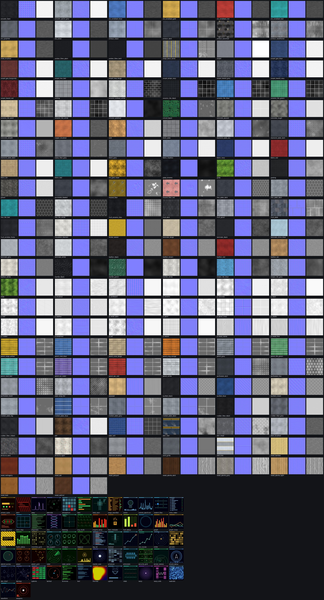

# Textures

(`docs/screenshots/texture_atlas.jpg`: every surface set as albedo tiled 2x2 | normal | roughness, then every screen texture; regenerate with `python tools/quality/texture_atlas.py`.)

## What there is

| | count | where | made by |
|---|---|---|---|
| PBR surface sets (`<name>_albedo/_normal/_orm.png`) | 11 original + **135 new** | `godot/textures/surfaces` (+ `index.json`) | `blender/starship/textures.py`, `textures_arch.py`, **`textures_ext.py`** (+ `textures_lib.py`) |
| screen textures (256x256 emissive UI) | 21 original + **41 new** | `godot/textures/screens` | `textures.py` + **`textures_screens.py`** |
| decals / signage (RGBA 256x128) | **14** (door plates, stencils, hazard labels, chevrons) | `godot/textures/decals` | **`textures_decals.py`** (not used by the game yet, ready for `Decal` nodes / quads) |

ORM convention (same as `materials.gd`): R occlusion, G roughness, B metallic. Sizes: 512 px (1024 for the three `armour_*` hero sets, 256 for fine / uniform ones). All new surface PNGs are 8-bit, written by bpy with maximum PNG compression: the new sets are ~27 MB, the whole `surfaces/` folder 34 MB.

Surface catalogue (`tile_m`, the real size of one repeat, is in `surfaces/index.json` and read by `ShipMaterials.tile_of`):

- **carpet** (8): `carpet_geo_blue`, `carpet_geo_burgundy`, `carpet_hex_teal`, `carpet_loop_beige`, `carpet_stripe_navy`, `carpet_tweed_grey`, `carpet_tweed_navy`, `carpet_tweed_red`
- **composite** (3): `carbon_fibre_plain`, `carbon_fibre_twill`, `kevlar_weave`
- **fabric** (6): `fabric_grey`, `fabric_heather`, `fabric_navy`, `fabric_red`, `fabric_tan`, `fabric_teal`
- **floor** (8): `cargo_deck_lanes`, `cork`, `epoxy_floor_grey`, `hazard_floor`, `hazard_floor_red`, `rubber_floor_black`, `rubber_floor_grey`, `rubber_floor_ribbed`
- **hull** (5): `armour_clean`, `armour_dark`, `armour_scorched`, `armour_weathered`, `hull_ceramic_tiles`
- **insulation** (3): `foil_gold_mylar`, `insulation_blanket`, `pipe_wrap_foil`
- **laminate** (5): `laminate_beige`, `laminate_black`, `laminate_clinic_blue`, `laminate_grey`, `laminate_white`
- **leather** (5): `leather_black`, `leather_brown`, `leather_red`, `leather_tan`, `leather_white`
- **legacy** (11): `carpet`, `ceiling`, `deck_plate`, `grating`, `hull_dark`, `hull_panel`, `hull_plate`, `hull_window_frame`, `stair_riser`, `stair_tread`, `wall_trim`
- **metal** (12): `alu_anodised_blue`, `alu_anodised_gold`, `alu_anodised_red`, `alu_anodised_teal`, `alu_graphite`, `alu_silver`, `brass_brushed`, `chrome_polished`, `copper_brushed`, `gunmetal_blasted`, `steel_brushed`, `titanium_brushed`
- **organic** (4): `grass`, `gravel`, `moss`, `soil`
- **padded** (5): `acoustic_foam`, `acoustic_panel_grey`, `quilted_black`, `quilted_blue`, `quilted_cream`
- **panel** (10): `panel_cargo_yellow`, `panel_cmd_blue`, `panel_crew_beige`, `panel_eng_orange`, `panel_grey`, `panel_life_green`, `panel_med_teal`, `panel_sci_violet`, `panel_sec_red`, `panel_white`
- **plate** (13): `diamond_plate_alu`, `diamond_plate_dark`, `diamond_plate_steel`, `hex_plate_dark`, `hex_plate_steel`, `perforated_dark`, `perforated_hex`, `perforated_mesh`, `riveted_plate_big`, `riveted_plate_blue`, `riveted_plate_grey`, `riveted_plate_steel`, `vent_grille`
- **prop** (17): `p_brushed`, `p_cardboard`, `p_ceramic`, `p_concrete`, `p_foam`, `p_leaf`, `p_leather`, `p_metal_satin`, `p_paint`, `p_panel_lines`, `p_plastic`, `p_rubber`, `p_scratched`, `p_soil`, `p_weave`, `p_wood_coarse`, `p_wood_fine`
- **stone** (8): `concrete_poured`, `concrete_rough`, `concrete_smooth`, `marble_black`, `marble_green`, `marble_white`, `terrazzo_dark`, `terrazzo_light`
- **tech** (3): `circuit_board`, `glass_ceramic`, `solar_cell`
- **tile** (10): `ceramic_subway_white`, `ceramic_tile_black`, `ceramic_tile_blue`, `ceramic_tile_green`, `ceramic_tile_sand`, `ceramic_tile_white`, `hex_tile_teal`, `hex_tile_white`, `mosaic_tile_blue`, `mosaic_tile_grey`
- **wood** (10): `plywood`, `wood_bamboo`, `wood_mahogany`, `wood_oak`, `wood_parquet`, `wood_planks_dark`, `wood_planks_grey`, `wood_planks_light`, `wood_teak`, `wood_walnut`

`p_*` are **neutral prop sets**: near-white, tint-friendly albedo and an ORM roughness that is a *relative* modulation (mean ~0.9) so they can sit on top of the flat colours baked into the prop GLBs.

## How they are generated

* `python blender/build_all.py --out godot --textures` regenerates everything (screens, surfaces, decals, sky, arch textures); `--textures --only <regex>` regenerates only the extended surfaces whose name matches. `build_all.py` without flags also generates whatever `missing_textures()` reports missing. `--check` still needs no bpy.
* Everything is deterministic (fixed seeds, numpy FFT noise, no clock input). About 3.5 min for all textures on a loaded 4-core machine (the extended sets are fanned out over a process pool).
* numpy builds the maps (tileable by construction: FFT noise, integer-period patterns, wrapped Voronoi / hex lattices). bpy is used for what it is best at here: image datablocks, colour management (albedo is stored as sRGB, normal / ORM as Non-Color) and the PNG encoder (`Image.save_render`, 8 bit, compression 100). Node based Cycles / EEVEE baking was **not** used: noise baked from Blender nodes is not tileable without extra stitching, and the numpy generators are faster and deterministic.

## Tiling and flicker analysis

### What was wrong
1. **No mipmaps at all.** The texture importer's default is `mipmaps/generate=false` (checked in the generated `*.png.import`; "Detect 3D" only re-imports when a texture is used inside the *editor*). Every surface texture was sampled without a mip chain, so anything minified shimmered. The `.import` files are ignored by version control, so this cannot be fixed per file.
2. Anisotropic filtering was only the project default (4x) and the roughness limiter was implicit.
3. The generators emitted 1-2 px high-contrast detail (the perforated ceiling, hard seams, bolts), steep normal maps and unfiltered ORM roughness (specular aliasing).

### What was changed
* `godot/project.godot`: `[importer_defaults] texture={"mipmaps/generate": true}` (applies to every texture a fresh clone / CI imports - **existing local checkouts keep their old `.import` files: run `find godot/textures -name "*.png.import" -delete && godot --headless --path godot --import` once**), `rendering/textures/default_filters/anisotropic_filtering_level=4` (16x), `screen_space_roughness_limiter` enabled (amount 0.4, limit 0.18).
* `materials.gd`: `normal_scale` 0.7, trilinear + anisotropic, `uv1_triplanar_sharpness` 4, auto tile size from `index.json`.
* Generators (`textures_lib.py`): noise is band-limited (spectrum cut at 0.2 cycle/px), pattern masks come from distance fields with >= 1.5 px soft edges, `finish()` low-passes height (1.1 px), roughness (1.5 px) and albedo (0.8 px), caps the slope of the normal map, and bakes the local normal variance into roughness (Toksvig). The 11 original sets are run through `prefilter_existing()` (per-set strength; the perforated `ceiling` gets the strongest).
* Tried and rejected: **TAA** (`use_taa`) made the metric worse in a static view (jitter) and ghosts around moving doors; MSAA 4x lowers edge shimmer only slightly (0.344 -> 0.337 residual) at a real cost. FXAA stays.

### Measurement (`godot/tests/flicker_probe.gd`, `tools/quality/flicker_metric.py`, `flicker_heatmap.py`)
The probe renders a view 8 times with the camera yawed in 0.005 degree steps (HUD hidden, 960x540, llvmpipe) and reports the mean per-pixel temporal std of luminance (0..255 scale); `resid` removes the per-pixel linear trend, so genuine sub-pixel motion cancels and what remains is shimmer. Two modes:

**Texture-only corridor** (`--mode=tex`: a 4 m x 3 m x 80 m corridor, all four surfaces one texture, mean over textures):

| configuration | resid | p95 | pixels with resid > 2 |
|---|---|---|---|
| original 8 textures, original project (no mips) | 0.264 | 1.15 | 2.50 % |
| same textures + mipmaps + 16x aniso (project settings only) | 0.205 | 0.84 | 1.49 % |
| same 8 textures band-limited (this change) | **0.105** | 0.27 | **0.24 %** |
| 20 of the new sets (shell + props, incl. the busiest: perforated, hex plate, carbon, leather, parquet) | 0.167 | 0.52 | 0.65 % |

Worst original: carpet 0.49, ceiling 0.39; worst new: perforated mesh 0.27, leather 0.26, parquet 0.25. The new-set row was measured just before a last albedo tweak of the white laminates / tile and tweed carpets (lower contrast only), so it was not re-measured.

**Whole ship** (4 rooms: bridge, mess, engineering, cargo): 0.344 before, 0.349 after (0.323 with mipmaps alone). That metric is dominated by *geometry* edges (chairs, rails, light fittings; FXAA only): the heat map (`flicker_heatmap.py`) shows the old dotted ceiling and the floor lighting up before and almost nothing but edges after. Geometry edge aliasing is outside the texture work; an MSAA / AA decision belongs to the renderer owner. The new rooms also contain more texture detail than the old flat ones, so the number is not expected to fall.

### Cost (bench, llvmpipe, `--bench`)
Draw calls 456 -> 456, primitives 56248 -> 56248 (CI guards: < 600 / < 150000). Video memory 237 -> ~500 MB (lossless textures with mip chains; VRAM compression would cut this ~4x but needs per-file normal-map flags, i.e. tracked `.import` files), load time on the software renderer +~8 s, frame time on llvmpipe 0.65 -> 1.03 s (CPU rasteriser; triplanar + 16x aniso are cheap on a GPU).

## Where they are used

**Shell** - `tools/layout/themes.py`: `ROOM_THEME` (exact room id, then prefix: `corF*`, `corA*`, `cabin*`, `lobby*`, `tower*`), `DEPT_THEME` for the rooms of future decks, `HULL_BY_DEPT` for the outer hull per department, `theme_for(room_id, dept)`. `generate_ship.py` must write `room["mats"] = theme_for(room["id"], room["dept"])` (until then `python tools/quality/apply_themes.py godot/data/ship.json` does it). `ship_builder.gd::_mat_for` reads `room.get("mats", {})` and falls back to the old look when absent: wall -> `wall`, floor -> `floor`, ceiling -> `ceiling`, `trim` -> `trim`, `frame` -> `accent_tex`, clad / roof / belly -> `clad`; `tint_wall` / `tint_floor` say how much of the room's pastel tint is multiplied over the texture.

| room | wall | floor | ceiling | trim | accent |
|---|---|---|---|---|---|
| bridge | panel_cmd_blue | carpet_geo_blue | ceiling | alu_anodised_blue | alu_graphite |
| ready | panel_grey | carpet_tweed_navy | ceiling | alu_silver | alu_graphite |
| conf | wood_oak | carpet_stripe_navy | acoustic_panel_grey | alu_silver | wood_walnut |
| comms | panel_cmd_blue | rubber_floor_black | perforated_dark | alu_anodised_blue | gunmetal_blasted |
| core | hex_plate_dark | hex_plate_steel | perforated_dark | alu_anodised_blue | titanium_brushed |
| lounge | wood_walnut | carpet_tweed_red | ceiling | wood_teak | brass_brushed |
| cabin | laminate_beige | carpet_tweed_grey | ceiling | wood_oak | alu_silver |
| capt | wood_mahogany | carpet_geo_burgundy | ceiling | brass_brushed | wood_walnut |
| galley | ceramic_subway_white | ceramic_tile_sand | laminate_white | steel_brushed | steel_brushed |
| mess | panel_crew_beige | wood_parquet | ceiling | wood_teak | alu_silver |
| rec | panel_crew_beige | rubber_floor_grey | acoustic_panel_grey | alu_anodised_red | alu_silver |
| dorm | laminate_beige | carpet_loop_beige | ceiling | wood_oak | alu_silver |
| astro | panel_sci_violet | carpet_hex_teal | ceiling | alu_anodised_teal | titanium_brushed |
| sci | laminate_white | ceramic_tile_white | laminate_white | alu_anodised_blue | alu_silver |
| medbay | laminate_clinic_blue | ceramic_tile_white | laminate_white | alu_anodised_teal | alu_silver |
| hydro | panel_life_green | ceramic_tile_green | laminate_white | alu_anodised_teal | steel_brushed |
| life | panel_life_green | diamond_plate_steel | insulation_blanket | steel_brushed | steel_brushed |
| armory | panel_sec_red | diamond_plate_dark | riveted_plate_grey | gunmetal_blasted | gunmetal_blasted |
| brig | concrete_smooth | epoxy_floor_grey | concrete_rough | steel_brushed | gunmetal_blasted |
| secoff | panel_grey | carpet_tweed_grey | ceiling | alu_anodised_red | alu_graphite |
| airlock | panel_sec_red | hazard_floor | riveted_plate_steel | steel_brushed | gunmetal_blasted |
| eng | panel_eng_orange | diamond_plate_steel | riveted_plate_grey | copper_brushed | steel_brushed |
| shop | panel_grey | diamond_plate_dark | perforated_mesh | steel_brushed | gunmetal_blasted |
| aux | panel_eng_orange | grating | riveted_plate_steel | copper_brushed | steel_brushed |
| cargo | panel_cargo_yellow | cargo_deck_lanes | riveted_plate_big | hazard_floor | steel_brushed |
| depot | concrete_poured | cargo_deck_lanes | riveted_plate_big | hazard_floor | steel_brushed |
| hangar | armour_clean | cargo_deck_lanes | riveted_plate_big | hazard_floor | armour_dark |
| corF | panel_white | rubber_floor_grey | ceiling | alu_anodised_blue | alu_silver |
| corA | panel_grey | rubber_floor_grey | ceiling | alu_anodised_blue | alu_graphite |
| lobby | panel_white | marble_white | ceiling | alu_silver | alu_anodised_gold |
| tower | concrete_smooth | diamond_plate_alu | ceiling | steel_brushed | alu_graphite |

**Props** - `godot/scripts/prop_materials.gd` (`PropMaterials`): called from `ship_builder._meshes_of` and `door.gd::setup`. Surfaces whose Blender material name is in `RULES` / `PREFIX_RULES` (wood_*, leather_*, fabric_*, steel*, brushed_alu, chrome, gunmetal, black_metal, hull_*, carbon, concrete, cardboard, foam, rubber, plastic_*, paint_*, ceramic, leaf, soil, copper, brass, gold_trim, many module-specific names, any metallic >= 0.6 material) get a cached StandardMaterial3D: original colour as tint, original metallic / roughness, neutral `p_*` texture, **object-space** triplanar UVs (MultiMesh needs no UVs), per-material tile size, mipmaps + aniso. Emissive, transparent / glass and `screen*` materials are skipped.

**Screens** - `blender/starship/screen_families.py` maps a generic screen name to a family of variants by CRC of (model id, name), applied in `kit.Model.quad` (so `screen()` and direct `"screen:x"` quads both get it); model ids, counts and catalogue sizes are unchanged. Models must be rebuilt (`build_all.py`) for the GLBs to pick the variants up.

## Tests and tools
`tests/test_textures.py` (files exist, square power-of-two sizes, counts, size budget, normals unit length and gentle, tileable, no NaN / black, ORM ranges, roughness band-limited, neutral sets tint friendly; pixel tests need numpy + pillow, which the CI python job now installs), `tests/test_themes.py` (every referenced kind has all three PNGs, every ship room has a theme, prefix / department fallback, screen families). Tools: `tools/quality/flicker_metric.py`, `flicker_heatmap.py`, `texture_atlas.py`, `apply_themes.py`.
